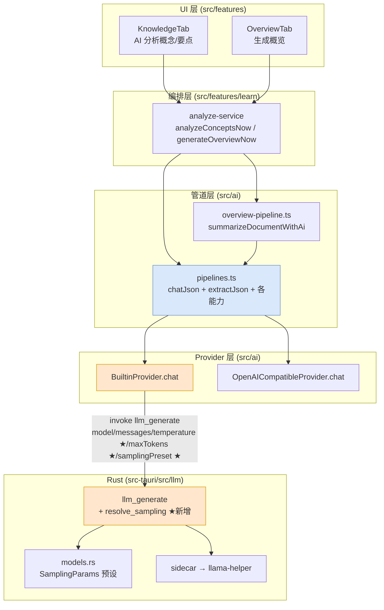
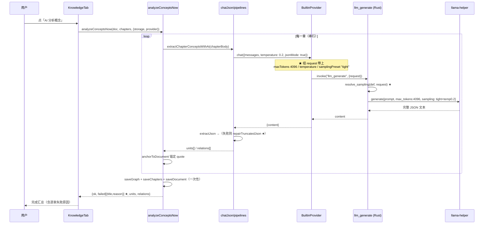

# AI 分析（概念/要点/概览）失败修复 技术方案

| 字段 | 内容 |
|------|------|
| 作者 | Agent（许一） |
| 日期 | 2026-09-11 |
| 状态 | **已实施（2026-09-11）**，落盘记录见 `docs/ai-analysis-summary-fix-runbook.md` |
| 关联需求 | 用户反馈：「AI 分析资料提取 summary 不成功」——点「AI 分析概念」后提示成功 0 章 / 失败 N 章，无任何原因；`KnowledgeUnit.summary` 一条未落库 |
| 关联文档 | `docs/library-import-extraction-audit-2026-09.md`、`docs/library-import-extraction-fix-runbook.md`、`docs/local-llm-loading-plan-2026-09.md` |
| 影响面 | **仅 `builtin` 本地模型档**；API 档（DeepSeek / Qwen / …）走另一条实现，不受本缺陷影响 |

---

## 0. 决策记录（2026-09-11 已确认）

| ID | 决策点 | 选项 | 结论 | 影响 |
|----|--------|------|------|------|
| **D1** | 修复覆盖层级 | 四层全修 / 分层两步走 / 仅最小修复 | ✅ **四层全修** | T1–T9 + T12 全部进入本轮；根因与可观测性一次修完 |
| **D2** | 是否给 API 档加 `response_format` | 白名单开启 / 暂不动 | ✅ **暂不动 API 档** | T10 移出本轮；`src/ai/openai-compatible.ts` **零改动**（§8.7 保留备查） |
| **D3** | 是否同步修「正文上限 vs 上下文窗口」（R3） | 同步下调 / 本次不动 | ✅ **本次不动** | T11 移出本轮；R3 记为已知风险，待本轮手工验证通过后单独开方案 |
| **D4** | 输出上限取值 | 4096 / 8192 / 保持 2048 | ✅ **4096**（Agent 建议，用户未反对） | `DEFAULT_MAX_TOKENS = 4096`（Rust）+ `BUILTIN_MAX_TOKENS = 4096`（TS） |

> **本轮范围一句话**：把「参数丢失 + 输出截断 + 解析零容错 + UI 不报原因」四层一次修完，**全部改动只落在 `builtin` 档与解析/UI 层**，API 档请求体一个字节不变，上下文窗口问题留作后续。

### 0.1 v1.2 事实复核（2026-09-11 11:55，方案基线变更）

实施前重新核对工作区，相比 v1.1 撰写时（11:15）有一处**关键环境变化**，方案据此更新：

| 复核项 | v1.1 时状态 | v1.2 现状 | 对方案的影响 |
|--------|-------------|-----------|--------------|
| 并行会话（G8/M-6） | `ai/builtin.ts`、`types.ts` 等 4 文件**正在被写**（mtime 11:15） | **已提交完毕**：`9cacc80 refactor(ai)` + `4b6332b fix(import)`；工作树仅剩本方案文档未跟踪 | ✅ **R1 冲突解除**，T0 关闭；T3/T5 可直接实施 |
| `extractKnowledge` 空壳 | 5 处定义仍在 | **已彻底删除**（仅剩 2 处注释说明，`builtin.ts:13`、`types.ts:105`） | ✅ 非目标④自动达成；R7 关闭 |
| 根因链六条证据 | 成立 | **逐条复现，全部成立**（行号已按 HEAD 校准，见 §1.2） | 修复方案主体不变 |
| `openai-compatible.ts` | — | `9cacc80` 已改过该文件（删空实现），但**该改动已入库** | ⚠️ TC-UC03-02 的 `git diff` 判据须改为**相对基点 commit** 比对，见 §12 |
| 提交基线 | 工作区挂 20+ 未提交改动 | HEAD = `4b6332b`，ahead origin/main **2**；工作树干净 | 提交隔离压力显著下降，仍按 `rules/commit-conventions` 按路径提交 |

---

## 1. 背景

### 1.1 现象

在桌面端使用**内置本地模型**（`builtin`，Qwen3.5-4B）对资料做「AI 分析」时：

- 「AI 分析概念」（产物即 `KnowledgeUnit.summary` + 关系）→ 逐章全失败，UI 只显示「概念分析完成：成功 0 章 · 失败 N 章」，**无原因**；
- 「AI 分析要点」「生成概览」同样可能失败；
- 同一份资料换 API 档（如 DeepSeek）重跑，**可以成功**。

### 1.2 触发原因（根因，已用代码证据锁定）

本地模型这条链路的**生成参数在 JS → Rust 边界整段丢失**：管道层精心设置的低温度与输出长度全部没传下去，Rust 侧用「讲解/问答」的采样参数跑「严格 JSON」的活，模型输出在 2048 token 被硬截断，随后被零容错解析层判死。

**证据链**

| # | 位置 | 事实 |
|---|------|------|
| ① | `src/ai/builtin.ts:120-133`（request 构造在 `:122-125`） | `BuiltinProvider.chat()` 构造的 request 只有 `{ model, messages }`——**`input.temperature` 从未进入 request**。管道传的 0.1 / 0.2 / 0.3 全部作废 |
| ② | `src/ai/builtin.ts:27-31`（`maxTokens?` 在 `:30`） | `LlmGenerateRequest.maxTokens` 已声明，但全仓 `grep` **零调用方** |
| ③ | `src-tauri/src/llm/commands.rs:143` | `max_tokens: request.max_tokens.unwrap_or(2048)` → 因为 ②，**恒为 2048** |
| ④ | `src-tauri/src/llm/commands.rs:145-154` | `request_json` 的采样字段（`:146-153`）恒取 `def.sampling`；**四个模型档全部登记** `SamplingParams::qwen35_summary()`（`models.rs` 内 4 处，已核 `:116` 4B / `:129` 2B）→ temperature **0.5**、presence_penalty **0.3**、repeat_penalty 1.05 |
| ⑤ | `src-tauri/src/llm/models.rs:47-59` | `SamplingParams::tight_structured()`（temperature 0.1，注释原文「结构化输出(出题/评估/JSON)稳定性优先」）标着 `#[allow(dead_code)]`（`:47`）——**从未被任何代码调用** |
| ⑥ | `src-tauri/llama-helper/src/main.rs:44-62` + `:99-121` | helper 侧对 `temperature/top_k/top_p/presence_penalty/frequency_penalty/repeat_penalty/penalty_last_n` **全部支持可选覆盖**（结构为 `Option<..>`；清洗逻辑 `:107-121`，且 `temperature` 非有限值时 `max(0.0)` 走贪心）。也就是说：只要 Rust 命令层把这些字段传下去，helper 立刻生效——**不需要改 helper** |

### 1.3 为什么「偏偏卡在 summary」

概念抽取的每条 unit 是 `title + kind + summary + tags + quote`（提示词要求 summary ≤120 字、quote ≤200 字，`pipelines.ts:484-496`），一条约 150–250 token。提示词要求一章抽 **6–14 个**概念，14 条就 **2000+ token**——**正好在 2048 边界上断掉**，JSON 停在 `summary` 字段中途、花括号不闭合。

### 1.4 为什么「断了一定失败」

解析层没有任何兜底，且三处提示词各自的键名预期互不相同：

| 位置 | 行为 |
|------|------|
| `pipelines.ts:75-97` `extractJson` | 剥围栏 → 取首个 `[`/`{` 到**末个** `}`/`]` → `JSON.parse`。截断输出的「末个 `}`」往往落在嵌套对象上，`parse` 必抛 → 抛「AI 返回的 JSON 无法解析」 |
| `pipelines.ts:538-597` `parseConceptDrafts` | 全部不合规 → 抛「AI 概念抽取未返回任何合规概念」 |
| `overview-pipeline.ts:360-373` `parseChunkDigest` | **只认 `digest` 键**（`raw.digest`） |
| `overview-pipeline.ts:381-412` `parseOverviewDraft` | **只认 `gist` / `sections[].heading+detail`** |

### 1.5 为什么用户「只看到不成功、看不到原因」

`src/features/learn/detail/KnowledgeTab.tsx:119-121`（概念分析的 catch：`console.error` 在 `:120`、`setSummary` 在 `:121`）**只 `console.error`**，写进 UI 的 `summary` 只有 `{ok: 0, failed: 章节标题[]}`，**丢掉了 `e.message`**。对比同文件「要点分析」的 catch（`:88-94`，`extra: e.message` 在 `:93`）会把原因放进 `summary.extra` 并渲染出来。

更关键的是**数据其实一直都在**：`analyze-service` 的失败类型本就声明为 `{ chapterId; title; reason }[]`（`analyze-service.ts:59` 概念 / `:86` 要点），逐章采集时也已填充 reason（`:197-200` 概念 / `:284-287` 要点）。**是 UI 主动把它丢了**——成功路径只取 `f.title`（`:115` 概念 / `:80` 要点），渲染时也只输出 `title`（`KnowledgeTab.tsx:279-285`）。即：**修 UI 不需要动 service 一行**。

> 结论：这是**三个独立缺陷叠加**——参数丢失（根因）→ 输出截断（触发）→ 解析零容错（放大）→ UI 不报原因（遮蔽）。修任一层都能改变现象，但只有全部修完才算真修好。

---

## 2. 方案目标

| 类型 | 描述 |
|------|------|
| **主要目标** | ① `builtin` 档下「AI 分析概念 / 要点 / 概览」在正常长度资料上**逐章成功**（同资料 14/14）；② 生成参数（temperature / 输出上限）真实抵达推理进程；③ 万一仍失败，UI **必须显示具体原因** |
| **非目标** | ① 不做解析层「键名宽松匹配 / 同义词兜底」（会掩盖提示词不合规，违背 `P0-3 不伪造内容`）；② 不做知识图谱**双写统一**（Tauri 档 `saveGraph` 只落 localStorage、SQLite `knowledge_units` 零写入，属独立架构问题，见 §3.1 ⑤）；③ 不改 API 档（`openai-compatible`）的默认输出上限行为；④ ~~不动 `extractKnowledge` 双轨清理~~ → **已由并行会话完成**（`9cacc80`，全仓零残留，见 §0.1）；⑤ 不碰 OCR / docx / epub 等既有非目标 |
| **成功标准** | ① `npm run typecheck` → 0 error；② `cargo test --lib` 新增 `resolve_sampling` 单测全绿；③ `npm run test:ai`（新增）全绿，含「截断 JSON 可修复」「`chatJson` 透传 temperature / jsonMode」；④ `npm run test:library` 五组（58 例）不回退；⑤ 手工：builtin 档重跑同一资料，概念分析 14/14 章成功；⑥ 手工：人为让某章失败时，UI 显示该章**具体 reason** 而非「失败 N 章」 |

---

## 3. 项目现状

### 3.1 相关代码与模块

| # | 位置 | 现状 | 问题 |
|---|------|------|------|
| ① | `src/ai/types.ts:32-35` | `ChatMessage` / `ChatInput{temperature?}` / `ChatOutput` | `ChatInput` 无 `maxTokens`、无「期望结构化」语义位 |
| ② | `src/ai/builtin.ts:27-31, 120-133` | `LlmGenerateRequest{model,messages,maxTokens?}`；`chat()` 只传 model+messages | **temperature 丢弃**；`maxTokens` 零调用方 |
| ③ | `src/ai/openai-compatible.ts`（`chat()` 内 `:142`） | `chat()` 传 `temperature ?? 0.2`，无 `max_tokens`、无 `response_format` | API 档温度是通的（所以 API 档能成功） |
| ④ | `src/ai/pipelines.ts:40-58, 61, 75-97, 100-116` | `PIPELINE_LIMITS`（`conceptMaxTextChars=40_000`）；`TEMPERATURE = {refine:0.2, quiz:0.3, grade:0.1, concept:0.2, keyPoint:0.2}`；`extractJson` + `chatJson` | 温度对 builtin 无效；`extractJson` 无截断修复 |
| ⑤ | `src/storage/tauri.ts`（无 `saveGraph` override）→ `src/storage/local.ts` | 图谱恒落 localStorage；`saveKnowledgeUnits` 全仓**零业务调用方** | SQLite `knowledge_units` / `knowledge_relations` 永远空表 → 两套数据永久分叉（**本次不做**） |
| ⑥ | `src-tauri/src/llm/commands.rs:36-44, 140-155` | `GenerateRequest{model,messages,maxTokens?}`；`request_json` 恒取 `def.sampling` | 无 per-call 覆盖；兜底 2048 偏小 |
| ⑦ | `src-tauri/src/llm/models.rs:47-59, 61-73` | 两个预设：`tight_structured()`（dead_code）/ `qwen35_summary()` | 结构化预设已写好但未接线 |
| ⑧ | `src/features/learn/detail/KnowledgeTab.tsx:119-121, 279-285` | 概念分析 catch 丢 message；失败列表只渲染标题 | 用户看不到原因 |
| ⑨ | `src/features/learn/analyze-service.ts:159-212, 244-298` | `analyzeConceptsNow` 逐章串行、单章失败不阻断，`failed[].reason` 已采集（类型含 reason，见 `:59` / `:86`） | reason 数据已存在，只是 UI 不显示 |

### 3.2 相关文档与约定

- **已读**：`AGENTS.md`、`rules/{code-structure-and-dependencies,engineering-code-style,layer-import-boundaries,no-headless-browser-validation,react,rust}.mdc`、`skills/pre-task-technical-design/*`、`docs/library-import-extraction-audit-2026-09.md`、`docs/library-import-extraction-fix-runbook.md`、`docs/local-llm-loading-plan-2026-09.md`
- **必须遵守**：
  - 文件 ≤700 行（`pipelines.ts` 已 768 行，**不得再往里加逻辑**；新工具函数可放新文件或复用 `overview-pipeline` 先例）
  - 中文注释 + `import type` + 相对导入
  - UI 文案 i18n 双语成对（`messages/zh.ts` + `en.ts`）
  - **禁止主动起浏览器校验**（`rules/no-headless-browser-validation`）→ 验证只能靠 `typecheck` + node 单测 + `cargo test` + 手工自测
  - Tauri 命令契约改动遵循 `skills/tauri-ipc`（serde rename 镜像）

### 3.3 约束与依赖

- **模型档**：Qwen3.5-4B 默认档 `context_size = 32768`（`models.rs:113`）——输出上限与提示词长度共享同一窗口，见 §11.4 风险 R3。
- **helper 无需改动**：`llama-helper/src/main.rs:44-62` 已支持全部采样字段可选覆盖（`Option<..>`）。
- **✅ 并行会话冲突已解除**（v1.2 更新）：v1.1 撰写时（11:15）`src/ai/builtin.ts` / `types.ts` / `active.ts` / `registry.ts` 正被另一会话改写（`extractKnowledge` 空实现清理，G8/M-6）。**该工作已于 11:15 收尾并提交**（`9cacc80` refactor(ai) + `4b6332b` fix(import)），工作树现仅剩本方案文档未跟踪。→ 本方案 T3/T5 触及的文件**当前无人占用**，可直接实施。
- **提交基线**：HEAD = `4b6332b`，`git rev-list --count origin/main..HEAD` = **2**。工作树干净，提交压力小；仍按 `rules/commit-conventions` **按路径隔离**提交，**只落本地不 push**。

---

## 4. 技术架构

### 4.1 总体架构



**★ = 本次新增的透传字段。** 修复的本质是把「管道层已算好的参数」沿实线一路送到底，并给解析层加一层**仅限截断场景**的补救。

### 4.2 模块职责

| 模块/层级 | 职责 | 本次改动 |
|-----------|------|----------|
| `src/ai/types.ts` | Provider 契约 | `ChatInput` 增 `maxTokens?` / `jsonMode?` |
| `src/ai/builtin.ts` | 内置本地模型传输 | request 增 `temperature` / `samplingPreset`；`maxTokens` 默认 4096 |
| `src/ai/openai-compatible.ts` | HTTP Provider 传输 | （D2 采纳时）`jsonMode` → `response_format`，白名单 + 受限；**本轮 D2 为「暂不动」→ 零改动** |
| `src/ai/pipelines.ts` | JSON 管道 + 传输工具 | `chatJson` 传 `jsonMode`；`extractJson` 加截断修复 |
| `src/ai/json-repair.ts` | **新增**：截断 JSON 修复纯函数 | 保持 `pipelines.ts` 不超行数上限 |
| `src-tauri/src/llm/commands.rs` | 命令面 | `GenerateRequest` 增字段；抽出 `resolve_sampling()`；兜底 4096；加单测 |
| `src-tauri/src/llm/models.rs` | 采样预设 | 去掉 `tight_structured` 的 `#[allow(dead_code)]`（改用后即生效） |
| `src/features/learn/detail/KnowledgeTab.tsx` | 概念分析 UI | catch 带 reason；失败列表渲染 `title：reason` |
| `src/i18n/messages/{zh,en}.ts` | 文案 | 新增失败原因容器文案 |

### 4.3 数据模型与 API

#### 4.3.1 Tauri 命令契约（`llm_generate`）— 唯一新增/变更的跨语言契约

```jsonc
// 请求：invoke("llm_generate", { request })
{
  "model": "qwen3.5:4b",
  "messages": [{ "role": "system", "content": "…" }, { "role": "user", "content": "…" }],
  "maxTokens": 4096,            // 既有字段，本次开始真正被填写
  "temperature": 0.2,           // ★新增（可选）：覆盖模型预设温度
  "samplingPreset": "tight"     // ★新增（可选）："tight" → tight_structured() 全套预设
}
// 响应：Result<String, String> —— 成功为模型原始文本，失败为人类可读错误
```

**优先级规则（决定权在 Rust，唯一真源）**：

1. 基线 = `samplingPreset == "tight"` ? `tight_structured()` : `def.sampling`（`qwen35_summary()`）；
2. 若请求带 `temperature`（有限值）→ **覆盖基线温度**；
3. `maxTokens` 缺省 → `DEFAULT_MAX_TOKENS = 4096`。

> 之所以把优先级收敛进 Rust 的 `resolve_sampling()` 纯函数，而不是在 TS 侧拼全套采样：**TS 不需要知道 top_k / penalty 这些实现细节**，只表达「我要稳定的结构化输出」+「温度偏稳定」两个意图即可；同时该纯函数**可在无模型文件的情况下单测**（当前 `commands.rs` 零测试）。

#### 4.3.2 TypeScript 契约

```ts
// src/ai/types.ts
export interface ChatInput {
  messages: ChatMessage[];
  temperature?: number;
  /** 输出上限（token）。未给则由 Provider 决定默认值（builtin: 4096）。 */
  maxTokens?: number;
  /** 期望结构化（JSON）输出：Provider 可据此启用近贪心采样 / JSON 响应格式。 */
  jsonMode?: boolean;
}
```

```ts
// src/ai/builtin.ts
export const BUILTIN_MAX_TOKENS = 4096;

export interface LlmGenerateRequest {
  model: string;
  messages: { role: string; content: string }[];
  maxTokens?: number;
  /** ★ 覆盖模型预设温度 */
  temperature?: number;
  /** ★ "tight" = 近贪心结构化预设（JSON 场景） */
  samplingPreset?: "tight";
}
```

#### 4.3.3 数据读写（按 `rules/layer-import-boundaries.mdc`）

- **写入面不变**：仍为 UI → `analyze-service` → `StorageAdapter`（`saveGraph` / `saveChapters` / `saveDocument`）。本次**不新增任何持久化字段**、**不改任何 storage 适配层**。
- **桌面能力**：`invoke("llm_generate")` 仍**只在** `src/ai/builtin.ts` 内出现，UI 不直接 `invoke`。新增字段只是既有命令的参数扩展，`isTauri()` 守卫（`builtin.ts:104-107` `isConfigured()`）保持原样。
- **纯浏览器预览**：`BuiltinProvider.isConfigured()` 在非 Tauri 下返回 false → `chatJson` 先抛 `not-configured`（`pipelines.ts:105-110`），不会走到 invoke。契约扩展不改变该路径。

### 4.4 状态与副作用

- 无新增全局状态、无新增副作用时机；`analyzeConceptsNow` 的「逐章串行、单章失败不阻断、最后一次写库」语义**完全保留**。
- UI 侧唯一状态变化：`KnowledgeTab` 的 `summary.failed` 由 `string[]` 升级为 `{ title, reason }[]`，新增渲染分支。

---

## 5. 交互流程

### 5.1 主流程（修复后 · builtin 档）

1. 用户在资料详情页「关键知识点」Tab 点「AI 分析概念」；
2. `KnowledgeTab.extractAll` → `analyzeConceptsNow(doc, chapters, {storage, provider})`；
3. 逐章：`extractChapterConceptsWithAi` → `chatJson(provider, msgs, 0.2)`；
4. `chatJson` 调 `provider.chat({ messages, temperature: 0.2, jsonMode: true })`；
5. `BuiltinProvider.chat` 组 request：`{ model, messages, maxTokens: 4096, temperature: 0.2, samplingPreset: "tight" }` → `invoke("llm_generate")`；
6. Rust `resolve_sampling()` → `tight_structured()` 打底、温度覆盖为 0.2 → `max_tokens 4096`，helper 推理；
7. 模型在 4096 预算内**完整输出** `{"units":[…14 条…],"relations":[…]} `；
8. `extractJson` 正常解析 → `parseConceptDrafts` 得 14 条 → 逐条 `anchorToDocument` 锚定 quote；
9. 单章成功 → `replaceChapterConcepts` 更新内存图 → 下一章；
10. 全章完成后一次性 `saveGraph` + `saveChapters` + `saveDocument`；
11. UI 显示「概念分析完成：14 章」+ 图谱统计（`已分析 14/14 章 · N 个概念 · M 条关系`）。

### 5.2 分支与异常流程

| 场景 | 触发条件 | 系统行为 | UI 反馈（修复后） |
|------|----------|----------|-------------------|
| AI 未配置 | `provider.isConfigured() === false` | `analyzeConceptsNow` 抛 `not-configured` | 「AI 分析概念」按钮禁用 + 「配置 AI 模型后可逐章分析概念」（现状保持） |
| 单章输出仍被截断 | 输出超 `max_tokens` | `extractJson` 先试原文解析；失败则走 **截断修复**：回退到最后一个完整 unit、补齐闭合符 → 仍能解析出前 N 条 | 该章计入成功，`N` 条概念入库（诚实降级：只保留完整条目，不编造缺失项） |
| 修复亦不可行（截断在第 1 条中间） | — | 抛 `request-failed`，message 含「疑似被输出长度截断」提示 | 该章计入 `failed`，**列表显示 `章标题：具体 reason`** |
| 整章正文超限 | `> conceptMaxTextChars` | 管道抛错（文案保留） | 同上 |
| 全部章失败 | — | 逐章 catch 后仍写库（图/章节不变），返回 `ok: 0` | 显示「成功 0 章 · 失败 N 章」+ **每章 reason** + 顶部总原因 |
| 概念全被过滤 | AI 返回 0 条合规概念 | 抛「未返回任何合规概念」 | 同上 |

### 5.3 时序图



---

## 6. 用户用例（User Cases）

### UC-01：builtin 档下成功分析概念（主路径）

| 项 | 内容 |
|----|------|
| 角色 | 学习者（本地模型使用者） |
| 前置条件 | 桌面端（Tauri）；已在设置中启用 `builtin` 模型 `qwen3.5:4b` 且模型已下载就绪；资料已导入并切分（≥1 章，章正文 ≤ 40k 字） |
| 主流程步骤 | 1. 打开资料详情 → 「关键知识点」Tab 2. 点「AI 分析概念」3. 等待逐章进度 4. 查看完成汇总与图谱 |
| 期望结果 | 汇总显示 `成功 N 章`；图谱出现概念节点与关系；`chapters[].unitIds` 非空；每条带 quote 的概念在「资料内容」Tab 可跳转到原文 |
| 异常/边界 | 单章失败不阻断其它章；单章无 quote 的概念不写 `evidence`（既有语义保持） |

### UC-02：失败时能看到具体原因（可观测性）

| 项 | 内容 |
|----|------|
| 角色 | 学习者 / 排障者 |
| 前置条件 | 同 UC-01，但刻意构造失败（如把某章正文替换成超长无意义文本，或临时把 `max_tokens` 压到 128 复现截断） |
| 主流程步骤 | 1. 点「AI 分析概念」2. 等待结束 3. 查看失败汇总区 |
| 期望结果 | ① 顶部出现**总体原因**（如「AI 返回的 JSON 无法解析（疑似被输出长度截断）…」）；② 失败列表逐条显示 `章标题：具体 reason`，而非只有标题 |
| 异常/边界 | `failed` 为空时不渲染该区块（不出现空列表） |

### UC-03：API 档行为不回退（回归守门）

| 项 | 内容 |
|----|------|
| 角色 | 使用云端 API 的用户 |
| 前置条件 | 已配置 `deepseek`（或 `qwen`）且 `providerReady === true` |
| 主流程步骤 | 1. 对同一资料点「AI 分析概念」2. 观察结果 |
| 期望结果 | 与修复前**一致**（仍然成功）；若 D2 采纳，请求体新增 `response_format`，端点不报 400；本轮 D2 为「暂不动」→ 请求体**完全不变** |
| 异常/边界 | `custom` 类型端点必须在 `response_format` 白名单之外（避免未知字段 400） |

### UC-04：截断 JSON 被抢救（诚实降级）

| 项 | 内容 |
|----|------|
| 角色 | 系统（非用户直接操作） |
| 前置条件 | 单测构造：`{"units":[{"title":"A","kind":"concept","summary":"…"},{"title":"B","kind":"con…` （第 2 条被截断） |
| 主流程步骤 | 调 `extractJson` |
| 期望结果 | 返回 `{units:[{title:"A", …}]}`（只保留第 1 条完整元素），**不抛错**；若截断发生在第 1 条中间 → 返回 `{units:[]}`，由 `parseConceptDrafts` 抛「未返回任何合规概念」 |
| 异常/边界 | 修复后仍不是合法 JSON（如缺引号）→ 仍抛 `request-failed`，绝不返回半成品对象 |

---

## 7. 线框 UI（Wireframe）

### 7.1 「关键知识点」Tab — 完成汇总区（改动点）

**改动前**（`KnowledgeTab.tsx:272-287`）

```
┌──────────────────────────────────────────────────┐
│ 概念分析完成：成功 0 章 · 失败 3 章               │  ← 只有数字，没有原因
│ • 第 1 章 向量检索基础                            │  ← 只有标题
│ • 第 2 章 混合检索与融合                          │
│ • 第 3 章 重排序                                  │
└──────────────────────────────────────────────────┘
```

**改动后**

```
┌──────────────────────────────────────────────────┐
│ 概念分析完成：成功 0 章 · 失败 3 章               │
│ AI 返回的 JSON 无法解析（疑似被输出长度截断）：   │  ← ★ 总体原因（e.message）
│   {"units":[{"title":"向量化","kind":"concept","… │
│ • 第 1 章 向量检索基础：AI 概念抽取未返回任何合   │  ← ★ 逐章 reason
│   规概念。                                        │
│ • 第 2 章 混合检索与融合：本章正文过长（41,203    │
│   字，上限 40000）…                              │
│ • 第 3 章 重排序：所有分块归纳均失败…             │
└──────────────────────────────────────────────────┘
```

- 布局：沿用既有 `rounded-lg border border-line bg-surface p-3` 容器，不引入新组件、新 token。
- 组件映射：容器 = 原生 `div`（现状）；列表 = `ul/li`（现状）；原因文本 = `text-xs text-ink-3`（现状）。
- 错误原文为**诊断信息**，按既有先例（`KnowledgeTab.tsx:88-94` 要点路径、`OverviewTab.tsx:113,181-188` 概览路径）直出，**不套 i18n**；仅「逐章条目」的拼接模板走 i18n。

### 7.2 其他状态

```
【加载中】  ▸ 现状保持：下方「正在分析 i/n · 章标题」单行提示
【成功】    ▸ 「概念分析完成：14 章」（failed === 0 时不渲染失败列表）
【空数据】  ▸ 现状保持：虚线空态卡「还没有概念 / 点「AI 分析概念」…」
【未配置 AI】▸ 现状保持：按钮禁用 + 「配置 AI 模型后可逐章分析概念」+ 去设置链接
【错误】    ▸ §7.1 改动后形态：总体原因 + 逐章原因
```

### 7.3 交互说明

- 本次**不新增**任何可交互控件、弹层、Toast；失败信息为静态文本块。
- `aria-live`：`OverviewTab` 已有（`:176-188`）；`KnowledgeTab` 的进度/汇总块**本次不加**（与既有实现保持一致，避免顺带扩大改动面）。

---

## 8. 涉及文件及改动伪代码

### 8.1 `src-tauri/src/llm/commands.rs`（修改）★核心

**改动说明**：`GenerateRequest` 增 `temperature` / `samplingPreset`；抽出**纯函数** `resolve_sampling()` 作为采样唯一真源；`max_tokens` 兜底提升为 4096；补 `#[cfg(test)]` 单测（该文件当前零测试）。

```rust
/// 输出上限兜底（原 2048 —— 概念抽取 JSON 常在 2048 边界被截断）。
const DEFAULT_MAX_TOKENS: i32 = 4096;

#[derive(Debug, Deserialize)]
pub struct GenerateRequest {
    #[serde(rename = "model")]
    pub model: String,
    #[serde(rename = "messages")]
    pub messages: Vec<JsonChatMessage>,
    #[serde(rename = "maxTokens")]
    pub max_tokens: Option<i32>,
    /// ★ 覆盖模型预设温度（结构化调用传 0.1~0.3）。
    #[serde(rename = "temperature")]
    pub temperature: Option<f32>,
    /// ★ "tight" → 采用 `SamplingParams::tight_structured()` 全套预设。
    #[serde(rename = "samplingPreset")]
    pub sampling_preset: Option<String>,
}

/// 纯函数：按请求解析出本次生成实际使用的采样参数。
/// 优先级：预设基线 → 请求温度覆盖。可脱离模型文件单测。
pub fn resolve_sampling(def: &ModelDef, request: &GenerateRequest) -> SamplingParams {
    let mut sampling = match request.sampling_preset.as_deref() {
        Some("tight") => SamplingParams::tight_structured(),
        _ => def.sampling.clone(),
    };
    if let Some(t) = request.temperature {
        if t.is_finite() {
            sampling.temperature = t.max(0.0);   // 与 helper 侧清洗口径一致
        }
    }
    sampling
}

#[tauri::command]
pub async fn llm_generate(
    state: State<'_, LlmState>,
    request: GenerateRequest,
) -> Result<String, String> {
    // …省略 1~2 步（校验模型 / 消息 → prompt，均不变）…

    let sampling = resolve_sampling(&def, &request);   // ★
    let request_json = json!({
        "type": "generate",
        "prompt": prompt,
        "max_tokens": request.max_tokens.unwrap_or(DEFAULT_MAX_TOKENS),   // ★ 2048 → 4096
        "context_size": def.context_size,
        "model_path": model_path_str,
        "temperature": sampling.temperature,
        "top_k": sampling.top_k,
        "top_p": sampling.top_p,
        "presence_penalty": sampling.presence_penalty,
        "frequency_penalty": sampling.frequency_penalty,
        "repeat_penalty": sampling.repeat_penalty,
        "penalty_last_n": sampling.penalty_last_n,
        "stop_tokens": &sampling.stop_tokens,
    })
    .to_string();

    state.sidecar.generate(request_json).await.map_err(|e| e.to_string())
}

#[cfg(test)]
mod tests {
    use super::*;
    use crate::llm::models::get_default_model;

    fn req(temperature: Option<f32>, preset: Option<&str>, max_tokens: Option<i32>) -> GenerateRequest {
        GenerateRequest {
            model: "qwen3.5:4b".into(),
            messages: vec![],
            max_tokens,
            temperature,
            sampling_preset: preset.map(|s| s.to_string()),
        }
    }

    #[test]
    fn default_uses_model_preset() {
        let def = get_default_model();
        let s = resolve_sampling(&def, &req(None, None, None));
        assert_eq!(s.temperature, def.sampling.temperature);   // 0.5
        assert_eq!(s.presence_penalty, 0.3);
    }

    #[test]
    fn tight_preset_drops_penalties() {
        let def = get_default_model();
        let s = resolve_sampling(&def, &req(None, Some("tight"), None));
        assert_eq!(s.temperature, 0.1);
        assert_eq!(s.presence_penalty, 0.0);
        assert_eq!(s.repeat_penalty, 1.0);
        assert_eq!(s.penalty_last_n, 0);
    }

    #[test]
    fn explicit_temperature_overrides_preset() {
        let def = get_default_model();
        let s = resolve_sampling(&def, &req(Some(0.2), Some("tight"), None));
        assert!((s.temperature - 0.2).abs() < f32::EPSILON);
        assert_eq!(s.presence_penalty, 0.0);   // 其余仍取 tight
    }

    #[test]
    fn unknown_preset_falls_back_to_model_default() {
        let def = get_default_model();
        let s = resolve_sampling(&def, &req(None, Some("nope"), None));
        assert_eq!(s.temperature, def.sampling.temperature);
    }
}
```

### 8.2 `src-tauri/src/llm/models.rs`（修改）

**改动说明**：`tight_structured()` 接线后不再是死代码 —— 移除 `#[allow(dead_code)]`；同步核对注释（原文「现默认使用 qwen35_summary」需改为「JSON 管道经 `resolve_sampling` 选用」）。**不新增预设**（避免一次引入两套未验证的参数）。

```rust
impl SamplingParams {
    /// 近贪心预设：结构化输出(出题/评估/JSON)稳定性优先。
    /// 由 `commands::resolve_sampling` 在 `samplingPreset == "tight"` 时选用。
    pub fn tight_structured() -> Self { /* 原样保留 */ }
    // 原 `#[allow(dead_code)]` 删除
}
```

### 8.3 `src/ai/types.ts`（修改）

**改动说明**：`ChatInput` 增两个**可选**字段（向后兼容，所有既有调用点无需改）。

```ts
export interface ChatInput {
  messages: ChatMessage[];
  temperature?: number;
  /** 输出上限（token）；未给则由 Provider 决定默认值（builtin: 4096）。 */
  maxTokens?: number;
  /**
   * 期望结构化（JSON）输出。
   * - builtin：映射为近贪心采样预设（`samplingPreset: "tight"`）；
   * - HTTP provider：可映射为 `response_format: { type: "json_object" }`（白名单内）。
   */
  jsonMode?: boolean;
}
```

### 8.4 `src/ai/builtin.ts`（修改）★核心

**改动说明**：`LlmGenerateRequest` 增字段；`chat()` 真正透传温度、结构化意图与输出上限。**该文件当前无人占用**（并行会话已收尾，见 §0.1）。

```ts
/** 本地模型结构化调用的默认输出上限（原 Rust 兜底 2048 会在概念抽取 JSON 中途截断）。 */
export const BUILTIN_MAX_TOKENS = 4096;

export interface LlmGenerateRequest {
  model: string;
  messages: { role: string; content: string }[];
  maxTokens?: number;
  /** ★ 覆盖模型预设温度。 */
  temperature?: number;
  /** ★ "tight" = 近贪心结构化预设。 */
  samplingPreset?: "tight";
}

async chat(input: ChatInput): Promise<ChatOutput> {
  this.requireDesktop();
  const request: LlmGenerateRequest = {
    model: this.model,
    messages: input.messages.map((m) => ({ role: m.role, content: m.content })),
    maxTokens: input.maxTokens ?? BUILTIN_MAX_TOKENS,
    ...(input.temperature !== undefined ? { temperature: input.temperature } : {}),
    ...(input.jsonMode ? { samplingPreset: "tight" as const } : {}),
  };
  try {
    const content = await invoke<string>("llm_generate", { request });
    return { content };
  } catch (err) {
    const message = err instanceof Error ? err.message : String(err);
    throw new AiProviderError("request-failed", message);
  }
}
```

### 8.5 `src/ai/json-repair.ts`（**新增**）

**改动说明**：截断 JSON 修复的纯函数，独立成文件（`pipelines.ts` 已 768 行，超 700 行硬上限，不得再堆逻辑；沿用 `overview-pipeline.ts` 的先例 —— 新能力自持，只复用既有工具）。

```ts
/**
 * 截断 JSON 抢救（仅用于「模型输出被 max_tokens 截断」这一场景）。
 *
 * 为什么不放在 pipelines.ts：该文件已 768 行，超出仓库 ≤700 行硬上限。
 * 本模块零依赖、纯函数、可 node 直测。
 *
 * 策略：单次扫描（跟踪字符串 / 转义状态 + 括号栈），记录「最后一个安全的
 * 元素边界」（栈内刚消费完一个完整 `}` / `]` 的位置）。在无法闭合时回退到
 * 该边界并补齐闭合符 —— 只保留**完整**元素，绝不补齐半个字段。
 *
 * @returns 修复后的 JSON 文本；无法安全修复时返回 undefined（调用方保持抛错）
 */
export function repairTruncatedJson(input: string): string | undefined {
  // 伪代码
  // let depthStack: ("{"|"[")[] = []; let inString = false; let escaped = false;
  // let lastSafeEnd = -1; let lastSafeStack: string[] | null = null;
  // for (i in input) {
  //   处理转义 / 字符串开关
  //   遇 '{' / '[' → 入栈
  //   遇 '}' / ']' → 出栈；若出栈后「栈非空 且 上一个非空白字符是闭合符」→ 记 lastSafeEnd=i+1, lastSafeStack=[...stack]
  //   遇 ',' （栈深 ≥1 且 前一非空白为闭合符）→ 同样是安全点
  // }
  // if (栈已空) return undefined;                 // 本来就合法 → 交给 JSON.parse
  // if (lastSafeStack === null) return `${input.slice(0,0)}…` 不可修复 → undefined
  // 截到 lastSafeEnd，去掉尾随逗号，按 lastSafeStack 逆序补 '}' / ']'
}
```

### 8.6 `src/ai/pipelines.ts`（修改）

**改动说明**：`chatJson` 声明结构化意图（这两行是本方案的**根因修复落点**）；`extractJson` 解析失败时追加一次截断修复；错误文案补充「截断」判断以便排障。导出面**不变**。

```ts
import { repairTruncatedJson } from "./json-repair";

export function extractJson(content: string): unknown {
  const stripped = /* 原样 */;
  const open = stripped.search(/[\[{]/);
  const close = Math.max(stripped.lastIndexOf("}"), stripped.lastIndexOf("]"));
  if (open === -1 || close <= open) {
    throw new AiProviderError("request-failed",
      `AI 返回内容中未找到 JSON：${stripped.slice(0, 120) || "(空)"}`);
  }
  const slice = stripped.slice(open, close + 1);
  try {
    return JSON.parse(slice) as unknown;
  } catch {
    // ★ 新增：输出被 max_tokens 截断是本地小模型的常见失败模式 → 抢救完整前缀
    const repaired = repairTruncatedJson(slice);
    if (repaired !== undefined) {
      try {
        return JSON.parse(repaired) as unknown;
      } catch { /* 修复后仍不合法 → 走统一抛错 */ }
    }
    throw new AiProviderError(
      "request-failed",
      `AI 返回的 JSON 无法解析（可能是输出被长度截断）：${slice.slice(0, 160)}…`,
    );
  }
}

export async function chatJson(
  provider: AIProvider,
  messages: ChatMessage[],
  temperature: number,
): Promise<unknown> {
  if (!provider.isConfigured()) {
    throw new AiProviderError("not-configured",
      "AI 未就绪：请到「设置 → AI 模型中心」配置本地模型或 API。");
  }
  // ★ 关键修复：temperature 此前对 builtin 档被静默丢弃；jsonMode 声明结构化意图
  const { content } = await provider.chat({ messages, temperature, jsonMode: true });
  if (!content) throw new AiProviderError("request-failed", "AI 返回了空内容。");
  return extractJson(content);
}
```

> **注意**：`chatJson` **不**传 `maxTokens`。理由：让输出上限由各 Provider 自己决定 —— `builtin` 用 4096 默认值，HTTP provider 保持「不设上限」（现状），从而把改动爆炸半径压到最小（见 §11.4 R2）。

### 8.7 `src/ai/openai-compatible.ts`（**本轮不改** · 条件性章节，取决于决策 D2）

**改动说明**：本轮决策 **D2 = 暂不动 API 档** → 本文件**零改动**，本节仅作后续单独开方案时的备查设计。若他轮采纳 D2 的「白名单开启」分支，则 `jsonMode` → `response_format`，**白名单**限定为确定支持的 OpenAI 兼容云厂商；`custom` / 本地三兄弟（ollama / llama.cpp / lmstudio）**排除**，避免未知字段被拒。

```ts
/** 支持 `response_format: { type: "json_object" }` 的云厂商（保守白名单）。 */
const JSON_MODE_KINDS: ReadonlySet<ProviderKind> = new Set([
  "openai", "deepseek", "qwen", "glm", "kimi",
]);

async chat(input: ChatInput): Promise<ChatOutput> {
  // …校验与 headers 不变…
  const body: Record<string, unknown> = {
    model: this.model,
    messages: input.messages,
    temperature: input.temperature ?? 0.2,
  };
  if (input.jsonMode && JSON_MODE_KINDS.has(this.kind)) {
    body.response_format = { type: "json_object" };
  }
  const res = await fetch(`${this.baseUrl}/chat/completions`, { method: "POST", headers, body: JSON.stringify(body) });
  // …其余不变…
}
```

### 8.8 `src/features/learn/detail/KnowledgeTab.tsx`（修改）

**改动说明**：概念分析 catch 带上 `e.message`；失败列表渲染 `标题：原因`。**仅改数据形状与两处渲染**，不动分析编排、不动按钮禁用逻辑、不动 `analyze-service`（reason 早已采集，见 §1.5）。

```tsx
// 失败项：对齐 analyze-service 的 { chapterId, title, reason }（此处不保留 chapterId）
type FailedItem = { title: string; reason: string };

// 状态形状升级（原为 failed: string[]）
const [summary, setSummary] = useState<{ ok: number; failed: FailedItem[]; extra?: string }>();

/** 两路径共用：service 已采集 reason，此前被 UI 丢弃（原 :80 要点 / :115 概念）。 */
const toFailedItems = (failed: AnalyzeConceptsResult["failed"]): FailedItem[] =>
  failed.map((f) => ({ title: f.title, reason: f.reason }));

const extractAll = async () => {
  // …前置不变（:101-106）…
  try {
    const result = await analyzeConceptsNow(doc, chapters, { storage, provider, onProgress: … });
    setSummary({ ok: result.ok, failed: toFailedItems(result.failed) });        // ★ 原 :113-116
    // …
  } catch (e) {
    // ★ 原实现（:119-121）只 console.error → 用户只看到「失败 N 章」却不知为何
    setSummary({
      ok: 0,
      failed: chapters.map((c) => ({ title: c.title, reason: t.learn.detail.knowledge.failedUnknown })),
      extra: e instanceof Error ? e.message : String(e),
    });
  } finally { … }
};

// 渲染（失败列表；原 :279-285 只输出 title）
{summary.failed.length > 0 && (
  <ul className="mt-2 space-y-1 text-xs text-ink-3">
    {summary.failed.map((f, i) => (
      <li key={i}>• {t.learn.detail.knowledge.failedItem(f.title, f.reason)}</li>
    ))}
  </ul>
)}
```

**要点分析路径（`analyzePoints`）同步**：成功分支改 `failed.map(...)`（原 `:80`）、catch（`:88-94`）**保留**其 `extra: e.message`，只把 `failed` 换成 `FailedItem[]` —— 两处共用同一个 `FailedItem` 类型与同一组文案键，避免为两条路径各建一套 i18n 键（v1.2 调整，见 §8.9）。

### 8.9 `src/i18n/messages/zh.ts` + `en.ts`（修改）

**改动说明**：`learn.detail.knowledge` 段新增 2 个键，**双语成对**，**概念 / 要点两条路径共用**（键名不带 `concept` 前缀，避免为要点另建一套）。

插入位置已核对：zh.ts `learn.detail.knowledge` 段为 `:793-815`（末键 `graphNoAi` 在 `:814`）；en.ts 对应段为 `:813-837`（末键 `graphNoAi` 在 `:836`）。**新键追加在各自 `graphNoAi` 之后**。

```ts
// zh.ts — learn.detail.knowledge（追加在 graphNoAi 之后）
failedItem: (title: string, reason: string) => `${title}：${reason}`,
failedUnknown: "分析失败（未返回原因）",

// en.ts — learn.detail.knowledge（追加在 graphNoAi 之后）
failedItem: (title: string, reason: string) => `${title}: ${reason}`,
failedUnknown: "Analysis failed (no reason returned)",
```

> 既有 `extractDone`（概念成功文案）/ `pointsDone`（要点成功文案）保持不动；本次只加**失败维度**的文案。

### 8.10 `package.json`（修改）

**改动说明**：新增 `test:ai` 脚本（沿用既有 node 直跑 `--experimental-strip-types` + loader 写法）。

```jsonc
"test:ai": "node --experimental-strip-types --no-warnings --import ./tests/register-loader.mjs tests/ai-pipeline.test.ts",
```

### 8.11 `tests/ai-pipeline.test.ts`（**新增**）

**改动说明**：覆盖两件事 —— ① 截断 JSON 可修复（含只在完整元素处回退）；② `chatJson` 把 `temperature` / `jsonMode` 真实传给 provider（**根因回归守门**：若有人再把 builtin 的温度丢弃、或把 `chatJson` 的 jsonMode 摘掉，本测立即红）。

```ts
import assert from "node:assert/strict";
import { test } from "node:test";
import { chatJson, extractJson } from "../src/ai/pipelines.ts";
import { repairTruncatedJson } from "../src/ai/json-repair.ts";
import type { AIProvider, ChatInput } from "../src/ai/types.ts";

/** 记录最后一次 ChatInput 的假 provider（不触网、不 invoke）。 */
function recordingProvider(): { provider: AIProvider; last: () => ChatInput | undefined } {
  let last: ChatInput | undefined;
  const provider: AIProvider = {
    kind: "builtin",
    isConfigured: () => true,
    chat: async (input) => { last = input; return { content: '{"ok":true}' }; },
    generateAssessment: () => Promise.reject(new Error("不应被调用")),
    evaluateAnswer: () => Promise.reject(new Error("不应被调用")),
  };
  return { provider, last: () => last };
}

test("chatJson 把 temperature/jsonMode 传给 provider（根因回归）", async () => {
  const { provider, last } = recordingProvider();
  await chatJson(provider, [{ role: "user", content: "x" }], 0.2);
  assert.equal(last()?.temperature, 0.2);
  assert.equal(last()?.jsonMode, true);
});

test("截断 JSON 只保留完整元素并补齐闭合符", () => {
  const truncated = '{"units":[{"title":"A","kind":"concept","summary":"sa"},{"title":"B","kin';
  const repaired = repairTruncatedJson(truncated);
  assert.ok(repaired);
  assert.deepEqual(JSON.parse(repaired!), { units: [{ title: "A", kind: "concept", summary: "sa" }] });
});

test("extractJson 对截断输入走修复而不是直接抛错", () => {
  const out = extractJson('```json\n{"units":[{"title":"A"},{"title":"B"');
  assert.deepEqual(out, { units: [{ title: "A" }] });
});

test("截断在第 1 条中间 → 修复为 {units:[]}，不伪造半条", () => {
  assert.deepEqual(extractJson('{"units":[{"title":"A","kin'), { units: [] });
});

test("合法 JSON 不经过修复路径（原样解析）", () => {
  assert.deepEqual(extractJson('{"units":[{"title":"A"}]}'), { units: [{ title: "A" }] });
});
```

---

## 9. 任务清单（Tasks）

| ID | 任务 | 依赖 | 复杂 | 关联 UC |
|----|------|------|------|---------|
| ~~T0~~ | ~~与并行会话协调 `src/ai/builtin.ts` / `types.ts` 的编辑窗口（G8/M-6 清理）~~ → **v1.2 已解除**（并行会话已提交：`9cacc80` + `4b6332b`，见 §0.1） | — | — | — |
| **T1** | Rust：`GenerateRequest` 增字段 + `resolve_sampling()` + 兜底 4096 + 4 例单测 | — | M | UC-01 |
| **T2** | Rust：`models.rs` 去掉 `tight_structured` 的 `allow(dead_code)`，同步注释 | T1 | S | UC-01 |
| **T3** | TS：`ChatInput` 增 `maxTokens?` / `jsonMode?` | — | S | UC-01 |
| **T4** | TS：`json-repair.ts` 新增 `repairTruncatedJson` | — | M | UC-04 |
| **T5** | TS：`builtin.ts` request 透传 + `BUILTIN_MAX_TOKENS` | T3 | S | UC-01 |
| **T6** | TS：`pipelines.ts` `chatJson` 传 `jsonMode`；`extractJson` 接截断修复 | T4 | S | UC-01/04 |
| **T7** | UI：`KnowledgeTab` 失败原因可见（catch message + 逐章 reason） | — | S | UC-02 |
| **T8** | i18n：新增 2 键 × 中英 | T7 | S | UC-02 |
| **T9** | 测试：`tests/ai-pipeline.test.ts` + `package.json` `test:ai` | T4,T6 | M | UC-04 |
| **T12** | 验证与文档：typecheck / cargo test / test:ai / test:library；更新 audit 与新建 runbook | 全部 | M | — |

**本轮不做（编号保留，便于后续单独开方案）**

| ID | 任务 | 移出原因 |
|----|------|----------|
| ~~T10~~ | `openai-compatible.ts` jsonMode → `response_format` 白名单 | 决策 D2：暂不动 API 档 |
| ~~T11~~ | 正文上限与 `context_size` 对齐（R3） | 决策 D3：本次不动，保持单变量可归因 |

**本轮实际改动文件（10 个）**：`src-tauri/src/llm/commands.rs`、`src-tauri/src/llm/models.rs`、`src/ai/types.ts`、`src/ai/builtin.ts`、`src/ai/pipelines.ts`、`src/ai/json-repair.ts`（新增）、`src/features/learn/detail/KnowledgeTab.tsx`、`src/i18n/messages/zh.ts`、`src/i18n/messages/en.ts`、`package.json` + `tests/ai-pipeline.test.ts`（新增测试）。

---

## 10. 实施步骤

0. **步骤 0（前置）**：✅ **v1.2 已完成**。并行会话（G8/M-6）已提交（`9cacc80` / `4b6332b`），工作树干净（仅本方案文档未跟踪），HEAD = `4b6332b`。**无需再等编辑窗口**，T3/T5 可直接实施。
   - 输入：`git status --short` + `git log --oneline -3`
   - 验证：工作树中 `src/ai/*` 无未提交改动 → 通过；若有新增他人改动，按路径归属排除后再开始
1. **步骤 1（T1+T2，Rust 侧）**：改 `commands.rs`（结构 + 纯函数 + 单测）与 `models.rs`（注释与 dead_code）。
   - 输入：§8.1 / §8.2 伪代码
   - 验证：`cd src-tauri && cargo test --lib` → 4 例 `resolve_sampling_*` 全绿、既有契约单测不回退
2. **步骤 2（T3，契约）**：`ChatInput` 增两个可选字段。
   - 验证：`npm run typecheck` → 0 error（纯新增可选字段，不应有连带报错）
3. **步骤 3（T4，纯函数）**：新增 `src/ai/json-repair.ts`。
   - 验证：先写 `tests/ai-pipeline.test.ts` 中 3 例 `repairTruncatedJson` 断言，跑 `npm run test:ai`
4. **步骤 4（T5+T6，透传落点）**：`builtin.ts` 组 request；`pipelines.ts` `chatJson` 传 `jsonMode`、`extractJson` 接修复。
   - 验证：`npm run typecheck` + `npm run test:ai`（含「chatJson 透传 temperature/jsonMode」）
5. **步骤 5（T7+T8，可观测）**：`KnowledgeTab` 数据形状 + 渲染 + i18n 双语。
   - 验证：`npm run typecheck` + `npm run test:i18n`（中英结构对齐）
6. **步骤 6（T9）**：补齐 `tests/ai-pipeline.test.ts` 全部 5 例 + `package.json` 脚本。
   - 验证：`npm run test:ai` 全绿
7. **步骤 7（T10，本轮跳过）**：D2 = 暂不动 API 档 → **不执行**。若后续单独开方案采纳「白名单开启」分支，改 `openai-compatible.ts` 后验证：`npm run typecheck` + 手工用 deepseek 档跑一次概念分析（确认无 400）。
8. **步骤 8（T11，可选）**：正文上限与窗口对齐。
9. **步骤 9（T12，收尾）**：
   - `npm run typecheck` → 0 error
   - `cd src-tauri && cargo test --lib` → 全绿
   - `npm run test:ai`、`npm run test:library`、`npm run test:i18n` → 全绿
   - **手工（唯一允许的运行时验证，不做浏览器自动化）**：桌面端 builtin 档，对同一份失败资料重跑「AI 分析概念」→ 期望 14/14 成功；再把 `DEFAULT_MAX_TOKENS` 临时压到 128 复现一次截断 → 期望 UI 出现「疑似被输出长度截断」+ 逐章 reason
   - 更新 `docs/library-import-extraction-audit-2026-09.md`（补本次根因与结论）；新建 `docs/ai-analysis-summary-fix-runbook.md`，把 T1–T12 同步为 runbook 任务项

**回滚策略**：全部改动可按任务粒度独立回滚。Rust 侧若 `resolve_sampling` 出问题 → 恢复 `def.sampling` 直取即可（一行）；TS 侧若 `jsonMode` 引发兼容问题 → `chatJson` 去掉该字段即退回原状；`json-repair` 是**纯增量**（仅在 `JSON.parse` 失败后才触发），删除 import 即完全还原。**不需要 feature flag**。

---

## 11. 测试方案

### 11.1 测试范围与策略

| 层级 | 工具/方式 | 覆盖重点 | 不负责 |
|------|-----------|----------|--------|
| **单元（Rust）** | `cargo test --lib` | `resolve_sampling` 的四条优先级规则；既有模型清单/模板契约单测 | 真实推理（需模型文件，CI 不做） |
| **单元（TS）** | `tests/ai-pipeline.test.ts` → `npm run test:ai` | `repairTruncatedJson` 回退边界；`extractJson` 修复路径；`chatJson` 参数透传（根因回归） | 真实 provider 网络/invoke |
| **集成（既有）** | `npm run test:library`（anchor/advice/keypoint/preview/overview，58 例） | 确保解析层改动**不破坏**既有 5 组管道 | — |
| **契约（既有）** | `npm run test:i18n` | 新增 2 键中英结构对齐 | — |
| **E2E** | **不做**（`rules/no-headless-browser-validation` 明令禁止主动起浏览器） | — | — |
| **手工** | 桌面端 builtin 档实跑（§10 步骤 9） | 端到端「参数真抵达 + 输出完整」 | 覆盖率统计 |

### 11.2 测试环境与数据

- **无需模型文件即可跑全部自动化测试**：Rust 侧只测纯函数 `resolve_sampling`；TS 侧用 `recordingProvider`（记录 `ChatInput` 的假 provider，零网络零 invoke）。
- fixture 字符串内联在测试文件里（截断样例 5 条），不引外部数据。
- 手工验证需：`qwen3.5:4b` 已下载就绪 + 一份能复现失败的中等长度资料（建议 ≥3 章、单章 ≥1500 字）。
- CI 纳入建议：`test:ai` 加入 `test:library` 串联链（或由 CI 显式列出）。

### 11.3 通过标准

| 检查 | 门槛 |
|------|------|
| `npm run typecheck` | 0 error（含并行会话可能引入的**他人**报错需先按 `git status` 归属排除） |
| `cd src-tauri && cargo test --lib` | 全部通过，含 4 例 `resolve_sampling_*` |
| `npm run test:ai` | 5 例全绿 |
| `npm run test:library` | 58 例全绿（不回退） |
| `npm run test:i18n` | 通过 |
| 手工 builtin 复跑 | 同一资料概念分析 **14/14 章成功**（此前 0/N） |
| 手工强制截断 | UI 出现「疑似被输出长度截断」+ 逐章 `标题：原因` |

### 11.4 风险与未决项

| # | 风险/未决项 | 影响 | 处置 |
|---|-------------|------|------|
| **R1** | ~~并行会话同文件冲突~~ → ✅ **已消解（v1.2）**：另一会话已于 11:15 收尾并提交（`9cacc80` refactor(ai) + `4b6332b` fix(import)），工作树干净 | — | 无需处置；保留记录备查（详见 §0.1） |
| **R2** | `jsonMode → response_format` 在部分兼容端点被拒（HTTP 400） | UC-03 回退 | ✅ **本轮不触发**（决策 D2：API 档零改动）。R2 随 T10 一并移出 |
| **R3** | **上下文窗口 vs 正文上限不匹配**：`conceptMaxTextChars = 40_000`（`pipelines.ts:52`）对中文约 3 万+ token，叠加 4096 输出已逼近/超出 4B 档 `context_size = 32768`（`models.rs:113`） | 超长章可能因 prompt 本身溢出而失败（表现为模型输出异常短或乱） | ✅ **本轮不动（决策 D3）**：只提高输出上限，保持**单变量**可归因。若本轮手工验证通过但超长章仍失败，则 R3 即为下一轮的首要嫌疑，届时按 `context_size` 推导上限 |
| **R4** | `temperature` 显式覆盖与 `tight` 预设的交互语义 | 语义分歧 | 已在 §4.3.1 明确「显式温度 > 预设温度，其余参数仍取预设」，并有单测 `explicit_temperature_overrides_preset` 锁定 |
| **R5** | `extractJson` 的截断修复可能**掩盖**提示词不合规（例如模型持续输出半截 JSON） | 长期隐患 | 修复只在 `JSON.parse` 失败后触发，且**只保留完整元素**（不补齐半个字段）；错误文案保留原文前 160 字便于排障 |
| **R6** | 概念图谱双写分叉（localStorage vs SQLite `knowledge_units` 空表） | 数据一致性 | **本次非目标**；建议后续单独开方案（涉及 `TauriStorage.saveGraph` override + `saveKnowledgeUnits` 接线） |
| **R7** | ~~runbook M-6 谎报 done~~ → ✅ **已澄清（v1.2）**：`extractKnowledge` 空实现**已实际删除**（全仓仅剩 2 处**注释说明**：`builtin.ts:13` / `types.ts:105`，非残留代码），代码与文档已一致 | — | 无需处置；§10 步骤 9 顺带在 audit 里记录该结论 |

---

## 12. 测试用例

| ID | 关联 UC | 步骤 | 输入/操作 | 期望结果 | 类型 |
|----|---------|------|-----------|----------|------|
| TC-UC01-01 | UC-01 | 1 | `resolve_sampling(&def, req(None, None, None))` | `temperature == 0.5`、`presence_penalty == 0.3`（模型预设） | 单元(Rust) |
| TC-UC01-02 | UC-01 | 1 | `resolve_sampling(&def, req(None, Some("tight"), None))` | `temperature == 0.1`、`presence_penalty == 0.0`、`repeat_penalty == 1.0` | 单元(Rust) |
| TC-UC01-03 | UC-01 | 1 | `resolve_sampling(&def, req(Some(0.2), Some("tight"), None))` | 温度 0.2，其余仍为 tight 值 | 单元(Rust) |
| TC-UC01-04 | UC-01 | 1 | `resolve_sampling(&def, req(None, Some("nope"), None))` | 回落到模型预设（未知预设不报错） | 单元(Rust) |
| TC-UC01-05 | UC-01 | 2 | `chatJson(recordingProvider, msgs, 0.2)` | provider 收到的 `ChatInput.temperature === 0.2` 且 `jsonMode === true` | 单元(TS) |
| TC-UC01-06 | UC-01 | 3 | `BuiltinProvider.chat({messages, temperature: 0.2, jsonMode: true})` | `invoke` 收到的 request 含 `temperature: 0.2`、`samplingPreset: "tight"`、`maxTokens: 4096`（用 invoke 探针/mock 断言） | 单元(TS) |
| TC-UC01-07 | UC-01 | 4 | `BuiltinProvider.chat({messages})`（无参数） | `maxTokens === 4096`；不含 `temperature` / `samplingPreset` 键 | 单元(TS) |
| TC-UC02-01 | UC-02 | 1-3 | 概念分析全部章失败 | 汇总区渲染总体原因（`e.message`）+ 每章 `标题：原因` | 手工/E2E |
| TC-UC02-02 | UC-02 | 1-3 | 概念分析全成功（`failed.length === 0`） | 不渲染失败列表区块 | 手工/E2E |
| TC-UC03-01 | UC-03 | 1-2 | deepseek 档点「AI 分析概念」 | 仍成功；`openai-compatible.ts` 无代码改动（回归守门） | 手工 |
| TC-UC03-02 | UC-03 | 1-2 | `git diff 4b6332b -- src/ai/openai-compatible.ts`（**相对基点 commit** 比对） | **输出为空**（决策 D2：本轮零改动）。注：`9cacc80` 曾改过该文件但**已入库**，故不能与 `HEAD` 直接比 | 静态检查 |
| ~~TC-UC03-03~~ | — | — | — | 随 T10 移出本轮（`response_format` 白名单用例） | — |
| TC-UC04-01 | UC-04 | 1 | `repairTruncatedJson('{"units":[{"title":"A"},{"title":"B"')` | `'{"units":[{"title":"A"}]}'`（只留完整元素） | 单元(TS) |
| TC-UC04-02 | UC-04 | 1 | `extractJson` 同上输入（带 ```` ```json ```` 围栏） | 返回 `{units:[{title:"A"}]}`，不抛错 | 单元(TS) |
| TC-UC04-03 | UC-04 | 1 | `extractJson('{"units":[{"title":"A","kin')` | 返回 `{units:[]}`（不伪造半条） | 单元(TS) |
| TC-UC04-04 | UC-04 | 1 | `extractJson('{"units":[{"title":"A"}]}')` | 走原路径正常解析 | 单元(TS) |
| TC-UC04-05 | UC-04 | 1 | `repairTruncatedJson('{ broken')` | 返回 `undefined`（不可安全修复） | 单元(TS) |
| TC-UC04-06 | UC-04 | 1 | 字符串内含 `{` / `}` 的合法 JSON | 正常解析（修复逻辑不破坏转义/字符串状态机） | 单元(TS) |

### 12.1 边界与回归

| ID | 场景 | 期望 |
|----|------|------|
| TC-EDGE-01 | 老数据章仅有 `keyPoints` 无 `keyPointRefs` | 仍按纯文本渲染，不报错（现状保持） |
| TC-EDGE-02 | `analyzeConceptsNow` 单章失败、其余成功 | `ok = N-1`，失败列表仅 1 条且带 reason；其余章正常入库 |
| TC-EDGE-03 | `jsonMode` 为 `true` 但 provider 未实现该语义（未来新 provider） | 静默忽略，不影响生成（`ChatInput` 可选字段语义） |
| TC-EDGE-04 | 非 Tauri（纯浏览器预览）下点分析 | `not-configured` 提示（现状保持，不因字段扩展而改变） |
| TC-EDGE-05 | `npm run test:library` 五组 58 例 | 全绿，不回退（解析层改动不得破坏既有管道单测） |
| TC-EDGE-06 | `test:i18n` 中英字典结构对齐 | 通过（新增 2 键必须两边都有） |

---

## 变更记录

| 日期 | 变更 | 作者 |
|------|------|------|
| 2026-09-11 | 初稿（v1.0）：根因链 §1.2 六条证据 + 参数透传/输出上限/截断修复/可观测四层修复，含 4 个决策点待确认 | Agent |
| 2026-09-11 | v1.1：决策点确认入档（D1 四层全修 / D2 不动 API 档 / D3 不动上下文上限 / D4 输出上限 4096）；T10、T11 移出本轮并保留编号；§8.7、§11.4 R2/R3、§12 TC-UC03 同步标注 | Agent |
| 2026-09-11 | v1.2：**实施前事实复核**（新增 §0.1）——① 并行会话（G8/M-6）已提交 `9cacc80`+`4b6332b`，**R1 解除、T0 关闭、步骤 0 完成**；② `extractKnowledge` 空实现已**实际删除**（全仓零残留），**R7 关闭**；③ 根因链六条证据逐条复现，行号按 HEAD 全部校准；④ 修正 v1.1 决策编号错位（API 档 `response_format` 属 **D2**，非 D3；涉及 §4.2 / §8.7 / §10 步骤 7 / §12）；⑤ i18n 键名去 `concept` 前缀（`failedItem`/`failedUnknown`），供概念与要点两路径共用；⑥ TC-UC03-02 判据改为**相对基点 commit** 比对（`9cacc80` 已入库改过该文件） | Agent |
| 2026-09-11 | **已实施**（T1–T9 + T12）：门禁全绿（typecheck 0 error / cargo 19/19 / test:ai 6/6 / test:library 58/58 / test:rag 10/10 / test:i18n 8/8）。实施中一处超出方案的边界补丁：截断发生在**第一个元素中间**时整串无闭合符，`extractJson` 的 `close<=open` 分支改为同样交给截断修复（方案伪代码只覆盖了「有闭合符但 parse 失败」）。落盘细节见 runbook | Agent |
