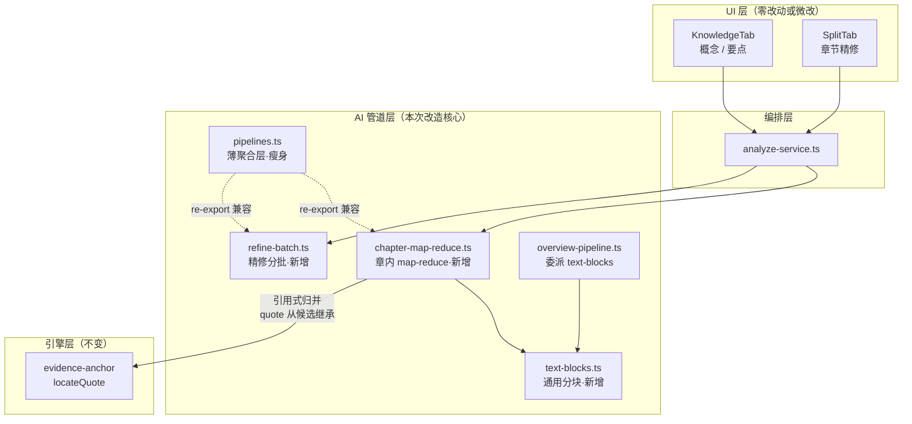
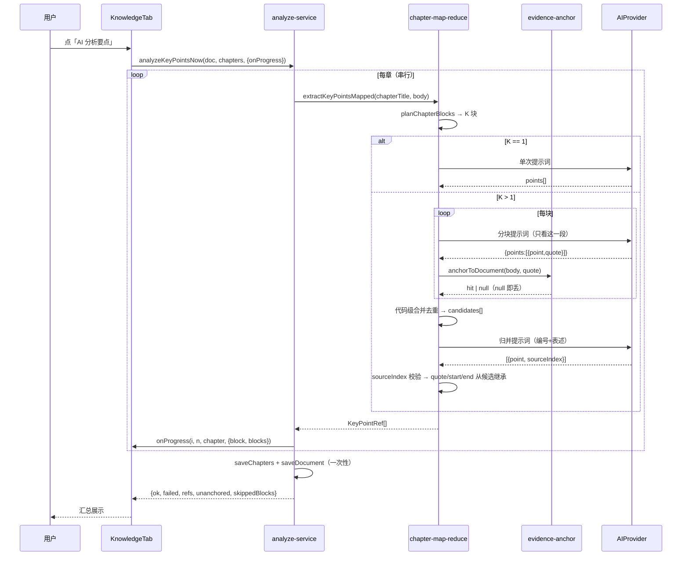

# AI 长文本输入改造（章内 map-reduce）技术方案

| 字段 | 内容 |
|------|------|
| 作者 | Agent / 许一 |
| 日期 | 2026-09-13 |
| 状态 | 待确认 |
| 关联需求 | 用户反馈：「章节或者文档太长失败，是否可以改成按段落进行总结汇总」 |

## 1. 背景

### 1.1 业务背景与用户痛点

资料详情页的四个 AI 能力里，有三个对输入长度是**硬拦截**的。用户导入长资料（典型：几万字的 PDF 论文 / GitHub 合并 Markdown）后：

- 「AI 分析概念」「AI 分析要点」在长章节上**直接报错**，该章计入失败列表，用户拿不到任何结果；
- 「AI 精修章节」在长文档上**静默失效** —— 界面显示分析完成，实际 `changed = 0`，用户以为自己点了没用。

对比之下，第四个能力「生成概览」已经实现了**整篇 map-reduce**（按章/段落分块 → 逐块摘要 → 归并成稿），40 万字资料都能跑通。同一套「分块归纳」思路没有推广到其余三条管道，是本次要补的缺口。

### 1.2 触发原因

用户显式反馈：章节或文档太长导致失败，期望改为「按段落总结后再汇总」。

### 1.3 与现有模块的关系

改动集中在 AI 管道层（`src/ai/`）与资料详情页的分析编排（`src/features/learn/analyze-service.ts`）。**不改**切分引擎、不改 storage 契约、不改 chunk/RAG 链路。

### 1.4 不做会有什么影响

- 长资料（>4 万字）的概念层永远建不起来 → 概念图、前置关系、章级软排序（D2）全部拿不到数据；
- 关键知识点 Tab 对长章恒为失败；
- 章节标题/要点长期停留在启发式产物（首句摘要），成卷质量与复习体验同步受损。

## 2. 方案目标

| 类型 | 描述 |
|------|------|
| **主要目标** | ① 概念分析、要点分析在**任意长度章节**上都不再因长度抛错；② 章节精修在**任意长度文档**上都能真正生效（不再静默跳过）；③ 归并后的事实性字段（原文 quote / 锚定区间）**100% 来自代码侧**，AI 不得生成 |
| **非目标** | ① 不改切分策略（不在「源头上」强制限制单章体量）；② 不改概览管道的阈值与算法；③ 不改 storage / domain 数据模型；④ 不引入新的 AI 供应商能力（无 OCR、无长上下文模型依赖）；⑤ 不做流式输出 |
| **成功标准** | 见 §11.3 通过标准；核心三条：(a) 10 万字单章可跑完概念/要点分析并落库；(b) 30 万字文档的章节精修真正产出标题/要点；(c) 归并后每条要点的 `quote` 与锚定 `start/end` 逐字节等于某个代码侧候选，且锚定失败率不高于改造前 |

### 决策点

| ID | 决策 | 推荐值 | 备选 | 理由 |
|----|------|--------|------|------|
| **D4** | 单章要点条数上限 | **统一 8 条** | 保持 5 条（单块）／8 条（多块） | 长章合并后 8 块 × 2–5 条 = 16–40 条，砍到 5 会损失大部分内容；统一口径比「单块 5 / 多块 8」更易解释。**代价：`tests/library-keypoint.test.ts` 的 TC-KP-04 断言需同步修改** |
| **D5** | 精修分批的边界处是否允许 `mergeIntoPrevious` | **允许** | 每批首项强制 false | `applyChapterRefine` 按全局 index 顺序统一执行，跨批合并语义天然正确；且「是否过碎」只看本章自身，不需要看上一章 |
| **D6** | 归并失败的退路 | **回退代码级合并结果** | 整章判失败 | 8 块已成功产出合规数据，不该因一次归并失败全废 |

## 3. 项目现状

### 3.1 相关代码与模块

| 位置 | 现状 |
|------|------|
| `src/ai/pipelines.ts`（803 行） | 五条管道。`refineChaptersWithAi` 整篇一次调用；`extractChapterConceptsWithAi` / `extractKeyPointsWithAi` 单章一次调用 |
| `src/ai/overview-pipeline.ts`（525 行） | 概览管道，**已实现 map-reduce**：`planOverviewBlocks` 分块（章起点 + 段落空行边界、12k 字/块、≤20 块）→ `buildChunkDigestMessages` 逐块 → `buildOverviewMergeMessages` 归并 |
| `src/features/learn/analyze-service.ts`（415 行） | 四条分析的编排：校验 → 调管道 → 锚定 → 写库 |
| `src/features/learn/detail/KnowledgeTab.tsx` | 概念/要点分析入口，`onProgress: (i, n, ch) => setBusyTick(...)` |
| `src/features/learn/detail/SplitTab.tsx` | 章节精修入口 |
| `src/engine/splitter-engine.ts::applyChapterRefine` | 按**全局 index** 应用精修建议；`mergeIntoPrevious` 时并入 `out` 的末章（顺序构建，链式合并正确） |

**精确的失败点**（本次要修的）：

| 能力 | 阈值 | 超限行为 | 代码位置 |
|------|------|----------|----------|
| ② 概念分析 | 单章 40,000 字 | **抛 `AiProviderError`** → 该章进 `failed[]` | `pipelines.ts:655` |
| ③ 要点分析 | 单章 40,000 字 | **抛 `AiProviderError`** → 该章进 `failed[]` | `pipelines.ts:791` |
| ① 章节精修 | 全文 60,000 字 / 24 章 | **静默 `return []`**（视作「无建议」） | `pipelines.ts:222-223` |
| ④ 概览 | 全文 400,000 字 | 已 map-reduce，**本次不动** | `overview-pipeline.ts:462` |

**已知技术债**：`pipelines.ts` 803 行，超出仓库硬上限（`rules/code-structure-and-dependencies`：文件 ≤700 行）。新能力**不得**继续堆入，本次改造顺带把它瘦身回 700 行以内。

### 3.2 相关文档与约定

- `docs/library-detail-page-design-2026-09.md` §11.1（要点抽取契约）
- `docs/library-detail-page-overview-tab-design-2026-09.md` §12.2（概览 map-reduce 的既有契约，本次复用其模式）
- `docs/library-import-extraction-audit-2026-09.md` G8（诚实降级原则）
- 约束：`rules/code-structure-and-dependencies`（≤700 行、依赖单向）、`rules/engineering-code-style`（相对导入、`import type`、i18n 双语）、`rules/no-headless-browser-validation`（校验走 typecheck + node 单测）

### 3.3 约束与依赖

- **本地模型上下文有限**：默认 `qwen3.5:4b`，且需兼容 8k 上下文的小模型 → 块尺寸必须保守；
- **输出侧比输入侧更敏感**：小模型 `max_tokens` 截断是常见失败模式（`extractJson` + `repairTruncatedJson` 已在抢救）→ 分批时**批大小由输出长度反推**，而非输入长度；
- 纯函数优先：分块/解析必须可在 node 单测直跑（`--experimental-strip-types`），不得依赖 React / storage / fetch。

## 4. 技术架构

### 4.1 总体架构



关键点：`pipelines.ts` 保留**全部既有导出**（改为 re-export），因此 `tests/library-keypoint.test.ts`、`analyze-service.ts` 的 import 路径零改动。

### 4.2 模块职责

| 模块 | 职责 | 技术选型 |
|------|------|----------|
| `src/ai/text-blocks.ts`（新增） | 通用文本分块纯函数 + 摘录工具；**零 AI、零 React** | 从 `overview-pipeline` 抽出内核并泛化 |
| `src/ai/chapter-map-reduce.ts`（新增） | 章内分块 map → 代码合并 → **引用式 AI 归并**；覆盖概念与要点两族提示词/解析/执行器 | 纯函数 + `chatJson` 传输 |
| `src/ai/refine-batch.ts`（新增） | 章节精修分批：按章数与摘录字符分组 → 逐批 `chatJson` → 全局 index 重映射 | 纯函数 `planRefineBatches` + 执行器 |
| `src/ai/pipelines.ts`（修改） | 瘦身：三个执行器改为委派；保留全部既有导出 | re-export |
| `src/ai/overview-pipeline.ts`（修改） | 分块内核委派 `text-blocks`；`planOverviewBlocks` 签名与行为不变 | 保持向后兼容 |
| `src/features/learn/analyze-service.ts`（修改） | 结果对象补充块级统计；进度回调透传块进度 | 不新增写库路径 |

### 4.3 数据模型与 API

#### 4.3.1 新增类型（`text-blocks.ts`）

```ts
export interface TextBlock {
  index: number;
  /** 相对传入 text 的区间，start 含 / end 不含。 */
  start: number;
  end: number;
}

export interface PlanTextBlocksInput {
  text: string;
  /** 不跨切的语义边界（章起点等）；段落空行由内部补全。 */
  anchorOffsets?: readonly number[];
  /** 目标块尺寸（字符）；为 0 时按 ceil(len / maxChunks) 自适应。 */
  chunkChars: number;
  maxChunks: number;
}

/** 不变式：blocks[0].start === 0、末块 end === text.length、
 *  blocks[i].end === blocks[i+1].start、blocks.length <= maxChunks。 */
export function planTextBlocks(input: PlanTextBlocksInput): TextBlock[];

/** 取正文摘录：去 markdown 标题行 → 压空白 → 截断加省略号。 */
export function excerptOf(text: string, start: number, end: number, maxChars: number): string;

/** 章内分块的自适应块尺寸：clamp(ceil(len / maxChunks), min, max)。 */
export function adaptiveChunkChars(len: number, opts: { min: number; max: number; maxChunks: number }): number;
```

#### 4.3.2 引用式归并的候选与产物（`chapter-map-reduce.ts`）

```ts
/** 概念候选：代码侧已合并去重的全局列表项。evidence 只可能来自代码锚定。 */
export interface ConceptCandidate {
  /** 候选全局下标（AI 用 mergeOf 引用它）。 */
  index: number;
  title: string;
  kind: KnowledgeUnit["kind"];
  summary?: string;
  tags: string[];
  /** 已锚定的原文出处；未锚定时整体不存在（不允许 AI 补）。 */
  evidence?: { documentId: string; start: number; end: number; quote: string };
}

/** 要点候选：point 可被 AI 改写，quote / start / end 恒由代码提供。 */
export interface KeyPointCandidate {
  index: number;
  point: string;
  quote: string;
  start: number;
  end: number;
}

/** AI 归并输出（概念）：mergeOf = 被合并的候选下标。 */
export interface AiConceptMergeItem {
  title: string;
  kind: KnowledgeUnit["kind"];
  summary?: string;
  tags: string[];
  mergeOf: number[];
}

/** AI 归并输出（要点）：sourceIndex = 该要点依据的候选下标。 */
export interface AiKeyPointMergeItem {
  point: string;
  sourceIndex: number;
}
```

**核心不变量（必须由单测守住）**：

> 归并产物中每一条的 `quote` 与 `start/end`，**逐字节等于**某个 `KeyPointCandidate` / `ConceptCandidate` 的值。AI 返回的任何引文文本一律丢弃、不予采信。

#### 4.3.3 阈值（`PIPELINE_LIMITS` 调整）

```ts
export const PIPELINE_LIMITS = {
  // 章内分块（新增）
  chapterBlockMinChars: 3_000,     // 块尺寸下限；也是「短章单块直出」门槛
  chapterBlockMaxChars: 12_000,    // 块尺寸上限
  chapterBlockMaxChunks: 8,        // 单章块数硬上限
  // 归并后条数（新增；conceptMergeMax 见 D4 说明）
  conceptMergeMax: 20,
  keyPointMergeMax: 8,
  // 章节精修分批（新增；替代 refineMaxChapters / refineMaxTextChars）
  refineBatchChapters: 12,         // 由「输出长度」反推：12 章 ≈ 2–3k 字符输出，避开小模型截断
  refineBatchExcerptChars: 24_000, // 批次内摘录字符上限（输入侧护栏）
  // 单块硬上限（语义变更：整章 → 单块）
  conceptBlockMaxChars: 40_000,
  keyPointBlockMaxChars: 40_000,
  // 以下保持不变
  quizMaxPromptChars: 32_000, quizExcerptChars: 700, gradeChunkSize: 8,
  keyPointMaxChars: 60, keyPointQuoteMaxChars: 200,
  // 移除：refineMaxChapters、refineMaxTextChars、conceptMaxTextChars、keyPointMaxTextChars
} as const;
```

#### 4.3.4 数据读写（必填）

- **读**：`analyze-service` 从 `storage.listChapters(doc.id)` 取章、`doc.textPreview` 取正文（与现状完全一致）；
- **写**：仍走原有三条单点写入，**不新增路径、不改数据模型**：
  - 概念：`storage.saveGraph(graph)` + `storage.saveChapters(doc.id, ...)` + `storage.saveDocument(doc, analysis.conceptsAt)`；
  - 要点：`storage.saveChapters(doc.id, ...)` + `storage.saveDocument(doc, analysis.keyPointsAt)`；
  - 精修：`storage.saveChapters(doc.id, next)` + `storage.saveDocument(doc, analysis.chaptersAt)`；
- **桌面能力**：本改造不新增 `invoke`；所有 AI 调用仍经现有 `AIProvider.chat`（`llm_*` sidecar 或 API），浏览器预览下 provider 未配置即抛 `not-configured`（现状不变）；
- **迁移**：无。产出类型（`Chapter` / `KnowledgeUnit` / `KnowledgeRelation`）字段不变，旧数据无需迁移。

### 4.4 状态与副作用

- 状态：不新增全局 store、不新增持久化字段。块进度为**组件内局部 state**（`busyTick` 扩展一个可选 `block/blocks`）；
- 副作用触发：均为用户点击（「AI 分析概念」「AI 分析要点」「AI 精修」），无轮询、无 mount 触发；
- 幂等：仍由点击语义决定（`onlyMissing` 用于概念）；块级重跑天然幂等（结果整体覆盖）。

## 5. 交互流程

### 5.1 主流程（以「AI 分析要点」为例）

1. 用户在详情页「关键知识点」Tab 点「AI 分析要点」；
2. `analyzeKeyPointsNow` 校验 provider / 章数 / 正文；
3. 对第 i 章：切出章正文 → `planKeyPointBlocks` 规划块；
4. **若只有 1 块** → 走原有单次路径（行为与改造前完全一致）；
5. **若 > 1 块** → 逐块 map（串行）：每块产出一组 `{point, quote}` 草稿，每块产出的 quote 立即用 `anchorToDocument` 锚定；锚定失败的条目当场丢弃（保持「无出处不入库」）；
6. 各块候选代码级合并：按 `point` 归一化去重 → 得到 `KeyPointCandidate[]`；
7. 调一次 AI 归并（输入为「编号 + 表述」清单，**不含也要求 AI 输出 quote**）→ 得到 `AiKeyPointMergeItem[]`；
8. 代码侧回填：逐条校验 `sourceIndex` 合法 → 产出 `KeyPointRef`，`quote/start/end` 从候选继承；非法条目丢弃；
9. **归并调用失败** → 直接采用第 6 步的代码级合并结果（D6）；
10. 全章处理完 → 一次性 `saveChapters` + `saveDocument`；
11. UI 汇总：成功章数、失败章列表、`skippedBlocks` 数。

### 5.2 分支与异常流程

| 场景 | 触发条件 | 系统行为 | UI 反馈 |
|------|----------|----------|---------|
| 短章直出 | 章正文 ≤ 3,000 字 | 块数 = 1，不跑归并，走原有单次路径 | 与现状完全一致 |
| 长章分块 | 章正文 > 3,000 字 | 自适应块（3k–12k、≤8 块）→ map → 代码合并 → AI 归并 | 进度行显示「第 i/n 章 · 第 k/K 块」 |
| 单块 map 失败 | 网络 / 解析 / 截断 | 跳过并计数，继续后续块 | 章仍算成功；汇总提示「N 个分块失败」 |
| 全部块失败 | 所有 map 都失败 | 抛错 → 该章进 `failed[]` | 与现状一致（章级失败原因） |
| 归并失败 | 归并调用抛错或输出全不合规 | **回退代码级合并结果**，不抛错 | 章成功；日志标注 `mergeFallback=true` |
| 单块超硬上限 | 单块 > 40,000 字（分块失效） | 仍抛错（说明分块算法异常，需排查） | 与现状一致 |
| 精修单批失败 | 该批 chatJson 抛错 | 该批章节保持原样，其他批继续 | 汇总标注「N 章未精修」 |
| 精修全部批失败 | 所有批均失败 | 返回 `[]` → `changed = 0` | **新增**：提示「精修未产生建议」，不再静默 |
| AI 未配置 | `provider.isConfigured() === false` | 抛 `not-configured` | 按钮禁用（现状不变） |

### 5.3 时序图



## 6. 用户用例（User Cases）

### UC-01：长章节（10 万字）生成关键知识点

| 项 | 内容 |
|----|------|
| 角色 | 学习者（导入了一份长 PDF 论文，单章 10 万字） |
| 前置条件 | 已切分；AI 已配置（本地模型或 API） |
| 主流程步骤 | 1. 进入资料详情页「关键知识点」Tab 2. 点「AI 分析要点」 3. 观察进度「第 1/1 章 · 第 3/8 块」 4. 等待完成 |
| 期望结果 | 章成功（不再报「本章正文过长」）；产出 ≤8 条要点，每条都能点击跳转到原文对应位置 |
| 异常/边界 | 部分块失败 → 章仍成功，汇总提示「N 个分块失败」；全部块失败 → 章失败并给出原因 |

### UC-02：长章节生成概念图

| 项 | 内容 |
|----|------|
| 角色 | 学习者 |
| 前置条件 | 已切分；AI 已配置 |
| 主流程步骤 | 1. 「知识概念」Tab 2. 点「AI 分析概念」 3. 等待 |
| 期望结果 | 章成功；产出 ≤20 个概念，概念间的 `prerequisite/related/parent/child` 关系入图；有原文出处的概念可跳转原文 |
| 异常/边界 | 跨块的概念关系不可得（各块互不可见）→ **已知精度损失，需在方案中显式声明**；归并失败 → 采用代码合并结果 |

### UC-03：长文档（30 万字）精修章节

| 项 | 内容 |
|----|------|
| 角色 | 学习者（GitHub 导入了一本合并 Markdown） |
| 前置条件 | 已切分（例如 60 章）；AI 已配置 |
| 主流程步骤 | 1. 详情页「章节结构」Tab 2. 点「AI 精修」 3. 等待多批完成 |
| 期望结果 | 分批（12 章/批，共 5 批）执行；章标题被提炼、要点被补充；过碎章被合并 |
| 异常/边界 | 某批失败 → 该批保持原样，其他批生效；全部失败 → 提示而非静默 |

### UC-04：短资料回归（行为不变）

| 项 | 内容 |
|----|------|
| 角色 | 学习者（导入了一份 2 万字、10 章的笔记） |
| 前置条件 | 已切分 |
| 主流程步骤 | 1. 依次点「AI 精修」「AI 分析概念」「AI 分析要点」 |
| 期望结果 | 与改造前**完全一致**：章正文 ≤3k 字走单次路径；10 章 < 12 → 精修单批；调用次数不变 |
| 异常/边界 | 单章要点条数由 5 变 8（D4 的显式行为变更） |

## 7. 线框 UI（Wireframe）

### 7.0 总体说明

本改造**不新增页面、不调整布局**。唯一可见变化是进度行的粒度细化与两处汇总文案。

### 7.1 KnowledgeTab — 分析进行中（长章）

```
┌─────────────────────────────────────────────────┐
│  知识概念                         [AI 分析概念] │
├─────────────────────────────────────────────────┤
│  ◐ 正在分析第 1/1 章 · 第 3/8 块            ← 新增块进度
│    第三章 转录组数据分析                        │
├─────────────────────────────────────────────────┤
│  （概念图区域：分析中保持上一次的结果）          │
└─────────────────────────────────────────────────┘
```

- 组件映射：沿用现有容器与文本样式，无新组件；
- 文案：`m.learn.detail.analyze.busyBlock(i, n, k, K)`（i18n 双语新增）；
- 短章（K=1）时**不显示**「第 k/K 块」后缀，与现状文案一致。

### 7.2 KnowledgeTab — 完成汇总（有跳过块）

```
┌─────────────────────────────────────────────────┐
│  ✓ 完成 · 3 章成功 · 1 章失败                    │
│    其中 2 个分块失败（内容可能不完整）      ← 新增
├─────────────────────────────────────────────────┤
│  ✗ 第四章 讨论  · 全部分块失败                   │
└─────────────────────────────────────────────────┘
```

### 7.3 SplitTab — 精修完成

| 状态 | 展示 |
|------|------|
| 有变更 | 现状文案（N 章标题/要点更新） |
| **无建议** | **新增**：`m.learn.detail.refine.noSuggestion`（「本次未产生精修建议，可稍后重试」）—— 替代当前的静默 |
| 部分批失败 | 「N 章未精修」 |

## 8. 涉及文件及改动伪代码

### 8.1 `src/ai/text-blocks.ts`（新增）

**改动说明**：把 `overview-pipeline` 的分块内核抽出并泛化为通用纯函数，供概览与章内分块共用。

```ts
// 伪代码 — 仅表达意图
/** 收集可切边界：传入的 anchorOffsets + 正文中的段落空行位置。 */
function collectBoundaries(text: string, anchorOffsets: readonly number[]): number[] {
  const set = new Set<number>();
  for (const o of anchorOffsets) {
    const at = Math.max(0, Math.min(o, text.length));
    if (at > 0 && at < text.length) set.add(at);
  }
  const re = /\n\n/g;
  let m: RegExpExecArray | null;
  while ((m = re.exec(text)) !== null) {
    const at = m.index + m[0].length;
    if (at > 0 && at < text.length) set.add(at);
  }
  return [...set].sort((a, b) => a - b);
}

function cutByBoundaries(text, boundaries, chunkChars) { /* 与现状一致：取 ≤target 的最右边界，否则硬切 */ }
function splitEvenly(len, maxChunks) { /* 算术均分兜底 */ }

export function planTextBlocks(input: PlanTextBlocksInput): TextBlock[] {
  const { text } = input;
  if (text.trim().length === 0) return [];
  if (text.length <= input.chunkChars) {
    return [{ index: 0, start: 0, end: text.length }];
  }
  const boundaries = collectBoundaries(text, input.anchorOffsets ?? []);
  let ranges = cutByBoundaries(text, boundaries, input.chunkChars);
  if (ranges.length > input.maxChunks) {
    ranges = cutByBoundaries(text, boundaries, Math.ceil(text.length / input.maxChunks));
  }
  if (ranges.length > input.maxChunks) {
    ranges = splitEvenly(text.length, input.maxChunks); // 放弃「不跨边界」换块数硬保证
  }
  return ranges.map((r, i) => ({ index: i, start: r.start, end: r.end }));
}

export function adaptiveChunkChars(len, { min, max, maxChunks }): number {
  const byCount = Math.ceil(len / maxChunks);
  return Math.min(max, Math.max(min, byCount));   // clamp 到 [min, max]
}

export function excerptOf(text, start, end, maxChars): string {
  const raw = text.slice(start, end)
    .replace(/^#{1,6}\s+.*$/gm, "").replace(/\s+/g, " ").trim();
  if (!raw) return "";
  return raw.length <= maxChars ? raw : `${raw.slice(0, maxChars)}…`;
}
```

### 8.2 `src/ai/chapter-map-reduce.ts`（新增）

**改动说明**：章内 map-reduce 的提示词、解析与执行器。**引用式归并**是核心。

```ts
// 伪代码

/** 章内分块：自适应尺寸（3k–12k，≤8 块）。 */
export function planChapterBlocks(text: string): TextBlock[] {
  const size = adaptiveChunkChars(text.length, {
    min: PIPELINE_LIMITS.chapterBlockMinChars,
    max: PIPELINE_LIMITS.chapterBlockMaxChars,
    maxChunks: PIPELINE_LIMITS.chapterBlockMaxChunks,
  });
  // 章内**不**传章起点（只有一个章），只按段落空行切
  return planTextBlocks({ text, chunkChars: size, maxChunks: PIPELINE_LIMITS.chapterBlockMaxChunks });
}

/* ---------- 要点 ---------- */

/** map：单块要点草稿（沿用既有 KEYPOINT 提示词语义，措辞改为「本段」）。 */
export function buildKeyPointBlockMessages(i: { blockIndex; blockTotal; text }): ChatMessage[];
export function parseKeyPointBlockDrafts(raw: unknown): AiKeyPointDraft[];  // 复用 pipelines 的解析语义

/** 归并：输入候选的「编号 + 表述」，明确禁止 AI 输出引文。 */
export function buildKeyPointMergeMessages(i: {
  chapterTitle: string; candidates: readonly KeyPointCandidate[];
}): ChatMessage[];
// 提示词要点：
//   「以下是一个章节各分段提炼出的要点候选（编号从 0 起）。
//    请合并重复/相近的要点，输出 ≤N 条最能代表本章的要点。
//    每条给 point（≤60 字）与 sourceIndex（该要点依据的候选编号）。
//    **不要输出原文引文**——引文由系统按 sourceIndex 关联，你只需给出编号。」

export function parseKeyPointMerge(
  raw: unknown, candidates: readonly KeyPointCandidate[],
): KeyPointCandidate[] {
  // 逐条：sourceIndex 必须为整数且 0 <= idx < candidates.length，否则丢弃
  // 产出的 quote / start / end **整体复制** candidates[idx] 的值（AI 的引文不予采信）
  // point 取 AI 文本并截断 60 字；按 point 去重；截到 keyPointMergeMax 条
  // 全部非法 → 返回 []（由调用方决定回退）
}

/** 锚定能力由调用方注入：`ai/` 不得 import `features/`（分层约束）。 */
export interface AnchorFn {
  /** 把 quote 锚定成文档绝对区间；失败返回 undefined → 该条当场丢弃。 */
  (quote: string): { start: number; end: number } | undefined;
}

export interface MappedKeyPointResult {
  /** 已带 quote / start / end 的要点（全部字段来自代码侧，见 §4.3.2 不变量）。 */
  refs: KeyPointRef[];
  blocks: number;
  skippedBlocks: number;
  unanchored: number;
  /** true = 归并失败、回退到代码级合并结果（D6）。 */
  mergeFallback: boolean;
}

export async function extractKeyPointsMapped(
  provider: AIProvider,
  input: {
    chapterTitle: string;
    /** 章正文（调用方用 contentRef 从全文切出）。 */
    text: string;
    /** 由 analyze-service 注入（内部闭包持有 chapter.contentRef.start）。 */
    anchor: AnchorFn;
    onBlock?: (k: number, K: number) => void;
  },
): Promise<MappedKeyPointResult> {
  const body = input.text.trim();
  if (!body) throw new AiProviderError("request-failed", "章正文为空，无法提炼要点。");

  const blocks = planChapterBlocks(body);

  // 短章：逐字节保持既有行为（单块直出，不跑归并）
  if (blocks.length <= 1) {
    if (body.length > PIPELINE_LIMITS.keyPointBlockMaxChars) {
      throw new AiProviderError("request-failed", `单块仍过长（${body.length} 字），分块算法异常。`);
    }
    const raw = await chatJson(provider, buildKeyPointBlockMessages({ blockIndex: 0, blockTotal: 1, text: body }), TEMP);
    const { refs, unanchored } = toRefs(parseKeyPointBlockDrafts(raw), input.anchor);
    return { refs, blocks: 1, skippedBlocks: 0, unanchored, mergeFallback: false };
  }

  // map：逐块，单块失败跳过（不整章判死）
  const candidates: KeyPointCandidate[] = [];
  let skipped = 0;
  let unanchored = 0;
  for (let k = 0; k < blocks.length; k++) {
    input.onBlock?.(k + 1, blocks.length);
    try {
      const raw = await chatJson(provider, buildKeyPointBlockMessages({
        blockIndex: k, blockTotal: blocks.length, text: body.slice(blocks[k].start, blocks[k].end),
      }), TEMP);
      // 候选必须在此刻就带 start/end —— 归并后只能继承、不能重算
      const { refs, unanchored: u } = toRefs(parseKeyPointBlockDrafts(raw), input.anchor);
      unanchored += u;
      candidates.push(...refs.map((r, i) => ({ index: candidates.length + i, ...r })));
    } catch { skipped++; }
  }
  if (candidates.length === 0) throw new AiProviderError("request-failed", "所有分块提炼均失败。");

  // reduce：AI 只选源与措辞；quote / start / end 一律从候选继承
  const fallback = dedupByPoint(candidates).slice(0, PIPELINE_LIMITS.keyPointMergeMax);
  try {
    const raw = await chatJson(provider, buildKeyPointMergeMessages({
      chapterTitle: input.chapterTitle, candidates,
    }), TEMP);
    const merged = parseKeyPointMerge(raw, candidates);
    if (merged.length === 0) throw new AiProviderError("request-failed", "归并未产出合规要点。");
    return { refs: merged, blocks: blocks.length, skippedBlocks: skipped, unanchored, mergeFallback: false };
  } catch (err) {
    aiLog("warn", "map-reduce", "要点归并失败，回退代码合并结果", { reason: aiErrPreview(err), candidates: candidates.length });
    return { refs: fallback, blocks: blocks.length, skippedBlocks: skipped, unanchored, mergeFallback: true };
  }
}

/** 逐条锚定：命中即入 refs；未命中计入 unanchored 并丢弃（E3 诚实降级）。 */
function toRefs(drafts: readonly AiKeyPointDraft[], anchor: AnchorFn): { refs: KeyPointRef[]; unanchored: number } { /* ... */ }

/** 代码级兜底合并：按 point 归一化去重（归并失败时的退路，D6）。 */
function dedupByPoint(candidates: readonly KeyPointCandidate[]): KeyPointRef[] { /* ... */ }

/* ---------- 概念 ---------- */
// 结构同要点；差异只有一处：
//   parseConceptMerge 里 evidence 从 mergeOf 中**首个带 evidence 的候选**继承
//   （合并后的概念出处只能落在其中一个来源上，取首个可锚定者，宁少不编）。
```

### 8.3 `src/ai/refine-batch.ts`（新增）

```ts
// 伪代码
export interface RefineBatch { index: number; chapters: { chapter: Chapter; globalIndex: number }[] }

/** 纯函数：按「章数 ≤ 12」与「摘录字符 ≤ 24k」双约束分组（顺序保持）。 */
export function planRefineBatches(
  chapters: readonly Chapter[], text: string,
  opts?: { maxChapters?: number; maxExcerptChars?: number },
): RefineBatch[];

/** 分批精修：逐批 chatJson → 批内下标重映射为全局下标 → concat。 */
export async function refineChaptersBatched(
  provider: AIProvider,
  chapters: readonly Chapter[],
  text: string,
): Promise<{ refines: ChapterRefine[]; batches: number; failedBatches: number }> {
  const batches = planRefineBatches(chapters, text);
  const out: ChapterRefine[] = [];
  let failedBatches = 0;
  for (const b of batches) {
    try {
      const raw = await chatJson(provider, buildRefineMessages(b.chapters.map(x => x.chapter), text), TEMP);
      // 批内 index → 全局 index（D5：跨批 mergeIntoPrevious 语义天然正确）
      for (const r of parseChapterRefines(raw, b.chapters.length)) {
        const g = b.chapters[r.index]?.globalIndex;
        if (g === undefined) continue;
        out.push({ ...r, index: g });
      }
    } catch { failedBatches++; }
  }
  return { refines: out, batches: batches.length, failedBatches };
}
```

**注意**：`buildRefineMessages` 目前接收 `(chapters, text)` 并用 `chapter.contentRef` 从**全文**取摘录 —— 分批后仍传全文即可，只是章列表变成子集。**提示词里的 index 说明需改为「index 即本批数组下标」**，并声明「本批第一项以外的章可标记 mergeIntoPrevious」；批首章在全文首章时禁止合并。

### 8.4 `src/ai/pipelines.ts`（修改）

**改动说明**：瘦身 + 委派。**所有既有导出保持不变**（re-export），因此现有单测与调用方零改动。

```ts
// 移除：REFINE_SYSTEM / buildRefineMessages / parseChapterRefines 的实现（迁至 refine-batch.ts）
// 移除：CONCEPT_SYSTEM / KEYPOINT_SYSTEM / buildXxxMessages / parseXxxDrafts 的实现（迁至 chapter-map-reduce.ts）
// 移除：chapterExcerpt（迁至 text-blocks.ts 的 excerptOf）

export { planTextBlocks, excerptOf, adaptiveChunkChars } from "./text-blocks";
export {
  buildKeyPointMessages, parseKeyPointDrafts, buildConceptMessages, parseConceptDrafts,
  buildKeyPointMergeMessages, parseKeyPointMerge, buildConceptMergeMessages, parseConceptMerge,
} from "./chapter-map-reduce";
export { buildRefineMessages, parseChapterRefines, planRefineBatches, refineChaptersBatched } from "./refine-batch";

/** 保持签名不变：内部改为分批委派。 */
export async function refineChaptersWithAi(provider, chapters, text): Promise<ChapterRefine[]> {
  if (chapters.length === 0) return [];
  try {
    const { refines } = await refineChaptersBatched(provider, chapters, text);
    return refines;
  } catch {
    return [];   // 与现状一致的静默降级（analyze-service 侧会给出「无建议」提示）
  }
}

/** 保持签名不变：内部改为 map-reduce 委派。 */
export async function extractKeyPointsWithAi(provider, input): Promise<AiKeyPointDraft[]> { /* 委派 */ }
export async function extractChapterConceptsWithAi(provider, input): Promise<{...}> { /* 委派 */ }
```

### 8.5 `src/ai/overview-pipeline.ts`（修改）

```ts
// 分块内核迁出；对外签名与行为逐字节不变 → tests/library-overview.test.ts 零改动
import { planTextBlocks, excerptOf } from "./text-blocks";

export function planOverviewBlocks(input: { text; chapters?; chunkChars?; maxChunks? }): OverviewBlock[] {
  const blocks = planTextBlocks({
    text: input.text,
    anchorOffsets: (input.chapters ?? []).map((c) => c.contentRef.start),
    chunkChars: input.chunkChars ?? OVERVIEW_LIMITS.chunkChars,
    maxChunks: input.maxChunks ?? OVERVIEW_LIMITS.maxChunks,
  });
  return blocks.map((b) => ({ ...b, label: labelOf(b.start, input.chapters) }));
}
```

### 8.6 `src/features/learn/analyze-service.ts`（修改）

```ts
// 伪代码
export interface AnalyzeKeyPointsResult {
  ok: number;
  failed: { chapterId: string; title: string; reason: string }[];
  refs: number;
  unanchored: number;
  /** 新增：因单块失败而跳过的块数（>0 时内容可能不完整）。 */
  skippedBlocks: number;
  /** 新增：归并回退到代码合并的章数（D6）。 */
  mergeFallbacks: number;
  analyzedAt: number;
}

export async function analyzeKeyPointsNow(doc, chapters, opts) {
  // ...校验不变
  for (const c of chapters) {
    const body = text.slice(c.contentRef.start, c.contentRef.end);
    try {
      const out = await extractKeyPointsMapped(provider, {
        chapterTitle: c.title,
        text: body,
        // 锚定回调：纯 AI 层不依赖 features，由这里注入
        anchor: (quote) => anchorToDocument(body, quote, c.contentRef.start) ?? undefined,
        onBlock: (k, K) => opts.onProgress?.(i + 1, chapters.length, c, { block: k, blocks: K }),
      });
      // out.refs 已含 quote/start/end（全部来自代码侧候选）
      touched.set(c.id, { ...c, keyPointRefs: out.refs, ...(out.refs.length ? { keyPoints: out.refs.map(r => r.point) } : {}) });
      refs += out.refs.length;
      skippedBlocks += out.skippedBlocks;
      unanchored += out.unanchored;
      if (out.mergeFallback) mergeFallbacks++;
    } catch (err) { /* 现状：记 failed + aiLog */ }
  }
  // 写库不变
}
```

```ts
/** 进度回调扩展：第 4 参数可选，短章不传 → UI 表现与现状一致。 */
onProgress?: (i: number, total: number, chapter: Chapter, block?: { block: number; blocks: number }) => void;
```

### 8.7 `src/features/learn/detail/KnowledgeTab.tsx`（微改）

```tsx
// 伪代码
const [busyTick, setBusyTick] = useState<{ i: number; n: number; title: string; block?: number; blocks?: number }>();
onProgress: (i, n, ch, blk) => setBusyTick({ i, n, title: ch.title, ...(blk ?? {}) }),
// 渲染：blk 存在且 blocks > 1 时追加「· 第 k/K 块」
```

### 8.8 `src/features/learn/detail/SplitTab.tsx`（微改）

```tsx
// 精修结果为「无建议」时给出提示（不再静默）
const result = await analyzeChaptersNow(doc, chapters, { storage, provider });
if (result.changed === 0) setNotice(m.learn.detail.refine.noSuggestion);
```

### 8.9 `src/i18n/messages/zh.ts` + `en.ts`（修改，成对）

```ts
// 新增 3 条（中英各一份，typecheck 强制对齐）
analyze: { busyBlock: (i, n, k, K) => `正在分析第 ${i}/${n} 章 · 第 ${k}/${K} 块`, ... }
analyze: { skippedBlocks: (n) => `其中 ${n} 个分块失败（内容可能不完整）` }
refine:  { noSuggestion: "本次未产生精修建议，可稍后重试" }
```

### 8.10 `tests/` 与 `package.json`（修改）

- 新增 `tests/ai-map-reduce.test.ts`（见 §12）；
- 修改 `tests/library-keypoint.test.ts`：TC-KP-04 的「截断到 5」改为「截断到 8」（D4）；
- `package.json` 新增 `"test:aimap"`，并挂入 `test:library` 串联链。

## 9. 任务清单（Tasks）

| ID | 任务 | 依赖 | 预估复杂度 |
|----|------|------|------------|
| T1 | 抽出 `text-blocks.ts`（`planTextBlocks` / `adaptiveChunkChars` / `excerptOf`）并让 overview 委派；`test:overview` 全绿 | — | M |
| T2 | 新增 `chapter-map-reduce.ts`：分块 + 要点 map + **引用式归并**（提示词/解析/执行器） | T1 | L |
| T3 | 同文件补齐概念族（map + 归并 + evidence 从候选继承） | T2 | M |
| T4 | 新增 `refine-batch.ts`（`planRefineBatches` + `refineChaptersBatched` + 下标重映射） | T1 | M |
| T5 | 改造 `pipelines.ts` 为薄聚合层（re-export 保持兼容）+ `PIPELINE_LIMITS` 调整 | T2 T3 T4 | M |
| T6 | `analyze-service.ts` 接线：注入 anchor 回调、消费块统计、进度透传 | T5 | M |
| T7 | UI：KnowledgeTab 块进度 + 跳过提示；SplitTab「无建议」提示 | T6 | S |
| T8 | i18n 双语新增（3 条 × 2 语言） | T7 | S |
| T9 | 新增 `tests/ai-map-reduce.test.ts` + 更新 `library-keypoint.test.ts` + 挂 `test:aimap` | T2–T5 | M |
| T10 | 全量验证：`npm run typecheck` + `test:library` + `test:ai` + `test:aimap` | 全部 | S |

## 10. 实施步骤

1. **步骤 1（T1）**：抽 `text-blocks.ts`，overview 改委派。
   - 输入：现有 `overview-pipeline` 的 4 个内部函数；输出：通用纯函数 + `planOverviewBlocks` wrapper
   - 验证：`npm run test:overview` 全绿（**零改动**即通过 = 搬迁无行为变化）
2. **步骤 2（T2）**：要点 map-reduce。
   - 输入：章正文 + anchor 回调；输出：`KeyPointRef[]`
   - 验证：单测覆盖「单块直出 = 旧路径」「多块归并」「sourceIndex 非法丢弃」「quote 逐字节来自候选」
3. **步骤 3（T3）**：概念 map-reduce（同结构 + evidence 继承）。
4. **步骤 4（T4）**：精修分批 + 全局 index 重映射。
   - 验证：单测「60 章 → 5 批」「批内 index 正确映射」「跨批 mergeIntoPrevious 生效」
5. **步骤 5（T5）**：`pipelines.ts` 瘦身 + 阈值调整。
   - 验证：`npm run test:ai` 与 `test:library` **不改测试**即通过（证明兼容性）
6. **步骤 6（T6–T8）**：接线与 UI/文案。
7. **步骤 7（T9–T10）**：补测试 → `npm run typecheck`（目标 0 error）→ 四组测试全绿。
8. **步骤 8**：更新 `docs/library-detail-page-design-2026-09.md` 的相关契约描述（行为变更同步）。

**回滚策略**：改动集中在 `src/ai/` 新增文件 + 三个委派点。回滚 = 还原 `pipelines.ts` 的三个执行器实现体（新旧实现同时存在于 git 历史），无需数据回滚（无 schema / 无持久化字段变化）。

## 11. 测试方案

### 11.1 测试范围与策略

| 层级 | 工具/方式 | 覆盖重点 | 不负责 |
|------|-----------|----------|--------|
| 单元 | `tests/ai-map-reduce.test.ts`（node 直跑，`npm run test:aimap`） | 分块不变式、引用式归并、失败回退、下标重映射、块数上限 | 真实模型输出质量 |
| 单元（回归） | `tests/library-overview.test.ts`、`tests/library-keypoint.test.ts`、`tests/ai-pipeline.test.ts` | 搬迁兼容性、既有解析契约 | — |
| 集成 | `tests/library-keypoint.test.ts` 扩展：假 provider 串起 `extractKeyPointsMapped → anchor 注入 → 候选继承` | 端到端数据流（不落库） | — |
| E2E | **不做**（受 `rules/no-headless-browser-validation` 约束） | — | 浏览器级校验 |
| 手工 | 桌面端跑一份长 PDF（>4 万字单章） | 真实模型下的完成度、进度观感 | — |

### 11.2 测试环境与数据

- 无网络、无真实 provider：全部用**本地假 provider**（`chatJson` 注入固定 JSON 响应），沿用 `tests/library-overview.test.ts` 的既有手法；
- fixture：程序化生成的长正文（`"段落 x。\n\n".repeat(n)`），覆盖 2.9k / 3.1k / 40k / 100k 四个量级；
- 命令：`npm run test:aimap`（新增）、`npm run test:library`、`npm run test:ai`、`npm run typecheck`。

### 11.3 通过标准

- `npm run typecheck` 0 error；
- `test:aimap`、`test:library`、`test:ai`、`test:overview` 全绿；
- `pipelines.ts` 行数 ≤ 700；
- 单测证明：归并产物中每条 `quote`/`start`/`end` 与某候选**逐字节相等**（不是「相似」）；
- 手工验证：10 万字单章能跑完并落库，UI 进度可看到块级推进。

## 12. 测试用例

与第 6 节用例编号对应。

| ID | 关联 UC | 输入/操作 | 期望结果 | 类型 |
|----|---------|-----------|----------|------|
| TC-UC01-01 | UC-01 | 章正文 45k 字，假 provider 每块返回 3 条带 quote 的要点 | 块数 = 8；map 调用 8 次 + 归并 1 次；产出 ≤8 条 refs | 单元 |
| TC-UC01-02 | UC-01 | 同上，但第 3 块抛错 | 章仍成功；`skippedBlocks = 1`；其余 7 块内容保留 | 单元 |
| TC-UC01-03 | UC-01 | 全部 8 块抛错 | 抛 `AiProviderError`；章进 `failed[]` | 单元 |
| TC-UC01-04 | UC-01 | 归并调用抛错 | 回退代码级合并结果；`mergeFallback = true`；不抛错（D6） | 单元 |
| TC-UC02-01 | UC-02 | 章 45k 字，概念分块响应含 `mergeOf:[0,3]` | 合并为 1 个概念；`evidence` 等于候选 0 的 evidence | 单元 |
| TC-UC02-02 | UC-02 | `mergeOf` 含越界下标 / 全越界 | 越界项剔除；全无效则该条丢弃；不抛错 | 单元 |
| TC-UC02-03 | UC-02 | 归并输出 30 条 | 截断到 `conceptMergeMax = 20` | 单元 |
| TC-UC03-01 | UC-03 | 60 章 / 30 万字 | 批数 = 5（12/批）；每批摘录 ≤24k 字符 | 单元 |
| TC-UC03-02 | UC-03 | 第 2 批抛错 | 该批 0 条建议；其余 4 批正常返回；`failedBatches = 1` | 单元 |
| TC-UC03-03 | UC-03 | 批 2 的 `index: 0` 返回，全局偏移 12 | 产出的 `ChapterRefine.index === 12` | 单元 |
| TC-UC03-04 | UC-03 | 批 2 首章标记 `mergeIntoPrevious: true` | 经 `applyChapterRefine` 并入第 12 章（跨批合并生效，D5） | 单元 |
| TC-UC04-01 | UC-04 | 章正文 2.9k 字 | 块数 = 1；不调归并；与旧单次路径的提示词逐字节一致 | 单元 |
| TC-UC04-02 | UC-04 | 10 章 / 2 万字精修 | 批数 = 1；调用次数 = 1（与改造前一致） | 单元 |

### 12.1 边界与回归

| ID | 场景 | 期望 |
|----|------|------|
| TC-EDGE-01 | 空正文 / 纯空白 | 抛「正文为空」，不发起调用 |
| TC-EDGE-02 | 章长 3,000 / 3,001 字（门槛两侧） | 分别单块 / 双块（恰好 1 块与 2 块的分界） |
| TC-EDGE-03 | 单块 > 40k 字（分块失效注入） | 仍抛错，提示可排查分块算法 |
| TC-EDGE-04 | 正文无 `\n\n`（整段无空行） | `cutByBoundaries` 走硬切，块数仍 ≤8 |
| TC-EDGE-05 | 200k 字单章 | 块尺寸放大到 12k → 17 块 > 8 → 二次放大到 25k → 8 块（自适应收敛） |
| TC-EDGE-06 | 归并输出 `sourceIndex` 重复指向同一候选 | 按 point 去重后保留首条，不产生重复 ref |
| TC-EDGE-07 | 归并产物 0 条（全部非法） | 回退代码合并结果；不产出空 refs |
| TC-EDGE-08 | 锚定失败 | 该条当场丢弃并计入 `unanchored`（与现状一致） |
| TC-EDGE-09 | `planOverviewBlocks` 搬迁后既有断言 | 全部通过（零改动）——证明搬迁无行为变化 |
| TC-EDGE-10 | `PIPELINE_LIMITS` 移除字段的引用点 | typecheck 0 error（无残留引用） |

---

## 变更记录

| 日期 | 变更 | 作者 |
|------|------|------|
| 2026-09-13 | 初稿；范围（概念+要点+精修）、归并策略（代码合并 + AI 归并）、分块粒度（自适应 3k–12k / ≤8 块）已确认 | Agent |
| 2026-09-13 | 要点解析补「质量门」（`hasMeaningfulText`）：纯符号 point（如 README 图片残留的 `!`）在 parseKeyPointDrafts / parseKeyPointMerge 一律丢弃；同时在导入管道入口对 markdown 来源剥离图片语法与链接 URL（`import/normalize-text.ts`） | Agent |
