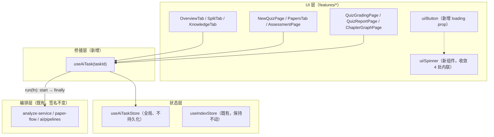
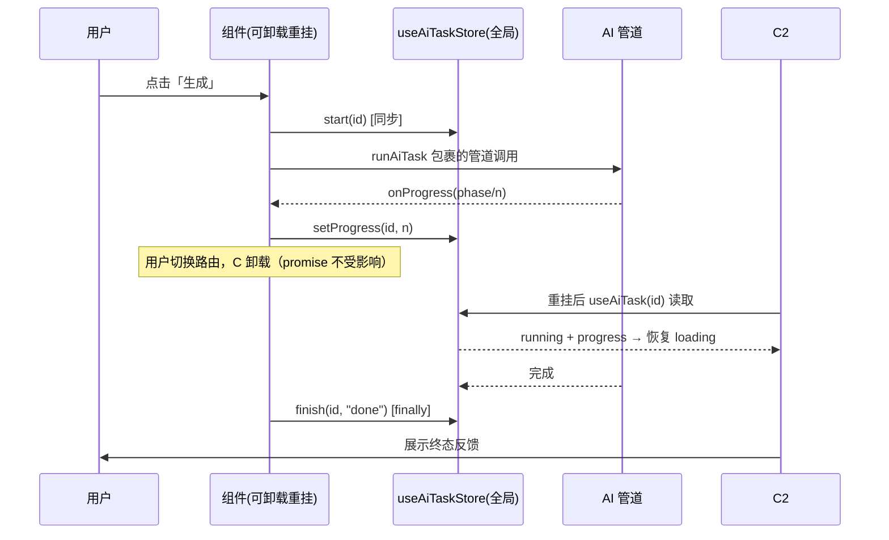

# AI 交互 Loading 状态统一 技术方案

| 字段 | 内容 |
|------|------|
| 作者 | WorkBuddy |
| 日期 | 2026-09-13 |
| 状态 | 草案（待用户确认） |
| 关联需求 | 用户原话：①点击按钮触发 AI 后按钮显示 loading，AI 执行完毕再取消；②页面切换后再回来需要显示对应的 loading 状态 |

## 1. 背景

### 1.1 现状痛点（2026-09-13 全量调研，引用行号为当日快照）

对 `src/` 全量排查后，**11+ 个 AI 交互点的 loading 状态全部是组件内 `useState`，无一全局化**：

| 交互点 | 触发按钮 | state 位置 | 请求发起 | 切页/切 Tab 后 |
|---|---|---|---|---|
| 概览生成 | `detail/OverviewTab.tsx:170` | 组件 useState（`busy/progress/error`，44-67） | `analyze-service.ts:408` | 请求继续跑完落库，**进度/结果提示全丢**（OverviewTab 的 `fresh` 兜底补丁就是此问题的产物） |
| 向导出卷 | `quiz/NewQuizPage.tsx:331`（原生 button） | **无任何 busy state** | `quiz/paper-flow.ts:54` | 按钮不禁用、可重复点击并发建卷；失败仅 `console.error`(150)，**用户完全无感知** |
| 详情页一键出卷 | `detail/PapersTab.tsx:198/253/305` | 组件 `busyKey`(49) | `paper-flow.ts:54` | 状态丢，卷已落库但 notice 丢 |
| 测评页出卷 | `assessment/AssessmentPage.tsx:135 区域` | 组件 `busyChapter`(43) | `paper-flow.ts:54` | 同上 |
| 判卷 AI 批改 | 无（进页自动触发，`QuizGradingPage.tsx:87-92`） | 组件 `aiPhase`(48,64) | `ai/pipelines.ts:397` | 切走后 promise 继续写库，返回靠幂等重入兜底 |
| 报告页重试批改 | `quiz/QuizReportPage.tsx:413 区域` | 组件 `aiRetrying`(127) | `ai/pipelines.ts:397` | 状态丢，结果已落库但提示丢 |
| 章节精修 | `detail/SplitTab.tsx:153` | 组件 `busy`(36) | `analyze-service.ts:131` | 请求续跑落库，状态丢 |
| 要点/概念抽取 | `detail/KnowledgeTab.tsx:166/253` | 组件 `busyTick/pointsBusy`(46-55) | `analyze-service.ts:287/183` | 请求续跑，状态丢；部分完成后回来看到「部分成功」但不知发生过什么 |
| 章图谱抽取 | `knowledge/ChapterGraphPage.tsx:168`（原生 button） | 组件 `extracting`(42) | `ai/pipelines.ts:427` | 同上 |
| 导入（refine 阶段含 AI） | `ImportModal.tsx:616` | 组件 `busy/phases`(92-100) | `import/pipeline.ts:55` | Modal 常驻 AppShell 级浮层，相对最健壮 |
| 向量索引重建 | `VectorIndexCard.tsx:339` | **store `useIndexStore` + 组件 indexBusy 双轨** | `index-service.ts:192` | 全局可见（**唯一正确范式**） |

放大问题的三个结构性事实：

1. **路由无 keep-alive**（`App.tsx:26-66` 裸 `<Routes>`，`AppShell.tsx:111` 裸 `<Outlet />`），详情页 Tab（`DocumentDetailPage.tsx:162` → `ui/tabs.tsx:60` 的 `TabsPanel` 未传 `keepMounted`）切 Tab 同样卸载 → **所有组件内 useState 随卸载销毁**。
2. **AI 请求一旦发起不受卸载影响**（全仓库无 AbortSignal 传参，仅 `index-service.ts:57` 预留未用）→ 任务后台跑完写库，但 loading、进度、错误提示全部丢失，形成「任务完成但用户不知道」的系统性盲区。
3. **字段命名五花八门**（`busy` / `busyKey` / `pointsBusy` / `busyTick` / `extracting` / `retaking` / `aiRetrying` / `aiPhase` / `indexBusy`），`ui/button.tsx:41-54` **无 loading prop**，全仓库 4 处手写内联 spinner（`ImportModal.tsx:351,635`、`library/dialogs.tsx:377`、`ApiModelsTab.tsx:265`），视觉三种模式并存。

### 1.2 不做的影响

- 长任务（概念/要点/概览分析常需数十秒到数分钟）期间用户切页即失联，回来只见结果不见过程，甚至误以为没点上而重复点击（NewQuizPage 可并发建卷）。
- 每新增一个 AI 交互都要重新发明一套 busy state，技术债线性增长。

## 2. 方案目标

| 类型 | 描述 |
|------|------|
| **主要目标** | ① 任意 AI 按钮点击后立即进入统一 loading 视觉（spinner + disabled + aria-busy），任务结束（成功/失败/回退）后取消；② 任务执行中切换页面/Tab 再返回，页面能从全局状态恢复出「任务进行中」的 loading 与进度；③ 任务在后台完成/失败后，用户返回页面能看到终态反馈，消除「完成但不知道」盲区 |
| **非目标** | ❌ AbortSignal 取消能力（AI 管道均不支持 signal，纳入会牵连 5 个管道文件的签名改造，另行立项）；❌ 全局 Header「任务中心」指示器（后续可加，本次不做）；❌ 持久化到 localStorage/Tauri（见 D1）；❌ 重构 AI 管道本身的编排逻辑（analyze-service / paper-flow 结构保持不变，只桥接状态）；❌ keep-alive 路由缓存（用全局 store 解决，不动路由架构） |
| **成功标准** | 1. `ui/Button` 支持 `loading` prop，4 处内联 spinner 收敛为 `<Spinner />`；2. 11 个 AI 交互点不再各自维护组件内 busy state，统一从 `useAiTaskStore` 派生；3. 任一 AI 任务执行中切换路由再返回，按钮/页面仍显示 loading；4. 任务完成后返回页面可见成功/失败终态；5. `npm run typecheck` 0 error，新增单测通过，既有 `test:*` 零回归 |

## 3. 项目现状

### 3.1 相关代码与模块

见第 1.1 节矩阵。可复用的正面范式：

- **`useIndexStore`**（`src/stores/useIndexStore.ts:38-60`）：纯状态 store + feature service（`index-service.ts`）驱动，注释明确了「不持久化」的理由——本方案的 store 直接沿用此范式。
- **`useAiReady`**：响应式订阅 `providerReady`，AI 就绪门的既有约定。
- **`paper-flow.ts`**：出卷已收敛单入口（4 处 UI 共用 `createPaperAndSave`），桥接改造点集中。

### 3.2 相关文档与约定

- `rules/layer-import-boundaries.mdc`：UI → stores/storage，store 不依赖 features（`index-service.ts:14-16` 已示范反转依赖：service import store）。
- `rules/code-structure-and-dependencies.mdc`：文件 ≤700 行；≥10 行 × ≥3 处必须抽取（本方案核心动机之一）。
- `rules/engineering-code-style.mdc`：相对导入、i18n 双语成对、`import type`。
- `docs/ai-chapter-mapreduce-design-2026-09.md`：AI 管道分层（`pipeline-core` 最底层），本方案不改管道层。

### 3.3 约束与依赖

- React 19 + Zustand 5 + react-router-dom 7；Tauri 2 桌面壳（本方案不涉及新 IPC）。
- AI 调用均为进程内 async promise → **应用重启后任务必然消亡**，这决定了 loading 状态不应持久化（见 D1）。
- 详情页 Tab 切换与路由切换共用同一机制（组件卸载），一套全局 store 同时覆盖两者，无需改 `tabs.tsx`。

## 4. 技术架构

### 4.1 总体架构



数据流方向严格符合 `layer-import-boundaries`：features → store；store 零依赖 features（任务编排函数由组件传入 hook）。

### 4.2 模块职责

| 模块/层级 | 职责 | 技术选型 |
|-----------|------|----------|
| `src/stores/useAiTaskStore.ts`（新增） | 全局 AI 任务注册表：`Record<AiTaskId, AiTaskRecord>`；actions：`start / setPhase / setProgress / finish / clear`；导出 `useAiTask` hook 与 `runAiTask` 执行器 | Zustand 5（不 persist，理由同 `useIndexStore`） |
| `src/components/ui/spinner.tsx`（新增） | 统一 spinner 视觉（尺寸/颜色 token 化），替换 4 处内联实现 | Tailwind 4 + 语义 token |
| `src/components/ui/button.tsx`（修改） | 新增 `loading?: boolean` prop：loading 时自动 disabled + 前置 `<Spinner />` + `aria-busy` | 现有 shadcn 风格手写组件 |
| 11 个 AI 交互组件（修改） | 删除各自 busy useState，改读 `useAiTask(taskId)`；按钮传 `loading={task.running}` | 现有页面 |
| AI 管道层（不改） | `analyze-service` / `paper-flow` / `ai/pipelines` 签名不变，由组件侧经 `runAiTask` 包裹 | — |

### 4.3 数据模型与 API

```ts
// src/stores/useAiTaskStore.ts —— 核心类型
export type AiTaskStatus = "running" | "done" | "error";

export interface AiTaskRecord {
  status: AiTaskStatus;
  /** 可选阶段文案（如 "精修第 3/12 批"），i18n key 或已翻译文本由调用方保证 */
  phase?: string;
  /** 可选数值进度 0..1 */
  progress?: number;
  /** error 终态时的用户可读信息（i18n key），done 终态可带结果摘要 key */
  message?: string;
  startedAt: number;
  endedAt?: number;
}

export type AiTaskId =
  | `overview:${string}`      // 概览生成         overview:{docId}
  | `paper:${string}`         // 出卷             paper:{docId|all}
  | `grade:${string}`         // AI 批改          grade:{paperId}
  | `refine:${string}`        // 章节精修         refine:{docId}
  | `keypoints:${string}`     // 要点抽取         keypoints:{docId}
  | `concepts:${string}`      // 概念抽取         concepts:{docId} 或 {docId}:{chapterId}
  | `graph-extract:${string}` // 章图谱抽取       graph-extract:{docId}:{chapterId}
  | `import`;                 // 导入管道（含 refine 阶段）
```

**TaskId 是本方案的关键设计**：必须是**从路由/数据可稳定重导出的纯函数**（如 `` `overview:${docId}` ``）。组件卸载重挂后用同一输入算出同一 id，即可从 store 读回 running 状态——这就是「页面切换再回来显示 loading」的实现机制，无需 keep-alive、无需持久化。

**数据读写路径**（rules/layer-import-boundaries.mdc 合规声明）：
- 读：UI → `useAiTaskStore`（内存态，不触 storage）；业务结果仍由既有管道写 `src/storage` 适配层，不变。
- 写：本方案**不新增任何持久化写入**；store 不 persist（与 `useIndexStore.ts:8-9` 同理由：AI 任务是进程内瞬态，应用重启后任务必然消失，持久化只会产生「假 loading」脏状态）。
- 桌面能力：不新增 `invoke`；AI 调用仍走既有 `src/ai/*` → `llm_*` 链路。浏览器预览下 `isTauri()` 守卫路径不变。

### 4.4 状态与副作用

| 状态 | 位置 | 生命周期 |
|------|------|----------|
| AI 任务进行中/终态 | `useAiTaskStore`（全局内存） | `start` 创建 → `finish` 置终态 → **保留至同 id 下次 start 或显式 clear**（见 D3） |
| 业务结果（overview/chapters/paper…） | 既有 storage 层 | 不变 |
| 组件内残留 state | 仅保留纯 UI 态（如弹窗开合） | busy/progress/error 类一律迁出 |

副作用时机：`runAiTask` 内 `start` 在 promise 发起前同步调用（保证同帧内按钮进入 loading）；`finish` 在 `finally` 中调用（成功/失败都终结）。不使用 effect 轮询。

## 5. 交互流程

### 5.1 主流程（以概览生成为例）

1. 用户在 OverviewTab 点击「生成总结」→ 按钮立即 `loading`（spinner + disabled），store 写入 `overview:{docId} = running`。
2. 管道 `onProgress` 回调 → `setProgress/setPhase` → 按钮旁进度行实时更新（沿用现有 i18n 文案 key）。
3a. **用户不切页**：完成后 `finish("done")`，按钮取消 loading，aria-live 文本报成功（沿用现状）。
3b. **用户切页再回来**：OverviewTab 重挂 → `useAiTask(`overview:${docId}`)` 读到 `running` → 按钮仍 loading、进度行恢复；若已完成则读到 `done`，直接展示成功/失败终态，不再重复触发。
4. 用户再次点击可重跑：`start` 覆盖旧记录，重新进入 running。

### 5.2 分支与异常流程

| 场景 | 触发条件 | 系统行为 | UI 反馈 |
|------|----------|----------|---------|
| AI 失败（抛错） | 管道 throw | `finish("error", message)` | 按钮取消 loading；终态错误文案（迁回原页面的 notice 位） |
| 静默回退型任务 | 出卷 AI 未配置/失败（`paper-flow.ts:96-98`） | `finish("done", { message: fallbackKey })` | 不算 error，显示「已生成本地卷」类文案（修复 NewQuizPage 失败无感知问题） |
| 任务执行中切换路由 | 用户点击侧栏 | promise 继续跑、照常落库 | 返回后按 §5.1-3b 恢复 |
| 任务执行中应用重启 | Cmd+Q / 崩溃 | 进程内 promise 消亡，store 消亡 | 重启后无 loading（正确：任务确已不存在），数据以落库为准 |
| 同一任务重复触发 | running 中再次点击 | 按钮已 disabled，天然阻断；编程式入口（向导自动路径）在 `runAiTask` 前查 `running` 直接跳过 | — |
| 判卷页自动批改 | 进入 `/quiz/:id/grading` effect 触发 | 先查 store：`grade:{paperId}` 已 running/done 则跳过重跑（替代现有 `gradedFor` ref） | 全页 loading 态由 store 派生 |

### 5.3 时序图



## 6. 用户用例（User Cases）

### UC-01：按钮触发 AI 后显示 loading，完成后取消

| 项 | 内容 |
|----|------|
| 角色 | 学习者 |
| 前置条件 | AI provider 已配置就绪 |
| 主流程步骤 | 1. 在任一 AI 按钮（概览/精修/抽取/出卷/批改重试/图谱抽取）点击触发；2. 按钮立即变为 spinner+disabled；3. 管道完成；4. 按钮恢复可点击 |
| 期望结果 | 步骤 2 与 4 之间按钮始终 loading；期间不可重复触发 |
| 异常/边界 | 管道抛错 → 按钮恢复且显示错误终态；静默回退（出卷）→ 按钮恢复且显示回退说明 |

### UC-02：任务执行中切页再回来显示 loading

| 项 | 内容 |
|----|------|
| 角色 | 学习者 |
| 前置条件 | 某长任务（如概念抽取）running 中 |
| 主流程步骤 | 1. 点击抽取后立即切到其他页面；2. 再回到原页面/Tab |
| 期望结果 | 返回后按钮/页面仍显示 loading 与进度（数据来自 store，同 taskId）；任务完成后显示终态 |
| 异常/边界 | 切到详情页其它 Tab（TabsPanel 卸载）同样恢复；应用重启后不再显示 loading（任务已不存在，属正确行为） |

### UC-03：任务在后台完成后返回可见终态

| 项 | 内容 |
|----|------|
| 主流程步骤 | 1. 触发任务后切走；2. 等待其完成；3. 返回页面 |
| 期望结果 | 见到成功/失败/回退终态提示，而非空态；消除「完成但不知道」盲区 |
| 异常/边界 | 若用户在返回前再次从其它入口触发同任务，以最新记录为准 |

### UC-04：向导出卷失败可感知

| 项 | 内容 |
|----|------|
| 前置条件 | NewQuizPage 点击「开始」但 AI 未配置/失败 |
| 主流程步骤 | 1. 点击开始；2. AI 失败静默回退本地卷 |
| 期望结果 | 按钮 loading 至回退完成；页面显示「AI 未就绪，已生成本地练习卷」文案（不再只 console.error） |

## 7. 线框 UI

### 7.1 AI 按钮三种状态（统一规范）

```
默认:      [ 生成总结 ]            ← ui/Button 既有样式
loading:   [ ◌ 生成中… ]           ← loading prop：前置 Spinner(14px) + disabled + aria-busy
终态错误:  [ 生成总结 ]  ⚠ 生成失败，请重试   ← 终态由页面既有 notice 位渲染，按钮本身不复原样
```

- Spinner：`animate-spin rounded-full border-2 border-current border-t-transparent`，尺寸 `size-3.5`（按钮内）/ `size-5`（独立使用），颜色 `currentColor` → 自动适配按钮变体。
- token：不新增 hex；沿用 `--color-primary` / `ink-*` / `state-*` 体系。

### 7.2 进度行（保留各页现有形态，仅数据源改为 store）

```
◌ 正在抽取概念 · 第 3/12 章 · 分块 2/5      ← phase + progress 由 useAiTask 派生
```

### 7.3 交互说明

- loading 按钮 `disabled` + `aria-busy="true"` + `aria-live="polite"` 进度行（沿用 OverviewTab 的 aria-live 约定）。
- 键盘可达性不变（disabled 阻断重复 Tab+Enter 触发）。
- 不新增弹层/Toast 体系（现状无 toast，本次不引入，终态复用各页 notice 位）。

## 8. 涉及文件及改动伪代码

### 8.1 `src/stores/useAiTaskStore.ts`（新增，~120 行）

**改动说明**：全局 AI 任务注册表 + hook + 执行器，三合一导出。

```ts
import { create } from "zustand";
import { useCallback, useRef } from "react";
import type { AiTaskId, AiTaskRecord, AiTaskStatus } from "./ai-task-types"; // 类型单独成文件供 node 单测

interface AiTaskState {
  tasks: Record<string, AiTaskRecord>;
  start: (id: AiTaskId) => void;
  setPhase: (id: AiTaskId, phase: string, progress?: number) => void;
  finish: (id: AiTaskId, status: "done" | "error", message?: string) => void;
  clear: (id: AiTaskId) => void;
}

export const useAiTaskStore = create<AiTaskState>((set) => ({
  tasks: {},
  start: (id) => set((s) => ({ tasks: { ...s.tasks, [id]: { status: "running", startedAt: Date.now() } } })),
  setPhase: (id, phase, progress) => set((s) => {
    const cur = s.tasks[id];
    if (!cur || cur.status !== "running") return s; // 终态后忽略迟到回调（管道 onProgress 迟到防护）
    return { tasks: { ...s.tasks, [id]: { ...cur, phase, progress } } };
  }),
  finish: (id, status, message) => set((s) => {
    const cur = s.tasks[id];
    if (!cur || cur.status !== "running") return s;
    return { tasks: { ...s.tasks, [id]: { ...cur, status, message, endedAt: Date.now() } } };
  }),
  clear: (id) => set((s) => {
    const next = { ...s.tasks };
    delete next[id];
    return { tasks: next };
  }),
}));

/** 组件侧桥接 hook：读状态 + 拿受管 run */
export function useAiTask(id: AiTaskId) {
  const record = useAiTaskStore((s) => s.tasks[id]);
  const setPhase = useAiTaskStore((s) => s.setPhase);
  const start = useAiTaskStore((s) => s.start);
  const finish = useAiTaskStore((s) => s.finish);
  const runningRef = useRef(false); // 防同帧双触发

  const run = useCallback(async <T,>(fn: (report: (phase: string, progress?: number) => void) => Promise<T>): Promise<T> => {
    if (runningRef.current) throw new Error("task-already-running");
    runningRef.current = true;
    start(id);
    try {
      return await fn((phase, progress) => setPhase(id, phase, progress));
    } catch (e) {
      finish(id, "error", e instanceof Error ? e.message : String(e));
      throw e; // 交由调用方既有 catch 渲染页面级错误
    } finally {
      runningRef.current = false;
    }
  }, [id, start, setPhase, finish]);

  return {
    running: record?.status === "running",
    status: record?.status,
    phase: record?.phase,
    progress: record?.progress,
    message: record?.message,
    run,
  };
}
```

> 静默回退型任务（出卷）不抛错，由调用方在 `fn` 内部决定 `finish` 语义——`runAiTask` 的 `finally` 里若 status 仍 running 则补 `finish("done")`（伪代码省略，实现时补上：`finally` 检查 `get().tasks[id]?.status === "running"` → `finish("done")`）。

### 8.2 `src/stores/ai-task-types.ts`（新增，~20 行）

**改动说明**：`AiTaskId` / `AiTaskRecord` / `AiTaskStatus` 类型定义独立成文件，供 node 单测（无 React/zustand 依赖）引用。

### 8.3 `src/components/ui/spinner.tsx`（新增，~15 行）

**改动说明**：组件化 spinner，收敛 `ImportModal.tsx:351,635`、`library/dialogs.tsx:377`、`ApiModelsTab.tsx:265` 四处内联。

```tsx
export function Spinner({ className }: { className?: string }) {
  return <span aria-hidden className={cn("inline-block animate-spin rounded-full border-2 border-current border-t-transparent", className ?? "size-3.5")} />;
}
```

### 8.4 `src/components/ui/button.tsx`（修改，+8 行）

**改动说明**：新增 `loading` prop；loading 时强制 disabled、前置 Spinner、aria-busy。

```tsx
interface ButtonProps { /* 既有 */ loading?: boolean }
// 渲染分支：
// <button disabled={disabled || loading} aria-busy={loading || undefined} ...>
//   {loading && <Spinner className="size-3.5" />}
//   {children}
// </button>
```

### 8.5 `src/features/learn/detail/OverviewTab.tsx`（修改）

**改动说明**：删除 `busy/progress/error/skipped` 组件 state（44-52），改 `const task = useAiTask(\`overview:${docId}\`)`；`generate()` 改为 `task.run((report) => generateOverviewNow(..., { onProgress: report }))`；按钮 `loading={task.running}`；`fresh` 兜底补丁可随之简化（终态从 store 读）。

```tsx
const task = useAiTask(`overview:${docId}`);
const generate = () => task.run(async (report) => {
  const res = await generateOverviewNow(docId, { onProgress: (p) => report(phaseText(p), p.ratio) });
  setNotice(res); // 页面级结果，仍走既有 aria-live
});
<Button loading={task.running} onClick={generate} disabled={!ready}>…</Button>
```

### 8.6 `src/features/quiz/NewQuizPage.tsx`（修改）

**改动说明**：①「开始」按钮换 `ui/Button` + `loading={task.running}`（顺带修复原生 button 问题）；② taskId = `` `paper:${scopeKey}` ``（向导 scope 为全库时 `paper:all`）；③ 自动路径先查 `task.running/status` 再触发；④ 失败/回退文案落到页面（替换 `console.error`，对应 UC-04）。

### 8.7 `src/features/learn/detail/PapersTab.tsx`（修改）

**改动说明**：删除 `busyKey`(49)，三处出卷按钮 taskId 统一 `` `paper:${docId}` ``（同文档三入口共享同一任务记录，天然互斥）。

### 8.8 `src/features/assessment/AssessmentPage.tsx`（修改）

**改动说明**：删除 `busyChapter`(43)，taskId `` `paper:${docId}` ``（与 PapersTab 同 id——测评与出卷不会并发于同一文档，共享记录即为期望的互斥语义）。

### 8.9 `src/features/quiz/QuizGradingPage.tsx`（修改）

**改动说明**：自动批改 effect 改为：读 `useAiTask(\`grade:${paperId}\`)`，`status === "running" | "done"` 时跳过重跑（替代 `gradedFor` ref）；`run()` 用 `task.run` 包裹 `aiPhase` 逻辑；全页 loading 态由 `task.running` 派生。

### 8.10 `src/features/quiz/QuizReportPage.tsx`（修改）

**改动说明**：删除 `aiRetrying/aiMsg`(127-129)，重试按钮 taskId `` `grade:${paperId}` ``（与判卷页共享，防止重试与自动批改并发）；终态 `message` 渲染到既有提示位。

### 8.11 `src/features/learn/detail/SplitTab.tsx`（修改）

**改动说明**：`busy: 'split'|'analyze'` 拆分——「重新切分」是纯本地操作**不属于 AI 交互**，保留组件内 `splitting`；「仅 AI 精修」改 `useAiTask(\`refine:${docId}\`)`。两按钮互斥条件改为 `splitting || refineTask.running`。

### 8.12 `src/features/learn/detail/KnowledgeTab.tsx`（修改）

**改动说明**：删除 `pointsBusy/busyTick`(46-55)；要点 → `` `keypoints:${docId}` ``，概念 → `` `concepts:${docId}` ``；`onProgress` 回调经 `report()` 进 store，重挂后进度行恢复。

### 8.13 `src/features/knowledge/ChapterGraphPage.tsx`（修改）

**改动说明**：原生 button 换 `ui/Button`；删除 `extracting/message/error`(42-44)；taskId `` `graph-extract:${docId}:${chapterId}` ``。

### 8.14 `src/features/learn/ImportModal.tsx`（修改，最小化）

**改动说明**：导入主流程 busy 保留组件内（Modal 常驻 AppShell 已天然跨路由）；仅将 `busy` 镜像注册为 `start/finish("import")` 任务，供未来全局指示器与「Modal 被手动关闭后重开恢复进度」使用。4 处内联 spinner 换 `<Spinner />`。

### 8.15 `src/features/settings/ApiModelsTab.tsx`（修改，最小化）

**改动说明**：仅替换内联 spinner 为 `<Spinner />`；连接测试为设置页短时操作，**不纳入**任务注册表（见 D2 范围）。

### 8.16 `src/i18n/messages/zh.ts` + `en.ts`（修改）

**改动说明**：新增 `aiTask.*` 命名空间：`running`（通用「处理中…」）、`fallbackDone`（「AI 未就绪，已生成本地结果」）、`failed`（「任务失败」）等，双语成对；各页既有专用文案 key 保留复用。

## 9. 任务清单（Tasks）

| ID | 任务 | 依赖 | 预估复杂度 |
|----|------|------|------------|
| T1 | 新增 `ai-task-types.ts` + `useAiTaskStore.ts`（store + useAiTask + runAiTask） | — | M |
| T2 | 新增 `ui/spinner.tsx`；`ui/button.tsx` 加 `loading` prop | — | S |
| T3 | i18n `aiTask.*` 双语 key | — | S |
| T4 | 桥接 OverviewTab / SplitTab / KnowledgeTab（detail 三 Tab） | T1,T2 | M |
| T5 | 桥接 NewQuizPage / PapersTab / AssessmentPage（出卷三入口，含 UC-04 修复） | T1,T2 | M |
| T6 | 桥接 QuizGradingPage / QuizReportPage（批改，含幂等重入改造） | T1,T2 | M |
| T7 | 桥接 ChapterGraphPage；ImportModal/ApiModelsTab spinner 收敛 | T1,T2 | S |
| T8 | 新增 `tests/ai-task.test.ts` 单测 + 全量回归 | T1 | S |
| T9 | typecheck + 既有 `test:*` 全绿 + 收尾文档同步 | T4-T8 | S |

## 10. 实施步骤

1. **步骤 1**（T1-T3）：基建先行——store/hook/类型、Button loading、Spinner、i18n。验证：`npm run typecheck`。
2. **步骤 2**（T4-T6）：按「detail 三 Tab → 出卷三入口 → 批改两页」顺序逐页桥接，每页改完即 typecheck；每页一个独立 commit（`feat(learn)` / `feat(quiz)` / `feat(assessment)`…），按 MEMORY.md 分组提交纪律执行。
3. **步骤 3**（T7）：剩余两处 + spinner 收敛。
4. **步骤 4**（T8-T9）：单测 + 全量回归（`test:library` `test:ai` `test:rag` 等零改动通过）+ 文档同步。

**回滚策略**：改造全部为「组件侧替换」，不触碰管道层签名；任一页面异常可单独 revert 该页 commit 回退到组件内 useState 方案，不影响其它页面与基建。

## 11. 测试方案

### 11.1 测试范围与策略

| 层级 | 工具/方式 | 覆盖重点 | 不负责 |
|------|-----------|----------|--------|
| 单元 | `tests/ai-task.test.ts`（node 直跑 + register-loader，仿既有约定） | store 状态机：start/finish/迟到 setPhase 忽略/终态保留/clear；taskId 生成纯函数 | React 渲染 |
| 类型 | `npm run typecheck` | 全链路类型 | — |
| 回归 | 既有 `npm run test:*` 全量 | 证明管道层零回归 | — |
| 手工 | 用户在 dev(1420) 验收 | UC-01~04（需真实长任务观察切页恢复） | 自动化 E2E（受 no-headless-browser-validation 约束不主动执行） |

### 11.2 测试环境与数据

- 单测 mock：`vi` 不引入，用最小 stub provider；`run` 的 promise 用手动 resolve 控制。
- 命令：`node --experimental-strip-types tests/ai-task.test.ts`（经 `tests/register-loader.mjs`）。

### 11.3 通过标准

- typecheck 0 error；新增单测全过；既有全部 `test:*` 零回归；4 处内联 spinner 清零（grep 验证）；各 AI 交互组件内不再存在 busy 类 useState（grep `busy|extracting|retaking|aiPhase` 于对应文件清零）。

## 12. 测试用例

| ID | 关联 UC | 步骤 | 输入/操作 | 期望结果 | 类型 |
|----|---------|------|-----------|----------|------|
| TC-UC01-01 | UC-01 | run() 正常完成 | 手动 resolve 的 fn | status: running→done；按钮 loading 布尔随之翻转 | 单元 |
| TC-UC01-02 | UC-01 | run() 抛错 | reject 的 fn | status="error"、message 落库、错误向调用方 rethrow | 单元 |
| TC-UC02-01 | UC-02 | 同 taskId 重挂读取 | start(id) 后新 selector 读 | running=true、progress/phase 读回 | 单元 |
| TC-UC02-02 | UC-02 | 迟到 onProgress | finish 后调 setPhase | 被忽略，终态不被覆盖 | 单元 |
| TC-UC03-01 | UC-03 | 终态保留 | done 后再读 | status="done" 保留至下次 start/clear | 单元 |
| TC-UC04-01 | UC-04 | 静默回退 | fn 内不抛错直接 return fallback | finally 补 finish("done") + fallback message | 单元 |
| TC-EDGE-01 | 边界 | 同任务防重入 | running 中再次 run | 抛 task-already-running，store 不变 | 单元 |
| TC-EDGE-02 | 边界 | 幂等重入（判卷页） | grade:{paperId} 已 done 时 effect 再触发 | 跳过重跑 | 单元 |
| TC-EDGE-03 | 边界 | 应用重启 | 重启后读 store | tasks 为空，无假 loading | 手工 |

---

## 13. 实施后修订（第二轮修复 + 第三批，2026-09-13）

> 第一轮按本方案 T1–T9 落地后经交互审查发现 2 个 bug（R1/R2）与一批体验问题，
> 修复与收敛见 `docs/ai-loading-interaction-fix-runbook-2026-09.md`（F1–F9）。本节
> 记录对前文设计点的**行为级修订**，冲突处以本节为准。

### 13.1 终态新鲜度门（修订 §4.4「终态保留」语义）

- 终态仍保留至下次 start / clear（D3 不变），但**展示**受 TTL 约束：
  `ai-task-types.ts` 新增 `AI_TASK_TERMINAL_TTL_MS = 90_000` 与纯函数
  `isTerminalFresh(rec, now?, ttl?)`（running 恒 fresh；终态按 `endedAt` 判窗口）。
- 动机：同 id 记录会被多个页面写入（`paper:{docId}` 由 PapersTab / 出卷向导 /
  AssessmentPage 共享），无条件渲染终态消息会跨页面串台；且「隔天回来仍看到
  昨天的结果摘要」违背提示语义。
- **R1 回归修复**：依赖此语义的守卫必须区分 running 与 done——
  `NewQuizPage` 自动路径改回仅挡 `task.running`（done 拦截交给 `autoDone`）；
  `useAiTask.skipIfFinished`（running‖done）仅保留给判卷页这类
  「done 即本任务已消费」的场景，**禁止用于自动触发型 effect + 共享 id**。

### 13.2 AiTaskStatusLine（收敛件，新增 §8.17）

- `src/components/ai-task-status-line.tsx`：统一此前 ≥4 处重复的
  「running 进度行 + 终态消息卡」模式。职责：
  running → `phase ?? runningFallback`（aria-live）；
  终态 → 新鲜度门内渲染消息卡 + dismiss（「知道了」→ `task.clear()`）；
  error → `aiTask.failed` 前缀，`formatError?` 留页面级 kind 映射扩展点。
- 已接入 OverviewTab / SplitTab / KnowledgeTab（双任务择一：running 优先 →
  `endedAt` 更近者；`summary` 富结构存在时不渲染）/ NewQuizPage /
  QuizReportPage（派生 + freshness 门）；ChapterGraphPage 为工具栏 pill 形态，
  仅内联 freshness 门。

### 13.3 数值进度（补充 §4.3 `progress` 字段的消费路径）

- `progress`（0..1）由长任务写入：OverviewTab（仅 map 阶段 i/n；single/merge
  无分母语义不传）与 KnowledgeTab 要点/概念任务（i/n）。
- `AiTaskStatusLine` 在 running 且有 progress 时渲染微进度条 + 百分比；
  切页重挂后随任务记录恢复。

### 13.4 其它行为统一

- Button loading 统一**保留原标签**（spinner 表达状态，长任务信息由状态行承载）；
  OverviewTab / NewQuizPage / ChapterGraphPage 原有的 running 换字已移除。
- AssessmentPage：busy 指示双源（组件 `busyChapter` ∥ store `isPaperRunning`）；
  出卷失败原因透出（`scopeError` boolean → 错误消息）。
- QuizReportPage：`aiMsg` 去重，仅保留「未配置 AI」预检；任务终态统一从
  `grade:{paperId}` 派生。

### 13.5 明确不做（修订后复核）

- **AI 错误文案统一映射**：`import/error-text.ts` 模式依赖适配层产出类型化
  `kind`，而 AI 层错误异构（provider fetch / 管道 / 解析），现阶段建 kind 体系
  收益低于成本。沿用 `aiTask.failed` 前缀 + `formatError` 扩展点，待 AI 层
  错误结构化后再收敛。
- AbortSignal 取消、全局任务中心指示器、keep-alive 维持非目标（§2 D4）。

---

## 变更记录

| 日期 | 变更 | 作者 |
|------|------|------|
| 2026-09-13 | 初稿 | WorkBuddy |
| 2026-09-13 | 实施后修订：终态新鲜度门 / AiTaskStatusLine / 数值进度 / 行为统一（§13） | WorkBuddy |
