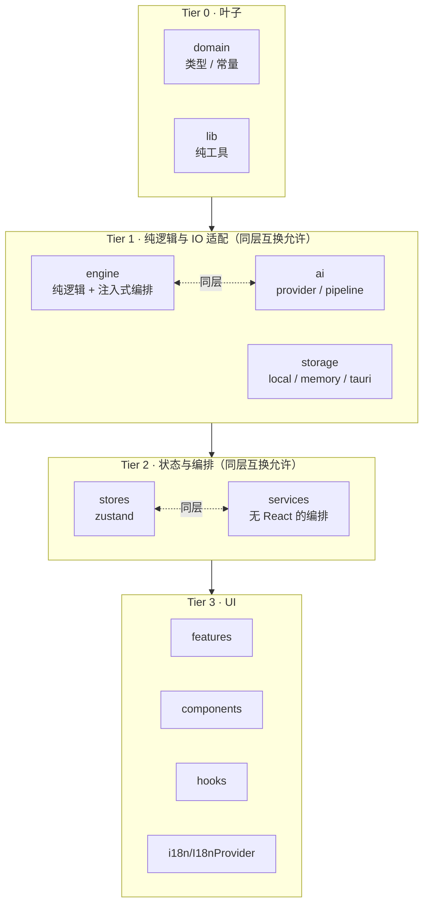

# 分层归位：引入 services 层、消除反向依赖 技术方案

| 字段 | 内容 |
|------|------|
| 作者 | Agent |
| 日期 | 2026-09-24 |
| 状态 | 待确认 |
| 关联需求 | `docs/code-gap-review-2026-09.md` §三（分层越界）· §七 第 3 批（分层归位，风险中） |

---

## 1. 背景

### 1.1 触发原因

代码缺口审计（`docs/code-gap-review-2026-09.md`）在 §三「分层越界」登记了两类反向依赖、在 §七 归为「第 3 批（分层归位，风险中）」，范围是：

> `stores → features`：把 memory-service / index-service 的真源下沉到 services 层
> `engine → i18n`：文案表改由调用方注入（engine 只产 key / enum）

本方案在执行前做了逐条实测，把「报告的表述」拆成**三件性质不同的事**——它们的严重度差一个量级，处置方式也不该相同。

### 1.2 现状实测（2026-09-24）

**① `index-service ⇄ useIndexStore` 是真正的 ESM 环（🔴 客观缺陷）**

| 方向 | 证据 | 位置 |
|------|------|------|
| 服务 → store | `import { storage } from "../../stores/useLoopStore";` | `src/features/learn/index-service.ts:28` |
| store → 服务 | `import type { IndexCoverage, IndexProgress } from "../features/learn/index-service";` | `src/stores/useIndexStore.ts:12` |
| store → 服务（运行时） | `const { embeddingCoverage, activeEmbeddingModel } = await import("../features/learn/index-service");` | `src/stores/useIndexStore.ts:54-56` |

`useIndexStore.ts:51-53` 的注释把这段动态 import 解释为「打断 store → features → store 的静态循环依赖」。但实测：

- `index-service` 同时被 `CommandPalette` / `ImportModal` / `LibraryPage` / `library/dialogs` / `chapter-qa-service` / `detail/SplitTab` **静态 import** ⇒ 它不可能被拆成独立 chunk，`await import()` 起不到任何分包作用；
- `npm run build` 因此报 `[INEFFECTIVE_DYNAMIC_IMPORT]`。

⇒ **既违反分层、又没实现它自己声称的目的，是纯负债。** 更糟的是它提供了一个「合法绕过分层」的示范，后来者会照抄。

**② 规则盲区：`stores → features` 从没被明文禁止（🟠 机制缺陷）**

| 文件 | 原文 | 是否覆盖 `stores` |
|------|------|------------------|
| `rules/code-structure-and-dependencies.mdc:37` | 「UI (features/components) must not be imported by **domain/engine/ai/storage**」 | ❌ 不在名单 |
| `rules/layer-import-boundaries.mdc:10-14` | 表格三行：`src/** → src-tauri` / `src-tauri → src` / `domain·engine·ai → React · src-tauri` | ❌ 无此行 |

而 `src/stores/useIndexStore.ts:4-5` 的文件头注释写着「分层约束：stores 不得反向依赖 features」，审计报告也按违规处理。

⇒ **规则与团队共识不一致。** 下一个人读 `rules/` 会得出「这样写合规」的结论——**本次越界能长期存在，根因就在这里**。只改代码不改规则，同一类问题必然复发。

**③ `engine → i18n`：能力已具备，只被默认值绑住（🟠）**

| 形态 | 证据 |
|------|------|
| **值**导入中文词典 | `src/engine/loop.ts:26` · `src/engine/learning-planner.ts:44`（`import { zh } from "../i18n/messages/zh";`） |
| 默认值裸挂 | `loop.ts:163` `runLearningLoop(..., m: Messages = zh)` · `loop.ts:250` `runChapterLoop(..., m: Messages = zh)` · `learning-planner.ts:67` `createLearningPlanner(m: Messages = zh)` · `learning-planner.ts:312` `buildChapterPlan(input, m: Messages = zh)` |
| 注入能力**已存在** | `tests/i18n-alignment.test.ts:134-171` 正向断言「注入 en → reasons 不含汉字」 |

⇒ 语言注入机制是好的，问题只在**默认值**：它让 engine 与中文词典在运行时绑定，且掩盖调用方漏传参数（漏传不报错，静默出中文）。

**④ 额外实测（报告未记，影响方案边界）**

| 事实 | 证据 | 影响 |
|------|------|------|
| `features/memory/*` **不** import stores | `memory-service.ts` 的 `store` 是注入的 `StorageAdapter` 参数；`useLoopStore.ts:28-30` 注释亦确认 | 记忆侧**无环**，只是背向依赖 ⇒ 可以「整体搬家」而不必改形态 |
| `stores → features` 全仓**恰好 6 行** | `useLoopStore.ts:31,32,42,43` + `useIndexStore.ts:12,55` | 范围封闭、可穷举验收 |
| `engine/ai/storage/domain → features` **0 命中** | 全仓 Grep | 报告的这条断言属实 |
| `src/engine|ai|storage` 不得 import `stores` 也**0 命中** | 全仓 Grep | 可作为门禁不变量 |
| `src/domain/**` 与 `src/lib/**` 是**纯叶子** | 0 条对外 import | 可作为门禁不变量 |
| `features/` 下共 **16 个 `*-service.ts`，全部 0 React** | `find` + `grep -c '"react"'` | 新建 `services/` 层不会成为空壳层 |
| F9 §8.14 **明文规定** store 是记忆的状态入口、「实现全部委托给服务层」 | `docs/learner-memory-design-2026-09.md:1525-1540` | ⇒ 本轮**不改 store 形态**，只搬服务模块 |
| `useIndexStore` 的 `refreshCoverage()` 与其自身文件头自相矛盾 | 文件头写「只存状态，不含编排逻辑」，却在 `:50-59` 里 await 服务 | ⇒ 见 §4.3，这是「环」的真正解法 |

### 1.3 不做的影响

1. 动态 import 的误导性注释继续留在仓库，每个新 store 都可能照抄这个「解法」；
2. 规则盲区使越界**结构性不可能被守住**（本次就是证据：代码注释写「不得」，规则没写，于是它躺了很久）；
3. engine 的 i18n 依赖继续被默认值掩盖，调用方漏传参数不会报错。

### 1.4 与既有设计的关系

`docs/learner-memory-design-2026-09.md` §8.14（1525-1540 行）规定 `useLoopStore` 持有 `memoryDoc`/`memoryMeta` 与 5 个动作、「实现：全部只是 storage 读写 + set(...)」。**本方案不推翻这条**——store 仍是记忆的唯一状态入口，只是它委托的**服务模块换了位置**。

---

## 2. 方案目标

| 类型 | 描述 |
|------|------|
| **主要目标** | ① 建立 `src/services/` 层并在 `rules/` + `AGENTS.md` 中定义层序；② `src/stores/**`、`src/components/**` → `src/features/**` 的 import **归零**（当前 6 行）；③ `src/engine/**` 对 `src/i18n/messages/zh` 的**值**引用归零（当前 2 文件），4 处 `= zh` 默认值删除、`m` 变必填；④ 新增可执行门禁 `npm run layer:check`，把「层序」从散文变成机器可查；⑤ `npm run build` 不再出现 `INEFFECTIVE_DYNAMIC_IMPORT` |
| **非目标** | ① **不迁** `features/` 下其余 12 个 `*-service.ts`（清单见 §3.1.3，独立批次）；② **不改** `NextAction.reasons` 的形态（决策 D2 选 A 档，B 档「engine 只产 key/params」已否决）；③ **不动** `ai → engine` 同层横向（`ai/pipelines.ts:34-35`、`ai/refine-batch.ts:18`，实测无环）；④ **不迁** `memory-samples.ts` / `memory-import.ts` / `memory-texts.ts` / `desktop-memory-doc.ts`（理由见 §4.2）；⑤ **不动** `src-tauri/**` 与 Rust 侧 `embed_default_model` 单侧孤儿（另开一轮）；⑥ **零 UI / 交互 / 文案变化** |
| **成功标准** | 见 §11.3（可执行、可观察） |

---

## 3. 项目现状

### 3.1 相关代码与模块

#### 3.1.1 待迁移的服务模块（精确清单）

| 现路径 | 行数 | 移到 | 迁移理由 |
|--------|------|------|----------|
| `src/features/learn/index-service.ts` | 292 | `src/services/learn/index-service.ts` | 报告范围；一致性归位（环已在 store 侧消除，见 §4.3） |
| `src/features/memory/memory-service.ts` | 261 | `src/services/memory/memory-service.ts` | **必需**：`useLoopStore` 值导入它，是背向依赖的本体 |
| `src/features/memory/memory-facts.ts` | 347 | `src/services/memory/memory-facts.ts` | **必需**：`memory-service` 的依赖闭包 |
| `src/features/memory/memory-doc-merge.ts` | 383 | `src/services/memory/memory-doc-merge.ts` | **必需**：同闭包（`useLoopStore` 亦取 `MergeStats` 类型） |
| `src/features/memory/memory-signals.ts` | 59 | `src/services/memory/memory-signals.ts` | **必需**：同闭包（`useLoopStore` 亦取 `MemorySignals` 类型） |

> 行数为 2026-09-24 实测（`wc -l`）。⚠️ 并行会话的提交可能改变它们，实施收尾须复测。

#### 3.1.2 刻意不迁的模块与理由

| 模块 | 留在 | 理由（均为实测） |
|------|------|------------------|
| `features/memory/memory-texts.ts`（100 行） | `features/memory/` | 它是 **i18n → 服务契约**的映射器（`Messages` → `MemoryDocScaffold` / `MemoryFactTexts`）。它是 UI 侧适配器，**必须知道 i18n**；而 `services/` 的目标之一正是让服务层不碰 i18n。 |
| `features/memory/desktop-memory-doc.ts`（90 行） | `features/memory/` | 依赖 Tauri `invoke`（`@tauri-apps/api/core`）+ `features/data/portability/desktop-backup`。下沉它会把 `src-tauri` 边界带进服务层。 |
| `features/memory/memory-samples.ts`（91 行） | `features/memory/` | 依赖 `features/profile/pii-mask`（46 行、零 import 的纯函数）。迁它必须连带迁 `pii-mask`（跨 feature 级联），**不在「消除 stores→features」的必需闭包内**。 |
| `features/memory/memory-import.ts`（234 行） | `features/memory/` | 消费者是 `MemoryAiDialog.tsx:29` + `MemoryPage.tsx:40` + `tests/learner-memory.test.ts:63`，**全部无 store 依赖** ⇒ 搬迁不带来任何分层收益；留在同目录只需把它对 `memory-signals` 的**类型**导入改指新位置（§8.16）。 |
| 5 个 `Memory*.tsx` + `MemoryPage.tsx`（586 行） | `features/memory/` | UI，本就属 features。 |

> **口径**：本轮迁移按**依赖闭包**切（「消除 stores→features 所必需的最小集」），不按个人偏好切。因此 `features/memory/` 会同时留存服务与 UI —— 这是**有边界、有记录**的半程，不是「一半一半」的失控。完整的 16 个 service 归位列为独立批次（§3.1.3）。

#### 3.1.3 未纳入本轮的 service 模块（登记，勿重复排期）

`features/` 下其余 12 个 `*-service.ts`（实测全部 0 React）：

```
data/portability/{export,import,pack-export,pack-import}-service.ts   goals/capability-service.ts
learn/{analyze,annotation,chapter-edit,chapter-qa,enrich,flashcard,restatement,split}-service.ts
profile/profile-service.ts
```

其中 8 个 import stores（`export` `pack-export` `capability` `annotation` `chapter-qa` `flashcard` `index` `restatement`）。**它们都不被 `stores/` 反向引用**，故不构成本轮缺陷。

### 3.2 相关文档与约定

| 文档 | 用途 |
|------|------|
| `rules/code-structure-and-dependencies.mdc` | §3 依赖方向（**需修改**：补层序、补禁令） |
| `rules/layer-import-boundaries.mdc` | 跨层表格（**需修改**：加一行） |
| `rules/engineering-code-style.mdc` | 导入顺序（external → parent → sibling → `import type`） |
| `AGENTS.md` | 目录地图 · Rules 要点 · 编码速记（**需修改**：加 `src/services`） |
| `docs/code-gap-review-2026-09.md` | §三 / §七 收口（**需修改**） |
| `docs/learner-memory-design-2026-09.md` | §8.x 文件路径注记（**需修改**：加一条位置变更注） |
| `scripts/ui-consistency-scan.mjs` | 新门禁脚本**照它的形制写**：`#!/usr/bin/env node` 头注 + `--fail-on` 退出码约定 + `--json` + 文件尾「已知局限」段 |
| `.workbuddy/skills/dead-code-cleanup/SKILL.md` | 提交分组与门禁安全网的做法 |

### 3.3 约束与依赖

| 约束 | 影响 |
|------|------|
| TS `strict` + `verbatimModuleSyntax` + `noUnusedLocals` | 未用导入即 TS6133/TS6196 ⇒ 路径改错会被 `typecheck` 抓到（但只在 `src/` 内） |
| `tsconfig.json` 只 `include: ["src"]` | **`tests/` 不参与 typecheck** ⇒ 测试里的路径错误只能靠跑 `test:*` 发现，不能靠 typecheck |
| 单测用 `node --experimental-strip-types` 直跑 | 被测模块必须是 `.ts`；**测试不得 import `.tsx`**。本批迁移的 5 个模块都是 `.ts` ✅ |
| `src/features/<域>/` 与 `src/services/<域>/` **同为 `src/` 下两层** | ⇒ 被迁模块的**内部相对导入无需任何改动**（`../../domain` / `../../ai/*` / `../../stores/*` 全部保持有效）。这是本方案风险低的关键。 |
| Node ≥ 22 | 门禁脚本用原生 ESM + `node:fs`，无新依赖 |
| `npm run build` 在本机需绕沙箱 | 沙箱 `safe-delete` 守卫拦 `vite:prepare-out-dir` 清 `dist/assets`（316 > 阈值 50）。与代码无关。 |

### 3.4 决策点（D1–D4）

| ID | 决策点 | 选项 | 推荐 | 状态 | 理由 |
|----|--------|------|------|------|------|
| D1 | 服务下沉到哪一层 | A 新建 `src/services/` · B 并入 `engine/` · C 只修真环不定层 | **A** | **已确认（2026-09-24）** | 语义准确（services = 无 React 的编排层）；`features/` 下已有 16 个 `*-service.ts`，新层不是空壳。B 档有硬伤：`index-service` 整体进不了 `engine/`（它 import stores，会造出新违规），只能拆两半；且 memory 服务进 engine 会让「engine = 纯逻辑」的定位变含糊。 |
| D2 | `engine → i18n` 解耦力度 | A 去默认值 + type-only · B engine 只产 key + params | **A** | **已确认（2026-09-24）** | 注入机制已存在（`i18n-alignment.test.ts` 正向断言 en 注入），问题只在默认值。A 档与仓库既有范式 `features/memory/memory-texts.ts`（i18n → 契约对象 → 服务层注入）一致。B 档需改 `domain/plan.ts` 的 `NextAction.reasons` 域类型 + 8 个生产点 + `primitives.tsx` + 4 个页面 + 重写 2 个测试，改动面约 3 倍，收益边际。 |
| D3 | 本轮迁移范围 | A 报告范围（memory 闭包 4 + index 1 = 5）· B 只迁 memory 闭包 4 · C memory 全簇 7 | **A** | **已确认（2026-09-24）** | 报告原文范围。B 档会让 `services/` 本轮只有 memory 一户，且 `index-service` 这个最大的编排服务仍留在 features，一致性更差。C 档需连带把 `pii-mask` 从 `features/profile/` 挪走（跨 feature 级联），超出「消除缺陷所必需」。 |
| D4 | 门禁形式 | A 加可执行脚本 · B 只改规则文案 | **A** | **已确认（2026-09-24）** | 本次越界能长期存在的**根因就是「规则只是一句口号」**（§1.2 ②）。只改文案等于复用同一个失效机制。仓库已有 `scripts/ui-consistency-scan.mjs` 作为「可执行判据」的先例。 |

---

## 4. 技术架构

### 4.1 总体架构：层序（本方案确立）



**允许与禁止（门禁脚本断言的 6 条不变量）**

| ID | 不变量 | 现状 |
|----|--------|------|
| **A1** | `domain/**` 不得 import 任何其它业务层 | ✅ 0 命中 |
| **A2** | `engine / ai / storage` 不得 import `stores / services / features / components / hooks` | ✅ 0 命中 |
| **A3** | `stores / services` 不得 import `features / components` | ❌ **6 命中 → 本批修完为 0** |
| **A4** | `engine / ai` 不得**值**导入 `i18n/messages/*`（`import type` 与 `i18n/types` 豁免） | ❌ **2 命中 → 本批修完为 0** |
| **A5** | 模块级**值**依赖图无环（`import type` 不计） | ✅ 0（由脚本确认） |
| **A6** | `lib/**` 不得 import 任何其它层 | ✅ 0 命中 |

**例外白名单**（写进脚本，需带理由注释）

| 边 | 理由 |
|----|------|
| `i18n/I18nProvider.tsx → stores/useLangStore` | Provider 是 React 组件，属 Tier 3；`i18n/messages/**` 与 `i18n/types.ts` 才是叶子。脚本按**文件**而非仅按目录判层。 |
| `hooks/** → stores/**` | hooks 是 UI 侧的 store 适配层，属 Tier 3 |

### 4.2 模块职责

| 层级 | 职责 | 本批变化 |
|------|------|----------|
| `domain/` | 类型 / 常量 / 阈值 | **+3 个类型**（`IndexProgress` / `IndexCoverage` / `IndexOffReason` 迁入 `domain/embedding.ts`） |
| `engine/` | 纯逻辑；可接受注入的 `StorageAdapter` 做只读编排（既有范式：`engine/loop.ts`） | **去 i18n 值依赖**（2 文件）+ 4 处默认值删除 |
| `ai/` `storage/` | provider / pipeline；持久化适配 | 无变化 |
| `stores/` | 状态容器；可持编排入口（F9 §8.14），委托给 `services/` | `useIndexStore` 反向依赖**清零**；`useLoopStore` 改指向 `services/memory/*`；`refresh(m?)` 补 `m ?? zh` 兜底 |
| **`services/`（新）** | **无 React 的编排层**。可读写 `stores` / `storage` / `ai` / `engine`；**不得** import `features` | 新建；本轮入驻 5 个模块 |
| `features/` | 页面与组件 | 仅改导入路径 |
| `i18n/` `lib/` | 横切 | 无变化 |

### 4.3 数据模型与 API

#### 4.3.1 类型归位（3 个）

`IndexProgress` / `IndexCoverage` / `IndexOffReason` 从 `features/learn/index-service.ts` 迁入 **`src/domain/embedding.ts`**（该文件已有 `Embedding` / `EmbeddingTargetType` / `embeddingKey`，同族；且经 `domain/index.ts` 的 `export * from "./embedding"` 已对外）。

理由：`IndexProgress` / `IndexCoverage` 必须低于 `stores` —— 否则 `useIndexStore` 要么继续反向 import 服务，要么把类型复制一份（「两把尺子」）。

#### 4.3.2 环的真正解法：store 纯化（本方案的核心改动）

`useIndexStore.ts:2` 的文件头写着「**只存状态，不含编排逻辑**」——而 `:50-59` 的 `refreshCoverage()` 恰恰在做编排（`await import` 服务 → 调 `embeddingCoverage`）。**是它在违反自己的设计。**

| 动作 | 位置 | 说明 |
|------|------|------|
| **删** `refreshCoverage(): Promise<void>` | `useIndexStore` | 编排能力交给服务 |
| **加** `setCoverage(c: IndexCoverage): void` | `useIndexStore` | 纯 setter，与既有 `begin/setProgress/finish/fail` 同族（文件头已声明这组是「服务驱动的状态迁移，UI 不直接调用」） |
| **加** `refreshCoverage(): Promise<void>` | `services/learn/index-service.ts` | `embeddingCoverage(activeEmbeddingModel())` → `useIndexStore.getState().setCoverage(c)` |
| 改 `rebuildIndex` 内部 | `services/learn/index-service.ts:206` | `await useIndexStore.getState().refreshCoverage()` → `await refreshCoverage()` |
| 改 3 个 UI 调用点 | `VectorIndexCard.tsx:63,123` · `DataPortabilityCard.tsx:251` · `KnowledgePackCard.tsx:335` | `useIndexStore.getState().refreshCoverage()` → 从服务导入 `refreshCoverage()` |

**效果**：`useIndexStore` 的导入清单只剩 `zustand` + `import type { IndexCoverage, IndexProgress } from "../domain"`。**反向依赖 0、动态 import 0、连 engine 都不用引。** 「环」从根上不存在了——不是用 `await import()` 绕开，而是消除了产生环的那条边。

#### 4.3.3 函数签名变化

```ts
// ---- engine/loop.ts ----
- import { zh } from "../i18n/messages/zh";
- import type { Messages } from "../i18n/messages/zh";
+ import type { Messages } from "../i18n/types";        // 类型出口，运行时零依赖

- export async function runLearningLoop(storage: StorageAdapter, goalId?: string, m: Messages = zh): Promise<LoopSnapshot>
+ export async function runLearningLoop(storage: StorageAdapter, goalId: string | undefined, m: Messages): Promise<LoopSnapshot>

- export async function runChapterLoop(storage, m: Messages = zh, goalId?: string): Promise<ChapterLoopSnapshot>
+ export async function runChapterLoop(storage, m: Messages, goalId?: string): Promise<ChapterLoopSnapshot>

// ---- engine/learning-planner.ts ----
- export function createLearningPlanner(m: Messages = zh): LearningPlanner
+ export function createLearningPlanner(m: Messages): LearningPlanner

- export function buildChapterPlan(input: ChapterPlanInput, m: Messages = zh): NextAction[]
+ export function buildChapterPlan(input: ChapterPlanInput, m: Messages): NextAction[]
```

> ⚠️ **`runLearningLoop` 的 `m` 位置**：保持 `m` 为**第 3 个**位置参数不变（`goalId` 仍是第 2 个且仍为可选），只去掉默认值。**不调换参数顺序**——调用点已有 `runLearningLoop(storage, activeGoal?.id, m)` 与 `runLearningLoop(emptyStorage, "missing", zh)` 两种写法，换序会引入无谓风险。`goalId?: string` 改为 `string | undefined` 是为了满足 `strict` 下「可选参数后不得再有必填参数」的约束。

#### 4.3.4 数据读写（按 `rules/layer-import-boundaries.mdc`）

| 路径 | 谁读写 | 本批变化 |
|------|--------|----------|
| UI → store | `VectorIndexCard` 读 `coverage`/`coverageLoaded`/`running` | 不变（仍是订阅 store） |
| UI → service → store | 设置页「重建索引」：`rebuildIndex()` → `begin/setProgress/setCoverage/finish/fail` | 新增 `setCoverage` 一环 |
| store → storage | `useLoopStore.storage`（唯一 storage 单例，`createStorage()`） | 不变 |
| service → storage | `services/learn/index-service` 经 `storage` 单例；`services/memory/*` 经**注入的** `StorageAdapter` 参数 | 仅位置变化 |
| 桌面能力 | `desktop-memory-doc.ts` → `invoke("memory_doc_*")`（**留在 features**） | 不变；`services/` 内**零** `invoke` |
| 持久化格式 / 迁移 | 无变化（不动 key、不动 SQLite `_schema_version`、不动导出白名单） | **零影响** |

### 4.4 状态与副作用

| 状态 | 位置 | 副作用触发时机 |
|------|------|----------------|
| `coverage` / `coverageLoaded` | `useIndexStore` | 进入设置页（`VectorIndexCard` mount）· 索引完成 · 导入/导出/知识包操作后 —— 均**由服务**调用 `refreshCoverage()` 后 `setCoverage` |
| `running` / `progress` / `error` | `useIndexStore` | 由 `rebuildIndex` 驱动，不变 |
| `memoryDoc` / `memoryMeta` | `useLoopStore` | `refreshMemory` / `saveMemoryDoc` / `applyMemoryAi` / `clearMemory` / `restoreMemory` / `markMemoryFileSaved` 后**回读 storage**（不拼装），不变 |
| 语言注入 | 调用方 | 由「隐式默认 zh」改为**显式传 `m`** |

---

## 5. 交互流程

> 本批**零 UI / 交互 / 文案变化**。因此本节不描述用户操作，而描述**运行时行为的等价性**——这是本批唯一需要「流程正确」的地方。

### 5.1 索引覆盖率读取（迁移前 → 迁移后）

**迁移前**（`useIndexStore.refreshCoverage`，`useIndexStore.ts:50-59`）

```
UI 调 store.refreshCoverage()
  → await import("../features/learn/index-service")   ← 动态 import 打断环（build 报 INEFFECTIVE_DYNAMIC_IMPORT）
  → embeddingCoverage(activeEmbeddingModel())          ← opts.storage 未传 ⇒ 回退到 storage 单例
  → set({ coverage, coverageLoaded: true })
```

**迁移后**

```
UI 调 services/learn/index-service.refreshCoverage()
  → embeddingCoverage(activeEmbeddingModel())          ← 服务内直接用 storage 单例（同迁移前）
  → useIndexStore.getState().setCoverage(coverage)     ← 纯 setter；store 不认识服务
```

**等价性**：读取的数据源、`storage` 单例、`activeEmbeddingModel()` 的实现、写入的字段（`coverage` + `coverageLoaded: true`）**逐字未变**。差异只在「谁编排」。

### 5.2 记忆整理（迁移前 → 迁移后）

```
MemoryPage mount → useLoopStore.getState().refreshMemory(signals, opts)
  → services/memory/memory-service.refreshFromFacts(storage, signals, opts)   ← 仅路径变更
  → loadMemory(storage) 回读 → set({ memoryDoc, memoryMeta })
```

**等价性**：`refreshFromFacts` 的签名与实现**零改动**（它本就注入 `StorageAdapter`）；`useLoopStore` 只改 import 路径。

### 5.3 语言注入（迁移前 → 迁移后）

| 调用点 | 迁移前 | 迁移后 |
|--------|--------|--------|
| `useLoopStore.refresh(m?)` | 内部 `runLearningLoop(storage, id, m)`，`m` 为 `undefined` 时 engine 默认 `zh` | 内部 `const msg = m ?? zh;`（`zh` 来自 store 已有的 import），再传 `msg` |
| `ReviewSession.tsx:137` | `createLearningPlanner()` 隐式取 `zh` | `createLearningPlanner(m)` 显式传（该组件已有 `useI18n()`） |
| `QuizReportPage.tsx:191` · `GoalDetailPage.tsx:76` | 已显式传 `m` | 不变 |
| 测试 | 5 个文件依赖默认值 | 显式传 `zh` / `en` |


> **语义变化说明**：迁移后「不传 `m`」在类型层面不成立。这是**刻意的**——本批要消除的正是「漏传即静默中文」。
> 兜底责任从 engine 上移到 `stores`（`useLoopStore` 的 `m?` 语义是「未指定界面语言 ⇒ 用默认中文」，这是**调用方**该做的决策）。该 store 迁移前就已 `import { zh }`（`useLoopStore.ts:27`，用于 `:215` 的 `zh.engine.duplicateSubmit` 兜底），故**未新增任何依赖**。

---

## 6. 用户用例（User Cases）

### UC-01：设置页查看向量索引覆盖率

| 项 | 内容 |
|----|------|
| 角色 | 最终用户 |
| 前置条件 | 桌面端已配置本地向量模型 |
| 主流程步骤 | 1. 进入 `设置 → AI 模型中心 → 向量索引` 2. 卡片 mount 触发覆盖率统计 3. 卡片显示百分比与「已索引 / 总数」 |
| 期望结果 | 与迁移前**逐字相同**的百分比与计数；无闪 0% |
| 异常/边界 | 未下载模型 → 覆盖率 0%；`total = 0` → `coveragePercent` 返回 0（既有行为，`useIndexStore.ts:66-69`） |
| 关联测试 | TC-UC01-01 · TC-UC01-02 |

### UC-02：打开 `/memory` 触发通道 A 整理

| 项 | 内容 |
|----|------|
| 角色 | 最终用户 |
| 前置条件 | 有学习记录（证据 / 复述 / 卡片 / 划线批注） |
| 主流程步骤 | 1. 进入 `/memory` 2. 页面 mount 采集信号 → 调 `refreshMemory` 3. 页头显示本轮动作报告 |
| 期望结果 | 记忆文档与 `memoryMeta` 与迁移前**逐字节相同**（合并器算法未动） |
| 异常/边界 | 浏览器预览（无 Tauri）→ 不落盘，仅 App 内文档；模型不可用 → 通道 B 报 kind，文案由 UI 映射 |
| 关联测试 | TC-UC02-01 |

### UC-03：英文界面下的 `/plan` 理由

| 项 | 内容 |
|----|------|
| 角色 | 最终用户（语言 = 英文） |
| 前置条件 | 有目标与章节 |
| 主流程步骤 | 1. 切英文 2. 进 `/plan` 3. 看动作卡的 reasons |
| 期望结果 | reasons **不含汉字**（与迁移前一致，已由 `i18n-alignment.test.ts` 断言） |
| 异常/边界 | 迁移后若某调用点漏传 `m` → **`tsc` 直接编译失败**（迁移前是静默出中文） |
| 关联测试 | TC-UC03-01 · TC-UC03-02 |

### UC-04：开发者执行分层门禁

| 项 | 内容 |
|----|------|
| 角色 | 开发者 / AI 助手 |
| 前置条件 | 仓库已 clone，Node ≥ 22 |
| 主流程步骤 | 1. 跑 `npm run layer:check` 2. 读输出 |
| 期望结果 | 迁移后 exit 0；若有人新引入 `stores → features`，exit 1 并**指名违规边与文件行号** |
| 异常/边界 | 脚本自身出错 → exit 2（与 `ui-consistency-scan.mjs` 的退出码约定一致） |
| 关联测试 | TC-UC04-01 · TC-UC04-02 |

---

## 7. 线框 UI（Wireframe）

**N/A —— 本批不产生任何 UI 变化。**

说明：本批改动全部在模块边界与导入路径上，纯逻辑与数据流等价（§5.1 / §5.2 逐字段对照）。不新增控件、不改布局、不动 token、不改 `data-testid`。因此 §7.1 / §7.2 / §7.3 均不适用。

唯一「可见」的变化是开发者视角的：`npm run build` 的 `INEFFECTIVE_DYNAMIC_IMPORT` 警告消失。

---

## 8. 涉及文件及改动伪代码

> 分四组：**新增** · **移动** · **修改（src）** · **修改（规则 / 文档 / 测试）**。

### 8.1 `scripts/layer-boundary-scan.mjs`（新增）

**改动说明**：把层序做成可执行判据。形制对齐 `scripts/ui-consistency-scan.mjs`（无 AST，启发式；头部注释说明「为什么要有它」；尾部「已知局限」；退出码 0/1/2；`--json`）。

```js
#!/usr/bin/env node
/**
 * 分层边界扫描器 —— 把「层序」从散文规则变成可执行判据。
 *
 * 为什么要有它：本次越界（stores → features，6 行）能长期存在，根因是
 * rules/ 只写了「domain/engine/ai/storage 不得 import features」，
 * 而 stores 从没被禁。规则不落成代码，就只是一句口号。
 *
 * 断言 6 条不变量（A1–A6，见 docs/architecture-service-layer-design-2026-09.md §4.1）
 * 用法：node scripts/layer-boundary-scan.mjs [--fail-on-violation] [--json]
 * 退出码：0 = 达标 / 报告模式；1 = 命中 --fail-on-violation；2 = 参数或运行错误
 */
const TIER = {
  domain: 0, lib: 0,
  engine: 1, ai: 1, storage: 1,
  stores: 2, services: 2,
  features: 3, components: 3, hooks: 3,
};
// i18n 按文件判层：messages/** 与 types.ts = 叶子；I18nProvider.tsx 等 = Tier 3
const ALLOWED_EDGES = new Set([
  "i18n/I18nProvider.tsx -> stores/useLangStore",   // Provider 是 React 组件（Tier 3）
]);
// A4：engine/ai 不得「值」导入 i18n/messages/*（import type 与 i18n/types 豁免）

function layerOf(relPath) { /* 取 src/ 后的第一段；i18n 特判 */ }
function collectImports(src) {
  // 三条正则：import ... from "x" / import "x" / import("x")
  // 返回 { target, isTypeOnly }
}
function resolve(fromFile, spec) { /* 相对路径 → 仓库内绝对路径；带 .ts/.tsx/ /index.ts 补全 */ }
function findCycles(graph) { /* 只计入 isTypeOnly === false 的边，Tarjan SCC */ }

// 主流程：遍历 src/**/*.{ts,tsx}（忽略 .d.ts）→ 建图 → 逐条断言 → 报告 → 按退出码返回
// --json：{ violations: [...], edges: [...], cycles: [...] }
```

**⚠️ 脚本与 npm 入口分两次提交**（保证每条 commit 的门禁都是绿的）：

| 提交 | 内容 | 理由 |
|------|------|------|
| T1 提交（第 1 条） | 只加 `scripts/layer-boundary-scan.mjs`（**默认报告模式，退出码恒 0**），并在 commit message 里记下修复前的**红基线 8 条** | 此刻仓库确有 8 条违规，若同时把 `--fail-on-violation` 挂进 npm，第 1–3 条提交的 `layer:check` 必红 |
| T7 提交（第 5 条） | `package.json` 加 `"layer:check": "node scripts/layer-boundary-scan.mjs --fail-on-violation"`（脚本另支持 `--json`，留给日后接 CI 用，不写进 npm 入口） | 此时 A1–A6 已全绿，严格档可以启用 |

### 8.2 `src/services/learn/index-service.ts`（移动，自 `src/features/learn/`）

**改动说明**：整体移动；**内部相对导入全部不变**（`../../domain` / `../../storage` / `../../ai/embedding` / `../../stores/*` 在 `src/services/learn/` 下依然正确）。改动仅三处：类型来源、新增 `refreshCoverage()`、`rebuildIndex` 内部改调它。

```ts
import type { Chunk, Embedding, EmbeddingTargetType } from "../../domain";
import { embeddingKey } from "../../domain";
import type { IndexProgress, IndexCoverage, IndexOffReason } from "../../domain";   // 新增：类型上移到 domain
// …其余导入不变…

// 删除本文件的 IndexProgress / IndexCoverage / IndexOffReason 三个 interface 定义（已迁 domain/embedding.ts）

- const progress: IndexProgress = { total: pending.length, done: 0, failed: 0 };   // 现在从 domain 导入

// 新增：状态机外壳 + 覆盖率编排（原在 useIndexStore.refreshCoverage）
/**
 * 重新统计覆盖率并写入 store。
 * 消费方：设置页 mount / 索引完成后 / 导入-导出-知识包操作后。
 * 为什么在服务里：store 只该存状态（useIndexStore 文件头）；且 store 反向 import 服务会成环。
 */
export async function refreshCoverage(): Promise<void> {
  const coverage = await embeddingCoverage(activeEmbeddingModel());
  useIndexStore.getState().setCoverage(coverage);
}

// rebuildIndex 内部
-     await useIndexStore.getState().refreshCoverage();
+     await refreshCoverage();
```

### 8.3 `src/services/memory/memory-service.ts`（移动，自 `src/features/memory/`）

**改动说明**：**纯移动，文件内容零改动**（其 `../../domain`、`../../storage/types`、`./memory-facts`、`./memory-doc-merge`、`./memory-signals` 全部仍有效）。

### 8.4 `src/services/memory/memory-facts.ts`（移动）

**改动说明**：纯移动，零改动（`../../domain` + `./memory-signals`）。

### 8.5 `src/services/memory/memory-doc-merge.ts`（移动）

**改动说明**：纯移动，零改动（只依赖 `../../domain`）。

### 8.6 `src/services/memory/memory-signals.ts`（移动）

**改动说明**：纯移动，零改动（`../../domain` + `../../storage/types`）。

### 8.7 `src/domain/embedding.ts`（修改）

**改动说明**：接收 3 个类型（自 `features/learn/index-service.ts` 迁入，逐字保留注释）。

```ts
/** 索引任务的进度（写入 useIndexStore；服务驱动，UI 只读）。 */
export interface IndexProgress {
  total: number;    // 待处理总数（仅缺失模式 = 缺失条数）
  done: number;     // 已成功写入的条数
  failed: number;   // 失败的条数（可重试）
}

/** 向量覆盖率（供设置页 / 资料卡展示）。 */
export interface IndexCoverage {
  total: number;    // 该类型下可被向量化的目标总数
  indexed: number;  // 当前模型已向量化的条数
}

/** 「未自动入队」的原因（undefined = 可以入队）。 */
export type IndexOffReason = "preview" | "disabled" | "no-model";
```

### 8.8 `src/stores/useIndexStore.ts`（修改）

**改动说明**：反向依赖清零。删动态 import、删 `refreshCoverage`，加 `setCoverage`；文件头注释按新事实改写。

```ts
- import type { IndexCoverage, IndexProgress } from "../features/learn/index-service";
+ import type { IndexCoverage, IndexProgress } from "../domain";

  interface IndexState {
    // …
    /** 覆盖率是否已加载过（避免 UI 首帧闪 0%）。 */
    coverageLoaded: boolean;

    // ---- 服务驱动的状态迁移，UI 不直接调用 ----
    begin: () => void;
    setProgress: (p: IndexProgress) => void;
-   //  （删除 refreshCoverage 的声明）
+   /** 写入覆盖率快照（**纯 setter**：统计在 services/learn/index-service，本 store 不认识它）。 */
+   setCoverage: (coverage: IndexCoverage) => void;
    finish: () => void;
    fail: (message: string) => void;
-   refreshCoverage: () => Promise<void>;
  }

- refreshCoverage: async () => {
-   // 动态 import 打断「store → features → store」的静态循环依赖…
-   const { embeddingCoverage, activeEmbeddingModel } = await import("../features/learn/index-service");
-   const coverage = await embeddingCoverage(activeEmbeddingModel());
-   set({ coverage, coverageLoaded: true });
- },
+ setCoverage: (coverage) => set({ coverage, coverageLoaded: true }),
```

文件头注释（新增一句，记录「为什么这里没有编排」）：

```ts
/**
 * 索引任务状态（useIndexStore）—— 只存状态，不含编排逻辑。
 *
 * ⚠️ 本模块**不得** import `features/` 或 `services/`：它曾经用 `await import()`
 * 「打断环」，实测无效（index-service 被 6 处静态引用 ⇒ build 报
 * INEFFECTIVE_DYNAMIC_IMPORT）。统计与编排现在归 `services/learn/index-service`，
 * 本 store 只提供 `setCoverage` 这个纯 setter。判据：`npm run layer:check`。
 */
```

### 8.9 `src/stores/useLoopStore.ts`（修改）

```ts
- import type { MemorySignals } from "../features/memory/memory-signals";
- import type { MemoryTexts, RefreshOptions } from "../features/memory/memory-service";
+ import type { MemorySignals } from "../services/memory/memory-signals";
+ import type { MemoryTexts, RefreshOptions } from "../services/memory/memory-service";
  import {
    applyAiEntries, clearMemoryDoc, loadMemory, markFileSaved, refreshFromFacts,
    restoreDismissed, saveUserDoc, useSystemVersion,
- } from "../features/memory/memory-service";
+ } from "../services/memory/memory-service";
- import type { MergeStats } from "../features/memory/memory-doc-merge";
+ import type { MergeStats } from "../services/memory/memory-doc-merge";
```

```ts
  refresh: async (m?: Messages) => {
    set({ loading: true, error: undefined });
    try {
+     // engine 不再有 `m: Messages = zh` 默认值（第 3 批：去 i18n 值耦合）。
+     // 兜底责任上移到调用侧：未指定界面语言 ⇒ 用默认中文。`zh` 本文件已导入
+     // （:215 的 duplicateSubmit 兜底），非新增依赖。
+     const msg = m ?? zh;
      const activeGoal = await storage.getActiveGoal();
      const [snapshot, chapterPlan] = await Promise.all([
-       runLearningLoop(storage, activeGoal?.id, m),
-       runChapterLoop(storage, m, activeGoal?.id),
+       runLearningLoop(storage, activeGoal?.id, msg),
+       runChapterLoop(storage, msg, activeGoal?.id),
      ]);
```

> 其余动作（`switchGoal` / `saveGoal` / `saveProfile` / `removeGoal` / `submitAnswer` / `undoReview`）都把 `m?: Messages` 原样转发给 `refresh(m)`，**无需改动**（兜底已在 `refresh` 内完成）。

### 8.10 `src/engine/loop.ts`（修改）

```ts
- import type { Messages } from "../i18n/messages/zh";
- import { zh } from "../i18n/messages/zh";
+ import type { Messages } from "../i18n/types";   // 类型出口；运行时零依赖
```
```ts
  export async function runLearningLoop(
    storage: StorageAdapter,
-   goalId?: string,
-   m: Messages = zh,
+   goalId: string | undefined,
+   m: Messages,
  ): Promise<LoopSnapshot> { /* 函数体不变 */ }

  export async function runChapterLoop(
    storage: StorageAdapter,
-   m: Messages = zh,
+   m: Messages,
    goalId?: string,
  ): Promise<ChapterLoopSnapshot> { /* 函数体不变 */ }
```

文件头补一句：

```ts
/**
 * ★ 语言注入契约（第 3 批）：本文件**不再**默认 `zh`。调用方必须显式传 `m`
 *   —— 漏传从「静默出中文」变成编译错误。兜底（未指定语言时用中文）属调用方决策，
 *   见 `stores/useLoopStore.refresh`。
 */
```

### 8.11 `src/engine/learning-planner.ts`（修改）

```ts
- import type { Messages } from "../i18n/messages/zh";
- import { zh } from "../i18n/messages/zh";
+ import type { Messages } from "../i18n/types";
```
```ts
- export function createLearningPlanner(m: Messages = zh): LearningPlanner {
+ export function createLearningPlanner(m: Messages): LearningPlanner {
```
```ts
  export function buildChapterPlan(
    input: ChapterPlanInput,
-   m: Messages = zh,
+   m: Messages,
  ): NextAction[] {
```

`specForChapter(chapter, record, now, m)`（`:216`）本就无默认值，**不变**。

### 8.12 `src/components/CommandPalette.tsx`（修改）

```ts
- import { activeEmbeddingModel } from "../features/learn/index-service";
+ import { activeEmbeddingModel } from "../services/learn/index-service";
```

### 8.13 `src/features/learn/*`（修改路径，5 个文件）

| 文件 | 原导入 | 新导入 |
|------|--------|--------|
| `ImportModal.tsx:32` | `from "./index-service"` | `from "../../services/learn/index-service"` |
| `LibraryPage.tsx:35` | `from "./index-service"` | `from "../../services/learn/index-service"` |
| `chapter-qa-service.ts:35` | `from "./index-service"` | `from "../../services/learn/index-service"` |
| `library/dialogs.tsx:42` | `from "../index-service"` | `from "../../../services/learn/index-service"` |
| `detail/SplitTab.tsx:41` | `from '../index-service'` | `from '../../../services/learn/index-service'` |
| `restatement-service.ts:42` | `from "../memory/memory-service"` | `from "../../services/memory/memory-service"` |
| `chapter-qa-service.ts:33` | `from "../memory/memory-service"` | `from "../../services/memory/memory-service"` |

### 8.14 `src/features/settings/VectorIndexCard.tsx`（修改）

```ts
- import { coveragePercent, useIndexStore } from "../../stores/useIndexStore";
- import { isAutoIndexCapable, rebuildIndex } from "../learn/index-service";
+ import { coveragePercent, useIndexStore } from "../../stores/useIndexStore";
+ import { isAutoIndexCapable, rebuildIndex, refreshCoverage } from "../../services/learn/index-service";
```
```ts
- const refreshCoverage = useIndexStore((s) => s.refreshCoverage);
   useEffect(() => { void refreshCoverage(); }, [refreshCoverage]);
```

### 8.15 `src/features/data/portability/{DataPortabilityCard,KnowledgePackCard}.tsx`（修改）

```ts
- await useIndexStore.getState().refreshCoverage();
+ await refreshCoverage();          // 从 ../../services/learn/index-service 导入
```

### 8.16 `src/features/memory/{MemoryPage,MemoryAiDialog,MemoryDiffNotice}.tsx`（修改）

| 文件 | 原 | 新 |
|------|----|----|
| `MemoryPage.tsx:34` | `from "./memory-doc-merge"` | `from "../../services/memory/memory-doc-merge"` |
| `MemoryPage.tsx:36` | `from "./memory-facts"` | `from "../../services/memory/memory-facts"` |
| `MemoryPage.tsx:38-39` | `from "./memory-service"` | `from "../../services/memory/memory-service"` |
| `MemoryPage.tsx:32` | `from "./memory-signals"` | `from "../../services/memory/memory-signals"` |
| `MemoryAiDialog.tsx:30` | `from "./memory-signals"` | `from "../../services/memory/memory-signals"` |
| `MemoryDiffNotice.tsx:14` | `from "./memory-doc-merge"` | `from "../../services/memory/memory-doc-merge"` |

`memory-texts.ts`（**留在 features**，但它引用的两个模块搬走了）：

```ts
- import type { MemoryFactTexts } from "./memory-facts";
- import type { MergeStats } from "./memory-doc-merge";
+ import type { MemoryFactTexts } from "../../services/memory/memory-facts";
+ import type { MergeStats } from "../../services/memory/memory-doc-merge";
```

`memory-import.ts`（**留在 features**，`./memory-samples` 不变、signals 搬走）：

```ts
- import type { MemorySignals } from "./memory-signals";
+ import type { MemorySignals } from "../../services/memory/memory-signals";
```

### 8.17 `src/features/quiz/paper-flow.ts`（修改）

```ts
- import { loadMemoryEntries } from "../memory/memory-service";
+ import { loadMemoryEntries } from "../../services/memory/memory-service";
```

### 8.18 `src/features/study/ReviewSession.tsx`（修改）

```ts
- const planActions = createLearningPlanner().buildPlan({ /* … */ });
+ const planActions = createLearningPlanner(m).buildPlan({ /* … */ });   // m 来自既有 useI18n()
```

### 8.19 `rules/code-structure-and-dependencies.mdc`（修改）

```md
## 3. No circular dependencies

- TS direction: **domain → engine / ai / storage → stores / services → features / components**
  - `engine` / `ai` / `storage` 互为同层（允许互换）；`stores` / `services` 互为同层（允许互换）。
  - ⚠️ **`stores` / `services` 不得 import `features` / `components`**（本条为 2026-09-24 补充：
    原规则只禁 `domain/engine/ai/storage`，`stores` 不在名单，导致 6 处反向依赖长期未被发现）。
  - ⚠️ `engine` / `ai` 不得**值**导入 `i18n/messages/*`（`import type` 与 `i18n/types` 豁免）。
  - 判据（可执行）：`npm run layer:check`
```

### 8.20 `rules/layer-import-boundaries.mdc`（修改）

表格新增一行：

```md
| Code in | Must not import from | How to talk instead |
|---------|----------------------|---------------------|
| `src/stores` `src/services` | `src/features` `src/components` | 服务层下沉到 `src/services/`；状态写入用 store 的纯 setter（如 `setCoverage`）——**不要用 `await import()` 打断环，实测无效** |
```

### 8.21 `AGENTS.md`（修改）

- 目录地图表格加一行：`src/services` | 无 React 的编排层（可读写 stores / storage / ai / engine；**不得** import features）——判据 `npm run layer:check` |
- Rules 表中 `code-structure-and-dependencies` 的「核心要点」补 `stores/services ↛ features`
- 编码速记「数据流」一条补：编排落 `src/services/<域>/`，UI 只经 store 或 service
- 「测试」一条补 `npm run layer:check`

### 8.22 `docs/code-gap-review-2026-09.md`（修改）

- §三 表格：两行标 `✅ 已收口（2026-09-24，第 3 批）`，并补「规则盲区」一行说明已补规则
- §七：第 3 批标 `✅ 已完成 2026-09-24`，附改动摘要与遗留（12 个 service 未迁）

### 8.23 `docs/learner-memory-design-2026-09.md`（修改，最小）

§8 开头加一条位置注记（**不逐条改写 §8.x 的 20 余处路径**——它们是方案期快照）：

```md
> ⚠️ 2026-09-24 分层归位（`docs/architecture-service-layer-design-2026-09.md`）：
> 下列 §8.1–§8.13 中标注为 `src/features/memory/*` 的**服务模块**已迁至
> `src/services/memory/*`（`memory-service` / `memory-facts` / `memory-doc-merge` / `memory-signals`）；
> `memory-texts.ts`、`desktop-memory-doc.ts`、`memory-samples.ts`、`memory-import.ts` 与全部 `.tsx` 仍留 features。
> 本节签名为**行为契约**，未变。
```

### 8.24 测试文件（修改，5 个）

| 文件 | 改动 |
|------|------|
| `tests/learner-memory.test.ts` | 9 处 import 路径 `../src/features/memory/*` → `../src/services/memory/*`（含 `:1413` 的 `await import`） |
| `tests/planner-prereq.test.ts` | 6 个 `buildChapterPlan({...})` 调用补 `, zh`；`import { zh } from "../src/i18n/messages/zh.ts"` |
| `tests/learner-profile.test.ts` | 3 个 `buildChapterPlan(...)` 调用补 `, zh` |
| `tests/chapter-scope.test.ts:112` | `runChapterLoop(s)` → `runChapterLoop(s, zh)` |
| `tests/i18n-alignment.test.ts` | **两条「默认中文」用例的命题被本批推翻**，同批改写（见 §12.1 TC-EDGE-01） |

---

## 9. 任务清单（Tasks）

| ID | 任务 | 依赖 | 复杂度 |
|----|------|------|--------|
| T1 | 新增 `scripts/layer-boundary-scan.mjs`（**报告模式**）；**迁移前先跑一次**，把当前 6+2 条违规记为「红基线」（证据留档 + 写进 commit message） | — | M |
| T2 | `domain/embedding.ts` 接收 3 个类型；`useIndexStore` 纯化（删 `refreshCoverage` + 动态 import，加 `setCoverage`） | — | S |
| T3 | `services/learn/index-service.ts` 移动 + 类型改指向 `domain` + 新增 `refreshCoverage()`；7 个消费方改路径/改调用 | T2 | M |
| T4 | memory 4 模块移到 `services/memory/`；9 个 src 文件改路径 | — | M |
| T5 | `engine/{loop,learning-planner}.ts` 去 i18n 值依赖 + 去 4 处默认值；`useLoopStore` 补 `m ?? zh`；`ReviewSession.tsx` 传 `m` | T4 | S |
| T6 | 5 个测试文件同步（路径 + 显式 `m` + 重写 2 条被推翻的断言） | T3 T4 T5 | M |
| T7 | 规则与索引：`rules/code-structure-and-dependencies.mdc` · `rules/layer-import-boundaries.mdc` · `AGENTS.md` · **`package.json` 启用 `layer:check`（严格档，此时已全绿）** | T1 | S |
| T8 | 文档回扫：`code-gap-review` §三/§七 · `learner-memory-design` §8 注记 | T3–T7 | S |

**门禁**：`npm run typecheck`（exit 0）· 全部 `test:*` 套件（0 fail）· `npm run layer:check`（exit 0）· `npm run build`（exit 0，且无 `INEFFECTIVE_DYNAMIC_IMPORT`）

---

## 10. 实施步骤

1. **步骤 1（T1）**：写扫描脚本，用 `--fail-on-violation` 临时跑一次 —— **预期 exit 1，且恰好列出 6 条 `stores → features` + 2 条 `engine → i18n` 值导入**。
   - 输出：验证脚本正确性（数量与位置须与 §1.2 实测一致）；把这份「修复前红基线」写进第 1 条的 commit message
   - 验证：违规条数 == 8；临时加 `--fail-on-violation` 时退出码 == 1
   - 提交时**去掉** `--fail-on-violation`（默认报告模式），npm 入口留到 T7
2. **步骤 2（T2+T3）**：先纯化 store（此时 `useIndexStore` 已无反向依赖，但 `refreshCoverage` 的 3 个 UI 调用点会编译失败）→ 立刻移动 `index-service` 并补 `refreshCoverage()` → 改 7 个消费方。
   - 验证：`npm run typecheck` exit 0；`node scripts/layer-boundary-scan.mjs` 的 `stores → features` 从 6 降到 4
3. **步骤 3（T4）**：移动 memory 4 模块 + 9 个 src 文件改路径。
   - 验证：`typecheck` exit 0；`node scripts/layer-boundary-scan.mjs` 的 `stores → features` 归 0；`npm run test:memory` 通过
4. **步骤 4（T5）**：engine 去默认值 + `useLoopStore` 兜底 + `ReviewSession` 传 `m`。
   - 验证：`typecheck` 报出的错误点应**只在 engine 的调用方**（这正是本步的目的）；改完后 exit 0；`node scripts/layer-boundary-scan.mjs` 的 A4 归 0
5. **步骤 5（T6）**：5 个测试文件同步；**与本批同批提交**（被 T5 推翻的既有断言不得拖到后面）。
   - 验证：`npm run test:i18n` / `test:prereq` / `test:profile` / `test:scope` / `test:memory` 全绿
6. **步骤 6（T7）**：改 3 份规则/索引文件。
   - 验证：`layer:check` exit 0；文档内引用的脚本名/层名与脚本实现一致
7. **步骤 7（T8）**：文档回扫（只改被推翻的事实 + 未兑现的承诺）。
   - 验证：`code-gap-review` §三/§七 已标完成；`learner-memory-design` §8 有位置注记
8. **步骤 8**：全量门禁 + 逐提交实测 + 提交。

**回滚策略**：本批为**纯结构重构、无行为变化**，回滚粒度 = 逐 commit `git revert`。无数据迁移、无持久化格式变化、无 feature flag 需求。
**提交分组**（按「逐提交可编译且相关套件绿」）：

| # | 提交 | 内容 |
|---|------|------|
| 1 | `chore(scripts): 新增分层边界扫描器（记录修复前 8 条红基线）` | T1（报告模式；npm 入口留到第 5 条） |
| 2 | `refactor(stores,domain,services): useIndexStore 纯化 + index-service 下沉（消环）` | T2+T3 |
| 3 | `refactor(services): memory 服务四模块下沉 services 层` | T4 |
| 4 | `refactor(engine): engine 去 i18n 值依赖与默认文案表` | T5 |
| 5 | `test,rules: 同步测试断言、补分层规则并启用 layer:check` | T6+T7 |
| 6 | `docs: 回扫第 3 批（缺口报告收口 + F9 位置注记）` | T8 |

---

## 11. 测试方案

### 11.1 测试范围与策略

| 层级 | 工具/方式 | 覆盖重点 | 不负责 |
|------|-----------|----------|--------|
| 单元 | `tests/*.test.ts`（`node --experimental-strip-types` 直跑，`npm run test:*`） | ① 记忆模块迁移后行为不变（`test:memory`）；② `reasons` 语言注入（`test:i18n`）；③ 章级计划前置排序未受签名变化影响（`test:prereq` / `test:profile` / `test:scope`） | UI 渲染 |
| 静态门禁 | `npm run typecheck` · **`npm run layer:check`（新）** | 导入路径正确性；6 条分层不变量；无环 | 运行时正确性 |
| 构建 | `npm run build`（需绕沙箱） | 警告清零（`INEFFECTIVE_DYNAMIC_IMPORT`） | — |
| E2E | **不做** | — | 受 `rules/no-headless-browser-validation.mdc` 约束，禁止主动起浏览器 |
| 手工 | 桌面端跑一次设置页索引卡 + `/memory` | 覆盖率显示与记忆整理的真实观感（迁移后行为等价） | — |

### 11.2 测试环境与数据

- 无需新 mock / fixture：迁移模块的测试已存在（`tests/learner-memory.test.ts` 覆盖 `memory-doc-merge` 五态、`memory-facts` 门槛、`memory-samples` 掩码）。
- `layer-boundary-scan.mjs` 支持 `--json`，可接入 CI（本仓库当前无 CI 配置，暂以 `npm run layer:check` 手动门禁）。
- 命令示例：
  ```
  npm run typecheck
  npm run layer:check
  npm run test:i18n && npm run test:memory && npm run test:prereq && npm run test:profile && npm run test:scope
  ```
  （`npm run build` 在本机需绕沙箱 `safe-delete`，见 §3.3）

### 11.3 通过标准

全部满足方可交付：

1. `npm run typecheck` → **exit 0，0 条 error TS**
2. `npm run layer:check` → **exit 0**（A1–A6 全绿）
3. 全部 `test:*` 套件 → **0 fail**
4. `npm run build` → **exit 0**，且输出**不含** `INEFFECTIVE_DYNAMIC_IMPORT`
5. `grep -rn '"\.\./features' src/stores/ src/components/` → **0 命中**
6. `grep -rn 'from "\.\./i18n/messages/zh"' src/engine/` → **0 命中**；`grep -n '= zh' src/engine/*.ts` → **0 命中**
7. 逐提交实测：每条 commit 单独 checkout 后 `typecheck` exit 0，且该提交相关的 `test:*` 套件绿

---

## 12. 测试用例

| ID | 关联 UC | 步骤 | 输入/操作 | 期望结果 | 类型 |
|----|---------|------|-----------|----------|------|
| TC-UC01-01 | UC-01 | 1. 桌面端进设置页向量索引卡 | 已配模型 | 覆盖率百分比与「已索引 / 总数」与迁移前逐字相同 | 手工 |
| TC-UC01-02 | UC-01 | 1. 点「重建索引」 | 有缺失向量 | running → 进度推进 → 结束刷新覆盖率（`setCoverage` 被调用） | 单元 + 手工 |
| TC-UC02-01 | UC-02 | 1. 跑 `npm run test:memory` | 既有 fixture | 全绿（`memory-doc-merge` 五态 / `memory-facts` 门槛 / 掩码边界） | 单元 |
| TC-UC03-01 | UC-03 | 1. 跑 `npm run test:i18n` | `createLearningPlanner(en)` | reasons 不含汉字，且 `reasons[0]` 与 `zh` 版不同 | 单元 |
| TC-UC03-02 | UC-03 | 1. 删掉某调用点的 `m` 参数 | TS 编译 | **编译失败**（迁移前为静默中文） | 静态 |
| TC-UC04-01 | UC-04 | 1. 迁移后跑 `npm run layer:check` | 干净树 | exit 0 | 静态 |
| TC-UC04-02 | UC-04 | 1. 在 `src/stores/` 临时加 `import { x } from "../features/..."` 2. 跑 `layer:check` 3. 撤销 | 人为违规 | exit 1，且输出指名该文件与行号 | 静态 |

### 12.1 边界与回归

| ID | 场景 | 期望 |
|----|------|------|
| TC-EDGE-01 | **被本批推翻的既有断言**：`tests/i18n-alignment.test.ts:126-133`「`createLearningPlanner()` 默认中文（不回退英文）」 | 该命题**不再成立**。**必须与本批同批改写**为「显式传 `zh` 得中文 / 传 `en` 得英文」，不得留到后续提交（否则中间提交 `test:i18n` 必红） |
| TC-EDGE-02 | `tests/i18n-alignment.test.ts:154-171`「`buildChapterPlan()` 默认中文 / (en) 英文」 | 改为显式传 `zh` / `en`；`en` 断言（无汉字）保留 |
| TC-EDGE-03 | `services/` 与 `stores/` **双向允许**（`stores → services` 用于记忆委托；`services → stores` 用于索引编排） | `layer:check` 的 A5（无环）必须由**模块级**判定，不能简化成「层级序号比较」——否则会误报 |
| TC-EDGE-04 | `i18n/types.ts` 的 `import type { Messages }` | **不算** A4 违规（类型出口，运行时零依赖） |
| TC-EDGE-05 | `i18n/I18nProvider.tsx → stores/useLangStore` | 命中白名单，不报违规（带理由注释） |
| TC-EDGE-06 | 迁移模块的内部相对导入（`../../domain` 等） | **零改动**即为正确（`features/<域>/` 与 `services/<域>/` 同为两层）——若脚本报「无法解析导入」，说明解析器需支持无扩展名相对路径 |
| TC-EDGE-07 | `tests/` 不在 `tsconfig.include` 内 | 测试路径错误**只能**靠跑 `test:*` 发现 ⇒ T6 必须实跑，不能只看 typecheck |
| TC-EDGE-08 | `useLoopStore` 在 `m === undefined` 时 | 走 `zh` 兜底（`:215` 的既有行为不变） |
| TC-EDGE-09 | `features/memory/memory-import.ts` 与 `memory-texts.ts` 留在 features 但引用已迁模块 | 编译通过；`layer:check` 不报（features → services 合法） |

---

## 实现偏离记录

> 实施过程中与本文档设计不一致之处，逐条记录（执行台账见 `docs/architecture-service-layer-runbook-2026-09.md`）。

| # | 位置 | 设计原文 | 实现 | 理由 |
|---|------|----------|------|------|
| 1 | §4.1 A5 | A5 现状标 `✅ 0（由脚本确认）` | 脚本实测**2 组既存环**：`engine/profile-band ⇄ quiz-engine`、`components/AppShell ⇄ CommandPalette ⇄ ImportModal` | 方案期只做了逐行 import grep，**未做 SCC**；实测推翻该断言。处置：脚本引入**环基线**（检测全量、只禁新增），既存 2 组登记为债务（不属本批「消 `stores→features` / 去 `engine→i18n`」的目标范围） |
| 2 | §4.1 A3 | A3 只写 `stores / services ↛ features / components` | **A3 扩为含 `components ↛ features`**（同层 Tier 3 内的语义反向） | 实测 `components/` 有 **4 条**指向 `features/` 的导入，而 §2 目标②本就承诺「`components/**` → `features/**` 归零」——不落成判据则该承诺无人能守。属「把既有承诺落成门禁」，**不扩修复范围** |
| 3 | §3.1.1 / §9 任务清单 | §2 目标②的 components 部分未排修复任务 | 4 条中 1 条（`CommandPalette.tsx:10 → index-service`）随本批下沉**自动消除**；余 3 条（`units` / `plan/chapter-action` / `ImportModal`）**入基线、不在本批修复** | 修它们需动 UI 挂载结构（`AppShell` / `ImportModal` / `units` / `chapter-action` 的归属），与本批「纯结构重构、**零 UI 变化**」的定位冲突，需单独方案 + UI 测试保护。已登记 `docs/code-gap-review-2026-09.md` |
| 4 | §8.24 测试文件清单 | 列了 5 个测试文件需改路径 | **漏报 3 个文件 5 处**：`rag-wiring.test.ts:22` · `retrieval.test.ts:18,20` · `embedding-local.test.ts:25`（import）与 **`:267`（`codeOf("src/features/learn/index-service.ts")` —— 静态边界断言里的字符串路径，非 import）** | 该清单由「逐行 grep **谁 import 了**被迁模块」产出，而 `:267` 是**字符串形态**的引用，grep import 语法必然漏。⇒ **迁移模块时清单须从 `tests/` 全目录 grep 被迁模块名产出**。首轮 `test:retrieval`/`test:embed`/`test:rag` 三红暴露 |
| 5 | §10 提交分组 | 6 条提交，测试文件同步单列一条 | 实际 **6 条但分组重排**：① 被本提交直接推翻的测试断言并入同一提交（`learner-memory` → memory 下沉条；4 个 engine 相关 → engine 条）；② §8.24 漏报的 3 个文件并入 index-service 下沉条；③ `git reset` 重排以消除「中间提交套件红」 | 仓库定则：**被本提交推翻的断言必须与本提交同批**；粒度＝逐提交可编译**且相关套件绿**。方案 §10 的原始分组会让 5 条中间提交套件红（未 push ⇒ 重排而非追加「修测试」提交掩盖）。详见 runbook「提交重排记录」 |

**基线机制**（两条不变的约定）：**检测全量、只禁新增**。既存债务照常打印在报告里、带指针，绝不因此让门禁变红，也绝不把存量伪装成绿的；债务还清后基线条目会触发「⚠️ 基线已失效（应删除对应条目）」提示。

---

## 变更记录

| 日期 | 变更 | 作者 |
|------|------|------|
| 2026-09-24 | 初稿（D1–D4 四项经用户确认：新建 services 层 / 去默认值 + type-only / 报告范围 5 模块 / 加脚本门禁） | Agent |
| 2026-09-24 | 实施期追加「实现偏离记录」3 条（A5 既存环实测推翻 §4.1 断言 · A3 扩含 `components ↛ features` · 目标② components 部分入基线不修） | Agent |
| 2026-09-24 | 收尾追加「实现偏离记录」第 4、5 条（§8.24 漏报 3 个测试文件 5 处旧路径 · §10 提交分组重排 + 历史重写）；§11.3 七条通过标准全部满足（全量 47/47 套件绿） | Agent |
