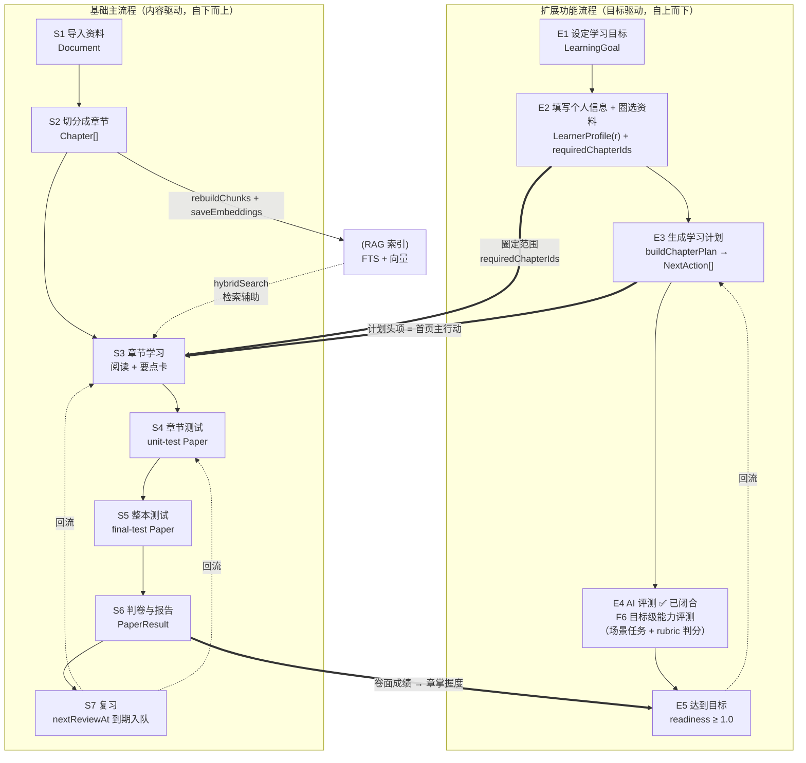

# Personal Learning OS · 端到端业务流程梳理

> 版本：v1.1 · 2026-09-14 初版 / **2026-09-21 缺口清单回扫** · 基准：工作区 HEAD（含未提交变更）
> 范围：**两条流程的全链路业务定义** —— 基础主流程（导入 → 切分 → 章节测 → 整本测 → 复习）与扩展功能流程（目标 → 画像/圈选 → 计划 → AI 评测 → 达标）
> 证据口径：所有环节标注**真实代码落点（文件:行）**，凡未接线/未实现者一律显式标注，不做"设计意图"式叙述
> 关联文档：`docs/learning-system-v2-design-2026-09.md`（V2 闭环设计）、`docs/library-module-design-2026-09.md`（资料库模块）、`docs/business-logic-review-2026-09.md`（业务逻辑评审）、`docs/rag-wiring-design-2026-09.md`（RAG 接线）
>
> ⚠️ **2026-09-21 回扫修订**：本文件的**缺口清单与完成度总览曾大面积过时** —— 至少 7 项已交付内容仍被列为开放缺口
> （S1 的 0 字符检测 / S2 的章节人工微调 / S7 的自评写入口径 / E2-b 的画像输入 / E3 的 deadline 排程 /
> P1 #8 与 P2 #9 的注释矛盾）。已按**实测**逐项回填 `~~删除线~~ + ✅ 已交付(日期)`，并保留原证据与更正说明。
> 逐条证据表见 `docs/doc-truth-rescan-2026-09.md`。**行号一律以实测为准 —— 引用前请复测**（本文件原引的行号
> 已有漂移：`submitAnswer` 不在 `:123`、`mergeChapters` 已更名 `mergeChapterRange`）。

---

## 零、TL;DR（结论先行）

**一句话模型**：用户把资料**导入**为 `Document`，系统**切成** `Chapter` 并建索引；用户**逐章学 → 逐章测**，再**整本综合测**；卷面成绩是掌握度的**唯一写入口**，掌握度随时间**遗忘衰减**并生成**到期复习**，回到学/测循环 —— 这一切由 `LearningGoal` 圈定的章节范围约束，就绪度 = 范围内达标章占比。

两条流程的**关系**：

| | 基础主流程 | 扩展功能流程 |
|---|---|---|
| 关注点 | **内容怎么变成学习行为**（内容侧） | **学习行为怎么服务于一个目标**（目标侧） |
| 起点 | 一份资料（Document） | 一个目标（LearningGoal） |
| 主对象 | Chapter → Paper → PaperResult | Goal → Plan → Readiness |
| 驱动方向 | 自下而上：先有内容，再谈学什么 | 自上而下：先定目标，再倒推学什么 |
| 汇合点 | **`LearningGoal.requiredChapterIds` 圈定的那批 Chapter** —— 基础流程产出的章节，正是扩展流程要学的范围 | |

**完成度总览（按 10 个阶段）**：

| 阶段 | 名称 | 闭环可跑通 | 关键缺口 |
|---|---|---|---|
| S1 | 导入资料 | ✅ | ~~扫描件 PDF 解析为 0 字符（pdfjs 局限）~~ ✅ **已收口（2026-09-21 实测）**：空文本抛 `PdfNoTextError` → `pdf-no-text` → UI 明确提示「疑似扫描件，请改用粘贴文本」；**仍无 OCR**（只是不再静默） |
| S2 | 切分成章节 | ✅ | ~~🌕 **人工微调原语已实现但无 UI**（rename/merge/reorder 零调用点）~~ ✅ **已交付（F7-a 章节编辑）**：`SplitTab` 已接线改名 / 区间合并 / 拖拽排序（`kind: 'rename' \| 'merge' \| 'reorder'`，见 `detail/SplitTab.tsx:177/187/195`） |
| S3 | 章节学习 | ✅ | 章内概念图谱需手动触发（**仍开放**） |
| S4 | 章节测试 | ✅ | 主观题强依赖 AI，无 AI 时剔除不计分（**仍开放**） |
| S5 | 整本综合测 | ✅ | 同上（**仍开放**） |
| S6 | 判卷与报告 | ✅ | — |
| S7 | 复习调度 | ✅ | ~~⚠️ **ReviewSession 走 `applyRating`（会改 mastery），与"双证据原则"不一致**~~ ✅ **已修（2026-09-20）**：`submitAnswer` 的 rating 分支改走 `applyKeyPointRating`，自评恒 `delta: 0` |
| E1 | 设定学习目标 | ✅ | — |
| E2 | 填写个人信息 + 圈选资料 | ✅ | ~~⚠️ **半缺失** / 🔴 **画像无任何输入字段，LearnerPage 纯只读**~~ ✅ **已交付（F1 学习者画像，2026-09-14）**：`LearnerProfileCard` 可编辑 + 简历导入，`useLoopStore.saveProfile` 为唯一写路径 |
| E3 | 生成学习计划 | ✅ | ~~🟠 deadline 不参与排程，ETA 与截止期脱钩~~ ✅ **已交付（F2 时间维度）**：`plan-quota.ts` 已按截止期摊派（今日应做 / 剩余天数 / 逾期），`/plan` 与首页消费 |
| E4 | AI 评测 | ✅ **已闭合** | ⚠️ 原文为「🔴 `generateAssessment/evaluateAnswer` 全部 `not implemented`」—— **已由 F6 目标级能力评测收口（2026-09-15）**，那两个废弃契约已从接口删除（T13） |
| E5 | 达到目标 | ✅ | ~~🟠 无达标庆祝/证书/复盘沉淀~~ **部分交付（2026-09-21 实测）**：全达标态已有（首页 `home.allDoneTitle` / `/plan` 同款 🎉 卡 + 「去测评巩固」动作），复盘材料已具备（F3 `/progress` 趋势与弱点榜、F6 能力报告已并列在目标详情页）；**仍开放**：无能力证书、无「下一步目标」引导、无达标总结页 |

> 主流程 = S1→S7；扩展流程 = E1→E5。**延伸流程五阶段现已全部接线**（E2 的画像输入由 F1 补齐）——原写「可端到端演示的是 S1→S7 + E1/E3/E4/E5」，已按 2026-09-21 实测更正。
>
> ⚠️ **本表修订记录（2026-09-15）**：E4 由 F6 收口（`docs/goal-capability-assessment-design-2026-09.md`）。
> **另注：E2 行同样已过期**（F1 学习者画像已于 2026-09-14 落地，含简历导入与三处消费点接线，见 `docs/learner-profile-design-2026-09.md`），
> 但 E2 不在 F6 范围内，本轮**未逐项核对**，仅在此标注以免误读。
>
> ⚠️ **本表修订记录（2026-09-21 回扫）**：S1 / S2 / S7 / E2 / E3 五行与 E5 的「关键缺口」均已过时，逐条实测见
> `docs/doc-truth-rescan-2026-09.md`。**上一条 2026-09-15 的「E2 未逐项核对」至此补齐。**

---

## 一、流程总览

### 1.1 全局流程图



### 1.2 领域对象与数据流全景

```
Document（资料）
  ├─ 1:n Chapter（章，学习/测评/计划的主对象）
  │        ├─ keyPoints: string[]          ← AI 精修 / 要点抽取
  │        ├─ keyPointRefs: 原文锚定       ← evidence-anchor
  │        ├─ unitIds: string[]            ← 章内概念（N5 概念层）
  │        └─ status: ChapterStatus        ← 状态机
  ├─ overview: string                      ← 整篇 map-reduce 摘要
  └─ analysis: { chaptersAt, conceptsAt, keyPointsAt }  ← AI 产物时间戳

KnowledgeUnit（概念）× KnowledgeRelation（关系） → 知识图（章下）

LearningGoal
  ├─ requiredChapterIds: string[]   ← V2 主维度（手动多选章节）
  └─ requiredUnitIds: string[]      ← 概念层（本期不编辑）

LearnerState.byUnit[subjectId]
  └─ { mastery, confidence, attempts, correctCount, cognitiveLevel,
       misconceptions[], applicationAbility, interviewAbility,
       lastReviewedAt?, lastAssessmentAt?, nextReviewAt? }

Paper（试卷） → 作答 → gradePaper → PaperResult
  └─ perChapter[id] = { score, previousMastery, mastery }  → applyPaperResult 回写 LearnerState

NextAction[]（计划）  ← buildChapterPlan（读 Goal 范围 + LearnerState + Chapter 状态）
  └─ actions[0] = 首页「今日主行动」
```

### 1.3 全流程数据流（证据链）

```
Document ──splitDocument──▶ Chapter[]
   │                            │
   │ chunkDocument              ├── 阅读 ── markReady ──▶ status: ready
   ▼                            │
 Chunk[] ──createEmbedder──▶ Embedding[] ──▶ RAG(FTS+向量)
                                │
                                ├── createPaper(scope) ──▶ Paper（本地确定性题 + AI 改写题面）
                                │         │
                                │         ├── QuizAnswerPage 作答 ──▶ savePaperDraft
                                │         ▼
                                │      gradePaper（客观本地判 + 主观 AI/pending）
                                │         ▼
                                │      PaperResult ──applyPaperResult──▶ LearnerState.byUnit
                                │         │                                    │
                                │         └── syncChapterStatus ──▶ Chapter.status  │
                                │                                              │
                                └──◀── buildChapterPlan ◀── LearnerState + Goal ◀─┘
                                          │
                                          ▼
                                   NextAction[] → /plan · 首页主行动
```

---

## 二、基础主流程（Learn → Prove → Review）

### S1 · 导入资料

| 项 | 内容 |
|---|---|
| **目的** | 把外部知识变成系统的 `Document` 实体，成为后续一切流程的原料 |
| **触发入口** | 全局 `ImportModal`（`src/features/learn/ImportModal.tsx`，挂载于 `AppShell.tsx:115`）。触发点：Header、`HomePage:480/512`、`LibraryPage:275/390`、`PlanPage`、`GoalsPage`、`CommandPalette:288` |
| **输入来源** | 三 Tab（`ImportModal.tsx:92,702`）：① **粘贴**（markdown / note / web / txt，L126-131 按类型分派 format）② **本地文件** ③ **GitHub** |
| **格式支持** | MD / TXT → `decodeBytes`（`import/decode.ts`，BOM + UTF-8/GB18030 嗅探）；**PDF → `pdfjs-dist` `extractPdfText`（`import/pdf.ts:19,56`）+ `promotePdfHeadings`（`import/pdf-layout.ts`，把疑似标题提升为 md 标题）**；GitHub → `buildGithubUnit`（`import/github.ts`）。统一护栏 `LIMITS`（`import/types.ts`） |
| **处理管线** | `runUnitImport`（`import/pipeline.ts:62`）**七步**：<br/>① 同 source 查重（L77-98）<br/>② markdown 清洗 `stripMarkdownNoise`（L102 / `normalize-text.ts:33`，删 badge/img/链接 URL）<br/>③ `saveDocument`（L114）<br/>④ `splitDocument`（L116）<br/>⑤ **AI 精修** `refineSplitResult`（L132）<br/>⑥ `saveChapters`（L138）<br/>⑦ `rebuildChunks`（L140） |
| **产物** | `Document`（`plos.documents`）+ `Chapter[]`（`plos.chapters`）+ `Chunk[]`/`Embedding[]`（SQLite） |
| **异常分支** | 切分得 **0 章** → 仅保存 Document，不写 chapters（`pipeline.ts:124`）；同 source 已存在 → 走查重分支（更新而非新建）。⚠️ 该分支**现在只对「有文本但切不出章」成立** —— 抽出 **0 字符**的 PDF 在更早的抽取环节就抛 `PdfNoTextError`（`import/pdf.ts:83`），根本走不到这里 |
| **降级行为** | 无 AI 时第 ⑤ 步跳过，用启发式切分结果直接落库 |
| **已知局限** | ~~📕 **扫描件 / 纯图片 PDF 经 pdfjs 解析为 0 字符**（无 OCR 兜底），会走到「0 章仅保存」分支，用户看到的是"导入成功但没章节"~~ ✅ **已收口（2026-09-21 实测）**：**仍无 OCR**，但空文本抛 `PdfNoTextError` → `local-files.ts:74` 映射 `pdf-no-text` → UI 提示「这份 PDF 抽不出文字（可能是扫描件），请改用「粘贴文本」」。用户不会再看到"导入成功但没有章节"这种无解释的结果 |

**关键设计约束**：切分归代码、零 AI —— 切分硬契约在 `index-chunks.ts` / `split-service.ts` 内**不得触发向量化**；AI 只在精修环节改标题与边界。

---

### S2 · 对资料进行切分成合适的章节

| 项 | 内容 |
|---|---|
| **目的** | 把一坨长文本切成"有标题、长度合理、可独立学习与测评"的学习单元 |
| **核心引擎** | `splitDocument`（`src/engine/splitter-engine.ts:59`）→ `resolveFormat:72`（auto 模式探测 `/^#{1,2}\s+/`） |
| **Markdown 策略** | `splitByHeadings:87` —— 按 ATX `#`/`##`（`mdHeadingMaxLevel=2`）逐行扫描记字符 offset；文档主标题吸收（L116-127）；短章自动合并 `mergeShortChapters:214`（`minBodyCharsPerChapter=200`，单章吞并防阈值 `MERGE_SINGLE_CHAPTER_MAX_BODY=10000`，L195） |
| **TXT/无标题策略** | `splitByParagraphs:279` —— `segmentByBlankLines:262` 按空行分段，累计达 `targetCharsPerChapter=1600` 或 `minParagraphs=3` 成章；要点兜底 `summarize:365`（取正文首句） |
| **AI 精修** | `refineSplitResult`（`ai/pipelines.ts:142`）→ `refineChaptersBatched`（`ai/refine-batch.ts:146`）→ `applyChapterRefine`（`splitter-engine.ts:398`）。AI 输出 `title` / `keyPoints` / `mergeIntoPrevious`（提示词 `refine-batch.ts:27-34`），**只做标题提炼 + 边界修正，不改配额、不新增章** |
| **落库** | `Chapter` → **localStorage**（`KEY_CHAPTERS = "plos.chapters"`，`storage/local.ts:28`，`saveChapters:145`）。调用方：`pipeline.ts:138`、`split-service.ts:88`、`analyze-service.ts:165/249/353`、`ChapterReaderPage:64/110`、`ChapterGraphPage:115` |
| **UI** | `detail/SplitTab.tsx` —— 「重新切分」(`:65 runSplit`) / 「AI 精修」(`:97 runAnalyze`) |
| **章级 AI 产物** | 统一在 `analyze-service.ts` 写 `doc.analysis.*`：<br/>· `analyzeChaptersNow:131` → 重写 `title`/`keyPoints`，写 `analysis.chaptersAt`<br/>· `analyzeKeyPointsNow:287` → `extractKeyPointsMapped`（`ai/chapter-map-reduce.ts`）→ `keyPointRefs` + `keyPoints`，写 `analysis.keyPointsAt`<br/>· `analyzeConceptsNow:183` → `extractConceptsMapped`（`ai/concept-map-reduce.ts`）→ `KnowledgeUnit` + `KnowledgeRelation` → `graph-engine.replaceChapterConcepts:223` 写图并回填 `Chapter.unitIds`<br/>· `generateOverviewNow:408` → `summarizeDocumentWithAi`（`ai/overview-pipeline.ts`）→ `doc.overview` |
| **AI 锚定护栏** | ②③ 的原文引用由 `evidence-anchor.ts` `anchorToDocument` 注入 —— **AI 不得自造引文**；引文锚不上时回退代码级合并 `mergeFallbacks`（引用式归并不变量：`body.slice(start,end) === quote`） |
| ~~🔴 **缺口**~~ ✅ **已交付（F7-a 章节编辑）** | ~~**人工微调原语已实现但完全未接线**：`renameChapter:462` / `mergeChapters:470` / `reorderChapters:491` 全仓 grep 仅命中定义处，**零 UI 调用点**。用户当前只能"重新切分"或"AI 精修"，无法手动改名/合并/调序~~ → **已接线**：`detail/SplitTab.tsx` 引入 `chapter-edit-service.applyChapterEdit`，支持**改名**（`kind: 'rename'`）、**区间合并**（`kind: 'merge'`，带确认框并显式告知实际合并章数）、**拖拽排序**（`kind: 'reorder'`），操作即落库（i18n `learn.detail.chaptersEdit.*`）。⚠️ 原引行号 `:462/:470/:491` 已漂移，且 `mergeChapters` 已更名 **`mergeChapterRange`** 并迁至 `engine/chapter-edit-engine.ts` |

---

### S3 · 学习章节（阅读 + 要点卡）

| 项 | 内容 |
|---|---|
| **入口** | `/learn` 章节目录（`LibraryPage`）→ `/learn/doc/:docId` 文档详情（`DocumentDetailPage`）→ `/learn/chapter/:chapterId` 阅读页（`ChapterReaderPage`） |
| **阅读页行为** | 打开即 `not-started → learning` 状态流转（`ChapterReaderPage.tsx:60-64`）；左侧章正文（`contentRef` 切片，不复制原文）；右侧要点卡 |
| **标记学完** | `markReady:104` → `status: ready` |
| **章级复习入口** | `ChapterReaderPage.tsx:116 markReviewed` → 调 `applyKeyPointRating`（**这里是对的**：只写调度 + confidence，不动 mastery） |
| **概念图谱** | `/learn/chapter/:chapterId/graph`（`ChapterGraphPage`），基于 `KnowledgeUnit` + `KnowledgeRelation`，react-flow 渲染 |
| **检索辅助** | `hybridSearch`（`ai/retrieval/hybrid-search.ts:63`）：FTS `fullTextSearch:76` + 向量 `cosineTopK:89` → `fuseRankings`（`rrf.ts`），RRF 融合，失败静默降级 FTS。调用点 `LibraryPage:131`、`CommandPalette:123` |

---

### S4 · 学习章节进行测试（单元测）

#### S4.1 出卷

| 项 | 内容 |
|---|---|
| **入口** | `/quiz/new` 三步向导（`NewQuizPage.tsx:153`）→ 范围（本章/多选章/全本）→ 模式 → 生成并开始 |
| **核心函数** | `createPaper`（`src/engine/quiz-engine.ts:175`），按 `scope.mode` 分派（L189-205） |
| **卷型配额** | · **unit-test**（`unitQuota:242`）：单章**客观 3** + （mastery band > 1 **且有 AI**）qa + application 各 1<br/>· **stage-test**（`stageQuota:260`）：每章 band 1 时客观 4；否则客观 3 + （band > 1 且有 AI）主观 1（qa/application 按章序轮换）<br/>· **final-test**（`buildFinalTest:289`）：总量 `clamp(3n, 15, 20)`，主观 = `min(round(total × 0.4), n × 2)`，客观约 60%，按章均摊余数<br/>· **retake**（`retakeQuota:279`）：每章客观 3、**主观剔除**、难度 `lift = -1` 降一档；跨文档聚合走 `createRetakePaper:406`（按 `documentId` 分组，干扰项取各文档其他章） |
| **难度自适应** | `bandOfMastery:36`（< 0.4 → 1，< 0.7 → 2，否则 3）；认知层级 `cognitiveOf:44`；难度 `difficultyOf:58` |
| **题目来源** | **本地确定性题库**（keyPoints 驱动）：`buildChoice:67` / `buildJudge:91` / `buildSubject:109` / `collectDistractors:131` |
| **AI 的作用** | **只改写题面，不改配额**：`paper-flow.ts:54 createPaperAndSave`（`:74` 先建本地卷 → `:88` 调 `generateQuizQuestionsWithAi` → `:96-98` 失败静默回退）。实现 `ai/pipelines.ts:299`（`buildQuizGenMessages:178`、`QUIZ_SYSTEM:167`、`mergeAiQuizContent:269` 逐题校验兜底） |
| **校验护栏** | `NEW_PAPER_MODES:342`、`PAPER_MODE_MIN_CHAPTERS:345`、`availablePaperModes:358`、`canCreatePaperMode:383` |
| **落库** | `Paper`，状态机 `open / grading / done`（`domain/quiz.ts:45`） |

#### S4.2 作答

| 项 | 内容 |
|---|---|
| **页面** | `/quiz/:paperId`（`QuizAnswerPage.tsx`） |
| **草稿** | 每答一题即 `storage.savePaperDraft`（`:78`）；载入时恢复（`:62`） |
| **交互** | 未答确认弹窗 `confirmUnanswered`（`:241`）；下一题按钮未答禁用（`:213`）；键盘 **1–4** 快捷选择（`:86-106`，textarea 内忽略） |
| **交卷** | `submit:112` → 存草稿 → `status: "grading"`（`:117`）→ 跳判卷页 |

#### S4.3 判卷

| 项 | 内容 |
|---|---|
| **页面** | `/quiz/:paperId/grading`（`QuizGradingPage.tsx`） |
| **客观题** | `gradePaper:500` 本地即时判分：`your === q.answer`（`:524`）；缺失答案判错 |
| **主观题** | 无 AI → **`pending`，不计分、不伪造**（`:514-521`）。有 AI → `gradeSubjectiveWithAi`（`ai/pipelines.ts:397`，分批 `gradeChunkSize`），提示词 `GRADE_SYSTEM:341`，输出 `{label, score, feedback, point}`，解析 `parseSubjectiveGrades:367`；**失败抛错由 UI 捕获并保留 pending**（`QuizGradingPage.tsx:147-152`）；合并 `mergeSubjectiveGrades:669` |
| **聚合** | 逐章**难度加权**聚合（`:538-543`），`totalScore = earnedW / totalW` |
| **回写** | `gradeAndApply:586` 逐章调 `applyPaperResult`（`:600`） |
| **状态** | `done` 在 `QuizGradingPage.tsx:161` 写入；5s 内可撤销 |
| **章节状态同步** | `syncChapterStatus`（`QuizGradingPage.tsx:393`）← `statusAfterExam`（`domain/chapter.ts:111`） |

---

### S5 · 学完整本进行测试（综合测）

| 项 | 内容 |
|---|---|
| **卷型** | `final-test` —— 全本范围，总量 `clamp(3n, 15, 20)`，主观占比 ~40%（`buildFinalTest:289`） |
| **触发条件** | 全章 `ready` 后由用户主动发起（`availablePaperModes:358` 判定可选卷型）；无强制门槛 |
| **判定语义** | 综合测是**目标就绪度判定的载体** —— 卷面成绩经 `applyPaperResult` 回写后，`readiness` 才可能达到 1.0 |
| **与单元测的差异** | 同一套判卷/报告管线，仅**范围与配额**不同；主观题轮转分配覆盖各章 |

**卷型总表**：

| 模式 | 触发场景 | 范围 | 题量 | 客观/主观 | 预计时长 |
|---|---|---|---|---|---|
| unit-test | 单章 ready | 1 章 | 3–5 | 客观 3（+ 主观 0–2 需 AI） | ~8 min |
| stage-test | 连续几章 ready | 2–3 章 | 每章 3–4 | 每章客观 3 + 主观 0–1 | ~15 min |
| final-test | 全章 ready / 目标就绪判定 | 全本 | 15–20 | 客观 ~60% / 主观 ~40% | ~30 min |
| retake | 单元测未达标 | 仅错题章 | 每章 3 | 全客观（降一档难度） | ~5 min |

---

### S6 · 判卷报告

| 项 | 内容 |
|---|---|
| **页面** | `/report/:paperId`（`QuizReportPage.tsx`） |
| **数据结构** | `PaperResult`（`domain/quiz.ts:98`）：`totalScore` / `perChapter{score, previousMastery, mastery}` / `wrongQuestions` / `objective` / `subjectiveAnswers` / `subjectiveScores` |
| **报告内容** | 总分与档位 · **逐章掌握度条 + 前 Δ**（`DeltaBadge`，`components/DeltaBadge.tsx:9`，间隔取 `reviewIntervalDaysForScore`，`:566`）· 错题回顾（含 AI 批语槽与定位要点 `aiPointLead`，`:630-638`）· 薄弱要点清单 |
| **下一行动** | 弱章（`< MASTERY_FLOOR`）→ 单章/聚合**补考**入口（`:191/205`）；内联计划 `buildChapterPlan`（`:185`）；主行动「生成学习计划」 |

---

### S7 · 根据测试结果进行复习（调度 + 衰减 + 会话）

这是主流程里**最容易被误以为是"装饰"、实际已真接线**的一环。

#### S7.1 掌握度回写（双证据原则）

| 函数 | 落点 | 行为 |
|---|---|---|
| `smoothedMastery` | `engine/learner-model.ts:85` | **`new = clamp01(0.65 × score + 0.35 × prev)`** —— 卷面是章 mastery 的**唯一写入口**；confidence 同系数（`:182`）；attempts/correctCount 只累加客观证据；同时写 `nextReviewAt = now + reviewIntervalDaysForScore(score) × 86400000`（`:206`） |
| `reviewIntervalDaysForScore` | `:36` | **≥ 0.8 → 7 天；≥ 0.6 → 3 天；否则 1 天** |
| `applyKeyPointRating` | `:219` | **不动 mastery / attempts**，仅 `confidence += step × 0.5`、写 `nextReviewAt`；`RATING_INTERVAL_DAYS:28` = forget 1 / hard 2 / good 4 / easy 7；`RATING_STEP:20` |
| `applyForgetting` | `:138` | **半衰期 30 天**；`decay = min(0.05, 0.5 × (1 − exp(−(days − 30) / 30)))`（`:152`）；`mastery × (1 − decay)` |
| 阈值 | `domain/plan.ts:49-50` | `MASTERY_THRESHOLD = 0.8`（达标）· `MASTERY_FLOOR = 0.6`（触发补考） |

> **双证据原则**（V2 决策记录）：章 mastery 唯一写方 = 卷面 `applyPaperResult`；四档自评降级为"要点复习"，只刷新调度与置信度。设计上完全自洽。

#### S7.2 复习调度闭环

```
applyPaperResult / applyKeyPointRating  ──写入──▶  UnitMastery.nextReviewAt
                                                          │
                                  isDueReview（domain/learner.ts:56：有值且 ≤ now）
                                                          ▼
              learning-planner.specForChapter:184-194  →  cls=4 review-points，携带 dueAt
                                                          ▼
                          buildChapterPlan 排序 → 计划队列 → /plan · 首页主行动
                                                          ▼
                         ReviewSession（/study/session）复习会话 → 再次更新 nextReviewAt
```

| 项 | 落点 |
|---|---|
| 写入点 | `applyPaperResult`（卷面 → mastery，**唯一写方**）、`applyKeyPointRating`（自评 → 仅调度 / 置信度）、`applyEvaluation`（测评对错 → mastery，`/assessment` 概念自测走此路）。⚠️ 原引行号 `:206 / :235 / :265` 均已漂移，且 `applyRating`（原 `:265`）**已零消费方**，不再是写入点 |
| 到期判定 | `isDueReview`（`domain/learner.ts:56`） |
| 到期入队 | `learning-planner.ts specForChapter:184-194` |
| 统计 | `learner/aggregate.ts:76` |
| 会话卡来源 | `study/ReviewSession.tsx`：概念模式用 `buildPlan` 缺口队列（`:109-140`）；非概念模式用 `snapshot.actions`（`:155-162`） |

#### ✅ S7.3 已知不一致（2026-09-20 已修）

~~`useLoopStore.ts:123 submitAnswer` 调用的是 **`applyRating`（会改 mastery）**，而非 `applyKeyPointRating`。这与"双证据原则"（自评不应移动 mastery）**直接矛盾**，也与章级入口 `ChapterReaderPage.tsx:116 markReviewed`（正确调用 `applyKeyPointRating`）行为不一致 —— 即**同一动作从两个入口进入会产生两种掌握度后果**。~~

**现状（2026-09-21 实测）**：`submitAnswer` 的 rating 分支已改走 `applyKeyPointRating`，与章级入口 `ChapterReaderPage::markReviewed` 口径统一，自评恒 `delta: 0`（`DeltaBadge` 因此增了中性态）。回归锁：`tests/session-rating.test.ts`。⚠️ 原文引的行号（`useLoopStore.ts:123`、`ChapterReaderPage.tsx:116`）**均已漂移** —— 本仓库行号引用一律以引用当日实测为准。

---

## 三、扩展功能流程（Goal → Profile → Plan → AI Assess → Achieve）

### E1 · 设定一个学习目标

| 项 | 内容 |
|---|---|
| **入口** | `/goals` 目标列表（`GoalsPage`）→ `/goals/new` 新建表单（`GoalFormPage.tsx`）；`/career` 301 重定向到 `/goals` |
| **数据模型** | `LearningGoal`（`domain/goal.ts:7-34`）：`id` / `type` / `title` / `description?` / `importance` / `requiredUnitIds[]` / `requiredChapterIds?[]` / `createdAt` / `deadlineAt?` |
| **目标类型** | `GGoalType` 六类：`career`（职业）/ `study`（学业）/ `exam`（考试）/ `personal`（个人）/ `research`（研究）/ `project`（项目） |
| **表单字段** | `GoalFormPage.tsx:49-54`：title · type · description · importance（high/medium/low）· deadline（`:265-276`）+ **章范围圈选** |
| **产物** | `LearningGoal` 落库，成为 `readiness` 与计划范围的唯一来源 |

**示例（用户提到的场景）**：目标 = "Agent 开发工程师" → `type: career`，`title: "Agent 开发工程师"`。

---

### E2 · 上传或填写自己的信息 + 圈选资料

这一阶段是**两个动作**，完成度差异极大。

#### E2-a · 圈选资料 ✅ 已实现

| 项 | 内容 |
|---|---|
| **交互** | **手动多选章节**（非标签/技能自动匹配）：`GoalFormPage.tsx` 按文档分组渲染 checkbox，`toggleChapter`（`:97-104`）、`toggleDoc` 全选（`:106-115`） |
| **空集语义** | `selected.size > 0 ? [...] : []`（`:140`）；**空数组 = 全库回退**，由 `goal-util.ts:45-49 scopeOf` 与 `loop.ts:249-252` 解释 |
| **产物** | `LearningGoal.requiredChapterIds` —— 这就是两条流程的**汇合点**：基础流程产出的 Chapter，在此被圈定为"要学的范围" |

#### E2-b · 填写自己的信息 ✅ **已交付（F1 学习者画像，2026-09-14）**

> ⚠️ 本节原为「🔴 未实现」，2026-09-21 实测已收口 —— 借 F1 落地（`docs/learner-profile-design-2026-09.md`）。原四条「现状/影响/缺口」逐条更正如下，**保留原文以便对照**。

| 项 | 内容 |
|---|---|
| **实体** | `LearnerProfile`（`domain/learner.ts`）已定义，字段即本节原「建议最小实现」所提：`level` / `weeklyMinutes` / `preferences{depth,style}` / `background?` |
| **页面现状** | `LearnerPage` 已是**两段式**：「**我声明的**」（`features/profile/LearnerProfileCard`，可编辑 + 简历导入）+「**我积累的**」（`features/learner/aggregate` 聚合）。`useLoopStore.saveProfile` 是唯一写路径 |
| **实际影响** | 画像已真实进入计划与节奏：`plan-quota.ts` 用 `weeklyMinutes` 反推容量、按 deadline 摊派「今日应做」；`chapter-action.ts` 的 `pace` 判定吃 profile（**必须走 `paceOf(profile)`，绝不回落默认 350**） |
| ~~**当时的现状**~~ | ~~`LearnerState` 只有 `byUnit[unitId]` 掌握度数据，无任何职业/学历/自评水平/偏好/可用时间字段~~ ✅ 画像**独立于** `LearnerState` 落在 `LearnerProfile`（`plos:profile`），两者分工：前者=行为证据，后者=用户声明 |
| ~~**当时的页面现状**~~ | ~~`LearnerPage` 是纯只读视图，无任何表单输入~~ ✅ 已有编辑表单（含「恢复默认/清除」与失配提示） |
| ~~**当时的实际影响**~~ | ~~画像对计划的唯一影响路径是 mastery 数值；用户填不填"我是零基础"，计划完全一样~~ ✅ 已不成立（见上「实际影响」） |
| ~~**当时的设计缺口**~~ | ~~V2 设计未定义 `LearnerProfile` 实体~~ ✅ 已由 F1 定义 |
| **仍开放** | 出卷难度自适应（`bandOfMastery:36`）仍只看 mastery，**未按 `profile.level` 在无历史时定 band** —— 与 §六 P2 #11 同族，仍登记 |
| ~~**当时建议的最小实现**~~ | ✅ **已交付（F1）**，三个消费点中 ② ETA 用 `weeklyMinutes` / ③ 节奏权重 已落地、① 出卷难度初值仍未做（见上「仍开放」）。以下为**原始字段草案，留档对照**：`{ level: "beginner"\|"basic"\|"intermediate"\|"advanced", weeklyMinutes: number, preferences: { depth: "breadth"\|"depth", style: "reading"\|"practice" }, background?: string }` |

---

### E3 · 生成学习计划

| 项 | 内容 |
|---|---|
| **核心函数** | `buildChapterPlan`（`src/engine/learning-planner.ts:273-317`） |
| **输入** | `LearningGoal.requiredChapterIds` + `LearnerState.byUnit` + `Chapter.status` + `chapterPrerequisiteIds` |
| **动作种类** | `ChapterActionSpec.kind`：`learn-chapter` / `chapter-quiz` / `retake-quiz` / `review-points`（`:155`） |
| **优先级类 `cls`** | **0 重学弱章 > 1 补考 > 2 复习要点 > 3 测已学章 > 4 到期复习 > 5 推进未学章** |
| **排序规则** | `:299-307` —— `cls` → 前置未掌握者后移（`blocked`）→ `dueAt` → `mastery` 升序 → `order` |
| **前置依赖** | 章级前置由 `chapterPrerequisiteIds`（`domain/knowledge.ts:93-115`）**把概念层 prerequisite 边抬升而来**；D2 章级软排序（标注而非硬阻断，`:289-295`） |
| **reasons 生成** | 概念层由 i18n key 生成：`engine.goalRequired` / `currentMastery` / `bottleneckPrereq` / `knownMisconception`（`:106-118`）→ 即 UI 上的 "why now" |
| **概念层排序（并行存在）** | `createLearningPlanner().buildPlan`（`:53-133`）：severity 分档 `not-started(0) > learning(1) > proficient(2)`，再 mastery 升序（`:71-76`）；对缺口做 **DFS**，用 `prerequisitesOf`（`domain/knowledge.ts:75-80`）把先决缺口提前（`:82-92`） |
| **ETA 估算** | `features/plan/chapter-action.ts:102-116 estimateEtaMin`：quiz 用 `PAPER_MODE_DURATION_MIN`；`review-points = clamp(章字符 / 800, 2, 12)`；`learn-chapter = clamp(章字符 / 350, 5, 40)`；兜底 8 分钟 |
| **展示** | `/plan`（`PlanPage.tsx`）：NEXT 前 3 条 + UP NEXT（`NEXT_LIMIT:41`）；执行走 `run-action.ts:28 useRunChapterAction`，补考就地 `makeRetakePaper` |
| **首页联动** | 主行动 = `chapterPlan.next = actions[0]`（`loop.ts:289`）→ `HomePage.tsx:226-255 NextActionCard`（reasons 即 why-now）；其余高优动作 `actions.slice(1, 4)`（`:116`） |
| **推荐引擎** | `recommendation-engine.ts:14-24`：仅按 `priority` 升序，`recommendNext = sorted[0]`，`topN = slice(0, n)`，**无额外评分逻辑** |
| ~~🟠 **缺口**~~ ✅ **已交付（F2 时间维度）** | ~~**`deadlineAt` 不参与任何排程计算** —— ETA 只算"需要多久"，不算"来不来得及"；无倒推、无超前预警~~ → `features/plan/plan-quota.ts` 已按截止期摊派（`daysLeft` / `dueTodayMin` / `overdue` / `overdueDays`），`/plan` 与首页展示「今日应做」；`chapter-action.ts` 的 `pace` 由 deadline + profile 判定，落后时给 `plan.behindWarning`（「按当前节奏，预计晚 N 天达标」）。见 `docs/plan-time-dimension-design-2026-09.md` |

---

### E4 · AI 进行评测　✅ **已闭合（2026-09-15，F6）**

| 项 | 内容 |
|---|---|
| **页面** | `/assessment`（`AssessmentPage.tsx`） |
| **入口** | `/assessment` 页内 `startChapterPaper:81-103` → `createPaperAndSave`（本地确定性题）—— 即"资料作用域"单章出卷 |
| **概念单元自测** | `AssessmentSession.tsx:34-147`：答案对照参考 + **人工自评对错**、1/2 键、写回 `submitAnswer` |
| ✅ **章级评测的本地判分** | `assessment-engine.ts`：无 AI 时**不伪造判分**，返回 `score: undefined`（pending）或 `notAnswered`，`misconceptions` **恒空**。**F6 T13 后此为唯一路径**（见下行） |
| ✅ **废弃契约已清理** | 原「所有 provider 的 `generateAssessment` / `evaluateAnswer` 直接抛错」—— **已于 2026-09-15（F6 T13）从 `AIProvider` 接口整体删除**（实测 4 处实现：`openai-compatible.ts` / `builtin.ts` / `registry.ts` / **`active.ts`**，全为零调用方）；`assessment-engine.ts` 同步止损为**纯本地确定性引擎**（`provider` 形参移除） |
| **结论** | **本地闭环可跑通**（客观题 + 人工自评）；**目标级 AI 评测已由 F6 落地**（下一行）；章级「AI 出题 / 判分」这一具体形态**已被有意放弃**，不再作为缺口 |
| **对 E4 的语义澄清** | 当时记录：「AI 进行评测」实际由三条已实现的 AI 链路部分承接 ① `generateQuizQuestionsWithAi`（改写题面）② `gradeSubjectiveWithAi`（主观题批改）③ 章级 map-reduce（要点/概念抽取）；真正缺失的是**"针对目标的能力评测"**。**→ 该缺口已由 F6 于 2026-09-15 补齐**：目标拆成 3–6 个能力项，用**场景任务**取证据、AI 按 rubric 逐项判分并给可锚回作答原文的引文，产出 append-only 能力报告；入口 `/goals/:goalId/capability`（`docs/goal-capability-assessment-design-2026-09.md`）|

---

### E5 · 达到目标

| 项 | 内容 |
|---|---|
| **就绪度公式** | **`readiness = 范围内 mastery ≥ 0.8 的章数 / 章总数`** |
| **落点** | `goal-util.ts:55-72 goalStatsOf`、`loop.ts:169-173`（概念层）、`HomePage.tsx:115`、`GoalDetailPage.tsx:140` |
| **前置动作** | 四处读点**均先 `applyForgetting`** —— 展示的是"此刻真实掌握度"，而非提交时的快照 |
| **达标判定** | `MASTERY_THRESHOLD = 0.8`（`domain/plan.ts:49`） |
| **展示** | `/goals/:goalId`（`GoalDetailPage`）逐章就绪度条；首页就绪度按当前目标章显示 |
| ~~🟠 **缺口**~~ **部分交付（2026-09-21 实测）** | ~~达标后**无任何收口动作**：无庆祝/成就、无能力证书、无复盘报告、无"下一步目标"引导~~ → **已具备**：全达标态（首页 `home.allDoneTitle` 🎉 卡 +「去测评巩固」动作，`/plan` 同款）+ 复盘材料（F3 `/progress` 趋势/弱点榜/时间线；F6 append-only 能力报告已并列在目标详情页）；**仍开放**：无能力证书 / 可复用产出清单、无「下一步目标」引导、无达标总结页 |

---

## 四、状态机与判定规则汇总

### 4.1 章节状态机

```
not-started ──打开阅读──▶ learning ──标记学完(markReady)──▶ ready
                                                              │
                                            卷面 ≥ 0.8 ────────┼──────▶ mastered
                                                              │
                                            卷面 < 0.6 ────────┴──────▶ retake ──┐
                                                                          ▲         │
                                                         卷面 0.6–0.8 且原 retake ───┘ → ready
```

| 项 | 落点 |
|---|---|
| 定义 | `domain/chapter.ts:18 ChapterStatus`、`CHAPTER_FLOW:31` |
| `not-started → learning` | `ChapterReaderPage.tsx:60-64` |
| `→ ready` | `markReady:104` |
| `→ mastered / retake` | `statusAfterExam`（`domain/chapter.ts:111`）；写回 `QuizGradingPage.tsx:393 syncChapterStatus` |

### 4.2 试卷状态机

`open` →（交卷）→ `grading` →（判卷完成）→ `done`（`domain/quiz.ts:45`；done 写入 `QuizGradingPage.tsx:161`）

### 4.3 关键常量表

| 常量 | 值 | 落点 | 语义 |
|---|---|---|---|
| `MASTERY_THRESHOLD` | 0.8 | `domain/plan.ts:49` | 章达标线 / 目标就绪判定 |
| `MASTERY_FLOOR` | 0.6 | `domain/plan.ts:50` | 触发补考下限 |
| 掌握度平滑系数 | 0.65 / 0.35 | `learner-model.ts:85` | `new = 0.65 × 卷面 + 0.35 × 历史` |
| 复习间隔（卷面） | 7 / 3 / 1 天 | `learner-model.ts:36` | 按卷面分档 |
| 复习间隔（自评） | 1 / 2 / 4 / 7 天 | `learner-model.ts:28` | forget / hard / good / easy |
| 遗忘半衰期 | 30 天 | `learner-model.ts:138` | 单次衰减 cap 5% |
| 切分最小章体 | 200 字符 | `splitter-engine.ts` | 短章合并阈值 |
| TXT 目标章长 | 1600 字符 / 3 段 | `splitter-engine.ts:279` | 无标题文档 |
| chunk 目标 / 硬顶 | 400 / 512 token | `chunk-engine.ts:117` | 检索分块 |
| embedding 维度 | 1024 | `ai/embedding.ts:37` | `qwen3-embed:0.6b` |
| 难度分档 | 0.4 / 0.7 | `quiz-engine.ts:36` | band 1/2/3 |

---

## 五、页面 ↔ 流程 ↔ 路由映射

| 路由 | 页面 | 所属阶段 | 承担的业务动作 |
|---|---|---|---|
| `/` | HomePage | E3/E5 | 今日主行动（`actions[0]`）+ 目标就绪度 |
| `/spaces` | SpacesPage | — | 学习空间 |
| `/learn` | LibraryPage | S1/S2/S3 | 资料库 + 章节目录 + 检索 |
| `/learn/doc/:docId` | DocumentDetailPage | S2 | 切分预览 / AI 分析（SplitTab 等） |
| `/learn/chapter/:chapterId` | ChapterReaderPage | S3 | 阅读 + 标记学完 + 要点复习 |
| `/learn/chapter/:chapterId/graph` | ChapterGraphPage | S2/S3 | 章内概念图谱 |
| `/quiz` | QuizCenterPage | S4/S5 | 试卷中心（历史/继续） |
| `/quiz/new` | NewQuizPage | S4/S5 | 三步出卷向导 |
| `/quiz/:paperId` | QuizAnswerPage | S4 | 作答（草稿/键盘流） |
| `/quiz/:paperId/grading` | QuizGradingPage | S6 | 判卷（客观即时 / 主观 AI） |
| `/report/:paperId` | QuizReportPage | S6 | 报告 + 补考入口 |
| `/assessment` | AssessmentPage | E4 | 概念自测 + 单章出卷（章级；**目标级 AI 评测走 `/goals/:goalId/capability`**） |
| `/goals` | GoalsPage | E1 | 目标列表 |
| `/goals/new` `/goals/:goalId/edit` | GoalFormPage | E1/E2 | 目标表单 + **章范围圈选** |
| `/goals/:goalId` | GoalDetailPage | E5 | 就绪度明细 + **CAPABILITY 摘要卡（F6）** |
| `/goals/:goalId/capability` | CapabilityPage | E4 | **能力框架管理 + 最新/历史能力报告（F6）** |
| `/goals/:goalId/capability/run/:runId` | CapabilityRunPage | E4 | **两阶段评测作答（客观卷 → 场景任务）（F6）** |
| `/learner` | LearnerPage | E2-b | 学习者画像（**我声明的**（F1，可编辑 + 简历导入）+ **我积累的**） |
| `/plan` | PlanPage | E3 | 计划队列（重学/补考/复习/推进） |
| `/study/session` | ReviewSession | S7 | 复习会话（四档自评） |
| `/settings` | SettingsPage | — | Provider 装配 / 模型中心 |
| `/knowledge` `/career` `/study` | — | — | 301 重定向（`/learn` `/goals` `/plan`） |

---

## 六、缺口清单（按严重度）

> ⚠️ **2026-09-21 回扫**：本清单原有 11 条 → **7 条已交付**（#1 / #3 / #4 / #5 / #6 / #8 / #9）、**1 条部分交付**（#7）、
> **仍开放 2 条**（#10、#11）。已交付项**保留原文 + 更正说明，不删** —— 便于对照当时的判断与证据。
> 逐条实测证据（文件/命令/结论）见 `docs/doc-truth-rescan-2026-09.md`。

### 🔴 P0 —— 动摇流程可信度

| # | 缺口 | 证据 | 影响 | 建议 |
|---|---|---|---|---|
| ~~1~~ | ~~**E2-b「填写自己的信息」完全不存在**~~ ✅ **已交付（F1 学习者画像，2026-09-14）** | 原证据：`domain/learner.ts:18-46` 无画像字段；`LearnerPage` 纯只读 | — | ✅ 原建议的实体与表单已落地（`LearnerProfile` + `LearnerProfileCard` + 简历导入）；三个消费点中 **ETA / 节奏权重已落地**，**出卷 band 初值仍未做**（转入 P2 #11 同族） |
| ~~2~~ | ~~**E4「AI 评测」契约未实现**~~ ✅ **已闭合（2026-09-15，F6）** | 原证据：`generateAssessment` / `evaluateAnswer` 全部抛 `not implemented`（`openai-compatible.ts:163-173` 等）；`assessment-engine.ts:56-85` 恒 pending | — | ✅ **已交付**：F6 目标级能力评测（场景任务 + AI rubric 判分 + 引文锚回作答原文 + append-only 报告，不改 mastery）；同时按 T13 删除那两个废弃契约。见 `docs/goal-capability-assessment-design-2026-09.md` |
| ~~3~~ | ~~**`submitAnswer` 走 `applyRating`，破坏双证据原则**~~ ✅ **已修（2026-09-20）** | 原证据：`useLoopStore.ts:123`（行号已漂移）vs 设计 `applyKeyPointRating` | — | ✅ 已按原建议改调 `applyKeyPointRating`；自评恒 `delta: 0`，`DeltaBadge` 增中性态；回归锁 `tests/session-rating.test.ts`。同批残留（三处源码注释 + 两条用户文案）于 2026-09-21 补清 |

### 🟠 P1 —— 流程可用但明显打折

| # | 缺口 | 证据 | 建议 |
|---|---|---|---|
| ~~4~~ | ~~**章节人工微调无 UI**~~ ✅ **已交付（F7-a 章节编辑）** | 原证据：`renameChapter` / `mergeChapters` / `reorderChapters` 零调用点（行号已漂移；`mergeChapters` 已更名 `mergeChapterRange`） | ✅ 已按原建议在 `SplitTab` 加**改名 / 区间合并 / 拖拽排序**，操作即落库 |
| ~~5~~ | ~~**`deadlineAt` 不参与排程**~~ ✅ **已交付（F2 时间维度）** | 原证据：`estimateEtaMin` 无 deadline 输入 | ✅ 已按原建议加「按截止期反推每日配额」（`plan-quota.ts::dueTodayMin`）+ 落后预警（`plan.behindWarning`）；见 `docs/plan-time-dimension-design-2026-09.md` |
| ~~6~~ | ~~**扫描件 PDF 解析为 0 字符**~~ ✅ **已交付（0 字符检测）** | 原证据：`pdf.ts` 仅 pdfjs 提取，无 OCR | ✅ 已按原建议加 0 字符检测 → `PdfNoTextError` → UI 提示「疑似扫描件，请改用粘贴文本」。⚠️ **OCR 兜底仍未做**（属 `roadmap` F8 范围 2，仍在规划） |
| ~~7~~ | ~~**达标后无收口**~~ **部分交付（2026-09-21 实测）** | 原证据：`GoalDetailPage` 仅显示就绪度 | **已具备**：全达标态（首页 / `/plan` 的 🎉 卡 +「去测评巩固」）、复盘材料（F3 `/progress` 趋势与弱点榜、F6 能力报告）。**仍开放**：无能力证书 / 可复用产出清单、无「下一步目标」引导、无达标总结页（原建议的「下一目标建议」仍未做） |
| ~~8~~ | ~~**plan 优先级注释与代码矛盾**~~ ✅ **已修（2026-09-20，与 P2 #9 同批）** | ⚠️ **本条原归责描述写错了**：写反的是 `learning-planner.ts:161`（旧文把「到期复习」排在「测已学章」之前），**`:9-10` 一直是对的**；原文所引 `:154` 也已漂移到 `:161`。已改正 `:161` 并写明实测档位 | ✅ 已统一注释；**未**调整 `cls` 值（实测 0 重学弱章 / 1 补考 / 2 复习要点 / **3 测已学章 / 4 到期复习** / 5 推进未学章，**3 优先于 4** 是刻意设计，非遗漏） |

### 📘 P2 —— 一致性 / 工程卫生

| # | 缺口 | 建议 |
|---|---|---|
| ~~9~~ | ~~`learning-planner.ts` 两处注释自相矛盾~~ ✅ **已修（2026-09-20，与 P1 #8 同批）** | ✅ 已收敛：`:161` 改为与文件头一致，并原地写明「本行在 2026-09-20 前写反，以本行为准」 |
| 10 | 章级与概念层两套 planner 并行（**仍开放**，2026-09-21 实测确认两者并存） | 明确 `createLearningPlanner().buildPlan`（概念层）与 `buildChapterPlan`（章级）的调用边界，避免未来误用 |
| 11 | 难度自适应只看 mastery，不看 `cognitiveLevel` 累积（**仍开放**，2026-09-21 实测确认：`bandOfMastery:36` 只吃 mastery；`cognitiveLevel` 全仓**仅被写入与聚合、零消费**） | 出卷难度引入 `cognitiveLevel` 权重；顺带用 `profile.level` 在无 mastery 历史时定 band（与 E2-b「仍开放」同族） |

---

## 七、给产品的一句话诊断

> **主流程（S1–S7）已经是一条真正跑得通的闭环**：导入 → 切分 → 学 → 测 → 判 → 报告 → 调度 → 复习，且数据真实回写、展示前会衰减、到期会入队。它的成熟度足以支撑端到端演示。
>
> **扩展流程（E1–E5）的"中间虚"已由 F6 补上（2026-09-15）**：本段原写「E1 / E3 / E5 已真正接线，E2 的"填写个人信息"与 E4 的"AI 评测"是两个空档」。**E4 现已闭合** —— F6 目标级能力评测落地：目标拆成 3–6 个能力项，用场景任务取证据、AI 按 rubric 逐项判分（引文锚回作答原文）、产出 append-only 报告且**不改 mastery**；入口在目标详情页（`docs/goal-capability-assessment-design-2026-09.md`）。
>
> 因此「设定目标 → 告诉我学什么 → **按我的水平测** → 判定我达标」这条叙事现在**四个环节都有真实实现**。**E2 的画像输入另由 F1 于 2026-09-14 补齐**（本文件未逐项核对，见 §零表格下方注）。叙事链上唯二未兑现的收口项也已补齐：**F3（趋势与复盘 —— 让积累的证据看得见）于 2026-09-16 落地**，**F4（导出 —— 兑现"随时带走"）于 2026-09-17 落地**（`docs/data-portability-export-import-design-2026-09.md`）。
>
> ⚠️ **2026-09-21 回扫后的诊断（覆盖前两段的部分判断）**：上面两段的问题不在结论，而在**本文件的缺口清单把 7 条已交付内容列为开放缺口** ——
> 读"诊断"的人因此被系统性悲观化。更正后的事实：主流程 S1–S7 闭合，扩展流程 E1–E5 原列 11 条缺口里**只剩三条未做** ——
> **P2 #10（章级与概念层两套 planner 并行）、P2 #11（`cognitiveLevel` 零消费）、以及达标收口的两项（能力证书 · 下一目标引导）**。
> **「诊断」类段落同样会过时 —— 引用前先实测。**

---

## 附：本次梳理核验过的关键事实

- 生成产物路径：`docs/business-flow-end-to-end-2026-09.md`
- 证据口径：全部结论均给出 `文件:行`，未使用"设计意图"推断；未修改任何生产代码
- 未运行 `npm run typecheck`（本次为只读梳理，无代码变更）
