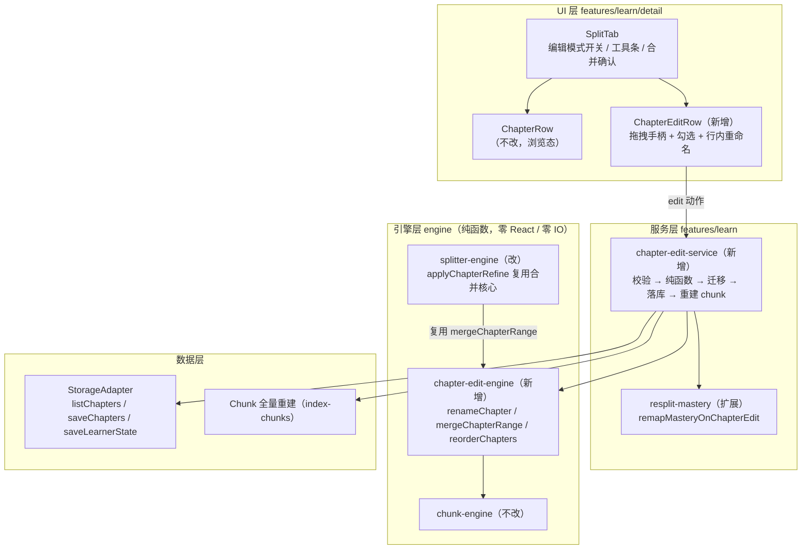
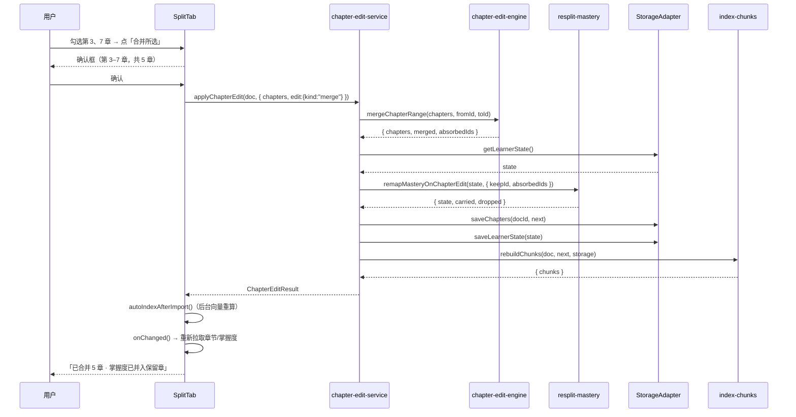

# 章节人工编辑（重命名 / 合并 / 拖拽排序）技术方案

| 字段 | 内容 |
|------|------|
| 作者 | Agent / 许一 |
| 日期 | 2026-09-14 |
| 状态 | 已实施（2026-09-14） |
| 关联需求 | `docs/roadmap-next-features-plan-2026-09.md` F7-a（P2 · 小~中）；`docs/business-flow-end-to-end-2026-09.md` 缺口 #4 |

---

## 0. 已确认决策（本次方案的前置）

| # | 决策项 | 结论 |
|---|--------|------|
| D1 | 拖拽排序实现 | **引入 `@dnd-kit`**（core 6.3.1 + sortable 10.0.0 + utilities 3.2.2），非原生 DnD、非上下移按钮 |
| D2 | 合并交互 | **编辑模式 + 多选 + 「合并所选」**，确认框显式告知实际区间与章数 |
| D3 | 保存时机 | **操作即保存**（改名提交即写、合并确认即写、拖拽落位即写），无草稿态、无撤销 |

---

## 1. 背景

### 1.1 为什么要做

章节由 `splitDocument` 自动切分（确定性代码 + 可选 AI 精修），但自动切分**无法保证边界与标题符合人的理解**：标题切分受原文标题层级影响，段落聚类受分段习惯影响。用户当前的唯二手段是「重新切分」和「仅 AI 精修」——前者会推翻全部结构，后者只改标题与要点、**不能合并或调序**。

结果是：一份被切成 17 章的 PDF，用户认为其中 5 章本该是一章，或者某章标题是原文的噪声标题——**没有任何办法修正**。

### 1.2 触发原因

引擎原语 `renameChapter` / `mergeChapters` / `reorderChapters` **早已实现**（`src/engine/splitter-engine.ts:462/470/491`），但**零调用点**（全仓 grep 仅命中定义处，`tests/` 零引用）。这是 V2 设计「切分结果可人工微调」的未完工部分。

### 1.3 与现有模块的关系

- 与 `split-service`（切分）**并列**：切分是"文档 → 章节"的初次生产，编辑是"章节结构"的后续修正，二者都写 `saveChapters` 并重建 chunk；
- 与 `analyze-service`（AI 精修）**共享合并语义**：AI 精修的 `mergeIntoPrevious` 同样是章节合并（`applyChapterRefine`，`splitter-engine.ts:424-434`），因此合并核心必须单一真源；
- 与 RAG 链路**耦合**：`Chunk.chapterId` 与 `Chunk.metadata.heading` 取自章节，结构变更后必须重建索引。

### 1.4 不做会怎样

1. 用户无法修正切分，资料质量受限于自动切分算法；
2. 规划文档 F7 与业务流程文档缺口 #4 长期挂账；
3. 后续 F7-b（手动拆分）、F7-c（跨文档组学习路径）都以此为前置，不做则整块「资料结构可控」能力无法推进。

### 1.5 一处既有文档冲突（需知悉）

`docs/library-module-review-2026-09.md:139/177` 曾把 `renameChapter` 列为**死代码建议删除**（P2-3 清债项）。**本方案不采纳该建议**：本次正是要接线使用，该条清债项应在本方案落地后从评审文档中撤销（见 §10 步骤 7）。

---

## 2. 方案目标

### 2.1 主要目标

| 类型 | 描述 |
|------|------|
| **主要目标** | 在资料详情页「章节列表」Tab 提供**编辑模式**，用户可对已切分章节执行：重命名、多选合并、拖拽排序；三者在操作后立即落库，且下游（计划排序 / 出卷范围 / 报告逐章 / 混合检索）读到的是新结构 |
| **成功标准** | 见 2.3（全部可脚本或手工验证） |

### 2.2 非目标（本次明确不做）

| 不做项 | 理由 / 归属 |
|--------|-------------|
| 删除章节 | 用户未要求；且删除涉及试卷/证据级联，语义需单独定义 → 留给 F7 后续迭代 |
| 手动拆分一章为两章 | 引擎无原语，需新算法 → F7-b |
| 跨文档组合学习单元/路径 | 涉及新的领域对象 → F7-c |
| 撤销 / 重做 | 操作即保存模型下需引入编辑栈；本次不做 |
| 批量重命名、编辑历史审计 | 无需求 |
| 编辑 AI 生成的 `keyPointRefs` 内容 | 引用由代码锚定，人工不应直接改偏移 |

### 2.3 成功标准（验收清单）

1. 编辑模式下可重命名任意章；回车/失焦提交后，刷新页面标题保持新值；
2. 勾选 ≥2 章后「合并所选」可用；确认后章数减少，**区间内未勾选的章也被合并**（与确认框告知一致）；
3. 拖拽排序落位后刷新页面，顺序与新 order 一致；
4. **合并后原掌握度不丢失**：被并章的掌握度按 `max/sum/并集` 规则并入保留章，且**其他章的掌握度完全不受影响**；
5. 三个操作完成后，该文档的 chunk 已重建（`chunk.metadata.heading` 为新标题、`chapterId` 为新章 id、`position` 为新顺序）；
6. `npm run typecheck` 0 error；`npm run test:chapters` 全绿；`npm run test:library` 与 `npm run test:rag` 不回归；
7. 中英文案成对存在，`npm run test:i18n` 通过。

---

## 3. 项目现状

### 3.1 相关代码与模块（含证据）

| 位置 | 现状 | 关键事实 |
|------|------|----------|
| `src/engine/splitter-engine.ts:462` | `renameChapter(chapters, chapterId, title): Chapter[]` | 纯函数、不改入参；`title.trim() \|\| c.title` 空串回退；**零调用点** |
| `src/engine/splitter-engine.ts:470` | `mergeChapters(chapters, fromId, toId): { chapters, merged }` | **区间合并**（from..to 全部吞并，实现未校验相邻）；⚠️ 三处缺陷见 3.1.1 |
| `src/engine/splitter-engine.ts:491` | `reorderChapters(chapters, orderedIds): Chapter[]` | Map 去重；未列出的保持原相对顺序附后；重写 order 1..n |
| `src/engine/splitter-engine.ts:509` | `renumber(chapters)`（私有） | 重写 order 1..n，不排序；被 `mergeChapters`/`reorderChapters`/`mergeShortChapters`/`applyChapterRefine` 使用 |
| `src/engine/splitter-engine.ts:398` | `applyChapterRefine` + `mergeIntoPrevious`（:424-434） | **AI 精修也做章节合并**，保留 prev 的 id；同样存在 3.1.1 的缺陷 |
| `src/engine/chunk-engine.ts:81` | `chunk.metadata.heading = chapter.title` | → **重命名后旧 chunk 的 heading 会变旧** |
| `src/engine/chunk-engine.ts:124` | `chunkDocument` 按 `sortChaptersByOrder` 遍历，`position` 全局连续 | → **调序后 chunk.position 会变** |
| `src/domain/chapter.ts:64-85` | `Chapter` 字段：`id/documentId/order/title/contentRef/keyPoints/keyPointRefs?/unitIds/status/createdAt` | `keyPointRefs.start/end` 是**文档绝对偏移**（:53）→ 区间扩大后原引用仍有效 |
| `src/storage/types.ts:50-51` | 章节只有 `listChapters(documentId)` + `saveChapters(documentId, chapters)` | **全量覆盖写**，无单章 update/delete → 三个操作都能用它一次落库 |
| `src/storage/tauri.ts:229` | `TauriStorage extends LocalStorageAdapter`（未 override 章节方法） | → **章节在桌面端也落 localStorage**，无 SQLite 迁移负担 |
| `src/features/learn/detail/SplitTab.tsx:36` | 章节列表 Tab，props 收 `chapters` | 现有按钮仅「切分/重新切分」「仅 AI 精修」；`onChanged()` 回调刷新 |
| `src/features/learn/detail/ChapterRow.tsx:40` | 章行（浏览态） | 序号 + 标题 Link + 字数/要点 + 状态徽标 + 掌握度条 + 展开预览；**只被 SplitTab 引用**（已核） |
| `src/features/learn/split-service.ts:60` | 切分落库范式 | 顺序：`matchResplit` → `saveChapters` → `saveLearnerState` → `rebuildChunks` ✅ 本次复用该范式 |
| `src/features/learn/resplit-mastery.ts:87/106` | `remapLearnerStateOnResplit` + 私有 `mergeUnits` | ⚠️ 前者会**丢弃所有未匹配的旧键**（`byUnit` 全新对象）→ 直接复用会清空其他章掌握度 |
| `src/features/learn/index-chunks.ts:36` | `rebuildChunks(doc, chapters, storage)` | 文档级幂等重建：查旧 chunk → 删向量 → 删 chunk → 写新 chunk |
| `src/stores/useLoopStore.ts:19` | `export const storage = createStorage()` | UI 直连 storage（章节 CRUD 不经 store），本方案沿用 |

#### 3.1.1 `mergeChapters` 的三处语义缺陷（本方案必须修）

| # | 缺陷 | 后果 |
|---|------|------|
| 1 | `keyPoints` 只取区间**首尾两章**（`:484` `[...chapters[from].keyPoints, ...chapters[to].keyPoints]`） | 被吞的中间章要点**全部丢失**；且未去重 |
| 2 | `unitIds` **未做并集**（`...chapters[from]` 直接保留首章值） | 被吞章的概念关联丢失 → `chapterPrerequisiteIds` 派生（`engine/knowledge.ts:93` 由 unitIds × prerequisite 边推出）与概念图谱归属出错 |
| 3 | `keyPointRefs` **完全未处理**（`...chapters[from]` 保留首章 refs，而 keyPoints 已并入他章要点） | `keyPoints` 与 `keyPointRefs[].point` **脱同步**（违反 `chapter.ts:77` 声明的同步契约） |

> 同样三处缺陷存在于 `applyChapterRefine` 的 `mergeIntoPrevious` 分支（`:429-431` 只 concat keyPoints，不动 unitIds/keyPointRefs）——这是**同源债**，本方案 §8.2 建议一并修（可选任务 T8）。

### 3.2 相关文档与约定

| 文档 | 采纳内容 |
|------|----------|
| `docs/roadmap-next-features-plan-2026-09.md:257-280` | F7 的 Done 三条：order/title/keyPoints 正确落库、下游无脏读、切片契约不破 |
| `docs/library-module-design-2026-09.md:36` | 引擎层复用契约 |
| `src/domain/chapter.ts:53` | **切片契约**：`keyPointRefs.start/end` 与 `contentRef` 同为 `doc.textPreview` 绝对偏移 |
| `rules/code-structure-and-dependencies.mdc` | 文件 ≤700 行；≥10 行 × ≥3 处必须抽取；依赖单向 `domain → engine/ai/storage → stores → features` |
| `rules/layer-import-boundaries.mdc` | UI → stores/storage；纯逻辑不依赖 React |
| `rules/engineering-code-style.mdc` | 相对导入、中文注释、i18n 双语成对、`import type` |
| `rules/no-headless-browser-validation.mdc` | 校验走 typecheck + node 单测 + 自审，**不起浏览器** |

### 3.3 约束与依赖

| 项 | 约束 |
|----|------|
| 新依赖 | `@dnd-kit/core@^6.3.1`、`@dnd-kit/sortable@^10.0.0`、`@dnd-kit/utilities@^3.2.2`（D1 已确认）；均为运行时依赖 |
| 环境 | Node ≥ 22、React 19、Vite 8、Tailwind 4；Tauri 2 桌面 + 浏览器预览双端 |
| 文件预算 | `splitter-engine.ts` 现 511 行；新增文件均须 < 700 行 |
| 数据 | 章节落 localStorage（含桌面端）；无 schema 迁移 |
| 上游依赖 | 无（引擎原语已在） |
| 下游影响 | planner / quiz-engine / 报告 / 混合检索（见 §3.1 表） |

---

## 4. 技术架构

### 4.1 总体架构



**依赖方向**：`domain ← engine ← features`（UI 只调服务层，服务层调引擎纯函数与 storage）。`chapter-edit-engine` **不得 import React / storage / ai**。

### 4.2 模块职责

| 模块/层级 | 职责 | 技术选型 |
|-----------|------|----------|
| `engine/chapter-edit-engine.ts`（新增） | 三个编辑原语的**唯一真源**：重命名、区间合并（完整语义）、重排；导出 `renumberChapters` | 纯 TS 函数 |
| `engine/splitter-engine.ts`（改） | 迁出三个原语与 `renumber`；`applyChapterRefine` 的合并分支改为调用 `mergeChapterRange` | 纯 TS 函数 |
| `features/learn/chapter-edit-service.ts`（新增） | 编辑编排：算新结构 → 算掌握度迁移 → 落库 → 重建 chunk；错误类型化 | async 服务 + `StorageAdapter` 注入 |
| `features/learn/resplit-mastery.ts`（扩） | 新增 `remapMasteryOnChapterEdit`（局部迁移，**不动未涉及的键**）；`mergeUnits` 改为导出 | 纯函数 |
| `features/learn/detail/ChapterEditRow.tsx`（新增） | 编辑态章行：拖拽手柄 + 多选 + 行内重命名 | React + @dnd-kit/sortable |
| `features/learn/detail/SplitTab.tsx`（改） | 编辑模式状态机、DndContext、合并确认框、结果提示 | React + @dnd-kit/core |
| `i18n/messages/{zh,en}.ts`（改） | 新增 `learn.detail.chaptersEdit` 命名空间 | 字典 |

### 4.3 数据模型与 API

#### 4.3.1 引擎纯函数（`src/engine/chapter-edit-engine.ts`）

```ts
import type { Chapter } from "../domain";

/** 重写 order 为连续 1..n（不排序，调用方保证输入有序）。原 splitter-engine 私有 renumber 迁移至此并导出。 */
export function renumberChapters(chapters: readonly Chapter[]): Chapter[];

/** 重命名（不改 order / 区间 / 其他字段）。空串或纯空白 → 保持原名。 */
export function renameChapter(chapters: Chapter[], chapterId: string, title: string): Chapter[];

/** 区间合并结果。 */
export interface MergeRangeResult {
  chapters: Chapter[];
  /** 合并后的章（未发生合并时为 undefined）。 */
  merged?: Chapter;
  /** 被并吞的章 id（不含保留章）——掌握度迁移的输入。 */
  absorbedIds: string[];
}

/**
 * 合并 [fromId, toId] 区间为一章（含中间所有章）。
 * 入参须按 order 升序；fromId 位置须在 toId 之前，否则原样返回。
 */
export function mergeChapterRange(
  chapters: Chapter[],
  fromId: string,
  toId: string,
): MergeRangeResult;

/** 按给定 id 顺序重排（未列出的保持原相对顺序附后），并重写 order。 */
export function reorderChapters(chapters: Chapter[], orderedIds: string[]): Chapter[];
```

**`mergeChapterRange` 的字段合并规则（本方案核心契约，逐字段明确）**：

| 字段 | 规则 | 理由 |
|------|------|------|
| `id` | 取**首章** id | 保留最靠前的稳定标识；避免生成新 id（新 id 会让历史试卷/证据全断） |
| `title` | 取首章 title | 与 id 同源；用户合并后可用重命名修正 |
| `contentRef` | `{ start: 首章.start, end: 尾章.end }` | 区间并集；因入参按 order 且切分区间连续，并集 = 首尾区间 |
| `keyPoints` | 区间内**所有章**并集 → 去空白 → `hasMeaningfulText` 过滤 → **去重** → 上限 **6** 条 | 修缺陷 #1；上限 6 与 `applyChapterRefine`（`:431`）对齐，避免两套口径 |
| `keyPointRefs` | 区间内所有章并集；缺失的章跳过；`point` 与合并后 `keyPoints` 的条目**逐一对齐**（按 point 文本匹配，匹配不上的条目丢弃） | 修缺陷 #3；绝对偏移在区间扩大后仍有效（`chapter.ts:53`） |
| `unitIds` | 区间内所有章**并集去重** | 修缺陷 #2；保证概念图与前置派生正确 |
| `status` | 区间内**进度最低**者 | 保守：合并后新章含未学内容，不应宣称已掌握。序：`not-started(0) < learning(1) < retake(2) < ready(3) < mastered(4)` |
| `createdAt` | 区间内**最早** | 表示"这一章自那时起存在" |
| `order` | 合并后由 `renumberChapters` 重写 1..n | 不变量 |

#### 4.3.2 掌握度迁移（`src/features/learn/resplit-mastery.ts` 扩展）

```ts
/**
 * 人工编辑（合并）后的掌握度局部迁移。
 * 与 remapLearnerStateOnResplit 的关键差异：**未涉及的键原样保留**，
 * 只把 absorbedIds 的 UnitMastery 并入 keepId 后删除被吞键。
 */
export function remapMasteryOnChapterEdit(
  state: LearnerState,
  merge?: { keepId: string; absorbedIds: string[] },
): { state: LearnerState; carried: number; dropped: number };

/** 原私有函数改为导出，供上面复用（避免复制粘贴的合并语义）。 */
export function mergeUnits(units: UnitMastery[]): UnitMastery;
```

`mergeUnits` 的既有语义（`resplit-mastery.ts:106-135`）：`mastery/confidence/applicationAbility/interviewAbility → max`、`attempts/correctCount → sum`、`lastReviewedAt/lastAssessmentAt/nextReviewAt → max`、`cognitiveLevel → 最高`、`misconceptions → 并集去重(≤8)`。**本次沿用，不新增规则。**

> ⚠️ **陷阱（必须在实现时防住）**：`remapLearnerStateOnResplit` 返回 `{ byUnit }` **新对象**，未匹配的旧键会被丢弃。人工编辑只动 1–2 章，直接复用会**清空该用户其他所有章的掌握度**。因此必须用上面的局部迁移函数，且单测要显式覆盖"未涉及键保持不变"。

#### 4.3.3 服务层（`src/features/learn/chapter-edit-service.ts`）

```ts
export type ChapterEdit =
  | { kind: "rename"; chapterId: string; title: string }
  | { kind: "merge"; fromId: string; toId: string }
  | { kind: "reorder"; orderedIds: string[] };

export type ChapterEditErrorKind = "no-chapters" | "chapter-not-found" | "invalid-range";

export class ChapterEditError extends Error {
  readonly kind: ChapterEditErrorKind;
  constructor(kind: ChapterEditErrorKind, message: string);
}

export interface ChapterEditOptions {
  storage: StorageAdapter;
  /** 当前章节（按 order 升序；调用方从文档详情页传入）。 */
  chapters: readonly Chapter[];
  edit: ChapterEdit;
  now?: number;
}

export interface ChapterEditResult {
  chapters: Chapter[];
  /** merge 时被并吞的章数。 */
  absorbed: number;
  /** 掌握度迁移：进入保留章的键数 / 被删除的旧键数。 */
  carriedMastery: number;
  droppedMastery: number;
  /** 重建的 chunk 条数。 */
  chunks: number;
}

export async function applyChapterEdit(
  doc: Pick<SourceDocument, "id" | "textPreview">,
  opts: ChapterEditOptions,
): Promise<ChapterEditResult>;
```

**执行序（严格对齐 `split-service.ts:80-93` 的既有范式）**：

```
1. 校验（无章节 / id 不存在 / from 在 to 之后 → 抛 ChapterEditError，不写任何数据）
2. 纯函数算 next chapters（renameChapter | mergeChapterRange | reorderChapters）
3. 算出 absorbedIds → 读 getLearnerState()
4. remapMasteryOnChapterEdit(state, merge)  ← 先算后写，不留半成品
5. await storage.saveChapters(doc.id, next)
6. if (carriedMastery > 0 || droppedMastery > 0) await storage.saveLearnerState(remapped.state)
7. await rebuildChunks(doc, next, storage)
8. 返回结果（向量重算由调用方异步触发，见 4.4）
```

**§4 数据读写路径（必填）**：

| 环节 | 路径 | 说明 |
|------|------|------|
| 读取章节 | UI `DocumentDetailPage` → `storage.listChapters(docId)`（`:64`） | 经 props 传入 SplitTab，服务层只消费不重新拉取 |
| 写入章节 | 服务层 → `storage.saveChapters(docId, chapters)` | **全量覆盖写**（`storage/types.ts:51`）；三后端统一，桌面端亦落 localStorage（`tauri.ts:229` 继承） |
| 读/写掌握度 | 服务层 → `storage.getLearnerState()` / `saveLearnerState()` | 仅在有迁移时写，避免无谓写盘 |
| 重建 chunk | 服务层 → `rebuildChunks`（`index-chunks.ts:36`）→ `deleteEmbeddingsByTarget` / `deleteChunksByDocument` / `saveChunks` | 文档级幂等；删除的是该文档全部旧向量 |
| 向量重算 | UI 异步 → `autoIndexAfterImport()`（`features/learn/index-service`） | 后台任务，不阻塞交互（与 `SplitTab.tsx:80` 同做法） |
| Tauri IPC | **无** | 章节不走 SQLite，本方案不新增任何 `invoke` |
| 浏览器预览守卫 | 不涉及 | 无 vault/llm 调用 |

#### 4.3.4 是否需要重建 chunk：三个操作全都要

| 操作 | 为什么要重建 | 依据 |
|------|--------------|------|
| rename | `chunk.metadata.heading` 存的是章标题 → 不重建则检索结果仍显示旧标题 | `chunk-engine.ts:81` |
| merge | `chunk.chapterId` 指向已不存在的章 → 孤儿 chunk，且新章无 chunk | `chunk-engine.ts:75` |
| reorder | `chunk.position` 由章节顺序决定 → 不重建则位置序号与新顺序不一致 | `chunk-engine.ts:124` |

**统一重建**（不做"按操作区分"的优化）：代价是该文档向量被清空后由后台任务重算，收益是消除"何时需要重建"的判断分支——少一个分支就少一类脏数据。

### 4.4 状态与副作用

| 状态 | 位置 | 说明 |
|------|------|------|
| `editing: boolean` | SplitTab 本地 state | 编辑模式开关；退出时清空选中与重命名态 |
| `selectedIds: Set<string>` | SplitTab 本地 state | 多选合并的选中集；章节列表变化时求交集清理 |
| `renamingId: string \| null` | SplitTab 本地 state | 当前处于行内重命名的章 id（同时只允许一个） |
| `busy: boolean` | SplitTab 本地 state | 编辑落库 + 重建 chunk 期间禁用交互（参考现有 `splitting`） |
| `notice?: string` | SplitTab 本地 state | 操作结果提示（沿用现有 `notice` 渲染块） |
| 拖拽中顺序 | `DndContext` 内部 | **不落库**；仅在 `onDragEnd` 时一次性落库 |
| 章节/掌握度数据 | `DocumentDetailPage` state | 编辑成功后调 `onChanged()` 重新拉取 |

**副作用触发时机**：只在用户显式操作后触发（改名提交、合并确认、拖拽落位）；无轮询、无 mount 副作用。

---

## 5. 交互流程

### 5.1 主流程

**进入编辑模式**
1. 用户在「章节列表」Tab 点工具条右侧「编辑章节」按钮；
2. 按钮变为「完成」，工具条右侧出现「合并所选（N）」按钮（初始禁用）；
3. 每行左侧出现拖拽手柄（`GripVertical`）与勾选框，标题区从链接变为「标题 + 重命名按钮」。

**重命名**
4. 用户点某行的重命名按钮（或标题本身）→ 标题原地变为输入框，内容预填当前标题，自动全选；
5. 用户输入后按 Enter 或点击别处 → 校验：值未变化则不写库，直接退出编辑态；值有效 → 调 `applyChapterEdit({kind:"rename"})`；
6. 成功后提示「标题已更新」，列表刷新，退出该行重命名态。

**合并**
7. 用户勾选 ≥2 章（勾选第 3 章与第 7 章，中间 4/5/6 未勾选）→ 按钮显示「合并所选（2）」；
8. 点击 → 确认框：「将合并第 3–7 章共 5 章」+ 列出区间内各章标题（超过 5 条时显示「等 N 章」）；
9. 确认 → 调 `applyChapterEdit({kind:"merge", fromId, toId})`；
10. 成功后提示「已合并 5 章 · 掌握度已并入保留章」，选中清空，列表刷新。

**拖拽排序**
11. 用户按住某行手柄向上/下拖动，其他行实时让位（仅本地视觉，不落库）；
12. 松手（`onDragEnd`）→ 用 `arrayMove` 得到的顺序作为 `orderedIds` 调 `applyChapterEdit({kind:"reorder"})`；
13. 成功 → 提示「顺序已更新」，列表以新顺序刷新。

### 5.2 分支与异常流程

| 场景 | 触发条件 | 系统行为 | UI 反馈 |
|------|----------|----------|---------|
| 选中不足 2 章 | 点「合并所选」 | 按钮本就禁用 | 按钮置灰，`title` 提示「至少勾选两章」 |
| 合并跨越未勾选章 | 勾选 3 与 7 | **合并 3–7 全部**（含 4/5/6） | 确认框显式列出区间与章数 |
| 重命名输入为空 | 提交空串 | 视为取消，不写库 | 恢复原标题，无提示 |
| 重命名值未变 | 提交相同标题 | 不写库 | 静默退出编辑态 |
| 章节被其他入口删除 | 编辑期间数据过期 | 服务层抛 `chapter-not-found` | 提示「章节已变化，请刷新」+ 自动 `onChanged()` |
| 拖拽落位与原位相同 | 拖回原位 | 不写库 | 无提示 |
| 重建 chunk 失败 | storage 异常 | 抛错，章节与掌握度可能已写（文档级重建幂等，重跑可恢复） | 提示失败原因，允许重试（重新拖一次即可） |
| 编辑期间切走 Tab | 用户返回 | `editing` state 随组件保留（Tab 不卸载） | 无特殊处理 |
| 编辑期间点「重新切分」 | 结构将被推翻 | 允许（切分会走掌握度同源迁移） | 现有确认框已提示覆盖 |

### 5.3 时序图（合并）



---

## 6. 用户用例（User Cases）

### UC-01：重命名章节标题

| 项 | 内容 |
|----|------|
| 角色 | 学习者（资料所有者） |
| 前置条件 | 文档已切分出 ≥1 章；处于「章节列表」Tab |
| 主流程步骤 | 1. 点「编辑章节」；2. 点某行重命名按钮；3. 输入新标题；4. 按 Enter |
| 期望结果 | 标题立即变为新值并落库；刷新页面后仍为新标题；该文档 chunk 的 `metadata.heading` 已更新 |
| 异常/边界 | 空串/纯空白 → 取消；值未变 → 不写库；超长标题（>40 字）按现有 UI 截断显示（引擎不改长度） |

### UC-02：合并相邻两章

| 项 | 内容 |
|----|------|
| 角色 | 学习者 |
| 前置条件 | 章节 ≥2；编辑模式 |
| 主流程步骤 | 1. 勾选第 2、3 章；2. 点「合并所选（2）」；3. 确认框确认 |
| 期望结果 | 两章变为一章，取第 2 章的 id 与标题，正文区间为两章并集，要点并集去重，掌握度按 max/sum 合并 |
| 异常/边界 | 只勾选 1 章 → 按钮禁用 |

### UC-03：合并跨章区间（中间章未勾选）

| 项 | 内容 |
|----|------|
| 角色 | 学习者 |
| 前置条件 | 章节 ≥5；编辑模式 |
| 主流程步骤 | 1. 只勾选第 3 章与第 7 章；2. 点「合并所选（2）」；3. 读确认框文案；4. 确认 |
| 期望结果 | 第 3–7 章（**含未勾选的 4/5/6**）合并为一章；确认框在操作前已明确告知「共 5 章」 |
| 异常/边界 | 这是最易误解的路径 —— 确认框必须显示**实际区间与章数**，不能只显示"合并 2 章" |

### UC-04：拖拽调整章节顺序

| 项 | 内容 |
|----|------|
| 角色 | 学习者 |
| 前置条件 | 章节 ≥2；编辑模式 |
| 主流程步骤 | 1. 按住第 5 行手柄；2. 拖到第 2 行位置；3. 松手 |
| 期望结果 | 顺序更新，`order` 重写为 1..n；计划页与报告页顺序随之变化；chunk.position 重建 |
| 异常/边界 | 拖回原位 → 不写库；拖拽中途按 Esc → 取消（@dnd-kit 默认行为） |

### UC-05：合并后被并入章的掌握度与历史

| 项 | 内容 |
|----|------|
| 角色 | 学习者 |
| 前置条件 | 第 2 章 mastery=0.9（mastered）、第 3 章 mastery=0.4（retake）；编辑模式 |
| 主流程步骤 | 1. 勾选两章；2. 合并 |
| 期望结果 | 保留章（第 2 章）mastery = max(0.9, 0.4) = 0.9，attempts 求和，status = min(mastered, retake) = **retake**（保守）；**其他章的掌握度一个不变** |
| 异常/边界 | 被吞章的历史试卷/证据仍在库中（不迁移），报告页对不存在的章自动跳过（`QuizReportPage.tsx:291` 的 `flatMap` 过滤） |

### UC-06：编辑后的结构被下游正确消费

| 项 | 内容 |
|----|------|
| 角色 | 学习者 |
| 前置条件 | 已完成一次合并与一次调序 |
| 主流程步骤 | 1. 进计划页看动作顺序；2. 进章节列表刷新；3. 在资料库搜索一个只属于被吞章的关键词 |
| 期望结果 | 计划页按新 order 排序、出卷范围含合并后的章；列表刷新后结构不变；检索能命中，且结果显示**新章标题**（说明 heading 已重建） |
| 异常/边界 | 若向量重建尚未完成（后台任务），检索退化为全文检索仍可命中 |

---

## 7. 线框 UI（Wireframe）

### 7.1 章节列表 Tab — 浏览态（现状，不变）

```
┌──────────────────────────────────────────────────────────────────┐
│  按标题切分 · AI 已精修 · 12 章 · 34 要点 · 共 28,431 字          │
│                                     [重新切分] [仅 AI 精修] [编辑章节] │
├──────────────────────────────────────────────────────────────────┤
│  1   第一章 认知负荷理论                    1,240 字 · 3 要点  ▓▓▓░ 62%  ⌄ │
│  2   第二章 工作记忆                        980 字 · 2 要点    ▓▓░░ 41%  ⌄ │
│  3   第三章 图式与迁移                      1,510 字 · 4 要点  ▓▓▓▓ 84%  ⌄ │
└──────────────────────────────────────────────────────────────────┘
```

- 新增元素：工具条右侧多一个 `outline` 尺寸 `sm` 的「编辑章节」按钮（现有两个按钮右侧）。
- 组件映射：`Button`（`components/ui/button`）variant `outline` size `sm`。
- `data-testid="chapter-edit-toggle"`。

### 7.2 章节列表 Tab — 编辑态（新增）

```
┌──────────────────────────────────────────────────────────────────┐
│  按标题切分 · AI 已精修 · 12 章 · 34 要点 · 共 28,431 字          │
│          [合并所选（2）] [重新切分] [仅 AI 精修] [完成]              │
├──────────────────────────────────────────────────────────────────┤
│  ⠿ ☑  1   第一章 认知负荷理论            [✎]  1,240 字   ▓▓▓░ 62%     │
│  ⠿ ☑  2   第二章 工作记忆                [✎]  980 字     ▓▓░░ 41%     │
│  ⠿ ☐  3   第三章 图式与迁移              [✎]  1,510 字   ▓▓▓▓ 84%     │
│  ⠿ ☐  4   第四章 练习设计                [✎]  720 字     ░░░░  0%     │
└──────────────────────────────────────────────────────────────────┘
```

- 左侧新增：拖拽手柄（`GripVertical`，`cursor-grab`，拖拽中 `cursor-grabbing`）+ `Checkbox`。
- 标题区：编辑态不再渲染 `<Link>`，渲染为纯文本 + 右侧 `Pencil` 图标按钮（`Button` variant `ghost` size `icon`）。
- 状态徽标与掌握度条保留（判断哪章值得合并时需要）。
- 展开正文按钮：编辑态**移除**（避免与拖拽/勾选争注意力，也不需要）。
- `data-testid`：`chapter-edit-row`、`chapter-drag-handle`、`chapter-select`、`chapter-rename-btn`。

### 7.3 编辑态 — 行内重命名

```
│  ⠿ ☐  3   ┌────────────────────────────────┐  [✓] [✕]  1,510 字   │
│           │ 第三章 图式与迁移               │                    │
│           └────────────────────────────────┘                    │
```

- `Input`（`components/ui/input`）宽度撑满标题区；`autoFocus` + `select()` 全选；
- Enter 提交、Esc 取消、blur 提交（值未变则静默退出）；
- 提交中（busy）时输入框禁用并显示 `Spinner`；
- `data-testid="chapter-rename-input"`。

### 7.4 合并确认框

```
┌─────────────────────────────────────────┐
│  合并章节？                              │
│                                         │
│  将合并第 3–7 章，共 5 章：              │
│   · 第三章 图式与迁移                    │
│   · 第四章 练习设计                      │
│   · 第五章 反馈机制                      │
│   · 第六章 元认知                        │
│   · 第七章 迁移测试                      │
│                                         │
│  章的要点会合并去重，掌握度按最强证据保留。│
│  ⚠ 区间内未勾选的章节也会一并合并。       │
│                                         │
│                    [取消]  [合并]        │
└─────────────────────────────────────────┘
```

- 复用 `ConfirmDialog`（`components/ui/confirm-dialog`），`description` 支持多行文本（用 `\n` 或改传入 ReactNode —— 见 §8.5 说明）。
- 标题列表超过 5 条时截断为 5 条 + 「等 N 章」。
- `data-testid="chapter-merge-confirm"`（挂在确认按钮上）。

### 7.5 其他状态

| 状态 | 表现 |
|------|------|
| 加载/落库中 | 工具条按钮 loading（`Button` 的 `loading` prop），行内控件禁用；提示区不显示内容 |
| 空章节 | 编辑模式按钮**不渲染**（无章节可编辑）—— 与现有「立即切分」空态一致 |
| 错误 | 复用现有 `notice` 条：`rounded-lg border border-line bg-surface p-3` + `text-xs text-ink-2` |
| 拖拽中 | 拖拽行 `opacity-60` + 轻微阴影；其他行按 @dnd-kit 的 transform 实时让位 |

### 7.6 交互说明

- **键盘可达**：@dnd-kit 的 `KeyboardSensor` + `sortableKeyboardCoordinates` 提供「Tab 聚焦手柄 → Space 拿起 → ↑↓ 移动 → Space 放下 / Esc 取消」；重命名支持 Enter/Esc；勾选框原生可达。
- **Hover**：行 `hover:bg-subtle`（沿用现有）；手柄 `hover:text-ink-1`。
- **测试 id 稳定性**：本次新增的 5 个 `data-testid` 为稳定契约（后续 E2E 用），不随实现细节变化。

---

## 8. 涉及文件及改动伪代码

### 8.1 `src/engine/chapter-edit-engine.ts`（新增，约 150 行）

**改动说明**：三个编辑原语与 `renumber` 的**新家**；合并语义按 §4.3.1 完整实现。

```ts
/**
 * 章节人工编辑引擎（chapter-edit-engine）—— 纯函数，零 React / 零 IO / 零 AI。
 *
 * 与 splitter-engine 的分工：
 * - splitter-engine 管「文档 → 章节」的初次生产（含 AI 精修应用）；
 * - 本模块管「章节 → 章节」的人工修正（重命名 / 区间合并 / 重排）。
 * 二者共享本模块的 renumberChapters 与区间合并语义（单一真源）。
 */
import type { Chapter, ChapterStatus, KeyPointRef } from "../domain";
import { hasMeaningfulText } from "../lib/text-quality";  // 路径待核（见 §8.1 注）

/** 合并后 keyPoints 上限（与 applyChapterRefine 口径一致）。 */
export const MERGED_KEY_POINTS_CAP = 6;

/** status 保守序：数值越小越"没学完"。 */
const STATUS_RANK: Record<ChapterStatus, number> = {
  "not-started": 0, learning: 1, retake: 2, ready: 3, mastered: 4,
};

export function renumberChapters(chapters: readonly Chapter[]): Chapter[] {
  return chapters.map((c, i) => ({ ...c, order: i + 1 }));
}

export function renameChapter(chapters: Chapter[], chapterId: string, title: string): Chapter[] {
  return chapters.map((c) => (c.id === chapterId ? { ...c, title: title.trim() || c.title } : c));
}

export interface MergeRangeResult {
  chapters: Chapter[];
  merged?: Chapter;
  absorbedIds: string[];
}

export function mergeChapterRange(chapters, fromId, toId): MergeRangeResult {
  const ids = chapters.map((c) => c.id);
  const from = ids.indexOf(fromId);
  const to = ids.indexOf(toId);
  if (from === -1 || to === -1 || from > to) return { chapters, absorbedIds: [] };

  const range = chapters.slice(from, to + 1);
  const head = range[0];

  // keyPoints：全区间并集 → 清洗 → 去重 → 截断
  const keyPoints = dedupe(
    range.flatMap((c) => c.keyPoints).map((k) => k.replace(/\s+/g, " ").trim())
      .filter((k) => k.length > 0 && hasMeaningfulText(k)),
  ).slice(0, MERGED_KEY_POINTS_CAP);

  // keyPointRefs：全区间并集，并对齐到上面保留下来的 keyPoints（对不上的丢弃）
  const allRefs = range.flatMap((c) => c.keyPointRefs ?? []);
  const keyPointRefs = keyPoints
    .map((p) => allRefs.find((r) => r.point === p))
    .filter((r): r is KeyPointRef => Boolean(r));

  const merged: Chapter = {
    ...head,
    contentRef: { start: head.contentRef.start, end: range[range.length - 1].contentRef.end },
    keyPoints,
    ...(keyPointRefs.length > 0 ? { keyPointRefs } : { keyPointRefs: undefined }),
    unitIds: dedupe(range.flatMap((c) => c.unitIds)),
    status: range.reduce((low, c) => (STATUS_RANK[c.status] < STATUS_RANK[low] ? c.status : low), head.status),
    createdAt: Math.min(...range.map((c) => c.createdAt)),
  };

  const next = renumberChapters([...chapters.slice(0, from), merged, ...chapters.slice(to + 1)]);
  return { chapters: next, merged, absorbedIds: range.slice(1).map((c) => c.id) };
}

export function reorderChapters(chapters: Chapter[], orderedIds: string[]): Chapter[] {
  // 与现实现一致：按 orderedIds 取，未列出的保持原相对顺序附后，再 renumber
}

function dedupe<T>(items: T[]): T[] { return [...new Set(items)]; }
```

> **注**：`hasMeaningfulText` 的现有导入路径需在实现时确认（现由 `splitter-engine.ts` 使用，若其为 `src/lib/text-quality` 之外的路径则按实际调整）。若 `keyPointRefs` 置空会导致类型上出现 `keyPointRefs: undefined`，实现时用条件展开避免显式 undefined（与 `analyze-service.ts:328-333` 的写法一致）。

### 8.2 `src/engine/splitter-engine.ts`（修改，511 → 约 400 行）

**改动说明**：迁出 4 个函数；`applyChapterRefine` 的合并分支改用统一合并核心。

```diff
- // ------------------------------------------------- 人工微调原语（N1 切分预览 UI 使用）
- export function renameChapter(...) { ... }
- export function mergeChapters(...) { ... }
- export function reorderChapters(...) { ... }
- function renumber(...) { ... }
+ // 人工微调原语已迁至 chapter-edit-engine.ts（重命名 / 区间合并 / 重排）
+ import { renumberChapters, mergeChapterRange } from "./chapter-edit-engine";
```

`applyChapterRefine` 的 `mergeIntoPrevious` 分支重构（**T8 可选任务**，见 §9）：

```ts
// 改前：边遍历边就地合并（keyPoints 只 concat，不动 unitIds / keyPointRefs）
if (refine.mergeIntoPrevious && out.length > 0) { ... }

// 改后：两趟 —— 第一趟先应用 title/keyPoints 精修并记录"合并到上一章"的区间，
//       第二趟对每个区间调用 mergeChapterRange（同一份合并语义）
const mergeFlags: boolean[] = [];      // 与应用精修后的数组等长
// ... 第一趟：产出 refined[] 与 mergeFlags[]
// 第二趟：从后往前按连续 true 段计算 [startIdx, endIdx]，逐段 mergeChapterRange
```

> 该重构让 AI 精修与人工合并**产出完全一致的结果**（keyPoints/unitIds/keyPointRefs/status 规则统一）。若用户裁掉 T8，则需在 `applyChapterRefine` 上方加注释标注"本分支的合并语义与 chapter-edit-engine 不一致（已知债）"。

### 8.3 `src/features/learn/resplit-mastery.ts`（修改，135 → 约 180 行）

**改动说明**：`mergeUnits` 改为导出；新增局部迁移函数。

```ts
/** 原私有 → 导出（供 chapter-edit-service 的人工合并复用同一套合并规则）。 */
export function mergeUnits(units: UnitMastery[]): UnitMastery { /* 逻辑不变 */ }

/**
 * 人工编辑（合并）后的掌握度**局部**迁移。
 *
 * 与 remapLearnerStateOnResplit 的关键差异：未涉及的键**原样保留**。
 * 后者返回 `{ byUnit }` 新对象，未匹配的旧键会被丢弃 —— 直接复用在
 * 「只合并两章」的场景会清空用户其他所有章的掌握度，故必须有本函数。
 */
export function remapMasteryOnChapterEdit(
  state: LearnerState,
  merge?: { keepId: string; absorbedIds: string[] },
): { state: LearnerState; carried: number; dropped: number } {
  if (!merge || merge.absorbedIds.length === 0) return { state, carried: 0, dropped: 0 };
  const byUnit = { ...state.byUnit };
  const keep = byUnit[merge.keepId];
  const absorbed = merge.absorbedIds.map((id) => byUnit[id]).filter((u): u is UnitMastery => Boolean(u));
  if (absorbed.length === 0) return { state, carried: 0, dropped: 0 };
  byUnit[merge.keepId] = keep ? mergeUnits([keep, ...absorbed]) : mergeUnits(absorbed);
  for (const id of merge.absorbedIds) delete byUnit[id];
  return { state: { byUnit }, carried: 1, dropped: absorbed.length };
}
```

### 8.4 `src/features/learn/chapter-edit-service.ts`（新增，约 120 行）

```ts
/**
 * 章节编辑服务（chapter-edit-service）—— 人工微调的落库编排（纯代码，零 AI）。
 *
 * 与 split-service 对称：先算（含掌握度迁移）→ 一次性写库 → 重建 chunk。
 * 三个操作的执行序完全一致，差别只在第 2 步调用的纯函数。
 */
export async function applyChapterEdit(doc, opts): Promise<ChapterEditResult> {
  const { storage, chapters, edit, now = Date.now() } = opts;
  if (chapters.length === 0) throw new ChapterEditError("no-chapters", "还没有章节。");

  let next: Chapter[]; let merge: { keepId, absorbedIds } | undefined;
  switch (edit.kind) {
    case "rename": {
      if (!chapters.some((c) => c.id === edit.chapterId)) throw new ChapterEditError("chapter-not-found", "章节不存在。");
      next = renameChapter([...chapters], edit.chapterId, edit.title);
      if (next.every((c, i) => c.title === chapters[i].title)) return { chapters, absorbed: 0, carriedMastery: 0, droppedMastery: 0, chunks: 0 }; // 无变化不写库
      break;
    }
    case "merge": {
      const r = mergeChapterRange([...chapters], edit.fromId, edit.toId);
      if (r.absorbedIds.length === 0) throw new ChapterEditError("invalid-range", "合并范围无效。");
      next = r.chapters; merge = { keepId: r.merged!.id, absorbedIds: r.absorbedIds };
      break;
    }
    case "reorder": {
      next = reorderChapters([...chapters], edit.orderedIds);
      if (next.every((c, i) => c.id === chapters[i].id)) return { chapters, absorbed: 0, carriedMastery: 0, droppedMastery: 0, chunks: 0 }; // 顺序未变不写库
      break;
    }
  }

  const learner = await storage.getLearnerState();
  const remapped = remapMasteryOnChapterEdit(learner, merge);

  await storage.saveChapters(doc.id, next);
  if (remapped.carried > 0 || remapped.dropped > 0) await storage.saveLearnerState(remapped.state);
  const { chunks } = await rebuildChunks(doc, next, storage);

  return { chapters: next, absorbed: merge?.absorbedIds.length ?? 0, carriedMastery: remapped.carried, droppedMastery: remapped.dropped, chunks };
}
```

### 8.5 `src/features/learn/detail/ChapterEditRow.tsx`（新增，约 150 行）

```tsx
/**
 * 编辑态章行 —— 拖拽手柄 + 多选 + 行内重命名。
 * 与浏览态 ChapterRow 分离：交互完全不同（拖拽/勾选/输入 vs 跳转/展开），
 * 且 ChapterRow 只被 SplitTab 使用、保持零改动可降低回归面。
 */
export function ChapterEditRow({ chapter, index, learner, selectable, selected, editing, busy, onToggleSelect, onStartRename, onCommitRename, onCancelRename }: Props) {
  const { attributes, listeners, setNodeRef, transform, transition, isDragging } = useSortable({ id: chapter.id });
  const style = { transform: CSS.Transform.toString(transform), transition };
  return (
    <div ref={setNodeRef} style={style} data-testid="chapter-edit-row"
         className={cn("rounded-lg border border-line bg-surface", isDragging && "opacity-60 shadow-md")}>
      <div className="flex items-center gap-3 px-4 py-3">
        <button {...attributes} {...listeners} data-testid="chapter-drag-handle"
                aria-label={t.dragHandle} className="cursor-grab text-ink-3 hover:text-ink-1">
          <GripVertical className="h-4 w-4" />
        </button>
        <Checkbox checked={selected} onCheckedChange={onToggleSelect} data-testid="chapter-select" />
        <span className="min-w-6 text-center text-xs text-ink-3">{index}</span>

        {editing ? (
          <Input autoFocus defaultValue={chapter.title} disabled={busy}
                 onKeyDown={(e) => { if (e.key === "Enter") onCommit(e.currentTarget.value); if (e.key === "Escape") onCancelRename(); }}
                 onBlur={(e) => onCommit(e.currentTarget.value)}
                 data-testid="chapter-rename-input" className="min-w-0 flex-1" />
        ) : (
          <>
            <p className="min-w-0 flex-1 truncate text-sm font-medium text-ink-1">{chapter.title}</p>
            <Button variant="ghost" size="icon" aria-label={t.rename} onClick={onStartRename}
                    data-testid="chapter-rename-btn" className="size-7 shrink-0">
              <Pencil className="h-3.5 w-3.5" />
            </Button>
          </>
        )}
        <span className={`shrink-0 rounded-full border px-2 py-0.5 text-xs font-medium ${badge.cls}`}>{badge.label}</span>
        <MasteryBar mastery={mastery} />
      </div>
    </div>
  );
}
```

### 8.6 `src/features/learn/detail/SplitTab.tsx`（修改，232 → 约 330 行）

```tsx
export default function SplitTab({ doc, chapters, learner, onChanged }) {
  const [editing, setEditing] = useState(false);
  const [selectedIds, setSelectedIds] = useState<Set<string>>(new Set());
  const [renamingId, setRenamingId] = useState<string | null>(null);
  const [merging, setMerging] = useState(false);      // busy
  const [confirmMerge, setConfirmMerge] = useState(false);

  // 章节列表变化时清理失效选中（防止跨编辑残留）
  useEffect(() => {
    setSelectedIds((prev) => new Set([...prev].filter((id) => chapters.some((c) => c.id === id))));
  }, [chapters]);

  const sensors = useSensors(
    useSensor(PointerSensor, { activationConstraint: { distance: 4 } }),
    useSensor(KeyboardSensor, { coordinateGetter: sortableKeyboardCoordinates }),
  );

  /** 三个操作的统一出口：调服务 → 提示 → 后台向量重算 → 刷新父级数据。 */
  const runEdit = async (edit: ChapterEdit, noticeText: string) => {
    setMerging(true); setNotice(undefined);
    try {
      await applyChapterEdit({ id: doc.id, textPreview: doc.textPreview }, { storage, chapters, edit });
      autoIndexAfterImport();          // 后台补向量（与 runSplit 同做法）
      notifyDocsChanged();
      await onChanged();
      setNotice(noticeText);
      setSelectedIds(new Set()); setRenamingId(null);
    } catch (e) {
      setNotice(e instanceof ChapterEditError ? e.message : String(e));
    } finally { setMerging(false); }
  };

  const onDragEnd = ({ active, over }: DragEndEvent) => {
    if (!over || active.id === over.id) return;
    const ids = chapters.map((c) => c.id);
    const ordered = arrayMove(ids, ids.indexOf(String(active.id)), ids.indexOf(String(over.id)));
    void runEdit({ kind: "reorder", orderedIds: ordered }, t.chaptersEdit.reorderedNotice);
  };

  // 合并范围：所选章的 order 最小/最大 → 传给服务层做区间合并
  const mergeRange = useMemo(() => {
    const picked = chapters.filter((c) => selectedIds.has(c.id));
    return picked.length >= 2 ? { from: picked[0], to: picked[picked.length - 1], count: /* order 差值 +1 */ 0 } : undefined;
  }, [chapters, selectedIds]);
  // ...
}
```

**工具条改动**：现有按钮区插入两个控件（编辑开关 + 合并按钮），位置在当前按钮左侧。

**确认框**：`ConfirmDialog` 的 `description` 若是 `string` 类型，合并确认框需要多行 —— 实现时优先在 `ConfirmDialog` 上放宽为 `ReactNode`；若该组件不便扩展，则改为 `AlertDialog` 组合（`components/ui/alert-dialog`）自建一次。**方案倾向**：优先复用 `ConfirmDialog`，仅在类型不允许时改用它下面的 `AlertDialog` 原语，避免改动共享组件。

### 8.7 `src/i18n/messages/zh.ts` + `en.ts`（修改，成对）

新增命名空间 `learn.detail.chaptersEdit`（放在现有 `learn.detail.chapters` 之后）：

| key | 中文 | English |
|-----|------|---------|
| `editChapters` | 编辑章节 | Edit chapters |
| `doneEditing` | 完成 | Done |
| `dragHandle` | 拖拽排序 | Drag to reorder |
| `select` | 选择章节 | Select chapter |
| `rename` | 重命名 | Rename |
| `mergeSelected` | `(n) => \`合并所选（${n}）\`` | `(n) => \`Merge ${n} selected\`` |
| `mergeHint` | 至少勾选两章 | Select at least two chapters |
| `mergeConfirmTitle` | 合并章节？ | Merge chapters? |
| `mergeConfirmRange` | `(from, to, n) => \`将合并第 ${from}–${to} 章，共 ${n} 章：\`` | `(from, to, n) => \`Chapters ${from}–${to} will merge into one (${n} chapters):\`` |
| `mergeConfirmMore` | `(n) => \`等 ${n} 章\`` | `(n) => \`and ${n} more\`` |
| `mergeConfirmNote` | 要点会合并去重，掌握度按最强证据保留。 | Key points are merged and de-duplicated; mastery keeps the strongest evidence. |
| `mergeConfirmWarn` | 区间内未勾选的章节也会一并合并。 | Unchecked chapters inside the range are merged too. |
| `mergeOk` | 合并 | Merge |
| `mergedNotice` | `(n) => \`已合并 ${n} 章 · 掌握度已并入保留章\`` | `(n) => \`Merged ${n} chapter(s) · mastery carried over\`` |
| `renamedNotice` | 标题已更新 | Title updated |
| `reorderedNotice` | 顺序已更新 | Order updated |
| `stale` | 章节已变化，请刷新后重试 | Chapters changed — refresh and retry |

### 8.8 `package.json`（修改）

```jsonc
{
  "dependencies": {
    "@dnd-kit/core": "^6.3.1",
    "@dnd-kit/sortable": "^10.0.0",
    "@dnd-kit/utilities": "^3.2.2"
  },
  "scripts": {
    "test:chapters": "node --experimental-strip-types --no-warnings --import ./tests/register-loader.mjs tests/chapter-edit.test.ts"
  }
}
```

### 8.9 `tests/chapter-edit.test.ts`（新增，约 220 行）

按现有单测风格（`node:assert/strict` + 手写用例数组 + 末尾汇总，见 `tests/library-splitter.test.ts`）。用例见 §12。

### 8.10 `docs/library-module-review-2026-09.md`（修改，1 行）

将 P2-3 清债项中的 `renameChapter` 从"死代码"清单移除，并注明"2026-09-14 已接线，见 `docs/chapter-edit-design-2026-09.md`"。

---

## 9. 任务清单（Tasks）

| ID | 任务 | 依赖 | 复杂度 |
|----|------|------|--------|
| T1 | 新增 `engine/chapter-edit-engine.ts`（3 原语 + renumberChapters + 完整合并语义） | — | M |
| T2 | `splitter-engine.ts` 迁出原语、改为 import；保持 `applyChapterRefine` 行为不变 | T1 | S |
| T3 | `resplit-mastery.ts`：`mergeUnits` 导出 + 新增 `remapMasteryOnChapterEdit` | — | S |
| T4 | 新增 `features/learn/chapter-edit-service.ts`（编排 + 错误类型 + 无变化短路） | T1 T3 | M |
| T5 | 新增 `tests/chapter-edit.test.ts` + `package.json` 的 `test:chapters` | T1 T3 T4 | M |
| T6 | 安装 `@dnd-kit/*` 三件套 | — | S |
| T7 | 新增 `detail/ChapterEditRow.tsx`；`SplitTab.tsx` 接编辑模式、DndContext、合并确认框、结果提示；i18n 双语 | T4 T6 | L |
| T8 | （可选）`applyChapterRefine` 的 `mergeIntoPrevious` 改用统一合并核心 —— 修 AI 精修的同源缺口 | T1 T2 | M |
| T9 | 收尾：typecheck / test:chapters / test:library / test:i18n；更新 `library-module-review` 死代码条目 | T5 T7 | S |
| T10 | 文档同步：本方案状态改「已确认 → 已完成」，`docs/roadmap-next-features-plan-2026-09.md` F7-a 标注落地 | T9 | S |

---

## 10. 实施步骤

1. **步骤 1（T1+T2）**：引擎层迁移与补强
   - 输入：现有 `splitter-engine.ts:459-511`
   - 产出：`chapter-edit-engine.ts`；`splitter-engine.ts` 减少约 55 行
   - 验证：`npm run typecheck`；`npm run test:splitter` 不回归（切分行为零变化）
2. **步骤 2（T3）**：掌握度局部迁移
   - 验证：本步无 CLI 单测（T5 一起覆盖）
3. **步骤 3（T4+T5）**：服务层 + 单测
   - 验证：`npm run test:chapters` 全绿；`npm run test:library`、`npm run test:rag` 不回归
4. **步骤 4（T6）**：`npm i @dnd-kit/core @dnd-kit/sortable @dnd-kit/utilities`
   - 验证：`npm run build` 通过（无 SSR/ESM 问题）
5. **步骤 5（T7）**：UI 接线（先 ChapterEditRow，再 SplitTab，最后 i18n）
   - 验证：`npm run typecheck`；`npm run test:i18n`（中英 key 对齐）
6. **步骤 6（T8 可选）**：AI 精修合并统一
   - 验证：`npm run test:library`（含 `test:aimap` 的 AI map-reduce 用例）不回归
7. **步骤 7（T9+T10）**：收尾与文档同步
   - 手工验收 §2.3 的 1–7 条（`npm run dev` 由**用户**自行启动验证，本方案不主动起浏览器）

**回滚策略**：全部改动集中在新增文件 + 4 个既有文件；`git revert` 单次提交即可完整回滚（无数据迁移、无 schema 变更，旧数据天然兼容）。若仅想临时关闭入口，删掉 SplitTab 中「编辑章节」按钮即可（服务层与引擎层可留在仓中不外露）。

---

## 11. 测试方案

### 11.1 测试范围与策略

| 层级 | 工具/方式 | 覆盖重点 | 不负责 |
|------|-----------|----------|--------|
| 单元 | `tests/chapter-edit.test.ts`（node 直跑，`npm run test:chapters`） | 三个原语的语义与边界、区间合并的字段规则、掌握度局部迁移 | UI 交互 |
| 单元（回归） | `npm run test:splitter` / `test:library` / `test:rag` / `test:i18n` | 切分链路、AI 精修、RAG 链路、双语文案不回归 | 新增逻辑 |
| 集成 | 手工（用户启动 `npm run dev` 或 `npm run tauri dev`） | 编辑模式全流程 + 刷新后持久化 + 下游页面消费新结构 | — |
| E2E | **不写** | `rules/no-headless-browser-validation.mdc` 禁止主动起浏览器校验 | — |

### 11.2 测试环境与数据

- 纯函数测试无需 mock：`MemoryStorage`（`src/storage/memory.ts`）可用于服务层的轻量集成用例（若 T5 时间允许，加 2 条服务层用例覆盖"无变化短路"与"掌握度局部迁移不被清空"）；
- 无 CI 配置，命令本地执行。

### 11.3 通过标准

- `npm run typecheck` → 0 error；
- `npm run test:chapters` → 全部通过；
- `npm run test:splitter` / `npm run test:library` / `npm run test:rag` / `npm run test:i18n` → 无新增失败；
- 用户手工验收 §2.3 的 1–7 条通过。

---

## 12. 测试用例

| ID | 关联 UC | 输入/操作 | 期望结果 | 类型 |
|----|---------|-----------|----------|------|
| TC-UC01-01 | UC-01 | `renameChapter(cs, cs[1].id, "新标题")` | 第 2 章 title 变更，其余章与 order/contentRef 逐字段不变 | 单元 |
| TC-UC01-02 | UC-01 | `renameChapter(cs, cs[0].id, "   ")` | 标题保持原值（空白回退） | 单元 |
| TC-UC01-03 | UC-01 | `renameChapter(cs, "ghost", "x")` | 返回等值数组，无异常 | 单元 |
| TC-UC02-01 | UC-02 | 相邻两章 `mergeChapterRange(cs, c2.id, c3.id)` | 章数 −1；`merged.id === c2.id`；`absorbedIds === [c3.id]` | 单元 |
| TC-UC02-02 | UC-02 | 同上 | `contentRef === {c2.start, c3.end}`；order 重写为连续 1..n | 单元 |
| TC-UC02-03 | UC-02 | 第 2 章 keyPoints=["A","B"]、第 3 章 keyPoints=["B","C"] | 合并后 `["A","B","C"]`（去重、保序） | 单元 |
| TC-UC02-04 | UC-02 | 两章 unitIds 有交集 | 合并后 unitIds 为并集去重（修缺陷 #2） | 单元 |
| TC-UC02-05 | UC-02 | 两章各有 keyPointRefs | 合并后 refs 与 keyPoints 逐条对齐，无脱同步（修缺陷 #3） | 单元 |
| TC-UC02-06 | UC-02 | 第 2 章 status=mastered、第 3 章 status=retake | 合并后 status = **retake**（保守取最低） | 单元 |
| TC-UC03-01 | UC-03 | 5 章区间 `mergeChapterRange(cs, c3.id, c7.id)` | 章数 −4；`absorbedIds` 含 c4/c5/c6；**中间章的 keyPoints 全部保留**（修缺陷 #1） | 单元 |
| TC-UC03-02 | UC-03 | `mergeChapterRange(cs, c7.id, c3.id)`（反向） | 原样返回，`merged === undefined`，不改数据 | 单元 |
| TC-UC04-01 | UC-04 | `reorderChapters(cs, [c3,c1,c2])` | 顺序为 c3,c1,c2；order=1,2,3 | 单元 |
| TC-UC04-02 | UC-04 | `reorderChapters(cs, [c2.id])`（部分） | c2 置首，其余保持原相对顺序附后；order 连续 | 单元 |
| TC-UC04-03 | UC-04 | `reorderChapters(cs, ["ghost", c1.id])` | 未知 id 忽略，不抛错 | 单元 |
| TC-UC05-01 | UC-05 | `remapMasteryOnChapterEdit(state, {keepId:c2, absorbedIds:[c3]})` | 保留章 mastery=max、attempts=sum；**其他章的键与值完全不变**（关键回归点） | 单元 |
| TC-UC05-02 | UC-05 | 被吞章无掌握度记录 | 保留章保持原值，`carried=0, dropped=0`，不抛错 | 单元 |
| TC-UC05-03 | UC-05 | `merge` 参数为 undefined | 返回原 state 引用，零改动 | 单元 |
| TC-UC06-01 | UC-06 | `MemoryStorage` + `applyChapterEdit(reorder)`，顺序未变 | 短路：不调用 `saveChapters`（可用计数器断言），返回 `chunks: 0` | 服务层 |
| TC-UC06-02 | UC-06 | `applyChapterEdit(merge)` 后读 `listChapters` | 落库后的章数与内容与返回的 `chapters` 一致 | 服务层 |

### 12.1 边界与回归

| ID | 场景 | 期望 |
|----|------|------|
| TC-EDGE-01 | 单章合并（`fromId === toId`） | 抛 `invalid-range`（`absorbedIds` 为空）—— 与旧实现"单章合并有效"的行为**有意不同**，UI 层不会触发（按钮要求 ≥2 章） |
| TC-EDGE-02 | 合并后正文切片完整性 | `doc.textPreview.slice(merged.contentRef.start, merged.contentRef.end)` === 区间内各章正文按序拼接（切片契约不破） |
| TC-EDGE-03 | 章节总数不变量 | 三个操作后 `chapters.length` 满足：rename 不变、merge 减 `absorbedIds.length`、reorder 不变 |
| TC-EDGE-04 | 切分链路不回归 | `npm run test:splitter` 全绿（T2 迁移后行为零变化） |
| TC-EDGE-05 | 中英文案对齐 | `npm run test:i18n` 通过（新增 17 个 key 双语齐全） |

---

## 变更记录

| 日期 | 变更 | 作者 |
|------|------|------|
| 2026-09-14 | 初稿（含 D1–D3 决策、三处原语缺陷修复方案、T8 可选项） | Agent |
| 2026-09-14 | 实施完成（T1–T10）：原语迁至 `engine/chapter-edit-engine.ts` 并补齐三处合并语义缺陷；AI 精修（T8）改用统一合并核心；编辑模式 UI 与双语上线；新增 `test:chapters` 27 条用例全绿 | Agent |

---

## 实施结果（2026-09-14）

| 任务 | 结果 |
|------|------|
| T1 | 新增 `src/engine/chapter-edit-engine.ts`（`renumberChapters` / `renameChapter` / `mergeChapterRange` / `reorderChapters` + `MERGED_KEY_POINTS_CAP`） |
| T2 | `splitter-engine.ts` 迁出三个原语（511 → 约 400 行），`engine/index.ts` 补导出 |
| T3 | `resplit-mastery.ts`：`mergeUnits` 导出 + 新增 `remapMasteryOnChapterEdit`（局部迁移，未涉及的键原样保留） |
| T4 | 新增 `features/learn/chapter-edit-service.ts`（`applyChapterEdit` + `ChapterEditError` + 无变化短路） |
| T5 | 新增 `tests/chapter-edit.test.ts`（27 项）+ `test:chapters` 脚本 |
| T6 | 安装 `@dnd-kit/core@6.3.1` / `sortable@10.0.0` / `utilities@3.2.2` |
| T7 | 新增 `detail/ChapterEditRow.tsx`；`SplitTab.tsx` 接编辑模式 / DndContext / 合并确认框；i18n 双语新增 17 个 key |
| T8 | ✅ 纳入本次：`applyChapterRefine` 改两趟算法，`mergeIntoPrevious` 复用 `mergeChapterRange` |
| T9 | `test:chapters` / `splitter` / `i18n` / `library` / `rag` / `ai` 全绿；`library-module-review` 死代码条目已撤销 |
| T10 | 本文档状态置「已实施」；`roadmap-next-features-plan` F7 标注落地；README 双语清单勾选（22 已实现 / 20 未实现） |

### 与方案的偏差（实现时调整）

1. **`ChapterEditOptions` 去掉了 `now` 字段** —— 章节编辑不产生新时间戳（`createdAt` 合并取最早），该参数无用途，保留会触发 `noUnusedLocals`。
2. **`ConfirmDialog` 的 `description` 已是 `React.ReactNode`** —— 无需按 §8.5 的备选改 `AlertDialog`，直接传 JSX 多行内容。
3. **合并确认框未加 `data-testid="chapter-merge-confirm"`** —— `ConfirmDialog` 不支持给确认按钮透传 testid，为避免改共享组件而省略；改以 `chapter-merge-btn` / `chapter-edit-toggle` 作为稳定锚点。
4. **行内重命名的提交态不加 Spinner** —— 以 Input `disabled` 表达落库中，少一层布局耦合。

### 两项已知遗留

- **typecheck 非 0 error**：`src/features/settings/AIModelsSection.tsx:55-57` 的 `bannerTitle` / `bannerDesc` / `bannerTone` 声明未使用，属 **HEAD 既存债**（该文件最后修改于 `a230655` / 2026-09-11，与本次改动无关），未顺手修改。
- **UI 端到端未由 Agent 验证**：按 `rules/no-headless-browser-validation`，编辑模式的实际交互（拖拽手感、确认框、刷新持久化）需用户启动 `npm run dev` / `npm run tauri dev` 手工验收（见 §2.3 清单）。
