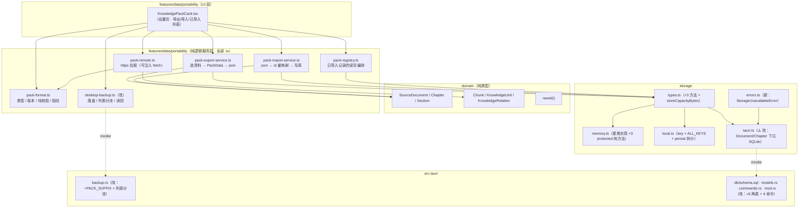
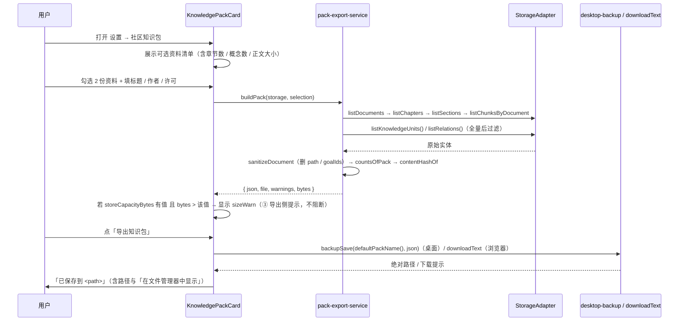
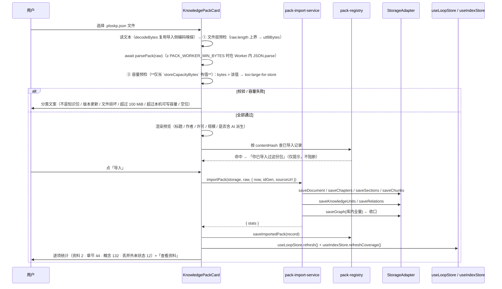

# 社区知识包（Community Knowledge Packs）技术方案

> 版本：v0.3 · 2026-09-21 · 基准：`main`（实测于 2026-09-21 13:2x）
> 关联文档：`docs/data-portability-export-import-design-2026-09.md`（**F4 数据可携带 —— 本方案的直接底座**）、
> `docs/knowledge-import-design-2026-09.md`（导入管线与 GitHub 拉取范式）、
> `docs/storage-architecture-rag-2026-09.md` 与 `docs/storage-architecture-rag-task-runbook.md`（**RAG 存储层与「T9 迁移」的原始出处**）、
> `docs/roadmap-next-features-plan-2026-09.md`（F1–F9 规划；本特性登记为 **F10**）、
> `docs/library-module-design-2026-09.md`、`docs/learning-system-v2-design-2026-09.md`
> 状态：**✅ 已实施并收口**（2026-09-21）—— D1–D16 **全部定案**，T1–T17 **全部 done**；
> 落地按 §10 提交表 13 组依次提交（逐提交**可编译且运行时安全**），全链 `npm run test:library` 零失败
> **v0.2 变更**：D7 由 v0.1 的「单条 5 MB 硬拒线」重构为**四层体积判定**（① 文件/网络 100 MiB · ② Worker 解析 8 MiB · ③ 库容量后端派生 · ④ quota 兜底）；体积口径统一为 UTF-8 字节。同时**修正 v0.1 的一处错误论断**：「桌面端无此上限」不成立 —— 实测 `src/storage/tauri.ts:4-7`，`SourceDocument`（正文，包内体积大头）在三种后端下**都由父类 localStorage 承载**。
> **v0.3 变更（范围扩展）**：按用户指令把 **`Document` / `Chapter` 下沉 SQLite**（即 `src/storage/tauri.ts:12-13` 注释里的「T9 迁移工具」）**纳入本方案范围**，以闭合 v0.2 留下的那个口子 —— 「100 MiB 可导出但当前不可导入」。新增 D12–D16 与 T15–T17；`schema.sql` 升 **v5**（`documents` / `chapters` 两表）；`db_clear_rag` **重命名**为 `db_clear_library`（9 表单事务）；`storeCapacityBytes` 改为可选（桌面端返回 `undefined`）。
> ⚠️ **本方案自 v0.3 起解除「`src/storage/tauri.ts` 与 `src-tauri/**` 零改动」的约束**（那是 F3 时期的单特性口径）；本次是用户显式指令，且是「100 MiB 真正可导入」的唯一路径。
> **v0.4 变更（收口 · 实施偏离登记）**：T1–T17 全部落地。实施过程中有**三处刻意偏离本文原稿**，
> 均已在代码中生效、且都是「原稿写法会引入假绿或误伤」的类型：
> ① **`KnowledgePackCard.tsx` 一度到 751 行**，超 `rules/code-structure-and-dependencies.mdc` §1 的 700 行硬限
> → 抽出 `pack-texts.ts`（**96 行**：`packCountsText` / `warningText` / `errorText` 三张「分类 → 文案」映射表
> + `PackUiErrorKind` 并集）→ 卡片回到 **678 行**，抽离**独立成提交**（⑫ 已提交且 `HEAD` 已被其他会话推前，不能 amend）。
> ⚠️ 抽出的另一个动机：映射是**纯函数**，留在 `.tsx` 里 strip-types 永远测不了。
> ② **`TC-IMPORT-01` 的 round-trip 比对**由原稿的「删掉 id」改为「**按稳定内容键（title / order / position）
> 排序后重写成序号**」—— 直接删 id 会**连带丢掉引用拓扑**（章→概念 / 块→概念 / 关系两端），
> 两侧同为空的**假绿**；同时加「投影条数」前置断言。
> ③ **`TC-VOL-04` / `TC-IMPORT-10` 的源码守卫**改为「**先去注释再断言**」（`codeOf()`）——
> 原断言会被文件头注释里的**表述**（如「本模块不自己取 `Date.now()`」）误伤。
> ⚠️ 另有一处**编号澄清**在实施中被再次确认：`tauri.ts:12-13` 注释里的「T9 迁移工具」= 本表的 **T15 / T16**
> （该编号源自 `docs/storage-architecture-rag-task-runbook.md` 自己的任务表），与 §9 本表的 T9（桌面通道 + Rust 后缀白名单）**不同源**。
> 说明：本文件为**设计文档**；T1–T17 落地后，**代码真源以仓库为准**，本文只在后续改动时作最小化同步（口径见 `AGENTS.md` 的会话工作流第 6 步）。

---

## 1. 背景

### 1.1 一句话

把「一份资料 + 它的章节结构 + 要点 + 概念图谱」打包成一个可离线传递的文件，
让**别人学过的知识资产**能原样进入你的库 —— 且**一个人的学习痕迹不会跟着跑**。

### 1.2 触发原因与现状证据（均为实测）

| # | 事实 | 证据 |
|---|---|---|
| 1 | README 已把该能力列为待交付项 | `README.md:476` `- [ ] Community knowledge packs \`P2\``／`README.zh-CN.md:481` `- [ ] 社区知识包 \`P2\`` |
| 2 | 但它**从未被规划** | `docs/roadmap-next-features-plan-2026-09.md` 的八候选 + 后补 F9 里**没有**这一项；全仓 `docs/` 仅 README 与 F4 文档提到「社区知识包」 |
| 3 | F4 已**显式**把它划出去 | `docs/data-portability-export-import-design-2026-09.md:47` 非目标④：「不做加密包、不做云同步、**不做「社区知识包」**（README 里的 `P2` 项）」 |
| 4 | F4 的导出白名单**方向相反** | `features/data/portability/backup-format.ts::FIELD_SPECS` 20 项，**包含** `learnerState` / `evidence` / `annotations` / `papers` / `goals` / `capability*` 等个人数据 —— 而社区包必须**排除**它们 |
| 5 | 正文真源是 `doc.textPreview` | `domain/document.ts:40`；`Chapter.contentRef`、`KeyPointRef`、`Annotation`、`CardState` 的偏移**全部**基于它（`domain/chapter.ts:53`、`domain/annotation.ts:15`、`domain/flashcard.ts:48`、`domain/knowledge.ts:20`）→ **带着正文送人，偏移全套仍然有效** |
| 6 | 落盘通道已存在但有后缀白名单 | `src-tauri/src/backup.rs:24` `BACKUP_SUFFIX=".plosbak.json"`、`:54` `MARKDOWN_SUFFIX=".md"`；读路径 `safe_name`（:45）**只认**备份后缀，写路径 `safe_save_name`（:62）才额外允许 `.md` |
| 7 | 网络拉取有现成范式 | `src/features/learn/import/github.ts`：`FetchLike` 可注入 fetch、`GhErrorKind` 语言中立错误分类、体积护栏集中在 `LIMITS`（`import/types.ts`）、并发上限 4、单测 mock 不触网 |
| 8 | 「文本 → 切分」的导入管线**不适用于**知识包 | `features/learn/import/pipeline.ts::runUnitImport` 的职责是「一份文本 → save → split → refine → saveChapters」；知识包的章节结构**已经在包里**，重跑管线等于把手艺活降级成机器切 |
| **9** | **（v0.3 范围扩展的依据）桌面端 SQLite 只接管 5 类 RAG 实体，`Document` / `Chapter` 仍在 localStorage** | `src/storage/tauri.ts:4-7`（类注释自述「Document / Chapter / Paper / Goal / LearnerState / Evidence 仍由父类承载」）、`:12-13`（「待 T9 迁移工具上线后由 SQLite 全量接管」）；实测其 `override` 列表里**没有** `saveDocument` / `listDocuments` / `listChapters`；`src-tauri/src/db/schema.sql` 头部自述「documents 与 chapters 仍是 localStorage 侧的 source of truth」；`db/mod.rs:5-7` 同 |
| **10** | **（v0.3）`persist()` 是全量重写** —— 这是「文档留在 localStorage」必须是硬瓶颈的直接原因 | `src/storage/local.ts:160-211`：24 个 key 每次写操作全部重序列化；`:151` 注释自述「1000 chunk × 768 维的 JSON 约 15MB，必然击穿 localStorage 5–10MB 配额」 |
| **11** | **（v0.3）node 侧可直接构造 `TauriStorage`** —— 存储层新逻辑可无浏览器单测 | 实测：`node --experimental-strip-types --import ./tests/register-loader.mjs` 下 `new TauriStorage()` 成功、`listDocuments()` 返回 `[]`；`@tauri-apps/api/core` 在 node 下可正常导入（`invoke` 只在被调用时才碰 `window.__TAURI_INTERNALS__`） |

> ⚠️ **第 2 行已过时（2026-09-21 登记后）**：本特性已作为 **F10** 后补登记进
> `docs/roadmap-next-features-plan-2026-09.md`（§零 表下「后补登记」注 · §F10 小节 · §三 mermaid 节点与 `F4 --> F10` 边 · §五 总结 · 变更记录）。
> 保留此行是为了留住**当时的事实**：README 承诺在前、规划缺位在后 —— 这正是本方案被提出的直接原因。

### 1.3 不做的后果

- README 的功能清单里，`社区知识包` 会一直是一条**只存在于文档**的能力 —— 与 F4 兑现「数据属于你」时的处境完全相同（那次是「导出」写在 README 却在代码里不存在）。
- 用户当前想把「自己整理好的一份资料（含 AI 要点、概念图谱）」给同事 / 学生，**唯一路径是发送原始 PDF**：对方要重新导入、重新切分、重新跑 AI 分析要点与概念 —— 付出重复算力，还可能得到不一样的切分结果。
- 反过来，本机也**无法接收**别人整理好的知识资产。local-first 的「数据自由」目前是单向的（只出不进地整库搬，不能按份交换）。

---

## 2. 方案目标

| 类型 | 描述 |
|---|---|
| **主要目标** | ① 可把选中的 1..N 份资料导出为**单文件知识包**（`.ploskp.json`）；② 可从**本地文件**或 **https 链接**导入知识包，还原为全新的资料（章节 / 小节 / 块 / 概念 / 关系全带上）；③ 包内**绝不含**任何个人学习数据（掌握度 / 证据 / 划线 / 复述 / 自测卡 / 试卷 / 目标 / 画像 / 记忆）；④ 导入**零 AI**（不自动分析、不自动建索引、不触发任何模型调用）；⑤ 全流程**零后端**、**零账号**、可从命令行单测；⑥ **桌面端能真正导入 100 MiB 量级的包**（v0.3 新增：需先完成 `Document`/`Chapter` 下沉，见 D12–D16） |
| **非目标（v1 明确不做）** | ① **不做**内置社区目录 / 应用内浏览下载（需后端 + 账号，与 README「no account, no cloud, no required backend」冲突 —— 见 D2 第三层的前置条件）；② **不做**增量 / 差分更新（同一份资料的新版本包 = 一份新资料，不做「更新原资料」）；③ **不做**加密 / 签名 / 作者身份验证（`contentHash` 只用于「同一包」识别，**不是**安全校验）；④ **不做**包内分片（单包上限 **100 MiB**（① 文件层，D7）；超过请自行拆分 —— **不提供**自动分卷 / 合并）；⑤ **不做**向量随包（可重算的派生数据，见 D1）；⑥ **不引入** zip / JSON Schema 等新运行时依赖（与 F4 非目标⑥一致）；⑦ **不改**资料库导入弹窗（见 D10 理由）；⑧ **不做** `listDocuments` 的「元数据 / 正文分离」（D13 已登记为后续项 —— v1 只解决「装得下」，不解决「载入大库的内存与启动开销」） |
| **成功标准** | ① **round-trip 单测**：造样本 → 导出 → 空库 → 导入 → 资料 / 章节 / 小节 / 块 / 概念 / 关系**逐字段一致**（除 `id` 与 `Chapter.status`）；② **零泄漏断言**：包 JSON 字符串中不出现 `learnerState` / `evidence` / `annotations` / `restatements` / `cardStates` / `papers` / `goals` / `capability` / `profile` / `memory` 任一键名，且不含本机绝对路径；③ **零污染断言**：导入后 `getLearnerState()` 逐字节不变、`listEvidence()` 长度不变、`listGoals()` 不变；④ **无悬空 id**：重映射后全表扫外键，无一指向包外或本机；⑤ `npm run typecheck` 0 新 error；⑥ README 双语 checkbox 与顶部统计行**实测同步**（基线：两版均 36 shipped / 10 not yet）；⑦ **体积口径唯一**：全链路体积判定只认 domain 的三个 `PACK_*_BYTES` 常量与 `storage.storeCapacityBytes`，源码守卫（TC-VOL-04）保证任何服务文件里不出现体积字面量；⑧ **桌面端 100 MiB 可达性闭合**：`tauri.storeCapacityBytes === undefined` → ③ 层跳过 → 导入完成后**重启应用资料与章节仍在**（TC-DOC-01..08 + §12.3 手工验收第 9 条） |

---

## 3. 项目现状

### 3.1 相关代码与模块

| 区域 | 现状 | 本方案的关系 |
|---|---|---|
| `features/data/portability/backup-format.ts` | `BACKUP_KIND="plos.backup"`、`EXPORT_VERSION=1`、`BACKUP_SUFFIX=".plosbak.json"`、`FIELD_SPECS` 20 项、`countsOf` / `countsEqual` / `parseBackup` / `migrateBackup` | **范式直接复用，格式不复用**（白名单方向相反） |
| `.../export-service.ts` | `collectSnapshot(storage)` 逐层遍历 + 孤儿计数；`counts` 由同一次读取派生（不变量 1） | 导出侧**复用同一条遍历思路**，但读取范围收窄到选中资料 |
| `.../import-service.ts` | `importBackup(storage, raw, {mode, preBackup})`；末尾 `saveGraph(库内全量)` 收口；`mergeById`；`evidenceKey` 去重；`isQuotaError` | 导入侧**复用收口规则与 quota 分类**；去掉 clearAll 与个人数据分支 |
| `.../desktop-backup.ts` | 5 条命令的薄封装 + `isTauri()` 守卫 + `downloadText` 兜底 | 增加「知识包」的列表分流，其余原样 |
| `.../DataPortabilityCard.tsx` | 设置页卡片；不新增 store / 不新增 key；导入后刷 `useLoopStore.refresh` + `useIndexStore.refreshCoverage` | 新卡的**结构样板**与刷新约定来源 |
| `features/settings/SettingsPage.tsx` | `:198` 挂载 `<DataPortabilityCard counts onDataChanged />` | 新卡挂载点（同页相邻） |
| `features/learn/import/github.ts` | `FetchLike` 注入、`GithubImportError.kind` 分类、`LIMITS` 护栏、`parseXxxUrl` 纯函数 | **URL 拉取层的样板**（错误分类口径、可注入 fetch、体积护栏） |
| `features/learn/import/pipeline.ts` | `runUnitImport`：文本 → save → split → refine → saveChapters | **不调用**（知识包不走切分管线，见 §4.2） |
| `storage/types.ts` | `StorageAdapter` 60+ 方法（文档/章节 6 个方法在 `:51-60`）；`clearAll()` 的存在约束见其注释 | 需**新增 3 个方法**（已导入包记录）+ **1 个可选能力字段**（`storeCapacityBytes`）+ 1 个错误类型（`StorageUnavailableError`），见 §8.1 / §8.19.1 |
| `storage/memory.ts` | `InMemoryStorage` 基类持有全部内存镜像；`EVIDENCE_LOG_MAX` 在此；`documents` / `chaptersByDocument` 是 protected Map（`:54-55`） | 3 个新方法的实现落点（基类）；**并把「记住 / 忘掉资料」「记住章节」抽成 3 个 protected 纯方法**（`rememberDocument` / `forgetDocument` / `rememberChapters`），供两个子类共用，见 §8.19.2 |
| `storage/local.ts` | `:36-73` 24 个 key；`:429 ALL_KEYS`；`:160 persist()` 全量重写；`clearAll` 逐个 `removeItem` | 新 key **必须**进 `ALL_KEYS`（否则 clearAll 后残留 —— F9 踩过同一坑）；**`persist()` 需拆分**（`persistDocuments` / `persistRest`），见 §8.19.3 |
| `storage/tauri.ts` | ⚠️ **实测（`:4-7, :12-13`）**：SQLite 只接管 Section / Chunk / KnowledgeUnit / KnowledgeRelation / Embedding 五类；**`Document` / `Chapter` 仍由父类 localStorage 承载**（`override` 列表里没有 `saveDocument` / `listDocuments`） | **v0.3 大改**：Document / Chapter **下沉 SQLite**（D12）+ 会话内存镜像 + 取消写兜底 + `storeCapacityBytes = undefined`，见 §8.19.4 |
| `storage/index.ts:21` | `createStorage(backend)` 工厂；`new TauriStorage()` 无参构造 | 工厂**不改**（可注入 `invoke` 的构造参数带默认值，见 §8.19.4） |
| `src-tauri/src/db/schema.sql` | **当前 version = 4**；头部注释明写「documents 与 chapters 仍是 localStorage 侧的 source of truth，待迁移工具稳定后由下一版 schema 接管」 | **需升 v5**：新增 `documents` / `chapters` 两表，见 §8.19.5 |
| `src-tauri/src/db/{models,commands,mod}.rs` | 5 类实体的 Row/Input/Out 镜像；`commands.rs` 已有 `clear_rag`（清 **7** 表）；`mod.rs::migrate` 链 v2→v3→v4 | **需改**：+2 类 DTO、**+5 条命令**、`clear_rag` → `clear_library`（**9** 表）、`migrate_v5`、`db_status` 计数 +2，见 §8.19.5 / §8.19.6 |
| `src-tauri/src/lib.rs:105-170` | `generate_handler!` 注册 40+ 命令（含 `db::commands::db_clear_rag`） | **需改**：**+5 条新命令** + 1 条重命名 |
| `src-tauri/src/backup.rs` | 双后缀白名单 + `save_in`/`list_in`/`read_in` + 5 条命令 + 5 个单测 | **需修改**：新增 `.ploskp.json` 白名单与列表分流（与 db 侧改动互不相干，两次提交） |
| `features/learn/document-cascade.ts:51` | `deleteDocumentCascade` 6 步级联（chunk+向量 → 试卷 → 概念 → 资料本体） | **不改**（它只调适配器公开方法；`deleteDocument` 的语义不变，只是落点从 localStorage 变 SQLite） |
| `domain/index.ts:42` | `newId(prefix)` —— 确定性无依赖 id 生成器 | id 重映射的**唯一 id 源** |
| `stores/useLoopStore.ts:49` | `export const storage = createStorage()`（模块级单例） | 导入后刷新 |
| `stores/useLoopStore.ts:80` | `refresh(m?)` | 导入后刷新 |
| `stores/useIndexStore.ts:33` | `refreshCoverage()` | 导入后刷新索引覆盖 |
| `docs/data-portability-export-import-design-2026-09.md` | 其 §4.3.2 引用了 `db_clear_rag` | **需改一行**（重命名后引用失效），见 §8.19.7 |

### 3.2 相关文档与约定

- **命名**：`docs/<area>-<title>-design-2026-09.md` → 本文件 `community-knowledge-pack-design-2026-09.md`。
- **分层硬约束**（`rules/layer-import-boundaries.mdc`）：UI → stores/storage；`ai/` 与 `engine/` **不得** import `features/`；组件**不得**直接碰 `localStorage`。
- **服务层零文案**：服务层只产分类 / enum，文案由 UI 经 i18n 映射（F4 与 F5 的共同约定）。
- **零浏览器校验**（`rules/no-headless-browser-validation.mdc`）：校验一律走 `typecheck` + node 单测 + 代码自审。
- **纯逻辑落 `.ts`**：`tests/*.test.ts` 用 `node --experimental-strip-types` 直跑，**不支持 JSX** → 所有可测逻辑必须在 `.ts` 里，测试**不得** import `.tsx`。

### 3.3 约束与依赖

| 类型 | 约束 |
|---|---|
| 存储后端 | ✅ **瓶颈已在 v0.3 解除一半**：`SourceDocument.textPreview`（正文真源，也是包内体积大头）与 `Chapter` **在桌面端下沉 SQLite**（表格 `documents` / `chapters`，D12–D16；`src/storage/tauri.ts` 当前 `:4-7` 的「待 T9 迁移工具接管」在本方案内落地）→ 桌面端**不再受** localStorage 配额约束。**浏览器预览后端（`memory` / `local`）仍由宿主 localStorage 承载**（配额 ≈5–10 MB，是真的）→ 体积分层判定（D7）仍然必需：③ 层在后端给出容量时生效，后端返回 `undefined`（桌面端）时跳过 |
| 依赖 | 无新增运行时依赖（不加 zip、不加 schema 库、不加 http 客户端）；Rust 侧不新增 crate（`sqlx` / `serde_json` 均已在用） |
| Tauri | 复用既有 `backups` 目录与 `backup_*` 命令族，**不新增** capabilities、**不新增** crate；⚠️ **但新增 5 条 `db_*` 命令并重命名 1 条**（v0.2 写的「不新增命令」只对 `backup.rs` 成立） |
| 依赖关系 | 无前置 feature（F4 已完成）；**内部有前置**：`Document`/`Chapter` 下沉（T15/T16）是「桌面端导入 100 MiB 包」的前置，必须排在导入服务（T5）之前验收。不阻塞 F5 / F7 / F8 |
| 反向依赖 | ⚠️ **v0.3 起不再是「只新增」**：`Document`/`Chapter` 的**落点**从 localStorage 变为 SQLite（对外语义与接口签名不变）。受影响的是 `storage/tauri.ts` 与 `src-tauri/src/db/**`；`features/` 下 20+ 个 `listDocuments()` 调用点**零改动**（D13：契约不变 + 会话内存镜像） |

### 3.4 决策点（D1–D16）

> 口径：D1–D4 已由用户在 2026-09-21 拍板；D5–D16 为**推荐档**，随本方案一并确认。
> **改档后必须全量回扫**本文正文（架构 / 数据模型 / 用例 / 线框 / 伪代码 / 任务表 / 测试 / 变更记录）。
>
> ⚠️ **编号澄清（v0.2 的「同号不同事」已消除）**：`src/storage/tauri.ts:12-13` 注释里的 **「T9 迁移工具」** 指本方案 §9 的 **T15 / T16**（该编号来自 RAG 存储层自己的任务表 `docs/storage-architecture-rag-task-runbook.md`，与本表不同源）；本方案 §9 的 **T9** 是「桌面通道 + Rust 后缀白名单」。**实施 T15/T16 时同步修正 `tauri.ts` 头部注释**（原文「待 T9 迁移工具上线后」在落地后不再成立）。

#### D1 · 包内容边界 —— ✅ **已确认：完整知识资产（不含个人数据与向量）**

| 档 | 内容 | 结论 |
|---|---|---|
| **A（选定）** | 原文正文 + 章节 + 小节 + 块 + 概念 + 关系；**不含**向量；**不含**任何个人学习数据 | 导入方开箱可读、可划线、可出卷、可检索，无需 AI 重跑，也不付重复算力 |
| B | 轻量包（只有章节结构 + 要点，无正文） | 否决：对方无法读原文 / 无法划线 / 客观卷无从出 |
| C | A + 向量本体 | 否决：1024 维 float 数组让包从 MB 级涨到几十 MB 级，而向量是可重算的派生数据 |

#### D2 · 分发通道 —— ✅ **已确认：支持全部三种，但按「通道分层」落地**

| 层 | 通道 | v1 落地 | 理由 |
|---|---|---|---|
| **L1** | **本地文件交换**（导出文件 → 任意渠道分享 → 本地导入） | ✅ **做** | 零网络、零后端、零账号，完全符合 local-first；单测可离线全覆盖 |
| **L2** | **https 链接拉取**（粘贴链接 → 显式点「拉取」→ 预览 → 导入） | ✅ **做** | 复用 GitHub 导入的 fetch 范式；是**用户显式动作**，不是后台联网（README 原则 #2「连接性是增强不是依赖」成立） |
| **L3** | **内置社区目录**（应用内浏览 / 搜索 / 一键安装） | ❌ **v1 不做**，只留接口形状 | 需要后端服务 + 账号体系 + 内容审核 + 许可合规评估，**直接冲击** README「no account, no cloud, no required backend」。前置条件见 §5.4 |

> **为什么 L3 不能顺手一起做**：L1/L2 的信任模型是「你选择了这份文件」，而 L3 的信任模型是「平台替你选了内容」。前者只需格式校验，后者需要**内容治理**（侵权、医疗 / 法律建议误导、注入式正文）。把 L3 塞进 v1 会让一个「文件格式 + 导入导出」的中等特性膨胀成一个需要运营的产品线。

#### D3 · 导入身份 —— ✅ **已确认：新资料 + id 全量重映射**

| 档 | 结论 |
|---|---|
| **A（选定）** | 整包 id 重新分配（`newId`），作为**全新资料**入库；记录来源（包标题 / 作者 / `contentHash`）用于溯源与「已导入过」提示 |
| B | 保留原 id、撞库即合并 → 否决：不同来源的包 id 空间无协调，碰撞会**串数据** |
| C | 导入独立命名空间 → 否决：要新增「空间」维度贯穿存储与全部消费方，成本远超收益 |

#### D4 · 桌面落盘通道 —— ✅ **已确认：独立后缀 `.ploskp.json`**

| 档 | 结论 |
|---|---|
| **A（选定）** | 扩 `backup.rs` 后缀白名单，新增 `PACK_SUFFIX=".ploskp.json"`，与备份彻底分离（列表可分流、语义不混淆） |
| B | 复用 `.plosbak.json` 靠 `kind` 分流 → 否决：「最近备份」列表会混入知识包，用户会以为那是一份可用备份（与 `backup.rs` 注释里已经明确防过的同一个坑） |
| C | 不做桌面落盘 → 否决：拿不到「最近导出」列表，也进不了系统文件管理器定位 |

#### D5 · 包内 `Chapter.status` 的处理 —— **推荐：导出时原样带、导入时强制重置 `not-started`**

`Chapter.status`（`not-started`/`learning`/`ready`/`mastered`/`retake`）**不是知识属性，是学习痕迹** —— 它记录「我把这章标记学完了」。若随包进入对方库：

- 对方的计划器会把**别人标记为 `ready` 的章**当成自己学过的章参与排序（`engine/learning-planner.ts` 的档位判定读的正是 status）；
- 对方的资料详情页会显示「已学完」，而他从没读过。

**做法**：包内保留该字段（保持与 `Chapter` 类型同构，不做字段级裁剪），**导入时统一重置为 `not-started`**，并把「丢弃了多少条外来学习状态」作为 `foreignProgressDropped` 如实报给用户（诚实数字原则）。

#### D6 · 「已导入包」的来源记录 —— **推荐：新增持久化 key `plos.knowledge-packs.v1`**

- **用途**：① 按 `contentHash` 提示「这份包你已经导入过」（不含阻止，只是提示）；② 资料详情页显示「来自社区包 《X》 by Y」（溯源）；③ 卡片的「已导入的知识包」列表。
- **为什么不用 `SourceDocument` 上的新字段**：会污染 F4 的导出白名单（备份包里会带上一串指向本机包记录的 id），而这份记录**本来就是本机资产**，不该跟着备份走 —— 与 `activeGoalId` 不可导出的理由同源（F4 D2）。
- ⚠️ **必须同时补进 `storage/local.ts::ALL_KEYS`**，否则 `clearAll()` 之后记录残留（F9 ↔ F4 的同一处强制耦合）。clearAll 的语义是「清可再生的学习资产」，这份记录属于本机资产 → **一起清**。
- 读写必须走 `StorageAdapter` 新方法（组件不得直接碰 localStorage）。

#### D7 · 体积与配额策略 —— **推荐：四层判定（文件 / 解析 / 容量 / 兜底）**

> v0.1 只有一个 5 MB 硬拒线，把「文件大小」「解析性能」「库容量」三件事压在同一个数上。
> 现按**四个不同维度**拆开，每层只回答一个问题。**体积口径统一为 UTF-8 字节**（与文件大小、`Content-Length`、磁盘占用同一把尺子）。

| 层 | 常量 / 依据 | 值 | 判定时机 | 行为 |
|---|---|---|---|---|
| ① 文件 / 网络 | `PACK_HARD_MAX_BYTES` | **100 MiB** | 读文件后（`raw.length` 上界预判）· 拉取时 `Content-Length` 预检 + 读取中累积 | `too-large`（**硬拒**，防内存爆与 DoS） |
| ② 解析性能 | `PACK_WORKER_MIN_BYTES` | **8 MiB** | `JSON.parse` 之前 | ≥ 阈值 → **进 Web Worker 解析**（主线程零阻塞） |
| ③ 库容量 | `storage.storeCapacityBytes`（**可选**，D16） | `tauri` 后端 = **`undefined`**（不设上限）· `memory` / `local` = `PACK_LOCAL_STORE_BUDGET_BYTES`（**4 MiB**） | `parsePack` 成功后、**写入之前** | 后端给出容量且超限 → `too-large-for-store`（**前置拒**，附当前后端与原因）；**容量为 `undefined` → 跳过本层** |
| ④ 兜底 | `isQuotaError` 分类（复用 F4 口径） | — | 写入过程中 | `quota` + `partial` 已完成统计 |

**为什么必须有 ③（前置容量判定）**：① 的 100 MiB 回答的是「文件能不能收」，③ 回答的是「收进来能不能放下」—— 二者差两个数量级。若只有 ①，用户会看着进度条跑到一半再吃一颗 `quota`，与 §4.3.4 不变量 5「失败在**写入之前**判定」自相矛盾。前置拒把「装不下」提前成**预览阶段就能看到的一句话**。**但 ③ 只在后端确实有容量线时才有意义** —— 桌面端下沉 SQLite 后已无应用层容量线，故 `tauri` 返回 `undefined` 让本层**跳过**（D16），而不是编一个假数字。

**为什么 ② 必须 Worker 化（相对 v0.1 的升级）**：v0.1 的 5 MB 硬拒本身就兼作「主线程保护线」（3 MB 的 `JSON.parse` 已是几十毫秒量级）。阈值提到 100 MiB 后这条保护线失效 —— 100 MiB 的 `JSON.parse` 在 1–3 s 量级，主线程冻结不可接受。**Worker 不是优化项，是放开 100 MiB 的必要配套**（`new Worker(new URL("./pack-parse.worker.ts", import.meta.url), { type: "module" })`，Vite 原生支持）。Worker 内**只做「文本 → 结构化对象」**：不碰存储、不碰 DOM；回传后仍在主线程完成校验与写入（**保持单一写入路径**，不产生第二套写入语义）。

**✅ 可达性前提已在 v0.3 闭合**（v0.2 此处的「100 MiB 是假门」警告至此解除）：

| 版本 | 桌面端导入 100 MiB | 依据 |
|---|---|---|
| v0.2 | ❌ **不可能**（③ 层必然拒） | 资料正文在三种后端下都走 localStorage（§3.3） |
| **v0.3** | ✅ **可以** | `Document` / `Chapter` 下沉 SQLite（D12–D16，T15/T16）→ `tauri.storeCapacityBytes === undefined` → **③ 层跳过** → 三道判定只剩 ①（100 MiB 硬拒）与 ④（quota 兜底，SQLite 路径基本不触发） |

**浏览器预览后端仍受 4 MiB**（那里没有 SQLite，宿主配额是真的）—— 这不是降级，是事实。UI 文案必须据此分叉：容量为 `undefined` 时**不显示**「本机可写容量约 4 MB」这句话（D16「不编假数字」）。

**⚠️ 但「能写完」≠「无感」**：③ 解除后单次 `db_save_documents` 的载荷就是那一批正文，序列化 / 反序列化的内存峰值约 **2–3× 文本体积**。故 §4.3.4 的写入顺序明确 **以「一份资料」为单位**写入（峰值 = 最大单份，而不是整包）。要连这个也压下去，需要 D13 的「元数据 / 正文分离」后续项。

**导出侧不做容量硬判**（导出**不写库**）：仅当 `storage.storeCapacityBytes !== undefined` **且** `bytes > 该值` 时给**提示性**警告 `sizeWarn`（「对方的后端可能装不下」是真实风险，但不是本机的问题），**不阻断**。⚠️ 容量为 `undefined`（桌面端）时**既不出该警告、也不渲染相关文案** —— 否则就是在编一条不存在的上限（D16「不编假数字」）。

**容量常量怎么来的**：宿主 localStorage 配额约 5–10 MB（按 UTF-16 计），扣除既有资料 / 学习数据占用与 JSON 结构开销后，取 UTF-8 字节口径的保守值 **4 MiB** —— 它是 **`memory` / `local` 两个后端的能力值**（`PACK_LOCAL_STORE_BUDGET_BYTES`），**不是全局策略**。它是「一把尺子」：localStorage 后端的导出警告、导入前置拒、文案里的「约 4 MB」全部引用同一个常量，**不得在任何一侧重写这个数字**；桌面端（容量 `undefined`）三类文案**一律不出现这个数字**。

- 写入过程击穿 localStorage 配额 → 复用 F4 的 `isQuotaError` 分类，回 `quota` + **`partial` 已完成统计**（不允许「安静地写了一半」）。

#### D8 · 导入是否自动建索引 / 自动跑 AI —— **推荐：一律不自动，UI 给显式按钮**

- **不做自动**：① 他人正文是**不受信输入**，自动送模型既烧钱又有注入面；② 包已含 AI 派生结果（要点 / 概念 / 概览），再跑一遍是浪费；③ 与 F5「无 AI 时如实降级」的克制口径一致。
- **但**导入后的用户在「检索」上是有缺失的（chunks 带了，向量没带）→ 卡片给出**显式**动作：「为导入的资料生成向量索引」（复用既有入口，不新写一套）。
- 硬断言：`pack-import-service.ts` 的源码里**不得**出现 `from "../../../ai/`（源码级单测锁死，与 `annotation-service.ts` 的同类守卫同范式）。

#### D9 · 格式独立还是复用 `BackupFile` —— **推荐：独立 `kind` + 独立版本号**

| 维度 | 备份（F4） | 知识包（F10） |
|---|---|---|
| `kind` | `"plos.backup"` | `"plos.pack"` |
| 版本字段 | `exportVersion` | `packVersion`（**独立演进**） |
| 数据白名单 | 20 项（含个人数据） | **6 项**（绝不含个人数据） |
| 校验重点 | `counts` 与 `data` 自洽 | 同上 **+** 泄漏兜底（见 TC-LEAK-01） |

- 独立 `kind` 的价值：把备份当包导入、把包当备份导入，都在**写入之前**给出明确拒绝（`not-pack` / `not-backup`），而不是静默写进去一半。
- 明确**不**复用 `EXPORT_VERSION`：备份格式引入 v2 时不应牵连包格式（反之亦然）。

#### D10 · UI 落点 —— **推荐：设置页独立卡；不改资料库导入弹窗**

- **做**：设置 → 本地存储 → 在「数据可携带」卡**下方**新增「社区知识包」卡（导出 + 导入 + 已导入列表）。
- **不做**：资料库的导入弹窗（`ImportModal`，来源 Tab 为 `paste|local|github`）。理由有二：① 该弹窗的心智是「把一份外部内容变成一份新资料」，管线是 `runUnitImport`（文本 → 切分），而知识包是「整包结构还原」，**管道不适配**；② 知识包是**多份资料 + 来源记录**，塞进单份导入弹窗会得出「导入 1 份 = 弹 1 张卡」的错误交互。
- 资料库页的入口留到后续（记为候选：`LibraryPage` 空态 / 工具栏加「导入知识包」深链到设置页锚点）。

#### D11 · 许可与署名 —— **推荐：可选、自由文本、不做校验、不做法律声明**

- `manifest.author`（自由文本，≤60 字）、`manifest.license`（枚举 `cc0|cc-by|cc-by-sa|public-domain|other`，缺省不写）。
- **既不做**作者身份验证（`contentHash` 不是签名），**也不写**「本包由 xxx 授权」这类法律文本 —— 那是产品与法务的议题，不该由格式层假装解决。
- 导入侧把 `author` / `license` **原样展示**（供用户自行判断），不做任何拦截。

---

> **D12–D16 是 v0.3 新增的一组**（用户指令：把 `Document`/`Chapter` 下沉纳入本方案，让 100 MiB 真正可导入）。
> 它们不是「顺手加的优化」，而是 v0.2 那个未闭合口子的**唯一解**；每一条都伴随一个具体的失败模式，且互相咬合（D12 定兜底口径 → D13 定代价与边界 → D14 定迁移次序 → D15 定清库 → D16 定容量收口）。

#### D12 · `Document` / `Chapter` 下沉 SQLite —— **推荐：SQLite 真源 + 会话内存镜像 + 取消写兜底（fail loudly）**

| 维度 | 决策 |
|---|---|
| 真源 | `documents` / `chapters` 两表落 SQLite（schema **v5**）；`SourceDocument.textPreview` 就是普通 `TEXT` 列（SQLite 单列上限约 1 GB，实际以磁盘为准） |
| 读路径 | **会话内存镜像**（`this.documents` / `this.chaptersByDocument`），首次访问时从 SQLite 一次性载入（`ensureDocs()`）→ `listDocuments()` 等 **20+ 调用点零改动**，且**不产生重复 IPC** |
| 写路径 | `trySqlite(...)` 成功 → 写库 + 更新镜像；**失败抛 `StorageUnavailableError`**，**绝不落 localStorage** |
| localStorage 侧 | `plos.documents` / `plos.chapters` **冻结为迁移时的快照**（不删、不再更新）→ 仅作灾备；`clearAll` 仍会清掉它们 |
| 与 RAG 五类的差别 | RAG 五类**保留** localStorage 兜底（可重算的派生数据）；文档 / 章节**取消**兜底 —— 理由见下 |

**为什么不能沿用 RAG 的兜底**：RAG 五类是**可重算的派生数据**（重新切分 / 重新 embedding 即可从资料复原），兜底最坏是「读到一份旧索引」。而文档是**不可再生的原始资产**，且 `textPreview` 是所有 `contentRef` / `KeyPointRef` / `ConceptEvidence` 偏移的**基准**。一旦允许写兜底，一次 SQLite 抖动就会产出「SQLite 里 A 份、localStorage 里 B 份」的**脑裂库**，而两份各自都「看起来正常」—— 这是**静默数据损坏**，比报错严重得多。

**同一口径的既有先例**：`TauriStorage.clearAll` 的注释早已写下「清库要么真清，要么明确失败」；**本档把同一条原则推广到文档写路径**（读路径见 D13：永不返回「静默的旧数据」）。

**错误类型**：`StorageUnavailableError`（`kind: "store-unavailable"`）定义在 `src/storage/errors.ts`（见 §8.19.1）。存储层**只给分类**，文案由 UI 经 i18n 映射（与全仓「服务层零文案」一致）。

**⚠️ 登记一条「死路径」**：文档下沉后，SQLite 全故障时应用实际已不可用（根实体读不出来），RAG 的 localStorage 兜底只剩历史意义。本方案**不动它**（改动面大、收益为零），但它是**下一步可以清理的死代码**，登记在 §12.2。

#### D13 · 大库的内存与 IPC 代价 —— **推荐：本方案只解决「装得下」；「元数据 / 正文分离」登记为后续项**

- `listDocuments()` 的**契约不变**（返回含 `textPreview` 的完整对象）→ 镜像持有**全库正文**；启动后首次触碰文档时，一次 `db_list_documents` 载入全量。
- 这**不是什么新代价**：`LocalStorageAdapter` 的构造函数（`local.ts:91-96`）**今天就把全部 `plos.documents` / `plos.chapters` 载入内存**。本方案改变的只是**上限来源** —— 从「localStorage 5–10 MB 配额」换成「可用内存 + 一次 IPC 峰值」。
- 因此「100 MiB 可导入」的**准确含义**是：**能收、能落盘、重启后仍在、能读能划线能出卷**；代价是启动时把全库正文载入内存（UTF-16 下约 2× 文本体积）。
- **后续项（v1 明确不做，已登记）**：新增 `listDocumentMetas(): Promise<DocumentMeta[]>`（无 `textPreview`）+ `getDocumentText(id): Promise<string | undefined>`，把 ~12 处「只要标题 / 计数」的调用点（`goal-util` / `SettingsPage` / `hybrid-search` / 各测验页列表 / `pipeline` 去重 / `memory-signals`…）迁过去。
  - **为什么不在 v1 做**：它要动 `features/` 下十余处调用点，会把本特性的提交切分彻底打乱；且它是**体验优化**（内存峰值 / 启动耗时），不是「能不能导入」的**功能阻塞**。把两者混在一批提交里，会让「哪一步坏了」无法定位。
  - **触发条件**（写清楚，免得永远不做）：用户在实际使用中报告「大库启动卡顿 / 内存占用过高」时，立即可作为独立特性启动。

#### D14 · 迁移的幂等、顺序与自等待陷阱 —— **推荐：裸 `invoke` + 独立 v3 flag + 写前必先迁移**

| 项 | 决策 |
|---|---|
| flag | **`plos.docs.migrated.v3`**（新开 v3 号） |
| ⚠️ 为什么不复用 v1 | 存量用户的 `plos.rag.migrated.v1` 早已置位 —— 复用会让文档迁移被「已迁移」**短路掉**，文档永远进不了 SQLite。这与 `GRAPH_MIGRATION_FLAG` 当初**新开 v2 号**是同一条理由（`tauri.ts:197-202` 的原注释） |
| 顺序 | `ensureMigration()` 链：rag(v1) → graph(v2) → **docs(v3)**。三段**串行、各自幂等、互不影响**（前一段失败不阻止后一段尝试） |
| ⚠️ 自等待陷阱 | `migrateLegacyDocuments()` **必须用裸 `invoke`**，不得用 `trySqlite` —— 它由 `ensureMigration` 调用，而 `trySqlite` 首次成功会回头 `await ensureMigration()` → **自等待死锁**。`migrateLegacyGraph` 已踩过同一条坑并在注释里写明，本次**照抄该处置** |
| ⚠️ 先迁移后写 | **任何**文档 / 章节方法（**读或写**）的第一步都是 `await this.ensureDocs()`。否则「写入 → 迁移」的次序会让迁移拿 localStorage 的**旧快照反向覆盖**刚写入的数据（幂等 upsert 在这里是**帮凶**，不是保障） |
| 迁移源 | 读 `this.documents` / `this.chaptersByDocument`（构造时已从 localStorage 载入）。由「先迁移后写」不变量保证：迁移时刻镜像 = localStorage 快照，二者**不会错位** |
| 失败语义 | 迁移失败 **不写 flag**（下次启动重试，`migrateLegacyRagData` 同款）；但 `ensureDocs()` 的**镜像载入失败要抛错**（不静默显示空库 —— 与 §4.3.4 不变量 5 同一条「诚实」原则） |
| 幂等保障 | 三层：① flag；② 写入全为 upsert（`ON CONFLICT DO UPDATE`）；③ 无遗留数据时立即返回 |

#### D15 · `clearAll` 与命令重命名 —— **推荐：`db_clear_rag` → `db_clear_library`（9 表单事务）**

- 文档 / 章节进 SQLite 后，清库必须覆盖 **9 张表**：新增 `documents` / `chapters` + 原有 7 张。
- **必须一次事务**：拆成两条命令 = 「documents 清了、chunks 没清」的**半清态**，孤儿 chunk 会被 FTS 检索到 —— 属静默错数据。
- **重命名而非并存**：一个语义只留一条命令。并存会诱导未来某处只调一半（而 `_schema_version` 不清是**刻意**的，与这里要清的 9 张用户数据表区分开）。
- 落点 5 处：`lib.rs` 注册、`commands.rs`（`clear_rag` → `clear_library`）、Rust 单测名（`clear_rag_empties_seven_tables_and_keeps_schema_version` → `..._nine_tables_...`）、`tauri.ts::clearAll`、F4 方案 §4.3.2 的一处引用（见 §8.19.7）。
- 顺序不变：`db_clear_library` **成功**才走 `super.clearAll()`；失败**抛错不降级**（沿用既有契约 —— 降级会留「localStorage 清了、SQLite 还在」的半清态）。

#### D16 · 容量语义的收口 —— **推荐：`storeCapacityBytes` 改为可选，桌面端返回 `undefined`**

| 后端 | 值 | ③ 层行为 |
|---|---|---|
| `InMemoryStorage` / `LocalStorageAdapter` | `PACK_LOCAL_STORE_BUDGET_BYTES`（4 MiB） | 超限 → `too-large-for-store`（**前置拒，零写入**） |
| `TauriStorage` | **`undefined`** | **跳过 ③ 层**（本后端不设应用层上限） |

- **为什么是 `undefined`，而不是 v0.2 写的 `Number.POSITIVE_INFINITY`**：`Infinity` 是个**会走火的值** —— 一旦参与 `JSON.stringify` 就变 `null`，参与算术就污染成 `NaN`，任何一次「顺手序列化」都会留下痕迹。`undefined` 的语义是「**这条线不存在**」，判定处写成 `if (capacity !== undefined && bytes > capacity)` —— 读代码即知，且不需要靠注释解释一个假数字。
- 类型随之改为**可选属性**：`readonly storeCapacityBytes?: number`。`TauriStorage` **必须显式覆写为 `undefined`**（父类有值，不覆写就是继承 4 MiB）—— 这条要写进代码注释，否则下一轮重构会把它当「漏写」删掉。
- **诚实边界**：③ 解除**不等于无感**。单次 `db_save_documents` 的载荷 = 那一批正文，序列化 / 反序列化峰值约 **2–3× 文本体积** → §4.3.4 明确**以「一份资料」为单位写入**（峰值 = 最大单份）。要把这个也压下去，需要 D13 的后续项。

---

## 4. 技术架构

### 4.1 总体架构



**数据流（导出）**：用户选资料 → `buildPack(selection)` 逐层收集 → `sanitizeDocument` 剥隐私字段 → `countsOfPack` + `contentHashOf` → `JSON.stringify` → 桌面端 `backupSave` / 浏览器 `downloadText`。

**数据流（导入）**：文件或链接 → `parsePack`（**写入前**全量校验）→ ③ 容量判定（桌面端跳过，D16）→ `remapPackIds`（两遍法）→ `writePack`（6 个 save + 1 次 `saveGraph` 收口，**按「一份资料」为单位**写入）→ `saveImportedPack` 记录来源 → 刷新两个 store。

**数据流（v0.3 新增 · 桌面端文档下沉）**：`createStorage()` → `TauriStorage` → 首次触碰文档 / 章节 → `ensureDocs()` → `ensureMigration()`（rag v1 → graph v2 → **docs v3**）→ `db_list_documents` 一次性载入**会话内存镜像** → 此后读走镜像（零 IPC）、写走 `db_save_documents` / `db_save_chapters` → 成功才更新镜像，**失败抛 `StorageUnavailableError`**。

### 4.2 模块职责

| 模块 | 职责 | 明确不做 |
|---|---|---|
| `pack-format.ts` | 类型、常量、`parsePack`、`countsOfPack`、`countsEqualPack`、`contentHashOf`、`defaultPackName`、`humanBytes` 复用 | **不** import storage / React / IPC（node 直跑） |
| `pack-export-service.ts` | 选中资料 → `PackData`；剥隐私；体积与孤儿警告 | 不落盘（落盘归 `desktop-backup`） |
| `pack-import-service.ts` | 校验 → 重映射 → 写 6 类实体 → `saveGraph` 收口；产 `PackImportStats` | 不 `clearAll`、不碰个人实体、不碰 `src/ai/*` |
| `pack-remote.ts` | `parsePackUrl` / `fetchPackText`（https only、超时、双重大小护栏） | 不做后台轮询、不跟随未知跳转、不缓存 |
| `pack-registry.ts` | 已导入记录的构造 / 去重判据 / 列表投影 | 不直接碰 localStorage（走 `StorageAdapter`） |
| `KnowledgePackCard.tsx` | 三段式 UI（导出 / 导入 / 已导入）；错误分类 → i18n 文案 | 不自己读库（规模由设置页传入，避免同屏读两遍 —— 对齐 F4） |
| `desktop-backup.ts`（改） | 知识包落盘 / 按后缀分流列表 / 读回 | 不改既有 `backup_*` 的调用契约 |
| `TauriStorage`（改 · **v0.3**） | `Document` / `Chapter` 下沉 SQLite（真源）+ 会话内存镜像 + 迁移工具（`migrateLegacyDocuments`）+ `storeCapacityBytes = undefined` | **不给文档走 localStorage 兜底**（失败抛 `StorageUnavailableError`，D12）；不做元数据 / 正文分离（D13 后续项）；不碰 RAG 五类既有兜底 |
| `db/{schema.sql,models,commands,mod}.rs` + `lib.rs`（改 · **v0.3**） | `documents` / `chapters` 两表（**v5**）、5 条新命令、`migrate_v5`、`clear_library`（**9 表单事务**） | **不做数据搬迁**（迁移源在宿主 localStorage，Rust 看不见 —— 归 TS 侧）；不改既有 5 类实体的命令签名与语义 |

### 4.3 数据模型与 API

#### 4.3.1 包格式（`pack-format.ts` 完整定义）

```ts
/** 包标识 —— 与 F4 的 "plos.backup" 严格区分（互为反向白名单）。 */
export const PACK_KIND = "plos.pack" as const;
/** 包格式版本（独立演进，与 EXPORT_VERSION / SQLite _schema_version 均无关）。 */
export const PACK_VERSION = 1 as const;
/** 双重后缀：`.json` 保证任意编辑器可直接查看。 */
export const PACK_SUFFIX = ".ploskp.json";

/**
 * 体积口径统一为 **UTF-8 字节**（与文件大小 / `Content-Length` / 磁盘占用同一把尺子）。
 * 三层各有唯一常量，任何一侧都不得重写这些数字（「两把尺子」陷阱）。
 */
export const PACK_HARD_MAX_BYTES = 100 * 1024 * 1024;        // ① 文件 / 网络层硬拒（100 MiB）
export const PACK_WORKER_MIN_BYTES = 8 * 1024 * 1024;        // ② ≥ 此值改走 Worker 解析
/** ③ 浏览器 localStorage 可用量的保守值：导出警告与导入前置拒的**共同**依据（D7）。 */
export const PACK_LOCAL_STORE_BUDGET_BYTES = 4 * 1024 * 1024;

/**
 * 精确 UTF-8 字节数。
 * 调用方**先**以 `raw.length`（UTF-16 code unit 数）作 O(1) 上界预判 ——
 * `utf8Bytes(text) >= text.length` 恒成立 → `raw.length > 上限` 可直接拒，无需编码。
 */
export function utf8BytesOf(text: string): number;

export type PackLicense = "cc0" | "cc-by" | "cc-by-sa" | "public-domain" | "other";

/** 包内每份资料的来源（溯源用；不含本机路径）。 */
export interface PackSourceRef {
  title: string;
  format: DocumentFormat;
  source?: string;
  /** 仅保留公开可验证的来源链接（http/https）；本机路径一律不写。 */
  uri?: string;
}

export interface PackManifest {
  /** 包标题（用户填；缺省 = 「N 份资料」）。 */
  title: string;
  /** 说明（可选，≤200 字，超长截断）。 */
  description?: string;
  /** 作者署名（可选自由文本，≤60 字；不做身份验证）。 */
  author?: string;
  license?: PackLicense;
  sources: PackSourceRef[];
  /** 是否含 AI 派生内容（概览 / 要点 / 概念）。诚实口径：导入方据此知道「要点不是自己跑的」。 */
  aiDerived: boolean;
  /**
   * 内容指纹（规范化 JSON 的 FNV-1a 十六进制）。
   * 用途**仅限**「同一包」识别提示；**不是**签名、不用于完整性保证、不用于安全判定。
   */
  contentHash: string;
}

/** ⚠️ 白名单 6 项 —— 多一个字段都要走决策（与备份的 20 项互为反向）。 */
export interface PackData {
  documents: SourceDocument[];
  chaptersByDocument: Record<string, Chapter[]>;
  sections: Section[];
  chunks: Chunk[];
  knowledgeUnits: KnowledgeUnit[];
  knowledgeRelations: KnowledgeRelation[];
}

export interface PackCounts {
  documents: number;
  chapters: number;
  sections: number;
  chunks: number;
  knowledgeUnits: number;
  knowledgeRelations: number;
  /** 包内正文总字符（`documents[].textPreview.length` 之和）。 */
  chars: number;
}

export interface KnowledgePackFile {
  kind: typeof PACK_KIND;
  packVersion: number;
  appVersion: string;
  /** epoch ms。 */
  exportedAt: number;
  manifest: PackManifest;
  counts: PackCounts;
  data: PackData;
}

export type PackErrorKind =
  | "not-json"            // JSON.parse 失败
  | "not-pack"            // kind 不是 plos.pack（含「误把备份当包导入」）
  | "version-newer"       // packVersion > PACK_VERSION
  | "unsupported-version" // packVersion < 1
  | "corrupt"             // 结构 / counts 不自洽 / 白名单字段形态不符
  | "too-large"           // utf8Bytes(raw) > PACK_HARD_MAX_BYTES（① 文件 / 网络层）
  | "empty";              // 包里 0 份资料 / 0 个章节
// ⚠️ 容量拒（③）**刻意不在这里**：它需要 `storage`（后端容量），归 `PackImportErrorKind`，
//    判定发生在 parse 通过与格式校验之后、写入之前 —— 见 §4.3.4 不变量 5。

export type ParsePackResult =
  | { ok: true; file: KnowledgePackFile; bytes: number }   // bytes = utf8Bytes(raw)，供 ③ 复用
  | { ok: false; kind: PackErrorKind; detail?: string };

/**
 * ⚠️ **异步**：② 当 `utf8Bytes(raw) >= PACK_WORKER_MIN_BYTES` 时改在 **Web Worker** 内
 * 执行 `JSON.parse`（100 MiB 的同步解析会冻结主线程 1–3 s，见 D7）。
 * `parseInWorker` 可注入 —— node 单测环境无 Web Worker，必须能显式关闭。
 */
export function parsePack(
  raw: string,
  opts?: {
    parseInWorker?: boolean;
    /** **仅供单测**注入小阈值（默认 `PACK_HARD_MAX_BYTES`）—— 避免测试里分配 100 MiB 字符串。 */
    maxBytes?: number;
  },
): Promise<ParsePackResult>;
export function countsOfPack(data: PackData): PackCounts;
/** 定义在 `domain/knowledge-pack.ts`（`storage/` 也要用 → 不能放 features），本模块重导出。 */
export function countsEqualPack(a: PackCounts, b: PackCounts): boolean;
/** 与 manifest 无关（避免自引用）→ 只在 `data` 上算，可同库复现。定义在 domain，本模块重导出。 */
export function contentHashOf(data: PackData): string;
/** `plos-pack-YYYYMMDD-HHmmss.ploskp.json`（本地时间，给人看）。 */
export function defaultPackName(now: number = Date.now()): string;
```

**校验顺序（`parsePack`，全部发生在写入之前）**：

```
1. raw.length > PACK_HARD_MAX_BYTES        → too-large（O(1) 上界预判：utf8Bytes >= UTF-16 长度，恒成立，省一次全串编码）
2. utf8BytesOf(raw) > PACK_HARD_MAX_BYTES  → too-large（精确口径，① 文件层。100 MiB 级输入必须准）
3. JSON.parse 失败                         → not-json
   （≥ PACK_WORKER_MIN_BYTES 时该步在 Worker 内执行，主线程不阻塞 —— ②）
4. 非普通对象 / kind !== PACK_KIND         → not-pack
5. packVersion 非整数                      → corrupt(detail="packVersion")
6. packVersion > PACK_VERSION              → version-newer
   packVersion < 1                         → unsupported-version
7. manifest 非对象 / title 非字符串        → corrupt(detail="manifest")
8. 逐字段形态校验（array / record）         → corrupt(detail="data.<key>")
9. counts 自洽（countsOfPack(data) 逐字段相等）→ corrupt(detail="counts-mismatch")
10. documents.length === 0 || chapters === 0 → empty
```

> **为什么 ③ 容量判定排在 `parse`「之后」而不是「之前」**：若提前到 parse 之前，一份 8 MiB 的**普通 JSON**（根本不是包）会被报成「装不下」，文案误导。代价是超大包要完整 parse 一次才被拒 —— 但 ② 已把这次 parse 挪出主线程，**用户看到的是「正在校验…」而非界面冻结**，代价可接受。分类准确性优先于一次省下的解析。

#### 4.3.2 id 重映射（`remapPackIds`）

**两遍法**：先建**全量映射表**，再统一重写外键。一遍法会出现「引用了一个还没生成的 id」。

```ts
export interface PackIdMap {
  documents: Map<string, string>;
  chapters: Map<string, string>;
  sections: Map<string, string>;
  chunks: Map<string, string>;
  units: Map<string, string>;
}

export interface RemapResult {
  data: PackData;
  map: PackIdMap;
  /** 被置空的外键数（父级不在包内 → 置 undefined 而非留悬空）。 */
  danglingCleared: number;
  /** 端点缺一被整条丢弃的关系数。 */
  relationsDropped: number;
  /** 被丢弃的外来章节学习状态条数（D5；= 包内非 `not-started` 的章数）。 */
  foreignProgressDropped: number;
}

export function remapPackIds(data: PackData, idGen: (prefix: string) => string): RemapResult;
```

| 实体 | 重映射字段 | 特殊规则 |
|---|---|---|
| `SourceDocument` | `id` | 同时**删除** `path`（本机绝对路径）与 `goalIds`（指向本机目标） |
| `Chapter` | `id`、`documentId` | `unitIds` 过滤到包内 unit 集合；`status` **重置 `not-started`**（D5）；`contentRef` **不动** |
| `Section` | `id`、`chapterId`、`documentId` | `contentRef` **不动** |
| `Chunk` | `id`、`documentId`、`chapterId`、`sectionId?`、`knowledgeIds[]` | `sectionId` 不在包内 → 置 `undefined`；`knowledgeIds` 过滤 |
| `KnowledgeUnit` | `id`、`sourceDocumentId?`、`evidence?.documentId` | `sourceDocumentId` 不在包内 → 置 `undefined`（不删概念） |
| `KnowledgeRelation` | `id`、`fromId`、`toId` | 端点不在包内 → **整条丢弃**并计数（悬空关系无意义） |

> **关键洞察（为什么重映射 id 却不动偏移）**：`contentRef` / `KeyPointRef.start-end` / `ConceptEvidence.start-end` 都是**相对 `doc.textPreview` 的字符偏移**。正文随包原样带入 → 偏移仍然成立。**若哪天决定「包内只带章节结构不带全文」，这些偏移必须一并作废**（否则会出现「引文指向不存在的正文」）—— 这是 D1 选 A 档的一个隐藏收益。

#### 4.3.3 导出 API（`pack-export-service.ts`）

```ts
export interface PackSelection {
  documentIds: readonly string[];
  manifest: Pick<PackManifest, "title" | "description" | "author" | "license">;
}

export type PackWarningKind =
  | "too-large"        // bytes > storage.storeCapacityBytes（③ 的**导出侧提示**：对方后端可能装不下，不阻断）
  | "doc-without-body" // textPreview 为空 → 对方看不到原文
  | "doc-without-chunks"
  | "orphan-units"     // 概念指向包外文档
  | "orphan-relations"; // 关系端点缺一

export interface PackWarning { kind: PackWarningKind; count: number }

export interface PackBuild {
  json: string;
  file: KnowledgePackFile;
  warnings: PackWarning[];
  /**
   * UTF-8 字节数 —— **全链路唯一的体积口径**（导入前置拒、落盘提示、拉取预检共用）。
   * ⚠️ 与 `PackCounts.chars`（各 `textPreview.length` 之和，只用于「正文规模」展示）**不是同一把尺子**：
   * 前者含 JSON 结构开销且非 ASCII 按多字节计，后者是纯字符数。二者都保留，但**判定一律用 `bytes`**。
   */
  bytes: number;
}

export async function buildPack(storage: StorageAdapter, sel: PackSelection): Promise<PackBuild>;
```

**收集顺序**（确定性，便于 round-trip 深比较）：

```
选中的 documents（按 selection 顺序）
  → 逐文档 chapters（storage.listChapters，已按 order 排）
     → sections（listSections per chapter）
  → 逐文档 chunks（listChunksByDocument）
→ knowledgeUnits：按 sourceDocumentId ∈ 选中集合过滤（全量读取后过滤）
→ knowledgeRelations：两端都在选中 unit 集合内才收
```

**必须与 F4 一致的口径**：`counts` 由 `countsOfPack(data)` 从**同一次读取**的 data 派生，**不得**另起一次 `storage.listXxx()` 去填（F4 不变量 1 / F2「两把尺子」陷阱）。

#### 4.3.4 导入 API（`pack-import-service.ts`）

```ts
export interface PackImportOptions {
  /** id 生成器可注入（单测固定），默认 `newId`。 */
  idGen?: (prefix: string) => string;
  /** 来源（链接拉取时填；本地文件缺省）。 */
  sourceUrl?: string;
  /** 时间基准（入口注入一次；本模块不自己取 `Date.now()`）。 */
  now: number;
  /**
   * 是否允许在 Web Worker 内 `JSON.parse`（②，默认按体积自动决定）。
   * **node 单测必须显式传 `false`**：`tests/*.test.ts` 直跑于 node，无 Web Worker。
   */
  parseInWorker?: boolean;
}

export interface PackImportStats {
  packTitle: string;
  contentHash: string;
  documents: number;
  chapters: number;
  sections: number;
  chunks: number;
  knowledgeUnits: number;
  knowledgeRelations: number;
  /** 新资料 id（供 UI 跳转与溯源记录）。 */
  importedDocumentIds: string[];
  /** 被丢弃的外来章节学习状态条数（D5；= 包内非 not-started 的章数）。 */
  foreignProgressDropped: number;
  /** 被置空的外键数。 */
  danglingCleared: number;
  /** 悬空关系被丢弃条数。 */
  relationsDropped: number;
}

export type PackImportErrorKind =
  | PackErrorKind
  | "too-large-for-store"   // ③ 前置容量拒：bytes > storage.storeCapacityBytes（D7）
  | "write-failed"
  | "quota";

export type PackImportOutcome =
  | { ok: true; stats: PackImportStats }
  | { ok: false; kind: PackImportErrorKind; detail?: string; partial?: Partial<PackImportStats> };

export async function importPack(
  storage: StorageAdapter,
  raw: string,
  opts: PackImportOptions,
): Promise<PackImportOutcome>;
```

**写入顺序**（本体 → 关联；无外键约束，顺序只为日志可读）：

```
① parsePack(raw)                                    ← ① 文件层判定 + 格式校验；失败即返回，**零写入**
② 若 storage.storeCapacityBytes !== undefined
     且 bytes > 该值                                ← ③ 容量层判定 → too-large-for-store；**仍在零写入阶段**
                                                       （桌面端该值为 undefined → 本步整体跳过，D16）
③ **逐份资料**写入（峰值 = 最大单份，不是整包）：
     for each doc: saveDocument(doc) → saveChapters(doc.id, chapters)
   再写其余：sections → chunks → knowledgeUnits → knowledgeRelations
     → saveGraph({ units: 库内全量, relations: 库内全量 })   ← 收口（唯一真源规则）
```

> ⚠️ **为什么文档 / 章节要「逐份」而不是一次性批量**（D13 / D16 的连带结论）：单次 IPC 的载荷就是那一批的**正文全文**，序列化与反序列化各有约 1× 文本体积的内存峰值。整包一次写入 100 MiB → 峰值 200–300 MiB；逐份写入 → 峰值恒等于**最大单份**。代价是 N 次 IPC 往返 —— 对 50–100 份资料量级完全可接受，而峰值是硬的。

> ⚠️ **收口为什么必须是「库内全量」而不是「包内那部分」**：`TauriStorage.saveGraph` 带 **diff-delete** —— 只写包内概念会**删掉本机独有的概念**。F4 用同一条规则同时满足 merge 与 replace，这里同样一条规则覆盖「本机已有内容」与「空库」两种场景。**这是本方案最容易写错的一处**，单测 TC-IMPORT-06 专门锁它。

**六条硬不变量**（写进模块头注释，并由单测锁死）：

1. 只调 6 个写方法 + 1 次收口 `saveGraph`；**绝不**调 `saveLearnerState` / `saveProfile` / `saveGoal` / `setActiveGoal` / `appendEvidence` / `saveCardState` / `saveAnnotation` / `saveRestatement` / `savePaper*` / `saveCapability*` / `saveMemoryDoc`。
2. **不调** `clearAll()`（知识包是「添加」，不是「替换」）。
3. **不 import** `src/ai/*`（源码级断言 `TC-IMPORT-09`）。
4. `now` 由入口注入一次（时间基准唯一，本模块不取 `Date.now()`）。
5. **体积判定全部落在写入之前**：① 文件层（`parsePack` 内）→ ③ 容量层（**仅当 `storage.storeCapacityBytes !== undefined`** 时判定，见 D16）。只有 ④ `quota` 兜底可能发生在写入**过程中**，此时必须回 `partial`（已完成统计）。**校验失败与容量拒时，库快照逐字节不变**。
6. **`storeCapacityBytes` 只从 `storage` 读，服务层不得写死数字**（D7「一把尺子」：与导出侧提示、UI 文案同源）。

#### 4.3.5 `StorageAdapter` 扩展（3 个方法 + 1 个能力字段）

```ts
// storage/types.ts
export interface ImportedPackRecord {
  /** 记录主键（= `contentHash`，同一份包只记一条 → 天然去重）。 */
  contentHash: string;
  title: string;
  author?: string;
  license?: string;
  /** 来源链接（本地文件导入时缺省）。 */
  sourceUrl?: string;
  importedAt: number;
  /** 本机落下的资料 id（用于「查看资料」与反向溯源）。 */
  documentIds: string[];
  counts: PackCounts;
}

// StorageAdapter
/** 已导入的社区包记录（`importedAt` 降序）。 */
listImportedPacks(): Promise<ImportedPackRecord[]>;
/** 按 `contentHash` upsert（重复导入同一包 → 覆盖并追加 documentIds）。 */
saveImportedPack(record: ImportedPackRecord): Promise<void>;
/** 删记录（按 contentHash）；**不删资料**（资料删除走 deleteDocument）。 */
deleteImportedPack(contentHash: string): Promise<void>;

/**
 * 单次导入的**可写容量**（UTF-8 字节）—— D7 第 ③ 层判定的**唯一依据**。
 *
 * ⚠️ 为什么放在适配器上而不是写死一个数字：这是**后端能力**，不是策略。
 * - `InMemoryStorage`（含 `local`）：`PACK_LOCAL_STORE_BUDGET_BYTES`（4 MiB）—— 宿主配额是硬的。
 * - `TauriStorage`：**`undefined`** —— 文档 / 章节已下沉 SQLite（D12），本后端
 *   **不设应用层容量上限** → ③ 层跳过。
 *
 * ⚠️ **可选属性是刻意的**：`undefined` 的语义是「这条线不存在」，判定处写成
 * `capacity !== undefined && bytes > capacity`，读代码即知。
 * **不要**改回 `Number.POSITIVE_INFINITY`（D16：`Infinity` 参与序列化会变 `null`、
 * 参与算术会污染成 `NaN`，是个会走火的值）。
 */
readonly storeCapacityBytes?: number;
```

**实现落点**：

- `storage/memory.ts`（基类 `InMemoryStorage`）：内存 Map + 上述三方法 —— 与既有实体同一形态；`storeCapacityBytes` 在基类给 `PACK_LOCAL_STORE_BUDGET_BYTES`。
- `storage/local.ts`：新增 `const KEY_IMPORTED_PACKS = "plos.knowledge-packs.v1"`，**并把它加进 `ALL_KEYS`**；`clearAll` 走父类重建 + 逐个 `removeItem`（自动覆盖）。
- `storage/tauri.ts`：**显式覆写 `storeCapacityBytes = undefined`** —— ⚠️ 父类有值，不覆写就是**继承 4 MiB**；这一条必须带注释，否则下一轮重构会把它当「漏写」删掉。
  记录本身仍由父类 localStorage 承载（与 F9 的两个记忆 key 同路径），**与文档 / 章节下沉是两件事**（后者见 §8.19.4）。

---

## 5. 交互流程

### 5.1 主流程（导出）



### 5.2 主流程（导入 · 本地文件）



### 5.3 主流程（导入 · https 链接）

```
用户粘贴链接 → 前端校验 scheme === "https"（否则 invalid，不发请求）
  → fetchPackText(url, { timeoutMs: 15_000, maxBytes: PACK_HARD_MAX_BYTES })
      · Content-Length 预检（有则先判 > maxBytes → too-large）—— 天然字节口径，无需换算
      · AbortController 超时 → network(detail="timeout")
      · 非 2xx → network(detail="HTTP <status>")
      · 有 response.body → **流式累积字节**（边读边判，超限立即 abort → too-large，
        不让 100 MiB 的 body 全量进内存）；无 body（单测 mock）→ await res.text() 后判长度
  → 之后与「本地文件」完全同一条路径（parsePack → 预览 → 导入）
```

- 拉取的错误分类**复用** `pack-format` 的 `PackErrorKind` + `pack-remote` 自己的 `network` / `invalid`，**不新增文案层**。
- CORS：Tauri webview 与浏览器一样受同源策略约束。允许 CORS 的静态托管（GitHub raw、gist、对象存储公开桶）可用；被拒时**如实报错**并提示「改用本地文件下载后再导入」—— 不尝试绕过（不引入 Rust 侧 HTTP 客户端，保持零新增 crate）。
- **一次性动作**：不给「自动检查更新」「后台刷新」任何入口。

### 5.4 分支与异常流程

| 场景 | 行为 |
|---|---|
| 导入的是 F4 备份文件 | `not-pack` → 文案：「这是一份备份文件（plos.backup），请到「数据可携带」卡里导入」 |
| 把知识包当备份导入 | F4 侧 `parseBackup` 报 `not-backup`（既有行为，零改动） |
| 包版本高于本机 | `version-newer` → 「该包由更新版本导出（v2 > v1），请升级后再试」，**零写入** |
| 包内 `counts` 与实际不符（截断 / 手改） | `corrupt(detail="counts-mismatch")`，零写入 |
| 空包（0 资料 / 0 章） | `empty` → 「这份包里没有可导入的资料」 |
| 包体积超过本机可写容量（③ 前置拒 · **仅 localStorage 后端**） | `too-large-for-store` → 预览阶段即提示（**零写入**）；文案如实说明「这份包超过本机浏览器存储的可用容量」+「改用桌面端可以导入」（**v0.3 起这句话是真的** —— 桌面端已无此线，D16） |
| 写入过程击穿配额（④ 兜底 · **仅 localStorage 后端**） | `quota` + `partial` → 「已写入资料 1/2（第 2 份超出浏览器存储上限）」；桌面端此分类在 D12 之后基本不触发（SQLite 不报配额错） |
| 同一包导入两次 | **允许**（D3-A 的必然结果）：产生两套独立 id 的资料；卡片按 `contentHash` 事前提示 |
| 包内资料本机已有同 id | **不可能冲突**：id 全量重映射；单测 TC-IMPORT-07 构造「本机已有同 id」验证本机那份逐字节不变 |
| 概念关系的端点缺一 | 该关系整条丢弃 + 计数（`relationsDropped`），不重建、不抛错（对齐 F4 的 `keep()` 口径） |
| 无 AI / 未配置模型 | **完全可用**（导入路径零 AI；导出路径也零 AI） |

### 5.5 L3（内置目录）的前置条件（v1 不做，仅登记）

若未来要做应用内社区目录，**必须先解决**以下五件事，缺一不可：

1. **后端服务**：目录 API（列表 / 搜索 / 下载 / 版本）—— 直接冲击 README「no required backend」，需要产品层对原则文本改口径；
2. **账号体系**：谁上传、谁负责（或明确「匿名上传 + 无追责」，多数开源项目选后者并配套举报机制）；
3. **内容审核**：侵权资料、违规内容、注入式正文的处理流程与下架 SLA；
4. **许可合规**：包内可能含受版权保护的整本资料 —— 需要上传侧的许可声明与抽检机制；
5. **客户端信任模型**：目录内容默认「不受信」，导入仍走同一套校验（本方案已把这层打好）。

---

## 6. 用户用例（User Cases）

> 用例编号在 §12 测试用例中被引用；每条含前置条件 / 步骤 / 期望结果 / 异常分支。

### UC-01：导出一份整理好的资料给同事（桌面端）

- **前置**：本机有 1 份资料《细胞治疗 GMP 基础》，已切分（12 章）、已跑 AI 要点与概念（132 个概念）；桌面端（`isTauri()` = true）。
- **步骤**：设置 → 社区知识包 → 勾选该资料 → 标题填「细胞治疗 GMP 基础」→ 作者填「Jack」→ 许可选 CC-BY → 点「导出知识包」。
- **期望**：
  1. 卡片显示预估规模（`≈1.2 MB`）与将进包的内容（资料 1 · 章节 12 · 概念 132）；
  2. 落盘到 `<app_data>/backups/plos-pack-20260921-150000.ploskp.json`，卡片回显**绝对路径**；
  3. 卡片「已导出」区出现该文件，可点「在文件管理器中显示」；
  4. **包 JSON 字符串中不含** `learnerState` / `evidence` / `annotations` / `path`（TC-LEAK-01）。
- **异常**：`storeCapacityBytes` 有值且 `bytes > 该值` → 显示 `sizeWarn`（**仍允许导出** —— 导出不写库、不受容量制约；容量为 `undefined` 时无此警告，D16）；该资料 `textPreview` 为空 → 警告「这份资料没有正文快照，对方将看不到原文」。

### UC-02：浏览器预览里导出（无 Tauri）

- **前置**：`npm run dev` 纯浏览器预览，`isTauri()` = false。
- **期望**：点导出后走 `downloadText`（Blob + `<a download>`），卡片文案为「已下载知识包文件，请留意浏览器的下载目录」；**不出现**「已保存到 <path>」这类假路径，也不出现点了没反应的死按钮（对齐 F4 UC-02）。

### UC-03：从本地文件导入一份同事给的包

- **前置**：本机库为空（或已有资料），手上有 `plos-pack-xxx.ploskp.json`。
- **步骤**：选文件 → 预览卡出现（标题 / 作者 / 许可 / 规模 / 「含 AI 派生内容」标记）→ 点「导入」。
- **期望**：
  1. 正常完成：`documents/chapters/sections/chunks/knowledgeUnits/knowledgeRelations` 逐一写入并**逐项展示**；
  2. 新资料出现在资料库，章节可读、可划线（偏移有效）；
  3. `Chapter.status` 全部 `not-started`，且卡片显示「已丢弃原作者的学习状态 12 条」；
  4. **零污染**：`getLearnerState()` 逐字节不变、`listEvidence()` 长度不变、`listGoals()` 不变（TC-IMPORT-04）；
  5. 「已导入的知识包」列表新增一条（含 `contentHash`）。
- **异常**：见 §5.4 全表。

### UC-04：从 https 链接拉取并导入

- **步骤**：粘贴 `https://raw.githubusercontent.com/<user>/<repo>/main/packs/gmp-basics.ploskp.json` → 点「拉取」→ 预览 → 导入。
- **期望**：与 UC-03 相同；记录里带 `sourceUrl`。
- **异常**：非 https → `invalid`（**不发请求**）；超时 15s → `network(detail="timeout")`；404 → `network(detail="HTTP 404")`；CORS 被拒 → `network` + 提示改用本地文件。

### UC-05：同一份包导入两次

- **期望**：第二次进入预览时，`contentHash` 命中 → 显示「你已导入过这份包（2026-09-21 15:02）」**仅提示**；用户仍可继续导入 → 产生**第二套独立资料**，两套之间 id 无交集（TC-IMPORT-03）。

### UC-06：损坏 / 版本不符 / 过大的包被拒

| 输入 | 期望 |
|---|---|
| 任意非 JSON（如 PDF 改名） | `not-json`，「这不是一份知识包文件」 |
| F4 备份文件（`plos.backup`） | `not-pack` + 引导去「数据可携带」卡 |
| `packVersion: 99` | `version-newer`，**零写入** |
| 手工把 `counts.documents` 改大 | `corrupt(counts-mismatch)`，**零写入** |
| 120 MiB 的包 | `too-large`（① 文件层；`raw.length` 上界预判即拒，**未进入 `JSON.parse`**） |
| 12 MiB 的**合法**包 | ① ② 通过（解析在 Worker 内，主线程不冻结）→ **浏览器预览**：③ `bytes > storeCapacityBytes` → `too-large-for-store`，零写入；**桌面端**：`storeCapacityBytes === undefined` → **③ 跳过 → 正常导入**（D16 的核心差异） |

### UC-07：导入后界面一致（无脏状态）

- **期望**：导入完成后，首页 / 计划页 / 资料库页看到的都是新状态（`useLoopStore.refresh()` + `useIndexStore.refreshCoverage()` 已调）；`/progress` 与 `/memory` **不因导入而变化**（导入不写证据、不写掌握度）。

### UC-08：导入的资料生成向量索引（用户显式动作）

- **期望**：导入成功后卡片展示一个**显式**按钮「为导入的资料生成向量索引」；未点击前，检索对这份资料**降级为 FTS-only**（既有语义，`listEmbeddingVectors` 返回空数组时调用方降级，不是错误）；点击后走既有索引入口。

### UC-09：在 Finder 中看到导出的包

- **期望**：卡片「已在文件管理器中显示」按钮调 `backupReveal(path)`（`ensure_inside` 保证只能在 `backups` 目录内定位）；非桌面端不渲染该按钮。

### UC-10：删除本机资料后，已导入记录的行为

- **期望**：删除资料**不**删「已导入的知识包」记录（记录是历史事实）；记录里的 `documentIds` 可能指向已删资料 → 列表页对失效 id **不显示裸 id**（沿用仓库既有口径：解析不到主体就不显示），仅在全部失效时把该条记录标为「资料已删除」并允许手动移除记录。

---

## 7. 线框 UI（Wireframe）

### 7.1 设置 → 本地存储 → 「社区知识包」卡 — 默认态

```
┌─ 社区知识包 ─────────────────────────────────────────────────────────┐
│ 把选中的资料（含章节、要点、概念图谱）打包成一个文件分享给别人，        │
│ 也可以导入别人分享的知识包。包里**不含**你的学习进度与笔记。           │
│                                                                     │
│ ── 导出 ─────────────────────────────────────────────────────────── │
│  选择资料                                                           │
│  ┌───────────────────────────────────────────────────────────────┐  │
│  │ ☑ 细胞治疗 GMP 基础   12 章 · 132 概念 · 348 KB               │  │
│  │ ☑ 无菌操作规范        8 章 ·  56 概念 · 121 KB                │  │
│  │ ☐ 生物制品法规汇编    31 章 · 402 概念 · 1.4 MB               │  │
│  └───────────────────────────────────────────────────────────────┘  │
│  已选 3 份 · 章节 52 · 概念 480 · 正文 ≈ 6.8 MB · 预计包 ≈ 12.4 MB    │
│                                                                     │
│  包标题 [细胞治疗入门双篇______________]                             │
│  作者   [Jack__________________________]（可选）                     │
│  说明   [供团队新人快速建立背景 ____________________]（可选）         │
│  许可   [ CC-BY ▾ ]  （可选：CC0 / CC-BY / CC-BY-SA / 公有领域 / 其它）│
│                                                                     │
│  ⚠ 预计 12.4 MB，超过本机可写容量（约 4 MB）：对方的后端可能装不下。  │
│    导出本身不受影响 —— 这里只是提示。                                 │
│    ※ 仅当本机后端有容量线时出现（浏览器预览）；桌面端这整块不渲染。   │
│                                                                     │
│  [ 导出知识包 ]                                                      │
│                                                                     │
│ ── 导入 ─────────────────────────────────────────────────────────── │
│  （ ）从本地文件   [ 选择 .ploskp.json 文件 ]                         │
│  （•）从链接拉取   [ https://________________________ ]  [ 拉取 ]     │
│                                                                     │
│ ── 已导入的知识包 (2) ───────────────────────────────────────────── │
│  · 《细胞治疗入门双篇》 by Jack · 2 份资料 · 09-21 15:02              │
│    [ 查看资料 ] [ 在文件管理器中显示 ]                                │
│  · 《统计学习基础》 · 1 份资料 · 09-18 09:41                          │
│    [ 查看资料 ]                                                      │
└─────────────────────────────────────────────────────────────────────┘
```

**与既有 token / 组件的对应**（`rules/react.mdc` + `skills/ui-impl-tokens`）：

| 元素 | 用既有件 |
|---|---|
| 卡片外框 | `components/primitives.tsx::Card`（与 `DataPortabilityCard` 同款） |
| 按钮 | `components/ui/button`（`variant="default"` 主行动 / `outline` 次行动） |
| 资料多选 | `components/ui/checkbox`（清单行 = 现有「资料列表行」形态，不新造表格） |
| 许可下拉 | `components/ui/select` |
| 文本输入 | 现有输入原语（与 F4 的导入区一致） |
| 加载 | `components/ui/spinner` |
| 二次确认（覆盖已导入记录 / 移除记录） | `components/ui/confirm-dialog` |
| 分隔与留白 | Tailwind 4 token（`--color-surface` / `ink-1..3` / `line` / `primary` / `state-*`），**不引入新 hex** |

### 7.2 其他状态

```
【导入预览】
┌─ 即将导入 ────────────────────────────────────────────┐
│ 《细胞治疗入门双篇》  by Jack   ·  许可 CC-BY          │
│ 由 Personal Learning OS 0.1.0 于 2026-09-21 导出        │
│ 资料 2 · 章节 20 · 小节 74 · 块 512 · 概念 188 · 关系 240│
│ ⓘ 含 AI 派生内容（要点 / 概念 / 概览）—— 不是你自己跑的结果│
│ ⓘ 原作者的学习状态（12 章）不会被带入，导入后全部为「未开始」│
│ ⚠ 你已导入过这份包（2026-09-21 15:02）—— 继续导入会产生第二份副本│
│ [ 取消 ]                                    [ 导入 ]    │
└───────────────────────────────────────────────────────┘

【导入中】  ⟳ 正在写入本地数据…（资料 1/2）

【导入成功】
✓ 导入完成：《细胞治疗入门双篇》
  资料 2 · 章节 20 · 小节 74 · 块 512 · 概念 188 · 关系 240
  已丢弃原作者学习状态 12 条 · 悬空关系 0 条
  [ 查看资料 ]  [ 为导入的资料生成向量索引 ]

【导入部分成功（配额击穿 · ④ 兜底 · 仅浏览器预览后端）】
⚠ 第 2 份资料未写入：浏览器存储空间不足
  已写入：资料 1 · 章节 12 · 概念 132
  建议：改用桌面端（本机数据库不受浏览器存储配额约束），或先清理不再需要的资料

【体积超过本机可写容量（③ 前置拒 · 预览阶段就拦下 · 仅浏览器预览后端）】
⚠ 这份包 12.4 MB，超过本机可写容量（约 4 MB）—— 未写入任何数据
  原因：浏览器预览后端把资料正文放在浏览器存储里，配额是硬的
  建议：改用桌面端（资料正文已落本机数据库，无此上限，D16）
  说明：包本身没有问题，导出 / 分享 / 拉取 / 校验全链路都支持这个体积

【校验失败】  ✗ 这不是一份知识包文件（可能是备份或其它 JSON）→ [ 选择其它文件 ]

【无资料可导出】  ⓘ 本机还没有可导出的资料。先到「资料库」导入一份。

【拉取中 / 拉取失败】  ⟳ 正在拉取…   ／  ✗ 拉取失败（网络超时 15s）→ 提示改用本地文件
```

### 7.3 交互说明

1. **导出按钮的可用性**：未选任何资料 → 禁用（附原因文案）；正在导出 → 换 Spinner 且禁用重复点击。
2. **标题缺省**：未填 → 自动用「N 份资料」（导出时计算，不写入组件状态）。
3. **来源标记**：导入后在**资料详情页**显示一行「来自社区包 《X》 by Y」（数据来自 `ImportedPackRecord`，按 `documentIds` 反查）—— 该行只在存在记录时渲染，零回归。
4. **不新增 store**：卡片状态（选中集 / 表单 / 进度 / 错误）全部留在组件内，与 F4 同一约定；导出 / 导入是一次性动作。
5. **规模由设置页传入**：卡片不自己 `listDocuments()`（避免与设置页同屏读两遍库 —— F4 已踩过「两把尺子」）。
6. **`data-testid`**（`skills/playwright-test-ids`）：`pack-export-btn`、`pack-import-file`、`pack-import-url`、`pack-import-url-fetch`、`pack-preview`、`pack-preview-confirm`、`pack-result`、`pack-error`、`pack-loaded-list`。

---

## 8. 涉及文件及改动伪代码

### 8.1 `src/storage/types.ts`（修改）

```ts
/** 已导入的社区知识包记录（F10；D6 —— 本机资产，随 clearAll 清除，不进导出白名单）。 */
export interface ImportedPackRecord {
  /** 主键 = 包内容指纹（同一份包只记一条 → 天然去重）。 */
  contentHash: string;
  title: string;
  author?: string;
  license?: string;
  sourceUrl?: string;
  importedAt: number;
  documentIds: string[];
  counts: PackCounts;   // ← 从 features 引类型会破分层 → 见下方「类型放置」
}

export interface StorageAdapter {
  // ...既有 60+ 方法不变...
  /** 已导入的社区包记录（`importedAt` 降序）；无记录返回空数组（不抛错）。 */
  listImportedPacks(): Promise<ImportedPackRecord[]>;
  /** 按 `contentHash` upsert。 */
  saveImportedPack(record: ImportedPackRecord): Promise<void>;
  /** 按 `contentHash` 删除记录；**不删资料**。幂等。 */
  deleteImportedPack(contentHash: string): Promise<void>;

  /**
   * 单次导入的**可写容量**（UTF-8 字节）—— D7 第 ③ 层判定的**唯一依据**。
   * ⚠️ 这是**后端能力**，不是策略：`memory` / `local` = 4 MiB；`tauri` = **`undefined`**
   * （文档 / 章节已下沉 SQLite，不设应用层上限 → ③ 层跳过）。见 D16 / §4.3.5。
   */
  readonly storeCapacityBytes?: number;
}
```

> `StorageAdapter` 本次的**另两处**改动不在本小节：① 错误类型 `StorageUnavailableError` 落在新文件 `src/storage/errors.ts`（§8.19.1）；② 文档 / 章节 6 个方法的**实现**在 `TauriStorage` 里被覆写（§8.19.4）——它们的**签名一字不改**，所以本节代码块里不出现它们。

> ⚠️ **类型放置的硬约束**（否则破依赖单向）：`ImportedPackRecord` 依赖 `PackCounts`，而 `PackCounts` 属于 `features/data/portability/pack-format.ts` —— `storage/` **不得** import `features/`。
> **做法**：把 `PackCounts` 的定义下沉到 `src/domain/knowledge-pack.ts`（新文件，纯类型 + 两个纯函数：`countsEqualPack` / `contentHashOf` 需要的稳定序列化），`pack-format.ts` 从 domain 重导出。
> 这与 F9 把 `parseMemoryDoc` / `MemoryDocMeta` 放在 `domain/memory.ts` 的理由**完全同源**（`ai/` 与 `storage/` 都要用，放 `features/` 会破依赖单向）。

### 8.2 `src/domain/knowledge-pack.ts`（新增 · 纯类型与纯函数）

```ts
/**
 * 社区知识包的**共享类型与纯函数**（F10）。
 *
 * 为什么在 domain：`storage/` 需要 `PackCounts`（ImportedPackRecord 的字段）、
 * `features/` 需要全部 → 放任何一侧都会破依赖单向（同 domain/memory.ts 的处置）。
 */
/**
 * 体积口径统一为 **UTF-8 字节**（与文件大小 / `Content-Length` / 磁盘占用同一把尺子）。
 * 三个常量与计量函数**刻意同源同处**：整条链路的体积判定只认它们（D7「一把尺子」）。
 * 放 domain 的理由：`storage/` 需用 `PACK_LOCAL_STORE_BUDGET_BYTES` 定义 `storeCapacityBytes`，
 * `features/` 需用全部 → 放任何一侧都会破依赖单向（同 `PackCounts` 的处置）。
 */
export const PACK_HARD_MAX_BYTES = 100 * 1024 * 1024;         // ① 文件 / 网络层硬拒（100 MiB）
export const PACK_WORKER_MIN_BYTES = 8 * 1024 * 1024;         // ② ≥ 阈值改走 Worker 解析
export const PACK_LOCAL_STORE_BUDGET_BYTES = 4 * 1024 * 1024; // ③ 容量：导出提示与导入前置拒共用

/** 精确 UTF-8 字节数。调用方**先**用 `raw.length` 作 O(1) 上界预判（`utf8Bytes >= length` 恒成立）。 */
export function utf8BytesOf(text: string): number;

export interface PackCounts { documents; chapters; sections; chunks; knowledgeUnits; knowledgeRelations; chars: number }

export function countsEqualPack(a: PackCounts, b: PackCounts): boolean { /* 逐字段 === */ }

/** 规范化序列化：对象 key 升序 → FNV-1a 32 位十六进制。同内容不同 key 顺序 → 同值。 */
export function stableStringify(value: unknown): string { /* 递归、key 排序、数组保序 */ }
export function contentHashOf(data: PackData): string { /* FNV-1a(stableStringify(data)) */ }
```

> `PackData` 本身仍在 `pack-format.ts`（它 import 6 个 domain 实体类型，放 domain 会造成 domain 内部循环引用的观感）→ `contentHashOf` 接受**结构化入参**（`Pick<PackData, ...>` 的等价内联类型）避免反向依赖，`pack-format.ts` 做一次薄包装。

### 8.3 `src/features/data/portability/pack-format.ts`（新增）

见 §4.3.1 完整定义。核心函数骨架：

```ts
export async function parsePack(
  raw: string,
  opts: { parseInWorker?: boolean; maxBytes?: number } = {},
): Promise<ParsePackResult> {
  const maxBytes = opts.maxBytes ?? PACK_HARD_MAX_BYTES;     // 单测注入小阈值，产品路径恒为 100 MiB
  // ① 文件层：先用 UTF-16 长度做 O(1) 上界预判（utf8Bytes >= raw.length 恒成立 → 超限无需编码）
  if (raw.length > maxBytes) return { ok: false, kind: "too-large" };
  const bytes = utf8BytesOf(raw);
  if (bytes > maxBytes) return { ok: false, kind: "too-large" };

  // ② 解析：≥ PACK_WORKER_MIN_BYTES 且在支持 Worker 的环境下改走 Worker（node 单测显式传 false）
  let parsed: unknown;
  try { parsed = await parseJsonMaybeWorker(raw, opts.parseInWorker); }
  catch { return { ok: false, kind: "not-json" }; }
  if (!isPlainObject(parsed) || parsed.kind !== PACK_KIND) return { ok: false, kind: "not-pack" };
  const packVersion = parsed.packVersion;
  if (typeof packVersion !== "number" || !Number.isInteger(packVersion)) {
    return { ok: false, kind: "corrupt", detail: "packVersion" };
  }
  if (packVersion > PACK_VERSION) return { ok: false, kind: "version-newer" };
  if (packVersion < 1) return { ok: false, kind: "unsupported-version" };
  if (!isPlainObject(parsed.manifest) || typeof (parsed.manifest as any).title !== "string") {
    return { ok: false, kind: "corrupt", detail: "manifest" };
  }
  const data = parsed.data;
  if (!isPlainObject(data)) return { ok: false, kind: "corrupt", detail: "data" };
  for (const spec of PACK_FIELD_SPECS) {
    const v = (data as any)[spec.key];
    if (v === undefined) return { ok: false, kind: "corrupt", detail: `data.${spec.key}` };
    if (!shapeMatches(v, spec.shape)) return { ok: false, kind: "corrupt", detail: `data.${spec.key}` };
  }
  const counts = parsed.counts;
  if (!isPlainObject(counts)) return { ok: false, kind: "corrupt", detail: "counts" };
  if (!countsEqualPack(countsOfPack(data as PackData), counts as PackCounts)) {
    return { ok: false, kind: "corrupt", detail: "counts-mismatch" };
  }
  const file = parsed as unknown as KnowledgePackFile;
  if (file.data.documents.length === 0 || countsOfPack(file.data).chapters === 0) {
    return { ok: false, kind: "empty" };
  }
  return { ok: true, file, bytes };   // bytes 供 ③ 容量判定复用，避免二次编码全串
}

/** 与备份同款：FIELD_SPECS 是**唯一真源**，校验与「白名单覆盖率」单测都读它。 */
const PACK_FIELD_SPECS: readonly { key: keyof PackData; shape: "array" | "record" }[] = [
  { key: "documents", shape: "array" },
  { key: "chaptersByDocument", shape: "record" },
  { key: "sections", shape: "array" },
  { key: "chunks", shape: "array" },
  { key: "knowledgeUnits", shape: "array" },
  { key: "knowledgeRelations", shape: "array" },
];
export const PACK_FIELDS: readonly (keyof PackData)[] = PACK_FIELD_SPECS.map((s) => s.key);

/** 泄漏黑名单 —— 包 JSON 里**永不**允许出现的键名（单测 TC-LEAK-01 逐项扫）。 */
export const FORBIDDEN_KEYS: readonly string[] = [
  "learnerState", "profile", "evidence", "annotations", "restatements",
  "cardStates", "papers", "paperDrafts", "paperResults", "goals",
  "capabilityItems", "capabilityRuns", "capabilityReports", "memoryDoc", "memoryMeta",
];
```

#### 8.3.1 共享私有工具的处置（⚠️ 必须走这一步，否则就是「两把尺子」）

`backup-format.ts` 里有三个**未导出**的私有工具，本方案都需要：

| 工具 | 现状 | 处置 |
|---|---|---|
| `isPlainObject(v)` | `backup-format.ts` 私有 | **不复制** —— 复制一份就是同一规则两处实现（本仓库反复踩过的「同一规则散在多处＝根因」）。抽到新模块 `features/data/portability/field-shape.ts` 并从 `backup-format.ts` / `pack-format.ts` 共同 import（或给 `backup-format.ts` 加 `export`，二选一，**改一处**） |
| `shapeMatches(v, shape)` | `backup-format.ts` 私有 | 同上，与 `FieldShape` 类型一起抽 |
| `humanBytes(n)` | `backup-format.ts` **已导出** | 直接 import 复用（勿在本模块重写） |
| `isQuotaError(err)` | `import-service.ts` 私有 | 同上：加 `export` 后复用（不要在新服务里抄一遍 QuotaExceededError 判定） |
| `decodeBytes` | `features/learn/import/decode.ts` 已导出 | 直接 import（浏览器端读文件时的编码嗅探，与导入侧同一把尺子） |

> 抽 `field-shape.ts` 会改动 `backup-format.ts` 两行（删私有定义 + 加 import）→ **F4 的既有单测（`npm run test:portability`）必须保持全绿**，这是本次唯一对 F4 代码的触碰点，也是最需要回归的地方。

#### 8.3.2 `src/features/data/portability/pack-parse.worker.ts`（新增 · D7-②）

```ts
/**
 * 知识包 JSON 解析 Worker —— **职责刻意收窄为一件事**：把一段文本解析成结构化对象。
 *
 * 为什么存在：`JSON.parse` 在 100 MiB 量级要 1–3 s，跑在主线程会让整个界面冻结（D7-②）。
 * 边界（**不许扩张**，否则就会出现「第二套解析语义」）：
 *   - 不碰存储、不碰 DOM、**不做任何校验** —— 只 `JSON.parse` 后原样回传；
 *   - 校验、容量判定、写入**全部仍在主线程**由 `parsePack` / `importPack` 完成；
 *   - 因此「走不走 Worker」**不改变任何结果**（TC-VOL-06 用深度相等锁死）。
 */
self.onmessage = (e: MessageEvent<{ raw: string }>) => {
  try {
    self.postMessage({ ok: true, value: JSON.parse(e.data.raw) });
  } catch (err) {
    // ⚠️ Error 对象不可结构化克隆 → 只回传字符串（主线程统一归 into PackErrorKind "not-json"）
    self.postMessage({ ok: false, error: String(err) });
  }
};
```

**主线程侧的派发**（`pack-format.ts` 内部私有）：

```ts
async function parseJsonMaybeWorker(raw: string, inWorker?: boolean): Promise<unknown> {
  const shouldWorker = inWorker
    ?? (utf8BytesOf(raw) >= PACK_WORKER_MIN_BYTES && typeof Worker !== "undefined");
  if (!shouldWorker) return JSON.parse(raw);           // node 单测 / 小包：同步路径

  // 一次性 Worker：解析完立即 terminate，不常驻、不池化
  const worker = new Worker(new URL("./pack-parse.worker.ts", import.meta.url), { type: "module" });
  try {
    return await new Promise<unknown>((resolve, reject) => {
      worker.addEventListener("message", (ev: MessageEvent<{ ok: boolean; value?: unknown; error?: string }>) =>
        ev.data.ok ? resolve(ev.data.value) : reject(new Error(ev.data.error)));
      worker.addEventListener("error", (e) => reject(e));   // Worker 构造 / 执行失败 → not-json
      worker.postMessage({ raw });
    });
  } finally {
    worker.terminate();
  }
}
```

> - **为什么一次性而非常驻池**：导入是低频动作，常驻 Worker 白占内存且引入生命周期管理；解析耗时才是矛盾主体，只解一次即可。
> - **Vite 写法不能变形**：`new Worker(new URL("./pack-parse.worker.ts", import.meta.url), { type: "module" })` 是 Vite 静态分析可识别的形式，换成变量拼路径打包后会 404。
> - **`typeof Worker !== "undefined"` 守卫**：node 单测与任何无 Worker 的宿主自动退化为同步解析，**不报错、不跳过**（这也是 `parseInWorker` 只用于显式覆盖、而非唯一开关的原因）。
> - 体积 / 容量的**人读格式化统一走 `humanBytes(n)`**（`backup-format.ts` 已导出）—— UI 不得自写第二个（否则「4 MB」会出现两种写法）。

### 8.4 `src/features/data/portability/pack-export-service.ts`（新增）

```ts
export async function buildPack(storage: StorageAdapter, sel: PackSelection): Promise<PackBuild> {
  const all = await storage.listDocuments();
  const chosen = all.filter((d) => sel.documentIds.includes(d.id));   // 保序：按 selection 顺序
  const documents: SourceDocument[] = [];
  const chaptersByDocument: Record<string, Chapter[]> = {};
  const sections: Section[] = [];
  const chunks: Chunk[] = [];
  const warnings: PackWarning[] = [];

  for (const id of sel.documentIds) {
    const doc = chosen.find((d) => d.id === id);
    if (doc === undefined) continue;                     // 已被并发删除 → 跳过（不崩）
    if (!doc.textPreview?.length) bump(warnings, "doc-without-body");
    documents.push(sanitizeDocument(doc));               // ← 删 path / goalIds
    const chapters = await storage.listChapters(doc.id);
    chaptersByDocument[doc.id] = chapters;
    const perChapter = await Promise.all(chapters.map((c) => storage.listSections(c.id)));
    for (const list of perChapter) sections.push(...list);
    const docChunks = await storage.listChunksByDocument(doc.id);
    if (docChunks.length === 0) bump(warnings, "doc-without-chunks");
    chunks.push(...docChunks);
  }

  // 全量读 → 过滤到选中范围（接口层没有 listKnowledgeUnitsByDocument）
  const docIdSet = new Set(documents.map((d) => d.id));
  const knowledgeUnits = (await storage.listKnowledgeUnits())
    .filter((u) => u.sourceDocumentId !== undefined && docIdSet.has(u.sourceDocumentId));
  const unitIdSet = new Set(knowledgeUnits.map((u) => u.id));
  const allRelations = await storage.listRelations();
  const knowledgeRelations = allRelations.filter((r) => unitIdSet.has(r.fromId) && unitIdSet.has(r.toId));
  if (allRelations.length !== knowledgeRelations.length) {
    bump(warnings, "orphan-relations", allRelations.length - knowledgeRelations.length);
  }

  const data: PackData = { documents, chaptersByDocument, sections, chunks, knowledgeUnits, knowledgeRelations };
  const counts = countsOfPack(data);                     // ← 唯一真源（同一次读取）
  const manifest: PackManifest = {
    title: sel.manifest.title.trim() || defaultPackTitle(documents.length),
    ...(sel.manifest.description?.trim() ? { description: sel.manifest.description.trim().slice(0, 200) } : {}),
    ...(sel.manifest.author?.trim() ? { author: sel.manifest.author.trim().slice(0, 60) } : {}),
    ...(sel.manifest.license ? { license: sel.manifest.license } : {}),
    sources: documents.map(packSourceRefOf),             // 只用 title/format/source/uri（无 path）
    aiDerived: hasAiDerived(data),                       // overview / keyPoints / units 任一存在
    contentHash: contentHashOf(data),
  };
  const file: KnowledgePackFile = {
    kind: PACK_KIND, packVersion: PACK_VERSION, appVersion: APP_VERSION,
    exportedAt: Date.now(), manifest, counts, data,
  };
  const json = JSON.stringify(file);
  // 唯一的体积计量点：与导入侧前置拒、UI 文案共用同一口径（D7「一把尺子」）
  const bytes = utf8BytesOf(json);
  // ⚠️ 容量可选（D16）：`undefined` = 本后端不设应用层上限（桌面端）→ 无警告。
  const capacity = storage.storeCapacityBytes;
  if (capacity !== undefined && bytes > capacity) bump(warnings, "too-large");   // 仅提示，不阻断
  return { json, file, warnings, bytes };
}

/** 剥隐私：本机绝对路径与指向本机目标的关联一律不进包。 */
function sanitizeDocument(doc: SourceDocument): SourceDocument {
  const { path: _path, goalIds: _goalIds, ...rest } = doc;
  return rest;
}
```

### 8.5 `src/features/data/portability/pack-import-service.ts`（新增）

```ts
export async function importPack(
  storage: StorageAdapter, raw: string, opts: PackImportOptions,
): Promise<PackImportOutcome> {
  const parsed = await parsePack(raw, { parseInWorker: opts.parseInWorker });
  if (!parsed.ok) return { ok: false, kind: parsed.kind, detail: parsed.detail };

  // ③ 容量层前置拒 —— 仍在**零写入**阶段（不变量 5）。
  // ⚠️ `storeCapacityBytes` 是**可选**的（D16）：`undefined` = 本后端不设应用层
  //    容量上限（桌面端）→ **整步跳过**。判空写在条件里，不要用 `?? 0` 兜底
  //    （那会让「没有线」变成「零容量」，一条包都导不进来）。
  // 数字只从 `storage.storeCapacityBytes` 读，服务层不写死（不变量 6）。
  const capacity = storage.storeCapacityBytes;
  if (capacity !== undefined && parsed.bytes > capacity) {
    return { ok: false, kind: "too-large-for-store",
             detail: `${parsed.bytes}>${capacity}` };
  }

  const idGen = opts.idGen ?? newId;
  const { data, danglingCleared, relationsDropped, foreignProgressDropped } =
    remapPackData(parsed.file.data, idGen);            // ← 纯函数：全部 id 重建 + status 重置 + 悬空清理

  const stats: PackImportStats = {
    packTitle: parsed.file.manifest.title,
    contentHash: parsed.file.manifest.contentHash,
    documents: 0, chapters: 0, sections: 0, chunks: 0, knowledgeUnits: 0, knowledgeRelations: 0,
    importedDocumentIds: [], foreignProgressDropped, danglingCleared, relationsDropped,
  };

  try {
    for (const doc of data.documents) {
      await storage.saveDocument(doc);
      stats.documents += 1;
      stats.importedDocumentIds.push(doc.id);
    }
    for (const [documentId, chapters] of Object.entries(data.chaptersByDocument)) {
      await storage.saveChapters(documentId, chapters);
      stats.chapters += chapters.length;
    }
    if (data.sections.length) { await storage.saveSections(data.sections); stats.sections = data.sections.length; }
    if (data.chunks.length) { await storage.saveChunks(data.chunks); stats.chunks = data.chunks.length; }
    if (data.knowledgeUnits.length) { await storage.saveKnowledgeUnits(data.knowledgeUnits); stats.knowledgeUnits = data.knowledgeUnits.length; }
    if (data.knowledgeRelations.length) { await storage.saveRelations(data.knowledgeRelations); stats.knowledgeRelations = data.knowledgeRelations.length; }

    // 收口：库内**全量**（tauri 的 saveGraph 带 diff-delete，只写包内会删掉本机独有概念）
    await storage.saveGraph({
      units: await storage.listKnowledgeUnits(),
      relations: await storage.listRelations(),
    });
  } catch (err) {
    const partial = { ...stats, importedDocumentIds: [...stats.importedDocumentIds] };
    return isQuotaError(err)
      ? { ok: false, kind: "quota", partial }
      : { ok: false, kind: "write-failed", detail: String(err), partial };
  }
  return { ok: true, stats };
}

/** 两遍法：先建全量映射，再统一重写外键。 */
export function remapPackData(data: PackData, idGen: (prefix: string) => string): {
  data: PackData; map: PackIdMap;
  danglingCleared: number; relationsDropped: number; foreignProgressDropped: number;
} {
  // pass 1：建表
  const map: PackIdMap = { documents: new Map(), chapters: new Map(), sections: new Map(), chunks: new Map(), units: new Map() };
  for (const d of data.documents) map.documents.set(d.id, idGen("doc"));
  for (const list of Object.values(data.chaptersByDocument)) for (const c of list) map.chapters.set(c.id, idGen("ch"));
  for (const s of data.sections) map.sections.set(s.id, idGen("sec"));
  for (const c of data.chunks) map.chunks.set(c.id, idGen("ck"));
  for (const u of data.knowledgeUnits) map.units.set(u.id, idGen("ku"));

  // pass 2：重写（偏移字段一律不动 —— 正文随包带入）
  let danglingCleared = 0;
  // D5：原作者的学习状态一律丢弃，如实计数（不是「悄悄重置」）
  let foreignProgressDropped = 0;
  for (const list of Object.values(data.chaptersByDocument)) {
    for (const c of list) if (c.status !== "not-started") foreignProgressDropped += 1;
  }
  const pick = (m: Map<string, string>, id?: string): string | undefined => {
    if (id === undefined) return undefined;
    const next = m.get(id);
    if (next === undefined) { danglingCleared += 1; return undefined; }
    return next;
  };
  // ... documents / chapters / sections / chunks / units 逐表重写（见 §4.3.2 表格）...
  // 章：{ ...c, id: map.chapters.get(c.id)!, documentId: map.documents.get(c.documentId)!,
  //         unitIds: c.unitIds.map(u => map.units.get(u)).filter((x): x is string => !!x),
  //         status: "not-started" /* D5 */ }
  // 关系：端点缺一 → 整条丢弃
  const relations = data.knowledgeRelations
    .map((r) => ({ r, from: map.units.get(r.fromId), to: map.units.get(r.toId) }))
    .filter((x) => x.from !== undefined && x.to !== undefined)
    .map((x) => ({ ...x.r, id: idGen("kr"), fromId: x.from!, toId: x.to! }));
  return { data: { ...data, knowledgeRelations: relations }, map, danglingCleared,
           relationsDropped: data.knowledgeRelations.length - relations.length,
           foreignProgressDropped };
}
```

### 8.6 `src/features/data/portability/pack-remote.ts`（新增）

```ts
/** 可注入的 fetch（默认全局；单测替换为 mock，零真实网络）。 */
export type FetchLike = (input: string | URL, init?: RequestInit) => Promise<Response>;

export type PackRemoteErrorKind = "invalid" | "network" | "too-large" | "not-pack";

/**
 * 拉取错误（与 `GithubImportError` 同范式）。
 *
 * **不携带用户可见文案**：只带 `kind` + 语言中立的 `detail`（HTTP 状态 / 上限值 / 超时），
 * 文案由 UI 层按 `kind` 取 i18n。`message` 仅作排障兜底，不直接展示。
 */
export class PackRemoteError extends Error {
  readonly kind: PackRemoteErrorKind;
  constructor(kind: PackRemoteErrorKind, detail?: string) {
    super(detail ? `${kind}: ${detail}` : kind);
    this.name = "PackRemoteError";
    this.kind = kind;
  }
}

export function parsePackUrl(raw: string): { ok: true; url: string } | { ok: false; kind: "invalid" } {
  let url: URL;
  try { url = new URL(raw.trim()); } catch { return { ok: false, kind: "invalid" }; }
  if (url.protocol !== "https:") return { ok: false, kind: "invalid" };   // 只允许 https
  return { ok: true, url: url.toString() };
}

export async function fetchPackText(
  fetchImpl: FetchLike, rawUrl: string,
  opts: { timeoutMs?: number; maxBytes?: number } = {},
): Promise<string> {
  const timeoutMs = opts.timeoutMs ?? 15_000;
  const maxBytes = opts.maxBytes ?? PACK_HARD_MAX_BYTES;     // ① 与导入侧**同一个**常量（一把尺子）
  const parsed = parsePackUrl(rawUrl);
  if (!parsed.ok) throw new PackRemoteError("invalid", "not-https");

  const ac = new AbortController();
  const timer = setTimeout(() => ac.abort(), timeoutMs);
  let res: Response;
  try {
    res = await fetchImpl(parsed.url, { signal: ac.signal, redirect: "follow" });
  } catch (err) {
    throw new PackRemoteError("network", err instanceof Error ? err.message : String(err));  // 含 abort / CORS
  } finally { clearTimeout(timer); }

  if (!res.ok) throw new PackRemoteError("network", `HTTP ${res.status}`);

  // ① Content-Length 预检 —— 它天然就是字节数，与 maxBytes 同一把尺子，无需任何换算
  const declared = Number(res.headers.get("content-length") ?? "0");
  if (Number.isFinite(declared) && declared > maxBytes) {
    throw new PackRemoteError("too-large", `content-length ${declared}`);
  }

  // ① 读取中累积。有 body → **流式**：超限立即 cancel，不让 100 MiB 的 body 全量进内存。
  //    无 body（单测 mock 的 Response）→ 退化为 text() 后按同一字节口径判长度。
  if (res.body) {
    const reader = res.body.getReader();
    const decoder = new TextDecoder();
    const parts: string[] = [];
    let bytes = 0;
    for (;;) {
      const { done, value } = await reader.read();
      if (done) break;
      bytes += value.byteLength;                             // Uint8Array 的真实字节数
      if (bytes > maxBytes) {
        await reader.cancel();
        throw new PackRemoteError("too-large", `${bytes}>${maxBytes}`);
      }
      parts.push(decoder.decode(value, { stream: true }));
    }
    return parts.join("") + decoder.decode();
  }
  const text = await res.text();
  const textBytes = utf8BytesOf(text);
  if (textBytes > maxBytes) throw new PackRemoteError("too-large", `${textBytes}>${maxBytes}`);
  return text;
}
```

### 8.7 `src/features/data/portability/pack-registry.ts`（新增）

```ts
/** 记录构造（去重键 = contentHash；重复导入 → 覆盖并追加 documentIds）。 */
export function recordOfPack(
  file: KnowledgePackFile, stats: PackImportStats, opts: { now: number; sourceUrl?: string },
): ImportedPackRecord;

/** 按 contentHash 找既有记录（「已导入过」提示用）。 */
export function findExisting(records: readonly ImportedPackRecord[], contentHash: string): ImportedPackRecord | undefined;

/** 列表投影：标题 / 作者 / 条数 / 时间 / 可跳转的资料 id（**过滤掉已失效的 id，不显示裸 id**）。 */
export function packRowsOf(
  records: readonly ImportedPackRecord[], liveDocumentIds: ReadonlySet<string>,
): { title: string; author?: string; importedAt: number; counts: PackCounts; documentIds: string[]; allGone: boolean }[];
```

### 8.8 `src/storage/memory.ts`（修改）

```ts
// 内存镜像（与既有实体同形态）
private importedPacks = new Map<string, ImportedPackRecord>();

override async listImportedPacks(): Promise<ImportedPackRecord[]> {
  return [...this.importedPacks.values()].sort((a, b) => b.importedAt - a.importedAt);
}
async saveImportedPack(record: ImportedPackRecord): Promise<void> {
  this.importedPacks.set(record.contentHash, record);
  this.persist();          // 与既有写点同一落盘口径
}
async deleteImportedPack(contentHash: string): Promise<void> {
  this.importedPacks.delete(contentHash);   // 幂等
  this.persist();
}
// clearAll()：清空 importPacks（属「可再生的学习资产」范畴，见 D6）
```

> ⚠️ 本文件在 v0.3 还有**第二处**改动：把「记住 / 忘掉资料」「记住章节」抽成 3 个 protected 纯方法（供 `TauriStorage` 与 `LocalStorageAdapter` 共用，避免级联逻辑抄两份）—— 见 **§8.19.2**。

### 8.9 `src/storage/local.ts`（修改）

```ts
const KEY_IMPORTED_PACKS = "plos.knowledge-packs.v1";   // 紧跟 KEY_MEMORY_META 之后

private static readonly ALL_KEYS: readonly string[] = [
  /* ...既有 24 个... */
  KEY_IMPORTED_PACKS,                                   // ← ⚠️ 漏了就 clearAll 残留（F9 同坑）
];
```

> ⚠️ 本文件在 v0.3 还有**第二处**改动：`persist()` **拆成 `persistDocuments()` + `persistRest()`**（`TauriStorage` 覆写前者为空操作，防止落盘兜底路径把整库文档重写回 localStorage）—— 见 **§8.19.3**。

### 8.10 `src/features/data/portability/desktop-backup.ts`（修改）

```ts
/** Rust `BackupEntry` 增加 kind 后的镜像（旧 Rust 无该字段 → 前端按后缀兜底推断）。 */
export interface BackupEntry { name: string; path: string; bytes: number; modifiedAt: number; kind: "backup" | "pack" }

/** 知识包列表（桌面端过滤 kind==="pack"；非桌面端返回空数组）。 */
export async function packList(): Promise<BackupEntry[]>;
```

### 8.11 `src-tauri/src/backup.rs`（修改）

```rust
/// 知识包后缀（F10；与 BACKUP_SUFFIX 严格分离 —— 列表可分流、语义不混淆）。
const PACK_SUFFIX: &str = ".ploskp.json";

/// 读路径：备份**或**知识包。
pub fn safe_name(name: &str) -> Result<(), String> {
    safe_chars(name)?;
    if !name.ends_with(BACKUP_SUFFIX) && !name.ends_with(PACK_SUFFIX) {
        return Err(format!("非法备份 / 知识包文件名：{name}"));
    }
    Ok(())
}

/// 写路径：备份 / 知识包 / 单章 Markdown。
pub fn safe_save_name(name: &str) -> Result<(), String> {
    safe_chars(name)?;
    if !name.ends_with(BACKUP_SUFFIX) && !name.ends_with(PACK_SUFFIX) && !name.ends_with(MARKDOWN_SUFFIX) {
        return Err(format!("非法导出文件名：{name}"));
    }
    Ok(())
}

/// 条目类型（前端据此把「最近备份」与「知识包」分成两个列表）。
#[derive(Debug, Serialize, PartialEq)]
#[serde(rename_all = "camelCase")]
pub enum ExportKind { Backup, Pack }

/// list_in：收 backup + pack，**仍不收** `.md` 与 `.tmp`。
pub fn list_in(dir: &Path) -> Result<Vec<BackupEntry>, String> {
    // ...
    let kind = if name.ends_with(BACKUP_SUFFIX) { ExportKind::Backup }
               else if name.ends_with(PACK_SUFFIX) { ExportKind::Pack }
               else { continue };   // .md / .tmp / 其它一律不进列表
    // ...
}
```

新增 Rust 单测（`#[cfg(test)] mod tests`）：

```rust
#[test] fn pack_suffix_accepted_on_both_paths()
#[test] fn list_returns_backups_and_packs_but_not_markdown()
#[test] fn pack_name_rejects_traversal_and_wrong_suffix()
```

### 8.12 `src/features/data/portability/KnowledgePackCard.tsx`（新增）

```tsx
export default function KnowledgePackCard({ docs, onDataChanged }: Props) {
  // 三段：导出 / 导入 / 已导入列表；状态全在组件内（不新增 store）
  const [selected, setSelected] = useState<Set<string>>(new Set());
  const [form, setForm] = useState<PackForm>(EMPTY_FORM);
  const [busy, setBusy] = useState<null | "export" | "fetch" | "import">(null);
  const [preview, setPreview] = useState<PackPreview | null>(null);
  const [result, setResult] = useState<PackImportStats | null>(null);
  const [error, setError] = useState<{ kind: string; detail?: string } | null>(null);
  const [records, setRecords] = useState<ImportedPackRecord[]>([]);
  const now = useRef(Date.now());        // ← 时间基准入口注入一次（规格要求）

  async function doExport() { /* buildPack → backupSave | downloadText → 回显路径 */ }
  async function doLoadFile(e: ChangeEvent<HTMLInputElement>) { /* decodeBytes → parsePack → preview */ }
  async function doFetchUrl() { /* fetchPackText → parsePack → preview */ }
  async function doImport() {
    const outcome = await importPack(storage, preview!.raw, { now: now.current, sourceUrl: preview!.sourceUrl });
    if (outcome.ok) {
      await storage.saveImportedPack(recordOfPack(preview!.file, outcome.stats, { now: now.current, sourceUrl: preview!.sourceUrl }));
      onDataChanged();                    // → useLoopStore.refresh + useIndexStore.refreshCoverage
    }
    setResult(outcome.ok ? outcome.stats : null);
    setError(outcome.ok ? null : { kind: outcome.kind, detail: outcome.detail });
  }
  // i18n：错误只存 kind，渲染时经 t.settings.data.pack.errors[kind] 映射
}
```

### 8.13 `src/features/settings/SettingsPage.tsx`（修改）

```tsx
// 在 <DataPortabilityCard ... /> 之后（L198 附近）插入：
<KnowledgePackCard docs={packCandidates} onDataChanged={onDataChanged} />
// packCandidates 与 counts 同源读取（同一个 effect 里产出，绝不分成两次读库）
```

### 8.14 `src/features/learn/detail/*`（修改 · 溯源行，可选但建议 v1 一起做）

```tsx
// 资料详情页头部（仅在存在来源记录时渲染）
{origin && <span className="...ink-3">{t.learn.detail.fromPack(origin.title, origin.author)}</span>}
```

### 8.15 `src/i18n/messages/zh.ts` + `en.ts`（修改）

```ts
// settings.data.pack —— 与既有 settings.data（F4）并列，命名同层级
pack: {
  title: "社区知识包",
  desc: "把选中的资料（含章节、要点、概念图谱）打包成一个文件分享给别人，也可以导入别人分享的知识包。包里不含你的学习进度与笔记。",
  exportTitle: "导出", importTitle: "导入",
  pickDocs: "选择资料", selectedSummary: (docs: number, chapters: number, units: number, size: string) => `已选 ${docs} 份 · 章节 ${chapters} · 概念 ${units} · 正文 ≈ ${size}`,
  packTitleLabel: "包标题", authorLabel: "作者", authorOptional: "（可选）",
  descLabel: "说明", licenseLabel: "许可",
  // ⚠️ 容量值一律由调用方从 `storage.storeCapacityBytes` 格式化后传入 —— 文案里**不写死数字**
  //    （与「一把尺子」同源：改容量常量时不需要回来改文案）。
  // ⚠️ 这两条模板**只在后端给出容量时才会被渲染**（D16）：桌面端 `storeCapacityBytes`
  //    为 `undefined` → 调用方根本不进这个分支。**不要**把它改成「无上限也提示一句」。
  // ⚠️ v0.2 这里还写着「不做『改用桌面端』的建议：三后端共用同一瓶颈」—— v0.3 起
  //    **该论断已不成立**（桌面端文档已下沉 SQLite）：localStorage 后端确实应该建议
  //    改用桌面端，这正是 D12/D16 换来的真实收益。
  sizeWarn: (n: string, cap: string) => `预计 ${n}，超过本机可写容量（${cap}）。对方如果在浏览器预览里打开，可能装不下 —— 导出本身不受影响。`,
  storeFull: (n: string, cap: string) => `这份包 ${n}，超过本机可写容量（${cap}），未写入任何数据。改用桌面端可导入任意大小（资料正文已落本机数据库）。`,
  export: "导出知识包", exporting: "正在读取本地数据…",
  fromFile: "从本地文件", fromUrl: "从链接拉取", fetch: "拉取", fetching: "正在拉取…",
  previewTitle: "即将导入", notYourAi: "含 AI 派生内容（要点 / 概念 / 概览）—— 不是你自己跑的结果",
  statusDropped: (n: number) => `原作者的学习状态（${n} 章）不会被带入，导入后全部为「未开始」`,
  alreadyImported: (at: string) => `你已导入过这份包（${at}）—— 继续导入会产生第二份副本`,
  doImport: "导入", importing: "正在写入本地数据…",
  resultTitle: (t: string) => `导入完成：《${t}》`,
  resultDetail: (d: number, c: number, s: number, ck: number, u: number, r: number) =>
    `资料 ${d} · 章节 ${c} · 小节 ${s} · 块 ${ck} · 概念 ${u} · 关系 ${r}`,
  partialWarn: (n: number, msg: string) => `第 ${n} 份资料未写入：${msg}`,
  viewDocs: "查看资料", buildIndex: "为导入的资料生成向量索引",
  loadedTitle: (n: number) => `已导入的知识包 (${n})`,
  errors: { "not-json": "…", "not-pack": "…", "version-newer": "…", "unsupported-version": "…",
            corrupt: "…", "too-large": "…", empty: "…",
            "too-large-for-store": "…",   // ③ 前置容量拒（`storeFull` 模板填充）
            "write-failed": "…", quota: "…", network: "…", invalid: "…" },
}
```

> i18n 对齐由 `npm run test:i18n` 锁死（zh/en 结构逐键对齐）。**新增键可先于消费方**，但**改名 / 删旧键必须与消费方同批**（仓库既有纪律）。

### 8.16 `tests/knowledge-pack.test.ts`（新增）+ `package.json`（修改）

```json
"test:pack": "node --experimental-strip-types --no-warnings --import ./tests/register-loader.mjs tests/knowledge-pack.test.ts",
"test:library": "… && npm run test:portability && npm run test:pack"
```

### 8.17 `README.md` / `README.zh-CN.md`（修改）

- `- [ ] Community knowledge packs \`P2\`` → `- [x] Community knowledge packs — export the knowledge assets of chosen documents (text, chapters, key points, concept graph) into one `.ploskp.json`, import from a local file or an https link; no personal learning data and no AI calls on import`
- 中文版对应改写；**顶部统计行手工同步**（基线实测：两版均 36 shipped / 10 not yet → 改后 **37 / 9**，改完必须重新 `grep -c` 实测）。
- 双语结构的标题层级 / `###` 节数 / checkbox 数必须严格对齐。

### 8.18 `docs/roadmap-next-features-plan-2026-09.md`（修改）

新增 §F10 小节（登记本特性 + 依赖关系图加节点 + §五 总结追加一句 + 变更记录一行）。

### 8.19 `Document` / `Chapter` 下沉（v0.3 新增范围 · D12–D16）

> 本节是 v0.3 新纳入范围的全部落点，**共 11 个文件**：
> TS 5 个（`storage/errors.ts` 新增 · `types.ts` 见 §8.1 · `memory.ts` · `local.ts` · `tauri.ts`）·
> Rust 5 个（`db/schema.sql` · `db/models.rs` · `db/commands.rs` · `db/mod.rs` · `lib.rs`）·
> 文档 1 个（F4 方案的一处引用，§8.19.7）。
> ⚠️ **这部分与知识包功能没有代码耦合** —— 它只依赖「`Document`/`Chapter` 需要一个装得下 100 MiB 的家」。**建议先独立落地并单独提交**（§10 的提交 ①②），再做包格式（提交 ③ 起）。好处：一旦存储侧出问题，不需要在包功能的改动里翻找。

#### 8.19.1 `src/storage/errors.ts`（新增）

```ts
/**
 * 存储层错误（v0.3 / D12）。
 *
 * 只有这一个类，且刻意**只带分类、不带用户文案**：文案由 UI 经 i18n 映射
 * （全仓「服务层零文案」在存储层只会更严格 —— 存储层连 UI 都不该认识）。
 */
export class StorageUnavailableError extends Error {
  /** 分类。UI / 导入服务据此经 i18n 映射，**不得解析 message**。 */
  readonly kind = "store-unavailable";
  /** 出错的具体操作（`db_save_documents` …）。**仅供日志排障，不面向用户。** */
  readonly op: string;

  constructor(op: string) {
    super(`storage unavailable: ${op}`);
    this.name = "StorageUnavailableError";
    this.op = op;
  }
}

/** 守卫：让调用方**只凭类型**分流到「本机数据库不可用」。 */
export function isStorageUnavailable(err: unknown): err is StorageUnavailableError {
  return err instanceof StorageUnavailableError;
}
```

> **为什么不用「`Error` + 判 message 子串」**：message 会改、会被 i18n、会被上层包装 —— 判字符串就是在建一条**隐式契约**。类型是显式的，且 `typecheck` 会护着它。

#### 8.19.2 `src/storage/memory.ts`（第二处改动：抽 3 个 protected 纯方法）

动机：`LocalStorageAdapter` 需要「写内存 → `persist()`」，`TauriStorage` 需要「写内存 → 写 SQLite」。**内存那一半必须只有一份实现** —— 尤其 `forgetDocument` 里那条「删资料级联删批注」的规则，抄两份就是两把尺子。

```ts
// ===== 文档 / 章节的内存镜像维护（protected 纯方法；两个子类共用 · v0.3 / §8.19.2）=====

/** 记住一份资料（纯内存，不落盘）。 */
protected rememberDocument(doc: SourceDocument): void {
  this.documents.set(doc.id, doc);
}

/** 忘掉一份资料（纯内存）：资料本体 + 其章节 + 归属它的批注。 */
protected forgetDocument(id: string): void {
  this.documents.delete(id);
  // 级联清理：删除文档时一并移除其章节，保持数据一致性。
  this.chaptersByDocument.delete(id);
  // 级联清理（F5 第 2 条）：批注归属资料，资料没了批注即成孤儿 → 一并删除。
  for (const [annId, ann] of this.annotations) {
    if (ann.documentId === id) this.annotations.delete(annId);
  }
}

/** 整批替换某资料的章节（纯内存；排序口径唯一 = `sortChaptersByOrder`）。 */
protected rememberChapters(documentId: string, chapters: Chapter[]): void {
  this.chaptersByDocument.set(documentId, sortChaptersByOrder(chapters));
}
```

三个既有公开方法退化成一行（**行为逐字节不变** —— 既有单测即回归证据）：

```ts
async saveDocument(doc: SourceDocument): Promise<void> { this.rememberDocument(doc); }
async deleteDocument(id: string): Promise<void> { this.forgetDocument(id); }
async saveChapters(documentId: string, chapters: Chapter[]): Promise<void> {
  this.rememberChapters(documentId, chapters);
}
```

`LocalStorageAdapter` 的对应三个 override **一字不改**（仍是 `await super.xxx(); this.persist();`）—— 这是本次重构「零语义变更」的判据。

#### 8.19.3 `src/storage/local.ts`（第二处改动：`persist()` 拆两半）

```ts
/**
 * 只写「文档 / 章节」两个 key。
 *
 * 为什么拆出来：`TauriStorage` 需要在 **RAG 降级兜底** 路径上重写 localStorage
 * （`super.saveSection()` → `persist()`），但文档 / 章节**已下沉 SQLite** ——
 * 再写一次 `KEY_DOCUMENTS` 会：① 击穿配额（整库正文，正是下沉要躲的那堵墙）；
 * ② 让「冻结的迁移快照」变得新鲜可信 → 变成**假灾备**。
 */
protected persistDocuments(): void {
  localStorage.setItem(KEY_DOCUMENTS, JSON.stringify([...this.documents.values()]));
  localStorage.setItem(KEY_CHAPTERS, JSON.stringify(Object.fromEntries(this.chaptersByDocument)));
}

/** 其余 22 个 key（逐行原样搬过来，**不改任何一行**）。 */
protected persistRest(): void { /* ...原 persist() 的剩余部分... */ }

protected persist(): void {
  this.persistDocuments();
  this.persistRest();
}
```

`TauriStorage` 侧（**空操作是刻意的**）：

```ts
/**
 * 文档 / 章节不再落 localStorage（真源 = SQLite · D12）。
 *
 * ⚠️ 空实现**不是漏写**：`plos.documents` / `plos.chapters` 冻结为迁移时的快照，
 * 只在 `clearAll` 时被清掉。下一轮重构请勿「顺手补上」。
 */
protected override persistDocuments(): void {}
```

#### 8.19.4 `src/storage/tauri.ts`（核心改动）

```ts
/** 遗留文档 / 章节迁移标记。**新开 v3 号**：复用 v1 会被「已迁移」短路（D14）。 */
const DOCS_MIGRATION_FLAG = "plos.docs.migrated.v3";

/** `invoke` 的最小结构类型（可注入 → node 单测能直跑迁移 / 镜像 / 抛错逻辑）。 */
export type InvokeLike = <T>(cmd: string, args?: Record<string, unknown>) => Promise<T>;

export class TauriStorage extends LocalStorageAdapter implements StorageAdapter {
  /**
   * 注入式 IPC，默认即真 `invoke`。
   *
   * 为什么留这个口子：本类新增的四条硬逻辑（迁移次序 / 镜像载入 / 失败抛错 /
   * 清库次序）**与 Tauri 运行时无关**，但它们是本次最容易写错的地方。
   * 与 `features/learn/import/github.ts` 的 `FetchLike` 注入**同一条范式**
   * （不引 mock 框架、不改生产接线 —— `createStorage()` 仍是无参 `new TauriStorage()`）。
   */
  constructor(private readonly call: InvokeLike = invoke) { super(); }

  /** 文档镜像是否已从 SQLite 载入（D13：一次性，会话内常驻）。 */
  private docsHydrated = false;

  /** 本后端不设应用层容量上限（D16）。⚠️ 不覆写就是**继承父类的 4 MiB**。 */
  override readonly storeCapacityBytes?: number = undefined;

  /**
   * 保证「先迁移、后使用」，并按需把文档镜像从 SQLite 载入（D14）。
   *
   * ⚠️ **所有**文档 / 章节方法（**读或写**）的第一步都必须是它 —— 否则
   * 「写入 → 迁移」的次序会让迁移拿 localStorage 旧快照**反向覆盖**刚写的数据。
   * ⚠️ 载入失败**抛错**，不静默降级为空库或旧快照（D12：静默的旧数据比报错危险）。
   */
  private async ensureDocs(): Promise<void> {
    if (this.docsHydrated) return;
    await this.ensureMigration();
    const docs = await this.trySqlite<DocumentDto[]>("db_list_documents", {});
    const chapters = await this.trySqlite<ChapterDto[]>("db_list_chapters_all", {});
    if (!docs.ok || !chapters.ok) throw new StorageUnavailableError("db_list_documents");
    this.documents = new Map(docs.value.map(fromDocumentDto));
    this.chaptersByDocument = groupChaptersByDocument(chapters.value);
    this.docsHydrated = true;
  }

  // ===== 文档（v0.3：真源 = SQLite；签名与语义不变）=====

  override async listDocuments(): Promise<SourceDocument[]> {
    await this.ensureDocs();
    return [...this.documents.values()];
  }
  override async getDocument(id: string): Promise<SourceDocument | undefined> {
    await this.ensureDocs();
    return this.documents.get(id);
  }
  /** ⚠️ 失败**抛错**，不落 localStorage —— RAG 五类才走兜底（D12）。 */
  override async saveDocument(doc: SourceDocument): Promise<void> {
    await this.ensureDocs();
    const r = await this.trySqlite("db_save_documents", { documents: [toDocumentDto(doc)] });
    if (!r.ok) throw new StorageUnavailableError("db_save_documents");
    this.rememberDocument(doc);           // 基类纯内存方法（§8.19.2）
  }
  /** 一条命令的事务内删 `documents` + 其全部 `chapters`。 */
  override async deleteDocument(id: string): Promise<void> {
    await this.ensureDocs();
    const r = await this.trySqlite("db_delete_document", { id });
    if (!r.ok) throw new StorageUnavailableError("db_delete_document");
    this.forgetDocument(id);              // 含批注级联
  }

  // ===== 章节 =====

  override async listChapters(documentId: string): Promise<Chapter[]> {
    await this.ensureDocs();
    return sortChaptersByOrder(this.chaptersByDocument.get(documentId) ?? []);
  }
  /** 语义 = **整批替换该资料的章节集**（与内存侧 `rememberChapters` 严格同构）。 */
  override async saveChapters(documentId: string, chapters: Chapter[]): Promise<void> {
    await this.ensureDocs();
    const list = sortChaptersByOrder(chapters);
    const r = await this.trySqlite("db_save_chapters", {
      documentId,
      chapters: list.map(toChapterDto),
    });
    if (!r.ok) throw new StorageUnavailableError("db_save_chapters");
    this.rememberChapters(documentId, list);
  }

  // ===== T9 迁移工具（v0.3 / D14；`tauri.ts:12-13` 注释所指即本条）=====

  /**
   * 把父类 localStorage 侧的遗留文档 / 章节搬进 SQLite。
   *
   * ⚠️ 必须用**裸 `this.call`** 而非 `trySqlite`：本方法由 `ensureMigration`
   * 调用，而 `trySqlite` 首次成功时会回头 `await ensureMigration()` →
   * **自等待死锁**（`migrateLegacyGraph` 已踩过同一条坑并在注释里写明）。
   *
   * ⚠️ 章节按「资料」为单位迁（`db_save_chapters` 是资料级替换语义）——
   * 不为此另造一条 bulk 命令：**一个语义只留一条命令**。
   *
   * @returns 搬移的实体总数；-1 = 失败（**不写 flag**，下次启动重试）。
   */
  async migrateLegacyDocuments(): Promise<number> {
    if (this.readDocsFlag()) return 0;
    try {
      const docs = [...this.documents.values()];
      const total0 = docs.length + this.chaptersByDocument.size;
      if (total0 === 0) { this.writeDocsFlag(); return 0; }

      if (docs.length > 0) {
        await this.call("db_save_documents", { documents: docs.map(toDocumentDto) });
      }
      for (const [documentId, list] of this.chaptersByDocument) {
        if (list.length === 0) continue;
        await this.call("db_save_chapters", { documentId, chapters: list.map(toChapterDto) });
      }
      this.writeDocsFlag();
      console.info(`[storage] 遗留文档 / 章节已迁入 SQLite：${docs.length} 份资料`);
      return total0;
    } catch (err) {
      console.warn("[storage] 遗留文档 / 章节迁移失败，下次启动重试", err);
      return -1;
    }
  }

  /** 三段串行、各自幂等、互不影响（D14）。 */
  private ensureMigration(): Promise<number> {
    this.migration ??= (async () => {
      const rag = await this.migrateLegacyRagData();
      const graph = await this.migrateLegacyGraph();
      const docs = await this.migrateLegacyDocuments();     // ← v0.3 追加
      return Math.max(rag, 0) + Math.max(graph, 0) + Math.max(docs, 0);
    })();
    return this.migration;
  }

  /** 整库清空：`db_clear_rag`（7 表）→ `db_clear_library`（**9 表**，单事务；D15）。 */
  override async clearAll(): Promise<void> {
    try {
      await this.call("db_clear_library");
    } catch (err) {
      throw new Error(`db_clear_library failed: ${String(err)}`);
    }
    await super.clearAll();
  }

  // `readDocsFlag()` / `writeDocsFlag()`：与 readMigrationFlag / writeGraphFlag 同形
  //（`localStorage` 不可用 → 当作未迁移；写失败只影响效率，写入本身幂等）。
}
```

**DTO 与映射**（同文件；字段名严格镜像 `db/models.rs`）：

```ts
interface DocumentDto {
  id: string; title: string; format: string; status: string;
  path?: string; uri?: string; source?: string;
  importedAt: number; rawSizeBytes?: number;
  /** 正文（可空）。**最大的一列** —— 100 MiB 量级包的主体就在这。 */
  textPreview?: string;
  goalIds?: string[]; analysis?: unknown; overview?: unknown;
}
interface ChapterDto {
  id: string; documentId: string; ord: number; title: string;
  contentRefStart: number; contentRefEnd: number;
  status: string; createdAt: number;
  keyPoints: string[]; keyPointRefs?: unknown[]; unitIds: string[];
}

function toDocumentDto(d: SourceDocument): DocumentDto { /* 直映，可选字段缺省不写 → NULL */ }
function fromDocumentDto(d: DocumentDto): SourceDocument { /* 直映；format/status 走断言（同 Embedding.targetType 先例） */ }
function toChapterDto(c: Chapter): ChapterDto {
  return { id: c.id, documentId: c.documentId, ord: c.order, title: c.title,
           contentRefStart: c.contentRef.start, contentRefEnd: c.contentRef.end,
           status: c.status, createdAt: c.createdAt,
           keyPoints: c.keyPoints, keyPointRefs: c.keyPointRefs, unitIds: c.unitIds };
}
/** 镜像重建：章节按 `document_id` 分组，组内已由 SQL 按 `ord` 排序。 */
function groupChaptersByDocument(rows: ChapterDto[]): Map<string, Chapter[]> { /* ... */ }
```

> ⚠️ **`ord` ↔ `order` 的映射点只有 `toChapterDto` / `fromChapterDto` 两处**（SQL 列名避开保留字 `order`，同 `sections.idx` 先例）。别在别处再出现一次 `ord`。

#### 8.19.5 `src-tauri/src/db/schema.sql`（升 v5）+ `db/mod.rs`（+`migrate_v5`）

```sql
-- ===== 资料（SourceDocument；v5 下沉 · D12）=====
-- 为什么现在是这一版：v1 的 schema 头部就写着「documents 与 chapters 仍是
-- localStorage 侧的 source of truth（迁移期避免双写），待迁移工具稳定后由下一版
-- schema 接管」。本版即是那一版。
--
-- 体积：text_preview 是正文真源（也是社区知识包的体积大头）。SQLite 单列上限
-- 约 1 GB（SQLITE_MAX_LENGTH），实际以磁盘为准 —— **这正是本表存在的理由**：
-- localStorage 的 5–10 MB 配额装不下知识包（D7 / D16）。
CREATE TABLE IF NOT EXISTS documents (
  id             TEXT PRIMARY KEY,   -- ULID / nanoid，TS 侧生成
  title          TEXT NOT NULL,
  format         TEXT NOT NULL,      -- DocumentFormat
  status         TEXT NOT NULL,      -- DocumentStatus
  path           TEXT,               -- 本机文件路径（可空）
  uri            TEXT,               -- 远程 URI（可空）
  source         TEXT,               -- 自由来源引用（可空）
  imported_at    INTEGER NOT NULL,   -- epoch ms
  raw_size_bytes INTEGER,            -- 原始大小（可空）
  text_preview   TEXT,               -- 纯文本快照（正文真源；可空）
  goal_ids       TEXT,               -- JSON array 文本（可空）—— 同 knowledge_units.tags 先例
  analysis       TEXT,               -- JSON object 文本（可空）
  overview       TEXT                -- JSON object 文本（可空）
);

-- ===== 章节（Chapter；v5 下沉 · D12）=====
CREATE TABLE IF NOT EXISTS chapters (
  id                TEXT PRIMARY KEY,
  document_id       TEXT NOT NULL,
  ord               INTEGER NOT NULL,  -- 章序号 1..n；列名避开保留字 order（同 sections.idx 先例）
  title             TEXT NOT NULL,
  content_ref_start INTEGER NOT NULL,  -- contentRef.start（含）
  content_ref_end   INTEGER NOT NULL,  -- contentRef.end（不含）
  status            TEXT NOT NULL,     -- ChapterStatus
  created_at        INTEGER NOT NULL,  -- epoch ms
  key_points        TEXT NOT NULL,     -- JSON array（必填；空集写 "[]"）
  key_point_refs    TEXT,              -- JSON array 文本（可空：老数据本就没这个字段）
  unit_ids          TEXT NOT NULL      -- JSON array（必填；V2 首版恒 "[]"）
);
CREATE INDEX IF NOT EXISTS idx_chapters_document ON chapters(document_id);

-- 版本注释追加：v5 = documents / chapters 两表接管（Document/Chapter 下沉 · D12）
-- ⚠️ 并同步改「当前版本 = 4」→「= 5」，以及头部「范围说明」里那句
--    「documents 与 chapters 仍是 localStorage 侧 source of truth」（**已不成立**）。
```

`db/mod.rs`：

```rust
/// v4 → v5：`documents` / `chapters` 两表接管（D12）。
///
/// 与 v3 / v4 **不同**，本步不 ALTER 任何已有表 —— 两张新表由 schema.sql 的
/// `CREATE TABLE IF NOT EXISTS` 建好（存量库同样如此，`apply_schema()` 每次启动都跑）。
/// 本步只写版本号，让后续迁移能按版本分支。
///
/// ⛔ **数据搬迁不在 Rust 做**：迁移源是宿主 localStorage，Rust 侧看不见它。
/// 搬迁由 TS 侧 `TauriStorage::migrateLegacyDocuments()` 完成（§8.19.4）。
/// 在这里「顺手补一个 INSERT ... SELECT」是无效的（表是空的）。
async fn migrate_v5(conn: &mut sqlx::SqliteConnection) -> Result<(), Box<dyn std::error::Error>> {
    let cur: i64 = sqlx::query_scalar("SELECT COALESCE(MAX(version), 0) FROM _schema_version")
        .fetch_one(&mut *conn).await?;
    if cur >= 5 { return Ok(()); }
    sqlx::query("INSERT INTO _schema_version (version, applied_at) VALUES (5, ?)")
        .bind(now_ms()).execute(&mut *conn).await?;
    Ok(())
}
// migrate() 内追加：migrate_v5(&mut conn).await?;
```

#### 8.19.6 `src-tauri/src/db/models.rs` · `db/commands.rs` · `lib.rs`

**5 条新命令**（`db_get_document` **刻意不做** —— 读路径走内存镜像，见 §8.19.4）：

| 命令 | 入参 | SQL 要点 |
|---|---|---|
| `db_list_documents` | — | `ORDER BY imported_at ASC, id ASC`（确定性：`Map` 无插入序，等价于「导入时间序」） |
| `db_list_chapters_all` | — | `ORDER BY document_id ASC, ord ASC`（镜像一次性载入用） |
| `db_save_documents` | `documents: Vec<DocumentInput>` | 事务内逐条 `ON CONFLICT(id) DO UPDATE` |
| `db_save_chapters` | `document_id, chapters: Vec<ChapterInput>` | 事务内 upsert **+ 本资料下 diff-delete** |
| `db_delete_document` | `id` | 事务内先 `DELETE FROM chapters WHERE document_id = ?` 再删 `documents` |

**`db_save_chapters` 的两个必须写死的细节**（都是会静默出错的地方）：

```rust
// ⚠️ ① 空数组特判：SQLite 的 `NOT IN ()` 是**语法错误**。
//    不特判 → 「删掉某资料最后一章」直接 500。
// ⚠️ ② diff-delete 是**必需**的：saveChapters 的语义是「整批替换该资料的章节集」
//    （章节编辑 F7-a 会删章 / 合并章）—— 只 upsert 会把被删的章节永远留在表里。
let mut tx = state.pool.begin().await.map_err(|e| db_err("开启事务", e))?;
for c in &chapters {
    sqlx::query("INSERT INTO chapters (...) VALUES (...) ON CONFLICT(id) DO UPDATE SET ...")
        .bind(/* ... */).execute(&mut *tx).await.map_err(|e| db_err("写入章节", e))?;
}
if chapters.is_empty() {
    sqlx::query("DELETE FROM chapters WHERE document_id = ?").bind(&document_id)
        .execute(&mut *tx).await.map_err(|e| db_err("清空章节目录", e))?;
} else {
    let placeholders = vec!["?"; chapters.len()].join(",");
    let sql = format!("DELETE FROM chapters WHERE document_id = ? AND id NOT IN ({placeholders})");
    let mut q = sqlx::query(&sql).bind(&document_id);
    for c in &chapters { q = q.bind(&c.id); }
    q.execute(&mut *tx).await.map_err(|e| db_err("清理陈旧章节", e))?;
}
tx.commit().await.map_err(|e| db_err("提交事务", e))
```

**`clear_rag` → `clear_library`**（D15）：`commands.rs` 的 `clear_rag` 改名 `clear_library`，删除列表从 7 张扩到 **9 张**（新增 `chapters` → `documents`，**先子后父**只为日志可读，无外键约束）；`lib.rs` 注册路径同步改；Rust 单测改名 `clear_rag_empties_seven_tables_and_keeps_schema_version` → `clear_library_empties_nine_tables_and_keeps_schema_version` 并补两张表的插入断言。

**`db_status`**：`counts` 增加 `documents` / `chapters` 两项（`count_rows` 复用，零新逻辑）—— 设置页排障区据此确认「文档真的进去了」。

**`models.rs`**：`DocumentRow` / `DocumentOut` / `DocumentInput`、`ChapterRow` / `ChapterOut` / `ChapterInput`、`KeyPointRefDto`。

- JSON 列的编解码走两个共享小工具（`documents` / `chapters` 四处共用）：
  `json_col<T: Serialize>(&Option<T>) -> Result<Option<String>, String>` 与反向；`None` **保持 SQL NULL**，绝不写 `"null"` 字符串。
- **`ChapterInput` 刻意不含 `document_id`** —— 由命令参数给出，杜绝「参数与行内不一致」这一类只有运行时才暴露的错。
- 出参形态沿用 `KnowledgeUnitRow.tags: Option<String>` → `KnowledgeUnitOut.tags: Vec<String>` 的既有先例（`From` 实现里转）。

**`lib.rs`**：`generate_handler!` 追加 5 条新命令路径 + 改 1 条（`db_clear_library`）。⚠️ **注册遗漏 = 运行时 `Command not found`**（`db_clear_rag` 当初就为此加了注释），所以这 6 处必须在同一条提交里。

#### 8.19.7 连带改动（3 处）

| 文件 | 改动 | 为什么不能漏 |
|---|---|---|
| `src/storage/tauri.ts:4-13` | 头部注释重写：原文「Document / Chapter / Paper / Goal / … 仍由父类承载 —— 待 T9 迁移工具上线后由 SQLite 全量接管」**在落地后即不成立** | 留着就是**过期文档**，下一轮会有人按它做判断（Paper / Goal / LearnerState 仍未下沉，这句要改成「已接管 Document/Chapter，其余仍未接管」） |
| `src/storage/index.ts:4-11` | 模块注释「RAG 五类实体落 SQLite，其余实体沿用 localStorage」→ 补上 Document / Chapter | 同上；这是「新人第一个读的文件」 |
| `docs/data-portability-export-import-design-2026-09.md` | `db_clear_rag` → `db_clear_library`（一处引用） | 重命名后引用失效；F4 是本方案的直接底座，它指向一条不存在的命令会直接坑到实施者 |

> ⚠️ `docs/storage-architecture-rag-2026-09.md` 与 `docs/storage-architecture-rag-task-runbook.md` 的「范围说明」很可能也写了「documents / chapters 未接管」—— **实施时用 Grep 工具实测一次**（多词核验禁裸 `grep` 拼 `\|`，BSD grep 交替会静默 0 命中），按实测结果决定改或加一行「v5 已接管」；**不许凭本节的判断直接跳过**。

---

## 9. 任务清单（Tasks）

| # | 任务 | 交付物 | 依赖 | 状态 |
|---|---|---|---|---|
| T1 | 类型与纯函数下沉 | `src/domain/knowledge-pack.ts`（`PackCounts` / `countsEqualPack` / `stableStringify` / `contentHashOf` / **体积三常量 `PACK_*_BYTES` + `utf8BytesOf`**） | — | ✅ done |
| T2 | 包格式与校验 | `pack-format.ts`（`PACK_KIND` / `PACK_VERSION` / `PACK_SUFFIX` / `parsePack`（**异步 + ① 双段字节判定**） / `countsOfPack` / `defaultPackName` / `FORBIDDEN_KEYS`）+ **`pack-parse.worker.ts`（② `PACK_WORKER_MIN_BYTES` 以上走 Worker）** | T1 | ✅ done |
| T3 | 导出服务 | `pack-export-service.ts`（收集 / `sanitizeDocument` / 警告 / `buildPack`） | T2 | ✅ done |
| T4 | id 重映射 | `pack-import-service.ts` 的 `remapPackData`（两遍法 + status 重置 + 悬空清理） | T2 | ✅ done |
| T5 | 导入服务 | `importPack` + `PackImportStats` + **③ 容量前置拒（`too-large-for-store`，零写入）** + 收口 `saveGraph` + quota 分类 | T4 | ✅ done |
| T6 | 远程拉取 | `pack-remote.ts`（https only / 超时 / 双重大小护栏 / 可注入 fetch） | T2 | ✅ done |
| T7 | 存储扩展 | `storage/types.ts` +3 方法 + **`storeCapacityBytes?` 可选字段**、`memory.ts` 实现（基类给 `PACK_LOCAL_STORE_BUDGET_BYTES`）、`local.ts` key + `ALL_KEYS`、`tauri.ts` **显式覆写 `storeCapacityBytes = undefined`**（⚠️ 父类有值，不覆写即继承 4 MiB） | T1 | ✅ done |
| T8 | 来源记录 | `pack-registry.ts`（`recordOfPack` / `findExisting` / `packRowsOf`） | T7 | ✅ done |
| T9 | 桌面通道 + Rust 白名单 | `desktop-backup.ts::packList`、`backup.rs`（`PACK_SUFFIX` / `safe_name` / `safe_save_name` / `list_in` / `ExportKind`）+ 3 个 Rust 单测 | — | ✅ done |
| T10 | UI 卡片 | `KnowledgePackCard.tsx`（三段式 + 全状态 + **容量为 `undefined` 时不显示「约 4 MB」文案**） | T2–T9 | ✅ done |
| T11 | 挂载与溯源行 | `SettingsPage.tsx`、资料详情页来源行 | T10 | ✅ done |
| T12 | i18n | `zh.ts` / `en.ts` 的 `settings.data.pack` 段（含 `store-unavailable` 分类文案） | T10 | ✅ done |
| T13 | 单测（包） | `tests/knowledge-pack.test.ts`（含 **`TC-VOL-01…06`**：字节口径 / 容量前置拒 / 源码守卫 / 解析路径等价）+ `package.json`（`test:pack`，插入 `test:library` 末尾） | T2–T8 | ✅ done |
| T14 | 文档收尾 | README 双语（含顶部统计行实测） + roadmap §F10 + 本方案状态更新 | T10–T13 | ✅ done |
| **T15** | **存储层下沉（TS）** | `storage/errors.ts`（新）· `memory.ts`（3 个 protected 纯方法）· `local.ts`（`persist()` 拆两半）· `tauri.ts`（可注入 `invoke` / `ensureDocs` / 6 方法覆写 / `migrateLegacyDocuments` / `clearAll` 改用 `db_clear_library` / `storeCapacityBytes = undefined`）· `types.ts`（可选字段） | — | ✅ done |
| **T16** | **存储层下沉（Rust）** | `db/schema.sql`（**v5** 两表）· `db/mod.rs`（`migrate_v5`）· `db/models.rs`（3+3 DTO + 2 个 JSON 列工具）· `db/commands.rs`（**5 条新命令** + `clear_rag` → `clear_library` 9 表 + `db_status` +2 计数）· `lib.rs`（注册 5 + 改名 1）+ **5 个 Rust 单测** | — | ✅ done |
| **T17** | **存储层测试与连带回扫** | `tests/storage-documents.test.ts`（`TC-DOC-01…09`，含假 `invoke` 的迁移 / 镜像 / 抛错 / 清库次序）· `package.json`（`test:docs`，插入 `test:library` 末尾）· `tauri.ts` / `index.ts` 头部注释更新 · F4 方案引用改一行 · `docs/storage-architecture-rag*` **实测回扫** | T15 + T16 | ✅ done |

> ⚠️ **T15 / T16 是「100 MiB 真正可导入」的前置**（D16 的可达性闭合）。它们**与包功能零代码耦合**，应作为**前两组提交独立落地**（§10 提交 ①②），再由 T1 起做包格式。
>
> ⚠️ **编号澄清**：`src/storage/tauri.ts:12-13` 注释里的「T9 迁移工具」= **本表的 T15 / T16**（该编号源自 `docs/storage-architecture-rag-task-runbook.md` 自己的任务表，与本表不同源）；本表的 **T9** 是「桌面通道 + Rust 后缀白名单」。**T15 落地时同步修正那段注释**（§8.19.7）。

---

## 10. 实施步骤

1. **T16（Rust）先落，T15（TS）随后** —— 顺序不能反，且**不要合并**：
   - ① **Rust 只加不删**（schema v5 → `migrate_v5` → DTO → 5 条新命令 → 注册 → `db_status` 计数）+ 清库命令改名（**连同 `tauri.ts::clearAll` 那一行调用点**，否则运行时 `Command not found`）。此时 documents 仍在 localStorage，**行为逐字节等价** → 是最安全的第一步。
   - ② **TS 切换**（`errors.ts` → `memory.ts` 抽方法 → `local.ts` 拆 persist → `tauri.ts` 覆写 6 方法 + `ensureDocs` + `migrateLegacyDocuments` + 可注入 `invoke` + `storeCapacityBytes`）。
   - ⚠️ **三条最容易写错的地方**：`migrateLegacyDocuments` 必须用**裸 `call`**（自等待死锁）；`ensureDocs` 必须前置于**读与写**（否则迁移反向覆盖）；`db_save_chapters` 必须**空数组特判**（`NOT IN ()` 是语法错误）。
2. **T17 的单测与回扫**：`npm run test:docs` + `~/.cargo/bin/cargo test --lib`（⚠️ `cargo` 不在 PATH）+ `test:library` 全链。**这一关过了再往下** —— 此后所有包改动都建立在「文档在 SQLite 里」这个新事实上，先验它比事后排查便宜得多。
3. **T1 → T2**：先立类型与格式（纯 TS，可立刻 `npm run test:pack` 出第一版红绿）。
4. **T3**（导出）→ 手工造样本跑 `buildPack`，确认 `counts` 与 `json.length` 自洽。
5. **T4 → T5**（重映射 → 导入）：round-trip 单测先绿，再谈 UI。
6. **T7 → T8**（存储扩展）：`typecheck` 必须 0 error（新增接口方法会让所有实现类报缺方法 —— 这是设计好的编译期提醒）。
7. **T6**（远程）与 **T9**（Rust 后缀白名单）：两处都是「薄通道 + 护栏」，各自单测独立可跑。⚠️ Rust 侧单独跑 `~/.cargo/bin/cargo test --lib`。
8. **T10 → T12**（UI + i18n）：UI 提交放在逻辑与测试之后（仓库纪律：i18n / 单测早于 UI 提交）。
9. **T13**：把 `test:pack` 挂进 `test:library` 链**末尾**，全链回归。
10. **T14**：README 双语（顶部统计行手工同步 + 实测复核）、roadmap §F10、本方案状态块与变更记录。

**提交切分（逐提交可编译，且**逐提交运行时安全**）**：

| 提交 | 内容 | 校验 |
|---|---|---|
| ① `feat(tauri): documents/chapters 两表、db 命令与统一清库命令（schema v5）` | T16（Rust 全量）· `clear_rag` → `clear_library` · **`tauri.ts::clearAll` 调用点一行** | `cargo test --lib` + `typecheck`。⚠️ **本提交不加任何 TS 业务逻辑** → documents 仍在 localStorage，行为等价 |
| ② `feat(storage): Document / Chapter 下沉 SQLite` | T15（`errors.ts` / `memory.ts` / `local.ts` / `tauri.ts` / `types.ts`） | `typecheck` + `test:docs`（部分） |
| ③ `test(storage): 文档下沉单测与注释回扫` | T17（`tests/storage-documents.test.ts` + `test:docs` + 头部注释 + F4 引用 + `storage-architecture-rag*` 实测回扫） | `test:docs` + `test:library` + `test:storage` |
| ④ `feat(domain): 知识包共享类型与内容指纹` | T1 | `typecheck` + `test:pack`（部分） |
| ⑤ `feat(data): 知识包格式与校验` | T2 | 同上 |
| ⑥ `feat(data): 知识包导出服务` | T3 | `test:pack` |
| ⑦ `feat(data): 知识包导入与 id 重映射` | T4 + T5 | `test:pack`（round-trip 绿） |
| ⑧ `feat(storage): 已导入知识包记录` | T7 + T8 | `typecheck` |
| ⑨ `feat(data): 知识包链接拉取` | T6 | `test:pack` |
| ⑩ `feat(tauri): 知识包落盘后缀白名单` | T9（Rust + `desktop-backup.ts`） | `cargo test --lib` |
| ⑪ `feat(i18n): 社区知识包文案` | T12 | `test:i18n` ⚠️ **必须在 UI 之前**（键新增可先行，消费方紧随） |
| ⑫ `feat(ui): 社区知识包卡片` | T10 + T11 | `typecheck` |
| ⑬ `test(data): 知识包单测` / `docs: …` | T13 + T14 | 全链 `test:library` |

> ⚠️ **为什么 ① 必须「只加不删 + 一行调用点」，而不是纯 Rust**：`clear_rag` → `clear_library` 的改名与它的 TS 调用点**必须同批** —— 否则中间态会出现 `Command not found`；而若把改名留到 ②，则 ② 与 ③ 之间会存在「清库清了 RAG 7 表、文档 9 张表里的 2 张没清」的**半清态**（正是 D15 要消灭的东西）。
> ⚠️ 仓库纪律：**i18n 键新增可先于消费它的 UI，但改名 / 删旧键必须与消费方同批**（`test:i18n` 只查 zh/en 结构对齐，查不出别处还在引用被删的键，中间态只在 `typecheck` 炸）。

---

## 11. 测试方案

### 11.1 测试范围与策略

| 层 | 手段 | 说明 |
|---|---|---|
| 纯逻辑（格式 / 重映射 / 导出 / 导入 / 远程） | `tests/knowledge-pack.test.ts`，`node --experimental-strip-types` 直跑 | 全部跑在 `InMemoryStorage`，**零 IO / 零 IPC / 零浏览器**；远程层注入 mock fetch，**不触网** |
| **存储层下沉（v0.3）** | `tests/storage-documents.test.ts`，node 直跑 + **假 `invoke`** | 用 `new TauriStorage(fakeInvoke)` 注入一张命令路由表 → 验**迁移次序 / 镜像载入 / 失败抛错 / 清库次序**。**不碰 Tauri 运行时、不起浏览器** —— 与「`local` 后端用最小 localStorage 替身」同一条既有范式（`data-portability.test.ts:553-583`） |
| 源码级守卫 | 读源码字符串断言 | 「不 import `src/ai/*`」「不调 `clearAll`」（沿用 `annotation-service` 的同类守卫范式） |
| Rust（备份后缀） | `cargo test --lib`（`src-tauri/`） | 3 个新单测；⚠️ 必须用 `~/.cargo/bin/cargo` |
| **Rust（db 侧 · v0.3）** | `cargo test --lib` | **5 个新单测**：documents / chapters 往返、`db_save_chapters` 的 **diff-delete** 与**空数组特判**、`clear_library` **9 表**、`migrate_v5` 版本号 |
| 类型 | `npm run typecheck` | 记为 0 新 error（既有 3 条 `AIModelsSection.tsx` banner* 未使用 error **不动**） |
| i18n | `npm run test:i18n` | zh/en 结构对齐 |
| 手工验收 | 交给用户（**不代跑浏览器**） | 见 §12.3 |

### 11.2 测试环境与数据

- **样本构造**（`InMemoryStorage`）：2 份资料（1 份带 `textPreview` 全文 + 12 章 + sections + chunks + 30 概念 + 40 关系；1 份 `textPreview` 为空 → 验警告）+ 本机个人数据（`LearnerState` 有 `byUnit`、5 条 evidence、2 条 annotation、1 个 goal、1 份 paper）。
- **固定 id 生成器**：`idGen = seqIdGen()`（`doc-1` / `ch-2` …）→ 断言可复现（不用真实 `newId` 的随机性）。
- **固定时间**：`now = 1_800_000_000_000`（入口注入，模块内不取 `Date.now()`）。
- **超大样本**：**不构造真实的 100 MiB 字符串**（测试机内存与耗时都不可接受）—— 改为注入 `maxBytes` 小阈值验证分支逻辑；产品值另用常量断言 `PACK_HARD_MAX_BYTES === 100 * 1024 * 1024` 锁死。**存储层测试同样不构造大串**：那只是 SQLite 的一列 TEXT，没有分支可言；真正的 100 MiB 是**手工验收项**（§12.3 第 9 条）。
- **容量样本**：造一个 `storeCapacityBytes = 1 KiB` 的假适配器 → 用一份 2 KiB 的**合法**包验 ③ 前置拒与「零写入」（TC-VOL-03 / TC-VOL-05）；**再补一个 `storeCapacityBytes = undefined` 的假适配器 → 同一份包必须放行**（TC-VOL-07，锁 D16）。
- **解析路径**：单测一律跑在 node（无 `Worker`）→ 自动退化同步解析；**刻意不引入假 Worker**（消息协议往返属手工验收，见 §12.3）。
- **存储层替身（v0.3 新增）**：
  - `FakeInvoke`：一张 `Map<cmd, handler>` 路由表，用内存 Map 实现 `db_list_documents` / `db_list_chapters_all` / `db_save_documents` / `db_save_chapters` / `db_delete_document` / `db_clear_library` 的**语义**（含 `db_save_chapters` 的 diff-delete），**不实现真实 SQL**（那归 Rust 单测）。
  - `FakeLocalStorage`：把 `data-portability.test.ts:553-583` 的最小替身**抽成 `tests/fake-local-storage.ts`** 供两处共用（F4 测试的断言**一字不改**，只换来源）—— 两处各抄一份就是测试脚手架层面的「两把尺子」。
  - ⚠️ 验收含一条：**`npm run test:portability` 必须保持全绿**（这是本次触碰 F4 测试文件的唯一风险点）。

### 11.3 通过标准

- TC-PACK-01..05 / TC-LEAK-01..02 / TC-EXPORT-01..06 / TC-IMPORT-01..10 / **TC-VOL-01..07** / TC-REG-01 / TC-REMOTE-01..04 全绿；
- **TC-DOC-01..10 全绿**（`npm run test:docs`，含假 `invoke` 的迁移 / 镜像 / 抛错 / 清库次序）；
- TC-RUST-01..03（备份后缀）**与 TC-RUST-04..08（db 侧：两表往返 / diff-delete / 空数组 / 9 表清库 / v5 版本）** 全绿（`cargo test --lib`）；
- `npm run typecheck` 无新增 error；`npm run test:i18n` 通过；`npm run test:portability` 全绿；`npm run test:library` 全链通过；
- README 两版 checkbox 计数与**顶部统计行**一致（收尾实测）。

---

## 12. 测试用例

### 12.1 主用例

| 编号 | 用例 | 覆盖 |
|---|---|---|
| TC-PACK-01 | 非 JSON 文本 → `not-json` | UC-06 |
| TC-PACK-02 | `kind: "plos.backup"` 的 F4 备份 → `not-pack`；`kind` 缺失 → `not-pack` | UC-06 |
| TC-PACK-03 | `packVersion: PACK_VERSION + 1` → `version-newer`；`0` → `unsupported-version`；`1.5` → `corrupt(packVersion)` | UC-06 |
| TC-PACK-04 | 手改 `counts.documents += 1` → `corrupt(counts-mismatch)`；删 `data.chunks` → `corrupt(data.chunks)`；`manifest` 缺失 → `corrupt(manifest)` | UC-06 |
| TC-PACK-05 | 注入 `maxBytes: 64` + 65 字节文本 → `too-large`（**且未进入 `JSON.parse`** —— 用非法 JSON 前缀验证：若进了 parse 会先报 `not-json`）；产品值另以 `PACK_HARD_MAX_BYTES === 100 * 1024 * 1024` 常量断言锁死（**不构造大字符串**） | UC-06 |
| TC-PACK-06 | 空包（`documents: []`）→ `empty`；有资料但 0 章 → `empty` | UC-06 |
| TC-PACK-07 | `PACK_FIELDS` 覆盖率：`countsOfPack` 读到的键集合 === `PACK_FIELDS`（防「加了实体忘了进白名单」） | — |
| TC-LEAK-01 | 导出 JSON 字符串**不含** `FORBIDDEN_KEYS` 任一键名；不含 `"learner-profiles"` / `"evidence"` 等 | UC-01 |
| TC-LEAK-02 | 导出 JSON 不含本机绝对路径（把 `doc.path` 设成 `/Users/x/secret.pdf`，断言 `json.includes("/Users/") === false`）；不含 `goalIds` 值 | UC-01 |
| TC-EXPORT-01 | 选 1 份 → 包内 `documents.length === 1`；未选中的资料 / 其概念 / 其关系零泄漏 | UC-01 |
| TC-EXPORT-02 | 概念过滤按 `sourceDocumentId`；关系只收两端都在选中单元集合内的 | UC-01 |
| TC-EXPORT-03 | `counts.chars` === 包内各 `textPreview.length` 之和（与 `json.length` 区分，口径唯一） | — |
| TC-EXPORT-04 | **导出零写入**：调用前后库快照（5 类实体 JSON）逐字节不变 | — |
| TC-EXPORT-05 | 导出**不重复读库**：用计数版 `StorageAdapter` 包一层，断言 `listDocuments` 恰好调 1 次、`listKnowledgeUnits` 恰好 1 次 | — |
| TC-EXPORT-06 | `textPreview` 为空 → 警告 `doc-without-body`；无 chunks → 警告 `doc-without-chunks`；`bytes > storage.storeCapacityBytes` → 警告 `too-large` 且**仍产出 json**（导出**不阻断**） | UC-01 |
| TC-IMPORT-01 | **round-trip**：导出 → 空库 → 导入 → 资料 / 章节 / 小节 / 块 / 概念 / 关系**逐字段一致**（排除 `id`、`Chapter.status`、`SourceDocument.path/goalIds`）；再导出一次 → 两次包内容的规范化 JSON **完全相同** | UC-03 |
| TC-IMPORT-02 | **无悬空 id**：导入后全表扫外键（`chapter.documentId` / `section.chapterId` / `chunk.*` / `unit.sourceDocumentId` / `unit.evidence.documentId` / `relation.fromId|toId` / `chapter.unitIds` / `chunk.knowledgeIds`）→ 全部指向库内实体 | UC-03 |
| TC-IMPORT-03 | 同一包导入两次 → 两套资料 id 集合交集为空；`listDocuments().length` 增加 2；第二次 `recordOfPack` 覆盖同一 `contentHash` 记录并合并 `documentIds` | UC-05 |
| TC-IMPORT-04 | **零污染**：`getLearnerState()` 逐字节不变；`listEvidence().length` 不变；`listGoals().length` 不变；`listAnnotations()` 不变；`listCardStates()` 不变；`listPapers()` 不变；`listRestatements()` 不变 | UC-07 |
| TC-IMPORT-05 | 章节 `status` 全部 `not-started`；`foreignProgressDropped` === 包内非 `not-started` 的章数（构造 3 章 `ready`/`mastered` 验数） | UC-03 |
| TC-IMPORT-06 | **收口不倒灌**：库内先有 2 个本机独有概念 → 导入后 `listKnowledgeUnits()` 含本机 2 个 + 包内全部（**不是**只剩包内） | UC-03 |
| TC-IMPORT-07 | 构造「本机已有与包内**同 id** 的文档」→ 导入后本机那份逐字段不变（id 全量重映射的直接证据） | UC-03 |
| TC-IMPORT-08 | 注入配额错误（mock `saveChunks` 抛 `QuotaExceededError`）→ `quota` + `partial.documents === 1` | UC-06 |
| TC-IMPORT-09 | **源码守卫**：`pack-import-service.ts` 源码不含 `from "../../../ai` 、不含 `clearAll(`、不含 `appendEvidence`、不含 `saveLearnerState` | D8 |
| TC-IMPORT-10 | 时间基准唯一：传固定 `now`，记录 `importedAt === now`；源码不含 `Date.now()` | — |
| TC-IMPORT-11 | 悬空处理：构造 `chunk.sectionId` 指向包外 section → 置 `undefined` 且 `danglingCleared` +1；构造端点缺失的关系 → 丢弃且 `relationsDropped` +1 | UC-03 |
| TC-VOL-01 | `utf8BytesOf` 与 `new TextEncoder().encode(s).length` 逐例一致（ASCII / 中文 / emoji / 混排）；且对任意样本 `utf8BytesOf(s) >= s.length`（① 上界预判的正确性前提） | D7-① |
| TC-VOL-02 | 三后端的 `storeCapacityBytes`：`memory` / `local` = `PACK_LOCAL_STORE_BUDGET_BYTES`（4 MiB）；**`tauri` = `undefined`**（D16 —— 文档已下沉，不设应用层上限，注释里写明「不是漏写」） | D7-③ · D16 |
| TC-VOL-03 | 构造 `bytes > storage.storeCapacityBytes` 的**合法**包 → `too-large-for-store`，且**库快照逐字节不变**（零写入；与 TC-IMPORT-04 同款快照比对） | D7-③ |
| TC-VOL-04 | **源码守卫**：`pack-import-service.ts` / `pack-export-service.ts` / `pack-remote.ts` 源码中**不得**出现体积字面量 `100 * 1024 * 1024`、`8 * 1024 * 1024`、`4 * 1024 * 1024`、`5_000_000` —— 体积数字只能来自 domain 常量与 `storage.storeCapacityBytes`（「两把尺子」防回归） | D7 |
| TC-VOL-05 | 导出警告读 `storage.storeCapacityBytes` 而非常量：注入小容量的假 `StorageAdapter`（capacity = 1 KiB）→ 必出 `too-large` 警告，且 `json` 照常产出 | D7-③ |
| TC-VOL-06 | **退化行为**：node 环境无 `Worker` → 默认路径**不报错**且结果与 `parseInWorker: false` **深度相等**（Worker 只搬解析，不改结果）。⚠️「真的跑在 Worker 线程里」node 侧测不到 → 登记为手工验收（§12.3 第 7 项） | D7-② |
| **TC-VOL-07** | **容量为 `undefined` 时跳过 ③（D16 的锁）**：注入 `storeCapacityBytes = undefined` 的假适配器 → 同一份 2 KiB 合法包**必须放行**；再加一条常量断言 `new TauriStorage().storeCapacityBytes === undefined`（防有人顺手改回 `Infinity` —— 那是个会走火的值，见 D16） | D16 · D7-③ |
| TC-REG-01 | 导入后 `/progress` 派生（`buildHeatmap` / `buildWeakness` 的输入）不含新证据 → 输出与导入前一致（纯函数层验证，不起浏览器） | UC-07 |
| TC-REMOTE-01 | `http://…` 与 `file://…` → `invalid`（**零请求**：mock fetch 断言未被调用）；非法 URL → `invalid` | UC-04 |
| TC-REMOTE-02 | 404 → `network(detail="HTTP 404")`；`fetch` reject（模拟 CORS / 断网）→ `network`；超时（mock 永不 resolve + `timeoutMs: 1`）→ `network` | UC-04 |
| TC-REMOTE-03 | `content-length` 声明超限 → `too-large`（**未读 body**）；无 `content-length` 但 body 超限 → `too-large`（流式路径**提前 `cancel()`**，断言 reader 未被读完） | UC-04 |
| TC-REMOTE-04 | 拉回来的不是包（HTML 404 页）→ `parsePack` 报 `not-json` | UC-04 |
| TC-RUST-01 | `safe_name("x.ploskp.json")` ok；`safe_save_name("x.ploskp.json")` ok | UC-01 |
| TC-RUST-02 | `list_in` 返回 backup + pack，**不含** `.md` 与 `.tmp`；`kind` 字段正确 | UC-01 |
| TC-RUST-03 | `safe_name("../evil.ploskp.json")` / `"a/b.ploskp.json"` / `"x.json"` 全 err | — |
| **TC-RUST-04** | `documents` 往返：`db_save_documents`（含 `goalIds` / `analysis` / `overview` 三个 JSON 列 + 中文 `textPreview`）→ `db_list_documents` 逐字段相等；JSON 列为空时读回是 `None`（**不是** JSON `null` 字符串） | D12 |
| **TC-RUST-05** | `db_save_chapters` 的 **diff-delete**：先写 3 章、再写 2 章（含 1 个新 id）→ 表里**恰好 2 行**，被删的那行真的没了 | F7-a · D12 |
| **TC-RUST-06** | `db_save_chapters` 的**空数组特判**：传 `[]` → 该资料章节清空且**不报 SQL 语法错**（`NOT IN ()` 陷阱，§8.19.6） | D12 |
| **TC-RUST-07** | `clear_library` 清 **9 表**且 `_schema_version` 仍在（由 `clear_rag_empties_seven_tables_...` 改名扩写，补 documents / chapters 各插一行） | D15 |
| **TC-RUST-08** | `migrate_v5` 幂等：连续 `init_pool` 两次 → `_schema_version` 最大值为 5、`applied_at` **不被重写**；两张新表存在且为空 | D12 · D14 |
| **TC-DOC-01** | **冷启动载入 + 镜像一次**：假 `invoke` 预置 2 份资料 + 章节 → `listDocuments()` 返回 2 份、`listChapters(id)` 按 `order` 升序；**`db_list_documents` 只被调用一次**（第二次读不再 IPC）→ 锁「会话内存镜像」（D13） | D13 |
| **TC-DOC-02** | **SQLite 才是真源**：`localStorage` 放**旧快照**（1 份 · 标题 A），假 `invoke` 放**新数据**（1 份 · 标题 B）→ `listDocuments()` 必须返回 **B**（快照不是读路径） | D12 |
| **TC-DOC-03** | 写成功路径：`saveDocument` → 假 `invoke` 收到更新 **且** 紧接着 `getDocument` 返回新值（镜像已同步） | D12 |
| **TC-DOC-04** | 🔴 **写失败必抛错且不落 localStorage**：假 `invoke` 对 `db_save_documents` 抛错 → `saveDocument` 抛 `StorageUnavailableError`（`isStorageUnavailable` 判真）；**且 `plos.documents` 逐字节不变**（脑裂防线） | D12 |
| **TC-DOC-05** | 🔴 **载入失败必抛错**：假 `invoke` 对 `db_list_documents` 抛错 → `listDocuments()` 抛 `StorageUnavailableError` —— **不返回空数组、不返回旧快照**（静默旧数据比报错危险） | D12 |
| **TC-DOC-06** | **迁移次序与幂等**：快照 2 份 → 首次 `listDocuments()` 触发迁移（假 `invoke` 收到 `db_save_documents`）；第二次调用**不再收到**（flag 已置位）；flag 预先置位时**一次都不调** | D14 |
| **TC-DOC-07** | 🔴 **先迁移后写**：**未 hydrate** 时直接调 `saveDocument` → 假 `invoke` 的调用序列必须是「迁移的 `db_save_documents` → 本次写的 `db_save_documents`」，即**迁移不得被跳过**（跳了就会用旧快照反向覆盖） | D14 |
| **TC-DOC-08** | 迁移失败**不写 flag**：假 `invoke` 对迁移那次调用抛错 → `migrateLegacyDocuments()` 返回 `-1` 且 flag 未写（下次仍会尝试） | D14 |
| **TC-DOC-09** | 🔴 **清库次序与范围**：`clearAll()` → 假 `invoke` 收到 `db_clear_library`（**9 表 · 恰好一次**）；若它抛错 → `clearAll()` **抛错**且 **`super.clearAll()` 未被调用**（父类 key 仍在 → 不留半清态） | D15 |
| **TC-DOC-10** | `saveChapters` 的**替换语义**（TS 侧对照）：先 3 章 → 再写 2 章（其中 1 章同 id 改名）→ 假 `invoke` 入参为 2 条，且内存镜像里该资料**只剩 2 章**；真实 SQL 的 diff-delete 由 **TC-RUST-05** 锁 | F7-a · D12 |

> **实测证据（2026-09-21，本方案写作时已跑通）**：node 直跑确认 `new TauriStorage()` 可构造、`listDocuments()` 返回空数组 —— 即「假 `invoke` 注入」这条测试路径**今天就是可行的**，不是设想。命令：`node --experimental-strip-types --import ./tests/register-loader.mjs`（`@tauri-apps/api/core` 在 node 下可正常导入，`invoke` 只在被调用时才碰 `window.__TAURI_INTERNALS__`）。

### 12.2 风险、不可自动验证项与未决项

| 类型 | 项 | 处置 |
|---|---|---|
| ⚠️ 不可自动验证 | **Tauri webview 的 CORS 实际行为**（哪些静态托管可直接拉取） | 如实登记为「依赖宿主环境」；不测、不承诺；UI 在 `network` 分类下给出「改用本地文件」的明确引导（与 `rules/no-headless-browser-validation` 一致，**不代跑浏览器**） |
| ⚠️ 不可自动验证 | **`backupReveal` 的系统文件管理器行为**（`open -R`） | 与 F4 同样处理：登记为手工验收项（§12.3） |
| ⚠️ 不可自动验证 | markdown 章的**阅读体验**（正文 + GFM 渲染后） | 与 F5 同类：包内正文原样带入，渲染路径未改动；不做 DOM 级校验 |
| ✅ **已解除**（v0.2 的 🔴 项） | ~~三后端共用 localStorage 瓶颈 → 100 MiB 的包导入不进任何后端~~ | **v0.3 已解**：`Document` / `Chapter` 下沉 SQLite（D12–D16，T15/T16）→ `tauri.storeCapacityBytes === undefined` → ③ 层跳过。**剩余范围**：浏览器预览后端（`memory` / `local`）仍受 4 MiB —— 那是**架构现状**而非缺陷，③ 层对它照旧生效 |
| 🔴 硬约束（v0.3 新增 · 行为约束非类型约束） | **`ensureDocs()` 前置是纪律**：`TauriStorage` 覆写的文档 / 章节方法里，任何一个漏掉 `await this.ensureDocs()` 都会退化到「读写混用旧快照」。**类型系统管不到这件事** | 三重防线：① §8.19.4 把「所有文档 / 章节方法第一步都是它」写进类注释；② TC-DOC-06/07 锁迁移次序；③ 代码自审时**逐个方法数**（只有 6 个，数得过来） |
| 🔴 硬约束（v0.3 新增） | **迁移无自动回滚**：若 `DocumentDto` / `ChapterDto` 漏了 `SourceDocument` / `Chapter` 的某个字段，迁移会把数据以「缺字段」的形态写进 SQLite，而 localStorage 快照已不是读路径 → 用户会看到**静默降级的数据** | ① DTO 覆盖度由**字段完备性断言**锁死（`Object.keys(doc)` 逐项参与往返比较，TC-DOC-06）；② 迁移**只 upsert、不清源**（快照留着）；③ §12.3 第 10 条人眼逐份复核 |
| 🟠 风险（v0.3 新增） | **单次 IPC 大载荷**：单份资料的正文进入 `db_save_documents` 时，序列化 / 反序列化峰值约 **2–3× 文本体积** | 已按 D13/D16 把写入单位定成「**一份资料**」（峰值 = 最大单份）。单份极大（如一份 50 MiB 的 OCR 书）仍会卡 → 登记；触发条件 = 用户报告。**彻底解法是 D13 的元数据 / 正文分离后续项** |
| 🟠 风险（v0.3 新增 · 由本次解锁） | **导出侧未 Worker 化**：v0.2 时「库内正文受 localStorage 制约 ⇒ 产不出 100 MiB 的包」，v0.3 之后**这句话不成立了** → `buildPack` 的 `JSON.stringify` 可能在 100 MiB 量级冻结主线程 1–3 s | 不在 v1 做 Worker 化（导出是带进度反馈的显式动作，且「100 MiB 的库」是新解锁能力，存量用户不会立刻遇到）；触发条件 = 用户报告导出卡顿。**若要做**：复用同一个 worker 文件加一个 `serialize` 动作（不新造第二套协议） |
| 🟠 风险（v0.3 新增） | **RAG 的 localStorage 兜底成为死路径**：文档下沉后，SQLite 全故障时应用已不可用（根实体读不出来），兜底只剩历史意义 | **本方案不清理**（改动面大、收益为零）；登记为后续可清理项（D12） |
| 🟠 风险（v0.3 新增） | **`listDocuments()` 拒绝时页面的表现未经验证**：`LibraryPage` / `HomePage` 的 `load()` 里是 `await storage.listDocuments()`，若被拒绝而页面没有错误态，用户会看到空白（与「空库」无法区分） | T17 顺带确认这两个页面的异常分支（缺则补最小错误态，复用既有组件）；并列为 §12.3 手工验收第 11 条 |
| 🟠 风险 | 100 MiB 量级的 `JSON.parse` / `JSON.stringify` 阻塞主线程 1–3 s | **导入侧已 Worker 化**（D7-②，阈值 `PACK_WORKER_MIN_BYTES = 8 MiB`）；导出侧见上一条 |
| 🟠 风险 | 他人正文可能是**注入式提示词** | v1 已从机制上规避：导入**不触发任何 AI 调用**（TC-IMPORT-09）；若未来做 L3 目录，需在上传侧加内容治理 |
| 🟡 未决 | L3 内置目录 | 见 §5.5 的五条前置条件；**v1 明确不做**，需产品层先对 README 原则口径作决策 |
| 🟡 未决 | 包内资料与 F4 备份的**互转**（把包合并进备份 / 从备份拆出包） | 明确不做（D9 的必然结果：两者白名单方向相反且用途不同） |
| 🟡 未决 | 资料库页的「导入知识包」深链入口 | 记为候选（D10）；v1 只做设置页 |
| 🟡 未决（v0.3 登记） | **`Document` 的元数据 / 正文分离**（D13 后续项） | v1 明确不做（会打乱提交切分）；触发条件 = 用户报告大库启动卡顿 / 内存过高 |

### 12.3 手工验收清单（交给用户，不代跑浏览器）

1. 桌面端导出 → 卡片回显**真实绝对路径** → 文件能在 Finder 里看到（「在文件管理器中显示」）。
2. 浏览器预览导出 → 触发下载，文案为「已下载」，**无**假路径。
3. 把导出文件用文本编辑器打开 → 人眼确认：有 `kind: "plos.pack"`、有 `manifest`、**看不到**任何学习进度 / 证据 / 划线。
4. 导入到**另一台机器 / 另一个浏览器 profile** 的库 → 资料能读、能划线、能出客观卷。
5. https 拉取至少成功一次（GitHub raw 或同类静态托管），并至少遇到一次被拒（CORS）时看到明确引导。
6. 导入后打开 `/progress` 与 `/memory` → 活动热力图与记忆文档**没有**因导入而变化。
7. **Worker 解析生效**（D7-②）：桌面端导入一份 ≥ 8 MiB 的**合法**包 → 校验期间界面**不冻结**（loading 照常走）。若出现 1–3 s 无响应，说明 Worker 未生效。
8. **体积提示的真实性**（D7-③）：**浏览器预览**里导出一份超过 4 MB 的包 → `sizeWarn` 出现且**仍能导出成功**；再把它导入回来 → 预览阶段即报「超过本机可写容量」，资料库**无任何新增**（零写入）。⚠️ 桌面端这一条**不应**出现容量提示（D16）。
9. 🆕 **100 MiB 可达性（v0.3 的核心验收）**：桌面端造一份**大包**（把一份带全文的资料连章节复制若干份，或直接用一份超大 PDF 的包）→ 导入 → ① ③ 层**不出现**「超过本机可写容量」；② 导入完成后**重启应用** → 资料与章节仍在、能打开正文、能划线、能出卷。
10. 🆕 **升级不丢字段**：从升级前的库（资料在 localStorage 侧）升级到本版 → 逐份资料核对：标题 / 格式 / 状态 / 导入时间 / 概览 /「AI 精修」「AI 分析要点」时间戳 / 章节目录与章状态，**与升级前一致**；设置页排障区 `db_status.documents` 与资料数相等。
11. 🆕 **SQLite 故障时的诚实报错**：临时把 `plos.db` 改名或设为只读后启动 → 资料库**不显示空库**，而是明确的错误提示；恢复文件后重启一切正常。

---

## 变更记录

| 日期 | 变更 | 关联 |
|---|---|---|
| 2026-09-21 | 首版方案（v0.1）：D1–D4 已由用户拍板（完整知识资产 / 通道分层 / id 重映射 / 独立后缀），D5–D11 为推荐档待确认；12 章齐备 | `docs/data-portability-export-import-design-2026-09.md`（F4 底座）· `docs/roadmap-next-features-plan-2026-09.md`（待登记 F10） |
| 2026-09-21 | **v0.2 · D7 重构（用户要求把体积上限从 5 MB 提到 100 MB）**：① 单线 → **四层判定**（文件/网络 `PACK_HARD_MAX_BYTES = 100 MiB` · Worker `PACK_WORKER_MIN_BYTES = 8 MiB` · 容量 `storage.storeCapacityBytes` 后端派生 · `quota` 兜底）；② 体积口径由「字符数」改为 **UTF-8 字节**（与文件大小 / `Content-Length` 同一把尺子），新增 `utf8BytesOf`；③ `parsePack` **异步化**并新增 `pack-parse.worker.ts`（100 MiB 的同步 `JSON.parse` 会冻结主线程 1–3 s）；④ `StorageAdapter` 新增 `storeCapacityBytes` 能力字段（T9 解封的唯一开关）；⑤ 新增 `too-large-for-store` 错误分类 + `TC-VOL-01..06`；⑥ **修正错误论断**：删除「桌面端无此限制」（实测 `tauri.ts:4-7`，Document 正文三后端都走 localStorage），并把「100 MiB 可导出但当前不可导入」的**可达性前提**写入 D7 正文、§3.3 约束表与风险表三处 | 实测：`src/storage/tauri.ts:4-7,12-13` · `src/storage/local.ts:151-161`（persist 全量重写）· `src/domain/document.ts:40`（`textPreview` 为正文真源） · `src-tauri/src/backup.rs`（落盘无体积限制） |
| 2026-09-21 | **v0.3 · 范围扩展（用户指令：把 `Document`/`Chapter` 下沉纳入本方案，让 100 MiB 真正可导入）**：① 新增 **D12–D16**（下沉策略与取消写兜底 · 大库代价与后续项 · 迁移幂等/次序/自等待陷阱 · 清库与命令重命名 · 容量语义收口）；② 新增 **§8.19**（11 个文件的落点：`errors.ts` 新 · `memory.ts` 抽 3 个 protected 纯方法 · `local.ts` 拆 `persist()` · `tauri.ts` 覆写 6 方法 + `ensureDocs` + 迁移工具 + 可注入 `invoke` · `schema.sql` **v5** 两表 · `models/commands/mod/lib.rs` **+5 条命令、+`migrate_v5`、`clear_rag` → `clear_library`（9 表单事务）**）；③ 新增 **T15–T17** 与 §10 的三组前置提交（**逐提交运行时安全**）；④ 新增 `TC-DOC-01..10` / `TC-RUST-04..08` / `TC-VOL-07`，并**实测确认** node 侧可 `new TauriStorage()`（假 `invoke` 注入这条测试路径成立）；⑤ `storeCapacityBytes` 由 `number` 改为 **可选**、桌面端 `undefined`（**否决 v0.2 的 `Infinity`**），③ 层随之改为条件判定；⑥ **修正 v0.2 遗留的 6 处过期文案**（异常表 / 线框 / 交互说明 / 两处服务层代码 / `sizeWarn` 模板 / TC-VOL-02）—— 它们都建立在「桌面端同样受 localStorage 制约」这个**已不成立**的前提上；⑦ **解除**「`src/storage/tauri.ts` 与 `src-tauri/**` 零改动」约束（F3 时期口径，被本次用户指令显式覆盖） | 实测：`src/storage/tauri.ts:4-7,12-13,194-202,229-331,340`（无 `document` override / 迁移链 / 自等待陷阱）· `src/storage/memory.ts:54-55,90-115,527-548` · `src/storage/local.ts:160-211,429-454` · `src-tauri/src/db/schema.sql`（**当前 v4**，头部自述 documents/chapters 待接管）· `src-tauri/src/db/mod.rs:81-189`（migrate 链）· `src-tauri/src/db/commands.rs:627-653`（`clear_rag` 7 表）· `src-tauri/src/lib.rs:105-170` · `tests/data-portability.test.ts:553-583`（localStorage 替身先例） |
| 2026-09-21 | **v0.4 · 实施收口**：T1–T17 **全部落地**，文件头状态由「方案待确认」改为「✅ 已实施并收口」；§9 任务表 17 项状态改 `✅ done`；§1.2 第 2 行（「但它**从未被规划**」）加**过时标注**并保留原行（已后补登记为 **F10**）。**共 14 组提交**（§10 提交表 13 组 + 1 组实施期抽离）：`d8b6443`（T16 · Rust）→ `6355ad4`（T15 · TS）→ `97ff3c1`（T17 · 存储单测 16 例 + 注释/引用回扫）→ `9bc8ae6`（T1）→ `f3c8eaf`（T2）→ `9b30787`（T3）→ `5df7b1d`（T4+T5）→ `b9f7ca6`（T7+T8）→ `fa09052`（T6）→ `14bc8bd`（T9）→ `72ccfff`（T12 · i18n）→ `eeb8c84`（T10+T11 · UI）→ `3becb27`（**实施期抽离** `pack-texts.ts`）→ `8bdfa82`（T13 · 包单测 40 例）；T14 收口（README 双语顶部统计行实测 + roadmap §F10 + 本文）同批落地。**三处刻意偏离原稿**见文件头 v0.4 条（751 行超限拆分 / round-trip 改「序号重写」/ 源码守卫「先去注释再断言」）。全链 `npm run test:library`（26 组脚本，末位 `test:pack`）**零失败**、`typecheck` 仅剩既存 3 条 | 已落地真源：`src/domain/knowledge-pack.ts` · `src/features/data/portability/{pack-format,pack-export-service,pack-import-service,pack-remote,pack-registry,pack-texts}.ts` · `KnowledgePackCard.tsx` · `src/storage/{errors,types,memory,local,tauri}.ts` · `src-tauri/src/db/{schema.sql,mod.rs,models.rs,commands.rs}` · `tests/knowledge-pack.test.ts`（**40 例**）· `tests/storage-documents.test.ts`（**16 例**） |
