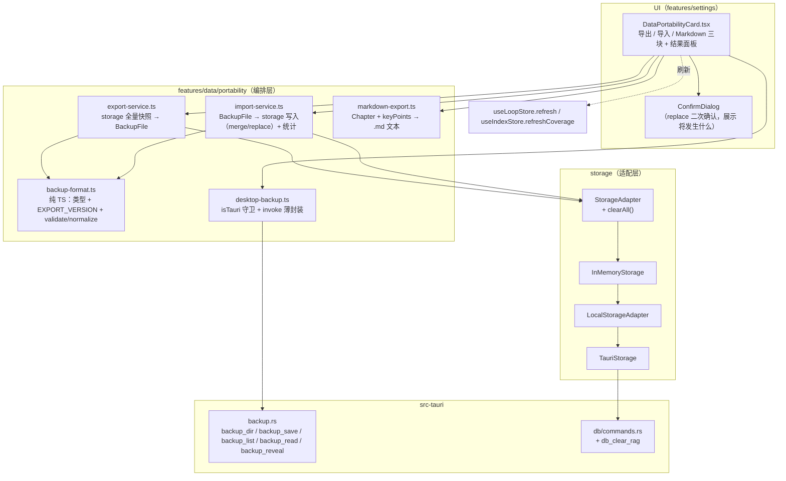
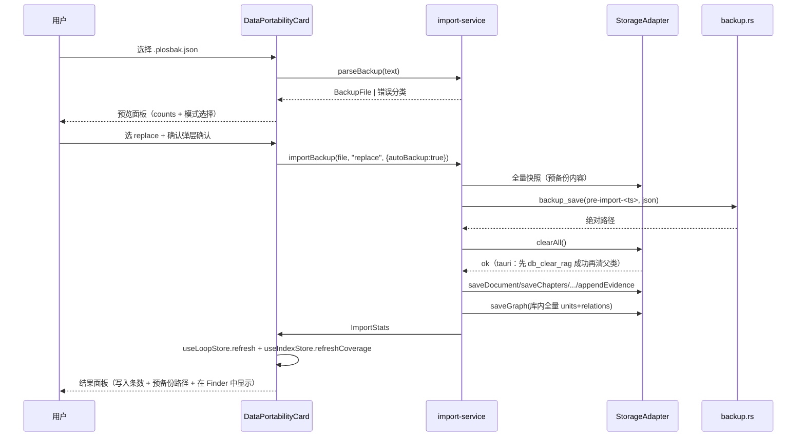

# 数据可携带（全量导出 / 导入恢复 / 备份）技术方案

| 字段 | 内容 |
|------|------|
| 作者 | Agent（WorkBuddy）+ 许一 |
| 日期 | 2026-09-17 |
| 状态 | **已实施**（D1–D6 于 2026-09-17 拍板；同日 T1–T13 全部落地，执行记录见 `docs/data-portability-export-import-runbook-2026-09.md`） |
| 关联需求 | `docs/roadmap-next-features-plan-2026-09.md` §F4「学习资产可携带」（`P0 · 中`）；`README.md` 产品原则 #1 / `README.zh-CN.md` 产品原则 #1；README 功能清单 `🔒 Data & portability` 两条未实现 `P0` |

---

## 1. 背景

### 1.1 一句话

README 用中英双语向用户承诺「**数据属于你 —— 随时可以导出并离开**」，而 `StorageAdapter` 的 81 个方法里**没有任何一条能把数据拿出来**；本方案就是把这句承诺从文案变成能力。

### 1.2 触发原因与现状证据（均为实测）

| 证据 | 位置 | 事实 |
|------|------|------|
| 产品原则 #1 | `README.md:396` | `**You own the data** — export and walk away whenever you want.` |
| 产品原则 #1（中） | `README.zh-CN.md:401` | `**数据属于你** —— 随时可以导出并离开。` |
| 功能清单 | `README.md:474-475` | `- [ ] Full export / import / backup P0 — …but the storage layer has no export method yet`；`- [ ] Markdown export of a single chapter P0` |
| 存储契约 | `src/storage/types.ts` | `StorageAdapter` 共 **81** 个 `Promise` 方法，**零**导出 / 导入 / 清空 |
| 单例存储 | `src/stores/useLoopStore.ts` | `export const storage: StorageAdapter = createStorage()` —— **模块级单例**，不存在「重新 new 一个空库」的路径 |
| 后端分叉 | `src/storage/tauri.ts:229` | `TauriStorage extends LocalStorageAdapter`：**只有 RAG 五类**（Section/Chunk/KnowledgeUnit/Relation/Embedding）走 SQLite `db_*`，其余 17 类实体**仍由父类 localStorage 承载** |
| key 清单 | `src/storage/local.ts` | **22** 个 `plos.*` key + 2 个 UI 偏好 key（`plos:settings:v1` / `plos:lang:v1`，注意是**冒号**）|
| SQLite 表 | `src-tauri/src/db/schema.sql` | 7 张表（`sections`/`chunks`/`chunk_knowledge`/`knowledge_units`/`knowledge_relations`/`embeddings`/`chunks_fts`）+ `_schema_version`（当前 **v4**）|
| SQLite 命令 | `src-tauri/src/db/commands.rs`(22) + `embedding_commands.rs`(6) | 28 条全是**单实体 CRUD + FTS**，**无 wipe 命令** |
| 能力/权限 | `src-tauri/capabilities/default.json` | 只有 `core:default`；`package.json` 与 `src-tauri/Cargo.toml` **均无** `tauri-plugin-dialog` / `tauri-plugin-fs` |
| 旧文案 | `src/i18n/messages/zh.ts` `settings.storage.note` | 「重置/迁移数据的能力随 SQLite 后端一起提供（**本里程碑不提供清除按钮**，避免误删本地数据）」——本方案落地后此句必须改写 |

### 1.3 不做的后果

- 用户一旦想换机 / 想备份 / 想跑「卸载重装」，**唯一的路径是手工拼 `localstorage.sqlite3` 与 `plos.db`** —— 这是开发者路径，不是产品路径。
- README 的差异化卖点（local-first、数据自有）**在代码层面是空头承诺**；`docs/business-flow-end-to-end-2026-09.md:507` 已明确把「导出」列为叙事链上**唯一未兑现的收口项**。
- F6 能力评测的方案已显式记为「不做报告导出（依赖 F4）」（`docs/goal-capability-assessment-design-2026-09.md:101`），F1 画像方案也把「导出白名单须含 `LearnerProfile`」登记为对外依赖（`docs/learner-profile-design-2026-09.md:1242`）—— **F4 是多个已完成特性的收尾债**。

---

## 2. 方案目标

| 类型 | 描述 |
|------|------|
| **主要目标** | ① 设置页可**一键导出全量备份**（单文件，纯 JSON，含版本号）；② 可**从该文件恢复**（merge / replace 两策略）；③ 可**把单章导出为 Markdown**（正文 + 要点卡）；④ 兑现 README 产品原则 #1 与功能清单两条 `P0`；⑤ 全流程**零网络**、**零 AI**、**可离线单测** |
| **非目标** | ① **不导出** API Key / Keychain（`service=plos`）与任何密钥；② **不导出** UI 偏好（`plos:settings:v1` 含端点与模型名、`plos:lang:v1`）；③ **不导出**内部迁移标记（`plos.rag.migrated.v1` / `plos.graph.migrated.v2`）与日志配置（Rust 侧 `logging/config.json`）；④ 不做加密包、不做云同步、不做「社区知识包」（README 里的 `P2` 项）；⑤ 不做自动定时备份（留待后续单项评估）；⑥ 不引入 JSON Schema 校验库或 zip 库（保持零新运行时依赖）；⑦ 不做「导出包在多台机器间双向同步」的冲突合并智能——冲突规则见 §4.3.4，是**确定性且可解释**的，不是「智能合并」 |
| **成功标准** | ① **round-trip 单测**：`InMemoryStorage` 造全量样本 → 导出 → 新建空库 → 导入 → **逐字段深比较一致**；② 跨版本导入**拒绝或迁移**，绝不静默丢数据；③ 三个后端（memory / local / tauri）行为一致（tauri 的差异只在 SQLite 侧清理 + 向量本体）；④ `npm run typecheck` 0 新 error；⑤ README 双语 checkbox 与顶部统计行**实测同步** |

---

## 3. 项目现状

### 3.1 相关代码与模块

| 区域 | 现状 | 与本次的关系 |
|------|------|--------------|
| `src/storage/types.ts` | 81 个方法的抽象契约 | **新增 `clearAll()`**（replace 导入的唯一手段） |
| `src/storage/memory.ts` | 内存实现（基类），持有 22 组内存结构 | 实现 `clearAll()`；导出读取的主要来源 |
| `src/storage/local.ts` | 在基类之上 override 每个写方法 → 全量 `persist()`；`embeddingsForPersist()` **剥离向量本体**（`vector` 不入 localStorage） | 读取走继承来的方法即可；`clearAll()` 需 override 为「清内存 + removeItem 全部 key」 |
| `src/storage/tauri.ts` | RAG 五类走 `trySqlite`，失败静默回退父类 | `clearAll()` 需 override：先清 SQLite（否则 FTS/向量留孤儿，污染检索），失败**不得假装成功** |
| `src/storage/graph-split.ts` | `splitGraph`/`mergeGraph`/`diffIds` 等 DTO 转换 | 导入知识层后回写 `saveGraph` 时复用 |
| `src-tauri/src/db/*` | 28 条单实体命令 | 新增 **1** 条 `db_clear_rag` |
| `src-tauri/src/logging.rs` | 已有「写文件 + `open` 打开目录」的成熟范式（`log_open_dir`） | 新增 `backup.rs` 直接照此范式写 |
| `src/lib/desktop-log.ts` | 桌面能力的**前端封装范式**（`isDesktopLogAvailable()` 守卫 + 一层薄封装） | 新增 `src/features/data/portability/desktop-backup.ts` 同构 |
| `src/features/settings/SettingsPage.tsx` | Storage 分区已展示后端徽标 + 5 项计数（docs/chapters/papers/goals/evidence） | 新卡片就长在这个分区里（同屏有「我这库有多大」的语境） |
| `src/features/learn/import/*` | 已有 `File` → 文本的读取范式（`decodeBytes` + `<input type="file">`） | 导入备份文件复用同一读取/解码路径 |
| `src/components/ui/` | 有 `button` / `dialog` / `confirm-dialog` / `checkbox` / `badge` / `spinner` | UI 全部复用，不新增基础件 |

### 3.2 相关文档与约定

- `docs/roadmap-next-features-plan-2026-09.md` §F4（范围 4 条 + Done 标准）—— 本方案的**需求真源**。
- `docs/business-flow-end-to-end-2026-09.md:507`（导出是叙事收口项）、`docs/learner-profile-design-2026-09.md:1242`（画像须进导出白名单）、`docs/goal-capability-assessment-design-2026-09.md:101`（能力报告导出依赖 F4）。
- 必须遵守：`rules/layer-import-boundaries.mdc`（UI → stores/storage；桌面能力仅经 `invoke`）、`rules/code-structure-and-dependencies.mdc`（≤700 行；≥10 行 × ≥3 处先抽取）、`rules/engineering-code-style.mdc`（相对导入、中文注释、i18n 双语成对、`import type`）、`rules/no-headless-browser-validation.mdc`（**禁止起浏览器校验** → 验收靠 typecheck + node 单测 + 代码自审）。
- 仓库工作流：`skills/pre-task-technical-design`（本文件）→ 用户确认 → `skills/docs-task-runbook`（建 runbook）→ 实施。

### 3.3 约束与依赖

| 类别 | 约束 |
|------|------|
| 架构 | `src-tauri/**` 只在「需要动 SQLite 表」时改；**导出读路径零 Rust 依赖**（借 `TauriStorage extends LocalStorageAdapter` 的继承关系，加读方法只改基类/父类） |
| 分层 | 编排落在 `src/features/`（`ai/` 与 `engine/` 不得 import `features/`）；UI 不直接碰 storage；文件系统能力只经 `invoke` |
| 依赖 | 运行时依赖**零新增**（无 zip / 无 schema 库 / 无 dialog 插件 —— 见 D1）；Rust 侧**零新增 crate**（`serde_json` 已在） |
| 可测性 | 全部核心逻辑必须能进 `tests/*.test.ts`（node `--experimental-strip-types`）→ 纯逻辑落 `.ts`，**不得 import `.tsx`** |
| 验证边界 | 受 `no-headless-browser-validation` 约束 → 「浏览器端 Blob 下载」「Tauri webview `<input type="file">`」两条**无法在本仓库自动验证**，只做代码自审 + 手工验收清单（见 §12.2） |
| 体量 | 全量 JSON 含 `SourceDocument.textPreview`（正文快照）+ `Chunk.content` → 同一段文字会**出现两次**；个人资料量级（几十份文档 / 万级 chunk）下预计 **10–80 MB**，这是可接受的（本机文件，不上传） |

### 3.4 决策点（D1–D6）

> **2026-09-17 结论**：**D1 / D3 / D4 / D6 已拍板＝下表推荐档**；D2 / D5 未单独过会，若无异议按推荐档实施（二者改动面均为 S，且不改变架构）。
> 全文其余章节按推荐项书写；任何一档改档后须**全量回扫**（§4/§5/§8/§9/§12 的对应描述）。

| ID | 决策点 | 选项 | 推荐 | 理由 |
|----|--------|------|------|------|
| **D1** | 桌面端落盘通道 | **A** 自建 `backup.rs`（5 条自定义命令，零新 crate、零 capabilities 改动）<br>**B** 引 `tauri-plugin-dialog` + `tauri-plugin-fs`（原生「另存为」，体验最好）<br>**C** 纯前端 Blob 下载（零 Rust 改动，但 Tauri webview 落盘行为不确定） | **A** | 备份天然该集中在固定目录（才有「最近备份」与自动预备份）；B 要动 `Cargo.toml`+`package.json`+`capabilities`+首次构建拉依赖，收益仅是「能选任意路径」；C 的失败模式是「用户以为导出成功了其实没有」，不可接受 |
| **D2** | 导入来源入口 | **A** `<input type="file">` 选任意路径（桌面/浏览器通用）<br>**B** 只从 `<app_data>/backups` 列表选 | **A（B 作兜底）** | A 让「从别处拿到备份文件 → 恢复」这条路走得通（换机场景必需）；B 作为桌面端文件选择器异常时的回退实现，UI 占位不变 |
| **D3** | replace 导入的清空手段 | **A** 新增 `clearAll()`（三后端）+ Rust `db_clear_rag`（**允许改 `src-tauri/**`**）<br>**B** 只做 merge，不提供 replace | **A** | 不提供 replace 等于「恢复备份」这件事没做完（换机/重装的核心场景）；B 还会留下「旧 chunk 留在 SQLite 里被 FTS 检索到」的静默错数据。⚠️ 代价：本方案是 F4 里**唯一需要动 `src-tauri/**` 的部分**（1 文件新增 + 2 处注册） |
| **D4** | 向量本体是否进导出包 | **A** 不含（默认）<br>**B** 含（体积 ×3~5）<br>**C** 导出时给开关 | **A** | 向量是**可重算的派生数据**（`index-service` 一键重建）；`local` 后端本就不持久化向量（`embeddingsForPersist` 剥离），带上会让「同一份备份在两种后端表现不同」。备份应只带**不可重算**的东西 |
| **D5** | replace 前的自动预备份 | **A** 桌面端自动写 `pre-import-<ts>.plosbak.json`；浏览器端要求用户勾选「我已自行备份」<br>**B** 不做预备份，只靠二次确认 | **A** | 「清空整库」是本特性唯一的破坏性操作；`clearAll` 之后写入失败的用户损失不可逆。A 的成本只是一次已有的导出调用（复用 `collectSnapshot`） |
| **D6** | v1 范围 | **A** 全量导出 + 导入恢复 + **单章 Markdown**（= README 两条 `P0`）<br>**B** 再加「单文档 JSON 导出 / 单目标范围导出」<br>**C** 只做全量导出 + 导入恢复 | **A** | README 的两条 `P0` 正好是 A；B 是 roadmap 里的「范围可选」项，可在 A 落地后按需加（导出服务已是参数化的 `collectSnapshot`，扩展成本低）；C 会让 README 留一条 `P0` 未兑现 |

---

## 4. 技术架构

### 4.1 总体架构



**关键读法**：UI 只调 `features/data/portability/*`；服务只调 `features/data/portability/*`；**没有任何一层绕过 `StorageAdapter` 去读 localStorage 原文**。桌面文件能力只出现在 `desktop-backup.ts`（`isTauri()` 守卫）→ `backup.rs`，与 `lib/desktop-log.ts` → `logging.rs` 完全同构。

### 4.2 模块职责

| 模块/层级 | 职责 | 技术选型 |
|-----------|------|----------|
| `features/data/portability/backup-format.ts` | 导出包类型定义、版本常量、**纯函数**校验与归一化、错误分类枚举 | 纯 TS，零依赖，可单测 |
| `features/data/portability/export-service.ts` | 读 `StorageAdapter` 全量实体 → 组装 `BackupFile` → 产出「同一次读取」的 counts | 纯编排，无 UI 文案（只产分类/enum） |
| `features/data/portability/import-service.ts` | 解析/校验 → 自动预备份（可选）→ `clearAll()`（replace）→ 逐实体写入 → 回写 `saveGraph` → 返回统计 | 纯编排；错误只回分类 |
| `features/data/portability/markdown-export.ts` | `Chapter` + 章级 `keyPoints` → Markdown 文本（标题层级 + 要点卡 + 出处） | 纯函数，可单测 |
| `features/data/portability/desktop-backup.ts` | `invoke("backup_*")` 薄封装 + `isTauri` 守卫（对齐 `lib/desktop-log.ts`） | IPC 封装 |
| `features/data/portability/DataPortabilityCard.tsx` | 卡片 UI：三块操作 + 结果/错误/空态 + 最近备份列表 | React + 现有 UI Kit |
| `storage/types.ts` / `memory.ts` / `local.ts` / `tauri.ts` | 新增 `clearAll()`，三后端语义一致 | 既有适配层 |
| `src-tauri/src/backup.rs` + `db/commands.rs` | 备份文件落盘/列举/读取/在 Finder 中显示；清空 SQLite RAG 七表 | Tauri 2 自定义命令（**不引插件**） |
| `src/i18n/messages/{zh,en}.ts` | `settings.storage.data.*` 新键 + 改写旧 `note` | i18n 双语成对 |

### 4.3 数据模型与 API

#### 4.3.1 导出包格式（`BackupFile`）

```ts
/** 扩展名：.plosbak.json —— 双重后缀，`.json` 保证任意编辑器/终端可直接查看。 */
export const BACKUP_KIND = "plos.backup" as const;
export const EXPORT_VERSION = 1 as const;   // 导出格式版本

export interface BackupFile {
  kind: typeof BACKUP_KIND;        // 防「导入了一个别的 JSON」
  exportVersion: number;           // ⚠️ 与 SQLite 的 `_schema_version`(v4) 无关，独立演进
  appVersion: string;              // package.json version（排障用，不参与校验）
  exportedAt: number;              // epoch ms
  backend: string;                 // storage.name（local | memory | tauri）
  counts: EntityCounts;            // 各实体条数 —— 导入前的预检真源
  data: BackupData;
}
```

**⚠️ 两条硬不变量**（写进类型注释，实施时不得绕开）：

1. `counts` 必须与 `data` **由同一次读取产出**：`counts` 在 `export-service` 里由 `data` 直接派生（`countsOf(data)`），**绝不允许**另起一次 `storage.listXxx()` 来填 —— 否则就是 F2「两把尺子」的同类陷阱（用户在结果面板看到的数字与实际内容不一致）。
2. `counts` 在导入时用作**完整性校验**：逐字段比对「文件里数组长度 vs 声明的 counts」，不一致 → 判 `corrupt` 并拒绝（防截断/手工改坏）。

`BackupData` 字段 ↔ `StorageAdapter` 方法的完整映射（**这是白名单，多一个字段都要走决策**）：

| # | 字段 | 来源方法 | 目标方法（导入） | 备注 |
|---|------|----------|------------------|------|
| 1 | `documents: SourceDocument[]` | `listDocuments()` | `saveDocument()` | 含 `textPreview`（正文快照）与 `overview`（AI 概览） |
| 2 | `chaptersByDocument: Record<string, Chapter[]>` | 逐 `doc.listChapters(id)` | `saveChapters(docId, list)` | 按文档分组的**整批覆盖**语义 |
| 3 | `sections: Section[]` | 逐章 `listSections(chapterId)` | `saveSections()` | ⚠️ 接口无「全量 section」读取 → 必须**逐章遍历**（理由见 4.3.3） |
| 4 | `chunks: Chunk[]` | 逐文档 `listChunksByDocument(docId)` | `saveChunks()` | 同上，逐文档 |
| 5 | `knowledgeUnits: KnowledgeUnit[]` | `listKnowledgeUnits()`（不传参 = 全量） | `saveKnowledgeUnits()` | |
| 6 | `knowledgeRelations: KnowledgeRelation[]` | `listRelations()`（不传参 = 全量） | `saveRelations()` | |
| 7 | `embeddings: EmbeddingMeta[]` | `listEmbeddings()` | `saveEmbeddings()` | **默认不含向量本体**（D4）；`vector` 为可选字段 |
| 8 | `papers: Paper[]` | `listPapers()` | `savePaper()` | |
| 9 | `paperDrafts: Record<string, PaperAnswers>` | 逐 `paper.id` `getPaperDraft(id)` | `savePaperDraft(id, answers)` | 未交卷作答是**用户输入**，必须带走 |
| 10 | `paperResults: PaperResult[]` | `listPaperResults()` | `savePaperResult()` | |
| 11 | `learnerState: LearnerState` | `getLearnerState()` | `saveLearnerState()` | 单体对象（`byUnit`）→ 合并规则见 4.3.4 |
| 12 | `profile?: LearnerProfile` | `getProfile()` | `saveProfile()` | F1 方案明确要求进白名单 |
| 13 | `restatements: Restatement[]` | 逐章 `listRestatements(chapterId)` | `saveRestatement()` | ⚠️ 接口按 `chapterId` 过滤 → 逐章遍历 |
| 14 | `cardStates: CardStateMap` | `listCardStates()` | `saveCardState()` 逐条 | 卡面从 Chapter 派生 → 只需带走调度状态 |
| 15 | `annotations: Annotation[]` | 逐文档 `listAnnotations(documentId)` | `saveAnnotation()` 逐条 | ⚠️ 接口按 documentId 过滤 → 逐文档遍历 |
| 16 | `goals: LearningGoal[]` | `listGoals()` | `saveGoal()` | |
| 17 | `evidence: EvidenceEntry[]` | `listEvidence()` | `appendEvidence()` 逐条 | ⚠️ 无「批量写」→ 逐条 append；上限 `EVIDENCE_LOG_MAX`(5000) 由基类裁剪，导出侧**不重写这个数字** |
| 18 | `capabilityItems: Record<string, CapabilityItem[]>` | 逐 `goal.id` `listCapabilityItems(goalId)` | `saveCapabilityItems(goalId, items)` | 整批覆盖语义/目标 |
| 19 | `capabilityRuns: CapabilityRun[]` | 逐 `goal.id` `listCapabilityRuns(goalId)` | `saveCapabilityRun()` | 接口按 goalId 过滤 → 逐目标遍历 |
| 20 | `capabilityReports: CapabilityReport[]` | 逐 `goal.id` `listCapabilityReports(goalId)` | `saveCapabilityReport()` | 同上 |

**刻意不导出**（每一条都要有理由，别在实施时"顺手加上"）：

| 不导出 | 理由 |
|--------|------|
| `activeGoalId` | 接口只有 `getActiveGoal()`，它**在未设置/ id 失效时会回退首个目标** → 导出它等于把**兜底值当偏好**写回。导入后按现有规则回退首个目标，正是「无脏状态」的既有语义（`memory.ts::getActiveGoal` 注释） |
| `plos.graph` blob | 与 `knowledgeUnits` + `knowledgeRelations` 是**同一事实的两种表示**；导出两份必然分叉。导入侧改为**回写一次 `saveGraph()`** 同步两条路径（见 4.3.3） |
| `plos.rag.migrated.v1` / `plos.graph.migrated.v2` | 内部迁移标记：目标机器必须按**自己的**库状态决定是否迁移，带过去会让迁移被短路 |
| `plos:settings:v1` / `plos:lang:v1` | UI/环境偏好（含 API 端点与模型名），非学习资产；且 `apiKey` 已在持久化层剥离为 `""`，语义不完整 |
| Keychain（`service=plos`） | **密钥永不进备份文件**。用户在目标机器重新输入 API Key |
| Rust `logging/config.json` | 环境配置，且真源在 Rust |

#### 4.3.2 新增存储契约（唯一一处接口扩展）

```ts
// src/storage/types.ts —— 追加到接口末尾
/** 清空整库（replace 导入用）。幂等；只清本适配器负责的全部实体，不碰偏好/密钥。 */
clearAll(): Promise<void>;
```

三后端语义：

| 后端 | 实现要点 |
|------|----------|
| `InMemoryStorage` | 逐个重建内存结构（`documents = new Map()` … `learnerState = { byUnit: {} }`；`profile = undefined`；`activeGoalId = undefined`；`evidenceLog = []`）。⚠️ 用「重建」而非 `clear()`，保证与构造函数初值**逐字段同形** |
| `LocalStorageAdapter` | `super.clearAll()` + **`removeItem` 全部 22 个 key**（含 `plos.active-goal` 这个不随 `persist()` 走的独立 key）。⚠️ **不要**靠 `persist()` 写空数组，那会留下 22 个 `"[]"` 垃圾 key；也**不要**碰 `plos:settings:v1` / `plos:lang:v1` / 迁移 flag |
| `TauriStorage` | `await invoke("db_clear_library", {})` **成功后**才 `super.clearAll()`（即父类的清内存 + 删 localStorage key）；SQLite 失败 → **抛错并中止 clearAll**（不降级），由导入服务转成 `sqlite-blocked` 分类让 UI 明说「本机数据库未清空，已取消替换导入」。⚠️ 理由：RAG 五类的真源在 SQLite，只清 localStorage 会留下旧 chunk/section/向量 → FTS 检索返回**已被用户删掉的段落**，属于「静默错数据」，比报错严重 |

#### 4.3.3 读取/写入必须注意的 4 个「没有全量接口」的坑

`StorageAdapter` 有 81 个方法，但**没有** `listAllSections()` / `listAllChunks()` / `listAllRestatements()` / `listAllAnnotations()`，其读取入口都带维度参数。导出必须**遍历上层的文档/章/目标**逐层收集（这正是本次要写清的地方，避免实施时凭空发明接口）：

```
documents = listDocuments()
for d in documents:
    chaptersByDocument[d.id] = listChapters(d.id)
    chunks += listChunksByDocument(d.id)
    annotations += listAnnotations(d.id)          // 按 documentId
    for c in chapters:
        sections  += listSections(c.id)           // 按 chapterId
        restatements += listRestatements(c.id)    // 按 chapterId
goals = listGoals()
for g in goals:
    capabilityItems[g.id] = listCapabilityItems(g.id)
    capabilityRuns += listCapabilityRuns(g.id)
    capabilityReports += listCapabilityReports(g.id)
for p in listPapers():
    drafts[p.id] = getPaperDraft(p.id)            // 可能 undefined → 跳过
```

**⚠️ 孤儿数据的诚实处理**：遍历式收集**拿不到孤儿**（例如资料 A 已被删但它的 Section 还在——`deleteDocument` 只级联章与批注，**不清 Section/Chunk**）。因此：

- 导出时统计 `orphans`（通过 `listKnowledgeUnits()` / `listRelations()` / `listEmbeddings()` 的全量结果与「按文档收集到的 id 集合」做差集），**只在结果面板展示条数**，不阻止导出、不自动清理（清理是另一个决策）；
- 导入侧**不重建孤儿**（它们本来就指不到东西）。在 §12.2 记录为已知残留。

**⚠️ 导入的最后一步必须回写 `saveGraph()`**：

- `local` 后端下 `getGraph()` 读的是 `plos.graph` blob，而导入走的是 `saveKnowledgeUnit` / `saveRelation`（写 `plos.knowledge-units` / `plos.knowledge-relations`）→ **不回写 blob 就会出现「概念图看的是旧图、检索用的是新概念」**；
- `tauri` 后端下 `saveGraph()` 内含 **diff-delete**（`diffIds` → `db_delete_knowledge_unit`）→ 如果只把「导入的那部分」写进去，会**删掉本机独有的概念**；
- 因此统一规则：**导入写入完成后，取库内当前全量 `listKnowledgeUnits()` + `listRelations()` → `saveGraph({units, relations})`**。这样一来：merge 模式下 diff 为空（都刚 upsert 过），replace 模式下正好把空库补成导入内容。**一条规则同时满足两种模式**，不需要分支。

#### 4.3.4 导入语义（两种模式 + 确定性冲突规则）

| 模式 | 语义 | 实现 |
|------|------|------|
| `merge`（默认） | 按 id upsert，保留本机独有内容 | 直接逐个 `saveXxx()`；但**整批/单体语义**的实体（见下表）必须先读本地再合并，否则会被整批覆盖 |
| `replace` | 清空后导入 = 「恢复到这份备份」 | `clearAll()` → 全量写入。⚠️ 前置于**自动预备份**（D5）与**二次确认** |

**整批/单体语义实体的合并规则**（这是 merge 模式的真正难点，必须显式定义）：

| 实体 | 为什么特殊 | merge 规则 |
|------|-----------|-----------|
| `chaptersByDocument` | `saveChapters(docId, list)` 是**整文档覆盖** | 按 `chapter.id` 合并：本地章 ∪ 导入章，同 id 取**导入**侧；再 `saveChapters` 整批写回 |
| `knowledgeUnits` / `knowledgeRelations` | `saveGraph` 最终整体回写（4.3.3） | 直接 upsert，最后由 `saveGraph(库内全量)` 收口 |
| `learnerState.byUnit` | `saveLearnerState(state)` 是**整体覆盖** | 逐 unitId 合并：本机无 → 取导入；两边都有 → 取 **`max(lastReviewedAt ?? lastAssessmentAt ?? 0)`** 较新的一侧；**时间戳相等或都缺失 → 保留本机**。并把「同 id 冲突且保留本机」的条数记为 `learnerStateKept` |
| `cardStates` | `saveCardState` 逐条 upsert（无整批覆盖） | 直接逐条 upsert；同 id 取导入（调度状态以备份为准）。冲突条数记 `cardStatesOverwritten` |
| `capabilityItems[goalId]` | `saveCapabilityItems(goalId, items)` 是**整批覆盖** | 目标级：本机有而备份无 → 保留本机清单；备份有 → 用备份清单覆盖该目标（清单是「一个目标一份」的强绑定，逐项合并会产生语义矛盾的清单） |
| `evidence` | `appendEvidence` 是**追加 + 5000 上限裁剪** | 按 `(at, kind, subjectId, sourceId?)` 组合键去重后追加；⚠️ 顺序影响裁剪结果 → **按 `at` 升序追加**，最旧的先入被裁掉，语义与「先发生先入队」一致 |
| `papers` / `paperResults` / `paperDrafts` / `restatements` / `annotations` / `documents` / `goals` / `profile` | 均为按 id upsert | 直接逐个 upsert；同 id 取导入（`profile` 例外：备份为 `undefined` 时**不清空**本机画像——`saveProfile(undefined)` 是「清除」语义，导入时绝不调用） |

**导入结果统计**（UI 必须展示，不允许"完成了"三个字了事）：

```ts
interface ImportStats {
  mode: "merge" | "replace";
  written: Record<string, number>;   // 各实体实际写入条数
  learnerStateKept: number;          // merge 下同 id 冲突且保留本机的条数
  cardStatesOverwritten: number;
  evidenceSkipped: number;           // 去重跳过的证据条数
  orphansSkipped: number;            // 指不到上下文的孤儿（§4.3.3）
  preBackupPath?: string;            // replace 前的自动预备份路径（桌面端）
}
```

#### 4.3.5 桌面文件通道（`backup.rs`，5 条命令）

| 命令 | 签名 | 用途 |
|------|------|------|
| `backup_dir` | `() -> Result<String, String>` | 返回 `<app_data>/backups` 绝对路径（不存在则创建）→ UI 展示 + 「打开目录」 |
| `backup_save` | `(name: String, contents: String) -> Result<String, String>` | 写入该目录，返回绝对路径。`name` 经白名单校验（见下） |
| `backup_list` | `() -> Result<Vec<BackupEntry>, String>` | 列 `*.plosbak.json`（`name/path/bytes/modifiedAt`），按时间倒序 → 「最近备份」列表 |
| `backup_read` | `(name: String) -> Result<String, String>` | 按名读取（同样白名单校验） |
| `backup_reveal` | `(path: String) -> Result<(), String>` | 在文件管理器中显示该文件（macOS `open -R`；与 `logging.rs::log_open_dir` 同范式） |

**⚠️ 安全校验（必须实现，不是可选项）**：`name` 只允许 `[A-Za-z0-9._-]+` 且必须以 `.plosbak.json` 结尾，**拒绝**包含 `/` `\` `..` 的输入；`backup_reveal` 只接受 `backup_dir()` 的子路径。理由：`name` 来自前端，若不校验就是一条任意文件写入原语（Tauri 自定义命令默认可达）。

**⚠️ 浏览器预览（非 Tauri）**：`desktop-backup.ts` 里每个函数先 `if (!isTauri()) return fallback`，卡片据此走 Blob 下载 / `<input type="file">` 路径（D1 的备选实现）。

### 4.4 状态与副作用

| 状态 | 载体 | 说明 |
|------|------|------|
| 卡片内部状态 | `useState` | `busy`（`"export" \| "import" \| "md" \| undefined`）、`stats`、`error`（分类，非文案）、`backups`（桌面端列表）、`pendingFile`（已选待导入的文件） |
| 无新 store | —— | 导出/导入是**一次性动作**，不需要全局状态；**不新增 store、不新增持久化 key** |
| 导入后刷新 | 既有 store | `useLoopStore.getState().refresh(m)` + `useIndexStore.getState().refreshCoverage()`（编排函数放 `features/data/portability/`，features → stores 合法；**不新增 store 方法**） |
| 副作用时机 | 用户点击 | 无轮询、无 mount 副作用；桌面端 `backup_list` 在卡片展开时拉一次 |

**⚠️ 导入后刷新是必须项**：`storage` 是模块级单例（`useLoopStore.ts`），其他页面都持有它的内存镜像 → 不刷新就会出现「首页还显示旧计划、资料库还显示旧文档」，直到用户手动刷新。这条要进 §12.1 的回归用例。

---

## 5. 交互流程

### 5.1 主流程（导出）

1. 用户进入 设置 → 本地存储 分区，滚动到「数据可携带」卡（在既有计数卡下方）。
2. 卡片顶部显示：后端徽标 + 「将导出 N 份资料 / M 个章节 / K 条证据」预估行（复用 Storage 分区已有的 counts 读取；**这里的数字是"将导出什么"的口径，与导入结果面板的口径不同，文案要区分**）。
3. 用户点「导出完整备份」→ 按钮进入 `busy`，显示 `Spinner` + 「正在读取本地数据…」。
4. 服务层：全量快照 → 组 `BackupFile` → `JSON.stringify`（不做 pretty-print，体积优先；`docs` 场景由用户自己用编辑器格式化）。
5. 落盘：
   - 桌面端：`backup_save("plos-backup-YYYYMMDD-HHmmss.plosbak.json", json)` → 返回路径 → UI 显示「已保存到 `<path>`」+「在 Finder 中显示」按钮；
   - 浏览器：`Blob` + `URL.createObjectURL` + `<a download>`（用后 `revokeObjectURL`）。
6. 完成态：绿色/中性成功块 + 文件名 + 大小（`bytes` 人类可读）+ 耗时。

### 5.2 主流程（导入）

1. 用户点「从备份导入」→ 选文件（桌面端推荐 `<input type="file" accept=".json" hidden>`；若该路径在桌面端不可用，回退「最近备份」列表点选 —— 两个入口占同一位置，实现二选一见 D2）。
2. 读取 + 解析 + `parseBackup()`（纯函数，见 §8.7）：
   - 不是 `plos.backup` → `not-backup`；
   - `exportVersion > EXPORT_VERSION` → `version-newer`（提示「该文件由更新版本导出，请升级应用」）；
   - `exportVersion < EXPORT_VERSION` → 走 `migrateBackup()`（v1 无历史，函数体先留空 + 注释，**接口留好**）；
   - `counts` 与 `data` 不一致 / 缺字段 → `corrupt`。
3. 校验通过 → 展示**导入预览面板**：`counts` 明细 + 模式选择（merge 默认 / replace）+ 警示语（replace 会先自动备份）。
4. `merge`：直接写入（4.3.4）→ 写 `saveGraph` 收口 → 刷新 store → 展示结果统计。
5. `replace`：
   - 桌面端先自动导出预备份到 `pre-import-<ts>.plosbak.json`（浏览器端提示用户先手动导出一份，或勾选「我已自行备份」再继续——**不假装能自动备份**）；
   - `ConfirmDialog` 二次确认（文案含具体条数，不是"确定吗？"）；
   - `clearAll()` → 写入 → `saveGraph` 收口 → 刷新 store → 结果统计（含预备份路径）。

### 5.3 分支与异常流程

| 场景 | 触发条件 | 系统行为 | UI 反馈 |
|------|----------|----------|---------|
| 空库导出 | 所有 counts 为 0 | 仍允许导出（空备份是合法的灾备起点） | 结果块提示「这份备份里是空的」 |
| 导入文件损坏 | `JSON.parse` 抛错 / `parseBackup` 失败 | 不写任何数据（校验在 `clearAll` **之前**） | `corrupt` 分类 → 「文件无法识别，未改动任何数据」 |
| 版本更新 | `exportVersion > 1` | 拒绝 | 「文件来自更新版本（v{n}），请先升级应用」 |
| replace 中 SQLite 清空失败 | `db_clear_rag` 抛错 | `clearAll()` 整体中止，**不写入** | 「本机数据库未能清空，已取消替换导入（数据未改动）」 |
| replace 中写入失败 | 配额 / IO 错误 | 中止 + 报告已写入条数 | 「导入未完成：已写入 X/ Y，请用预备份 `<path>` 重试」——**绝不静默** |
| merge 画像为 `undefined` | 备份里没有画像 | 跳过 `saveProfile`（绝不用 `undefined` 清空本机画像） | 统计里 `profileWritten: 0` |
| 非 Tauri 环境调 `backup_*` | 浏览器预览 | `desktop-backup.ts` 守卫直接返回 `undefined`，改走 Blob/File | 不报错，按钮文案自动切换 |
| 超过 localStorage 配额（浏览器端导入 replace） | 大库 | 捕获 `QuotaExceededError` | 「浏览器预览容量不足，请改用桌面端导入完整备份」+ 建议 |

### 5.4 时序图（replace 导入）



---

## 6. 用户用例（User Cases）

### UC-01：导出完整备份（桌面端）

| 项 | 内容 |
|----|------|
| 角色 | 学习者（本机数据的主人） |
| 前置条件 | 桌面端已启动；库中有数据（资料 / 章节 / 证据至少一类非空） |
| 主流程步骤 | 1. 打开 设置 → 本地存储 → 数据可携带 2. 点「导出完整备份」 3. 等待读取完成 4. 看到「已保存到 `<app_data>/backups/plos-backup-….plosbak.json`」 |
| 期望结果 | 该文件存在且是合法 JSON；`kind=plos.backup`、`exportVersion=1`；`counts` 与 `data` 各数组长度一致；可在文本编辑器中打开 |
| 异常/边界 | 空库仍可导出；写盘失败（磁盘满/权限）→ 报错且不留下半截文件（Rust 侧先写临时名再 rename，见 §8.2） |

### UC-02：导出完整备份（浏览器预览）

| 项 | 内容 |
|----|------|
| 角色 | 开发者 / 试用者 |
| 前置条件 | `npm run dev`，浏览器打开 1420，库中有数据 |
| 主流程步骤 | 同上，但落盘方式为浏览器下载 |
| 期望结果 | 浏览器下载一个 `.plosbak.json`；内容与 UC-01 同构（`backend: "local"`） |
| 异常/边界 | 落盘能力在桌面端不可用时自动回退到浏览器路径（§4.3.5 守卫） |

### UC-03：从备份导入（merge，保留本机内容）

| 项 | 内容 |
|----|------|
| 角色 | 学习者 |
| 前置条件 | 本机已有数据；手上有另一台机器导出的备份（与本机有部分重叠 id） |
| 主流程步骤 | 1. 点「从备份导入」选文件 2. 预览面板选 `merge` 3. 确认 4. 看结果统计 |
| 期望结果 | 本机独有资料/章/目标**仍在**；备份独有的被加入；同 id 的章取备份侧；`learnerState` 冲突按「较新时间戳」取胜，`learnerStateKept` 如实报告保留条数；概念图（`getGraph`）能看到合并后的全部概念 |
| 异常/边界 | 备份里 `profile` 缺失 → 本机画像不被清空 |

### UC-04：从备份导入（replace，恢复到该备份）

| 项 | 内容 |
|----|------|
| 角色 | 学习者（换机 / 重装后恢复） |
| 前置条件 | 备份文件合法；用户接受本机现有数据被替换 |
| 主流程步骤 | 1. 选文件 2. 预览面板选 `replace` 3. 弹层二次确认（含具体条数） 4. 桌面端自动预备份 5. 完成 |
| 期望结果 | 全库内容 == 备份内容（逐字段）；结果面板给出预备份路径；store 已刷新（首页/资料库/进度页显示新数据） |
| 异常/边界 | SQLite 清空失败 → 取消且数据未改动；写入中途失败 → 明确报告"未完成"+ 预备份路径；浏览器端无自动预备份 → 必须勾选「我已自行备份」才能继续 |

### UC-05：把一章导出为 Markdown

| 项 | 内容 |
|----|------|
| 角色 | 学习者（想把一章拿去别处用） |
| 前置条件 | 读到某一章（有 `title` + `body`/正文快照 + 章级 `keyPoints`） |
| 主流程步骤 | 1. 在卡片选中资料与章节（两级下拉，复用 `components/ui/select`）2. 点「导出本章 Markdown」3. 落盘 |
| 期望结果 | `.md` 文件含 `# 章标题`、正文原文、`## 要点` 下的要点卡（**带原文出处**，与阅读器同一清洗口径 `cleanKeyPoints`） |
| 异常/边界 | 章无要点 → 只出正文（不写空标题）；章正文取自 `Chapter.body`（不是 `Chunk`，避免带检索噪音） |

### UC-06：跨版本 / 损坏文件的拒绝

| 项 | 内容 |
|----|------|
| 角色 | 学习者 |
| 前置条件 | 手上有一个 `exportVersion: 99` 的伪造文件，或手工把某段数组删了几行 |
| 主流程步骤 | 按 UC-03 的步骤选文件 |
| 期望结果 | 在**写入之前**拒绝；提示可读（中文/英文按界面语言）；**本机数据零改动**（用例断言：导入前后的全量快照逐字节一致） |
| 异常/边界 | `counts` 与 `data` 不一致 → `corrupt`；`kind` 不符 → `not-backup`（例如误选了一份普通 JSON） |

### UC-07：导入后界面一致（无脏状态）

| 项 | 内容 |
|----|------|
| 角色 | 学习者 |
| 前置条件 | 完成 UC-04 |
| 主流程步骤 | 依次访问 首页 / 计划 / 资料库 / 进度 / 目标详情 |
| 期望结果 | 各页数据与新库一致（无"旧文档、旧计划、旧趋势"）；`useIndexStore` 覆盖率已按新库重算 |
| 异常/边界 | 正在跑的索引任务被替换导入打断 → 不做特殊处理，但覆盖率必须在导入后刷一次 |

### UC-08：在 Finder 中看到备份文件

| 项 | 内容 |
|----|------|
| 角色 | 学习者 |
| 前置条件 | 桌面端，已有一份备份 |
| 主流程步骤 | 结果面板点「在 Finder 中显示」 |
| 期望结果 | 系统文件管理器打开并选中该文件 |
| 异常/边界 | 非桌面端无此按钮（`isTauri()` 守卫） |

---

## 7. 线框 UI（Wireframe）

### 7.1 设置 → 本地存储 → 「数据可携带」卡 — 默认态

```
┌──────────────────────────────────────────────────────────────┐
│ 本地存储                                                      │
│ 一切数据都写在本机。…                                          │
│ ┌──────────────────────────────────────────────────────────┐ │
│ │ 当前后端        本机 localStorage                          │ │
│ │ ─────────────────────────────────────────────────────────│ │
│ │ 数据规模                                                  │ │
│ │ [3 份资料] [44 个章节] [7 张试卷] [2 个目标] [312 条证据] │ │
│ │ ─────────────────────────────────────────────────────────│ │
│ │ 重置/迁移数据的能力随…（旧 note → 本方案改写，见 §8.7）     │ │
│ └──────────────────────────────────────────────────────────┘ │
│                                                               │
│ 数据可携带                                       ← 新卡片标题 │
│ 导出完整备份、从备份恢复、把一章导出为 Markdown。备份是纯 JSON │
│ 文件，包含你的资料、章节、笔记、进度与证据，不含 API Key。     │
│ ┌──────────────────────────────────────────────────────────┐ │
│ │ 导出完整备份                          [ 导出完整备份 ]     │ │
│ │ 预计 3 份资料 · 44 章 · 1180 块 · 312 条证据              │ │
│ │ ─────────────────────────────────────────────────────────│ │
│ │ 从备份导入                        [ 选择备份文件… ]        │ │
│ │ 支持合并（保留本机内容）或替换（恢复到该备份）             │ │
│ │ ─────────────────────────────────────────────────────────│ │
│ │ 导出单章 Markdown                                        │ │
│ │ [ 资料 ▾ 全部资料 ]  [ 章节 ▾ 第 3 章 … ]  [ 导出 .md ]   │ │
│ │ ─────────────────────────────────────────────────────────│ │
│ │ (桌面端专属)                                              │ │
│ │ 备份目录  /Users/xuyi/Library/…/backups  [ 打开目录 ]     │ │
│ │ 最近备份                                                  │ │
│ │  · plos-backup-20260917-1432.plosbak.json  12.4 MB  14:32 │ │
│ │  · pre-import-20260916-0910.plosbak.json   11.9 MB  09:10 │ │
│ └──────────────────────────────────────────────────────────┘ │
└──────────────────────────────────────────────────────────────┘
```

- 布局：与 Storage 分区既有卡片同宽、同 `Card` 圆角/边框（`rounded-lg border border-line bg-surface`）；行与行之间用 `border-t border-line pt-3` 分隔（沿用 `SettingsPage.StorageSection` 的既有体例）。
- 组件映射：`Card`（`components/primitives`）、`Button`（`components/ui/button`）、`Select`（`ui/select`）、`ConfirmDialog`（`ui/confirm-dialog`）、`Spinner`（`ui/spinner`）、`Badge`（`ui/badge`）。
- 设计 token：文案 `text-ink-1/2/3`；边框 `border-line`；底色 `bg-subtle`；主色 `text-primary`；**不引入新 hex**（新颜色只允许进 `src/styles/main.css`）。
- `data-testid`：`settings-data-export`、`settings-data-import`、`settings-data-md-section`、`settings-data-md-chapter`、`settings-data-md-button`、`settings-data-backups`、`settings-data-reveal`、`settings-data-stats`、`settings-data-error`。

### 7.2 其他状态

**导入预览态（选完文件、未确认）**

```
┌──────────────────────────────────────────────────────────────┐
│ 备份内容                                    2026-09-16 09:10 │
│ 来源：tauri · 导出格式 v1 · 12.4 MB                          │
│ ┌──────────────────────────────────────────────────────────┐ │
│ │ 资料 3 · 章节 44 · 小节 61 · 块 1180 · 概念 208 · 关系 341│ │
│ │ 试卷 7 · 判卷 5 · 划线批注 96 · 复述 12 · 自测卡 133      │ │
│ │ 目标 2 · 能力项 7 · 能力报告 2 · 证据 312                 │ │
│ └──────────────────────────────────────────────────────────┘ │
│ 导入方式  ( ) 合并  保留本机内容，同 id 以备份为准             │
│           (•) 替换  清空本机后恢复到这份备份  ⚠️ 危险         │
│                                    [ 取消 ]  [ 开始导入 ]     │
└──────────────────────────────────────────────────────────────┘
```

**replace 二次确认弹层（`ConfirmDialog`）**

```
┌───────────────────────────────────────────────┐
│ 替换本机全部数据？                             │
│ 将先自动备份本机当前数据（pre-import-…），     │
│ 然后清空并写入：3 份资料 · 44 章 · 312 条证据。│
│ 本机独有的 1 份资料、2 个目标会被删除。        │
│                      [ 取消 ]  [ 替换导入 ]    │
└───────────────────────────────────────────────┘
```

**结果态**

```
┌──────────────────────────────────────────────────────────────┐
│ ✓ 导入完成（替换）                                            │
│ 写入：资料 3 · 章节 44 · 块 1180 · 概念 208 · 证据 312        │
│ 保留本机（同 id 冲突）：学习进度 4 条                          │
│ 跳过：证据重复 0 条 · 孤儿 2 条                               │
│ 预备份：…/backups/pre-import-20260917-1440.plosbak.json       │
│ [ 在 Finder 中显示 ]                                          │
└──────────────────────────────────────────────────────────────┘
```

**错误态 / 空态 / 忙碌态**

```
✗ 无法导入：该文件由更新版本（v2）导出，请先升级应用。     ← 错误（ink-2 + • 前缀，沿用既有体例）
⚠ 备份目录为空。先导出一份，或把 .plosbak.json 放进该目录。 ← 桌面端空态
⏳ 正在读取本地数据…                                        ← Spinner + ink-2 文案，按钮 disabled
```

### 7.3 交互说明

- 全部操作按钮在 `busy` 时 `disabled`（同一时刻只跑一个动作）；键盘可达（原生 `button`/`select` 语义），确认弹层沿用 `ConfirmDialog` 的焦点陷阱。
- 「替换」选项的视觉权重降级（`text-state-failed` 仅用于 dot/文字前缀，不大面积铺色 —— 遵守 `react.mdc` 的「状态色仅 dot/徽标」）。
- 不引入 Toast：结果以卡片内结果块呈现（与既有 `LogsSection` 的错误展示体例一致），刷新页面仍能看到最近一次结果由 `busy/stats` 派生（不做持久化）。
- 「打开目录」「在 Finder 中显示」为非桌面端隐藏（不是禁用），避免出现点了没反应的死按钮。

---

## 8. 涉及文件及改动伪代码

> 新增 7 个文件、修改 9 个文件、新增 1 个测试文件。所有伪代码只表达意图与边界，非最终提交代码。

### 8.1 `src/storage/types.ts`（修改）

**改动说明**：接口末尾追加唯一的 `clearAll()`，并把「导出白名单契约」写在注释里，作为后续新增实体的检查点。

```ts
  /**
   * 清空整库（replace 导入的唯一手段）。
   *
   * 语义边界：只清**本适配器负责的实体**（见 §4.3.1 白名单 20 项）；
   * 不碰 UI 偏好（`plos:settings:v1` / `plos:lang:v1`）、不碰密钥（Keychain）、
   * 不碰内部迁移标记。幂等。
   *
   * ⚠️ 新增实体时：本方法、导出白名单、导入写入顺序三处必须同步 —— 漏一处
   * 就是「导出带走了、恢复时被丢」的静默数据丢失。
   */
  clearAll(): Promise<void>;
```

### 8.2 `src-tauri/src/backup.rs`（新增）

**改动说明**：照 `logging.rs` 的范式实现 5 条命令；先写临时文件再 `rename`，避免半截文件；`name` 走白名单校验（**安全关键**）。

```rust
//! 备份文件通道：写/列/读/定位 `<app_data>/backups/*.plosbak.json`。
//!
//! 为什么自建而不是引 tauri-plugin-dialog / fs：
//! ① 本仓库 capabilities 只有 `core:default`，加插件要动 capabilities + 两个 manifest；
//! ② 目录语义（固定 backups 目录）比「任意路径另存为」更适合「备份」这件事 —— 用户
//!    的备份集中在一处，便于「最近备份」列表与自动预备份；
//! ③ 自定义命令在 Tauri 2 下默认可达，零新增 crate。

const BACKUP_SUFFIX: &str = ".plosbak.json";

/// 文件名白名单：防路径穿越（前端传参不可信 → 否则是任意文件写入原语）。
fn safe_name(name: &str) -> Result<(), String> {
    let ok_chars = name.chars().all(|c| c.is_ascii_alphanumeric() || "._-".contains(c));
    if !ok_chars || name.contains("..") || !name.ends_with(BACKUP_SUFFIX) {
        return Err(format!("非法备份文件名：{name}"));
    }
    Ok(())
}

#[tauri::command]
pub fn backup_dir(app: AppHandle) -> Result<String, String> { /* create_dir_all + 返回绝对路径 */ }

#[tauri::command]
pub fn backup_save(app: AppHandle, name: String, contents: String) -> Result<String, String> {
    safe_name(&name)?;
    // 先写 `{name}.tmp` 再 fs::rename → 崩溃/磁盘满时不产生半截 .plosbak.json
}

#[tauri::command]
pub fn backup_list(app: AppHandle) -> Result<Vec<BackupEntry>, String> { /* 过滤后缀 + 按 modifiedAt 倒序 */ }

#[tauri::command]
pub fn backup_read(app: AppHandle, name: String) -> Result<String, String> { safe_name(&name)?; /* fs::read_to_string */ }

#[tauri::command]
pub fn backup_reveal(path: String) -> Result<(), String> {
    // 只接受 backup_dir 的子路径；macOS: `open -R <path>`（对齐 logging.rs::log_open_dir）
}
```

### 8.3 `src-tauri/src/db/commands.rs`（修改）+ `lib.rs`（修改）

**改动说明**：新增一条 `db_clear_rag`（事务内清 7 张表，FTS 用 `DELETE FROM chunks_fts`）；`lib.rs` 的 `generate_handler!` 注册 5 + 1 条新命令（**注册遗漏 = 运行时 `Command not found`，就是 storage-architecture F4 那次教训**）。

```rust
/// 清空 RAG 七表（replace 导入用）。事务保证「要么全清、要么不动」。
/// ⚠️ chunks_fts 是 FTS5 虚拟表：用 DELETE 而非 DROP（DROP 会连表结构一起没）。
/// ⚠️ chunk_knowledge 无外键约束 → 必须显式清，否则残留关联行。
#[tauri::command]
pub async fn db_clear_rag(state: State<'_, SqliteState>) -> Result<(), String> {
    let mut tx = state.pool.begin().await.map_err(|e| e.to_string())?;
    for stmt in [
        "DELETE FROM chunks_fts", "DELETE FROM chunk_knowledge", "DELETE FROM chunks",
        "DELETE FROM sections", "DELETE FROM knowledge_relations",
        "DELETE FROM knowledge_units", "DELETE FROM embeddings",
    ] { sqlx::query(stmt).execute(&mut *tx).await.map_err(|e| e.to_string())?; }
    tx.commit().await.map_err(|e| e.to_string())
}
```

### 8.4 `src/storage/memory.ts`（修改）

**改动说明**：实现 `clearAll()` —— 用**重新赋值**而非 `clear()`，保证与构造函数初值逐字段同形。

```ts
  /**
   * 清空整库（replace 导入用，见 docs/data-portability-export-design-2026-09.md §4.3.2）。
   * 用「重新赋值」而非 Map.clear()：与构造函数初值逐字段同形，避免漏清某个字段。
   */
  async clearAll(): Promise<void> {
    this.documents = new Map();
    this.chaptersByDocument = new Map();
    /** …其余 20 组结构同形重建（含 learnerState = { byUnit: {} }、profile = undefined、
     *  activeGoalId = undefined、evidenceLog = []）… */
  }
```

### 8.5 `src/storage/local.ts`（修改）

**改动说明**：override `clearAll()` —— 清内存 + `removeItem` 全部 22 个 key（含独立 key `plos.active-goal`）；**不用** `persist()` 写空值。

```ts
  /** 全部 key（清库真源；与 persist() 写入集合必须一致 —— 新增 key 时两处同步）。 */
  private static readonly ALL_KEYS = [KEY_DOCUMENTS, KEY_CHAPTERS, /* …22 项… */ KEY_CAPABILITY_REPORTS];

  override async clearAll(): Promise<void> {
    await super.clearAll();
    for (const k of LocalStorageAdapter.ALL_KEYS) localStorage.removeItem(k);
    // ⚠️ 不碰 plos:settings:v1 / plos:lang:v1 / plos.rag.migrated.v1 / plos.graph.migrated.v2
    // ⚠️ 不用 persist()：那会留下 22 个 "[]" 垃圾 key，且 profile 分支会走 removeItem 造成语义混淆
  }
```

### 8.6 `src/storage/tauri.ts`（修改）

**改动说明**：override `clearAll()` —— **先清 SQLite，成功后才清父类**；失败则抛错（不降级），把「静默错数据」变成显式失败。

```ts
  /**
   * 清空整库。⚠️ 顺序不可颠倒：RAG 五类的真源在 SQLite，只清 localStorage 会留下
   * 旧 chunk/section/向量 → FTS 检索返回用户以为已删除的段落（静默错数据）。
   * 因此 db_clear_rag 失败时**抛错中止**，而不是静默回退。
   */
  override async clearAll(): Promise<void> {
    const r = await this.trySqlite("db_clear_rag", {});
    if (!r.ok) throw new Error("db_clear_rag failed");
    await super.clearAll();
  }
```

### 8.7 `src/features/data/portability/backup-format.ts`（新增）

**改动说明**：导出包类型 + 版本常量 + 纯校验/归一化 + 错误分类（**只回分类，不回文案** —— 文案由 UI 经 i18n 映射）。

```ts
export const BACKUP_KIND = "plos.backup" as const;
export const EXPORT_VERSION = 1;

export type BackupErrorKind =
  | "not-json" | "not-backup" | "version-newer" | "corrupt" | "unsupported-version";

export interface BackupData { /* §4.3.1 的 20 个字段 */ }
export interface BackupFile { /* kind / exportVersion / appVersion / exportedAt / backend / counts / data */ }

/** 导入前校验（纯函数，可单测）。绝不抛错 —— 回判别式结果。 */
export function parseBackup(raw: string):
  | { ok: true; file: BackupFile }
  | { ok: false; kind: BackupErrorKind; detail?: string };

/** 版本迁移钩子：v1 是首个版本，函数体留空 + 注释，接口留好。 */
export function migrateBackup(file: BackupFile): BackupFile | { kind: BackupErrorKind };

/** counts 从 data 直接派生 —— 唯一真源，禁止另起一次 storage 读取（§4.3.1 不变量 1）。 */
export function countsOf(data: BackupData): EntityCounts;
```

### 8.8 `src/features/data/portability/export-service.ts`（新增）

**改动说明**：全量快照 → 组装 `BackupFile`；遍历式收集（§4.3.3）封装在私有函数里，两种导出（全量 / 预备份）共用**同一个** `collectSnapshot()`，避免两套口径。

```ts
export async function collectSnapshot(storage: StorageAdapter): Promise<BackupData> {
  // ① 文档 → 章节（chaptersByDocument）→ 逐章 sections/restatements
  // ② 逐文档 chunks/annotations
  // ③ 全量 knowledgeUnits/relations/embeddings（不传参）
  // ④ 试卷 → drafts（getPaperDraft 可能 undefined → 跳过）
  // ⑤ learnerState/profile/cardStates/goals/evidence
  // ⑥ 逐目标 capability{Items,Runs,Reports}
  // ⑦ 孤儿计数（orphans）：用 ③ 的记录与「遍历收集到的 id 集合」做差集
}

export async function exportBackup(storage: StorageAdapter): Promise<{ json: string; file: BackupFile }> {
  const data = await collectSnapshot(storage);
  const counts = countsOf(data);            // ← 同一次读取派生
  const file: BackupFile = { kind: BACKUP_KIND, exportVersion: EXPORT_VERSION, appVersion: APP_VERSION,
                             exportedAt: Date.now(), backend: storage.name, counts, data };
  return { json: JSON.stringify(file), file };
}
```

### 8.9 `src/features/data/portability/import-service.ts`（新增）

**改动说明**：写入顺序 + 两模式 + 冲突规则（§4.3.4）+ `saveGraph` 收口 + 统计。**校验在 clearAll 之前**、**replace 的 doClear 可注入**（以便单测在 memory 后端跑完整 round-trip）。

```ts
export interface ImportOptions {
  mode: "merge" | "replace";
  /** replace 前自动导出预备份（桌面端注入实现；单测传 noop）。 */
  preBackup?: (json: string) => Promise<string | undefined>;
}

export async function importBackup(
  storage: StorageAdapter, raw: string, opts: ImportOptions,
): Promise<{ ok: true; stats: ImportStats } | { ok: false; kind: BackupErrorKind | "sqlite-blocked" | "write-failed"; detail?: string }> {
  const parsed = parseBackup(raw);
  if (!parsed.ok) return parsed;                       // ← 零写入
  const file = migrateBackup(parsed.file);
  if ("kind" in file) return { ok: false, kind: file.kind };

  if (opts.mode === "replace") {
    const backupJson = JSON.stringify({ /* 本机当前快照，同 collectSnapshot */ });
    const path = opts.preBackup ? await opts.preBackup(backupJson) : undefined;
    try { await storage.clearAll(); }
    catch { return { ok: false, kind: "sqlite-blocked" }; }   // ← 明确分类，不假装成功
    stats.preBackupPath = path;
  }

  // 写入顺序：本体 → 关联（人可读的排障顺序；无外键，顺序仅为日志可读）
  // documents → chapters(merge 时读本地合并) → sections → chunks → papers/drafts/results
  // → knowledgeUnits/relations → embeddings → learnerState(冲突规则) → profile(undefined 跳过)
  // → restatements/cardStates/annotations/goals/evidence/evidence 去重 → capability*
  // 收口：saveGraph({ units: await storage.listKnowledgeUnits(), relations: await storage.listRelations() })
  return { ok: true, stats };
}
```

### 8.10 `src/features/data/portability/markdown-export.ts`（新增）

**改动说明**：纯函数 `chapterToMarkdown(chapter, keyPoints)`；要点清洗复用 `lib/text-quality.ts::cleanKeyPoints`（**单一真源，绝不另写过滤**）。

```ts
export function chapterToMarkdown(input: { chapter: Chapter; keyPoints: string[]; title: string }): string {
  const points = cleanKeyPoints(input.keyPoints, { maxCharsPerItem: 120, maxItems: 20, dedupe: true });
  const lines = [`# ${input.chapter.title}`, ""];
  if (input.chapter.body) lines.push(input.chapter.body, "");
  if (points.length > 0) lines.push("## 要点", "", ...points.map((p) => `- ${p}`), "");
  return lines.join("\n");
}
```

### 8.11 `src/features/data/portability/desktop-backup.ts`（新增）

**改动说明**：IPC 薄封装 + `isTauri` 守卫（与 `src/lib/desktop-log.ts` 同构）。

```ts
export function isDesktopBackupAvailable(): boolean { return isTauri(); }
export async function backupDir(): Promise<string> { /* invoke("backup_dir") */ }
export async function backupSave(name: string, contents: string): Promise<string> { /* invoke */ }
export async function backupList(): Promise<BackupEntry[]> { /* 非桌面 → [] */ }
export async function backupRead(name: string): Promise<string> { /* invoke */ }
export async function backupReveal(path: string): Promise<void> { /* invoke */ }
```

### 8.12 `src/features/data/portability/DataPortabilityCard.tsx`（新增）

**改动说明**：卡片本体；所有文案走 i18n；**错误只存分类**，渲染时才映射文案。

```tsx
export default function DataPortabilityCard() {
  const { m } = useI18n();
  const [busy, setBusy] = useState<"export" | "import" | "md" | undefined>();
  const [stats, setStats] = useState<ImportStats>();
  const [err, setErr] = useState<BackupErrorKind | "sqlite-blocked" | "write-failed" | "quota">();
  const [pending, setPending] = useState<BackupFile>();

  async function onExport() {
    setBusy("export"); setErr(undefined);
    try {
      const { json } = await exportBackup(storage);
      if (isDesktopBackupAvailable()) setExportedPath(await backupSave(defaultName(), json));
      else downloadBlob(defaultName(), json);          // Blob + revokeObjectURL
    } catch (e) { setErr(classify(e)); } finally { setBusy(undefined); }
  }

  async function onImport(raw: string) { /* parse → setPending(预览) → 用户选模式 → importBackup → 刷新 store */ }

  async function refreshAfterImport() {
    await useLoopStore.getState().refresh(m);            // ← 单例内存镜像必须重算
    await useIndexStore.getState().refreshCoverage();
  }
  // 渲染：三块操作 + 预览面板 + 结果面板 + 最近备份列表（桌面端）
}
```

### 8.13 `src/features/settings/SettingsPage.tsx`（修改）

**改动说明**：在 `StorageSection` 的计数卡下方挂 `<DataPortabilityCard />`（一行改动，不动 Tab 结构）。

```tsx
function StorageSection({ counts, st, loading }) {
  return (
    <SectionShell title={sg.title} desc={sg.desc}>
      <Card className="space-y-3">{/* 既有计数内容不变 */}</Card>
      <DataPortabilityCard />   {/* 新增 */}
    </SectionShell>
  );
}
```

### 8.14 `src/i18n/messages/zh.ts` + `en.ts`（修改）

**改动说明**：新增 `settings.storage.data.*` 约 30 个键（双语成对，**同批提交**，见 Memory 的 i18n 纪律）；并**改写既有 `settings.storage.note`**（旧句承诺"本里程碑不提供清除按钮"，本方案落地后与事实不符）。

```ts
// zh（en 同结构，逐键对齐）
data: {
  title: "数据可携带",
  desc: "导出完整备份、从备份恢复、把一章导出为 Markdown。备份是纯 JSON 文件，含资料、章节、笔记、进度与证据，不含 API Key。",
  exportTitle: "导出完整备份", exportHint: (n: string) => `预计 ${n}`,
  export: "导出完整备份", exporting: "正在读取本地数据…",
  exportDonePath: (p: string) => `已保存到 ${p}`,
  exportDoneDownload: "已下载备份文件", exportEmpty: "这份备份里没有任何数据。",
  importTitle: "从备份导入", importHint: "合并保留本机内容；替换会清空本机后恢复。",
  importPick: "选择备份文件…", importPreviewTitle: "备份内容",
  modeMerge: "合并", modeMergeHint: "保留本机内容，同 id 以备份为准",
  modeReplace: "替换", modeReplaceHint: "清空本机后恢复到这份备份",
  replaceConfirmTitle: "替换本机全部数据？",
  replaceConfirmBody: (willWrite: string, willDelete: string) => `将先自动备份本机当前数据，然后清空并写入：${willWrite}。本机独有的 ${willDelete} 会被删除。`,
  importDone: (mode: string) => `导入完成（${mode}）`,
  statsWritten: (s: string) => `写入：${s}`, statsKept: (n: number) => `保留本机（同 id 冲突）：${n} 条`,
  statsSkipped: (dup: number, orph: number) => `跳过：证据重复 ${dup} 条 · 孤儿 ${orph} 条`,
  preBackup: (p: string) => `预备份：${p}`, needOwnBackup: "浏览器端无自动备份，请勾选表示你已自行备份",
  mdTitle: "导出单章 Markdown", mdPickDoc: "资料", mdPickChapter: "章节", mdExport: "导出 .md", mdDone: (t: string) => `已导出《${t}》`,
  backupsTitle: "最近备份", backupsEmpty: "备份目录为空。先导出一份，或把 .plosbak.json 放进该目录。",
  backupDir: "备份目录", openDir: "打开目录", reveal: "在 Finder 中显示",
  errNotBackup: "这不是 PLOS 备份文件。", errNotJson: "文件不是合法 JSON。",
  errVersionNewer: (v: number) => `该文件由更新版本（v${v}）导出，请先升级应用。`,
  errCorrupt: "文件内容不完整或已被修改，未改动任何数据。",
  errSqliteBlocked: "本机数据库未能清空，已取消替换导入（数据未改动）。",
  errWriteFailed: (done: string) => `导入未完成：已写入 ${done}，请用预备份恢复后重试。`,
  errQuota: "浏览器预览容量不足，请改用桌面端导入完整备份。",
},
// 既有 note 改写（zh）：
note: "导出/导入与整库替换都在上方卡片里。整库清空只作为「替换导入」的一部分提供，且会先自动备份。",
```

### 8.15 `tests/data-portability.test.ts`（新增）+ `package.json`（修改）

**改动说明**：round-trip、版本、损坏、merge/replace、Markdown、`clearAll` 语义 —— 全部跑在 `InMemoryStorage` 上（与 `tests/storage-adapter.test.ts` 同策略，一份断言覆盖 memory + 共享逻辑）。

```ts
// package.json 新增（并追加到 test:library 串联链）
"test:portability": "node --experimental-strip-types --no-warnings --import ./tests/register-loader.mjs tests/data-portability.test.ts"
```

### 8.16 `README.md` + `README.zh-CN.md`（修改）

**改动说明**：功能清单把两条 `P0` 未勾选项改为已勾选（**新特性，动 README 合规**）；**顶部统计行是硬编码**，必须手工把 `33 shipped · 12 not yet` → 实测值，中文版同理。

```markdown
- [x] Full export / import / backup `P0` — one `.plosbak.json` holding documents, chapters, notes, progress and evidence; merge or replace on restore
- [x] Markdown export of a single chapter `P0`
```

---

## 9. 任务清单（Tasks）

| ID | 任务 | 依赖 | 复杂度 |
|----|------|------|--------|
| T1 | `clearAll()` 三后端实现（`types.ts` / `memory.ts` / `local.ts` / `tauri.ts`） | D3 | M |
| T2 | Rust `backup.rs`（5 命令 + 白名单校验 + 临时文件 rename）+ `lib.rs` 注册 | D1 | M |
| T3 | Rust `db_clear_rag` + 注册 + 契约单测 | D3 | S |
| T4 | `backup-format.ts`（类型 / 版本 / `parseBackup` / `migrateBackup` / `countsOf`） | — | M |
| T5 | `export-service.ts`（`collectSnapshot` + `exportBackup` + 孤儿计数） | T4 | M |
| T6 | `import-service.ts`（两模式 + 冲突规则 + `saveGraph` 收口 + `ImportStats`） | T1,T4 | L |
| T7 | `markdown-export.ts` | — | S |
| T8 | `desktop-backup.ts` + UI 落盘/读取双路径（Blob/file input 兜底） | T2 | M |
| T9 | `DataPortabilityCard.tsx` + 接入 `SettingsPage.tsx` | T5,T6,T7,T8 | L |
| T10 | i18n 双语（新键 + 改写旧 `note`） | — | M |
| T11 | `tests/data-portability.test.ts` + `package.json` script + `test:library` 串联 | T1,T4,T5,T6,T7 | L |
| T12 | README 双语（2 条 checkbox + 顶部统计行实测同步） | T9 | S |
| T13 | 文档收尾：roadmap F4 标已实施、`business-flow-end-to-end` 收口项核对、本文件变更记录 | T12 | S |

---

## 10. 实施步骤

1. **步骤 1｜先落纯逻辑（T4/T7）**：`backup-format.ts` + `markdown-export.ts`。
   - 输入：无依赖；输出：可单测的纯函数。
   - 验证：先写 3 条最小单测（解析成功 / `not-backup` / `version-newer`）。
2. **步骤 2｜存储契约（T1）**：`clearAll()` 四文件。
   - 验证：`memory` 后端断言「清空后所有 listXxx 为空 / `getProfile()` 为 `undefined`」；`local` 断言「22 个 key 全部不存在、`plos:settings:v1` 仍在」。
   - ⚠️ `tauri.ts` 改动最小（一条 override），但必须走 `cargo check`；**不在本步骤碰 SQLite**。
3. **步骤 3｜SQLite 清空（T3）**：`db_clear_rag` + 注册 + `cargo test --lib`。
4. **步骤 4｜导出（T5）**：`collectSnapshot` + `exportBackup`。
   - 验证：造全量样本 → 导出 → 断言 `counts` 与 `data` 一致（**不变量 1**）。
5. **步骤 5｜导入（T6）**：两模式 + 冲突规则 + `saveGraph` 收口。
   - 验证：**round-trip 主用例**（导出 → 空库 → 导入 → 逐字段深比较）；merge 冲突用例（构造时间戳不一致的 `UnitMastery`）。
6. **步骤 6｜桌面通道（T2/T8）**：`backup.rs` + 注册 + 前端封装 + Blob/file 兜底。
   - 验证：`cargo test --lib`（含 `safe_name` 单测：`../evil.json` / `a/b.plosbak.json` 必须被拒）+ `npm run typecheck`。
7. **步骤 7｜UI 与文案（T9/T10）**：卡片 + i18n 双语。
   - ⚠️ i18n 键与消费它的 UI **同批提交**（类型约束会立即报错）。
8. **步骤 8｜文档与 README（T12/T13）**：实测 `grep -c '^- \[x\] '` 两版 → 手工同步顶部统计行 → roadmap/business-flow 回扫。
9. **收尾**：`npm run typecheck`（0 新 error）+ `npm run test:portability` + `npm run test:library`；按 `rules/commit-conventions` 分层提交（建议：`storage` → `tauri` → `feat` 服务 → `ui`/`i18n` → `docs`）。

**回滚策略**：无 feature flag（纯新增能力，不改既有写路径）。若卡片引发问题，隐藏该卡片即回退到「无导出」现状 —— **数据零风险**：本方案不修改任何既有实体的写入语义，唯一有破坏力的 `clearAll()` 只在 replace 导入路径被调用，且有二次确认 + 自动预备份双闸门。

---

## 11. 测试方案

### 11.1 测试范围与策略

| 层级 | 工具/方式 | 覆盖重点 | 不负责 |
|------|-----------|----------|--------|
| 单元 | `tests/data-portability.test.ts`（node `--experimental-strip-types`，`npm run test:portability`） | `parseBackup`/`countsOf`/`migrateBackup`；`collectSnapshot` 的遍历完整性；`importBackup` 两模式与冲突规则；`chapterToMarkdown`；`clearAll()` 在 memory/local 的语义 | React 渲染、IPC、真实 SQLite |
| 单元（Rust） | `cargo test --lib`（src-tauri/） | `safe_name` 拒绝穿越；`backup_save` → `backup_list` → `backup_read` 往返（tempdir）；`db_clear_rag` 后 `_schema_version` 仍在 | 真实窗口/对话框 |
| 集成 | `npm run test:library` 串联 | 不破坏既有 18 组 | —— |
| E2E | **不适用** —— 受 `rules/no-headless-browser-validation.mdc` 约束，本任务不启动浏览器 | —— | 浏览器/Tauri 的落盘实际行为 |
| 手工 | 用户按 §12.3 清单执行 | 桌面端落盘、finder 显示、浏览器下载与文件选择 | 自动回归 |

### 11.2 测试环境与数据

- 全部自动用例跑在 `InMemoryStorage` 上（零 IO、零 IPC、零浏览器）。
- fixture：一个 `makeFullSample(storage)` 构造器写入**全部 20 类实体**（每类 ≥2 条，且含**同一段正文重复出现**的章、含 `undefined` 画像、含同 id 冲突的 `UnitMastery`）—— 这份样本同时充当「白名单完整性」的守卫：**新增实体若忘了加进导出，本用例不会失败，因此另加一条「白名单覆盖率」断言**：`Object.keys(data)` 的长度与 `BACKUP_FIELDS` 常量一致，且 `BACKUP_FIELDS` 每一项都有非空样本。
- 不纳入 CI（本仓库无 CI 配置）；门禁＝手动跑 `npm run typecheck` + `npm run test:portability`。

### 11.3 通过标准

- `npm run typecheck` 0 新 error（既存 3 条 `AIModelsSection` banner 未使用 **不算**）；
- `npm run test:portability` 全绿；`npm run test:library` 全绿（不回归）；
- `cargo test --lib` 全绿（含新增 `safe_name` 用例）；
- README 双语 checkbox 与顶部统计行**实测一致**（两版数字相同）。

---

## 12. 测试用例

| ID | 关联 UC | 步骤 | 输入/操作 | 期望结果 | 类型 |
|----|---------|------|-----------|----------|------|
| TC-UC01-01 | UC-01 | 造全量样本 → `exportBackup` | `InMemoryStorage` + `makeFullSample` | 返回合法 JSON；`kind=plos.backup`；`exportVersion=1`；`backend="memory"` | 单元 |
| TC-UC01-02 | UC-01 | 比对 `counts` 与 `data` | 同上 | 20 个字段逐一相等（**不变量 1**） | 单元 |
| TC-UC01-03 | UC-01 | 空库导出 | 空 `InMemoryStorage` | 成功；所有 counts 为 0；`documents=[]` | 单元 |
| TC-UC02-01 | UC-02 | 非 Tauri 落盘 | `isTauri()` = false | 走 Blob 路径（构造 `Blob` 的调用被断言一次）；不调用 `invoke` | 单元（mock） |
| TC-UC03-01 | UC-03 | 导出 → 空库 → merge 导入 | 全量样本 | 导入后逐字段与样本一致（本机为空时 merge ≡ replace） | 单元 |
| TC-UC03-02 | UC-03 | 本机预置 1 份独有资料，再 merge | 样本不含该资料 | 导入后该资料**仍在**；其余为样本内容 | 单元 |
| TC-UC03-03 | UC-03 | `learnerState` 同 id 冲突 | 本机 `lastReviewedAt=200`、备份 `100` | 保留本机值；`stats.learnerStateKept=1` | 单元 |
| TC-UC03-04 | UC-03 | 同上但备份较新 | 本机 `100`、备份 `200` | 采用备份值；`learnerStateKept=0` | 单元 |
| TC-UC03-05 | UC-03 | 两边时间戳都缺失 | 都无 `lastReviewedAt`/`lastAssessmentAt` | 保留本机（确定性规则，不随实现飘） | 单元 |
| TC-UC03-06 | UC-03 | 备份 `profile` 缺失 | `profile: undefined` | 本机画像**不被清空**（断言 `getProfile()` 仍有值） | 单元 |
| TC-UC03-07 | UC-03 | merge 后概念图 | 导入 units+relations | `getGraph()` 的 units/relations 条数 == 2 条来源之和（**`saveGraph` 收口验证**） | 单元 |
| TC-UC03-08 | UC-03 | merge 不删本机独有概念 | 本机有 1 个独有 unit | 导入后该 unit 仍在（防 `saveGraph` 的 diff-delete 误删） | 单元 |
| TC-UC04-01 | UC-04 | replace 导入 | 先塞入本机独有数据 | 导入后库内容 == 备份内容；本机独有数据消失 | 单元 |
| TC-UC04-02 | UC-04 | replace 的预备份 | 注入 `preBackup` 记录调用 | 调用一次且入参是可解析的 `plos.backup` JSON；`stats.preBackupPath` 有值 | 单元 |
| TC-UC04-03 | UC-04 | `clearAll` 抛错（模拟 SQLite 失败） | 注入会抛错的 `clearAll` | 返回 `{ok:false, kind:"sqlite-blocked"}`，**且未写入任何实体** | 单元 |
| TC-UC05-01 | UC-05 | 章 + 3 条要点 | `chapterToMarkdown` | 含 `# 标题`、正文、`## 要点` 下 3 条 | 单元 |
| TC-UC05-02 | UC-05 | 要点含噪声（`"4.2.2"` / `"."`） | 同上 | 被 `cleanKeyPoints` 过滤（复用单一真源，不出现在 md 里） | 单元 |
| TC-UC05-03 | UC-05 | 章无要点 | `keyPoints: []` | 只出正文，不写空 `## 要点` | 单元 |
| TC-UC06-01 | UC-06 | 版本更新的文件 | `exportVersion: 2` | `{ok:false, kind:"version-newer"}`；库快照逐字节不变 | 单元 |
| TC-UC06-02 | UC-06 | `counts` 与 `data` 不一致 | 手工改小 `counts.documents` | `{ok:false, kind:"corrupt"}`；库不变 | 单元 |
| TC-UC06-03 | UC-06 | `kind` 不符 | `{kind:"something"}` | `{ok:false, kind:"not-backup"}` | 单元 |
| TC-UC06-04 | UC-06 | 非法 JSON | `"not json{"` | `{ok:false, kind:"not-json"}` | 单元 |
| TC-UC06-05 | UC-06 | 拒绝发生在写入之前 | 上述任一失败用例 | 断言 storage 的写方法**零调用**（用计数包裹层） | 单元 |
| TC-UC07-01 | UC-07 | 导入后 `getActiveGoal()` | 备份无 activeGoalId | 回退首个目标（无脏状态），不抛错 | 单元 |
| TC-UC08-01 | UC-08 | `safe_name` 白名单 | `"../evil.plosbak.json"`、`"a/b.plosbak.json"`、`"x.json"` | 三者均 `Err` | 单元（Rust） |
| TC-UC08-02 | UC-08 | `backup_save` → `backup_list` → `backup_read` | tempdir | 往返内容一致；`bytes` 与文件实际大小一致 | 单元（Rust） |

### 12.1 边界与回归

| ID | 场景 | 期望 |
|----|------|------|
| TC-EDGE-01 | 证据流超过 `EVIDENCE_LOG_MAX`(5000) | 导入 6000 条 → 库内 5000 条（保留最新 5000）；`stats.written.evidence` 与库内实际值口径一致（不出现"写入 6000、库里 5000"却都不解释） |
| TC-EDGE-02 | 证据去重 | 同样本 merge 导入两次 → 第二次 `evidenceSkipped == 样本条数`，库内不翻倍 |
| TC-EDGE-03 | 孤儿 Section/Chunk | 备份含孤儿 → 导入**不重建**；`stats.orphansSkipped` 如实计数 |
| TC-EDGE-04 | 空备份导入 | `data` 全空、counts 全 0 → merge 下为 no-op（库不变），replace 下清空库 |
| TC-EDGE-05 | `clearAll` 后 `local` key 残留 | 断言 22 个 `plos.*` key 全不存在，`plos:settings:v1` / `plos:lang:v1` / 两个迁移 flag **仍存在** |
| TC-EDGE-06 | 白名单覆盖率 | `BACKUP_FIELDS` 每项在 `makeFullSample` 中都有非空样本（防"加了实体忘了导出"） |
| TC-EDGE-07 | 导出不写入 | 断言导出过程中 storage 的写方法零调用（导出是纯读） |
| TC-EDGE-08 | 两把尺子回归 | `counts` 与结果面板展示的数字来自**同一对象**（断言 UI 层未另起一次 `listXxx`） |
| TC-EDGE-09 | 画像 `undefined` 语义 | 导入备份里 `profile` 为 `undefined` → `saveProfile` **零调用**（`saveProfile(undefined)` = 清除，绝不能误触） |
| TC-EDGE-10 | i18n 键成对 | `zh`/`en` 的 `settings.storage.data.*` 键集合完全一致（沿用 `npm run test:i18n` 的对齐机制） |

### 12.2 风险、不可自动验证项与未决项

| 项 | 性质 | 处理 |
|----|------|------|
| 浏览器端 Blob 下载 / Tauri webview `<input type="file">` | **不可自动验证**（禁起浏览器） | 只做代码自审；两条路径各留一个守卫分支（`isTauri()`），桌面端若文件选择器不可用则回退「最近备份列表」，UI 占位不变 |
| 导出期间用户并发写库 | 本机单用户、无锁 | 接受（快照不保证事务性）。缓解：导出全程 `busy` 禁按钮；时间窗为秒级。**不做**跨进程锁 |
| 大库导出内存峰值 | `JSON.stringify` 一次性 | 个人资料量级（10–80 MB）可接受；若超 200 MB 再评估流式分片（**本次不做**） |
| `plos.graph` blob 与 SQLite 双写 | 一致性 | 已用「导入收口 `saveGraph(库内全量)`」覆盖两种模式（§4.3.3）；导出侧**不导出 blob**（同一事实只存一份） |
| 孤儿 Section/Chunk/批注 | 既有数据债（`deleteDocument` 只级联章与批注） | 本次只计数不清理；清理需单独决策（涉及 FTS 与向量级联） |
| 加密 / 签名 | 非目标 | 备份是明文 JSON —— **UI 文案必须说清「文件里有你的全部笔记，请自行妥善保管」**（不写这句话会误导用户随手发给别人） |
| 移动端 / 多平台 | 非目标 | `backup_reveal` 已按平台分支（macOS `open -R`），Windows/Linux 分支照 `logging.rs` 的既有写法补齐 |

### 12.3 手工验收清单（交给用户，不代跑浏览器）

1. 桌面端：导出 → 打开 Finder 确认文件存在且可被文本编辑器打开；
2. 桌面端：删掉一份资料 → 用刚导出的备份 merge 导入 → 该资料回来，且学习进度未被清空；
3. 桌面端：replace 导入 → 确认弹层文案里的条数与实际一致 → 完成后访问 首页/资料库/进度 三页，数据均为新库内容（无脏状态）；
4. 桌面端：结果面板点「在 Finder 中显示」→ 系统选中该文件；
5. 浏览器（`npm run dev`）：导出触发下载；把下载的文件用「从备份导入」读回，merge 后页面刷新即见新数据；
6. 误操作验证：选一份普通 JSON / 手工改坏的备份 → 报错且**数据无变化**。

---

## 13. 实施偏差记录（2026-09-17）

> 实施中与本方案原文不一致的地方 —— **记录而非静默**。判断「代码是否符合设计」时以本表为准。

| 位置 | 设计原文 | 实现 | 理由 |
|------|----------|------|------|
| §8.3 `db_clear_rag` | `state: State<'_, SqliteState>` | `state: State<'_, DbState>` | 仓库里数据库托管状态的**真实类型名**是 `DbState`（`src-tauri/src/db/mod.rs`），`SqliteState` 从未存在 —— 伪代码里的名字是笔误 |
| §5.4 / UC-05 / §8.10 | 「章正文取自 `Chapter.body`」 | `Chapter` **没有** `body` 字段；正文 = `SourceDocument.textPreview` 按 `contentRef` 切片（新增 `markdown-export.ts::chapterBodyOf`，内部复用 `chapter-preview.ts::chapterPreviewOf` 的夹取口径） | 领域类型事实；且区间越界须**夹取**而非抛错（`chapter-preview.ts` 头注释的既有约定），另写一份区间规则就是「两把尺子」 |
| §8.10 | 输入只有 `keyPoints: string[]`，固定小标题 `## 要点` | 追加可选 `refs?: KeyPointRef[]` 与 `pointsHeading?: string`（默认 `要点`，由 UI 传 i18n 文案） | UC-05 的期望结果是「要点卡**带原文出处**」，而出处只存在于 `chapter.keyPointRefs`；固定中文小标题会让英文界面导出中文标题 |
| §8.7 | `migrateBackup(file): BackupFile \| { kind }`，调用侧判 `"kind" in file` | 判别式 `{ ok: true; file } \| { ok: false; kind }` | `BackupFile` 自身也有 `kind` 字段（`"plos.backup"`），`"kind" in file` 恒为真 —— 原伪代码无法区分成功与失败 |
| §8.7 | `appVersion: package.json version` | 常量 `APP_VERSION`（注释说明手工同步） | `tests/*.ts` 在 node `--experimental-strip-types` 下 import JSON 需要 import attributes，会让纯逻辑单测依赖构建器；该字段仅排障展示、不参与校验与迁移决策 |
| §8.8 | `collectSnapshot(storage): Promise<BackupData>` | 返回 `{ data, orphans }` | 孤儿计数与快照**必须同一次读取**产出，拆两个函数会各读一遍库（F2「两把尺子」同类陷阱） |
| §4.3.3 | 「用全量结果与按文档收集到的 id 集合做差集」统计孤儿 | 明确为三类**可观测**孤儿：`orphanUnits`（`sourceDocumentId` 不在文档集）、`orphanRelations`（端点不在概念集）、`orphanEmbeddings`（chunk 向量的 `targetId` 不在 chunk 集） | 接口层没有全量 sections / chunks 入口 → 孤儿 Section/Chunk **在导出侧不可观测**，不能假装能数出来（已写入 §12.2 已知残留） |
| §4.3.2 `TauriStorage.clearAll` | `await trySqlite("db_clear_rag", {})`，失败即抛错 | 改用**裸 `invoke("db_clear_rag")`**，失败抛错 | `trySqlite` 的 `sqliteReady === false` 是「本会话此前失败过」的短路缓存，不是「库里没有数据」的事实；拿缓存当许可跳过清库，正是本方案要消灭的静默错数据 |
| §4.3.2 D2 / §8.11 | `desktop-backup.ts` 只列 5 个 IPC 封装 | 追加 `downloadText()`（浏览器 Blob 落盘，含 `revokeObjectURL`） | 浏览器落盘与桌面落盘是「落盘通道」的同类职责，集中一处可避免卡片里再写一遍 Blob 样板 |
| §8.2 `safe_name` | 只接受 `.plosbak.json` | 写路径放宽为 `.plosbak.json` **或** `.md`（读路径与列表仍只认备份后缀） | 单章 Markdown（D6-A 的第 2 条 `P0`）与备份共用同一条固定目录通道；安全边界是字符集 + 固定目录 + 无路径分隔符，后缀只是防呆，不该拦一个正当导出格式；`.md` 不会混进「最近备份」 |
| §4.3.4 D2 表 | `capabilityItems`：备份有 → 覆盖（含空清单） | 备份侧清单为**空**时**不写**（保留本机清单） | 与同表「本机有而备份无 → 保留本机清单」保持一致；`saveCapabilityItems(goalId, [])` 是「清空」语义，merge 下用它等于把「备份里没这份清单」读成「备份要求清空」。replace 下本机清单已被 `clearAll` 清掉，跳过与写入空等价 |
| §4.3.4 `ImportStats` | 字段表未含上限裁剪 | 追加 `evidenceDropped`；UI 展示「证据超出 5000 条上限，已丢弃最旧的 N 条」 | 追加 6000 条而库内只剩 5000 条时，只报「写入 6000」是自相矛盾的展示；差额由「导入前条数 + 实际追加 − 导入后条数」算出，**不重写上限常量**（口径唯一来源仍是 `EVIDENCE_LOG_MAX`） |
| §7.2 线框（replace 确认弹层） | 「本机独有的 1 份资料、2 个目标会被删除」 | 「本机当前：<规模> —— 不在该备份里的内容会被删除」 | 「独有」需要逐 id 比对（要额外读一遍整库）；改为复用设置页已有的规模快照，弹层**不做额外读库**，文案上也不谎报精确到条的全量差集 |
| §12 / §11.1 | TC-UC02-01「断言构造 Blob 的调用被断言一次；不调用 `invoke`」 | 改为断言守卫语义：`isDesktopBackupAvailable() === false` 且 `backupList() === []` | node 侧没有 Tauri/DOM 上下文，无法观测 `invoke` 是否被调用；真正的浏览器落盘行为本就不在自动验证范围（§12.2） |
| §12 TC-EDGE-05 | 「断言 22 个 key 全不存在」 | 用最小 localStorage 替身跑 `LocalStorageAdapter`，断言「非 `plos:` 前缀且非迁移 flag 的 plos key 全空」+ 偏好与迁移标记仍在 | node 无 localStorage；且 `KEY_ACTIVE_GOAL` 只在 `setActiveGoal` 时写入，样本不写它 → 实际写入 21 个 key，「22」是上界而非固定值 |
| §11.1 | 单测另覆盖 `collectSnapshot` 的遍历完整性 | 用「导出 → 导入 → **再导出**，两次 `BackupData` 逐字段深比较」覆盖 | 同一个断言同时锁住遍历完整性与写入完整性（比手写 20 个实体读取函数更强也更省） |
| §4.3.2 `TauriStorage.clearAll`（**v5 起 · 非本表时点**） | 命令名 `db_clear_rag`（清 **7** 表） | 改名 **`db_clear_library`**（事务清 **9** 表，含新增的 `documents` / `chapters`） | F10 把 Document / Chapter 下沉 SQLite 后，「清 RAG 7 表」不再等于「清整库」—— 名字里的 `rag` 会让调用方以为文档不必清，换机重装后旧文档残留（F10 D15）。本行是**后续版本**的追加记录，供读者对照，非 2026-09-17 实施时的偏差 |

---

## 变更记录

| 日期 | 变更 | 作者 |
|------|------|------|
| 2026-09-17 | 初稿（12 章齐全 + D1–D6 决策点表） | Agent |
| 2026-09-17 | 决策确认：D1＝自建 `backup.rs`（零新 crate）、D3＝允许改 `src-tauri`（`clearAll` + `db_clear_rag`）、D4＝导出不含向量本体、D6＝v1 范围＝全量导出 + 导入恢复 + 单章 Markdown。状态 → 已确认 | 许一 / Agent |
| 2026-09-17 | **实施完成**：T1–T13 全部落地（runbook 见 `docs/data-portability-export-import-runbook-2026-09.md`）；状态 → 已实施；新增 §13 实施偏差记录（14 条）；单测 `npm run test:portability` 30/30、`cargo test --lib` 50/50、`npm run typecheck` 零新增 error；README 双语两条 `P0` 勾选、统计行实测同步为 35 shipped · 10 not yet | Agent |
