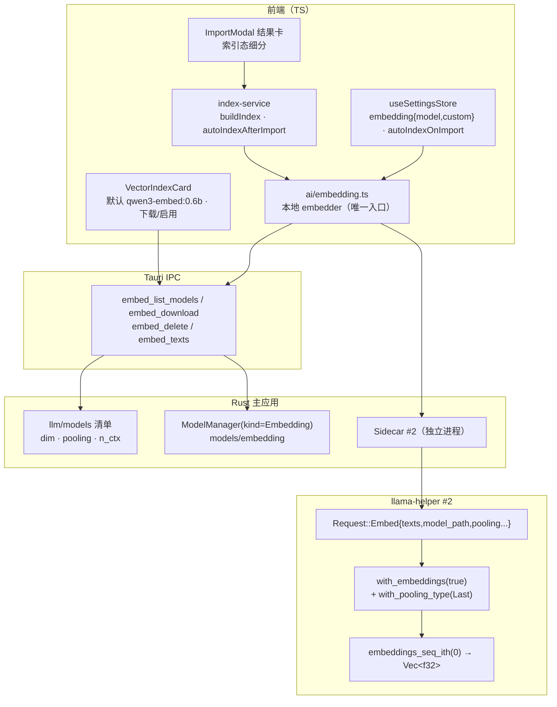
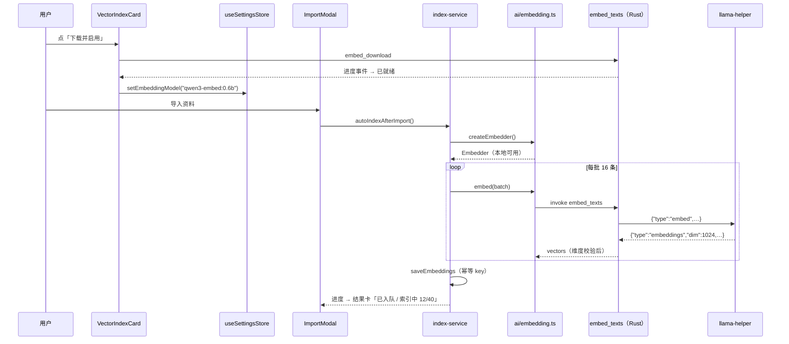

# Embedding 默认配置技术方案（本地模型版 v2.0）

| 字段 | 内容 |
|------|------|
| 作者 | Agent |
| 日期 | 2026-09-11 |
| 状态 | **v2.0 已实施**（v1.0 云端 API 方案已作废，见文末变更记录） |
| 关联需求 | 「阅读设置页面的 embedding 配置，给出默认配置，保证资料导入之后即可 embedding」+「**embedding 只能使用本地的模型**」 |
| 关联文档 | `docs/local-llm-loading-plan-2026-09.md`、`docs/rag-wiring-design-2026-09.md`、`docs/library-import-extraction-audit-2026-09.md` |

---

## 1. 背景

v1.0 方案（云端 `/embeddings` + 厂商默认模型名）在本轮被**推翻**：用户明确「embedding 只能使用本地的模型」。这不是换个模型名，而是换整条链路——当前代码里**本地侧根本没有 embedding 能力**：

| 事实 | 位置 | 后果 |
|---|---|---|
| `BuiltinProvider` 无 `embed` 方法，注释直接写明「本地模型无 embedding 能力」 | `src/ai/builtin.ts:9-13`、`VectorIndexCard.tsx` 的 `notSupported` 文案 | 本地模型档下向量化完全不可达 |
| `embedding` 能力只在 `OpenAICompatibleProvider` 上按 `config.embeddingModel` 挂载 | `src/ai/openai-compatible.ts:92-115` | 与「只用本地」直接冲突 |
| `DEFAULTS.embedding = null` → `buildActiveProvider()` 不注入 → `isAutoIndexCapable()` 恒 false | `src/stores/useSettingsStore.ts:74-78` | 导入后**一次向量化都不会发生** |
| llama-helper 只有 `generate` 请求，无 embedding 分支 | `llama-helper/src/main.rs:39-70` | 本地推理侧没有向量化入口 |
| 模型清单只有 LLM（`qwen3.5:0.8b~9b`），无 embedding 模型 | `src-tauri/src/llm/models.rs:104-159` | 无模型可下载、无目录可放 |

同时，本地链路的地基是好的：llama-helper 基于 `llama-cpp-2 =0.1.146`，而该版本**已具备完整 embedding API**（已核对本地 crate 源码）：

- `LlamaContextParams::default().with_embeddings(true)`（`context/params/get_set.rs:552`）
- `LlamaContextParams::default().with_pooling_type(LlamaPoolingType::Cls|Mean|Last|None)`（`get_set.rs:232`）
- `ctx.embeddings_seq_ith(0)` / `ctx.embeddings_ith(i)` → `&[f32]`，长度 = `model.n_embd()`（`context.rs:135/171`）

即：**不用升依赖、不用加新库，把协议与命令打通即可**。

---

## 2. 方案目标

| 类型 | 描述 |
|------|------|
| **主要目标** | 用户在设置页「一键下载并启用」默认本地向量模型后，**导入资料即自动完成 embedding**，全程不出本机 |
| **非目标** | ① 云端 `/embeddings`（按用户决策 D1 **完全移除**）；② 重排（rerank，Qwen3-Reranker 另议）；③ `knowledge`/`chapter` 级向量；④ 自定义维度（Matryoshka 截断）；⑤ query 侧 instruction 模板（列 N2） |
| **成功标准** | 1. 设置页默认展示 `qwen3-embed:0.6b`，未下载时显示「下载并启用（639 MB）」；<br>2. 下载完成后导入任意资料，覆盖率从 0% 上升且**无维度错配**；<br>3. 聊天用云端 API、向量化用本地模型**互不干扰**（解耦生效）；<br>4. 浏览器预览（非 Tauri）整卡禁用，不发任何请求；<br>5. `cargo test --lib` 全绿、`npm run typecheck` 0 error、新增 TS 单测全绿 |

---

## 3. 项目现状

### 3.1 相关代码与模块

| 层 | 文件 | 现状 | 本轮 |
|---|---|---|---|
| helper | `llama-helper/src/main.rs` | 协议仅 `generate`/`ping`/`shutdown`；`ModelState` 常驻单模型（按路径+ctx 缓存）；GPU 层数自动估算；采样清洗 | **T1 加 `embed` 请求与实现** |
| Rust 清单 | `src-tauri/src/llm/models.rs` | `ModelDef`（name/gguf/mirrors/approx_bytes/context_size/min_ram/sampling/template）+ 双镜像 URL 构造 | **T2 扩字段 + embedding 清单** |
| Rust 管理 | `src-tauri/src/llm/manager.rs` | `ModelManager` 按 `get_available_models()` 扫描/下载/删除；目录 `models/llm`；设备匹配 | **T3 按 kind 构造** |
| Rust 进程 | `src-tauri/src/llm/sidecar.rs` | `Sidecar` 单实例（spawn/串行读写/ping/idle 回收），`resolve_helper_binary` 解析二进制 | **T5 加 `embed()` + 第二个实例** |
| Rust 命令 | `src-tauri/src/llm/commands.rs` | `llm_list_models/download/cancel/delete/generate/default_model/status`；`LlmState{manager,sidecar}` | **T4 加 `embed_*` 四命令** |
| 注册 | `src-tauri/src/lib.rs` | `generate_handler!` + setup 建 `LlmState` + idle reaper | **T4 注册 + 建第二 sidecar** |
| TS 封装 | `src/ai/builtin.ts` | `llmListModels/Download/Delete/Status` + `BuiltinProvider.chat`（invoke `llm_generate`） | **T6 加 embed 命令封装** |
| TS 能力 | `src/ai/openai-compatible.ts` | 按 `embeddingModel` 挂 `embed`，`POST {baseUrl}/embeddings` | **T7 删除** |
| TS 编排 | `src/features/learn/index-service.ts` | `buildIndex(provider, model, batchSize=32)`；`isAutoIndexCapable()`；`autoIndexAfterImport()`（6 处调用点已接线） | **T8 改本地 embed + 批 16** |
| TS 设置 | `src/stores/useSettingsStore.ts` | `embedding?: {model, custom}\|null`，`buildActiveProvider()` 注入 | **T7 语义改为本地模型名** |
| UI | `src/features/settings/VectorIndexCard.tsx` | 云端模型名输入框 + 建议 chip + 覆盖率 | **T9 重写为本地模型卡** |
| UI | `src/features/settings/BuiltinModelsPanel.tsx` | 本地 LLM 卡（下载/进度/删除/激活），可作交互参照 | 参照，不直接复用组件 |
| 存储 | `src/storage/tauri.ts` | `saveEmbeddings` 写 `vectorDim` + BLOB；检索侧 `cosineSimilarity` **自带归一化**（`vector-search.ts:23-37`） | 不改（维度无硬限） |

### 3.2 相关文档与约定

- `docs/local-llm-loading-plan-2026-09.md`：helper 协议、模型常驻、GPU 层数、双镜像下载（本方案沿用其全部基建）
- `docs/rag-wiring-design-2026-09.md`：D2-A 导入后自动入队、G1 四条路径重算（**已接线，本轮不动调用点**）
- `rules/layer-import-boundaries.mdc`：UI → stores → storage；桌面能力只经 `invoke`
- `rules/rust.mdc`：模块 → `lib.rs` 注册；命令 `Result<T,String>`
- `rules/no-headless-browser-validation.mdc`：禁止主动起浏览器校验

### 3.3 约束与依赖

**模型事实（2026-09-11 已用 ModelScope / HuggingFace 官方 API 逐字节核实）**

| 项 | 值 |
|---|---|
| 仓库（双镜像同 repo） | `Qwen/Qwen3-Embedding-0.6B-GGUF` |
| 主镜像 | `https://modelscope.cn/models/Qwen/Qwen3-Embedding-0.6B-GGUF/resolve/master/Qwen3-Embedding-0.6B-Q8_0.gguf` |
| 备镜像 | `https://huggingface.co/Qwen/Qwen3-Embedding-0.6B-GGUF/resolve/main/Qwen3-Embedding-0.6B-Q8_0.gguf` |
| 文件大小 | **639,150,592 字节（两端一致）** |
| 维度 / 上下文 / pooling | 1024 维 · 32k · **last-token**（pooling_type=3） |
| 架构 / 参数 | qwen3 · 0.6B · 28 层 · Apache-2.0 |
| 官方建议 | query 侧加 instruct 约提升 1%–5%（本轮不做，见 N2） |

**其他约束**
- chunk 体积：`DEFAULT_TARGET_TOKENS=400` / `DEFAULT_HARD_MAX_TOKENS=512` → embedding 侧 `n_ctx=4096` 绰绰有余，**不存在静默截断风险**。
- `approx_bytes` 校验下限是 80%（`manager.rs:192`），639MB 档沿用同一口径。
- 设备：helper 仅随 macOS arm64（Metal）分发；`min_ram_gb` 沿用现有设备匹配机制。
- `llama-cpp-2` 锁死 `=0.1.146`（`Cargo.toml` 注释明确：不得升），本方案不触碰依赖版本。

---

## 4. 技术架构

### 4.1 总体架构



**关键：聊天与向量化是两个独立进程、两模型常驻**——helper 的 `load_model_if_needed` 按「路径 + context」判断是否重载（`main.rs:291-314`），若共用一个进程会因两个模型路径交替而**反复加载 2.5GB 与 639MB 的模型**。独立进程是唯一不互相拖垮的部署方式（D4）。

### 4.2 模块职责

| 模块 | 职责 | 约束 |
|---|---|---|
| `llama-helper/src/main.rs` | 新增 `embed` 请求分支：tokenize → `encode` → `embeddings_seq_ith(0)`；逐条处理、超长截断计数 | 不加依赖；失败回 `Response::Embeddings{error}`，不 panic |
| `src-tauri/src/llm/models.rs` | `ModelDef` 扩 `kind/dim/pooling/n_gpu_layers`；新增 `get_embedding_models()`、`get_embedding_models_directory()` | 现有 LLM 单测不得回归 |
| `src-tauri/src/llm/manager.rs` | `ModelManager::new(dir, kind)`，构造时固化清单与目录；`ModelInfo` 加 `kind`/`dim` | 下载/删除/双镜像逻辑不改 |
| `src-tauri/src/llm/commands.rs` | `embed_list_models` / `embed_download` / `embed_delete` / `embed_texts`；`LlmState` 增 `embed_manager` + `embed_sidecar` | 命令 `Result<T,String>`；与 `llm_*` 并列 |
| `src-tauri/src/llm/sidecar.rs` | 抽 `request_raw()` 私有方法，`embed()` 与 `generate()` 共用读写；解析 `embeddings` 响应 | 串行临界区不变 |
| `src/ai/embedding.ts`（新增） | 本地 embedder 唯一入口：读设置 → 分批（16）→ invoke → 条数校验 | 非 Tauri 返回 undefined |
| `src/features/learn/index-service.ts` | 用 embedder 替代 `provider.embed`；批 16；单批失败折半重试；全批失败可见 | 仍不 import chunk-engine（TC-EDGE-10） |

### 4.3 数据模型与 API

```rust
// src-tauri/src/llm/models.rs（改动）
#[derive(Debug, Clone, Serialize, PartialEq)]
pub enum ModelKind { Llm, Embedding }

#[derive(Debug, Clone, Serialize, PartialEq)]
pub enum PoolingKind { Last, Cls, Mean }

pub struct ModelDef {
    // …既有字段不变…
    pub kind: ModelKind,
    /// 向量维度（仅 Embedding；LLM 为 None）。
    pub dim: Option<u32>,
    /// 池化方式（仅 Embedding）。Qwen3-Embedding = Last。
    pub pooling: Option<PoolingKind>,
    /// GPU 卸载层数覆盖（Embedding 默认 0 = CPU，不与聊天抢显存，D7）。
    pub n_gpu_layers: Option<u32>,
}

pub fn get_available_models() -> Vec<ModelDef>;              // 仅 Llm（语义不变）
pub fn get_embedding_models() -> Vec<ModelDef>;              // 仅 Embedding
pub fn get_model_by_name(name: &str) -> Option<ModelDef>;    // 两边都查
pub fn get_embedding_models_directory(app_data_dir: &Path) -> PathBuf;
//   Llm       → <app_data>/models/llm
//   Embedding → <app_data>/models/embedding
```

```rust
// 默认 embedding 模型（唯一档，D2）
model_def(
    "qwen3-embed:0.6b",
    "Qwen3 Embedding 0.6B（默认）",
    "Qwen3-Embedding-0.6B-Q8_0.gguf",
    "Qwen/Qwen3-Embedding-0.6B-GGUF",
    639_150_592,   // approx_bytes，与双镜像实测一致
    4096,          // context_size：远小于 32k 上限，省 KV；chunk ≤512 token 绝不截断
    None,          // layer_count（沿用按文件大小粗估）
    4,             // min_ram_gb
    ModelKind::Embedding,
    Some(1024),
    Some(PoolingKind::Last),
    Some(0),       // n_gpu_layers：CPU 推理（D7）
    "本地向量模型：1024 维、32k 上下文、中文语义检索；639 MB，首次需下载。",
);
```

```rust
// src-tauri/src/llm/commands.rs（新增）
#[derive(Debug, Deserialize)]
pub struct EmbedRequest {
    pub model: String,
    pub texts: Vec<String>,
}

#[derive(Debug, Serialize)]
pub struct EmbedResponse {
    pub dim: usize,
    pub vectors: Vec<Vec<f32>>,
    /// 因超过 context_size 被截断的条数（>0 时日志告警）。
    pub truncated: usize,
}

#[tauri::command] pub async fn embed_list_models(state) -> Result<Vec<ModelInfo>, String>;
#[tauri::command] pub async fn embed_download(app, state, model: String) -> Result<(), String>;
#[tauri::command] pub async fn embed_delete(state, model: String) -> Result<(), String>;
#[tauri::command] pub async fn embed_texts(state, request: EmbedRequest) -> Result<EmbedResponse, String>;
// 进度事件：EMBED_DOWNLOAD_PROGRESS_EVENT = "embed://download-progress"（与 llm:// 同构）
```

```rust
// llama-helper 协议（新增分支）
// → {"type":"embed","texts":["…"],"model_path":"/path/…gguf","context_size":4096,
//    "pooling":"last","n_gpu_layers":0}
// ← {"type":"embeddings","dim":1024,"vectors":[[0.01,…],…],"truncated":0,"error":null}
```

```ts
// src/ai/embedding.ts（新增）
export const DEFAULT_EMBEDDING_MODEL = "qwen3-embed:0.6b";
/** 本地分批大小：16 条 × 1024 维 ≈ 16k 个 float，单次 IPC 约 200–300 KB。 */
export const EMBED_BATCH_SIZE = 16;

/** 构造本地 embedder；不可用时返回 undefined（非桌面端 / 未配置模型）。 */
export function createEmbedder(): Embedder | undefined;
export interface Embedder {
  readonly model: string;
  readonly dim: number;
  embed(texts: readonly string[]): Promise<number[][]>;
}
```

**数据读写**：设置走 `useSettingsStore`（localStorage）；模型文件落 `<app_data>/models/embedding`；向量落 SQLite（`db_*` 命令，既有）。桌面能力全部经 `invoke("embed_*"|"llm_*")`，**无新增 HTTP 出口**。

### 4.4 状态与副作用

- `useSettingsStore.embedding`：`{ model: string; custom: boolean }`，默认 `{ model: "qwen3-embed:0.6b", custom: false }`；`autoIndexOnImport` 默认 `true`。
- 云端旧值迁移：`merge` 阶段若 `embedding.model` 不在本地清单内（如 `text-embedding-v3`）→ **重置为默认**（`custom:false`）。v1 从未真正生效，无用户资产需保留。
- `useIndexStore`：会话级、不持久化（既有）；新增「全批失败」落 error。
- 副作用时机：进入设置页 → `embed_list_models()` 拉状态；点下载 → 监听进度事件；下载完成 → 自动启用，并在存在缺口时触发一次「仅补齐缺失」。

---

## 5. 交互流程

### 5.1 主流程（首次使用）

1. 打开「设置 → AI 模型中心 → 向量索引」：卡片显示 `Qwen3 Embedding 0.6B（默认）`、1024 维、639 MB、状态「未下载」。
2. 点「下载并启用」→ 进度条（双镜像自动切换）→ 完成即「已就绪」并自动启用。
3. 导入资料 → `runUnitImport` → `rebuildChunks` → `autoIndexAfterImport()`。
4. `isAutoIndexCapable()` = 有 embedding 模型 ✅ + `autoIndexOnImport` ✅ + 本地 embedder 可用（Tauri + 模型已下载）✅ → 后台按 16 条/批调 `embed_texts`。
5. 结果卡显示「已入队 · 正在向量化 12/40…」；设置页覆盖率同步上升。

### 5.2 分支与异常流程

| 场景 | 触发 | 系统行为 | UI 反馈 |
|---|---|---|---|
| 未下载模型 | `status != ready` | 不入队（不发 IPC） | 卡片「下载并启用（639 MB）」；导入卡「未启用向量模型，本次仅全文索引」+「去设置」 |
| 模型文件损坏 | 大小 < 80% | 状态 `corrupted` | 「文件不完整，请重新下载」 |
| 浏览器预览 | `!isTauri()` | embedder 不可用 | 整卡禁用 + 说明「本地向量模型需桌面端」 |
| 聊天用云端 API | `active.source==="api"` | **向量化仍走本地**（解耦，D5） | 卡片不展示任何云端端点/Key |
| 维度不符 | helper 返回 dim ≠ 清单 1024 | **整批拒绝入库**（防脏向量） | 错误条「向量维度异常（期望 1024，实得 N），请检查模型文件」 |
| 单批失败 | IPC/推理异常 | 折半重试一次，仍失败计入 `failed` | 无 |
| 全部失败 | `done===0 && failed>0` | 落 `error` | 错误条 + 可「仅补齐缺失」重试 |
| 文本超长 | tokens > n_ctx | helper 截断并计数 | 日志告警（chunk 512 token 上限下不会发生） |
| 关闭自动索引 | `autoIndexOnImport=false` | 导入不入队 | 开关关闭；仍可手动「重建索引」 |
| 设备不支持 | 非 macOS arm64 | `supported.ok=false` | 沿用 `BuiltinModelsPanel` 的禁用话术 |

### 5.3 时序图



---

## 6. 用户用例

### UC-01：下载默认模型后，导入即自动向量化

| 项 | 内容 |
|----|------|
| 角色 | 桌面端用户（macOS arm64） |
| 前置 | 已下载并启用 `qwen3-embed:0.6b` |
| 主流程 | 导入一份 Markdown（≥20 块），不点任何索引按钮 |
| 期望 | 后台完成向量化；覆盖率 >0%；向量维度 1024；检索命中语义相近段落 |
| 边界 | 模型未下载 → 不入队 + 明确提示 |

### UC-02：聊天用云端 API，向量化仍走本地

| 项 | 内容 |
|----|------|
| 前置 | `active = {source:"api", provider:"qwen", …}`；本地 embedding 已就绪 |
| 主流程 | 导入资料并搜索 |
| 期望 | chat 走云端 HTTP；向量化走本地 sidecar；二者不互相阻塞 |

### UC-03：模型未就绪时不静默失败

| 项 | 内容 |
|----|------|
| 前置 | 未下载向量模型 |
| 主流程 | 导入资料 |
| 期望 | 不发起 IPC；结果卡显示「未启用向量模型，本次仅全文索引 · 去设置」 |

### UC-04：换模型后覆盖率归零并可重建

| 项 | 内容 |
|----|------|
| 前置 | 已有旧模型向量 |
| 主流程 | 切换到另一向量模型（后续加档时）→ 「重建索引」 |
| 期望 | 覆盖率按模型名判重（既有逻辑）；旧维度向量不参与检索（`cosineTopK` 按维度跳过） |

### UC-05：浏览器预览完全禁用

| 项 | 内容 |
|----|------|
| 前置 | `npm run dev` 浏览器预览 |
| 期望 | 向量卡禁用 + 说明；导入不发请求；手动按钮同样禁用 |

---

## 7. 线框 UI

### 7.1 设置 → 向量索引卡（已就绪态）

```
┌──────────────────────────────────────────────────────────────┐
│ 向量索引（本地）                                              │
│ 用本机的小模型为资料正文建立向量索引，全程不出本机。            │
├──────────────────────────────────────────────────────────────┤
│ 向量模型                                    [ 已就绪 ]       │
│ Qwen3 Embedding 0.6B（默认）          [ 删除模型 ]           │
│ 1024 维 · 32k 上下文 · Q8_0 · 639 MB · CPU 推理              │
│ ▸ 向量化与「当前使用模型」无关，聊天用云端 API 也不影响。       │
├──────────────────────────────────────────────────────────────┤
│ ☑ 导入后自动向量化                                            │
│   关闭后不再调用本地模型，仍可手动「重建索引」。                │
├──────────────────────────────────────────────────────────────┤
│ 索引覆盖率   40 / 40 块 · 100%                                │
├──────────────────────────────────────────────────────────────┤
│ [重建索引]  [仅补齐缺失]                                       │
└──────────────────────────────────────────────────────────────┘
```

### 7.2 其他状态

| 状态 | 表现 |
|---|---|
| 未下载 | 徽标「未下载」；主按钮「下载并启用（639 MB）」；说明含体积与「首次需下载」 |
| 下载中 | 进度条 + 百分比（复用 `BuiltinModelsPanel` 的事件监听写法）；「取消」按钮 |
| 损坏 | 红色徽标「文件不完整」+「重新下载」 |
| 浏览器预览 | 整卡禁用 + 底部说明「本地向量模型需桌面端（tauri dev / 打包版）」 |
| 维度异常 | 红色错误条（helper 返回 dim ≠ 1024） |
| 全批失败 | 红色错误条 + 「N 块失败，可再点『仅补齐缺失』重试」 |

- token 与组件：`Card` / `Button` / `Input` / `Checkbox`（`components/ui` 已有）；状态徽标沿用 `BuiltinModelsPanel` 的 `STATUS_STYLE` 思路，但**颜色必须走 `main.css` token，不新增 `slate-*`/`indigo-*` 硬编码**（仓库已有 16 文件硬编码漂移，本轮新增部分零漂移）。
- 无障碍：Checkbox 用原生 `ui/checkbox`；按钮 `disabled` + `title` 给禁用原因。

### 7.3 交互说明

- 下载/删除/取消与 `BuiltinModelsPanel` 行为一致（删除当前模型时回退「未下载」）。
- 下载完成自动启用（写 `embedding`），不等用户二次点击。
- 覆盖率与进度沿用现有 `useIndexStore`。

---

## 8. 涉及文件及改动伪代码

### 8.1 `llama-helper/src/main.rs`（修改）

**改动说明**：新增 `embed` 请求分支与 embedding 推理实现；不加依赖。

```rust
// 协议扩展
#[derive(Debug, Deserialize)]
#[serde(tag = "type", rename_all = "snake_case")]
enum Request {
    Generate { /* …既有不变… */ },
    Embed {
        texts: Vec<String>,
        #[serde(default)] context_size: Option<u32>,
        #[serde(default)] model_path: Option<String>,
        /// "last" | "cls" | "mean"；缺省 last（Qwen3-Embedding）。
        #[serde(default)] pooling: Option<String>,
        #[serde(default)] n_gpu_layers: Option<u32>,
    },
    Ping,
    Shutdown,
}

#[derive(Debug, Serialize)]
#[serde(tag = "type", rename_all = "snake_case")]
enum Response {
    Response { text: String, error: Option<String> },
    Embeddings { dim: usize, vectors: Vec<Vec<f32>>, truncated: usize, error: Option<String> },
    Pong, Goodbye, Error { message: String },
}

impl ModelState {
    fn embed(&mut self, texts: &[String], n_ctx: u32, pooling: LlamaPoolingType)
        -> Result<(Vec<Vec<f32>>, usize)>
    {
        let model = self.model.as_ref().context("Model not loaded")?;
        let threads = /* 与 generate 同口径：max(1, 核数/2 + 2) */;
        let ctx_params = LlamaContextParams::default()
            .with_n_ctx(Some(NonZeroU32::new(n_ctx).context("invalid n_ctx")?))
            .with_n_batch(n_ctx)
            .with_n_threads(threads)
            .with_n_threads_batch(threads)
            .with_embeddings(true)
            .with_pooling_type(pooling);

        let mut ctx = model.new_context(&self.backend, ctx_params)?;
        let mut out = Vec::with_capacity(texts.len());
        let mut truncated = 0usize;

        for text in texts {
            let mut tokens = model.str_to_token(text, AddBos::Always)?;
            // 兜底截断：超过 n_ctx 只保留前 n_ctx 个 token（chunk 512 上限下不会触发）
            if tokens.len() > n_ctx as usize { tokens.truncate(n_ctx as usize); truncated += 1; }
            let mut batch = LlamaBatch::new(n_ctx as usize, 1);
            let last = tokens.len() as i32 - 1;
            for (i, token) in tokens.into_iter().enumerate() {
                batch.add(token, i as i32, &[0], i as i32 == last)?;
            }
            ctx.encode(&mut batch)?;
            let vec = ctx.embeddings_seq_ith(0)?.to_vec();   // pooled，dim = n_embd
            out.push(vec);
        }
        self.update_activity();
        Ok((out, truncated))
    }
}
```

主循环新增分支（要点）：解析 `Embed` → `load_model_if_needed`（GPU 层数用请求值覆盖默认估算）→ `embed()` → 发送 `Response::Embeddings`。**任何失败都回 `error` 字段，不 panic、不退出主循环。**

单测（helper 内 `mod tests`）：`embed_request_parses_fields`、`pooling_unknown_defaults_to_last`、`embeddings_response_serializes_shape`。

### 8.2 `src-tauri/src/llm/models.rs`（修改）

**改动说明**：`ModelDef` 扩 4 字段 + embedding 清单 + 目录按 kind。

```rust
pub enum ModelKind { Llm, Embedding }
pub enum PoolingKind { Last, Cls, Mean }

// 既有 model_def() 增加 kind/dim/pooling/n_gpu_layers 参数；
// LLM 四档传 (ModelKind::Llm, None, None, None)，语义与展示不变。

pub fn get_available_models() -> Vec<ModelDef>            // 过滤 kind == Llm
pub fn get_embedding_models() -> Vec<ModelDef>            // 过滤 kind == Embedding
pub fn get_default_embedding_model() -> ModelDef          // 清单首位
pub fn get_embedding_models_directory(app_data_dir: &Path) -> PathBuf {
    app_data_dir.join("models").join("embedding")
}
```

单测补充：`default_embedding_model_is_qwen3_0b6`、`embedding_defs_have_dim_and_pooling`、`embedding_mirrors_follow_convention`（主 ModelScope、备 HF）、`approx_bytes_matches_upstream`（639_150_592）。

### 8.3 `src-tauri/src/llm/manager.rs`（修改）

**改动说明**：`ModelManager` 构造时固化「清单 + 目录」，同一套下载/扫描/删除逻辑服务两类模型。

```rust
pub struct ModelManager {
    models_dir: PathBuf,
    defs: Vec<ModelDef>,          // 构造时按 kind 取（替代每次调 get_available_models）
    active: Arc<RwLock<HashSet<String>>>,
    cancel: Arc<RwLock<Option<String>>>,
}

impl ModelManager {
    pub fn new(app_data_dir: &Path, kind: ModelKind) -> Result<Self> {
        let models_dir = match kind {
            ModelKind::Llm => get_models_directory(app_data_dir),
            ModelKind::Embedding => get_embedding_models_directory(app_data_dir),
        };
        std::fs::create_dir_all(&models_dir)?;
        let defs = match kind {
            ModelKind::Llm => get_available_models(),
            ModelKind::Embedding => get_embedding_models(),
        };
        Ok(Self { models_dir, defs, active: Default::default(), cancel: Default::default() })
    }
    // scan_models / download / delete / is_model_ready / path_of 内部把
    // get_available_models() 换成 &self.defs，其余逻辑零改动。
}

pub struct ModelInfo { /* …既有… */
    pub kind: String,          // "llm" | "embedding"
    pub dim: Option<u32>,      // embedding 才有
}
```

### 8.4 `src-tauri/src/llm/sidecar.rs`（修改）

```rust
/// 抽私有方法：写一行 JSON + 读一行 JSON（generate/embed 共用串行临界区）。
async fn request_raw(&self, request_json: String, timeout_secs: u64) -> Result<Value>;

pub async fn embed(&self, request_json: String) -> Result<EmbedRaw> {
    let value = self.request_raw(request_json, EMBED_TIMEOUT_SECS).await?;
    match value.get("type").and_then(|t| t.as_str()) {
        Some("embeddings") => { /* error 非空 → Err；否则解析 dim/vectors/truncated */ }
        Some("error") => Err(anyhow!("llama-helper error: …")),
        other => Err(anyhow!("unexpected helper response type: {:?}", other)),
    }
}
```

`EMBED_TIMEOUT_SECS = 300`（本地推理，短于 generate 的 900s）。

### 8.5 `src-tauri/src/llm/commands.rs` + `lib.rs`（修改）

```rust
pub struct LlmState {
    pub manager: Arc<ModelManager>,          // Llm
    pub sidecar: Arc<Sidecar>,               // 聊天进程
    pub embed_manager: Arc<ModelManager>,    // Embedding
    pub embed_sidecar: Arc<Sidecar>,         // 向量进程（独立，D4）
}

pub const EMBED_DOWNLOAD_PROGRESS_EVENT: &str = "embed://download-progress";

#[tauri::command]
pub async fn embed_texts(state: State<'_, LlmState>, request: EmbedRequest) -> Result<EmbedResponse, String> {
    let def = get_model_by_name(&request.model)
        .ok_or_else(|| format!("unknown model: {}", request.model))?;
    if def.kind != ModelKind::Embedding {
        return Err(format!("{} is not an embedding model", request.model));
    }
    if let Some(reason) = block_reason_if_unsupported(&request.model) { return Err(…); }
    if !state.embed_manager.is_model_ready(&request.model).await {
        return Err(format!("embedding model '{}' is not downloaded yet", request.model));
    }
    if request.texts.is_empty() { return Ok(EmbedResponse { dim: 0, vectors: vec![], truncated: 0 }); }

    let path = state.embed_manager.path_of(&request.model).ok_or("model path unavailable")?;
    let request_json = json!({
        "type": "embed",
        "texts": request.texts,
        "model_path": path.to_string_lossy(),
        "context_size": def.context_size,
        "pooling": match def.pooling {
            Some(PoolingKind::Last) | None => "last",
            Some(PoolingKind::Cls) => "cls",
            Some(PoolingKind::Mean) => "mean",
        },
        "n_gpu_layers": def.n_gpu_layers.unwrap_or(0),
    }).to_string();

    let started = Instant::now();
    let raw = state.embed_sidecar.embed(request_json).await.map_err(|e| e.to_string())?;

    // 维度硬校验：与清单不符 = 模型文件/清单写错，宁可失败也不能写脏向量。
    let expected = def.dim.unwrap_or(raw.dim as u32) as usize;
    if raw.dim != expected {
        crate::logging::log_line(LogLevel::Error, "embed",
            &format!("dim mismatch model={} expected={} got={}", request.model, expected, raw.dim));
        return Err(format!("embedding dim mismatch: expected {expected}, got {}", raw.dim));
    }
    crate::logging::log_line(LogLevel::Info, "embed", &format!(
        "embed done model={} n={} dim={} truncated={} ms={}",
        request.model, raw.vectors.len(), raw.dim, raw.truncated, started.elapsed().as_millis()));
    Ok(EmbedResponse { dim: raw.dim, vectors: raw.vectors, truncated: raw.truncated })
}
```

`lib.rs`：`generate_handler!` 增加 4 条；setup 里 `ModelManager::new(app_data, ModelKind::Embedding)` + `Sidecar::new(同一 helper 路径)`；**idle reaper 同时回收两个 sidecar**（否则向量进程会常驻到自身超时）。

### 8.6 `src/ai/builtin.ts` + `src/ai/embedding.ts`（修改/新增）

```ts
// builtin.ts 新增
export interface EmbedModelInfo extends LlmModelInfo { kind?: "llm" | "embedding"; dim?: number }
export const EMBED_DOWNLOAD_PROGRESS_EVENT = "embed://download-progress";
export function embedListModels(): Promise<EmbedModelInfo[]>;
export function embedDownload(model: string): Promise<void>;
export function embedDelete(model: string): Promise<void>;
export function embedTexts(
  model: string,
  texts: string[],
): Promise<{ dim: number; vectors: number[][]; truncated: number }>;
```

```ts
// src/ai/embedding.ts（新增，纯 TS，不依赖 React）
export const DEFAULT_EMBEDDING_MODEL = "qwen3-embed:0.6b";
export const EMBED_BATCH_SIZE = 16;

/** 本地 embedder：唯一向量化入口（D5：与 chat provider 解耦）。 */
export function createEmbedder(): Embedder | undefined {
  const model = useSettingsStore.getState().embedding?.model?.trim();
  if (!model || !isTauri()) return undefined;
  return {
    model,
    dim: 1024,                       // 清单值；真实维度以 helper 返回为准（Rust 侧硬校验）
    async embed(texts) {
      const out: number[][] = [];
      for (let i = 0; i < texts.length; i += EMBED_BATCH_SIZE) {
        const res = await embedTexts(model, texts.slice(i, i + EMBED_BATCH_SIZE));
        out.push(...res.vectors);
      }
      return out;
    },
  };
}
```

### 8.7 `src/ai/openai-compatible.ts` + `types.ts` + `useSettingsStore.ts`（修改）

**改动说明**：彻底移除云端 embedding（D1）。

- `openai-compatible.ts`：删 `embeddingModel` 字段、`embed` 挂载、`requestEmbeddings` 私有方法、`EmbeddingsResponse` 接口。
- `types.ts`：删 `ProviderConfig.embeddingModel`。
- `useSettingsStore.ts`：
  - `DEFAULTS.embedding = { model: DEFAULT_EMBEDDING_MODEL, custom: false }`；
  - `buildActiveProvider()` **不再注入** `embeddingModel`；
  - `merge` 迁移：旧 `embedding.model` 若不在本地清单内 → 重置默认；
  - 保留 `autoIndexOnImport`（默认 true）与 `setEmbeddingModel` / `resetEmbeddingToDefault`。

### 8.8 `src/features/learn/index-service.ts`（修改）

```ts
// 不再依赖 provider.embed，改为本地 embedder
const embedder = createEmbedder();
if (!embedder) throw new Error("未启用本地向量模型（设置 → AI 模型中心 → 向量索引）");
const batchSize = Math.max(1, opts.batchSize ?? EMBED_BATCH_SIZE);
// …分批、单批失败折半重试一次、全批失败落 error（批大小 16）…
```

`isAutoIndexCapable()` 改为：`!!embedding 模型 && autoIndexOnImport !== false && createEmbedder() !== undefined`。

### 8.9 `src/features/settings/VectorIndexCard.tsx`（重写）

要点：模型卡（名称/维度/体积/状态）+ 下载/删除/取消 + 自动索引开关 + 覆盖率 + 重建/补齐 + 错误条 + 浏览器预览禁用。文案全部走 `settings.embedding.*`。

### 8.10 `src/features/learn/ImportModal.tsx`（修改）

索引态细分：`indexing(i,n)` / `indexQueued` / `indexOffNoModel`（未下载）/ `indexOffDisabled` / `indexOffPreview`。

### 8.11 `src/i18n/messages/{zh,en}.ts`（修改）

`settings.embedding` 新增约 14 对：`localOnly` / `download` / `downloading(p)` / `cancel` / `delete` / `ready` / `notDownloaded` / `corrupted` / `sizeMb` / `spec(dim,ctx)` / `autoIndex` / `autoIndexHint` / `dimMismatch(exp,got)` / `indexOffNoModel` / `indexOffPreview` / `indexOffDisabled` / `previewDisabled`。

### 8.12 `package.json`

新增 `"test:embed": "node --experimental-strip-types --no-warnings --import ./tests/register-loader.mjs tests/embedding-local.test.ts"`。

---

## 9. 任务清单

| ID | 任务 | 依赖 | 复杂度 |
|----|------|------|--------|
| T1 | helper：`embed` 协议分支 + 推理实现 + 协议/池化单测 | — | M |
| T2 | `models.rs`：`ModelDef` 扩字段 + embedding 清单 + 目录函数 + 单测 | — | S |
| T3 | `manager.rs`：按 `ModelKind` 构造 + `ModelInfo` 扩 `kind/dim` | T2 | M |
| T4 | `commands.rs`：`embed_*` 四命令 + `LlmState` 扩字段 + `lib.rs` 注册/setup/reaper | T2,T3,T5 | M |
| T5 | `sidecar.rs`：抽 `request_raw` + `embed()` + 超时常量 | — | S |
| T6 | `builtin.ts` 命令封装 + 新增 `src/ai/embedding.ts` | T4 | M |
| T7 | 移除云端 embedding（`openai-compatible` / `types` / store 语义 + 迁移） | T6 | M |
| T8 | `index-service`：本地 embedder + 批 16 + 折半重试 + 失败可见 | T6,T7 | M |
| T9 | `VectorIndexCard` 重写（下载/启用/覆盖率/开关/禁用态） | T6,T7 | L |
| T10 | `ImportModal` 索引态细分 | T8 | S |
| T11 | i18n zh/en 成对新增 + `npm run test:i18n` | T9,T10 | S |
| T12 | 测试：新增 `tests/embedding-local.test.ts` + `test:embed`；`cargo test --lib` | T1–T10 | M |
| T13 | 文档同步：`docs/rag-wiring-design-2026-09.md`、本文状态改「已确认」 | 全部 | S |

---

## 10. 实施步骤

1. **T1** helper 侧先做：`Request::Embed` → `ModelState::embed` → 响应。可先用现有 LLM 档跑通「能返回向量」（即便语义无意义），先验证协议与 pooling 通路。
2. **T5→T2→T3→T4** Rust 主应用：sidecar → 清单 → manager → 命令 → 注册。每步 `cargo test --lib`。
3. **T6→T7** TS：命令封装 → 本地 embedder → 拆云端。`npm run typecheck` 会暴露所有 `embeddingModel` 残留引用（含 tests）。
4. **T8** index-service 切换（保留 `buildIndex` 对外签名，内部换 embedder）。
5. **T9→T10→T11** UI 与文案。
6. **T12** 单测与门禁。
7. **T13** 文档同步。

**手工验收（用户侧；Agent 不起浏览器）**：`tauri dev` → 设置页下载 639 MB → 导入一份 20 块以上资料 → 覆盖率 100% → 搜索「同义不同词」短语能命中。

**回滚策略**：以新增能力为主（helper 分支、4 条命令、1 个新 TS 文件、1 个重写卡片）；唯一破坏性改动是删除云端 `embed`（T7），可单独 revert。数据面无迁移（向量按模型名判重，且 v1 未产生任何真实数据）。

---

## 11. 测试方案

| 层级 | 工具 | 覆盖重点 | 不负责 |
|---|---|---|---|
| Rust 单元 | `cargo test --lib`（helper + 主应用） | 协议解析（snake_case/默认 pooling）、清单完备性、双镜像约定、`approx_bytes`、维度不符拒绝、按 kind 取目录 | 真实模型推理 |
| TS 单元 | `tests/embedding-local.test.ts`（node 直跑） | 默认配置、分批 16、维度校验、能力门闩（非 Tauri / 未下载 / 开关关）、迁移重置 | 真实 IPC |
| 静态断言 | 同测试文件内读源码文本 | `index-service` 不 import `chunk-engine`；`openai-compatible` 已无 `/embeddings` | — |
| 回归 | `test:rag` / `test:retrieval` / `test:storage` / `test:ai` / `test:i18n` / `test:library` | G1 六处入队不回退、混合检索、存储、i18n 对齐 | — |
| 类型 | `npm run typecheck` | 全量（含删字段后的残留引用） | — |
| 手工 | 桌面端实跑 | 下载、真实向量化、覆盖率、语义检索效果 | 不由 Agent 执行 |

**通过标准**：`cargo test --lib` 全绿（新增 ≥6 例）；`typecheck` 0 error；`test:embed` ≥10 例全绿；既有 `test:*` 不回退。

---

## 12. 测试用例

| ID | 关联 UC | 步骤 | 期望 | 类型 |
|----|---------|------|------|------|
| TC-UC01-01 | UC-01 | 读默认 `embedding` 设置 | `{model:"qwen3-embed:0.6b", custom:false}` | TS 单元 |
| TC-UC01-02 | UC-01 | `createEmbedder()`（mock Tauri + 已下载） | 返回 Embedder，dim=1024 | TS 单元 |
| TC-UC01-03 | UC-01 | 40 条文本分批 | 每批 ≤16 条；返回 40 条 | TS 单元 |
| TC-UC01-04 | UC-01 | helper 返回 dim=512（清单 1024） | **拒绝入库**，错误含 `1024` | TS 单元 + Rust |
| TC-UC02-01 | UC-02 | `active=api` 时 `buildActiveProvider()` | provider **无** `embed` | TS 单元 |
| TC-UC02-02 | UC-02 | 同上导入 | 向量化仍走本地（embedder 被调用） | TS 单元 |
| TC-UC03-01 | UC-03 | 模型未下载时 `isAutoIndexCapable()` | `false` | TS 单元 |
| TC-UC03-02 | UC-03 | 同上 `autoIndexAfterImport()` | embedder 未被调用 | TS 单元 |
| TC-UC04-01 | UC-04 | 换模型后覆盖率 | 按模型名判重归零 | TS 单元 |
| TC-UC05-01 | UC-05 | `!isTauri()` 时 `createEmbedder()` | `undefined`，整卡禁用 | TS 单元 |
| TC-R1 | — | `{"type":"embed",…}` 解析 | texts/model_path/pooling/n_gpu_layers 正确 | Rust 单测 |
| TC-R2 | — | `pooling` 缺省 / 未知值 | 回落 `Last` | Rust 单测 |
| TC-R3 | — | `get_embedding_models()` | 恰好 1 条；dim=1024；pooling=Last；双镜像 URL 合规 | Rust 单测 |
| TC-R4 | — | `ModelManager::new(dir, Embedding)` | 目录为 `models/embedding`；清单为 embedding | Rust 单测 |

### 12.1 边界与回归

| ID | 场景 | 期望 |
|----|------|------|
| TC-EDGE-01 | 空 `texts` | 返回空数组，不发起 IPC |
| TC-EDGE-02 | 单批（16 条）失败后折半重试成功 | `done=16, failed=0` |
| TC-EDGE-03 | 全部失败 | `done=0, failed=n`，UI 可渲染「全部失败」 |
| TC-EDGE-04 | 文本 token > n_ctx | helper 截断且 `truncated>0`，日志告警 |
| TC-EDGE-05 | 删除正在使用的 embedding 模型 | 回退「未下载」，覆盖率显示 `—` |
| TC-EDGE-06 | 回归：G1 六处入队路径 | `test:rag` TC-EDGE-11 保持绿 |
| TC-EDGE-07 | 静态：`index-service` 不 import `chunk-engine`；`openai-compatible` 无 `/embeddings` 字样 | 断言通过 |

---

## 决策点记录

| ID | 决策 | 选择 | 来源 |
|----|------|------|------|
| D1 | 云端 `/embeddings` | **完全移除**（不再注入、不再出现模型名输入框） | 用户 |
| D2 | 默认模型 | **官方 `Qwen/Qwen3-Embedding-0.6B-Q8_0.gguf`（639,150,592 B，1024 维，last pooling，32k ctx）** | 用户（推荐项） |
| D3 | 下载时机 | **设置页一键下载 + 导入前提示**，不静默后台 | 用户（推荐项） |
| D4 | 进程部署 | **独立 sidecar 进程**（第二个 llama-helper，只加载向量模型） | 用户（推荐项） |
| D5 | 能力归属 | **与 chat provider 解耦**：新增 `src/ai/embedding.ts` 作为唯一入口 | 设计 |
| D6 | 批量大小 | **16**（16×1024 float ≈ 200–300 KB/次 IPC） | 设计 |
| D7 | GPU 卸载 | **默认 CPU（n_gpu_layers=0）**，避免与聊天模型抢显存 | 设计 |
| D8 | query instruction | **本轮不加**（Qwen3 建议加，约 1%–5% 收益），列 N2 | 设计 |

## 遗留与后续（N2）

- **N2-1**：query 侧加 `Instruct: …\nQuery:` 模板（需区分 document/query 调用，待检索质量实测后再定）。
- **N2-2**：性能实测后考虑把「每条文本新建 context」改为复用 + KV 清零，或按 `n_ubatch` 分块批推理。
- **N2-3**：加档（如 `bge-m3` 1024 维 / 8192 ctx，或 Qwen3-Embedding-4B）时，需同时处理「换模型 → 覆盖率归零 → 全量重建」的用户提示。
- **N2-4**：向量进程常驻约 700MB，与 4B 聊天模型并存约 3.5GB；低内存机型的提示与自动回收策略。
- **N2-5**：`BuiltinModelsPanel` 与本卡片存在重复的「下载/进度」交互；若后续出现第三处，按 `skills/ui-design-system` 的抽取口径（≥3 处）抽公共组件。

## 变更记录

| 日期 | 变更 | 作者 |
|------|------|------|
| 2026-09-11 | v1.0 初稿：云端 `/embeddings` + 厂商默认模型名（千问 `text-embedding-v4` 等） | Agent |
| 2026-09-11 | **v2.0 重写**：按「embedding 只能使用本地模型」推翻 v1。改为本地 llama-helper embedding 链路（helper 协议 + 独立 sidecar + embedding 模型清单 + 本地 embedder + 卡片重写），云端能力完全移除；D1–D4 由用户裁决，D5–D8 为设计决策 | Agent |
| 2026-09-11 | **v2.0 实施完成**（T1–T13）：helper `embed` 分支 + 6 条 `embed_*` 命令 + 独立向量 sidecar + `ai/embedding.ts` + 卡片重写 + i18n 双语。门禁：`cargo test --lib` 41 项（新增 11）、helper 13 项（新增 5）、`test:embed` 18 项、`test:retrieval` 21 项、`test:rag` 10 项、其余 `test:*` 全绿、`typecheck` 仅剩既有 AIModelsSection 3 条（非本任务）。**待用户手工验收**：`tauri dev` → 下载 639 MB → 导入 → 覆盖率上升 | Agent |
