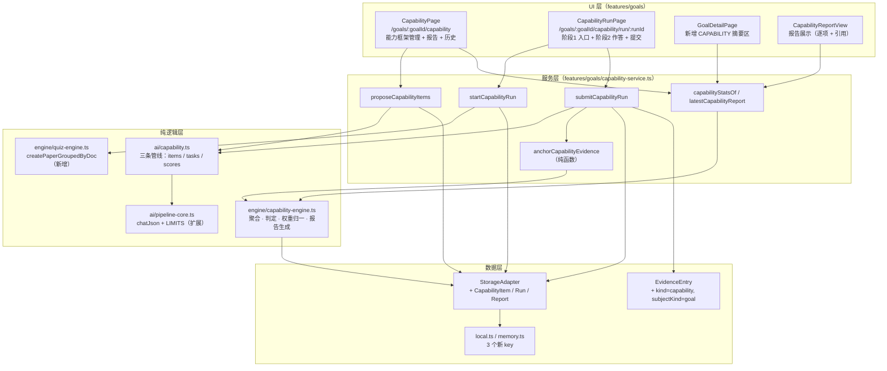
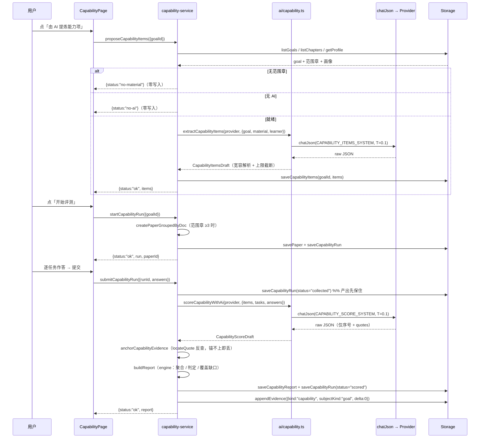

# 目标级能力评测（Goal Capability Assessment · 「我够格了吗」）技术方案

| 字段 | 内容 |
|------|------|
| 作者 | Agent（调研：工作区 HEAD `3e8b1a7` 口径） |
| 日期 | 2026-09-15 |
| 状态 | **已实施**（D1–D9 全部定案并落地，2026-09-15；runbook T1–T14 全部 done） |
| 关联需求 | `docs/roadmap-next-features-plan-2026-09.md` §F6（P1 · 大）；`README.zh-CN.md`「目标级能力评测」（README 清单已由 28/16 → **29/15**）；`docs/business-flow-end-to-end-2026-09.md` §E4/§E5（E4 洞已收口） |
| 执行记录 | `docs/goal-capability-assessment-task-runbook-2026-09.md` |

---

## 1. 背景

### 1.1 业务背景与用户痛点

PLOS 的产品名是「自我学习**评测**」，但当前所有评测都停在**章级**：一章学完 → 出单元测 → 卷面分 → 章掌握度 ≥ 0.8 → 目标就绪度 = 达标章占比（`features/goals/goal-util.ts:55-72`）。它回答的是「**这一章我学会了吗**」。

但用户设定目标（`career` / `exam` / `project` …）时，真正想问的是另一个问题：

> **「以我现在的水平，够格了吗？」**

这两个问题**不等价**：

| | 章级掌握度 | 目标级能力 |
|---|---|---|
| 粒度 | 章（内容单位） | 能力项（人的能力单位） |
| 证据 | 试卷客观/主观分 | 真实任务产出 |
| 回答 | 这段内容记住了吗 | 这件事我能独立做成吗 |
| 失效场景 | 全书 12 章全 0.85 分，但无法独立完成一次端到端设计 | — |

已有的旁证：`docs/business-flow-end-to-end-2026-09.md:374` 已明确记录「真正缺失的是**针对目标的能力评测**（如：给一个 Agent 开发任务，让 AI 评判完成度）」。

### 1.2 触发原因

1. **产品定义已在本次会话澄清**（四个决策点全部落定，见 §2.1），roadmap 中「未澄清前不开工」的前置条件解除。
2. **扩展流程 E1–E5 的中间空洞**：E1 目标 ✅ / E3 计划 ✅ / E5 就绪度 ✅，但 **E4「AI 评测」是降级态**（`business-flow-end-to-end-2026-09.md:38`）—— 即「设定目标 → 按我水平测 → 判定我达标」这条叙事链中间少一环。
3. **废弃契约清理需求（已由 T13 完成）**：`generateAssessment` / `evaluateAnswer` 在 **4 处** provider 实现全抛 `not-implemented` 且**零调用方**（`ai/types.ts` 声明、`ai/openai-compatible.ts`、`ai/builtin.ts`、`ai/registry.ts`、**`ai/active.ts` 的 `NoActiveProvider` —— 本节初稿曾漏记此第 4 处**）。留着会让后来者误判「AI 评测只差实现」。

### 1.3 与现有产品/模块的关系

**复用**（不重造）：

| 已有能力 | 在本方案中的角色 |
|---|---|
| `Paper` / `createPaper` / `gradePaper` | 阶段 1「客观摸底卷」（跨文档目标范围出卷） |
| `PaperResult` / 报告页 | 客观卷的既有作答与展示链路，**零改动** |
| `ai/pipeline-core.ts::chatJson` | 三条新 AI 管线的传输层（JSON 归一 + 截断修复 + 温度档） |
| `features/learn/evidence-anchor.ts::locateQuote` | 能力项评分的**零伪造引用**锚定（复述的同一套护栏） |
| `ai/learner-context.ts::buildLearnerContextBlock` | 任务生成与判分的画像上下文（防提示词注入护栏已就位） |
| `EvidenceEntry` 证据流 | 能力评测结果以**新 kind** 进流（append-only） |
| `LearnerProfile` | 任务难度与判分尺度的参考（缺省 = 不注入，零回归） |

**不动**（关键边界）：

- **不改 `mastery`**：章掌握度唯一写方仍是卷面 `applyPaperResult`（双证据原则，`engine/learner-model.ts:8-10`）。
- **不改 `readiness` 口径**：`goalStatsOf` 语义保持「章就绪度」，能力达标度**并列展示**而非替换（决策 D4）。
- **不改 `PaperMode`**：不新增卷型（决策 D5）。
- **不动 Rust / SQLite**：新实体沿用 localStorage 层（`storage/tauri.ts` 头注释：Goal/Evidence 等仍由父类承载，`TauriStorage extends LocalStorageAdapter`）。

### 1.4 不做会怎样

- 产品最贵的一句承诺（「我够格了吗」）永远只能用「章达标占比」近似回答，职业型目标尤其失真（`GoalDetailPage.tsx:432-480` 的 TARGET ROLE 卡已具备展示位，但无真实能力数据可展示）。
- E4 空洞持续存在，扩展流程无法端到端演示。
- 三个 `not-implemented` 契约继续误导后续改动。

---

## 2. 方案目标

### 2.1 决策点（2026-09-15 已确认）

| ID | 决策点 | 定案 | 影响 |
|----|--------|------|------|
| **D1** | 评测对象 | **目标的综合能力** —— 拆成 3–6 个能力项，逐项判定达标 | 需新增 `CapabilityItem` 领域对象与能力项清单管理 |
| **D2** | 能力项来源 | **AI 从目标 + 范围章节要点提炼，人工可增删改**（边界：local-first 必须支持无 AI 手动维护） | 提炼管线 + 手动编辑 UI 双入口 |
| **D3** | 评测形态 | **场景任务 + 客观卷**（两阶段） | 规模最大档：阶段 1 复用 quiz，阶段 2 新建任务作答与 rubric 判分 |
| **D4** | 达标标准 | **AI rubric 逐项给 0–1 分 + 可调阈值**（默认 0.8，与 `MASTERY_THRESHOLD` 同源不同常量） | 报告为逐项分数 + 阈值对照，非二元结论 |
| **D5** | 结果边界 | **独立证据层，不改 mastery、不改 readiness 口径** | 目标详情页并列展示「章就绪度 / 能力达标度」 |
| **D6** | 能力项 id 稳定性 | **`cap_` + djb2(`goalId + "\0" + label`)** —— 标签改写 = 新能力项（与 `DerivedCard` 同口径） | 能力项 id 可稳定重算，无需持久化映射表 |
| **D7** | 证据主体表达 | **`EvidenceEntry` 加可选 `subjectKind?: "chapter" \| "goal"`**（缺省 `chapter`） | 旧数据零回归；目标级证据不显示裸 id |
| **D8** | 阶段 1 回程方式 | **`CapabilityRunPage` 自轮询 `listPaperResults()` 判定完成** | quiz 模块零改动；代价是从报告页回来需一次导航 |
| **D9** | 客观卷是否参与判定 | **A · 不参与**，仅作「知识底座参考分」展示 | 能力达标度**只由场景任务证据**决定，叙事与实现均更干净 |

### 2.2 阶段目标

| 阶段 | 目标 | 可观察结果 |
|------|------|-----------|
| **A（本期）** | 能力框架可建立 + 一次完整评测可跑 + 报告可追溯 | 目标详情页出现能力达标度；能生成一份带逐项分数与引用的能力报告 |
| **B（不在本期）** | 能力缺口回流到计划队列（`NextAction` 新增 kind） | 计划页出现「补能力项 X」动作 |
| **C（不在本期）** | 能力评测驱动 readiness 合成 / 达标证书 / 趋势 | — |

### 2.3 非目标（明确不做）

1. **不做** `NextAction` 新 kind —— 能力缺口不进入 `/plan` 队列（避免改动 `learning-planner.ts` 六级优先级与 `chapterActionMeta` 映射表）。
2. **不做** 多轮面试式追问（D3 未选）。
3. **不做** 能力项跨目标复用 / 全局能力库。
4. **不做** 能力项绑到具体章节（能力项是目标级，章是其素材来源而非归属）。
5. **不做** `generateAssessment` / `evaluateAnswer` 的实现 —— 本方案**删除**这两个废弃契约（并入 §9 T13）。
6. **不做** 客观卷分数参与能力项判定（见 §4.3「两阶段证据关系」）。
7. **不做** 报告导出（依赖 F4，尚未实现）。

### 2.4 成功标准（可测试、可观察）

| # | 标准 | 验证方式 |
|---|------|----------|
| S1 | 目标详情页并列展示「章就绪度」与「能力达标度」，两口径互不影响 | 手工 + `TC-UC01-01` |
| S2 | 无 AI 时：能力项可**手动**建立；发起评测被**明确阻断**并引导配置，**零写入** | `TC-UC06-01`（单元，断言 storage 无新 run） |
| S3 | 能力项评分**零伪造引用**：每条引用必须能在用户作答原文中定位，锚不上即丢弃 | 单元 `TC-UC04-01/02` |
| S4 | 报告每一项均可追溯到 `runId` + 任务 id + 作答引文（证据可溯，roadmap F6 Done 标准） | 线框 §7.3 + `TC-UC03-01` |
| S5 | 能力项 0 任务覆盖时判 `unknown`（不判 fail、不判 pass），报告显式标注 | 单元 `TC-EDGE-05` |
| S6 | **不改 mastery**：跑完整评测后 `LearnerState` 逐字节不变 | 单元 `TC-REG-01` |
| S7 | `npm run typecheck` 无**新增**错误（既有 3 条 `AIModelsSection` banner 警告不计） | CI 命令 |
| S8 | `npm run test:capability` 全绿，且并入 `test:library` 串联 | 命令 |

---

## 3. 项目现状

### 3.1 相关代码与模块（均已实地核实）

| 关注点 | 事实 | 位置 |
|--------|------|------|
| 目标模型 | 仅有 `requiredUnitIds` / `requiredChapterIds` / `deadlineAt` / `importance`，**无能力项、无达标标准** | `domain/goal.ts:17-34` |
| 目标范围 | `requiredChapterIds` 为空 → **全库章回退**；圈选支持**跨文档**（`GoalFormPage` 按文档分组渲染，`selected` 是全局 Set） | `features/goals/goal-util.ts:45-49`、`GoalFormPage.tsx:91,140,308-311` |
| 就绪度 | `readiness = 达标章数 / 范围章数`，达标线 `MASTERY_THRESHOLD = 0.8` | `goal-util.ts:55-72`、`domain/plan.ts:49-50` |
| 章级评测 | 四卷型 + 难度自适应 + 客观本地判 + 主观 AI 批 + 平滑回写 | `engine/quiz-engine.ts:181-215,523-652` |
| 跨文档出卷 | `createRetakePaper` 已解决「干扰项必须取各章自己文档」的分组问题（按 `documentId` 分组分别 `createPaper` 再合并） | `engine/quiz-engine.ts:426-473` |
| 出卷落库 | 唯一入口 `createPaperAndSave`；**含 `canCreatePaperMode` 校验**（`final-test` 要求 `selected === total`）→ 目标范围卷**不能**走此入口 | `features/quiz/paper-flow.ts:54-108` |
| 答题链路 | 答题页交卷 → `/quiz/:paperId/grading` → 判卷页 → 自动跳 `/report/:paperId`（**无 query 透传位**） | `QuizAnswerPage.tsx:112-121`、`QuizGradingPage.tsx` |
| AI 通用件 | `chatJson`（未配置/失败均抛带类型错误）、`extractJson`（含截断修复）、`PIPELINE_LIMITS`、`TEMPERATURE.grade = 0.1` | `ai/pipeline-core.ts:30-163` |
| 零伪造范式 | AI 只产 `quotes`，偏移一律由 `locateQuote` 反查；锚不上即丢弃 | `ai/restatement.ts:1-17`、`features/learn/restatement-service.ts:130-178` |
| 服务层六态 | `RestatementResult` / `ChapterQaResult` 范式：服务层只产**分类**，文案由 UI 走 i18n；无 AI **落库前早退** | `restatement-service.ts:58-128`、`domain/restatement.ts` |
| 证据流 | `EvidenceKind = "assessment" \| "review" \| "restatement" \| "card"`；`subjectId` 语义 = **章 id**；映射单一真源 = `evidenceActionKey`（穷尽 switch，新增 kind **必 TS 报错**） | `domain/evidence.ts:22-34`、`features/evidence-label.ts:22-36` |
| 证据消费点 | ① `HomePage.logToView`（按 `plan` 索引章标题，找不到回退裸 id）② `GoalDetailPage.CareerExtra`（`inScope.has(e.subjectId)` 过滤） | `HomePage.tsx:368-385,388-399`、`GoalDetailPage.tsx:432-480` |
| 存储分层 | Tauri 档仅 RAG 五实体走 SQLite，其余继承 localStorage；新实体只需 `types.ts` + `memory.ts` + `local.ts` | `storage/types.ts:43-191`、`storage/local.ts:31-52,119-156`、`storage/tauri.ts:1-20` |
| 删除目标 | `useLoopStore.removeGoal:134-136` → `storage.deleteGoal` → `LocalStorageAdapter.deleteGoal:298-301`（**当前无任何级联清理**） | `stores/useLoopStore.ts:134-136` |
| 路由 | `/goals/:goalId` 已占用；`/goals/:goalId/edit` 已存在 | `App.tsx:52-55` |
| 测试基建 | node `--experimental-strip-types` + `tests/register-loader.mjs` + `resolve-ts.mjs`（无扩展名导入兜底）；**不支持 JSX / TS 参数属性** | `tests/restatement.test.ts:1-36`、`package.json` scripts |
| README 基线 | `- [ ] 目标级能力评测 P1 —— 卡在产品定义尚未澄清` | `README.zh-CN.md:452`（基线 27 已实现 / 17 未实现） |

### 3.2 相关文档与约定

必读并遵守：

- `AGENTS.md`（目录地图 + 会话工作流 + 维护约定）
- `rules/layer-import-boundaries.mdc` —— UI → `stores`/`storage`；`ai/` **不得** import `features/`；纯逻辑不依赖 React
- `rules/engineering-code-style.mdc` —— 相对导入为主、中文注释、i18n 双语成对、`import type`
- `rules/code-structure-and-dependencies.mdc` —— 文件 ≤700 行、≥10 行 × ≥3 处先抽取、依赖单向
- `skills/pre-task-technical-design`（12 章模板）、`skills/docs-task-runbook`、`skills/tiered-change-workflow`
- 同类既有方案（风格对标）：`docs/learn-feynman-restatement-design-2026-09.md`、`docs/learn-flashcard-design-2026-09.md`

### 3.3 约束与依赖

| 约束 | 内容 | 影响 |
|------|------|------|
| 技术栈 | React 19 + Vite 8 + TS(strict) + Tailwind 4 + Zustand 5；无 ESLint/Prettier | 跟随文件风格 |
| 测试 | 单测不得 import `.tsx`；不得启动浏览器（`no-headless-browser-validation.mdc`） | 纯逻辑必须落 `.ts`，UI 只做人工核对 |
| i18n | 文案必须 `zh.ts` / `en.ts` **成对**新增 | 新增 `m.capability` 整段 + `m.units.action.capability` |
| 上游依赖 | 无（不依赖 F1/F3 完成；F1 画像已就绪，作可选增强） | roadmap 标称「依赖 F1/F3」可降级为「F1 可选」 |
| 下游依赖 | 无（不改现有关键路径） | 回滚安全 |
| 性能 | 单次评测 2–5 个任务 × 单次 chat 调用；输入 ≤ 12k 字符（与复述同档） | 本地小模型需 `jsonMode` + 低温度 |

### 3.4 ⚠️ 调研中发现的真实缺口（本方案必须处理）

| # | 缺口 | 证据 | 本方案处理 |
|---|------|------|-----------|
| G1 | **目标范围卷无法走 `createPaperAndSave`** | `paper-flow.ts:63-70` 的 `canCreatePaperMode("final-test", {selected, total})` 要求 `selected === total`（全本），目标范围通常只是全库子集 → 必然 `invalid-mode` | 新增 `engine/quiz-engine.ts::createPaperGroupedByDoc` 供目标卷直接使用（**不走** `createPaperAndSave` 的校验） |
| G2 | **跨文档干扰项会串味** | 目标范围可跨文档（`GoalFormPage` 全局 Set）；单一 `allChapters` 会把 A 文档的要点泄作 B 文档的选项（`createRetakePaper` 头注释已记录此坑） | 目标卷复用同一分组逻辑（抽公共函数，见 G1） |
| G3 | **`EvidenceKind` 扩展是跨切面变更** | `evidence-label.ts:25-36` 是穷尽 switch；`domain/evidence.ts:18-22` 注明「新增 kind 时两处消费点必须同步修正」 | `domain` 与 `evidence-label` **必须同提交**，并同步 `HomePage` 的 kind 解析 |
| G4 | **`subjectId` 语义将被污染** | 现有语义 = 章 id（`domain/evidence.ts:11`）；能力评测主体是**目标** | 新增可选 `subjectKind?: "chapter" \| "goal"`（缺省 `"chapter"` = 零回归）；`logToView` 增加目标标题反查 |
| G5 | **`quiz-engine.ts` 逼近 700 行上限** | 当前 653 行；本方案需在其中新增分组出卷函数 → 净增后约 678 行 | 在本文件内抽取（把 `createRetakePaper` 的分组逻辑上移），**若超过 690 行则拆出 `engine/paper-scope.ts`** |
| G6 | **答案引用锚定基准与复述不同** | 复述锚「章正文」；能力评分须锚**用户作答原文**（用户自己的文本，同样不可信输入） | `anchorCapabilityEvidence` 单独实现，锚不上即丢弃 quote（不丢整条打分） |

---

## 4. 技术架构

### 4.1 总体架构



**两阶段评测的证据关系（决策 D3 + D5 的落地口径）**：

```
阶段 1 · 客观摸底卷（复用 quiz）
   目标范围章 → createPaperGroupedByDoc(mode="final-test") → Paper → 既有作答/判卷/报告链路
   ↓ 产出：PaperResult.totalScore = 「知识底座参考分」
   ⚠️ 不参与能力项判定 —— 客观题不瞄能力项，强行映射会造出假因果

阶段 2 · 场景任务（本方案新建）
   能力项 → AI 生成 2–5 个任务（每任务 1–2 个能力项 + rubric 要点）
   → 用户作答 → AI 按能力项逐项给分（0–1 + 理由 + 引文）
   → 锚定（引文必须能在作答原文中定位）→ 聚合 → CapabilityReport
   ↓ 产出：逐能力项 pass / fail / unknown
```

### 4.2 模块职责

| 模块/层级 | 职责 | 技术选型 | 新增/修改 |
|-----------|------|----------|-----------|
| `domain/capability.ts` | 能力项 / 任务 / 运行 / 评分 / 报告类型 + 常量 + 错误分类 | 纯 TS，零依赖 | **新增** |
| `domain/evidence.ts` | `EvidenceKind += "capability"`；`subjectKind` 可选字段 | 纯 TS | 修改 |
| `domain/index.ts` | barrel 导出 | — | 修改 |
| `engine/capability-engine.ts` | 纯逻辑：能力项 id、权重归一、逐项聚合、达标判定、覆盖缺口、报告生成、统计 | 纯 TS，零 React / 零 storage | **新增** |
| `engine/quiz-engine.ts` | 抽出 `createPaperGroupedByDoc`（`createRetakePaper` 与目标卷共用） | 纯 TS | 修改 |
| `ai/capability.ts` | 三条管线的提示词 + 宽容解析 + 执行器（**只产文本，不产偏移**） | 依赖 `pipeline-core` + `learner-context` | **新增** |
| `ai/pipeline-core.ts` | `PIPELINE_LIMITS` 扩展 `capability*` 上限 | — | 修改 |
| `storage/types.ts` | 三类实体的读写契约 + 目标级联清理 | 接口 | 修改 |
| `storage/memory.ts` | 内存实现 | — | 修改 |
| `storage/local.ts` | localStorage 键 + persist + 写操作 override | — | 修改 |
| `features/goals/capability-service.ts` | 编排：提炼 / 手动编辑 / 发起 / 提交 / 报告查询（六态返回） | 纯 TS（可被单测 import） | **新增** |
| `features/goals/CapabilityPage.tsx` | 能力框架管理 + 最新报告 + 历史 | React + Tailwind + primitives | **新增** |
| `features/goals/CapabilityRunPage.tsx` | 阶段 1 入口 + 阶段 2 作答 + 提交 | 同上 | **新增** |
| `features/goals/capability/CapabilityReportView.tsx` | 报告展示（逐项分数 / 阈值 / 引用 / 未覆盖警示） | 同上 | **新增** |
| `features/goals/GoalDetailPage.tsx` | 新增 CAPABILITY 摘要区（并列展示，不改 readiness） | 同上 | 修改 |
| `features/evidence-label.ts` | 新增 `"capability"` 映射 | — | 修改（**随 domain 同提交**） |
| `features/home/HomePage.tsx` | `logToView` 支持 goal 主体的标题反查 | — | 修改 |
| `i18n/messages/zh.ts` / `en.ts` | 新增 `m.capability` 段 + `m.units.action.capability` | 双语成对 | 修改 |
| `App.tsx` | 两条新路由 | — | 修改 |
| `tests/capability.test.ts` | 单测（≥ 30 断言） | node strip-types | **新增** |

### 4.3 数据模型与 API

#### 4.3.1 领域类型（`src/domain/capability.ts`，新增）

```ts
/**
 * F6 目标级能力评测 —— 「我够格了吗」的领域对象。
 *
 * 与章级测评（domain/quiz.ts）明确分层：
 *   - 章级 = 内容单位，证据是试卷分，写 mastery；
 *   - 目标级 = 人的能力单位，证据是真实任务产出，**不写 mastery**（决策 D5）。
 */

/** 达标判定（unknown = 无任务覆盖该能力项，既非通过也非失败）。 */
export type CapabilityVerdict = "pass" | "fail" | "unknown";

/** 能力项来源（AI 提炼 / 用户手填）。 */
export type CapabilityItemSource = "ai" | "manual";

/** 能力项：目标级评测的最小判定单位。 */
export interface CapabilityItem {
  /** `cap_` + djb2(goalId + "\u0000" + label) —— 标签改写 = 新项（旧报告快照不受影响）。 */
  id: string;
  goalId: string;
  label: string;
  description?: string;
  /** 相对权重（>0；聚合时归一；全为 0 时退化为均分）。 */
  weight: number;
  /** 该项达标线 0..1；默认 CAPABILITY_THRESHOLD。 */
  threshold: number;
  source: CapabilityItemSource;
  createdAt: number;
}

/** 定稿快照（run 发起时冻结；清单后续编辑不影响历史 run / 报告）。 */
export type CapabilityItemSnapshot = Pick<
  CapabilityItem,
  "id" | "label" | "description" | "weight" | "threshold"
>;

/** 单任务 → 单能力项的评判要点（1–4 条，喂给模型做 rubric）。 */
export interface CapabilityTaskRubric {
  itemId: string;
  criteria: string[];
}

/** 场景任务：一个开放式真实任务，考察 1–2 个能力项。 */
export interface CapabilityTask {
  id: string;
  prompt: string;
  deliverableHint?: string;
  rubric: CapabilityTaskRubric[];
}

export type CapabilityRunStatus = "draft" | "collected" | "scored";

/** 一次评测运行。 */
export interface CapabilityRun {
  id: string;
  goalId: string;
  status: CapabilityRunStatus;
  items: CapabilityItemSnapshot[];
  tasks: CapabilityTask[];
  /** taskId → 作答原文。 */
  answers: Record<string, string>;
  /** 阶段 1 客观卷（可选；范围章 < 3 时缺省 = 跳过阶段 1）。 */
  paperId?: string;
  createdAt: number;
  submittedAt?: number;
}

/** 锚回用户作答原文的引用（opaque 给 UI，展示时高亮）。 */
export interface CapabilityQuote {
  quote: string;
  start: number;
  end: number;
}

/** 逐能力项评分。 */
export interface CapabilityScore {
  itemId: string;
  /** 0..1；`undefined` = 无任务覆盖（unknown），不参与加权。 */
  score?: number;
  verdict: CapabilityVerdict;
  /** ≤120 字理由。 */
  rationale?: string;
  /** 引用一律锚回**用户作答原文**（零伪造：锚不上即丢弃该条）。 */
  evidence: CapabilityQuote[];
  /** 该分数来自哪些任务（可追溯）。 */
  fromTaskIds: string[];
  /** 有评分但一条引用都没锚上 → true（UI 显式警示，不展示伪引用）。 */
  unanchored?: boolean;
}

/** 能力报告（append-only；不做原地更新，重评产生新报告）。 */
export interface CapabilityReport {
  id: string;
  goalId: string;
  runId: string;
  items: CapabilityScore[];
  /** 加权总分（unknown 项不进分母）；无任何有效分 → undefined。 */
  overall?: number;
  /** 全部 pass 且无 unknown。 */
  approved: boolean;
  uncoveredItemIds: string[];
  /** 阶段 1 客观卷参考分（**不参与**能力项判定）。 */
  objective?: { paperId: string; totalScore: number };
  createdAt: number;
}

/** 服务层错误分类（文案由 UI 走 i18n 映射，服务层不抛中文）。 */
export type CapabilityErrorKind =
  | "no-ai"
  | "no-scope"
  | "no-material"
  | "no-items"
  | "parse"
  | "not-configured"
  | "fetch"
  | "generic";

/** 服务层统一返回（六态：ok / no-ai / no-scope / no-material / no-items / error）。 */
export type CapabilityStatus = "ok" | "no-ai" | "no-scope" | "no-material" | "no-items" | "error";
```

#### 4.3.2 常量（`engine/capability-engine.ts`）

```ts
/** 能力项达标线（与 MASTERY_THRESHOLD 同值但**独立常量**：口径不同源，改一处不该动另一处）。 */
export const CAPABILITY_THRESHOLD = 0.8;

export const CAPABILITY_LIMITS = {
  /** 能力项条数（AI 提炼与手动维护共用上限；下限仅对 AI 产出做校验）。 */
  minItems: 1,
  maxItems: 6,
  /** 场景任务条数。 */
  minTasks: 2,
  maxTasks: 5,
  /** 单任务可考察的能力项数上限。 */
  maxItemsPerTask: 2,
  labelChars: 60,
  descChars: 200,
  promptChars: 600,
  deliverableHintChars: 200,
  criteriaMax: 4,
  criteriaChars: 120,
  /** 单任务作答长度（下限防敷衍，上限防超上下文）。 */
  answerMinChars: 40,
  answerMaxChars: 4_000,
  rationaleChars: 120,
  quoteMaxChars: 200,
} as const;
```

#### 4.3.3 存储契约（`src/storage/types.ts` 新增段）

```ts
  // ===== 目标级能力评测（F6；决策 D5：独立落库，不写 LearnerState）=====
  /** 某目标的能力项清单（createdAt 升序）。 */
  listCapabilityItems(goalId: string): Promise<CapabilityItem[]>;
  /** 批量替换某目标的能力项清单（AI 提炼落库 / 人工编辑保存）。**空数组 = 清空该目标清单**。 */
  saveCapabilityItems(goalId: string, items: CapabilityItem[]): Promise<void>;

  /** 某目标的评测运行（createdAt 降序）。 */
  listCapabilityRuns(goalId: string): Promise<CapabilityRun[]>;
  getCapabilityRun(id: string): Promise<CapabilityRun | undefined>;
  /** 按 id upsert（draft → collected → scored 全程同方法）。 */
  saveCapabilityRun(run: CapabilityRun): Promise<void>;

  /** 某目标的能力报告（createdAt 降序；append-only）。 */
  listCapabilityReports(goalId: string): Promise<CapabilityReport[]>;
  getCapabilityReport(id: string): Promise<CapabilityReport | undefined>;
  saveCapabilityReport(report: CapabilityReport): Promise<void>;

  /**
   * 目标删除级联：该目标的 items / runs / reports 一并清除。
   * **幂等**；不触碰其他目标；由 `useLoopStore.removeGoal` 在 `deleteGoal` 后调用。
   */
  deleteCapabilityDataByGoal(goalId: string): Promise<void>;
```

**localStorage 键**（`storage/local.ts`）：`plos.capability-items`（`Record<goalId, CapabilityItem[]>`）、`plos.capability-runs`（`CapabilityRun[]`）、`plos.capability-reports`（`CapabilityReport[]`）。均为**新 key，无旧数据 → 零迁移**。

#### 4.3.4 AI 契约（`src/ai/capability.ts`）

| 管线 | 输入 | 输出（模型） | 解析后（TS） |
|------|------|--------------|--------------|
| `extractCapabilityItems` | 目标标题/描述/类型 + 范围章节（标题 + keyPoints，≤12k）+ 画像块 | `{items:[{label,description}]}` | `CapabilityItemsDraft` |
| `generateCapabilityTasks` | 目标 + 能力项（**带 1-based 序号**）+ 章节要点 + 画像块 | `{tasks:[{prompt,deliverableHint,itemIndexes:[n],criteria:[...]}]}` | `CapabilityTasksDraft`（序号→itemId 映射，越界丢弃） |
| `scoreCapabilityWithAi` | 目标 + 能力项 + 任务 + rubric + **用户作答原文** | `{scores:[{itemIndex,score,rationale,quotes:[...]}]}` | `CapabilityScoreDraft`（**只产 quotes，不产偏移**） |

温度统一 `TEMPERATURE.grade`（0.1，事实判定档，与 `gradeSubjectiveWithAi` / `extractRestatementFeedback` 同口径）。

#### 4.3.5 数据读写路径（`rules/layer-import-boundaries.mdc`）

```
UI（CapabilityPage / CapabilityRunPage / GoalDetailPage）
   ↓ 只调服务层
features/goals/capability-service.ts
   ↓ 读：storage.getDocument / listChapters / listGoals / getProfile / listPapers / listPaperResults
   ↓ 写：storage.saveCapabilityItems / saveCapabilityRun / saveCapabilityReport / appendEvidence
   ↓ AI：buildActiveProvider()（stores/useSettingsStore）→ provider.chat（经 chatJson）
storage（LocalStorageAdapter / InMemoryStorage / TauriStorage 继承）
```

- **无直接 `invoke`**：能力评测不涉及 Keychain 与本地模型 sidecar（只经 `provider.chat`，由既有 provider 层负责）。纯浏览器预览与桌面端行为一致。
- **`ai/` 不 import `features/`**：章节要点与作答文本由 service 侧读好后**以参数注入** `ai/capability.ts`（与 `restatement.ts` 同一分工）。
- **不写 `LearnerState`**：`saveLearnerState` 在本方案中零调用（决策 D5；回归测试 `TC-REG-01` 断言）。

### 4.4 状态与副作用

| 状态 | 位置 | 说明 |
|------|------|------|
| 能力项清单 | `storage`（`plos.capability-items`） | 持久；UI 编辑后立即落库 |
| 运行（含作答草稿） | `storage`（`plos.capability-runs`） | **每次作答失焦/切换即落库**（防丢失，与答题页草稿同思路） |
| 报告 | `storage`（`plos.capability-reports`） | append-only；重评产生新报告 |
| 证据行 | `storage`（`plos.evidence`） | `{kind:"capability", subjectKind:"goal", subjectId: goalId, verdict:"pass"\|"fail", delta:0, sourceId: reportId}` |
| 页面本地 state | 组件 `useState` | `busy` / `errorKind` / 当前 run / 报告列表；**不进全局 store**（能力评测不参与首页主行动，无需 store 订阅） |

**副作用触发时机**：

| 触发 | 副作用 |
|------|--------|
| 页面 mount | `listCapabilityItems` / `listCapabilityRuns` / `listCapabilityReports`（并行；失败只隐藏区块） |
| 点「AI 提炼能力项」 | `proposeCapabilityItems` → 覆盖清单（**UI 二次确认**，因为会丢弃人工改动） |
| 编辑/增删能力项 | `saveCapabilityItems(goalId, next)` |
| 点「开始评测」 | `startCapabilityRun` → 建 run +（范围 ≥3 章时）建客观卷并落库 |
| 客观卷返回 | mount/聚焦时查 `listPaperResults()` 是否含 `run.paperId` → 有则显示分数并标注阶段 1 完成（阶段 2 **不依赖**阶段 1，恒可作答） |
| 提交作答 | `submitCapabilityRun` → 落 run(`collected`) → AI 评分 → 报告落库 → `appendEvidence` |
| 删除目标 | `useLoopStore.removeGoal` → `deleteCapabilityDataByGoal(goalId)` |

---

## 5. 交互流程

### 5.1 主流程

**前置**：已在 `/goals/new` 或 `/goals/:id/edit` 圈定目标章节范围；已配置 AI Provider（`/settings`）。

1. 用户从目标详情页 CAPABILITY 区点「建立能力框架」→ 进入 `/goals/:goalId/capability`。
2. 能力框架区为空 → 显示空态与两个入口：**「由 AI 提炼」** / **「手动添加」**。
3. 点「由 AI 提炼」→ 按钮进 busy（文案「正在从目标与 12 章要点提炼能力项…」）→ 成功：清单出现 3–6 项（每项带 label + description，可编辑）；失败：显示分类文案（如「AI 返回内容无法解析，请重试或手动添加」）。
4. 用户校对清单（改名 / 加描述 / 调权重与阈值 / 删除 / 手动新增），每次改动即时落库。**至少 1 项**才能发起评测。
5. 点「开始评测」→ `startCapabilityRun`：
   - 范围章 ≥ 3 → 生成客观摸底卷并落库，页面出现**阶段 1 卡片**：「客观摸底卷 · N 题 · 约 30 分钟」+ 按钮「去答题」。
   - 范围章 < 3 → 阶段 1 卡片显示「范围章不足 3 章，跳过客观摸底」。
6. 用户点「去答题」→ `/quiz/:paperId`（既有答题页）→ 交卷 → 判卷页 → 报告页。
7. 用户返回 `/goals/:goalId/capability/run/:runId`（浏览器返回 / 左栏导航 / 目标详情页入口）→ 页面检测到客观卷已有 `PaperResult` → 阶段 1 卡片变为「已完成 · 卷面 72%（知识底座参考，不计入能力判定）」。
   - **阶段 2 不受阶段 1 影响**：未答 / 未返回时直接往下作答亦可（D9-A 口径 4）。阶段 1 卡片此时显示「待完成 · 去答题」，仅作提示，**不置灰**、不阻断提交。
8. 阶段 2 逐任务作答（每个任务显示：题面 / 交付要求 / 考察的能力项标签 / textarea + 字数计数）。
9. 点「提交并评分」→ 未答完的任务提示（可确认继续）→ 提交 → `submitCapabilityRun`：
   - 先落 run(`collected`)（用户产出不丢）→ AI 逐项评分 → 锚定 → 聚合 → 落报告 + 写证据流。
   - 成功 → 跳 `/goals/:goalId/capability`，报告区展示新报告。
10. 报告区展示：**总体达标度**（达标 x/y，加权总分）+ 逐能力项行（分数 / 阈值 / `pass` `fail` `unknown` 徽标 / 理由 / 可点开的引文）+ 未覆盖警示 + 「重新评测」按钮。
11. 目标详情页 CAPABILITY 摘要区同步显示：`能力达标度 40% · 最近评测 2 小时前`，与「章就绪度」并列，互不影响。

### 5.2 分支与异常流程

| 场景 | 触发条件 | 系统行为 | UI 反馈 |
|------|----------|----------|---------|
| 无 AI 提炼 | 未配置 Provider | `proposeCapabilityItems` **落库前早退**（零写入），返 `no-ai` | 引导条：「未配置 AI，无法自动提炼；可手动添加能力项」+ 跳设置链接 |
| 无 AI 发起评测 | 未配置 Provider | `startCapabilityRun` 早退，返 `no-ai`，**不建 run、不建卷** | 「开始评测」禁用 + 引导条 |
| 目标无范围章 | `requiredChapterIds` 为空且全库无章 | 返 `no-material` | 「先导入资料并圈定目标章节」+ 「编辑目标」链接 |
| 范围章无要点 | 章存在但 `keyPoints` 全空 | 提炼仍可运行（用章标题构成素材）；全部章都无标题且无要点 → `no-material` | 提示「素材较少，建议先做一次 AI 整理」 |
| 任务生成失败 | chat 抛错（解析失败 / 网络） | `startCapabilityRun` 返 `error{parse\|fetch}`；**已建的客观卷保留**（用户可先答） | 分类文案 + 「重试」按钮 |
| 提交时 AI 失效 | run 已有任务快照，评分时 provider 不可用 | run 存 `collected`，返 `no-ai`，**作答零丢失** | 「作答已保存，配置 AI 后可重新评分」+ 「重新评分」按钮 |
| 跳过阶段 1 | 用户不点「去答题」，直接作答阶段 2 并提交 | **正常评分、正常出报告**；`objective.status` 保持 `pending`/`skipped` | 阶段 1 卡片显示「待完成 · 去答题」；报告客观分块显示「阶段 1 未完成（不影响能力判定）」 |
| 作答过短 | 单任务 < `answerMinChars` | UI 提交前拦截（禁用 + 计数提示）；服务层同样拒绝返 `error{generic}` | 字数提示变红 + 提交禁用 |
| 引文全锚不上 | 该能力项所有 quotes 都定位失败 | 保留分数与理由，`unanchored: true`，`evidence: []` | 行内警示：「本项引用无法定位，请谨慎采信」 |
| 能力项无任务覆盖 | AI 生成的任务未覆盖某能力项 | 该项 `verdict: "unknown"`，进 `uncoveredItemIds` | 报告底部黄条：「N 项未被任务覆盖，未纳入达标判定」+ 「重新生成任务」 |
| 目标被删除 | 其他标签页删了该目标 | 页面 `getGoal` 找不到 → `missing` 态 | 「目标不存在」+ 返回列表（与 `GoalDetailPage` 同款） |
| 清单在 run 后被编辑 | 用户改了 label / 删了能力项 | 历史报告用 `run.items` 快照渲染，**不受影响** | 报告头部标注「按 YYYY-MM-DD 的能力框架评测」 |

### 5.3 时序图（主流程）



---

## 6. 用户用例（User Cases）

### UC-01：AI 提炼能力框架

| 项 | 内容 |
|----|------|
| 角色 | 已圈定章节范围、已配置 AI 的学习者 |
| 前置条件 | 目标存在且范围内有 ≥1 章；`plos.capability-items` 无该项数据 |
| 主流程步骤 | 1. 进入 `/goals/:goalId/capability`；2. 点「由 AI 提炼」；3. 等待 busy；4. 校对清单（改 1 项 label 与阈值）；5. 保存 |
| 期望结果 | 清单出现 3–6 项且每项有 `label`；`source: "ai"`；改动后落库；刷新页面仍在 |
| 异常/边界 | 无 AI → `no-ai` 零写入；无范围章 → `no-material`；解析失败 → `error{parse}` 且**不覆盖已有清单** |

### UC-02：手动建立 / 编辑能力框架（无 AI 可用）

| 项 | 内容 |
|----|------|
| 角色 | 未配置 AI 的学习者 |
| 前置条件 | 目标存在 |
| 主流程步骤 | 1. 点「手动添加」；2. 填 label（必填）+ description（可选）；3. 重复至 3 项；4. 删除第 2 项；5. 调整第 1 项权重 |
| 期望结果 | 清单 = 用户输入；`source: "manual"`；删除即时生效；**全程零 AI 调用** |
| 异常/边界 | 空 label 拒绝提交；超过 6 项拒绝新增（按钮禁用 + 文案） |

### UC-03：完整跑一次两阶段评测（主路径）

| 项 | 内容 |
|----|------|
| 角色 | 有 3+ 范围章、已配置 AI 的学习者 |
| 前置条件 | 能力清单 ≥1 项；范围章 ≥3 |
| 主流程步骤 | 1. 点「开始评测」→ 生成 run + 客观卷；2. 点「去答题」完成客观卷（既有链路）；3. 返回 run 页，确认阶段 1 显示分数；4. 逐任务作答 3 个任务；5. 提交并评分 |
| 期望结果 | 报告含：`overall`、逐项 `score` + `verdict` + `rationale` + `evidence[]`、`objective.totalScore`；报告与 run 均可回看；证据流新增 1 行 `kind:"capability"` |
| 异常/边界 | 交卷中断可续（既有草稿机制）；AI 失败 → run 保 `collected` 可重评 |

### UC-04：评分引文的零伪造校验

| 项 | 内容 |
|----|------|
| 角色 | 系统（不涉及用户操作，由单测覆盖） |
| 前置条件 | 模型返回的 `quotes` 中混有「改写过的句子」与「逐字引用」 |
| 主流程步骤 | 1. 调 `anchorCapabilityEvidence`；2. 检查 `evidence` 数组 |
| 期望结果 | 逐字引用被保留（`start/end` 指向作答原文）；改写句被**丢弃**；至少一条锚上 → `unanchored` 缺省 |
| 异常/边界 | 全部锚不上 → `evidence: []` + `unanchored: true`（**分数与理由保留**，不伪造引用也不丢弃评分） |

### UC-05：能力项未被任何任务覆盖

| 项 | 内容 |
|----|------|
| 角色 | 学习者 |
| 前置条件 | 4 个能力项，AI 生成的任务只覆盖其中 3 个 |
| 主流程步骤 | 1. 提交评测；2. 查看报告 |
| 期望结果 | 被覆盖项正常给分；未覆盖项 `verdict: "unknown"`、无分数；`overall` 分母**不含**该项；`approved: false`；报告底部黄条列出缺失项 |
| 异常/边界 | 全部项都未被覆盖（任务生成为空）→ 报告 `overall: undefined`、`approved: false`，UI 显示「任务生成异常，请重新发起」 |

### UC-06：无 AI 环境下的诚实降级

| 项 | 内容 |
|----|------|
| 角色 | 未配置 AI 的学习者 |
| 前置条件 | 无 Provider |
| 主流程步骤 | 1. 尝试「由 AI 提炼」；2. 尝试「开始评测」 |
| 期望结果 | 两次都被阻断并给出分类文案与设置入口；**storage 零写入**（无新 items / 新 run） |
| 异常/边界 | 已在 run 中（有任务快照）时 AI 失效 → 作答可保存，返 `no-ai` 可重评 |

### UC-07：重评（能力项改变后）

| 项 | 内容 |
|----|------|
| 角色 | 学习者 |
| 前置条件 | 已有 1 份报告；用户新增 1 个能力项 |
| 主流程步骤 | 1. 点「重新评测」；2. 生成新 run（快照含新项）；3. 完成评测 |
| 期望结果 | 新旧报告**并存**（append-only），历史报告仍按旧快照渲染（头部标注当时的框架日期） |
| 异常/边界 | 旧 run 未完成也可发起新 run（不做互斥，避免卡死） |

### UC-08：目标删除级联

| 项 | 内容 |
|----|------|
| 角色 | 学习者 |
| 前置条件 | 目标有 items / runs / reports |
| 主流程步骤 | 1. 在目标详情页删除目标（既有二次确认） |
| 期望结果 | 该目标的 items / runs / reports 全部清除；其他目标数据不变；`activeGoal` 回退语义不变 |
| 异常/边界 | 无能力数据时为空操作（幂等） |

### UC-09：从目标详情页进入与返回

| 项 | 内容 |
|----|------|
| 角色 | 学习者 |
| 前置条件 | 已有报告 |
| 主流程步骤 | 1. 进 `/goals/:goalId`；2. 查看 CAPABILITY 摘要（达标度 + 最近评测时间）；3. 点「查看报告」进能力页；4. 返回 |
| 期望结果 | 摘要与能力页数字一致（同源 `capabilityStatsOf`）；章就绪度**不受影响** |
| 异常/边界 | 无报告 → 摘要显示「尚未评测」+ 「建立能力框架」入口 |

### UC-10：证据流中的能力评测记录

| 项 | 内容 |
|----|------|
| 角色 | 学习者 |
| 前置条件 | 完成 1 次评测 |
| 主流程步骤 | 1. 进首页 RECENT EVIDENCE；2. 查看新增行 |
| 期望结果 | 显示「能力评测 · <目标标题>」；`delta` 显示为中性（`0%` 不显示）；不因 `subjectId` 是 goalId 而显示裸 id |
| 异常/边界 | 目标已被删（证据保留）→ 回退显示「能力评测」不带主体 |

---

## 7. 线框 UI（Wireframe）

### 7.1 `CapabilityPage`（`/goals/:goalId/capability`）— 默认状态（已有清单 + 报告）

```
┌────────────────────────────────────────────────────────────────────┐
│ ← 返回目标                                                          │
│ 目标级能力评测          [AI Application Engineer]                   │
│ 回答「我够格了吗」—— 逐项判定，不只看这章学会没学会                    │
├────────────────────────────────────────────────────────────────────┤
│ CAPABILITY FRAMEWORK                          3 项 · 权重已归一      │
│ ┌────────────────────────────────────────────────────────────────┐ │
│ │ 1. 能独立设计一次 RAG 检索链路        w 1.0  阈值 0.8   [编辑]  │ │
│ │    含切分策略、召回与重排的取舍                                  │ │
│ │ 2. 能诊断检索质量下降的原因           w 1.0  阈值 0.8   [编辑]  │ │
│ │ 3. 能说出向量化与 FTS 的适用边界       w 1.0  阈值 0.8   [编辑]  │ │
│ └────────────────────────────────────────────────────────────────┘ │
│ [由 AI 重新提炼]  [+ 手动添加]                    [开始评测 →]      │
├────────────────────────────────────────────────────────────────────┤
│ LATEST REPORT                          2026-09-15 · 2 小时前        │
│ 能力达标度 ████████░░░░░░░░ 2/3 · 67%     加权总分 0.74             │
│ ┌────────────────────────────────────────────────────────────────┐ │
│ │ ✓ 能独立设计一次 RAG 检索链路      0.86 / 0.80   理由「…」[引用2]│ │
│ │ ✗ 能诊断检索质量下降的原因          0.58 / 0.80   理由「…」[引用1]│ │
│ │ ⚠ 能说出向量化与 FTS 的适用边界      —           未被任务覆盖     │ │
│ └────────────────────────────────────────────────────────────────┘ │
│ ⚠ 1 项未被任务覆盖，未纳入达标判定。                [重新生成任务]  │
│ 知识底座参考分（客观卷）：72%（不计入能力判定）                      │
├────────────────────────────────────────────────────────────────────┤
│ HISTORY                                                             │
│ · 2026-09-15  2/3 达标  0.74   [查看]                              │
│ · 2026-09-10  1/3 达标  0.61   [查看]                              │
└────────────────────────────────────────────────────────────────────┘
```

**布局说明**：单列 `PageContainer`；区块间距 `mt-6`；卡片 = `rounded-xl border border-line bg-surface`（与 `GoalDetailPage` 就绪度卡同款）。**组件映射**：`Section` / `Card` / `Bar`（`components/primitives.tsx`）+ `Button`（`components/ui/button`）；`data-testid`：`cap-page-root`、`cap-item-row-<id>`、`cap-refine`、`cap-add-item`、`cap-start-run`、`cap-stale-warning`。

### 7.2 `CapabilityPage` — 空态 / 无 AI / 加载 / 错误

```
空态
┌────────────────────────────────────────────────────────────────────┐
│ CAPABILITY FRAMEWORK                                                │
│ 还没有能力项。可以让我从目标与圈定的章节里提炼，也可以自己写。        │
│ [由 AI 提炼能力项]   [+ 手动添加]                                    │
└────────────────────────────────────────────────────────────────────┘

无 AI（提炼入口不可用）
┌────────────────────────────────────────────────────────────────────┐
│ ⓘ 未配置 AI，无法自动提炼能力项。你可以手动添加。  [去设置 AI]        │
└────────────────────────────────────────────────────────────────────┘

加载中（提炼 / 评分）
┌────────────────────────────────────────────────────────────────────┐
│ ⟳ 正在从目标与 12 章要点提炼能力项…                                  │
└────────────────────────────────────────────────────────────────────┘

错误（分类文案，不暴露原始错误）
┌────────────────────────────────────────────────────────────────────┐
│ ✕ AI 返回的内容无法解析，已有清单未被改动。  [重试] [手动添加]        │
└────────────────────────────────────────────────────────────────────┘
```

### 7.3 `CapabilityRunPage`（`/goals/:goalId/capability/run/:runId`）

```
┌────────────────────────────────────────────────────────────────────┐
│ ← 能力评测 · 2026-09-15                        [提交并评分]         │
├────────────────────────────────────────────────────────────────────┤
│ STEP 1 · 客观摸底卷                                      已完成 ✓    │
│ 12 题 · 卷面 72%                                                    │
│ 知识底座参考分 —— 不计入能力项判定，仅用于判断「基础是否补齐」。       │
├────────────────────────────────────────────────────────────────────┤
│ STEP 2 · 场景任务（3 个）                             已答 2/3      │
│ ┌────────────────────────────────────────────────────────────────┐ │
│ │ T1  考察：能独立设计一次 RAG 检索链路                            │ │
│ │ 情境：你的团队要用 200 份内部文档搭一个问答系统，用户抱怨「答案   │ │
│ │ 总是找不到关键段落」。请给出你的排查与改造方案。                  │ │
│ │ 交付要求：给出设计要点 + 至少 2 处关键取舍的理由。                │ │
│ │ ┌────────────────────────────────────────────────────────────┐ │ │
│ │ │（textarea · 已答 412 字）                                   │ │ │
│ │ └────────────────────────────────────────────────────────────┘ │ │
│ └────────────────────────────────────────────────────────────────┘ │
│ ┌────────────────────────────────────────────────────────────────┐ │
│ │ T2  考察：能诊断检索质量下降的原因          （未作答）           │ │
│ │ ⋯                                                              │ │
│ └────────────────────────────────────────────────────────────────┘ │
├────────────────────────────────────────────────────────────────────┤
│ [提交并评分]   未答 1 个任务，提交后该任务按「未作答」计入评分依据。   │
└────────────────────────────────────────────────────────────────────┘
```

**作答草稿**：textarea `onBlur` + 每次修改 800ms 防抖落库（`saveCapabilityRun`），刷新后可续答。`data-testid`：`cap-run-root`、`cap-task-<index>`、`cap-task-answer-<index>`、`cap-submit`。

**阶段 1 未完成时的同一页面**（阶段 2 恒可作答 —— D9-A 口径 4）：

```
┌────────────────────────────────────────────────────────────────────┐
│ STEP 1 · 客观摸底卷                                      待完成 ●    │
│ 12 题 · 约 30 分钟                                    [去答题]      │
│ 可选环节：不答也可直接完成下方场景任务，不影响能力达标度判定。        │
├────────────────────────────────────────────────────────────────────┤
│ STEP 2 · 场景任务（3 个）                             已答 0/3      │
```

视觉约定：阶段 1 的 `pending` 态用 `ink-2` 文字 + `border-line` 描边按钮（**非** `primary`），避免与「提交并评分」争夺主行动位；`.cap-objective-pending` 建议 `data-testid="cap-objective-pending"` 供单测/自查定位。

### 7.4 报告逐项行（`CapabilityReportView`）— 展开引用

```
✓ 能独立设计一次 RAG 检索链路                    0.86 / 0.80   pass
  理由：方案覆盖了切分与重排两个关键环节，取舍说明具体。
  引用（2）  ▸ 「我先把 200 份文档按标题树切分…」        ← 点击高亮作答原文
             ▸ 「重排这一层我选择先不做，因为…」
─────────────────────────────────────────────────────────────
⚠ 能说出向量化与 FTS 的适用边界                    —        unknown
  本项未被任何任务覆盖，未纳入达标判定。
```

**视觉约定**：`pass` = `state-ok` 点 + 文字；`fail` = `state-failed`；`unknown` = `ink-3`（**不用红色** —— unknown 不是失败）。分数用 `tabular-nums`。引用块 = 折叠 `details` + 左侧 2px `border-line` 缩进（与既有 `EvidenceRow` 风格一致）。

### 7.5 交互说明

- **键盘可达**：能力项行 `[编辑]` / `[删除]` 是 `<button>`；报告行 `[引用]` 用 `<details>` 原生可聚焦。
- **弹层**：手动添加/编辑能力项用内联表单（不引 Dialog，减少依赖面）；重新提炼与重新评测用**二次确认**内联条（复制 `GoalDetailPage` 的 `confirming` 模式）。
- **Toast**：不新增；成功/失败反馈走区块内文案（与既有 pages 一致）。
- **Hover**：行 `hover:bg-subtle/40`；按钮沿用 `Button` 变量。

---

## 8. 涉及文件及改动伪代码

> 每个文件均给出改动说明与伪代码（体现签名、分支与边界）。

### 8.1 `src/domain/capability.ts`（新增，约 200 行）

**改动说明**：F6 的全部领域类型与常量（§4.3.1 全文）+ 三个纯函数（id 生成、快照、统计辅助）。

```ts
// 伪代码
export type CapabilityVerdict = "pass" | "fail" | "unknown";
export type CapabilityItemSource = "ai" | "manual";
export interface CapabilityItem { /* §4.3.1 全文 */ }
export type CapabilityItemSnapshot = Pick<CapabilityItem, "id" | "label" | "description" | "weight" | "threshold">;
export interface CapabilityTaskRubric { itemId: string; criteria: string[] }
export interface CapabilityTask { id: string; prompt: string; deliverableHint?: string; rubric: CapabilityTaskRubric[] }
export type CapabilityRunStatus = "draft" | "collected" | "scored";
export interface CapabilityRun { /* … */ }
export interface CapabilityQuote { quote: string; start: number; end: number }
export interface CapabilityScore { /* … */ }
export interface CapabilityReport { /* … */ }
export type CapabilityErrorKind = "no-ai" | "no-scope" | "no-material" | "no-items" | "parse" | "not-configured" | "fetch" | "generic";
export type CapabilityStatus = "ok" | "no-ai" | "no-scope" | "no-material" | "no-items" | "error";

/** 稳定 id：标签改写 = 新能力项（同 flashcard 的 DerivedCard 口径）。 */
export function capabilityItemId(goalId: string, label: string): string;
/** 运行内任务 id（任务不跨 run 复用，故用序号即稳定）。 */
export function capabilityTaskId(runId: string, index: number): string;
/** 发起时冻结快照（历史报告不随清单编辑漂移）。 */
export function snapshotItems(items: readonly CapabilityItem[]): CapabilityItemSnapshot[];
```

### 8.2 `src/domain/evidence.ts`（修改，+8 行）

**改动说明**：扩展 `EvidenceKind`；新增可选 `subjectKind`（G4）。

```ts
/** ⚠️ 跨切面扩展点：新增 kind 必须同步 `features/evidence-label.ts`（穷尽 switch 会 TS 报错）。 */
export type EvidenceKind = "assessment" | "review" | "restatement" | "card" | "capability";

export interface EvidenceEntry {
  at: number;
  kind: EvidenceKind;
  /** 证据主体 —— 章级为章 id；`subjectKind:"goal"` 时为目标 id（F6）。 */
  subjectId: string;
  /**
   * 主体类型（F6 新增；**缺省 = "chapter"**，旧数据零回归）。
   * 消费点（HomePage 证据行）据此选择标题反查策略。
   */
  subjectKind?: "chapter" | "goal";
  verdict?: string;
  delta: number;
  sourceId?: string;
}
```

### 8.3 `src/domain/index.ts`（修改，+1 行）

```ts
export * from "./capability";
```

### 8.4 `src/engine/capability-engine.ts`（新增，约 220 行）

**改动说明**：全部纯逻辑（零 React / 零 storage / 零 AI），可 `--experimental-strip-types` 直跑单测。

```ts
// 伪代码
export const CAPABILITY_THRESHOLD = 0.8;   // 与 MASTERY_THRESHOLD 同值不同源
export const CAPABILITY_LIMITS = { /* §4.3.2 全文 */ } as const;

/** 权重归一：全 0 / 全缺省 → 均分；否则按比例归一（总和 1）。返回 原顺序 的新数组。 */
export function normalizeWeights(items: readonly CapabilityItemSnapshot[]): CapabilityItemSnapshot[] {
  const sum = items.reduce((n, i) => n + Math.max(0, i.weight), 0);
  if (items.length === 0) return [];
  if (sum <= 0) return items.map((i) => ({ ...i, weight: 1 / items.length }));
  return items.map((i) => ({ ...i, weight: Math.max(0, i.weight) / sum }));
}

/** 单项聚合：跨任务取「任务内 rubric 维度均分」再对任务取算术平均；无覆盖 → undefined。 */
export function scoreOfItem(
  perTask: readonly { taskId: string; itemId: string; score: number }[],
  itemId: string,
): { score: number; fromTaskIds: string[] } | undefined;

/** 判定：score >= threshold → pass；< → fail；undefined → unknown（阈值含等号）。 */
export function verdictOf(score: number | undefined, threshold: number): CapabilityVerdict;

/** 覆盖缺口：清单里有、但没有任何任务 rubric 引用的能力项 id。 */
export function coverageGaps(
  items: readonly CapabilityItemSnapshot[],
  tasks: readonly CapabilityTask[],
): string[];

/** 加权总分：unknown / 未覆盖项**不进分母**；有效项为 0 → undefined。 */
export function overallScore(
  items: readonly CapabilityItemSnapshot[],
  scores: readonly CapabilityScore[],
): number | undefined;

/** 报告生成（唯一入口，纯函数：同输入 → 同报告，仅 id/createdAt 可变）。 */
export function buildReport(input: {
  goalId: string;
  runId: string;
  items: readonly CapabilityItemSnapshot[];
  /** 逐任务逐项原始分（AI 回填后的结果）。 */
  perTask: readonly { taskId: string; itemId: string; score: number; rationale?: string; evidence: CapabilityQuote[]; unanchored?: boolean }[];
  objective?: { paperId: string; totalScore: number };
  now: number;
  id?: string;
}): CapabilityReport;

/** 目标页统计（首页/详情摘要；不依赖 storage —— 由调用方传最新报告）。 */
export interface CapabilityStats { total: number; passed: number; rate: number; approved: boolean; uncovered: number }
export function capabilityStatsOf(report: CapabilityReport | undefined): CapabilityStats;

/** 发起前校验（UI 禁用态与服务层共用同一判据）。 */
export function canStartCapabilityRun(items: readonly CapabilityItem[]): boolean; // items.length >= minItems
```

### 8.5 `src/engine/quiz-engine.ts`（修改，净 +约 25 行）

**改动说明**：抽出跨文档分组出卷（G1/G2），供 `createRetakePaper` 与目标卷共用。**不改** `createPaper` / `gradePaper` / `gradeAndApply` 的任何行为。

```ts
/**
 * 跨文档分组出卷（从 createRetakePaper 上移，两处共用）。
 *
 * 为什么必须分组：`allChapters` 决定 choice 干扰项来源 —— 单一数组会把 A 文档
 * 的要点泄作 B 文档的选项（createRetakePaper 头注释已记录该 P1 语义坑）。
 */
export function createPaperGroupedByDoc(input: {
  chapters: Chapter[];
  /** docId → 该文档全部章；缺省时该组退化为用本组章自身。 */
  docChapters?: ReadonlyMap<string, readonly Chapter[]>;
  mode: PaperMode;
  learnerState?: LearnerState;
  profile?: LearnerProfile;
  allowSubjective?: boolean;
  now?: number;
}): Paper;   // 按 documentId 分组 → 每组 createPaper → 合并 questions + 合并 scope.chapterIds

// createRetakePaper 改为：
export function createRetakePaper(input: { /* 签名不变 */ }): Paper {
  return createPaperGroupedByDoc({ ...input, mode: "retake", allowSubjective: false });
}

/** 目标级客观卷（F6 阶段 1）——语义 = 范围章综合测，标题沿用「综合测」。 */
export function createGoalPaper(input: {
  chapters: Chapter[];
  docChapters?: ReadonlyMap<string, readonly Chapter[]>;
  learnerState?: LearnerState;
  profile?: LearnerProfile;
  allowSubjective?: boolean;
  now?: number;
}): Paper;   // = createPaperGroupedByDoc({ ...input, mode: "final-test" })
```

⚠️ **行数护栏**：本文件当前 653 行。实施时若净增后 > 690 行 → 把「卷型候选（`NEW_PAPER_MODES` / `availablePaperModes` / `canCreatePaperMode`）+ 分组出卷」整体拆到新文件 `engine/paper-scope.ts`，`engine/index.ts` 原样 re-export（调用方零改动）。

### 8.6 `src/ai/capability.ts`（新增，约 380 行）

**改动说明**：三条管线的提示词 + 宽容解析 + 执行器。**只 import `./pipeline-core`、`./types`、`./learner-context` 与 `domain`**（不 import `pipelines.ts` → 无环无 TDZ；不 import `features/`）。

```ts
// 伪代码
export const CAPABILITY_ITEMS_SYSTEM = [
  "你是资深岗位能力评估专家。根据给定的学习目标与资料要点，提炼 3–6 项**可被任务验证**的能力项。",
  "硬性规则：",
  "A. 只依据给定材料推断，不得臆造材料未涉及的领域能力；",
  "B. 能力项必须是「能做某事」的行为描述，不写「了解 / 熟悉」这类不可验证的措辞；",
  "C. 能力项之间不得语义重叠；宁可少给，不要凑数。",
  '只输出 JSON：{"items":[{"label":"…（≤30 字）","description":"…（≤60 字，验收线索）"}]}。不要输出其他文字。',
].join("\n");

export const CAPABILITY_TASKS_SYSTEM = [
  "你是资深技术面试官。下面给出目标与能力项（**编号**）。",
  "请设计 2–5 个**开放式真实任务**，每个任务考察 1–2 个能力项，作为该能力项的判定依据。",
  "硬性规则：",
  "A. 任务必须能在纯文字作答中完成（不要求运行代码、不要求外部工具）；",
  "B. 任务要贴近真实工作情境，给出具体约束与冲突（有取舍空间），不要出成简答题；",
  "C. 每个任务给出交付要求，以及与所考察能力项对应的评判要点（criteria，1–4 条）；",
  "D. 能力项用**编号**引用（从 1 开始），不得输出能力项名字作为标识。",
  '只输出 JSON：{"tasks":[{"prompt":"…","deliverableHint":"…","itemIndexes":[1,2],"criteria":["…"]}]}。不要输出其他文字。',
].join("\n");

export const CAPABILITY_SCORE_SYSTEM = [
  "你是严格的岗位能力评审。依据每个任务的评判要点，对用户提交的作答**逐能力项**打分。",
  "硬性规则：",
  "A. 只依据用户作答与给定材料判断，不得补充作答中不存在的信息；",
  "B. `score` 为 0–1 的连续分，严格按评判要点的覆盖程度给分，不给人情分；",
  "C. `quotes` 必须**逐字复制用户作答原文**（≤200 字），不得改写、不得拼接相隔很远的句子；",
  "D. 一条都引用不出来时，`quotes` 返回空数组（宁可不给，也不要编造引文）；",
  "E. `rationale` ≤120 字，说明得分理由，不要复述题面。",
  '只输出 JSON：{"scores":[{"itemIndex":1,"score":0.7,"rationale":"…","quotes":["…"]}]}。不要输出其他文字。',
].join("\n");

export interface CapabilityItemsDraft { items: { label: string; description?: string }[] }
export interface CapabilityTasksDraft {
  tasks: { prompt: string; deliverableHint?: string; itemIds: string[]; criteria: string[] }[];
}
/** 关键：模型用序号引用能力项 → 解析后映射回 id；越界序号丢弃该引用（引用为空则丢该任务）。 */
export interface CapabilityScoreDraft {
  scores: { itemId: string; score: number; rationale?: string; quotes: string[] }[];
}

export function buildCapabilityItemsMessages(input: {
  goalTitle: string; goalType: GoalType; goalDescription?: string;
  material: { chapterTitle: string; keyPoints: string[] }[];
  learner?: LearnerProfile;
}): ChatMessage[];
export function parseCapabilityItemsDraft(raw: unknown): CapabilityItemsDraft;   // 宽容 + 上限截断 + label 去重

export function buildCapabilityTasksMessages(input: {
  goalTitle: string; items: readonly { index: number; label: string; description?: string }[];
  material: { chapterTitle: string; keyPoints: string[] }[];
  learner?: LearnerProfile;
}): ChatMessage[];
export function parseCapabilityTasksDraft(raw: unknown, items: readonly CapabilityItemSnapshot[]): CapabilityTasksDraft;

export function buildCapabilityScoreMessages(input: {
  goalTitle: string;
  items: readonly { index: number; label: string; description?: string }[];
  tasks: readonly { index: number; prompt: string; criteria: string[]; answer: string }[];
  learner?: LearnerProfile;
}): ChatMessage[];
export function parseCapabilityScoreDraft(raw: unknown, items: readonly CapabilityItemSnapshot[]): CapabilityScoreDraft;

// 执行器
export async function extractCapabilityItems(provider: AIProvider, input: CapabilityItemsInput): Promise<CapabilityItemsDraft>;
export async function generateCapabilityTasks(provider: AIProvider, input: CapabilityTasksInput): Promise<CapabilityTasksDraft>;
export async function scoreCapabilityWithAi(provider: AIProvider, input: CapabilityScoreInput): Promise<CapabilityScoreDraft>;
// 三者均：chatJson(provider, msgs, TEMPERATURE.grade) → parse（绝不抛解析错，全空由 service 判 parse）
```

### 8.7 `src/ai/pipeline-core.ts`（修改，+约 20 行）

```ts
export const PIPELINE_LIMITS = {
  /* …既有… */
  /** 能力项：产出条数上限（与 engine CAPABILITY_LIMITS.maxItems 对齐，各自注释来源）。 */
  capabilityItemMax: 6,
  capabilityItemLabelChars: 60,
  capabilityItemDescChars: 200,
  /** 场景任务：条数上限。 */
  capabilityTaskMax: 5,
  capabilityTaskPromptChars: 600,
  capabilityTaskCriteriaMax: 4,
  capabilityTaskCriteriaChars: 120,
  /** 判分：理由与单条引文字符上限（引文对齐 restatementQuoteMaxChars）。 */
  capabilityRationaleChars: 120,
  capabilityQuoteMaxChars: 200,
  /** 素材注入上限（对齐 restatementBodyChars）。 */
  capabilityMaterialChars: 12_000,
  /** 单任务作答注入上限。 */
  capabilityAnswerChars: 4_000,
} as const;
```

### 8.8 `src/storage/types.ts`（修改，+约 28 行）

```ts
// import 增加 CapabilityItem / CapabilityItemSnapshot（若需要）/ CapabilityReport / CapabilityRun
// ===== 目标级能力评测（F6）=====
listCapabilityItems(goalId: string): Promise<CapabilityItem[]>;
saveCapabilityItems(goalId: string, items: CapabilityItem[]): Promise<void>;
listCapabilityRuns(goalId: string): Promise<CapabilityRun[]>;
getCapabilityRun(id: string): Promise<CapabilityRun | undefined>;
saveCapabilityRun(run: CapabilityRun): Promise<void>;
listCapabilityReports(goalId: string): Promise<CapabilityReport[]>;
getCapabilityReport(id: string): Promise<CapabilityReport | undefined>;
saveCapabilityReport(report: CapabilityReport): Promise<void>;
deleteCapabilityDataByGoal(goalId: string): Promise<void>;
```

### 8.9 `src/storage/memory.ts`（修改，+约 70 行）

```ts
// 字段
/** 能力项清单（F6）。key = goalId（每目标一份，顺序即展示顺序）。 */
protected capabilityItems = new Map<string, CapabilityItem[]>();
/** 评测运行（F6）。key = CapabilityRun.id。 */
protected capabilityRuns = new Map<string, CapabilityRun>();
/** 能力报告（F6，append-only）。key = CapabilityReport.id。 */
protected capabilityReports = new Map<string, CapabilityReport>();

// 方法（全部 async，语义见 types.ts）
async listCapabilityItems(goalId) {
  return [...(this.capabilityItems.get(goalId) ?? [])].sort((a, b) => a.createdAt - b.createdAt);
}
async saveCapabilityItems(goalId, items) {
  if (items.length === 0) this.capabilityItems.delete(goalId);   // 空数组 = 清空
  else this.capabilityItems.set(goalId, [...items]);
}
async listCapabilityRuns(goalId) { /* filter goalId → createdAt 降序 */ }
async getCapabilityRun(id) { return this.capabilityRuns.get(id); }
async saveCapabilityRun(run) { this.capabilityRuns.set(run.id, run); }
async listCapabilityReports(goalId) { /* filter goalId → createdAt 降序 */ }
async getCapabilityReport(id) { return this.capabilityReports.get(id); }
async saveCapabilityReport(report) { this.capabilityReports.set(report.id, report); }
async deleteCapabilityDataByGoal(goalId) {
  this.capabilityItems.delete(goalId);
  for (const [id, r] of this.capabilityRuns) if (r.goalId === goalId) this.capabilityRuns.delete(id);
  for (const [id, r] of this.capabilityReports) if (r.goalId === goalId) this.capabilityReports.delete(id);
}
```

### 8.10 `src/storage/local.ts`（修改，+约 60 行）

```ts
// keys（新 key，无旧数据 → 零迁移）
const KEY_CAPABILITY_ITEMS = "plos.capability-items";     // Record<goalId, CapabilityItem[]>
const KEY_CAPABILITY_RUNS = "plos.capability-runs";       // CapabilityRun[]
const KEY_CAPABILITY_REPORTS = "plos.capability-reports"; // CapabilityReport[]

// constructor：三段 load（Map 化，与既有键一致）
this.capabilityItems = new Map(Object.entries(load<Record<string, CapabilityItem[]>>(KEY_CAPABILITY_ITEMS, {})));
this.capabilityRuns = new Map(load<CapabilityRun[]>(KEY_CAPABILITY_RUNS, []).map((r) => [r.id, r]));
this.capabilityReports = new Map(load<CapabilityReport[]>(KEY_CAPABILITY_REPORTS, []).map((r) => [r.id, r]));

// persist()：三行 localStorage.setItem（Object.fromEntries / 数组）

// 写操作 override（每个都 await super + this.persist()）
override async saveCapabilityItems(...) / saveCapabilityRun(...) / saveCapabilityReport(...)
override async deleteCapabilityDataByGoal(goalId) { await super.deleteCapabilityDataByGoal(goalId); this.persist(); }
/** 目标级联：删除目标时清能力数据（F6；与 removeGoal 同链路）。 */
override async deleteGoal(id: string) {
  await super.deleteGoal(id);
  await super.deleteCapabilityDataByGoal(id);   // 级联清理能力数据
  this.persist();
}
```

> ⚠️ `deleteGoal` override 已存在（`local.ts:298-301`）→ **原地扩展**，不新增第二个 override（同文件多处修改必须**串行** Edit）。

### 8.11 `src/features/goals/capability-service.ts`（新增，约 320 行）

**改动说明**：编排层（六态返回 + 分类错误 + 落库顺序 + 证据流）。纯 `.ts`（无 JSX），可选注入 `storage` / `provider` / `now` 供单测。

```ts
// 伪代码
export type CapabilityOutcome<T> =
  | { status: "ok"; data: T }
  | { status: "no-ai" }
  | { status: "no-scope" }
  | { status: "no-material" }
  | { status: "no-items" }
  | { status: "error"; errorKind: CapabilityErrorKind };

/** ① 提炼能力项（覆盖清单；无 AI / 无素材 → 落库前早退，零写入）。 */
export async function proposeCapabilityItems(input: {
  goalId: string; storage?: StorageAdapter; provider?: AIProvider;
  learner?: LearnerProfile | undefined; now?: number;
}): Promise<CapabilityOutcome<{ items: CapabilityItem[]; truncated: boolean }>>;

/** ② 手动清单保存（无 AI 路径；label 空 / 超上限由本层拒绝）。 */
export async function saveManualCapabilityItems(input: {
  goalId: string; labels: readonly string[]; storage?: StorageAdapter; now?: number;
}): Promise<CapabilityOutcome<CapabilityItem[]>>;

/** ③ 发起评测：建 run（快照）+ 范围 ≥3 章时建客观卷。 */
export async function startCapabilityRun(input: {
  goalId: string; storage?: StorageAdapter; provider?: AIProvider;
  learner?: LearnerProfile | undefined; now?: number;
}): Promise<CapabilityOutcome<{ run: CapabilityRun; paperId?: string }>>;

/** ④ 提交作答 → 评分 → 报告 → 证据流。作答先落库（产出不丢）。 */
export async function submitCapabilityRun(input: {
  runId: string; answers: Record<string, string>;
  storage?: StorageAdapter; provider?: AIProvider; now?: number;
}): Promise<CapabilityOutcome<{ report: CapabilityReport; run: CapabilityRun }>>;

/** ⑤ 只读包装（避免 UI 直接摸 storage）。 */
export async function listGoalCapabilityItems(goalId: string, store?: StorageAdapter): Promise<CapabilityItem[]>;
export async function latestCapabilityReport(goalId: string, store?: StorageAdapter): Promise<CapabilityReport | undefined>;
export async function listGoalCapabilityReports(goalId: string, store?: StorageAdapter): Promise<CapabilityReport[]>;
export async function listGoalCapabilityRuns(goalId: string, store?: StorageAdapter): Promise<CapabilityRun[]>;
export async function getCapabilityRunById(id: string, store?: StorageAdapter): Promise<CapabilityRun | undefined>;
/** 阶段 1 状态：run.paperId 是否已有判卷结果。 */
export async function objectiveStageOf(run: CapabilityRun, store?: StorageAdapter): Promise<
  { status: "skipped" } | { status: "pending"; paperId: string } | { status: "done"; paperId: string; totalScore: number }
>;

/** ⑥ 锚定（纯函数，可直跑单测）—— 引文必须落在用户作答原文中，锚不上即丢弃该条。 */
export function anchorCapabilityEvidence(
  draft: CapabilityScoreDraft,
  answers: Record<string, string>,
  taskIdOfItem: (itemId: string) => string[],
): CapabilityScore[];

/** ⑦ 异常 → 稳定分类（不把异常栈丢给用户；文案由 UI 走 i18n）。 */
function classifyCapabilityError(err: unknown): CapabilityErrorKind;
```

`submitCapabilityRun` 内部顺序（**固定**）：

```
① 读 run；不存在 → error{generic}
② 校验：run.items.length ≥ 1，否则 no-items
③ 校验作答长度（每任务 answerMinChars；空作答允许但记 0 分依据）
④ provider.isConfigured() 为假 → 返 { status:"no-ai" } 且 **run 不落库**（保留原 draft）
⑤ 落 run(status="collected", answers, submittedAt)          ← 用户产出先保住
⑥ scoreCapabilityWithAi（失败 → error{parse|fetch}，此时 run 已是 collected，可重评）
⑦ anchorCapabilityEvidence（零伪造）
⑧ engine.buildReport（聚合 / 判定 / 覆盖缺口 / objective 参考分）
⑨ saveCapabilityReport + saveCapabilityRun(status="scored")
⑩ appendEvidence({kind:"capability", subjectKind:"goal", subjectId: goalId,
                  verdict: report.approved ? "pass" : "fail", delta: 0, sourceId: report.id})
   —— 失败不阻塞主流程（try/catch 吞掉，与 scheduleRestatementReview 同款）
⑪ **无阶段 1 前置校验**：`objective` 为 `pending` / `skipped` 时照常评分出报告
   （决策 D9-A 口径 4：客观卷缺考不阻断；报告仅在 objective 块标注「未完成」）
```

### 8.12 `src/features/goals/CapabilityPage.tsx`（新增，约 380 行）

```tsx
export default function CapabilityPage() {
  const { goalId = "" } = useParams();
  const { m } = useI18n();
  const c = m.capability;
  const [items, setItems] = useState<CapabilityItem[]>();
  const [reports, setReports] = useState<CapabilityReport[]>([]);
  const [busy, setBusy] = useState<"refine" | "start" | undefined>();
  const [errorKind, setErrorKind] = useState<CapabilityErrorKind | undefined>();
  const [confirmRefine, setConfirmRefine] = useState(false);
  const [editing, setEditing] = useState<CapabilityItem | "new" | undefined>();

  // mount：并行读 items / reports / goal；任一失败只隐藏该区块
  useEffect(() => { void load(); }, [goalId]);

  const doRefine = async () => { /* proposeCapabilityItems → ok: setItems / no-ai: 引导条 / error: 分类文案 */ };
  const doSaveItem = async (draft) => { /* saveManualCapabilityItems 或按 id 增改 → setItems */ };
  const doDeleteItem = async (id) => { /* 过滤后 saveCapabilityItems */ };
  const doStart = async () => { /* startCapabilityRun → navigate(`/goals/${goalId}/capability/run/${run.id}`) */ };

  if (!items) return <PageContainer><Card>{c.loading}</Card></PageContainer>;

  return (
    <PageContainer>
      <div data-testid="cap-page-root">
        {/* ① 框架区（空态 / 清单 / 编辑内联表单） */}
        {/* ② LATEST REPORT（CapabilityReportView） */}
        {/* ③ HISTORY（列表 → 点击切 reports[i] 到展示区） */}
      </div>
    </PageContainer>
  );
}
```

### 8.13 `src/features/goals/CapabilityRunPage.tsx`（新增，约 330 行）

```tsx
export default function CapabilityRunPage() {
  const { goalId = "", runId = "" } = useParams();
  const c = m.capability;
  const [run, setRun] = useState<CapabilityRun>();
  const [objective, setObjective] = useState<ObjectiveStage>();
  const [answers, setAnswers] = useState<Record<string, string>>({});
  const [busy, setBusy] = useState(false);
  const [errorKind, setErrorKind] = useState<CapabilityErrorKind>();

  // mount：读 run + objectiveStageOf（paperResults 反查）
  // 作答防抖落库：useEffect 800ms → saveCapabilityRun({...run, answers, status:"draft"})

  const doSubmit = async () => { /* submitCapabilityRun → ok: navigate(`/goals/${goalId}/capability`) */ };

  const shortTaskIds = run.tasks.filter((t) => (answers[t.id] ?? "").trim().length < CAPABILITY_LIMITS.answerMinChars);

  return (
    <PageContainer>
      <div data-testid="cap-run-root">
        {/* STEP 1：objective.status = skipped | pending(去答题按钮 → /quiz/:paperId) | done(卷面分) */}
        {/* STEP 2：tasks.map → 题面 / 交付要求 / 考察项标签 / textarea + 字数 */}
        {/* 提交：shortTaskIds.length > 0 时显示提示但允许提交（未答按依据不足计入） */}
      </div>
    </PageContainer>
  );
}
```

### 8.14 `src/features/goals/capability/CapabilityReportView.tsx`（新增，约 200 行）

```tsx
/** 报告展示（CapabilityPage 与未来目标页复用）。 */
export function CapabilityReportView({ report, items, m, compact }: {
  report: CapabilityReport;
  /** run 快照（渲染 label / threshold 的唯一来源）。 */
  items: readonly CapabilityItemSnapshot[];
  m: Messages; compact?: boolean;
}) {
  return (
    <div data-testid="cap-report">
      {/* 头部：达标度 Bar（passed/total）+ 加权总分 + 时间 + 「按 YYYY-MM-DD 框架」 */}
      {/* 逐项行：verdict 徽标（pass/fail/unknown 三色，unknown 用 ink-3）*/}
      {/*  分数 / 阈值（tabular-nums）+ rationale + <details> 引用（锚回作答原文 start/end）*/}
      {/* unanchored → 行内警示 */}
      {/* uncoveredItemIds → 底部黄条 + 「重新生成任务」 */}
      {/* objective → 「知识底座参考分 x%（不计入能力判定）」 */}
    </div>
  );
}
```

### 8.15 `src/features/goals/GoalDetailPage.tsx`（修改，+约 45 行）

**改动说明**：新增 CAPABILITY 区（决策 D5：**并列展示、不改 readiness**）。插在「就绪度」卡之后、「关联资料」之前。

```tsx
// load() 内并行增加：
const report = await latestCapabilityReport(goalId);
setLoaded({ /* …既有… */ capabilityReport: report });

// 渲染（scopeChapters.length > 0 分支内、就绪度卡之后）：
<div className="mt-4 rounded-xl border border-line bg-surface p-4" data-testid="goal-capability">
  <div className="flex items-baseline justify-between">
    <p className="text-xs font-semibold uppercase tracking-wide text-ink-3">{g.detail.capabilityEyebrow}</p>
    {stats.total > 0 ? (
      <p className="text-sm font-semibold tabular-nums text-ink-1">
        {Math.round(stats.rate * 100)}% <span className="font-normal text-ink-3">· {g.detail.capabilityOf(stats.passed, stats.total)}</span>
      </p>
    ) : null}
  </div>
  {stats.total > 0 ? (
    <>
      <div className="mt-2"><Bar value={stats.rate} target={CAPABILITY_THRESHOLD} targetLabel={…} /></div>
      {stats.uncovered > 0 ? <p className="mt-1 text-[11px] text-ink-3">{g.detail.capabilityUncovered(stats.uncovered)}</p> : null}
      <Link to={`/goals/${goal.id}/capability`} className="mt-2 inline-block text-sm font-medium text-primary">{g.detail.viewCapabilityReport}</Link>
    </>
  ) : (
    <p className="mt-1 text-xs text-ink-3">{g.detail.capabilityEmpty}</p>
  )}
</div>
```

> ⚠️ 本文件 480 行 → 改后约 525 行（< 700 ✓）。**同一文件多处修改必须串行 Edit**（imports 与 JSX 各一次）。

### 8.16 `src/features/evidence-label.ts`（修改，+5 行）

```ts
export type EvidenceActionKey = "assessment" | "review-points" | "restatement" | "card" | "capability";

export function evidenceActionKey(kind: EvidenceKind): EvidenceActionKey {
  switch (kind) {
    case "assessment": return "assessment";
    case "review": return "review-points";
    case "restatement": return "restatement";
    case "card": return "card";
    case "capability": return "capability";   // F6：能力评测（主体是目标，不是章）
  }
}
```

### 8.17 `src/features/home/HomePage.tsx`（修改，+约 18 行）

**改动说明**：能力证据的 `subjectId` 是 goalId —— 不能显示裸 id（G4）。`logToView` 增加目标标题反查。

```tsx
/** 证据行渲染所需的目标反查（capability 证据的 subjectId = goalId）。 */
function logToView(entry: EvidenceEntry, plan: ChapterLoopSnapshot, m: Messages,
                   goalTitleOf?: (id: string) => string | undefined): EvidenceView {
  const chapter = entry.subjectKind === "goal" ? undefined : chapterIndexOf(plan, entry.subjectId);
  const baseTitle = chapter
    ? chapterDisplayTitle(chapter, plan.docTitleOf[chapter.id], m)
    : entry.subjectKind === "goal"
      ? (goalTitleOf?.(entry.subjectId) ?? m.capability.evidenceFallback)  // 目标已删 → 通用文案（不显示 id）
      : entry.subjectId;
  /* …其余不变… */
}

// loadRecentEvidence / TodayView：把 goalTitleOf 由 TodayView 的 goals 列表（或 activeGoal 反查）注入
```

### 8.18 `src/i18n/messages/zh.ts` / `en.ts`（修改，各 +约 80 行）

**改动说明**：新增 `capability` 整段（**双语严格成对**，`test:i18n` 会校验键集一致）+ `units.action.capability`。

```ts
// zh.ts（en.ts 同结构、英文文案）
capability: {
  title: "目标级能力评测",
  subtitle: "回答「我够格了吗」—— 逐项判定，不只看这章学会没学会",
  framework: "能力框架",
  frameworkHint: "AI 提炼的能力项可以自由增删改；至少 1 项才能发起评测。",
  emptyTitle: "还没有能力项。",
  emptyHint: "可以让我从目标与圈定的章节里提炼，也可以自己写。",
  refine: "由 AI 提炼能力项",
  refineAgain: "由 AI 重新提炼",
  refining: "正在从目标与 {n} 章要点提炼能力项…",
  refineConfirm: "重新提炼会覆盖现有清单（含你的手动改动），继续？",
  addItem: "手动添加",
  labelField: "能力项",
  descField: "验收线索（可选）",
  weightField: "权重",
  thresholdField: "达标线",
  saveItem: "保存",
  cancel: "取消",
  deleteItem: "删除",
  editItem: "编辑",
  startRun: "开始评测",
  starting: "正在准备评测…",
  latestReport: "最新报告",
  history: "历史评测",
  noReport: "尚未评测",
  reportEmptyHint: "评测完成后这里会显示逐项达标情况。",
  rate: "能力达标度",
  rateOf: (passed: number, total: number) => `${passed}/${total} 项达标`,
  overall: "加权总分",
  verdict: { pass: "达标", fail: "未达标", unknown: "未覆盖" },
  thresholdOf: (score: string, threshold: string) => `${score} / ${threshold}`,
  uncovered: (n: number) => `${n} 项未被任务覆盖，未纳入达标判定。`,
  uncoveredAction: "重新生成任务",
  unanchored: "本项引用无法定位到你的作答原文，请谨慎采信。",
  quoteToggle: (n: number) => `引用（${n}）`,
  objectiveTitle: "知识底座参考分",
  objectiveSkipped: "范围章不足 3 章，跳过客观摸底。",
  objectivePending: "客观摸底卷（{n} 题）",
  objectiveGo: "去答题",
  objectiveDone: (score: number) => `已完成 · 卷面 ${Math.round(score * 100)}%`,
  objectiveHint: "客观卷只用于判断基础是否补齐，不计入能力项判定。",
  step1: "第 1 步 · 客观摸底卷",
  step2: "第 2 步 · 场景任务",
  answeredOf: (done: number, total: number) => `已答 ${done}/${total}`,
  answerPlaceholder: "写下你的方案与取舍理由…",
  charCount: (n: number, min: number) => `${n} 字（至少 ${min} 字）`,
  submit: "提交并评分",
  submitting: "正在评分…",
  submittedKept: "作答已保存，配置 AI 后可重新评分。",
  shortWarn: (n: number) => `还有 ${n} 个任务未达到最少字数，提交后会按依据不足计分。`,
  retry: "重试",
  reScore: "重新评分",
  reRun: "重新评测",
  snapshotNote: (date: string) => `按 ${date} 的能力框架评测`,
  evidenceFallback: "能力评测",
  evidenceSubject: (title: string) => `能力评测 · ${title}`,
  err: {
    noAi: "未配置 AI，无法自动提炼或评分；你可以手动添加能力项。",
    goSettings: "去设置 AI",
    noScope: "目标还没有圈定章节，先去圈定要学的范围。",
    editScope: "编辑目标",
    noMaterial: "圈定章节里没有可用素材（标题与要点都为空），建议先做一次 AI 整理。",
    noItems: "至少需要 1 个能力项才能发起评测。",
    parse: "AI 返回的内容无法解析，已有数据未被改动。",
    fetch: "AI 调用失败，请检查模型或网络。",
    generic: "操作失败，请重试。",
  },
  // … 其余（报告头部 / 历史项 / 空态等）
},
units: {
  action: { /* …既有… */ capability: "能力评测" },
},
goals: {
  detail: {
    /* …既有… */
    capabilityEyebrow: "CAPABILITY",
    capabilityOf: (passed: number, total: number) => `${passed}/${total} 项达标`,
    capabilityUncovered: (n: number) => `${n} 项未被任务覆盖`,
    capabilityEmpty: "尚未做能力评测 —— 章就绪度不等于「我够格了」。",
    viewCapabilityReport: "查看能力报告",
  },
},
```

### 8.19 `src/App.tsx`（修改，+4 行）

```tsx
import CapabilityPage from "./features/goals/CapabilityPage";
import CapabilityRunPage from "./features/goals/CapabilityRunPage";
// 路由（插在 `/goals/:goalId` 之前，语义更窄者优先）
<Route path="goals/:goalId/capability" element={<CapabilityPage />} />
<Route path="goals/:goalId/capability/run/:runId" element={<CapabilityRunPage />} />
```

### 8.20 `tests/capability.test.ts`（新增，约 480 行）

```ts
/**
 * F6 · 目标级能力评测 —— 提炼/任务/评分解析 · 锚定 · 聚合判定 · 六态阻断 · 存储往返 · 目标级联。
 * 运行：npm run test:capability
 * 零真实网络 / 零真实模型（假 provider）；不 import 任何 .tsx 与 store 状态。
 */
// 结构照抄 tests/restatement.test.ts：results[] + check(name, fn) + 末尾汇总退出码
```

### 8.21 `package.json`（修改，+2 行）

```json
"test:capability": "node --experimental-strip-types --no-warnings --import ./tests/register-loader.mjs tests/capability.test.ts",
"test:library": "… && npm run test:flashcard && npm run test:capability"
```

### 8.22 `src/stores/useLoopStore.ts`（修改，+2 行）

```ts
removeGoal: async (goalId, m?) => {
  await storage.deleteGoal(goalId);   // ← 内部已级联 deleteCapabilityDataByGoal（见 8.10）
  /* …其余不变… */
}
```

> 说明：级联优先放 `storage.deleteGoal`（后端自洽，任何调用方都得到一致语义），store 只需 1 行注释。

### 8.23 `README.md` / `README.zh-CN.md` / `docs/roadmap-next-features-plan-2026-09.md`（修改）

| 文件 | 改动 |
|------|------|
| `README.zh-CN.md`（原 `:452`） | `- [ ] 目标级能力评测 P1 —— 卡在产品定义尚未澄清` → `- [x] 目标级能力评测 —— 客观摸底卷（仅作参考分）+ 场景任务；AI 按 rubric 逐项判分，每处引文都能锚回你的作答原文；产出 append-only 能力报告，绝不改动掌握度` |
| `README.md` | 同结构英文条目同步（双语标题层级 + checkbox 数已对齐） |
| 两版 README | ⚠️ **本表原预测「改后 28/16」已失效**：预测基于 `0b5e49f`（27/17）基线，但期间**另一会话并行提交了自测卡**（`8e4f8ec`，已自行把 README 推到 28/16）。故 F6 落地后的正确基线是 **29 已实现 / 15 未实现**，实测两版一致（`grep -c '^- \[x\] '` / `'^- \[ \] '`） |
| 两版 README（追加） | `AIProvider` 接口示例**原本就是错的**（列了 G8 已删的 `extractKnowledge` 与本次 T13 删除的两个方法）→ 一并同步为真实签名，并注明向量化 / 概念抽取 / 能力评测**不在**该接口上 |
| `roadmap-next-features-plan-2026-09.md` | §F6 标注「✅ 已实施 2026-09-15」+ 指向本方案 + 状态块/产品问题结论/范围交付；§四.3 技术债表第 3 条标「已清理」；§零.3「E4 洞」标已收口；§三 mermaid、「有前置」、§五 总结、变更记录同步 |

### 8.24 明确**不改动**的文件（已核实）

| 文件 | 为何不改 |
|------|----------|
| `engine/learner-model.ts` | 决策 D5：能力评测不碰 mastery（`applyPaperResult` / `applyKeyPointRating` 均不调用） |
| `engine/learning-planner.ts` / `domain/plan.ts` | 非目标 1：能力缺口不进 `/plan` 队列 |
| `features/quiz/QuizAnswerPage.tsx` / `QuizGradingPage.tsx` / `QuizReportPage.tsx` / `paper-flow.ts` | 阶段 1 完全复用既有链路，零改动（阶段 2 在能力页内完成） |
| `features/goals/goal-util.ts` | 决策 D5：`goalStatsOf` / `readiness` 语义不变 |
| `src/storage/tauri.ts` | 自动继承父类新方法（RAG 之外实体本就走 localStorage） |
| `src-tauri/**` | 无新 IPC 命令 |

---

## 9. 任务清单（Tasks）

| ID | 任务 | 依赖 | 复杂度 | 主要产物 |
|----|------|------|--------|----------|
| **T1** | 领域层：`domain/capability.ts` + `evidence.ts`（kind + subjectKind）+ barrel | — | M | 类型与常量 |
| **T2** | 引擎层：`engine/capability-engine.ts` 全量纯逻辑 | T1 | M | 聚合 / 判定 / 报告 |
| **T3** | 引擎层：`createPaperGroupedByDoc` 抽取 + `createGoalPaper`（含 700 行护栏） | — | S | 目标卷能力 |
| **T4** | AI 层：`ai/pipeline-core.ts` 上限扩展 + `ai/capability.ts` 三管线 | T1 | L | 提炼 / 出任务 / 判分 |
| **T5** | 存储层：`types.ts` + `memory.ts` + `local.ts`（含 `deleteGoal` 级联） | T1 | M | 三类实体读写 |
| **T6** | 服务层：`capability-service.ts`（六态 + 锚定 + 落库顺序 + 证据流） | T2 T4 T5 | L | 编排 |
| **T7** | 证据接线：`evidence-label.ts` + `HomePage.logToView`（G3/G4） | T1 | S | 跨切面两处 |
| **T8** | UI：`CapabilityPage.tsx` + `CapabilityReportView.tsx` | T6 | L | 框架管理 + 报告 |
| **T9** | UI：`CapabilityRunPage.tsx`（两阶段 + 作答草稿；阶段 2 **不依赖**阶段 1） | T6 | M | 评测会话 |
| **T10** | UI：`GoalDetailPage` CAPABILITY 区 + `App.tsx` 路由 | T8 | S | 入口与并列展示 |
| **T11** | i18n：`zh.ts` / `en.ts` 成对新增 | T8 T9 T10 | M | 文案 |
| **T12** | 测试：`tests/capability.test.ts` + `package.json` 脚本 | T2 T6 | L | 单测 ≥30 断言 |
| **T13** | 清理废弃契约：删 `generateAssessment` / `evaluateAnswer`（3 处 provider + `types.ts`）+ 止损 `engine/assessment-engine.ts` | — | S | 技术债 |
| **T14** | 文档同步：README 双语 + roadmap + 本方案实施结果章 | T12 | S | 收尾 |

**T13 说明（与 F6 同批但独立可验证）**：roadmap §四.3 第 3 条明确「三个 provider 都抛 `not-implemented`，但无人调用；留着让后来者以为 AI 评测只差实现」。本方案在 T4 建立了真正的 AI 评测管线，因此**同批删除**这些废弃契约，避免新旧双轨。

```ts
// T13 伪代码
// ai/types.ts：删除 AssessmentContext 接口 + AIProvider 的两个方法声明
// ai/openai-compatible.ts:163-175 / ai/builtin.ts:215-225 / ai/registry.ts:39-44：删除实现
// engine/assessment-engine.ts：createAssessmentEngine 的 provider 分支改为直接走本地降级
//   （保留本地确定性题，仅删「问 provider」的两段 try/catch）→ 行为更诚实
// 保留 domain/assessment.ts（Question/Answer/Evaluation 仍被 AssessmentSession 使用）
```

---

## 10. 实施步骤

按推荐顺序（与 §9 一一对应）：

1. **步骤 1（T1）**：落领域类型与常量。
   - 输入：§4.3.1 / §4.3.2 全文；输出：`domain/capability.ts` + `evidence.ts` 扩展。
   - 验证：`npm run typecheck` → **预期在 `features/evidence-label.ts` 出现「非穷尽 switch」错误**（这是 G3 的**设计内报错**，证明扩展点生效）→ 立即执行步骤 2。

2. **步骤 2（T7 前半）**：`evidence-label.ts` 补 `"capability"` 分支，typecheck 恢复干净。
   - ⚠️ **T1 + T7 前半必须在同一次提交**（否则中间态不可编译）。

3. **步骤 3（T2）**：`engine/capability-engine.ts`。
   - 验证：`node --experimental-strip-types` 直跑一个临时脚本（或等 T12 单测）。

4. **步骤 4（T3）**：`createPaperGroupedByDoc` 抽取 + `createRetakePaper` 改为委托 + `createGoalPaper`。
   - 验证：`npm run test:advice`（报告页补考卷相关）+ `npm run test:eta`（卷型时长）；`wc -l src/engine/quiz-engine.ts` ≤ 690。

5. **步骤 5（T5）**：存储三件套（`types.ts` → `memory.ts` → `local.ts`；同文件多处改动串行）。
   - 验证：`npm run test:storage` + 临时脚本做三实体往返。

6. **步骤 6（T4）**：`PIPELINE_LIMITS` 扩展 + `ai/capability.ts`。
   - 验证：`npm run test:ai`（既有管线未回归）+ 单测内覆盖 parse。

7. **步骤 7（T6）**：`capability-service.ts`。
   - 验证：`node --experimental-strip-types --import ./tests/register-loader.mjs -e 'import("./src/features/goals/capability-service.ts")'` 可加载（无 `.tsx` 链）。

8. **步骤 8（T12）**：写单测并跑绿。
   - 验证：`npm run test:capability` 全绿 → 并入 `test:library` 跑一遍全套。

9. **步骤 9（T8 → T9 → T10）**：UI 顺序落地（先能看报告，再能作答，最后接入口与路由）。
   - 验证：`npm run typecheck`；`node scripts/ui-consistency-scan.mjs`（若涉及跨文件重复模式）。
   - ⚠️ 不启动浏览器（`no-headless-browser-validation`）；UI 由用户人工核对。

10. **步骤 10（T11）**：i18n 双语成对。
    - 验证：`npm run test:i18n`（键集一致性）。

11. **步骤 11（T13）**：删废弃契约。
    - 验证：`npm run typecheck` + `grep -rn "generateAssessment\|evaluateAnswer" src/`（预期零命中）。

12. **步骤 12（T14）**：README 双语 + roadmap + 本方案「实施结果」章。
    - 验证：`grep -c '^- \[x\] ' README.zh-CN.md`（预期 28）/ `'^- \[ \] '`（预期 16），两版一致。

**回滚策略**：全部改动是**新增实体 + 新增页面 + 新增路由**，与现有链路无交叉写；回滚 = 删除 4 个新文件 + revert 5 处小改动（`evidence.ts` / `evidence-label.ts` / `HomePage.tsx` / `GoalDetailPage.tsx` / `App.tsx`）+ 删 3 个 localStorage key（`plos.capability-*`，用户手动清）。**无需 feature flag**（不影响既有数据语义）。

---

## 11. 测试方案

### 11.1 测试范围与策略

| 层级 | 工具/方式 | 覆盖重点 | 不负责 |
|------|-----------|----------|--------|
| 单元 | `tests/capability.test.ts`（node strip-types 直跑，`npm run test:capability`） | 三条 parse 的宽容/严判/越界丢弃；锚定不变式；聚合与判定边界；权重归一；覆盖缺口；六态阻断与零写入；存储往返；目标级联；证据 kind 映射 | DOM / 交互 |
| 集成 | 同文件内用 `InMemoryStorage` + 假 provider 串起 `proposeCapabilityItems → startCapabilityRun → submitCapabilityRun → 报告` | 编排顺序（落库时机、报告与 run 状态、证据行写入） | 真实模型输出 |
| E2E | **不启用**（`no-headless-browser-validation.mdc`） | — | — |
| 手工 | 用户在 `npm run dev`（1420）自查 | 视觉、间距、键盘可达、跳转回程 | — |

### 11.2 测试环境与数据

- **假 Provider**（照抄 `restatement.test.ts` 范式）：

```ts
function fakeProvider(reply: string | (() => never)): AIProvider {
  return {
    kind: "openai",
    isConfigured: () => true,
    chat: async () => ({ content: typeof reply === "function" ? (reply(), { content: "" }) : reply }),
    /* 其他已有方法用 throw 占位 */
  };
}
const deadProvider: AIProvider = { ...fakeProvider("{}"), isConfigured: () => false };
```

- **Fixture**：纯内存构造 `SourceDocument`（`textPreview` 含章节正文）+ 2–3 个 `Chapter`（带 `keyPoints` / `contentRef`）+ `LearningGoal`（`requiredChapterIds` 指向这些章）。
- **CI**：`npm run test:library` 已串入；`npm run build` 内含 `typecheck` → 无需新增 CI 配置。

### 11.3 通过标准

- `npm run test:capability` 全绿（≥ 30 断言，零失败）。
- `npm run typecheck` 无新增错误（既有 3 条 `settings/AIModelsSection.tsx:56-58` banner 未使用警告**不计**）。
- `npm run test:library` 全绿（含 capabibility 串联）。
- 手工核对 §7 线框的 4 个状态（默认 / 空 / 无 AI / 错误）与 §5.1 主流程 11 步走通。
- 回归：`npm run test:advice`（补考卷）与 `npm run test:eta` 不因 T3 抽取而失败。

---

## 12. 测试用例

### 12.1 用例（对应 §6）

| ID | 关联 UC | 步骤 | 输入/操作 | 期望结果 | 类型 |
|----|---------|------|-----------|----------|------|
| TC-UC01-01 | UC-01 | 1 | 假 provider 返回 3 项合法 items | `status:"ok"`；`items.length === 3`；`source === "ai"`；storage 内清单已落库 | 单元 |
| TC-UC01-02 | UC-01 | 1 | 假 provider 返回 8 项（超上限） | 截断为 `capabilityItemMax`(6)；`truncated === true` | 单元 |
| TC-UC01-03 | UC-01 | 1 | 假 provider 返回含重复 label + 空 label | 空 label 丢弃；重复 label 去重；返回项数 ≥1 | 单元 |
| TC-UC01-04 | UC-01 | 1 | 假 provider 返回 `{items: []}` | `status:"error"`，`errorKind:"parse"`；**已有清单未被覆盖**（零写入断言） | 单元 |
| TC-UC02-01 | UC-02 | 1 | `saveManualCapabilityItems({labels:["A","B","C"]})` | 三项落库；`source === "manual"`；`weight === 1`；`threshold === CAPABILITY_THRESHOLD` | 单元 |
| TC-UC02-02 | UC-02 | 1 | labels 含空串 + 超 6 项 | 空串拒绝（`errorKind:"generic"`）；超上限拒绝 | 单元 |
| TC-UC03-01 | UC-03 | 1–5 | 假 provider（items → tasks → scores 三次返回） | 报告 `items` 逐项有 `verdict`；`overall` 有值；`objective.paperId` 指向落库的 Paper；run `status === "scored"` | 集成 |
| TC-UC03-02 | UC-03 | 5 | 提交后读 `listEvidence()` | 末行 = `{kind:"capability", subjectKind:"goal", subjectId: goalId, delta: 0, sourceId: report.id}` | 集成 |
| TC-UC04-01 | UC-04 | 1 | 草稿 quotes = ["逐字存在的句子", "被改写过的句子"]；作答含前者不含后者 | `evidence.length === 1`；`start/end` 指向作答原文切片且 `answers.slice(start,end) === quote` | 单元 |
| TC-UC04-02 | UC-04 | 1 | 草稿 quotes 全部无法定位 | `evidence: []`；`unanchored === true`；`score` / `rationale` **保留** | 单元 |
| TC-UC05-01 | UC-05 | 1 | 4 项，任务只覆盖 3 项 | 未覆盖项 `verdict:"unknown"` 且无 `score`；`uncoveredItemIds.length === 1`；`overall` 分母 = 3 | 单元 |
| TC-UC05-02 | UC-05 | 1 | 任务 rubric 全空 | 所有项 `unknown`；`overall === undefined`；`approved === false` | 单元 |
| TC-UC06-01 | UC-06 | 1–2 | `deadProvider` 依次调 `proposeCapabilityItems` / `startCapabilityRun` | 两次均 `status:"no-ai"`；`listCapabilityItems` / `listCapabilityRuns` **均为空**（零写入） | 单元 |
| TC-UC07-01 | UC-07 | 1–3 | 已有报告 → 加 1 项 → 再跑一次 | `listCapabilityReports` 有 2 份；旧报告 `items` 仍为旧快照（label 未变） | 集成 |
| TC-UC08-01 | UC-08 | 1 | `deleteGoal(goalA)` | goalA 的 items/runs/reports 全清；goalB 数据不变 | 单元 |
| TC-UC09-01 | UC-09 | 1–4 | `capabilityStatsOf` 与页面同输入 | `rate = passed/total`；`uncovered` 计数一致；章就绪度不受影响 | 单元 |
| TC-UC10-01 | UC-10 | 1 | `evidenceActionKey("capability")` | `=== "capability"`，且 `m.units.action.capability` 在 zh/en 均存在 | 单元 |

### 12.2 边界与回归

| ID | 场景 | 期望 |
|----|------|------|
| TC-EDGE-01 | 能力项 0 项发起评测 | `status:"no-items"`；不建 run |
| TC-EDGE-02 | 目标无范围章（`requiredChapterIds: []` 且全库无章） | `proposeCapabilityItems` → `status:"no-material"` |
| TC-EDGE-03 | 范围章 ≥3 时 `startCapabilityRun` | 返回 `paperId`；`listPapers()` 含该卷且 `scope.mode === "final-test"` |
| TC-EDGE-04 | 范围章 <3 时 `startCapabilityRun` | 无 `paperId`；仍返回 run（阶段 1 显示 skipped） |
| TC-EDGE-05 | 判定阈值边界（`score === threshold`） | `verdict === "pass"`（含等号） |
| TC-EDGE-06 | 权重全 0 | `normalizeWeights` → 均分（各 `1/n`） |
| TC-EDGE-07 | 单项分 `score < 0` 或 `> 1`（模型越界） | clamp 到 [0,1] |
| TC-EDGE-08 | 模型返回越界 `itemIndex`（如 9，而只有 3 项） | 该引用丢弃；若整个任务引用全越界 → 该任务丢弃 |
| TC-EDGE-09 | 作答为空串 | 允许提交；该任务对应项依据不足（无 quotes）→ 分由模型给，锚定为空 |
| TC-EDGE-10 | 提交时 AI 中途失效（第 5 步落库后失败） | `status:"error"`；run 已为 `collected` 且 `answers` 完整保留（可重评） |
| TC-EDGE-11 | `capabilityItemId` 同 label 两次调用 | 返回相同 id（确定性） |
| TC-EDGE-12 | 报告重复保存（同 reportId） | storage upsert，不产生重复行 |
| TC-EDGE-13 | **跳过阶段 1**：`objective.status === "pending"` 时直接 `submitCapabilityRun` | **正常**评分并落报告（不阻断）；`report.objective` 记 `pending` 且 `verdict` 判定**不受影响**（决策 D9-A 口径 4） |
| TC-REG-01 | **回归**：跑完整评测后比对 `LearnerState` | 逐字节不变（`JSON.stringify` 相等）—— 决策 D5 的硬断言 |
| TC-REG-02 | **回归**：`createRetakePaper` 行为 | 与抽取前同输入同输出（题量 / 题型序 / 干扰项来源不变） |
| TC-REG-03 | **回归**：`evidenceActionKey` 四个旧 kind | 映射结果与改动前一致 |
| TC-REG-04 | **回归**：`HomePage.logToView`（旧数据无 `subjectKind`） | 走 chapter 分支，行为与改动前一致 |
| TC-REG-05 | **回归**：`deleteGoal`（无能力数据的目标） | 正常删除，`deleteCapabilityDataByGoal` 空操作不抛错 |

### 12.3 链路核查三步（T12 执行，照抄 flashcard 的收口法）

1. `grep -rn "listCapabilityItems\|saveCapabilityReport\|deleteCapabilityDataByGoal" src/` → 命中必须同时出现在 `storage/*`（定义）与 `features/goals/*`（消费）；**只命中 storage 即说明无消费方**。
2. 顺 `features/goals/CapabilityPage.tsx → capability-service.ts → storage` 查真实调用者，确认无「定义未接线」。
3. 反查新编排函数是否真的被 UI 调用：`proposeCapabilityItems` / `startCapabilityRun` / `submitCapabilityRun` 三个函数在 UI 侧各有 ≥1 调用点。

---

## 13. 决策点（**已定案**：D1–D9 全部经用户确认，2026-09-15）

### D1 — 评测对象（**已确认**）
**A. 目标的综合能力** —— 拆成 3–6 个能力项，逐项判定达标。
理由：目标级与章级的分层必须清晰（章 = 内容单位，能力项 = 人的能力单位）；单一分数无法回答「哪一项拖了后腿」。

### D2 — 能力项来源（**已确认**：AI 提炼 + 人工可改）
**A. AI 提炼 + 人工增删改**。边界：AI 提炼**必然**产出可编辑清单；无 AI 时允许**纯手动**维护（local-first 底线）。提炼会覆盖清单 → UI 二次确认。

### D3 — 评测形态（**已确认**）
**C. 场景任务 + 客观卷（两阶段）**。落地口径（**与 D9-A 一致，已确认**）：
- 阶段 1 客观卷**不参与**能力项判定，只作「知识底座参考分」；
- 理由：客观题不瞄能力项，若强行映射会造出假因果（违背零伪造原则）。

### D4 — 达标标准（**已确认**）
**A. AI rubric 逐项 0–1 分 + 可调阈值**（默认 0.8）。
边界：`CAPABILITY_THRESHOLD` 与 `MASTERY_THRESHOLD` **同值但独立常量**（口径不同源，改一处不应连带另一处）。

### D5 — 结果边界（**已确认**）
**A. 独立证据层**：不改 mastery、不改 readiness 口径；目标详情页**并列展示**。
落地：`appendEvidence({kind:"capability", delta:0})`；`TC-REG-01` 硬断言 `LearnerState` 不变。

### D6 — 能力项 id 稳定性（**已确认 A**）
- **A（采）**：`cap_` + djb2(`goalId + "\0" + label`) —— 与 `DerivedCard` 同口径：**标签改写 = 新能力项**。
- B：顺序 id（`goalId-n`）—— 增删会串位，历史报告错配。
- 影响：改写标签后旧报告仍引用旧 id（靠 run 快照渲染，不会崩）。

### D7 — 证据主体的表达（**已确认 A**）
- **A（采）**：`EvidenceEntry` 加可选 `subjectKind?: "chapter" | "goal"`（缺省 `"chapter"` → 旧数据零回归）。
- B：把 goal 主体也塞进 `subjectId` 而不区分 —— 会让 `HomePage` 显示裸 id（拒绝）。
- ⚠️ 能力评测**写**证据流（`kind:"capability"`，`delta:0`）。若后续决定**不写**，删除 §8.11 第 ⑩ 步即可，其余不受影响。
- ⚠️ **口径补齐（2026-09-21）**：本决策立的是「**主体解析不到就绝不显示裸 id**」，但实施时只落在 **goal 侧**（`HomePage::logToView` 的 `capability.evidenceFallback`），**章侧漏了** —— 解析不到就直落 `entry.subjectId`。真实库取证：`doc-418a4116` 删除后，最近 6 行证据里有 4 行显示 `chp-1e79433b` 这种裸 id。已同批补齐（`units.subjectGone`），并顺手修掉一个更隐蔽的成因：主体解析原先走 `ChapterLoopSnapshot.chaptersByDoc`，而它在目标带 `requiredChapterIds` 时**按范围裁剪**（`engine/loop.ts:270`）→ 范围外的**活章**也会被误判为「不存在」。现改用 `loadChapterIndex(plan.docs)` 的全量索引。详见 `docs/evidence-log-idempotency-fix-2026-09.md`。

### D8 — 阶段 1 回程方式（**已确认 A**）
- **A（采）**：`CapabilityRunPage` 在 mount / 窗口聚焦时查 `listPaperResults()` 判定阶段 1 完成 —— **零改动 quiz 模块**。
- B：`/quiz/:paperId?capRun=…` query 透传（经判卷页需再改 2 个文件）→ 列为 P2 增强。
- 代价：用户从报告页回来需一次导航（浏览器返回或左栏）；不做自动跳转。

### D9 — 客观卷是否参与判定（**已确认 A：不参与**）
- **A（采）**：客观卷仅作「知识底座参考分」展示，**不进入**能力项判定链路。
- B（未采）：客观分按权重并入 `overall` —— 需定义「客观分 → 能力项」的映射，且能力项未被任务覆盖时仍有分，会削弱「能力由任务证明」的叙事。
- **落地口径（据此定案）**：
  1. `CapabilityItemScore.verdict` 只由该能力项的**场景任务**评分聚合得出；分母只含「有任务证据」的能力项（D5 + S5）。
  2. 客观卷分数（`PaperResult`）在报告中**独立成块**「阶段 1 · 知识底座参考分」，与能力达标度并排但不加权、不合成。
  3. 报告主结论（`overall`）**不含**客观分项；若客观分低而能力达标度高，报告**不做**任何交叉推断（避免假因果）。
  4. 客观卷缺考（用户跳过阶段 1）**不阻断**阶段 2 与报告生成；仅在报告中标注「阶段 1 未完成」。

---

## 14. 实施结果（2026-09-15）

> 逐任务 Outcome 与偏差登记见 `docs/goal-capability-assessment-task-runbook-2026-09.md`。**T1–T14 全部 done。**

### 14.1 交付清单

**新增 9 文件**

| 文件 | 行数 | 职责 |
|------|------|------|
| `src/domain/capability.ts` | 209 | 领域类型 + 纯函数（`capabilityItemId` 内容派生 id） |
| `src/engine/capability-engine.ts` | 241 | 打分聚合 / 判定 / `buildReport` 唯一入口 |
| `src/engine/paper-scope.ts` | 188 | 卷型候选 + 跨文档聚合出卷（G5 护栏拆出） |
| `src/ai/capability.ts` | 444 | 三管线（提炼能力项 / 出场景任务 / 按 rubric 判分） |
| `src/features/goals/capability-service.ts` | 625 | 六态编排 + 引文锚定 + 落库顺序 + 证据流 |
| `src/features/goals/capability/status-text.ts` | 48 | 状态 → 文案单一映射点 |
| `src/features/goals/capability/CapabilityReportView.tsx` | 198 | 报告只读快照渲染 |
| `src/features/goals/CapabilityPage.tsx` | 524 | 能力框架管理页 |
| `src/features/goals/CapabilityRunPage.tsx` | 287 | 两阶段评测作答页 |

**修改**：`domain/evidence.ts`（`EvidenceKind` + `subjectKind`）· `domain/index.ts` · `engine/index.ts` · `engine/quiz-engine.ts`（**792 → 679 行**）· `features/evidence-label.ts` · `features/quiz/meta.ts` · `features/goals/GoalDetailPage.tsx` · `features/home/HomePage.tsx` · `ai/pipeline-core.ts` · `storage/{types,memory,local}.ts` · `App.tsx` · `i18n/messages/{zh,en}.ts` · `package.json` · `tests/i18n-alignment.test.ts`

**T13 清理**：`ai/{types,builtin,openai-compatible,registry,active}.ts` + `engine/assessment-engine.ts` + 9 个测试文件

**零改动**：`src-tauri/**`、`src/storage/tauri.ts`（`TauriStorage extends LocalStorageAdapter`，自动继承新方法）

### 14.2 实现期发现的真实缺陷（2 处）

| # | 缺陷 | 后果 | 修复 |
|---|------|------|------|
| 1 | **rubric 越权给分**（T12 单测暴露） | 模型在任务 B 的判分调用里顺带给「只由任务 A 考察」的能力项打分，并并入聚合 —— 实测把真实 0 分项抬到 **0.45** | `anchorCapabilityEvidence` 加 `itemIds` 白名单，调用方传 `task.rubric.map(r => r.itemId)`，越出 rubric 的评分**丢弃**。这正是 D9-A 要防的假因果：**任务不能证明它没考察的能力项** |
| 2 | **`parse*Draft` 无法把序号映射回真实 id**（§8.6 设计自相矛盾） | `parse*Draft(raw, items: CapabilityItemSnapshot[])` 与执行器入参（编号视图不带 `id`）冲突，会把 `"1"` 当成 id 写进报告 | `IndexedCapabilityItem` **必须携带真实 `id`**；parse 形参放宽为最小结构类型 `CapabilityIdRefs`；执行器原样透传 → 「序号 → id」在 build / parse 两侧必然同序 |

### 14.3 与方案的偏差

**必要偏差**

1. `paper-scope.ts` 拆分 —— 方案记「`quiz-engine.ts` 653 行」，实测 **792 行**（已超 700 上限）→ 触发 G5 护栏分支拆出，拆后 679 行
2. `units.action.capability` 键从 T11 **提前到 T1 同批** —— 否则中间态 `GoalDetailPage` / `HomePage` 的 `m.units.action[...]` 索引 TS7053，**不可编译**
3. `deleteGoal` 级联**下沉到 `memory.ts`** —— 方案要求放 `local.ts`，但 memory 后端（单测 / SSR / 无 localStorage 预览）同样必须无残留
4. `HomePage` 引入 `EvidenceView.verdict` 可选字段 —— 能力行语义是**达标 / 未达标**（离散），复用 `delta`（连续掌握度增量）会迫使编造数值
5. `startCapabilityRun` 把 **AI 就绪判定提到清单判定之前**（`submitCapabilityRun` 保持方案原序）
6. `no-scope` / `no-material` 口径细化：**显式圈定过**范围但一章都解析不到 → `no-scope`；**从未圈定**（回退全库）且全库无章 → `no-material`

**T13 偏差**

7. 方案记「**3 处** provider」，实测 **4 处** —— 漏记 `ai/active.ts:65-70` 的 `NoActiveProvider`（该遗漏必被 typecheck 挡住，不会静默）
8. `createAssessmentEngine` 签名由 `(provider?, m)` **收窄为 `(m: Messages = zh)`** —— 方案伪代码未处理随后必然出现的 `provider` 未使用（`noUnusedParameters`）；保留一个「传了也不生效」的形参与本次清理「行为更诚实」的立意相悖。已核实 src 侧**零消费方**，故 arity 变更安全

**实现选择（方案未规定，取更一致的落法）**

9. 服务层**只产分类**，文案由 `capability/status-text.ts` + UI `useI18n` 映射（对齐「服务层不抛中文 message」）
10. 报告渲染严格**只读快照**，不反查当前能力项清单（否则改写 label 会让历史报告错配 —— 与内容派生 id 口径配套）
11. `CapabilityRunPage` 提交路径固定「**先落 `collected` → 再 AI 评分**」—— `TC-EDGE-10`（评分失败仍保有完整作答、可重试）的实现前提

### 14.4 验收证据

| 项 | 结果 |
|----|------|
| `npm run typecheck` | 仅剩 **3 条既存**错误（`settings/AIModelsSection.tsx:56-58` 未使用变量，非本任务引入、未顺手改） |
| `npm run test:capability` | **43/43 ALL PASS**（含 `TC-REG-01`：跑完整评测后 `LearnerState` 逐字节不变） |
| 其余测试 | **全部通过**（`test:i18n` 8/8、`test:storage` 28/28、`test:advice` 9/9、`test:eta` ALL PASS、`test:aimap` 28/28、`test:qa` 27/27、`test:overview` 30/30 …，共 33 套） |
| 链路核查（§12.3） | 存储方法（`types.ts` 定义 / `memory.ts` / `local.ts` 实现）在 `capability-service.ts` 有真实消费方；服务函数在 `CapabilityPage.tsx` / `CapabilityRunPage.tsx` / `GoalDetailPage.tsx` 有调用方 —— **无「仅在 storage 内自循环」的假接线** |
| 新路由 | `/goals/:goalId/capability`、`/goals/:goalId/capability/run/:runId`（声明于目标详情路由**之前**，窄优先） |
| README 双语 | 28/16 → **29/15**，两版计数一致；`AIProvider` 接口示例同步为真实签名（并注明向量化 / 概念抽取 / 能力评测**不在**该接口上） |

> ⚠️ **未做自动化验证的部分**：`HomePage.logToView` 的 `TC-REG-04`（旧证据数据零回归）位于 `.tsx`，`--experimental-strip-types` 不支持 JSX → 由代码复核 + `TC-REG-03`（四个旧 kind 映射不变）作为替代证据。**两条新路由的 UI 视觉需用户人工核对**（受 `rules/no-headless-browser-validation.mdc` 约束，未启动浏览器）。

---

## 变更记录

| 日期 | 变更 | 作者 |
|------|------|------|
| 2026-09-15 | 初稿（含 D1–D5 已确认决策点、D6–D9 推定项）；配套 runbook 待确认后创建 | Agent |
| 2026-09-15 | **D6–D9 全部确认（均取 A）**；状态置为「已确认 · 待实施」；§2.1 决策点表补全 D6–D9；§13 D9 补写落地口径 4 条（客观卷不入判定链路 / 独立成块 / 主结论不含客观分 / 缺考不阻断） | Agent |
| 2026-09-15 | **回扫修正 D9 口径 4 引发的正文不一致**（决策点改档后全量回扫）：§4.4 副作用表「解锁阶段 2」→「阶段 2 不依赖阶段 1」；§5.1 第 7 步同款修正 + 补「不置灰、不阻断提交」；§5.2 补「跳过阶段 1」异常行；§7.3 补阶段 1 `pending` 态线框与视觉约定；§8.11 补第 ⑪ 条「无阶段 1 前置校验」；§12.2 补 `TC-EDGE-13`；§9 T9 产物注明阶段 2 不依赖阶段 1 | Agent |
| 2026-09-15 | **实施完成（T1–T14 全部 done）**：状态置「已实施」；新增 **§14 实施结果**（交付清单 / 2 处实现期真实缺陷 / 11 条偏差 / 验收证据）；§3 第 3 条补记漏掉的第 4 处 provider（`ai/active.ts`）并标已清理；关联需求同步为 README 29/15 口径 | Agent |
