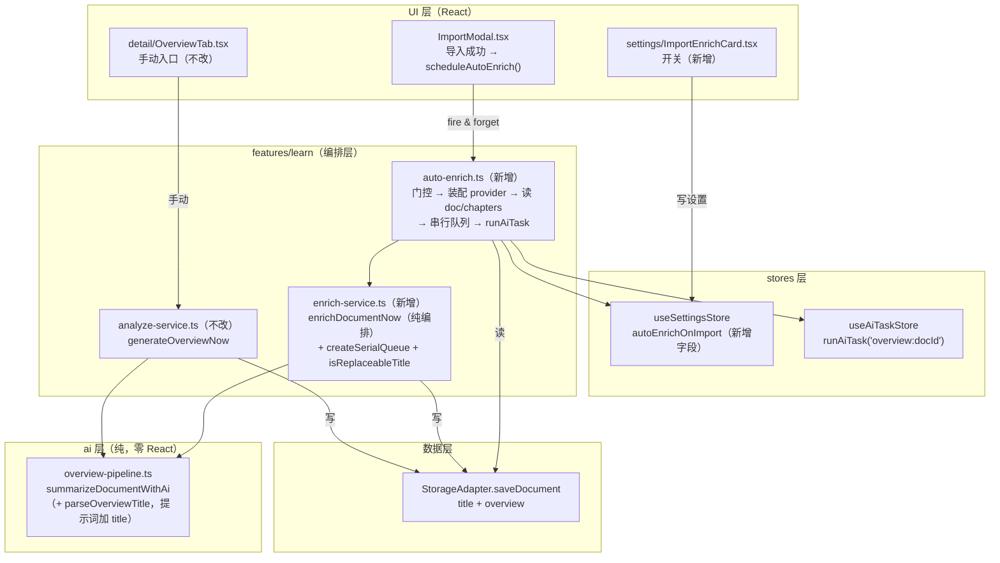
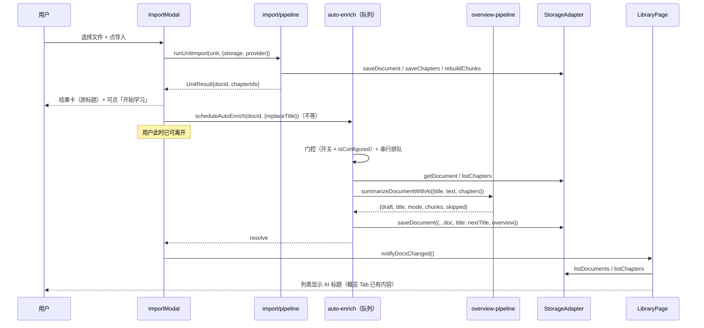

# 导入后 AI 整理（资料标题 + 整篇概览）技术方案

| 字段 | 内容 |
|------|------|
| 作者 | Agent |
| 日期 | 2026-09-14 |
| 状态 | **已实施（2026-09-14）** |
| 关联需求 | 用户口述：「导入资料后如果已经配置本地 AI，需要用 AI 根据资料内容重新生成资料标题和概览等信息，先生成方案」 |
| 关联文档 | `docs/library-import-optimization-plan-2026-09.md`（O5 / 决策 D2，本方案取代其 D2）· `docs/library-detail-page-overview-tab-design-2026-09.md`（概览管道既有设计）· `docs/ai-chapter-mapreduce-design-2026-09.md`（map-reduce 约定）· `docs/rag-wiring-design-2026-09.md`（`autoIndexAfterImport` 后台先例） |

---

## 1. 背景

### 1.1 用户痛点

导入资料后，用户拿到的**标题是文件名**（或 GitHub 仓库名）、**概览是空的**：

- 本地文件：标题 = `stripExtension(file.name)`（`import/local-files.ts:46`）——`第3章_Agent架构_v2.md` 这种文件名会原样变成资料标题。
- GitHub：标题 = 仓库 `fullName` / blob 文件名 / tree 末段（`import/github.ts:390-401`）。
- 粘贴：标题 = 用户输入；不填则落兜底文案「未命名」（`i18n/messages/zh.ts` 的 `learn.import.unnamedDoc`）。
- 概览：**已实现但只在详情页手动触发**——`OverviewTab.tsx:118 generate` 里的一个按钮，导入后不跑。

结果是「导入 22 份资料 → 资料库里 22 个文件名 + 22 张空概览」，用户得逐份进详情页点两次按钮。

### 1.2 触发原因

- 本仓库已有全套 AI 概览能力（`ai/overview-pipeline.ts` 的 map-reduce 管道 + `feature/learn/analyze-service.ts:408 generateOverviewNow` 的落库编排），**只差「自动触发」这一步**。
- 已有成熟的后台异步先例：`index-service.ts:258 autoIndexAfterImport()`（导入后静默入队向量化，不阻塞结果卡，D2-A 决策）。
- 「AI 生成资料标题」是**完全空白**能力：当前标题一律非正文推导，没有任何函数从正文提炼标题。
- 起因之一是既有的 `O5` 规划（`docs/library-import-optimization-plan-2026-09.md:30`），但它当时被 D2 决策挡在门外。

### 1.3 与现有模块的关系

本方案**不新造 AI 管道**，只做三件事：

1. **在既有概览管道的成稿提示词里多要一个字段**（`title`）；
2. **新增一层编排**：把「标题 + 概览」一次写入 `SourceDocument`；
3. **新增一层后台触发**：导入成功后静默串行排队执行，不阻塞导入。

### 1.4 不做会有什么影响

- 资料库的可读性停留在「文件名即标题」，用户每导入一批资料都要手工改名；
- 「AI 概览」这个已实现能力长期处于「几乎没人点」的状态（藏在详情页二级 Tab 里）；
- `O5` 规划里的自动化诉求继续悬空，且与本文档的决策冲突会持续存在。

---

## 2. 方案目标

| 类型 | 描述 |
|------|------|
| **主要目标** | 导入成功后，若「已配置 AI」且「开关为开」，自动在后台用 AI 读正文，生成**资料标题**（仅当原标题是兜底值时才覆盖）与**整篇概览**（`gist` / `sections` / `keywords` / `prerequisites`），写入 `SourceDocument` 并刷新资料库列表。 |
| **非目标** | ① 不自动跑**章级**分析（要点抽取 / 概念图谱）——章级仍有手动入口，且资料章数多时是 N+1 次调用；② 不改动导入管道的 5 阶段进度 UI（本能力是后台任务，不是管道阶段）；③ 不在「替换正文」/「追加正文」路径触发（见 §10.4 回滚与后续项）；④ 不做本地/云端 provider 的差异化策略（统一走 `AIProvider`）。 |
| **成功标准** | ① 配好本地模型 → 导入一份本地 md → 不点任何按钮，资料库列表里的标题在 AI 跑完后自动变成正文提炼的标题，概览 Tab 有内容；② 粘贴时手填的标题**不被覆盖**；③ 未配置 AI 时导入路径**零变化**（不报错、不卡顿、不多一次网络调用）；④ 批量导入 22 份时后台任务串行执行，导入结果卡不被阻塞；⑤ `npm run typecheck` 无新增错误，`test:enrich` / `test:overview` / `test:library` / `test:import` 全绿。 |

---

## 3. 项目现状

### 3.1 相关代码与模块

**导入链路（挂载点）**

| 位置 | 事实 |
|------|------|
| `src/features/learn/ImportModal.tsx:73` | 全产品唯一导入 UI（三来源 Tab：paste / local / github）。经 `IMPORT_OPEN_EVENT` 打开（`AppShell.tsx:14,23`）。 |
| `ImportModal.tsx:152 runSingleImport` / `:191 runBatch` | 两条执行入口，都传 `provider: buildActiveProvider()`。 |
| `ImportModal.tsx:316 saveDocOnly` | 「仅保存资料」（不切分），同样是一次资料落地。 |
| `ImportModal.tsx:182` / `:214` | 现有「导入后后台动作」的两个调用点：`autoIndexAfterImport()`。 |
| `src/features/learn/import/pipeline.ts:62 runUnitImport` | 共享管道，5 个 phase：`read → detect → refine → create → link`（`:114` / `:116` / `:132` / `:138` / `:140`）。**本章程不改它**。 |
| `pipeline.ts:124-129` | 0 章早返回：仍保存资料，返回空 `chapterIds`。 |
| `pipeline.ts:132-134` | `refine` 阶段：`provider` 就绪才调 `refineSplitResult`，失败静默回退（既有 AI-in-pipeline 的同步先例）。 |
| `src/features/learn/import/types.ts:46 ImportUnit` | 来源归一化产物；`UnitResult.unit` 会把它带回 UI。 |
| `import/types.ts:128 stripExtension` | 本地文件标题来源。 |

**概览能力（复用主体）**

| 位置 | 事实 |
|------|------|
| `src/ai/overview-pipeline.ts:358 summarizeDocumentWithAi` | 整篇概览执行器：`blocks ≤ 1` → 单次成稿（`:387-395`，提示词 `OVERVIEW_SYSTEM:132`）；否则 map 逐块归纳（`:397-421`，提示词 `CHUNK_DIGEST_SYSTEM:121`）+ reduce 归并（`:423-439`，提示词 `OVERVIEW_MERGE_SYSTEM:150`）。 |
| `overview-pipeline.ts:28 OVERVIEW_LIMITS` | 自持尺寸常量：`chunkChars 12k` / `maxChunks 20` / `maxTextChars 400k` / `reduceChars 16k` / `gistChars 60` / `sectionMax 6` / `keywordMax 6` … |
| `overview-pipeline.ts:243 AiOverviewDraft` | 成稿草稿：`gist` / `sections` / `prerequisites` / `keywords`。 |
| `overview-pipeline.ts:296 parseOverviewDraft` | 裁剪 / 去重 / 上限；两条硬拒绝：`gist` 空、`sections` 空 → 抛 `request-failed`。 |
| `src/features/learn/analyze-service.ts:408 generateOverviewNow` | 落库编排：`isConfigured` 校验（`:414`）→ 管道（`:424`）→ 组装 `DocumentOverview`（`:431`）→ `saveDocument`（`:439`）。**不校验有无章节**（概览只依赖正文）。 |
| `src/domain/document.ts:78 DocumentOverview` | `gist` / `sections[]` / `prerequisites[]` / `keywords[]` / `generatedAt` / `sourceChars` / `mode` / `chunks?` / `model?`。 |
| `document.ts:104 isOverviewStale` | 用 `sourceChars !== textPreview.length` 判过期（成本为零）。 |
| `src/features/learn/detail/OverviewTab.tsx:47` | 手动入口，AI 任务 id = `overview:${docId}`；`:118-141 generate` 里 `report()` 上报**已翻译**文案。 |

**既有「改资料标题」的写入口（复用）**

| 位置 | 事实 |
|------|------|
| `src/features/learn/library-actions.ts:50 renameDocument` | 手动重命名（title 去空白，空则拒绝）。 |
| `library-actions.ts:63 updateDocumentMeta` | 元信息局部更新。 |
| `src/features/learn/library/dialogs.tsx:58 RenameDocDialog` | 手动重命名的 UI 入口。 |

**后台任务与设置（新增脚手架的复用地）**

| 位置 | 事实 |
|------|------|
| `src/stores/useAiTaskStore.ts:130 runAiTask(id, fn)` | 非 React 环境执行器；`id` 已 running 时抛 `task-already-running`；`fn` 不显式 finish 则自动补 `done`。 |
| `src/stores/useAiTaskStore.ts:33 AiTaskId` | 联合类型。`overview:${string}` 已存在。 |
| `src/stores/ai-task-types.ts:51 AI_TASK_TERMINAL_TTL_MS` | 终态新鲜度 90s。 |
| `src/stores/useSettingsStore.ts:65 autoIndexOnImport` | 既有开关（默认 true）+ `:224 setAutoIndexOnImport`，**本方案照抄这套形态**。 |
| `useSettingsStore.ts:288 buildActiveProvider` | 装配当前 provider；无配置时返回 `NoActiveProvider`（`isConfigured()=false`），**永不返回 null**。 |
| `src/ai/active.ts:37 activeToProviderConfig` | 唯一的 `null` 路径（内部使用）。 |
| `src/components/layout/AppShell.tsx:17,27` | `DOCS_CHANGED_EVENT` + `notifyDocsChanged()`；`LibraryPage.tsx:109` 监听后 `load()`。 |
| `src/features/settings/VectorIndexCard.tsx:280-287` | `autoIndexOnImport` 开关的 UI 形态（`Checkbox` + `data-testid`）。 |
| `src/features/settings/AIModelsSection.tsx:117` | AI 分区内 `<VectorIndexCard />` 的位置——新卡片挂在它后面。 |

### 3.2 相关文档与约定

| 文档 / 约定 | 与本方案的关系 |
|------|------|
| `docs/library-import-optimization-plan-2026-09.md:30`（O5）、`:41`（决策 D2 = C） | O5 已规划「导入后自动分析」，但 D2 决策为「结果卡一次性勾选，不新增设置项」。**本方案取代该决策**，改为「设置页全局开关，默认开」——开工时须同步更正该文档。 |
| `docs/library-detail-page-overview-tab-design-2026-09.md` | 概览管道的既有设计（四态 UI、map-reduce 决策）。本方案不改变其 UI。 |
| `docs/ai-chapter-mapreduce-design-2026-09.md` | map-reduce 的分块与引用式归并不变量；提示词为各文件内模块级 const。 |
| `rules/layer-import-boundaries.mdc` | UI → stores/storage；纯逻辑不依赖 React；`ai/` 不得 import `features/`。 |
| **服务层文案约定**（`chapter-qa-service.ts:14`、`docs/learn-chapter-qa-design-2026-09.md:1362`） | 服务层只产出**分类/enum**，文案一律由 UI 侧 `useI18n` 映射。⚠️ 但 `src/i18n` **没有 React 之外的消息访问器**，故后台服务**不能自行翻译文案**——这是本方案 §4.4 的关键约束来源。 |
| `rules/no-headless-browser-validation` | 端到端验收由用户手工执行，Agent 只做 typecheck + node 单测。 |
| `rules/code-structure-and-dependencies.mdc` | 单文件 ≤700 行；同模式 ≥10 行 × ≥3 处必须抽取。 |

### 3.3 约束与依赖

- **不新增运行时依赖**（不引入队列库；串行队列用一个 10 行的纯函数工厂）。
- **不新增存储方法、不做 schema 迁移**：`title` 与 `overview` 都是 `SourceDocument` 既有字段，写入走既有 `saveDocument`（`storage/types.ts:46`，三后端均已实现）。
- **不改动导入管道的阶段契约**（`ImportPhaseKey` 保持 5 个），避免动到 `import-core` 单测与结果卡 UI。
- 依赖既有 `AIProvider` 抽象；本地 builtin 与云端 openai-compatible 均适用（`registry.ts:47` 分派）。
- 后台任务的**调度权在本方案**：不引入 service worker / 持久化队列（进程内 promise 链，与 `autoIndexAfterImport` 同级）。

---

## 4. 技术架构

### 4.1 总体架构



**为什么需要 `auto-enrich.ts` 与 `enrich-service.ts` 分开**：`tests/*.test.ts` 走 `node --experimental-strip-types` 直跑，**不能把 zustand / React 拉进测试进程**（`ai-task-types.ts` 拆出独立文件的理由原文）。所以：

- `enrich-service.ts` 只依赖 `domain` / `storage` / `ai` → **可 node 直测**；
- `auto-enrich.ts` 依赖 stores（`useSettingsStore` / `useAiTaskStore` / `useLoopStore`）→ **不进单测**，其可测内核（串行队列、标题判定）下沉到前者的纯函数。

这与既有分工一致：`analyze-service.ts`（纯编排，无 store 依赖）vs `OverviewTab.tsx`（store 接线在 UI 里）。

### 4.2 模块职责

| 模块/层级 | 职责 | 技术选型 |
|-----------|------|----------|
| `ai/overview-pipeline.ts`（改） | 成稿提示词多要一个 `title` 字段；新增纯函数 `parseOverviewTitle`；`summarizeDocumentWithAi` 返回值多带 `title` | 既有模块，零新依赖 |
| `features/learn/enrich-service.ts`（新） | `enrichDocumentNow` 编排（校验 → 管道 → 组装 → 一次写库）；`createSerialQueue` 纯工厂；`isReplaceableTitle` 纯谓词；`EnrichError` | 纯 TS，无 React / 无 store |
| `features/learn/auto-enrich.ts`（新） | `scheduleAutoEnrich(docId, {replaceTitle})`：设置门控 → 装配 provider → 读 doc+chapters → 串行排队 → `runAiTask("overview:${docId}")` | 依赖 stores（zustand，无 React 渲染） |
| `features/settings/ImportEnrichCard.tsx`（新） | 设置页开关卡片（`Checkbox` + 说明文案） | 复用 `primitives.Card` + `ui/checkbox` |
| `stores/useSettingsStore.ts`（改） | 新增 `autoEnrichOnImport`（默认 true）+ `setAutoEnrichOnImport` | zustand persist |
| `features/learn/ImportModal.tsx`（改） | paste 表单标记 `titleSource`；三处导入成功后 fire-and-forget 调度 | 既有组件 |
| `import/types.ts`（改） | `ImportUnit.titleSource?: "user" \| "derived"` | 纯类型 |

### 4.3 数据模型与 API

#### 4.3.1 `ImportUnit.titleSource`（新增字段，`import/types.ts`）

```ts
/**
 * 标题来源——决定 AI 能否覆盖它（docs/import-ai-enrich-design-2026-09.md §4.3.2）。
 * - "user"：用户在粘贴表单里手填 → AI 一律不改；
 * - "derived"（缺省）：文件名 / GitHub 仓库名 / 兜底「未命名」 → AI 可改。
 *
 * 不入库、不进 SourceDocument：它只在「本次导入」这一跳有意义；
 * 资料被手动改名后（RenameDocDialog）语义已由用户接管，无需持久化标记。
 */
titleSource?: "user" | "derived";
```

赋值口径：

| 来源 | 赋值 | 依据 |
|------|------|------|
| paste（表单填了标题） | `"user"` | `ImportModal.tsx:261` `title.trim() \|\| fmt.unnamedDoc` |
| paste（表单留空） | `"derived"` | 落到兜底「未命名」，属于可替换的兜底值 |
| local | 不赋值（= `"derived"`） | `local-files.ts:46` `stripExtension(file.name)` |
| github | 不赋值（= `"derived"`） | `github.ts:390-401 githubPreviewTitle` |

#### 4.3.2 标题判定（纯谓词，`enrich-service.ts`）

```ts
/** 该标题是否允许被 AI 覆盖（"derived" 或无标记才可改）。 */
export function isReplaceableTitle(source: ImportUnit["titleSource"]): boolean {
  return (source ?? "derived") === "derived";
}
```

刻意**不做**「按标题文本猜」的启发式（如「像文件名就替换」）——判定依据必须显式，否则会出现「用户手填了 `notes.md` 结果被 AI 改名」这类不可预期行为。

#### 4.3.3 `AiOverviewDraft` 与 `title` 的关系（关键设计决策）

**`title` 不进 `AiOverviewDraft`。** 理由：`analyze-service.ts:431` 是 `const overview: DocumentOverview = { ...draft, generatedAt, sourceChars, ... }`——若把 `title` 放进 `draft`，它会随 spread **污染 `DocumentOverview`**，写出一个类型上不存在的字段。

因此：

```ts
// ai/overview-pipeline.ts（改）
export function summarizeDocumentWithAi(...): Promise<{
  draft: AiOverviewDraft;      // 不变（gist/sections/prerequisites/keywords）
  /** AI 建议的资料标题；模型未返回 / 空白时为 undefined。独立于 draft，避免污染 DocumentOverview。 */
  title?: string;
  mode: OverviewMode;
  chunks: number;
  skipped: number;
}>;

/** 纯函数：从同一份原始响应里取标题（裁剪 / 去包裹符号 / 上限）。 */
export function parseOverviewTitle(raw: unknown): string | undefined;
```

`parseOverviewTitle` 的容错规则（对齐 `parseOverviewDraft` 的宽松度，但**不**参与「硬拒绝」）：

| 输入 | 输出 |
|------|------|
| 非对象 / 无 `title` 键 / 非字符串 / 空白 | `undefined`（**不算失败**，概览照常产出） |
| `"《Agent 架构入门》"` | `"Agent 架构入门"`（剥掉首尾书名号） |
| `"\"RAG 检索\""` / `"'RAG 检索'"` | `"RAG 检索"`（剥掉首尾引号） |
| 超过 `OVERVIEW_LIMITS.titleChars`（新增，60） | 截断至 60 |
| 剥壳后为空 | `undefined` |

> **为什么标题不进「硬拒绝」**：`parseOverviewDraft` 拒绝空 `gist`/`sections` 是因为「空概览没价值，宁可让调用方重试」；而标题是**附加产物**——模型偶尔漏一个字段不该让整份概览白跑。

#### 4.3.4 `enrichDocumentNow`（`enrich-service.ts`）

```ts
export type EnrichErrorKind = "not-configured" | "no-body" | "failed";

export class EnrichError extends Error {
  constructor(readonly kind: EnrichErrorKind, message: string) { super(message); }
}

export interface EnrichDocumentOptions {
  storage: StorageAdapter;
  provider: AIProvider;
  /** 是否允许用 AI 标题覆盖现有标题（= isReplaceableTitle(unit.titleSource)）。 */
  replaceTitle: boolean;
  /** 仅展示用（写入 overview.model），与既有 generateOverviewNow 同口径。 */
  model?: string;
  onProgress?: OverviewProgress;
  now?: number;
}

export interface EnrichResult {
  docId: string;
  /** 最终写入的标题（未替换时 = 原标题）。 */
  title: string;
  /** 标题是否真的被改了（供调用方决定提示文案与刷新范围）。 */
  titleChanged: boolean;
  overview: DocumentOverview;
  /** map 阶段失败跳过的块数（>0 时概览未覆盖全文，UI 可提示）。 */
  skipped: number;
}

export async function enrichDocumentNow(
  doc: SourceDocument,
  chapters: readonly Chapter[],
  opts: EnrichDocumentOptions,
): Promise<EnrichResult>;
```

执行序（**一次写库**，失败不写半成品）：

```
1. provider.isConfigured() 为假 → throw EnrichError("not-configured")
2. text = doc.textPreview ?? ""，trim 后为空 → throw EnrichError("no-body")
3. summarizeDocumentWithAi(provider, { title: doc.title, text, chapters, onProgress })
   → { draft, title: aiTitle, mode, chunks, skipped }
   （长度超限 / 解析不合规都由它抛错，本层不吞）
4. overview = { ...draft, generatedAt: now, sourceChars: text.length, mode,
                ...(mode === "map-reduce" ? { chunks } : {}),
                ...(model ? { model } : {}) }
5. nextTitle = (replaceTitle && aiTitle) ? aiTitle : doc.title
6. await storage.saveDocument({ ...doc, title: nextTitle, overview })   ← 唯一写点
7. return { docId: doc.id, title: nextTitle, titleChanged: nextTitle !== doc.title, overview, skipped }
```

**与 `generateOverviewNow` 的关系**：不是替代，是并列。

| | `generateOverviewNow`（既有，不动） | `enrichDocumentNow`（新增） |
|---|---|---|
| 触发 | 详情页按钮 | 导入后的后台调度 |
| 写 | `doc.overview` | `doc.title` + `doc.overview` |
| 是否用 AI 标题 | **否**（用户是来重新生成概览的，顺手改名会惊吓） | 是（受 `replaceTitle` 约束） |
| 章节参数 | 用于分块对齐章边界 | 同 |

#### 4.3.5 `createSerialQueue`（纯工厂，`enrich-service.ts`）

```ts
/**
 * 串行队列工厂：调用返回的 enqueue(fn) 会等前一个任务 settle 后再跑 fn；
 * 前一个任务失败不阻断后续（用 then(task, task) 而非 then(task)）。
 *
 * 为什么需要它：批量导入 22 份资料会连发 22 次后台 AI 请求，本地小模型
 * （qwen3.5:4b）串行跑得动、并行只会互相抢算力并把 UI 状态搅乱。
 * 纯函数、不依赖 store → 可单测。
 */
export function createSerialQueue(): <T>(task: () => Promise<T>) => Promise<T> {
  let tail: Promise<unknown> = Promise.resolve();
  return <T>(task: () => Promise<T>): Promise<T> => {
    const run = tail.then(task, task);
    tail = run.then(() => undefined, () => undefined);
    return run;
  };
}
```

#### 4.3.6 `auto-enrich.ts`：后台调度

```ts
// src/features/learn/auto-enrich.ts
const enqueue = createSerialQueue();

export interface AutoEnrichOptions {
  /** 是否允许 AI 覆盖标题（来自 ImportUnit.titleSource）。 */
  replaceTitle: boolean;
}

/**
 * 导入成功后的后台 AI 整理（决策 D1：后台异步，不阻塞导入结果卡）。
 * 静默语义（对齐 autoIndexAfterImport）：开关关 / 未配 AI / 资料已被删
 * → 直接返回，不报错、不改任何状态。
 *
 * 注意：本函数**不**调用 notifyDocsChanged —— 那会 import UI 组件层。
 * 由调用方（ImportModal）在 promise settle 后自行通知。
 */
export function scheduleAutoEnrich(docId: string, opts: AutoEnrichOptions): Promise<void> {
  return enqueue(() => runAutoEnrich(docId, opts)).catch(() => undefined);
}

async function runAutoEnrich(docId: string, opts: AutoEnrichOptions): Promise<void> {
  // 门控 1：设置开关（缺省视为开，与 autoIndexOnImport 同口径）
  if (useSettingsStore.getState().autoEnrichOnImport === false) return;
  // 门控 2：AI 已配置（buildActiveProvider 永不返回 null，用 isConfigured 判）
  const provider = buildActiveProvider();
  if (!provider.isConfigured()) return;

  const doc = await storage.getDocument(docId);
  if (!doc) return;                       // 已被删除（覆盖式导入 / 手动删）
  const chapters = await storage.listChapters(docId);
  const model = useSettingsStore.getState().active?.model ?? undefined;

  // 复用详情页同一个任务 id：任务进行中该页按钮自动禁用（防重复算），
  // 失败终态也会在该页 90s 内可见（isTerminalFresh）。
  // 刻意不调用 setPhase：本层拿不到 i18n 文案，存「标记串」会被 UI 原样渲染。
  await runAiTask(`overview:${docId}`, async () => {
    await enrichDocumentNow(doc, chapters, {
      storage, provider, replaceTitle: opts.replaceTitle,
      ...(model ? { model } : {}),
    });
  });
}
```

### 4.4 状态与副作用

| 状态 | 归属 | 生命周期 |
|------|------|----------|
| 串行队列 `tail` | `auto-enrich.ts` 模块级 | 进程内；不持久化（与 `useAiTaskStore` 同理由） |
| AI 任务记录 `overview:${docId}` | `useAiTaskStore`（内存） | running → done/error；终态保留至下次 start，UI 侧 90s 新鲜度门 |
| `autoEnrichOnImport` | `useSettingsStore`（persist `plos:settings:v1`） | 跨会话 |
| `doc.title` / `doc.overview` | `StorageAdapter`（localStorage：`local.ts` 的 `KEY_DOCUMENTS`） | 持久 |

**副作用触发时机**：仅「导入成功之后」——即 `runUnitImport` / `runBatchImport` / `saveDocOnly` 返回成功后。mount / 轮询 / 路由切换均不触发。

**为什么后台服务不自己翻译文案**：`src/i18n` 只有 React 侧 `useI18n`，**没有非 React 的消息访问器**；后台服务拿不到文案表，也不能把中文硬编码进服务层（既有违规写法，新代码不得模仿）。因此：

- 后台任务**不写 phase 文案**（不调 `setPhase`）；`AiTaskStatusLine` 在无 phase 时回退到页面自己的 `runningFallback`（`OverviewTab` 传的是 `o.generating` =「生成中…」）；
- 若将来要做「正在整理标题…」这类细分进度，正确做法是让**消费方 UI** 按标记映射（`AiTaskRecord.phase` 已明确支持「标记型」），而不是让服务层出中文。

---

## 5. 交互流程

### 5.1 主流程（本地文件导入，已配 AI，开关为开）

1. 用户点资料库「导入」→ `ImportModal` 打开（paste Tab 默认）。
2. 切到「本地文件」Tab，选 `第3章_Agent架构_v2.md` → `fileToUnit` 归一化为 `ImportUnit`（`title = "第3章_Agent架构_v2"`，`titleSource` 未设 = derived）。
3. 点主按钮 → `runSingleImport(unit)`：
   - `runUnitImport` 走 5 阶段（`read → detect → refine → create → link`），结果卡出现，标题显示 `第3章_Agent架构_v2`；
   - `autoIndexAfterImport()`（既有，向量化）；
   - **新增**：`scheduleAutoEnrich(docId, { replaceTitle: true }).then(notifyDocsChanged)`。
4. 用户点「开始学习」→ 进首章阅读页；或关弹窗回资料库。
5. 后台：串行队列取到任务 → 门控通过 → `summarizeDocumentWithAi` 跑（正文短则单次成稿，长则 map-reduce）→ `enrichDocumentNow` 一次写 `doc.title` + `doc.overview`。
6. `.then` 触发 `notifyDocsChanged()` → `LibraryPage.tsx:109` 的监听器 `load()` → 列表刷新，该资料标题已变为 AI 提炼的标题（如「Agent 架构入门：从单体到多智能体」）。
7. 用户点进该资料 → 「概览」Tab 已有 `gist` / `sections` / `keywords` / `prerequisites`。

### 5.2 分支与异常流程

| 场景 | 触发条件 | 系统行为 | UI 反馈 |
|------|----------|----------|---------|
| 未配置 AI | `provider.isConfigured() === false` | `runAutoEnrich` 直接 return，**零请求** | 无（导入路径与今天完全一致） |
| 开关关闭 | `autoEnrichOnImport === false` | 同上 | 设置页开关可关；详情页手动「生成概览」仍可用 |
| 资料正文为空 / 全是空白 | `text.trim().length === 0` | `EnrichError("no-body")` → 队列吞掉 | 无（导入结果卡本就会提示「仅保存」） |
| 正文超整篇上限（400k 字） | `summarizeDocumentWithAi` 抛错 | 队列吞掉，**不写库** | 若 90s 内打开该资料概览 Tab → 错误卡可见；否则静默（手动按钮可重试） |
| 模型未下载 / 服务不可达 | `chat` 抛 `AiProviderError` | 同上 | 同上 |
| 模型返回 JSON 不合规 | `parseOverviewDraft` 抛 `request-failed` | 同上（旧的 `doc.overview` 保持原样） | 同上 |
| 模型返回了标题但没返回 sections | `parseOverviewDraft` 抛错 | **整体不写**（宁可无概览，也不落半成品） | 同上 |
| 模型漏了 title 字段 | `parseOverviewTitle` → `undefined` | 概览照常写入；标题不变 | 无 |
| 用户手填了标题 | `titleSource === "user"` | `replaceTitle = false`：只写概览，**标题不动** | 标题保持用户输入 |
| 弹窗关闭 / 用户已离开 | — | 后台任务照跑（模块级 promise 链，不随组件卸载） | 完成后列表刷新 |
| 用户在后台任务跑动时点「生成概览」 | 任务 id 相同且 running | 手动 `useAiTask.run` 抛 `task-already-running`；但按钮 `disabled={task.running}` 已挡住 | 按钮转圈，点击无效 |
| 用户在详情页点了「生成概览」后马上导入同一份 | — | 两者写同一 doc，last-write-wins；都基于同一正文，结果等价 | 无 |
| 批量导入中某份资料被删 | `storage.getDocument` 返回 falsy | return，跳过该份 | 无 |

### 5.3 时序图



---

## 6. 用户用例（User Cases）

### UC-01：本地文件导入后自动整理（已配 AI）

| 项 | 内容 |
|----|------|
| 角色 | 已配置本地模型的用户 |
| 前置条件 | 设置页已激活本地模型（`providerReady = true`）；`autoEnrichOnImport` 未关；选一份有正文的 `.md` |
| 主流程步骤 | 1. 打开导入弹窗 → 本地文件 Tab → 选文件 → 点导入；2. 结果卡出现，标题为文件名；3. 关闭弹窗回资料库；4. 等待 AI 跑完（几秒 ~ 数十秒） |
| 期望结果 | 资料库该卡片标题变为 AI 提炼标题（不点任何按钮）；进入详情页「概览」Tab 有 `gist`/`sections`/`keywords`/`prerequisites` |
| 异常/边界 | AI 失败 → 标题与概览保持导入时状态，列表不出现错误弹窗；手动「生成概览」可重试 |

### UC-02：粘贴时手填标题不被覆盖

| 项 | 内容 |
|----|------|
| 角色 | 粘贴笔记的用户 |
| 前置条件 | 粘贴表单标题填「我的读书笔记 · 第九章」 |
| 主流程步骤 | 1. 填标题与正文 → 点导入；2. 等待后台 AI 完成 |
| 期望结果 | 标题**保持**「我的读书笔记 · 第九章」；概览正常生成 |
| 异常/边界 | 标题留空（落「未命名」）→ 属于兜底值 → AI 可覆盖 |

### UC-03：未配置 AI

| 项 | 内容 |
|----|------|
| 角色 | 未配模型的新用户 |
| 前置条件 | `provider.isConfigured() === false` |
| 主流程步骤 | 导入一份资料 |
| 期望结果 | 与今天完全一致（标题 = 文件名，概览空）；**无任何 AI 请求、无报错、无额外等待** |
| 异常/边界 | 之后配好模型，旧资料不会自动补跑（需进详情页手动「生成概览」）——见 §10.4 |

### UC-04：批量导入 22 份

| 项 | 内容 |
|----|------|
| 角色 | 批量灌资料的用户 |
| 前置条件 | 已配 AI；选 22 个文件 |
| 主流程步骤 | 1. 批量导入；2. 汇总卡出现（耗时与今天一致，不被 AI 拖慢）；3. 等待后台队列逐份整理 |
| 期望结果 | 22 份**串行**整理；每份完成即刷新列表（标题逐份变化，而非最后一次性全变）；导入结果卡不被阻塞 |
| 异常/边界 | 某一份失败不影响后续份；中途关弹窗 / 切路由不中断 |

### UC-05：关闭开关

| 项 | 内容 |
|----|------|
| 角色 | 不想让 AI 自动跑的用户 |
| 前置条件 | 设置 → AI → 取消勾选「导入后自动整理标题与概览」 |
| 主流程步骤 | 导入一份资料 |
| 期望结果 | 无后台 AI 任务；标题与概览保持导入时状态 |
| 异常/边界 | 详情页「生成概览」按钮仍可用（开关只关自动，不关手动） |

---

## 7. 线框 UI（Wireframe）

### 7.1 设置 · AI 分区（新增卡片）

```
┌─────────────────────────────────────────────────────┐
│  [本地模型（下载运行）]  [API 模型（请求）]            │   ← 既有
├─────────────────────────────────────────────────────┤
│  （模型列表 / API 表单）                              │   ← 既有
└─────────────────────────────────────────────────────┘
┌─────────────────────────────────────────────────────┐
│  向量索引                                             │   ← 既有 VectorIndexCard
│  …                                                    │
│  ☑ 导入后自动建立向量索引                              │
└─────────────────────────────────────────────────────┘
┌─────────────────────────────────────────────────────┐
│  导入后 AI 整理                          ← 新增卡片    │
│  导入完成的资料会在后台由 AI 读一遍正文，生成资料标题   │
│  与整篇概览。                                         │
│                                                       │
│  ☑ 导入后自动整理标题与概览                            │
│    只替换来自文件名或「未命名」的标题；你手填过的标题    │
│    不会被改动。                                       │
└─────────────────────────────────────────────────────┘
```

- 布局：`Card`（`components/primitives.Card`）+ `Checkbox`（`components/ui/checkbox`），与 `VectorIndexCard.tsx:280-287` 的开关形态**逐字对齐**（同款 `flex items-start gap-2` + `data-testid`）。
- 挂载点：`AIModelsSection.tsx:117` 的 `<VectorIndexCard />` 之后。
- `data-testid="settings-auto-enrich"`。

### 7.2 其他状态

- **未配置 AI**：卡片开关**仍可勾选**（它是「意图」不是「能力」），但卡片内追加一行提示：「配置 AI 模型后才会生效」。不禁用勾选框——禁用会让用户以为设置项坏了。判定用 `useAiReady()`（`hooks/useAiReady.ts:18`，响应式）。
- **加载中 / 空 / 错误**：本卡片无异步加载，无空态；写入设置是同步的（zustand `set` + persist），无错误态。

### 7.3 交互说明

- 勾选即写入 `useSettingsStore.setAutoEnrichOnImport(v === true)`（立即 persist，无保存按钮）——与 `VectorIndexCard.tsx:283-284` 完全同款。
- 键盘可达性由 `Checkbox` 组件保证（复用既有原语，不自造）。
- 无弹层、无 Toast。

### 7.4 导入弹窗（不改布局，仅一处提示）

单份导入结果卡底部追加一行静态提示（仅当本次触发了后台整理时）：

```
AI 正在后台整理标题与概览，完成后自动更新。
```

- 位置：既有「索引态」行（`ImportModal.tsx:597-599`，`data-testid="import-index-status"`）之后，新增 `data-testid="import-enrich-status"`。
- 无进度条（后台任务不向本组件上报）——**刻意如此**：弹窗通常几秒内就关了，加一个跑不动的进度条只会更糟。

---

## 8. 涉及文件及改动伪代码

### 8.1 `src/ai/overview-pipeline.ts`（修改）

**改动说明**：两个成稿提示词（`OVERVIEW_SYSTEM:132` / `OVERVIEW_MERGE_SYSTEM:150`）增加 `title` 字段要求；新增 `OVERVIEW_LIMITS.titleChars`；新增 `parseOverviewTitle`；`summarizeDocumentWithAi` 返回值多带 `title`。**`AiOverviewDraft` 保持不变**（§4.3.3）。

```ts
// 1) 尺寸常量（OVERVIEW_LIMITS 内新增一行）
titleChars: 60,

// 2) OVERVIEW_SYSTEM 追加（放在 gist 之前，作为整份资料的首要标识）
"- title：资料标题（≤60 字）——一句话概括整份资料的主题；不要书名号、不要「本文」等空话；\n" +
// 并把末尾的 JSON 格式改为：
'{"title":"…","gist":"…","sections":[{"heading":"…","detail":"…"}],"prerequisites":["…"],"keywords":["…"]}。'

// 3) OVERVIEW_MERGE_SYSTEM 同样追加 title 要求与 JSON 键

// 4) 新增纯函数
/** 首尾包裹符号（书名号 / 引号）剥壳用。 */
const TITLE_WRAP = /^[《【<「『"'‘“]+|[》】>」』"'’”]+$/g;

/**
 * 纯函数：从成稿响应里取 AI 建议标题。
 * 宽松容错：任何不合规（非对象 / 缺字段 / 空白 / 剥壳后为空）都返回 undefined，
 * **不抛错**——标题是附加产物，不该让整份概览白跑（对比 parseOverviewDraft 的硬拒绝）。
 */
export function parseOverviewTitle(raw: unknown): string | undefined {
  if (!isRecord(raw)) return undefined;
  const s = str(raw.title)?.trim();
  if (!s) return undefined;
  const stripped = s.replace(TITLE_WRAP, "").trim();
  return stripped ? stripped.slice(0, OVERVIEW_LIMITS.titleChars) : undefined;
}

// 5) 执行器返回值加 title（两处 return 各加一行）
//    单次成稿分支：
const raw = await chatJson(provider, buildOverviewMessages({ title: input.title, text }), OVERVIEW_TEMPERATURE);
return {
  draft: parseOverviewDraft(raw),
  title: parseOverviewTitle(raw),
  mode: "single", chunks: 1, skipped: 0,
};
//    reduce 分支同理：title: parseOverviewTitle(raw)
```

**回归风险**：`buildOverviewMessages` / `buildOverviewMergeMessages` 的输出字符串变了 → `tests/library-overview.test.ts` 里断言消息结构的用例需同步更新（见 §12）。

### 8.2 `src/features/learn/enrich-service.ts`（新增）

**改动说明**：纯编排 + 两个纯工具。**不 import 任何 store / React**。

```ts
/**
 * 导入后 AI 整理编排（enrich-service）——「资料标题 + 整篇概览」一次写库。
 *
 * 边界（对齐 analyze-service 的写法）：
 * - 纯编排：只依赖 domain / storage / ai，不 import stores 与 React（node 单测可直跑）；
 * - 不做门控：开关与 provider 就绪由 auto-enrich.ts 判定，本层只认「已配置的 provider」；
 * - 一次写库：只有成功路径写 saveDocument，失败一律向上抛（旧 title/overview 保持不变）；
 * - 概览只依赖正文，不要求已切分（与 generateOverviewNow 同口径，无章时按段落分块）。
 */
import type { Chapter, DocumentOverview, SourceDocument } from "../../domain";
import type { StorageAdapter } from "../../storage";
import type { AIProvider } from "../../ai";
import { AiProviderError } from "../../ai/types";
import type { OverviewProgress } from "../../ai/overview-pipeline";
import { summarizeDocumentWithAi } from "../../ai/overview-pipeline";
import { aiErrPreview, aiLog } from "../../ai/log";
import type { ImportUnit } from "./import/types";

export type EnrichErrorKind = "not-configured" | "no-body" | "failed";
export class EnrichError extends Error { /* kind + message */ }

/** 标题是否允许 AI 覆盖（缺失标记 = derived = 可覆盖）。 */
export function isReplaceableTitle(source: ImportUnit["titleSource"]): boolean;

export function createSerialQueue(): <T>(task: () => Promise<T>) => Promise<T>;

export interface EnrichDocumentOptions { /* 见 §4.3.4 */ }
export interface EnrichResult { /* 见 §4.3.4 */ }

export async function enrichDocumentNow(
  doc: SourceDocument,
  chapters: readonly Chapter[],
  opts: EnrichDocumentOptions,
): Promise<EnrichResult> {
  const { storage, provider, replaceTitle, model, onProgress, now = Date.now() } = opts;
  if (!provider.isConfigured()) throw new EnrichError("not-configured", "AI 未配置。");
  const text = doc.textPreview ?? "";
  if (text.trim().length === 0) throw new EnrichError("no-body", "这份资料没有正文。");

  const startedAt = Date.now();
  const { draft, title: aiTitle, mode, chunks, skipped } = await summarizeDocumentWithAi(
    provider,
    { title: doc.title, text, chapters, ...(onProgress ? { onProgress } : {}) },
  );

  const overview: DocumentOverview = {
    ...draft, generatedAt: now, sourceChars: text.length, mode,
    ...(mode === "map-reduce" ? { chunks } : {}),
    ...(model ? { model } : {}),
  };
  const nextTitle = replaceTitle && aiTitle ? aiTitle : doc.title;

  await storage.saveDocument({ ...doc, title: nextTitle, overview });
  aiLog("info", "enrich", "导入后整理完成", {
    doc: doc.id, mode, chunks, skipped,
    titleChanged: nextTitle !== doc.title, ms: Date.now() - startedAt,
  });
  return { docId: doc.id, title: nextTitle, titleChanged: nextTitle !== doc.title, overview, skipped };
}
```

### 8.3 `src/features/learn/auto-enrich.ts`（新增）

**改动说明**：设置门控 + provider 装配 + 串行排队 + AI 任务注册。伪代码见 §4.3.6（全文）。

```ts
import { storage } from "../../stores/useLoopStore";
import { buildActiveProvider, useSettingsStore } from "../../stores/useSettingsStore";
import { runAiTask } from "../../stores/useAiTaskStore";
import { createSerialQueue, enrichDocumentNow } from "./enrich-service";

const enqueue = createSerialQueue();
export function scheduleAutoEnrich(docId: string, opts: { replaceTitle: boolean }): Promise<void>;
```

### 8.4 `src/features/learn/import/types.ts`（修改）

**改动说明**：`ImportUnit` 增加 `titleSource` 字段（§4.3.1），附注释说明「不入库」。

```ts
export interface ImportUnit {
  title: string;
  /** 标题来源——决定 AI 能否覆盖（"user" 手填不改；缺省 "derived" 可改，见 §4.3.2）。 */
  titleSource?: "user" | "derived";
  format: DocumentFormat;
  /* …其余不变… */
}
```

### 8.5 `src/features/learn/ImportModal.tsx`（修改）

**改动说明**：三处导入成功后调度后台整理；paste 表单标记 `titleSource`；结果卡加一行静态提示。

```tsx
// 新增 import
import { scheduleAutoEnrich } from "./auto-enrich";
import { notifyDocsChanged } from "../../components/layout/AppShell";

// 状态：记录本次是否触发了后台整理（决定结果卡是否显示提示行）
const [enrichScheduled, setEnrichScheduled] = useState(false);

// resetRun() 内补：setEnrichScheduled(false);

// ① runSingleImport 成功分支（现有 autoIndexAfterImport 之后）
setSingle({ ... });
if (result.chapterIds.length === 0) setNotice(fmt.tooShort);
autoIndexAfterImport();
// 新增：导入成功后触发后台 AI 整理（不 await；失败静默）
setEnrichScheduled(true);
void scheduleAutoEnrich(result.docId, {
  replaceTitle: isReplaceableTitle(result.unit.titleSource),
}).then(() => notifyDocsChanged());

// ② runBatch 成功分支（out.ok 逐份调度，队列内部串行）
if (out.ok.length > 0) {
  autoIndexAfterImport();
  setEnrichScheduled(true);
  for (const r of out.ok) {
    void scheduleAutoEnrich(r.docId, {
      replaceTitle: isReplaceableTitle(r.unit.titleSource),
    }).then(() => notifyDocsChanged());
  }
}

// ③ saveDocOnly 成功分支
setNotice(fmt.savedDoc(doc.title));
setEnrichScheduled(true);
void scheduleAutoEnrich(doc.id, { replaceTitle: !title.trim() }).then(() => notifyDocsChanged());

// ④ paste 表单组装 unit 时标记来源
await runSingleImport({
  title: title.trim() || fmt.unnamedDoc,
  titleSource: title.trim() ? "user" : "derived",   // 新增
  format, splitFormat,
  text: body,
});

// ⑤ 结果卡静态提示（data-testid="import-enrich-status"）
{enrichScheduled ? (
  <p className="mt-1.5 text-xs text-ink-3" data-testid="import-enrich-status">{fmt.enrichQueued}</p>
) : null}
```

> `isReplaceableTitle` 从 `./enrich-service` 导入——它是纯谓词，供 UI 判定口径与服务层**同一处定义**，避免「UI 一套规则、服务层一套规则」。

### 8.6 `src/stores/useSettingsStore.ts`（修改）

**改动说明**：照抄 `autoIndexOnImport` 的四处落点（声明 / 默认值 / persist 映射 / 旧数据迁移 / setter）。

```ts
// ① 类型声明（紧邻 autoIndexOnImport:65）
/** 导入后自动用 AI 整理资料标题与概览（默认开）。关闭后仍可在详情页手动生成。 */
autoEnrichOnImport?: boolean;

// ② 默认值（紧邻 :95）
autoEnrichOnImport: true,

// ③ 旧数据迁移（legacyToActive 两处，紧邻 :124 / :136）
autoEnrichOnImport: p.autoEnrichOnImport !== false,

// ④ persist partialize（紧邻 :239）
autoEnrichOnImport: s.autoEnrichOnImport !== false,

// ⑤ setter（紧邻 :224）
setAutoEnrichOnImport: (on) => { set({ autoEnrichOnImport: on, savedAt: Date.now() }); },
```

> 注：`useSettingsStore.ts` 的接口体与 `set` 体各有一处声明/实现，需**两处都加**（照 `autoIndexOnImport` 的既有落点逐个对齐）。

### 8.7 `src/features/settings/ImportEnrichCard.tsx`（新增）

```tsx
/** 设置 · AI 分区 → 「导入后 AI 整理」开关（形态对齐 VectorIndexCard 的自动索引开关）。 */
export default function ImportEnrichCard() {
  const t = useI18n().m.settings.models.importAssist;
  const aiReady = useAiReady();
  const on = useSettingsStore((s) => s.autoEnrichOnImport);
  const setOn = useSettingsStore((s) => s.setAutoEnrichOnImport);

  return (
    <Card>
      <h3 className="text-sm font-semibold text-ink-1">{t.title}</h3>
      <p className="mt-1 text-xs leading-relaxed text-ink-3">{t.desc}</p>
      <label className="mt-3 flex items-start gap-2">
        <Checkbox checked={on !== false} onCheckedChange={(v) => setOn(v === true)}
                  data-testid="settings-auto-enrich" />
        <span>
          <span className="block text-sm text-ink-1">{t.label}</span>
          <span className="mt-0.5 block text-[11px] leading-relaxed text-ink-3">{t.hint}</span>
        </span>
      </label>
      {!aiReady ? <p className="mt-2 text-xs text-state-weak">{t.noAi}</p> : null}
    </Card>
  );
}
```

### 8.8 `src/features/settings/AIModelsSection.tsx`（修改）

**改动说明**：仅加一个 import + 一行 JSX。**不触碰该文件既有的 3 条 `noUnusedLocals` 报错**（`bannerTitle`/`bannerDesc`/`bannerTone`，`:55-57`，HEAD 既存债，属他人文件）。

```tsx
import ImportEnrichCard from "./ImportEnrichCard";
// …
      <VectorIndexCard />
      <ImportEnrichCard />     {/* 新增 */}
```

### 8.9 `src/i18n/messages/zh.ts` / `en.ts`（修改）

**改动说明**：`settings.models` 下新增 `importAssist` 命名空间（4 键）与 `learn.import` 下新增 `enrichQueued`（1 键）。两版**必须成对**，顺序一致。

```ts
// zh.ts — settings.models 内
importAssist: {
  title: "导入后 AI 整理",
  desc: "导入完成的资料会在后台由 AI 读一遍正文，生成资料标题与整篇概览。",
  label: "导入后自动整理标题与概览",
  hint: "只替换来自文件名或「未命名」的标题；你手填过的标题不会被改动。",
  noAi: "配置 AI 模型后才会生效。",
},
// zh.ts — learn.import 内
enrichQueued: "AI 正在后台整理标题与概览，完成后自动更新。",

// en.ts — settings.models 内
importAssist: {
  title: "AI enrichment after import",
  desc: "Imported documents are read by AI in the background to produce a title and a whole-document overview.",
  label: "Auto-generate title and overview on import",
  hint: "Only replaces titles derived from a file name or the “Untitled” fallback; titles you typed are kept.",
  noAi: "Takes effect once an AI model is configured.",
},
// en.ts — learn.import 内
enrichQueued: "AI is preparing the title and overview in the background; this page updates automatically.",
```

### 8.10 `package.json`（修改）

**改动说明**：新增 `test:enrich`，并串入 `test:library`（与 `test:overview` 同级）。

```json
"test:enrich": "node --experimental-strip-types --no-warnings --import ./tests/register-loader.mjs tests/enrich-service.test.ts",
"test:library": "npm run test:anchor && … && npm run test:overview && npm run test:enrich && npm run test:card && …"
```

### 8.11 `tests/enrich-service.test.ts`（新增）

**改动说明**：见 §11 / §12。假 provider（复用 `tests/library-overview.test.ts` 的 `mkProvider` 写法），`InMemoryStorage` 直跑，无网络、无 zustand。

### 8.12 `tests/library-overview.test.ts`（修改）

**改动说明**：新增 `parseOverviewTitle` 断言；更新两个 builder 的消息结构断言（新增 `title` 要求）；新增「`summarizeDocumentWithAi` 返回值含 `title`」与「`title` 不进入 `draft`」两条。

---

## 9. 任务清单（Tasks）

| ID | 任务 | 依赖 | 预估复杂度 |
|----|------|------|------------|
| T1 | `ai/overview-pipeline.ts`：`OVERVIEW_LIMITS.titleChars` + 两个成稿提示词加 `title` + `parseOverviewTitle` + 执行器返回 `title` | — | S |
| T2 | `import/types.ts`：`ImportUnit.titleSource` | — | S |
| T3 | 新增 `features/learn/enrich-service.ts`（`enrichDocumentNow` / `createSerialQueue` / `isReplaceableTitle` / `EnrichError`） | T1, T2 | M |
| T4 | 新增 `features/learn/auto-enrich.ts`（门控 + 装配 + 队列 + `runAiTask`） | T3 | S |
| T5 | 新增 `tests/enrich-service.test.ts` + 扩展 `tests/library-overview.test.ts` + `package.json` 的 `test:enrich` | T1, T3 | M |
| T6 | `stores/useSettingsStore.ts`：`autoEnrichOnImport` 五处落点 | — | S |
| T7 | 新增 `features/settings/ImportEnrichCard.tsx` + 挂载到 `AIModelsSection.tsx` + i18n 双语（`importAssist`） | T6 | S |
| T8 | `ImportModal.tsx`：三处调度 + `titleSource` 标记 + 结果卡提示行 + i18n（`enrichQueued`） | T2, T4, T7 | M |
| T9 | 收尾校验：typecheck / `test:enrich` / `test:overview` / `test:import` / `test:i18n` / `test:library` | T1–T8 | S |
| T10 | 文档同步：本方案状态；`docs/library-import-optimization-plan-2026-09.md` 的 O5 与 D2；README 双语功能清单 | T9 | S |

---

## 10. 实施步骤

1. **步骤 1（T1 + T2）**：先改 AI 层与类型层——它们是纯函数 / 纯类型，改动最小且可立刻用 `test:overview` 验证。
   - 输入：现有 `overview-pipeline.ts`；输出：多一个 `title` 能力的管道。
   - 验证：`npm run test:overview`（更新断言后全绿）。
2. **步骤 2（T3 + T5 前半）**：写 `enrich-service.ts` 与它的单测。
   - 验证：`npm run test:enrich` 全绿（含「不改标题」「改标题」「不写半成品」「队列串行」四组）。
3. **步骤 3（T4）**：写 `auto-enrich.ts`（store 接线）。此步不可单测，靠 typecheck + 步骤 5 的手工验收兜底。
4. **步骤 4（T6 + T7）**：设置项与开关卡片（含 i18n 双语）。`npm run test:i18n` 验证两版对齐。
5. **步骤 5（T8）**：`ImportModal` 接线 + 结果卡提示行。
   - 验证：`npm run typecheck` 无新增错误。
6. **步骤 6（T9）**：全量回归。
7. **步骤 7（T10）**：文档同步（三份）。

**回滚策略**：本能力可以「软关」——把 `useSettingsStore.autoEnrichOnImport` 的默认值改回 `false` 即完全停用（代码路径仍在，只是门控不过）。若要彻底回滚，删除 T4/T8 的调度调用即可，T1 的 `title` 能力对既有手动概览**无行为影响**（`generateOverviewNow` 不使用 title）。

---

## 11. 测试方案

### 11.1 测试范围与策略

| 层级 | 工具/方式 | 覆盖重点 | 不负责 |
|------|-----------|----------|--------|
| 单元 | `tests/enrich-service.test.ts`（node `--experimental-strip-types` 直跑，`npm run test:enrich`） | `isReplaceableTitle` 三态；`createSerialQueue` 串行与失败不阻断；`enrichDocumentNow` 的校验 / 标题策略 / 写库形状 / 失败不写 | store 门控、后台调度、UI |
| 单元 | `tests/library-overview.test.ts`（扩展） | `parseOverviewTitle` 剥离与容错；成稿提示词含 `title`；执行器返回值含 `title`；**`title` 不进 `draft`** | — |
| 单元 | `tests/i18n-alignment.test.ts`（既有） | 中英两版 key 严格对齐（新增 5 个 key） | — |
| 单元 | `tests/import-core.test.ts`（既有，回归） | `ImportUnit` 加可选字段后管道行为不变 | — |
| 集成 | 无 | — | — |
| E2E | **不执行**（`rules/no-headless-browser-validation`） | — | 浏览器级验收 |
| 手工 | 用户执行 | 见 §12.2 手工清单 | — |

### 11.2 测试环境与数据

- 无网络、无真实模型：AI 交互一律走**本地假 provider**（`mkProvider`，抄 `tests/library-overview.test.ts` 的写法）。
- 存储用 `InMemoryStorage`（`src/storage/memory.ts`），并可派生 `CountingStorage` 统计 `saveDocument` 次数（验证「失败不写库」）。
- 章节 fixture 用 `contentRef` 手写（概览分块对齐章边界用），正文用可重复字符串（如 `"甲".repeat(...)`）。
- 纳入 CI：`test:enrich` 串进 `test:library`，随既有 `test:library` 一起跑。

### 11.3 通过标准

- `npm run typecheck`：**无新增** error（既有 3 条 `AIModelsSection.tsx:55-57` 不计）。
- `npm run test:enrich` / `test:overview` / `test:import` / `test:i18n` / `test:library` / `test:splitter` 全部 exit=0。
- §12.2 手工清单由用户在桌面端跑通。

---

## 12. 测试用例

### 12.1 自动化用例

| ID | 关联 UC | 步骤 | 输入/操作 | 期望结果 | 类型 |
|----|---------|------|-----------|----------|------|
| TC-UC01-01 | UC-01 | 单份资料 + replaceTitle=true + provider 返回 title | `doc.title="第3章_Agent架构_v2"`，raw 含 `title:"Agent 架构入门"` | `result.titleChanged === true`，`doc.title === "Agent 架构入门"`，`doc.overview.gist` 等四字段写入且 `sourceChars === text.length` | 单元 |
| TC-UC01-02 | UC-01 | 同上，`mode` 断言 | 正文 30k 字（> chunkChars） | `doc.overview.mode === "map-reduce"`，`chunks > 1` | 单元 |
| TC-UC01-03 | UC-01 | 单次成稿分支 | 正文 1k 字 | `mode === "single"`，`overview.chunks === undefined` | 单元 |
| TC-UC02-01 | UC-02 | replaceTitle=false | `doc.title="我的读书笔记"`，raw 含 `title:"AI 建议的标题"` | `doc.title` **仍为** `"我的读书笔记"`；`titleChanged === false`；概览正常写入 | 单元 |
| TC-UC02-02 | UC-02 | `isReplaceableTitle` 三态 | `"user"` / `"derived"` / `undefined` | `false` / `true` / `true`（缺省 = 可覆盖） | 单元 |
| TC-UC03-01 | UC-03 | provider 未配置 | `provider.isConfigured() === false` | 抛 `EnrichError` 且 `kind === "not-configured"`；`saveDocument` 调用数 = 0 | 单元 |
| TC-UC03-02 | UC-03 | 空正文 | `textPreview = "   "` | 抛 `EnrichError` 且 `kind === "no-body"`；不写库 | 单元 |
| TC-UC03-03 | — | 模型漏 title 字段 | raw 无 `title` 键 | `parseOverviewTitle` → `undefined`；概览仍写入；标题不变 | 单元 |
| TC-UC04-01 | UC-04 | 队列串行 | 连发 3 个任务（各自 `await sleep(10)` 后 push id） | 完成顺序 = 入队顺序；无并发交叠（记录「进行中计数」恒 ≤1） | 单元 |
| TC-UC04-02 | UC-04 | 队列失败不阻断 | 第 1 个 reject，第 2、3 个正常 | 全部 enqueue 都 settle；第 2、3 个仍执行 | 单元 |
| TC-UC04-03 | UC-04 | 归并失败不写库 | reduce 输出 `{gist:"只有一句"}`（sections 空） | `enrichDocumentNow` 抛错；`saveDocument` 调用数 = 0（旧 title/overview 原样） | 单元 |
| TC-UC05-01 | UC-05 | 开关语义（设置层） | `autoEnrichOnImport: false` | 见 §12.2 手工（store 层不可 node 直测） | 手工 |
| TC-EDGE-01 | — | `parseOverviewTitle` 剥壳 | `"《Agent 架构入门》"` / `"\"RAG 检索\""` | `"Agent 架构入门"` / `"RAG 检索"` | 单元 |
| TC-EDGE-02 | — | `parseOverviewTitle` 超长 | 200 字标题 | 截断至 60 字 | 单元 |
| TC-EDGE-03 | — | `parseOverviewTitle` 非法输入 | `null` / `{}` / `{title:"  "}` / `{title:123}` | 全部 `undefined`，且**不抛错** | 单元 |
| TC-EDGE-04 | — | `title` 不污染 `DocumentOverview` | 正常成稿 | 落库的 `overview` 对象**不含** `title` 键（`Object.keys` 断言） | 单元 |
| TC-EDGE-05 | — | 回归：手动概览不写标题 | 调 `generateOverviewNow`（raw 含 title） | `doc.title` 不变；`doc.overview` 正常 | 单元 |
| TC-EDGE-06 | — | 回归：`ImportUnit` 加字段不破坏管道 | `test:import` 既有用例 | 全绿 | 单元 |
| TC-EDGE-07 | — | i18n 两版对齐 | `test:i18n` | 全绿（新增 5 key 成对） | 单元 |
| TC-EDGE-08 | — | typecheck | `npm run typecheck` | 无新增 error | 静态 |

### 12.2 手工验收清单（用户执行，`npm run tauri dev`）

| ID | 场景 | 期望 |
|----|------|------|
| M-01 | 设置 → AI → 展开「导入后 AI 整理」，确认开关默认勾选；取消勾选后刷新页面 | 状态被记住 |
| M-02 | 配好本地模型 → 导入一份本地 `.md`（文件名是乱码/编号）→ 关闭弹窗 → 等 AI 跑完 | 资料库标题变为正文提炼标题；重新打开该资料「概览」Tab 有内容 |
| M-03 | 粘贴导入，标题填「我的读书笔记」 | 后台跑完后标题**仍是**「我的读书笔记」；概览有内容 |
| M-04 | 粘贴导入，标题留空 | 标题被 AI 覆盖（原为「未命名」） |
| M-05 | 关掉开关 → 导入一份资料 | 无 AI 请求（可用 `aiLog` 或网络面板确认）；标题不变、概览空 |
| M-06 | 批量导入 10+ 份 | 导入耗时与关闭开关时相当；后台逐份整理；点进任一份「概览」Tab 可看到「生成中…」 |
| M-07 | 断网（云端 provider）后导入 | 无阻塞、无错误弹窗；标题与概览保持导入时状态；详情页手动按钮仍可用 |

### 12.3 边界与回归

| ID | 场景 | 期望 |
|----|------|------|
| TC-REG-01 | 手动「生成概览」全流程 | 与改动前一致（按钮、进度、错误卡、过期提示） |
| TC-REG-02 | 手动重命名资料（RenameDocDialog） | 不受影响；之后导入同名 source 走 overwrite 时按新 unit 的 `titleSource` 判定 |
| TC-REG-03 | 导入 0 章资料（内容过短） | 仍触发后台整理（概览不依赖章节）；结果卡同时显示「仅保存」与整理提示 |

---

## 实施结果与偏差（2026-09-14）

T1–T10 全部完成。`test:enrich` 20 项、`test:overview` 30 项（新增 6 项 TC-EN）全绿；
`test:library` / `test:import` / `test:i18n` / `test:splitter` / `test:chapters` / `test:ai` / `test:rag`
全部 exit=0；`npm run typecheck` 无新增 error（仍只剩既存 3 条 `AIModelsSection.tsx:56-58`，与本任务无关）。

| 任务 | 结果 |
|------|------|
| T1 | ✅ `OVERVIEW_LIMITS.titleChars = 60`；两个成稿提示词加 `title`（system 说明 + JSON 键）；新增 `parseOverviewTitle`；执行器返回值加 `title`（**`AiOverviewDraft` 未动**） |
| T2 | ✅ `ImportUnit.titleSource?: "user" \| "derived"`（附「不入库」注释） |
| T3 | ✅ 新增 `features/learn/enrich-service.ts`：`enrichDocumentNow` / `createSerialQueue` / `isReplaceableTitle` / `EnrichError` |
| T4 | ✅ 新增 `features/learn/auto-enrich.ts`：门控 → 装配 provider → 串行队列 → `runAiTask("overview:${docId}")` |
| T5 | ✅ 新增 `tests/enrich-service.test.ts`（20 项）；扩展 `tests/library-overview.test.ts`（+6 项）；`test:enrich` 并串入 `test:library` |
| T6 | ✅ `useSettingsStore.autoEnrichOnImport`（默认 true）+ `setAutoEnrichOnImport`，五处落点齐全 |
| T7 | ✅ 新增 `features/settings/ImportEnrichCard.tsx` 并挂载到 `AIModelsSection`；i18n 双语 `settings.models.importAssist`（5 键） |
| T8 | ✅ `ImportModal` 三处调度 + paste 标 `titleSource` + 结果区提示行；i18n `learn.import.enrichQueued` |
| T9 | ✅ 全量回归通过（见上文统计） |
| T10 | ✅ 本文档 + `library-import-optimization-plan` 的 O5/D2 标注 + README 双语清单（23/19 → 24/19） |

### 与方案的偏差（4 处）

1. **`EnrichError` 不用 TS 参数属性** —— `constructor(readonly kind, message)` 在
   `node --experimental-strip-types` 下不被支持，而本模块要被单测直跑；改为显式字段声明 + 构造体内赋值。
2. **提示行位置从「单份结果卡内部」上提到「结果区共用一行」** —— 方案 §7.4 只在单份卡内渲染，
   但批量导入与「仅保存」同样触发后台整理；改为在结果区渲染一次（`data-testid="import-enrich-status"` 不变），
   三条路径都可见。同时新增 `showEnrichHint = enrichScheduled && autoEnrichOn !== false && aiReady` ——
   否则开关关着 / 未配 AI 时会显示一行「AI 正在后台整理」的**假提示**（方案未覆盖该情形）。
3. **`saveDocOnly` 的 `replaceTitle` 用 `isReplaceableTitle(title.trim() ? "user" : "derived")`**
   而非方案 §8.5 ③ 的 `!title.trim()` —— 保持「标题可替换性」判定**单一真源**
   （§8.5 的注释本身也要求 UI 与服务层同一处判定）。
4. **`EnrichErrorKind` 的 `"failed"` 当前不产生** —— 长度超限 / 解析不合规一律透传
   `AiProviderError`（§4.3.4 执行序第 3 步：本层不吞不包装），该分类留给调用方扩展。

### 未做（按方案非目标）

- 章级要点 / 概念图的自动跑（D3：仅整篇级）。
- 「替换正文 / 追加正文」路径不触发（`library-actions.ts` 已清空 `analysis`，用户可在详情页手动重生成）。
- 端到端验收由用户执行（`rules/no-headless-browser-validation`）：见 §12.2 的 M-01~M-07。

## 变更记录

| 日期 | 变更 | 作者 |
|------|------|------|
| 2026-09-14 | 初稿（含四项已确认决策 D1–D4、既有 O5/D2 决策的取代说明、标题写入的「不污染 overview」契约、后台静默但不翻译文案的分层约束） | Agent |
| 2026-09-14 | 实施完成（T1–T10）；补「实施结果与偏差」（4 处偏差 + 未做项） | Agent |
