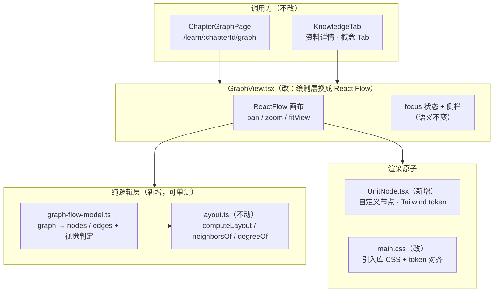
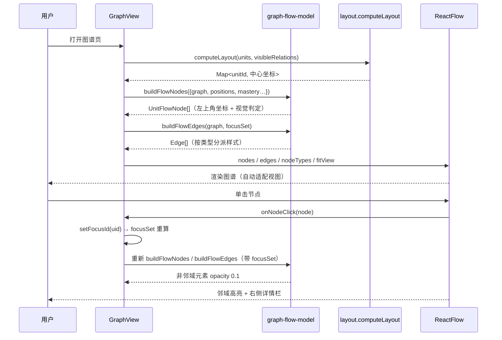

# 概念图谱改用 React Flow 绘制 技术方案

| 字段 | 内容 |
|------|------|
| 作者 | Agent |
| 日期 | 2026-09-13 |
| 状态 | 已实施（runbook：[knowledge-graph-react-flow-task-runbook](./knowledge-graph-react-flow-task-runbook.md)） |
| 关联需求 | 用户需求：「概念图谱改成用 react flow 绘制」；已确认 3 项决策（见 §2 待确认项） |

## 1. 背景

**触发原因**：用户要求把概念图谱的绘制层从自研 SVG 换成 React Flow。

**现状痛点**（`src/features/knowledge/GraphView.tsx`，394 行）：

1. **手势能力不成对**。文件顶部注释写着「拖拽平移 + 滚轮缩放」，但实现里**只有滚轮缩放**（`onWheel`，117–131 行）—— 没有任何 pan 逻辑。用户无法拖动画布，节点超出视口后只能靠缩小；且缩放锚点仅由滚轮指针决定，没有「适配视图」入口。
2. **DOM 层全手写**。节点、边、箭头 marker、缺口脉冲圈、导入高亮框、文本定位全部是手写 `<svg>` / `<rect>` / `<polygon>` / `<text>` 与手工坐标计算（含 `nodeWidth()` 这种「中文/英文混合标题宽度估算」）。任何视觉调整都要改坐标数学。
3. **颜色游离在 token 体系外**。`BAND_SVG`（42–47 行）、`TEXT_COLOR`（69 行）、边色 `#94a3b8` / `#cbd5e1` / `#a5b4fc`、缺口圈 `#6366f1`、高亮框 `#f59e0b` 全是硬编码 hex。`rules/react.mdc` 要求「避免散落新 hex、复用 `src/styles/main.css` 语义 token」，此处因为 SVG 需要具体色值而长期例外。
4. **不可访问 / 无键盘支持**。纯 SVG 分组没有焦点、没有 role、没有键盘导航。

**与现有产品的关系**：图谱有两个消费方，共用同一个 `GraphView` 组件 —— `ChapterGraphPage`（章概念图谱页，`/learn/:chapterId/graph`）与 `KnowledgeTab`（资料详情页「概念」Tab）。换组件内部实现，两处同时受益。

**不做的后果**：图谱仍是「能看不能动」，长到几十个节点时缩放体验很差；视觉与 token 体系的偏离继续扩大。

## 2. 方案目标

| 类型 | 描述 |
|------|------|
| **主要目标** | 把 `GraphView` 的绘制层换成 React Flow（`@xyflow/react` v12），获得内置平移/缩放/适配视图能力，同时**完整保留**现有三态语义、节点视觉语言与两个调用方的 props 契约 |
| **非目标** | ① 不改布局算法（沿用 `layout.ts` 的 `computeLayout` 力导向）；② 不改 focus 侧栏的信息架构与交互语义；③ 不加节点拖拽 / 连线编辑 / 节点增删（图是「读」的不是「画」的）；④ 不加 MiniMap；⑤ 不改 `ChapterGraphPage` / `KnowledgeTab` 的调用代码（props 契约不变）；⑥ 不改 AI 概念抽取链路（`pipelines` / `graph-engine`）；⑦ 不引入 dagre / elk 等新布局库 |
| **成功标准** | 见 §11.3 通过标准 |

**已确认的 3 项决策**（用户 2026-09-13 确认）：

| # | 决策点 | 选择 |
|---|--------|------|
| D1 | 交互语义 | **保留现有语义，禁用节点拖拽** —— React Flow 只接管画布能力（平移/缩放/适配），节点位置由布局算法决定 |
| D2 | 布局算法 | **沿用现有 `computeLayout` 力导向** —— 零新增依赖、确定性输出、≤50 节点够用 |
| D3 | 视觉与配件 | **保留现有视觉，配件只开 Background + Controls** —— 不开 MiniMap；节点语言（四色 / 缺口脉冲 / 导入琥珀虚线 / skill 菱形）全保留；顺带把硬编码 hex 换成语义 token |

## 3. 项目现状

### 3.1 相关代码与模块

| 路径 | 现状 |
|------|------|
| `src/features/knowledge/GraphView.tsx` | 394 行。自研 SVG 图谱：`onWheel` 缩放（无 pan）、`onClick` 聚焦、`onDoubleClick` 跳来源文档、右侧 focus 侧栏 + 关系清单 |
| `src/features/knowledge/layout.ts` | 152 行。纯函数：`computeLayout`（黄金角螺旋 seed + 斥力/弹簧/向心引力，240 次迭代，无随机，确定性）、`degreeOf`、`neighborsOf`、`GRAPH_W=760` / `GRAPH_H=520` |
| `src/features/knowledge/ChapterGraphPage.tsx` | 210 行。章概念图谱页，调 `<GraphView graph={chapterUnits} masteryByUnit requiredUnitIds onOpenDocument onReviewUnit />` |
| `src/features/learn/detail/KnowledgeTab.tsx` | 调 `<GraphView graph={subgraph} masteryByUnit requiredUnitIds />`（不传 onOpenDocument / onReviewUnit） |
| `src/styles/main.css` | 72 行。`:root` 定义 `--plos-*` 语义值，`@theme inline` 桥接 Tailwind 4 与 shadcn 角色 token |
| `src/components/primitives.tsx` | 提供 `BandBadge`（掌握度徽标，已消费 token） |
| `package.json` | 依赖克制：`mermaid` / `pdfjs-dist` / `react-markdown` / `zustand` 等；**无任何图编辑器类库** |

### 3.2 相关文档与约定

- `rules/react.mdc`：Tailwind 4 优先、复用 `src/styles/main.css` token、避免散落新 hex、「状态色仅用于 dot/徽标，不作整块背景」；第 20 行明确**不引入** antd / Radix / MUI / Emotion / styled-components / ahooks。
  - ⚠️ **合规说明**：React Flow 不在禁止清单内，且性质与已引入的 `mermaid` 一致（画布渲染引擎，非 UI 组件库），不替代 `components/ui/*`。`rules/react.mdc` 第 20 行的禁列表针对的是「UI 组件库与样式方案」，`@xyflow/react` 两者都不是。
- `rules/code-structure-and-dependencies`：文件 ≤700 行、依赖单向（domain→engine/ai/storage→stores→features）、≥10 行 × ≥3 处必抽取。
- `rules/engineering-code-style`：相对导入、中文注释、`import type`。
- `rules/no-headless-browser-validation`：**禁止主动启动浏览器校验**。本方案的测试策略据此设计 —— 可测逻辑必须抽成纯函数（见 §4.2），React Flow 的 DOM 渲染不纳入自动校验。
- `src/features/learn/detail/KnowledgeTab.tsx` / `ChapterGraphPage.tsx` 的既有 i18n 键（`m.knowledge.*`）全部复用，**本次不新增文案**。

### 3.3 约束与依赖

| 项 | 值 / 说明 |
|----|-----------|
| React | 19.2.8（React Flow v12 官方支持 React 19） |
| Vite | 8.2.2（库 CSS 走 Vite 原生 `import`） |
| Tailwind | 4.3.3（`@theme inline` + 任意变体语法，无 config 文件） |
| 新增依赖 | `@xyflow/react@^12.11.2`（MIT，约 9.8M 周下载；旧包名 `reactflow` 已弃用） |
| 画布尺寸 | 父容器必须有确定高度 —— 复用现有 `h-[320px] sm:h-[440px] lg:h-[560px]` |
| 浏览器 | 仅 Tauri WebView（无 SSR 需求；图谱页不参与 `renderToStaticMarkup` 单测） |
| 数据读写 | **无变化** —— 图谱数据仍由调用方从 `storage.getGraph()` 取得后以 props 传入；本次不新增任何持久化（见 §4.3） |

## 4. 技术架构

### 4.1 总体架构



**分层意图**：把「图谱数据 → 可视元素」的映射从组件里抽成**纯函数模块**（`graph-flow-model.ts`）。这是本方案的核心工程决策 —— 因为 React Flow 的渲染层属 DOM，受 `no-headless-browser-validation` 约束无法自动校验，而映射逻辑（坐标换算、视觉判定、边样式分派）恰恰是**最容易出错**的部分。抽出来后用项目现有的 node 直跑单测覆盖（`npm run test:flow`），把「无法测试」的面积压到最小。

### 4.2 模块职责

| 模块 | 职责 | 技术选型 |
|------|------|----------|
| `src/features/knowledge/graph-flow-model.ts`（新增） | 纯函数：`KnowledgeGraph` + 掌握度 + 缺口 + 高亮 + 焦点集 → React Flow 的 `Node[]` / `Edge[]`；含坐标换算（中心点→左上角）、宽度估算、视觉判定、边样式分派 | 纯 TS，零依赖，node 可直跑 |
| `src/features/knowledge/UnitNode.tsx`（新增） | React Flow 自定义节点组件：矩形/菱形 + 掌握度 token 配色 + 缺口脉冲圈 + 导入琥珀虚线框 + 标题 | React + Tailwind 4 token |
| `src/features/knowledge/GraphView.tsx`（改） | 组件外壳：`ReactFlow` + `Background` + `Controls`；focus 状态、`onNodeClick` / `onNodeDoubleClick` / `onPaneClick`；右侧侧栏与关系清单（逻辑原样保留） | React + `@xyflow/react` |
| `src/features/knowledge/layout.ts`（**不动**） | 力导向布局与图论工具 | 纯 TS |
| `src/styles/main.css`（改） | 对齐 token：画布背景、边默认色、Controls 按钮配色 | Tailwind 4 任意变体 + 少量覆盖 |
| `tests/graph-flow-model.test.ts`（新增） | 纯逻辑单测 | node `--experimental-strip-types` |

### 4.3 数据模型与 API

**新增类型（`graph-flow-model.ts` 导出）**

```ts
/** 自定义节点携带的数据（React Flow 要求 data 可序列化 / 索引访问）。 */
export interface UnitNodeData extends Record<string, unknown> {
  unit: KnowledgeUnit;
  mastery: number;
  band: Band;                 // 来自 engine.bandOf()
  isGap: boolean;             // required 且 mastery < GAP_THRESHOLD
  isHighlight: boolean;       // 导入后新写入
  width: number;              // 估算宽度（同时作为 node.width，保证布局与实际一致）
  title: string;              // unit.title，节点内直接渲染
}

export type UnitFlowNode = Node<UnitNodeData, "unit">;

/** 视觉档位（与 BandBadge 同源，见 §7.4 token 映射）。 */
export type NodeVisual = {
  shape: "diamond" | "round";
  fillClass: string;          // 如 "bg-state-mastered/10"
  borderClass: string;        // 如 "border-state-mastered"
  textClass: string;          // "text-ink-1"
};

export interface BuildFlowInput {
  graph: KnowledgeGraph;
  positions: Map<string, Point>;      // computeLayout 输出（中心点坐标）
  masteryByUnit: Record<string, number>;
  requiredUnitIds: readonly string[];
  highlightIds: readonly string[];
  focusSet?: ReadonlySet<string>;     // 有值时非成员置 0.1 透明度
}

export function buildFlowNodes(input: BuildFlowInput): UnitFlowNode[];
export function buildFlowEdges(
  graph: KnowledgeGraph,
  focusSet?: ReadonlySet<string>,
): Edge[];
export function nodeVisualOf(unit: KnowledgeUnit, mastery: number): NodeVisual;
export function isVisibleLink(type: RelationType): boolean;   // VISIBLE_LINK 集合外置
```

**关键约定（易错点，实施时必须遵守）**

1. **坐标换算是中心点 → 左上角**。`computeLayout` 返回节点**中心**坐标；React Flow 的 `node.position` 是**左上角**。必须 `x - width/2`、`y - NODE_H/2`。
2. **`node.width` 与布局估算强一致**。v12 中 `node.width` 作为 inline style 固定节点宽度。把 `nodeWidth(title)` 的结果同时用于布局与 `node.width`，才能让「布局假定的尺寸」与「实际渲染尺寸」相等，避免节点重叠。
3. **`nodeTypes` 必须定义在模块顶层**。定义在组件内会导致每次 render 生成新对象 → React Flow 无限重渲染。
4. **禁止原地修改 nodes/edges**。v12 不再支持 mutation，一律 spread 新建。
5. **`VISIBLE_LINK` 从组件移到模型层**，让「哪些关系画边」成为可单测的纯函数。

**数据读写（必填）**：**N/A —— 本次不涉及任何数据读写变更**。图谱数据流保持现状：

- 读：`ChapterGraphPage` / `KnowledgeTab` 各自经 `storage.getGraph()` / `storage.listChapters()` 取得 → 计算子图 → 以 props 传入 `GraphView`。新增的 `graph-flow-model.ts` 是**纯函数**，不碰 storage、不碰 store。
- 写：无。本次不新增持久化、不改 `TauriStorage.getGraph/saveGraph`、不改 `graph-engine`。
- 桌面能力：**不涉及** `invoke("vault_*" | "llm_*")`，无 `isTauri` 守卫需求。
- 符合 `rules/layer-import-boundaries`：UI 组件只消费 props，纯逻辑不依赖 React（`graph-flow-model.ts` 保持零 React 依赖）。

### 4.4 状态与副作用

| 状态 | 位置 | 说明 |
|------|------|------|
| `focusId` | `GraphView` 本地 `useState` | **不变**。单击节点设置，点空白清除 |
| `focusSet` | `useMemo(focusId, visibleRelations)` | **不变**。`neighborsOf` + 自身 |
| `positions` | `useMemo(graph.units, visibleRelations)` | **不变**。`computeLayout` 结果 |
| 视口（平移/缩放） | React Flow **内部** | 取代原 `view = {k, tx, ty}` 本地状态。缩放范围由 `minZoom={0.35}` / `maxZoom={2.4}` 约束（与原实现一致） |
| `nodes` / `edges` | `useMemo(buildFlowNodes/buildFlowEdges)` | 派生值，不存 state（因禁用拖拽，无需 `onNodesChange`） |

**副作用**：无新增。初次渲染由 `<ReactFlow fitView>` 自动适配视图；**不引入** `useReactFlow()`（故不需要 `ReactFlowProvider` 包裹）。

**props 契约**：`GraphViewProps` **完全不变**（`graph` / `masteryByUnit` / `requiredUnitIds` / `highlightIds?` / `onOpenDocument?` / `onReviewUnit?`），两个调用方零改动。

## 5. 交互流程

### 5.1 主流程

1. 宿主页面渲染 `<GraphView graph={subgraph} … />`。
2. `GraphView` 同步计算：`computeLayout` → `positions`；`focusSet`（初始 undefined）→ `buildFlowNodes` / `buildFlowEdges`。
3. React Flow 以 `fitView` 呈现全图；节点按掌握度四色、缺口节点带 indigo 脉冲外圈、导入新节点带琥珀虚线框。
4. 用户**滚轮**在画布上 → React Flow 内置缩放（以指针为锚，0.35×–2.4×）。
5. 用户**拖拽画布空白** → React Flow 内置平移（原实现缺失的能力）。
6. 用户**单击节点** → `onNodeClick` → `setFocusId(uid)` → `focusSet` 重算 → 非邻域节点与边降至 0.1 透明度；右侧展示该概念详情 + 关系清单。
7. 用户**单击画布空白** → `onPaneClick` → `setFocusId(undefined)` → 全图恢复不透明；侧栏回到引导态。
8. 用户**双击节点** → `onNodeDoubleClick` → 取 `unit.sourceDocumentId` → 调 `onOpenDocument(docId)`（`ChapterGraphPage` 传入：跳回章阅读页）。未传 `onOpenDocument` 或该概念无来源文档时**静默无操作**。
9. 侧栏「去复习」→ 优先调 `onReviewUnit(unitId)`（带章上下文），缺省回退 `/study/session?unit=`。**不变**。
10. 侧栏关系清单点击对端 → `setFocusId(对端)`。**不变**。

### 5.2 分支与异常流程

| 场景 | 触发条件 | 系统行为 | UI 反馈 |
|------|----------|----------|---------|
| 空图谱 | `graph.units.length === 0` | 早返回空态容器，**不挂载 React Flow** | 沿用调用方的空态（`KnowledgeTab` 的 `graphEmptyTitle` / `ChapterGraphPage` 的 `emptyTitle`）。组件内部兜底：渲染一个等高占位框 |
| 单节点无关系 | `units.length === 1`、`relations` 为空 | 正常渲染，无边 | `fitView` 会自动放大到合适倍率（受 `maxZoom` 限制） |
| 悬空关系（端点不在 units 内） | `positions.get(id)` 为空 | `buildFlowEdges` **丢弃该边** | 不画出幽灵边（与 `graph-split.ts` 的「诚实降级」一致） |
| 关系类型不在 `VISIBLE_LINK` | `example` / `contrast` / `application` / `source` | 不生成边 | 仍出现在侧栏关系清单（信息不丢失，**不变**） |
| 焦点节点被重算后消失 | `focusId` 引用的 unit 不在当前 `graph` 内 | `focusSet` 为 undefined（现有 `neighborsOf` 返回空集 + 自身，需加防护） | 全图正常显示，侧栏回引导态 |
| 容器高度为 0 | 父容器未给高度 | React Flow 不渲染 | **规避**：`GraphView` 根元素自带固定高度类名 |
| 窄屏 | < 640px | 高度 320px；侧栏堆叠到画布下方（`lg` 起才并排） | **不变** |

### 5.3 时序图



## 6. 用户用例（User Cases）

### UC-01：在章概念图谱页查看图谱

| 项 | 内容 |
|----|------|
| 角色 | 学习者 |
| 前置条件 | 已导入资料、已切章、该章已用 AI 提炼出概念（`hasConcepts` 为真） |
| 主流程步骤 | 1. 进入 `/learn/:chapterId/graph`；2. 页面渲染 `<GraphView graph={chapterUnits} …>`；3. 观察节点四色、缺口脉冲、边样式 |
| 期望结果 | 图谱**一次成型**（`fitView` 自动适配，无需手动缩放即可看全）；节点位置与改造前**力导向布局一致**（同一 `computeLayout`） |
| 异常/边界 | 未提炼概念 → 页面走既有空态卡片，不挂载图谱（`ChapterGraphPage` 已判断） |

### UC-02：在资料详情页概念 Tab 查看图谱

| 项 | 内容 |
|----|------|
| 角色 | 学习者 |
| 前置条件 | 资料已提取概念（`subgraph.units.length > 0`） |
| 主流程步骤 | 1. 进入资料详情 → 概念 Tab；2. 观察内嵌图谱（外层已有 `rounded-xl border border-line bg-surface p-2` 容器） |
| 期望结果 | 图谱在容器内正常渲染，高度 320/440/560px 响应式；**不传** `onOpenDocument` / `onReviewUnit`（双击与「去复习」缺省行为不变） |
| 异常/边界 | 无概念 → 沿用既有空态文案 |

### UC-03：单击节点聚焦一跳邻域

| 项 | 内容 |
|----|------|
| 角色 | 学习者 |
| 前置条件 | 图谱已渲染，节点数 ≥ 2 |
| 主流程步骤 | 1. 单击任一节点；2. 观察图面与右侧栏 |
| 期望结果 | 该节点与其一跳邻居保持不透明，其余节点**与边**降至 0.1；右侧栏显示标题、`BandBadge`、掌握度、摘要、操作按钮、关系清单 |
| 异常/边界 | 单击画布空白 → 清除聚焦，全图恢复（**注意**：React Flow 中拖拽平移不会误触发 `onPaneClick`，由库自行区分） |

### UC-04：双击节点跳来源文档

| 项 | 内容 |
|----|------|
| 角色 | 学习者 |
| 前置条件 | `ChapterGraphPage` 场景（传了 `onOpenDocument`），且该概念 `unit.sourceDocumentId` 存在 |
| 主流程步骤 | 1. 双击节点 |
| 期望结果 | 调用 `onOpenDocument(sourceDocumentId)` → 跳回章阅读页 |
| 异常/边界 | ① 未传 `onOpenDocument` → 静默无操作；② `sourceDocumentId` 为空 → 静默无操作；③ 双击**空白** → 无操作 |

### UC-05：平移与缩放画布

| 项 | 内容 |
|----|------|
| 角色 | 学习者 |
| 前置条件 | 图谱已渲染 |
| 主流程步骤 | 1. 在画布空白处按住拖拽 → 平移；2. 滚轮滚动 → 以指针为锚缩放；3. 点击 Controls 的「放大 / 缩小 / 适配视图」 |
| 期望结果 | 平移**流畅**（相对改造前为**新增能力**）；缩放范围限制在 0.35×–2.4×；「适配视图」一键回到全图 |
| 异常/边界 | 缩放到极限后继续滚动 → 无变化（不再超出范围） |

### UC-06：空图谱兜底

| 项 | 内容 |
|----|------|
| 角色 | 学习者 |
| 前置条件 | `graph.units` 为空（调用方通常已拦截，但组件自身也需兜底） |
| 主流程步骤 | 1. 传入空 graph |
| 期望结果 | 渲染等高占位容器，**不挂载 React Flow**（避免空画布带来的 `fitView` 异常与无谓渲染） |
| 异常/边界 | 仅 1 个节点、0 条边 → 正常渲染 |

## 7. 线框 UI（Wireframe）

### 7.1 GraphView — 默认状态（宽屏）

```
┌──────────────────────────────────────────────┬──────────────────┐
│  ┌────────────────────────────────────────┐  │ ［概念标题］  ［徽标］│
│  │                            ［操作提示］│  │ 概念 3 · 掌握 62% · 4 条│
│  │        ╭───────╮                       │  │ ［摘要 markdown］     │
│  │   ╭───▶│ 概念 A │───╮                   │  │                      │
│  │   │    ╰───────╯   │ (虚线箭头)        │  │ ［去复习］［看来源］   │
│  │   │  ◇ 概念 B      ▼                   │  │                      │
│  │   │（菱形=skill）（脉冲圈=缺口）        │  │ ── 关系 ──            │
│  │   ╰────▶ ╭───────╮ ┈┈▶ ╭───────╮        │  │ 概念 C      前置      │
│  │          │ 概念 C  │    │ 概念 D │        │  │ 概念 D      相关      │
│  │          ╰───────╯    ╰───────╯        │  │                      │
│  │              ┈┈（琥珀虚线框=新导入）     │  │                      │
│  │  ┌───┐                                 │  │                      │
│  │  │ + │  ← Controls（放大/缩小/适配）    │  │                      │
│  │  │ − │                                 │  │                      │
│  │  │ ⤢ │                                 │  │                      │
│  │  └───┘                                 │  │                      │
│  └────────────────────────────────────────┘  │                      │
│   ↑ Background 点阵                          │                      │
├──────────────────────────────────────────────┴──────────────────┤
│  窄屏（< 1024px）：侧栏堆叠到画布下方                              │
└─────────────────────────────────────────────────────────────────┘
```

- **布局**：外层 `flex flex-col gap-4 lg:flex-row`（不变）；画布容器 `min-w-0 flex-1`；侧栏 `w-full shrink-0 lg:w-72`（不变）。
- **画布高度**：`h-[320px] sm:h-[440px] lg:h-[560px]`（不变）。
- **组件映射**：`<ReactFlow>` + `<Background variant="dots">` + `<Controls showInteractive={false}>`；侧栏继续用内联 Tailwind（现状即如此，不引入 `Card` 以免视觉变化）。
- **设计 token**：见 §7.4。

### 7.2 空态 / 加载 / 错误

```
【空态】graph.units.length === 0
┌──────────────────────────────────────────┐
│  （等高占位框 · border-dashed · border-line）│
└──────────────────────────────────────────┘
→ 调用方通常已用自己的空态卡片拦截；组件内兜底仅为防御。

【无关系】units ≥ 1 且 relations 为空
→ 正常渲染节点，无边；侧栏显示 k.noRelations。

【焦点失效】focusId 不在当前 graph 内
→ focusSet = undefined，全图正常显示（防御性处理）。
```

- 加载态：**不适用** —— `GraphView` 是纯展示组件，数据由调用方异步取好后传入，组件内无异步。
- 错误态：**不适用** —— 组件内无可失败操作（AI 抽取在调用方，有各自的错误 UI）。

### 7.3 交互说明

| 交互 | 触发 | 行为 |
|------|------|------|
| 单击节点 | `onNodeClick` | 聚焦一跳邻域 + 侧栏详情 |
| 双击节点 | `onNodeDoubleClick` | 跳来源文档（仅 `ChapterGraphPage`） |
| 单击空白 | `onPaneClick` | 清除聚焦 |
| 拖拽空白 | React Flow 内置 pan | 平移画布（**新增**） |
| 滚轮 | React Flow 内置 zoom | 指针为锚缩放，0.35–2.4× |
| 悬停节点 | CSS | `cursor-grab` → 因禁用拖拽，改为 `cursor-pointer` |
| 键盘可达性 | React Flow 内置 | 节点可获得焦点（`elementsSelectable={false}` 时仅以 `tabIndex` 可达；如需完整键盘导航可后续开启） |

### 7.4 颜色：hex → token 映射（决策 D3）

| 用途 | 改造前 hex | 改造后 token | 备注 |
|------|-----------|--------------|------|
| 节点填充 · 未开始 | `#f8fafc` | `bg-surface` | 中性 |
| 节点边框 · 未开始 | `#cbd5e1` | `border-line` | |
| 节点填充 · 学习中 | `#fef2f2` | `bg-state-learning/10` | 由 token 派生浅色 |
| 节点边框 · 学习中 | `#f87171` | `border-state-learning` | |
| 节点填充 · 熟练 | `#fffbeb` | `bg-state-weak/10` | |
| 节点边框 · 熟练 | `#fbbf24` | `border-state-weak` | |
| 节点填充 · 已掌握 | `#ecfdf5` | `bg-state-mastered/10` | |
| 节点边框 · 已掌握 | `#34d399` | `border-state-mastered` | |
| 节点标题 | `#334155` | `text-ink-1` | |
| 缺口脉冲圈 | `#6366f1` | `border-primary` / `ring-primary` | 与 `--plos-primary` 完全一致 |
| 导入高亮框 | `#f59e0b` | `border-state-weak`（虚线） | 琥珀语义一致 |
| 边 · prerequisite | `#94a3b8` 虚线箭头 | `stroke: var(--plos-ink-3)` | 虚线 `5 4`，`markerEnd` 箭头 |
| 边 · related | `#a5b4fc` 实线 | `stroke: var(--plos-primary)` + `opacity .5` | |
| 边 · parent / child | `#cbd5e1` 细实线 | `stroke: var(--plos-line)` | |
| 箭头 marker | `#94a3b8` | `var(--plos-ink-3)` | |
| 画布背景 | 无（白底） | `color="var(--plos-line)"` 点阵 | |
| Controls 按钮 | 库默认 | `bg-surface` + `border-line` + `text-ink-2` | 经 Tailwind 任意变体覆盖 |

> **视觉差异声明**：`state-*` token 的色值比原 SVG hex 略深（例如 mastered 边 `#34d399` → `#059669`）。这是「状态色统一到 token 体系」的必然结果，符合 `rules/react.mdc`；若实际观感过重，回退手段是把 `border-state-*` 改回浅色变体（如 `border-state-mastered/40`），**不改 token 定义**。

## 8. 涉及文件及改动伪代码

### 8.1 `package.json`（修改）

**改动说明**：新增运行时依赖与测试脚本。

```jsonc
{
  "dependencies": {
    "@xyflow/react": "^12.11.2"          // 新增
  },
  "scripts": {
    "test:flow": "node --experimental-strip-types --no-warnings --import ./tests/register-loader.mjs tests/graph-flow-model.test.ts"  // 新增
  }
}
```

### 8.2 `src/styles/main.css`（修改）

**改动说明**：引入 React Flow 基础样式；局部对齐 token（只覆盖 props 够不到的部分）。

```css
/* 顶部新增：第三方画布库基础样式（Vite 原生解析 bare specifier） */
@import "@xyflow/react/dist/style.css";

/* 末尾新增：React Flow 中性规则对齐 PLOS token（颜色值仍只在此文件定义） */
.react-flow__attribution {
  background: transparent;
  color: var(--plos-ink-3);
}
.react-flow__controls-button {
  background: var(--plos-surface);
  border-bottom: 1px solid var(--plos-line);
  color: var(--plos-ink-2);
}
.react-flow__controls-button:hover {
  background: var(--plos-subtle);
}
.react-flow__node {
  font-family: inherit;
}
```

> ⚠️ **风险与回退**：若 Vite 无法解析 `@import "@xyflow/react/dist/style.css"` 的 bare specifier，改为在 `GraphView.tsx` 顶部 `import "@xyflow/react/dist/style.css";`（Vite 对 JS 侧 CSS import 支持确定）。

### 8.3 `src/features/knowledge/graph-flow-model.ts`（新增，约 150 行）

**改动说明**：把「图谱 → React Flow 元素」的全部映射收成纯函数，零 React 依赖以便 node 直跑单测。

```ts
/**
 * 图谱 → React Flow 元素映射（纯函数，可 node 直跑单测）。
 *
 * 关键不变量：
 *  1. node.position 是节点【左上角】，而 computeLayout 给的是【中心点】→ 必须减去半个宽高；
 *  2. node.width 必须与布局使用的估算宽度一致，否则实际渲染尺寸与布局假定不符，节点会重叠；
 *  3. 端点不在 positions 内的边一律丢弃（悬空边不入图）。
 */
import type { Edge, Node } from "@xyflow/react";
import type { KnowledgeGraph, KnowledgeRelation, KnowledgeUnit, RelationType } from "../../domain";
import type { Point } from "./layout";

/** 图谱中绘制为边的关系类型（其余类型仅在侧栏文本呈现）。 */
const VISIBLE_LINK: ReadonlySet<RelationType> = new Set([
  "prerequisite", "related", "parent", "child",
]);

export const NODE_H = 32;
export const NODE_R = 9;
export const DIM_OPACITY = 0.1;

export function isVisibleLink(type: RelationType): boolean {
  return VISIBLE_LINK.has(type);
}

/** 中文/英文混合标题的粗略宽度估算（自 GraphView 迁入，行为不变）。 */
export function nodeWidth(title: string): number {
  const w = [...title].reduce((acc, ch) => acc + (ch.charCodeAt(0) > 255 ? 13 : 7.5), 0) + 22;
  return Math.min(170, Math.max(64, w));
}

export function nodeVisualOf(unit: KnowledgeUnit, mastery: number): NodeVisual {
  const band = bandOf(mastery);                    // engine.bandOf（纯函数）
  return {
    shape: unit.kind === "skill" ? "diamond" : "round",
    ...TOKEN_BY_BAND[band],                        // 见 §7.4 映射表
  };
}

export interface BuildFlowInput { /* 见 §4.3 */ }

export function buildFlowNodes(input: BuildFlowInput): UnitFlowNode[] {
  const { graph, positions, masteryByUnit, requiredUnitIds, highlightIds, focusSet } = input;
  return graph.units.flatMap((unit) => {
    const p = positions.get(unit.id);
    if (!p) return [];                             // 无坐标 → 不渲染（与旧实现一致）
    const mastery = masteryByUnit[unit.id] ?? 0;
    const width = nodeWidth(unit.title);
    return [{
      id: unit.id,
      type: "unit",
      // 中心点 → 左上角
      position: { x: p.x - width / 2, y: p.y - NODE_H / 2 },
      width,                                       // 与布局估算一致（不变量 2）
      data: {
        unit, mastery, band: bandOf(mastery), width, title: unit.title,
        isGap: requiredUnitIds.includes(unit.id) && mastery < GAP_THRESHOLD,
        isHighlight: highlightIds.includes(unit.id),
      },
      // 淡出：非焦点邻域成员
      style: { opacity: focusSet && !focusSet.has(unit.id) ? DIM_OPACITY : 1,
               transition: "opacity 150ms ease" },
      draggable: false,                            // D1
      selectable: false,
    }];
  });
}

export function buildFlowEdges(graph: KnowledgeGraph, focusSet?: ReadonlySet<string>): Edge[] {
  return graph.relations
    .filter((r) => isVisibleLink(r.type))
    .map((r) => {
      const dimmed = focusSet && (!focusSet.has(r.fromId) || !focusSet.has(r.toId));
      return {
        id: r.id,
        source: r.fromId,
        target: r.toId,
        type: "straight",
        style: edgeStyleOf(r.type, dimmed),
      };
    });
}

/** 边样式分派（可单测：类型 → 描边/虚线/箭头）。 */
export function edgeStyleOf(type: RelationType, dimmed?: boolean): CSSProperties { /* … */ }
```

### 8.4 `src/features/knowledge/UnitNode.tsx`（新增，约 70 行）

**改动说明**：React Flow 自定义节点。用 Tailwind token 类重组原 SVG 的视觉语言。

```tsx
/**
 * 图谱节点（React Flow 自定义节点）。
 * 视觉对齐改造前的 SVG：掌握度四色 + 缺口脉冲圈 + 导入琥珀虚线框 + skill 菱形。
 */
import { memo } from "react";
import { Handle, Position, type NodeProps } from "@xyflow/react";
import { isVisibleLink } from "./graph-flow-model";   // 只读常量用途
import type { UnitFlowNode } from "./graph-flow-model";

function UnitNodeImpl({ data }: NodeProps<UnitFlowNode>) {
  const { unit, width, isGap, isHighlight, title } = data;
  const v = nodeVisualOf(unit, data.mastery);
  const diamond = v.shape === "diamond";

  return (
    <div className="relative flex items-center justify-center" style={{ width, height: NODE_H }}>
      {/* 缺口脉冲圈：外扩 6px */}
      {isGap ? (
        <span className="pointer-events-none absolute -inset-1.5 animate-pulse rounded-full border-2 border-primary" />
      ) : null}
      {/* 导入高亮：外扩 7px 琥珀虚线 */}
      {isHighlight ? (
        <span className="pointer-events-none absolute -inset-[7px] rounded-[15px] border-2 border-dashed border-state-weak" />
      ) : null}
      {/* 主体：round = 圆角矩形；diamond = 旋转 45° 的方块（内文反向旋转） */}
      <span className={cx(
        "absolute inset-0 border-2",
        diamond ? "rotate-45 rounded-[6px]" : "rounded-[9px]",
        v.fillClass, v.borderClass,
      )} />
      <span className={cx("relative z-10 truncate px-2 text-[12.5px] font-medium", v.textClass)}>
        {title}
      </span>
    </div>
  );
}

export default memo(UnitNodeImpl);
```

> **不加 `<Handle>`**：本图不允许连线（`nodesConnectable={false}`），React Flow 直接用节点边界作为边的锚点。

### 8.5 `src/features/knowledge/GraphView.tsx`（修改，预计 394 → 约 330 行）

**改动说明**：绘制层换成 React Flow；focus / 侧栏 / 关系清单逻辑**原样保留**；`VISIBLE_LINK` / `nodeWidth` / `BAND_SVG` / `TEXT_COLOR` 迁往 `graph-flow-model.ts` 与 `UnitNode.tsx`。

```tsx
import { useMemo, useState } from "react";
import {
  Background, BackgroundVariant, Controls, ReactFlow,
  type NodeTypes,
} from "@xyflow/react";
import "@xyflow/react/dist/style.css";   // 若 main.css 的 @import 可行则删掉此行
import { buildFlowEdges, buildFlowNodes, isVisibleLink } from "./graph-flow-model";
import UnitNode from "./UnitNode";

/** ⚠️ 必须定义在组件外：定义在组件内会导致每次 render 生成新对象 → 无限重渲染。 */
const nodeTypes: NodeTypes = { unit: UnitNode };

export default function GraphView({ graph, masteryByUnit, requiredUnitIds,
  highlightIds = [], onOpenDocument, onReviewUnit }: GraphViewProps) {
  const [focusId, setFocusId] = useState<string | undefined>();

  const visibleRelations = useMemo(
    () => graph.relations.filter((r) => isVisibleLink(r.type)), [graph.relations]);
  const positions = useMemo(() => computeLayout({ units: graph.units, relations: visibleRelations }),
    [graph.units, visibleRelations]);
  const focusSet = useMemo(() => {
    if (!focusId) return undefined;
    const set = neighborsOf(visibleRelations, focusId);
    set.add(focusId);
    return set;
  }, [focusId, visibleRelations]);

  const nodes = useMemo(() => buildFlowNodes({
    graph, positions, masteryByUnit, requiredUnitIds, highlightIds, focusSet,
  }), [graph, positions, masteryByUnit, requiredUnitIds, highlightIds, focusSet]);
  const edges = useMemo(() => buildFlowEdges(graph, focusSet), [graph, focusSet]);

  const focusUnit = focusId ? graph.units.find((u) => u.id === focusId) : undefined;
  const focusRelations = focusId ? relationsOf(graph, focusId) : [];

  // 空图谱兜底：不挂载 React Flow
  if (graph.units.length === 0) {
    return <div className="h-[320px] rounded-xl border border-dashed border-line sm:h-[440px] lg:h-[560px]" />;
  }

  return (
    <div className="flex flex-col gap-4 lg:flex-row">
      <div className="relative min-w-0 flex-1 overflow-hidden rounded-xl border border-line bg-surface">
        <ReactFlow
          nodes={nodes}
          edges={edges}
          nodeTypes={nodeTypes}
          fitView
          fitViewOptions={{ padding: 0.15 }}
          minZoom={0.35}
          maxZoom={2.4}
          nodesDraggable={false}        /* D1 */
          nodesConnectable={false}
          elementsSelectable={false}
          onNodeClick={(_, n) => setFocusId(n.id)}
          onNodeDoubleClick={(_, n) => {
            const u = graph.units.find((x) => x.id === n.id);
            if (u?.sourceDocumentId && onOpenDocument) onOpenDocument(u.sourceDocumentId);
          }}
          onPaneClick={() => setFocusId(undefined)}
          proOptions={{ hideAttribution: true }}
          className="h-[320px] sm:h-[440px] lg:h-[560px]"
        >
          <Background variant={BackgroundVariant.Dots} gap={16} size={1} color="var(--plos-line)" />
          <Controls showInteractive={false} className="[&>button]:border-line [&>button]:bg-surface [&>button]:text-ink-2" />
        </ReactFlow>
        {/* 操作提示（顶部角标）：原样保留 */}
      </div>
      <aside className="w-full shrink-0 lg:w-72">{/* 侧栏：原样保留 */}</aside>
    </div>
  );
}
```

> `proOptions={{ hideAttribution: true }}` —— React Flow 默认在右下角渲染 "React Flow" 水印。此处隐藏以保持图面干净（如需保留署名，删掉该行即可；Controls 在左下，不冲突）。

### 8.6 `tests/graph-flow-model.test.ts`（新增）

**改动说明**：纯逻辑单测，覆盖坐标换算、视觉判定、边分派与边界（用例见 §12）。

```ts
import { check, assertEqual } from "./harness";  // 沿用 tests/ 既有断言风格
import { buildFlowNodes, buildFlowEdges, nodeWidth, nodeVisualOf, isVisibleLink } from "../src/features/knowledge/graph-flow-model";

await check("TC-FLOW-01 中心点 → 左上角换算", () => { /* … */ });
await check("TC-FLOW-02 关系类型过滤", () => { /* … */ });
// …
```

### 8.7 不改动的文件（明确列出，防止范围蔓延）

`src/features/knowledge/layout.ts`、`ChapterGraphPage.tsx`、`src/features/learn/detail/KnowledgeTab.tsx`、`src/engine/graph-engine.ts`、`src/storage/*`、`src/i18n/messages/*`、`src/domain/*`。

## 9. 任务清单（Tasks）

| ID | 任务 | 依赖 | 复杂度 |
|----|------|------|--------|
| T1 | 安装 `@xyflow/react`；`main.css` 引入库样式 + 中性规则对齐 token | — | S |
| T2 | 新增 `graph-flow-model.ts`（映射纯函数 + 视觉判定 + 边分派） | — | M |
| T3 | 新增 `UnitNode.tsx`（自定义节点，token 化视觉） | T2 | M |
| T4 | 改造 `GraphView.tsx` 画布层（ReactFlow + Background + Controls + 空态兜底） | T2, T3 | M |
| T5 | 新增 `tests/graph-flow-model.test.ts` + `test:flow` 脚本 | T2 | M |
| T6 | 全量验证（typecheck + `test:flow` + 既有回归） | T1–T5 | S |
| T7 | 文档同步（本方案状态改「已实施」+ 详情页设计文档图谱段） | T6 | S |
| T8 | 提交 | T6, T7 | S |

## 10. 实施步骤

1. **步骤 1（T1）**：`npm install @xyflow/react`（会改 `package.json` + `package-lock.json`）；在 `main.css` 顶部加 `@import`，末尾加中性规则覆盖。
   - 验证：`npm run typecheck` 通过；`npm run dev` 无 CSS 解析报错（**由用户自行观察**，遵守 `no-headless-browser-validation`）。
2. **步骤 2（T2）**：实现 `graph-flow-model.ts`，把 `VISIBLE_LINK` / `nodeWidth` / `BAND_SVG` 的等价物 / `TEXT_COLOR` 迁入并 token 化。
   - 输入/输出：§4.3 的接口。
   - 验证：`npm run typecheck`。
3. **步骤 3（T3）**：实现 `UnitNode.tsx`。
4. **步骤 4（T4）**：改造 `GraphView.tsx`。**侧栏 JSX 整段不动**，只替换画布部分。
5. **步骤 5（T5）**：写单测 + 挂 `test:flow`。
   - 验证：`npm run test:flow` 全绿。
6. **步骤 6（T6）**：`npm run typecheck` + `test:flow` + `test:render` / `test:graph` / `test:library` 回归。
7. **步骤 7（T7）**：更新本方案状态与 `docs/library-detail-page-design-2026-09.md` 的图谱段。
8. **步骤 8（T8）**：按 `rules/commit-conventions` 提交（建议 `feat(knowledge)` + `docs(knowledge)` 两条）。

**回滚策略**：改动集中在 4 个文件（`GraphView.tsx` 是唯一被修改的既有源文件），`git revert` 本次提交即可还原；`@xyflow/react` 依赖可保留（不影响构建）。`layout.ts` 与两个调用方零改动，回滚面很小。

## 11. 测试方案

### 11.1 测试范围与策略

| 层级 | 工具/方式 | 覆盖重点 | 不负责 |
|------|-----------|----------|--------|
| 单元 | `tests/graph-flow-model.test.ts`（node 直跑，`npm run test:flow`） | 坐标换算、宽度估算、视觉档位判定、关系过滤、边样式分派、悬空边丢弃、空输入 | React 组件渲染 |
| 静态 | `npm run typecheck` | 类型契约（`Node` / `Edge` / `NodeProps` 泛型、props 不变） | 运行时行为 |
| 回归 | `test:render` / `test:graph` / `test:library` | 确认未波及相邻模块 | — |
| 手工 | 用户在 `npm run dev` 中自查 | React Flow 实际渲染、手势手感、token 视觉 | **不做浏览器自动化** （`rules/no-headless-browser-validation`） |

### 11.2 测试环境与数据

- 沿用 `tests/register-loader.mjs` + `--experimental-strip-types`，不引测试框架。
- fixture：内联构造的 `KnowledgeGraph`（3 节点 2 边、单节点零边、空图、悬空边、四种关系类型各一）。
- 注意：`graph-flow-model.ts` 需要 `domain` 与 `engine` 的纯函数（`bandOf`），二者均无 React / DOM 依赖，node 可直跑。
- ⚠️ **不可在模型层 import `@xyflow/react` 的运行时值**（会拉入 DOM 依赖）；`Node` / `Edge` 一律 `import type`。这是保证单测可跑的硬约束。

### 11.3 通过标准

1. `npm run typecheck`：本任务文件 **0 error**（允许 `AIModelsSection.tsx` 的 HEAD 既存 TS6133）。
2. `npm run test:flow`：全绿。
3. 既有回归 `test:render` / `test:graph` / `test:library`：全绿。
4. `GraphViewProps` **未变**（两个调用方零改动即编译通过）。
5. 所触及源文件均 ≤700 行。
6. 用户手工确认：平移流畅、缩放范围正确、单击聚焦/双击跳转行为与改造前一致、节点视觉可接受。

## 12. 测试用例

| ID | 关联 UC | 操作 | 期望结果 | 类型 |
|----|---------|------|-----------|------|
| TC-FLOW-01 | UC-03 | `computeLayout` 给中心点 `(100, 80)`、宽度 64 → `buildFlowNodes` | `position === { x: 100 - 32, y: 80 - 16 }` | 单元 |
| TC-FLOW-02 | UC-01 | 关系含 `prerequisite` / `related` / `parent` / `example` | 只生成前三条边，`example` 无对应 Edge | 单元 |
| TC-FLOW-03 | UC-01 | `unit.kind === "skill"` | `nodeVisualOf().shape === "diamond"`；否则 `"round"` | 单元 |
| TC-FLOW-04 | UC-03 | `requiredUnitIds` 含 A、A 的 mastery = 0.5 | A 的 `isGap === true`；mastery = 0.8 → `false` | 单元 |
| TC-FLOW-05 | UC-03 | `focusSet = {A, A的邻居}` | 非成员节点与边 `opacity === 0.1`；成员为 1 | 单元 |
| TC-FLOW-06 | UC-01 | 边端点之一不在 `graph.units` 内 | 该 Edge 不存在 | 单元 |
| TC-FLOW-07 | UC-06 | `graph.units = []` | `buildFlowNodes` → `[]`；`buildFlowEdges` → `[]` | 单元 |
| TC-FLOW-08 | UC-05 | 三种关系类型 | `edgeStyleOf` 分别返回：虚线+箭头 / 实线 / 细线 | 单元 |
| TC-FLOW-09 | UC-01 | 标题 `"学"` vs `"abcdefghij"` | `nodeWidth` 落在 `[64, 170]`；中文宽于同长度英文 | 单元 |
| TC-FLOW-10 | UC-02 | `highlightIds = [B]` | 仅 B 的 `isHighlight === true` | 单元 |

### 12.1 边界与回归

| ID | 场景 | 期望 |
|----|------|------|
| TC-EDGE-01 | 单节点、零关系 | `buildFlowNodes` 返回 1 项，`buildFlowEdges` 返回 `[]` |
| TC-EDGE-02 | `positions` 缺少某 unit | 该 unit 不生成节点（不抛错） |
| TC-EDGE-03 | `masteryByUnit` 缺 key | mastery 取 0 → `not-started` 档 |
| TC-EDGE-04 | `focusId` 引用已被移除的 unit | `focusSet` 不导致崩溃；节点/边 opacity 均为 1 |
| TC-EDGE-05 | `nodeWidth` 极长中英混合标题 | 钳制在 170 |
| TC-EDGE-06 | `GraphViewProps` 契约 | 两个调用方文件**零改动**即通过 typecheck |
| TC-EDGE-07 | 模型层不引入 DOM 依赖 | `graph-flow-model.ts` 仅 `import type` React Flow → `test:flow` 能 node 直跑 |
| TC-EDGE-08 | 文件行数 | 所有触及文件 ≤700 行 |

---

## 变更记录

| 日期 | 变更 | 作者 |
|------|------|------|
| 2026-09-13 | 初稿（基于用户需求 + 3 项已确认决策 D1/D2/D3） | Agent |
| 2026-09-13 | 已实施。实施偏差三处（记录于 runbook T2 Notes）：① `NodeVisual` 返回 token 派生 CSS 值而非 Tailwind class（节点主体用内嵌 SVG 精确复刻扁菱形）；② 箭头 marker 由组件层注入（模型层不得 import `MarkerType` 运行时值）；③ `UnitNodeData` 用 type alias 满足 `Record<string, unknown>` 约束。依赖装至 `^12.11.6` | Agent |
