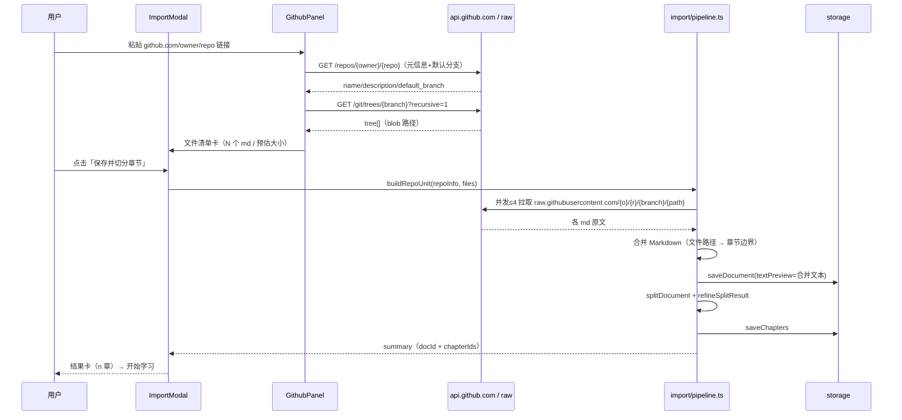

# 知识库多来源导入（GitHub 仓库 / 本地 PDF / 本地 MD）技术方案

| 字段 | 内容 |
|------|------|
| 作者 | Agent（WorkBuddy） |
| 日期 | 2026-09-09 |
| 状态 | 已确认 · 执行中（2026-09-09，runbook: `docs/knowledge-import-task-runbook.md`） |
| 关联需求 | 用户需求：知识库需支持导入 GitHub 连接与本地 PDF、MD 文件 |
| 决策依据 | 用户已确认：GitHub「整库导入为主」· 仅公开仓库 · 文本型 PDF（无 OCR）· Tauri 桌面优先（浏览器预览降级） |

---

## 1. 背景

### 1.1 业务痛点

「资料库」（`/learn`，V2 章节化学习主入口）目前只有**一种**入库方式：全局「＋导入资料」弹窗（`ImportModal`）**粘贴正文**，支持 `markdown / note / web / txt` 四种格式标记。用户的知识原材料大量存在于：

1. **本地文件**——电脑里的 `.pdf`（书、论文、报告）与 `.md` 笔记，无法选择文件导入，只能手工复制粘贴进文本框；
2. **GitHub 仓库**——开源学习仓库（教程、awesome 清单、技术书稿），无法一键把整库 `md` 变为可学习章节。

域模型 `SourceDocument` 早已预留 `format: "pdf"`、`path`、`uri` 字段，但从未有 UI 与管道消费它们。产品 README 宣称支持格式含 **PDF · Markdown · TXT**，当前属于「声明了但未实现」。

### 1.2 触发原因

- Phase 0 / Pre-MVP 验收准备：MVP 成功标准第一条即「用户能导入一本技术书 → 自动构建知识体系」。本地 PDF 导入是该路径的事实入口。
- 用户真实工作流：以 GitHub 仓库 + 本地资料为学习素材（本仓库即个人学习 OS），整库导入能显著降低入库成本。

### 1.3 与现有模块的关系

| 模块 | 关系 |
|------|------|
| `src/features/learn/ImportModal.tsx` | **主改造对象**：从「单来源（粘贴）表单」升级为「多来源向导」 |
| `src/engine/splitter-engine.ts` | 复用不变：`splitDocument(input{text,format})` 只消费文本，新来源在**上游**归一化为文本 |
| `src/ai/pipelines.ts`（`refineSplitResult`） | 复用不变：导入管道保持 AI 精修可选、失败静默回退 |
| `src/domain/document.ts` | 复用不变：`format: "pdf"` 已存在；`source`/`uri` 字段记录出处 |
| `src/storage/*` | 复用不变：文档正文继续存 `textPreview`（localStorage 占位后端） |
| `src/i18n/*` | 新增来源相关双语文案（zh/en） |

> 架构约束（`rules/layer-import-boundaries.mdc`）：解析/来源归一化是**纯前端适配层**（`src/features/learn/import/`），不触碰 `src-tauri`；`src/engine` 保持纯 TS 不引入 PDF/GitHub 依赖；持久化仍只经 `src/storage`。

### 1.4 不做的影响

本地文件与 GitHub 素材只能靠复制粘贴 → 大文件（PDF）无法入库、多文件仓库入库成本极高 → MVP「导书即学」验收路径断裂。

---

## 2. 方案目标

| 类型 | 描述 |
|------|------|
| **主要目标** | 资料库新增三条导入路径：① 本地 `.md` 文件；② 本地文本型 `.pdf`（抽取为纯文本）；③ GitHub 公开仓库（整库/子目录/单文件，抽取全部 Markdown 合并为一份可切分资料）。三者最终都进入现有「保存 → 切分 → AI 精修 → 建章」管道，用户可立即逐章学习。 |
| **非目标（本次不做）** | ① PDF **扫描件 OCR**；② GitHub **私有仓库 / token**；③ docx/epub/html 本地文件；④ 图片/代码文件入库；⑤ 仓库**增量同步与更新跟踪**（本次为一次性快照导入）；⑥ Rust 原生对话框/文件路径持久化引用（列入 P2 演进）；⑦ 拖拽上传（列入 P1）。 |
| **成功标准** | ① 一个文本型 PDF 选择后自动出章节并可进入阅读；② 一个含多 `.md` 的 GitHub 公开仓库贴链接 → 预览文件清单 → 合并导入 → `/learn` 出现该仓库资料、章节按仓库结构切分；③ 粘贴入口与现状行为完全一致（回归）；④ 全程 typecheck 0 error；⑤ 中英文案齐平（`test:i18n` 通过）。 |

---

## 3. 项目现状

### 3.1 相关代码与模块

| 位置 | 现状 | 影响 |
|------|------|------|
| `src/features/learn/ImportModal.tsx`（约 390 行） | 单表单：标题 + 正文 textarea + 格式下拉 + 五阶段进度 + 单份结果卡；`splitAndPreview` 内联实现 save → `splitDocument` → `refineSplitResult` → `saveChapters` | 管道逻辑将被抽到 `import/pipeline.ts` 复用；组件改为「来源 Tab + 复用结果卡」 |
| `src/components/layout/AppShell.tsx` | 全局挂载 `ImportModal`，`onImported(docId, chapterIds)` 跳转首章；`onInspect` 回 `/learn` | 批量导入完成后需新增跳转语义（回资料库目录） |
| `src/engine/splitter-engine.ts` | 纯文本 → Chapter；`markdown` 按 `#/##` 切，`txt` 段落聚类；`auto` 探测 | PDF 抽取文本用 `txt/auto`；GitHub 合并文本用 `markdown` |
| `src/domain/document.ts` | `DocumentFormat` 含 `pdf`；`SourceDocument.path/uri/source` 存在但未用 | 本地 PDF：`format:"pdf"`；GitHub：`source`=仓库 URL |
| `src/storage/local.ts` | localStorage 占位后端，文档正文存 `textPreview` | 单份文本上限约束（见 §3.3） |
| `src/i18n/messages/{zh,en}.ts` | `learn.import` 现有 30+ key；`m.learn.import` 为弹窗文案 | 新增来源 tab / 文件 / GitHub 预览文案 |
| `package.json` | 前端依赖无 PDF/压缩库 | 需新增 `pdfjs-dist` |

### 3.2 相关文档与约定

- `README.md`：格式声明含 PDF · Markdown；Phase 0 说明 storage 为占位实现。
- `docs/learning-system-v2-design-2026-09.md`：章节化学习 V2；`Chapter.contentRef` 引用 `doc.textPreview` 字符区间（新来源正文写入 `textPreview` 即天然兼容）。
- `docs/ui-workbench-plan-2026-09.md`：U5 五阶段进度与结果卡设计（本次保留其观感）。
- `rules/layer-import-boundaries.mdc`：**UI 不得 import `src-tauri`**；桌面能力仅经 `invoke`；引擎保持纯 TS。本次 P0 不新增任何 Tauri 命令，天然合规。
- `skills/pre-task-technical-design`：本方案即按该 skill 工作流产出。

### 3.3 约束与依赖

| 约束 | 说明 | 对策 |
|------|------|------|
| **存储容量（最高优先）** | 当前后端 localStorage（单域约 5–10MB），整份正文在 `textPreview`；SQLite/文件后端属后续里程碑 | 导入体积护栏：本地 md ≤ 1MB/个；PDF ≤ 30MB/个；GitHub 合并文本 ≤ 1.5M 字符（超限给出明确错误，见 §5.2） |
| **PDF 文本抽取依赖** | 文本型 PDF 需前端解析库 | 引入 `pdfjs-dist`（官方 PDF.js），纯前端、桌面 WebView 与浏览器预览一致 |
| **GitHub 公开访问** | `api.github.com` 未认证限流 60 次/时/IP；`raw.githubusercontent.com` 与 `api.github.com` 均支持 CORS | 树接口仅 1 次请求；单文件走 raw CDN 并发上限 4；文件数护栏 |
| **桌面 vs 浏览器** | Tauri 桌面优先；WebView 完整支持 `<input type=file>` 与 File API | 同一套前端适配层两端可用；真实磁盘路径引用、原生对话框属 P2 Rust 增强 |
| **Node/构建** | node ≥22、Vite 8、TS 7、typecheck 门禁 | `pdfjs-dist` worker 用 `new URL(..., import.meta.url)` 运行时解析，不依赖额外构建插件 |

---

## 4. 技术架构

### 4.1 总体架构

核心思路：**来源归一化（front-end adapter layer）→ 现有导入管道（unchanged）**。所有新来源在 UI 层产出一个统一中间结构 `ImportUnit { title, format, text, source }`，之后与「粘贴」走同一条 `save → split → refine → saveChapters` 管线；引擎、存储、域模型零改动。

```mermaid
flowchart TB
  subgraph Sources["来源（新增 · src/features/learn/import/）"]
    P[粘贴 Markdown<br/>现状表单]
    F[本地文件<br/>md → File.text()<br/>pdf → pdf.js 抽文本]
    G[GitHub<br/>树 API + raw 拉取<br/>合并为 Markdown]
  end
  subgraph Adapter["归一化 ImportUnit {title, format, text, source}"]
    U[ImportUnit]
  end
  subgraph Pipeline["共享管道（抽取自现状 ImportModal）"]
    S[storage.saveDocument<br/>textPreview=text]
    SP[splitDocument 切分]
    R[refineSplitResult<br/>AI 可选 · 失败回退]
    SC[saveChapters 批量写入]
  end
  subgraph Out["资料库"]
    L[/learn 目录 · 阅读 · 测章节/]
  end
  P --> U
  F --> U
  G --> U
  U --> S --> SP --> R --> SC --> L
```

- **分层合规**：`import/` 属 `src/features`（UI 适配层），可读 `domain/engine/ai/storage` 的类型与纯函数；不 import React 之外的下层；不触碰 `src-tauri`。
- **存储不变**：全部经 `storage.saveDocument / saveChapters`（现有 localStorage 占位实现），符合 `layer-import-boundaries`「持久化只经 src/storage」。

### 4.2 模块职责

| 模块/文件 | 职责 | 技术选型 |
|-----------|------|----------|
| `import/types.ts`（新） | `ImportUnit` / `ImportSummary` / 来源 Tab 枚举 / 体积护栏常量 | 纯 TS |
| `import/pipeline.ts`（新） | 从现状 `ImportModal.splitAndPreview` 抽出：单份导入执行器；批量队列执行器（串行、收集每份结果/失败） | 纯 TS + `storage` 注入（默认全局单例，便于测试注入内存后端） |
| `import/local-files.ts`（新） | `File` → `ImportUnit`：按扩展名分派 md（`File.text()`）/ pdf（调 pdf.ts）；文件名→标题 | 纯 TS + File API |
| `import/pdf.ts`（新） | `ArrayBuffer → 纯文本`（`pdfjs-dist` 逐页 `getTextContent` 抽取） | pdfjs-dist |
| `import/github.ts`（新） | URL 解析（repo / tree 子目录 / blob 单文件）→ 仓库元信息 + 递归文件树 → 过滤 md → 并行 raw 拉取 → **合并为一份 Markdown 文本** | fetch + 纯函数（解析/合并/护栏逻辑可单测） |
| `ImportModal.tsx`（改） | 容器：来源 Tab 切换；持有共享管道；保留五阶段进度 + 结果卡；批量完成跳 `/learn` | React |
| `import/LocalFilePanel.tsx`（新） | 本地文件来源表单：多选、所选文件 chips、格式/大小校验提示 | React + File API |
| `import/GithubPanel.tsx`（新） | GitHub 来源表单：URL 输入 → 「解析预览」→ 仓库卡（名/描述/分支/文件清单统计）→ 导入按钮 | React |
| `i18n/messages/{zh,en}.ts`（改） | 新增来源与错误文案 | i18n |

### 4.3 数据模型与 API

**统一中间结构（前端内部，不落域模型改动）：**

```ts
// import/types.ts（要点）
export type ImportTab = "paste" | "local" | "github";

export interface ImportUnit {
  /** 资料标题（文件去扩展名 / 仓库名 / 粘贴标题）。 */
  title: string;
  /** SourceDocument.format：pdf | markdown | txt。 */
  format: DocumentFormat;
  /** 交给 splitDocument 的格式：md 合并文本 → "markdown"；PDF 抽取 → "txt"。 */
  splitFormat: SplitFormat;          // "markdown" | "txt" | "auto"
  /** 归一化正文（本地 md 原文 / PDF 抽取文本 / GitHub 合并 Markdown）。 */
  text: string;
  /** 出处：GitHub 仓库 URL / 本地文件名。写入 SourceDocument.source。 */
  source?: string;
}

export interface UnitResult { unit: ImportUnit; docId: string; chapterIds: string[]; }

export interface ImportSummary { ok: UnitResult[]; failed: { title: string; reason: string }[]; }
```

**护栏常量（集中可配，见 §5.2）：**

```ts
export const LIMITS = {
  localMdBytes: 1 * 1024 * 1024,      // 单个 .md ≤ 1MB
  localPdfBytes: 30 * 1024 * 1024,    // 单个 .pdf ≤ 30MB
  pdfMaxPages: 500,                    // 页数护栏（内存）
  githubFileCount: 60,                 // 单仓库抽取 md ≤ 60 个
  githubFileBytes: 1 * 1024 * 1024,    // 单个 md ≤ 1MB（超限跳过并计入 skipped）
  githubTotalChars: 1_500_000,         // 合并文本总字符护栏（≈localStorage 安全线）
} as const;
```

**写入 `SourceDocument`（复用现状字段）：**

```ts
// 本地 PDF
{ id: newId("doc"), title: "xxxx", format: "pdf",
  source: "本地文件 · xxxx.pdf", importedAt: Date.now(), status: "ready",
  textPreview: 抽取文本 }
// GitHub 仓库（source 记仓库 URL，供 evidence「来源」溯源）
{ id: newId("doc"), title: "repo 名", format: "markdown",
  source: "https://github.com/owner/repo", importedAt: Date.now(), status: "ready",
  textPreview: 合并 Markdown }
```

- `Chapter.contentRef` 引用 `doc.textPreview` 区间 → 合并文本/抽取文本写入 `textPreview` 后目录与阅读页自动兼容，无需改 `Chapter`。
- **数据读写路径**：UI（ImportModal/panels）→ `import/pipeline.ts` → `storage.saveDocument / saveChapters`（`src/storage`）。桌面能力：**P0 不新增 invoke 命令**，无 capability/权限变更。
- PDF 解析不落盘原文：File → `arrayBuffer()` → pdf.js 内存抽取 → 仅文本入库（符合 local-first 与隐私）。

### 4.4 状态与副作用

| 状态 | 归属 | 说明 |
|------|------|------|
| 当前来源 Tab | `ImportModal` 本地 state | 默认 `paste`（现状入口不被改变） |
| 五阶段进度 / busy | `ImportModal` 本地 state | 复用现状 `PHASE_ORDER`；**队列模式**追加「i / n 文件」文件级进度 |
| 结果卡 / summary | `ImportModal` 本地 state | 单份=现状结果卡；批量=汇总卡（成功列表 + 失败原因） |
| 全局挂载 / 跳转 | `AppShell` | `onImported` 单份跳首章不变；批量成功后走 `onInspect`（回 `/learn` 目录核对） |
| 副作用 | 用户操作触发 | 无轮询；GitHub 拉取带 `AbortController`（取消即中止） |

---

## 5. 交互流程

### 5.1 主流程

**统一入口**（三来源共用）：

1. 用户点击 Header「＋导入资料」或 ⌘K → 现有弹窗打开，顶部出现三来源 Tab：`粘贴`（默认选中，现状表单原样）/ `本地文件` / `GitHub`。
2. 用户完成来源输入后点击主按钮「保存并切分章节」。
3. 弹窗进入五阶段进度（读取文档 → 检测结构 → 提炼要点 → 创建章节 → 关联目标）；批量导入时进度区显示「正在导入 2/5 · 文件 b.md」+ 当前文件五阶段。
4. 完成后展示结果卡：单份=现状卡；批量=汇总卡（✓ 每份 n 章 / ✗ 失败原因）。
5. 点击「开始学习 →」跳首章（单份）；批量场景点击「完成，查看资料库」回 `/learn` 目录。

**来源 A · 本地文件**：选择或拖入一个/多个 `.md`/`.pdf` → 列表显示文件名 + 类型 + 大小 + 校验状态 → 导入。

**来源 B · GitHub**：

1. 粘贴仓库/子目录/单文件链接 → 点「解析」；
2. 系统调 `api.github.com` 拉取元信息与 md 文件清单，展示仓库卡（名称 / 描述 / 默认分支 / 将导入 N 个 md / 预估字符数）；
3. 用户确认（默认全选 md；单仓库超过护栏数量时给出可读错误并建议改用子目录链接）；
4. 点「保存并切分」→ 并行（并发 4）拉取各 md 原文 → **合并为一份 Markdown**（见 §6 UC-03）→ 进入统一管道。

### 5.2 分支与异常流程

| 场景 | 触发条件 | 系统行为 | UI 反馈 |
|------|----------|----------|---------|
| 空输入 | 点导入但无正文/无文件/无 URL | 不执行 | 主按钮禁用（现状行为） |
| 非 md/pdf 文件 | 本地选择 `.docx`/`.epub` 等 | 跳过并收集 | 文件 chip 标红 + 原因（本次不支持） |
| md 超 1MB / pdf 超 30MB | 体积护栏 | 拒绝该文件，继续导入其它 | 汇总卡失败项「超出大小限制」 |
| PDF 抽不出文本 | 扫描件/图片型 PDF | 该文件 fail（不做 OCR） | 「未抽取到文本（可能为扫描件）」 |
| GitHub 链接不可解析 | 非 github.com 域 / 仓库 404 / 私有 | 中止 | 表单错误信息（链接须为公开仓库） |
| 仓库 md 过多 | > 60 个 | 中止合并，不静默截断 | 提示改用 tree 子目录或单文件链接 |
| 单文件 raw 拉取失败 / 超时 | 网络 / 仓库大文件 | 跳过该文件继续 | 结果卡 skipped 列表 |
| 合并总文本超 1.5M 字符 | 护栏 | 中止并提示改用子目录 | 明确错误信息 |
| 网络中断 / 用户取消 | fetch abort | 中止并回滚（不写 storage） | 提示「已取消 / 网络错误」 |

### 5.3 时序图（GitHub 整库导入，复杂交互）



---

## 6. 用户用例（User Cases）

### UC-01：粘贴导入（回归基线）

| 项 | 内容 |
|----|------|
| 角色 | 任意用户 |
| 前置条件 | 打开导入弹窗 |
| 主流程步骤 | 1. 默认「粘贴」Tab 2. 粘贴 Markdown 正文 3. 点「保存并切分章节」 4. 查看五阶段与结果卡 5. 开始学习 |
| 期望结果 | 与现状行为完全一致（章节切分/AI 精修/结果卡/跳首章） |
| 异常/边界 | 无标题自动命名；过短内容仅保存提示 |

### UC-02：本地文件导入（md + 文本型 PDF，支持批量）

| 项 | 内容 |
|----|------|
| 角色 | 有本地资料的用户 |
| 前置条件 | 打开弹窗 → 切「本地文件」Tab |
| 主流程步骤 | 1. 选择 3 个文件（2 md + 1 pdf） 2. 列表校验通过 3. 点「保存并切分章节」 4. 文件级进度 2/3 5. 汇总卡：每份章节数 |
| 期望结果 | pdf 抽取文本并按段落切章；md 按标题切章；全部写入 `/learn` |
| 异常/边界 | 扫描 PDF 报「未抽到文本」；超限文件被拒但不阻塞其它文件 |

### UC-03：GitHub 仓库整库导入（核心）

| 项 | 内容 |
|----|------|
| 角色 | 以开源仓库为学习素材的用户 |
| 前置条件 | 打开弹窗 → 切「GitHub」Tab |
| 主流程步骤 | 1. 粘贴 `https://github.com/owner/repo` 2. 点「解析」 3. 预览仓库卡与 md 清单 4. 点「保存并切分章节」 5. 拉取 → 合并 → 切分 6. 结果卡 |
| 期望结果 | 仓库成为一份资料：`textPreview`=合并 Markdown，`source`=仓库 URL；章节结构体现文件路径层级；目录可见 |
| 异常/边界 | 私有仓库/链接无效/文件超护栏均有可读错误 |

**合并规则（重要设计决策）**：以「相对文件路径」作为章节边界——每个 md 文件前插入一行 `# <相对路径>`（如 `# docs/03-reranking.md`），随后保留原文（原文若含 `## ` 会作为文件内小节自然归属该文件章节，符合「逐文件成章」心智）。README 放首位。目标：**一个仓库 = 一份资料 = 一组章节**，避免一个 repo 在 `/learn` 爆发几十个文档条目；章级学习/测验粒度因此保留。

### UC-04：GitHub 子目录 / 单文件导入

| 项 | 内容 |
|----|------|
| 角色 | 大仓库只关心某个子目录的用户 |
| 前置条件 | 打开 GitHub Tab |
| 主流程步骤 | 1. 粘贴 `.../tree/main/docs/` 或 `.../blob/main/README.md` 2. 解析 3. 导入 |
| 期望结果 | tree 链接只导入该子目录 md；blob 链接只导该单文件（绕过 60 文件护栏） |
| 异常/边界 | 子目录无 md → 提示无可用 Markdown |

---

## 7. 线框 UI（Wireframe）

> 全部沿用现有设计 token（`bg-surface` / `border-line` / `ink-1..3` / `accent`）与 `rounded-xl` 卡片风格，不引入新样式体系。

### 7.1 ImportModal — 默认（粘贴 Tab，回归现状）

```
┌──────────────────────────────────────────────┐
│ 导入资料                              [✕]      │
├──────────────────────────────────────────────┤
│ 来源：[粘贴]  [本地文件]  [GitHub]              │
├──────────────────────────────────────────────┤
│  1 · 资料                                      │
│  标题 [给这份资料起个名字…          ]           │
│  ┌────────────────────────────────────────┐  │
│  │ 粘贴 Markdown 正文…（现状 textarea）     │  │
│  └────────────────────────────────────────┘  │
│  格式 [Markdown ▾]        [仅保存资料]        │
│                                              │
│  （阶段进度 / 结果卡：与现状相同，未变）        │
├──────────────────────────────────────────────┤
│                    [取消]  [保存并切分章节]    │
└──────────────────────────────────────────────┘
```

- 来源 Tab 为「次级分段控件」，紧贴弹窗标题下方（参考 `border-line` 分隔）。
- `data-testid="import-source-tab-paste|local|github"`。

### 7.2 ImportModal — 本地文件 Tab

```
│ 来源：[粘贴]  [本地文件*]  [GitHub]
│
│  ╔═ 拖拽 .md / .pdf 到此处，或点击选择文件 ═╗
│  ╚══════════════════════════════════════════╝
│
│  已选 3 个文件：
│  ✓ rag-notes.md        Markdown  128 KB
│  ✓ paper-2024.pdf      PDF       2.4 MB  · 可抽取文本
│  ⚠ scan-only.pdf       PDF       5 MB    · 扫描件无法抽取（导入前不可知，导入时 fail）
│  ✕ 大纲.docx           不支持类型（仅 .md / .pdf）
│
│  [全部移除]
```

- 主按钮文案随选择变化：「保存并切分 3 份资料」。
- 文件 chip 的 ✓/✕ 为**预校验**（扩展名/大小）；「扫描件」只能在导入期判定，结果卡呈现。
- `data-testid="local-file-input"`、`local-file-chip-<i>`。

### 7.3 ImportModal — GitHub Tab

```
│ 来源：[粘贴]  [本地文件]  [GitHub*]
│
│  GitHub 链接（公开仓库）                      [解析]
│  [https://github.com/owner/awesome-rag    ]
│  ⓘ 支持仓库 / 子目录 / 单个 .md 链接
│
│  ┌──────────────────────────────────────────┐
│  │ awesome-rag    ★ 2.1k  默认分支 main      │
│  │ 精选 RAG 学习资料合集（description）       │
│  │                                          │
│  │ 将导入 12 个 Markdown · 合并为一份资料     │
│  │  ✓ README.md            docs/…           │
│  │  ✓ 01-foundations.md                     │
│  │  ✓ …（超出滚动）                          │
│  └──────────────────────────────────────────┘
│
│  （解析中：转圈「正在解析仓库…」；错误：链接无效/私有/文件过多提示）
```

- 解析成功前主按钮禁用；解析失败展示行内错误。
- `data-testid="github-url-input"`、`github-resolve-btn`、`github-files-list`。

### 7.4 结果状态

| 状态 | 呈现 |
|------|------|
| 单份成功 | 现状结果卡（n 章 / n 要点 / 结构说明 / 章标题列表）+「开始学习 →」 |
| 批量成功 | 汇总卡：每份 ✓「title：n 章」；「完成，查看资料库 →」（跳 `/learn`） |
| 部分失败 | 汇总卡上方列出 ✗ 失败项与原因，成功项可正常使用 |
| 错误/护栏 | 行内红字错误；不写任何 storage（无脏数据） |

---

## 8. 涉及文件及改动伪代码

### 8.1 `src/features/learn/import/types.ts`（新增）

**改动说明**：统一中间结构与护栏常量，供 pipeline / panels / 测试引用。

```ts
export type ImportTab = "paste" | "local" | "github";

export interface ImportUnit {
  title: string;
  format: DocumentFormat;       // "pdf" | "markdown" | "txt"
  splitFormat: SplitFormat;     // "markdown" | "txt" | "auto"
  text: string;
  source?: string;
}
export interface UnitResult { unit: ImportUnit; docId: string; chapterIds: string[]; }
export interface ImportSummary { ok: UnitResult[]; failed: { title: string; reason: string }[]; }

export const LIMITS = { /* §4.3 常量 */ };

/** 本地文件预校验：扩展名白名单 + 大小护栏。返回 ok / error 描述。 */
export function classifyLocalFile(file: File): { kind: "md" | "pdf" } | { error: string };
```

### 8.2 `src/features/learn/import/pipeline.ts`（新增）

**改动说明**：从现状 `ImportModal.splitAndPreview` 抽取，参数化 storage 以便测试注入内存后端；新增队列执行器。

```ts
import { storage as defaultStorage, type StorageAdapter } from "../../../stores/useLoopStore";

export async function runUnitImport(
  unit: ImportUnit,
  deps: { storage?: StorageAdapter; split?: typeof splitDocument; refine?: typeof refineSplitResult; onPhase?: (key: string, status: string) => void },
): Promise<UnitResult> {
  // 1) saveDocument({ id, title, format, source, status:"ready", textPreview: unit.text })
  // 2) splitDocument({ documentId, text, format: unit.splitFormat }, { targetCharsPerChapter:1600, minParagraphsPerChapter:3 })
  //    0 章 → 仅保存，返回空 chapterIds
  // 3) refineSplitResult(buildActiveProvider(), heuristic, text) —— try/catch 静默回退
  // 4) saveChapters(docId, chapters)
  // 5) return { unit, docId, chapterIds }
}

export async function runBatchImport(units: ImportUnit[], opts): Promise<ImportSummary> {
  // 串行 for…of 调 runUnitImport，收集 ok / failed（单份失败不阻断队列）
}
```

> `onPhase` 保留 ImportModal 的五阶段视觉；队列文件级进度由调用方根据 `runBatchImport` 索引渲染。

### 8.3 `src/features/learn/import/local-files.ts`（新增）

**改动说明**：File → ImportUnit 分派。

```ts
export async function fileToUnit(file: File): Promise<ImportUnit | { error: string }> {
  const cls = classifyLocalFile(file);
  if ("error" in cls) return cls;
  if (cls.kind === "md") {
    return { title: stripExt(file.name), format: "markdown", splitFormat: "markdown",
             text: await file.text(), source: `本地文件 · ${file.name}` };
  }
  const buf = await file.arrayBuffer();
  const text = await extractPdfText(buf);           // 抛错 → { error: "未抽取到文本…" }
  return { title: stripExt(file.name), format: "pdf", splitFormat: "txt",
           text, source: `本地文件 · ${file.name}` };
}
```

### 8.4 `src/features/learn/import/pdf.ts`（新增）

**改动说明**：pdf.js 文本抽取，仅文本型 PDF；worker 运行时解析。

```ts
import * as pdfjs from "pdfjs-dist";
// Vite：worker 以 asset URL 形式打包，无需额外构建插件
pdfjs.GlobalWorkerOptions.workerSrc = new URL("pdfjs-dist/build/pdf.worker.min.mjs", import.meta.url).toString();

export async function extractPdfText(buffer: ArrayBuffer): Promise<string> {
  const doc = await pdfjs.getDocument({ data: new Uint8Array(buffer) }).promise;
  if (doc.numPages > LIMITS.pdfMaxPages) throw new Error("page-limit");
  const parts: string[] = [];
  for (let p = 1; p <= doc.numPages; p++) {
    const page = await doc.getPage(p);
    const content = await page.getTextContent();
    // 行内按 transform 拼接近似换行：items 的 hasEOL / y 位移 → 组装行
    parts.push(renderLines(content.items));
  }
  await doc.destroy();
  const text = parts.join("\n");
  if (text.trim().length === 0) throw new Error("no-text");   // 扫描件路径
  return text;
}
```

### 8.5 `src/features/learn/import/github.ts`（新增）

**改动说明**：URL 解析 + 文件树 + raw 拉取 + 合并（纯函数与 fetch 分离，纯函数可单测）。

```ts
export type GhTarget =
  | { kind: "repo"; owner: string; repo: string; branch?: string }
  | { kind: "tree"; owner: string; repo: string; branch: string; path: string }
  | { kind: "blob"; owner: string; repo: string; branch: string; path: string };

export function parseGithubUrl(raw: string): GhTarget | { error: string };   // 纯函数

export async function fetchRepoMeta(target): Promise<{ fullName; description; defaultBranch; }>; // GET /repos/{o}/{r}

export async function listMdFiles(target): Promise<{ path: string; size: number }[]> {
  // tree 目标：GET /git/trees/{branch}?recursive=1，过滤 .md/.markdown/.mdx 且不在排除目录
  // 排除目录：node_modules/ vendor/ dist/ build/ .github/ .git/
  // > LIMITS.githubFileCount → throw "too-many-files"
}

export async function fetchFileText(owner, repo, branch, path): Promise<string>; // raw.githubusercontent.com（AbortController）

/** 合并：README.md 置首 + 每个文件插入 "# <path>" 后拼原文。 */
export function buildRepoMarkdown(files: { path: string; text: string }[]): string;  // 纯函数，可单测
```

### 8.6 `src/features/learn/import/LocalFilePanel.tsx`（新增）

**改动说明**：本地文件来源 UI（`<input type="file" multiple accept=".md,.pdf">` + 隐藏文件列表 + chips）。

```tsx
export default function LocalFilePanel({ onUnits }: { onUnits: (units: ImportUnit[]) => void }) {
  // files state；fileToUnit 预校验（扩展名/大小即时标红）
  // 导入按钮回调：本地面板已完成全部 unit 生成 → 交由 ImportModal 启动批量管道
}
```

### 8.7 `src/features/learn/import/GithubPanel.tsx`（新增）

**改动说明**：GitHub 来源 UI（解析预览 + 清单）。

```tsx
export default function GithubPanel({ onUnit }: { onUnit: (unit: ImportUnit | undefined) => void }) {
  const [url, setUrl] = useState("");
  const [preview, setPreview] = useState<{ meta; files }>();
  // 解析：parseGithubUrl → fetchRepoMeta → listMdFiles → buildRepoMarkdown 仅在点导入时执行（长文本不预建）
  // 「保存并切分」→ 生成单 ImportUnit 交给共享管道
}
```

### 8.8 `src/features/learn/ImportModal.tsx`（修改，主要改动）

**改动说明**：容器化改造；保留粘贴表单、五阶段、结果卡；接入来源 Tab 与批量汇总。

```tsx
export default function ImportModal({ onClose, onImported, onInspect }) {
  const [tab, setTab] = useState<ImportTab>("paste");
  const [pending, setPending] = useState<ImportUnit[]>();   // 本地批量 / 粘贴单份 / github 单份

  // 共享执行：pending → runBatchImport → setSummary
  // - 单份成功且有章 → onImported(docId, chapterIds) 跳首章（粘贴/单文件现状语义保留）
  // - 批量 / 仅保存 → onInspect()（回 /learn）—— 由 AppShell 的 handleImported/handleInspect 天然支持
  // Tab 切换需清空未完成的 summary/pending
  // 进度区：单份现状五阶段；批量追加「正在导入 i/n · title」
}
```

### 8.9 `src/features/learn/ImportModal.tsx` 现状逻辑迁移说明

- `splitAndPreview` 主体（save→split→refine→saveChapters）**整体搬入 `pipeline.ts`**，组件内只保留：阶段状态渲染、结果卡渲染、按钮状态机。
- `FORMAT_OPTIONS` 仅保留在「粘贴」Tab（本地文件/GitHub 的格式由来源自动决定，不再让用户选格式下拉）。

### 8.10 `src/i18n/messages/zh.ts` / `en.ts`（修改）

**改动说明**：新增来源 UI 文案与错误文案（key 结构与现状 `learn.import.*` 风格一致）。

```ts
import: {
  // …现状 keys 保留…
  sourceTab: { paste: "粘贴", local: "本地文件", github: "GitHub" },
  local: { dropHint: "拖拽 .md / .pdf 到此处，或点击选择文件",
           selected: (n) => `${n} 个文件`, unsupported: "不支持类型（仅 .md / .pdf）",
           overLimit: "超出大小限制", scannedNoText: "未抽取到文本（可能为扫描件）",
           importN: (n) => `保存并切分 ${n} 份资料` },
  github: { urlLabel: "GitHub 链接（公开仓库）", urlPlaceholder: "https://github.com/owner/repo",
            resolve: "解析", hint: "支持仓库 / 子目录 / 单个 .md 链接",
            resolveBusy: "正在解析仓库…", metaFiles: (n) => `将导入 ${n} 个 Markdown · 合并为一份资料`,
            fileTooMany: (n) => `Markdown 超过上限（${n} 个），请改用子目录或单文件链接`,
            mergedTooLarge: "合并文本超过大小上限，请改用子目录导入",
            privateRepo: "私有仓库暂不支持，请粘贴公开仓库链接",
            invalidUrl: "无法解析该链接，请确认是公开 GitHub 仓库地址" },
  batch: { importing: (i, n, title) => `正在导入 ${i}/${n} · ${title}`,
           doneToLibrary: "完成，查看资料库 →", failedN: (n) => `${n} 份导入失败` },
}
```

> `en.ts` 同步英文；`tests/i18n-alignment.test.ts` 自动校验 zh/en key 对齐（`npm run test:i18n`）。

### 8.11 `package.json`（修改）

**改动说明**：新增依赖。

```json
"dependencies": { "pdfjs-dist": "^4.x" }
```

---

## 9. 任务清单（Tasks）

> 确认后同步至 `docs-task-runbook`。

| ID | 任务 | 依赖 | 预估复杂度 |
|----|------|------|------------|
| T1 | 新增 `pdfjs-dist` 依赖 + `import/pdf.ts` 文本抽取 | — | M |
| T2 | `import/types.ts`（ImportUnit/LIMITS/classifyLocalFile） | — | S |
| T3 | `import/github.ts`（URL 解析 / 树 / raw 拉取 / 合并纯函数） | T2 | L |
| T4 | `import/local-files.ts`（File → Unit 分派） | T1 T2 | S |
| T5 | `import/pipeline.ts`（单份 + 批量执行器，从 ImportModal 抽取） | T2 | M |
| T6 | ImportModal 容器化 + 三来源 Tab + 批量汇总结果卡 | T3 T4 T5 | L |
| T7 | `LocalFilePanel` / `GithubPanel` | T3 T4 T6 | M |
| T8 | i18n zh/en 文案 | T6 | S |
| T9 | 单测（types/github 纯函数/pipeline 注入内存后端）+ `npm run typecheck` + `test:i18n` | T3 T5 T8 | M |

**执行顺序**：T1→T2（并行）→ T3/T4 → T5 → T6 → T7 → T8 → T9。Rust 侧零改动。

---

## 10. 实施步骤

1. **T1 + T2**：引入 pdfjs-dist；定义中间类型与护栏常量（先落类型，全链路类型可推导）。
   - 验证：`npm run typecheck` 通过。
2. **T3**：GitHub 适配器。纯函数先行（`parseGithubUrl` / `buildRepoMarkdown`），fetch 部分薄封装。
   - 验证：单测解析 4 类链接形态；`npm run test:import-github`。
3. **T4**：本地文件分派。md 走 `File.text()`；pdf 走 pdf.ts。
   - 验证：typecheck。
4. **T5**：抽取共享管道。行为等价于现状（回归关键）。
   - 验证：将现状粘贴路径切到 pipeline 跑一遍手工回归。
5. **T6 + T7**：ImportModal 容器化与两个 Panel；UI 按 §7 线框。
   - 验证：dev server 手工走 4 条 UC 主流程；`data-testid` 就位。
6. **T8**：双语文案；跑 `npm run test:i18n`。
7. **T9**：补单测 + 全量 `npm run typecheck && npm run build`。

**回滚策略**：改动集中在 `src/features/learn/` 与 i18n，不触碰 engine/storage/domain/Rust；粘贴路径行为由 pipeline 保底一致，若回归异常可快速回退单个 commit。

---

## 11. 测试方案

### 11.1 测试范围与策略

| 层级 | 工具/方式 | 覆盖重点 | 不负责 |
|------|-----------|----------|--------|
| 单元 | `tests/import-*.test.ts`（`node --experimental-strip-types` 直跑，仿 `npm run test:goal`） | `parseGithubUrl` 各形态；`buildRepoMarkdown` 合并顺序与路径标题；`classifyLocalFile` 护栏；pipeline 用内存后端注入跑通 save→split | pdf.js 抽取（需浏览器/大 fixture）、真实 GitHub 网络 |
| 集成 | 手动 dev server | 三类来源端到端、批量队列、取消 | — |
| E2E | Playwright（如启用） | ImportModal data-testid 主流程 | — |
| 手工 | Tauri 桌面窗口 + 浏览器预览 | PDF 中文抽取质量；GitHub 整库大仓库护栏 | — |

### 11.2 测试环境与数据

- 单测 fixture：本地小 `.md`；GitHub 用例用 mock fetch 返回（不依赖真实网络，避免 CI 限流）；pdf.js 抽取用手工验证 + 一条真实文本 PDF。
- 命令：`npm run typecheck`、`npm run test:i18n`、`npm run test:import`（新增脚本，对齐现有 `test:*` 命名）。

### 11.3 通过标准

- `typecheck` 0 error；`test:i18n` 通过；`test:import` 全绿；
- 手工回归：粘贴导入行为与改造前一致；本地 PDF（中文文本型）可出章；一个真实公开仓库可整库导入并在 `/learn` 成资料。

---

## 12. 测试用例

| ID | 关联 UC | 步骤 | 输入/操作 | 期望结果 | 类型 |
|----|---------|------|-----------|----------|------|
| TC-UC01-01 | UC-01 | 粘贴 md 导入 | 含 `#`/`##` 正文 | 按标题切章、结果卡、跳首章（与现状一致） | 手工回归 |
| TC-UC02-01 | UC-02 | 导入 1 个 .md | `a.md`（≤1MB） | `/learn` 新增资料，章节=标题切分 | 集成 |
| TC-UC02-02 | UC-02 | 导入文本型 PDF | 中文论文 pdf | 抽取文本 → txt 聚类成章；`format=pdf` | 手工 |
| TC-UC02-03 | UC-02 | 扫描件 PDF | 图片 pdf | 汇总卡 fail「未抽取到文本」，不写脏数据 | 手工 |
| TC-UC02-04 | UC-02 | 批量混选 | 2md+1pdf+1docx | docx 预校验拒绝；3 份成功，进度 i/n 正确 | 集成 |
| TC-UC03-01 | UC-03 | 整库导入 | 真实公开仓库 URL | 仓库卡预览 N 文件；合并文本 `# 路径` 章节边界正确；source=URL | E2E/手工 |
| TC-UC03-02 | UC-03 | 私有仓库 | `owner/private-repo` | 行内错误「私有仓库暂不支持」 | 集成 |
| TC-UC03-03 | UC-03 | 链接无效 | 不存在 owner | 行内错误「无法解析」 | 集成 |
| TC-UC04-01 | UC-04 | 子目录链接 | `.../tree/main/docs` | 仅导 docs 下 md | 集成 |
| TC-UC04-02 | UC-04 | blob 链接 | `.../blob/main/README.md` | 单文件导入 | 集成 |

### 12.1 边界与回归

| ID | 场景 | 期望 |
|----|------|------|
| TC-EDGE-01 | md > 1MB | 该文件 fail，队列继续 |
| TC-EDGE-02 | repo md > 60 | 中止并提示改用子目录 |
| TC-EDGE-03 | 合并文本 > 1.5M 字符 | 中止，提示子目录 |
| TC-EDGE-04 | raw 拉取网络失败 | 跳过该文件并计入失败/跳过列表 |
| TC-EDGE-05 | 用户中途取消（AbortController） | 不写任何 storage |
| TC-EDGE-06 | 粘贴路径回归 | 与改造前输出一致（管道抽取行为等价） |

---

## 13. 提取层增强（2026-09-11 · 缺口修复 M-2~M-5）

> 来源：`docs/library-import-extraction-audit-2026-09.md`（缺口清单 G1–G8）；
> 实施与验证记录：`docs/library-import-extraction-fix-runbook.md`。

### 13.1 错误文案归属（M-2 · G2/G3）

- **导入适配层不产出用户可见文案**：`github.ts` / `local-files.ts` / `pdf.ts` 的错误对象只携带
  `kind` + 语言中立 `detail`（HTTP 状态、上限值、原始异常），`message` 仅作排障兜底；
- 文案唯一映射点：`src/features/learn/import/error-text.ts`，按 kind 查表；
- i18n 键与 kind 强绑定：`learn.import.github.errors`（`Record<GhErrorKind,string>`）、
  `learn.import.local.errors`（`Record<LocalFileErrorKind,string>`）—— 新增 kind 时
  typecheck 强制 zh/en 双语补齐；
- `GhErrorKind` 新增 `fetch-failed`，区分「清单内文件全部拉取失败」与「范围内无 md」；
- 死键清理：删除 `progressDone` / `refinedBadge` / `previewHead` / `stepPreview` / `github.fileTooMany`；
  `local.{unsupported,tooLarge,scanningNoText,readFailed}` 归并入 `local.errors`；
  `local.kindMd/kindPdf` 由 `LocalFilePanel` 消费。

### 13.2 本地文本编码嗅探（M-3 · G4）

`import/decode.ts`：BOM（UTF-8 / UTF-16LE / UTF-16BE）→ 严格 UTF-8 试探 → GB18030 兜底，
**零依赖**（用运行时自带 `TextDecoder` 的 `gb18030` 标签）。实际采用的编码名写入
`ImportUnit.extract.encoding`，非 `utf-8` 时结果卡明示「已按 XX 解码」。

### 13.3 PDF 版式后处理（M-5 · G5）

`import/pdf-layout.ts`（纯函数，**不依赖 pdfjs**，可 node 直测）：

| 函数 | 职责 |
|---|---|
| `reflowPageItems(items, { pageWidth })` | 按 y 聚类成行 → 行内按 x 间距补空格 → 分栏重排（通栏 → 左栏 → 右栏，栏间 `""` 哨兵）；缺坐标时退化为 `hasEOL` 顺序拼接 |
| `stripRunningHeads(pages)` | ≥3 页时删除「≥50% 页面重复的短行」与纯页码行；<3 页不做（证据不足） |
| `joinPageLines(lines)` | 行尾连字符（`embed-` + `ding`）与中文折行直连；句末标点 / 栏断保留换行 |
| `promotePdfHeadings(text)` | 疑似标题行（第 X 章 / Chapter N / 数字编号）提升为 `## `；提升 >0 时 PDF 改走 `splitFormat:"markdown"` |

`extractPdfText` 返回 `{ text, pageCount, nonEmptyPages }`，页数统计进入结果卡（M-4）。
分栏判据保守（左右各 ≥2 行 + 真实 gutter），宁可不拆也不误拆。

### 13.4 结果卡可观测性（M-4 · G6/G7）

单份结果卡新增：`抽取 N 字符` · `M/N 页有文本` ·（非 utf-8 时）`已按 XX 解码` ·
（有空白页时）`部分页面未抽到文本`；末行显示索引态：`向量化进行中 i/n` / `已入队向量化` /
`未配置向量化模型 · 仅全文检索`（与 `autoIndexAfterImport` 共用 `isAutoIndexCapable()`，避免口径漂移）。

### 13.5 新增单测

`tests/import-extract.test.ts`（`npm run test:extract`，13 例）：编码嗅探 4 态、版式重排 /
分栏 / 去噪 / 折行 / 标题提升 8 条规则、错误文案映射 + 「导入层不得出现中文错误文案」静态断言。

---

## 变更记录

| 日期 | 变更 | 作者 |
|------|------|------|
| 2026-09-09 | 初稿（待用户确认后同步 runbook 实施） | WorkBuddy |
| 2026-09-09 | 方案获用户确认（默认「仓库合并为一份资料」）；同步 runbook `docs/knowledge-import-task-runbook.md` 进入实施；`src/features/learn/import/types.ts` 已按 §10 步骤 1 落地 | WorkBuddy |
| 2026-09-11 | 按审计缺口 M-2~M-5 补提取层：错误文案按 kind 归 i18n（G2/G3）、GB18030 编码嗅探（G4）、PDF 版式后处理（G5）、结果卡抽取量与索引态（G6/G7）；新增 §13 与 `test:extract` 13 例 | WorkBuddy |
