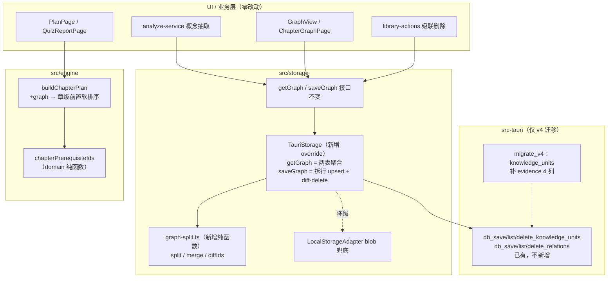
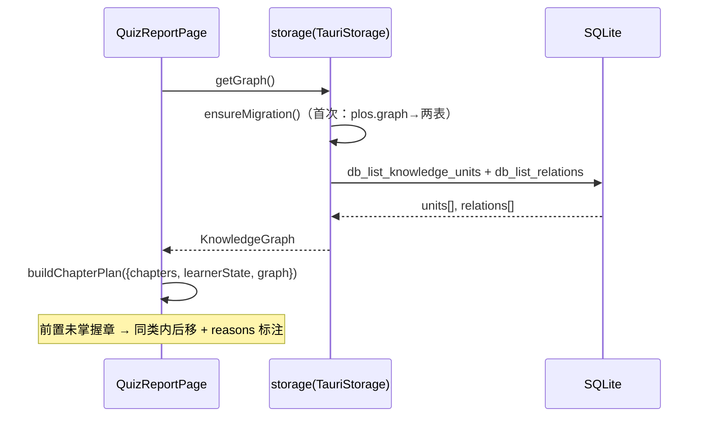

# 概念层落 SQLite + 前置关系参与规划 技术方案

| 字段 | 内容 |
|------|------|
| 作者 | WorkBuddy / 许一 |
| 日期 | 2026-09-11 |
| 状态 | 已实施（见 `docs/knowledge-sqlite-prereq-plan-task-runbook.md`） |
| 关联需求 | `docs/library-module-review-2026-09.md` 🟡 M3 前两项；已确认决策点 D1/D2/D3（见 §2） |

## 1. 背景

- 资料库评审（`docs/library-module-review-2026-09.md`）确认：概念层（`KnowledgeUnit`/`KnowledgeRelation`）的 SQLite 表、Rust 命令、TS 适配器方法**全部已写好并注册，但零业务调用方**——概念数据实际全部落在单个 localStorage blob `plos.graph`（`src/storage/local.ts:38,243`），SQLite 侧 `knowledge_units`/`knowledge_relations` 两表恒空。
- **恒空根因**（`src/storage/tauri.ts`）：①`TauriStorage` 未 override `getGraph`/`saveGraph`，业务读写永远走父类 blob；②一次性迁移 `migrateLegacyRagData()`（tauri.ts:317）读的是 `knowledgeUnits`/`knowledgeRelations` 两个 Map（恒空），搬 0 条。
- **隐藏数据丢失风险**：`KnowledgeUnit.evidence`（原文出处，KnowledgeTab「原文引用」依赖它）在领域类型里存在，但 SQLite 表与 DTO 均无此列——直接拆 blob 落库会导致 evidence 在往返中丢失。
- **规划未接图谱**：章级主链路 `buildChapterPlan`（`src/engine/learning-planner.ts:259`）只按 队列类别×掌握度×章序 排序，完全不感知 prerequisite；概念级 `buildPlan` 已有 prerequisite DFS 雏形但只服务 V1 闭环/复习会话。用户学第 5 章时，计划不知道第 2 章是它的前置。
- 不做的影响：概念数据仍是不进 SQLite 的「二等公民」（无法参与混合检索扩展、无法被 Rust 侧查询）；计划继续无视知识依赖顺序。

## 2. 方案目标

| 类型 | 描述 |
|------|------|
| **主要目标** | ①概念层真实落 SQLite（两表有数据、重启后图不丢、evidence 不丢）；②章级计划感知前置关系（软排序 + 理由标注） |
| **非目标** | sections 表落库（声明过的 N2）；chunk_knowledge 关联打通；strength 字段激活；5 类无消费关系类型（example/contrast/application/source）治理；`graphEngine` 死代码清理；概念级 `buildPlan` 算法改动 |
| **成功标准** | `db_status` 的 counts.knowledgeUnits/relations > 0（有概念抽取后）；桌面端重启后 `plos.graph` 清空实验下图仍完整；evidence 原文引用不丢；单测覆盖拆分/聚合/迁移/排序四条纯逻辑链；`npm run typecheck` 0 新增 error |

### 已确认决策点

| # | 决策 | 选定方案 |
|---|------|----------|
| D1 | 图读写路径 | **适配器聚合**：`TauriStorage` override `getGraph`/`saveGraph`，业务代码零改动 |
| D2 | 前置接入规划 | **章级软排序**：概念 prerequisite 边推导章级前置，前置未掌握的章同类内后移 + 理由标注，不硬阻塞 |
| D3 | 存量迁移 | **惰性迁移不清源**：`plos.graph` 拆表写入 SQLite，幂等 flag v2，localStorage 副本保留（灾备 + 浏览器预览数据源） |

## 3. 项目现状

### 3.1 相关代码与模块

| 模块 | 现状 | 关键位置 |
|------|------|----------|
| 领域类型 | `KnowledgeGraph{units,relations}`、`prerequisitesOf`（toId 的前置=fromId） | `src/domain/knowledge.ts:62,74` |
| 图 blob 存储 | localStorage key `plos.graph`；`saveGraph` 走父类+persist | `local.ts:38,85,243`；`memory.ts:38,300-305` |
| 业务读写方 | analyze-service（AI 抽取替换）、ChapterGraphPage、library-actions（级联删除）、loop/ReviewSession/AssessmentPage/LearnerPage/DocumentDetailPage（读） | `analyze-service.ts:167,222` 等 13 处 |
| SQLite 侧 | 两表建好（含 from/to 索引）、Rust 命令注册、DTO/映射就绪、适配器行级方法全实现 | `schema.sql:60,74`；`models.rs:130`；`tauri.ts:174-218,515-583` |
| **缺口 A** | `TauriStorage` 未 override `getGraph`/`saveGraph` | `tauri.ts` |
| **缺口 B** | `KnowledgeUnitDto` 与 `knowledge_units` 表无 evidence 列 → 往返丢 evidence | `tauri.ts:61-69`；`schema.sql:60-68` |
| **缺口 C** | 迁移读恒空 Map | `tauri.ts:325-326` |
| 章级规划 | `buildChapterPlan` 纯函数、双调用方 | `learning-planner.ts:259-283`；`loop.ts:276`；`QuizReportPage.tsx:174` |
| 章↔概念映射 | `Chapter.unitIds`（analyze-service 写入） | `analyze-service.ts:223` |
| schema 迁移机制 | 顺序 `migrate_vN` + `_schema_version` 表，v3 先例（PRAGMA 探测后 ALTER） | `src-tauri/src/db/mod.rs:80-145` |

### 3.2 相关文档与约定

- `docs/rag-wiring-design-2026-09.md`（SQLite 五类实体与降级约定 §45：命令抛错静默回退 localStorage）
- `docs/storage-architecture-rag-2026-09.md`（表结构演进）、`docs/learning-system-v2-design-2026-09.md` §5.5（章级规划）
- 约束：UI → stores/storage，Tauri 仅经 `invoke`；纯逻辑不依赖 React；i18n 双语成对；新测试走 node 直跑 `tests/*.test.ts`

### 3.3 约束与依赖

- Rust 侧改动仅限 evidence 列（复用既有 v3 迁移模式），**不新增命令**
- 图规模：个人学习资料量级（百级 units / 千级 relations），diff-delete 逐条删除可接受
- 非 Tauri（浏览器预览）行为完全不变

## 4. 技术架构

### 4.1 总体架构



### 4.2 模块职责

| 模块/层级 | 职责 | 技术选型 |
|-----------|------|----------|
| `src/storage/graph-split.ts`（新增） | 图 ↔ DTO 拆分/聚合/删除 diff 的**纯函数**（node 可测，不 import tauri） | TS，依赖 domain 类型与 DTO 契约 |
| `TauriStorage`（改） | override `getGraph`/`saveGraph`：SQLite 聚合读写 + 失败回退父类；图迁移 | 复用 `trySqlite` 降级框架 |
| `src-tauri/src/db`（改） | v4 迁移：knowledge_units 补 evidence 4 列；models/commands SQL 同步 | sqlx，PRAGMA 探测 + ALTER |
| `src/domain/knowledge.ts`（改） | 新增 `chapterPrerequisiteIds` 纯函数（概念边 → 章级前置） | 纯 TS |
| `src/engine/learning-planner.ts`（改） | `buildChapterPlan` 接 `graph?`：blocked 计算与软排序、理由 | 纯 TS |
| `loop.ts` / `QuizReportPage.tsx`（改） | 调用方传入 graph | — |

### 4.3 数据模型与 API

**读写路径（必填，遵循 layer-import-boundaries）**：

- 写：UI（analyze-service 等）→ `storage.saveGraph(graph)` → Tauri 下 `TauriStorage.saveGraph`：
  1. `await this.ensureMigration()`（保证图迁移先于写入完成）；
  2. `trySqlite("db_save_knowledge_units", {units})` + `trySqlite("db_save_relations", {relations})`（全量 upsert）；
  3. diff-delete：`db_list` 两表现有 id → 不在新图中的 id 逐条 `db_delete_*`（级联删除/章重抽的删除语义必须传播）；
  4. **任何一步失败 → 整体回退 `super.saveGraph`（仅 localStorage）**；
  5. 成功后仍写 `super.saveGraph`（双写副本：灾备 + 非 Tauri 数据源，对齐 D3 不清源）。
- 读：`getGraph` → `ensureMigration()` → `db_list_knowledge_units({documentId: undefined})` + `db_list_relations({unitId: undefined})` → `mergeGraph` 聚合；失败回退父类 blob。
- 浏览器预览（非 Tauri）：`isTauri()` 工厂分流后本就不实例化 TauriStorage，行为不变。
- 桌面能力（vault/llm）：本方案不涉及。

**evidence 落库（v4）**：

| 列 | 类型 | 对应领域字段 |
|----|------|--------------|
| `evidence_document_id` | TEXT NULL | `evidence.documentId` |
| `evidence_start` | INTEGER NULL | `evidence.start` |
| `evidence_end` | INTEGER NULL | `evidence.end` |
| `evidence_quote` | TEXT NULL | `evidence.quote` |

四列同空 = 无 evidence（evidence 是原子三元组+quote，不部分存）。`KnowledgeUnitInput`/`KnowledgeUnitRow`（serde camelCase）+ TS `KnowledgeUnitDto` 同步加 4 个 optional 字段。

**迁移（D3）**：

- 新 flag：`plos.graph.migrated.v2`（不复用 v1——存量用户 v1 已置位，重用会导致图迁移被跳过）。
- 源：`this.graph`（LocalStorageAdapter 构造时载入的 blob 内存镜像）。
- 动作：全量 upsert units + relations；**只增不删、不清源**；空图短路直接写 flag。
- 触发：`ensureMigration()` 内先 `migrateLegacyRagData()` 再 `migrateLegacyGraph()`（串行、并发去重沿用 `this.migration`）。

### 4.4 状态与副作用

- 无新增全局 state/URL 参数；`saveGraph` 的 diff-delete 带来一次额外读（`db_list` 两表），在既有「AI 抽取→保存」人工触发链路里可接受。
- 规划：`QuizReportPage` 的「生成学习计划」从同步改异步取图（loading 期间按钮禁用，沿用既有 `setPlan` 状态）；`loop.ts` 的 `buildNextActions` 已在 async 上下文，直接 `getGraph` 传入。

## 5. 交互流程

### 5.1 主流程

**A. 概念抽取落库（桌面端，用户视角无变化）**：

1. 用户在详情页知识点 Tab 点「AI 抽取」→ analyze-service `getGraph → 内存改图 → saveGraph`（不变）；
2. Tauri 下 saveGraph 拆行落 SQLite（upsert + diff-delete 删除被替换概念）；
3. 结果卡展示抽取量（既有行为）；`db_status` counts 反映真实数据。

**B. 重启后读图**：

1. 任一页面 `getGraph` → 首次调用触发惰性迁移（v2 flag）→ 从 SQLite 两表聚合返回 → 图完整呈现。

**C. 计划感知前置（D2 软排序）**：

1. 用户打开计划页 / 测验报告点「生成学习计划」→ `buildChapterPlan({chapters, learnerState, graph})`；
2. 对每个未达标章：若存在**未掌握的前置章**（概念 prerequisite 边推导），该章在同类内后移，reasons 追加「前置章节《X》《Y》尚未掌握」；
3. 前置章自身按原状态机正常出动作（通常排更前）；用户仍可手动执行任何动作（不硬阻塞）。

### 5.2 分支与异常流程

| 场景 | 触发条件 | 系统行为 | UI 反馈 |
|------|----------|----------|---------|
| SQLite 命令失败 | 建库失败/查询异常 | saveGraph/getGraph 整体回退 localStorage blob（现状行为） | 无感（与 RAG 降级约定一致） |
| 迁移失败 | invoke 抛错 | 不写 v2 flag，下次启动重试；本次读回退 blob | 无感 |
| 首次 getGraph 早于迁移 | 竞态 | 已在 override 内先 `await ensureMigration()` 再查表，消除竞态 | — |
| 图为空 / 章无 unitIds | 未做过概念抽取 | `chapterPrerequisiteIds` 返回空 Map，规划行为与现状完全一致 | 无「前置」文案 |
| 前置环 A↔B | AI 产出环 | 静态单层判定，双方各自标注 blocked，无死循环、不丢弃 | 双方 reason 各自标注 |
| evidence 定位失败 | 概念无 evidence | 四列 NULL，往返后仍无 evidence | 原文引用区不显示（现状） |

### 5.3 时序图



## 6. 用户用例（User Cases）

### UC-01：概念抽取后数据落 SQLite

| 项 | 内容 |
|----|------|
| 角色 | 桌面端用户 |
| 前置条件 | 已导入文档并切章；SQLite 可用 |
| 主流程步骤 | 1. 详情页知识点 Tab 点 AI 抽取；2. 抽取完成保存；3. 设置页/调试查 `db_status` |
| 期望结果 | counts.knowledgeUnits/relations 与抽取量一致；重启 App 后图与原文引用（evidence）完整 |
| 异常/边界 | SQLite 失败 → 回退 localStorage，行为与现状一致 |

### UC-02：存量用户首次升级后自动迁移

| 项 | 内容 |
|----|------|
| 前置条件 | localStorage 已有 `plos.graph` 数据（旧版本积累）；本次为升级后首次启动 |
| 主流程步骤 | 1. 启动后任一 `getGraph` 触发迁移；2. blob 拆表 upsert；3. flag v2 置位 |
| 期望结果 | 两表数据 = blob 数据；`plos.graph` 保留未动；二次启动不重复迁移 |
| 异常/边界 | 迁移失败不写 flag、下次重试；blob 为空直接置 flag 返回 |

### UC-03：计划对前置未掌握章软排序

| 项 | 内容 |
|----|------|
| 前置条件 | 章 B 的某概念以 prerequisite 边依赖章 A 的某概念；A 未达标（mastery<0.8）、B 亦未达标且同为「推进未学」类 |
| 主流程步骤 | 1. 打开计划页；2. 查看队列 |
| 期望结果 | B 在同类内排在 A 之后；B 的理由含「前置章节《A》尚未掌握」；A 正常出现在队列（通常更前） |
| 异常/边界 | A 已达标 → B 不标注不后移；无图/无边 → 行为与现状一致；A、B 互为前置 → 双方各自标注、均不丢弃 |

### UC-04：浏览器预览不受影响

| 项 | 内容 |
|----|------|
| 前置条件 | 非 Tauri 环境（vite dev 纯浏览器） |
| 主流程步骤 | 1. 导入/抽取/看图/看计划 |
| 期望结果 | 与现状完全一致（blob 读写、无 invoke） |
| 异常/边界 | 无 |

## 7. 线框 UI

本方案**无新增页面/组件**，仅两处既有 UI 的文案级行为变化：

### 7.1 计划页动作项 — 前置标注态（PlanPage 既有卡片）

```
┌──────────────────────────────────────────────┐
│ ▶ learn-chapter  《第5章 向量检索》            │
│   reasons:                                   │
│   · 《目标驱动》要求掌握本内容                 │
│   · 当前掌握度 0% ，达标线 80%                 │
│   · 前置章节《第2章 文本切分》尚未掌握   ← 新增 │
└──────────────────────────────────────────────┘
```

- 渲染复用 `NextAction.reasons` 既有列表（PlanPage 已逐条展示 reasons），**零新组件**；文案走 `m.engine.prereqPending`（zh/en 成对）。
- 空/加载/错误态：均为既有状态（无图→无该行；取图 loading→按钮禁用沿用现态），不新增线框。

## 8. 涉及文件及改动伪代码

### 8.1 `src/storage/graph-split.ts`（新增）

**改动说明**：图 ↔ DTO 纯函数，node 可测；DTO 类型从 tauri.ts 抽到此处或直接 import（避免循环，DTO 定义移入本文件、tauri.ts 改为 re-export 使用）。

```ts
// 纯函数：无 React / invoke 依赖
export function splitGraph(graph: KnowledgeGraph): {
  units: KnowledgeUnitDto[]; relations: KnowledgeRelationDto[];
} { /* toUnitDto / toRelationDto（自 tauri.ts 迁入，evidence 4 字段随迁） */ }

export function mergeGraph(units: KnowledgeUnitDto[], relations: KnowledgeRelationDto[]): KnowledgeGraph {
  /* fromUnitDto / fromRelationDto；缺失 from/to 的悬空 relation 丢弃（诚实降级） */
}

export function diffIds<T>(current: {id:string}[], next: {id:string}[]): string[] {
  /* 在 current 不在 next 的 id 列表 → saveGraph 的删除集合 */
}
```

### 8.2 `src/storage/tauri.ts`（修改）

**改动说明**：新增 `getGraph`/`saveGraph` override、`migrateLegacyGraph`、DTO evidence 字段；`KnowledgeUnitDto` 等类型迁至 graph-split.ts 后 import。

```ts
const GRAPH_MIGRATION_FLAG = "plos.graph.migrated.v2";

override async getGraph(): Promise<KnowledgeGraph> {
  await this.ensureMigration();                       // 消除「先读后迁」竞态
  const u = await this.trySqlite<KnowledgeUnitDto[]>("db_list_knowledge_units", {});
  const r = await this.trySqlite<KnowledgeRelationDto[]>("db_list_relations", {});
  if (!u.ok || !r.ok) return super.getGraph();        // 整体降级，不做半份聚合
  return mergeGraph(u.value, r.value);
}

override async saveGraph(graph: KnowledgeGraph): Promise<void> {
  await this.ensureMigration();
  const { units, relations } = splitGraph(graph);
  const okU = await this.trySqlite("db_save_knowledge_units", { units });
  const okR = await this.trySqlite("db_save_relations", { relations });
  if (!okU.ok || !okR.ok) { await super.saveGraph(graph); return; }  // 回退
  // diff-delete：传播级联删除 / 章重抽的移除语义（表小，逐条删可接受）
  const curU = await this.trySqlite<KnowledgeUnitDto[]>("db_list_knowledge_units", {});
  const curR = await this.trySqlite<KnowledgeRelationDto[]>("db_list_relations", {});
  if (curU.ok && curR.ok) {
    for (const id of diffIds(curU.value, units)) await this.trySqlite("db_delete_knowledge_unit", { id });
    for (const id of diffIds(curR.value, relations)) await this.trySqlite("db_delete_relation", { id });
  }
  await super.saveGraph(graph);                       // 双写副本（D3 不清源语义）
}

async migrateLegacyGraph(): Promise<number> {
  if (this.readGraphFlag()) return 0;
  try {
    const { units, relations } = splitGraph(this.graph);   // 父类 blob 内存镜像
    if (units.length + relations.length === 0) { this.writeGraphFlag(); return 0; }
    await invoke("db_save_knowledge_units", { units });
    await invoke("db_save_relations", { relations });
    this.writeGraphFlag();
    return units.length + relations.length;
  } catch { return -1; }                              // 不写 flag，下次重试
}
// ensureMigration(): 先 migrateLegacyRagData() 再 migrateLegacyGraph()（复用 this.migration 并发去重）
// toUnitDto / fromUnitDto：补 evidence 4 字段映射（undefined → SQL NULL）
```

### 8.3 `src-tauri/src/db/schema.sql`（修改）

**改动说明**：v4 —— knowledge_units 建表语句内补 4 列（新库直得），加注释说明存量库走 migrate_v4。

```sql
-- v4 变更：evidence 四列（ConceptEvidence 拆平；四列同空 = 无 evidence）。
-- 存量库由 db/mod.rs::migrate 的 v3→v4 步骤 PRAGMA 探测后 ALTER 补齐。
CREATE TABLE IF NOT EXISTS knowledge_units (
  ...
  evidence_document_id TEXT,
  evidence_start       INTEGER,
  evidence_end         INTEGER,
  evidence_quote       TEXT
);
```

### 8.4 `src-tauri/src/db/mod.rs`（修改）

**改动说明**：新增 `migrate_v4`，模式复制 v3（查 `_schema_version` MAX ≥ 4 短路 → 逐列 PRAGMA table_info 探测 → `ALTER TABLE knowledge_units ADD COLUMN ...` → 写 version=4）。

```rust
migrate(&pool).await?;            // mod.rs:62 调用链不变
// migrate(): migrate_v2 → migrate_v3 → migrate_v4
```

### 8.5 `src-tauri/src/db/models.rs`（修改）

```rust
pub struct KnowledgeUnitInput { ..., 
  pub evidence_document_id: Option<String>,
  pub evidence_start: Option<i64>,
  pub evidence_end: Option<i64>,
  pub evidence_quote: Option<String>,   // serde camelCase 镜像 TS DTO
}
pub struct KnowledgeUnitRow { ..., /* 同 4 字段 Option */ }
```

### 8.6 `src-tauri/src/db/commands.rs`（修改）

**改动说明**：`db_save_knowledge_units` 的 INSERT 列与 `db_get/list_knowledge_units` 的 SELECT 补 4 列；其余命令不动。

### 8.7 `src/domain/knowledge.ts`（修改）

```ts
/** 章级前置推导（D2）：章 A 的概念是章 B 某概念的 prerequisite → A 是 B 的前置章。 */
export function chapterPrerequisiteIds(
  graph: KnowledgeGraph, chapters: readonly Pick<Chapter, "id" | "unitIds">[],
): Map<string, string[]> {
  // unitById 索引 → 遍历 prerequisite 边 → fromUnit 所属章 → toUnit 所属章
  // 自环（A 依赖 A）剔除；结果 Map<toChapterId, fromChapterId[]>
}
```

### 8.8 `src/engine/learning-planner.ts`（修改）

```ts
export interface ChapterPlanInput {
  chapters: Chapter[]; learnerState: LearnerState;
  /** 可选：传入后启用章级前置软排序；缺省 = 现状行为（向后兼容）。 */
  graph?: KnowledgeGraph;
  now?: number;
}
// ChapterActionSpec 增加 blocked?: string[]（未掌握前置章标题）
// buildChapterPlan：
//   const prereqMap = input.graph ? chapterPrerequisiteIds(input.graph, input.chapters) : undefined;
//   blocked(c) = prereqMap?.get(c.id) 存在某前置章 mastery < MASTERY_THRESHOLD（含无记录=0）
//   spec.blocked = 未掌握前置章标题列表（仅未达标章标注；已达标到期复习章不标注）
// 排序键：cls → blocked(有无) → dueAt → mastery → order（同类内后移，不跨类、不丢弃）
// reasons.push(m.engine.prereqPending(blocked.join("》《")))   // blocked 非空时
```

### 8.9 `src/engine/loop.ts`（修改）

**改动说明**：`buildNextActions`（loop.ts:276 处）所在函数已在 async 上下文——取 `await storage.getGraph()` 传入 `buildChapterPlan`（loop.ts:229 注释的「纯读取路径参数化」模式不变，仅多读一参）。

### 8.10 `src/features/quiz/QuizReportPage.tsx`（修改）

**改动说明**：`buildChapterPlan` 调用点（:174）前置 `await storage.getGraph()`；取图期间沿用既有禁用/loading 态；失败（回退路径也会返回 blob，实际不会 reject）无需新错误分支。

### 8.11 `src/i18n/messages/zh.ts` / `en.ts`（修改）

```ts
// engine 块新增（成对）：
prereqPending: (names: string) => `前置章节《${names}》尚未掌握，先补前置更省力`,
// en: `Prerequisite chapter(s) "${names}" not mastered yet — clearing them first pays off`,
```

### 8.12 `tests/graph-split.test.ts`（新增） / `tests/planner-prereq.test.ts`（新增）

见 §11/§12；`package.json` 加 `test:graph`、`test:prereq` 两个 script（node 直跑风格与现有一致）。

## 9. 任务清单（Tasks）

| ID | 任务 | 依赖 | 复杂度 |
|----|------|------|--------|
| T1 | `graph-split.ts` 纯函数 + DTO 迁移（split/merge/diffIds，evidence 映射） | — | M |
| T2 | `TauriStorage` getGraph/saveGraph override + 降级/双写 | T1 | M |
| T3 | Rust v4：schema.sql + mod.rs migrate_v4 + models.rs + commands.rs | — | M |
| T4 | `migrateLegacyGraph` + flag v2 + ensureMigration 串接 | T1,T2 | S |
| T5 | `chapterPrerequisiteIds`（domain） | — | S |
| T6 | `buildChapterPlan` blocked 软排序 + reasons + i18n 双语 | T5 | M |
| T7 | 调用方接线（loop.ts / QuizReportPage.tsx） | T6 | S |
| T8 | 测试：tests/graph-split + tests/planner-prereq + package.json scripts + Rust 契约测试更新 + 全量回归 | T1-T7 | M |

## 10. 实施步骤

1. **步骤 1（T1+T2+T4）**：存储层——先纯函数与单测（graph-split round-trip），再 override 接线与迁移。
   - 验证：`npm run test:graph`；typecheck；node 内无法跑 invoke，IPC 路径靠代码自审 + 步骤 4 手工。
2. **步骤 2（T3）**：Rust v4 迁移。
   - 验证：`cd src-tauri && cargo test --lib`（serde 契约 + 既有测试不回归）。
3. **步骤 3（T5+T6+T7）**：规划链——domain 纯函数 → planner → 接线 → i18n。
   - 验证：`npm run test:prereq`；`test:eta`/`test:goal` 等既有 planner 测试不回归（graph 缺省=现状）。
4. **步骤 4（T8）**：全量回归 + 手工冒烟（桌面 dev 跑 `npm run tauri dev`：抽取概念 → `db_status` 计数 > 0 → 重启验证图与 evidence 完整 → 计划页看前置标注）。
5. **回滚策略**：存储侧全部 failure-soft（SQLite 失败自动回退 blob，删 v2 flag 即可强制重迁）；规划侧 `graph` 参数可选（不传=现状）；Rust v4 列只增不破坏旧读写。

## 11. 测试方案

### 11.1 测试范围与策略

| 层级 | 工具/方式 | 覆盖重点 | 不负责 |
|------|-----------|----------|--------|
| 单元 | `tests/graph-split.test.ts`、`tests/planner-prereq.test.ts`（node 直跑） | split/merge/diff round-trip、悬空边、章级前置推导、软排序、向后兼容 | invoke/IPC |
| Rust | `cargo test --lib`（既有契约测试扩展） | KnowledgeUnitInput/Row serde round-trip（evidence 4 字段） | 迁移的磁盘态（人工） |
| 手工 | `npm run tauri dev` 冒烟（§10 步骤 4 清单） | 真实 SQLite 读写、重启持久性、计划页文案 | — |
| E2E | 不做（遵循 no-headless-browser-validation；用户显式要求时放行） | — | — |

### 11.2 测试环境与数据

- node 单测：无外部依赖，fixture 内联构造 graph/chapters/learnerState。
- Rust：既有 `src-tauri` 测试风格，内存或临时库。
- 命令：`npm run test:graph && npm run test:prereq`；`cargo test --lib`；`npm run typecheck`。

### 11.3 通过标准

- 新增两组单测全绿 + 既有 20 组单测全绿 + typecheck 仅剩 `AIModelsSection.tsx` 已知 3 条遗留 + cargo test 全绿。

## 12. 测试用例

| ID | 关联 UC | 步骤/输入 | 期望结果 | 类型 |
|----|---------|-----------|----------|------|
| TC-UC01-01 | UC-01 | splitGraph(含 evidence 图) → mergeGraph | units/relations 逐字段相等，evidence 4 字段往返不丢 | 单元 |
| TC-UC01-02 | UC-01 | 悬空 relation（fromId 无对应 unit） | mergeGraph 丢弃该边 | 单元 |
| TC-UC02-01 | UC-02 | migrateLegacyGraph：graph 有 3 units/4 relations | 调 invoke 两次（save_units/save_relations），返回 7，flag 置位 | 单元 |
| TC-UC02-02 | UC-02 | flag 已置位 | 直接返回 0，不调 invoke | 单元 |
| TC-UC02-03 | UC-02 | 空 blob | 写 flag 返回 0 | 单元 |
| TC-UC02-04 | UC-02 | invoke 抛错 | 返回 -1，flag 未写 | 单元 |
| TC-UC03-01 | UC-03 | A(2 concepts) prerequisite→B(1 concept)，均未学，同 cls=5 | B 排 A 后；B.reasons 含 prereqPending；A 无标注 | 单元 |
| TC-UC03-02 | UC-03 | A 已达标(0.9) | B 不标注不后移 | 单元 |
| TC-UC03-03 | UC-03 | 无 graph / 空图 / 章 unitIds 空 | 输出与现状逐项一致（向后兼容） | 单元 |
| TC-UC03-04 | UC-03 | A↔B 互为前置 | 双方各自 blocked 标注，均出现，无死循环 | 单元 |
| TC-UC03-05 | UC-03 | B 已达标但到期复习（cls=4） | 不标注 blocked（到期复习不参与软排序） | 单元 |
| TC-UC04-01 | UC-04 | 非 Tauri 工厂分流 | 不实例化 TauriStorage（现状代码路径，代码自审） | 自审 |
| TC-EDGE-01 | UC-01 | saveGraph 首个 invoke 失败 | 整体回退 super.saveGraph，localStorage 有最新 blob | 单元 |
| TC-EDGE-02 | UC-03 | 前置章不在计划范围 chapters 内（跨文档） | 该前置不参与 blocked 判定（范围外前置忽略） | 单元 |
| TC-EDGE-03 | UC-01 | 同一 unit id 重抽（upsert 幂等） | splitGraph 输出同 id 新字段 → 表内覆盖不翻倍 | 单元 |

---

## 变更记录

| 日期 | 变更 | 作者 |
|------|------|------|
| 2026-09-11 | 初稿（D1/D2/D3 已确认） | WorkBuddy |
| 2026-09-12 | T1–T8 全部实施并验证（schema v4 / TauriStorage 图读写 override / 章级前置软排序 / 新增两组单测）；执行记录见 `knowledge-sqlite-prereq-plan-task-runbook.md` | WorkBuddy |
