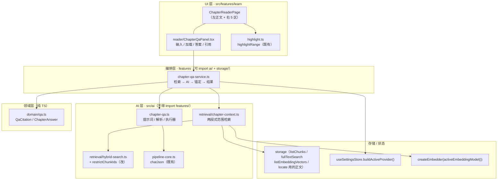
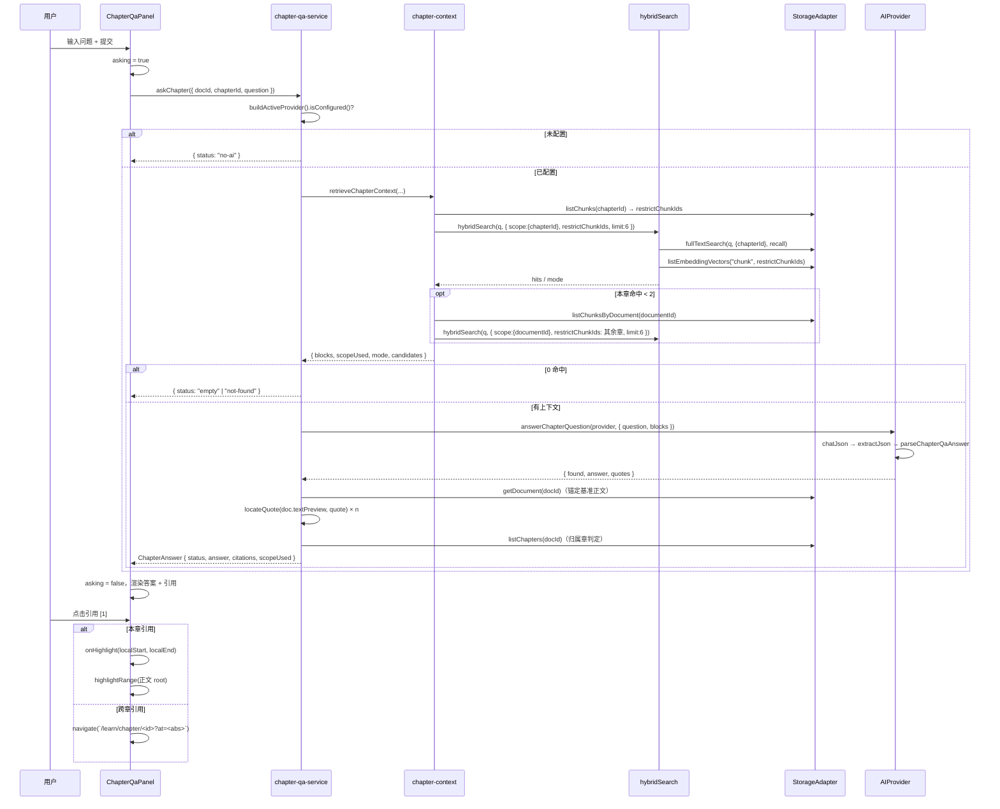

# 章内提问（Chapter Q&A · 答案锚回你自己的原文）技术方案

| 字段 | 内容 |
|------|------|
| 作者 | Agent / 许一 |
| 日期 | 2026-09-14 |
| 状态 | 已完成（2026-09-14 实施，见 `docs/learn-chapter-qa-task-runbook-2026-09.md`） |
| 关联需求 | `docs/roadmap-next-features-plan-2026-09.md` §F5 范围第 1 条「章内提问框（推荐先做）」 |

---

## 1. 背景

### 1.1 业务背景与用户痛点

`docs/roadmap-next-features-plan-2026-09.md` 的核心判断是：

> 产品叫「自我学习**评测**」，但两半的成熟度严重不对称 —— 评测侧 ⭐⭐⭐⭐ 可对外演示，学习侧 ⭐⭐ 被动接收为主。**用户在整个"学习"环节没有任何主动加工动作** —— 不能划线、不能记笔记、不能提问、不能复述。

`ChapterReaderPage`（`src/features/learn/ChapterReaderPage.tsx`）当前全部能力 = 读正文 + 看 AI 要点卡 + 标记学完 + 进概念图谱。用户读到一段看不懂、或想把"这章在讲什么"逼出一个回答时，**系统里没有任何出口**。

### 1.2 触发原因

F5「主动学习工具」共四条范围（提问 / 高亮笔记 / 费曼输出 / 自测卡），本方案只做**第 1 条：章内提问**。理由：

| 理由 | 说明 |
|------|------|
| 前置能力全部就绪 | `hybridSearch`（`ai/retrieval/hybrid-search.ts:63`）已接线、`locateQuote`/`anchorToDocument`（`features/learn/evidence-anchor.ts`）已落地、`highlightRange`（`features/learn/highlight.ts`）已落地、`buildActiveProvider()` 已有 6 处消费先例 |
| 与产品定位咬合最紧 | 全仓检索确认：**无任何笔记/高亮/提问/复述实现**（`grep -rn "提问" docs src` 仅命中 roadmap 文档本身）。提问是四项里唯一"读的时候就想用"的动作 |
| 兑现「证据可溯」原则 | 答案**一律锚回用户自己的原文**，复用既有「不信 AI 偏移量、锚不上就丢弃」的既有护栏，不是新造一套信任模型 |

### 1.3 与现有产品/模块的关系

本功能是**只读消费者**，不引入新的领域主对象、不写掌握度、不写 evidence：

```
资料（Document）→ 章（Chapter）→ 【章内提问】→ 答案 + 原文引用（锚点可点回正文）
                        ↓ 复用
        hybridSearch（FTS + 向量 + RRF）· locateQuote（锚定）· highlightRange（高亮）
```

### 1.4 不做会怎样

「学习」这一半继续空白 —— 用户仍然只能被动接收 AI 给的要点卡；F5 后续三项（高亮笔记 / 费曼输出 / 自测卡）也失去最自然的落点（它们都要挂在同一个阅读页交互上）。

---

## 2. 方案目标

| 类型 | 描述 |
|------|------|
| **主要目标** | 用户在章阅读页可以就**当前章**提问，得到**只依据自己所导入原文**生成的回答，且回答中的每一条引用都能点击跳回正文对应位置并高亮。 |
| **主要目标** | 「答案有据」是硬约束：**展示出来的引用 100% 锚定成功**（`locateQuote` 两档匹配命中），零伪造引文；资料里确实没有就明确说没有。 |
| **非目标** | ① 多轮对话（V1 单轮，不携带历史）② 流式输出 ③ 高亮/笔记/费曼输出/自测卡（F5 其余三项）④ 问答写入掌握度或 evidence 流 ⑤ 全库问答（范围限定见 D1）⑥ PDF 页码级引用 ⑦ 问答记录持久化（D2 已定：会话级内存） |
| **成功标准** | 1. 打开任意有 chunk 的章，右栏出现「问这一章」，输入问题可得到回答（AI 就绪前提下）<br/>2. 回答中的每条引用可点击 → 正文滚动到该段并高亮（本章引用）或跳转到对应章并高亮（跨章引用）<br/>3. **零伪造引用**：单测断言「所有对外暴露的 citation 都必然 `locateQuote` 命中且归属某章」<br/>4. 无 AI 时给出诚实降级（禁用输入 + 指向设置页），**不伪造回答**<br/>5. 资料/本章内确实无相关内容时，明确回答「资料中未提及」，不用模型自身知识补答<br/>6. `npm run typecheck` 0 error；新增 `npm run test:qa` 全绿；`npm run test:library`、`npm run test:rag`、`npm run test:retrieval` 不回归<br/>7. 不破坏既有正文切片契约（`Chapter.contentRef` 只读消费，不改原文、不改 chunk） |

---

## 3. 项目现状

### 3.1 相关代码与模块

| 位置 | 现状 | 对本方案的意义 |
|------|------|----------------|
| `src/features/learn/ChapterReaderPage.tsx` | 左栏正文卡（`doc.textPreview.slice(contentRef)`）+ 右栏四区（章状态 / Why it matters / Knowledge / Evidence）+ 底部粘性主行动条 | **宿主页面**：新增第 5 区「问这一章」；正文卡需加 `ref` 与 `?at=` 高亮支持 |
| `src/features/learn/evidence-anchor.ts` | `locateQuote(body, quote)`（档 1 精确 `indexOf` / 档 2 `foldWhitespace` 折叠匹配）、`anchorToDocument`（叠加 base → 文档绝对偏移）、`MAX_QUOTE_CHARS = 2000` | **锚定唯一入口**，本方案直接复用，不新增匹配算法 |
| `src/features/learn/highlight.ts` | `highlightRange(root, start, end)`（TreeWalker 按字符区间映射回 DOM + `scrollIntoView`）、`clearHighlights` | **高亮唯一入口**；当前唯一消费点是 `detail/ContentTab.tsx:47` |
| `src/features/learn/detail/ContentTab.tsx` | `?at=<文档绝对偏移>` → `requestAnimationFrame` 两帧后 `highlightRange(root, at, at + 120)` | **既有锚点跳转范式**，本方案在阅读页复用同一语义 |
| `src/ai/retrieval/hybrid-search.ts` | `hybridSearch(query, {storage, embedder, scope, limit, recall})`；FTS 路 + 向量路 → `fuseRankings` RRF 融合 | ⚠️ **关键缺口见下** |
| `src/ai/retrieval/vector-search.ts` | `cosineTopK(query, candidates, k)`，维度不一致的候选跳过并与计数 | 向量候选过滤的落点 |
| `src/ai/pipeline-core.ts` | `chatJson(provider, messages, temperature)`（含 `extractJson` + `repairTruncatedJson` 截断抢救）、`PIPELINE_LIMITS`、`TEMPERATURE`、`isRecord`/`str` | **共享件唯一出处**（放 `pipelines.ts` 会成环 → TDZ，见该文件头注释） |
| `src/ai/pipelines.ts` | `refineSplitResult` / `generateQuizQuestionsWithAi` / `gradeSubjectiveWithAi` / `extractChapterConceptsWithAi` / `extractKeyPointsWithAi`；re-export `chapter-map-reduce`、`refine-batch` | 新管线 `ai/chapter-qa.ts` 沿同款模式并在此 re-export |
| `src/ai/chapter-map-reduce.ts` | `AnchorFn` 回调注入模式（`ai/` 层不 import `features/`，锚定能力由调用方注入） | **分层先例**：本方案更进一步 —— `ai/` 层只产出 `quotes: string[]`，锚定整体放 service 层 |
| `src/stores/useSettingsStore.ts` | `buildActiveProvider(): AIProvider`（唯一 provider 构造入口，读全局 `active`） | AI 调用入口 |
| `src/hooks/useAiReady.ts` | 响应式订阅 `useSettingsStore.providerReady` | UI 禁用态与降级文案的依据 |
| `src/features/learn/index-service.ts` | `activeEmbeddingModel(): string`；`createEmbedder(model)` 唯一向量化入口 | 检索侧 embedder 构造 |
| `src/storage/types.ts` | `fullTextSearch(query, scope, limit)`（`scope.chapterId/documentId` **下推到 SQL**）、`listChunks(chapterId)`、`listChunksByDocument(documentId)`、`listEmbeddingVectors(targetType, targetIds?)`（按目标过滤） | 章/资料范围锁定的存储能力**已具备** |
| `src/components/primitives.tsx` | `Section`、`Card`、`EvidenceRow` 等领域原语 | 右栏第 5 区沿用 `Section` + 卡片 |
| `src/stores/useAiTaskStore.ts` | 全局 AI 任务注册表（`AiTaskId` 为联合类型，新增需改 `ai-task-types.ts`） | **本方案不用**：问答为交互式单问单答，用面板局部 state |

### 3.2 相关文档与约定

- `AGENTS.md` —— 目录地图、分层规则、编码速记（本文档的实现依据）
- `docs/roadmap-next-features-plan-2026-09.md` §F5 —— 需求出处（「章内提问框（推荐先做）：基于当前章走 `hybridSearch` 检索 + `provider.chat` 回答，**答案一律锚回原文**（复用 `ai/evidence-anchor`，不许模型自造引文）」）
- `docs/business-flow-end-to-end-2026-09.md` §S3 / §S7.1 —— 阅读页与双证据原则
- `docs/library-detail-page-design-2026-09.md` §4.3 / §8.3 / §8.12 —— 原文锚定契约与 `?at=` 跳转
- `docs/rag-wiring-design-2026-09.md` §5.1-C —— `hybridSearch` 的降级策略
- 约束：`rules/layer-import-boundaries.mdc`（UI → stores/storage；纯逻辑不依赖 React）、`rules/engineering-code-style.mdc`（相对导入、中文注释、i18n 双语成对、`import type`）、`rules/react.mdc`（语义 token + UI Kit / primitives 优先）、`rules/code-structure-and-dependencies.mdc`（文件 ≤700 行）、`rules/no-headless-browser-validation.mdc`（**禁止起浏览器校验**，验证靠 typecheck + node 单测 + 代码自审）

### 3.3 约束与依赖

| 项 | 内容 |
|----|------|
| 运行时 | Node ≥ 22；React 19 + Vite 8 + TS（`strict` + `verbatimModuleSyntax`） |
| 向量化 | 恒定走本地 Embedder（`qwen3-embed:0.6b`，1024 维），**不经 `AIProvider`**（决策 D1/D5）；`createEmbedder()` 在浏览器预览 / 未配模型时返回 `undefined` |
| AI 就绪 | 全部 `chat` 经 `buildActiveProvider()`；未配置时 `chatJson` 抛 `AiProviderError("not-configured")` |
| 存储 | 桌面端 SQLite（`tauri.ts`）→ 退化 `memory.ts` / `local.ts`；**本方案不新增任何存储方法** |
| 性能 | 单次提问 = 1 次 FTS 查询 + 1 次向量过滤查询 + 1 次 embed + 1 次 chat；上下文 ≤ 6000 字符（小模型上下文护栏） |
| 无新增依赖 | 不引入任何 npm 包 |

### 3.4 ⚠️ 调研中发现的真实缺口（本方案必须处理）

**缺口 A —— `hybridSearch` 的 `scope` 不作用于向量路。**

`hybrid-search.ts:56-61` 的注释自承：

> 向量路的 scope 说明：`scope` 只作用于 FTS 路（下推到 SQL）。向量路是「先按相似度召回 chunk 再回表」，若将来需要按范围限定，应在 `cosineTopK` 之后按 chunk 的 documentId/chapterId 过滤；当前产品入口（资料库全局搜索）不需要，故不做多余过滤。

对「章内提问」这是**致命的**：若直接传 `scope: { chapterId }`，向量路仍会从**全库**召回并混入其他章的 chunk，答案可能引用到另一本书的内容 —— 与「答案基于本章原文」的承诺直接冲突。

**不能只做"融合后过滤"**：`cosineTopK` 是**全库 top-20**；若本章 chunk 没进全库 top-20，过滤后就得到 0 条，而本章其实是有的 —— 范围锁死 + 漏召回。正确做法是**在向量候选阶段就按范围过滤**：`listEmbeddingVectors("chunk", <范围内 chunkId 列表>)`（该接口本就支持 `targetIds` 过滤，见 `storage/types.ts:110`）。

**缺口 B —— `Chunk` 没有字符偏移。**

`domain/chunk.ts` 只有 `position` / `metadata.{heading,page,sourceLocation}`，**无 start/end**。因此"引用跳回原文"不能靠 chunk 偏移，只能靠 `locateQuote(文档正文, quote)` 反查 + 用 `Chapter.contentRef` 区间判定归属章。这是本方案锚定链路的设计前提。

**缺口 C（P2，遗留，不在本次范围）** —— `listEmbeddingVectors` 不按 `model` 过滤。换 embedding 模型后，同维度（1024）的不同模型向量会被一起比较，产生无意义的相似度。`cosineTopK` 只挡维度不一致（`vector-search.ts:55`）。同为 `hybridSearch` 的既存问题，本次不改，记入第 10 章风险。

---

## 4. 技术架构

### 4.1 总体架构



**分层红线（为什么锚定放在 service 层）**：

```
domain（类型，纯） ← ai（检索 + 管线，零 features） ← features（编排 + 锚定 + UI）
```

`ai/` 层**不得 import `features/`**（既有约束，`chapter-map-reduce.ts` 用 `AnchorFn` 回调注入就是为了绕开它）。本方案再简化一层：`ai/chapter-qa.ts` 的产出是**纯文本契约** `{ found, answer, quotes: string[] }`，**完全不碰偏移量**；锚定（`locateQuote`）整体放在 `features/learn/chapter-qa-service.ts`。好处是 `ai/` 层可零 IO 单测、`quotes` 就是可断言的原始事实。

### 4.2 模块职责

| 模块 / 层级 | 职责 | 技术选型 |
|-------------|------|----------|
| `src/domain/qa.ts`（新增） | 问答结果的领域类型：`QaCitation`、`ChapterAnswer`、状态枚举 | 纯 TS，零依赖 |
| `src/ai/retrieval/chapter-context.ts`（新增） | 两段式范围检索：本章优先 → 命中不足扩到同资料其他章；拼装带编号的上下文块 | 依赖 `StorageAdapter` + `Embedder` + `hybridSearch`，零 React |
| `src/ai/retrieval/hybrid-search.ts`（修改） | 新增 `restrictChunkIds`：把检索范围锁在给定 chunk 集合内（**两路同时生效**） | 纯编排，零 React |
| `src/ai/chapter-qa.ts`（新增） | `CHAPTER_QA_SYSTEM` 提示词 + `buildChapterQaMessages` + `parseChapterQaAnswer` + `answerChapterQuestion` | `chatJson` / `PIPELINE_LIMITS` 取自 `pipeline-core` |
| `src/features/learn/chapter-qa-service.ts`（新增） | 编排：读章/资料 → 检索 → 无 AI 早退 → chat → **锚定 + 归属判定** → 组装 `ChapterAnswer` | features 层，可 import ai/ 与 storage |
| `src/features/learn/reader/ChapterQaPanel.tsx`（新增） | 输入框 / 示例问题 / 加载态 / 答案渲染（`[n]` → 可点按钮）/ 引用列表 / 全部异常态 | React + `Section`/`Card`/`Button`/`Textarea`/`Spinner` + 语义 token |
| `src/features/learn/ChapterReaderPage.tsx`（修改） | 挂载面板；正文卡加 `ref` + `?at=` 文档绝对偏移 → 章内相对偏移高亮 | 复用 `highlight.ts` |
| `src/i18n/messages/{zh,en}.ts`（修改） | `learn.reader.qa.*` 成对新增 | 唯一文案出处 |

### 4.3 数据模型与 API

#### 4.3.1 领域类型（`src/domain/qa.ts`）

```ts
/**
 * 一条「答案 → 原文」的引用。
 *
 * 不变式（由 chapter-qa-service 保证，单测断言）：
 *   - start/end 为 **doc.textPreview 绝对偏移**，左闭右开；
 *   - 且必然落在某个 Chapter 的 contentRef 区间内（chapterId 即该章）；
 *   - 锚不上的 quote **不会**出现在这里（零伪造）。
 */
export interface QaCitation {
  /** 模型给出的 verbatim 原文摘录（已通过 locateQuote 校验）。 */
  quote: string;
  /** 文档绝对区间。 */
  start: number;
  end: number;
  /** 归属章（由 contentRef 区间判定）。 */
  chapterId: string;
  chapterTitle: string;
  /** 归属章序号（1..n），供 UI 渲染「第 n 章」标签。 */
  chapterOrder: number;
  /** 是否属于提问时所在的这一章（false = 同资料其他章）。 */
  inThisChapter: boolean;
}

/** 问答结果状态（UI 据 this 分支渲染，不做隐式兜底）。 */
export type ChapterAnswerStatus =
  | "answered"    // 有 ≥1 条锚定成功的引用 → 正常展示
  | "unanchored"  // 模型给了回答，但一条引用都没能定位回原文 → 展示 + 显式警示
  | "not-found"   // 检索到原文但没有答案依据 → 「资料中未提及」
  | "empty"       // 范围内没有任何 chunk（未切分 / 未建索引且无正文）
  | "no-ai"       // 未配置模型 → 不检索、不伪造
  | "error";      // 检索 / 调用 / 解析失败

/**
 * 失败原因分类（**实施偏差**：原设计为 `errorText: string`）。
 *
 * 为什么改成 kind：`rules/engineering-code-style` 要求文案一律走 i18n 且成对维护，
 * 而 `src/i18n` 没有 React 之外的消息访问器 —— features 服务层取不到文案表，
 * 若在服务层硬编码中文即违反该 rule。故只产出稳定分类，由 `ChapterQaPanel`
 * 映射到 `learn.reader.qa.err*`。
 */
export type ChapterQaErrorKind =
  | "invalid-question" | "not-configured" | "parse" | "fetch" | "generic";

export interface ChapterAnswer {
  status: ChapterAnswerStatus;
  /** 提问文本（原样回显，UI 用它做「问题」标题）。 */
  question: string;
  /** status="answered"|"unanchored" 时的回答正文（可含 [1][2] 标记）。 */
  answer?: string;
  /** 已锚定引用（status="answered" 时非空）。 */
  citations: QaCitation[];
  /** 实际使用的检索范围（UI 据此提示「已扩展到本资料其他章节」）。 */
  scopeUsed: "chapter" | "document";
  /** status="error" 时的原因分类（UI 映射为可读文案）。 */
  errorKind?: ChapterQaErrorKind;
  at: number;
}
```

#### 4.3.2 AI 层契约

```ts
// src/ai/retrieval/chapter-context.ts
export interface ChapterContextOptions {
  storage: StorageAdapter;
  embedder?: Embedder;
  chapterId: string;
  documentId: string;
  /** 检索词：用户问题原文（不做改写，保持可解释）。 */
  query: string;
}

export interface ChapterContext {
  /** 已按「来源片段 n」编号的上下文块（已截断到上限）。 */
  blocks: ContextBlock[];
  /** chapter = 仅本章命中足够；document = 已扩到同资料其他章。 */
  scopeUsed: "chapter" | "document";
  /** 范围内的 chunk 总数（0 → status="empty"，不进 AI）。 */
  candidates: number;
  /** 检索模式（转发 hybridSearch 的 mode，UI 可标注「仅全文检索」）。 */
  mode: "hybrid" | "fulltext";
}

export interface ContextBlock {
  index: number;          // 1..n，与提示词里的 [n] 对应
  chunkId: string;
  chapterId: string;
  chapterTitle: string;
  text: string;
}

export async function retrieveChapterContext(
  opts: ChapterContextOptions,
): Promise<ChapterContext>;
```

```ts
// src/ai/chapter-qa.ts
export interface ChapterQaInput {
  chapterTitle: string;
  documentTitle: string;
  question: string;
  blocks: readonly ContextBlock[];
}

/** 模型原始产出（**不含偏移量** —— 偏移一律由 service 层用 locateQuote 算出）。 */
export interface ChapterQaDraft {
  found: boolean;
  answer: string;
  /** verbatim 引文；必须能在原文逐字找到，否则会被 service 层丢弃。 */
  quotes: string[];
  /** found=false 时的说明（如「本资料未提及」）。 */
  reason?: string;
}

export function buildChapterQaMessages(input: ChapterQaInput): ChatMessage[];
export function parseChapterQaAnswer(raw: unknown): ChapterQaDraft;
export async function answerChapterQuestion(
  provider: AIProvider,
  input: ChapterQaInput,
): Promise<ChapterQaDraft>;
```

#### 4.3.3 数据读写（遵循 `rules/layer-import-boundaries.mdc`）

| 方向 | 路径 | 说明 |
|------|------|------|
| 读 | `ChapterReaderPage` → `storage.listDocuments/getLearnerState/listChapters` | 既有，不改 |
| 读 | `chapter-qa-service` → `storage.getDocument(docId)` | 取 `textPreview` 作为**锚定基准正文** |
| 读 | `chapter-qa-service` → `storage.listChapters(docId)` | 用于跨章引用的归属判定 |
| 读 | `chapter-context` → `storage.listChunks(chapterId)` / `listChunksByDocument(documentId)` | 计算 `restrictChunkIds` |
| 读 | `chapter-context` → `storage.fullTextSearch(q, scope, recall)` | `scope.chapterId`（本章）/ `scope.documentId`（扩展段），SQL 下推 |
| 读 | `chapter-context` → `storage.listEmbeddingVectors("chunk", ids)` | **向量候选按范围过滤**（缺口 A 的解法） |
| **写** | **无** | 本功能**不写任何存储**：不落问答记录（D2）、不写 evidence、不写掌握度、不改 chunk / chapter / document |
| 桌面能力 | `invoke("vault_*")` 仅间接经 `buildActiveProvider()` 读 Key；`invoke("llm_*")` 仅经 `chatJson` / `createEmbedder` | 无新增 IPC |
| 浏览器预览守卫 | `createEmbedder()` 在非 Tauri 返回 `undefined` → 检索自动降级为 FTS-only（既有行为）；`buildActiveProvider()` 未配置 → `no-ai` 态 | 复用既有守卫，无新分支 |

**「不写入」是本方案的架构承诺**：问答是纯只读动作，因此不需要 schema 迁移、不需要三后端一致性、不会产生「重切分后旧记录章 id 失效」的脏数据。

### 4.4 状态与副作用

| 状态 | 归属 | 生命周期 |
|------|------|----------|
| `question`（输入框文本） | `ChapterQaPanel` 局部 `useState` | 组件生命周期 |
| `asking`（是否在跑） | 局部 `useState` | 同上 |
| `answer`（上一次结果） | 局部 `useState` | 同上（**不落库**，切页即弃 —— D2） |
| `aiReady` | `useAiReady()` 订阅 `useSettingsStore.providerReady` | 全局响应式 |
| 高亮区间 | `ChapterReaderPage` 的 `?at=` 参数 + DOM 副作用 | URL / effect |

**副作用触发时机**：

1. 用户提交问题（点击「提问」或 `Enter`）→ 一次完整的 `askChapter()`（不做自动/轮询）。
2. `?at=` 变化或章切换 → `requestAnimationFrame` 两帧后调 `highlightRange`（与 `ContentTab.tsx:41-50` 同款时机，等 Markdown 子树挂载）。

**并发与重入**：面板局部 `asking` 门闩 + 提交按钮禁用；`AbortSignal` 不引入（`AIProvider.chat` 无 abort 契约，改契约超范围）。同一时刻只允许一个在飞的提问。

---

## 5. 交互流程

### 5.1 主流程

1. 用户进入 `/learn/chapter/:chapterId`（`ChapterReaderPage`）。
2. 页面并行加载：资料、章、`LearnerState`、章节级 evidence；左栏渲染章正文，右栏渲染四区。
3. 右栏第 5 区渲染「问这一章」：
   - AI 就绪 + 本章有要点 → 输入框可用，下方 3 个示例问题（取自 `chapter.keyPoints`，形如「解释一下：<要点>」）。
   - AI 未就绪 → 输入框禁用 + 一行提示 + 「去配置 AI →」链接（与 `ChapterGraphPage` 同款文案风格）。
4. 用户输入问题并提交。
5. 面板置 `asking`，显示 `Spinner` + 「正在检索你的原文…」。
6. `askChapter()`：
   1. `createEmbedder(activeEmbeddingModel())` 取向量器（不可用则仅 FTS）。
   2. 本章 chunk 列表 → `restrictChunkIds`；`hybridSearch(question, { scope: { chapterId }, restrictChunkIds, limit: 6 })`。
   3. 本章命中 < `MIN_CHAPTER_HITS`(2) → 文档级补齐：`listChunksByDocument` 的全部 id 作为 `restrictChunkIds`，排除已命中的 chunk，`scope: { documentId }`，补到 `CHAPTER_LIMIT` 条；`scopeUsed = "document"`。
   4. 两路合计 0 命中 → 直接返回 `{ status: "empty" | "not-found" }`，**不调 AI**。
   5. 拼装带 `【片段 n】来源：第 x 章「标题」` 的上下文（≤ `CHAPTER_QA_CONTEXT_CHARS` = 6000 字符）。
   6. `answerChapterQuestion(buildActiveProvider(), input)` → `{ found, answer, quotes }`。
   7. **锚定**（service 层）：对每条 quote 调 `locateQuote(doc.textPreview, quote)` → 命中则用 `listChapters` 的 `contentRef` 判定归属章；未命中 **静默丢弃**；去重；上限 `MAX_CITATIONS`(5)。
   8. 组装 `ChapterAnswer`：citations 非空 → `answered`；`found && citations` 为空 → `unanchored`；`!found` → `not-found`。
7. 面板渲染答案：
   - 答案正文按 `/(\[\d+\])/g` 切分，`[n]` 渲染为可点按钮（越界按下标当普通文本，不做隐式兜底）。
   - 引用列表：每条形如 `[n] 第 x 章「标题」 · 引文前 60 字…`，整行可点。
   - `scopeUsed === "document"` 时顶部加一行说明：「本章内容不足，已扩展到《资料名》其他章节」。
8. 用户点击引用：
   - `inThisChapter` → 调 `onHighlight(start - chapter.contentRef.start, end - chapter.contentRef.start)` → 页面 `highlightRange(正文 root, …)` → 平滑滚动 + 高亮（`bg-primary/15`）。
   - `!inThisChapter` → `navigate(\`/learn/chapter/${chapterId}?at=${start}\`)` → 目标章加载后由同一 `?at=` effect 高亮。
9. 面板底部一行口径声明：「答案只依据你导入的原文生成；每条引用都可点回原文核对。」

### 5.2 分支与异常流程

| 场景 | 触发条件 | 系统行为 | UI 反馈 |
|------|----------|----------|---------|
| **AI 未就绪** | `useAiReady() === false` | **不检索、不调用**，直接 `no-ai` | 输入框禁用 + 「AI 未就绪——请先到「设置 → AI 模型中心」配置模型后再提问。」+ 「去配置 AI →」 |
| 本章正文为空 | `doc.textPreview` 为空 / 切片为空 | 不检索 → `empty` | 「这份资料没有保存正文快照，无法提问。」（沿用既有 `noSnapshot` 措辞） |
| 范围内 0 chunk | 未切分 / 未建索引 / 正文本就空 | 不调 AI → `empty` | 「本章还没有建立检索索引——先在「资料详情 → 章节」重新切分，或到设置页重建索引。」 |
| 检索有命中但资料确实没写 | 模型判 `found=false` | 返回 `not-found` | 「资料中未提及这一点。」+「换个说法再问」提示 |
| 模型给了回答但零引用锚定 | `found=true`，全部 quote `locateQuote` 失败 | `unanchored`：**展示答案 + 显式警示**（不显示任何引用） | 警示条（warning 语义色）：「未能把这条回答定位回你的原文，请谨慎采信。」 |
| 模型引用部分锚不上 | 3 条 quote 中 1 条失败 | 丢弃失败项，保留 2 条 → 仍为 `answered` | 引用列表只显示 2 条（**绝不显示未锚定的引文**） |
| 引用落在章外 | quote 命中但不在任何 `contentRef` 区间内（如资料页眉 / 章间过渡段） | 丢弃该引用 | 同上 |
| JSON 解析失败 / 输出被截断 | `chatJson` 抛 `AiProviderError` | `error`（`extractJson` 内已有截断抢救，抢救失败才到此） | 「AI 返回的内容无法解析，请重试一次。」+「重试」按钮 |
| 模型未配置 / 密钥失效 | `chatJson` 抛 `not-configured` | `error`，文案不暴露异常栈 | 「AI 未就绪：请到「设置 → AI 模型中心」配置本地模型或 API。」 |
| 向量模型不可用 | `createEmbedder` 返回 `undefined` | 静默降级 FTS-only（不报错） | 答案区角落标「仅全文检索」（复用 `hybridSearch` 的 `mode`） |
| 检索抛错 | `hybridSearch` 异常 | 捕获 → `error` | 「检索失败，请重试。」 |
| 重复提交 | `asking === true` 时再点 | 忽略（局部门闩） | 按钮已禁用 |
| 问题过长 | `question.length > 200` | 提交前拦截，不发请求 | 输入框下方红字「问题请控制在 200 字以内」 |
| `?at=` 越界 / 非法 | `at` 非有限数或 < 0 | 不高亮（静默） | 无（与 `ContentTab` 同策略） |
| 章正文未渲染完就要求高亮 | Markdown 异步挂载 | `requestAnimationFrame` 两帧后执行 | 无闪烁 |

### 5.3 时序图（主流程 + 锚定）



---

## 6. 用户用例（User Cases）

### UC-01：就本章内容提问并核对引用

| 项 | 内容 |
|----|------|
| 角色 | 正在逐章学习的学习者 |
| 前置条件 | 资料已切分、已建 chunk 索引；AI 已配置（`providerReady === true`） |
| 主流程步骤 | 1. 打开任意章阅读页<br/>2. 在右栏「问这一章」输入「这章的核心结论是什么？」<br/>3. 点击「提问」<br/>4. 等待（`Spinner` + 「正在检索你的原文…」）<br/>5. 阅读答案与引用列表<br/>6. 点击引用 `[1]` |
| 期望结果 | 答案只使用本章原文；引用列表含 1–5 条；点击后左栏正文平滑滚动到该段并出现 `bg-primary/15` 高亮；面板内答案保留 |
| 异常/边界 | 本章命中不足时自动扩到同资料其他章，并显示「已扩展」说明行（见 UC-02） |

### UC-02：本章不足时扩展到同资料其他章节

| 项 | 内容 |
|----|------|
| 角色 | 学习者 |
| 前置条件 | 同上；问题涉及跨章关联（如「注意力机制和反向传播有什么关系」），本章只提到一个词 |
| 主流程步骤 | 1. 提问<br/>2. 观察提示行<br/>3. 点击来自其他章的引用 |
| 期望结果 | 顶部显示「本章内容不足，已扩展到《资料名》其他章节」；引用行标注「第 x 章」；点击跨章引用 → 跳转到该章阅读页并高亮对应段落（URL 带 `?at=`） |
| 异常/边界 | 扩展后仍 0 命中 → `not-found`（见 UC-04） |

### UC-03：资料里确实没写

| 项 | 内容 |
|----|------|
| 角色 | 学习者 |
| 前置条件 | AI 就绪；提问内容与资料无关（如问一本讲 React 的书「细胞治疗的 GMP 要求是什么」） |
| 主流程步骤 | 1. 提问<br/>2. 阅读结果 |
| 期望结果 | 显示「资料中未提及这一点。」——**不显示任何模型自身的知识性回答**；`status = "not-found"`；不展示引用区 |
| 异常/边界 | 若模型仍强行作答但零引用锚定 → `unanchored`，展示答案 + 不可信警示（见 UC-07） |

### UC-04：未建立索引 / 无正文

| 项 | 内容 |
|----|------|
| 角色 | 学习者 |
| 前置条件 | 资料已导入但未切分，或章正文快照为空 |
| 主流程步骤 | 1. 打开阅读页<br/>2. 尝试提问 |
| 期望结果 | `empty`：明确提示「本章还没有建立检索索引——先在「资料详情 → 章节」重新切分，或到设置页重建索引。」；**不调用 AI**（可观测：无网络/推理耗时） |
| 异常/边界 | `textPreview` 为空时措辞改为「这份资料没有保存正文快照，无法提问。」 |

### UC-05：未配置 AI

| 项 | 内容 |
|----|------|
| 角色 | 新用户 |
| 前置条件 | 未在设置页配置任何模型（`providerReady === false`） |
| 主流程步骤 | 1. 打开章阅读页<br/>2. 尝试输入 |
| 期望结果 | 输入框禁用；提示「AI 未就绪——请先到「设置 → AI 模型中心」配置模型后再提问。」+「去配置 AI →」；**不发起任何检索与调用**（与既有 `KnowledgeTab` / `ChapterGraphPage` 同款降级） |
| 异常/边界 | 配置完成后回到页面，`useAiReady` 响应式恢复，无需刷新 |

### UC-06：模型返回不可解析内容

| 项 | 内容 |
|----|------|
| 角色 | 使用本地小模型（如 `qwen3.5:2b`）的学习者 |
| 前置条件 | AI 就绪；模型偶发输出非 JSON / 被 `maxTokens` 截断 |
| 主流程步骤 | 1. 提问<br/>2. 看到失败提示<br/>3. 点「重试」 |
| 期望结果 | 显示「AI 返回的内容无法解析，请重试一次。」+「重试」按钮；点重试重新走一遍 `askChapter`（不复用上一次的中间态） |
| 异常/边界 | 截断的 JSON 会先经 `extractJson` 内部的 `repairTruncatedJson` 抢救（只保留完整元素），抢救成功则**不报错** |

### UC-07：答案无法锚回原文（诚实警示）

| 项 | 内容 |
|----|------|
| 角色 | 学习者 |
| 前置条件 | AI 用近似改写代替逐字引文（小模型常见失败模式） |
| 主流程步骤 | 1. 提问<br/>2. 阅读结果 |
| 期望结果 | 展示答案正文 + warning 语义色警示条「未能把这条回答定位回你的原文，请谨慎采信。」；**引用区为空**（零伪造引用）；`status = "unanchored"` |
| 异常/边界 | 只要 ≥1 条锚定成功即升级为 `answered`，警示消失 |

### UC-08：跨章引用跳转

| 项 | 内容 |
|----|------|
| 角色 | 学习者 |
| 前置条件 | UC-02 场景下的跨章引用 |
| 主流程步骤 | 1. 点击标注「第 2 章」的引用 |
| 期望结果 | 路由变为 `/learn/chapter/<第2章id>?at=<绝对偏移>`；目标章正文渲染完成后高亮该段并滚动到视野中央；原章的面板状态不跨页保留（会话级内存，D2） |
| 异常/边界 | `?at=` 为非法值 / 越界 → 静默不高亮，不报错（与 `ContentTab` 一致） |

---

## 7. 线框 UI（Wireframe）

### 7.1 `ChapterReaderPage` — 默认状态（新增第 5 区）

```
┌────────────────────────────────────────────────────────────────────────────┐
│ ← 章节目录                                                                  │
│ 《深度学习导论》 · 第 3 章                                    [ 待测验 ]     │
├───────────────────────────────────────┬────────────────────────────────────┤
│ 第 3 章 注意力机制                     │ 本章掌握度              [待测验] 42%│
│ ───────────────────────────────────── │ ▓▓▓▓▓▓▓░░░░░░░░░░░░░░  |          │
│                                       │ 卷面测验后按「0.65×卷面分 + …」     │
│ 查询与键的相似度决定注意力的分配，      │ ───────────────────────────────────│
│ 这一机制取代了循环结构。               │ 为什么重要                          │
│                                       │ 查询与键的相似度决定注意力的分配…   │
│ 多头注意力把表示空间拆成多个子空间，    │ ───────────────────────────────────│
│ 每个头独立学习一种对齐关系。            │ 本章知识            [打开本章概念图谱 →]│
│                                       │ [◻ 查询键相似度] [◻ 多头注意力]  … │
│                                       │ ───────────────────────────────────│
│                                       │ 问这一章                     ★新增  │
│                                       │ ┌────────────────────────────────┐│
│                                       │ │ 这章讲了什么？                 ││ ← textarea
│                                       │ └────────────────────────────────┘│   2 行
│                                       │ 试试： [解释一下：多头注意力]      │ ← 来自
│                                       │        [这章的核心结论是什么？]    │   keyPoints
│                                       │                    [ 提问 → ]     │
│                                       │ ───────────────────────────────────│
│                                       │ 证据                               │
│                                       │ 9/8 测评 · 深度学习导论  43% → 48% │
├───────────────────────────────────────┴────────────────────────────────────┤
│ 读完正文后标记学完，即可进入本章测验。              [ 标记学完 ✓ ]          │ ← sticky
└────────────────────────────────────────────────────────────────────────────┘
```

- 布局：沿用既有 `grid gap-6 lg:grid-cols-[minmax(0,1fr)_300px]`，**不改栅格**（右栏仍 300px，面板作为第 5 个 `space-y-6` 区块插入在「本章知识」与「证据」之间）。
- 组件映射：`Section`（区块标题）+ `card` 语义容器（`rounded-xl border border-line bg-surface p-4`）+ `ui/button` + `ui/textarea` + `ui/spinner`。
- 设计 token：输入框 `border-line bg-surface`、聚焦 `ring-primary`；引用按钮 `text-primary`；警示条用 warning 语义（`border-amber-200 bg-amber-50 text-amber-700`，与 `primitives.tsx` 的 `bandStyles.proficient` 同族）；**不新增 hex**。
- `data-testid`：`chapter-qa-root`、`chapter-qa-input`、`chapter-qa-submit`、`chapter-qa-answer`、`chapter-qa-citation-{n}`、`chapter-qa-suggestion-{n}`、`chapter-qa-warning`。

### 7.2 其他状态

**加载中**

```
│ 问这一章                                                          │
│ ┌──────────────────────────────────────────────────────────────┐ │
│ │ 这章讲了什么？                                                │ │
│ └──────────────────────────────────────────────────────────────┘ │
│ ⟳ 正在检索你的原文…                                    [ 提问 ] │
```

**已回答（含引用）**

```
│ 问这一章                                                          │
│ 「这章讲了什么？」                              [ 重新提问 ]      │
│ ────────────────────────────────────────────────────────────     │
│ 本章讲注意力机制：[1] 查询与键的相似度决定注意力的分配，并由      │
│ 此取代循环结构；[2] 多头注意力将表示空间拆成多个子空间。          │
│                                                                  │
│ 依据（点一行回到原文）                                            │
│ [1] 第 3 章 · 查询与键的相似度决定注意力的分配，这一机制取…       │
│ [2] 第 3 章 · 多头注意力把表示空间拆成多个子空间，每个头独立…     │
│ ────────────────────────────────────────────────────────────     │
│ 答案只依据你导入的原文生成；每条引用都可点回原文核对。  仅全文检索 │
```

**未锚定（诚实警示）**

```
│ ⚠ 未能把这条回答定位回你的原文，请谨慎采信。        [ 重试 ]      │
│ 本章主要讨论注意力机制与循环结构的对比……                          │
│ （无依据区）                                                      │
```

**资料未提及**

```
│ 资料中未提及这一点。                                              │
│ 可以换个说法再问，或到「资料库」搜索整份资料。                    │
```

**无索引 / 无正文**

```
│ 本章还没有建立检索索引——先在「资料详情 → 章节」重新切分，        │
│ 或到「设置 → AI 模型中心 → 向量索引」重建索引。                   │
```

**AI 未就绪**

```
│ ┌──────────────────────────────────────────────────────────────┐ │
│ │ （禁用）                                                      │ │
│ └──────────────────────────────────────────────────────────────┘ │
│ AI 未就绪——请先到「设置 → AI 模型中心」配置模型后再提问。         │
│ 去配置 AI →                                                       │
```

**跨章扩展说明行（`scopeUsed === "document"`）**

```
│ 本章内容不足，已扩展到《深度学习导论》其他章节        第 2 章引用  │
```

### 7.3 交互说明

- **键盘**：`Enter` 提交、`Shift+Enter` 换行（与 `QuizAnswerPage` 的 textarea 惯例一致）；引用行是 `<button>`，`Tab` 可达，`:focus-visible` 出 `ring`。
- **Hover / Focus**：引用行 hover → `text-primary` + `bg-subtle`；示例问题 chip hover → `border-ink-3/40`（与「本章知识」chip 同款）。
- **未答保护**：切换 `?at=` 或切章时若 `asking === true`，不弹确认（问答无数据损失），但 effect 的 cleanup 置 `alive = false`，丢弃迟到的 setState。
- **无弹层 / 无 Toast**：所有反馈都内联在面板内，保持阅读页无模态打断。
- **降级可见性**：`mode === "fulltext"` 时面板角落标「仅全文检索」，不用 tooltip 藏起来 —— 与 RAG 方案「静默降级但可见标注」一致。

---

## 8. 涉及文件及改动伪代码

> 全部为伪代码，仅表达签名、核心逻辑与边界处理，非最终提交代码。
>
> ⚠️ **实施期修正（2026-09-14，详见 §13）**：本节伪代码里的 `errorText` 字段与
> `translateQaError()` 已在实施中改为 `errorKind` + `classifyQaError()`（i18n 约束）；
> 提示词来源行不写「第 n 章」（片段序号 ≠ 章序号）。

### 8.1 `src/domain/qa.ts`（新增）

**改动说明**：问答结果的领域类型。纯 TS、零依赖、零 IO —— 可被 `ai/`、`features/`、单测共同引用。

```ts
/**
 * 章内提问（Chapter Q&A）的领域类型。
 *
 * 定位：**只读消费型**类型 —— 不落库、不参与掌握度与证据流。
 * 不变式：QaCitation.start/end 必然落在某章 contentRef 内（见 chapter-qa-service）。
 */
export interface QaCitation { /* 见 §4.3.1 */ }

export type ChapterAnswerStatus =
  | "answered" | "unanchored" | "not-found" | "empty" | "no-ai" | "error";

export interface ChapterAnswer { /* 见 §4.3.1 */ }
```

同时在 `src/domain/index.ts` 加一行 `export * from "./qa";`。

### 8.2 `src/ai/retrieval/hybrid-search.ts`（修改）

**改动说明**：新增 `restrictChunkIds`，把检索范围**同时**锁在 FTS 与向量两路（缺口 A）。**向后兼容**：不传该选项时行为与现状逐字节一致。

```ts
export interface HybridSearchOptions {
  storage: StorageAdapter;
  embedder?: Embedder;
  /** 既有：只作用于 FTS 路（下推 SQL）。 */
  scope?: RetrievalScope;
  /**
   * 新增：把检索锁在这些 chunk 内 —— **两路同时生效**。
   *
   * 为什么必须新增而不是复用 scope：scope 对向量路无效，而向量路是
   * 「全库 top-N 召回再回表」，若只在融合后过滤，本章 chunk 没进全库
   * top-N 时会漏召回（范围内实际有内容却返回 0 条）。
   * 正确做法是在**候选阶段**就把向量集合限死：把本集合传给
   * `listEmbeddingVectors("chunk", ids)`（该接口本就支持按 targetIds 过滤）。
   *
   * 语义：`undefined` = 不限范围（既有行为）；`[]` = 明确「范围内无内容」
   * → 直接返回空结果，**不退化成全库检索**。
   */
  restrictChunkIds?: readonly string[];
  limit?: number;
  recall?: number;
}

export async function hybridSearch(query, opts): Promise<HybridSearchResult> {
  const q = query.trim();
  if (q.length === 0) return { hits: [], mode: "fulltext" };

  // 空集合 = 明确无内容：短路，绝不退化成全库（否则「章内提问」会串章）。
  if (opts.restrictChunkIds && opts.restrictChunkIds.length === 0) {
    return { hits: [], mode: "fulltext" };
  }

  // 路 1：FTS（不变）
  const fts = await storage.fullTextSearch(q, opts.scope, recall);

  // 路 2：向量 —— 候选集合按 restrictChunkIds 过滤（缺口 A 的核心修复）
  let vecIds: string[] = [];
  if (embedder) {
    try {
      const vectors = await embedder.embed([q]);
      // restrictChunkIds 传 undefined 时保持既有「全量候选」行为
      const candidates = await storage.listEmbeddingVectors(TARGET_TYPE, opts.restrictChunkIds);
      ... // 其余与现状一致
    } catch { vecIds = []; }
  }

  // 融合前按范围过滤 FTS 路（scope 已下推，但显式限制保证两路口径一致）
  const allow = opts.restrictChunkIds ? new Set(opts.restrictChunkIds) : undefined;
  const inRange = (id: string) => !allow || allow.has(id);
  const fused = fuseRankings([ftsIds.filter(inRange), vecIds], { limit });
  ... // 其余与现状一致
}
```

### 8.3 `src/ai/retrieval/chapter-context.ts`（新增）

**改动说明**：两段式范围检索 + 上下文拼装。**零 React、零 features 依赖**，可直跑单测。

```ts
/** 本章命中少于此值时触发「扩展到同资料其他章」。 */
export const MIN_CHAPTER_HITS = 2;
/** 单次提问注入模型的片段条数上限。 */
export const CHAPTER_QA_LIMIT = 6;
/** 注入模型的上下文总字符上限（小模型上下文护栏）。 */
export const CHAPTER_QA_CONTEXT_CHARS = 6_000;
/** 单条片段字符上限（防单块吃满上下文）。 */
export const CONTEXT_BLOCK_CHARS = 1_200;

export async function retrieveChapterContext(opts: ChapterContextOptions): Promise<ChapterContext> {
  const { storage, embedder, chapterId, documentId, query } = opts;

  // ① 本章范围：先把 chunk id 取出来，作为向量候选与融合过滤的硬边界
  const ownChunks = await storage.listChunks(chapterId);
  if (ownChunks.length === 0) {
    // 本章无 chunk：不静默退化成全库，交给调用方渲染「无索引」空态
    return { blocks: [], scopeUsed: "chapter", candidates: 0, mode: "fulltext" };
  }

  const ownIds = ownChunks.map((c) => c.id);
  const own = await hybridSearch(query, {
    storage, embedder,
    scope: { chapterId },          // FTS 下推
    restrictChunkIds: ownIds,      // 向量候选过滤（缺口 A）
    limit: CHAPTER_QA_LIMIT,
  });

  const picked = [...own.hits];
  let scopeUsed: "chapter" | "document" = "chapter";
  let mode = own.mode;

  // ② 本章命中不足 → 扩到同资料其他章（D1 决策）
  if (picked.length < MIN_CHAPTER_HITS) {
    const restIds = (await storage.listChunksByDocument(documentId))
      .filter((c) => c.chapterId !== chapterId)
      .map((c) => c.id);
    if (restIds.length > 0) {
      const wide = await hybridSearch(query, {
        storage, embedder,
        scope: { documentId },
        restrictChunkIds: restIds,
        limit: CHAPTER_QA_LIMIT - picked.length,
      });
      picked.push(...wide.hits);
      scopeUsed = "document";
      // 混合模式下，只要有一路是 hybrid 就算 hybrid
      if (wide.mode === "hybrid") mode = "hybrid";
    }
  }

  if (picked.length === 0) {
    return { blocks: [], scopeUsed, candidates: ownChunks.length, mode };
  }

  // ③ 拼装上下文：去重（同 chunk 只留首次）→ 编号 → 逐条截断 → 总量截断
  const seen = new Set<string>();
  const blocks: ContextBlock[] = [];
  let used = 0;
  for (const hit of picked) {
    if (seen.has(hit.chunk.id)) continue;
    seen.add(hit.chunk.id);
    const text = hit.chunk.content.slice(0, CONTEXT_BLOCK_CHARS);
    if (used + text.length > CHAPTER_QA_CONTEXT_CHARS) break;  // 超上限即停，不截半
    used += text.length;
    blocks.push({
      index: blocks.length + 1,
      chunkId: hit.chunk.id,
      chapterId: hit.chunk.chapterId,
      chapterTitle: hit.chapterTitle,
      text,
    });
  }
  return { blocks, scopeUsed, candidates: ownChunks.length, mode };
}
```

### 8.4 `src/ai/chapter-qa.ts`（新增）

**改动说明**：提示词 + 解析 + 执行器。**只产出 `quotes: string[]`，不产出任何偏移量** —— 锚定归 service 层（分层红线）。

```ts
export const CHAPTER_QA_SYSTEM = [
  "你是用户学习资料的问答助手。你唯一的依据是下面给出的【原文片段】。",
  "",
  "硬性规则：",
  "1. 严禁使用片段之外的任何知识、常识、经验或推测；不得补充片段未出现的信息。",
  "2. 回答尽量简短（2–3 句），可在句末用 [1] [2] 标注依据来自哪个片段。",
  "3. quotes 必须是【原文片段】中**逐字复制**的原文，不得改写、不得润色、",
  "   不得把相隔很远的两句拼在一起、不得省略中间内容。每条 ≤200 字。",
  "4. 如果片段不足以回答，必须返回 found=false，reason 说明「资料中未提及」。",
  "   宁可不答，也不许用你自己的知识补答。",
  "",
  '只输出 JSON：{"found":true,"answer":"…","quotes":["…"]}',
  '或 {"found":false,"reason":"…"}。不要输出任何其他文字。',
].join("\n");

export function buildChapterQaMessages(input: ChapterQaInput): ChatMessage[] {
  const ctx = input.blocks
    .map((b) => `【片段 ${b.index}】来源：「${b.chapterTitle}」\n${b.text}`)
    .join("\n\n");
  return [
    { role: "system", content: CHAPTER_QA_SYSTEM },
    {
      role: "user",
      content: [
        `资料：《${input.documentTitle}》 · 当前章：《${input.chapterTitle}》`,
        "",
        "【原文片段】",
        ctx,
        "",
        `【用户问题】${input.question}`,
      ].join("\n"),
    },
  ];
}

/**
 * 解析模型产出。策略与既有管线一致：**宽容取值 + 严判 found**。
 * - found 必须显式为 true 才算找到（缺字段 / 非布尔 → false，宁可说没有）
 * - quotes 逐条 str() 过滤 + trim + 去空 + 去重 + 单条截断 MAX_QUOTE_CHARS
 * - answer 为空但 found=true → 视为 found=false（没有回答就没有答案）
 */
export function parseChapterQaAnswer(raw: unknown): ChapterQaDraft { /* 见上策略 */ }

export async function answerChapterQuestion(
  provider: AIProvider,
  input: ChapterQaInput,
): Promise<ChapterQaDraft> {
  const raw = await chatJson(provider, buildChapterQaMessages(input), TEMPERATURE.grade);
  return parseChapterQaAnswer(raw);
}
```

`TEMPERATURE.grade`（0.1）复用既有最低温度档：事实判定类任务，与 `gradeSubjectiveWithAi` 同口径；同时在 `PIPELINE_LIMITS` 增加 `chapterQaMaxQuestionChars: 200`、`chapterQaMaxQuotes: 5`。

在 `src/ai/pipelines.ts` 追加 re-export（与 `chapter-map-reduce` / `refine-batch` 同款）：

```ts
export {
  CHAPTER_QA_SYSTEM, buildChapterQaMessages, parseChapterQaAnswer, answerChapterQuestion,
} from "./chapter-qa";
export type { ChapterQaDraft, ChapterQaInput } from "./chapter-qa";
```

> 依赖方向确认：`chapter-qa.ts` 只 import `./pipeline-core`（`chatJson` / `PIPELINE_LIMITS` / `TEMPERATURE`）与 `./types`，**不 import `pipelines.ts`** —— 无环、无 TDZ 风险。

### 8.5 `src/features/learn/chapter-qa-service.ts`（新增）

**改动说明**：编排 + **锚定**（`locateQuote`）+ 归属判定。这是本方案唯一 import `features/learn/evidence-anchor.ts` 的 AI 相关模块。

```ts
/** 引用条数上限。 */
export const MAX_CITATIONS = 5;
/** 问题长度上限（UI 与 service 共用同一常量，避免两处口径漂移）。 */
export const MAX_QUESTION_CHARS = 200;

export interface AskChapterInput {
  documentId: string;
  chapterId: string;
  question: string;
  /** 注入用（单测传 mock）。 */
  storage?: StorageAdapter;
  provider?: AIProvider;
  embedder?: Embedder;
}

export async function askChapter(input: AskChapterInput): Promise<ChapterAnswer> {
  const store = input.storage ?? storage;
  const question = input.question.trim();
  const now = Date.now();
  const base = { question, at: now, citations: [], scopeUsed: "chapter" as const };

  if (question.length === 0 || question.length > MAX_QUESTION_CHARS) {
    return { ...base, status: "error", errorText: … };
  }

  // ① AI 未就绪 → 早退（不检索、不调用）
  const provider = input.provider ?? buildActiveProvider();
  if (!provider.isConfigured()) return { ...base, status: "no-ai" };

  // ② 取资料与章（锚定基准正文 + 章标题）
  const doc = await store.getDocument(input.documentId);
  const chapters = await store.listChapters(input.documentId);
  const chapter = chapters.find((c) => c.id === input.chapterId);
  if (!doc || !chapter) return { ...base, status: "error", errorText: … };
  if (!doc.textPreview) return { ...base, status: "empty" };

  try {
    // ③ 检索（向量器不可用则自动仅 FTS）
    const embedder = input.embedder ?? createEmbedder(activeEmbeddingModel());
    const ctx = await retrieveChapterContext({
      storage: store, embedder,
      chapterId: input.chapterId, documentId: input.documentId, query: question,
    });
    if (ctx.candidates === 0) return { ...base, status: "empty" };
    if (ctx.blocks.length === 0) return { ...base, status: "not-found", scopeUsed: ctx.scopeUsed };

    // ④ 调模型
    const draft = await answerChapterQuestion(provider, {
      chapterTitle: chapter.title, documentTitle: doc.title, question, blocks: ctx.blocks,
    });
    if (!draft.found) return { ...base, status: "not-found", scopeUsed: ctx.scopeUsed };

    // ⑤ 锚定：每条 quote 必须在文档正文里逐字（或折叠空白后）找到，否则丢弃
    const citations = anchorQuotes(draft.quotes, doc.textPreview, chapters, input.chapterId);

    return {
      ...base,
      scopeUsed: ctx.scopeUsed,
      answer: draft.answer,
      citations,
      status: citations.length > 0 ? "answered" : "unanchored",
    };
  } catch (err) {
    return { ...base, status: "error", errorText: translateQaError(err) };
  }
}

/**
 * 引用锚定 + 归属判定（纯函数，可直跑单测）。
 *
 * 三条不变式：
 *   1. 锚不上的 quote **一律丢弃**（零伪造引用，绝不显示模型自造引文）；
 *   2. 命中的区间必须落在某章 contentRef 内，否则丢弃（页眉/章间过渡段不算依据）；
 *   3. 输出 start/end 为 doc.textPreview 绝对偏移，前端自行减去章起点。
 */
export function anchorQuotes(
  quotes: readonly string[],
  docText: string,
  chapters: readonly Chapter[],
  currentChapterId: string,
): QaCitation[] {
  const out: QaCitation[] = [];
  const seen = new Set<string>();
  for (const raw of quotes) {
    const quote = raw.trim();
    if (!quote || seen.has(quote)) continue;
    seen.add(quote);
    const hit = locateQuote(docText, quote);                // 档1精确 / 档2折叠
    if (!hit) continue;                                     // 不变式 1
    const owner = chapters.find(
      (c) => hit.start >= c.contentRef.start && hit.end <= c.contentRef.end,
    );
    if (!owner) continue;                                   // 不变式 2
    out.push({
      quote, start: hit.start, end: hit.end,
      chapterId: owner.id, chapterTitle: owner.title,
      inThisChapter: owner.id === currentChapterId,
    });
    if (out.length >= MAX_CITATIONS) break;
  }
  return out;
}

/** 错误 → 原因分类（不把异常栈丢给用户；文案由 UI 走 i18n 映射）。 */
function classifyQaError(err: unknown): ChapterQaErrorKind {
  /* not-configured → "not-configured"；request-failed（含解析失败）→ "parse"；
     其它（storage / 检索链路）→ "fetch" */
}
```

### 8.6 `src/features/learn/reader/ChapterQaPanel.tsx`（新增）

**改动说明**：面板 UI。状态机 + 答案渲染 + 引用点击。

```tsx
interface ChapterQaPanelProps {
  doc: SourceDocument;
  chapter: Chapter;
  /** 本章引用：章内相对偏移 → 页面高亮正文。 */
  onHighlight: (start: number, end: number) => void;
  /** 跨章引用：文档绝对偏移 → 跳转到目标章。 */
  onJumpChapter: (chapterId: string, atAbs: number) => void;
}

export default function ChapterQaPanel({ doc, chapter, onHighlight, onJumpChapter }: Props) {
  const { m } = useI18n();
  const t = m.learn.reader.qa;
  const aiReady = useAiReady();
  const [question, setQuestion] = useState("");
  const [asking, setAsking] = useState(false);
  const [answer, setAnswer] = useState<ChapterAnswer | undefined>();
  const aliveRef = useRef(true);   // 卸载后丢弃迟到的 setState
  useEffect(() => () => { aliveRef.current = false; }, []);

  const tooLong = question.length > MAX_QUESTION_CHARS;
  const canAsk = aiReady && question.trim().length > 0 && !tooLong && !asking;

  const ask = async (q: string) => {
    setAsking(true);
    try {
      const res = await askChapter({ documentId: doc.id, chapterId: chapter.id, question: q });
      if (aliveRef.current) setAnswer(res);
    } finally {
      if (aliveRef.current) setAsking(false);
    }
  };

  return (
    <section className="space-y-2" data-testid="chapter-qa-root">
      <Section title={t.eyebrow} />
      <div className="rounded-xl border border-line bg-surface p-4">
        <textarea /* data-testid="chapter-qa-input"
          placeholder={aiReady ? t.placeholder : t.notReady}
          disabled={!aiReady || asking}
          onKeyDown={(e) => { if (e.key === "Enter" && !e.shiftKey) { e.preventDefault(); if (canAsk) void ask(question); } }} />
        {tooLong ? <p className="mt-1 text-xs text-state-failed">{t.tooLong(MAX_QUESTION_CHARS)}</p> : null}

        {/* 示例问题：直接取自本章要点，点一下即提问（零编造） */}
        {!answer && aiReady && chapter.keyPoints.length > 0 ? (
          <div className="mt-2 flex flex-wrap gap-1.5">
            {chapter.keyPoints.slice(0, 3).map((kp, i) => (
              <button key={i} data-testid={`chapter-qa-suggestion-${i}`}
                onClick={() => void ask(t.explainOf(kp))}>{t.explainOf(kp)}</button>
            ))}
          </div>
        ) : null}

        <div className="mt-3 flex items-center justify-between">
          <span className="text-xs text-ink-3">{asking ? t.searching : ""}</span>
          <Button data-testid="chapter-qa-submit" disabled={!canAsk} onClick={() => void ask(question)}>
            {asking ? t.asking : t.ask}
          </Button>
        </div>

        {!aiReady ? <QaNotice kind="info" text={t.notReady} action={{ label: t.goConfigure, to: "/settings" }} /> : null}
        {answer ? <QaAnswerBody answer={answer} onHighlight={onHighlight} onJumpChapter={onJumpChapter}
                                onRetry={() => void ask(answer.question)} /> : null}
      </div>
      <p className="text-xs leading-5 text-ink-3">{t.footnote}</p>
    </section>
  );
}

/** 答案体：按状态分支；除 answered / unanchored 外不渲染任何模型文本。 */
function QaAnswerBody({ answer, onHighlight, onJumpChapter, onRetry }) {
  switch (answer.status) {
    case "answered":
      return (
        <>
          {answer.scopeUsed === "document" ? <QaNotice kind="muted" text={t.expanded} /> : null}
          <p data-testid="chapter-qa-answer">{renderWithCitations(answer.answer, answer.citations, onHighlight, onJumpChapter)}</p>
          <CitationList citations={answer.citations} onHighlight={onHighlight} onJumpChapter={onJumpChapter} />
        </>
      );
    case "unanchored":   // 展示 + 显式警示（零引用）
      return <><QaNotice kind="warn" testId="chapter-qa-warning" text={t.unanchored} /><p>{answer.answer}</p></>;
    case "not-found": return <p>{t.notFound}</p>;
    case "empty":     return <p>{t.emptyIndex}</p>;
    case "no-ai":     return null;  // 已由上方禁用态承担
    case "error":     return <><p>{answer.errorText}</p><Button onClick={onRetry}>{t.retry}</Button></>;
  }
}

/**
 * 把答案里的 [n] 标记渲染为可点按钮。
 * 越界下标（n > citations.length 或 n < 1）原样当普通文本 —— 不做隐式兜底。
 */
function renderWithCitations(text, citations, onHighlight, onJumpChapter): ReactNode { /* 正则 /(\[\d+\])/g 切分 */ }

/** 引用列表：一行一条，点击回原文。 */
function CitationList({ citations, onHighlight, onJumpChapter }) { /* 见 §7.2 线框 */ }
```

### 8.7 `src/features/learn/ChapterReaderPage.tsx`（修改）

**改动说明**：三处改动 —— 右栏插入第 5 区、正文卡加 `ref`、支持 `?at=` 高亮 + 跨章跳转。

```tsx
export default function ChapterReaderPage() {
  const [searchParams] = useSearchParams();
  /** 原文锚点（文档绝对偏移）；非法值一律当未提供（与 ContentTab 同口径）。 */
  const atRaw = Number(searchParams.get("at") ?? NaN);
  const at = Number.isFinite(atRaw) && atRaw >= 0 ? atRaw : undefined;
  const bodyRef = useRef<HTMLDivElement>(null);
  /** 供 QaPanel 直接调用（本章引用，章内相对偏移）。 */
  const [highlight, setHighlight] = useState<{ start: number; end: number } | undefined>();

  // 渲染完成后再高亮：Markdown 子树异步提交 DOM，两帧时机与 ContentTab 一致
  useEffect(() => {
    if (!chapter) return;
    const root = bodyRef.current;
    if (!root) return;
    const range = highlight
      ?? (at !== undefined ? { start: at - chapter.contentRef.start, end: at - chapter.contentRef.start + HIGHLIGHT_WINDOW } : undefined);
    if (!range) return;
    const id = requestAnimationFrame(() => { highlightRange(root, range.start, range.end); });
    return () => cancelAnimationFrame(id);
  }, [highlight, at, chapter?.id, body?.length]);

  // ……既有加载 / 状态机逻辑不变……

  return (
    /* …… 既有面包屑不变 …… */
      <div className="grid gap-6 lg:grid-cols-[minmax(0,1fr)_300px]">
        <Card className="px-4 py-5 sm:px-8 sm:py-7">
          {/* 正文容器加 ref —— 高亮副作用的作用域 */}
          <div ref={bodyRef} className="mt-4 break-words border-t border-line pt-5"> … </div>
        </Card>
        <div className="min-w-0 space-y-6">
          {/* 1 章状态 / 2 Why / 3 Knowledge —— 不变 */}
          {/* 4 · 问这一章（新增，插在 Knowledge 与 Evidence 之间） */}
          <ChapterQaPanel
            doc={doc}
            chapter={chapter}
            onHighlight={(start, end) => setHighlight({ start, end })}
            onJumpChapter={(chapterId, atAbs) => navigate(`/learn/chapter/${chapterId}?at=${atAbs}`)}
          />
          {/* 5 Evidence —— 不变 */}
        </div>
      </div>
    /* …… 既有粘性主行动条不变 …… */
  );
}
```

> 说明：把原来的「4 · Evidence」注释序号改为 5，并在文件头注释补一句第 5 区（保持注释与代码同步）。`highlight.ts` 的 `HIGHLIGHT_WINDOW`（当前私有于 `ContentTab.tsx:21`）**导出为共享常量**，`ContentTab` 改为 import —— 这是「同一常量 2 处使用」的整洁化，可选但推荐。

### 8.8 `src/i18n/messages/zh.ts` / `en.ts`（修改）

**改动说明**：在 `learn.reader` 块内新增 `qa` 子对象（**必须成对新增**，`npm run test:i18n` 会校验对齐）。

```ts
// zh.ts · learn.reader.qa
qa: {
  eyebrow: "问这一章",
  placeholder: "就这一章提问，答案只依据你的原文…",
  ask: "提问",
  asking: "提问中…",
  searching: "正在检索你的原文…",
  explainOf: (kp: string) => `解释一下：${kp}`,
  tooLong: (n: number) => `问题请控制在 ${n} 字以内`,
  notReady: "AI 未就绪——请先到「设置 → AI 模型中心」配置模型后再提问。",
  goConfigure: "去配置 AI →",
  expanded: "本章内容不足，已扩展到本资料其他章节",
  notFound: "资料中未提及这一点。可以换个说法再问，或到「资料库」搜索整份资料。",
  emptyIndex: "本章还没有建立检索索引——先在「资料详情 → 章节」重新切分，或到设置页重建索引。",
  noSnapshot: "这份资料没有保存正文快照，无法提问。",
  unanchored: "未能把这条回答定位回你的原文，请谨慎采信。",
  retry: "重试",
  citationsTitle: "依据（点一行回到原文）",
  otherChapter: (ord: string) => `第 ${ord} 章`,
  footnote: "答案只依据你导入的原文生成；每条引用都可点回原文核对。",
  fulltextOnly: "仅全文检索",
  errParse: "AI 返回的内容无法解析，请重试一次。",
  errNotConfigured: "AI 未就绪：请到「设置 → AI 模型中心」配置本地模型或 API。",
  errFetch: "检索失败，请重试。",
  errGeneric: "提问失败，请重试。",
},
```

`en.ts` 同构英文。**不新增 hex / 不改 token。**

### 8.9 `package.json`（修改）

```json
"test:qa": "node --experimental-strip-types --no-warnings --import ./tests/register-loader.mjs tests/chapter-qa.test.ts",
```

并把 `test:qa` 串入 `test:library`（本地护栏单测的聚合入口）：

```json
"test:library": "npm run test:anchor && … && npm run test:aimap && npm run test:qa"
```

### 8.10 `tests/chapter-qa.test.ts`（新增）

**改动说明**：纯逻辑单测（`InMemoryStorage` + 假 `Embedder` + 假 `AIProvider`），不触真实网络/SQLite。

```ts
/**
 * 章内提问单测（docs/learn-chapter-qa-design-2026-09.md §12）。
 * 运行：npm run test:qa
 *
 * 覆盖：解析器宽容/严判、锚定三不变式、范围锁定（缺口 A 回归）、
 * 两段式扩展、上下文截断、四类降级态（empty / not-found / unanchored / no-ai）。
 */
import assert from "node:assert/strict";
import { InMemoryStorage } from "../src/storage/memory.ts";
import { parseChapterQaAnswer } from "../src/ai/chapter-qa.ts";
import { retrieveChapterContext, CHAPTER_QA_CONTEXT_CHARS } from "../src/ai/retrieval/chapter-context.ts";
import { hybridSearch } from "../src/ai/retrieval/hybrid-search.ts";
import { anchorQuotes, askChapter } from "../src/features/learn/chapter-qa-service.ts";

/** 假 provider：返回预置 JSON 内容；isConfigured 可控。 */
function fakeProvider(content: string, configured = true): AIProvider { /* … */ }
```

（其余断言见 §12 测试用例表。）

---

## 9. 任务清单（Tasks）

| ID | 任务 | 依赖 | 预估复杂度 |
|----|------|------|------------|
| T1 | `domain/qa.ts` 类型 + `domain/index.ts` 导出 | — | S |
| T2 | `hybrid-search.ts` 新增 `restrictChunkIds`（两路生效 + 空集合短路） | — | **M**（缺口 A） |
| T3 | `ai/retrieval/chapter-context.ts` 两段式检索 + 上下文拼装 | T2 | M |
| T4 | `ai/chapter-qa.ts` 提示词 / 解析 / 执行器 + `pipelines.ts` re-export + `PIPELINE_LIMITS` 补两项 | T1 | M |
| T5 | `features/learn/chapter-qa-service.ts` 编排 + `anchorQuotes` | T1 T3 T4 | **M**（锚定不变式） |
| T6 | `highlight.ts` 导出 `HIGHLIGHT_WINDOW`，`ContentTab.tsx` 改为 import | — | S（可选） |
| T7 | `ChapterReaderPage.tsx`：`?at=` 高亮 + 正文 `ref` + 挂载面板 | T5 T6 | M |
| T8 | `features/learn/reader/ChapterQaPanel.tsx` UI + 全状态分支 + `data-testid` | T5 | **L** |
| T9 | i18n `learn.reader.qa.*` 双语成对 | — | S |
| T10 | `tests/chapter-qa.test.ts` + `package.json` 脚本 | T2–T5 | L |
| T11 | `npm run typecheck` + 全量回归（`test:library` / `test:rag` / `test:retrieval` / `test:i18n`） | 全部 | S |
| T12 | 回写文档：本方案状态置「已完成」+ `docs/roadmap-next-features-plan-2026-09.md` F5 第 1 条标注已落地 | T11 | S |

---

## 10. 实施步骤

1. **步骤 1 · 领域类型**（T1）：先落 `qa.ts`，跑一次 `npm run typecheck` 确认零错误 —— 让后续所有文件有稳定类型契约。
2. **步骤 2 · 补齐检索范围能力**（T2）：改 `hybrid-search.ts`，**先跑 `npm run test:retrieval`** 确认既有 5 组断言（双路 / 降级 / RRF）不回归，再补 2 条新断言（`restrictChunkIds` 锁向量路、空集合短路）。这是全方案唯一触碰既有公共模块的改动，先隔离验证。
3. **步骤 3 · 上下文检索**（T3）：实现两段式检索与上下文拼装，用 `InMemoryStorage` 造「本章 3 块 + 他章 3 块」的语料，验证 `scopeUsed` 的两种取值与上下文截断。
4. **步骤 4 · AI 管线**（T4）：提示词 + 解析 + 执行器；解析器单测先行（正常 / 缺 quotes / `found` 缺失 / 非法 JSON / 空 answer / answers 超长截断）。
5. **步骤 5 · 编排与锚定**（T5）：`anchorQuotes` 是本方案的信任核心，**先写它的单测再写实现**（精确命中 / 折叠命中 / 锚不上丢弃 / 章外丢弃 / 去重 / 上限）；随后接 `askChapter` 的六态分支。
6. **步骤 6 · 阅读页高亮**（T6 + T7）：先做 `?at=` 支持并用「资料详情 → 知识点 → 原文 →」的既有链接手工核对跳转语义（改的是同一套偏移口径，必须验证不串），再挂面板。
7. **步骤 7 · 面板 UI**（T8）：按 §7 线框实现五个状态；`data-testid` 一次到位（`rules/playwright-test-ids` 要求写 testid 但不启浏览器）。
8. **步骤 8 · 文案**（T9）：双语成对新增，跑 `npm run test:i18n`。
9. **步骤 9 · 验证与回写**（T10–T12）：`typecheck` → 全量单测 → 更新方案状态与 roadmap 勾选。

**回滚策略**：本方案无存储迁移、无 feature flag 需求 —— 回滚 = `git revert` 单个提交即可，不留脏数据（因为本功能不写任何持久化）。若只想隐藏入口，可在 `ChapterReaderPage` 不渲染 `<ChapterQaPanel />`（一行）。

---

## 11. 测试方案

### 11.1 测试范围与策略

| 层级 | 工具/方式 | 覆盖重点 | 不负责 |
|------|-----------|----------|--------|
| 单元 | `tests/chapter-qa.test.ts`（node `--experimental-strip-types` 直跑，`npm run test:qa`） | 解析器宽容/严判、`anchorQuotes` 三不变式、`restrictChunkIds` 范围锁定、两段式扩展、上下文截断、六态分支、错误文案映射 | 真实模型输出质量、真实 SQLite BLOB 路径 |
| 集成 | 同上（`InMemoryStorage` + 假 Embedder 走完整 `askChapter`） | 从提问到 `ChapterAnswer` 的端到端数据形状；本章不足→扩展→引用跨章标注 | React 渲染、真实 IPC |
| E2E | **不适用** —— `rules/no-headless-browser-validation.mdc` 禁止主动起浏览器校验 | — | — |
| 手工 | 用户显式要求时（起 `npm run dev` 1420，桌面端 `npm run tauri dev`） | 高亮滚动观感、跨章跳转、真实小模型输出质量 | — |

### 11.2 测试环境与数据

- **存储**：`InMemoryStorage`（`src/storage/memory.ts`）—— 直接 `saveDocument` / `saveChapters` / `saveChunks` / `saveEmbeddings` 造语料，与 `tests/retrieval.test.ts` 同款。
- **Embedder**：`fakeEmbedder(map)` 模式（`tests/retrieval.test.ts:73`）—— 按文本查表返回 2 维向量，可控且确定性。
- **AIProvider**：测试内自建 `fakeProvider(content, configured)`，实现 `kind / isConfigured / chat`（`generateAssessment` / `evaluateAnswer` 抛 `not-implemented` 即可满足接口）。
- **语料 fixture**：一份文档 → 两章（`ch1` 含 3 chunk，`ch2` 含 3 chunk），`textPreview` 与 `contentRef` 手工对齐，保证 `locateQuote` 可命中。
- **CI**：`npm run test:qa`（并串入 `test:library` 聚合）；`npm run typecheck` 为必过门。
- **不新增依赖**，与既有 26 个测试文件同构。

### 11.3 通过标准

- `npm run typecheck` **0 error**。
- `npm run test:qa` 全绿（新增 24 条断言，见 §12）。
- `npm run test:library`（含 `test:qa`）、`npm run test:rag`、`npm run test:retrieval`、`npm run test:i18n` 全部不回归。
- **人工事实核查**：`grep -rn "locateQuote" src` 确认锚定唯一入口是 `evidence-anchor.ts`（无第二套匹配算法）；`grep -rn "saveEvidence\|saveLearnerState" src/features/learn/chapter-qa-service.ts` 应为空（证明「不写入」承诺）。
- 交付判定：`README` / roadmap 的 F5 第 1 条勾选，方案文档状态置「已完成」。

---

## 12. 测试用例

| ID | 关联 UC | 步骤 | 输入/操作 | 期望结果 | 类型 |
|----|---------|------|-----------|----------|------|
| TC-UC01-01 | UC-01 | 1 | `askChapter`（本章 3 chunk，provider 返回 `found=true` + 1 条可在正文命中的 quote） | `status="answered"`；`citations.length===1`；`inThisChapter===true`；`scopeUsed==="chapter"` | 单元 |
| TC-UC01-02 | UC-01 | 2 | 同上，quote 与 `textPreview` 的换行/全角空格不一致（折叠场景） | 仍命中（档 2 折叠匹配）；`start/end` 为原始串绝对偏移 | 单元 |
| TC-UC01-03 | UC-01 | 3 | `buildChapterQaMessages` 输出 | system 含「严禁使用片段之外的任何知识」与「逐字复制」；user 含 `【片段 1】` 编号与问题原文 | 单元 |
| TC-UC02-01 | UC-02 | 1 | 本章仅 1 条命中（< 2） | 触发文档级补齐；`scopeUsed==="document"`；结果含他章 chunk | 集成 |
| TC-UC02-02 | UC-02 | 2 | 他章 quote 命中 | `citations[0].inThisChapter===false`；`chapterId` 为他章 id；`start/end` 落在该章 `contentRef` 区间内 | 单元 |
| TC-UC02-03 | UC-02 | 3 | 本章 2 条命中（= 2） | **不**触发扩展；`scopeUsed==="chapter"` | 集成 |
| TC-UC03-01 | UC-03 | 1 | provider 返回 `{found:false, reason:"资料中未提及"}` | `status==="not-found"`；`answer` 为 `undefined`；`citations` 为空 | 单元 |
| TC-UC03-02 | UC-03 | 2 | 提问内容与语料无关（两段检索均 0 命中） | `status==="not-found"`；**provider.chat 未被调用**（断言调用计数 0） | 集成 |
| TC-UC04-01 | UC-04 | 1 | 本章 `listChunks` 返回 `[]` | `status==="empty"`；provider 未被调用 | 集成 |
| TC-UC04-02 | UC-04 | 2 | `doc.textPreview === ""` | `status==="empty"`；不检索 | 集成 |
| TC-UC05-01 | UC-05 | 1 | `fakeProvider(..., configured=false)` | `status==="no-ai"`；`listChunks` / `chat` 均未被调用（早退） | 集成 |
| TC-UC06-01 | UC-06 | 1 | chat 内容为 `"not json at all"` | `parseChapterQaAnswer` / `chatJson` 抛 `AiProviderError`；`askChapter` 返回 `status==="error"` + `errParse` 文案 | 单元 |
| TC-UC06-02 | UC-06 | 2 | chat 内容为被截断的 `{"found":true,"answer":"a","quotes":["b","c"],"reason":"x`（截断点落在**完整数组元素之后**） | `repairTruncatedJson` 抢救成功 → 不报错，返回 `found=true`（`quotes=["b","c"]`，尾随的 `reason` 被丢弃） | 单元 |
| TC-UC07-01 | UC-07 | 1 | `found=true`，quote 为模型改写（正文中不存在） | `status==="unanchored"`；`citations.length===0`；`answer` 仍返回（供 UI 展示 + 警示） | 集成 |
| TC-UC07-02 | UC-07 | 2 | 3 条 quote：1 条可锚、2 条不可锚 | `status==="answered"`；`citations.length===1`；**不可锚的 2 条不出现在结果里** | 单元 |
| TC-UC08-01 | UC-08 | 1 | `anchorQuotes` 的 quote 命中区间跨越两章边界（`start` 在 ch1 末尾、`end` 在 ch2） | 丢弃该引用（不归属任何单章） | 单元 |
| TC-UC08-02 | UC-08 | 2 | quote 命中但落在所有 `contentRef` 之外（页眉区） | 丢弃 | 单元 |
| TC-EDGE-01 | UC-01 | — | `anchorQuotes` 输入 7 条可锚 quote | 输出恰好 `MAX_CITATIONS`(5) 条 | 单元 |
| TC-EDGE-02 | UC-01 | — | 重复 quote（同一片段出现两次） | 去重后 1 条 | 单元 |
| TC-EDGE-03 | — | — | `hybridSearch` 传 `restrictChunkIds`（只含 ch1 的 id），库内有 ch1+ch2 向量 | 结果**不含任何 ch2 chunk**（缺口 A 回归）；向量候选请求的 `targetIds` 等于入参 | 单元 |
| TC-EDGE-04 | — | — | `hybridSearch` 传 `restrictChunkIds: []` | 立即返回 `{hits:[], mode:"fulltext"}`；**不发起 FTS / embedding 请求** | 单元 |
| TC-EDGE-05 | — | — | `hybridSearch` 不传 `restrictChunkIds`（既有调用方） | 行为与改造前逐字段一致（`test:retrieval` 全绿） | 回归 |
| TC-EDGE-06 | — | — | 上下文总长超 `CHAPTER_QA_CONTEXT_CHARS` | `blocks` 总字符 ≤ 上限；**不截半条**（超限即停） | 单元 |
| TC-EDGE-07 | — | — | 问题长度 201 字 | `status==="error"`（UI 已在提交前拦截，service 侧同样拒绝） | 单元 |
| TC-EDGE-08 | — | — | 问题为纯空白 | `status==="error"`，不检索 | 单元 |
| TC-EDGE-09 | — | — | `parseChapterQaAnswer` 收到 `found` 缺失 / 为 `"true"` 字符串 | 一律视为 `false`（严判 found） | 单元 |
| TC-EDGE-10 | — | — | `parseChapterQaAnswer` 收到 `found=true` 但 `answer` 为空串 / quotes 为空数组 | `found=false`（无回答即无答案） | 单元 |
| TC-EDGE-11 | — | — | 答案文本含 `[9]` 而 citations 只有 2 条 | UI 渲染层把 `[9]` 当普通文本（不做隐式兜底、不崩） | 单元（纯函数 `renderWithCitations` 的切分逻辑） |
| TC-EDGE-12 | — | — | `?at=` 为 `-1` / `NaN` / 超出章正文长度 | 不高亮、不报错（与 `ContentTab` 同策略） | 手工 |

---

## 13. 实施结果与偏差（2026-09-14）

实施 runbook：`docs/learn-chapter-qa-task-runbook-2026-09.md`（T1–T12 全部 done）。

**交付文件**

| 文件 | 类型 | 说明 |
|------|------|------|
| `src/domain/qa.ts` + `src/domain/index.ts` | 新增 / 改 | `QaCitation` / `ChapterAnswer` / `ChapterAnswerStatus` / `ChapterQaErrorKind` |
| `src/ai/retrieval/hybrid-search.ts` | 改 | 新增 `restrictChunkIds`（两路同时生效、空集合短路，向后兼容） |
| `src/ai/retrieval/chapter-context.ts` | 新增 | 两段式范围检索 + 上下文拼装 |
| `src/ai/chapter-qa.ts` + `src/ai/pipeline-core.ts` + `src/ai/pipelines.ts` | 新增 / 改 | 提示词 / 解析 / 执行器；`PIPELINE_LIMITS` 补 `chapterQaMaxQuotes` `chapterQaQuoteMaxChars`；re-export |
| `src/features/learn/chapter-qa-service.ts` | 新增 | 编排 + `anchorQuotes`（锚定唯一入口） |
| `src/features/learn/reader/ChapterQaPanel.tsx` | 新增 | 面板 UI（六态分支 + `data-testid`） |
| `src/features/learn/reader/qa-citations.ts` | 新增 | `splitCitationMarkers`（纯函数，**偏差 5**） |
| `src/features/learn/ChapterReaderPage.tsx` | 改 | 右栏第 4 区 + 正文 `ref` + `?at=` / 章内高亮 |
| `src/features/learn/highlight.ts` / `detail/ContentTab.tsx` | 改 | 导出共享 `HIGHLIGHT_WINDOW` |
| `src/i18n/messages/{zh,en}.ts` | 改 | `learn.reader.qa.*` 双语成对（21 条） |
| `tests/chapter-qa.test.ts` + `package.json` | 新增 / 改 | `npm run test:qa`（27 项断言），串入 `test:library` |

**实施偏差（5 项，均已在 runbook 记录）**

| # | 偏差 | 原因 |
|---|------|------|
| 1 | `ChapterAnswer.errorText: string` → `errorKind: ChapterQaErrorKind`（`translateQaError` → `classifyQaError`） | `rules/engineering-code-style` 要求文案走 i18n；`src/i18n` 无 React 之外的消息访问器，服务层硬编码中文即违规 |
| 2 | 常量真源只留一处：`chapter-qa-service.MAX_QUESTION_CHARS`（方案 §8.4 与 §8.5 互相重复） | 避免两处口径漂移；`PIPELINE_LIMITS` 只新增 `chapterQaMaxQuotes` / `chapterQaQuoteMaxChars` |
| 3 | 不新增 `qa.noSnapshot`，复用既有 `learn.reader.noSnapshot`（面板据 `doc.textPreview` 二选一） | 该键已存在且被阅读页使用，新增即重复 |
| 4 | `QaCitation` 增 `chapterOrder`；提示词来源行不写「第 n 章」 | 线框要渲染「第 3 章」标签；片段序号 ≠ 章序号，原写法会把两者混为一谈 |
| 5 | 引用标记切分抽到 `reader/qa-citations.ts`（纯 `.ts`），不在 `.tsx` 里 | node `--experimental-strip-types` 不支持 JSX，留在面板文件内则无法直跑单测（TC-EDGE-11） |

**验证结果**

- `npm run typecheck`：本任务文件 **0 error**（余 3 条在 `src/features/settings/AIModelsSection.tsx`，为 HEAD 既存问题，工作树未触碰该文件）。
- `npm run test:qa`：**27/27**；`npm run test:library`（8 组串联）exit 0；`test:retrieval` 21/21、`test:rag` 10/10、`test:ai` 6/6、`test:chunk` 12/12、`test:prereq` ALL PASS、`test:i18n` 8/8。
- 事实核查：`locateQuote` 全仓唯一定义仍在 `features/learn/evidence-anchor.ts`（无第二套匹配算法）；`chapter-qa-service.ts` 内 `save* / append* / delete*` 命中数 **0**（「不写入」承诺成立）；`src/ai/` 下无 `features/` import（分层红线成立）。
- 未做浏览器级校验（遵守 `rules/no-headless-browser-validation`）；TC-EDGE-12（`?at=` 越界静默）为手工项，代码路径与 `ContentTab` 同口径。

---

## 变更记录

| 日期 | 变更 | 作者 |
|------|------|------|
| 2026-09-14 | 初稿：经 3 个决策点确认（D1 检索范围 / D2 记录留存 / D3 引用交互）后编写 | Agent |
| 2026-09-14 | 实施完成（T1–T12）：状态置「已完成」，回写 §4.3.1 / §8 / §12 实施偏差，新增 §13 | Agent |

---

## 附：本方案已确定的决策点

| 编号 | 决策 | 取值 | 理由 |
|------|------|------|------|
| **D1** | 检索范围 | **本章优先，本章命中 < 2 时自动扩到同资料其他章**；答案与引用逐条标注来源章 | 仍是「你自己导入的原文」，同时能回答跨章关联问题；跨资料不扩（避免串书） |
| **D2** | 问答记录留存 | **会话级内存，不落库**（切页/刷新即弃） | 不新增 `StorageAdapter` 方法、不动持久化契约、不污染 evidence 与掌握度；也不会产生「重切分后旧记录章 id 失效」的脏数据 |
| **D3** | 引用交互 | **点击引用 → 正文滚动并高亮**（本章）/ 跳转目标章并高亮（跨章） | 复用既有 `highlight.ts` + `?at=` 机制，「锚回原文」肉眼可验；改动集中在阅读页 |
| **D4** | 面板位置 | 右栏第 5 区（300px，插在「本章知识」与「证据」之间） | 与「左看原文、右看辅助」的既有阅读姿态一致；不破坏栅格。若后续要做多轮对话/费曼输出，再升级为独立抽屉（届时另出方案） |
| **D5** | 不可锚定答案的处理 | **零伪造引用 + 显式警示**：展示出来的引用 100% 锚定成功；`found=true` 但零引用锚定时展示答案并加 warning 警示条（`unanchored`） | 比「全盘丢弃」对用户更有用（小模型改写引文较常见），同时绝不展示未经核验的引用、绝不假装有据 |
| **D6** | 输出形态 | 非流式（一次请求一次渲染），面板内联 `Spinner` | `AIProvider.chat` 无 stream 契约（`ChatOutput.content` 为完整字符串）；改契约属独立工程，不在本次范围 |

> 以上 D4–D6 为方案内决策（未单独提问），如无异议即按此实施；如需调整请指出，我会更新本文档后重新确认。
