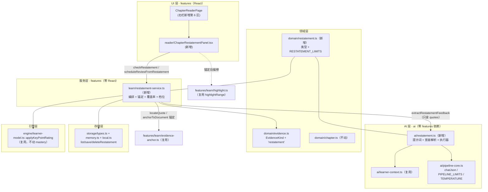
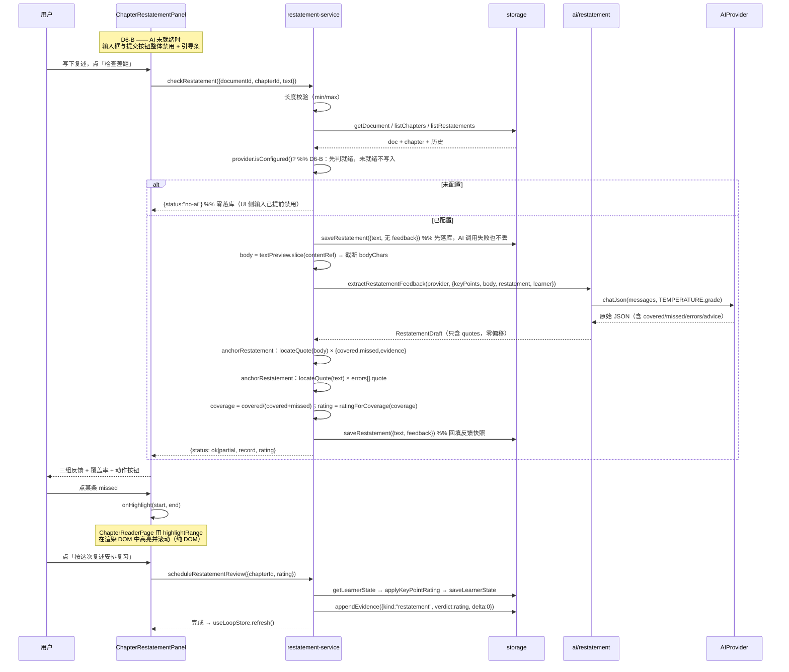

# 费曼式复述 + AI 差距反馈（Chapter Restatement · 讲给我听）技术方案

| 字段 | 内容 |
|------|------|
| 作者 | Agent / 许一 |
| 日期 | 2026-09-14 |
| 状态 | **已实施**（2026-09-14；D1–D5 取推荐 A，D6 取 B —— 无 AI 直接阻断 + 引导配置。实施结果与 2 处偏差见 §13；runbook `docs/learn-feynman-restatement-task-runbook-2026-09.md` T1–T18 全部 done） |
| 关联需求 | `docs/roadmap-next-features-plan-2026-09.md` §F5 范围第 3 条「**费曼输出**：用自己的话复述 → AI 对照原文给出差距反馈 → 可一键转为一道主观题进入掌握度闭环」 |
| 前置已落地 | 第 1 条「章内提问」已实施（`docs/learn-chapter-qa-design-2026-09.md`，2026-09-14） |
| 本方案不做 | 第 2 条「高亮与笔记」、第 4 条「自测卡」（见 §2.2 非目标） |

---

## 1. 背景

### 1.1 业务背景与用户痛点

`docs/roadmap-next-features-plan-2026-09.md` 的核心判断至今成立：

> 产品叫「自我学习**评测**」，但两半的成熟度严重不对称 —— 评测侧 ⭐⭐⭐⭐ 可对外演示，学习侧 ⭐⭐ 被动接收为主。**用户在整个"学习"环节没有任何主动加工动作**。
>
> 用户在整个"学习"环节**没有任何主动加工动作** —— 不能划线、不能记笔记、不能提问、**不能复述**。

第 1 条「章内提问」（`ChapterReaderPage` 右栏第 4 区）已于 2026-09-14 落地，把「读的时候想问」这个出口补上了。但它有一个**结构性局限**：

> **提问是"输入"，不是"输出"。** 章内提问的产物是**答案**（AI 给的、锚回原文的），用户本人依然没有产出任何东西。
> 用户读完一章后最大的认知风险是 **"以为自己懂了"** —— 而唯一的检验方式是 **让他自己讲一遍**。

费曼技巧（Feynman Technique）的机制正是这一点：**复述暴露的是理解缺口，而不是记忆缺口**。用户用大白话讲一遍，讲到卡壳的地方就是没真懂的地方。但**自我发现缺口很难**——用户不知道"自己漏掉了原文的哪一段"。这就是 AI 应当且只能承担的部分：**对照原文，把"你没讲到的"和"你讲岔了的"逐条指出来，并给出可核对的原文依据**。

### 1.2 触发原因

F5 共四条范围，按「先做提问（已落地）→ 再做费曼输出 → 再补高亮笔记 → 最后自测卡」的依赖序推进：

| 理由 | 说明 |
|------|------|
| **F5 的 Done 标准点名这两项** | roadmap §F5 Done 标准首条：「至少落地『章内提问 + 费曼输出』两项，且提问答案 100% 带原文锚点」。提问已 ✅，**费曼输出是达标的最后一环** |
| **前置能力已全部就绪** | `locateQuote`/`anchorToDocument`（`features/learn/evidence-anchor.ts:75/108`）已落地；`highlightRange`（`features/learn/highlight.ts:39`）已落地；`chatJson`+`TEMPERATURE.grade`（`ai/pipeline-core.ts:69`）已有多处先例；`buildLearnerContextBlock`（`ai/learner-context.ts`）F1 刚落地可复用 |
| **与产品定位咬合最紧** | 「自我学习评测」的"自我评测"部分，现在只有**客观题判分**一种形态。费曼复述是**唯一一种"由用户生成、由系统评"的开放形态**，与产品名直接对应 |
| **风险面已被第 1 条探明** | 章内提问已验证「锚不上即丢弃」的护栏在本项目的小模型上可行（`test:qa` 27 项全绿）。本方案复用同一套信任模型，不新造 |

### 1.3 与现有产品/模块的关系

| 现有模块 | 关系 |
|---|---|
| `ChapterReaderPage`（`src/features/learn/ChapterReaderPage.tsx`） | **唯一落点**。右栏现为 5 区，本方案新增第 6 区 |
| 章内提问（`reader/ChapterQaPanel.tsx`） | **同级并列**。两者都是"阅读时的主动动作"，但方向相反：提问 = 输入（要答案），复述 = 输出（要反馈） |
| `engine/learner-model.ts` | 复用 `applyKeyPointRating`（只写调度 + confidence，**不动 mastery**），D3 见 §2.1 |
| `domain/evidence.ts` Evidence log | 新增 `EvidenceKind = "restatement"`（**跨切面**，见 §3.4 G2） |
| F1 学习者画像（`ai/learner-context.ts`） | 复用 `buildLearnerContextBlock` 注入背景块；**这是画像的第 3 个真实消费点** |
| 主观题批改（`ai/pipelines.ts::gradeSubjectiveWithAi`） | **本方案不调用**。理由见 §3.4 G1 与 D3-B（"转主观题"的真实口径需要先决策） |

### 1.4 不做会怎样

- F5 永远停在"只做了提问"，Done 标准不达标；
- 「学习侧只有被动接收」这个最大产品空白保持原样 —— 用户读完一章，系统**无法回答"我到底讲清楚了吗"**；
- F3「学习复盘与趋势」将缺少最有价值的一类证据（用户自己的产出），复盘只剩卷面分曲线。

---

## 2. 方案目标

### 2.1 决策点（已确认）

> 2026-09-14 拍板：**D1–D5 取推荐 A**，**D6 取 B（无 AI 直接阻断 + 引导配置）** —— 见下表「结论」列。D6 改档理由与牵连面见 §2.3。

| ID | 决策点 | 选项 | 结论 |
|----|--------|------|------|
| **D1** | **复述结果是否落库？** | **A（推荐）** 落库：新建 `Restatement`（章级、localStorage key `plos.restatements`、tauri 继承 LocalStorageAdapter）<br>B 只读：对齐章内提问的零写入承诺，产出即弃 | **A ✅** |
| **D2** | **AI 差距反馈的产物结构？** | **A（推荐）** 三组分类 + 逐条可锚定引文：`covered[]`（你讲到）/ `missed[]`（你漏掉）/ `errors[]`（你讲岔了）/ `advice`<br>B 单段自由文本（"你基本讲对了，但漏了 X"） | **A ✅** |
| **D3** | **复述如何"进入闭环"？**（roadmap 原话为"进入掌握度闭环"，与现状有冲突，见 §3.4 G1） | **A（推荐）** 写 **证据流**（`EvidenceKind="restatement"`，delta=0）+ 提供**显式**「按这次复述安排复习」（`applyKeyPointRating`，写 nextReviewAt/confidence，**不动 mastery**）<br>B 生成"最小卷"（1 道主观题 + 从 keyPoints 派生 ≥1 道客观小题）走既有卷面链路 → 由 `applyPaperResult` 写 mastery<br>C 改 V2 双证据原则，允许 AI 主观证据写 mastery | **A ✅** |
| **D4** | **反馈档位从哪里来？** | **A（推荐）** **本地算**：`coverage = covered / (covered + missed)`，再由覆盖率本地映射复习档位（确定性、可复算、可单测）<br>B 让模型额外输出 `score` 0..1，本地夹取 | **A ✅** |
| **D5** | **落点位置？** | **A（推荐）** `ChapterReaderPage` 右栏新增**第 6 区**（与章内提问同级），不新增路由<br>B 新路由 `/learn/:chapterId/restate`（独立工作台）<br>C 与第 4 区合并为 Tab（问答 / 复述） | **A ✅** |
| **D6** | **AI 未配置时的行为？** | A 复述文本照常落库（用户产出不该因没配 AI 就丢），反馈区显示"配好模型再回来检查"<br>**B（选定）** **直接阻断**：输入框与提交按钮整体禁用，面板显示引导条「去配置 AI →」（对齐章内提问 / 概念提炼的既有禁用态）；**零落库、零模型调用** | **B ✅**（改档，理由见 §2.3） |

### 2.2 阶段目标

| 类型 | 描述 |
|------|------|
| **主要目标** | 用户在章节阅读页能"用自己话讲一遍"，得到**逐条锚回本章原文**的差距反馈（讲到了什么 / 漏了什么 / 哪里讲岔了），复述与反馈**可回看** |
| **非目标** | ① 高亮与笔记（F5 第 2 条，须先定"批注"存储模型）；② 自测卡（F5 第 4 条）；③ 复述的全文语义相似度评分（不做 embedding 相似度，避免"看起来像"的伪指标）；④ 跨章复述（本章为唯一单位，与 `contentRef` 契约一致）；⑤ **不引入任何新的 AI 能力接口**（复用 `chatJson`） |
| **成功标准** | ① 反馈里每条 `covered`/`missed`/`errors` 的引文都能在本章正文 / 复述原文中**逐字（或折叠空白后）**找到，否则该条丢弃（零伪造引用）；② 无 AI 时**输入与提交整体禁用**，**零落库、零模型调用**，且面板给出明确的配置引导；③ 不改动 `Chapter`/`Paper` 既有契约；④ 不传 `learner` 时 AI 提示词与新增前**逐字节相同**；⑤ 复述落库跨刷新保留（localStorage 档）；⑥ 复述与反馈**不写入** mastery（唯一写方仍是卷面） |

---

### 2.3 D6 改档说明（B：无 AI 直接阻断）

原推荐 A 的理由是「用户产出不该因没配 AI 就丢」。改档 B 后，**这个理由不再适用，因为根本不会产生产出** —— 键入通道在入口就是关的。理由与牵连面如下：

| 项 | 内容 |
|---|---|
| **① 复述的价值 100% 来自对照** | 复述的唯一用途是拿到「漏了什么 / 讲岔了什么」。没有 AI 就**没有任何反馈**，落库的只是一段没有对照结论的自述文本 —— 它是**半成品**，不是学习资产。留着它反而会在「往次复述」里堆出无反馈噪声条目（列表口径要额外区分"有反馈 / 无反馈"，复杂度上升） |
| **② 与项目既有约定一致（不是新造）** | 章内提问 `ChapterQaPanel.tsx:54/79/80/130-136` 已是禁用态 + `QaNotice(info)` + `goConfigure → /settings`；概念提炼 `i18n/messages/zh.ts:1268/1276` 同样写「AI 未就绪——请先到设置配置」+「未配置 AI 时概念层保持空白，不凭空生成」。**本项目对"AI 依赖型功能"的一贯做法就是阻断 + 引导**，D6-A 才是偏离 |
| **③ 最短路径就是引导配置** | 用户真实需求是"我现在就想被检查"。阻断 + 一键去设置，比"先存着、回头再来"少一个断点（用户很可能不会再回来点第二次检查） |
| **④ 实现更简单、回归面更窄** | 不需要 `no-ai` 落库分支、不需要 `RestatementStatus="no-ai"` 携带 `record`、不需要 `RestatementResult.record` 在有/无反馈两种语义间摇摆。服务层仍保留同语义的**防御性早退**（返回 `no-ai` 且**不落库**），保证即使被绕过 UI 调用也不会写入 |

**牵连面（本次已同步改齐）**：成功标准 ②（§2.2）、服务层早退**前移到落库之前**（§5.3 / §8.9）、`RestatementStatus="no-ai"` 语义（§4.3.1）、异常分支表（§5.2）、UC-05（§6）、线框态 ③（§7.2）、i18n 文案（§8.12）、测试用例 TC-UC05-*（§12）。

> **不变的部分**：`no-body`（无正文快照）仍是**提交后**的失败态 —— 它在"AI 已配好、文本已写完"之后才被发现，所以沿用原语义（不落库 + 提示），不复用阻断。
> **仍保有"先落库"的位置**：AI **已配置**但**调用失败**时，复述文本照旧先落库（§5.3 第 ② 步），此时"不丢用户产出"的理由成立。

---

## 3. 项目现状

### 3.1 相关代码与模块（均已实地核实）

| 位置 | 现状事实 |
|------|----------|
| `src/features/learn/ChapterReaderPage.tsx:242-342` | 右栏现在是 **5 区**：① 章状态（`t.masteryEyebrow`）② Why it matters ③ Knowledge（`chapter.keyPoints` 芯片）④ 章内提问（`<ChapterQaPanel>`，第 312-319 行）⑤ Evidence |
| `ChapterReaderPage.tsx:198` | `const body = doc.textPreview?.slice(chapter.contentRef.start, chapter.contentRef.end) ?? ""` —— **章正文的唯一取法**，本方案的对照基准 |
| `ChapterReaderPage.tsx:28/122-137` | 已有 `highlightRange` + `HIGHLIGHT_WINDOW` 两帧高亮机制；`highlight`（章内相对偏移）优先于 `?at=`（文档绝对偏移） |
| `ChapterReaderPage.tsx:157-176` | `markReviewed()` 已示范"读 state → `applyKeyPointRating` → `saveLearnerState` → `appendEvidence({kind:"review",verdict:"good",delta:0})` → `refresh(m)`"完整写路径 —— **本方案的调度写回照此办理** |
| `src/domain/chapter.ts:64-85` | `Chapter` 字段：`contentRef{start,end}`（**doc.textPreview 绝对偏移**）、`keyPoints: string[]`、`keyPointRefs?: KeyPointRef[]`（`quote`+`start`+`end`，**start/end 亦是绝对偏移**）、`status` |
| `src/features/learn/evidence-anchor.ts:75/108/14` | `locateQuote(body, quote)` 两档匹配（精确 → 折叠空白）返回**相对 body** 的 `[start,end)`；`anchorToDocument(body, quote, base)` 叠加章起点 → 绝对偏移；`MAX_QUOTE_CHARS = 2000` |
| `src/features/learn/highlight.ts:21/39` | `HIGHLIGHT_WINDOW = 120`；`highlightRange(root, start, end)` 在渲染 DOM 中按字符区间高亮 + 滚动（纯 DOM、无 React） |
| `src/ai/pipeline-core.ts:30-66/69` | `PIPELINE_LIMITS`（含 `chapterBlockMaxChars: 12_000`、`keyPointMergeMax: 8`、`keyPointMaxChars: 60`、`keyPointQuoteMaxChars: 200`）；`TEMPERATURE = {refine .2, quiz .3, grade .1, concept .2, keyPoint .2}` |
| `src/ai/chapter-qa.ts:88-124` | **可直接复刻的先例**：`parseChapterQaAnswer`（宽容取值 + 严判）、`answerChapterQuestion`（`chatJson(provider, messages, TEMPERATURE.grade)`） |
| `src/ai/learner-context.ts` | `buildLearnerContextBlock(profile?)` + `LEARNER_CONTEXT_LIMITS`，含防注入（剥 ```、去控制字符、截断、免责声明）。**F1 的第 3 个消费点** |
| `src/domain/qa.ts:36-61` | **服务层只产分类、文案由 UI 走 i18n** 的既有写法（`ChapterAnswerStatus` 六态 + `ChapterQaErrorKind`）—— 本方案照此结构 |
| `src/domain/evidence.ts:16` | `export type EvidenceKind = "assessment" \| "review"` —— **只有两种**，扩展点是跨切面的（§3.4 G2） |
| `src/engine/learner-model.ts:219-239` | `applyKeyPointRating(state, subjectId, rating, now)` —— 只写 `confidence` / `lastReviewedAt` / `nextReviewAt`，**注释明确"不移动 mastery / attempts / correctCount"** |
| `src/engine/quiz-engine.ts:609-652` | `gradeAndApply` → `applyPaperResult`：**mastery 的唯一写方**；关键护栏在 `:621` —— `if (ch.score === undefined) continue;`（**无客观分的章不回写**） |
| `src/engine/quiz-engine.ts:692-722` | `mergeSubjectiveGrades` 注释明确：「**本函数不触碰 perChapter / 不回写 learnerState**，保证平滑回写可复算、不受模型/重试波动影响」 |
| `src/ai/pipelines.ts:343-432` | 既有主观题批改三件套 `SubjectiveGradeItem` / `buildGradeMessages` / `gradeSubjectiveWithAi` 已在，但**产物只进 `totalScore`（展示口径），不进 mastery** |
| `src/storage/types.ts:156-160` | F1 刚落地的画像方法模式：`getProfile(): Promise<LearnerProfile \| undefined>` / `saveProfile(profile \| undefined)` —— 新存储方法照此模式（interface + `memory.ts` + `local.ts`，`tauri.ts` 继承） |
| `src/storage/local.ts:42/90/93` | `KEY_PROFILE = "plos.learner-profile"` 的落地三处：常量声明 → 构造函数 `load` → `persist()` 写入 |
| `src/stores/useLoopStore.ts:46/59/129` | `profile` 状态 + `saveProfile` 动作 + `refresh()` —— 供参考的 store 写路径；**本方案不需要改 store**（见 §4.4） |
| `src/hooks/useAiReady.ts` | 响应式 AI 就绪（订阅 `useSettingsStore.providerReady`，配好即亮、撤掉即暗），章内提问面板已在用 |
| `src/features/learn/reader/ChapterQaPanel.tsx:54/79-80/130-136` | **D6-B 的直接先例**：`canAsk = aiReady && …`；`placeholder={aiReady ? t.placeholder : t.notReady}`；`disabled={!aiReady \|\| asking}`；`!aiReady` 时渲染 `QaNotice(kind="info", text=t.notReady, action={label:t.goConfigure, to:"/settings"})` |
| `src/i18n/messages/zh.ts:1219-1220` / `:1268`/`:1276` | 同族文案先例：`learn.reader.qa.notReady`「AI 未就绪——请先到「设置 → AI 模型中心」配置模型后再提问。」+ `goConfigure`「去配置 AI →」；概念层 `notReady` / `goConfigure` 同款（且明写「未配置 AI 时概念层保持空白，不凭空生成」） |
| `src/i18n/messages/zh.ts:1179-1234` | `learn.reader` 区结构；`learn.reader.qa.*` 在 1211-1233 行 —— 本方案新增 `learn.reader.restatement.*` 紧邻其后 |
| `src/i18n/messages/zh.ts:88-99` | `units.action` 键表：`learn/review/practice/remediation/assessment/explore/learn-chapter/chapter-quiz/retake-quiz/review-points` —— 新增 `restatement` |
| `package.json` · `scripts` | `test:library` **当前为 11 组串联**（`anchor→advice→keypoint→preview→overview→enrich→profile→resume→card→aimap→qa`）；单测脚本样式统一为 `node --experimental-strip-types --no-warnings --import ./tests/register-loader.mjs tests/*.test.ts` |
| `src/components/primitives.tsx` | 可复用原语：`Card` `Section` `SectionTitle` `Bar` `EvidenceRow` `SegmentedTabs` `ActionCard` `Stat` `KnowledgeRow` `BandBadge`；`src/components/ui/confirm-dialog.tsx` 导出 `ConfirmDialog`（二次确认用） |

### 3.2 相关文档与约定

| 文档 | 本方案遵守的内容 |
|------|------------------|
| `rules/pre-task-technical-design.mdc` | 本方案的结构与"先方案后实施"节奏 |
| `rules/layer-import-boundaries.mdc` | `domain/engine/ai` 不得 import React / `features/`；`ai/` 不得 import `features/`；服务层文案一律由 UI 走 i18n |
| `rules/engineering-code-style`（MEMORY 引用） | 服务层**只产分类**，不产文案（`ChapterQaErrorKind` 先例） |
| `docs/learn-chapter-qa-design-2026-09.md` | **最近邻先例**：状态机六态、锚定护栏、零伪造引用、面板内联反馈（无弹层）、`data-testid` 一次到位 |
| `docs/learner-profile-design-2026-09.md` | F1 画像块注入模式（可选参数 + 缺省零回归 + 防注入） |
| `docs/roadmap-next-features-plan-2026-09.md` §F5 | 需求来源；Done 标准（`§F5`「至少落地章内提问 + 费曼输出」） |
| MEMORY.md「验证入口」 | `npm run typecheck` 改完必跑（⚠️ HEAD 有 3 条既存 error，勿误判）；纯逻辑单测 node 直跑 `--experimental-strip-types` |

### 3.3 约束与依赖

| 约束 | 说明与影响 |
|------|-----------|
| **`node --experimental-strip-types` 不支持 JSX** | 所有想被单测覆盖的纯逻辑必须放 `.ts`（锚定、覆盖率、档位映射、解析），**不得留在 `.tsx`**；测试文件也不得 import 任何 `.tsx` |
| **`.ts` 中禁参数属性** | 错误类必须显式字段赋值（`ProfileError` / `ResumeImportError` 先例），不能写 `constructor(readonly kind: K)` |
| **分层红线** | 锚定必须在 `features/` 层（`ai/` 不得反向 import `features/`）；`ai/restatement.ts` 只产 `quotes`，**绝不产偏移量** |
| **服务层不得 import `src/i18n`** | 只产 `status` / `errorKind` 分类；文案由面板 `useI18n` 映射 |
| **`StorageAdapter` 是四后端契约** | 新方法要同时落 `types.ts`（interface）+ `memory.ts` + `local.ts`；`tauri.ts extends LocalStorageAdapter` 自动继承，**零迁移** |
| **不启浏览器校验** | `rules/no-headless-browser-validation`；`data-testid` 写齐但不跑 Playwright |
| 依赖 | 无新增第三方依赖；无上游阻塞 |

### 3.4 ⚠️ 调研中发现的真实缺口（本方案必须处理）

#### G1 · roadmap「转主观题进入掌握度闭环」与现状**直接冲突**

roadmap §F5 第 3 条字面要求：「可一键转为一道主观题**进入掌握度闭环**」。但实地核查后，现状是：

| 事实 | 位置 | 含义 |
|---|---|---|
| mastery 唯一写方 = `applyPaperResult` | `engine/quiz-engine.ts:623` | 只有卷面能改 mastery |
| **无客观分的章一律不回写** | `engine/quiz-engine.ts:621` `if (ch.score === undefined) continue;` | **纯主观题不改 mastery** |
| 主观 AI 分只进 `totalScore` | `engine/quiz-engine.ts:692-722` + 顶部注释 | AI 主观分被显式隔离在 mastery 之外 |
| 设计意图（V2 双证据原则） | `engine/learner-model.ts:8-10` | 「自评只做调度 + confidence 微调，不再移动 mastery」——目的是**不让模型波动污染掌握度** |

⇒ 「一键转成一道主观题」**在当前架构下不会改变掌握度**。若照字面实现并宣称"进入掌握度闭环"，就是**过度承诺**（与本项目一贯的"零伪造"原则相悖）。

**处理方式**：升级为决策点 **D3**，三选项并列（A 只写证据流+调度 / B 走含客观题的最小卷 / C 改双证据原则），推荐 A 并在方案内**登记该表述偏差**。

#### G2 · `EvidenceKind` 扩展是**跨切面**改动，不是纯追加

`EvidenceKind` 目前只有 `"assessment" | "review"`，被两处消费：

| 位置 | 写法 | 新增 kind 后的后果 |
|---|---|---|
| `src/features/home/HomePage.tsx:360` | `function evidenceActionLabel(kind: "assessment" \| "review", m)` —— **窄字面量参数** | **typecheck 报错**（`EvidenceKind` 不可赋值）→ 好报错，强制修正 |
| `src/features/goals/GoalDetailPage.tsx:470` | `m.units.action[e.kind === "assessment" ? "assessment" : "review-points"]` —— 内联三元 | **静默**把 `restatement` 显示成「复习要点」→ **必须显式修**（typecheck 不拦） |

**处理方式**：① 新增 `units.action.restatement` 文案键；② 两处消费点改为 `switch`/显式映射（推荐抽一个共享 `evidenceActionKey(kind)` 纯函数，供两页复用，避免第三次漂移）。

#### G3 · 复述对照基准**不能用 `hybridSearch`**

章内提问走 `retrieveChapterContext`（top-k 检索）。但复述的反馈必须回答"**你有没有覆盖全章**" —— 检索会**按查询词偏置**：用复述文本去检索，命中的恰好是"你已经讲到的部分"，**漏掉的部分永远检索不到**，`missed[]` 从机制上就无法产生。

**处理方式**：对照基准 = **整章正文（`contentRef` 切片）+ `chapter.keyPoints` 全量**，不走检索。正文超长时按 `RESTATEMENT_LIMITS.bodyChars` 截断，并在 UI 明示"仅对照前 N 字"（诚实降级，不假装覆盖全章）。

#### G4 · 章正文可能超长，截断策略必须显式

`PIPELINE_LIMITS.chapterBlockMaxChars = 12_000`（章内分块上限）说明单章可达万字级。全章正文 + 复述 + 要点一同入提示词有爆上下文风险（小模型尤甚）。

**处理方式**：`RESTATEMENT_LIMITS.bodyChars`（建议 12_000，与 `chapterBlockMaxChars` 同口径）+ `keyPoints` 先截断到 `keyPointMergeMax`(8) 条。**超限时 `truncated: true` 回传 UI**，面板显式提示。

#### G5 · 「不信 AI 偏移量」护栏必须**延伸到复述本身**

既有护栏只覆盖"AI 引文 → 原文"。本方案新增一类引文：**`errors[].quote` 是"复述里讲岔了的那句话"**，锚定目标是**用户自己写的复述文本**。

**处理方式**：`errors[].quote` 用 `locateQuote(restatementText, quote)` 锚回复述文本；`errors[].evidence`（原文正确说法）用 `locateQuote(body, evidence)` 锚回章正文。**两类引文各自锚定，任一条锚不上即丢弃该条**（零伪造引用不变）。

---

## 4. 技术架构

### 4.1 总体架构



**分层要点**

1. **锚定在 `features/`、不在 `ai/`**：`ai/restatement.ts` 只产出 `quotes: string[]` 与 `point`；`start/end` 一律由 `restatement-service.ts` 用 `locateQuote` 反查（照抄章内提问的分工，`ai/chapter-qa.ts:5-6` 注释所载理由）。
2. **AI 层零 `features/` 依赖**：`ai/restatement.ts` 只 import `./pipeline-core`、`./types`、`./learner-context`，**不 import `pipelines.ts`**（无环、无 TDZ 风险）。
3. **服务层零 React / 零 i18n**：只产 `status` + `errorKind` 分类。
4. **存储层零迁移**：沿用 blob/localStorage（章级数据既有先例），`tauri.ts` 继承 `LocalStorageAdapter`。

### 4.2 模块职责

| 模块/层级 | 职责 | 技术选型 |
|-----------|------|----------|
| `domain/restatement.ts`（新增） | 复述记录 + 反馈的领域类型；`RESTATEMENT_LIMITS`（UI 与服务层共用同一常量，防两处口径漂移） | 纯类型 + 常量，零依赖 |
| `ai/restatement.ts`（新增） | 提示词构建 / 宽容解析 / 执行器（`chatJson` + `TEMPERATURE.grade`）。**只产 `quotes` 与文字，零偏移量** | 复用 `pipeline-core`；零 IO 可单测 |
| `features/learn/restatement-service.ts`（新增） | 编排：长度校验 → 取 doc/chapter → **无 AI 阻断（先于任何写入，零落库）** → 落库文本 → 调 AI → **双目标锚定** → 本地算覆盖率 → 回填 `feedback`；另有 `scheduleRestatementReview`（调度写回） | 纯 TS（可被 `--experimental-strip-types` 直跑） |
| `features/learn/reader/ChapterRestatementPanel.tsx`（新增） | **阻断态 + 输入 / 检查中 / 反馈 / 历史**：`useAiReady() === false` 时禁用输入与提交并渲染引导条（`QaNotice` 同款），**不发起任何请求**；否则三组反馈渲染 + 点回原文高亮；`data-testid` 齐备 | React + 既有 `Button`/`Textarea`/`Section`/`Spinner` |
| `features/learn/ChapterReaderPage.tsx`（修改） | 右栏插入第 6 区；把 `onHighlight` 接给新面板 | 既有组件 |
| `storage/{types,memory,local}.ts`（修改） | 三个方法：`listRestatements(chapterId)` / `saveRestatement(record)` / `deleteRestatement(id)` | 照 F1 画像三处落地模式 |
| `domain/evidence.ts`（修改） | `EvidenceKind` 加 `"restatement"` | 联合类型 + 注释 |
| `ai/pipeline-core.ts`（修改） | `PIPELINE_LIMITS` 加 4 项复述上限 | 共享常量集中地（既有约定） |
| `i18n/messages/{zh,en}.ts`（修改） | 新增 `learn.reader.restatement.*` + `units.action.restatement` | 两版逐键对齐 |
| `HomePage.tsx` / `GoalDetailPage.tsx`（修改） | 修 G2：evidence kind 映射显式化 | 共享 `evidenceActionKey` |

### 4.3 数据模型与 API

#### 4.3.1 领域类型（`src/domain/restatement.ts` 新增）

```ts
/**
 * 章级复述（费曼式输出的产物）。
 *
 * 定位：**用户产出的学习资产**，与章内提问（纯只读）性质不同 ——
 * 复述是"我写的"，因此落库（决策 D1-A）；落库后不得影响 mastery
 * （唯一写方仍是卷面，见 domain/evidence.ts 与 learner-model.ts 的 V2 双证据注释）。
 *
 * 写入前提：**AI 必须就绪**（决策 D6-B）—— 未配置模型时面板阻断输入、
 * 服务层亦在落库之前早退，因此本记录**必然**对应一次成功的模型调用（feedback
 * 仍可能因调用失败 / 解析失败而为 undefined，那种情况文本保留、可重试）。
 *
 * 引文不变式（由 features/learn/restatement-service.ts::anchorRestatement 保证，单测断言）：
 *   - `covered[].quote` / `missed[].quote` / `errors[].evidence.quote` 为**章内相对偏移**
 *     （相对 chapter.contentRef.start），左闭右开，且必然落在本章正文内；
 *   - `errors[].quote` 为**复述文本内偏移**（锚回用户自己写的那句话）；
 *   - 锚不上的一律丢弃（零伪造引用），不产生"近似位置"。
 */

export const RESTATEMENT_LIMITS = {
  /** 复述太短则没有信息量，服务层直接拒绝（不进 AI）。 */
  minChars: 20,
  /** 复述字符上限（防灌水；UI 与 service 共用）。 */
  maxChars: 2_000,
} as const;

/** 一条"要点已覆盖 / 已遗漏"（引文锚回本章正文）。 */
export interface RestatementPoint {
  /** AI 给的要点描述（≤ PIPELINE_LIMITS.restatementPointMaxChars）。 */
  point: string;
  /** verbatim 章原文摘录（已通过 locateQuote 校验）。 */
  quote: string;
  /** 章内相对偏移（= 文档绝对偏移 − chapter.contentRef.start）。 */
  start: number;
  end: number;
}

/** 一处"复述与原文不符"（quote 锚回复述自身，evidence 锚回章正文）。 */
export interface RestatementMisread {
  /** 复述里被判定不准确的原话（verbatim 摘自语文本）。 */
  quote: string;
  /** 复述文本内偏移。 */
  start: number;
  end: number;
  /** 原文的正确说法（模型给的文字，非引文）。 */
  correction: string;
  /** 原文依据（锚回章正文；锚不上则整条丢弃）。 */
  evidence?: { quote: string; start: number; end: number };
}

/** 一次差距反馈快照（随复述一同落库；纯展示，不参与掌握度）。 */
export interface RestatementFeedback {
  at: number;
  covered: RestatementPoint[];
  missed: RestatementPoint[];
  errors: RestatementMisread[];
  /** 模型给的整体建议（≤ PIPELINE_LIMITS.restatementAdviceMaxChars）。 */
  advice?: string;
  /**
   * 要点覆盖率 = covered / (covered + missed)（**本地算**，不信模型自报，决策 D4-A）。
   * 分母为 0（一条都没锚上）时为 undefined —— UI 不展示伪覆盖率。
   */
  coverage?: number;
  /** 本次对照是否被截断（章正文超 bodyChars）→ UI 显式提示。 */
  truncated: boolean;
}

export interface Restatement {
  id: string;
  documentId: string;
  chapterId: string;
  /** 用户复述原文（≤ RESTATEMENT_LIMITS.maxChars）。 */
  text: string;
  createdAt: number;
  /** 最近一次 AI 差距反馈（未跑 / 失败 = undefined）。 */
  feedback?: RestatementFeedback;
}

/** 检查结果状态（UI 据此分支渲染，不做隐式兜底）。 */
export type RestatementStatus =
  | "ok"        // 有 ≥1 条锚定成功的 covered/missed → 正常展示
  | "partial"   // 模型给了内容，但一条都没能锚回正文 → 展示 advice + 显式警示
  | "no-body"   // 资料无正文快照（textPreview 为空）
  | "no-ai"     // 未配置模型 → **直接阻断（零落库、零请求）**，由面板引导去配置（D6-B）；服务层保留此分支作防御性早退
  | "error";    // 文本非法 / 调用失败 / 解析失败

/** 失败原因分类（服务层只产分类，文案由面板走 i18n）。 */
export type RestatementErrorKind =
  | "too-short"        // < minChars
  | "too-long"         // > maxChars（UI 已拦，service 侧同样拒绝）
  | "not-configured"   // 阻断门通过后模型失效（竞态）—— 「完全未配置」走 status="no-ai"，不走这里
  | "parse"            // 输出无法解析
  | "fetch"            // 存储 / 读取异常
  | "generic";         // 其它（资料 / 章不存在）

export interface RestatementResult {
  status: RestatementStatus;
  /**
   * 落库后的记录。
   * - `ok` / `partial` 时存在；
   * - **`no-ai` 时恒为 `undefined`**（D6-B：阻断门在落库之前，不产生任何记录）；
   * - `error` 时**取决于失败发生在落库前后**：`too-short` / `too-long` / `generic`
   *   在落库前 → `undefined`；AI 调用 / 解析失败在**落库之后**，文本已入库
   *   → 返回 `record`（无 `feedback`），UI 可回看并重试（见 §5.2 与 §13.3 偏差 2）。
   */
  record?: Restatement;
  /** 本地映射的复习档位（status="ok" 时存在；供 UI 预览"安排复习"的效果）。 */
  rating?: SelfRating;
  errorKind?: RestatementErrorKind;
  at: number;
}
```

> `SelfRating` 复用 `domain/learner.ts` 既有四档（`forget | hard | good | easy`），不新造档位。

#### 4.3.2 AI 层契约（`src/ai/restatement.ts` 新增）

```ts
import type { LearnerProfile } from "../domain";
import type { AIProvider, ChatMessage } from "./types";
import { chatJson, isRecord, PIPELINE_LIMITS, str, TEMPERATURE } from "./pipeline-core";
import { buildLearnerContextBlock } from "./learner-context";

export const RESTATEMENT_SYSTEM = [
  "你是严格但建设性的学科老师。用户刚学完一章，用自己的话复述了这一章。",
  "你唯一的依据是下面给出的【本章要点】与【本章正文】。",
  "",
  "请逐项对照，只输出下面的四个字段：",
  "1. covered —— 复述**准确讲到了**的要点；每条给 `point`（一句话）与 `quote`。",
  "2. missed  —— 复述**完全没有讲到**的要点；每条同样给 `point` 与 `quote`。",
  "3. errors  —— 复述中与原文**不符 / 不准确 / 过度外推**的说法；",
  "   每条给 `quote`（逐字引用**用户的复述原文**）、`correction`（原文的正确说法）、",
  "   `evidence`（【本章正文】中支撑该更正的逐字原文）。",
  "4. advice  —— ≤120 字，指出最该补的 1~2 处；不要重复上面已列的内容。",
  "",
  "硬性规则：",
  "A. 严禁使用【本章要点】【本章正文】之外的任何知识；不得补充资料未出现的信息。",
  "B. `quote` / `evidence` 必须**逐字复制**原文，不得改写、不得润色、不得把相隔很远的",
  "   两句拼在一起、不得省略中间内容。每条 ≤200 字。",
  "C. `errors` 只在确实与原文冲突时给。**"没讲到"属于 missed，不属于 errors**。",
  "D. 宁可少给：没有把握的条目不要输出，不要凑数。",
  "",
  '只输出 JSON：{"covered":[{"point":"…","quote":"…"}],',
  '"missed":[{"point":"…","quote":"…"}],',
  '"errors":[{"quote":"…","correction":"…","evidence":"…"}],"advice":"…"}。',
  "不要输出任何其他文字。",
].join("\n");

export interface RestatementInput {
  chapterTitle: string;
  documentTitle: string;
  /** 本章要点（已按 keyPointMergeMax 截断）。 */
  keyPoints: readonly string[];
  /** 章正文（已按 RESTATEMENT_LIMITS.bodyChars 截断）。 */
  body: string;
  /** 用户复述原文。 */
  restatement: string;
  /** F1 学习者画像：注入背景块（缺省 = 不注入，输出与改动前逐字节相同）。 */
  learner?: LearnerProfile;
}

/** 模型原始产出（**不含任何偏移量** —— 偏移一律由 service 层 locateQuote 算出）。 */
export interface RestatementDraft {
  covered: { point: string; quote: string }[];
  missed: { point: string; quote: string }[];
  errors: { quote: string; correction: string; evidence: string }[];
  advice?: string;
}

export function buildRestatementMessages(input: RestatementInput): ChatMessage[];
/** 宽容取值：非对象/字段缺失一律退化为空数组；**绝不抛错**。 */
export function parseRestatementDraft(raw: unknown): RestatementDraft;
/** 执行器：`chatJson(provider, messages, TEMPERATURE.grade)`（事实判定档 0.1）。 */
export async function extractRestatementFeedback(
  provider: AIProvider,
  input: RestatementInput,
): Promise<RestatementDraft>;
```

**解析策略（照抄 `parseChapterQaAnswer` 的"宽容取值 + 严判"）**

| 字段 | 处理 |
|---|---|
| `covered` / `missed` | 逐条：`point = str()?.trim()`、`quote = str()?.trim()`；**任一为空即丢该条**；条数上限 `restatementMaxPoints`（合计）；`quote` 截断到 `restatementQuoteMaxChars` |
| `errors` | 逐条：`quote` 与 `correction` 必填、`evidence` 必填（缺 `evidence` 即丢 —— 没有原文依据的更正在本设计里不可展示）；条数上限 `restatementMaxErrors` |
| `advice` | `str()?.trim()`，截断 `restatementAdviceMaxChars` |
| 整体 | `!isRecord(raw)` → 全空草稿（不抛错，由 service 判 `parse` 失败） |

**新增 `PIPELINE_LIMITS`（`ai/pipeline-core.ts`，与既有键集中管理）**

```ts
restatementMaxPoints: 8,          // covered + missed 合计上限（对齐 keyPointMergeMax）
restatementMaxErrors: 4,          // errors 上限
restatementPointMaxChars: 60,     // 单条 point（对齐 keyPointMaxChars）
restatementQuoteMaxChars: 200,    // 单条 quote / evidence（对齐 keyPointQuoteMaxChars）
restatementAdviceMaxChars: 120,   // advice（对齐主观批语口径）
restatementBodyChars: 12_000,     // 章正文注入上限（对齐 chapterBlockMaxChars）
```

**提示词骨架（供 §8 伪代码引用）**

```
system: RESTATEMENT_SYSTEM
user:
资料：《{documentTitle}》 · 当前章：《{chapterTitle}》
【本章要点】
· {kp1}
· {kp2}
...
【本章正文】
{body(≤restatementBodyChars)}
【用户复述】
{restatement}
（{buildLearnerContextBlock(learner)} ← 仅当传入 learner 时追加）
```

#### 4.3.3 数据读写（遵循 `rules/layer-import-boundaries.mdc`）

```
UI (ChapterRestatementPanel.tsx)
  ├─ 写：checkRestatement({documentId, chapterId, text})       → features 服务层
  │        └─ storage.saveRestatement(record)                  → storage 适配层
  └─ 读：storage.listRestatements(chapterId)                  → storage 适配层
         （面板经服务层提供的 listChapterRestatements 包装，避免 UI 直接摸 storage）
```

| 层 | 允许的依赖 | 本方案的落法 |
|---|---|---|
| `domain/` | 无 | `restatement.ts` 只含类型 + 常量 |
| `ai/` | `domain` `ai/*` | `restatement.ts` 只 import `./pipeline-core` `./types` `./learner-context` + `domain` 的 `LearnerProfile` **类型** |
| `engine/` | `domain` | **零改动**（复用既有 `applyKeyPointRating`） |
| `features/`（服务） | `domain` `ai` `storage` `engine` | `restatement-service.ts` 编排 + 锚定 |
| `features/`（UI） | 上面全部 + `i18n` | `ChapterRestatementPanel.tsx` 只做渲染与状态 |
| `storage/` | `domain` | 新增三方法，四后端契约 |

**持久化与迁移**

| 后端 | 落法 | 迁移 |
|---|---|---|
| `local`（浏览器预览） | `KEY_RESTATEMENTS = "plos.restatements"`：常量 → 构造函数 `load` → `persist()` 写入（与 `KEY_PROFILE` 三处同模式） | **无**（新 key，不存在旧数据） |
| `tauri`（桌面） | `TauriStorage extends LocalStorageAdapter` → **自动继承**，无需 `db_*` 命令 | **无** |
| `memory`（单测/SSR） | `protected restatements: Map<string, Restatement>` | **无** |

> **不做 SQLite 表**：复述是章级轻量数据，量级与 `LearnerState`/`Goal` 同级（既有先例即 blob），迁移成本 > 收益。若将来条目量变大，再走"概念层迁移"既有路径（`docs/knowledge-sqlite-prereq-plan-design-2026-09.md`）。

**桌面能力**：本方案**不触碰** `invoke('vault_*' | 'llm_*')`；非 Tauri 环境无额外守卫需求。

### 4.4 状态与副作用

| 状态 | 归属 | 说明 |
|---|---|---|
| 复述输入文本 | 面板本地 `useState` | 卸载即弃；失焦不自动保存（显式提交才落库） |
| 检查中标志 / 结果 | 面板本地 `useState` | 用 `aliveRef` 丢弃迟到 `setState`（照抄 `ChapterQaPanel` 的卸载保护） |
| 历史复述列表 | 面板本地 `useState`（挂载时 `listChapterRestatements` 拉取） | 删除后本地同步移除 |
| 高亮区间 | **上提到 `ChapterReaderPage`**（既有 `highlight` state） | 面板通过 `onHighlight(start,end)` 回传**章内相对偏移**；复用页面既有两帧高亮 effect |
| AI 就绪标志 | `useAiReady()`（订阅 `useSettingsStore.providerReady`） | **响应式**（配好即亮）；为 `false` 时输入与提交整体禁用 + 渲染引导条，**零请求、零写入**（D6-B） |
| 持久化复述 / 反馈 | `storage`（localStorage / Tauri） | **不进 `useLoopStore`**（见下） |

**为什么不需要改 `useLoopStore`**：`ChapterLoopSnapshot` 服务于首页/计划页（目标、队列、就绪度），复述不参与计划决策。而阅读页**既有先例就是直接 `storage`**（`listChapters` / `getLearnerState` / `listPaperResults` / `saveChapters`）。因此：面板 → 服务层 → `storage`，**零 store 改动**，diff 更小、回归面更窄。

**副作用触发时机**

| 时机 | 副作用 |
|---|---|
| 面板挂载 | `listChapterRestatements(chapterId)`（只读；**AI 未就绪时依然执行**，保证历史复述仍可回看） |
| 用户点「检查差距」 | ① **先判 `provider.isConfigured()`** → 未就绪直接返回 `no-ai`（**不落库**）；② 已就绪 → 落库复述 → 调 AI → 锚定 → 回填 `feedback` → 重渲染 |
| 用户点「回到原文核对」 | `onHighlight(start, end)` → 页面 `highlightRange`（纯 DOM，无 IO） |
| 用户点「按这次复述安排复习」（D3-A 的显式动作） | `applyKeyPointRating` + `saveLearnerState` + `appendEvidence` + `useLoopStore.refresh()` |
| 用户删除某条历史复述 | `deleteRestatement(id)`（二次确认） |
| 切换章 / 离开页面 | 本地 state 丢弃；已落库的不受影响 |

---

## 5. 交互流程

### 5.1 主流程

1. 用户进入 `/learn/chapter/:chapterId`（`ChapterReaderPage`），右栏第 6 区看到「讲给我听」；
   - **前置门（D6-B）**：`useAiReady() === false` 时输入框与提交按钮**整体禁用**，面板渲染引导条「去配置 AI →」；流程止于此处（见 §5.2）；
2. 在输入框用自己的话复述本章（`RESTATEMENT_LIMITS.minChars` ~ `maxChars`，实时字数与超限提示）；
3. 点「检查差距」（或 `Cmd/Ctrl+Enter`）；
4. 系统：**先确认 AI 就绪**（未就绪 → 直接返回 `no-ai`，**零写入**）→ 取章正文与要点 → **先落库复述文本**（保证用户产出不因后续 AI 调用失败而丢）→ 调 AI；
5. AI 返回 `covered` / `missed` / `errors` / `advice`（**不含任何偏移量**）；
6. 服务层**双目标锚定**：
   - `covered[].quote` / `missed[].quote` / `errors[].evidence` → `locateQuote(body, …)` → 章内相对偏移；锚不上即丢；
   - `errors[].quote` → `locateQuote(restatementText, …)` → 复述内偏移；锚不上即丢；
7. 本地算 `coverage = covered / (covered + missed)`；由覆盖率映射复习档位；
8. 把 `feedback` 写回该条复述记录；
9. UI 三组展示：
   - **你讲到的**（`covered`）—— 每条可点 → 正文高亮（章内相对偏移）
   - **你漏掉的**（`missed`）—— 同上
   - **讲岔了的**（`errors`）—— 展示复述原话 + 原文正确说法 + 依据（可点回正文）
   - **下一步**（`advice`）+ 「要点覆盖 X/Y」
10. 底部动作：［按这次复述安排复习］（显式写调度 + 落证据）、［清空重写］；
11. 折叠区「往次复述」列出该章历史记录（时间 + 覆盖率 + 首行摘录），可展开回看 / 删除。

### 5.2 分支与异常流程

| 场景 | 触发条件 | 系统行为 | UI 反馈 |
|---|---|---|---|
| 复述过短 | `text.length < minChars` | 不进 AI、不落库 | 输入框下方红字「至少写 N 字再检查」 |
| 复述过长 | `> maxChars` | UI 直接拦截；service 侧同样拒绝 | 红字「复述请控制在 N 字以内」 |
| **无正文快照** | `doc.textPreview` 为空 | 不落库、不进 AI | `no-body`：「这份资料没有保存正文快照，无法对照」 |
| **无 AI**（D6-B 阻断） | 面板：`useAiReady() === false`；服务层：`provider.isConfigured() === false` | **直接阻断** —— 输入与提交整体禁用；服务层在**落库之前**同步早退：不落库、不调 AI、不伪造反馈 | `no-ai`：引导条「AI 未就绪 —— 复述要和原文对照才有意义，请先配置模型。」+「去配置 AI →」（`/settings`）；配好后回来即可直接写 |
| 章正文超长 | `body.length > restatementBodyChars` | 截断后入提示词，`feedback.truncated = true` | 反馈顶部灰字提示「仅对照了本章前 N 字」 |
| 模型输出不可解析 | `chatJson` 抛 / `parseRestatementDraft` 全空 | 记录仍保留（无 feedback） | `error` + `errorKind="parse"`：「AI 返回的内容无法解析，请重试」+ 重试 |
| **一条都没锚上** | `covered + missed` 全被丢弃 | 保存 `feedback`（含 `advice`），`coverage = undefined` | `partial`：显式警示「这次反馈没能核对回你的原文，请谨慎采信」+ 重试 |
| 模型误报 `errors` | `errors[].quote` 锚不上复述文本 | **丢弃该条**（零伪造） | 该条不出现（不提示、不占位） |
| 调用失败 | 网络 / 模型侧错误 | 记录保留（无 feedback） | `error` + `errorKind="fetch"` + 重试 |
| 存储失败 | `saveRestatement` 抛 | 不阻塞主流程（复述已入内存），反馈照常展示 | 顶部提示「未能保存这次复述」 |

### 5.3 时序图（主流程 + 双目标锚定）



---

## 6. 用户用例（User Cases）

### UC-01：复述一章并拿到差距反馈

| 项 | 内容 |
|----|------|
| 角色 | 学习者（已导入资料、AI 已配置） |
| 前置条件 | 章已切分、`doc.textPreview` 非空、AI 已就绪 |
| 主流程步骤 | 1. 打开章节阅读页 2. 在第 6 区写下复述 3. 点「检查差距」 |
| 期望结果 | 三组反馈展示；每条 `covered`/`missed` 的引文可点回正文高亮；`errors` 展示复述原话 + 原文正确说法 + 依据；显示「要点覆盖 X/Y」；复述已落库 |
| 异常/边界 | 一条都没锚上 → `partial` + 警示；无 `errors` → 该组不渲染（不占位） |

### UC-02：复述有遗漏 → 反馈指出漏掉的要点

| 项 | 内容 |
|----|------|
| 前置条件 | 同上；复述只覆盖了本章部分要点 |
| 主流程步骤 | 同上 |
| 期望结果 | `missed[]` 非空，每条带章原文引文；点击引文回原文高亮 |
| 异常/边界 | `missed[].quote` 锚不上 → 丢该条（宁可少列，不编） |

### UC-03：复述有偏差 → 反馈指出讲岔的地方

| 项 | 内容 |
|----|------|
| 前置条件 | 复述中有与原文不符的说法 |
| 期望结果 | `errors[]` 展示：复述原话（引号标出）+ 原文正确说法 + 可点回的原文依据 |
| 异常/边界 | 「没讲到」不应被报成 `errors`（提示词规则 C 明确）；模型仍误报且锚不上 → 静默丢弃 |

### UC-04：无正文快照

| 项 | 内容 |
|----|------|
| 前置条件 | `doc.textPreview` 为空（老数据 / 导入未存正文） |
| 期望结果 | `no-body`：**输入框与提交按钮 `disabled`**（先于提交即可发现），不落库、不进 AI，显示「无法对照」 |
| 异常/边界 | 无 |

### UC-05：未配置 AI → 直接阻断并引导配置（D6-B）

| 项 | 内容 |
|----|------|
| 前置条件 | `useAiReady() === false`；或服务层被直接调用且 `provider.isConfigured() === false` |
| 主流程步骤 | 进入章节阅读页（**写不了复述** —— 输入框与提交按钮为禁用态）→ 点引导条上的「去配置 AI →」 |
| 期望结果 | 面板显示引导条「AI 未就绪 —— 复述要和原文对照才有意义，请先配置模型。」；输入框 `disabled`、提交按钮 `disabled`；**零落库、零模型调用**；引导条跳 `/settings` |
| 异常/边界 | 配好模型后 `useAiReady` 变 `true` → 输入框即亮（**响应式**，无需刷新页面）；此前的历史复述**仍可回看**（只读不受阻断影响）；若 UI 被绕过直接调服务层 → 同样早退（`status="no-ai"`、`record === undefined`、`saveRestatement` 零调用） |

### UC-06：模型返回不可解析内容

| 项 | 内容 |
|----|------|
| 前置条件 | 小模型输出被截断 / 非 JSON |
| 期望结果 | `error` + `errorKind="parse"`；复述仍在；显示重试 |
| 异常/边界 | 重试成功后覆盖 `feedback` |

### UC-07：反馈无法锚回原文（诚实警示）

| 项 | 内容 |
|----|------|
| 前置条件 | 模型给了内容但所有引文均无法定位（改写 / 拼接） |
| 期望结果 | `partial`：展示 `advice`（若有）+ 显式警示「未能核对回你的原文，请谨慎采信」；**不显示伪覆盖率** |
| 异常/边界 | 这正是"零伪造引用"护栏生效的表现，不是故障 |

### UC-08：回看历史复述

| 项 | 内容 |
|----|------|
| 前置条件 | 该章已有 ≥1 条复述记录 |
| 主流程步骤 | 展开「往次复述」→ 点某条 |
| 期望结果 | 展开该条原文与反馈快照；可再次点引文回原文高亮 |
| 异常/边界 | 记录数为 0 → 折叠区不渲染 |

### UC-09：删除一条复述

| 项 | 内容 |
|----|------|
| 主流程步骤 | 历史条目上点删除 → 二次确认 |
| 期望结果 | 记录被删除，列表同步移除；**不影响** 掌握度 / 章状态 / 试卷 |
| 异常/边界 | 取消 → 无任何变化 |

### UC-10：按复述安排复习（D3-A）

| 项 | 内容 |
|----|------|
| 前置条件 | 反馈成功（`status="ok"`） |
| 主流程步骤 | 点「按这次复述安排复习」 |
| 期望结果 | 该章 `nextReviewAt` / `lastReviewedAt` / `confidence` 按档位更新；evidence log 新增一条 `kind="restatement"`；首页/目标页 Evidence 区出现该条（标签为「复述」）；**掌握度不变** |
| 异常/边界 | 无反馈（`partial` 无 `coverage`、或 `error`）→ 按钮不渲染；`no-ai` 下**不存在该动作**（面板处于阻断态，无记录可依据） |

### UC-11：切换章节

| 项 | 内容 |
|----|------|
| 主流程步骤 | 在第 6 区写完未提交 → 切到另一章 |
| 期望结果 | 未提交文本丢弃（与章内提问的会话级语义一致）；该章已落库的复述不受影响 |
| 异常/边界 | 迟到 `setState` 被 `aliveRef` 丢弃 |

---

## 7. 线框 UI（Wireframe）

### 7.1 `ChapterReaderPage` — 右栏第 6 区（默认状态）

```
┌───────────────────────────────────────────────────────────────┐
│  ← 章节目录                                                    │
│  《RAG 学习笔记》 · 第三章                          [学习中]  │
├──────────────────────────────┬────────────────────────────────┤
│                              │  本章掌握度              42%    │
│  第三章 检索                  │  ▓▓▓▓▓▓░░░░░░░░░░               │
│  ────────────────────────    │  卷面测验后按「0.65×卷面分…」    │
│                              │                                │
│  （章正文渲染）               │  为什么重要                     │
│                              │  · 检索质量决定回答上限          │
│                              │                                │
│                              │  本章知识                       │
│                              │  [检索] [召回] [重排]           │
│                              │                                │
│                              │  问这一章                       │
│                              │  ┌──────────────────────────┐  │
│                              │  │ 就这一章提问…            │  │
│                              │  └──────────────────────────┘  │
│                              │                                │
│                              │  ─────────────────────────────  │  ← 新增
│                              │  ✎ 讲给我听                     │
│                              │  ┌──────────────────────────┐  │
│                              │  │ 用你自己的话，把这章讲一遍…│  │
│                              │  │                          │  │
│                              │  └──────────────────────────┘  │
│                              │  0/2000                        │
│                              │            [ 检查差距 ]         │
│                              │  提示：AI 只依据本章原文，指出   │
│                              │  你覆盖了什么、漏了什么、哪里…  │
│                              │                                │
│                              │  证据                           │
│                              │  测评 · RAG 学习笔记            │
│                              │  35% → 42%                      │
└──────────────────────────────┴────────────────────────────────┘
```

**布局说明**
- 与第 4 区（章内提问）**同级并列**、视觉结构一致（`<section className="space-y-2">` + `<Section title>` + 圆角边框容器），保持右栏节奏；
- 窄屏（`< lg`）右栏落到正文下方，宽度随 `minmax(0,1fr)` 收缩；
- 面板不引入任何新视觉 token，全部复用既有 `border-line` / `bg-surface` / `text-ink-*` / `text-state-failed`；
- **上图是 AI 已就绪的默认态**；未配置 AI 时输入区整体禁用并出现引导条（见 §7.2 ③）—— 面板形状保持不变，避免"功能忽隐忽现"导致用户找不到入口。

**组件映射**：`Section`（`components/primitives`）、`Button`（`components/ui/button`）、`Textarea`（`components/ui/textarea`）、`Spinner`（`components/ui/spinner`）、`ConfirmDialog`（删除确认，与 `LearnerProfileCard` 同源）。

### 7.2 其他状态

**① 反馈结果（`status="ok"`）**

```
  讲给我听
  ┌──────────────────────────────────────┐
  │ 用你自己的话，把这章讲一遍…            │
  └──────────────────────────────────────┘
  218/2000
              [ 重新检查 ]

  ✓ 要点覆盖 3/5                              ← 本地算
  ┌─ 你讲到的 ────────────────────────────┐
  │ · 检索质量决定回答上限                  │
  │   「检索召回的相关性直接约束…」    ↗    │  ← 点击回正文高亮
  │ · 重排是二次筛选                        │
  │   「重排序在初筛之后按相关性…」    ↗    │
  └───────────────────────────────────────┘
  ┌─ 你漏掉的 ────────────────────────────┐
  │ ⚠ · 分块粒度影响召回                    │
  │   「块过大会稀释语义，过小则…」    ↗    │
  └───────────────────────────────────────┘
  ┌─ 讲岔了的 ────────────────────────────┐
  │ “重排就是重新检索一遍”                  │  ← 复述原话（引号）
  │   原文：重排不重新检索，只对初筛结果重新排序│
  │   依据「重排序在初筛之后…」        ↗    │
  └───────────────────────────────────────┘
  下一步：补上"分块粒度"这一节，并注意区…
  ────────────────────────────────────────
  [ 按这次复述安排复习 ]   [ 清空重写 ]

  ▸ 往次复述（3）
     9/14 要点覆盖 3/5 · 检索质量决定回答…
     9/13 要点覆盖 2/5 · 检索是相似度…
```

**② 检查中**：提交按钮 `disabled` + `<Spinner/>` + 「正在对照原文…」；输入框 `disabled`（防中途改文本导致反馈对不上）。

**③ 未配置 AI（`no-ai` · **阻断态**，D6-B）**

```
  ✎ 讲给我听
  ┌──────────────────────────────────────┐
  │ AI 未就绪——请先到「设置 → AI 模型中心」  │  ← 输入框 disabled + 灰底
  │ 配置模型后再复述。                      │     （placeholder 换成 notReady 文案）
  └──────────────────────────────────────┘
  0/2000
              [ 检查差距 ]                    ← disabled（canCheck=false）
  ℹ AI 未就绪 —— 复述要和原文对照才有意义，请先配置模型。  去配置 AI →
     ↑ QaNotice(kind="info") + action{label:t.goConfigure, to:"/settings"}（与第 4 区同款）
```

- 阻断是**响应式**的：设置页配好模型后 `useAiReady()` 转 `true`，输入框与按钮立即恢复，无需刷新页面；
- **阻断只挡"新建"**：`往次复述` 折叠区照常渲染（历史只读不受影响）；
- 服务层同语义早退（`no-ai` + 零写入），即使 UI 被绕过也不会留下半成品记录。

**④ 一条都没锚上（`partial`）**

```
  ⚠ 这次反馈没能核对回你的原文，请谨慎采信。   [ 重试 ]
  下一步：补上"分块粒度"这一节…
```

**⑤ 无正文快照（`no-body`）**：`这份资料没有保存正文快照，无法对照。`（输入框与提交按钮 `disabled`）

**⑥ 非法长度（`error` + `too-short|too-long`）**：输入框下方红字，提交按钮 `disabled`

**⑦ 解析失败 / 调用失败（`error`）**：红字 + `[ 重试 ]`；复述文本仍在输入框与存储中

**⑧ 空历史**：折叠区「往次复述」整块不渲染（不显示空态文案，避免噪音）

### 7.3 交互说明

| 项 | 说明 |
|---|---|
| 键盘 | `Cmd/Ctrl + Enter` 提交；`Tab` 可达所有引文按钮；引文按钮 `aria-label` 带要点序号 |
| Hover / Focus | 引文行 `hover:bg-subtle hover:text-primary`（与 `CitationList` 同款）；按钮沿用既有 `Button` 焦点环 |
| 无弹层 | 所有反馈**内联在面板内**（与章内提问一致），唯一例外是删除复述的二次确认（复用 `ConfirmDialog`） |
| 高亮 | 点引文 → `onHighlight(章内相对偏移)` → 页面 `highlightRange` 高亮 + 滚动居中；**不跳转**（复述锚定恒在本章，无需 `onJumpChapter`） |
| `data-testid` | `chapter-restatement-root` / `-input` / `-count` / `-submit` / `-resubmit` / `-feedback` / `-coverage` / `-covered-N` / `-missed-N` / `-errors-N` / `-advice` / `-warning` / `-notice-noai` / `-notice-nobody` / `-error` / `-retry` / `-schedule` / `-clear` / `-history` / `-history-N` / `-history-delete-N` |
| **阻断优先级** | `no-ai`（未配置模型）> `no-body`（无正文快照）> 非法长度 —— 三者**都是提交前禁用态**（拦截发生在用户白写一通之前），同一时刻只渲染一条提示 |
| 与第 4 区的一致性 | 阻断态、引导条、`disabled` 判定、`placeholder` 切换全部与 `ChapterQaPanel` 同款写法（`useAiReady` + `QaNotice`），避免右栏相邻两区行为不一致 |

---

## 8. 涉及文件及改动伪代码

> 伪代码仅表达意图与边界，非最终提交代码。

### 8.1 `src/domain/restatement.ts`（新增）

**改动说明**：复述与反馈的领域类型 + 共用上限常量。零依赖（仅 `import type { SelfRating } from "./learner"` 用于 `RestatementResult`）。

```ts
// 伪代码要点
export const RESTATEMENT_LIMITS = { minChars: 20, maxChars: 2_000 } as const;

export interface RestatementPoint { point: string; quote: string; start: number; end: number; }
export interface RestatementMisread {
  quote: string; start: number; end: number;
  correction: string;
  evidence?: { quote: string; start: number; end: number };
}
export interface RestatementFeedback {
  at: number;
  covered: RestatementPoint[];
  missed: RestatementPoint[];
  errors: RestatementMisread[];
  advice?: string;
  coverage?: number;   // 本地算；分母 0 → undefined
  truncated: boolean;  // 章正文被截断
}
export interface Restatement {
  id: string; documentId: string; chapterId: string;
  text: string; createdAt: number; feedback?: RestatementFeedback;
}
export type RestatementStatus = "ok" | "partial" | "no-body" | "no-ai" | "error";
export type RestatementErrorKind =
  "too-short" | "too-long" | "not-configured" | "parse" | "fetch" | "generic";
export interface RestatementResult {
  status: RestatementStatus;
  record?: Restatement;
  rating?: SelfRating;
  errorKind?: RestatementErrorKind;
  at: number;
}
```

### 8.2 `src/domain/index.ts`（修改）

```ts
export * from "./qa";
export * from "./restatement";   // 新增
```

### 8.3 `src/domain/evidence.ts`（修改）

```ts
// EvidenceKind 加 "restatement"（D3-A）；注释同步更新"三类动作"
export type EvidenceKind = "assessment" | "review" | "restatement";
// verdict 语义补充：restatement → 覆盖率派生的 SelfRating 键（forget/hard/good/easy）
// delta 恒 0（复述不改掌握度，见 docs/learn-feynman-restatement-design-2026-09.md §3.4 G1）
```

### 8.4 `src/storage/types.ts`（修改）

```ts
  // ===== 章级复述（F5；决策 D1-A：落库；不参与掌握度）=====
  /** 某章的全部复述记录（createdAt 降序）。 */
  listRestatements(chapterId: string): Promise<Restatement[]>;
  /** 按 id upsert（先落文本、后回填 feedback 均为本方法）。 */
  saveRestatement(record: Restatement): Promise<void>;
  deleteRestatement(id: string): Promise<void>;
```

### 8.5 `src/storage/memory.ts`（修改）

```ts
protected restatements = new Map<string, Restatement>();

async listRestatements(chapterId: string): Promise<Restatement[]> {
  return [...this.restatements.values()]
    .filter((r) => r.chapterId === chapterId)
    .sort((a, b) => b.createdAt - a.createdAt);
}
async saveRestatement(record: Restatement): Promise<void> { this.restatements.set(record.id, record); }
async deleteRestatement(id: string): Promise<void> { this.restatements.delete(id); }
```

### 8.6 `src/storage/local.ts`（修改）

```ts
const KEY_RESTATEMENTS = "plos.restatements";   // 常量区

// 构造函数：this.restatements = new Map(load<Restatement[]>(KEY_RESTATEMENTS, []).map(r => [r.id, r]));
// persist()：localStorage.setItem(KEY_RESTATEMENTS, JSON.stringify([...this.restatements.values()]));
// saveRestatement / deleteRestatement：super 调用后 this.persist();
```

> `tauri.ts` **零改动**（`extends LocalStorageAdapter` 自动继承）。

### 8.7 `src/ai/pipeline-core.ts`（修改）

```ts
export const PIPELINE_LIMITS = {
  // …既有
  /** 复述：covered + missed 合计条数上限（对齐 keyPointMergeMax）。 */
  restatementMaxPoints: 8,
  restatementMaxErrors: 4,
  restatementPointMaxChars: 60,
  restatementQuoteMaxChars: 200,
  restatementAdviceMaxChars: 120,
  /** 复述：章正文注入上限（对齐 chapterBlockMaxChars）。 */
  restatementBodyChars: 12_000,
} as const;
```

### 8.8 `src/ai/restatement.ts`（新增）

**改动说明**：提示词 + 宽容解析 + 执行器。只 import `./pipeline-core` / `./types` / `./learner-context` + `domain` 类型。

```ts
// 伪代码要点
export const RESTATEMENT_SYSTEM = /* §4.3.2 全文 */;

export function buildRestatementMessages(input: RestatementInput): ChatMessage[] {
  const kp = input.keyPoints.slice(0, PIPELINE_LIMITS.keyPointMergeMax)
    .map((k) => `· ${k}`).join("\n");
  const body = input.body.slice(0, PIPELINE_LIMITS.restatementBodyChars);
  const learnerBlock = buildLearnerContextBlock(input.learner);   // 缺省 undefined → 零回归
  return [
    { role: "system", content: RESTATEMENT_SYSTEM },
    { role: "user", content: [
      `资料：《${input.documentTitle}》 · 当前章：《${input.chapterTitle}》`,
      "", "【本章要点】", kp || "（无）",
      "", "【本章正文】", body,
      "", "【用户复述】", input.restatement,
      ...(learnerBlock ? ["", learnerBlock] : []),
    ].join("\n") },
  ];
}

export function parseRestatementDraft(raw: unknown): RestatementDraft {
  if (!isRecord(raw)) return { covered: [], missed: [], errors: [] };   // 绝不抛错
  // covered / missed：逐条 point+quote 非空才留；合计截断 restatementMaxPoints
  // errors：quote + correction + evidence 三者齐全才留；截断 restatementMaxErrors
  // advice：trim + 截断
}

export async function extractRestatementFeedback(provider, input): Promise<RestatementDraft> {
  const raw = await chatJson(provider, buildRestatementMessages(input), TEMPERATURE.grade);
  return parseRestatementDraft(raw);
}
```

### 8.9 `src/features/learn/restatement-service.ts`（新增）

**改动说明**：编排 + 双目标锚定 + 覆盖率 + 档位映射 + 落库 + 调度写回。

```ts
// 伪代码要点
export const MIN_RESTATEMENT_CHARS = RESTATEMENT_LIMITS.minChars;
export const MAX_RESTATEMENT_CHARS = RESTATEMENT_LIMITS.maxChars;

export interface CheckRestatementInput {
  documentId: string; chapterId: string; text: string;
  storage?: StorageAdapter;              // 单测注入
  provider?: AIProvider;                 // 单测注入
  now?: number;
}

export async function checkRestatement(input: CheckRestatementInput): Promise<RestatementResult> {
  const store = input.storage ?? storage;               // 缺省回退单例（同 chapter-qa-service）
  const text = input.text.trim();
  const now = input.now ?? Date.now();
  if (text.length < MIN_RESTATEMENT_CHARS) return { status: "error", errorKind: "too-short", at: now };
  if (text.length > MAX_RESTATEMENT_CHARS) return { status: "error", errorKind: "too-long", at: now };

  const doc = await store.getDocument(input.documentId);
  const chapter = (await store.listChapters(input.documentId)).find((c) => c.id === input.chapterId);
  if (!doc || !chapter) return { status: "error", errorKind: "generic", at: now };
  if (!doc.textPreview) return { status: "no-body", at: now };

  // ① D6-B 阻断门：**必须先判就绪、再落库** —— 无 AI 时零写入（UI 已提前禁用输入，此处是防御性早退）
  const provider = input.provider ?? buildActiveProvider();
  if (!provider.isConfigured()) return { status: "no-ai", at: now };   // ⚠️ 不返回 record

  const record: Restatement = { id: newId("rst"), documentId: doc.id, chapterId: chapter.id, text, createdAt: now };
  await store.saveRestatement(record);                  // ② 已确认就绪 → 先落文本（后续调用失败也不丢）

  try {
    const body = doc.textPreview.slice(chapter.contentRef.start, chapter.contentRef.end);
    const truncated = body.length > PIPELINE_LIMITS.restatementBodyChars;
    const profile = await store.getProfile();
    const draft = await extractRestatementFeedback(provider, {
      chapterTitle: chapter.title, documentTitle: doc.title,
      keyPoints: chapter.keyPoints, body, restatement: text,
      ...(profile ? { learner: profile } : {}),
    });
    const anchored = anchorRestatement(draft, body, text);
    const coverage = coverageOf(anchored);
    const feedback: RestatementFeedback = {
      at: Date.now(), covered: anchored.covered, missed: anchored.missed,
      errors: anchored.errors, ...(draft.advice ? { advice: draft.advice } : {}),
      ...(coverage !== undefined ? { coverage } : {}), truncated,
    };
    const saved: Restatement = { ...record, feedback };
    await store.saveRestatement(saved);                 // ② 回填反馈快照

    if (anchored.covered.length + anchored.missed.length === 0) {
      return { status: "partial", record: saved, at: now };
    }
    return { status: "ok", record: saved, rating: ratingForCoverage(coverage), at: now };
  } catch (err) {
    return { status: "error", errorKind: classifyRestatementError(err), record, at: now };
  }
}

/**
 * 双目标锚定（纯函数，直跑单测）—— 三条不变式：
 *  1. 锚不上的条目一律丢弃（零伪造引用）；
 *  2. covered/missed/evidence → 章正文（章内相对偏移）；errors.quote → 复述文本；
 *  3. 偏移一律由 locateQuote 反查，绝不信模型自报。
 */
export function anchorRestatement(
  draft: RestatementDraft, body: string, restatementText: string,
): { covered: RestatementPoint[]; missed: RestatementPoint[]; errors: RestatementMisread[] };

/** 覆盖率（纯函数）：covered / (covered + missed)；分母 0 → undefined。 */
export function coverageOf(a: { covered: unknown[]; missed: unknown[] }): number | undefined;

/** 覆盖率 → 复习档位（纯函数，确定性；阈值与 MASTERY_FLOOR/THRESHOLD 同源口径）。 */
export const RESTATEMENT_COVERAGE_RATING = { good: 0.8, hard: 0.5 } as const;
export function ratingForCoverage(coverage: number | undefined): SelfRating;

/** 显式调度写回（UC-10）：读 state → applyKeyPointRating → saveLearnerState → appendEvidence。 */
export async function scheduleRestatementReview(input: {
  chapterId: string; rating: SelfRating; sourceId?: string;
  storage?: StorageAdapter; now?: number;
}): Promise<{ learnerState: LearnerState }>;

/** 只读包装（避免 UI 直接摸 storage）。 */
export async function listChapterRestatements(chapterId: string, store = storage): Promise<Restatement[]>;
export async function removeRestatement(id: string, store = storage): Promise<void>;
```

> `classifyRestatementError` 照抄 `chapter-qa-service.classifyQaError`：`AiProviderError` 的 `not-configured` → `not-configured`、`request-failed` → `parse`，其余 → `fetch`。
> ⚠️ `not-configured` 在 D6-B 下仍可能出现 —— 阻断门通过后、真实调用前用户撤掉了模型（竞态）；此时走 `error` + 重试，而不是 `no-ai`（因为复述文本此刻**已落库**，语义不同，不可混用）。

### 8.10 `src/features/learn/reader/ChapterRestatementPanel.tsx`（新增）

**改动说明**：四态面板（输入 / 检查中 / 反馈 / 历史），三组反馈渲染，点引文回原文高亮。

```tsx
// 伪代码要点
interface Props {
  doc: SourceDocument;
  chapter: Chapter;
  /** 章内相对偏移 → 页面高亮（复用 ChapterReaderPage 既有 highlight 通道）。 */
  onHighlight: (start: number, end: number) => void;
}

export default function ChapterRestatementPanel({ doc, chapter, onHighlight }: Props) {
  const { m } = useI18n();
  const t = m.learn.reader.restatement;
  const aiReady = useAiReady();
  const [text, setText] = useState("");
  const [checking, setChecking] = useState(false);
  const [result, setResult] = useState<RestatementResult | undefined>();
  const [history, setHistory] = useState<Restatement[]>([]);
  const [showHistory, setShowHistory] = useState(false);
  const aliveRef = useRef(true);        // 卸载后丢弃迟到 setState（照抄 ChapterQaPanel）
  const noBody = !doc.textPreview;

  useEffect(() => { /* 挂载拉历史：setHistory(await listChapterRestatements(chapter.id)) */ }, [chapter.id]);

  const tooShort = text.trim().length > 0 && text.trim().length < MIN_RESTATEMENT_CHARS;
  const tooLong = text.length > MAX_RESTATEMENT_CHARS;
  const noAi = !aiReady;                                // D6-B 阻断门（useAiReady 响应式，配好即亮）
  const blocked = noAi || noBody;                       // 两项都是「提交前」禁用态
  const canCheck = !blocked && text.trim().length >= MIN_RESTATEMENT_CHARS && !tooLong && !checking;

  const check = async () => {
    setChecking(true);
    try {
      const res = await checkRestatement({ documentId: doc.id, chapterId: chapter.id, text });
      if (!aliveRef.current) return;
      setResult(res);
      if (res.record) setHistory((h) => [res.record!, ...h.filter((r) => r.id !== res.record!.id)]);
    } finally { if (aliveRef.current) setChecking(false); }
  };

  return (
    <section className="space-y-2" data-testid="chapter-restatement-root">
      <Section title={t.eyebrow} />
      <div className="rounded-xl border border-line bg-surface p-4">
        <Textarea data-testid="chapter-restatement-input" rows={4} value={text}
          placeholder={aiReady ? t.placeholder : t.notReady}   // 与 ChapterQaPanel.tsx:79 同款
          disabled={blocked || checking}
          onChange={(e) => setText(e.target.value)} />
        <div className="mt-1 flex justify-between text-xs text-ink-3">
          <span data-testid="chapter-restatement-count">{text.length}/{MAX_RESTATEMENT_CHARS}</span>
          {tooShort ? <span className="text-state-failed">{t.tooShort(MIN_RESTATEMENT_CHARS)}</span> : null}
          {tooLong ? <span className="text-state-failed">{t.tooLong(MAX_RESTATEMENT_CHARS)}</span> : null}
        </div>
        <div className="mt-3 text-right">
          <Button data-testid="chapter-restatement-submit" size="sm" disabled={!canCheck} onClick={() => void check()}>
            {checking ? t.checking : t.check}
          </Button>
        </div>
        {/* 提交前阻断提示（同一时刻只渲染一条；优先级 no-ai > no-body）—— 形状同 QaNotice */}
        {noAi ? (
          <RestatementNotice testId="chapter-restatement-notice-noai" kind="info" text={t.notReady}
                             action={{ label: t.goConfigure, to: "/settings" }} />
        ) : noBody ? (
          <RestatementNotice testId="chapter-restatement-notice-nobody" kind="muted" text={t.noBody} />
        ) : null}
        {/* error / partial / ok 分支见 §7.2 */}
        {result ? <FeedbackBody result={result} onHighlight={onHighlight} onRetry={check}
                                onSchedule={/* scheduleRestatementReview + refresh */} /> : null}
      </div>
      {history.length > 0 ? <HistoryList ... /> : null}
      <p className="text-xs leading-5 text-ink-3">{t.footnote}</p>
    </section>
  );
}
```

> **`RestatementNotice` 就地实现（不抽共享组件）**：项目现状是「每个面板自带内联提示条」——`ChapterQaPanel.QaNotice`、`ChapterGraphPage.tsx:201`、`SplitTab.tsx:336`、`KnowledgeTab.tsx:208`、`OverviewTab.tsx:184` 五处各自内联，没有共享 `Notice` 组件。本方案**沿用该约定**，在新面板内实现形状相同的局部 `RestatementNotice`（`kind: "info" | "muted" | "warn"` + 可选 `action`），**不改动 `ChapterQaPanel.tsx`**（避免为一处复用动到已在线的第 4 区）。

### 8.11 `src/features/learn/ChapterReaderPage.tsx`（修改）

**改动说明**：右栏在 Evidence 区之前插入第 6 区；把既有 `setHighlight` 传下去。

```tsx
// 第 5 区（章内提问）之后、Evidence 之前插入：
<section className="space-y-2">   {/* 或直接并列 */}
  <ChapterRestatementPanel
    doc={doc}
    chapter={chapter}
    onHighlight={(start, end) => setHighlight({ start, end })}   // 复用既有 highlight state
  />
</section>
```

> 页面头部注释的「五区」描述同步改为「六区」。

### 8.12 `src/i18n/messages/zh.ts` / `en.ts`（修改）

```ts
// zh.ts · units.action 新增
restatement: "复述",

// zh.ts · learn.reader 新增（紧邻 qa 块之后）
restatement: {
  eyebrow: "讲给我听（费曼式复述）",
  placeholder: "用你自己的话，把这章讲一遍…",
  check: "检查差距",
  checking: "正在对照原文…",
  tooShort: (n: number) => `至少写 ${n} 字再检查`,
  tooLong: (n: number) => `复述请控制在 ${n} 字以内`,
  footnote: "AI 只依据本章原文，指出你覆盖了什么、漏了什么、哪里讲岔了；每条都能点回原文核对。",
  notReady: "AI 未就绪——请先到「设置 → AI 模型中心」配置模型后再复述。",   // 与 learn.reader.qa.notReady 同句式
  goConfigure: "去配置 AI →",
  noBody: "这份资料没有保存正文快照，无法对照复述。",
  coveredTitle: "你讲到的",
  missedTitle: "你漏掉的",
  errorsTitle: "讲岔了的",
  adviceTitle: "下一步",
  coverage: (c: number, t: number) => `要点覆盖 ${c}/${t}`,
  truncated: (n: number) => `本章较长，本次只对照了正文前 ${n} 字`,
  unanchored: "这次反馈没能核对回你的原文，请谨慎采信。",
  retry: "重试",
  resubmit: "重新检查",
  clear: "清空重写",
  schedule: "按这次复述安排复习",
  scheduled: "已按这次复述安排复习",
  scheduleHint: (r: string) => `本次复述对应「${r}」档复习`,
  historyTitle: "往次复述",
  historyEmpty: "还没有往次复述。",
  historyDelete: "删除",
  deleteConfirmTitle: "删除这次复述？",
  deleteConfirmDesc: "删除后不影响你的掌握度与测评记录，但复述内容无法找回。",
  errParse: "AI 返回的内容无法解析，请重试一次。",
  errNotConfigured: "AI 未就绪：请到「设置 → AI 模型中心」配置本地模型或 API。",
  errFetch: "读取资料或存储失败，请重试。",
  errGeneric: "检查失败，请重试。",
},
// en.ts 逐键镜像
```

### 8.13 `src/features/home/HomePage.tsx` / `src/features/goals/GoalDetailPage.tsx`（修改 · G2 修复）

```ts
// 新增共享纯函数（建议放 features/learn/evidence-label.ts，两页共用）
export function evidenceActionKey(kind: EvidenceKind): "assessment" | "review-points" | "restatement" {
  switch (kind) {
    case "assessment": return "assessment";
    case "review": return "review-points";
    case "restatement": return "restatement";
  }
}
```

```tsx
// HomePage.tsx:360 —— 由窄字面量参数改为 EvidenceKind + 查表
function evidenceActionLabel(kind: EvidenceKind, m: Messages): string {
  return m.units.action[evidenceActionKey(kind)];
}
// GoalDetailPage.tsx:470 —— 内联三元改为同一 helper（消除静默错标）
title={m.units.action[evidenceActionKey(e.kind)]}
```

### 8.14 `package.json`（修改）

**现状事实**（已核实）：`test:library` 当前由 **11 个脚本串联**：

```
test:anchor → test:advice → test:keypoint → test:preview → test:overview
→ test:enrich → test:profile → test:resume → test:card → test:aimap → test:qa
```

```json
"test:restatement": "node --experimental-strip-types --no-warnings --import ./tests/register-loader.mjs tests/restatement.test.ts",
"test:library": "... && npm run test:qa && npm run test:restatement"
```

> ⚠️ 脚本必须与既有 11 条**形式一致**（`--experimental-strip-types --no-warnings --import ./tests/register-loader.mjs`）；挂到 `test:library` **末尾**，避免打断既有串联顺序。

### 8.15 `tests/restatement.test.ts`（新增）

见 §11 / §12。

---

## 9. 任务清单（Tasks）

| ID | 任务 | 依赖 | 预估 |
|----|------|------|------|
| T1 | `domain/restatement.ts` 类型 + `RESTATEMENT_LIMITS` | — | S |
| T2 | `domain/index.ts` 导出 + `domain/evidence.ts` 加 `"restatement"` | T1 | S |
| T3 | `storage/{types,memory,local}.ts` 三方法 | T1 | S |
| T4 | `ai/pipeline-core.ts` 加 6 项复述上限 | — | S |
| T5 | `ai/restatement.ts`：提示词 + `parseRestatementDraft` + 执行器 | T4 | M |
| T6 | `features/learn/restatement-service.ts`：编排（**D6-B：先判就绪 → 再落库**）+ 落库 | T1,T3,T5 | M |
| T7 | `anchorRestatement` 双目标锚定 + `coverageOf` + `ratingForCoverage`（纯函数） | T6 | M |
| T8 | `scheduleRestatementReview` 调度写回 + `appendEvidence` | T7 | S |
| T9 | `listChapterRestatements` / `removeRestatement` 只读包装 | T3 | S |
| T10 | `units.action.restatement` + 共享 `evidenceActionKey`；修 HomePage / GoalDetailPage | T2 | S |
| T11 | i18n `learn.reader.restatement.*`（zh/en 逐键对齐） | — | M |
| T12 | `ChapterRestatementPanel.tsx` **阻断态**（`useAiReady` + `RestatementNotice`）+ 四态面板 + 三组反馈 + 历史 | T6,T11 | L |
| T13 | `ChapterReaderPage.tsx` 插入第 6 区 + 注释同步 | T12 | S |
| T14 | `tests/restatement.test.ts` 单测（含 **`no-ai` 零落库**断言） | T7,T8,T9 | L |
| T15 | `package.json` 脚本 + 串入 `test:library` | T14 | S |
| T16 | `npm run typecheck` + 全链回归（`test:library`/`test:qa`/`test:eta`/`test:i18n`/`test:profile`） | T1–T15 | M |
| T17 | README 双语清单加「费曼式复述」条目 + 统计行重算 | T16 | S |
| T18 | roadmap §F5 第 3 条状态 + 本方案状态置「已实施」+ §13 实施结果 | T16 | S |

> 收工后按项目提交纪律**分层本地提交**（domain/ai → storage → features-service → features-UI/i18n → tests → docs），不 push。

---

## 10. 实施步骤

1. **步骤 1（T1–T4）**：类型与常量骨架。
   - 输入：本方案 §4.3。输出：`domain/restatement.ts`、storage 三方法、`PIPELINE_LIMITS`。
   - 验证：`npm run typecheck`（应仍只有 3 条既存 `AIModelsSection` error）。
2. **步骤 2（T5）**：AI 层。
   - 验证：先写 `parseRestatementDraft` 的纯函数断言（可暂挂在 T14 提前跑）。
3. **步骤 3（T6–T9）**：服务层编排 + 锚定 + 调度。
   - 验证：`anchorRestatement` 的**零伪造引用**断言必须先在测试里红→绿。
   - 必查：`provider.isConfigured() === false` 时 **`saveRestatement` 零调用**（D6-B 阻断门在落库之前）。
4. **步骤 4（T10–T11）**：evidence 映射修复（G2）+ i18n。
   - 验证：`npm run test:i18n`（两版逐键对齐）。
5. **步骤 5（T12–T13）**：UI 面板 + 页面接线。
   - 验证：`npm run typecheck`（`data-testid` 与 i18n 键全部对得上）。
   - 必查：`aiReady === false` 时输入框与提交按钮 `disabled`、引导条渲染、点「去配置 AI →」跳 `/settings`（与第 4 区行为逐项对齐）。
6. **步骤 6（T14–T16）**：单测 + 全链回归。
   - 验证：`npm run test:restatement` 全绿；`test:library`（含新脚本）exit=0。
7. **步骤 7（T17–T18）**：文档同步（README 双语 + roadmap + 本方案 §13）。
8. **步骤 8**：分层本地提交（不 push），复核 `git status --short` 为空。

**回滚策略**：本方案纯新增（新文件 + 新存储 key + 新 union 成员），**不做 feature flag**。回滚 = `git revert` 对应提交；已有复述数据留在 `plos.restatements`，不污染其他实体（删除该 key 即彻底清理）。

---

## 11. 测试方案

### 11.1 测试范围与策略

| 层级 | 工具/方式 | 覆盖重点 | 不负责 |
|------|-----------|----------|--------|
| 单元 | `tests/restatement.test.ts`（`node --experimental-strip-types` 直跑） | 锚定不变式、覆盖率、档位映射、解析容错、状态机、存储往返 | React 渲染 |
| 集成（服务层） | 同上（注入 `InMemoryStorage` + mock provider） | `checkRestatement` 各分支、**无 AI 阻断（`saveRestatement` 零调用）**、已就绪时"先落库后调 AI"的顺序、存储往返 | 真实 AI 调用 |
| E2E | **不跑**（`rules/no-headless-browser-validation`） | — | — |
| 手工 | `npm run dev` 浏览器预览 | 高亮跳动、窄屏布局、历史折叠 | — |

### 11.2 测试环境与数据

- mock provider：`{ isConfigured: () => true/false, chat: async () => ({content: JSON.stringify(fixture)}) }`
- fixture：含 `covered`/`missed`/`errors` 的正常返回、含**锚不上的引文**、缺字段、非 JSON、空对象
- 章正文 fixture：含中文标点与换行的短段落（验证折叠空白档）
- CI：并入 `test:library` 串联链

### 11.3 通过标准

- `npm run test:restatement` 全部 PASS；
- `npm run typecheck` **0 新增** error（3 条既存 `AIModelsSection` 债不计）；
- `test:library` / `test:qa` / `test:profile` / `test:eta` / `test:i18n` 全 `exit=0`；
- 零回归硬断言通过（不传 `learner` 时提示词逐字节相同）。

---

## 12. 测试用例

| ID | 关联 UC | 步骤 | 输入/操作 | 期望结果 | 类型 |
|----|---------|------|-----------|----------|------|
| TC-UC01-01 | UC-01 | 正常 draft（covered/missed/errors 齐全，引文均可锚） | `checkRestatement` | `status="ok"`；三组非空；每条 `start/end` 落在章正文内 | 单元 |
| TC-UC01-02 | UC-01 | 同上有 `advice` | 同上 | `feedback.advice` 存在且 ≤120 字 | 单元 |
| TC-UC01-03 | UC-01 | 复述已存在 | 再次 `checkRestatement` | 同 id 记录被覆盖（历史不重复） | 单元 |
| TC-UC02-01 | UC-02 | `missed[].quote` 可锚 | 同上 | 该条保留，`start = locateQuote` 结果（**不信模型偏移**） | 单元 |
| TC-UC02-02 | UC-02 | `missed[].quote` 被改写（锚不上） | 同上 | 该条**丢弃**；其余不变 | 单元 |
| TC-UC03-01 | UC-03 | `errors[].quote` 在复述文本中可锚 + `evidence` 在正文可锚 | 同上 | 该条保留；`quote` 偏移 ∈ 复述文本；`evidence` 偏移 ∈ 章正文 | 单元 |
| TC-UC03-02 | UC-03 | `errors[].quote` 锚不上 | 同上 | 该条丢弃（零伪造） | 单元 |
| TC-UC03-03 | UC-03 | `errors[].evidence` 锚不上 | 同上 | 该条丢弃（无原文依据的更正不可展示） | 单元 |
| TC-UC04-01 | UC-04 | `doc.textPreview === ""` | `checkRestatement` | `status="no-body"`；`saveRestatement` **零调用** | 单元 |
| TC-UC05-01 | UC-05 | `provider.isConfigured() === false` | `checkRestatement` | `status="no-ai"`；**`record === undefined`**；**`saveRestatement` 零调用**；`chat` 零调用 | 单元 |
| TC-UC05-02 | UC-05 | 同上 | `listChapterRestatements` | 存储中**没有任何新增记录**（零写入，D6-B） | 单元 |
| TC-UC05-03 | UC-05 | 无 AI，但该章已有历史复述 | `listChapterRestatements` | 历史仍可读（**阻断只挡新建，不挡回看**） | 单元 |
| TC-UC06-01 | UC-06 | provider `chat` 抛 `AiProviderError("request-failed")` | 同上 | `status="error"`, `errorKind="parse"`；记录仍在（无 feedback） | 单元 |
| TC-UC07-01 | UC-07 | draft 有内容但所有 quote 均锚不上 | 同上 | `status="partial"`；`coverage === undefined`；`advice` 保留 | 单元 |
| TC-UC08-01 | UC-08 | 章下有 2 条记录（不同 `createdAt`） | `listChapterRestatements` | 返回 2 条，`createdAt` 降序 | 单元 |
| TC-UC08-02 | UC-08 | 另一章也有记录 | 同上 | 只返回本章的 | 单元 |
| TC-UC09-01 | UC-09 | 删除一条 | `removeRestatement` | 列表少一条；其余记录不变 | 单元 |
| TC-UC10-01 | UC-10 | `rating` 传入 | `scheduleRestatementReview` | `nextReviewAt` 按档位更新；`mastery` **不变**；`attempts` **不变** | 单元 |
| TC-UC10-02 | UC-10 | 同上 | 同上 | evidence log 新增 `kind="restatement"`、`delta=0` | 单元 |
| TC-UC11-01 | UC-11 | — | — | 组件级（不测；由 `aliveRef` 保护，注释说明） | — |
| TC-EDGE-01 | — | 复述长度 = `minChars - 1` | `checkRestatement` | `error` + `too-short`；`chat` 零调用 | 单元 |
| TC-EDGE-02 | — | 复述长度 = `maxChars + 1` | 同上 | `error` + `too-long` | 单元 |
| TC-EDGE-03 | — | 章不存在 | 同上 | `error` + `generic` | 单元 |
| TC-EDGE-04 | — | `raw = null` / `{}` / `"x"` / `[]` | `parseRestatementDraft` | 返回全空草稿，**不抛错** | 单元 |
| TC-EDGE-05 | — | `covered` 条数 > `restatementMaxPoints` | 同上 | 截断到上限 | 单元 |
| TC-EDGE-06 | — | draft 中 `point` 为空 / `quote` 为空 | `anchorRestatement` | 该条丢弃 | 单元 |
| TC-EDGE-07 | — | `covered=[]`、`missed=[]` | `coverageOf` | 返回 `undefined`（不产伪覆盖率） | 单元 |
| TC-EDGE-08 | — | `coverage = 0.8` / `0.5` / `0.3` | `ratingForCoverage` | `good` / `hard` / `forget`（边界含等号） | 单元 |
| TC-EDGE-09 | — | 章正文 > `restatementBodyChars` | `checkRestatement` | `feedback.truncated === true`；提示词正文被截断 | 单元 |
| TC-EDGE-10 | — | 存储往返 | `LocalStorageAdapter` 存→新建实例读 | 记录完整还原（含 `feedback`） | 单元 |
| TC-REG-01 | — | **不传 `learner`** | `buildRestatementMessages` | 输出与"未加画像块"版本**逐字节相同**（零回归） | 单元 |
| TC-REG-02 | — | 传 `learner`（含 ``` 与超长 background） | 同上 | 注入块已剥离围栏、截断、含免责声明 | 单元 |
| TC-REG-03 | — | `evidenceActionKey` 三档 | 纯函数 | `assessment` / `review-points` / `restatement` 三键正确 | 单元 |

### 12.1 边界与回归

| ID | 场景 | 期望 |
|----|------|------|
| TC-REG-04 | 全量 `test:library` | exit=0，无既有用例回归 |
| TC-REG-05 | `typecheck` | 无新增 error（仅 3 条既存债务） |
| TC-REG-06 | 既有章内提问 | `test:qa` 全绿（共用 `evidence-anchor` / `highlight`，不得被改动影响） |
| TC-REG-07 | 既有 F1 画像 | `test:profile` 全绿（`buildLearnerContextBlock` 被复用） |
| TC-REG-08 | 未配置 AI（设置页撤掉模型）→ 第 6 区 | **手工**（`npm run dev`）：输入框与提交按钮 `disabled`、引导条渲染、点「去配置 AI →」跳 `/settings`、**无写库无请求**（D6-B）；与第 4 区逐项一致 |

---

## 13. 实施结果（2026-09-14）

### 13.1 交付物与落点

| 层 | 文件 | 说明 |
|---|---|---|
| domain | `src/domain/restatement.ts`（新增） | 类型 + `RESTATEMENT_LIMITS`（minChars 20 / maxChars 2000） |
| domain | `src/domain/evidence.ts`、`src/domain/index.ts`（改） | `EvidenceKind` 加 `"restatement"`；导出新模块 |
| storage | `src/storage/{types,memory,local}.ts`（改） | `listRestatements` / `saveRestatement` / `deleteRestatement`；local 新 key `plos.restatements`；`tauri.ts` 继承 → 零迁移 |
| ai | `src/ai/restatement.ts`（新增） | `RESTATEMENT_SYSTEM` + `buildRestatementMessages` + `parseRestatementDraft` + `extractRestatementFeedback`（`TEMPERATURE.grade`） |
| ai | `src/ai/pipeline-core.ts`（改） | 新增 6 项 `PIPELINE_LIMITS.restatement*` |
| 服务 | `src/features/learn/restatement-service.ts`（新增） | `checkRestatement`（**D6-B：先判就绪 → 再落库**）+ `anchorRestatement`（双目标锚定）+ `coverageOf` + `ratingForCoverage` + `scheduleRestatementReview` + `listChapterRestatements` / `removeRestatement` |
| 共享 | `src/features/evidence-label.ts`（新增） | `evidenceActionKey(kind)`（G2 修复，两页共用） |
| UI | `src/features/learn/reader/ChapterRestatementPanel.tsx`（新增） | 阻断态 + 四态面板 + 三组反馈 + 往次复述 |
| UI | `src/features/learn/ChapterReaderPage.tsx`（改） | 右栏插入第 6 区；头部注释「五区」→「六区」 |
| UI | `src/features/home/HomePage.tsx`、`src/features/goals/GoalDetailPage.tsx`（改） | G2：改用 `evidenceActionKey` |
| i18n | `src/i18n/messages/{zh,en}.ts`（改） | `units.action.restatement` + `learn.reader.restatement.*`（逐键对齐） |
| 测试 | `tests/restatement.test.ts`（新增）、`package.json`（改） | 34 项；`test:restatement` 串入 `test:library` 末尾 |

### 13.2 验收结果

| 项 | 结果 |
|---|---|
| `npm run typecheck` | **3 条既存 error**（`AIModelsSection.tsx` / `a230655` 债，未顺手改），**0 新增** |
| `npm run test:restatement` | **34 项 ALL PASS** |
| `test:library`（**12 组**，含新脚本）/ `test:qa` / `test:profile` / `test:eta` / `test:advice` / `test:i18n` / `test:rag` / `test:ai` / `test:graph` | 全部 `exit=0` |
| 零回归硬断言 | ✅ 不传 `learner` 时 `buildRestatementMessages` 输出与「未加画像块」版本**逐字节相同**（`TC-REG-01`） |
| **D6-B 双查** | ✅ 服务层 `no-ai` 时 `saveRestatement` 零调用（`TC-UC05-01/02`）；面板 `aiReady === false` 时输入/提交 `disabled` + 引导条跳 `/settings` |
| **G2 双查** | ✅ `HomePage.tsx` 参数类型已放宽为 `EvidenceKind` + `GoalDetailPage.tsx` 内联三元已换 `evidenceActionKey`（两处都改） |
| 链路核查三步 | ✅ 第 1 步命中的不止 `storage/*`（有 `restatement-service.ts`）；第 2 步每跳有真实调用者；第 3 步 `evidenceActionKey` ← HomePage **且** GoalDetailPage |
| README 双语 | ✅ `[x]` / `[ ]` 计数 27 / 17 一致；`### ` 标题数 29 一致 |

### 13.3 与方案的实现偏差（2 条）

1. **`evidenceActionKey` 落点由 `features/learn/` 改为 `features/` 根**
   - 方案 §8.13 建议放 `features/learn/evidence-label.ts`。实际落在 `src/features/evidence-label.ts` —— 该映射被 **HomePage（首页）** 与 **GoalDetailPage（目标页）** 两处消费，放进 `features/learn/` 会让 `home → learn` 形成不必要的子域耦合；根目录与既有跨域共享文件 `features/units.ts` 同层（`rules/code-structure-and-dependencies.mdc §2` 允许）。`domain/evidence.ts` 的注释已同步为实际路径。
2. **`error` 分支的 `record` 语义按 §8.9 伪代码实现（§4.3.1 类型注释已同步收紧）**
   - 方案 §4.3.1 的类型注释写「`no-ai` / `error` 时恒为 `undefined`」，而 §8.9 伪代码的 `catch` 返回 `record`、§5.2 亦写「记录仍保留（无 feedback）」、`TC-UC06-01` 期望「记录仍在」。
   - 实际口径：**只有"落库之前"的失败**（`too-short` / `too-long` / `generic` / `no-ai`）才 `record === undefined`；**AI 调用/解析失败发生在落库之后**，此时 `record` 返回（文本已入库，UI 可在「往次复述」看到并重试）。类型注释已改写为与此一致。

### 13.4 实现中发现并修正的问题

| 问题 | 现象 | 修正 |
|---|---|---|
| `anchorRestatement` 未校验 `point` | 单测 `anchorRestatement 空 point / 空 quote 一律丢弃` 失败（期望 1 条实得 2 条）—— `parseRestatementDraft` 会丢空 `point`，但门禁只应有一处？不：`TC-EDGE-06` 明确要求锚定函数**同样**丢弃 | 在 `anchorPoints` 内补 `point` 空值判定（与 parse 侧同口径，双层护栏） |
| 面板 `no-body` 提示 testid 重复 | 提交前提示条与 `FeedbackBody` 的 `no-body` 分支共用 `chapter-restatement-notice-nobody` | `FeedbackBody` 分支去 testid（该分支实际不可达：`noBody` 时 `canCheck` 为 false） |

---

## 附：本方案已确定的决策点（2026-09-14 确认）

| ID | 决策 | 结论 | 理由摘要 |
|----|------|------|----------|
| D1 | 复述是否落库 | **A 落库** | 复述是用户产出（与提问的"输入"性质不同）；roadmap 第 3 条隐含需要持久化；三后端零迁移 |
| D2 | 反馈产物结构 | **A 三组分类 + 可锚引文** | 只有可锚定才能兑现"差距"的诚实性；`advice` 兜住不适合结构化的建议 |
| D3 | 如何"进入闭环" | **A 证据流 + 显式调度** | roadmap 原话"进入掌握度闭环"与现状冲突（G1）；A 不破坏 V2 双证据原则 |
| D4 | 档位来源 | **A 本地算覆盖率 → 档位** | 确定性、可复算、可单测；不引入模型自报数字 |
| D5 | 落点 | **A 右栏第 6 区** | 与章内提问同级；不新增路由；复用既有高亮通道 |
| D6 | 无 AI 行为 | **B 直接阻断 + 引导配置**（改档） | 复述的价值 100% 来自"对照"——没 AI 就只是一段没结论的自述，属半成品；章内提问 / 概念提炼的既有约定就是「阻断 + 去配置」；实现与回归面更小（详见 §2.3） |

---

## 变更记录

| 日期 | 变更 | 作者 |
|------|------|------|
| 2026-09-14 | 初稿（含 6 个决策点 + §3.4 五处真实缺口） | Agent / 许一 |
| 2026-09-14 | 决策确认：D1–D5 取推荐 A；**D6 改档 B（无 AI 直接阻断 + 引导配置）**。新增 §2.3 改档说明；同步 §2.2 成功标准、§4.3.1 类型语义、§4.4 副作用、§5.1/§5.2/§5.3、UC-04/05/10、§7.1/§7.2/§7.3、§8.9/§8.10/§8.12、§9 T6/T12/T14、§10 步骤 3/5、§11.1、§12 TC-UC05-* 与 TC-REG-08 | Agent / 许一 |
| 2026-09-14 | **实施完成**：状态置「已实施」；新增 §13 实施结果（交付物 / 验收 / **2 条偏差** / 2 处实现中修正）；§4.3.1 的 `record` 语义按实收回（区分落库前/后失败）；§8.13 的 `evidenceActionKey` 落点更正为 `features/evidence-label.ts`；roadmap §F5 第 3 条标注 ✅ 并登记「进入掌握度闭环」表述修正（D3-A）；README 双语清单 27/17 | Agent / 许一 |
