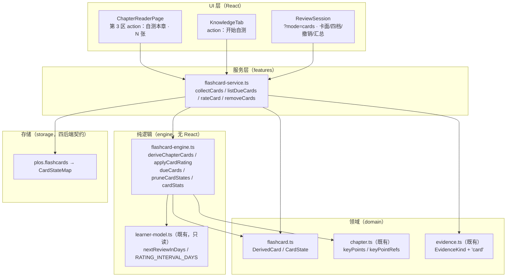
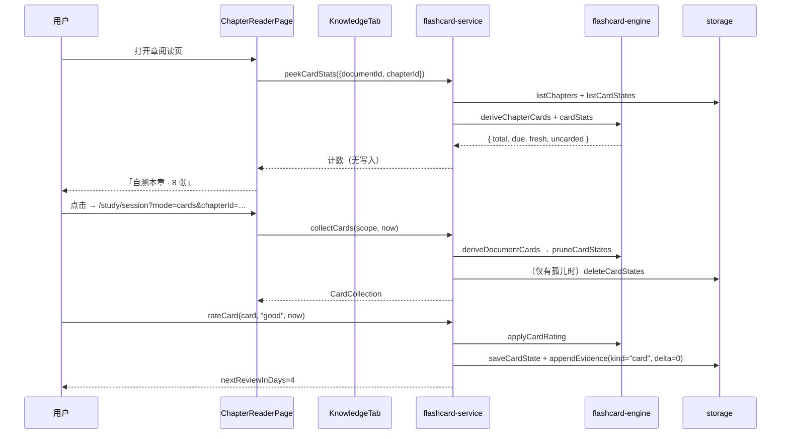

# 由要点卡一键生成自测卡（Flashcards from Key Points）技术方案

| 字段 | 内容 |
|------|------|
| 作者 | Agent |
| 日期 | 2026-09-14 |
| 状态 | **已实施**（2026-09-15；决策 D1–D6 **全部取推荐 A**，含子决策 D2-b 取 A，见 §13；实施结果与偏差见 §14） |
| 关联需求 | `docs/roadmap-next-features-plan-2026-09.md` §F5 第 4 条「自测卡：从 `keyPoints` 一键生成 flashcard，接入既有间隔重复调度」 |

> 本方案**只做 F5 第 4 条**（自测卡）。第 2 条「高亮与笔记」不在本次范围（见 §2 非目标）。
> 决策点已定案（D1–D6 全 A）并已按方案实施完毕（2026-09-15）；实施清单与逐任务 Outcome 见
> `docs/learn-flashcard-task-runbook-2026-09.md`（T1–T14，全部 done）。

---

## 1. 背景

### 1.1 业务背景与痛点

F5「主动学习工具」共四条范围，按依赖序推进：**① 章内提问（✅ 2026-09-14）→ ② 高亮与笔记 → ③ 费曼输出（✅ 2026-09-14）→ ④ 自测卡（本方案）**。

现状是「要点只被**读**，从不被**回忆**」：

| 现状落点 | 行为 | 问题 |
|---|---|---|
| `KnowledgeTab`（资料详情「关键知识点」Tab） | 渲染每章 `keyPointRefs`（要点 + 原文摘录 + 跳原文） | 用户**扫一遍**就离开，无任何自检动作 |
| `ChapterReaderPage` 右栏第 3 区 | `chapter.keyPoints` 渲染为 chips，可点选 | 同上 |
| `ReviewSession`（`/study/session`） | 已有四档自评 + 间隔调度 UI | **队列来源是概念层**（`snapshot.actions` / 章内概念缺口），与章要点的 `keyPoints` **完全不通** |

要点是 AI 提炼的**陈述句**。读一遍会产生「我懂了」的错觉 —— 这是被动接收的典型失效模式（认知心理学上的 fluency illusion）。把同一句话换成「给提示 → 自己回忆 → 再揭晓」，学习效果差异极大，而这一步目前**完全缺失**。

### 1.2 触发原因

- 产品名是「**自我学习**评测」，F5 是把「学习」这一半补上的唯一抓手；提问与复述已落地，**自测卡是 F5 四条里唯一能形成「长期复用」的形态**——提问/复述是一次性会话，卡片会跨天反复出现。
- 基建**已经就位**：`RATING_INTERVAL_DAYS`（1/2/4/7 天）、`nextReviewAt`、`applyKeyPointRating`、`ReviewSession` 的四档按钮 + 键盘 + 撤销 + 汇总、`plos.*` 存储四后端契约。本方案主要是**接线**，而非新建引擎。
- 与 F5 前两条相反：**本方案零 AI 依赖**。卡面完全从既有 `keyPoints` / `keyPointRefs` 派生，无需任何模型调用 —— 这是 F5 四条里唯一**在没有配置 AI 时也完全可用**的能力。

### 1.3 不做的影响

- F5 的第 4 条长期悬空，「学到的东西没有任何复习触发器」；`nextReviewAt` 目前**只有**「复习完成」按钮与复述「安排复习」两个写点，章级复习调度的输入过于单薄。
- 资料库卡面的「下次复习 …」（`features/learn/library/shared.ts::nextReviewOf`）与 LearnerPage 的「需复习 N 项」（`features/learner/aggregate.ts:76`）都因缺少日常输入而长期不动。

---

## 2. 方案目标

| 类型 | 描述 |
|------|------|
| **主要目标** | ① 章要点（带原文出处者）能被**一键**收进自测队列；② 进入一个**统一的到期队列**（先到期、后新卡），可跨章复习；③ 每张卡按四档自评（忘记/困难/记得/轻松）推进 `nextReviewAt`，复用既有 1/2/4/7 天启发式；④ **卡级调度**：一张卡的评分不影响同章其他卡的下次到期；⑤ **零 AI 依赖**，无模型时全链路可用；⑥ **不碰掌握度**（`mastery` 唯一写方仍是卷面）。 |
| **非目标** | ① **手写/编辑卡面**（用户自建卡）；② 独立的卡片管理台（列表/搜索/批量删除/导入导出）；③ 卡级算法升级（不引入 SM-2 的 ease factor / 难度系数）；④ F5 第 2 条「高亮与笔记」；⑤ 卡片写入卷面或参与 `mastery`；⑥ 跨资料合并卡组；⑦ ~~修正 `useLoopStore.submitAnswer` 的 `applyRating` 既有债（见 §13 D6）~~ —— ✅ **已修（2026-09-20，独立于本方案）**，见 `docs/learning-system-v2-design-2026-09.md` 文首补齐说明。 |
| **成功标准** | ① `ChapterReaderPage` 第 3 区与 `KnowledgeTab` 均有自测入口，且显示**真实卡数/到期数**（不编造）；② 无原文出处的要点**不成卡**，并如实提示去跑「AI 分析要点」，绝不生成「正面=要点、背面=同句」的空卡；③ 评分后 `learnerState.byUnit[chapterId].mastery` **逐位不变**（单测硬断言）；④ 未评分时对 storage **零写入**（其余路径）：`collectCards` 只派生 + 清理孤儿（单测用 `CountingStorage` 断言）；⑤ 四档评分的下次到期 = 1/2/4/7 天，且**卡与卡之间互不影响**；⑥ `npm run typecheck` 0 新增 error，`npm run test:flashcard` 全绿。 |

---

## 3. 项目现状

### 3.1 相关代码与模块（开工前已核实）

| 事实 | 位置 / 值 |
|---|---|
| 章要点（唯一真源，UI 与引擎均读此） | `src/domain/chapter.ts:74` `keyPoints: string[]` |
| 要点 ↔ 原文引用（可选，老数据可能缺） | `src/domain/chapter.ts:55-62` `KeyPointRef { point; quote; start; end }`；`start/end` 是 **`doc.textPreview` 绝对偏移**，`quote` 为空串 = 未定位到原文 |
| 要点字段声明 | `src/domain/chapter.ts:75-79`（`keyPointRefs?` 可选，UI 已有「无引用」降级先例） |
| 四档自评 → 间隔天数 | `src/engine/learner-model.ts:28-33` `RATING_INTERVAL_DAYS = { forget:1, hard:2, good:4, easy:7 }`；`:43` `nextReviewInDays(rating)` **已导出** |
| 章级要点自评（**只调度不改掌握度**） | `src/engine/learner-model.ts:219-239` `applyKeyPointRating(state, subjectId, rating, now)` → 写 `confidence` / `lastReviewedAt` / `nextReviewAt` |
| 会移动掌握度的遗留入口 | `src/engine/learner-model.ts:248-269` `applyRating(...)`（**本方案绝不用**） |
| `nextReviewAt` 挂在 **subject** 上 | `src/domain/learner.ts:36`（`UnitMastery.nextReviewAt`）；`:117` `isDueReview(unit, now)` |
| 复习会话（可复用 UI 资产） | `src/features/study/ReviewSession.tsx`：四档按钮（`:422-434`）、`Space` 揭晓 / `1-4` 评分 / `Enter` 下一项 / `Esc` 退出（`:245-273`）、5s 撤销（`:276-286`）、完成汇总（`SummaryView` `:490`）；参考要点来自**概念** `unit.summary`（`:167-176`） |
| 复习会话入口 | `src/App.tsx:61` `/study/session`；调用方 `ChapterGraphPage.tsx:186`、`GraphView.tsx:214`、`CommandPalette.tsx:315` |
| ⚠️ 已知不一致 ① | ~~`src/stores/useLoopStore.ts:155` `submitAnswer({rating})` 调 `applyRating`（**会移动掌握度**）→ **卡片评分不得复用此入口**~~ ✅ **已修（2026-09-20，独立立项，见 §13 D6）**：改走 `applyKeyPointRating`（只写调度 + confidence）。**但「卡片评分不得复用此入口」这一结论不变** —— 理由换成**调度层级**：卡片写**卡级** `CardState`，该入口写**章级** `byUnit[chapterId]` 的 `confidence` / `nextReviewAt` 并触发整轮闭环重算 |
| 要点卡渲染（入口落点） | `src/features/learn/detail/KnowledgeTab.tsx:232-255`（`keyPointRefs` 分支）/ `:256-265`（老数据回退） |
| 阅读页第 3 区（入口落点） | `src/features/learn/ChapterReaderPage.tsx:274-312`（`Section` 带 `action` 插槽，已有「打开本章概念图谱」先例） |
| 存储四后端契约 | `src/storage/types.ts` / `memory.ts` / `local.ts`，`tauri.ts` 继承 `LocalStorageAdapter`（新方法零改动继承） |
| 存储 key 命名 | `plos.graph` / `plos.learner` / `plos.learner-profile` / `plos.restatements` …；**新 key = 零迁移**（先例：`plos.restatements`） |
| 复习文案**已齐备** | `src/i18n/messages/zh.ts` `review` 块：`rating.{forget,hard,good,easy}`、`askSelf`、`meetAgain(d)`、`intervalPreview`、`showRef/hideRef`、`undo(s)`、`nextItem`、`finishReview`、`opening`、`missingChapter`、`confirmExit` 等 —— 可直接复用，无需新写 |
| 证据流 | `src/domain/evidence.ts` `EvidenceKind = "assessment" \| "review" \| "restatement"`；`delta` 与 `sourceId` 语义已注释 |
| 证据 kind → 文案键单一真源 | `src/features/evidence-label.ts::evidenceActionKey`（G2 修复产物；新增 kind **只改这一处 + zh/en 两个文案键**） |
| 要点数量上限 | `src/ai/pipeline-core.ts:54` `keyPointMergeMax: 8`（每章要点 ≤ 8 条，故单章卡数天然 ≤ 8） |
| 单测约束 | `node --experimental-strip-types` **不支持 JSX / TS 参数属性** → 纯逻辑必须放 `.ts`，测试不得 import `.tsx` |

### 3.2 相关文档与约定

- `docs/roadmap-next-features-plan-2026-09.md` §F5（本条的立项依据）
- 最近邻先例：`docs/learn-chapter-qa-design-2026-09.md`、`docs/learn-feynman-restatement-design-2026-09.md`（三段式「零伪造 / 诚实降级 / 不动掌握度」的写法与决策点体例）
- `docs/learning-system-v2-design-2026-09.md`（双证据原则：`mastery` 唯一写方 = 卷面）
- 必须遵守：`rules/pre-task-technical-design`、`rules/layer-import-boundaries`（`ai/` 不得 import `features/`；持久化只经 `src/storage`）、`rules/docs-task-runbook`、`rules/commit-conventions`、`rules/no-headless-browser-validation`（写齐 `data-testid` 但不跑 Playwright）、`rules/code-structure-and-dependencies`

### 3.3 约束与依赖

- **零 AI**：本方案不调用 `provider.chat`、不 import `src/ai/*`。卡面 100% 来自既有 `Chapter` 字段。
- **层级**：`engine/flashcard-engine.ts` 只 import `src/domain`；`features/learn/flashcard-service.ts` 负责编排 + 读写 storage；UI 只经 service。**服务层不产出文案**（只产出分类/enum，文案由 UI 侧 `useI18n` 映射）。
- **单一真源**：卡片**内容**不落库（见 §13 D4-A）；只落**调度状态**。
- **不新增限额**：卡面长度天然受 `keyPointMaxChars`(60) / `keyPointQuoteMaxChars`(200) 约束（上游写入时已截断），本方案不引入自己的字符上限。
- **不依赖**：无外部库、无 Tauri 命令、无网络。

---

## 4. 技术架构

### 4.1 总体架构



**关键数据流（一句话）**：
`chapter.keyPoints` + `chapter.keyPointRefs` --(纯函数派生，零 AI)--> `DerivedCard[]` --(与 CardStateMap 求交)--> 到期队列 --(四档评分)--> 新 `CardState` + 一条 `kind="card"` 证据。

### 4.2 模块职责

| 模块/层级 | 职责 | 技术选型 |
|-----------|------|----------|
| `src/domain/flashcard.ts` | 卡片与调度状态的**类型定义**（派生卡 + 卡级调度状态）+ 会话容量常量 | 纯 TS，无依赖 |
| `src/engine/flashcard-engine.ts` | 派生（要点 → 卡）、稳定 id、四档评分 → 新状态、到期判定与排序、孤儿清理、统计 | 纯函数；仅 import `domain` + 既有 `learner-model.nextReviewInDays` |
| `src/features/learn/flashcard-service.ts` | 编排：收集/统计/评分/删除；读 `storage.listChapters`、写 `storage.saveCardState`、`appendEvidence` | 仅 import `engine` / `storage` / `domain` |
| `src/storage/*` | `CardStateMap` 的持久化（四后端契约） | 与 `plos.restatements` 同款 |
| `src/features/study/ReviewSession.tsx` | 新增卡片模式：卡面渲染 + 四档评分 + 撤销 + 汇总 | 复用既有 `review` 文案与交互骨架 |
| `ChapterReaderPage` / `KnowledgeTab` | 入口按钮 + 真实计数 | 复用 `Section` 的 `action` 插槽 |

### 4.3 数据模型与 API

#### 4.3.1 领域类型（`src/domain/flashcard.ts`，新增）

```ts
import type { SelfRating } from "./assessment";

/**
 * 派生卡 —— **不落库**。每次由 `Chapter` 现场派生（唯一真源 = keyPoints/keyPointRefs）。
 * 正面 = quote（原文摘录），背面 = point（要点）。
 */
export interface DerivedCard {
  /** 稳定 id：`card_<hashId(chapterId + "\u0000" + point)>`（见 §4.3.2）。 */
  id: string;
  chapterId: string;
  documentId: string;
  /** 章内序号（仅展示/排序，**不参与 id**）。 */
  index: number;
  /** 背面：AI 提炼的要点。 */
  point: string;
  /** 正面：原文摘录（**成卡的充要条件**，见 §13 D2-b）。 */
  quote: string;
  /** 原文在 `doc.textPreview` 中的绝对偏移（跳转/高亮用）。 */
  start: number;
  end: number;
}

/** 卡级调度状态 —— **唯一落库内容**。key = DerivedCard.id。 */
export interface CardState {
  cardId: string;
  chapterId: string;
  documentId: string;
  /** 下次到期（epoch ms）。首次评分时写入；缺省 = 新卡。 */
  nextReviewAt?: number;
  /** 最近一次评分时间。 */
  lastReviewedAt: number;
  /** 累计评分次数。 */
  reps: number;
  /** 最近一次自评档。 */
  lastRating: SelfRating;
  /** 累计「忘记」次数（诚实展示用，不参与算法）。 */
  lapses: number;
}

export type CardStateMap = Record<string, CardState>;

/** 单次会话最多出卡数：防止「一口气 200 张」把复习变成苦役。 */
export const FLASHCARD_SESSION_CAP = 20;
```

#### 4.3.2 卡片 id 的稳定性（本方案最关键的技术决策）

```
cardId = "card_" + hashId(chapterId + "\u0000" + point)      // djb2 32bit → base36
```

- **内容派生**，不是 `${chapterId}#${index}`：`index` 型 id 在要点被重跑改写、或章节被 F7-a 合并/重排（`engine/chapter-edit-engine.ts`）后会**把旧调度状态错配到另一条要点上**——那是静默的数据串味。
- 因此语义为：**要点文本变了 = 这是一张新卡**（旧的成孤儿，由 `pruneCardStates` 清掉），这正是 SRS 想要的行为（内容变了就该重学）。
- `hashId` 落在 `engine/flashcard-engine.ts` 内部（**不新增通用工具库**），实现 ~6 行 djb2；不做加密用途，只求确定性 + 低碰撞。

#### 4.3.3 引擎 API（`src/engine/flashcard-engine.ts`，新增）

```ts
/** 派生一章的可自测卡：仅有原文出处（quote 非空且 start>=0）的要点才成卡。 */
export function deriveChapterCards(chapter: Chapter, documentId: string): DerivedCard[];

/** 派生整个资料（跨章）。 */
export function deriveDocumentCards(chapters: Chapter[], documentId: string): DerivedCard[];

/** 未被收录的要点数（有 point 但无 quote）—— 供 UI 诚实提示「还差 N 条要点没有原文出处」。 */
export function uncardedPointCount(chapters: Chapter[]): number;

/** 四档评分 → 新状态（**纯函数**，复用 RATING_INTERVAL_DAYS 的 1/2/4/7）。 */
export function applyCardRating(
  state: CardStateMap, card: DerivedCard, rating: SelfRating, now: number,
): CardStateMap;

/** 到期判定：已学过且 nextReviewAt <= now。**新卡不算到期**（单独计数）。 */
export function isCardDue(state: CardState | undefined, now: number): boolean;

/**
 * 出队顺序：① 到期卡（nextReviewAt 升序，最该复习的先出）
 *           ② 新卡（按章序 order → 章内 index）
 * 截断到 FLASHCARD_SESSION_CAP。
 */
export function dueQueue(cards: DerivedCard[], state: CardStateMap, now: number): DerivedCard[];

/** 丢弃孤儿状态（对应要点已不存在 / 文本已变 / 章已删）。返回新 map（无变化时返回原引用）。 */
export function pruneCardStates(cards: DerivedCard[], state: CardStateMap): CardStateMap;

/** 计数：{ total, due, fresh }（due = 到期，fresh = 从未评过）。 */
export function cardStats(cards: DerivedCard[], state: CardStateMap, now: number): {
  total: number; due: number; fresh: number;
};
```

#### 4.3.4 存储 API（`src/storage/*`，新增三方法）

```ts
// src/storage/types.ts（StorageAdapter）
// ===== 自测卡调度状态（F5 第 4 条；决策 D4-A：只落状态，卡面派生）=====
/** 全部卡级调度状态（key = DerivedCard.id）。 */
listCardStates(): Promise<CardStateMap>;
/** 按 cardId upsert 单条（评分时调用）。 */
saveCardState(state: CardState): Promise<void>;
/** 批量删除（孤儿清理 / 用户手动清除某章卡片进度）。 */
deleteCardStates(cardIds: string[]): Promise<void>;
```

- `memory.ts`：`protected cardStates: CardStateMap = {}` + 三方法实现。
- `local.ts`：`const KEY_CARDS = "plos.flashcards"`，构造期 `load<CardStateMap>(KEY_CARDS, {})`；`persist()` 写入；`saveCardState` / `deleteCardStates` override 后 `persist()`。
- `tauri.ts`：**零改动**（`extends LocalStorageAdapter` 自动继承）。
- **新 key `plos.flashcards` → 无旧数据 → 零迁移**（先例 `plos.restatements`）。

#### 4.3.5 服务层 API（`src/features/learn/flashcard-service.ts`，新增）

```ts
export interface CardScope { documentId: string; chapterId?: string }

export interface CardCollection {
  cards: DerivedCard[];
  total: number;
  due: number;
  fresh: number;
  /** 有要点但无原文出处、被跳过的条数（UI 诚实提示）。 */
  uncarded: number;
  /** 本次清理掉的孤儿状态数（>0 才有写入）。 */
  pruned: number;
}

/** 收集（纯派生 + 孤儿清理唯一写点）。**未评分路径上唯一的写操作。** */
export async function collectCards(scope: CardScope, now: number): Promise<CardCollection>;

/** 只读：不写任何东西（供入口按钮显示计数）。 */
export async function peekCardStats(scope: CardScope, now: number): Promise<{
  total: number; due: number; fresh: number; uncarded: number;
}>;

export interface RatedCard {
  cardId: string;
  rating: SelfRating;
  nextReviewInDays: number;
  nextReviewAt: number;
}

/** 评一张卡：applyCardRating → saveCardState → appendEvidence(kind:"card")。 */
export async function rateCard(
  card: DerivedCard, rating: SelfRating, now: number,
): Promise<RatedCard>;

/** 撤销一次评分：回写评分前的 CardState（或删除该条）。 */
export async function revertCard(cardId: string, prev: CardState | undefined): Promise<void>;

/** 清空某章 / 某卡的进度（用户主动重置）。 */
export async function resetCards(cardIds: string[]): Promise<void>;
```

**证据写入**：`appendEvidence({ at, kind: "card", subjectId: card.chapterId, verdict: rating, delta: 0, sourceId: card.id })`
- `subjectId = chapterId`：让 `HomePage` / `GoalDetailPage` 的章级证据列表能按章聚合这一行。
- `delta = 0`：与 `review` / `restatement` 一致 —— 卡片**不移动掌握度**。
- `sourceId = cardId`：写入口可据此查重（幂等契约已在 `evidence.ts:12` 声明）。
- **证据写入失败不阻断主流程**（先例：`ChapterReaderPage.tsx:167-177`）。

#### 4.3.6 数据读写路径（按 `rules/layer-import-boundaries`）

| 动作 | 路径 | 持久化 |
|---|---|---|
| 读章要点 | `ChapterReaderPage` / `KnowledgeTab` → `flashcard-service.collectCards/peekCardStats` → `storage.listChapters(docId)` | — |
| 读调度状态 | 同上 → `storage.listCardStates()` → `plos.flashcards` | — |
| 评分 | `ReviewSession` → `flashcardService.rateCard` → `engine.applyCardRating` → `storage.saveCardState` + `storage.appendEvidence` | `plos.flashcards` / `plos.evidence` |
| 清理孤儿 | `collectCards` 内部 → `storage.deleteCardStates(orphanIds)` | 仅当有孤儿 |
| 撤销 | `ReviewSession` → `revertCard` → `storage.saveCardState` / `deleteCardStates` | 同上 |

- **桌面能力**：本方案不使用任何 Tauri 命令（无 `invoke`、无 `vault_*` / `llm_*`），纯浏览器与 Tauri 下行为一致 —— 不涉及 `isTauri` 守卫。
- 组件**不直接碰 localStorage**，全部经 service → storage 适配层。

### 4.4 状态与副作用

- **URL 参数分工**（唯一"全局状态"）：
  - `?mode=cards`：进入卡片复习模式（新增）。
  - `?documentId=<docId>`：资料级卡组（跨章）。
  - `?chapterId=<chapterId>`：章级卡组（阅读页第 3 区入口）。
  - ⚠️ **参数冲突（2026-09-15 复核发现，实现时必须处理）**：`chapterId` 已被概念模式占用 —— `ReviewSession.tsx:40-41` 为 `chapterParam = params.get("chapterId"); const conceptMode = chapterParam !== null;`。卡片 URL 若带 `chapterId` 而不加处理，会**误入概念分支**。**解法 = 模式判定优先级**（对 `:41` 做一行防御性改动；既有三处入口 URL 均不含 `mode=cards`，行为零变化）：

    ```ts
    const cardMode = modeParam === "cards" && docParam !== null;      // 卡片模式优先
    const conceptMode = !cardMode && params.get("chapterId") !== null; // 仅原概念入口成立
    ```

    这段判定**抽为纯函数** `src/features/study/session-mode.ts::resolveReviewSessionMode(params)` 供组件调用与单测覆盖（`node --experimental-strip-types` 不支持 JSX，判定留在组件内则无法进 `test:flashcard` —— 先例：`highlight.ts` 从 ContentTab 抽出）。退路：卡片模式改用独立参数名 `cardChapterId`、完全不碰 `:41`；不取，理由是 `chapterId` 语义应在全应用保持一致。
  - 不带 `mode=cards` 的 URL = 现有行为（概念层队列）**逐字节不变**（零回归）。
- **组件内 state**：`ReviewSession` 增 `lastCardState`（撤销用，与既有 `lastResult` 并列）、`cardQueue`。
- **副作用时机**：进入卡片模式时一次性拉 `listChapters + listCardStates` 固定队列（**会话中不重排**，与既有 `:154-163` 的「固定会话队列」口径一致）；评分即时写库，不轮询。
- **零回归**：既有概念模式与非概念模式分支的代码路径保持不变（**唯一例外**：`ReviewSession.tsx:41` 的 `conceptMode` 判定按上式加 `!cardMode` 前置条件 —— 对既有 URL 零影响，且判定本体抽为 `session-mode.ts` 纯函数）；卡片分支以 `cardMode` 为唯一判据。

---

## 5. 交互流程

### 5.1 主流程

1. 用户打开某章阅读页（`/learn/chapter/:chapterId`）。右栏第 3 区「Knowledge」的 action 位置出现 **「自测本章 · N 张」**（N = `peekCardStats().total`；N 由 `keyPoints` 中**带原文出处**的条数决定，真实计算）。
2. 用户点击 → `navigate('/study/session?mode=cards&chapterId=…')`。
3. `ReviewSession` 进入卡片模式：拉取本章卡 + 状态 → 组装 `dueQueue`（到期优先，其次新卡，上限 20）→ 固定队列。
4. 显示第 1 张卡的**正面**：原文摘录（`quote`），带 `Space` 提示。用户先自己回忆「这句话在讲什么」。
5. 按 `Space`（或点「显示答案」）→ 揭晓**背面**：要点（`point`）+「点回原文核对」链接（跳 `/learn/chapter/:id?at=<start>`，复用既有 `?at=` 高亮口径）。
6. 用户按 `1`–`4`（或点四档按钮）自评 → `rateCard` 写 `CardState` + 一条 `kind="card"` 证据 → 显示 `DeltaBadge` 风格的「N 天后再见」→ 5 秒撤销窗口。
7. `Enter` 进入下一张；队列走完 → 汇总页：本次 N 张、四档分布、`stillDue`（本次没做但已到期的张数）。
8. 退出回上一步所在页（卡片模式回 `documentId` 对应资料详情或章阅读页）。

### 5.2 分支与异常流程

| 场景 | 触发条件 | 系统行为 | UI 反馈 |
|---|---|---|---|
| 无任何带出处的要点 | `keyPoints` 为空，或全都没有 `quote` | 入口按钮**禁用**；`collectCards` 返回 `total=0` | 「本章要点还没有原文出处 —— 先到资料的『关键知识点』跑一次『AI 分析要点』」（带跳转链接）**注：无 AI 时如实说明该动作需要 AI** |
| 部分要点无出处 | `keyPoints.length > quote 数` | 只对有出处的成卡 | 「本章 8 条要点中 3 条暂无原文出处，未成卡」 |
| 队列为空 | 全部卡未到期且无新卡 | 不进入复习，留在入口 | 「本章卡片都还没到期（下次 <日期>）」 |
| 要点被重新分析（AI 重跑） | `point` 文本变化 → `cardId` 变化 | 新卡 = 新 id（未评过）；旧状态成孤儿 | 汇总/入口计数减少，无报错（旧卡静默退休） |
| 章节被 F7-a 合并 / 删除 | `engine/chapter-edit-engine.ts` 生效 | 下次 `collectCards` 时 `pruneCardStates` 丢弃孤儿 | 无提示（数据清理是静默的，符合既有惯例） |
| 评分写库失败 | storage 抛错 | 该次评分回滚到操作前状态 | 卡片下方红字 `errStorage`，「重试」按钮 |
| 撤销 | 5s 内按「撤销」 | `revertCard` 回写上一状态（无上一状态则删除） | 与既有 `undo(s)` 一致 |
| 直接带 URL 打开但 scope 无效 | `chapterId` 不存在 / 不属于该 `documentId` | 不伪造卡片 | 复用既有 `review.missingChapter` 空态 |

> **不对称说明（诚实记录）**：撤销只回滚 `CardState`，**不回滚已写入的 evidence 行**（`StorageAdapter` 无删除 evidence 的 API）。这与既有「复习会话撤销」的行为**完全一致**（`ReviewSession.tsx:276-286` 同样只回滚 learnerState）—— 本方案不引入新的不对称，也不顺手改既有语义（**D6-A 已定案**：`useLoopStore.ts` 保持零改动，该差异与既有复习会话逐字一致）。

### 5.3 时序图



---

## 6. 用户用例

### UC-01：一键进入本章自测（主路径）

| 项 | 内容 |
|----|------|
| 角色 | 已导入资料、已跑过「AI 分析要点」的学习者 |
| 前置条件 | 本章 `keyPoints` 至少 1 条带 `quote` |
| 主流程步骤 | 1. 打开章阅读页；2. 看到第 3 区「自测本章 · N 张」；3. 点击；4. 进入复习会话卡片模式 |
| 期望结果 | 未评过的新卡按章序 → 卡序出队；单次不超过 20 张 |
| 异常/边界 | `?mode=cards` 但 scope 不存在 → `review.missingChapter` 空态 |

### UC-02：四档自评推进单卡到期

| 项 | 内容 |
|----|------|
| 角色 | 同上 |
| 前置条件 | 队列非空 |
| 主流程步骤 | 1. 看正面（原文摘录）；2. `Space` 揭晓要点；3. 按 `3`（记得） |
| 期望结果 | `nextReviewAt = now + 4 天`；`reps +1`；写入 1 条 `kind="card"`、`delta=0` 证据；**掌握度不变** |
| 异常/边界 | 5 秒内可撤销；重复提交被拒（沿用既有 `duplicateSubmit` 语义） |

### UC-03：卡与卡互不影响（卡级调度）

| 项 | 内容 |
|----|------|
| 角色 | 同上 |
| 前置条件 | 同章 8 张卡 |
| 主流程步骤 | 1. 只给第 1 张评「轻松」；2. 退到入口看计数 |
| 期望结果 | 第 1 张 7 天后到期；其余 7 张仍是新卡；章的 `nextReviewAt` **未被本动作改写** |
| 异常/边界 | 再次进入会话时第 1 张不在队列（未到期） |

### UC-04：无原文出处的要点不成卡

| 项 | 内容 |
|----|------|
| 角色 | 老数据用户（有 `keyPoints` 无 `keyPointRefs`） |
| 前置条件 | `keyPointRefs` 缺省或 `quote` 全为空 |
| 主流程步骤 | 1. 打开章阅读页第 3 区 |
| 期望结果 | 入口显示「本章要点还没有原文出处」+ 去「关键知识点」的链接；**不生成任何卡**；不写 storage |
| 异常/边界 | 无 AI → 文案如实说明「分析要点需要先配置 AI」 |

### UC-05：跨章（资料级）自测

| 项 | 内容 |
|----|------|
| 角色 | 想一口气过一遍某本书全部要点的学习者 |
| 前置条件 | 资料内至少 2 章有带出处的要点 |
| 主流程步骤 | 1. 资料详情「关键知识点」Tab；2. 点「开始自测（全资料 N 张 / 到期 M 张）」 |
| 期望结果 | 队列 = 到期卡（按 `nextReviewAt` 升序）→ 新卡（按章序）；跨章，每张卡标注来源章 |
| 异常/边界 | 超过 20 张 → 截断并在汇总页提示「本次 20 张，还有 K 张待复习」 |

### UC-06：要点被重新分析后的卡片退休

| 项 | 内容 |
|----|------|
| 角色 | 重跑过「AI 分析要点」的用户 |
| 前置条件 | 某章要点文本已变；该章部分卡曾被评过分 |
| 主流程步骤 | 1. 再次进入该章自测；2. 触发 `collectCards` |
| 期望结果 | 文本已变的要点对应**新 id**（视作新卡）；旧状态被 `pruneCardStates` 删除；入口计数与队列一致 |
| 异常/边界 | 清理是静默的，不弹提示、不阻塞进入 |

### UC-07：撤销一次评分

| 项 | 内容 |
|----|------|
| 角色 | 误点档位的用户 |
| 前置条件 | 上一次评分在 5 秒内 |
| 主流程步骤 | 1. 点「撤销（3s）」 |
| 期望结果 | `CardState` 回滚（首次评分 → 该条被删除）；UI 回到待评分态；evidence 行**保留**（与既有复习会话一致） |
| 异常/边界 | 超时 → 按钮消失，不可撤销 |

### UC-08：无 AI 环境下的完整可用性

| 项 | 内容 |
|----|------|
| 角色 | 未配置任何模型、只用本地导入的用户 |
| 前置条件 | 资料导入后**曾**跑过要点分析（或要点为切分兜底摘要）→ 有带出处的要点 |
| 主流程步骤 | 1. 打开章阅读页；2. 一键自测；3. 评分若干张 |
| 期望结果 | **全链路可用**，无任何「AI 未就绪」阻断（与 F5 前两条相反）；仅当要点本身缺失时才引导去配置 AI |
| 异常/边界 | 若要点从未生成且无 AI → 如实提示该引导，不伪造卡片 |

---

## 7. 线框 UI

> 组件映射：`Section`（`src/components/primitives.tsx:133`，带 `action` 插槽）、`Button`（`src/components/ui/button.tsx`）、`Card`、`SectionTitle`、`BandBadge`、`DeltaBadge`（`src/components/DeltaBadge.tsx`）、`ConfirmDialog`（`src/components/ui/confirm-dialog.tsx`）。
> 设计 token：沿用既有 `text-ink-1/2/3`、`border-line`、`bg-surface`、`bg-subtle`、`text-primary`（`plos-ui-system` / `ui-impl-tokens`）。

### 7.1 `ChapterReaderPage` 第 3 区（Knowledge）— 默认状态

```
┌──────────────────────────────────────────────────────┐
│ KNOWLEDGE                    自测本章 · 8 张  打开图谱 │
├──────────────────────────────────────────────────────┤
│ [要点 chip 1] [要点 chip 2] [要点 chip 3] …           │
│                                                      │
│ 8 条要点 · 全部带原文出处                             │
└──────────────────────────────────────────────────────┘
```

- action 区**并列**两个链接（「自测本章 · 8 张」新增在前，既有「打开本章概念图谱」保留在后）。
- `data-testid="chapter-cards-cta"`、`data-testid="chapter-cards-count"`。

### 7.2 第 3 区 — 无出处 / 部分出处

```
┌──────────────────────────────────────────────────────┐
│ KNOWLEDGE                                打开图谱     │
├──────────────────────────────────────────────────────┤
│ [要点 chip 1] [要点 chip 2]                          │
│                                                      │
│ ⚠ 本章 5 条要点中 3 条暂无原文出处，未成卡。          │
│   去「关键知识点」跑一次「AI 分析要点」 →             │
└──────────────────────────────────────────────────────┘
```

- 全部无出处时：按钮（按钮态）**禁用** + 上述提示。
- `data-testid="chapter-cards-uncarded"`。

### 7.3 `KnowledgeTab` — 头部 action

```
┌──────────────────────────────────────────────────────┐
│ 关键知识点                   开始自测（全资料 26 · 到期 9） │
│                              [重新分析要点]           │
├──────────────────────────────────────────────────────┤
│ 1  第一章 标题                                        │
│   • 要点文本                                          │
│     出处：原文摘录…            去原文                 │
└──────────────────────────────────────────────────────┘
```

- 新增一个按钮（`variant="outline" size="sm"`），与既有「AI 分析要点」并列；无卡时禁用。
- `data-testid="knowledge-cards-cta"`。

### 7.4 `ReviewSession` 卡片模式 — 正面（未揭晓）

```
┌──────────────────────────────────────────────────────┐
│ 卡片复习 · 1/8          目标：…              [退出]   │
├──────────────────────────────────────────────────────┤
│ [自测卡]  第三章 · 链式法则                           │
│                                                      │
│   ┌────────────────────────────────────────────────┐ │
│   │ 这句话在讲什么？                                 │ │
│   │                                                │ │
│   │ “复合函数的导数等于外层函数对中间变量的导数…    │ │
│   │  乘以中间变量对自变量的导数。”                   │ │
│   └────────────────────────────────────────────────┘ │
│                                                      │
│              显示答案  (Space)                        │
└──────────────────────────────────────────────────────┘
```

- `data-testid="card-front"`、`data-testid="card-reveal"`。

### 7.5 卡片模式 — 背面（已揭晓）+ 评分

```
┌──────────────────────────────────────────────────────┐
│ ┌ 参考答案 ─────────────────────────────────────────┐ │
│ │ 链式法则用于求复合函数的导数，是求导的核心法则之一。 │ │
│ │ 点回原文核对 →                                    │ │
│ └───────────────────────────────────────────────────┘ │
├──────────────────────────────────────────────────────┤
│ 这一步你感觉如何？（自评）                            │
│ ┌──────────┬──────────┬──────────┬──────────┐        │
│ │ 忘记      │ 困难      │ 记得      │ 轻松      │        │
│ │ 1 天后再见│ 2 天后再见│ 4 天后再见│ 7 天后再见│        │
│ │    1     │    2     │    3     │    4     │        │
│ └──────────┴──────────┴──────────┴──────────┘        │
│ 间隔预览：忘记→1 天 · 困难→2 天 · 记得→4 天 · 轻松→7 天 │
└──────────────────────────────────────────────────────┘
```

- **完全复用** `review` 文案块的 `askSelf` / `rating.*` / `meetAgain(d)` / `intervalPreview`。
- `data-testid="card-back"`、`data-testid="card-rate-{forget|hard|good|easy}"`、`data-testid="card-source-jump"`。
- 揭晓后：已评态显示「4 天后再见」+「撤销（5s）」+「下一项 ▶」。

### 7.6 空态 / 错误态 / 加载态

| 状态 | 展示 | testid |
|---|---|---|
| 队列为空（全未到期） | 「本章卡片都还没到期（下次 9/21）」+ 返回链接 | `card-empty-notdue` |
| 无卡（无出处） | 「本章要点还没有原文出处」+ 去跑分析 | `card-empty-noref` |
| 加载中 | 「正在准备卡片…」（复用 `review.opening` 口径） | `card-loading` |
| 写库失败 | 卡下方红字 + 「重试」 | `card-error-storage` |
| 完成汇总 | 本次 N 张 + 四档分布 + 「还有 K 张待复习」 | `card-summary` |

### 7.7 交互说明

- **键盘**：`Space` 揭晓 / `1`–`4` 评分 / `Enter` 下一项 / `Esc` 退出（**逐项复用** `ReviewSession.tsx:245-273` 的既有实现，不新写监听）。
- **可达性**：四档按钮为原生 `<button>`；正反卡面有 `aria-label`；`Section` 的 action 链接有可见文案（非纯图标）。
- **不新增弹层**：本方案无「生成中」对话框 —— 「一键」是即时的（纯本地派生，无异步等待）。
- 不做 hover-only 信息（所有计数都有可见文本）。

---

## 8. 涉及文件及改动伪代码

### 8.1 `src/domain/flashcard.ts`（新增）

**改动说明**：卡片与调度状态的类型真源 + 会话容量常量。

```ts
// 伪代码 — 仅表达意图
import type { SelfRating } from "./assessment";

export interface DerivedCard { id; chapterId; documentId; index; point; quote; start; end }
export interface CardState { cardId; chapterId; documentId; nextReviewAt?; lastReviewedAt; reps; lastRating; lapses }
export type CardStateMap = Record<string, CardState>;
export const FLASHCARD_SESSION_CAP = 20;
```

### 8.2 `src/domain/index.ts`（修改）

**改动说明**：追加一行导出（沿用既有顺序，放在 `restatement` 之后）。

```ts
export * from "./restatement";
export * from "./flashcard";   // 新增
```

### 8.3 `src/domain/evidence.ts`（修改）

**改动说明**：`EvidenceKind` 增加 `"card"`；补注释（**跨切面扩展点**的告警已在文件内，沿用不重写）。

```ts
export type EvidenceKind = "assessment" | "review" | "restatement" | "card";
// 注释补：card：自测卡四档评分（delta = 0，verdict = SelfRating 键，
//   sourceId = DerivedCard.id）。卡片**不改掌握度** —— mastery 唯一写方仍是卷面。
```

### 8.4 `src/engine/flashcard-engine.ts`（新增）

**改动说明**：全部纯函数；唯一外部依赖是既有 `nextReviewInDays`。

```ts
// 伪代码
import type { Chapter, CardState, CardStateMap, DerivedCard, SelfRating } from "../domain";
import { FLASHCARD_SESSION_CAP } from "../domain";
import { nextReviewInDays } from "./learner-model";   // 复用 1/2/4/7 启发式，不重写

const MS_PER_DAY = 86_400_000;

/** djb2 32bit → base36；确定性、低碰撞，非加密用途。 */
function hashId(input: string): string {
  let h = 5381;
  for (let i = 0; i < input.length; i++) h = ((h << 5) + h + input.charCodeAt(i)) | 0;
  return (h >>> 0).toString(36);
}
const cardIdOf = (chapterId: string, point: string) => `card_${hashId(`${chapterId}\u0000${point}`)}`;

export function deriveChapterCards(chapter: Chapter, documentId: string): DerivedCard[] {
  const out: DerivedCard[] = [];
  chapter.keyPoints.forEach((point, index) => {
    const trimmed = point?.trim() ?? "";
    if (!trimmed) return;                                   // 空要点不成卡
    const ref = chapter.keyPointRefs?.find((r) => r.point?.trim() === trimmed);
    const quote = ref?.quote?.trim() ?? "";
    // 成卡充要条件：有原文出处（quote 非空 且 start/end 有效）
    if (!quote || ref === undefined || ref.end <= ref.start) return;
    out.push({
      id: cardIdOf(chapter.id, trimmed), chapterId: chapter.id, documentId, index,
      point: trimmed, quote, start: ref.start, end: ref.end,
    });
  });
  return out;
}

export function deriveDocumentCards(chapters: Chapter[], documentId: string): DerivedCard[] {
  return [...chapters].sort((a, b) => a.order - b.order)
    .flatMap((c) => deriveChapterCards(c, documentId));
}

export function uncardedPointCount(chapters: Chapter[]): number {
  return chapters.reduce((n, c) =>
    n + c.keyPoints.map((p) => p?.trim() ?? "").filter(Boolean).length
      - deriveChapterCards(c, "").length, 0);
}

export function applyCardRating(state: CardStateMap, card: DerivedCard, rating: SelfRating, now: number): CardStateMap {
  const prev = state[card.id];
  const next: CardState = {
    cardId: card.id, chapterId: card.chapterId, documentId: card.documentId,
    nextReviewAt: now + nextReviewInDays(rating) * MS_PER_DAY,
    lastReviewedAt: now,
    reps: (prev?.reps ?? 0) + 1,
    lastRating: rating,
    lapses: (prev?.lapses ?? 0) + (rating === "forget" ? 1 : 0),
  };
  return { ...state, [card.id]: next };   // 纯函数；不触碰 LearnerState
}

export function isCardDue(state: CardState | undefined, now: number): boolean {
  return state?.nextReviewAt !== undefined && state.nextReviewAt <= now;
}

export function dueQueue(cards: DerivedCard[], state: CardStateMap, now: number): DerivedCard[] {
  const due = cards.filter((c) => isCardDue(state[c.id], now))
    .sort((a, b) => (state[a.id]!.nextReviewAt! - state[b.id]!.nextReviewAt!) || a.index - b.index);
  const fresh = cards.filter((c) => state[c.id] === undefined)
    .sort((a, b) => a.chapterId.localeCompare(b.chapterId) || a.index - b.index);
  return [...due, ...fresh].slice(0, FLASHCARD_SESSION_CAP);
}

/** 无变化时**返回原引用**（让调用方据此判断要不要写库）。 */
export function pruneCardStates(cards: DerivedCard[], state: CardStateMap): CardStateMap {
  const alive = new Set(cards.map((c) => c.id));
  const kept = Object.entries(state).filter(([id]) => alive.has(id));
  if (kept.length === Object.keys(state).length) return state;
  return Object.fromEntries(kept);
}

export function cardStats(cards, state, now) {
  const due = cards.filter((c) => isCardDue(state[c.id], now)).length;
  const fresh = cards.filter((c) => state[c.id] === undefined).length;
  return { total: cards.length, due, fresh };
}
```

> ⚠️ `deriveChapterCards` 用 `documentId` 之外还用到 `ref.end > ref.start` 校验：`keyPointRefs` 定位失败时 `quote` 为空串（`chapter.ts:58`），两者互为交叉验证，避免「有 quote 但区间无效」的脏数据成卡。

### 8.5 `src/storage/types.ts`（修改）

**改动说明**：`StorageAdapter` 新增三方法（照 `plos.restatements` 的分组注释体例）。

```ts
// ===== 自测卡调度状态（F5 第 4 条；决策 D4-A：只落状态，卡面每次派生）=====
/** 全部卡级调度状态（key = DerivedCard.id）。 */
listCardStates(): Promise<CardStateMap>;
/** 按 cardId upsert（评分 / 撤销均走本方法）。 */
saveCardState(state: CardState): Promise<void>;
/** 批量删除（孤儿清理 / 用户重置进度）。 */
deleteCardStates(cardIds: string[]): Promise<void>;
```

### 8.6 `src/storage/memory.ts`（修改）

```ts
protected cardStates: CardStateMap = {};               // 新增字段

async listCardStates() { return { ...this.cardStates }; }
async saveCardState(state: CardState) { this.cardStates[state.cardId] = state; }
async deleteCardStates(cardIds: string[]) {
  for (const id of cardIds) delete this.cardStates[id];
}
```

### 8.7 `src/storage/local.ts`（修改）

```ts
const KEY_CARDS = "plos.flashcards";   // 新 key → 无旧数据 → 零迁移
// 构造期： this.cardStates = load<CardStateMap>(KEY_CARDS, {});
// persist()： localStorage.setItem(KEY_CARDS, JSON.stringify(this.cardStates));
override async saveCardState(state: CardState) { await super.saveCardState(state); this.persist(); }
override async deleteCardStates(cardIds: string[]) { await super.deleteCardStates(cardIds); this.persist(); }
```

### 8.8 `src/features/learn/flashcard-service.ts`（新增）

```ts
// 伪代码
import { storage } from "../../stores/useLoopStore";
import { deriveDocumentCards, deriveChapterCards, pruneCardStates, dueQueue, cardStats, applyCardRating, uncardedPointCount } from "../../engine";
import type { CardState, CardStateMap, DerivedCard, SelfRating } from "../../domain";

/** 收集：纯派生 + 孤儿清理（**未评分路径上唯一的写操作**）。 */
export async function collectCards(scope: CardScope, now: number): Promise<CardCollection> {
  const chapters = await storage.listChapters(scope.documentId);
  const scoped = scope.chapterId ? chapters.filter((c) => c.id === scope.chapterId) : chapters;
  const cards = scoped.flatMap((c) => deriveChapterCards(c, scope.documentId));
  const before = await storage.listCardStates();
  // ⚠️ 实现修正（见 §14 偏差 ⑥）：prune 必须**限定在 scope 内的章**，
  //    否则打开 A 章的卡片会话会把 B 章的调度状态当孤儿删掉。
  const scopedState = pickChapters(before, scoped);
  const after = pruneCardStates(cards, scopedState);
  const prunedIds = Object.keys(scopedState).filter((id) => !(id in after));
  if (prunedIds.length > 0) await storage.deleteCardStates(prunedIds);   // 仅孤儿时写
  const { total, due, fresh } = cardStats(cards, after, now);
  return { cards, total, due, fresh, uncarded: uncardedChapterPoints(scoped), pruned: prunedIds.length };
}

/** 只读统计（入口按钮用；**零写入**）。 */
export async function peekCardStats(scope, now) { /* 同上去掉 prune 写点，只算计数 */ }

/** 评分：状态 + 证据（证据失败不阻断）。 */
export async function rateCard(card: DerivedCard, rating: SelfRating, now: number): Promise<RatedCard> {
  const state = await storage.listCardStates();
  const next = applyCardRating(state, card, rating, now);
  const saved = next[card.id];
  await storage.saveCardState(saved);
  try {
    await storage.appendEvidence({
      at: now, kind: "card", subjectId: card.chapterId,
      verdict: rating, delta: 0, sourceId: card.id,
    });
  } catch { /* 证据落库失败不阻塞复习主流程（既有先例） */ }
  return { cardId: card.id, rating, nextReviewInDays: nextReviewInDays(rating), nextReviewAt: saved.nextReviewAt! };
}

export async function revertCard(cardId: string, prev: CardState | undefined): Promise<void> {
  if (prev) await storage.saveCardState(prev);
  else await storage.deleteCardStates([cardId]);        // 首次评分 → 撤销即删
}

export async function resetCards(cardIds: string[]): Promise<void> {
  if (cardIds.length > 0) await storage.deleteCardStates(cardIds);
}
```

> **服务层不产文案**：所有错误只向上抛（或返回分类），文案由 UI 侧映射（沿用 F5-1/F5-2 的既定约束）。

### 8.9 `src/features/study/ReviewSession.tsx`（修改）

**改动说明**：新增 `mode=cards` 分支。**既有概念模式与默认模式代码路径不变**（唯一例外：`conceptMode` 判定加 `!cardMode`，见 §4.4 参数冲突；判定抽为 `session-mode.ts` 纯函数）。

```tsx
// 伪代码
const modeParam = params.get("mode");
const docParam = params.get("documentId");
const cardChapterParam = params.get("chapterId");
const cardMode = modeParam === "cards" && docParam !== null;
// ⚠️ §4.4 参数冲突处理：chapterId 已被概念模式占用 → 卡片模式优先（改 ReviewSession.tsx:41 一行）
const conceptMode = !cardMode && params.get("chapterId") !== null;

// 1) 卡片模式的数据就绪（与既有两模式并列，互不干扰）
useEffect(() => {
  if (!cardMode || !docParam) return;
  void (async () => {
    const col = await collectCards({ documentId: docParam, chapterId: cardChapterParam ?? undefined }, Date.now());
    if (!activeRef.current) return;
    setCardQueue(dueQueue(col.cards, await storage.listCardStates(), Date.now()));
    setCardSource(new Map(col.cards.map((c) => [c.id, c])));
    setUncarded(col.uncarded);
    setReady(true);
  })();
}, [cardMode, docParam, cardChapterParam]);

// 2) 评分：**绝不走 submitAnswer**（那会移动 mastery）
const onRateCard = useCallback(async (rating: SelfRating) => {
  if (!currentCard) return;
  setPrevCardState(await readCardState(currentCard.id));          // 撤销用
  const res = await rateCard(currentCard, rating, Date.now());    // 只写 CardState + evidence
  setLastCardResult(res);
  setStage("rated"); setUndoLeft(5);
}, [currentCard]);

// 3) 卡面渲染（正面 quote / 背面 point + 原文跳转）
{stage === "show" ? <CardFront card={currentCard} onReveal={() => setRevealed(true)} revealed={revealed} /> : null}
```

- 键盘监听 / 撤销倒计时 / `ConfirmDialog` 退出拦截 / `SummaryView` **全部复用既有实现**；仅 `titleOf` / 参考区数据源按 `cardMode` 分支。
- `goBack`：卡片模式 → `chapterId ? '/learn/chapter/<id>' : '/learn/doc/<documentId>?tab=knowledge'`。

### 8.10 `src/features/learn/ChapterReaderPage.tsx`（修改）

**改动说明**：第 3 区 `Section` 的 `action` 增加自测入口 + 真实计数 + 无出处提示。

```tsx
// 伪代码
const [cards, setCards] = useState<{ total: number; due: number; fresh: number; uncarded: number }>();

useEffect(() => {
  if (!doc || !chapter) return;
  void peekCardStats({ documentId: doc.id, chapterId: chapter.id }, Date.now()).then(setCards);
}, [doc?.id, chapter?.id, chapter?.keyPoints.length, chapter?.keyPointRefs?.length]);

<Section title={t.knowledgeEyebrow} action={
  <div className="flex items-center gap-3">
    {cards && cards.total > 0 ? (
      <Link to={`/study/session?mode=cards&documentId=${doc.id}&chapterId=${chapter.id}`}
            data-testid="chapter-cards-cta" className="…">
        {t.cards.cta(cards.total)}{cards.due > 0 ? ` · ${t.cards.dueBadge(cards.due)}` : ""}
      </Link>
    ) : null}
    <Link to={`/learn/${chapter.id}/graph`} className="…">{t.openGraph}</Link>
  </div>
} />
{/* 无出处 / 部分出处提示（仅 uncarded > 0 时渲染） */}
{cards && cards.uncarded > 0 ? (
  <p data-testid="chapter-cards-uncarded" className="text-xs text-ink-3">…</p>
) : null}
```

### 8.11 `src/features/learn/detail/KnowledgeTab.tsx`（修改）

**改动说明**：要点区 `Section` 的 `action` 增加资料级自测入口。

```tsx
// 伪代码：与既有 analyzePoints 按钮并列
const [cards, setCards] = useState<{ total: number; due: number } | undefined>();
useEffect(() => { void peekCardStats({ documentId: doc.id }, Date.now()).then(setCards); },
  [doc.id, chapters.length, chapters[0]?.keyPointRefs?.length]);

<Button size="sm" variant="outline" disabled={!cards || cards.total === 0}
        onClick={() => navigate(`/study/session?mode=cards&documentId=${doc.id}`)}
        data-testid="knowledge-cards-cta">
  {t.cards.startAll(cards?.total ?? 0, cards?.due ?? 0)}
</Button>
```

### 8.12 `src/features/evidence-label.ts`（修改）

**改动说明**：`evidenceActionKey` 的穷尽 switch 增加一档（**G2 修复的单一真源在此，仅改这一处**）。

```ts
export type EvidenceActionKey = "assessment" | "review-points" | "restatement" | "card";
export function evidenceActionKey(kind: EvidenceKind): EvidenceActionKey {
  switch (kind) {
    case "assessment": return "assessment";
    case "review": return "review-points";
    case "restatement": return "restatement";
    case "card": return "card";           // 新增
  }
}
```

### 8.13 `src/i18n/messages/zh.ts` / `en.ts`（修改）

**改动说明**：`units.action` 增加 `card`；新增 `learn.reader.cards` 与 `review.cards` 两个文案块。**复用既有 `review.rating` / `intervalPreview` / `undo` / `nextItem` / `finishReview`，不重写。**

```ts
// zh.ts
units: { action: { …, restatement: "复述", card: "自测卡" } },
learn: { reader: { …,
  cards: {
    eyebrow: "自测本章",
    cta: (n: number) => `自测本章 · ${n} 张`,
    dueBadge: (n: number) => `${n} 张到期`,
    uncarded: (n: number, m: number) => `本章 ${m} 条要点中 ${n} 条暂无原文出处，未成卡。`,
    uncardedAll: "本章要点还没有原文出处，无法生成自测卡。",
    goAnalyze: "去「关键知识点」分析要点 →",
    needAi: "分析要点需要先配置 AI。",
    startAll: (n: number, due: number) => `开始自测（全资料 ${n} 张${due > 0 ? ` · 到期 ${due}` : ""}）`,
    emptyNotDue: (when: string) => `卡片都还没到期（下次 ${when}）。`,
    loading: "正在准备卡片…",
    frontLabel: "这句话在讲什么？",
    backLabel: "参考答案",
    sourceJump: "点回原文核对 →",
    errStorage: "保存复习进度失败，请重试。",
    summaryDone: (n: number) => `本次复习 ${n} 张`,
    stillDue: (n: number) => `还有 ${n} 张待复习。`,
  } } },
// review 块补： titleCards: (i, total) => `卡片复习 · ${i}/${total}`、backToDoc/backToChapter
// en.ts 镜像（Keep the same key set & arity）
```

### 8.14 `package.json`（修改）

```json
"test:flashcard": "node --experimental-strip-types --no-warnings --import ./tests/register-loader.mjs tests/flashcard.test.ts",
"test:library": "… && npm run test:qa && npm run test:restatement && npm run test:flashcard"
```

### 8.15 `tests/flashcard.test.ts`（新增）

**改动说明**：纯 `.ts`（**不含任何 JSX**，不 import `.tsx`），覆盖 §12 全部用例。

```ts
// 伪代码
class CountingStorage extends InMemoryStorage {          // 断言"零写入"
  saveCardCalls = 0; evidenceCalls = 0;
  override async saveCardState(s) { this.saveCardCalls++; return super.saveCardState(s); }
  override async appendEvidence(e) { this.evidenceCalls++; return super.appendEvidence(e); }
}
// fixtures: CH（keyPoints 8 条，其中 5 条带 keyPointRefs）/ CH_NO_REFS（无 refs）
```

### 8.16 `README.md` / `README.zh-CN.md` / `docs/roadmap-next-features-plan-2026-09.md`（修改）

- README 双语：`- [ ] 由要点卡一键生成自测卡 \`P1\`` → `- [x] 由要点卡一键生成自测卡 —— …`；统计行 **27/17 → 28/16**（两版同步，改后用 `grep -c` 复核）。
- roadmap §F5 第 4 条：标注 ✅ + 落地入口/方案/单测路径 + 关键决策（零 AI / 卡级调度 / 只落状态）；候选表 F5 行的「笔记 / 自测卡未做」改为「笔记未做」。

### 8.17 明确**不改动**的文件（已核实）

| 文件 | 原因 |
|---|---|
| `src/engine/learner-model.ts` | 只**读**其 `nextReviewInDays` / `RATING_INTERVAL_DAYS`，不新增函数 |
| `src/engine/learning-planner.ts` | 决策 D5-A 下不纳入卡到期（避免触碰既有 planner 注释矛盾债 ②） |
| `src/stores/useLoopStore.ts` | **不改** `submitAnswer`（决策 D6-A；卡片评分不经它） |
| `src/storage/tauri.ts` | 继承 `LocalStorageAdapter`，自动获得新方法 |
| `src/ai/**` | 本方案零 AI |
| `src/features/learn/reader/ChapterQaPanel.tsx` / `ChapterRestatementPanel.tsx` | 不动已在线面板 |

---

## 9. 任务清单

| ID | 任务 | 依赖 | 复杂度 |
|----|------|------|--------|
| T1 | `domain/flashcard.ts` + `domain/index.ts` 导出 + `evidence.ts` 加 `"card"` | — | S |
| T2 | `engine/flashcard-engine.ts`（派生 / hashId / 评分 / 到期 / 队列 / prune / 统计） | T1 | M |
| T3 | `storage/{types,memory,local}.ts` 三方法 + `plos.flashcards` | T1 | S |
| T4 | `features/learn/flashcard-service.ts`（collect/peek/rate/revert/reset） | T2,T3 | M |
| T5 | `features/evidence-label.ts` 加一档（G2 单一真源） | T1 | S |
| T6 | `ReviewSession.tsx` 卡片模式（卡面前/背 + 评分 + 撤销 + 汇总 + 空态）+ `session-mode.ts` 模式判定纯函数（§4.4 冲突解法） | T4 | L |
| T7 | `ChapterReaderPage.tsx` 第 3 区入口 + 计数 + 无出处提示 | T4 | M |
| T8 | `KnowledgeTab.tsx` 资料级入口 | T4 | S |
| T9 | `i18n/messages/{zh,en}.ts` 文案块（键集与 arity 严格对齐） | T6 | M |
| T10 | `tests/flashcard.test.ts` + `package.json`（`test:flashcard` + 追加 `test:library`） | T2,T4 | L |
| T11 | `typecheck` + 全链回归（`test:library` 等） | T10 | S |
| T12 | 链路核查三步（存储方法有真实消费方 / 服务函数被 UI 真实调用） | T6,T7,T8 | S |
| T13 | README 双语 + roadmap §F5 同步 | T11 | S |
| T14 | 分层本地提交（domain → engine → storage → features-service → ui/i18n → tests → docs），不 push | T13 | S |

---

## 10. 实施步骤

1. **步骤 1（T1）**：领域类型与 `EvidenceKind` 扩展。
   - 输入：§4.3.1 类型清单；输出：`domain/flashcard.ts` 可被 import。
   - 验证：`npm run typecheck`（应仅 3 条既存 `AIModelsSection` error）。
2. **步骤 2（T2）**：引擎纯函数。
   - 验证：先写 §12 的派生/队列/评分用例（TDD），跑 `npm run test:flashcard` 瞄准全绿。
3. **步骤 3（T3）**：存储三方法 + 持久化。
   - 验证：localStorage 往返用例（对齐 `restatement` 的 `TC-EDGE` 体例）。
4. **步骤 4（T4）**：服务层编排。
   - 验证：`CountingStorage` 断言「未评分路径零写入」「评分不动 mastery」。
5. **步骤 5（T5）**：证据 kind → 文案键映射加档（**只改一处**）。
6. **步骤 6（T6→T7→T8）**：UI 三处接线（先会话，后两个入口）。
   - 验证：肉眼核对 + `data-testid` 齐备（不跑 Playwright）。
7. **步骤 7（T9）**：文案块。
   - 验证：`npm run test:i18n`（键集 zh/en 一致性）。
8. **步骤 8（T10→T11）**：单测与全链回归。
9. **步骤 9（T12）**：链路核查三步。
10. **步骤 10（T13→T14）**：文档同步 + 分层提交。

**回滚策略**：本方案**零迁移、零既有数据改写**（新 key、新文件、纯追加）。回滚 = `git revert` 对应 7 组提交；已写入的 `plos.flashcards` 对旧版本代码**完全不可见**（无读取方），不需要数据清理。若只想灰度：入口按钮由 `cards.total > 0` 门控，旧资料（无 `keyPointRefs`）天然不出现入口。

---

## 11. 测试方案

### 11.1 测试范围与策略

| 层级 | 工具/方式 | 覆盖重点 | 不负责 |
|---|---|---|---|
| 单元 | `tests/flashcard.test.ts`（node `--experimental-strip-types`，`npm run test:flashcard`） | 派生规则（quote 缺失不成卡）、id 稳定性与「要点改写 → 新卡」、四档间隔 1/2/4/7、卡间互不影响、到期判定与出队顺序、会话截断 20、孤儿清理、**零写入**、**mastery 不变**、localStorage 往返 | DOM 渲染、样式 |
| 集成 | `test:library`（13 组串联） | 新增脚本不破坏既有 12 组；与 `restatement`/`qa` 共存 | — |
| E2E | Playwright（`skills/playwright-test-ids` 口径；**本仓库禁止主动起浏览器校验**，仅写齐 `data-testid`） | 6 条主链路（按钮 → 会话 → 评分 → 计数变化） | — |
| 手工 | 用户在 Tauri 桌面端 | 键盘流（Space/1-4/Enter/Esc）、长章 8 张卡的滚动与视觉、深浅色 | — |

### 11.2 测试环境与数据

- `InMemoryStorage` + `CountingStorage`（计数写入），**不需要** localStorage stub（除往返用例用 §12 的 `TC-EDGE-09` 同款 shim）。
- Fixture：`CH`（8 条 `keyPoints`，其中 5 条有匹配 `keyPointRefs`，1 条 `quote=""` 表示定位失败）、`CH_NO_REFS`（仅有 `keyPoints`）、`CH_EMPTY`（无要点）。
- `now` 一律显式传入固定值（`T0 = 1_700_000_000_000`），**不在断言里调用 `Date.now()`**。
- CI：纳入 `npm run test:library`（本地串行）。

### 11.3 通过标准

- `npm run typecheck` = 仅 3 条既存 `AIModelsSection.tsx:56-58` error（**0 新增**）。
- `npm run test:flashcard` 全绿；`npm run test:library`（13 组）与 `test:qa` / `test:restatement` / `test:i18n` 等全 `exit=0`。
- 两条硬断言必须在测试里显式存在：
  ① **未评分路径对 storage 零写入**（`CountingStorage.saveCardCalls === 0`）；
  ② **评分后 `learnerState.byUnit[chapterId].mastery` 逐位不变**（防误用 `applyRating`）。
- 链路核查三步通过（§12.2）。

---

## 12. 测试用例

### 12.1 用例（对应 §6）

| ID | 关联 UC | 步骤 | 输入/操作 | 期望结果 | 类型 |
|----|---------|------|-----------|----------|------|
| TC-UC01-01 | UC-01 | 1 | `deriveChapterCards(CH, doc)` | 只返回 5 张（8 条要点中 3 条无 ref / 1 条 quote 空） | 单元 |
| TC-UC01-02 | UC-01 | 2 | `peekCardStats({doc, ch}, T0)` | `{total:5, due:0, fresh:5, uncarded:3}`；`CountingStorage.saveCardCalls === 0` | 单元 |
| TC-UC01-03 | UC-01 | 3 | `dueQueue(cards, {}, T0)` | 全是新卡；长度 5；≤ `FLASHCARD_SESSION_CAP` | 单元 |
| TC-UC02-01 | UC-02 | 1 | `rateCard(card, "good", T0)` | `nextReviewAt === T0 + 4d`；`reps===1`；`lapses===0` | 单元 |
| TC-UC02-02 | UC-02 | 2 | 同上后读 `learnerState.byUnit[chapterId].mastery` | **与评分前逐位相等** | 单元 |
| TC-UC02-03 | UC-02 | 3 | 同上后读 evidence | 末条 `{kind:"card", subjectId:chapterId, verdict:"good", delta:0, sourceId:cardId}` | 单元 |
| TC-UC02-04 | UC-02 | 4 | `appendEvidence` 抛错 | `rateCard` 仍 resolve；`CardState` 已写入 | 单元 |
| TC-UC03-01 | UC-03 | 1 | 对 card#1 评 `easy`，card#2 不评 | `state[card1].nextReviewAt = T0+7d`；`state[card2] === undefined` | 单元 |
| TC-UC03-02 | UC-03 | 2 | `dueQueue([c1,c2], state, T0+1d)` | 只含 c2（新卡）；c1 未到期 | 单元 |
| TC-UC03-03 | UC-03 | 3 | `dueQueue(..., T0+8d)` | 含 c1 与 c2，**c1 在前**（到期优先于新卡） | 单元 |
| TC-UC04-01 | UC-04 | 1 | `deriveChapterCards(CH_NO_REFS, doc)` | `[]` | 单元 |
| TC-UC04-02 | UC-04 | 2 | `peekCardStats` on `CH_NO_REFS` | `{total:0, uncarded: keyPoints 条数}`；入口在 UI 层禁用 | 单元 |
| TC-UC05-01 | UC-05 | 1 | `deriveDocumentCards([CH1, CH2], doc)` | 跨章合并；顺序 = 章 `order` 升序 → 章内 `index` | 单元 |
| TC-UC05-02 | UC-05 | 2 | 25 张卡 + 空状态 | `dueQueue(...).length === 20` | 单元 |
| TC-UC06-01 | UC-06 | 1 | 改 `point` 文本后重新派生 | 新卡 id ≠ 旧卡 id；旧 `CardState` 不被新卡读取 | 单元 |
| TC-UC06-02 | UC-06 | 2 | `collectCards` 后读 storage | 旧 id 已被删除（`pruneCardStates` 生效），返回 `pruned === 1` | 单元 |
| TC-UC07-01 | UC-07 | 1 | `revertCard(cardId, prevState)` | 回写为 `prevState` | 单元 |
| TC-UC07-02 | UC-07 | 2 | `revertCard(cardId, undefined)`（首次评分） | 该条被删除 | 单元 |
| TC-UC08-01 | UC-08 | 1 | 全程不配置 AI，跑 UC-01→UC-02 | 全链路成功；**无任何 AI 调用**（不 import `src/ai/*`） | 单元+手工 |

### 12.2 边界与回归

| ID | 场景 | 期望 |
|----|------|------|
| TC-EDGE-01 | `chapter.keyPoints === []` | `deriveChapterCards → []`；不抛错 |
| TC-EDGE-02 | `keyPoints` 含空串 / 纯空白 | 空要点不成卡（`trim()` 后判空） |
| TC-EDGE-03 | `quote` 非空但 `end <= start`（脏区间） | 不成卡（交叉校验） |
| TC-EDGE-04 | 两条要点文本完全相同（重复） | hash 相同 → 视为同一张卡（去重）；`deriveChapterCards` 在同章内去重 |
| TC-EDGE-05 | `keyPointRefs` 存在但 `point` 与 `keyPoints[i]` 不匹配 | 匹配不到 → 该条目不成卡（**不猜、不按 index 硬配**） |
| TC-EDGE-06 | `pruneCardStates` 输入空 state | 返回**原引用**（调用方据此跳过写库） |
| TC-EDGE-07 | `pruneCardStates` 无孤儿 | 返回**原引用**（零写入） |
| TC-EDGE-08 | `applyCardRating` 连续 `forget` 三次 | `lapses === 3`；`nextReviewAt` 每次 = 当时 `now + 1d` |
| TC-EDGE-09 | localStorage 往返（含 `nextReviewAt`） | 记录完整还原（同型断言见 `restatement` 的 `TC-EDGE-10`） |
| TC-EDGE-10 | `deleteCardStates([])` | 不调用 `persist()`（空数组短路） |
| TC-REG-01 | `submitAnswer` 未被本功能改动 | `src/stores/useLoopStore.ts` 在本次 diff 中**零改动**（人工核对 + `git diff --name-only` 断言） |
| TC-REG-02 | 既有概念模式 `ReviewSession`（无 `mode` 参数） | 队列来源、文案、评分路径**逐字节不变** |
| TC-REG-03 | `evidenceActionKey` 四档穷尽 | `"card"` 不再落到 `review-points`（G2 类静默错标已封堵） |
| TC-REG-04 | `resolveReviewSessionMode` 优先级（§4.4 冲突） | `{mode:"cards",documentId,chapterId}` → `cardMode=true && conceptMode=false`；仅 `{chapterId}` → 概念模式；仅 `{unit}` → 默认模式 —— 三种既有入口 URL 结果与改前逐字节一致 |

### 12.3 链路核查三步（`T12` 执行）

1. `grep -rnE "listCardStates|saveCardState|deleteCardStates" src/ | grep -v '^src/storage/'` → 必须命中 `features/learn/flashcard-service.ts`（**不得只命中 `storage/*`**，否则 = 「写好了但没接线」）。
2. 顺数据流：`ChapterReaderPage` / `KnowledgeTab` / `ReviewSession` → `flashcard-service` → `flashcard-engine` + `storage`，每跳有真实调用者（定义 ≠ 调用）。
3. 反查：`deriveChapterCards` / `dueQueue` / `applyCardRating` 均被**服务层真实调用**，而非仅单测覆盖。

---

## 13. 决策点（**已定案**：D1–D6 全部取推荐 A）

> 体例与前两个 F5 功能一致：每项给出推荐项 A。**2026-09-15 用户确认：D1–D6 一律按推荐 A 定案**（含子决策 D2-b 取 A）。下列各节结论行已由「推荐」改为「**定案**」，**A 档即最终选择**；B / C 档保留在表中作为"被否方案"的决策留痕，不再作为待选项。

| 决策 | 一句话定案 | 选择 | 主要影响面 |
|---|---|---|---|
| **D1** 调度粒度 | **卡级 `CardState`**：每张卡独立 `nextReviewAt`，复用既有 1/2/4/7 天启发式；**章级 `nextReviewAt` 不被卡片改写** | **A** | 新增 1 个存储键 + 引擎纯函数；planner 与资料库卡面**看不到**卡到期（D5-A 同口径） |
| **D2 / D2-b** 卡面语义 | **零 AI 派生**：正面 = 原文摘录（`quote`），背面 = 要点（`point`）+ 点回原文；**无原文出处的要点不成卡** | **A / A** | 本功能成为 F5 四条里**唯一不依赖 AI** 的能力 |
| **D3** 复习落点 | 复用 `/study/session?mode=cards&documentId=…[&chapterId=…]`；入口 = 阅读页第 3 区 action + `KnowledgeTab` action | **A** | 不新增页面、不建卡片管理台 |
| **D4** 是否物化卡面 | **只落调度状态**（`plos.flashcards`），卡面每次从 `Chapter` 现场派生 | **A** | 单一真源；要点文本改写 = 旧卡自动退休（孤儿静默清理） |
| **D5** 到期可见性 | 到期数**只在这两处入口**显示；planner / 资料库卡面**不动** | **A** | v1 不扩大回归面 |
| **D6** 是否顺手修既有债 ① | **不碰** `useLoopStore.submitAnswer`（其 `applyRating` 会移动 mastery）；卡片评分走独立 `applyCardRating` | **A** | 既有不一致 ① **单独立项**，不藏在本功能里 |

> 定案后的实施边界（三条硬约束）：① **零伪造引用**（无原文出处 = 不成卡，不生成「正面=背面」的空卡）；② **零 AI 依赖**（无模型时全链路可用，仅当要点自身缺失才引导去配置 AI）；③ **不碰掌握度**（`mastery` 唯一写方仍是卷面 `applyPaperResult`）。

### D1 — 调度粒度（最关键）

| 选项 | 内容 | 代价 | 影响 |
|---|---|---|---|
| **A ✅ 定案** | **卡级 `CardState`**：每张卡独立 `nextReviewAt`，复用既有 `RATING_INTERVAL_DAYS` 启发式；**章级 `nextReviewAt` 不被卡片改写** | 新增一个存储键 + 引擎函数 | 「间隔重复」终于有真实颗粒度；但资料库卡面「下次复习」与 planner 队列**看不到**卡片到期 |
| B | 完全复用章级：评分直接调 `applyKeyPointRating(chapterId)` | 零新存储 | 评一张卡 = 整章顺延，卡与卡互相干扰；与 flashcard 直觉不符 |
| C | A + **章级派生**（章的到期额外纳入「该章有到期卡」，改 `learning-planner.ts`） | 触碰 planner（含既有注释矛盾债 ②） | 闭环最完整，但回归面最大 |

**定案 A**：产品价值（真实 SRS）与风险控制（不碰 planner）的平衡点。C（章级派生 + 改 `learning-planner.ts`）作为**后续独立迭代候选**记入 roadmap，**本方案不实现**。

### D2 — 卡面语义与 AI 依赖

| 选项 | 内容 | 代价 |
|---|---|---|
| **A ✅ 定案** | **零 AI 派生**：正面 = 原文摘录（`quote`），背面 = 要点（`point`）+ 点回原文 | 无需模型；复用既有 AI 产出 |
| B | AI 把要点改写成**问句**作正面（真 flashcard 形态），无 AI 时阻断（D6-B 同款） | 新增 AI 调用 + 失败面 + 无 AI 不可用 |
| 子决策 D2-b | **无原文出处的要点是否成卡**：A = 不成卡 + 诚实提示去跑「AI 分析要点」；B = 也成卡（但只能「正面=要点」，自测价值≈0） | — |

**定案 A + D2-b 取 A**：与项目「不编造 / 零伪造」的一贯口径一致，且让本功能成为 F5 四条里唯一**不依赖 AI** 的能力。B（AI 改写问句）不做 —— 那会把 F5 唯一无需模型的能力变成又一处「无 AI 即不可用」。

### D3 — 复习落点与入口

| 选项 | 内容 |
|---|---|
| **A ✅ 定案** | 复用 `/study/session`，新增 `?mode=cards&documentId=…[&chapterId=…]`；入口两处：阅读页第 3 区 action、`KnowledgeTab` action |
| B | 新增独立 `/cards` 页（含卡片管理台） |
| C | 阅读页内联复习（不跳页，与复述面板同形态） |

**定案 A**：复用 `ReviewSession` 已有的四档 UI / 键盘 / 撤销 / 汇总与整套 `review` 文案，**投入最小、一致性最好**；B 的「管理台」已在 §2 列为非目标，C（页内联复习）与既有复习会话骨架重复，均不做。

### D4 — 卡片内容是否落库

| 选项 | 内容 | 代价 |
|---|---|---|
| **A ✅ 定案** | **只落调度状态**，卡面每次从 `Chapter` 派生（唯一真源） | 用户不能编辑/删除单张卡（本就在非目标内）；要点改写 = 自动退休旧卡 |
| B | 物化 `Flashcard` 实体（可编辑 / 可手写补充） | 双真源（要点 vs 卡面）；F7-a 章节合并/重排需第三套迁移；要点更新后卡片陈旧 |

**定案 A**：项目反复强调「单一真源」；B 的能力（编辑 / 手写补充）本次均为非目标，先不为其付出双真源代价 —— 尤其 B 会让 F7-a 章节合并 / 重排需要第三套迁移。

### D5 — 到期可见性

| 选项 | 内容 |
|---|---|
| **A ✅ 定案** | 到期数只在**两处入口**显示（「自测本章 · 8 张 · 3 张到期」、「开始自测（… · 到期 9）」）；planner / 资料库卡面**不动** |
| B | 同时改 `learning-planner.ts` 让章级队列纳入卡到期（= D1-C） |
| C | 在首页「今日」区增加「N 张卡片待复习」入口（新组件） |

**定案 A**：v1 先让能力可用且可见（入口即计数），不扩大回归面；B（改 planner 纳入卡到期）与 C（首页新增卡片入口组件）待实际用起来后再评估，不预先实现。

### D6 — 是否顺手修既有债 ①

| 选项 | 内容 |
|---|---|
| **A ✅ 定案** | **不碰** `useLoopStore.submitAnswer`（其 `applyRating` 会移动 mastery）；卡片评分**直接调 `applyKeyPointRating` 家族**（本方案 `applyCardRating`），彻底绕开 | 
| B | 顺手把 `submitAnswer` 的 `applyRating` 改为 `applyKeyPointRating`（修 `MEMORY` 记录的既有不一致 ①） |

**定案 A**：改 `submitAnswer` 会改变**概念层** ReviewSession 的现有行为（那里自评目前确实在移动概念 mastery，且文案 `conceptDoneSubtitle` 明说「自评即该概念的掌握度证据」），属**另一件事的定义变更**，不应藏在自测卡功能里 —— 本方案**只绕开、不修正**（`useLoopStore.ts` 在本次 diff 中保持零改动，见 §8.17 与 `TC-REG-01`）。该债继续登记在 §3.1「⚠️ 已知不一致 ①」与项目长期记忆，建议**单独立项**处理。

---

## 14. 实施结果（2026-09-15）

### 14.1 交付物

| 文件 | 类型 | 内容 |
|---|---|---|
| `src/domain/flashcard.ts` | 新增 | `DerivedCard` / `CardState` / `CardStateMap` / `FLASHCARD_SESSION_CAP = 20` |
| `src/engine/flashcard-engine.ts` | 新增 | `hashId` / `cardIdOf` / `deriveChapterCards` / `deriveDocumentCards` / `uncardedPointCount` / `applyCardRating` / `isCardDue` / `dueQueue` / `pruneCardStates` / `cardStats` / `nextDueAt`（全纯函数） |
| `src/features/learn/flashcard-service.ts` | 新增 | `collectCards` / `peekCardStats` / `readCardState` / `rateCard` / `revertCard` / `resetCards` |
| `src/features/study/session-mode.ts` | 新增 | `resolveReviewSessionMode(params)`（模式优先级纯函数，§4.4 冲突解法） |
| `src/features/study/CardSession.tsx` | 新增 | 卡片会话（正/背面 · 四档 · 5s 撤销 · 汇总 · 四类空态 · 键盘流） |
| `tests/flashcard.test.ts` | 新增 | **31 项断言全绿**（TC-UC01~08 / TC-EDGE-01~10 / TC-REG-01~04 + 补充用例） |
| `src/domain/{index,evidence}.ts`、`src/engine/index.ts`、`src/features/evidence-label.ts`、`src/storage/{types,memory,local}.ts`、`src/features/study/ReviewSession.tsx`、`src/features/learn/{ChapterReaderPage.tsx,detail/KnowledgeTab.tsx}`、`src/i18n/messages/{zh,en}.ts`、`package.json`、README×2、roadmap | 修改 | 见各章；`tauri.ts` / `useLoopStore.ts` / `learning-planner.ts` / `learner-model.ts` / `src/ai/**` **零改动** |

### 14.2 验收结果

- `npm run typecheck` → 仅 3 条既存 `AIModelsSection.tsx:56-58` error，**0 新增**。
- `npm run test:flashcard` → **31 项 ALL PASS**（含两条硬断言：未评分路径零写入 / 评分后 `mastery` 逐位不变）。
- `npm run test:library`（**13 组**，已追加 `test:flashcard`）+ `test:qa` / `test:restatement` / `test:i18n` / `test:profile` / `test:eta` / `test:advice` / `test:rag` / `test:ai` / `test:graph` / `test:chapters` → 全部 `exit=0`。
- 链路核查三步通过：存储三方法唯一消费方是 `flashcard-service`；服务函数被 `CardSession` / `ChapterReaderPage` / `KnowledgeTab` / `ReviewSession` 真实调用；引擎函数均由服务层真实调用（非仅单测）。
- README 双语：28 已实现 / 16 未实现，`### ` 标题数 29 = 29（结构对齐）。

### 14.3 与方案的实现偏差（8 处，均已核实为改进或必要修正）

1. **接线方式：委托而非内嵌分支** —— §8.9 原写「在 `ReviewSession.tsx` 内加 `mode=cards` 分支 + 改 `:41` 一行」，实际改为「新增 `CardSession.tsx` + `ReviewSession.tsx` 只加一层**模式分发包装**（原组件体更名 `SessionBody`，**零改动**）」。收益：卡片模式根本不进入 `SessionBody` 的 hooks 与数据流（`snapshot` / `submitAnswer` / `applyRating` 物理上触达不到），零回归风险更低；`ReviewSession.tsx:41` 一行也不必改。
2. **`units.action.card` 随 domain 组提交** —— `evidence-label.ts` 加 `"card"` 后，`HomePage` / `GoalDetailPage` 的 `m.units.action[key]` 索引在 i18n 缺键时 **typecheck 报错**。因此该键（zh/en 各一行）与 domain 组同提交，才真正满足「逐提交可编译」。
3. **`CardCollection` 增加 `scopeMissing`** —— 方案 §4.3.5 未列。用于「章不存在 / 不属于该资料」空态，避免组件为判空态而直连 storage。
4. **`nextDueAt` 引擎函数** —— 方案未列；供「卡片都还没到期（下次 9/21）」空态显示最近到期日。
5. **会话汇总的档位分布用 `Map<cardId, rating>`** —— 初稿写成「`Set<cardId>` + 模块级可变 Map」是错的（跨会话串味），已改为组件内 `ratedById: Map<string, SelfRating>`；同一次修正还去掉了 `Card` 组件上不被支持的 `data-testid`（`Card` 只接收 `children`/`className`）。
6. **`pruneCardStates` 必须限定 scope（最重要的一处修正）** —— 方案 §8.8 伪代码对整个 `CardStateMap` 做 prune，实现会导致**打开 A 章的卡片会话删掉 B 章的进度**。现实现只对 scope 内章的状态做孤儿判定，其余原样保留；单测 `TC-UC06-02` 专门断言「第 2 章的调度状态必须保留」（§8.8 伪代码已就地标注）。
7. **`engine/index.ts` 追加 `flashcard-engine` 导出** —— 方案 §8 未列，但服务层按既有惯例从 `../../engine` 导入。
8. **未在 `review` 文案块新增 `titleCards`** —— 会话标题并入 `learn.reader.cards.title(i, total)`，减少一处跨块改动（键集与 arity 仍由 `test:i18n` 双向校验）。

### 14.4 实现期发现并修正的 2 处缺陷

1. **`CardSession` 的汇总态**（见偏差 5）：初稿依赖模块级可变对象统计档位分布，改为组件内 `Map` 状态；`Card` 上的 `data-testid` 改为包裹 `div`。
2. **`uncardedPointCount` 的口径**（单测暴露）：分母是「**有要点文本**的条数」（空串 / 纯空白不算要点，但也不计入未成卡）；重复文本各算一条且都算「已成卡」（去重只影响卡数，不影响提示数字）—— `TC-EDGE-02/03/05` 已按此口径断言。

### 14.5 未纳入（后续候选，见 roadmap §F5）

- **D1-C**：章级派生（章的到期纳入「该章有到期卡」，需改 `learning-planner.ts`，含既有注释矛盾债 ②）。
- **D5-C**：首页「今日」区的卡片入口。
- 两者都意味着**资料库卡面「下次复习」与 planner 队列当前看不到卡到期** —— 这是 D5-A 的已知取舍，已在 roadmap 显式记录。

---

## 变更记录

| 日期 | 变更 | 作者 |
|------|------|------|
| 2026-09-14 | 初稿（状态：草案 · 待确认；决策点 D1–D6 待拍板） | Agent |
| 2026-09-15 | **决策定案**：D1–D6 全部取推荐 A（含子决策 D2-b 取 A）；状态改为「已确认 · 待实施」；§13 增「定案速览」表，逐条结论行由「推荐」改为「定案」 | Agent |
| 2026-09-15 | **实施完成**：状态改为「已实施」；新增 §14 实施结果（交付物 / 验收 / 8 处偏差 / 2 处实现缺陷）；§8.8 伪代码标注 scope 修正 | Agent |
