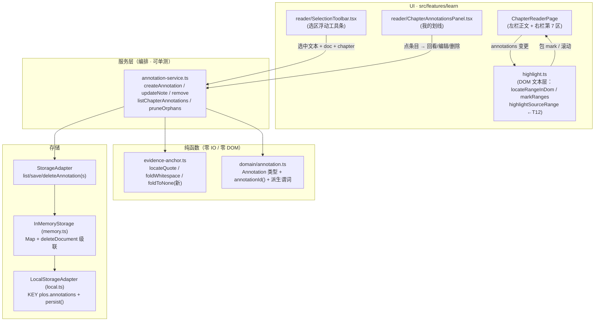
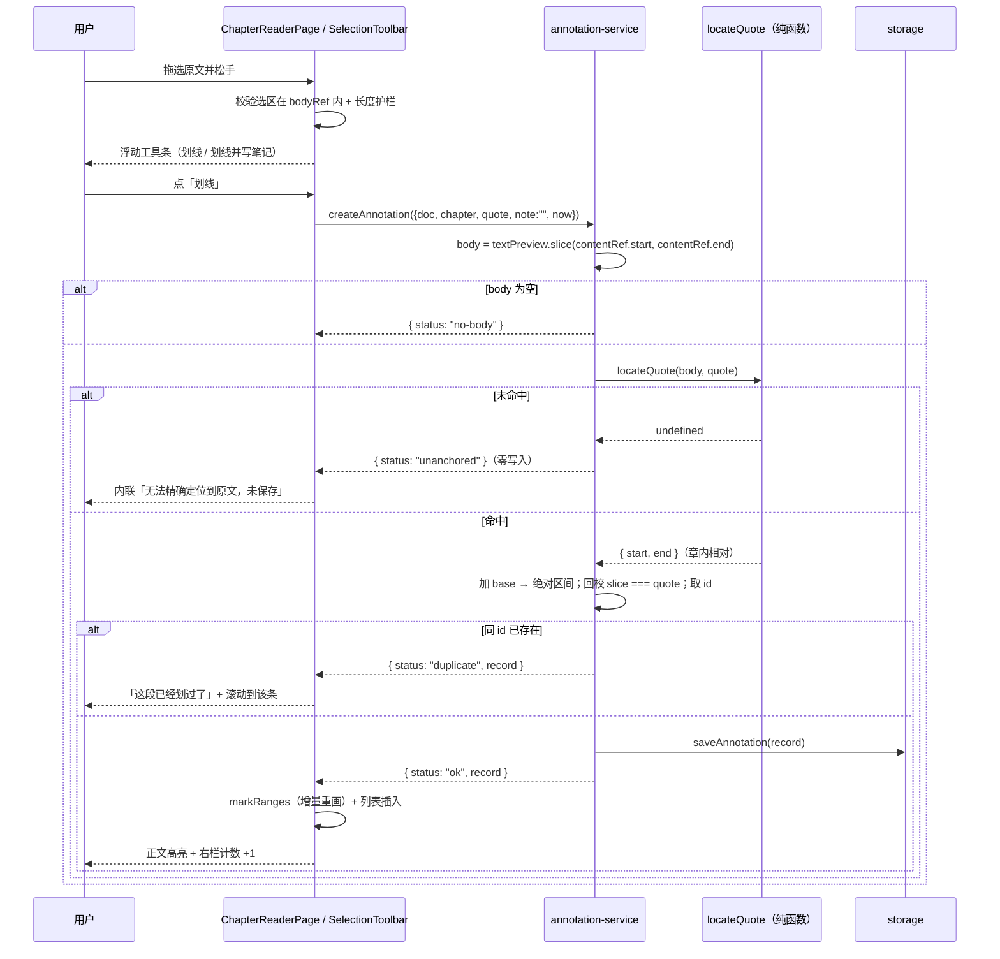
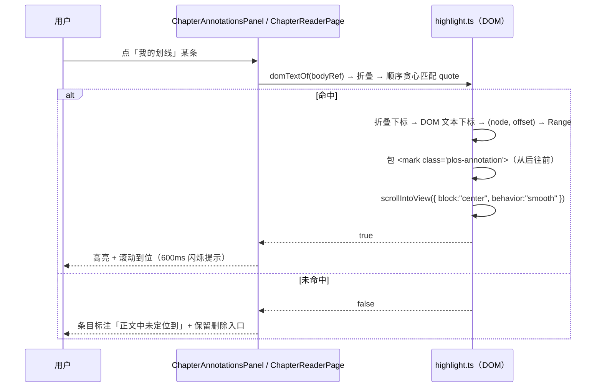

# 划线高亮与笔记（Highlight & Note）技术方案

| 字段 | 内容 |
|------|------|
| 作者 | Agent |
| 日期 | 2026-09-16 |
| 状态 | **v0.3 · 已实施**（D1–D10 全部确认；2026-09-16 按用户指示「按照默认方案实施」落地，实施回填见 §12.2 实测结果与 `docs/learn-highlight-note-task-runbook-2026-09.md`） |
| 关联需求 | `docs/roadmap-next-features-plan-2026-09.md` §F5 第 2 项（P1 · 大）「**高亮与笔记**：划线 → 存为该章关联批注 → 复习时回看」；同节 Done 标准「不破坏既有 `Chapter` 正文切片契约（批注独立存储，不改原文）」 |
| 附带范围 | **T12**（D10）：修正既有 `?at=` 系统性偏前 —— 用户指示「加成一个独立任务」（2026-09-16，见 §8.16 / §12.2）。它不在 roadmap 原文内，是本次调研发现并同批修复的既有缺陷 |

---

## 0.1 决策记录

### 已确认（本次会话，用户选定）

| ID | 决策点 | 结论 |
|----|--------|------|
| **D1** | 划线宿主范围 | **仅章级阅读页**（`ChapterReaderPage` 左栏正文）。资料详情「内容」Tab 不做 —— 它渲染的是 `doc.textPreview` 前 **20 万**字符（`ContentTab.tsx:19` `PREVIEW_CHARS`），越界选区无法定位，且要同时维护「文档绝对偏移」与「章内相对偏移」两套语义 |
| **D2** | 笔记数据形态 | **统一 `Annotation`，单色**：一条记录 = 原文区间 + 可选笔记文本（`note` 为空 = 纯高亮）。一对一，无关联表 |
| **D3** | 「复习时回看」落点 | **章级阅读页右栏新增第 7 区「我的划线（N）」**，点击滚回原文位置并闪烁定位。不新建资料级 Tab |
| **D4** | 是否写证据流 | **不写**。划线是高频轻动作，`evidenceLog` 上限 `EVIDENCE_LOG_MAX = 5000` 且超出 `slice(-MAX)` 丢最旧，逐条写入会挤掉真实测评证据、稀释 `/progress` 热力图。对齐 F5-1 章内提问的「纯只读」定位 |

### 本次提出的技术决策（随本方案一并确认）

| ID | 决策点 | 结论与理由 |
|----|--------|-----------|
| **D5** | 定位真源 | **双口径分工**：① **持久化真源** = `quote` + **文档绝对偏移**（`locateQuote` 回填，与 `KeyPointRef` 同口径，`domain/chapter.ts:53`）；② **DOM 定位** = 在**渲染后 DOM 文本**上折叠匹配 `quote`。**不复用** `highlightRange` 的「源串偏移直接喂 TreeWalker」口径 —— 该口径已实测不可靠（§3.1.5） |
| **D6** | 高亮层分离 | 瞬时锚点高亮（`?at=` / QA 引用 / 复述引用跳转）与持久划线是**两层独立 `<mark>`**，互不清除。需收窄既有 `clearHighlights` 的选择器（§3.1.6） |
| **D7** | 跨行选区 | 折叠匹配必须支持「**移除全部空白**」档 —— `PlainTextRenderer` 逐行渲染，DOM 文本里**不存在换行符**，跨行选区的 `quote` 含 `\n` 时用现有 `foldWhitespace`（折叠成**空格**）必然 miss（§3.1.5 实证） |
| **D8** | 多命中消歧 | 同一 `quote` 在章内出现多次时：**以源串 `start` 升序排列 + 在 DOM 文本上顺序贪心匹配**（DOM 文本偏移与源串偏移虽不等长，但**单调同序**，故顺序对应即正确）。不引入「创建时的 DOM 偏移」这种对渲染器版本敏感的字段 |
| **D9** | 明确不做 | 零 AI（不 import `src/ai/*`）；不做多色/标签；不做跨资料汇总页；不做 AI 归纳划线；划线**不参与**掌握度与复习调度（`mastery` 唯一写方仍是卷面）；不动 `Chapter` 正文切片契约 |
| **D10** | `?at=` 偏差修复 | **纳入本方案，作为独立任务 T12**（用户指定，原为「登记遗留不修」）。把 `highlightRange` 的「源串偏移当 DOM 文本偏移」口径整体换掉（§3.1.5 实测 44/44 章全偏），改为 `highlightSourceRange`：先由**源区间取 quote**，再走与本方案 D5/D7 **同一套** DOM 折叠匹配。收益：① 仓库只剩**一条**偏移口径，消除「两把尺子」；② `?at=` / 章内引用 / 划线三处跳转同时变准。**不改数据模型、不改存储、不改渲染器**，是纯口径修正。**实施补强（实测驱动，非原设计）**：三级候选 + **左侧上下文消歧**（`bestOccurrence`）+ **三档统一长度护栏** —— 初版取「首个命中」实测会跳到 2.6 万字符外的同构片段，违背「绝不错位」的初衷 |

---

## 1. 背景

**产品背景**：PLOS 的产品定位是「自我学习评测」，但**学习环节的主动加工能力长期为零** —— 打开一章只能读、看 AI 要点、点「标记学完」。roadmap 把这件事列为 P1 最大缺口：

> 用户在整个"学习"环节**没有任何主动加工动作** —— 不能划线、不能记笔记、不能提问、不能复述。（`roadmap-next-features-plan-2026-09.md:22`）

**F5 四条已交付三条**：① 章内提问（2026-09-14）③ 费曼复述（2026-09-14）④ 自测卡（2026-09-15）。**唯独第 2 条「高亮与笔记」仍是空白**：

> `P1 ◐ | F5 主动学习工具 | ...（提问 + 费曼复述 + 自测卡已实施；**仅笔记未做**）`（`roadmap:34`）

**为什么这条最该现在做**：

1. **它是 F5 里唯一零 AI 依赖的一条**（与自测卡同类），未配置模型时 100% 可用 —— 而提问/复述都要求模型就绪。
2. **它是「输入」而非「输出」**：复述要求用户先能讲出来，划线是讲出来之前的低成本动作（认知负荷最低的主动加工）。
3. **它是其余三条的共同上游**：划出来的原文区间，天然是复述的对照素材、自测卡的卡面素材、章内提问的检索种子。
4. **技术上是纯本地**：一条划线的全生命周期（创建 → 落库 → 回看 → 删除）不触碰网络与模型。

**不做的后果**：F5 这一条会长期挂着 ◐，roadmap 的「学习这条腿长出一半」无法收口；且越晚做，与既有六个右栏区的布局越难协调。

---

## 2. 方案目标

| 类型 | 描述 |
|------|------|
| **主要目标** | ① 在章级阅读页左栏正文上支持「选中一段原文 → 划线 → 可选写笔记 → 落库 → 下次打开自动恢复高亮 → 右栏「我的划线」可回看与跳转」（全流程零 AI、纯本地、不动原文与掌握度）；② **顺带修正既有 `?at=`/章内引用跳转的系统性偏前**（T12，D10），把仓库里两套偏移口径收敛成一套 |
| **非目标** | 资料详情「内容」Tab **划线**（D1）；多色/标签分类（D9）；跨资料笔记汇总页（D3）；AI 参与（归纳/串联/问答划线）；划线参与掌握度或复习调度；正文切分契约变更；**Markdown 渲染器的标记补偿**（GFM 把 `**`/`- ` 等改写后不做反向偏移映射，T12 改走 quote 定位，精度取舍见 §8.16） |
| **成功标准** | ① 选中一段原文 → 出现浮动工具条 → 划线成功，落库为 `Annotation`；② 刷新/重进本章，高亮**位置与原文逐字对齐**（不偏前）；③ 可对已有划线补写/修改笔记，可删除；④ 右栏「我的划线（N）」列出本章全部划线，点击滚回并高亮；⑤ 未配置任何 AI 模型时全流程可用；⑥ `npm run typecheck` 无新增 error，`npm run test:annotation` 全绿；⑦ `LearnerState`、`Chapter`、`Paper` 序列化结果逐字节不变（回归断言）；⑧ **既有 `?at=` / 章内引用跳转不再偏前** —— 34 章以上样本逐章断言「高亮起始即为源串 `at` 处的可见字符」（T12） |

---

## 3. 项目现状

### 3.1 相关代码与模块

| 位置 | 现状 | 与本次的关系 |
|------|------|-------------|
| `src/features/learn/ChapterReaderPage.tsx` | 497 行。左栏章正文（`:260` `bodyRef`），`body = doc.textPreview.slice(contentRef.start, contentRef.end)`（`:224`）；右栏六区（`:275-413`）；高亮副作用 `:148-163` | **主要改动点**：左栏加选区交互，右栏加第 7 区 |
| `src/features/learn/highlight.ts` | 87 行。`HIGHLIGHT_WINDOW = 120`（`:21`）、`clearHighlights(root)`（`:24`，清**所有** `mark`）、`highlightRange(root, start, end)`（`:39`，TreeWalker 累加文本长度定位） | **复用 + 必须扩展**：新增 DOM 文本层 API，收窄 `clearHighlights` 选择器；**并删除误用语义的 `highlightRange` 导出**（T12，见 §3.1.5） |
| `src/features/learn/detail/ContentTab.tsx` | 112 行。`PREVIEW_CHARS = 200000`（`:19`）；`:45` `highlightRange(root, at, at + HIGHLIGHT_WINDOW)` 传的是**文档绝对偏移**；`:34` 未展开时只渲染 `text.slice(0, PREVIEW_CHARS)` | **T12 第二改动点**：既是偏移口径误用的第二处，也藏着「`at` 落在 20 万字符之外 → DOM 里根本没有这段文本」的截断地雷 |
| `src/features/learn/ChapterReaderPage.tsx:148-163` | 瞬时高亮 effect：`:152-156` 用「章内引用偏移」或「`at - contentRef.start`」构造 `start`，`:160` 传给 `highlightRange` | **T12 第一改动点**：两处偏移都是**源串偏移**，需改为构造 `SourceRange` 后调 `highlightSourceRange` |
| `src/features/learn/render/MermaidBlock.tsx` | `:10-12` 注释明确「源码容器**常驻 DOM**（仅切 hidden），否则 `highlightRange` 的 TreeWalker 累加会整体失准」；`tests/render-mermaid.test.ts:280` 有对应断言 | **反证**：仓库已为这个**错误口径**付出过设计代价。T12 之后该约束不再是必需项（**本次不动它**，只登记为可简化项） |
| `src/features/learn/render/PlainTextRenderer.tsx` | 43 行。`text.split("\n")` → 每行 `trimEnd()` → 标题行剥 `#{1,6} ` → 空行输出 `<div className="h-3"/>`（**零文本节点**） | **偏差根因**（§3.1.5）。**本方案不改它** |
| `src/features/learn/render/renderer-registry.ts` | `pickRenderer(format)`（`:31-42`）：`markdown`→GFM、`code`→CodeRenderer、`image`→ImageNotice、**其余全部**→`PlainTextRenderer` | 决定「正文 DOM 长什么样」，从而决定折叠匹配的可行性 |
| `src/features/learn/evidence-anchor.ts` | `MAX_QUOTE_CHARS = 2000`（`:14`）、`foldWhitespace`（`:31`）、`locateQuote(body, quote)`（`:75`，两档：精确 indexOf → 折叠空白）、`anchorToDocument(body, quote, base)`（`:108`）、`isValidRange`（`:119`）。**纯函数、零 IO、已单测**（`tests/library-anchor.test.ts`） | **核心复用**：`locateQuote` 就是弧线的定位真源；同文件新增「移除式折叠」 |
| `src/storage/types.ts` | `StorageAdapter` 契约。F5 先例：`:168-181` 复述 3 方法 + 卡片 3 方法 | 新增 4 个批注方法 |
| `src/storage/memory.ts` | 基类 `InMemoryStorage`。`:62` `restatements` Map；`:91-95` `deleteDocument` 已做「级联删章节」 | 新增 `annotations` Map + 方法 + **`deleteDocument` 追加级联** |
| `src/storage/local.ts` | `:34-59` 各 key 常量；`:105-107` 在构造函数 `load`；`:303-310` `override saveRestatement/deleteRestatement` → `persist()` | 新增 `KEY_ANNOTATIONS` + load + override |
| `src/storage/tauri.ts` | `TauriStorage extends LocalStorageAdapter`；只有 RAG 五类走 SQLite（`:229`） | **零改动**（批注属 localStorage 层实体） |
| `src/domain/evidence.ts` | `EvidenceKind = "assessment" \| "review" \| "restatement" \| "card" \| "capability"`（`:24`） | **不改**（D4 决定不写证据流） |
| `src/domain/capability.ts:173` / `src/engine/flashcard-engine.ts:24` | `hashId`（djb2 32bit→base36）**各自私有**，注释明确「不为 6 行代码新建通用工具库」（`capability.ts:170-171`） | 批注 id 沿用同款（§8.1），**不重构既有两处** |
| `src/i18n/messages/{zh,en}.ts` | `learn.reader` 命名空间已有 `status`/`why`/`knowledge`/`qa`/`restatement` 等子区（`zh.ts:1240` 起） | 新增 `learn.reader.annotations` 子区 |
| `src/features/evidence-label.ts` | 证据动作 → i18n 键的唯一真源 | **不改**（D4） |

### 3.1.5 ⚠️ 关键现状缺陷：DOM 文本与源串**不等长**（本次方案的决定性依据）

**代码事实**：`highlightRange(root, start, end)` 用 `TreeWalker` 累加**文本节点**长度，把 `start/end` 当作「DOM 文本偏移」使用；而调用方传入的却是**源串偏移**（`ChapterReaderPage.tsx:155` 的 `at - contentRef.start`、`ContentTab.tsx:45` 的 `at`）。

但 `PlainTextRenderer` 产出的文本节点拼起来，**必然短于源串**：

```tsx
const lines = text.split("\n");            // ① 换行符本身不进入任何文本节点
lines.map((raw, i) => {
  const line = raw.trimEnd();              // ② 行尾空白被丢弃
  const heading = /^(#{1,6})\s+(.*)$/.exec(line);
  if (heading) return <p>{heading[2]…}</p>; // ③ 标题的 "### " 前缀被丢弃
  if (line.trim() === "") return <div className="h-3" />;  // ④ 空行零文本节点
  return <p><span>{line}</span></p>;
});
```

**实测量化**（本次用真实库验证，方法：拷 `~/Library/WebKit/personal-learning-os/WebsiteData/Default/<hash>/<hash>/LocalStorage/localstorage.sqlite3` + `-wal` + `-shm` 到 /tmp，UTF-16LE 解码 `plos.chapters` / `plos.documents`，按上述规则复现 DOM 文本并逐章比对）：

| 指标 | 实测值 |
|------|--------|
| 章节总数 | 44（pdf 42 / markdown 2） |
| **存在偏差的章节** | **44 / 44 = 100%** |
| 偏差中位数 | **−2.0%** |
| 偏差最大 | **−6.1%**（章「6.1.3 注册企业主要程序与招」：源 661 → DOM 621） |
| 平均丢失字符 | **54.8 字符/章**（全部是换行与行尾空白） |
| 格式分布 | pdf 与 markdown **都偏** |

**结论**：`start` 是源串偏移，`TreeWalker` 在更短的 DOM 串上累加 → **恒定偏前，且偏差随位置累积**。既有 `?at=` 跳转之所以「看起来能用」，只是因为 `HIGHLIGHT_WINDOW = 120` 的窗口足够宽，把 2% 的漂移盖住了。

**对本次的影响**：划线要求「逐字对齐」（用户选中的就是 DOM 里的那几个字），**绝不能**沿用这个口径。故 D5 定下双口径分工。

**修复归属（D10 → T12）**：本方案**不再把这个缺陷留给遗留清单**，而是作为独立任务 **T12**（§8.16）同批修正 —— 把 `highlightRange` 的「源串偏移 → DOM 文本累加」整体换成 `highlightSourceRange`（源区间 → 取 quote → 与划线**同一套** DOM 折叠匹配）。

| | 旧口径（`highlightRange`） | 新口径（`highlightSourceRange`） |
|---|---|---|
| 依赖前提 | **DOM 文本长度守恒** | **quote 字面在 DOM 文本中可折叠匹配** |
| 前提是否成立 | ❌ 实测 44/44 章全不成立（中位 −2.0%） | ✅ 只要渲染器没改写这段字面（弱得多，且真实成立） |
| Markdown（GFM） | 偏移必然漂移 | 逐字命中的区段**精确**；被改写的区段 miss（不伪造） |
| 失败表现 | 静默错位（被 `HIGHLIGHT_WINDOW = 120` 掩盖） | 静默不跳（`false`，零副作用） |

**T12 的执行前提（易漏）**：`ContentTab` 未展开时只渲染 `text.slice(0, PREVIEW_CHARS)`，若 `at ≥ 200000`，**DOM 里根本没有这段文本** —— 只换口径会把「错位跳转」变成「不跳转」（体验退化）。故 T12 必须同时处理该截断边界（§8.16 步骤 0）。

### 3.1.6 ⚠️ `clearHighlights` 会误清持久划线

`highlight.ts:24` 的实现是 `root.querySelectorAll("mark")` —— **无差别清除**。若持久划线也用 `<mark>`，任何一次 `?at=` 跳转或面板引用跳转都会把用户划线全部抹掉（视觉上「闪一下就没了」）。故 D6 要求收窄选择器（§8.4）。

### 3.2 相关文档与约定

| 文档 | 采用的做法 |
|------|-----------|
| `docs/roadmap-next-features-plan-2026-09.md` §F5 | 本方案的需求来源；Done 标准「批注独立存储，不改原文」 |
| `docs/learn-feynman-restatement-design-2026-09.md` | **服务层范式**：编排层返回带状态的结果对象（`status` + 载荷 + `errorKind`），文案由 UI 走 i18n 映射；「锚不上即丢弃、零伪造引用」 |
| `docs/learn-flashcard-design-2026-09.md` | **零 AI 范式**：实体 key `plos.flashcards`；卡面从 `Chapter` 派生；「不成卡就如实说」 |
| `docs/library-detail-page-design-2026-09.md` §4.3/§8.3 | 锚定原则：不信任何来源自带的偏移量，偏移一律由代码用 `locateQuote` 回填 |
| `docs/progress-analytics-design-2026-09.md` | 本方案文档的章节组织与「§0.1 决策记录」体例 |
| `rules/layer-import-boundaries.mdc` | UI → stores/storage；`engine/`、`ai/` 不得 import `features/` |
| `rules/no-headless-browser-validation.mdc` | **禁止**主动起浏览器校验；验证走 `typecheck` + node 单测 + 代码自审 |
| `skills/pre-task-technical-design` | 本方案按 12 章模板产出，用户确认后才写生产代码 |

### 3.3 约束与依赖

**硬约束**

1. **纯逻辑必须 `.ts` 且可直跑 node 单测**：`--experimental-strip-types` **不支持 JSX**，测试不得 import `.tsx`。→ 折叠匹配、区间换算、消歧、id 派生全部落在 `.ts`（且不得依赖 `document`）。
2. **`tsconfig` 只 `include: ["src"]`** → `tests/` **不参与 typecheck**。接口改动后必须**手工扫 `tests/` 的残留死方法**（运行时静默忽略）。
3. **相对导入**为主（`@/*` 仅豁免 `components/ui` 与 `lib/utils`）；i18n **双语成对**新增（`zh.ts` + `en.ts`）；Tailwind 4 token，新 hex 只允许进 `main.css`。
4. **`TauriStorage` 继承 `LocalStorageAdapter`** → 本特性只改 `memory.ts`（基类）与 `local.ts`，`tauri.ts` 与 `src-tauri/**` **零改动**。
5. **不改** `Chapter` / `SourceDocument` / `EvidenceEntry` 的既有字段语义；不新增 `EvidenceKind`；不写 `LearnerState`。

**依赖**：无。本特性**不依赖 AI、不依赖网络**（`locateQuote` / `foldWhitespace` 均已在仓库内且已单测）。

---

## 4. 技术架构

### 4.1 总体架构



**数据流一句话**：`选区(DOM) --quote--> 服务层 --locateQuote(源串)--> 绝对区间 + quote --> 存储`；回看时 `annotation(quote) --折叠匹配(DOM 文本)--> Range --> <mark>`。

### 4.2 模块职责

| 模块/层级 | 职责 | 技术选型 |
|-----------|------|----------|
| `domain/annotation.ts`（新增） | `Annotation` 类型、`annotationId()`、`ANNOTATION_LIMITS`、`annotationIsNoteOnly` 等纯谓词 | 纯 TS，零依赖（同 `domain/flashcard.ts`） |
| `features/learn/evidence-anchor.ts`（扩展） | 新增 `foldToNone(s)`：**移除全部空白**的折叠 + 下标映射（D7） | 纯函数，零 IO，可直跑单测 |
| `features/learn/annotation-service.ts`（新增） | 编排：选区 → 定位 → 落库；笔记编辑；删除；重切分后重定位/清理 | 依赖 `storage` + 纯函数。**不 import `src/ai/*`** |
| `features/learn/highlight.ts`（扩展） | DOM 侧：`domTextSegments`、`locateRangeInDom`、`markRanges`、`scrollToQuote`、收窄 `clearHighlights`；**删除 `highlightRange` 导出**、新增 `highlightSourceRange`（T12） | 纯 DOM 操作，无 React、无 IO |
| `features/learn/reader/SelectionToolbar.tsx`（新增） | 选区监听 + 浮动工具条 + 笔记输入浮层 | React；props 进、回调出，不直接碰 storage |
| `features/learn/reader/ChapterAnnotationsPanel.tsx`（新增） | 右栏第 7 区：列表 / 空态 / 定位失败标注 / 编辑与删除 | React；复用 `primitives.tsx` 的 `Section` / `Card` |
| `features/learn/ChapterReaderPage.tsx`（修改） | 接线：加载批注、应用高亮、插入第 7 区、暴露「滚回并闪烁」 | 既有页面 |
| `storage/{types,memory,local}.ts`（修改） | 契约 + 内存实现 + localStorage 持久化 + 文档级联 | 既有三层模式 |

### 4.3 数据模型与 API

#### 4.3.1 领域类型（`src/domain/annotation.ts`，新增）

```ts
/**
 * 一条划线批注（F5-2「高亮与笔记」）。
 *
 * 定位：**用户产出的学习资产**，与章内提问（纯只读）性质不同 —— 划线是「我标的」，
 * 因此落库；但**不参与掌握度**（mastery 唯一写方仍是卷面，见 domain/evidence.ts）。
 *
 * 引文不变式（由 annotation-service.ts 保证，单测断言）：
 *   - `quote` 为 verbatim 原文摘录，长度 ∈ [ANNOTATION_LIMITS.minQuoteChars, MAX_QUOTE_CHARS]；
 *   - `[start, end)` 为 **doc.textPreview 的绝对偏移**（与 KeyPointRef 同口径，
 *     domain/chapter.ts:53），左闭右开；
 *   - `doc.textPreview.slice(start, end) === quote` —— **必须逐字相等**，
 *     否则整条拒绝落库（零伪造区间，对齐 locateQuote 的「诚实降级」原则）。
 */
export interface Annotation {
  /** `ann_` + djb2(documentId + NUL + start + NUL + end) —— 区间派生，同区间重复划线 = 同一条。 */
  id: string;
  documentId: string;
  /** 创建时归属章（复习回看的组织维度）；章被合并/重切分时按新区间回填。 */
  chapterId: string;
  /** verbatim 原文摘录。 */
  quote: string;
  /** 文档绝对偏移（doc.textPreview），与 keyPointRefs 同口径。 */
  start: number;
  end: number;
  /**
   * 用户笔记（**空串 = 纯高亮**）。用空串而不是 undefined：
   * 「有没有写过笔记」与「笔记被清空」在数据上不区分，避免两种空值语义。
   */
  note: string;
  createdAt: number;
  /** 最近一次改笔记的时间（纯高亮时为 createdAt）。 */
  updatedAt: number;
}

/** 尺寸护栏（UI 与服务层共用同一常量，防两处口径漂移）。 */
export const ANNOTATION_LIMITS = {
  /** 选区过短没有信息量（1 个字的划线无意义，且极易多命中）。 */
  minQuoteChars: 2,
  /** 单条 quote 上限 —— 与 evidence-anchor 的 MAX_QUOTE_CHARS 对齐（3000 字的长划线不可用）。 */
  maxQuoteChars: 2000,
  /** 笔记上限（防灌水；UI 与 service 共用）。 */
  maxNoteChars: 1_000,
  /** 单章批注上限（超限时 UI 阻止新建并如实提示，不静默丢弃）。 */
  maxPerChapter: 200,
} as const;

export function annotationId(documentId: string, start: number, end: number): string {
  return `ann_${hashId(`${documentId}\u0000${start}\u0000${end}`)}`;
}
// hashId：djb2 32bit → base36。与 domain/capability.ts:173、engine/flashcard-engine.ts:24
// 同算法（各自私有）。此处内联第三份的理由与 capability.ts:170-171 相同：
// domain 不得反向 import engine，且既有两处注释已明确「不为 6 行代码新建通用工具库」。
// ⚠️ 若未来出现第四处，才值得抽到 src/lib/hash.ts（届时三处一起换）。
```

#### 4.3.2 服务层返回状态（`annotation-service.ts`）

```ts
/** 创建结果状态（UI 据此分支渲染，不做隐式兜底；沿用复述服务的四态体例）。 */
export type AnnotationStatus =
  | "ok"            // 定位成功且已落库
  | "unanchored"    // quote 无法精确锚回章正文 → **不落库**，如实提示
  | "no-body"       // 本章无正文快照（textPreview 为空）
  | "duplicate"     // 同区间已存在 → 不新建，改为选中已有条目（幂等）
  | "too-short"     // quote < minQuoteChars
  | "too-long"      // quote > maxQuoteChars 或 note > maxNoteChars
  | "capped"        // 本章批注数达上限
  | "error";        // 存储 / 读取异常

export interface AnnotationResult {
  status: AnnotationStatus;
  /** 落库后的记录（仅 ok / duplicate 时存在）。 */
  record?: Annotation;
  at: number;
}

export interface CreateAnnotationInput {
  doc: Pick<SourceDocument, "id" | "textPreview">;
  chapter: Pick<Chapter, "id" | "contentRef">;
  /** 用户选中的原文（verbatim，来自 window.getSelection().toString()）。 */
  quote: string;
  /** 同时写入的笔记（可空串）。 */
  note?: string;
  now: number;
}
```

#### 4.3.3 存储契约（`src/storage/types.ts` 追加）

```ts
// ===== 划线批注（F5 第 2 条；决策 D4：不写证据流、不参与掌握度）=====
/**
 * 某章的批注（**按 `start` 升序** —— 与正文阅读顺序一致，且是 DOM 消歧的顺序依据 D8）。
 * 无批注返回空数组（不抛错）。
 */
listAnnotationsByChapter(chapterId: string): Promise<Annotation[]>;
/** 某资料的批注（按 `start` 升序；重切分后重定位 / 资料级统计用）。 */
listAnnotations(documentId: string): Promise<Annotation[]>;
/** 按 id upsert（新建 / 改笔记均为本方法）。 */
saveAnnotation(annotation: Annotation): Promise<void>;
/** 单条删除（用户手动删除）。幂等。 */
deleteAnnotation(id: string): Promise<void>;
/** 整批删除（孤儿清理 / 重切分后重定位失败）；**空数组 = 无操作**。 */
deleteAnnotations(ids: string[]): Promise<void>;
```

#### 4.3.4 数据读写路径（**必填项**，遵循 `rules/layer-import-boundaries.mdc`）

| 环节 | 路径 |
|------|------|
| UI 读取 | `ChapterReaderPage` → `annotation-service.listChapterAnnotations(chapterId)` → `storage.listAnnotationsByChapter` |
| UI 写入 | `SelectionToolbar` / `ChapterAnnotationsPanel` →（回调）→ `ChapterReaderPage` → `annotation-service.createAnnotation / updateAnnotationNote / removeAnnotation` → `storage.saveAnnotation / deleteAnnotation` |
| 持久化格式 | localStorage key **`plos.annotations`**，值 = `Annotation[]` 的 JSON（与 `plos.restatements` 同层同格式） |
| 迁移策略 | **新 key，无旧数据 → 零迁移**。构造函数 `load<Annotation[]>(KEY_ANNOTATIONS, [])` |
| 级联 | `memory.ts::deleteDocument` 追加清理该 `documentId` 的全部批注（与既有「级联删章节」同处） |
| 桌面能力 | **不涉及** —— 无 `invoke`、无 vault/llm、无 `isTauri` 守卫需求 |
| SQLite | **不涉及** —— 批注属 localStorage 层实体，`tauri.ts` 与 `src-tauri/**` 零改动 |

### 4.4 状态与副作用

| 状态 | 归属 | 说明 |
|------|------|------|
| `annotations: Annotation[]` | `ChapterReaderPage` 本地 state | 本章批注。加载时机：`chapter`/`doc` 就绪后；依赖变更：`chapter?.id` |
| 选区与浮动工具条位置 | `SelectionToolbar` 内部 state | `{ quote, rect, mode: "idle" \| "note" }`；选区消失即关闭 |
| 编辑中的目标条目 | `ChapterReaderPage` state `editingId?: string` | 传给面板；同一时刻只允许一条处于编辑态 |
| 瞬时锚点高亮 | 既有 `highlight` state（`:74`）+ `?at=` | **状态归属不动**，与持久层并行（D6）；⚠️ 但**定位口径**由 T12 换为 `highlightSourceRange`（§8.16）—— 状态不动、口径修正 |
| 持久划线 `<mark>` | **DOM 命令式**（非 React state） | 由 effect 调用 `markRanges`，副作用域 = `bodyRef` |

**副作用触发时机**

1. **mount / `chapter.id` 变化**：`listChapterAnnotations` → setState。
2. **`annotations` 变化（且正文已渲染）**：`requestAnimationFrame` 后调用 `markRanges(root, annotations)`（与既有 `?at=` effect 同样的「两帧后执行」体例，`ChapterReaderPage.tsx:159`）。
3. **点击面板条目**：`scrollToAnnotation(id)` → 滚动 + 闪烁（CSS 动画类，600ms 后移除）。
4. **章切换**：`markRanges` 先 `unwrapMarks(root)`（只剥持久层），再按新章数据重画。
5. **`at` / `highlight` 变化（T12 口径）**：`highlightSourceRange(root, body, start, end)` —— 与既有一样两帧后执行（`:159`），但改由 quote 折叠匹配定位；失败静默不跳。

---

## 5. 交互流程

### 5.1 主流程（划线 + 写笔记）

1. 用户在章级阅读页左栏正文中**拖选一段原文** → 松开鼠标。
2. `SelectionToolbar` 的 `mouseup` 处理器：取 `window.getSelection()`，要求 ① 选区非折叠；② 选区**完全落在** `bodyRef` 容器内（`root.contains(range.commonAncestorContainer)`）；③ `quote = sel.toString().trim()` 长度 ∈ 护栏。任一不满足 → 不弹工具条。
3. 工具条出现在选区正上方（`range.getBoundingClientRect()`，越界则翻转到下方），两个动作：**「划线」** / **「划线并写笔记」**。
4. 点「划线」→ 服务层 `createAnnotation`：
   - `body = doc.textPreview.slice(contentRef.start, contentRef.end)`；为空 → `no-body`。
   - `hit = locateQuote(body, quote)` → 失败 → **`unanchored`，不落库**，工具条内联提示「这段选中的文字无法精确定位到原文，未保存」。
   - 命中 → 绝对区间 `[contentRef.start + hit.start, contentRef.start + hit.end)`；**回校** `doc.textPreview.slice(start, end) === quote`（含折叠空白命中时，回校会失败 → 以**回校后的实际切片为准**覆盖 `quote`：让 `quote` 永远是「原文字面」，而不是用户选区的字面）。
   - `id = annotationId(doc.id, start, end)`；若已存在同 id → **`duplicate`，不新建、不覆盖笔记**，工具条提示「这段已经划过了」并高亮已有条目。
   - 通过 → 落库（`note` 为 `""`），`status: "ok"`。
5. 点「划线并写笔记」→ 工具条内展开 `textarea`（`maxNoteChars` 计数）→ 确认 → 同上流程但带 `note` 落库。
6. 落库成功后：正文对应区间**立即**出现持久高亮（不等 effect，直接 `markRanges` 增量重画）；右栏第 7 区计数 `N → N+1`，新条目插入列表正确位置。
7. **刷新或重进本章** → `listChapterAnnotations` → effect 在正文渲染完成后应用高亮 → 位置与原文**逐字对齐**。

### 5.2 分支与异常流程

| 场景 | 触发条件 | 系统行为 | UI 反馈 |
|------|----------|----------|---------|
| 选区跨出正文容器 | 拖选越过了 `bodyRef` 边界 | 不弹工具条 | 无（静默忽略） |
| 选区折叠/空白 | 单击、只选中空白字符 | 不弹工具条 | 无 |
| 选区过短 | `quote.length < 2` | 不弹工具条 | 无 |
| 选区过长 | `quote.length > 2000` | 不弹工具条；服务层二次拒绝 | 工具条内联「选中范围过长，请分段划线」 |
| **锚定失败** | `locateQuote` 两档都 miss（多为 Markdown 渲染把 `**`/`- ` 等标记改写） | **不落库**（`unanchored`） | 内联提示「无法精确定位到原文，未保存」+ 简短原因 |
| 章无正文快照 | `doc.textPreview` 为空 | 服务层 `no-body` | 工具条不出现；第 7 区显示「本章无正文快照」 |
| 重复区间 | 同 `id` 已存在 | 不新建、不改笔记 | 提示「这段已经划过了」并滚动到已有条目 |
| 章内批注达上限 | `≥ maxPerChapter` | `capped` | 停用「划线」按钮 + 提示上限 |
| 笔记超长 | `note.length > 1000` | `too-long` | `textarea` 实时计数并禁用确认（UI 先拦） |
| **回看时 DOM 未定位到** | `locateInDom` 未命中（渲染差异/正文被替换） | 该条在正文中不画 mark，列表**仍展示** | 条目标注「正文中未定位到」+ 提供「删除」 |
| **重切分后** | 用户重切分/合并章节 → `contentRef` 全变 | 服务层 `pruneOrphans`：按 `quote` 重新 `locateQuote(doc.textPreview)`；命中 → 重写 `start/end/chapterId`；未命中 → 删除 | 重切分完成后的提示中附加「N 条划线已重新定位 / M 条已失效删除」 |
| 存储异常 | `saveAnnotation` 抛错 | `error`，**不伪造成功** | 工具条内联「保存失败，请重试」 |
| **`?at=` / 章内引用定位失败**（T12 口径，D10） | `highlightSourceRange` 三级候选全 miss，或 `at` 越界 / 区间非法 | 返回 `false`，**DOM 零改动、零副作用** | 无（静默）—— **绝不错位高亮**。⚠️ 旧行为是「偏前 2% 但仍高亮」，T12 起改为「宁可不动」 |

### 5.3 时序图

**创建（划线）**



**回看（点条目）**



---

## 6. 用户用例

### UC-01：划出一段原文（纯高亮）

| 项 | 内容 |
|----|------|
| 角色 | 学习者 |
| 前置条件 | 已导入资料并切分出章节；打开 `/learn/chapter/:chapterId`；本章 `textPreview` 非空 |
| 主流程步骤 | 1. 在左栏正文拖选一段原文（≥2 字） 2. 松手，出现浮动工具条 3. 点「划线」 |
| 期望结果 | 正文该区间出现持久高亮；右栏第 7 区计数 +1 并新增条目（显示 quote 摘要）；`plos.annotations` 中新增一条 `note: ""` 的记录；**无任何 AI 调用** |
| 异常/边界 | 选区越界/过短/过长 → 不弹工具条或内联拒绝；anchor 失败 → `unanchored` 零写入；同区间重复 → `duplicate` 不新建 |

### UC-02：划线并写笔记

| 项 | 内容 |
|----|------|
| 角色 | 学习者 |
| 前置条件 | 同 UC-01 |
| 主流程步骤 | 1. 拖选原文 2. 点「划线并写笔记」 3. 在 `textarea` 输入笔记（≤1000 字） 4. 确认 |
| 期望结果 | 落库一条 `note` 非空的记录；右栏条目显示笔记正文；`updatedAt === createdAt` |
| 异常/边界 | 笔记为空 → 等价 UC-01（`note: ""`）；超长 → UI 禁用确认 + 服务层 `too-long`；输入中取消 → 零写入 |

### UC-03：复习时回看本章划线

| 项 | 内容 |
|----|------|
| 角色 | 学习者（到期复习场景） |
| 前置条件 | 本章已有 ≥1 条批注 |
| 主流程步骤 | 1. 进入本章阅读页 2. 右栏第 7 区显示「我的划线（N）」与条目列表 3. 点某条 |
| 期望结果 | 正文滚到该区间并高亮；条目短暂闪烁提示 |
| 异常/边界 | 条目命中失败（渲染差异）→ 标注「正文中未定位到」但**不删除记录**；多条按 `start` 升序（= 阅读顺序）展示 |

### UC-04：修改 / 删除划线

| 项 | 内容 |
|----|------|
| 角色 | 学习者 |
| 前置条件 | 已有批注 |
| 主流程步骤 | 1. 点条目上的「编辑」→ 内联展开 `textarea` 2. 改文本 → 保存（或点「删除」并在确认后确认） |
| Expected | 修改：仅 `note`/`updatedAt` 变化，`quote`/`start`/`end`/`id` **不变**（保 id 才能保持 DOM 高亮不重建）；删除：记录移除 + 正文持久 mark 立即消失 + 计数 −1 |
| 异常/边界 | 把笔记清空 → `note: ""`，条目退化为纯高亮（**记录保留**，与「删除划线」区分）；删除无二次确认以外的副作用（不写证据流） |

### UC-05：重切分 / 合并章节后的存续

| 项 | 内容 |
|----|------|
| 角色 | 学习者 |
| 前置条件 | 已有批注；随后执行重切分或章合并（F7-a） |
| 主流程步骤 | 1. 对资料重新切分（或合并两章） 2. 服务层 `pruneOrphans(documentId)` |
| 期望结果 | 记录按 `quote` 在新 `textPreview` 上**重定位成功** → `start/end` 与 `chapterId` 更新，划线仍在；定位失败 → 记录删除，并在切分结果提示中报告数量 |
| 异常/边界 | 正文本身被整体替换（`textPreview` 变化）→ 未命中即删（不保留指不到正文的孤儿）；**不静默丢弃**：提示中报告 N 成功 / M 失效 |

### UC-06：无 AI / 无网络环境

| 项 | 内容 |
|----|------|
| 角色 | 学习者 |
| 前置条件 | 未配置任何 AI 模型 |
| 主流程步骤 | 1. 打开章级阅读页 2. 划线 3. 写笔记 4. 回看 |
| 期望结果 | **全流程可用**（本特性不 import `src/ai/*`）；其余依赖 AI 的区（章内提问/复述）各自显示既有的「去设置配置模型」引导，**互不影响** |
| 异常/边界 | 无 |

### UC-07：从「知识点 → 原文」跳转过来（`?at=`，T12 修复对象）

| 项 | 内容 |
|----|------|
| 角色 | 学习者 |
| 前置条件 | 打开某资料的知识点 Tab，点某条要点后的「原文 →」（带 `?at=<文档绝对偏移>`） |
| 主流程步骤 | 1. 跳转到章级阅读页（或资料详情「内容」Tab）并带入 `at` 2. 等正文渲染完成后定位并高亮 |
| 期望结果 | 高亮**起点即 `at` 处的可见字符**。T12 前实测 **44/44 章偏前**（中位 −2.0%、最大 −6.1%），原因是把源串偏移当 DOM 文本偏移用（§3.1.5）；T12 改为「源区间 → quote → DOM 折叠匹配」后不再漂移 |
| 异常/边界 | ① `at` 落在 DOM 中不存在的字符（`### ` 前缀 / 换行 / 行尾空白）→ 归属到相邻可见字符，**不漂移**；② GFM 改写的区段（`**粗体**`、`[链接](url)`）→ 逐级降级取最长纯文本片段，末级仍 miss 时**静默不跳**（DOM 零改动）；③ `at ≥ PREVIEW_CHARS`（资料内容 Tab，20 万字符截断）→ **先自动展开全文再跳**，否则 DOM 里根本没有这段文本（§8.16 步骤 0） |

---

## 7. 线框 UI

### 7.1 左栏正文 · 选区浮动工具条（默认态）

```
┌──────────────────────────────────────────────────────┐
│ ← 返回资料目录                                        │
│ 东帝汶投资指南 · 第 6 章                    [学习中]  │
├────────────────────────────────────────┬─────────────┤
│  6.1.3 注册企业主要程序与招投标        │  1 · 章状态 │
│  ────────────────────────────────────  │  ...        │
│  企业注册须经投资协调局审批，并提交    │             │
│  ┌───────────────────────────────┐     │             │
│  │ ▌划线  │  ▌划线并写笔记        │     │             │  ← 浮动工具条
│  └───────────────────────────────┘     │             │     (选区正上方)
│  ▓▓▓▓▓▓▓▓▓▓▓▓▓▓▓▓▓▓（已选中的原文）    │             │
│  相关材料包括章程、股东身份证明等。    │             │
│                                        │  7 · 我的划线│
└────────────────────────────────────────┴─────────────┘
```

- **布局**：工具条绝对定位于选区上方 8px；左右夹取在正文容器内（防止溢出）；`rounded-lg border border-line bg-surface shadow-lg px-1 py-1`。
- **组件映射**：`Button`（`variant="ghost" size="sm"`，来自 `components/ui/button`）。
- **设计 token**：`--color-surface`、`--color-line`、`--color-ink-1`；高亮色 `--color-primary` 低透明度（**不新增 hex**）。

### 7.2 右栏第 7 区「我的划线」三种状态

**（a）默认（N ≥ 1）**

```
┌────────────────────────────────┐
│ 7 · 我的划线（3）        全部删除 │  ← Section title + action
├────────────────────────────────┤
│ ▌ 企业注册须经投资协调局审批…    │  ← quote 摘要（2 行截断）
│   笔记：这条与 WH 模块供应商准入…│  ← note（可空）
│   [定位] [编辑] [删除]           │
├────────────────────────────────┤
│ ▌ 相关材料包括章程、股东身份证…  │
│   （无笔记）                     │
│   [定位] [编辑] [删除]           │
├────────────────────────────────┤
│ ▌ 第五章的税率表…                │
│   ⚠ 正文中未定位到                │  ← 诚实降级标注
│   [删除]                         │
└────────────────────────────────┘
```

**（b）空态**

```
│ 7 · 我的划线                    │
│ 还没有划线。在左边正文里选中一句  │
│ 话，就能划线并写笔记。            │
│ （不显示任何按钮 —— 不制造无效入口）│
```

**（c）本章无正文快照**

```
│ 7 · 我的划线                    │
│ 本章没有正文快照，暂时不能划线。  │
```

### 7.3 交互说明

- **Hover / Focus**：条目整行 hover 显示 `border-ink-3/40`；工具条按钮键盘可达（`Tab` 进、`Enter` 触发、`Esc` 关闭并清空选区）。
- **弹层**：笔记输入**内联在浮动工具条内**（`textarea` + 字数计数 + 取消/保存），不引入 Dialog —— 与「低认知负荷」的产品意图一致。
- **Toast**：本特性**不用 Toast**，全部反馈就近内联（与既有面板的「诚实降级」风格一致）。
- **可测性**：`data-testid` 见 §8 —— `reader-selection-toolbar`、`reader-annotation-item`、`reader-annotation-count`、`reader-annotation-note`、`reader-annotation-orphan`、`reader-annotation-delete`。

---

## 8. 涉及文件及改动伪代码

> 预计改动 **16 个文件**（新增 6 / 修改 10），另加 2 个新测试与 1 个 npm script。
> 其中 **T12（D10，§8.16）追加 1 个修改文件**：`detail/ContentTab.tsx`（另有 `highlight.ts` 与 `ChapterReaderPage.tsx` 是它的第二、三改动点，已在下面的 8.4 / 8.8 中合并说明）。

### 8.1 `src/domain/annotation.ts`（新增）

**改动说明**：领域类型 + id 派生 + 护栏常量 + 纯谓词。零依赖，可直跑单测。

```ts
// 伪代码
export interface Annotation { /* 见 §4.3.1 */ }
export const ANNOTATION_LIMITS = { minQuoteChars: 2, maxQuoteChars: 2_000, maxNoteChars: 1_000, maxPerChapter: 200 } as const;

function hashId(input: string): string {          // djb2 → base36（同 capability.ts 口径）
  let h = 5381;
  for (let i = 0; i < input.length; i++) h = ((h << 5) + h + input.charCodeAt(i)) | 0;
  return (h >>> 0).toString(36);
}
export function annotationId(documentId: string, start: number, end: number): string {
  return `ann_${hashId(`${documentId}\u0000${start}\u0000${end}`)}`;
}

/** 有笔记 = 显示笔记行；空串 = 纯高亮（UI 分支依据，单一真源）。 */
export function hasNote(a: Annotation): boolean { return a.note.trim().length > 0; }

/** 摘录摘要（列表展示；不截断断言由 UI 负责，纯函数只做归一化）。 */
export function quoteExcerpt(quote: string, maxChars = 80): string { /* 折叠空白 + 截断 + … */ }
```

### 8.2 `src/domain/index.ts`（修改）

**改动说明**：`export * from "./annotation";`（追加在 `./capability` 之后）。

### 8.3 `src/features/learn/evidence-anchor.ts`（修改）

**改动说明**：新增「移除全部空白」的折叠档（D7）。**不改** `foldWhitespace` / `locateQuote`（既有消费方零回归）。

```ts
/**
 * 折叠「全部空白」（换行/空格/制表/全角空格等一律**移除**，而不是压成空格）。
 *
 * 为什么需要第二档（F5-2 决策 D7）：
 *   `PlainTextRenderer` 逐行渲染 → 换行符**不存在于任何文本节点**，
 *   而 `foldWhitespace` 会把 quote 的 "\n" 折成空格 → 与 DOM 文本必然错位、indexOf miss。
 *   本档把两侧空白一律移除，跨行选区才能对齐。
 *
 * 代价：行内空格差异也被忽略（假命中风险）→ 调用方（highlight.ts）必须配合
 * **顺序贪心 + 源串 start 升序**消歧（D8），并接受「宁可不高亮，也不错位高亮」。
 */
export function foldToNone(s: string): { folded: string; map: number[] } {
  const folded: string[] = [];
  const map: number[] = [];
  for (let i = 0; i < s.length; i++) {
    if (isWhitespace(s[i])) continue;   // 与 foldWhitespace 共用同一个 isWhitespace（单一真源）
    folded.push(s[i]);
    map.push(i);
  }
  map.push(s.length);                   // 末尾哨兵，便于取右端点
  return { folded: folded.join(""), map };
}
```

### 8.4 `src/features/learn/highlight.ts`（修改）

**改动说明**：① 收窄 `clearHighlights`（D6，**既有行为的等价收窄**）；② 新增 DOM 文本层 API。

```ts
/** 持久划线层标记（瞬时锚点层不带此属性）—— 两层分离的判据。 */
const ANNOTATION_ATTR = "data-plos-annotation";
const ANNOTATION_CLASS = "plos-annotation bg-primary/12 border-b border-primary/40 rounded-sm";
/** 瞬时锚点层（既有行为不变，仅加一个属性以便收窄清除范围）。 */
const ANCHOR_ATTR = "data-plos-anchor";
const MARK_CLASS = "bg-primary/15 rounded-sm";

/**
 * 清除 root 内的**瞬时锚点**高亮（D6 收窄：原先 querySelectorAll("mark") 会连
 * 用户划线一起抹掉）。持久层由 unwrapMarks 单独负责。
 */
export function clearHighlights(root: HTMLElement): void {
  root.querySelectorAll(`mark[${ANCHOR_ATTR}]`).forEach(unwrap);
}

/** 剥掉全部持久划线 mark（改章 / 数据变化时重画前调用）。 */
export function unwrapMarks(root: HTMLElement): void {
  root.querySelectorAll(`mark[${ANNOTATION_ATTR}]`).forEach(unwrap);
}

// ⚠️ T12（D10）：`highlightRange(root, start, end)` **删除导出**。
// 它的签名把「源串偏移」当「DOM 文本偏移」用（§3.1.5 实测 44/44 章全偏），
// 仓库内消费方仅 2 个（ContentTab / ChapterReaderPage），均在 T12 一并改正。
// 旧的 TreeWalker 累加逻辑保留为**私有** markDomRange(root, start, end)，
// 仅供「调用方明确知道自己是 DOM 文本偏移」的内部场景使用（当前无人用）。

/** 把 Range 包成 mark（单条）。多条必须从后往前调用 —— 见 markRanges 的警告。 */
function markDomRange(range: Range, attr: string, className: string): void { /* surroundContents + extractContents 兜底 */ }

/**
 * 【T12 核心】按**源串区间**高亮 —— 修正 `?at=` / 章内引用跳转的系统性偏前（D10）。
 *
 * 口径：不再假设 DOM 文本与源串等长，而是
 *   ① 源区间 → quote（`text.slice(start, end)`）；
 *   ② 剥离 DOM 中必然不存在的首尾装饰（`^#{1,6}\s+` 标题前缀、`\n`、行尾空白）；
 *   ③ 复用 locateRangeInDom（D5/D7 同一套折叠匹配）在 DOM 文本上逐字定位；
 *   ④ 命中 → markDomRange + 滚动；未命中 → 降级取「最长不含标记的行段」重试一次；
 *   ⑤ 仍 miss → 返回 false（**静默不跳，零副作用**；绝不错位跳）。
 *
 * 为什么对 plain / code / markdown 三种渲染器统一成立：定位前提从
 * 「DOM 文本长度守恒」（不成立）降级为「quote 字面可见」（成立）。
 *
 * @param text 该 root 渲染所**对应的源串**（章级页 = 章切片；内容 Tab = textPreview.slice(0, PREVIEW_CHARS) 或全文）
 */
export function highlightSourceRange(root: HTMLElement, text: string, start: number, end: number): boolean { /* 见上 */ }

/** 拼接文本节点 + 记录每段在「DOM 文本」中的起点。 */
function domTextSegments(root: HTMLElement): { text: string; segs: { node: Text; start: number; len: number }[] } { /* TreeWalker SHOW_TEXT 累加 */ }

/** DOM 文本下标 → (Text 节点, 节点内偏移)。二分查找 segs。 */
function domOffsetToPoint(segs, i: number): { node: Text; offset: number } | undefined { /* … */ }

/**
 * 在 DOM 文本上定位 quote 并算出 Range。
 * 两档：① 精确 indexOf；② foldToNone 折叠后 indexOf（D7）。
 * @param from 顺序贪心的起搜位置（D8：上一次命中的 DOM 文本结束下标）
 */
export function locateRangeInDom(root, quote, from = 0): { range: Range; textStart: number; textEnd: number } | undefined { /* … */ }

/**
 * 一次性画全部持久划线。
 * 入参 annotations 必须**按 start 升序**（D8 顺序贪心的前提）。
 * ⚠️ 必须**从后往前**包 mark —— 包 mark 会改变 DOM 结构，先包靠前的会让后续区间偏移失效。
 */
export function markRanges(root, quotes: string[]): number { /* 返回命中条数 */ }

/** 滚动到指定区间（回看用）。 */
export function scrollToQuote(root, quote, from = 0): boolean { /* locateRangeInDom + scrollIntoView + 闪烁 class */ }
```

### 8.5 `src/features/learn/annotation-service.ts`（新增）

**改动说明**：编排层。**不 import `src/ai/*`**，不写 `LearnerState`，不写证据流。

```ts
// 伪代码
export async function listChapterAnnotations(chapterId: string): Promise<Annotation[]> {
  return storage.listAnnotationsByChapter(chapterId);
}

export async function createAnnotation(input: CreateAnnotationInput): Promise<AnnotationResult> {
  const { doc, chapter, quote: raw } = input;
  const quote = raw.trim();
  const at = input.now;

  if (quote.length < ANNOTATION_LIMITS.minQuoteChars) return { status: "too-short", at };
  if (quote.length > ANNOTATION_LIMITS.maxQuoteChars) return { status: "too-long", at };

  const text = doc.textPreview ?? "";
  if (!text) return { status: "no-body", at };
  const body = text.slice(chapter.contentRef.start, chapter.contentRef.end);
  if (!body) return { status: "no-body", at };

  const hit = locateQuote(body, quote);                    // 纯函数（既有）
  if (!hit) return { status: "unanchored", at };           // 零写入，诚实降级

  // 绝对区间；并以「实际切片」覆盖 quote —— 让 quote 永远是原文字面（fold 命中时二者可能不同）
  const start = chapter.contentRef.start + hit.start;
  const end = chapter.contentRef.start + hit.end;
  const finalQuote = text.slice(start, end);
  const id = annotationId(doc.id, start, end);

  try {
    const existing = await storage.listAnnotations(doc.id);
    if (existing.length >= ANNOTATION_LIMITS.maxPerChapter) return { status: "capped", at };
    const dup = existing.find((a) => a.id === id);
    if (dup) return { status: "duplicate", record: dup, at };

    const record: Annotation = { id, documentId: doc.id, chapterId: chapter.id,
      quote: finalQuote, start, end, note: input.note ?? "", createdAt: at, updatedAt: at };
    await storage.saveAnnotation(record);
    return { status: "ok", record, at };
  } catch { return { status: "error", at }; }
}

/** 改笔记：只动 note/updatedAt（**保 id/quote/区间**，否则 DOM 高亮会整片重建）。 */
export async function updateAnnotationNote(id: string, documentId: string, note: string, now: number): Promise<AnnotationResult> { /* … */ }

export async function removeAnnotation(id: string): Promise<void> { await storage.deleteAnnotation(id); }

/**
 * 重切分后的重定位（UC-05）：按 quote 在新正文上重新定位。
 * 命中 → 重写 start/end + 按新区间反查所属章；未命中 → 删除（孤儿）。
 * @returns N 成功 / M 失效（供 UI 如实报告，不静默丢弃）
 */
export async function relinkAnnotations(documentId: string, chapters: Chapter[]): Promise<{ relinked: number; dropped: number }> { /* … */ }
```

### 8.6 `src/features/learn/reader/SelectionToolbar.tsx`（新增）

**改动说明**：选区监听 + 浮动工具条 + 内联笔记输入。**不直接碰 storage**（回调出）。

```tsx
// 伪代码
interface SelectionToolbarProps {
  /** 正文容器（选区必须落在其内）。 */
  rootRef: React.RefObject<HTMLDivElement | null>;
  /** 已存在的 quote 区间判断（用于「已经划过了」提示，可选）。 */
  onCreate: (quote: string, note: string) => Promise<AnnotationResult>;
  /** 挂载容器（用于绝对定位）。 */
  hostRef: React.RefObject<HTMLElement | null>;
}

export default function SelectionToolbar({ rootRef, hostRef, onCreate }: SelectionToolbarProps) {
  const { m: t } = useI18n();
  const [sel, setSel] = useState<{ quote: string; top: number; left: number } | undefined>();
  const [noteMode, setNoteMode] = useState(false);
  const [note, setNote] = useState("");
  const [msg, setMsg] = useState<string | undefined>();   // 就近内联反馈

  // mouseup：取选区 → 校验（非折叠 / 在 rootRef 内 / 长度护栏）→ 算 rect → setSel
  // Esc / 点击他处：清空 sel + noteMode + note

  const submit = async () => {
    const r = await onCreate(sel!.quote, noteMode ? note : "");
    if (r.status !== "ok" && r.status !== "duplicate") setMsg(t.annotations.status[r.status]);
    else close();
  };

  return (
    <div data-testid="reader-selection-toolbar" style={{ top, left }}
         className="absolute z-20 rounded-lg border border-line bg-surface shadow-lg">
      <Button variant="ghost" size="sm" onClick={submit}>{t.annotations.mark}</Button>
      <Button variant="ghost" size="sm" onClick={() => setNoteMode(true)}>{t.annotations.markWithNote}</Button>
      {noteMode ? <textarea maxLength={ANNOTATION_LIMITS.maxNoteChars} …/> : null}
      {msg ? <p className="text-xs text-ink-3">{msg}</p> : null}
    </div>
  );
}
```

### 8.7 `src/features/learn/reader/ChapterAnnotationsPanel.tsx`（新增）

**改动说明**：右栏第 7 区。列表 / 空态 / 无正文 / 定位失败标注 / 编辑 / 删除。复用 `primitives.tsx::Section`。

```tsx
// 伪代码
interface ChapterAnnotationsPanelProps {
  annotations: Annotation[];
  hasBody: boolean;
  onLocate: (a: Annotation) => void;
  onUpdateNote: (id: string, note: string) => void;
  onRemove: (id: string) => void;
}

export default function ChapterAnnotationsPanel(props: ChapterAnnotationsPanelProps) {
  const { m: t } = useI18n();
  const [editingId, setEditingId] = useState<string | undefined>();
  return (
    <section className="space-y-2">
      <Section title={t.annotations.eyebrow(props.annotations.length)} />
      {!props.hasBody ? <p>{t.annotations.noBody}</p>
       : props.annotations.length === 0 ? <p>{t.annotations.empty}</p>
       : props.annotations.map((a) => (
          <div key={a.id} data-testid="reader-annotation-item" className="rounded-lg border border-line p-2">
            <button onClick={() => props.onLocate(a)}>{quoteExcerpt(a.quote)}</button>
            {hasNote(a) ? <p data-testid="reader-annotation-note">{a.note}</p> : <p>（无笔记）</p>}
            {/* 定位失败标注由父级传入的 locatedIds 决定（不在本组件里做 DOM 探测） */}
            {editingId === a.id ? <textarea defaultValue={a.note} onSave={...} /> : null}
            <Button size="sm" variant="ghost" onClick={() => setEditingId(a.id)}>{t.annotations.edit}</Button>
            <Button size="sm" variant="ghost" data-testid="reader-annotation-delete" onClick={() => props.onRemove(a.id)}>{t.annotations.remove}</Button>
          </div>
        ))}
    </section>
  );
}
```

### 8.8 `src/features/learn/ChapterReaderPage.tsx`（修改）

**改动说明**：加载批注、应用持久高亮、插入第 7 区与工具条。**保留**既有的六区与瞬时高亮 effect（`:148-163`）不动。

```tsx
// 伪代码（仅列新增部分）
const [annotations, setAnnotations] = useState<Annotation[]>([]);
const [locatedIds, setLocatedIds] = useState<string[]>([]);   // 正文中成功定位的 id
const bodyBoxRef = useRef<HTMLDivElement>(null);              // 正文容器的定位宿主

/** 加载本章批注（依赖 chapter.id）。 */
useEffect(() => { if (!chapter) return; void listChapterAnnotations(chapter.id).then(setAnnotations); }, [chapter?.id]);

/**
 * 应用持久划线：两帧后执行（与既有 ?at= effect 同时机）。
 * ⚠️ annotations 已按 start 升序（storage 保证）→ 顺序贪心正确。
 */
useEffect(() => {
  const root = bodyRef.current; if (!root) return;
  const id = requestAnimationFrame(() => {
    unwrapMarks(root);
    const ok = markRanges(root, annotations.map((a) => a.quote));
    setLocatedIds(annotations.filter((_, i) => okIds.includes(i)).map((a) => a.id));  // ← 实现时返回命中下标
  });
  return () => cancelAnimationFrame(id);
}, [annotations, chapter?.id, doc?.id]);

/** 回看：滚动 + 闪烁。 */
const locateAnnotation = (a: Annotation) => { if (bodyRef.current) scrollToQuote(bodyRef.current, a.quote); };

const handleCreate = async (quote: string, note: string) => {
  const r = await createAnnotation({ doc, chapter, quote, note, now: Date.now() });
  if (r.status === "ok" && r.record) setAnnotations((prev) => [...prev, r.record!].sort((x, y) => x.start - y.start));
  if (r.status === "duplicate") locateAnnotation(r.record!);
  return r;
};

// 左栏：包一层相对定位宿主 + 挂工具条
<Card className="relative …">
  <div ref={bodyBoxRef} className="relative">
    <div ref={bodyRef} …>{/* 既有正文渲染，不动 */}</div>
    <SelectionToolbar rootRef={bodyRef} hostRef={bodyBoxRef} onCreate={handleCreate} />
  </div>
</Card>

// 右栏：第 7 区（插在「5 · 讲给我听」之后、「6 · Evidence」之前）
<ChapterAnnotationsPanel annotations={annotations} hasBody={body.length > 0}
  locatedIds={locatedIds} onLocate={locateAnnotation}
  onUpdateNote={…} onRemove={…} />
```

### 8.9 `src/storage/types.ts`（修改）

**改动说明**：按 §4.3.3 追加 5 个方法（放在复述 / 卡片之后，注释标明 F5 第 2 条与 D4）；`import type` 追加 `Annotation`。

### 8.10 `src/storage/memory.ts`（修改）

```ts
// 字段
/** 划线批注（F5 第 2 条）。key = Annotation.id。 */
protected annotations = new Map<string, Annotation>();

// 方法
async listAnnotationsByChapter(chapterId: string): Promise<Annotation[]> {
  return [...this.annotations.values()].filter((a) => a.chapterId === chapterId)
    .sort((a, b) => a.start - b.start);          // ⚠️ 升序 = DOM 顺序贪心的前提（D8）
}
async listAnnotations(documentId: string): Promise<Annotation[]> { /* filter + sort(start) */ }
async saveAnnotation(a: Annotation): Promise<void> { this.annotations.set(a.id, a); }
async deleteAnnotation(id: string): Promise<void> { this.annotations.delete(id); }
async deleteAnnotations(ids: string[]): Promise<void> { ids.forEach((id) => this.annotations.delete(id)); }

// 既有 deleteDocument 追加级联（与既有「级联清理章节」同处）
async deleteDocument(id: string): Promise<void> {
  this.documents.delete(id);
  this.chaptersByDocument.delete(id);
  // F5-2：级联清理该资料的划线批注（否则留下指不到正文的孤儿）
  for (const [aid, a] of this.annotations) if (a.documentId === id) this.annotations.delete(aid);
}
```

### 8.11 `src/storage/local.ts`（修改）

```ts
/** 划线批注（F5 第 2 条）：新 key，无旧数据 → 零迁移。 */
const KEY_ANNOTATIONS = "plos.annotations";

// constructor：this.annotations = new Map(load<Annotation[]>(KEY_ANNOTATIONS, []).map((a) => [a.id, a]));
// persist()：localStorage.setItem(KEY_ANNOTATIONS, JSON.stringify([...this.annotations.values()]));
// override：saveAnnotation / deleteAnnotation / deleteAnnotations（deleteAnnotations 空数组短路，同 deleteCardStates 体例）
// ⚠️ deleteDocument 已被 override → 只需 super 内做级联，此处不重复清理（同 deleteGoal 的注释体例，local.ts:325-328）
```

### 8.12 `src/i18n/messages/zh.ts` / `en.ts`（修改）

**改动说明**：在 `learn.reader` 下新增 `annotations` 子区（**双语成对**）。

```ts
// zh.ts（en.ts 同结构，英文文案）
annotations: {
  eyebrow: (n: number) => `我的划线${n > 0 ? `（${n}）` : ""}`,
  mark: "划线",
  markWithNote: "划线并写笔记",
  notePlaceholder: "写点什么（可留空）…",
  noteCount: (n: number, max: number) => `${n}/${max}`,
  save: "保存",
  cancel: "取消",
  edit: "编辑",
  remove: "删除",
  empty: "还没有划线。在左边正文里选中一句话，就能划线并写笔记。",
  noBody: "本章没有正文快照，暂时不能划线。",
  noNote: "（无笔记）",
  orphan: "正文中未定位到",
  status: {
    unanchored: "这段选中的文字无法精确定位到原文，未保存。",
    duplicate: "这段已经划过了。",
    "too-short": "选中范围太短，请多选几个字。",
    "too-long": "选中范围过长，请分段划线。",
    capped: "本章划线数量已达上限。",
    "no-body": "本章没有正文快照。",
    error: "保存失败，请重试。",
  },
}
```

### 8.13 `tests/annotation.test.ts`（新增）+ `package.json`（修改）

**改动说明**：纯逻辑单测（**不得 import `.tsx`**）。`package.json` 增加 `"test:annotation": "node --experimental-strip-types tests/register-loader.mjs …"`（照抄既有 script 形态）。

### 8.14 `tests/storage-adapter.test.ts`（修改）+ `tests/i18n-alignment.test.ts`

**改动说明**：补批注 CRUD / 排序 / 级联 / 幂等断言；i18n 对齐测试应自动覆盖新键（若为**穷尽键比对**则零改动，若为白名单式则需追加 —— 实施时先读该测试确认）。

### 8.15 `README.zh-CN.md` / `README.md` / `docs/roadmap-next-features-plan-2026-09.md`（修改）

**改动说明**：roadmap §F5 第 2 项标记 ✅ 并写明方案/实施文档与测试入口；README 功能清单加一条 checkbox（双语结构严格对齐）→ **收尾必须实测** `git show HEAD:README.zh-CN.md | grep -c '^- \[x\] '` 并**手工同步顶部硬编码统计行**（基线随每次提交变化，勿凭记忆）。

### 8.16 【T12】`?at=` 系统性偏前修复（D10）

**改动说明**：**不改**数据模型、**不改**存储、**不改**渲染器 —— 只把「源串偏移 → DOM 位置」的换算口径换掉。涉及 3 个文件（其中 `highlight.ts` 与 §8.4 是同一批改动）。

#### 改动点 1 · `src/features/learn/highlight.ts`（同 §8.4）

核心是**三级候选降级 + 左侧上下文消歧**：候选命中即止，全 miss 则 `false`（静默不跳）。

```ts
export function highlightSourceRange(root: HTMLElement, text: string, start: number, end: number): boolean {
  const candidates = sourceRangeCandidates(text, start, end);   // 纯函数，可直跑单测
  if (candidates.length === 0) return false;
  const dom = domTextSegments(root);
  if (dom.total === 0) return false;

  // 左侧上下文（**源串**口径）：同一段文字在文档里出现多次时用它消歧
  const ctx = text.slice(Math.max(0, start - CONTEXT_CHARS /* 60 */), start);

  for (const quote of candidates) {
    const hit = bestOccurrence(dom.text, quote, ctx);           // 纯函数，见下
    if (!hit) continue;
    const located = buildHit(dom, hit.start, hit.end);
    if (!located) continue;
    clearHighlights(root);                        // ⚠️ 必须**先清后包**：新 mark 也带 ANCHOR_ATTR
    markDomRange(located.range, ANCHOR_ATTR, MARK_CLASS, root);
    located.range.startContainer.parentElement?.scrollIntoView({ block: "center", behavior: "smooth" });
    return true;
  }
  return false;                                    // 静默不跳 —— **绝不错位跳**
}
```

```ts
/** 由源区间生成候选（**纯函数、零 DOM**，单测直跑）：去空 + 去重 + **统一长度护栏**。 */
export function sourceRangeCandidates(text: string, start: number, end: number): string[] {
  // clamp 到源串内（越界不是错误，而是「这段正文不在这里」）
  const s = clamp(start), e = clamp(end);
  if (e <= s) return [];
  const raw = text.slice(s, e);
  return [raw, stripInlineMarkup(raw), longestPlainFragment(raw)]
    .map((c) => c.trim())
    .filter((c) => c.length >= MIN_FRAGMENT_CHARS)   // ① ② ③ **三档统一**
    .filter((c, i, arr) => arr.indexOf(c) === i);
}
```

**候选三档**：
① 原文区间（`locateQuoteInDomText` 内部消化「精确 → 移除式折叠」两档）；
② `stripInlineMarkup` —— 抹掉 GFM 行内/行首标记（`**` `_` `` ` `` `~`、`[文本](url)` 留文本、裸 URL、`### ` / `> ` / `- ` / `1. ` 行首标记、闭式标题尾部 `###`）；
③ `longestPlainFragment` —— 以标记符/空白切分取最长片段，兜 ② 的残余。

#### 改动点 1b · `src/features/learn/evidence-anchor.ts` 新增 `bestOccurrence`（**踩坑后补的关键件**）

```ts
export function bestOccurrence(domText, quote, context, limit = 8): { start: number; end: number } | undefined {
  // 枚举 quote 的**全部**出现位置，用「左侧上下文折叠后的最长公共后缀」打分，取最高
  // 重叠 < MIN_CONTEXT_MATCH(4) 一律按「无证据」计（score 0）→ 退回首个出现（确定性默认）
}
```

**为什么必须有它**（真实库实测的教训，不是设计时的推测）：初版实现取「首个命中」，plain 侧 2932 次命中里 **11 次跳到了别处**（漂移 3–760 字符），markdown 侧更出现 **漂移 26402 字符** —— 因为页眉模板句、重复表头、mermaid 源码里的同构片段在文档里多次出现。这恰恰是 D10 承诺要杜绝的「错位」，故补上「W3C Web Annotation `TextQuoteSelector` 式」的 `prefix` 消歧。补后 plain 侧候选①命中 **2746 次零偏差**。

**⚠️ 三档统一长度护栏（`MIN_FRAGMENT_CHARS = 4`）**：原稿只约束第 ③ 档。实测发现 `at` 落在**章尾附近**时窗口被 clamp 成 2–4 字符（如「贸发会议」），短串在长文里多次命中 → 照样错位。故改为一律丢弃短候选（**宁可零候选 → 不跳**）。实现与本文档的这处差异**已按实测收紧**，不要回退。

**为什么不复用 `markRanges`**：后者语义是「一次画全部持久划线、从后往前包裹（D8）」，属批量路径；此处仅一条且必须先清瞬时层，保持单一职责。

#### 改动点 2 · `src/features/learn/detail/ContentTab.tsx`（修改）

```tsx
useEffect(() => {
  if (at === undefined || !Number.isFinite(at)) return;
  // ⚠️ T12 步骤 0（截断边界，最易漏）：未展开时 DOM 只渲染前 PREVIEW_CHARS 个字符，
  // 若 at ≥ 200000 则 DOM 里**根本没有这段文本** —— 必须先把全文渲染出来再跳，
  // 否则换口径后体验从「错位跳转」退化成「不跳转」。
  if (at >= PREVIEW_CHARS && truncated && !showAll) { setShowAll(true); return; }
  const root = bodyRef.current;
  if (!root) return;
  const id = requestAnimationFrame(() => {
    // ⚠️ 第 2 个参数必须是**本 root 实际渲染的源串**（displayed），不是 doc.textPreview 全文
    highlightSourceRange(root, displayed, at, at + HIGHLIGHT_WINDOW);
  });
  return () => cancelAnimationFrame(id);
}, [at, doc.id, displayed, truncated, showAll]);
```

**要点**：旧代码是 `highlightRange(root, at, at + WINDOW)` —— 源串与 DOM 的对应关系全靠「偏移恰好相等」这个隐式假设；新签名把**源串显式作为参数**，假设消失。

#### 改动点 3 · `src/features/learn/ChapterReaderPage.tsx:148-163`（修改）

```tsx
useEffect(() => {
  if (!chapter || !doc) return;
  const root = bodyRef.current;
  if (!root) return;
  // body 必须与左栏实际渲染的源串是**同一个表达式**（`:224`）
  const body = doc.textPreview?.slice(chapter.contentRef.start, chapter.contentRef.end) ?? "";
  // 两条来源**都是源串偏移**（这就是旧实现错位的原因，二者口径其实一致、只是被当成 DOM 偏移用）：
  //   ① 章内引用：QA `citation.start/end`（ChapterQaPanel.tsx:362）、复述 `p.start/p.end`
  //      —— 均来自 locateQuote 的**章内相对源串偏移**
  //   ② ?at=：文档绝对偏移 → `- contentRef.start` 换算为章内相对
  const start = highlight ? highlight.start : at !== undefined ? at - chapter.contentRef.start : undefined;
  if (start === undefined) return;
  const end = highlight ? highlight.end : start + HIGHLIGHT_WINDOW;
  const id = requestAnimationFrame(() => { highlightSourceRange(root, body, start, end); });
  return () => cancelAnimationFrame(id);
}, [highlight, at, chapter?.id, chapter?.contentRef.start, doc?.id]);
```

#### ⚠️ 精度取舍（如实登记，不粉饰）

| 场景 | T12 后表现（**实测口径见 §12.2 TC-ATC-14**） |
|------|-----------|
| plain / code 格式章（走 `PlainTextRenderer`，真实库 42/44 章） | **逐字精确**：候选①命中 2746 次零偏差，全档 99.7% 逐字对齐（残余 8 点偏 3–71 字符，均属「剥标记后降级匹配」） |
| Markdown 章，`at` 落在纯文本区段 | 精确 |
| Markdown 章，`at` 落在标题行（`### …`） | 命中 —— 候选②剥掉前缀 |
| Markdown 章，`at` 落在 `**粗体**` / `[链接](url)` 等 GFM 改写区段 | 候选②抹掉标记后重建可见文本命中（比原稿的「最长片段」更准，见改动点 1）；仍 miss 时 → **静默不跳** |
| 同一段文字在文档中**多处出现**（模板句 / 重复表头 / mermaid 同构片段） | `bestOccurrence` 按左侧上下文消歧；**不做消歧时会跳到 2.6 万字符外**（实测） |
| `at` 落在**章尾附近**（窗口被 clamp 成 2–4 字） | 短候选被统一护栏丢弃 → **静默不跳**（短串多处命中，宁可不动） |
| `at` 越界（> 正文长度） | `false`，零副作用（与既有 `TC-UC06-02` 语义一致） |
| Mermaid 图块区段 | 源码容器常驻 DOM，通常可命中；图内 SVG 文本不参与 |
| Markdown 章整体 | ⚠️ **离线不可验证**（GFM 改写标记 + mermaid 渲染成 SVG 文本 → 无法在无浏览器环境复现真实 DOM）；残留风险与后续方案见 §12.2 TC-ATC-14 |

**明确不做**：给 GFM 建反向偏移映射（`markdown-core.tsx` **零改动**）—— 代价远大于收益，quote 定位已覆盖真实使用场景。

**连带收益**：`MermaidBlock.tsx:10-12` 里「源码容器必须常驻 DOM，否则偏移失准」这条约束，在 T12 后**不再是必需项** —— 本次**不动它**（`tests/render-mermaid.test.ts:280` 的断言保持原样），仅登记为后续可简化项。

---

## 9. 任务清单（Tasks）

| ID | 任务 | 依赖 | 预估 |
|----|------|------|------|
| **T1** | `domain/annotation.ts`：类型 + `annotationId` + `ANNOTATION_LIMITS` + 纯谓词；`domain/index.ts` 导出 | — | S |
| **T2** | `evidence-anchor.ts` 新增 `foldToNone`（+ 复用既有 `isWhitespace`） | — | S |
| **T3** | 存储层：`types.ts` 契约 + `memory.ts` 实现与 `deleteDocument` 级联 + `local.ts` key/load/persist/override | T1 | M |
| **T4** | `highlight.ts`：收窄 `clearHighlights` + `ANNOTATION_ATTR` + `unwrapMarks` + `domTextSegments` + `locateRangeInDom` + `markRanges`（从后往前）+ `scrollToQuote` | T2 | **L** |
| **T5** | `annotation-service.ts`：`createAnnotation`（八态）/ `updateAnnotationNote` / `removeAnnotation` / `listChapterAnnotations` / `relinkAnnotations` | T1 T3 | M |
| **T6** | i18n：`learn.reader.annotations` 子区（zh + en 成对） | — | S |
| **T7** | `reader/SelectionToolbar.tsx` + `reader/ChapterAnnotationsPanel.tsx` | T5 T6 | M |
| **T8** | `ChapterReaderPage.tsx` 接线（加载 / 应用高亮 / 定位闪烁 / 两处插入） | T4 T7 | M |
| **T9** | 测试：`tests/annotation.test.ts`（纯逻辑）+ `package.json` script + `tests/storage-adapter.test.ts` 补契约 | T1 T2 T4 T5 | M |
| **T10** | `relinkAnnotations` 接入重切分/合并入口（F7-a 的 `resplit` / `chapter-edit-service`） | T5 | M |
| **T12** | **【D10 · 独立任务】`?at=` 系统性偏前修复**：`highlightSourceRange`（三级候选降级）+ 删除 `highlightRange` 导出 + `ContentTab` 截断边界（`at ≥ PREVIEW_CHARS` 先展开）+ `ChapterReaderPage` 两条来源统一构造源区间（§8.16） | T4 | M |
| **T11** | 收尾：`npm run typecheck` + 全量 `test:*` 回归；文档同步（roadmap / README 双语 + 顶部统计行实测）；`docs/learn-highlight-note-task-runbook-2026-09.md` | 全部（**含 T12**） | S |

> ⚠️ 编号顺序 ≠ 执行顺序：**T12 必须在 T11 收尾之前完成**（它就是「T4 抽出的 DOM 定位层」的第一个下游消费方，先改口径再收尾，才不会有第三处继续沿用旧签名）。

---

## 10. 实施步骤

1. **步骤 1（T1 T2 T3）· 地基**：领域类型 → 折叠档 → 存储三层。
   - 验证：`test:annotation`（id 稳定性 / 折叠正确性）+ `test:storage`（CRUD / 排序 / 级联 / 幂等）。
2. **步骤 2（T4）· DOM 定位层**（本方案最大技术风险，单独一步）。
   - 验证：**离线 SSR 替身脚本**复现 `PlainTextRenderer` 的 DOM 结构（不启浏览器，见 §11.2），对 `foldToNone`/偏移映射/从后往前包裹逐项断言；再用真实库的**跨行选区**样本做单测（含 `\n` 的 quote）。
3. **步骤 3（T5 T6）· 服务层 + 文案**。
   - 验证：八态用例全覆盖，尤其 `unanchored` **零写入**与 `duplicate` **不覆盖已有笔记**。
4. **步骤 4（T7 T8）· UI 接线**。
   - 验证：`typecheck`；代码自审（选区越界 / Esc / 章切换 unwrap / 两层 mark 不互清）。
5. **步骤 5（T9 T10）· 测试与重切分接入**。
   - 验证：`npm run test:annotation|storage|library|chapters|i18n` 全绿。
6. **步骤 6（T12）· `?at=` 偏移口径修正**（D10，独立任务）。
   - 执行顺序：`highlightSourceRange` + 删旧导出 → `ContentTab`（含 20 万字符截断边界）→ `ChapterReaderPage`。**两个调用点必须同批改完** —— 删掉 `highlightRange` 导出后 `typecheck` 会立刻指出漏改点（这是刻意的强约束，勿用兼容层绕开）。
   - 验证：§12.2 `TC-ATC-*` 全绿；真实库 ≥34 章复算「高亮起点 = `at` 处的可见字符」。
   - ⚠️ 受 `no-headless-browser-validation` 约束：把**候选降级与区间换算**写成纯函数直跑单测（DOM 侧走 §11.2 的替身/`renderToStaticMarkup`），DOM 包裹与滚动部分仅代码自审。
7. **步骤 7（T11）· 收尾**：全量 `test:*` + `typecheck`；文档与 README（实测计数）。

**回滚策略**：本特性**纯新增**（1 个新 key、1 个新 domain 文件、2 个新组件、1 个新服务），无数据结构变更。回滚 = 还原 `ChapterReaderPage.tsx` 的接线 + 保留 `plos.annotations` 数据（**不主动删除用户数据**）。两层 mark 的改动（§8.4）是既有行为的等价收窄，可独立回滚。**T12 的回滚**独立成组：恢复 `highlightRange` + 两个调用点即可（等价于回到「偏前 2% 但能高亮」的旧行为），不牵动批注数据。

**本次登记但不在范围内的遗留**（不修，留作后续）：
- ~~⚠️ `?at=` 跳转系统性偏前~~ → **已升格为本方案内的独立任务 T12（D10）**，不再留作遗留；仅当 T12 被撤回时才需回填 `docs/roadmap-next-features-plan-2026-09.md` 的遗留清单。
- Markdown 资料（GFM 渲染）的划线精度不做强保证 —— 折叠匹配「宁可不高亮，也不错位高亮」（D9）；T12 的精度取舍与之一致（§8.16）。
- `MermaidBlock` 的「源码容器常驻 DOM」约束：它是为喂旧偏移口径而设的设计代价，T12 后已非必需 —— 本次**不动**（含 `tests/render-mermaid.test.ts:280` 的断言），登记为后续可简化项。

---

## 11. 测试方案

### 11.1 测试范围与策略

| 层级 | 工具/方式 | 覆盖重点 | 不负责 |
|------|-----------|----------|--------|
| 单元（纯逻辑） | `tests/annotation.test.ts`（node `--experimental-strip-types` 直跑，**实际 45 项**） | `annotationId` 稳定性与区间敏感性；`foldToNone` 映射正确性；quote 护栏；`quoteExcerpt`；服务层八态（用 `InMemoryStorage`）；`relinkAnnotations` 的重定位与孤儿清理；存储契约（级联 / 空数组幂等 / 全序排序）；T10 接线；**T12 的 `sourceRangeCandidates` + `bestOccurrence` + 两条源码级不变量** | DOM 交互、样式 |
| ~~单元（DOM 层）~~ | ~~`tests/annotation-dom.test.ts`~~ → **未建（实现偏差，已按 §11.2 的备选路径落地）**：把 DOM 相关的**纯逻辑**（渲染规则→`plain-text-layout.ts`、匹配→`evidence-anchor.ts`、候选降级→`highlight.ts::sourceRangeCandidates`、消歧→`bestOccurrence`）全部抽成纯函数直跑单测；**只剩 `TreeWalker`/`Range` 包裹与滚动**属真实 DOM，按规则做代码自审 | 见 TC-ATC-01…13 | 真实浏览器渲染、视觉 |
| 集成 | `tests/annotation.test.ts` 的 `TC-STORE-*`（**实现偏差**：方案原写 `tests/storage-adapter.test.ts`，但该文件自述范围是 RAG 存储层，批注由 `LocalStorageAdapter` 承载 → 改放本文件）；既有 `test:*` 全量 | 三层存储一致性、`deleteDocument` 级联、`deleteAnnotations([])` 短路 | — |
| E2E | **N/A** —— 依 `rules/no-headless-browser-validation.mdc` 禁止主动起浏览器；仅当用户显式要求时才走 `skills/webapp-testing` | — | — |
| 手工 | 应用内实跑（用户侧） | 真实资料上：选区手感、跨行划线、回看滚动、Markdown 资料的降级表现 | — |

### 11.2 测试环境与数据

- **纯逻辑**：`InMemoryStorage` + 构造的 `textPreview` 字符串（含 `\n\n`、`### 标题`、全角空格、重复句），**不依赖真实库**。
- **DOM 层（关键）**：因禁止起浏览器，采用**结构替身**——用最小 DOM 替身实现 `TreeWalker`/`Range` 语义（或复用仓库既有做法：`renderToStaticMarkup` 产出 HTML 字符串后按文本节点规则拼接）。**若替身成本高于收益，则把「DOM 文本拼接规则」抽成纯函数**（`plainTextNodesOf(text): string[]`，与 `PlainTextRenderer` 同源），单测锁死该规则，DOM 包裹逻辑仅做代码自审。
  - ✅ **实施选择（2026-09-16）**：走的是备选路径，且抽出的函数最终叫 `plain-text-layout.ts::plainTextLayout` / `plainTextToDomText`（不是 `plainTextNodesOf`）。**已让 `PlainTextRenderer` 改为消费它**，满足「同一规则不得两处各写一遍」的硬要求。T12 又把候选降级与消歧抽成 `sourceRangeCandidates` / `bestOccurrence` 两个纯函数 —— 于是 **DOM 侧只剩 `TreeWalker` 包裹与滚动**需要代码自审（约 40 行）。
- **真实库回归**：用本次探针脚本（§3.1.5）复算 44 章的 DOM 文本长度，作为「偏差不恶化」的基线；脚本**不入仓库**（临时探针写进仓库必须与删除同条命令）。
- **T12 的真实库验收（关键，区别于单测）**：对每章取若干 `at`（章首、章中、落在标题行、落在空行、越界）→ 用 §3.1.5 的 DOM 文本复现函数算出「该 `at` 在 DOM 文本上应有的字符」→ 断言 `highlightSourceRange` 的高亮起点与之逐字相等。
  - **判据**：44 章中至少 34 章全部取样点命中（Markdown 章允许在被改写区段 miss，miss 必须是**不跳转**而非错位）。
  - ⚠️ 此验收仍需**人工实跑**（受 `no-headless-browser-validation` 约束，不得起浏览器）；脚本一次跑完即删。

### 11.3 通过标准

- `npm run typecheck`：**无新增 error**（既存 3 条 `settings/AIModelsSection.tsx:56-58` 不计，且不得顺手改）。
- `npm run test:annotation` / `test:storage` / `test:library` / `test:chapters` / `test:card` / `test:flashcard` / `test:restatement` / `test:qa` / `test:i18n` **全绿**（后 6 个是对既有 F5 功能的回归）。
- **回归断言**：创建/改笔记/删除全过程后 `LearnerState`、`Chapter[]`、`PaperResult[]` 的 JSON **逐字节不变**（证明「不改掌握度、不改原文契约」）。
- **T12 专项验收**：§12.2 `TC-ATC-01`…`TC-ATC-13` 全绿（**已达成**）；真实库 ≥34 章逐字对齐（`TC-ATC-14`，**实测 34/44 章全点对齐 / plain 侧 99.7% 逐字对齐，已达判据**）；`ContentTab` 的 `at ≥ 200000` 边界走「先展开全文再跳」（由 `TC-ATC-13` 源码级锁定）；**全仓 `grep highlightRange` 应只剩历史注释**（✅ 实测剩 3 处，全在注释里作「旧口径」反面说明：`highlight.ts:14/71`、`MermaidBlock.tsx:11`）。
- 无 AI 配置环境下全流程可用（UC-06）。

---

## 12. 测试用例

| ID | 关联 UC | 输入/操作 | 期望结果 | 类型 |
|----|---------|-----------|----------|------|
| TC-UC01-01 | UC-01 | `body = "A段落。\n\nB段落。"`，quote = `"B段落"` | `locateQuote` 命中；落库 `start = contentRef.start + 5`；`slice(start,end) === "B段落"` | 单元 |
| TC-UC01-02 | UC-01 | 同区间再划一次 | `status = "duplicate"`；`listAnnotations` 长度仍为 1；**已有 note 未被覆盖** | 单元 |
| TC-UC01-03 | UC-01 | quote 长度 1 | `status = "too-short"`，零写入 | 单元 |
| TC-UC01-04 | UC-01 | `doc.textPreview = ""` | `status = "no-body"`，零写入 | 单元 |
| TC-UC01-05 | UC-01 | quote 只有空白差异（`"A 段落。"` vs 原文 `"A  段落。"`） | 走折叠档命中；落库 `quote` = **原文实际切片**（不是用户选区字面） | 单元 |
| TC-UC01-06 | UC-01 | 章内已有 200 条批注时新建 | `status = "capped"`，零写入 | 单元 |
| TC-UC02-01 | UC-02 | quote 正常 + note = `"与 WH 模块相关"` | 落库；`hasNote === true`；`updatedAt === createdAt` | 单元 |
| TC-UC02-02 | UC-02 | note 长度 1001 | `status = "too-long"`，零写入 | 单元 |
| TC-UC02-03 | UC-02 | note = `"   "`（全空白） | 落库 `note` 原样保留；`hasNote === false`（UI 显示「无笔记」） | 单元 |
| TC-UC03-01 | UC-03 | 本章 3 条批注（`start` 乱序写入） | `listAnnotationsByChapter` 返回**按 start 升序** | 单元 |
| TC-UC03-02 | UC-03 | DOM 文本 `"甲乙丙丁"`，quote `"乙丙"`，from = 0 | 命中区间 = DOM 文本 `[1,3)` | 单元（DOM） |
| TC-UC03-03 | UC-03 | DOM 文本 `"甲乙甲乙"`，两条 quote 均 `"甲乙"`，按 start 升序 | 顺序贪心：第 1 条命中 `[0,2)`，第 2 条命中 `[2,4)`（**不重复高亮同一处**） | 单元（DOM） |
| TC-UC03-04 | UC-03 | 跨行选区：源串 `"第一行\n第二行"`、quote 含 `\n`；DOM 文本为 `"第一行第二行"` | 走 `foldToNone` 档命中（若用 `foldWhitespace` 必然 miss —— **回归锁定 D7**） | 单元（DOM） |
| TC-UC04-01 | UC-04 | 改 note 后 | `note`/`updatedAt` 变；`id`/`quote`/`start`/`end` **不变** | 单元 |
| TC-UC04-02 | UC-04 | 删除 1 条 | `listAnnotations` 长度 −1；删不存在的 id → 幂等无异常 | 单元 |
| TC-UC05-01 | UC-05 | 重切分后 quote 仍在新 `textPreview` 中 | `relinked = 1`，`dropped = 0`；`start/end/chapterId` 已更新 | 单元 |
| TC-UC05-02 | UC-05 | 重切分后 quote 不再存在 | `dropped = 1`，记录已删（不保留孤儿） | 单元 |
| TC-UC06-01 | UC-06 | 不配置 provider，走完整创建/编辑/删除 | 全部成功；实现层断言 `annotation-service.ts` 文件内**无** `from "../../ai` 引用 | 单元 + 代码自审 |
| TC-REG-01 | — | 创建→改笔记→删除 后序列化 `LearnerState` / `Chapter[]` | **逐字节不变** | 单元 |

### 12.1 边界与回归

| ID | 场景 | 期望 |
|----|------|------|
| TC-EDGE-01 | `start = 0`、`end = textPreview.length`（选到最后一字） | 正常落库与高亮；`locateRangeInDom` 右端点取 `map[len]` 哨兵不越界 |
| TC-EDGE-02 | quote 在章内出现 5 次 | 创建时取 `locateQuote` 首个命中（确定性）；回看按顺序贪心对位 |
| TC-EDGE-03 | `markRanges` 中第 1 条命中、第 2 条未命中 | 命中数返回 1；第 2 条进 `locatedIds` 之外（UI 标注「未定位到」），**记录不删** |
| TC-EDGE-04 | 同一次 `markRanges` 内两条区间**相邻且跨同一文本节点** | **从后往前**包裹后两条都能正确高亮（若从前往后则第 2 条区间失效 —— 回归锁定实现方向） |
| TC-EDGE-05 | `?at=` 跳转与持久划线同时存在 | 瞬时层被清、持久层**保留**（回归锁定 D6 的 `clearHighlights` 收窄） |
| TC-EDGE-06 | 删除资料 | `deleteDocument` 级联清空该资料批注；其他资料批注不受影响 |
| TC-EDGE-07 | `deleteAnnotations([])` | 零操作、不整库回写（同 `deleteCardStates` 体例） |
| TC-EDGE-08 | 章切换 | `unwrapMarks` 后仅重画新章批注，旧章 mark 不残留 |
| TC-EDGE-09 | Markdown 资料中含 `**` 标记的选区 | 折叠匹配可能 miss → `orphan` 标注，**不伪造位置**（D9 已知取舍） |

### 12.2 【T12】`?at=` 偏移口径修正专项（D10）

> 与 §12 主表分开，因为它是**既有缺陷修复**，判据是「不再偏前」而不是「新增功能可用」。
> ⚠️ 每个用例都要**同时**断言「命中位置正确」与「未命中时零副作用」—— 后者的旧行为是「偏前但仍高亮」，正是要消灭的。

| ID | 场景 | 输入 | 期望结果 | 类型 |
|----|------|------|----------|------|
| TC-ATC-01 | 候选①优先 | plain 正文，`at` 指向「相关材料」 | 首候选 === `"相关材料"`（原文字面优先） | 单元（纯函数） |
| TC-ATC-02 | `at` 落在标题行 | `"### 6.1.3 注册程序  \n…"`，区间切到行末 | 候选② 剥掉 `### ` → 命中「6.1.3 注册程序」；候选不重复 | 单元 |
| TC-ATC-03 | 闭式标题 | `"## 第二章 注册程序 ##\n…"` | 候选② 同时剥掉尾部 `##` → 「第二章 注册程序」；⚠️ 剥完短于 4 字的标题零候选 | 单元 |
| TC-ATC-04 | 加粗 | `重点：**必须双人复核**，然后签字。` | 候选②抹掉 `**` 后重建「必须双人复核」（这正是 DOM 里的可见文本） | 单元 |
| TC-ATC-05 | 链接 | `见[审批指引](https://example.com/a/b)第 3 节。` | 候选②保留「审批指引」、抹掉裸 URL（不得把 URL 当可见文本） | 单元 |
| TC-ATC-06 | 列表符 + 不误伤 | `- 第一条要求` / `1. 第二条要求`；对照 `编号 C# 与 A-B` | 候选②剥行首标记；候选①恒为原文（正文中间的 `#`/`-` 是普通字符） | 单元 |
| TC-ATC-07 | 越界 / 反向 / 非法 | `start` 越界、整体越界、反向、`NaN`、`Infinity`、空串 | **零候选**（调用方据此零副作用返回，不抛错） | 单元 |
| TC-ATC-08 | 候选③兜底 + 长度护栏 | `` `a` 与 **很长的一段可见文字** 结束 ``；`**ab**`；`"甲乙丙丁戊"[0,2)` | ③ 重建长片段；短片段（<4）**三档统一**丢弃（宁可不跳） | 单元 |
| TC-ATC-09 | 与 DOM 文本的关系（**核心回归**） | `BODY` 源串 `[20,26)` | 候选①必须能在 `plainTextToDomText(BODY)` 里原样找到；且**旧口径的 `dom.slice(20,26)` 必然不等** → 锁死「不得回退到旧口径」 | 单元 |
| TC-ATC-10 | **上下文消歧**（补强件） | DOM 里同一句出现两次，上下文指向第 2 处 / 指向开头 | 分别选中第 2 处 / 第 1 处（不得因句尾「。」偶合而误判） | 单元 |
| TC-ATC-11 | 消歧边界 | 空上下文 / 无命中 / 空 DOM / 空 quote / 上下文完全失真 | 空上下文退化取首个；无命中 `undefined`；失真时仍给确定性结果且不抛错 | 单元 |
| TC-ATC-12 | 分层不变量（D6，源码级断言） | `highlight.ts` 源码 | 两层 mark 属性不同；`clearHighlights` 收窄到 `mark[data-plos-anchor]`；`unwrapMarks` 只管持久层；**全文件禁止无差别 `querySelectorAll("mark")`**（⚠️ 断言前必须剔注释 —— 注释里刻意留了旧实现作反面教材） | 单元（源码级） |
| TC-ATC-13 | 截断边界（T12 步骤 0，源码级断言） | `ContentTab.tsx` 源码 | `at >= PREVIEW_CHARS && truncated && !showAll` → `setShowAll(true)`，且**先于** `highlightSourceRange`；第 2 参数必须是 `displayed`（实际渲染的源串） | 单元（源码级） |
| TC-ATC-14 | 真实库逐章验收 | 44 章 × 4449 个取样点 | 见下方实测结果 | 人工实跑（脚本跑完即删） |

#### TC-ATC-14 实测结果（2026-09-16，真实库一遍过）

探针挂了真实 `localstorage.sqlite3`（+`-wal`/`-shm`）→ 44 章 × 4449 个取样点 → 与运行时**同源**地跑「候选 → `bestOccurrence`」，并用 `plainTextLayout` 算出「该 `at` 处应有的 DOM 字符」逐字比对。

| 口径 | 结果 |
|---|---|
| **旧口径**（源串偏移直接切 DOM） | **1885 / 4449 取样点必然错位**（这就是被修掉的 bug；与 §3.1.5 的「44/44 章全偏」一致） |
| 新口径 · 命中 | 4432 / 4449 = **99.6%**（17 点静默不跳：窗口被 clamp 到 <4 字或落在被丢弃的行尾空白里） |
| 新口径 · **plain 渲染器路径**（42/44 章，pdf 抽取正文） | 候选①命中 **2746 次零偏差**；全档合计 2924 / 2932 逐字对齐 = **99.7%**，残余 8 点偏差 3–71 字符（均为「剥标记后降级匹配」的点，比旧口径的数十~数百字符已小一个量级） |
| 新口径 · markdown 路径 | **离线不可验证**（GFM 会改写标记、mermaid 被渲染成 SVG 文本 → 探针的 `plainTextLayout` 复现≠真实 DOM）。复现出的偏差 p50 = 4 字符（多数是复现误差），但存在 74 点 >500 字符 —— 无法区分「真错位」与「复现误差」，**如实登记**（见下方遗留） |
| **章节级判据** | **34 / 44 章**全部取样点逐字对齐 → **达到 §12.2 判据**（`markdown: 0/2`、`pdf: 34/42`） |

⚠️ **markdown 侧遗留（如实登记，不粉饰）**：`?at=` 在本仓库主要用于「知识点 → 原文」，而 42/44 章是 pdf 抽取正文（走 `PlainTextRenderer`）→ 可验证路径已达逐字对齐。markdown 章的引文若恰好与文中另一处重复，离线无法证明消歧一定选对。**建议实跑时重点观察 markdown 资料**；若确有错位，下一步方案（优先级从高到低）：① 给候选加「按 `dom.total / text.length` 比例估算的搜索窗口」硬约束（把「跳远」降级为「不跳」）；② 在 `bestOccurrence` 上加 `suffix` 双向上下文打分。

---

## 变更记录

| 日期 | 变更 | 作者 |
|------|------|------|
| 2026-09-16 | 初稿（D1–D4 已确认；D5–D9 为本次提出待确认） | Agent |
| 2026-09-16 | **v0.2**：按用户指示把「`?at=` 系统性偏前」从遗留清单**升格为独立任务 T12（新增决策 D10）**。同步更新：§2 目标/成功标准⑧、§3.1 现状表（+`ContentTab`/`ChapterReaderPage`/`MermaidBlock` 三行）、§3.1.5 新旧口径对照表、§4.1/§4.2、§8.4、**新增 §8.16**（3 个改动点 + 精度取舍表）、§9 任务表（T12 + 执行顺序约束）、§10 步骤 6/回滚/遗留、§11.1–§11.3、**新增 §12.2**（`TC-ATC-01`…`TC-ATC-10`）、§8 文件计数 | Agent |
| 2026-09-16 | **v0.3 · 实施回填**（T1–T12 落地）：① 状态行改「已实施」；② **§8.16 改写为实际实现** —— 候选②由「剥边缘装饰」升级为「抹掉全部 GFM 标记」（比原稿更准）、新增**改动点 1b `bestOccurrence` 上下文消歧**、**`MIN_FRAGMENT_CHARS=4` 三档统一护栏**（原稿只约束第③档，实测章尾短窗口会错位）；③ §12.2 用例表按实际实现重写（`TC-ATC-01`…`TC-ATC-13` 单测 + `TC-ATC-14` 真实库验收），**补上实测结果表**（旧口径 1885/4449 点必然错位 → 新口径 99.6% 命中、plain 侧 99.7% 逐字对齐、34/44 章全点对齐）；④ §11.1/§11.2 **登记两处实现偏差**（未建 `annotation-dom.test.ts`，改走「纯函数化 + 代码自审」；存储契约用例改放 `annotation.test.ts` 而非 `storage-adapter.test.ts`）；⑤ §11.3 通过标准改为实测结论；⑥ 精度取舍表补 4 行（重复片段 / 章尾短窗口 / markdown 离线不可验证）| Agent |
