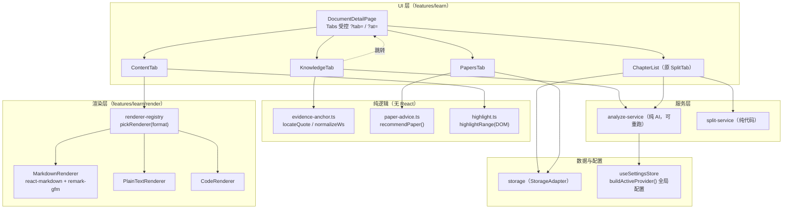
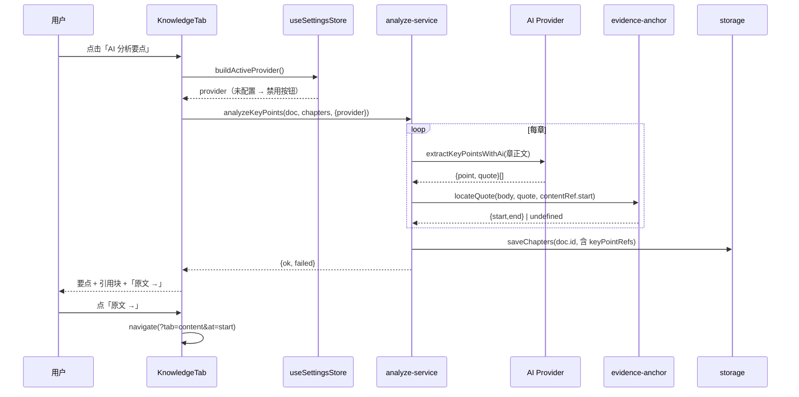

# 资料详情页优化 技术方案

| 字段 | 内容 |
|------|------|
| 作者 | Agent |
| 日期 | 2026-09-10 |
| 状态 | 已完成（T1–T14 按批次全部实施；typecheck 0 error，24 项单测通过，i18n 对齐 8/8） |
| 实施 | `docs/library-detail-page-task-runbook-2026-09.md` |
| 关联需求 | 用户提出资料详情页 5 项优化（切分结果改章节列表 / 按资料类别渲染 / 关键知识点 AI 解析且对应原文 / 试卷按学习情况生成且只展示 / Tab 样式优化） |
| 关联文档 | `docs/library-module-design-2026-09.md`、`docs/library-module-task-runbook-2026-09.md`、`docs/ui-workbench-plan-2026-09.md`、`docs/ui-component-system-shadcn-design-2026-09.md` |

## 1. 背景

资料库模块（列表 + 详情 4 Tab）已在 T1–T14 落地并提交（`a0a9ae4`…`188efa2`），但**详情页可用性未达预期**。本次勘察发现 5 个具体问题，其中 2 个属于「功能实际不可用」级别：

| # | 现象 | 根因证据 | 级别 |
|---|------|----------|------|
| B1 | **首次进入「切分结果」Tab 看不到「立即切分」按钮** —— 无任何章节时用户无法切分，功能死锁 | `detail/SplitTab.tsx:100` `{firstChapter && (<工具条>)}` —— 工具条与章列表一起被 `firstChapter` 门禁，无章节时整条 bar 不渲染 | **P0** |
| B2 | **关键知识点的 AI 按钮永远禁用** ——「AI 分析概念」点了没反应 | `detail/KnowledgeTab.tsx:8`、`detail/SplitTab.tsx:7` 均 `import { buildActiveProvider } from '../../../ai/active'`；而 `src/ai/active.ts:87` 的 `buildActiveProvider()` 实现为 `return new NoActiveProvider().isConfigured() ? … : null` —— `NoActiveProvider.isConfigured()` 恒 `false`，**该函数恒返回 `null`**；真正的全局配置实现在 `src/stores/useSettingsStore.ts:216` | **P0** |
| B3 | 「资料内容」Tab 对 Markdown 只做行级渲染 | `features/learn/ArticleBody.tsx` 仅识别 `#` 标题，列表 / 表格 / 引用 / 代码块 / 链接 / 粗斜体全部退化为纯文本；`ContentTab` 无条件使用 `ArticleBody` | P1 |
| B4 | 「章节测评试卷」Tab 恒显示「暂无试卷」 | `detail/PapersTab.tsx` **完全没有读取 storage** —— 未调用 `storage.listPapers()` / `listPaperResults()`，每章硬编码渲染 `t.learn.detail.papers.noPapers` | P1 |
| B5 | Tab 为 4 等分网格 + 实底选中，内容被边框容器框住，与 Workbench 的 Linear 视觉不一致；且刚修复过 `TabsRootContext is missing` 崩溃（`188efa2`） | `components/ui/tabs.tsx` 的 `TabsList` 基类为 `flex w-fit … border bg-subtle p-1`，`DocumentDetailPage.tsx:108` 覆写为 `grid w-full grid-cols-4` | P2 |

另有两项技术债随本次一并收敛（见 §3.1）：`ChapterRow.tsx` 硬编码中文状态文案（违反 i18n 规则）；`keyPoints: string[]` 无原文出处，知识点不可溯源。

## 2. 方案目标

| 类型 | 描述 |
|------|------|
| **主要目标** | ①「切分结果」Tab 改造成结构化**章节列表**（字数 / 要点数 / 状态 / 掌握度 / 跳转），工具条常显（含空态）；②「资料内容」按 `SourceDocument.format` 分派渲染器，`markdown` 走真正的 Markdown 渲染；③「关键知识点」由 AI 解析且**每条要点与概念都携带原文摘录 + 字符区间**，可跳转定位；AI 一律读**全局配置**（`useSettingsStore`）；④「章节测评试卷」按掌握度给出**推荐卷型 + 展示已生成卷与成绩**，本页只展示、不生成；⑤ Tab 改为**下划线式**并接入 `Tabs.Indicator` |
| **非目标** | 不改切分算法（`splitter-engine` 零改动）；不改 Rust/Tauri 侧；不在详情页内联生成试卷；不做协作/云同步；不重构章节阅读页 `ChapterReaderPage`（`ArticleBody` 保留给它用）；不动 `Paper` / `PaperResult` 领域结构与存储 schema（仅新增读取与推荐） |
| **成功标准** | 1. 无章节时「立即切分」按钮可见可点，点击后生成章节列表；2. `format=markdown` 的资料能正确渲染列表/表格/代码块/引用/链接；3. AI 已配置时「AI 分析」按钮可用，分析后每条要点附原文摘录，点击可跳到「资料内容」并高亮；4. 试卷 Tab 能列出已生成试卷及成绩，未出卷章给出推荐卷型并可跳转 `/quiz/new` 预填；5. Tab 选中态为下划线 + ink-1 文字，无边框容器；6. `npm run typecheck` 0 error；7. 新增纯逻辑单测通过；8. zh/en 文案对齐 |

## 3. 项目现状

### 3.1 相关代码与模块

| 路径 | 现状 | 本次动作 |
|------|------|----------|
| `src/features/learn/DocumentDetailPage.tsx` | 页头 + `Tabs` 受控（`?tab=`）+ 4 个 `TabsPanel`；Tab 网格样式 | 改（布局 / 样式 / `?at=` 锚点参数） |
| `src/features/learn/detail/SplitTab.tsx` | 元信息条（被 `firstChapter` 门禁）+ `ChapterRow` 列表 + 切分/精修按钮 | 改为章节列表（工具条常显） |
| `src/features/learn/detail/ChapterRow.tsx` | 序号 / 标题 / 要点数 / 掌握度；**硬编码中文**「未学/学习中/待测验/已掌握」 | 改（i18n + 语义色 + 字数 + Bar + 状态徽标） |
| `src/features/learn/detail/ContentTab.tsx` | `doc.textPreview` → `ArticleBody`，20 万字符截断 | 改（接渲染器注册表 + 锚点高亮） |
| `src/features/learn/ArticleBody.tsx` | 极简行渲染（仅 `#` 标题） | **保留不动**（阅读页在用） |
| `src/features/learn/detail/KnowledgeTab.tsx` | 章要点列表 + `GraphView`；`aiReady` 恒 false（B2） | 改（全局配置 + 引用渲染 + 跳转） |
| `src/features/learn/detail/PapersTab.tsx` | 纯静态「暂无试卷」（B4） | 改（读 papers/results + 推荐） |
| `src/features/learn/analyze-service.ts` | `analyzeChaptersNow`（标题/要点/合并）、`analyzeConceptsNow`（逐章概念） | 改（写回 `keyPointRefs` 与 unit `evidence`） |
| `src/ai/pipelines.ts` | `refineChaptersWithAi`、`extractChapterConceptsWithAi`、`parseConceptDrafts` | 改（新增 `extractKeyPointsWithAi`；概念草稿加 `quote`） |
| `src/ai/active.ts` | `buildActiveProvider()` **恒 null**（stub） | 改（删除该导出，断掉误用） |
| `src/stores/useSettingsStore.ts` | `buildActiveProvider()` 真实现（读 `active`）；`providerReady` 状态位 | 不改（新增 hook 消费） |
| `src/domain/chapter.ts` | `Chapter.keyPoints: string[]` | 改（新增 `KeyPointRef` / `keyPointRefs?`） |
| `src/domain/knowledge.ts` | `KnowledgeUnit`（无原文出处） | 改（新增可选 `evidence`） |
| `src/engine/quiz-engine.ts` | `createPaper({scope,chapters,learnerState,…})` 已按 `learnerState` 做难度自适应；`bandOfMastery(mastery)` | 不改（复用） |
| `src/domain/quiz.ts` | `PaperScope` / `Paper` / `PAPER_MODE_LABEL` / `PAPER_MODE_DURATION_MIN` | 不改 |
| `src/components/ui/tabs.tsx` | `Tabs = BaseTabs.Root`；`TabsList` 为 `flex w-fit border bg-subtle p-1` | 改（下划线式 + `TabsIndicator`） |
| `src/i18n/messages/{zh,en}.ts` | `learn.detail.*` 已有 content/split/knowledge/papers 字典 | 改（新增章节列表、引用、试卷推荐等） |

### 3.2 相关文档与约定

- `AGENTS.md`：相对导入为主（`@/*` 仅豁免 `components/ui`、`lib/utils`）；i18n 双语成对；Tailwind 4 语义 token；`import type`；文件 ≤700 行；依赖单向 domain→engine/ai/storage→stores→features。
- `rules/react.mdc`：UI Kit（`components/ui`）与 `primitives` 优先；**状态色仅用于 dot/徽标**。
- `rules/layer-import-boundaries.mdc`：UI → stores/storage；桌面能力仅经 `invoke`。
- `rules/no-headless-browser-validation.mdc`：禁止主动启动浏览器校验；验证走 typecheck + node 单测 + 代码自审。
- `skills/ui-impl-tokens/SKILL.md`：token-first；Base UI 命名空间对象不可当组件渲染（本次新增踩坑条目）。

### 3.3 约束与依赖

- React 19 + Vite 8 + TS `strict` + Tailwind 4 + Base UI 1.8 + react-router-dom（HashRouter）。
- **新增运行时依赖**：`react-markdown` + `remark-gfm`（用户已确认选型）。版本在安装时锁定（`react-markdown` v10 / `remark-gfm` v4，均兼容 React 19）。
  - **降级预案**：若网络/审批受限导致安装失败，保持 `render/renderer-registry.ts` 接口不变，用自研轻量渲染器顶替 `MarkdownRenderer` 实现（覆盖标题/列表/引用/代码块/表格/粗斜体/链接），对外契约零变化。
- 安全：`react-markdown` 默认不渲染原始 HTML；**不引入 `rehype-raw`**，禁用 `javascript:` 协议链接（`urlTransform` 白名单 http/https/mailto）。
- 性能：`textPreview` 可达 20 万字符；Markdown 渲染前先截断（沿用 `PREVIEW_CHARS = 200000`），超长时显示「显示全文」按钮。
- 兼容：新增字段全部**可选**，老数据无 `keyPointRefs` / `evidence` 时降级为「无原文引用」展示，不做数据迁移。

## 4. 技术架构

### 4.1 总体架构



### 4.2 模块职责

| 模块/层级 | 职责 | 技术选型 |
|-----------|------|----------|
| `features/learn/render/*` | 按 `DocumentFormat` 分派渲染器；markdown 真渲染、code 等宽行号、其余纯文本 | react-markdown + remark-gfm + Tailwind token |
| `features/learn/evidence-anchor.ts` | 把 AI 返回的 `quote` 定位回 `doc.textPreview` 的绝对字符区间（纯函数、可单测） | 纯 TS |
| `ai/pipelines.ts` | 新增 `extractKeyPointsWithAi`；概念草稿携带 `quote` | 现有 `chatJson` 通道 |
| `features/learn/analyze-service.ts` | 分析后写回 `keyPointRefs` 与概念 `evidence`；失败照旧上抛 | 纯 AI 编排 |
| `hooks/useAiReady.ts`（新） | 响应式订阅全局 AI 配置就绪态 | zustand `useSettingsStore` |
| `features/learn/paper-advice.ts` | 依据 `LearnerState.byUnit[chapterId]` 推荐卷型与难度带（纯函数） | 复用 `bandOfMastery` / `MASTERY_*` |
| `features/learn/highlight.ts` | 在渲染结果 DOM 中按字符区间滚动 + 高亮 | DOM Range API |
| `components/ui/tabs.tsx` | 下划线式 Tab + `Tabs.Indicator` | Base UI Tabs |

### 4.3 数据模型与 API

```ts
/* src/domain/chapter.ts —— 新增（全部可选，老数据兼容） */
export interface KeyPointRef {
  /** AI 提炼的要点（≤60 字）。 */
  point: string;
  /** 原文摘录（verbatim，可为空 → 表示未定位到原文）。 */
  quote: string;
  /** 原文中的绝对字符偏移（同 ChapterRange 语义：start 含、end 不含）。 */
  start: number;
  end: number;
}
// Chapter 新增：keyPointRefs?: KeyPointRef[];   （与 keyPoints: string[] 并存，keyPoints 仍是唯一真源）

/* src/domain/knowledge.ts —— 新增 */
export interface ConceptEvidence {
  documentId: string;
  /** 原文绝对字符区间。 */
  start: number;
  end: number;
  quote: string;
}
// KnowledgeUnit 新增：evidence?: ConceptEvidence;

/* src/features/learn/paper-advice.ts */
export interface PaperAdvice {
  mode: PaperMode;            // unit-test | retake | stage-test | final-test
  band: 1 | 2 | 3;            // 来自 bandOfMastery
  label: string;              // i18n key 由 UI 映射，此处只给枚举
  reasonKey: "never" | "failed" | "weak" | "near" | "mastered" | "allMastered";
}
export function recommendPaper(args: {
  chapter: Chapter;
  learner?: LearnerState;
  now?: number;
}): PaperAdvice;
export function recommendDocPaper(args: {
  chapters: Chapter[];
  learner?: LearnerState;
}): PaperAdvice | undefined;   // 资料级：全章达标 → final-test，否则 undefined
```

推荐规则（与 `MASTERY_FLOOR` / `MASTERY_THRESHOLD`（`domain/plan.ts`）同源）：

| 条件 | mode | reasonKey |
|------|------|-----------|
| `attempts === 0` | `unit-test` | `never` |
| `mastery < MASTERY_FLOOR && attempts > 0` | `retake` | `failed` |
| `MASTERY_FLOOR ≤ mastery < MASTERY_THRESHOLD` | `unit-test` | `weak` |
| `MASTERY_THRESHOLD ≤ mastery < 0.9` | `stage-test` | `near` |
| `mastery ≥ 0.9` | 不推荐（显示「已达标」） | `mastered` |
| 资料内全部章 `≥ MASTERY_THRESHOLD` | `final-test`（资料级） | `allMastered` |

**数据读写（rules/layer-import-boundaries）**

- 读：`DocumentDetailPage` mount 时经 `src/stores/useLoopStore` 暴露的 `storage` 读取 `getDocument` / `listChapters` / `getGraph` / `getLearnerState`；`PapersTab` 读 `storage.listPapers()` + `storage.listPaperResults()`（**新增读取，已有契约**）。
- 写：仅「切分 / AI 分析」经 `split-service` / `analyze-service` 写回（`saveChapters` / `saveDocument` / `saveGraph`）；**试卷 Tab 零写入**。
- 桌面能力：本方案不新增 `invoke`；AI provider 由 `useSettingsStore.buildActiveProvider()` 构造，密钥由既有 vault 恢复流程提供（`restoreVaultApiKey`），纯浏览器预览下 `isConfigured()` 为 false → 按钮禁用（既有守卫，无需 `isTauri`）。
- 持久化与迁移：新增字段全部可选；localStorage 后端沿用现有 `saveDocument` upsert，无 schema 变更、无迁移脚本。

### 4.4 状态与副作用

| 状态 | 归属 | 说明 |
|------|------|------|
| 当前 Tab | **URL `?tab=`**（既有） | 受控 `Tabs value/onValueChange`；刷新/分享可复原 |
| 原文锚点 | **URL `?at=<offset>`**（新增） | 从知识点跳转过来时带；`ContentTab` mount/变更时滚动 + 高亮，读后即从 URL 移除（`replace`）避免刷新重复高亮 |
| 文档 / 章节 / 图谱 / 学习者状态 | 页面 `useState`（既有） | mount 时加载，`onChanged` 回调刷新 |
| 试卷与成绩 | `PapersTab` 内部 `useState` + `useEffect`（新增） | mount 时 `listPapers()` / `listPaperResults()` |
| AI 是否就绪 | `useSettingsStore`（全局） | 新增 `useAiReady()` 订阅，替代一次性 `useMemo(…, [])` |
| 分析/切分 busy | 组件内 `useState`（既有） | 不变 |

副作用时机：仅 mount 加载 + 用户点击触发；**无轮询、无自动重分析**（AI 分析必须显式点击，遵循「分析由 AI、可重跑」契约）。

## 5. 交互流程

### 5.1 主流程

**P1 · 章节列表（切分结果 Tab）**

1. 进入 `/learn/doc/:docId?tab=split` → 工具条**常显**（含空态），展示「N 章 · M 要点 · 切分于 … · AI 已精修/本地启发式」。
2. 无章节 → 工具条显示「立即切分」；列表区显示空态卡。
3. 点「立即切分」→ `splitDocumentNow`（纯代码）→ `notifyDocsChanged()` + `onChanged()` → 列表刷新。
4. 有章节 → 点「重新切分」→ `ConfirmDialog` 提示掌握度按区间同源保留 → 确认后重切。
5. 点「AI 精修」→ 全局 AI 未配置则**禁用并显示「去配置 AI 模型 →」**；已配置则 `analyzeChaptersNow` → 刷新。
6. 点任一行 → 跳 `/learn/chapter/:chapterId` 阅读。

**P2 · 资料内容按类别渲染**

1. `ContentTab` 依据 `doc.format` 调 `pickRenderer(format)` 拿到渲染器。
2. `markdown` → `MarkdownRenderer`（GFM）；`code` → `CodeRenderer`（等宽 + 行号）；`txt/note/web/docx/epub/pdf/custom` → `PlainTextRenderer`（`whitespace-pre-wrap`，保留 `ArticleBody` 的标题放大规则）。
3. `image` 无正文 → 空态「该资料为图片，暂无可渲染正文」。
4. 超 20 万字符 → 截断 + 「显示全文」。

**P3 · 关键知识点（AI + 原文对应）**

1. `KnowledgeTab` 用 `useAiReady()` 判定；未配置则按钮禁用 + 引导链接。
2. 点「AI 分析要点」→ 逐章 `extractKeyPointsWithAi`（返回 `{point, quote}`）。
3. 每条 `quote` 经 `locateQuote(chapterBody, quote, contentRef.start)` 定位为绝对区间 → 写回 `Chapter.keyPointRefs`。
4. 点「AI 分析概念」→ `extractChapterConceptsWithAi`（草稿新增 `quote`）→ 同样定位后写入 `KnowledgeUnit.evidence`。
5. 列表渲染：要点 + 折叠引用块（quote）+「原文 →」按钮 → `?tab=content&at=<start>` → `ContentTab` 滚动 + 高亮该区间。

**P4 · 章节测评试卷（只展示）**

1. `PapersTab` mount → `listPapers()` + `listPaperResults()` → 按 `paper.scope.chapterIds` 反查章。
2. 每章一行：标题 + 已生成卷（模式徽标 / 题数 / 状态 / 得分，已批改可跳 `/report/:paperId`，未答跳 `/quiz/:paperId`）。
3. 未出卷的章：按 `recommendPaper(chapter, learner)` 显示推荐卷型徽标 + 难度带 + 预计时长 + 「去出卷 →」→ `/quiz/new?doc=<docId>&chapters=<id>&mode=<mode>`（预填）。
4. 资料级：全部章达标 → 顶部展示「综合测」推荐。

**P5 · Tab 样式**

1. `TabsList` 去边框/去底色，容器底部 `border-b border-line`。
2. `TabsTab` 未选 `text-ink-3`，hover `text-ink-2`，选中 `text-ink-1`；`TabsIndicator` 渲染 2px `--color-primary` 圆角条（切换时滑动）。
3. 内容区 `mt-4`，不再包边框容器。

### 5.2 分支与异常流程

| 场景 | 触发条件 | 系统行为 | UI 反馈 |
|------|----------|----------|---------|
| E1 AI 未配置 | `useAiReady() === false` | 不调用 AI，按钮禁用 | 禁用 + 「去配置 AI 模型 →」链到 `/settings` |
| E2 AI 调用失败 | provider 抛错 | `analyze-service` 上抛，不静默降级 | 提示 `分析失败：<原因>（可再次点击重试）` |
| E3 quote 定位失败 | `locateQuote` 返回 `undefined` | 丢弃该条引用（`evidence` 省略），要点本身保留 | 该条显示「原文未定位」灰字，不阻断其它条 |
| E4 正文为空 | `textPreview` 为空 | 内容 Tab 空态；AI 分析抛 `no-body` | 「这份资料没有正文」+ 引导替换正文 |
| E5 章正文超长 | 超 `PIPELINE_LIMITS.conceptMaxTextChars` | 管道抛错，单章失败不阻断 | 汇总区列出失败章标题 |
| E6 试卷范围失效 | `paper.scope.chapterIds` 含已删除章 | 过滤掉不存在的章 | 显示 `范围已失效` 徽标 |
| E7 Markdown 渲染异常 | 非法内容导致渲染抛错 | ErrorBoundary 捕获 | 降级为 `PlainTextRenderer` + 提示 |
| E8 无章节 | `chapters.length === 0` | 试卷/知识点 Tab 空态 | 引导先切分 |

### 5.3 时序图（知识点 AI 解析 + 原文锚定）



## 6. 用户用例（User Cases）

### UC-01：首次切分（修复死锁）

| 项 | 内容 |
|----|------|
| 角色 | 学习者 |
| 前置条件 | 存在一份有正文、尚未切分的资料 |
| 主流程 | 1. 进入 `/learn/doc/:id?tab=split` 2. 见空态 + 「立即切分」按钮 3. 点击 |
| 期望结果 | 生成章节列表，工具条显示「N 章 · M 要点 · 切分于 …」 |
| 异常/边界 | 无正文 → 提示「这份资料没有正文」；切分不出章 → 提示「没有切出章节」 |

### UC-02：查看章节列表

| 项 | 内容 |
|----|------|
| 前置条件 | 资料已有章节 |
| 主流程 | 进入切分 Tab → 查看每行（序号/标题/字数/要点数/状态徽标/掌握度 Bar）→ 点某行 |
| 期望结果 | 跳 `/learn/chapter/:id`；掌握度与状态文案走 i18n，颜色仅用于徽标/dot |
| 异常/边界 | 老资料无 `keyPoints` → 要点数显示 0；掌握度缺失 → 0% |

### UC-03：Markdown 资料渲染

| 项 | 内容 |
|----|------|
| 前置条件 | `doc.format === "markdown"` |
| 主流程 | 进入资料内容 Tab |
| 期望结果 | 列表/表格/引用/代码块/链接/粗斜体正确渲染，配色走语义 token；代码块等宽 + 浅底 |
| 异常/边界 | 超 20 万字符 → 截断 + 「显示全文」；含 `<script>` → 不执行（未引入 rehype-raw） |

### UC-04：非 Markdown 资料渲染

| 项 | 内容 |
|----|------|
| 前置条件 | `format ∈ {txt, pdf, docx, epub, web, note, custom}` |
| 主流程 | 进入资料内容 Tab |
| 期望结果 | `PlainTextRenderer`：`whitespace-pre-wrap`，标题行放大加粗 |
| 异常/边界 | `code` → 等宽 + 行号；`image` → 空态 |

### UC-05：AI 分析关键知识点（全局配置）

| 项 | 内容 |
|----|------|
| 前置条件 | 设置 → AI 模型中心已选择模型；资料已切分 |
| 主流程 | 1. 进入关键知识点 Tab 2. 按钮可用 3. 点「AI 分析要点」 |
| 期望结果 | 逐章分析，完成后每条要点下方出现原文摘录 |
| 异常/边界 | 未配置 → 禁用 + 引导；单章失败 → 汇总列出，其余成功 |

### UC-06：知识点跳转原文并高亮

| 项 | 内容 |
|----|------|
| 前置条件 | 已分析出带引用的要点 |
| 主流程 | 点某条要点的「原文 →」 |
| 期望结果 | 切到资料内容 Tab，滚动到对应位置并高亮区间（含 Markdown 渲染结果） |
| 异常/边界 | 引用未定位 → 按钮隐藏；`at` 越界 → 忽略不高亮 |

### UC-07：试卷 Tab 展示已生成卷

| 项 | 内容 |
|----|------|
| 前置条件 | 该资料某章已出卷 |
| 主流程 | 进入试卷 Tab |
| 期望结果 | 该章行显示卷型徽标 / 题数 / 状态 / 得分；已批改可跳报告 |
| 异常/边界 | 章已被删 → 显示「范围已失效」 |

### UC-08：试卷 Tab 推荐卷型

| 项 | 内容 |
|----|------|
| 前置条件 | 该章未出卷 |
| 主流程 | 进入试卷 Tab → 查看推荐徽标 → 点「去出卷 →」 |
| 期望结果 | 跳 `/quiz/new` 并预填资料/章/卷型；推荐依据掌握度（未学→单元测、不及格→补考卷、接近达标→阶段测、全达标→综合测） |
| 异常/边界 | 未配置 AI 时主观题不可用 → 由出卷页既有 `allowSubjective` 逻辑处理，本页不额外提示 |

## 7. 线框 UI（Wireframe）

### 7.1 详情页骨架（下划线式 Tab）

```
┌────────────────────────────────────────────────────────────────────┐
│ ←  RAG 从入门到生产                                                  │
│    github.com/… · 9月10日                                            │
├────────────────────────────────────────────────────────────────────┤
│  资料内容   切分结果   关键知识点   章节测评试卷                        │
│  ────────                                    ← 2px primary 下划线     │
│ ──────────────────────────────────────────────────────────────────  │  ← border-line 分隔线
│                                                                      │
│  <当前 Tab 内容，无边框容器>                                          │
└────────────────────────────────────────────────────────────────────┘
```

- 布局：`PageContainer` 内；`TabsList` 左对齐 `gap-6`，`TabsIndicator` 高 2px、`rounded-full`、`bg-primary`。
- token：`text-ink-1/2/3`、`border-line`、`--color-primary`。
- 组件：`components/ui/tabs.tsx`（`Tabs` / `TabsList` / `TabsTab` / `TabsIndicator` / `TabsPanel`）。

### 7.2 切分结果 → 章节列表

```
┌ 工具条（常显，含空态）────────────────────────────────────────────┐
│ 本地启发式 · 6 章 · 18 要点 · 切分于 09-10      [重新切分] [AI 精修] │
└──────────────────────────────────────────────────────────────────┘
┌ 章节列表 ─────────────────────────────────────────────────────────┐
│  #  章节标题                     字数   要点  掌握度        状态   → │
│  1  什么是 RAG                   1.2k    3   ▓▓▓▓▓░░ 62%  待测验  → │
│  2  向量化与嵌入                 3.4k    4   ▓▓░░░░░░ 24%  学习中  → │
│  3  切分策略                     2.1k    3   ░░░░░░░░  0%  未开始  → │
└──────────────────────────────────────────────────────────────────┘
```

- 列宽：`#` 24px 固定；标题 `flex-1 truncate`；字数/要点 `w-16 text-right`；掌握度 `w-32`（`Bar` + 百分比）；状态 `w-20`（`Badge variant=outline`）。
- 空态：`border-dashed` 卡 + 「立即切分」主按钮（**修复 B1**）。
- 加载态：工具条保留，列表区 3 行骨架条。

### 7.3 资料内容（按类别）

```
┌ 元信息 ────────────────────────────────────────────────────────────┐
│ Markdown · 12,345 字 · 导入于 2026-09-10 · 来源 github.com/…        │
├───────────────────────────────────────────────────────────────────┤
│  # 什么是 RAG                        ← h1/h2 放大加粗               │
│  RAG 是…                                                            │
│  - 检索   - 增强   - 生成            ← 列表                          │
│  > 引用块                                                           │
│  ```python\n code \n```              ← 代码块（bg-subtle + 等宽）    │
│  | 表头 | 表头 |                      ← GFM 表格（border-line）      │
└───────────────────────────────────────────────────────────────────┘
```

### 7.4 关键知识点（带原文引用）

```
┌ 章要点 ────────────────────────────────────────────────────────────┐
│ 1  什么是 RAG                                            [AI 分析要点]│
│    • RAG 先检索再生成，降低幻觉                                        │
│      ┌ “RAG 通过检索外部知识来增强生成模型的准确性…”      [原文 →] ┐   │
│      └ 左侧竖线 border-l-2 border-line，text-ink-3 小字，quote 截断 120 字 │
│ 2  向量化与嵌入                                                      │
│    • 嵌入质量决定检索上限                                              │
│      ┌ “向量化把文本映射到稠密向量空间…”                    [原文 →] ┐   │
└───────────────────────────────────────────────────────────────────┘
┌ 概念图谱 ──────────────────────────────────────────────────────────┐
│ 已分析 6/6 章 · 24 概念 · 31 关系                     [重新分析概念]  │
│ <GraphView>                                                         │
└───────────────────────────────────────────────────────────────────┘
```

### 7.5 章节测评试卷

```
┌ 资料级推荐 ────────────────────────────────────────────────────────┐
│ 🎓 全部 6 章已达标 · 建议综合测（30 分钟 · 15–20 题）      [去出卷 →] │
├───────────────────────────────────────────────────────────────────┤
│ 1  什么是 RAG                                                       │
│    已生成：单元测 · 5 题 · 已完成 · 80 分        [查看报告 →]        │
│ 2  向量化与嵌入                                                     │
│    推荐：补考卷 · 难度 1 · 5 分钟（掌握度 24%，低于及格线）[去出卷 →] │
│ 3  切分策略                                                         │
│    推荐：单元测 · 难度 1 · 8 分钟（尚未测过）            [去出卷 →]   │
└───────────────────────────────────────────────────────────────────┘
```

### 7.6 其他状态

| 状态 | 表现 |
|------|------|
| 加载中 | 内容区 3 行 skeleton（`bg-subtle animate-pulse rounded`） |
| 空数据 | `border-dashed` 卡 + 一句说明 + 主行动按钮 |
| 错误/AI 失败 | `border-line` 卡 + 错误文案 + 「重试」按钮（不阻断其它功能） |
| 禁用 | 按钮 `disabled` + 同行「去配置 AI 模型 →」链接 |
| 引用未定位 | 要点正常显示，引用位显示灰字「原文未定位」，不显示跳转按钮 |

### 7.7 交互说明

- Hover：章行 `hover:bg-subtle` + 右侧箭头右移；Tab `hover:text-ink-2`。
- Focus：Base UI 自带 roving tabindex，`focus-visible:ring-2 ring-ring/40`。
- 键盘：Tab 左右方向键切换（Base UI 默认）；章行 `Enter` 进入阅读。
- `data-testid`（E2E 可测性，`playwright-test-ids` 约定）：`doc-detail-tab-<value>`、`chapter-row-<index>`、`keypoint-ref-<index>`、`paper-row-<chapterId>`、`paper-advice-<chapterId>`。

## 8. 涉及文件及改动伪代码

> 相对导入为主；i18n 一律 `useI18n() → { m: t }`。

### 8.1 `src/domain/chapter.ts`（修改）

**改动说明**：新增 `KeyPointRef`，`Chapter` 增加可选 `keyPointRefs`（老数据兼容）。

```ts
/** 要点 ↔ 原文引用（AI 提炼 + 代码锚定；start/end 为 doc.textPreview 绝对偏移）。 */
export interface KeyPointRef {
  point: string;
  quote: string;
  start: number;
  end: number;
}

export interface Chapter {
  // …既有字段不变…
  /** AI 要点 + 原文出处（可选；老数据缺省 → UI 降级为无引用）。 */
  keyPointRefs?: KeyPointRef[];
}
```

### 8.2 `src/domain/knowledge.ts`（修改）

```ts
export interface ConceptEvidence {
  documentId: string;
  start: number;
  end: number;
  quote: string;
}
export interface KnowledgeUnit {
  // …既有字段不变…
  /** 概念的原文出处（可选；定位失败时缺省）。 */
  evidence?: ConceptEvidence;
}
```

### 8.3 `src/features/learn/evidence-anchor.ts`（新增）

**改动说明**：纯函数，把 AI 给的 `quote` 定位到原文绝对区间；两档匹配（精确 → 折叠空白）。

```ts
/** 折叠空白并建立「折叠后下标 → 原始下标」映射。 */
export function foldWhitespace(s: string): { folded: string; map: number[] };

/**
 * 在 body 中定位 quote，返回相对 body 的 [start,end)；失败返回 undefined。
 * 档 1：indexOf 精确匹配；档 2：折叠空白后匹配，再经 map 还原原始偏移。
 * quote 为空 / 长度 > 2000 直接返回 undefined（防 AI 灌水）。
 */
export function locateQuote(
  body: string,
  quote: string,
): { start: number; end: number } | undefined;

/** 便捷：定位并叠加章起始偏移 → 文档绝对区间。 */
export function anchorToDocument(
  body: string,
  quote: string,
  base: number,
): { start: number; end: number } | undefined;
```

### 8.4 `src/ai/pipelines.ts`（修改）

**改动说明**：新增要点抽取管道；概念草稿新增可选 `quote`。

```ts
const KEYPOINT_SYSTEM = "…只输出 JSON 数组：{\"points\":[{\"point\":\"要点\",\"quote\":\"原文摘录\"}]}…";

export function buildKeyPointMessages(input: { chapterTitle: string; text: string }): ChatMessage[];

export interface AiKeyPointDraft { point: string; quote: string }

/** 纯函数：解析 + 校验（point ≤60 字、quote ≤200 字、条数 2..5、去重）。 */
export function parseKeyPointDrafts(raw: unknown): AiKeyPointDraft[];

/** 执行器：AI 从章正文提炼要点 + 原文摘录（未配置/失败抛类型化错误）。 */
export async function extractKeyPointsWithAi(
  provider: AIProvider,
  input: { chapterTitle: string; text: string },
): Promise<AiKeyPointDraft[]>;

// AiConceptDraft 增加：quote?: string
// parseConceptDrafts 增加解析 quote（裁剪 ≤200 字），缺失时不报错（evidence 可选）
// extractChapterConceptsWithAi 把 quote 透传到 KnowledgeUnit（偏移在 analyze-service 里锚定）
```

### 8.5 `src/features/learn/analyze-service.ts`（修改）

**改动说明**：新增 `analyzeKeyPointsNow`；`analyzeConceptsNow` 写回概念 `evidence`。

```ts
export interface AnalyzeKeyPointsOptions extends Omit<AnalyzeChaptersOptions, never> {
  storage: StorageAdapter;
  provider: AIProvider;
  onProgress?: (i: number, total: number, chapter: Chapter) => void;
  now?: number;
}

export async function analyzeKeyPointsNow(
  doc: SourceDocument,
  chapters: readonly Chapter[],
  opts: AnalyzeKeyPointsOptions,
): Promise<{ ok: number; failed: { chapterId: string; title: string; reason: string }[]; refs: number }> {
  // 1) provider.isConfigured() 否则抛 not-configured
  // 2) 逐章：body = text.slice(contentRef.start, contentRef.end)
  //    drafts = await extractKeyPointsWithAi(provider, { chapterTitle, text: body })
  //    refs = drafts.map(d => ({ point: d.point, quote: d.quote,
  //            ...(anchorToDocument(body, d.quote, c.contentRef.start) ?? { start: -1, end: -1 }) }))
  //    过滤 start < 0 → 记入 unanchored 计数（不失败）
  // 3) 一次性 saveChapters（keyPoints 同步为 refs.map(r => r.point)，保证单一真源）
  // 4) saveDocument({ ...doc, analysis: { ...doc.analysis, keyPointsAt: now } })
}

// analyzeConceptsNow 变更：
//   extractChapterConceptsWithAi 返回 units 带 quote →
//   每个 unit: evidence = anchorToDocument(body, quote, c.contentRef.start) 命中时
//              { documentId: doc.id, start, end, quote }；未命中则省略（诚实降级）
```

### 8.6 `src/ai/active.ts`（修改）

**改动说明**：删除恒 null 的 `buildActiveProvider` 导出，从源头断掉误用（B2）。

```ts
// -export function buildActiveProvider(): AIProvider | null { … }   // 删除
// 文件头补注释：AI provider 唯一构造入口为 stores/useSettingsStore 的 buildActiveProvider()
```

### 8.7 `src/hooks/useAiReady.ts`（新增）

```ts
import { useSettingsStore } from "../stores/useSettingsStore";

/** 响应式 AI 就绪态（全局配置唯一入口）。 */
export function useAiReady(): boolean {
  return useSettingsStore((s) => s.providerReady);
}
```

### 8.8 `src/features/learn/render/renderer-registry.ts`（新增）

```ts
import type { DocumentFormat } from "../../../domain";

export interface DocumentRendererProps { text: string; doc: SourceDocument }
export type DocumentRenderer = (props: DocumentRendererProps) => JSX.Element;

/** 格式 → 渲染器；未覆盖的格式一律回落纯文本。 */
export function pickRenderer(format: DocumentFormat): DocumentRenderer {
  switch (format) {
    case "markdown": return MarkdownRenderer;
    case "code": return CodeRenderer;
    case "image": return ImageNoticeRenderer;
    default: return PlainTextRenderer; // pdf/docx/epub/web/note/txt/custom
  }
}
```

### 8.9 `src/features/learn/render/MarkdownRenderer.tsx`（新增）

```tsx
import Markdown from "react-markdown";
import remarkGfm from "remark-gfm";

/** 安全：不引入 rehype-raw；urlTransform 仅放行 http/https/mailto。 */
export default function MarkdownRenderer({ text }: DocumentRendererProps) {
  return (
    <div data-testid="md-body" className="text-[15px] leading-7 text-ink-2">
      <Markdown
        remarkPlugins={[remarkGfm]}
        urlTransform={(u) => (/^(https?:|mailto:)/i.test(u) ? u : "")}
        components={{ h1: …, h2: …, p: …, ul: …, ol: …, li: …, a: …, blockquote: …,
                      code: …, pre: …, table: …, thead: …, th: …, td: …, hr: …, img: () => null }}
      >
        {text}
      </Markdown>
    </div>
  );
}
```

> 类名一律语义 token：`text-ink-1/2/3`、`border-line`、`bg-subtle`、`text-primary`；标题层级用 `text-lg/base font-semibold`。

### 8.10 `src/features/learn/render/PlainTextRenderer.tsx`（新增）

沿用 `ArticleBody` 的标题放大规则，但数据来自 `text` prop，等宽与否按格式决定；`CodeRenderer.tsx` 同目录（等宽 + 行号 + `bg-subtle`）。

### 8.11 `src/features/learn/highlight.ts`（新增）

**改动说明**：在渲染结果 DOM 中按字符区间滚动 + 高亮（对 Markdown 渲染同样有效）。

```ts
/** 在 root 内按 [start,end) 字符偏移包裹 <mark>；返回是否命中。 */
export function highlightRange(root: HTMLElement, start: number, end: number): boolean {
  // TreeWalker 累积文本节点偏移 → 定位起止 (node, offset)
  // range.surroundContents(markEl)（跨节点时先 extractContents 再包）
  // markEl.className = "bg-primary/15 rounded-sm"
  // 命中后 markEl.scrollIntoView({ block: "center" })
}
```

### 8.12 `src/features/learn/detail/ContentTab.tsx`（修改）

```tsx
export default function ContentTab({ doc, at }: { doc: SourceDocument; at?: number }) {
  const Renderer = useMemo(() => pickRenderer(doc.format), [doc.format]);
  const bodyRef = useRef<HTMLDivElement>(null);
  useEffect(() => {
    if (!at || !bodyRef.current) return;
    highlightRange(bodyRef.current, at, at + 120); // 高亮 120 字窗口
  }, [at, doc.id]);
  // 渲染：<Renderer text={displayed} doc={doc} /> 包在 <div ref={bodyRef}>
}
```

### 8.13 `src/features/learn/detail/SplitTab.tsx`（修改 → 章节列表）

```tsx
export default function SplitTab({ doc, chapters, learner, onChanged }: SplitTabProps) {
  const aiReady = useAiReady();                     // ← 全局配置（B2 修复）
  // 工具条「常显」：不再被 firstChapter 门禁（B1 修复）
  return (
    <div className="space-y-4">
      <ChapterToolbar /* 统计 + [立即切分|重新切分] + [AI 精修] + 未配置引导 */ />
      {notice && <NoticeBar />}
      {chapters.length === 0
        ? <EmptyState action={runSplit} />
        : <ChapterList chapters={chapters} learner={learner} />}
    </div>
  );
}
```

### 8.14 `src/features/learn/detail/ChapterRow.tsx`（修改）

```tsx
// 移除硬编码中文；掌握度档走 i18n + BandBadge/Bar；新增字数与状态徽标
const chars = chapter.contentRef.end - chapter.contentRef.start;
// 状态：learner?.byUnit[chapter.id] 推导 → t.learn.detail.chapters.status[key]
// 颜色只用 dot/徽标（rules/react.mdc）
```

### 8.15 `src/features/learn/detail/KnowledgeTab.tsx`（修改）

```tsx
const aiReady = useAiReady();                        // 全局配置
// 章要点：优先渲染 chapter.keyPointRefs（point + quote + 跳转）
//         无 keyPointRefs → 回退 keyPoints 纯文本（老数据）
// 「原文 →」→ setSearchParams({ tab: "content", at: String(ref.start) })
// 新增 analyzeKeyPointsNow 入口（与既有概念分析并列）
```

### 8.16 `src/features/learn/paper-advice.ts`（新增）

如 §4.3 表格规则实现；纯函数、无 React、无 storage。

### 8.17 `src/features/learn/detail/PapersTab.tsx`（修改）

```tsx
export default function PapersTab({ doc, chapters, learner }: PapersTabProps) {
  const [papers, setPapers] = useState<Paper[]>([]);
  const [results, setResults] = useState<PaperResult[]>([]);
  useEffect(() => { void (async () => {
    setPapers(await storage.listPapers());
    setResults(await storage.listPaperResults());
  })(); }, []);
  const byChapter = useMemo(() => groupPapersByChapter(papers, results), [papers, results]);
  // 渲染：资料级推荐（recommendDocPaper）+ 每章行（已生成卷 / 推荐卷 / 去出卷）
}
```

### 8.18 `src/features/quiz/NewQuizPage.tsx`（修改）

```tsx
// 新增预填：?doc=<docId>&chapters=<id,id>&mode=<PaperMode>
const [params] = useSearchParams();
const prefill = {
  docId: params.get("doc") ?? undefined,
  chapterIds: (params.get("chapters") ?? "").split(",").filter(Boolean),
  mode: (params.get("mode") as PaperMode) ?? undefined,
};
// 初始化时把 prefill 写入向导 state（范围勾选 / 卷型选中），用户仍可改
```

### 8.19 `src/components/ui/tabs.tsx`（修改）

```tsx
/** 下划线式：容器 border-b border-line，选中 text-ink-1，Indicator 2px primary。 */
function TabsList({ className, ...props }) {
  return <BaseTabs.List data-slot="tabs-list"
    className={cn("relative flex w-fit items-center gap-6 border-b border-line bg-transparent p-0", className)}
    {...props} />;
}
function TabsTab({ className, ...props }) {
  return <BaseTabs.Tab data-slot="tabs-tab"
    className={cn("-mb-px whitespace-nowrap border-b-2 border-transparent pb-2 pt-1 text-sm font-medium",
      "text-ink-3 transition-colors hover:text-ink-2 focus-visible:outline-none focus-visible:ring-2 focus-visible:ring-ring/40",
      "data-selected:border-transparent data-selected:text-ink-1", className)} {...props} />;
}
function TabsIndicator({ className, ...props }) {
  return <BaseTabs.Indicator data-slot="tabs-indicator"
    className={cn("absolute bottom-0 h-0.5 rounded-full bg-primary transition-all duration-200", className)} {...props} />;
}
```

### 8.20 `src/features/learn/DocumentDetailPage.tsx`（修改）

```tsx
const at = Number(searchParams.get("at") ?? NaN);
// <Tabs> 包裹 TabsList（含 TabsIndicator）+ 4 TabsPanel
// ContentTab 传 at；onValueChange 写 ?tab= 并清掉 at
```

### 8.21 `src/i18n/messages/{zh,en}.ts`（修改）

新增 key（成对）：

```
learn.detail.tabs.split → "章节列表"        （Tab 文案调整，与列表语义一致）
learn.detail.chapters.{emptyTitle,emptyDesc,chars,keyPoints,status:{notStarted,learning,ready,mastered,retake},resplit,split,refine,stats}
learn.detail.content.{renderFallbackNotice,showFull,imageNoText}
learn.detail.knowledge.{extractPoints,reExtractPoints,refLabel,noRef,goSource,pointsDone}
learn.detail.papers.{docAdvice,advice,goNew,generated,score,duration,difficulty,reason:{never,failed,weak,near,mastered,allMastered}}
```

### 8.22 `package.json`（修改）

新增依赖 `react-markdown` + `remark-gfm`（安装时锁定版本；失败则走 §3.3 降级预案）。

### 8.23 `tests/`（新增）

- `tests/library-anchor.test.ts`：`locateQuote` 精确匹配 / 空白折叠 / 超长 / 未命中。
- `tests/library-paper-advice.test.ts`：`recommendPaper` 六种分支 + `recommendDocPaper`。
- `tests/library-keypoint.test.ts`：`parseKeyPointDrafts` 校验与去重。

## 9. 任务清单（Tasks）

| ID | 任务 | 依赖 | 复杂度 |
|----|------|------|--------|
| T1 | domain：`KeyPointRef` + `Chapter.keyPointRefs` + `ConceptEvidence` + `KnowledgeUnit.evidence` | — | S |
| T2 | `evidence-anchor.ts` 纯函数（fold / locate / anchorToDocument） | T1 | S |
| T3 | AI 管道：`extractKeyPointsWithAi` + `parseKeyPointDrafts`；概念草稿加 `quote` | T1 | M |
| T4 | `analyze-service`：`analyzeKeyPointsNow` + 概念 `evidence` 写回 | T2,T3 | M |
| T5 | 全局 AI 配置：删除 `ai/active` stub + 新增 `useAiReady` + 两个 Tab 改订阅 | — | S |
| T6 | 安装 `react-markdown` + `remark-gfm`，新建 `render/` 三渲染器 + 注册表 | — | M |
| T7 | `ContentTab` 接渲染器 + `?at=` 高亮（`highlight.ts`） | T6 | M |
| T8 | 章节列表：`SplitTab` 工具条常显 + `ChapterRow` 改造（i18n / 字数 / Bar / 徽标） | T5 | M |
| T9 | `paper-advice.ts` 纯函数 | — | S |
| T10 | `PapersTab` 读 papers/results + 推荐展示 + 跳 `/quiz/new` | T9 | M |
| T11 | `NewQuizPage` 支持 `?doc&chapters&mode` 预填 | T10 | S |
| T12 | Tab 下划线式 + `TabsIndicator` + 详情页布局 | — | S |
| T13 | i18n zh/en 文案补齐 | T5,T8,T10,T12 | M |
| T14 | 单测 3 件套 + typecheck 归零 + 手工验证 + 文档同步 | 全部 | M |

## 10. 实施步骤

1. **T5 → T12 → T1/T2/T9（纯逻辑先行，风险低）**
   - 输入：现有代码；输出：全局配置修复、Tab 样式、domain 与纯函数
   - 验证：`npm run typecheck`；`node --test` 跑新增纯函数单测
2. **T3 → T4（AI 链路）**
   - 验证：单测覆盖 `parseKeyPointDrafts`；代码自审确认失败路径上抛不静默
3. **T6 → T7（渲染层）**
   - 验证：typecheck；本地起 dev 用一份 markdown 资料肉眼确认（若 dev server 可访问）
4. **T8 → T10 → T11（章节列表与试卷）**
   - 验证：typecheck；`PapersTab` 读取路径自审（未写入）
5. **T13 → T14（文案与收尾）**
   - 验证：`npm run test:i18n`（若存在）+ typecheck 0 error + 手工验证 §12 用例

**回滚策略**：改动集中在 `src/features/learn/**` 与 2 个 domain 文件；新增字段全部可选，回滚只需 `git revert` 相关提交，老数据不受影响（无 schema 迁移）。若 `react-markdown` 引入后出现兼容问题，`pickRenderer` 一行切换到自研渲染器即可，其余代码零改动。

## 11. 测试方案

### 11.1 测试范围与策略

| 层级 | 工具/方式 | 覆盖重点 | 不负责 |
|------|-----------|----------|--------|
| 单元 | `tests/*.test.ts`（node 直跑，`npm run test:*`） | `locateQuote` 两档匹配；`recommendPaper` 六分支；`parseKeyPointDrafts` 校验去重；`pickRenderer` 分派 | React 渲染 |
| 集成 | 代码自审 + typecheck | `analyze-service` 写回链路；`PapersTab` 只读写入口 | — |
| E2E | Playwright（**默认禁用**，受 `rules/no-headless-browser-validation.mdc` 约束；仅用户显式要求时启用） | — | — |
| 手工 | dev server / Tauri 窗口 | §12 的 UC-01…UC-08 主流程与空态 | — |

### 11.2 测试环境与数据

- fixture：一份 `format: "markdown"` 的资料（含列表/表格/代码块/引用），一份 `format: "txt"`，一份无正文资料。
- mock：AI provider 用假实现（固定返回 `points` / `units`），不依赖真实网络。
- 命令：`npm run typecheck`、`npm run test:library`（挂 3 个新测试文件，与既有 `test:library` 合并）。

### 11.3 通过标准

- `npm run typecheck` **0 error**；
- 新增单测全部通过；
- zh/en 字典 key 一一对应（`test:i18n` 若存在则通过）；
- §12 手工用例主流程全部走通，空/错/禁用态均有明确反馈。

## 12. 测试用例

| ID | 关联 UC | 步骤 | 输入/操作 | 期望结果 | 类型 |
|----|---------|------|-----------|----------|------|
| TC-UC01-01 | UC-01 | 无章节时进入切分 Tab | `chapters=[]` | 「立即切分」按钮可见 | 手工 |
| TC-UC01-02 | UC-01 | 点击切分 | 有正文资料 | 生成 >0 章，工具条显示统计 | 手工 |
| TC-UC02-01 | UC-02 | 查看章行 | 6 章资料 | 每行含序号/标题/字数/要点数/掌握度/状态 | 手工 |
| TC-UC02-02 | UC-02 | 切换语言为 en | — | 状态文案为英文，无硬编码中文 | 手工 |
| TC-UC03-01 | UC-03 | 打开 markdown 资料 | 含列表/表格/代码块 | 三类均正确渲染 | 手工 |
| TC-UC03-02 | UC-03 | 内容含 `<script>alert(1)</script>` | — | 不执行、按文本展示 | 手工 |
| TC-UC04-01 | UC-04 | 打开 txt / code 资料 | — | 分别走纯文本 / 等宽行号 | 手工 |
| TC-UC05-01 | UC-05 | AI 未配置时进入知识点 Tab | — | 按钮禁用 + 「去配置 AI 模型 →」 | 手工 |
| TC-UC05-02 | UC-05 | 配置后点「AI 分析要点」 | 假 provider | 要点下方出现原文摘录 | 手工 |
| TC-UC05-03 | UC-05 | provider 抛错 | — | 显示失败原因 + 可重试，不静默降级 | 手工 |
| TC-UC06-01 | UC-06 | 点「原文 →」 | `at=1234` | 切到内容 Tab 并滚动高亮 | 手工 |
| TC-UC06-02 | UC-06 | `at` 越界 | `at=99999999` | 忽略不高亮，不报错 | 手工 |
| TC-UC07-01 | UC-07 | 已有试卷时打开试卷 Tab | 1 张已批改卷 | 显示卷型/题数/得分 + 报告入口 | 手工 |
| TC-UC08-01 | UC-08 | 未出卷章（mastery=0.24） | — | 推荐「补考卷 · 难度 1」 | 单元 |
| TC-UC08-02 | UC-08 | 未出卷章（attempts=0） | — | 推荐「单元测」 | 单元 |
| TC-ANCHOR-01 | UC-05 | `locateQuote` 精确命中 | body/quote | 返回正确区间 | 单元 |
| TC-ANCHOR-02 | UC-05 | quote 含多余空白 | — | 折叠空白后命中并还原原始偏移 | 单元 |
| TC-ANCHOR-03 | UC-05 | quote 不存在 | — | 返回 undefined | 单元 |
| TC-KP-01 | UC-05 | `parseKeyPointDrafts` 超长/重复 | — | 超长裁剪、重复去重 | 单元 |

### 12.1 边界与回归

| ID | 场景 | 期望 |
|----|------|------|
| TC-EDGE-01 | 老资料无 `keyPointRefs` | 回退渲染 `keyPoints` 纯文本，不报错 |
| TC-EDGE-02 | 老资料无 `LearnerState` | 掌握度 0%，推荐「单元测」 |
| TC-EDGE-03 | 20 万字符以上正文 | 截断 + 「显示全文」，渲染不卡死 |
| TC-EDGE-04 | 试卷 `chapterIds` 含已删章 | 过滤 + 「范围已失效」徽标 |
| TC-EDGE-05 | Tab 切换后刷新页面 | `?tab=` 复原到同一 Tab |
| TC-EDGE-06 | `analyze-service` 不 import `splitter-engine` 切分函数 | 静态检查仍通过（沿用既有 TC-EDGE-12） |
| TC-EDGE-07 | 详情页无写入试卷相关调用 | 代码自审：`PapersTab` 仅 list，无 save/delete |

---

## 变更记录

| 日期 | 变更 | 作者 |
|------|------|------|
| 2026-09-10 | 初稿（基于用户 5 项优化要求 + 现状勘察；已确认 4 项决策：要点与概念都带原文引用 / 引入 react-markdown + remark-gfm / 试卷展示已生成卷 + 推荐卷型 / Tab 下划线式） | Agent |
| 2026-09-10 | 用户确认方案；实施顺序定为 5 批：T5/T12/T1/T2/T9 → T3/T4 → T6/T7 → T8/T10/T11 → T13/T14；配套 runbook 创建 | 用户 |
| 2026-09-10 | T1–T14 全部实施完成。B1/B2 两个 P0 已修（工具条常显 + 全局 AI 配置）；B3/B4/B5 已修（按格式分派渲染器 / 试卷读库+推荐 / Tab 下划线式）。实施记录与两处偏差见 runbook §实施记录 | Agent |
