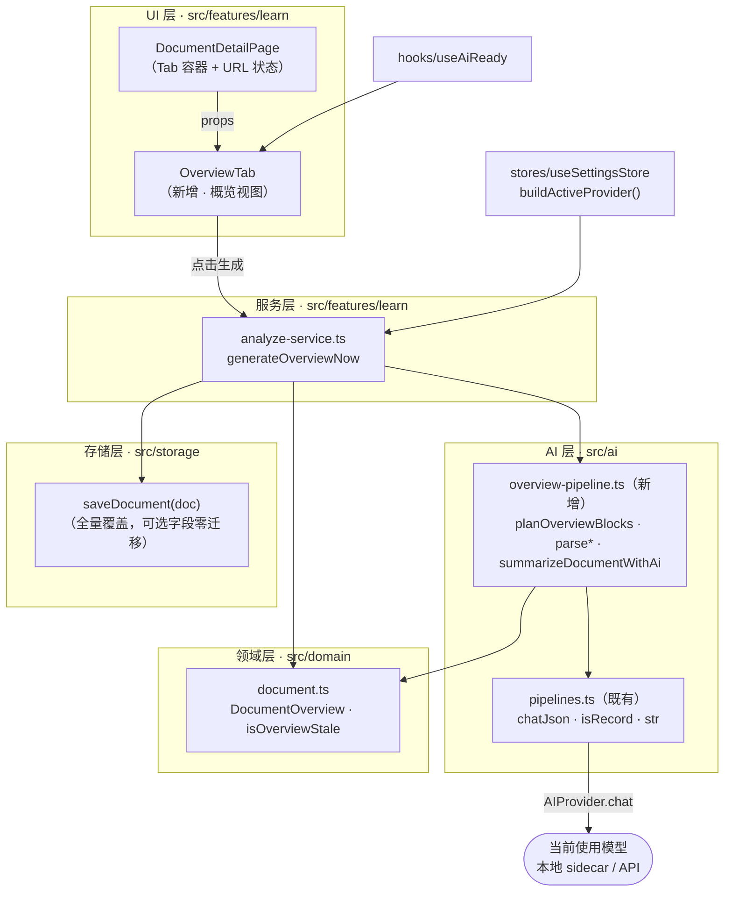
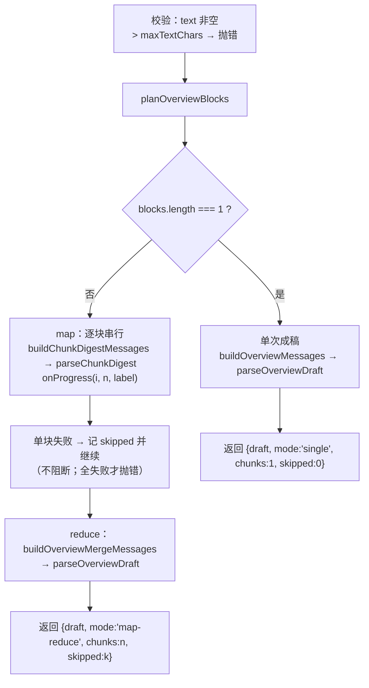
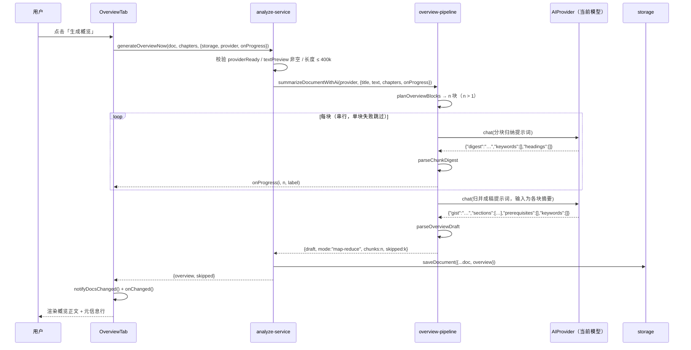

# 资料详情页「概览」Tab（AI 整篇总结）技术方案

| 字段 | 内容 |
|------|------|
| 作者 | Agent（WorkBuddy） |
| 日期 | 2026-09-10 |
| 状态 | 已完成（2026-09-10；T1–T11 全部落地并验证，配套 runbook：`docs/library-detail-page-overview-tab-task-runbook-2026-09.md`） |
| 关联需求 | 用户原话：「详情页在 tab 的最前面新增一个概览的 tab，用 AI 对当前资料做一个总结」 |
| 关联文档 | `docs/library-detail-page-design-2026-09.md`（v1 四 Tab 建立）、`docs/library-detail-page-v2-design-2026-09.md`（v2 渲染收敛与自适应）、`docs/library-module-design-2026-09.md`（资料库硬契约） |

## 已确认决策（用户 2026-09-10 18:05 回复）

| 编号 | 决策 | 选定 |
|------|------|------|
| **D1** | 触发方式 | **手动点击生成**（与现有三个 AI 分析入口一致，不产生意外调用） |
| **D2** | 长文策略 | **分层归纳 map-reduce**（按章分块 → 分块中部摘要 → 归并成稿） |
| **D3** | 内容构成 | **AI 总结 + 本地统计**（AI 产出正文，本地零成本补章数/字数/概念数/试卷数/达标数） |
| **D4** | 默认落点 | **概览作为默认 Tab**（`/learn/doc/:id` 不带 `tab` 参数时落到概览） |

---

## 1. 背景

### 1.1 业务背景与用户痛点

「资料详情页」（`/learn/doc/:docId`）当前有 4 个 Tab，全部是「展开细节」的视角：

| Tab | 回答的问题 |
|-----|-----------|
| 资料内容 | 原文长什么样 |
| 章节列表 | 被切成了哪几块 |
| 关键知识点 | 有哪些要点与概念 |
| 章节测评试卷 | 我考得怎么样 |

**缺一个回答「这份资料到底在讲什么、值不值得读、该怎么读」的入口。** 用户导入一份 20 万字的 PDF 后，第一屏是正文开头 —— 想判断这份资料是否值得投入时间，只能自己通读一遍。这正是「概览」要解决的问题。

### 1.2 触发原因

用户明确要求：详情页最前面新增「概览」Tab，用 AI 对当前资料做总结。

### 1.3 与现有模块的关系

- **复用**：AI 传输层（`AIProvider.chat`）、`chatJson` JSON 契约、`analyze-service` 的「分析恒由 AI 执行 + 失败如实抛」编排范式、`useAiReady()` 响应式 AI 就绪判定、v2 的 markdown 渲染收敛层（`markdown-core`）。
- **不重叠**：现有三条 AI 管道（`analyzeChaptersNow` / `analyzeConceptsNow` / `analyzeKeyPointsNow`）都是**逐章**粒度；概览是**整篇**粒度，是全新能力。

### 1.4 现状缺口（代码事实，非推测）

| 事实 | 证据 |
|------|------|
| `SourceDocument` 无任何整篇级总结字段，只有 4 个**时间戳** | `src/domain/document.ts:40-53`：`analysis: { chaptersAt?, conceptsAt?, keyPointsAt?, model? }` |
| 三条 AI 分析管道均为逐章粒度，无整篇能力 | `src/features/learn/analyze-service.ts` 三个导出函数签名均含 `chapters` 迭代 |
| 管道输入上限口径保守，整篇必然装不下 | `src/ai/pipelines.ts:51-54`：`conceptMaxTextChars: 40_000` / `keyPointMaxTextChars: 40_000` |
| **`pipelines.ts` 已 765 行，超过仓库 ≤700 行硬上限** | `wc -l src/ai/pipelines.ts` → 765；约束见 `rules/code-structure-and-dependencies.mdc` |
| 详情页 Tab 默认值为硬编码 `'content'`，且**非法 tab 值会让所有 Panel 都不渲染**（空白页） | `src/features/learn/DocumentDetailPage.tsx:21` 是无校验的 `as` 断言 |

### 1.5 不做的影响

详情页持续「重细节、缺总览」，长资料的利用率低；用户对「这份资料值不值得投入」始终缺少低成本的判断依据。

---

## 2. 方案目标

| 类型 | 描述 |
|------|------|
| **主要目标** | ① 详情页首个 Tab 为「概览」，`/learn/doc/:id` 不带参数时默认落到它；② AI 生成整篇概览：一句话定位 / 主干脉络 / 关键词 / 读前需知；③ **长资料走分层归纳**，覆盖全文主干而非只总结开头；④ 本地零成本补统计面板（章数 / 字数 / 概念数 / 试卷数 / 达标章数） |
| **非目标** | 不做概览的编辑、导出、分享；不做概览翻译（AI 按资料语言输出）；不做概览与 goal（学习目标）联动；不改 `GraphView` 硬编码配色（v2 登记的 R3 遗留）；不引新依赖；不做浏览器级校验（受 `rules/no-headless-browser-validation.mdc` 约束）；不做概览的增量更新（正文变化只提示过期，重跑是全量） |
| **成功标准** | ① `typecheck` 0 error；② 新增纯逻辑单测全绿并挂入 `test:library`；③ `test:i18n` 8/8；④ 代码自审：新增文件均 ≤700 行、无硬编码中文/hex、概览 Tab 零写入（除 `saveDocument(overview)`）；⑤ 五 Tab 在 960px 窗宽下不溢出 |

---

## 3. 项目现状

### 3.1 相关代码与模块

| 路径 | 当前行为 | 与本方案的关系 |
|------|---------|---------------|
| `src/features/learn/DocumentDetailPage.tsx`（156 行） | 4 Tab；`tab` 来自 `?tab=` 硬编码默认 `'content'`；`selectTab` 为合并式 URL 更新（v2 D2） | **修改**：前插 overview Tab + 默认值 + 白名单校验 |
| `src/features/learn/detail/{ContentTab,SplitTab,KnowledgeTab,PapersTab}.tsx` | 4 个 Tab 组件；`KnowledgeTab` / `PapersTab` 是 AI 触发与「mount 只读」的范式样板 | **参照**，不改 |
| `src/features/learn/detail/PapersTab.tsx` | mount 时 `listPapers()` + `listPaperResults()`，**零写入** | **参照**：概览的统计面板用同一读法 |
| `src/features/learn/analyze-service.ts`（300 行） | 三个 AI 分析编排；统一 `AnalyzeServiceError(kind)`；失败向上抛不降级 | **修改**：新增 `generateOverviewNow` |
| `src/ai/pipelines.ts`（765 行） | 五组管道；`chatJson` / `PIPELINE_LIMITS` / `extractJson` 已导出；`isRecord` / `str` 是**私有**工具（第 118–124 行） | **修改**：仅把两个私有工具改 `export`（供新模块复用，避免复制第二份归一化逻辑） |
| `src/hooks/useAiReady.ts`（20 行） | 响应式订阅 `useSettingsStore.providerReady` | **复用**：概览按钮的启用条件 |
| `src/stores/useSettingsStore.ts:216` | `buildActiveProvider(): AIProvider` | **复用**：取当前模型 |
| `src/features/learn/render/markdown-core.tsx` | v2 建立的**唯一** markdown → React 映射表，导出 `MarkdownBlock`（块级）/ `MarkdownInline`（行内） | **复用**：AI 生成的概览文本用 `**加粗**` 等标记时正确渲染 |
| `src/features/learn/paper-advice.ts` | `MASTERY_MASTERED = 0.9`；`learner.byUnit[chapter.id].mastery` 为章掌握度口径 | **复用口径**：达标章数统计同源 |
| `src/domain/plan.ts:49-50` | `MASTERY_THRESHOLD = 0.8` / `MASTERY_FLOOR = 0.6` | **复用**：达标判定 |
| `src/components/layout/AppShell.tsx` | `PageContainer size="wide"`（`max-w-[1600px]`，`px-4 sm:px-6 lg:px-8`）；`notifyDocsChanged()`；`w-60`（240px）侧栏 | **复用** |
| `src/components/ui/tabs.tsx` | v2 修复后的下划线式 Tab：`TabsList` 为 `w-full`、`TabsTab` 为 `flex-1 min-w-0 px-2`、`TabsIndicator` 绑 `--active-tab-left/-width` | **复用**，需验证 5 项等分 |
| `src/components/primitives.tsx` | `Section` / `Card` / `Stat` / `Bar` / `ActionCard` 等原语 | **复用** |

### 3.2 相关文档与约定

- `rules/code-structure-and-dependencies.mdc`：**文件 ≤700 行**；≥10 行 × ≥3 处必须先抽取；依赖单向。
- `rules/engineering-code-style.mdc`：相对导入、中文注释、UI 文案一律 i18n、Tailwind 4 token、`import type`。
- `rules/layer-import-boundaries.mdc`：UI → stores/storage；纯逻辑不依赖 React。
- `rules/commit-conventions.mdc`：Conventional Commits，scope 取 PLOS 域。
- `skills/ui-impl-tokens/SKILL.md`：token-first，优先复用 UI Kit 与 primitives。
- 既有范式：`analyze-service.ts:1-14` 的职责边界注释（「分析恒由 AI 执行」「只写 X，从不改 Y」「失败向上抛，绝不静默回退」）。

### 3.3 约束与依赖

| 约束 | 影响 |
|------|------|
| **`src/ai/pipelines.ts` 已 765 行 > 700 行上限** | 新管道**不得**继续堆进该文件。本方案把概览管道放在**新文件** `src/ai/overview-pipeline.ts`（自持 limits / prompts / parsers / executor），对 `pipelines.ts` 只做「把 `isRecord` / `str` 改为 export」这一处零增长改动。**既不扩大既有超限，也不顺手重构**（后者会污染 diff、影响并行会话） |
| 现有单章输入上限 40k 字，整篇可达 20 万字 | 必须有分块策略（D2 已定 map-reduce） |
| 本地小模型（如 `qwen3.5:4b`）JSON 合规性较弱 | 解析层严格校验 + 失败抛类型化错误可重试，**不静默降级** |
| 无 ESLint / Prettier | 跟随文件既有风格 |
| Node ≥ 22；单测 node 直跑 `--experimental-strip-types` | 纯逻辑必须无 React / 无 storage 依赖，才能进 `tests/` |
| 不加依赖 | 复用 `react-markdown`（已装）、`lucide-react`（已装） |

---

## 4. 技术架构

### 4.1 总体架构



**分层与依赖方向**：`features → ai / storage / stores / domain`，`ai → domain`，**无反向依赖、无环**。概览管道不 import 任何 React，可被 `tests/` node 直跑。

### 4.2 模块职责

| 模块/层级 | 职责 | 技术选型 |
|-----------|------|----------|
| `domain/document.ts` | `DocumentOverview` 类型 + `isOverviewStale` 纯谓词 | 纯 TS |
| `ai/overview-pipeline.ts`（新） | 概览能力：尺寸常量、分块规划（纯函数）、3 个提示词构建器、2 个响应解析器（纯函数）、执行器 `summarizeDocumentWithAi` | 纯 TS（复用 `chatJson`） |
| `features/learn/analyze-service.ts` | 概览编排：前置校验 → 调管道 → 组装 `DocumentOverview` → 写库 | 纯 TS |
| `features/learn/detail/OverviewTab.tsx`（新） | 概览渲染、空/加载/错误/过期四态、手动触发、本地统计面板 | React + Tailwind token |
| `features/learn/DocumentDetailPage.tsx` | Tab 注册（5 项）、默认 Tab、白名单校验 | React |

### 4.3 数据模型与 API

#### 4.3.1 新增领域类型（`src/domain/document.ts`）

```ts
/** 概览生成方式（展示用；决定 UI 文案与成本提示）。 */
export type OverviewMode = "single" | "map-reduce";

/**
 * 资料概览（AI 生成，整篇级）。
 *
 * 全部可选（挂在 SourceDocument.overview?）→ 老数据零迁移。
 * 时间戳**只**放 generatedAt：不另设 analysis.overviewAt —— 同一事实不两处记录。
 */
export interface DocumentOverview {
  /** 一句话定位：这份资料在讲什么（≤60 字）。 */
  gist: string;
  /** 主干脉络：1–6 段（按资料原有顺序）。 */
  sections: { heading: string; detail: string }[];
  /** 读前需知 / 适合谁：0–3 条（≤40 字）。空数组 → UI 隐藏该区块。 */
  prerequisites: string[];
  /** 关键词：0–6 个（≤12 字）。空数组 → UI 隐藏该区块。 */
  keywords: string[];
  /** 生成时间（唯一真源）。 */
  generatedAt: number;
  /** 生成时依据的正文长度（字符）——与当前 textPreview.length 不等即「可能过期」。 */
  sourceChars: number;
  mode: OverviewMode;
  /** map-reduce 的分块数（single 时省略）。 */
  chunks?: number;
  /** 生成所用模型标识（展示用，可缺省）。 */
  model?: string;
}

/** 概览是否因正文变化而可能过期（纯谓词；无概览 → false，不制造焦虑）。 */
export function isOverviewStale(
  doc: Pick<SourceDocument, "overview" | "textPreview">,
): boolean {
  const o = doc.overview;
  if (!o) return false;
  return o.sourceChars !== (doc.textPreview?.length ?? 0);
}
```

`SourceDocument` 新增一行：`overview?: DocumentOverview;`

#### 4.3.2 AI 管道契约（`src/ai/overview-pipeline.ts`）

```ts
/** 尺寸常量（自持一份，不扩大 pipelines.ts 的 PIPELINE_LIMITS）。 */
export const OVERVIEW_LIMITS = {
  /** 单次成稿上限 = 单块上限（同口径，便于「1 块 ⟺ 单次」的统一推理）。 */
  chunkChars: 12_000,
  /** 最多分块数；正文更长时按 ceil(len / maxChunks) 放大块尺寸，保证块数 ≤ 该值。 */
  maxChunks: 20,
  /** 整篇硬上限（超出抛错，提示先精简/拆分）。 */
  maxTextChars: 400_000,
  /** 归并阶段喂给 AI 的中部摘要总量上限（超出按顺序截断并标注）。 */
  reduceChars: 16_000,
  gistChars: 60,
  sectionMax: 6,
  sectionHeadingChars: 20,
  sectionDetailChars: 80,
  prereqMax: 3,
  prereqChars: 40,
  keywordMax: 6,
  keywordChars: 12,
  digestChars: 120,
  digestKeywordMax: 4,
  digestHeadingMax: 4,
} as const;

/** 分块规划结果（纯数据，供执行器与单测共用）。 */
export interface OverviewBlock {
  index: number;
  /** 在 doc.textPreview 中的绝对区间（start 含 / end 不含）。 */
  start: number;
  end: number;
  /** 提示词里的块标识（所属章标题 / `第 N 段`）。 */
  label: string;
}

/** 分块中部摘要（map 阶段单块产物）。 */
export interface AiChunkDigest {
  digest: string;
  keywords: string[];
  headings: string[];
}

/** 概览草稿（单次成稿 / 归并成稿的统一产物）。 */
export interface AiOverviewDraft {
  gist: string;
  sections: { heading: string; detail: string }[];
  prerequisites: string[];
  keywords: string[];
}

/** 纯函数：把正文规划成 ≤ maxChunks 块。 */
export function planOverviewBlocks(input: {
  text: string;
  chapters?: readonly Chapter[];
  chunkChars?: number;
  maxChunks?: number;
}): OverviewBlock[];

/** 纯函数：构建分块归纳提示词。 */
export function buildChunkDigestMessages(input: {
  blockIndex: number;
  blockTotal: number;
  label: string;
  text: string;
}): ChatMessage[];

/** 纯函数：构建单次成稿提示词（正文 ≤ chunkChars）。 */
export function buildOverviewMessages(input: {
  title: string;
  text: string;
}): ChatMessage[];

/** 纯函数：构建归并成稿提示词（输入为各块中部摘要）。 */
export function buildOverviewMergeMessages(input: {
  title: string;
  totalChars: number;
  digests: readonly AiChunkDigest[];
}): ChatMessage[];

/** 纯函数：解析单块归纳响应（不合规抛 AiProviderError）。 */
export function parseChunkDigest(raw: unknown): AiChunkDigest;

/** 纯函数：解析成稿响应（裁剪 / 去重 / 上限；gist 空或 sections 空 → 抛错）。 */
export function parseOverviewDraft(raw: unknown): AiOverviewDraft;

/** 执行器：单次成稿或分层归纳（未配置 / 失败抛类型化错误）。 */
export async function summarizeDocumentWithAi(
  provider: AIProvider,
  input: {
    title: string;
    text: string;
    chapters?: readonly Chapter[];
    onProgress?: (i: number, n: number, label: string) => void;
  },
): Promise<{
  draft: AiOverviewDraft;
  mode: OverviewMode;
  chunks: number;
  /** map 阶段失败并跳过的块数（single 时为 0）。 */
  skipped: number;
}>;
```

#### 4.3.3 服务层契约（`src/features/learn/analyze-service.ts`）

```ts
export interface GenerateOverviewOptions {
  storage: StorageAdapter;
  provider: AIProvider;
  /** 分析所用模型标识（仅展示用）。 */
  model?: string;
  onProgress?: (i: number, n: number, label: string) => void;
  now?: number;
}

export interface GenerateOverviewResult {
  overview: DocumentOverview;
  /** map 阶段跳过（AI 失败）的块数；> 0 时 UI 提示「概览未覆盖这部分内容」。 */
  skipped: number;
}

/**
 * 概览生成执行序：校验 → 管道 → 组装 DocumentOverview → 写库。
 *
 * 与另三条分析的关键差异：**不校验「有没有章节」**。概览只需正文，
 * 未切分的资料同样能出概览（无章时按段落分块）—— 因此这里**不抛 no-chapters**。
 */
export async function generateOverviewNow(
  doc: SourceDocument,
  chapters: readonly Chapter[],
  opts: GenerateOverviewOptions,
): Promise<GenerateOverviewResult>;
```

**读写路径（遵循 `rules/layer-import-boundaries.mdc`）**：

- `OverviewTab` → `analyze-service.generateOverviewNow` → `storage.saveDocument({ ...doc, overview })`。
- 存储形状：`SourceDocument.overview` 为**可选字段**，落在既有文档记录内 —— **无新表、无 migration、无 IPC 变更**。
- 概览生成**不接触任何桌面能力**：不 invoke `vault_*`、不 invoke `llm_*`。模型调用一律经 `AIProvider.chat()`（本地模型走 `builtin.ts` 的既有封装）。纯浏览器预览无需额外 `isTauri` 守卫。

#### 4.3.4 分块规划算法（`planOverviewBlocks`，纯函数）

```
输入：text、chapters（可空）、chunkChars=12_000、maxChunks=20

1. text 去空白为空        → []
2. text.length ≤ chunkChars → [ 单块 {0, len, label:""} ]     ← 与「单次成稿」同一门槛
3. 求候选边界：
   - 若 chapters 非空：取各章 contentRef.start，夹取到 [1, len-1]、去重、升序；
     用「章起点」保证**不跨章切**（章是现成的语义单元）
   - 若 chapters 空或候选边界不足：退化为按段落空行 "\n\n" 的边界
4. 顺序累积成块：
   - 累积字符数 + 下一段 > chunkChars → 在此断开
   - 单章本身 > chunkChars → 章内按 "\n\n" 二次切分（仍可能超，则硬截）
5. 块数 > maxChunks → 令 chunk = ceil(text.length / maxChunks) 重跑步骤 3–4
   （数学上保证块数 ≤ maxChunks；尾部合并一次作为兜底）
6. label：块起点落在某章区间内 → 该章标题；否则 `第 ${index+1} 段`
7. 末块 end 恒等于 text.length（不留尾巴）
```

**为什么优先用章边界**：章是切分器算好的语义单元，跨章切块会把两章的中段拼在一起，归并阶段容易串味。无章节时用段落空行，避免把 markdown 围栏或表格行切一半（与 v2 `chapterPreviewOf` 同一思路）。

#### 4.3.5 执行器 `summarizeDocumentWithAi` 流程



### 4.4 状态与副作用

| 状态 | 归属 | 说明 |
|------|------|------|
| `?tab=overview\|content\|split\|knowledge\|papers` | **URL**（`useSearchParams`） | 新增 `overview`；**非法值回落 `overview`**（修掉「非法值导致所有 Panel 不渲染」的既有缺陷）。`?at=` 仍由 `selectTab` 的合并式更新保留（v2 D2 不回退） |
| `doc.overview` | **持久化**（storage） | 唯一真源；`generatedAt` 兼作「生成时间」与「是否生成过」 |
| `busy` / `progress` / `error` / `papers` | **组件内 state**（`OverviewTab`） | 不落库。`papers` 为 mount 时只读的统计输入 |
| 副作用触发时机 | 仅**用户点击**（D1） | mount 时只做一次只读 `storage.listPapers()`；**不在 mount 触发 AI** |

---

## 5. 交互流程

### 5.1 主流程（首次生成）

1. 用户从资料库点卡片进入 `/learn/doc/:id`（不带 `tab`）→ D4 生效，落在**概览**。
2. 概览 Tab 立即渲染**本地统计面板**（不依赖 AI，首屏即有内容：章数 / 字数 / 概念数 / 试卷数 / 达标章数 + 四个跳转入口）。
3. AI 区块处于空态：「还没有概览」+ 一句说明 + 主行动按钮：
   - `useAiReady()` 为 true → **「生成概览」**可点；
   - 为 false → 按钮置灰，并给出「配置 AI 模型后可生成概览。 去配置 AI 模型 →」。
4. 用户点击 → 按钮变「生成中…」并禁用；下方出现进度行。
5. 系统按正文长度自动选路：
   - `text.length ≤ 12_000` → **单次成稿**，进度行「正在成稿…」；
   - 否则 → **分层归纳**：`planOverviewBlocks` 出 n 块，逐块串行，进度行「正在归纳 3/5 · 第三章 检索」，随后「正在归并成稿…」。
6. 成功 → 写库（`saveDocument`）→ 调用 `notifyDocsChanged()`（资料库卡片同步）→ `onChanged()` 刷新详情页 props → 渲染概览正文 + 元信息行「生成于 9月10日 · 分层归纳 5 块 · qwen3.5:4b」，按钮变**「重新生成」**。
7. 若有跳过块 → 元信息行下方补一条提示「其中 1 块未能归纳，概览未覆盖这部分内容。」

### 5.2 分支与异常流程

| 场景 | 触发条件 | 系统行为 | UI 反馈 |
|------|---------|----------|---------|
| AI 未配置 | `providerReady === false` | **不发起**任何调用 | 按钮禁用 + 「去配置 AI 模型 →」 |
| 无正文 | `doc.textPreview?.trim()` 为空 | 按钮禁用，不发起调用 | 空态「这份资料没有正文，无法生成概览。」（统计面板仍显示） |
| 正文过长 | `text.length > 400_000` | 管道抛 `AiProviderError("request-failed", …)` | 错误行如实展示「资料过长（N 字，上限 400000），请先精简或拆分后再生成」，可重试 |
| 单块归纳失败 | map 阶段某块 AI 报错/解析失败 | **跳过并计数**，继续后续块 | 完成后提示「其中 N 块未能归纳……」（诚实告知覆盖范围） |
| 全部块失败 | map 阶段 n 块全失败 | 抛错，**不写库** | 错误行 + 可重试（不落半成品） |
| 成稿输出不合规 | 非对象 / `gist` 空 / `sections` 空 | 抛错，**不写库** | 错误行如实展示 message + 可重试 |
| 正文已变化 | `sourceChars !== textPreview.length` | 不自动重生成 | 顶部提示条「正文已更新，这份概览可能已过期。」+ 强调「重新生成」 |
| 重复点击 | `busy` 为 true | 按钮 `disabled` | — |
| 数据加载中 | `doc === null` | 页面级 loading（既有行为） | 「加载中…」 |

### 5.3 时序图（长资料分层归纳）



---

## 6. 用户用例

### UC-01：首次生成概览（短文，单次成稿）

| 项 | 内容 |
|----|------|
| 角色 | 已配置本地模型的用户 |
| 前置条件 | 资料已导入、有正文、`textPreview.length ≤ 12_000`；无 `doc.overview` |
| 主流程步骤 | 1. 打开 `/learn/doc/:id`（不带 `tab`）→ 落在概览；2. 点击「生成概览」；3. 等待单次调用返回；4. 观察概览正文与元信息行 |
| 期望结果 | 概览含「一句话定位 / 主干脉络 / 关键词 / 读前需知」；元信息行显示「单次成稿」；按钮变「重新生成」；`doc.overview.mode === "single"`、`chunks` 缺省；库中已持久化 |
| 异常/边界 | AI 返回不合规 JSON → 错误行 + 可重试，库中**不落**半成品 |

### UC-02：长资料分层归纳

| 项 | 内容 |
|----|------|
| 角色 | 同上 |
| 前置条件 | 资料约 15 万字、已切分（有 chapters）；无 `doc.overview` |
| 主流程步骤 | 1. 打开概览 Tab；2. 点击「生成概览」；3. 观察进度行逐块递进；4. 等待归并完成 |
| 期望结果 | `doc.overview.mode === "map-reduce"`、`chunks ≥ 2`（≤ 20）；概览覆盖**全文**主干（含末章内容），而非只有开头；元信息行显示「分层归纳 N 块」 |
| 异常/边界 | 中途某块失败 → 最终提示跳过块数，其余照常成稿；全部失败 → 抛错不写库 |

### UC-03：重新生成（覆盖）

| 项 | 内容 |
|----|------|
| 角色 | 已有概览的用户 |
| 前置条件 | `doc.overview` 存在；正文未变 |
| 主流程步骤 | 1. 点击「重新生成」；2. 等待完成 |
| 期望结果 | 新概览整体覆盖旧值（`generatedAt` 更新）；过程中旧内容保留可见（不清空，避免闪屏）；失败时**旧概览不被破坏** |
| 异常/边界 | 重新生成失败 → 旧概览仍在，仅显示错误行 |

### UC-04：AI 未配置

| 项 | 内容 |
|----|------|
| 角色 | 未配置模型的用户 |
| 前置条件 | `providerReady === false` |
| 主流程步骤 | 1. 打开概览 Tab；2. 观察 AI 区块 |
| 期望结果 | 「生成概览」禁用；显示「配置 AI 模型后可生成概览。」+「去配置 AI 模型 →」（跳 `/settings`）；统计面板正常显示；**不发生任何 AI 调用** |
| 异常/边界 | 用户在另一窗口配好模型后回到本页 → `useAiReady` 响应式变 true，按钮自动可点（无需刷新） |

### UC-05：正文为空

| 项 | 内容 |
|----|------|
| 角色 | 导入了一份只存元信息的资料的用户 |
| 前置条件 | `doc.textPreview` 缺失或为空白 |
| 主流程步骤 | 1. 打开概览 Tab |
| 期望结果 | 显示「这份资料没有正文，无法生成概览。」；按钮禁用；统计面板的字数显示 0 |
| 异常/边界 | 不抛错、不弹窗；不产生 AI 调用 |

### UC-06：正文变更后的过期提示

| 项 | 内容 |
|----|------|
| 角色 | 用「替换正文」更新过资料的用户 |
| 前置条件 | `doc.overview` 存在，且 `overview.sourceChars !== doc.textPreview.length` |
| 主流程步骤 | 1. 打开概览 Tab |
| 期望结果 | 内容顶部出现提示条「正文已更新，这份概览可能已过期。」；「重新生成」按钮强调显示；**不自动重跑**（不产生意外调用） |
| 异常/边界 | 无概览时不显示该提示（不制造焦虑） |

---

## 7. 线框 UI

### 7.1 概览 Tab — 未生成（空态）

```
┌──────────────────────────────────────────────────────────────────────┐
│  ← 深度学习实战 · 第 3 版                          2026/09/08          │  ← 既有 header
├──────────────────────────────────────────────────────────────────────┤
│   概览     资料内容     章节列表     关键知识点     章节测评试卷          │  ← 5 Tab 等分（overview 选中，主色下划线）
│  ━━━━━━                                                                │
├──────────────────────────────────────────────────────────────────────┤
│  AI 概览                                        [ 生成概览 ]           │  ← Section + 主行动
│  配置 AI 模型后可生成概览。  去配置 AI 模型 →                           │  ← useAiReady=false 时才出现
│  ──────────────────────────────────────────────────────────────────  │
│  ┌ ─ ─ ─ ─ ─ ─ ─ ─ ─ ─ ─ ─ ─ ─ ─ ─ ─ ─ ─ ─ ─ ─ ─ ─ ─ ─ ─ ─ ─ ─ ┐  │
│  │            还没有概览                                          │  │  ← 虚线空态卡
│  │  AI 会读完整份资料，给出主干脉络、关键词与读前需知。            │  │
│  │                    [ 生成概览 ]                                │  │
│  └ ─ ─ ─ ─ ─ ─ ─ ─ ─ ─ ─ ─ ─ ─ ─ ─ ─ ─ ─ ─ ─ ─ ─ ─ ─ ─ ─ ─ ─ ─ ┘  │
│                                                                      │
│  这份资料                                                             │  ← 本地统计面板（始终渲染）
│  ┌──────────┬──────────┬──────────┬──────────┬──────────┐            │
│  │ 章        │ 字数      │ 概念      │ 试卷      │ 达标      │            │
│  │ 12       │ 154,320  │ 86       │ 3        │ 5/12     │            │
│  └──────────┴──────────┴──────────┴──────────┴──────────┘            │
│  [去阅读 →]  [章节列表 →]  [关键知识点 →]  [章节测评试卷 →]              │
└──────────────────────────────────────────────────────────────────────┘
```

### 7.2 概览 Tab — 生成中

```
│  AI 概览                                       [ 生成中… ]（禁用）      │
│  正在归纳 3/13 · 第三章 检索                                          │  ← 分层归纳
│    （或：正在成稿… ／ 正在归并成稿…）                                   │
│  ──────────────────────────────────────────────────────────────────  │
│  ┌ ─ ─ ─ ─ ─ ─ ─ ─ ─ ─ ─ ─ ─ ─ ─ ─ ─ ─ ─ ─ ─ ─ ─ ─ ─ ─ ─ ─ ─ ─ ┐  │
│  │  还没有概览（保持空态，不清空已有内容）                          │  │
│  └ ─ ─ ─ ─ ─ ─ ─ ─ ─ ─ ─ ─ ─ ─ ─ ─ ─ ─ ─ ─ ─ ─ ─ ─ ─ ─ ─ ─ ─ ─ ┘  │
```

> 重新生成时**保留旧内容可见**，只在按钮与进度行表达进行中 —— 避免大面积闪屏。

### 7.3 概览 Tab — 已生成

```
┌──────────────────────────────────────────────────────────────────────┐
│  AI 概览                                       [ 重新生成 ]            │
│  生成于 9月10日 · 分层归纳 13 块 · qwen3.5:4b                          │  ← 元信息行
│  ⚠ 正文已更新，这份概览可能已过期。                                     │  ← 仅 stale 时出现
│  ──────────────────────────────────────────────────────────────────  │
│  一句话定位                                                            │  ← 小标题（text-xs ink-2）
│  这本书系统讲了从零实现深度学习框架所需的全部工程细节，……                │  ← MarkdownBlock，text-base ink-1
│                                                                      │
│  主干脉络                                                              │
│   ① 张量抽象       —— 从存储布局讲到自动微分所需的元信息              │  ← heading（ink-1 加粗）+ detail（ink-2）
│   ② 计算图与反向传播 —— 动态图优先，静态图作为优化出口                │
│   ③ …                                                                 │
│                                                                      │
│  关键词    [ 自动微分 ] [ 张量 ] [ 计算图 ] [ 内存布局 ]                │  ← chip：rounded-full 边框
│  读前需知  • 需要 Python 与基础线性代数                                │
│           • 适合已会用 PyTorch、想理解内部实现的读者                    │
│  ──────────────────────────────────────────────────────────────────  │
│  这份资料                                                              │
│  [章 12] [154,320 字] [概念 86] [试卷 3] [已达标 5/12 章]  ▓▓▓▓░░░░░░  │
│  [去阅读 →]  [章节列表 →]  [关键知识点 →]  [章节测评试卷 →]              │
└──────────────────────────────────────────────────────────────────────┘
```

- **布局说明**：单列纵向堆叠，最大宽度由 `PageContainer size="wide"` 提供（≤1600px）。AI 正文段落限 `max-w-[68ch]` 保可读性（长行难读）；统计面板用 `flex flex-wrap` 而非 grid，窄屏自动折行。
- **组件映射**：`Section`（区块标题 + 右侧 action）、`Card`（内容卡）、`Stat`（统计项）、`Bar`（达标进度条）、`Button`（`variant="outline"` 次要 / 默认主行动）、`MarkdownBlock` / `MarkdownInline`（AI 文本渲染）。
- **设计 token**：`text-ink-1`（主文）/ `text-ink-2`（次文与区块标题）/ `text-ink-3`（元信息）/ `border-line` / `bg-surface` / `text-primary`（链接与强调）/ `text-state-weak`（过期提示，仅提示条用色，非大面积）。
- **响应式断点**：
  - `< sm`（<640）：统计项两列折行；四个入口按钮整行占满；Tab 5 项由 `flex-1` 等分。
  - `sm`–`lg`：统计项一行 5 列；入口按钮收窄右对齐（`sm:ml-auto`，与 v2 的 `PapersTab` 口径一致）。
  - `≥ lg`：`px-8`，内容与统计面板同宽。
  - **Tab 宽度核算**：960px 窗口 − 240px 侧栏 − 32px 内边距 = 688px，5 项等分 **137.6px/项**；最长标签「章节测评试卷」（6 字 × 14px = 84px + `px-2` 16px = 100px）**仍有 ~37px 余量**，无需横向滚动。→ **不引入滚动容器**。

### 7.4 其他状态

| 状态 | 表现 |
|------|------|
| 错误 | AI 区块内 `rounded-lg border border-line bg-surface p-3` 的提示行：「生成失败：<message>（可再次点击重试）」；真实 message 直出，不吞错 |
| 无正文 | 空态卡文案换成「这份资料没有正文，无法生成概览。」，主行动按钮禁用 |
| 跳过块 | 元信息行下方追加一行 `text-xs text-ink-3`：「其中 N 块未能归纳，概览未覆盖这部分内容。」 |
| keywords / prerequisites 为空 | 对应区块**整块隐藏**（不渲染空标题） |
| 无章节（未切分） | **不阻塞**：概览照常可生成（按段落分块）；统计面板的章数显示 0、达标显示「还没有可评估的章节」 |

### 7.5 交互说明

- Hover / Focus：按钮与链接沿用 UI Kit 既有态；Tab 键盘可达性由 Base UI `Tabs` 保证（方向键切换）。
- 无弹层、无 Toast：所有反馈就地呈现（与 `KnowledgeTab` 的分析进度/汇总区一致）。
- 可达性：进度行与错误行使用 `aria-live="polite"`，让读屏用户感知长任务状态。

---

## 8. 涉及文件及改动伪代码

> 共 **9 个文件**：新增 3（1 管道 + 1 Tab + 1 单测），修改 6。

### 8.1 `src/domain/document.ts`（修改）

**改动说明**：新增 `OverviewMode`、`DocumentOverview`、`isOverviewStale`，并在 `SourceDocument` 上挂可选字段。纯 TS，无 React / storage 依赖。

```ts
// 伪代码 — 仅表达意图，非最终提交代码
+export type OverviewMode = "single" | "map-reduce";
+
+/** 资料概览（AI 生成，整篇级）。全部可选 → 老数据零迁移。 */
+export interface DocumentOverview {
+  gist: string;
+  sections: { heading: string; detail: string }[];
+  prerequisites: string[];
+  keywords: string[];
+  generatedAt: number;
+  sourceChars: number;
+  mode: OverviewMode;
+  chunks?: number;
+  model?: string;
+}
+
+/** 概览是否因正文变化而可能过期（无概览 → false）。 */
+export function isOverviewStale(
+  doc: Pick<SourceDocument, "overview" | "textPreview">,
+): boolean {
+  const o = doc.overview;
+  if (!o) return false;
+  return o.sourceChars !== (doc.textPreview?.length ?? 0);
+}

 export interface SourceDocument {
   // …既有字段不动
   analysis?: { /* 既有：chaptersAt / conceptsAt / keyPointsAt / model */ };
+  /** 整篇概览（AI 生成；老数据无此字段 → UI 显示空态）。 */
+  overview?: DocumentOverview;
 }
```

### 8.2 `src/ai/pipelines.ts`（修改 · 仅 2 处零增长改动）

**改动说明**：把两个私有归一化工具改为导出，供 `overview-pipeline.ts` 复用 —— **避免复制第二份 `isRecord` / `str`**（否则同一归一化逻辑出现两个真源）。不做任何重构、不新增行。

```diff
-function isRecord(v: unknown): v is Record<string, unknown> {
+/** 供同目录管道模块复用（不自建第二份归一化工具）。 */
+export function isRecord(v: unknown): v is Record<string, unknown> {

-function str(v: unknown): string | undefined {
+/** 同上。 */
+export function str(v: unknown): string | undefined {
```

> ⚠️ 该文件已 765 行、超出 700 行上限 —— **本方案不向其中新增任何管道**（见 §3.3）。超限本身登记为遗留项 R4，另行处理。

### 8.3 `src/ai/overview-pipeline.ts`（新增 · 约 300 行）

**改动说明**：概览能力的完整实现，自持尺寸常量、提示词、纯函数与执行器。只依赖 `./pipelines`（`chatJson` / `isRecord` / `str`）、`./types`（`AiProviderError`）、`../domain`（`Chapter`、`OverviewMode`）。

```ts
// 伪代码
import type { Chapter, OverviewMode } from "../domain";
import type { AIProvider, ChatMessage } from "./types";
import { AiProviderError } from "./types";
import { chatJson, isRecord, str } from "./pipelines";

export const OVERVIEW_LIMITS = { /* §4.3.2 常量表 */ } as const;
/** 温度：概览偏叙述，但结构需稳定 → 与 refine 同档。 */
const OVERVIEW_TEMPERATURE = 0.3;

/* ---------- 1. 分块规划（纯函数） ---------- */
export function planOverviewBlocks(input: {
  text: string;
  chapters?: readonly Chapter[];
  chunkChars?: number;
  maxChunks?: number;
}): OverviewBlock[] {
  const chunkChars = input.chunkChars ?? OVERVIEW_LIMITS.chunkChars;
  const maxChunks = input.maxChunks ?? OVERVIEW_LIMITS.maxChunks;
  const text = input.text;
  if (text.trim().length === 0) return [];
  if (text.length <= chunkChars) return [{ index: 0, start: 0, end: text.length, label: "" }];

  // 1) 候选边界：章起点（夹取 / 去重 / 升序 / 去掉 0 与未越界项）
  const chapterStarts = (input.chapters ?? [])
    .map((c) => Math.max(0, Math.min(c.contentRef.start, text.length)))
    .filter((s) => s > 0 && s < text.length);
  // 2) 顺序累积；单段（章）超 chunkChars → 段内按 "\n\n" 二次切
  // 3) 块数 > maxChunks → chunk = ceil(len / maxChunks) 重跑一遍
  // 4) label：起点落在某章区间 → 章标题，否则 `第 N 段`
  // 5) 末块 end 恒 = text.length（不留尾巴）
}

/* ---------- 2. 提示词（纯函数） ---------- */
const CHUNK_DIGEST_SYSTEM = /* 只归纳本块，不臆测其他块，不写套话 */;
const OVERVIEW_SYSTEM      = /* 整篇导读：gist / sections / prerequisites / keywords */;
const OVERVIEW_MERGE_SYSTEM = /* 把各块摘要**归并成稿**，不逐块罗列，合并重复主题 */;

export function buildChunkDigestMessages(input: {...}): ChatMessage[] { /* system + `第 i/n 块（label）正文` */ }
export function buildOverviewMessages(input: { title: string; text: string }): ChatMessage[] { /* 整篇正文 */ }
export function buildOverviewMergeMessages(input: {
  title: string; totalChars: number; digests: readonly AiChunkDigest[];
}): ChatMessage[] { /* 各块摘要拼接；超 reduceChars → 按顺序截断并标注「（后续块省略）」 */ }

/* ---------- 3. 解析（纯函数） ---------- */
export function parseChunkDigest(raw: unknown): AiChunkDigest {
  if (!isRecord(raw)) throw new AiProviderError("request-failed", "AI 分块归纳响应不是对象。");
  const digest = str(raw.digest)?.trim();
  if (!digest) throw new AiProviderError("request-failed", "AI 分块归纳未返回摘要。");
  // keywords / headings：数组 → trim → 上限裁剪 → 去重
  return { digest: digest.slice(0, OVERVIEW_LIMITS.digestChars), keywords, headings };
}

export function parseOverviewDraft(raw: unknown): AiOverviewDraft {
  if (!isRecord(raw)) throw new AiProviderError("request-failed", "AI 概览响应不是对象。");
  const gist = str(raw.gist)?.trim();
  if (!gist) throw new AiProviderError("request-failed", "AI 概览未返回「一句话定位」。");
  // sections：每项 heading 与 detail 均非空才收；heading ≤20、detail ≤80；≤6 条
  // sections 为空 → 抛错（结构缺失，要求重试；不给出只有一句话的「概览」）
  // prerequisites：0–3 条，≤40 字，允许空
  // keywords：0–6 个，≤12 字，去重，允许空
  return { gist: gist.slice(0, OVERVIEW_LIMITS.gistChars), sections, prerequisites, keywords };
}

/* ---------- 4. 执行器 ---------- */
export async function summarizeDocumentWithAi(provider, input) {
  const text = input.text.trim();
  if (text.length === 0) throw new AiProviderError("request-failed", "正文为空，无法生成概览。");
  if (text.length > OVERVIEW_LIMITS.maxTextChars) {
    throw new AiProviderError("request-failed",
      `资料过长（${text.length} 字，上限 ${OVERVIEW_LIMITS.maxTextChars}），请先精简或拆分后再生成。`);
  }
  const blocks = planOverviewBlocks({ text, chapters: input.chapters });

  // 单块 ⟺ 单次成稿（chunkChars 与「单次上限」同口径）
  if (blocks.length === 1) {
    const raw = await chatJson(provider, buildOverviewMessages({ title: input.title, text }), OVERVIEW_TEMPERATURE);
    return { draft: parseOverviewDraft(raw), mode: "single", chunks: 1, skipped: 0 };
  }

  // map：串行、单块失败跳过（不阻断），全失败才抛
  const digests: AiChunkDigest[] = [];
  let skipped = 0;
  for (let i = 0; i < blocks.length; i++) {
    const b = blocks[i];
    input.onProgress?.(i + 1, blocks.length, b.label);
    try {
      const raw = await chatJson(provider,
        buildChunkDigestMessages({ blockIndex: i, blockTotal: blocks.length, label: b.label,
                                   text: text.slice(b.start, b.end) }),
        OVERVIEW_TEMPERATURE);
      digests.push(parseChunkDigest(raw));
    } catch { skipped++; }
  }
  if (digests.length === 0) {
    throw new AiProviderError("request-failed", "所有分块归纳均失败，未能生成概览。");
  }

  // reduce
  const raw = await chatJson(provider, buildOverviewMergeMessages({
    title: input.title, totalChars: text.length, digests,
  }), OVERVIEW_TEMPERATURE);
  return { draft: parseOverviewDraft(raw), mode: "map-reduce", chunks: blocks.length, skipped };
}
```

### 8.4 `src/features/learn/analyze-service.ts`（修改 · 约 +75 行 → ~375 行）

**改动说明**：新增概览编排。**不校验 `no-chapters`**（概览只需正文）。失败一律向上抛，不写半成品。

```ts
// 伪代码
+import type { DocumentOverview } from "../../domain";
+import { isOverviewStale } from "../../domain";   // 仅如需；实际由 UI 调用，服务层不必引
+import { summarizeDocumentWithAi } from "../../ai/overview-pipeline";

+export interface GenerateOverviewOptions {
+  storage: StorageAdapter;
+  provider: AIProvider;
+  model?: string;
+  onProgress?: (i: number, n: number, label: string) => void;
+  now?: number;
+}
+
+export interface GenerateOverviewResult {
+  overview: DocumentOverview;
+  /** map 阶段被跳过的块数（> 0 时 UI 需告知覆盖范围）。 */
+  skipped: number;
+}
+
+/**
+ * 概览生成执行序：校验 → 管道 → 组装 DocumentOverview → 写库。
+ *
+ * 与另三条分析的关键差异：**不要求已切分**。概览只依赖正文；无章节时
+ * 管道按段落分块，因此这里不抛 `no-chapters`。
+ */
+export async function generateOverviewNow(
+  doc: SourceDocument,
+  chapters: readonly Chapter[],
+  opts: GenerateOverviewOptions,
+): Promise<GenerateOverviewResult> {
+  const { storage, provider, model, onProgress, now = Date.now() } = opts;
+  if (!provider.isConfigured()) {
+    throw new AnalyzeServiceError("not-configured", "AI 未配置。");
+  }
+  const text = doc.textPreview ?? "";
+  if (text.trim().length === 0) {
+    throw new AnalyzeServiceError("no-body", "这份资料没有正文。");
+  }

+  const { draft, mode, chunks, skipped } = await summarizeDocumentWithAi(provider, {
+    title: doc.title, text, chapters,
+    ...(onProgress ? { onProgress } : {}),
+  });

+  const overview: DocumentOverview = {
+    ...draft,
+    generatedAt: now,
+    sourceChars: text.length,
+    mode,
+    ...(mode === "map-reduce" ? { chunks } : {}),
+    ...(model ? { model } : {}),
+  };
+  // 单一真源：overview 自带 generatedAt，不另写 analysis.overviewAt。
+  await storage.saveDocument({ ...doc, overview });
+  return { overview, skipped };
+}
```

同时更新文件头注释的「职责边界」清单，加入第 ④ 项：概览（整篇级、不依赖切分、写 `doc.overview`）。

### 8.5 `src/features/learn/detail/OverviewTab.tsx`（新增 · 约 240 行）

**改动说明**：概览视图。四态（空/进行中/已生成/错误）+ 本地统计面板。**唯一写入动作**是经 `generateOverviewNow` 落 `doc.overview`；`listPapers()` 为只读。

```tsx
// 伪代码
interface OverviewTabProps {
  doc: SourceDocument;
  chapters: Chapter[];
  learner: LearnerState | null;
  onChanged: () => Promise<void>;
}

export default function OverviewTab({ doc, chapters, learner, onChanged }: OverviewTabProps) {
  const { m: t } = useI18n();
  const aiReady = useAiReady();
  const [busy, setBusy] = useState(false);
  const [progress, setProgress] = useState<{ i: number; n: number; label: string; phase: "map" | "merge" }>();
  const [error, setError] = useState<string>();
  const [skipped, setSkipped] = useState(0);
  const [papers, setPapers] = useState<Paper[]>([]);

  // mount 只读：与 PapersTab 同源；失败不影响概览（统计缺试卷数而已）
  useEffect(() => {
    let alive = true;
    void (async () => {
      try { const ps = await storage.listPapers(); if (alive) setPapers(ps); }
      catch (e) { console.error('[OverviewTab] 加载试卷失败：', e); }
    })();
    return () => { alive = false; };
  }, []);

  const overview = doc.overview;
  const stale = isOverviewStale(doc);
  const hasBody = (doc.textPreview ?? '').trim().length > 0;

  // 本地统计（零成本，不依赖 AI）——口径全部复用既有定义
  const stats = useMemo(() => {
    const chapterIds = new Set(chapters.map((c) => c.id));
    const unitIds = new Set(chapters.flatMap((c) => c.unitIds ?? []));       // 概念数（同 KnowledgeTab）
    const paperCount = papers.filter((p) =>
      p.scope.chapterIds.some((id) => chapterIds.has(id))).length;
    const mastered = chapters.filter(
      (c) => (learner?.byUnit[c.id]?.mastery ?? 0) >= MASTERY_THRESHOLD).length; // 同 paper-advice 口径
    return { chapters: chapters.length, chars: doc.textPreview?.length ?? 0,
             units: unitIds.size, papers: paperCount, mastered, total: chapters.length };
  }, [doc, chapters, learner, papers]);

  const generate = async () => {
    if (busy || !aiReady || !hasBody) return;
    setBusy(true); setError(undefined); setSkipped(0);
    try {
      const r = await generateOverviewNow(doc, chapters, {
        storage, provider: buildActiveProvider(),
        ...(doc.analysis?.model ? { model: doc.analysis.model } : {}),
        onProgress: (i, n, label) => setProgress({ i, n, label, phase: 'map' }),
      });
      setSkipped(r.skipped);
      notifyDocsChanged();
      await onChanged();                       // 刷新详情页 props（doc.overview 更新）
    } catch (e) {
      // 分析恒由 AI 执行：失败如实展示，不静默降级（沿用 E2 约定）
      setError(e instanceof Error ? e.message : String(e));
    } finally { setBusy(false); setProgress(undefined); }
  };

  return (
    <div className="space-y-6">
      <div>
        <Section title={t.learn.detail.overview.head}
                 action={<Button size="sm" variant={overview ? 'outline' : 'default'}
                                 onClick={generate} disabled={busy || !aiReady || !hasBody}>
                           {busy ? t.learn.detail.overview.generating
                                 : overview ? t.learn.detail.overview.regenerate
                                            : t.learn.detail.overview.generate}
                         </Button>} />
        {overview && <p className="mt-1 text-xs text-ink-3">{metaLine(overview, t)}</p>}
        {skipped > 0 && <p className="mt-1 text-xs text-ink-3">{t.learn.detail.overview.skippedChunks(skipped)}</p>}
        {!aiReady && hasBody && <p className="mt-1 text-xs text-ink-3">
          {t.learn.detail.overview.noAi} <Link to="/settings" className="text-primary hover:underline">
            {t.learn.detail.overview.goConfigure}</Link></p>}
      </div>

      {/* 进行中/错误：aria-live 让读屏可感知长任务 */}
      {progress && <p aria-live="polite" className="text-xs text-ink-2">{progressText(progress, t)}</p>}
      {error && <p aria-live="polite" className="rounded-lg border border-line bg-surface p-3 text-xs text-ink-2">
        {t.learn.detail.overview.failed(error)}</p>}
      {stale && <p className="text-xs text-state-weak">{t.learn.detail.overview.stale}</p>}

      {/* 主体：已生成 → 内容；未生成 → 空态卡（进行中保留旧内容，避免闪屏） */}
      {overview ? (
        <Card className="space-y-5 px-6 py-5">
          <div>
            <p className="text-xs font-semibold tracking-wide text-ink-2">{t.learn.detail.overview.gistLabel}</p>
            <MarkdownBlock text={overview.gist} className="mt-1 text-base text-ink-1" />
          </div>
          {overview.sections.length > 0 && (
            <div>
              <p className="text-xs font-semibold tracking-wide text-ink-2">{t.learn.detail.overview.sectionsLabel}</p>
              <ol className="mt-2 space-y-2">
                {overview.sections.map((s, i) => (
                  <li key={i} className="text-sm">
                    <span className="font-medium text-ink-1">{i + 1}. {s.heading}</span>
                    <span className="ml-2 text-ink-2"><MarkdownInline text={s.detail} /></span>
                  </li>
                ))}
              </ol>
            </div>
          )}
          {overview.keywords.length > 0 && /* chips：rounded-full border border-line px-2 py-0.5 text-xs */ null}
          {overview.prerequisites.length > 0 && /* “• 条目”（MarkdownInline） */ null}
        </Card>
      ) : (
        <div className="rounded-lg border border-dashed border-line bg-surface p-6 text-center">
          <p className="text-sm font-medium text-ink-1">
            {hasBody ? t.learn.detail.overview.emptyTitle : t.learn.detail.overview.noBody}
          </p>
          {hasBody && <p className="mt-1 text-xs text-ink-3">{t.learn.detail.overview.emptyDesc}</p>}
        </div>
      )}

      {/* 本地统计面板：始终渲染，与 AI 状态解耦 */}
      <div>
        <Section title={t.learn.detail.overview.statsLabel} />
        <div className="mt-3 flex flex-wrap gap-x-8 gap-y-3">
          <Stat label={t.learn.detail.overview.statChapters} value={String(stats.chapters)} />
          <Stat label={t.learn.detail.overview.statChars}    value={formatInt(stats.chars)} />
          <Stat label={t.learn.detail.overview.statUnits}    value={String(stats.units)} />
          <Stat label={t.learn.detail.overview.statPapers}   value={String(stats.papers)} />
          <Stat label={t.learn.detail.overview.statMastery}  value={`${stats.mastered}/${stats.total}`} />
        </div>
        {stats.total > 0
          ? <Bar value={stats.mastered / stats.total} className="mt-3" />
          : <p className="mt-2 text-xs text-ink-3">{t.learn.detail.overview.masteryEmpty}</p>}
        <div className="mt-4 flex flex-wrap gap-2">
          <Button size="sm" variant="outline" onClick={() => selectTab('content')}>{t.…goRead}</Button>
          {/* 章节列表 / 关键知识点 / 章节测评试卷 三个入口同理，走 URL 切 Tab */}
        </div>
      </div>
    </div>
  );
}
```

> **入口按钮的切 Tab 方式**：概览内不重复实现路由跳转，统一用 `navigate('/learn/doc/:id?tab=xxx')`（与 `KnowledgeTab.goSource` 同一写法）。统计面板的「达标章数」与 `Bar` 让首屏即可回答「我学到哪了」。

### 8.6 `src/features/learn/DocumentDetailPage.tsx`（修改 · 约 +25 行 → ~180 行）

**改动说明**：① Tab 列表前插 overview；② 默认值改 overview 并加**白名单校验**（修掉非法值渲染空白页的既有缺陷）；③ 挂载新 Panel。

```tsx
// 伪代码
+/** Tab 取值白名单 —— 顺带修掉既有缺陷：`?tab=xxx` 非法值会让所有 Panel 都不渲染（空白页）。 */
+const TAB_VALUES = ['overview', 'content', 'split', 'knowledge', 'papers'] as const;
+type TabValue = (typeof TAB_VALUES)[number];
+const isTabValue = (v: string | null): v is TabValue =>
+  v !== null && (TAB_VALUES as readonly string[]).includes(v);

-const tab = (searchParams.get('tab') || 'content') as 'content' | 'split' | 'knowledge' | 'papers';
+// D4：不带 tab 参数时落到首个 Tab「概览」。
+const tab: TabValue = isTabValue(searchParams.get('tab')) ? searchParams.get('tab') as TabValue : 'overview';

 const selectTab = (v: string) => { /* 既有合并式更新，保留 at —— 不改 */ };

 <TabsList>
   {[
+    { value: 'overview',  label: t.learn.detail.tabs.overview },
     { value: 'content',   label: t.learn.detail.tabs.content },
     { value: 'split',     label: t.learn.detail.tabs.split },
     { value: 'knowledge', label: t.learn.detail.tabs.knowledge },
     { value: 'papers',    label: t.learn.detail.tabs.papers },
   ].map(/* 不变 */)}
   <TabsIndicator />
 </TabsList>

+<TabsPanel value="overview" className="mt-4">
+  <OverviewTab doc={doc} chapters={chapters} learner={learner} onChanged={handleRefresh} />
+</TabsPanel>
```

> **不改动**：`KnowledgeTab` 的「原文 →」跳转（`?tab=content&at=`）不受影响；`LegacyLearnRedirect` 的 `?tab=knowledge` 也不受影响；`selectTab` 的合并式更新保持 v2 D2 决策。

### 8.7 `src/i18n/messages/zh.ts`（修改）

**改动说明**：`tabs` 加 `overview`；新增 `learn.detail.overview` 段（约 25 键）。**成对新增**，缺一个 `test:i18n` 会失败。

```ts
tabs: { overview: "概览", content: "资料内容", split: "章节列表", knowledge: "关键知识点", papers: "章节测评试卷" },

/** 概览（AI 整篇总结）。 */
overview: {
  head: "AI 概览",
  generate: "生成概览",
  regenerate: "重新生成",
  generating: "生成中…",
  progressMap: (i: number, n: number, label: string) =>
    label ? `正在归纳 ${i}/${n} · ${label}` : `正在归纳 ${i}/${n}`,
  progressSingle: "正在成稿…",
  progressMerge: "正在归并成稿…",
  at: (d: string, mode: string) => `生成于 ${d} · ${mode}`,
  modeSingle: "单次成稿",
  modeMapReduce: (n: number) => `分层归纳 ${n} 块`,
  emptyTitle: "还没有概览",
  emptyDesc: "AI 会读完整份资料，给出主干脉络、关键词与读前需知。",
  noAi: "配置 AI 模型后可生成概览。",
  noBody: "这份资料没有正文，无法生成概览。",
  goConfigure: "去配置 AI 模型 →",
  failed: (reason: string) => `生成失败：${reason}（可再次点击重试）`,
  stale: "正文已更新，这份概览可能已过期。",
  skippedChunks: (n: number) => `其中 ${n} 块未能归纳，概览未覆盖这部分内容。`,
  gistLabel: "一句话定位",
  sectionsLabel: "主干脉络",
  keywordsLabel: "关键词",
  prereqLabel: "读前需知",
  statsLabel: "这份资料",
  statChapters: "章",
  statChars: "字数",
  statUnits: "概念",
  statPapers: "试卷",
  statMastery: "已达标",
  masteryEmpty: "还没有可评估的章节。",
  goRead: "去阅读 →",
  goSplit: "章节列表 →",
  goKnowledge: "关键知识点 →",
  goPapers: "章节测评试卷 →",
}
```

### 8.8 `src/i18n/messages/en.ts`（修改）

**改动说明**：与 zh **逐键对齐**。

```ts
tabs: { overview: "Overview", content: "Content", split: "Chapters", knowledge: "Key points", papers: "Papers" },

overview: {
  head: "AI overview",
  generate: "Generate overview",
  regenerate: "Regenerate",
  generating: "Generating…",
  progressMap: (i: number, n: number, label: string) =>
    label ? `Summarizing ${i}/${n} · ${label}` : `Summarizing ${i}/${n}`,
  progressSingle: "Writing overview…",
  progressMerge: "Merging into final overview…",
  at: (d: string, mode: string) => `Generated ${d} · ${mode}`,
  modeSingle: "single pass",
  modeMapReduce: (n: number) => `map-reduce, ${n} blocks`,
  emptyTitle: "No overview yet",
  emptyDesc: "AI reads the whole document and returns its structure, keywords and prerequisites.",
  noAi: "Configure an AI model to generate an overview.",
  noBody: "This document has no body — cannot generate an overview.",
  goConfigure: "Configure AI model →",
  failed: (reason: string) => `Generation failed: ${reason} (click again to retry)`,
  stale: "The body has changed — this overview may be outdated.",
  skippedChunks: (n: number) => `${n} block(s) could not be summarized — the overview does not cover them.`,
  gistLabel: "In one line",
  sectionsLabel: "Structure",
  keywordsLabel: "Keywords",
  prereqLabel: "Before you read",
  statsLabel: "This document",
  statChapters: "Chapters",
  statChars: "Characters",
  statUnits: "Concepts",
  statPapers: "Papers",
  statMastery: "Mastered",
  masteryEmpty: "No chapter to assess yet.",
  goRead: "Open reader →",
  goSplit: "Chapters →",
  goKnowledge: "Key points →",
  goPapers: "Papers →",
}
```

### 8.9 `package.json` + `tests/library-overview.test.ts`（新增单测）

**改动说明**：挂 `test:overview` 并把 `test:library` 串为五组。

```json
"test:overview": "node --experimental-strip-types --no-warnings --import ./tests/register-loader.mjs tests/library-overview.test.ts",
"test:library": "npm run test:anchor && npm run test:advice && npm run test:keypoint && npm run test:preview && npm run test:overview"
```

`tests/library-overview.test.ts`（约 180 行，风格对齐 `library-keypoint.test.ts`：手写 `check()` + 计数通过数）：

```ts
// 伪代码
import { planOverviewBlocks, parseChunkDigest, parseOverviewDraft, OVERVIEW_LIMITS }
  from '../src/ai/overview-pipeline.ts';
import { isOverviewStale } from '../src/domain/document.ts';
// 覆盖：见 §12 测试用例（TC-OV-01 … TC-OV-13）
```

---

## 9. 任务清单

| ID | 任务 | 依赖 | 复杂度 |
|----|------|------|--------|
| **T1** | `domain/document.ts`：`OverviewMode` + `DocumentOverview` + `SourceDocument.overview?` + `isOverviewStale` | — | S |
| **T2** | `ai/pipelines.ts`：`isRecord` / `str` 改 export（零增长） | — | S |
| **T3** | `ai/overview-pipeline.ts`：`OVERVIEW_LIMITS` + `planOverviewBlocks`（纯函数，可与 T4 分离验证） | T1 | M |
| **T4** | `ai/overview-pipeline.ts`：3 个 system prompt + 3 个 builder + `parseChunkDigest` / `parseOverviewDraft` | T3 | M |
| **T5** | `ai/overview-pipeline.ts`：`summarizeDocumentWithAi`（单次 / map-reduce 双路 + 跳过计数 + 全失败抛错） | T4 | M |
| **T6** | `analyze-service.ts`：`generateOverviewNow` + 文件头职责边界注释补第 ④ 项 | T5 | S |
| **T7** | `detail/OverviewTab.tsx`：四态 + 统计面板 + 入口按钮 | T6 | L |
| **T8** | `DocumentDetailPage.tsx`：Tab 前插 + 默认 overview + 白名单校验 + Panel | T7 | S |
| **T9** | i18n zh/en 成对补齐（`tabs.overview` + `detail.overview` 段） | T8 | S |
| **T10** | `tests/library-overview.test.ts` + `package.json`（`test:overview` / `test:library` 串联） | T3–T5 | M |
| **T11** | 全量验证 + 文档回填 + 分组提交 | T1–T10 | S |

---

## 10. 实施步骤

按**推荐批次**推进，每批结束跑 `npm run typecheck` 归零再进下一批。

### 批次一：T1 → T2 → T3（领域类型 + 分块规划纯函数）

- **输入**：本方案 §4.3.1 / §4.3.4。
- **动作**：加类型与纯谓词；`pipelines.ts` 两处 `export`；实现 `OVERVIEW_LIMITS` 与 `planOverviewBlocks`。
- **验证**：`npm run typecheck` 0 error；手动 `node --experimental-strip-types` 跑一个临时断言（或直接进批次四的单测）。
- **风险**：分块边界 off-by-one → 用「末块 `end === text.length`」不变式自检。

### 批次二：T4 → T5 → T6（提示词 + 执行器 + 服务编排）

- **输入**：§4.3.2 / §4.3.5。
- **动作**：三个 prompt、三个 builder、两个 parser、执行器、`generateOverviewNow`。
- **验证**：`npm run typecheck`；静态自审「`overview-pipeline.ts` 无 React / 无 storage import」。
- **风险**：本地小模型 JSON 不合规 → parser 严格校验并抛类型化错误（不返回半成品）。

### 批次三：T7 → T8 → T9（UI + Tab 注册 + 文案）

- **输入**：§7 线框 / §8.5–8.8。
- **动作**：新建 `OverviewTab`、改 `DocumentDetailPage`、zh/en 成对补键。
- **验证**：`npm run typecheck`；`npm run test:i18n` 8/8。
- **风险**：T9 若落后于 T7/T8，中途 typecheck 会因缺键失败 → **文案与组件同批落地**。

### 批次四：T10 → T11（单测 + 全量验证 + 提交）

- **输入**：§12 用例表。
- **动作**：写单测、挂脚本、跑 `typecheck` / `test:i18n` / `test:library` / 回归（`test:scope` / `test:eta` / `test:import`）、回填方案与 runbook 状态、按 `commit-conventions` 分组提交（**仅本地，不 push**）。
- **验证**：见 §11.3。

**回滚策略**：概览是**纯增量**功能 —— 回滚只需 `git revert` 对应提交，或让 UI 不渲染新 Tab。`SourceDocument.overview` 为可选字段，**无需数据迁移**；已写入的 `overview` 会被老版本代码忽略（不报错）。**不存在不可逆的存储变更。**

---

## 11. 测试方案

### 11.1 测试范围与策略

| 层级 | 工具/方式 | 覆盖重点 | 不负责 |
|------|-----------|----------|--------|
| **单元** | `tests/library-overview.test.ts`（node 直跑，`npm run test:overview`） | `planOverviewBlocks` 分块边界与块数不变式；`parseChunkDigest` / `parseOverviewDraft` 的裁剪、去重、上限、拒绝路径；`isOverviewStale` 三态 | AI 网络调用、React 渲染 |
| **i18n 对齐** | `npm run test:i18n` | zh/en **键结构与类型**完全一致 | 文案语义 |
| **类型** | `npm run typecheck` | 全仓 0 error；新契约（`DocumentOverview` / `summarizeDocumentWithAi` 签名）被正确消费 | 运行时行为 |
| **静态自审** | `grep` + 人工 | `overview-pipeline.ts` 不 import React/storage；新增行无硬编码中文/hex；`OverviewTab` 唯一写入为 `saveDocument(overview)` | — |
| **集成 / E2E** | **不做**（`rules/no-headless-browser-validation.mdc`） | — | 浏览器级校验需用户显式要求 |
| **手工** | 用户目视 | SC-1~SC-6 视觉验收（见 §11.3） | 自动化不覆盖视觉 |

### 11.2 测试环境与数据

- 无外部依赖：单测只调用纯函数，**不构造 provider、不发生网络**。
- 夹具就地内联：构造 `text` 字符串 + 假 `Chapter[]`（只用到 `contentRef` / `title`）。
- 命令：`npm run test:overview`（单跑） / `npm run test:library`（五组串联）。
- CI：沿用既有 `npm run test:*` 手工/流水线方式，无新增基建。

### 11.3 通过标准

- `npm run typecheck` → **0 error**。
- `npm run test:library` → 既有 34 项 + 新增 ~13 项全绿。
- `npm run test:i18n` → **8/8**。
- 回归 `test:scope` (3/3) / `test:eta` / `test:import` (20/20) 不退化。
- 静态边界与自审清单全部通过。
- 用户视觉验收（手工，**不主动起浏览器**）：

| 编号 | 验收点 |
|------|--------|
| **SC-1** | 进入详情页默认落在「概览」，Tab 栏第一个位置，主色下划线在概览上 |
| **SC-2** | 5 个 Tab 等分铺满整行，960px 窗口下不溢出、不换行 |
| **SC-3** | 未生成时：空态卡 + 可用/禁用状态正确（AI 未配置时给「去配置」） |
| **SC-4** | 生成中：进度行逐块递进；重新生成时旧内容不闪空 |
| **SC-5** | 已生成：一句话定位 / 主干脉络 / 关键词 / 读前需知四区块渲染正常，AI 文本中的 `**加粗**` 正确渲染（不显示字面星号） |
| **SC-6** | 统计面板数字与其余 Tab 一致（章数、概念数与关键知识点 Tab 相同） |

---

## 12. 测试用例

### 12.1 功能用例

| ID | 关联 UC | 步骤 | 输入/操作 | 期望结果 | 类型 |
|----|---------|------|-----------|----------|------|
| TC-UC01-01 | UC-01 | 1. 打开详情页 | 不带 `tab` 参数 | 落在概览 Tab（首个位置选中） | 手工/E2E |
| TC-UC01-02 | UC-01 | 1. 点击「生成概览」 | 正文 3,000 字 | `summarizeDocumentWithAi` 走单次路径：`mode==="single"`、`chunks` 缺省 | 单元+手工 |
| TC-UC01-03 | UC-01 | 1. 生成完成后查库 | — | `doc.overview` 含 `gist/sections/generatedAt/sourceChars/mode`；`sourceChars === textPreview.length` | 手工 |
| TC-UC01-04 | UC-01 | 1. 校验元信息行 | — | 显示「生成于 … · 单次成稿」 | 手工 |
| TC-UC02-01 | UC-02 | 1. 生成 15 万字资料 | 有 chapters | `mode==="map-reduce"`、`chunks ≥ 2 且 ≤ 20` | 单元+手工 |
| TC-UC02-02 | UC-02 | 1. 生成中观察 | — | 进度行显示「正在归纳 i/n · 章标题」，i 单调递增 | 手工 |
| TC-UC02-03 | UC-02 | 1. 检查概览覆盖度 | — | `sections` 中出现**末章**主题（非只有开头） | 手工 |
| TC-UC02-04 | UC-02 | 1. 令第 3 块 AI 失败 | mock 失败 | 其余块照常成稿；提示「其中 1 块未能归纳…」 | 单元+手工 |
| TC-UC03-01 | UC-03 | 1. 已有概览 → 点「重新生成」 | — | 旧内容保持可见直到新结果返回；`generatedAt` 更新 | 手工 |
| TC-UC03-02 | UC-03 | 1. 令归并失败 | mock 失败 | 显示错误行；**旧概览未被破坏**（库里仍是旧值） | 手工 |
| TC-UC04-01 | UC-04 | 1. 关闭 AI 配置 → 打开概览 | `providerReady=false` | 按钮禁用 + 「去配置 AI 模型 →」；零 AI 调用 | 手工 |
| TC-UC04-02 | UC-04 | 1. 另一窗口配好模型 → 回到本页 | — | 按钮自动可点（`useAiReady` 响应式） | 手工 |
| TC-UC05-01 | UC-05 | 1. 打开无正文资料的概览 | `textPreview` 空 | 「这份资料没有正文，无法生成概览。」；按钮禁用 | 手工 |
| TC-UC06-01 | UC-06 | 1. 生成概览 → 替换正文 → 回概览 | 长度变化 | 出现过期提示条；**不自动重跑** | 单元+手工 |

### 12.2 单元用例（`tests/library-overview.test.ts`）

| ID | 目标 | 输入/操作 | 期望结果 |
|----|------|-----------|----------|
| **TC-OV-01** | `planOverviewBlocks` 短文 | `text` 长 500 字 | 恰好 1 块；`{start:0, end:500}`；`label === ""` |
| **TC-OV-02** | 恰好等于门槛不切 | `text` 长 `chunkChars` | 1 块（`≤` 而非 `<`） |
| **TC-OV-03** | 按章边界切 | 5 章 × 各 8,000 字（共 40,000） | 块边界与章边界对齐；**无块跨章**；块数 = 5 |
| **TC-OV-04** | 单章超限 → 章内二次切 | 1 章 30,000 字含空行 | 该章被切成 ≥3 块；切入点在 `\n\n` 处 |
| **TC-OV-05** | 无章节 → 按段落切 | `chapters` 缺省、30,000 字含空行 | 正常出块（≥2）；块边界在空行处 |
| **TC-OV-06** | 块数上限 | 400,000 字 / 1,000 字一章（400 章） | 块数 **≤ `maxChunks`**；末块 `end === text.length` |
| **TC-OV-07** | 不变式：全覆盖无重叠 | 任意输入 | 拼接各块切片 === 原文；`blocks[i].end === blocks[i+1].start`；`blocks[0].start === 0` |
| **TC-OV-08** | 空文本 | `text === ""` / 纯空白 | 返回 `[]`（不抛错） |
| **TC-OV-09** | `contentRef` 越界 | 章 `start > text.length` | 夹取处理，不抛错（TC-EDGE-02 同源策略） |
| **TC-OV-10** | `parseChunkDigest` 合规 | `{digest:"…", keywords:[…], headings:[…]}` | 原样规范化返回 |
| **TC-OV-11** | `parseChunkDigest` 拒绝 | `{}` / 非对象 / `digest` 空串 | 抛 `AiProviderError`（不返回空对象） |
| **TC-OV-12** | `parseOverviewDraft` 裁剪与上限 | `sections` 8 条、`detail` 200 字、`keywords` 10 个（含重复） | `sections` 截到 6；`detail` 裁到 80；`keywords` 去重后截到 6；`gist` 裁到 60 |
| **TC-OV-13** | `parseOverviewDraft` 拒绝 | `gist` 空 / `sections` 空数组 | 抛 `AiProviderError` |
| **TC-OV-14** | `isOverviewStale` 三态 | 无 overview / `sourceChars` 一致 / 不一致 | `false` / `false` / `true` |

### 12.3 边界与回归

| ID | 场景 | 期望 |
|----|------|------|
| TC-EDGE-01 | `?tab=foo`（非法值） | 回落 `overview`，**不再渲染空白页**（顺带修复的既有缺陷） |
| TC-EDGE-02 | `?tab=knowledge&at=100` 直接访问 | 仍正确落到关键知识点并高亮（`selectTab` 合并式更新未回退） |
| TC-EDGE-03 | 未切分资料（0 章）生成概览 | 成功生成；统计面板章数 0、达标区显示「还没有可评估的章节。」 |
| TC-EDGE-04 | 正文 > 400k 字 | 抛错并展示「资料过长…」；**不写库** |
| TC-EDGE-05 | AI 返回带 ```json 围栏 | `extractJson`（既有）正确剥离，成稿正常 |
| TC-EDGE-06 | `OverviewTab` 静态边界 | 零 `savePaper` / `deletePaper` / `saveChapters`；`listPapers()` 为唯一额外读取 |
| TC-EDGE-07 | 依赖边界 | `overview-pipeline.ts` 不 import `react` / `storage` / `stores`（保证可 node 直跑） |
| TC-EDGE-08 | 文件行数 | 新增/修改后的 `overview-pipeline.ts`、`OverviewTab.tsx`、`analyze-service.ts`、`DocumentDetailPage.tsx` 均 **≤700 行** |
| TC-EDGE-09 | 回归：其余四 Tab | v2 的渲染、`?at=` 高亮、试卷推荐、切分入口均不受影响 |
| TC-EDGE-10 | 老数据兼容 | 无 `overview` 的既有资料打开概览 → 空态，无报错（可选字段零迁移） |

---

## 13. 风险与遗留

| 编号 | 风险 | 影响 | 缓解 |
|------|------|------|------|
| **R1** | 长资料多次串行调用，端到端耗时可达分钟级 | 用户等待焦虑 | 进度行逐块可见（`aria-live`）；单块失败不阻断；**手动触发**让用户对成本有预期（D1）；后续可考虑并行化（非目标） |
| **R2** | 本地小模型（`qwen3.5:4b`）归并阶段 JSON 合规性弱 | 生成失败 | 解析层严格校验 + 类型化错误 + 可重试；**绝不静默降级成假内容**（沿用 P0-3 诚实降级原则） |
| **R3** | `GraphView` 仍有硬编码 `slate-*` / `indigo-*` 配色 | 与本方案无关的既有债 | 沿用 v2 决策，登记为独立议题，不顺手改 |
| **R4** | `src/ai/pipelines.ts` **已 765 行，超出 700 行上限** | 违反 `code-structure-and-dependencies` | 本方案**不向其中新增管道**（新文件承载）；超限本身建议另开任务按能力拆分（`pipelines/` 目录 + index 重导出），**不在本次范围内** |
| **R5** | 概览内容质量依赖资料语言（中文资料 → 中文概览） | 英文资料概览为英文 | 视为**预期行为**（不做翻译，非目标）；提示词不强制语言，跟随输入 |
| **R6** | `sections` 要求 ≥1 条可能对极短资料过严 | 极短笔记可能生成失败 | AI 对短文本仍可给出「这一段讲什么」；若实测过严，后续放宽为允许空 `sections`（改动局限在 parser 一处） |

---

## 变更记录

| 日期 | 变更 | 作者 |
|------|------|------|
| 2026-09-10 | 初稿（基于用户需求 + 现状勘察；已确认 4 项决策：D1 手动触发 / D2 分层归纳 / D3 AI+本地统计 / D4 概览为默认 Tab） | Agent |
| 2026-09-10 | 用户确认「按方案实施」；按 4 批次推进（T1/T2/T3 → T4/T5/T6 → T7/T8/T9 → T10/T11） | 用户 |
| 2026-09-10 | 实施完成。两处偏差：① `onProgress` 追加第 4 参数 `phase`（§7.2 已为三种进度文案分别设计，回调不给 phase 则无法驱动）；② 无章节时块 label 改为**空串**而非 `第 N 段` —— 该 label 直通 UI 进度行，硬编码中文会漏到英文界面（章标题属数据可透出）。其余按方案落地；`?tab=foo` 白屏缺陷已顺带修复 | Agent |
