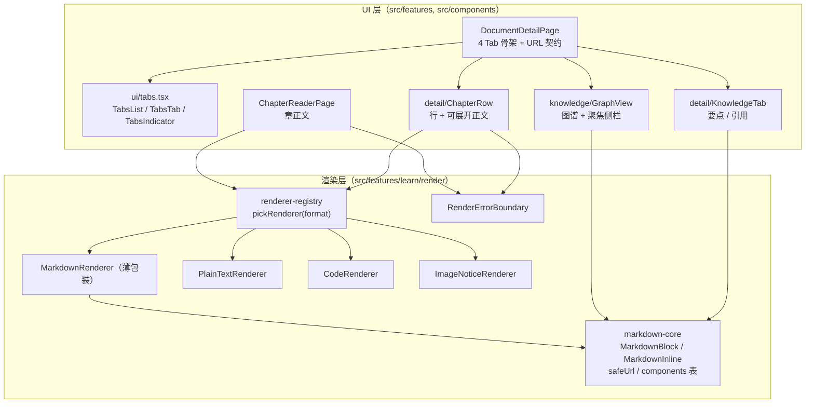
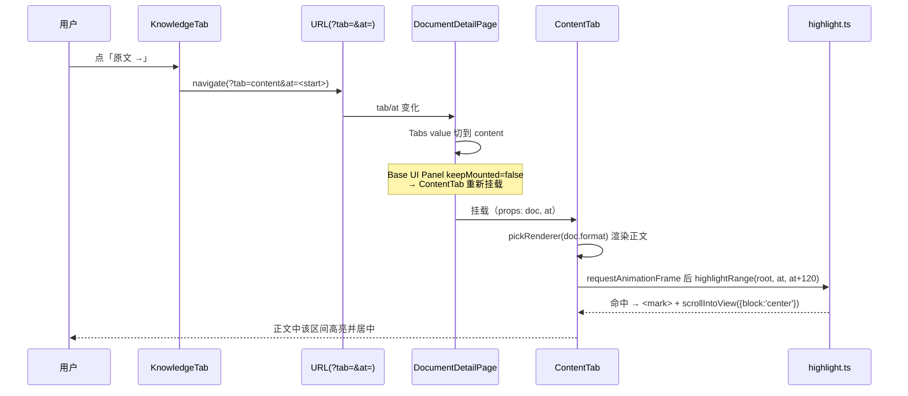

# 资料详情页 v2 优化（Tab 标记 / 按格式渲染 / 自适应）技术方案

| 字段 | 内容 |
|------|------|
| 作者 | Agent |
| 日期 | 2026-09-10 |
| 状态 | 已完成（2026-09-10；T1–T11 全部落地并验证，5 条本地提交） |
| 关联需求 | 用户 5 项要求：①锚定 Tab 需从样式上标记出来 ②章节详情需正确渲染内容（markdown 按 markdown 渲染）③关键知识点详情需正确渲染内容 ④Tab 宽度需占用整个宽度 ⑤页面需支持自适应 |
| 关联文档 | `docs/library-detail-page-design-2026-09.md`（上一轮 T1–T14）、`docs/library-module-design-2026-09.md`、`docs/ui-workbench-plan-2026-09.md`、`docs/ui-component-system-shadcn-design-2026-09.md` |
| 前置提交 | `d5666b6`（详情页 UI 层）、`c371706`（AI 链路）、`22115a2`（纯逻辑层） |

---

## 1. 背景

上一轮 T1–T14 把资料详情页从「功能不可用」修到「功能可用」：B1 修掉切分按钮死锁、B2 修掉 AI 按钮恒禁用、B3 引入 `render/` 按格式渲染、B4 让试卷 Tab 读真库。**功能通了，但视觉与内容呈现仍有 5 处问题**，其中 1 处属回归级缺陷。

### 1.1 五个问题的根因（已逐条对到代码，非猜测）

| # | 用户描述 | 根因 | 证据 |
|---|----------|------|------|
| ① | 锚定 Tab 需从样式上标记出来 | **`TabsIndicator` 漏绑定位与宽度** —— 宽度恒为 0，选中态完全不可见 | `src/components/ui/tabs.tsx:74-85` 的 className 只有 `absolute bottom-0 h-0.5 bg-primary`，**没有 `left` / `width`**；而 Base UI 1.8.0 的 `TabsIndicator` 只把量测结果写成 CSS 变量（`--active-tab-left` / `--active-tab-width` …）挂在元素自身 inline style 上，**不会自动设 `left`/`width`**（源码实证：`node_modules/@base-ui/react/tabs/indicator/TabsIndicator.js` 内 `const style = isTabSelected ? { [TabsIndicatorCssVars.activeTabLeft]: … } : undefined`） |
| ④ | Tab 宽度需占用整个宽度 | `TabsList` 写死 `w-fit` | `src/components/ui/tabs.tsx:29` |
| ② | 章节详情需正确渲染 | 章正文走 `ArticleBody` —— 自述「极简 Markdown 行渲染」，**只识别 `#` 标题**，其余原文 `pre-wrap` 直出；列表 / 表格 / 粗体 / 行内代码 / 引用块全部退化为源码文本 | `src/features/learn/ArticleBody.tsx:10-41`；消费方唯一：`ChapterReaderPage.tsx:25,185` |
| ③ | 关键知识点详情需正确渲染 | 两处 AI 生成文本当纯文本输出：`ref.point` / `ref.quote`（KnowledgeTab）与 `focusUnit.summary`（GraphView 聚焦侧栏） | `src/features/learn/detail/KnowledgeTab.tsx:177,180`；`src/features/knowledge/GraphView.tsx:315-316` |
| ⑤ | 页面需支持自适应 | 容器宽度与内边距写死：`PageContainer` = `max-w-5xl px-8`；章节阅读页 = `max-w-6xl px-8`；图谱 `flex gap-4` + 固定 288px 侧栏；章行进度条无断点保护 | `AppShell.tsx:249`；`ChapterReaderPage.tsx:159`；`GraphView.tsx:136,304` |

### 1.2 问题 ① 的严重性

T12 之前用的是 `grid grid-cols-4` 填充式选中态；T12 改成下划线式时，**下划线没生效，又去掉了填充态** —— 结果比改造前更差：用户在当前 Tab 上得不到任何视觉反馈，不知道自己在哪一页。这是本次唯一必须优先修的缺陷。

### 1.3 不做会怎样

详情页是资料库的主要落地页（列表 → 详情 → 章节 → 测评）。当前状态：Markdown 资料（本系统主要输入格式之一）在详情链路里全程以源码形式呈现；Tab 无法辨别当前位置；窗口 960~1600 区间体验不稳（Tauri 窗口 `minWidth: 960`）。

---

## 2. 方案目标

| 类型 | 描述 |
|------|------|
| **主要目标** | ① 详情页 4 个 Tab 等分铺满整行，选中 Tab 有明确下划线标记；② 章节正文、章节行展开预览、关键知识点文本、图谱侧栏摘要一律按 `doc.format` / markdown 正确渲染；③ 资料链路页面在 960×640 ~ 1920×1080 窗口区间自适应 |
| **非目标** | 1. **不改 AppShell 外壳**（侧栏固定 240px、Header、全局 `PageContainer` 默认行为）—— 用户已确认范围为「资料相关页面」<br>2. **不重做 GraphView 配色体系**：它仍用硬编码 `slate-*` / `indigo-*`，与 PLOS token 体系统一属独立议题（见 §3.3 风险 R3），本轮只改 summary 渲染与响应式布局<br>3. 不改 `src/domain`、`src/engine`、`src/ai`、`src/storage`（纯 UI 变更）<br>4. 不引入新依赖（`react-markdown` + `remark-gfm` 已于 `7163c4f` 安装）<br>5. 不做浏览器级校验（`rules/no-headless-browser-validation`）<br>6. 不改 AI 提示词与数据模型（字段不变，无迁移） |
| **成功标准** | 见下方验收清单 |

### 2.1 验收清单（可观察）

- [ ] SC-1：详情页 Tab 栏整行铺满，4 个 Tab 等宽；当前 Tab 下方有 2px `bg-primary` 圆角条，切换时平滑位移
- [ ] SC-2：markdown 资料的章节阅读页正文正确渲染（标题层级 / 无序列表 / 有序列表 / 表格 / 粗斜体 / 行内代码 / 代码块 / 引用块）
- [ ] SC-3：章节列表每行可展开正文预览，渲染规则同 SC-2；非 markdown 资料回落纯文本行渲染
- [ ] SC-4：关键知识点 Tab 的要点、原文引用、图谱侧栏 summary 均按 markdown 渲染（不再出现字面 `**`、`- `、`` ` ``）
- [ ] SC-5：窗口在 960×640 / 1280×800 / 1920×1080 三档下无横向滚动条、无控件重叠、无文字溢出容器
- [ ] SC-6：`npm run typecheck` 0 error；`npm run test:i18n` 通过；新增纯函数单测通过
- [ ] SC-7：渲染器抛错时降级为纯文本，不白屏（`RenderErrorBoundary` 仍生效）

---

## 3. 项目现状

### 3.1 相关代码与模块

| 文件 | 当前行为 | 本次处置 |
|------|----------|----------|
| `src/components/ui/tabs.tsx` | `TabsList` = `w-fit`；`TabsIndicator` 无 left/width | **修改**（核心修复） |
| `src/components/layout/AppShell.tsx` | `PageContainer` 只有一种宽度 `max-w-5xl px-8` | **修改**（加可选 `size`） |
| `src/features/learn/DocumentDetailPage.tsx` | 4 Tab 骨架；`setSearchParams({ tab })` 覆盖全部参数 | **修改** |
| `src/features/learn/detail/ChapterRow.tsx` | 整行 `<Link>`，无展开；进度条无断点保护 | **修改**（加展开） |
| `src/features/learn/detail/SplitTab.tsx` | 工具条 `flex-wrap`；未向 ChapterRow 传 `doc` | **修改**（小改） |
| `src/features/learn/detail/KnowledgeTab.tsx` | 要点 / 引用纯文本 `<p>` | **修改** |
| `src/features/learn/detail/PapersTab.tsx` | 列表已 `flex-wrap`；`ml-auto` 换行后悬空 | **修改**（小改） |
| `src/features/learn/ChapterReaderPage.tsx` | 正文走 `ArticleBody`；容器写死 | **修改** |
| `src/features/learn/ArticleBody.tsx` | 只认 `#` 的极简行渲染 | **删除**（逻辑与 `PlainTextRenderer` 重复，见 §8.8） |
| `src/features/learn/render/MarkdownRenderer.tsx` | 完整的 GFM 渲染 + 安全约束（无 rehype-raw / url 白名单 / img 不渲染） | **重构为薄包装** |
| `src/features/learn/render/PlainTextRenderer.tsx` / `CodeRenderer.tsx` / `ImageNoticeRenderer.tsx` / `RenderErrorBoundary.tsx` / `renderer-registry.ts` | 已可用 | 复用，不改（registry 除外见 §8.5） |
| `src/features/knowledge/GraphView.tsx` | 聚焦侧栏 `summary` 直出 `<p>`；`h-[560px]` 固定画布 + 288px 固定侧栏 | **修改** |
| `src/i18n/messages/zh.ts` / `en.ts` | `learn.detail.chapters` 等段已存在 | **修改**（成对新增键） |

### 3.2 相关文档与约定

- `docs/library-detail-page-design-2026-09.md` —— 上一轮方案，本次是其续作（沿用 `§8.x` 文件级结构习惯）
- `rules/react.mdc`、`rules/engineering-code-style.mdc`、`skills/ui-impl-tokens/SKILL.md` —— token-first、Tailwind 4、相对导入、i18n 双语、默认不加 `useCallback`
- `rules/code-structure-and-dependencies.mdc` —— 文件 ≤700 行；同逻辑 ≥10 行 × ≥3 处必须抽取
- `rules/no-headless-browser-validation.mdc` —— 不得主动起浏览器校验
- `skills/tauri-ipc` —— 本次无 IPC 变更，不适用

### 3.3 约束与依赖

| 项 | 值 / 说明 |
|----|-----------|
| Base UI | `@base-ui/react@1.8.0`；`Tabs.Indicator` **只输出 CSS 变量**，消费者必须自行绑定 `left`/`width`（本方案的修复依据） |
| Base UI | `Tabs.Panel` 的 `keepMounted` **默认 `false`** → 隐藏面板会卸载（源码 `TabsPanel.d.ts:33-36`）。因此「知识点 → 原文」跳转后 ContentTab 是**重新挂载**，高亮 effect 必定在可见状态下执行 ✅ |
| Tailwind | 4（CSS-first，无 config 文件）；颜色值唯一出处 `src/styles/main.css`；可用任意值语法 `left-[var(--x)]` |
| Tauri 窗口 | `minWidth: 960` / `minHeight: 640` / 默认 1280×800（`src-tauri/tauri.conf.json`）→ 自适应需覆盖 960 起 |
| 新增依赖 | **无** |
| 数据迁移 | **无**（不碰 domain 类型） |

**风险 R3（本方案不处理，仅登记）**：`GraphView.tsx` 硬编码 `slate-*`/`indigo-*` 与 `#xxxxxx` 色值，违反「颜色只在 `main.css`」约定。属独立样式审计议题，建议后续单开任务处理，本轮不顺手改（避免 diff 膨胀）。

---

## 4. 技术架构

### 4.1 总体架构



**关键点**：所有 markdown 渲染收敛到 `markdown-core` 一处；块级与行内共用同一份 `components` 表（避免 4 份重复的类名映射）。

### 4.2 模块职责

| 模块 | 职责 | 技术选型 |
|------|------|----------|
| `ui/tabs.tsx` | 下划线式 Tab 的**唯一定义处**：等分铺满 + Indicator 定位 | Base UI 1.8 + Tailwind 4 任意值 |
| `render/markdown-core.tsx` | markdown → React 的唯一映射：安全 URL、块级/行内两套组件表 | `react-markdown` + `remark-gfm` |
| `render/renderer-registry.ts` | `DocumentFormat` → 渲染器的纯函数分派 | 纯函数（无 React 依赖，可被单测覆盖） |
| `learn/chapter-preview.ts` | 章正文切片 + 上限截断的**纯函数**（可单测） | 纯 TS |
| `AppShell.PageContainer` | 页面容器宽度策略（默认 / wide 两档） | Tailwind 4 utility |

### 4.3 数据模型与 API

**无新增实体、无新增 API、无迁移。** 本次改动的事件契约：

```ts
/** 渲染器契约（`render/renderer-registry.ts`，保持不变）。 */
export interface DocumentRendererProps {
  /** 待渲染正文（调用方已完成截断）。 */
  text: string;
  doc: SourceDocument;
}
export type DocumentRenderer = (props: DocumentRendererProps) => ReactElement;

/** 新增：markdown 渲染的入参（不依赖 SourceDocument，供图谱等无 doc 场景复用）。 */
export interface MarkdownBlockProps {
  text: string;
  /** 追加类名（默认 text-[15px] leading-7 text-ink-2）。 */
  className?: string;
}
export interface MarkdownInlineProps {
  text: string;
  className?: string;
}

/** 新增：章正文切片结果（纯函数返回值）。 */
export interface ChapterPreview {
  /** 实际用于渲染的文本（已按上限截断）。 */
  text: string;
  /** 是否被截断（true → 提供「去阅读页」出口）。 */
  truncated: boolean;
  /** 该章正文总字符数（未截断）。 */
  chars: number;
}
```

**数据读写（必填项）**：**N/A —— 本次零读写。**

- 依据 `rules/layer-import-boundaries.mdc`：本次所有改动位于 UI 层与渲染层，不新增 `storage` 调用、不新增 `store` 字段。
- 章行展开预览的文本来自**内存中的 `doc.textPreview`**（详情页已加载 `doc`），切片为纯计算，**不落库、不写缓存**。
- 桌面能力（`invoke('vault_*' | 'llm_*')`）本次不涉及，无需 `isTauri()` 守卫。
- 现有唯一写入面（切分 / AI 分析）保持不变，本次不触碰。

### 4.4 状态与副作用

| 状态 | 归属 | 生命周期 | 说明 |
|------|------|----------|------|
| 当前 Tab（`tab`） | **URL**（`?tab=`） | 跨刷新保留 | 保持不变；本次修正为**合并式**更新（不丢 `at`）见 D2 |
| 原文锚点（`at`） | **URL**（`?at=`） | 跨刷新保留 | 保持不变 |
| 章行展开态（`open`） | 组件本地 `useState` | 组件卸载即失 | 有意不持久化：展开是临时检视动作 |
| 截图上限（`CHAPTER_PREVIEW_CHARS`） | 模块常量 | — | 纯函数默认参数，可被单测覆盖 |

副作用：`ContentTab` 的高亮 effect 保持不变（依赖 `at` / `doc.id` / `displayed`），因面板卸载语义（§3.3），跳转后必定在可见态执行。

---

## 5. 交互流程

### 5.1 主流程

1. 用户从资料库点卡片 → `/learn/doc/:docId?tab=content`（默认 content）
2. 用户点顶部第 3 个 Tab「关键知识点」→ URL 变 `?tab=knowledge`（**保留 `at`**）→ 面板切换 → **下划线平滑移动到第 3 个 Tab**（修复点）
3. 用户在某章要点下点「原文 →」→ `navigate('/learn/doc/:id?tab=content&at=<start>')` → Tab 切回「资料内容」→ ContentTab **重新挂载** → 渲染完成后按字符区间高亮并滚动居中
4. 用户回到「章节列表」Tab → 点某行右侧的展开按钮 → 行下方展开该章正文预览（按 `doc.format` 渲染）→ 再次点击收起
5. 用户点行内标题 → 跳 `/learn/chapter/:chapterId` 章节阅读页 → 正文按 `doc.format` 渲染（markdown 资料即完整 GFM）
6. 用户拖拽窗口从 1920 缩到 960：详情页内容区随窗口伸展/收缩，章行的进度条在 `sm` 以下隐藏，图谱侧栏由右侧栏切为下方堆叠

### 5.2 分支与异常流程

| 场景 | 触发条件 | 系统行为 | UI 反馈 |
|------|----------|----------|---------|
| 资料无正文 | `doc.textPreview` 为空 | 章行不渲染展开按钮 | 保持现状（不新增空态噪音） |
| 章节区间越界 | `contentRef.end > textPreview.length`（替换正文后未重切） | `chapterPreviewOf` 夹取到合法区间；`end <= start` 返回 `undefined` | 不渲染展开区，不报错 |
| 正文过长 | 单章 > `CHAPTER_PREVIEW_CHARS`（1200） | 优先在末尾空行处断开（避免切碎 markdown 语法） | 预览底部显示「去阅读页 →」 |
| markdown 渲染抛错 | 渲染器异常 | `RenderErrorBoundary` 捕获 | 降级 `PlainTextRenderer`，不白屏 |
| 非 markdown 资料 | `format ∈ {pdf, docx, epub, web, note, txt, image, custom}` | `pickRenderer` 回落 `PlainTextRenderer` / `ImageNoticeRenderer` | 行为与「资料内容」Tab 完全一致 |
| 老数据无 `keyPointRefs` | `chapter.keyPointRefs` 缺失 | 回退渲染 `chapter.keyPoints` | 仍走 `MarkdownInline`（TC-EDGE-01 不报错） |
| 窗口极窄（960） | 章行信息拥挤 | 进度条与百分比 `hidden sm:flex`；信息区 `flex-wrap` | 标题 `truncate`，不撑破容器 |
| `at` 非法 | `at < 0` / `NaN` / 超正文长度 | 保持现状：`undefined` 或 `highlightRange` 返回 `false` | 无高亮，不报错 |

### 5.3 时序图：知识点 → 原文锚定



---

## 6. 用户用例（User Cases）

### UC-01：识别当前所在 Tab

| 项 | 内容 |
|----|------|
| 角色 | 学习者 |
| 前置条件 | 打开任一有章节的资料详情页 |
| 主流程步骤 | 1. 页面加载，默认在「资料内容」<br>2. 观察 Tab 栏<br>3. 点击「关键知识点」<br>4. 观察 Tab 栏 |
| 期望结果 | Tab 栏铺满整行、4 项等宽；当前项文字为 `text-ink-1` 且下方有 2px 主色圆角条；切换时下划线平滑位移 |
| 异常/边界 | 键盘方向键切换 Tab 时，下划线同样跟随；窗口宽度 960 时 4 项仍等宽不换行 |

### UC-02：阅读章节正文（markdown 资料）

| 项 | 内容 |
|----|------|
| 角色 | 学习者 |
| 前置条件 | 已导入 `format = markdown` 的资料并完成切分 |
| 主流程步骤 | 1. 详情页 → 章节列表 → 点行内标题<br>2. 进入章节阅读页，观察左栏正文 |
| 期望结果 | 标题层级、无序/有序列表、表格（含外框与横向滚动）、粗斜体、行内代码、代码块（等宽 + 横向滚动）、引用块均按 GFM 正确渲染；无字面 `##` / `**` / `|` |
| 异常/边界 | 外链只放行 http/https/mailto；正文内图片不渲染（安全约束不变） |

### UC-03：在详情页内预览某章正文

| 项 | 内容 |
|----|------|
| 角色 | 学习者 |
| 前置条件 | 同 UC-02 |
| 主流程步骤 | 1. 详情页 → 章节列表<br>2. 点某行右侧展开按钮<br>3. 观察行下方<br>4. 再次点击 |
| 期望结果 | 行下方展开该章正文预览，渲染规则同 UC-02；按钮 `aria-expanded` 正确切换、图标旋转；再次点击收起 |
| 异常/边界 | 资料无正文 → 不显示展开按钮；该章正文为空 → 不渲染展开区 |

### UC-04：查看关键知识点

| 项 | 内容 |
|----|------|
| 角色 | 学习者 |
| 前置条件 | 已跑过「AI 分析要点」；图谱已有概念 |
| 主流程步骤 | 1. 详情页 → 关键知识点 Tab<br>2. 观察要点列表与各条「原文」引用<br>3. 在图谱上单击一个节点，观察右侧聚焦侧栏 |
| 期望结果 | 要点与引用中的 markdown 标记被正确渲染（加粗/行内代码/删除线/链接），不再出现字面语法；侧栏 `summary` 段落/列表正确排版 |
| 异常/边界 | 概念无 `summary` → 显示既有「暂无摘要」文案；要点无 `keyPointRefs` → 回退渲染 `keyPoints` |

### UC-05：窗口自适应

| 项 | 内容 |
|----|------|
| 角色 | 学习者 |
| 前置条件 | 桌面端运行 |
| 主流程步骤 | 1. 打开详情页，把窗口拖到 960 宽<br>2. 再拖到 1920 宽<br>3. 切到关键知识点 Tab，重复 |
| 期望结果 | 两个极端宽度下均无横向滚动条、无控件重叠；宽屏内容区随窗口伸展（不再是固定 1024px 居中留白）；窄屏章行隐藏进度条、图谱侧栏堆叠到画布下方 |
| 异常/边界 | 高度 640 时内容可滚动查看，底栏不遮挡内容 |

### UC-06：渲染失败降级

| 项 | 内容 |
|----|------|
| 角色 | 学习者 |
| 前置条件 | 渲染器抛错（人为构造异常 markdown 或未来渲染器缺陷） |
| 主流程步骤 | 1. 打开该章正文 |
| 期望结果 | 内容区降级为纯文本行渲染，页面其余部分正常，控制台有一条 `[render]` 警告 |
| 异常/边界 | 切换资料 / 展开别的章后，错误态自动重置（`resetKey` 变化） |

---

## 7. 线框 UI（Wireframe）

### 7.1 Tab 栏 —— 修复前 / 后

**修复前**（`TabsList: w-fit`；Indicator 宽度 0）：

```
┌──────────────────────────────────────────────────────────────────────┐
│ 资料内容      章节列表      关键知识点      章节测评试卷   ← 无任何选中标记
├──────────────────────────────────────────────────────────────────────┤   ← 整行灰线
│ (内容区只占 1024px 居中，右侧大片留白)
```

**修复后**（`TabsList: w-full` + Tab `flex-1`；Indicator 绑定 left/width）：

```
┌──────────────────────────────────────────────────────────────────────┐
│    资料内容    │    章节列表   │   关键知识点  │   章节测评试卷      │
│                ▔▔▔▔▔▔▔▔▔▔▔▔▔▔▔▔▔▔▔▔▔▔▔▔▔▔▔▔  ← 2px bg-primary 圆角条
├──────────────────────────────────────────────────────────────────────┤   ← 与下划线共线（-bottom-px 压住）
│ (内容区随窗口伸展至 1600px 上限)
```

- 布局：`flex w-full items-stretch gap-1 border-b border-line`；Tab = `min-w-0 flex-1 px-2 pb-2 pt-1 text-center`
- 视觉 token：未选 `text-ink-3` / hover `text-ink-2` / 选中 `text-ink-1`；下划线 `bg-primary`
- 过渡：`transition-[left,width] duration-200 ease-out`；`motion-reduce:transition-none`

### 7.2 章节行 —— 默认态 / 展开态

**默认（宽屏）**：

```
┌────────────────────────────────────────────────────────────────┐
│ 1  引论：为什么需要向量检索              1,248 字 · 3 要点        │
│    [已学]                       ▓▓▓▓▓▓▓░░░ 62%          ⌄     │
└────────────────────────────────────────────────────────────────┘
                                  ↑ 标题区=Link  ↑进度条(sm+)  ↑展开按钮
```

**默认（窄屏 < 640）**：

```
┌────────────────────────────────────────────────┐
│ 1  引论：为什么需要向量检索            [已学] ⌄  │
│    1,248 字 · 3 要点                           │
└────────────────────────────────────────────────┘
       ↑ 进度条与百分比 hidden sm:flex；信息区换行
```

**展开态**：

```
┌────────────────────────────────────────────────────────────────┐
│ 1  引论：为什么需要向量检索              1,248 字 · 3 要点      │
│    [已学]                       ▓▓▓▓▓▓▓░░░ 62%          ⌃     │
├────────────────────────────────────────────────────────────────┤   ← border-t border-line
│  ## 引论：为什么需要向量检索                    ← GFM 渲染结果  │
│                                                （text-preview）│
│  - 关键词检索的召回瓶颈在于**同义不同词**…                     │
│                                                                │
│  去阅读页 →                                                     │
└────────────────────────────────────────────────────────────────┘
```

- 组件映射：容器从 `primitives.Card`/`div` + `ui/button`（展开按钮用 `variant="ghost" size="icon"`）；徽标复用 `chapterBadge()`；进度条复用现有内联实现
- 设计 token：`border-line` / `bg-surface` / `text-ink-1..3` / `bg-subtle`

### 7.3 关键知识点 Tab —— 要点与引用

```
章要点                                    [AI 分析要点]
已带原文引用 3/4 章

┌─────────────────────────────────────────────────────────────┐
│ 1  引论：为什么需要向量检索                                  │
│   • **召回率**是本文的核心指标          ← MarkdownInline      │
│     │ 原文：本文把 `recall@k` 定义为…   ← MarkdownInline      │
│     │ 原文 →                            ← 跳资料内容 Tab      │
└─────────────────────────────────────────────────────────────┘
```

- 引用块保持 `border-l-2 border-line pl-2` 的既有骨架；内部文本改用 `MarkdownInline`（继承父级 12px 字号）
- 图谱聚焦侧栏 `summary` 用 `MarkdownBlock`（块级：段落/列表正常排版）

### 7.4 章节阅读页 —— 宽屏 / 窄屏

**宽屏（≥1024）**：左正文 / 右四区并排，容器随窗口伸展到 1500px

```
┌──────────────────────────────────────────────────────────────────────┐
│ ← 资料库                                                            │
│ 资料标题 · 第 3 章                                          [已学]   │
├────────────────────────────────────┬─────────────────────────────────┤
│ 第 3 章 标题                        │ 掌握度                   62%   │
│ ─────────────────────────────────  │ ▓▓▓▓▓▓▓▓▓▓▓░░░░░               │
│ (GFM 渲染的章正文)                  │ 为什么值得学                    │
│                                     │ 本章知识                        │
│                                     │ 证据来源                        │
└────────────────────────────────────┴─────────────────────────────────┘
```

**窄屏（<1024）**：右四区堆叠到正文下方，底栏 `flex-wrap`

```
┌──────────────────────────────────┐
│ ← 资料库                          │
│ 资料标题 · 第 3 章        [已学]  │
├──────────────────────────────────┤
│ 第 3 章 标题                      │
│ (GFM 渲染的章正文)                │
├──────────────────────────────────┤
│ 掌握度                     62%   │
│ 为什么值得学 / 本章知识 / 证据     │
└──────────────────────────────────┘
│                 [标记学完]        │  ← sticky 底栏，窄屏换行
```

### 7.5 其他状态

| 状态 | 表现 |
|------|------|
| 加载中 | 保持现状（`t.common.loading` 居中） |
| 资料无正文 | 章行无展开按钮；阅读页显示既有「无正文快照」文案 |
| 渲染失败 | `RenderErrorBoundary` → `PlainTextRenderer` 输出，页面其余部分不受影响 |
| 图谱无概念 | 保持既有空态卡（不新增文案） |

### 7.6 交互说明

- 展开按钮：`aria-expanded` + `aria-label`（i18n 文案），`focus-visible:ring-2 ring-ring/40`；`ChevronDown` 展开时 `rotate-180`
- hover：章行 `hover:bg-subtle`；标题 `hover:text-primary`
- 键盘：Tab 键序为 【标题 Link → 展开按钮】；Tab 栏支持 Base UI 原生方向键切换
- 无新增弹层 / Toast

---

## 8. 涉及文件及改动伪代码

> 覆盖 **15** 个文件：修改 11、新增 3、删除 1。

### 8.1 `src/components/ui/tabs.tsx`（修改）★ 核心修复

**改动说明**：`TabsList` 铺满整行；Tab 等分；`TabsIndicator` 绑定 Base UI 提供的 CSS 变量作为 `left` / `width`。

```tsx
// 伪代码

function TabsList({ className, ...props }: TabsListProps) {
  return (
    <BaseTabs.List
      data-slot="tabs-list"
      className={cn(
        // 改动：w-fit → w-full；gap-6 → gap-1（等分后不需要大间距）
        "relative flex w-full items-stretch gap-1 border-b border-line bg-transparent p-0",
        className,
      )}
      {...props}
    />
  );
}

function TabsTab({ className, ...props }: TabsTabProps) {
  return (
    <BaseTabs.Tab
      data-slot="tabs-tab"
      className={cn(
        // 改动：新增 flex-1 / min-w-0 / text-center；移除 border-b-2 border-transparent 与 -mb-px
        // （选中态改由 TabsIndicator 单独承担，避免 2px 落差与双重下划线）
        "min-w-0 flex-1 whitespace-nowrap px-2 pb-2 pt-1 text-center text-sm font-medium",
        "text-ink-3 transition-colors hover:text-ink-2",
        "focus-visible:outline-none focus-visible:ring-2 focus-visible:ring-ring/40",
        "data-selected:text-ink-1",
        className,
      )}
      {...props}
    />
  );
}

function TabsIndicator({ className, ...props }: TabsIndicatorProps) {
  return (
    <BaseTabs.Indicator
      data-slot="tabs-indicator"
      className={cn(
        // ★ 修复：Base UI 只给 CSS 变量，必须自己绑到 left / width，
        //   否则宽度恒为 0 —— 下划线不可见（本次问题 ① 的根因）
        "absolute left-[var(--active-tab-left)] w-[var(--active-tab-width)]",
        // -bottom-px：压住 TabsList 的 border-b，避免「2px 主色 + 1px 灰线」双层线
        "-bottom-px h-0.5 rounded-full bg-primary",
        "transition-[left,width] duration-200 ease-out motion-reduce:transition-none",
        className,
      )}
      {...props}
    />
  );
}
```

> 文件头注释补一条踩坑记录：**Base UI 的 `Tabs.Indicator` 不自动定位**，必须消费 `--active-tab-left/-width`。

### 8.2 `src/components/layout/AppShell.tsx`（修改）

**改动说明**：给 `PageContainer` 加**可选** `size`，默认分支逐字保持原样（零回归），`wide` 供详情页使用。

```tsx
// 伪代码

export function PageContainer({
  children,
  size = "default",
}: {
  children: ReactNode;
  /** default = 既有 1024px 居中（全站默认，勿改）；wide = 资料详情页，随窗口伸展。 */
  size?: "default" | "wide";
}) {
  const cls =
    size === "wide"
      ? "mx-auto w-full max-w-[1600px] px-4 py-6 sm:px-6 lg:px-8 lg:py-8"
      : "mx-auto max-w-5xl px-8 py-8"; // ← 原样保留
  return <div className={cls}>{children}</div>;
}
```

### 8.3 `src/features/learn/DocumentDetailPage.tsx`（修改）

**改动说明**：容器切 `wide`；URL 更新改合并式（保留 `at`）；顶部工具栏加响应式保护。

```tsx
// 伪代码

export default function DocumentDetailPage() {
  // …状态不变…
  const tab = (searchParams.get('tab') || 'content') as TabKey;
  const at = parseAt(searchParams.get('at')); // 抽出的小工具（保持既有非法值语义）

  /** 改动：合并式更新 —— 原来 setSearchParams({tab}) 会把 at 一起丢掉，锚定随之失效。 */
  const selectTab = (v: string) => {
    setSearchParams((prev) => {
      const next = new URLSearchParams(prev);
      next.set('tab', v);
      return next;
    }, { replace: true });
  };

  return (
    <PageContainer size="wide">
      {/* 改动：窄屏换行；标题 truncate，长资料名不撑破 */}
      <header className="mb-4 flex flex-wrap items-center justify-between gap-2">
        {/* …返回按钮 + 标题 + 来源·日期，title/来源均加 min-w-0 truncate… */}
      </header>

      <Tabs value={tab} onValueChange={selectTab} className="mt-6">
        <TabsList>
          {TAB_ITEMS.map((it) => (
            <TabsTab key={it.value} value={it.value}>
              {t.learn.detail.tabs[it.key]}
            </TabsTab>
          ))}
          <TabsIndicator />
        </TabsList>

        {/* 改动：SplitTab 新增 doc prop（章行展开预览需要 format + textPreview） */}
        <TabsPanel value="split" className="mt-4">
          <SplitTab doc={doc} chapters={chapters} learner={learner} onChanged={handleRefresh} />
        </TabsPanel>
        {/* 其余面板不变 */}
      </Tabs>
    </PageContainer>
  );
}
```

### 8.4 `src/features/learn/render/markdown-core.tsx`（新增）

**改动说明**：把现有 `MarkdownRenderer` 里的 `safeUrl` 与 `components` 表**原样搬过来**，并派生「行内」一套；导出 `MarkdownBlock` / `MarkdownInline` 两个组件。这样图谱（无 `SourceDocument`）与短文本场景都能复用，避免复制第 2、3 份类名映射表（满足 ≥10 行 × ≥3 处抽取约束）。

```tsx
// 伪代码
import Markdown from "react-markdown";
import remarkGfm from "remark-gfm";
import type { Components } from "react-markdown";

/** 只放行安全协议（从 MarkdownRenderer 原样迁移）。 */
export function safeUrl(url: string): string {
  return /^(https?:\/\/|mailto:)/i.test(url) ? url : "";
}

/** 块级组件表（原 MarkdownRenderer 的 components，逐条迁移，类名不变）。 */
export const markdownComponents: Components = { h1:…, ul:…, table:…, pre:…, img: () => null, /* … */ };

/** 行内派生：p 不再包 <p>（避免在 12px 引用块里塞入 15px 段落与额外行高）。 */
export const inlineMarkdownComponents: Components = {
  ...markdownComponents,
  p: ({ children }) => <>{children}</>,
  ul: ({ children }) => <span className="block">{children}</span>,
  ol: ({ children }) => <span className="block">{children}</span>,
  li: ({ children }) => <span>· {children}</span>,
  // 标题降级为加粗行内，避免短要点里出现大标题
  h1: inlineStrong, h2: inlineStrong, h3: inlineStrong, h4: inlineStrong,
};

export function MarkdownBlock({ text, className }: MarkdownBlockProps) {
  return (
    <div data-testid="md-block" className={className ?? "text-[15px] leading-7 text-ink-2"}>
      <Markdown remarkPlugins={[remarkGfm]} urlTransform={safeUrl} components={markdownComponents}>
        {text}
      </Markdown>
    </div>
  );
}

export function MarkdownInline({ text, className }: MarkdownInlineProps) {
  return (
    <span data-testid="md-inline" className={className ?? "leading-5"}>
      <Markdown remarkPlugins={[remarkGfm]} urlTransform={safeUrl} components={inlineMarkdownComponents}>
        {text}
      </Markdown>
    </span>
  );
}
```

### 8.5 `src/features/learn/render/MarkdownRenderer.tsx`（修改）

**改动说明**：退化为薄包装，保持 `DocumentRendererProps` 契约不变（`renderer-registry` 无需改动）。`img` 不渲染、无 `rehype-raw`、URL 白名单三条安全约束全部由 core 继承。

```tsx
// 伪代码
import { MarkdownBlock } from "./markdown-core";
import type { DocumentRendererProps } from "./renderer-registry";

export default function MarkdownRenderer({ text }: DocumentRendererProps) {
  return <MarkdownBlock text={text} />;
}
```

### 8.6 `src/features/learn/chapter-preview.ts`（新增，纯 TS 可单测）

**改动说明**：抽出「章正文切片 + 上限截断 + 字数」三个纯函数。`ChapterRow`（预览）与 `SplitTab`（总字数）共用同一口径，避免三处各写一遍区间计算。

```ts
// 伪代码
import type { Chapter, SourceDocument } from "../../domain";

/** 预览上限：单章一次最多渲染这么多字符。 */
export const CHAPTER_PREVIEW_CHARS = 1200;

/** 章正文长度（单一口径）：SplitTab 的「共 N 字」与 ChapterRow 的「N 字」共用。 */
export function chapterCharCount(chapter: Pick<Chapter, "contentRef">): number {
  return Math.max(0, chapter.contentRef.end - chapter.contentRef.start);
}

/** 章正文切片；越界夹取，空/非法区间返回 undefined（不给 UI 造空壳）。 */
export function chapterPreviewOf(
  doc: Pick<SourceDocument, "textPreview">,
  chapter: Pick<Chapter, "contentRef">,
  limit: number = CHAPTER_PREVIEW_CHARS,
): ChapterPreview | undefined {
  const body = doc.textPreview;
  if (!body) return undefined;
  const start = Math.max(0, Math.min(chapter.contentRef.start, body.length));
  const end = Math.max(start, Math.min(chapter.contentRef.end, body.length));
  if (end <= start) return undefined;

  const slice = body.slice(start, end);
  if (slice.length <= limit) return { text: slice, truncated: false, chars: slice.length };

  // 优先在末尾空行处断开：避免把 markdown 的 ``` 围栏 / 表格行切一半。
  const cut = slice.lastIndexOf("\n\n", limit);
  const at = cut >= limit * 0.6 ? cut : limit;
  return { text: slice.slice(0, at), truncated: true, chars: slice.length };
}
```

### 8.7 `src/features/learn/ChapterReaderPage.tsx`（修改）

**改动说明**：正文从 `ArticleBody` 换成 `pickRenderer(doc.format)` + `RenderErrorBoundary`；容器与底栏做响应式。

```tsx
// 伪代码
import { pickRenderer } from "./render/renderer-registry";
import PlainTextRenderer from "./render/PlainTextRenderer";
import RenderErrorBoundary from "./render/RenderErrorBoundary";

export default function ChapterReaderPage() {
  // …数据加载 / 状态机 / 证据区全部不变…
  const body = doc.textPreview?.slice(chapter.contentRef.start, chapter.contentRef.end) ?? "";
  const Renderer = pickRenderer(doc.format); // 与「资料内容」Tab 同源，规则一致

  return (
    <div className="mx-auto w-full max-w-6xl px-4 py-6 sm:px-6 lg:px-8 xl:max-w-[1500px]">
      {/* …面包屑不变… */}
      <div className="grid gap-6 lg:grid-cols-[minmax(0,1fr)_300px]">
        <Card className="px-4 py-5 sm:px-8 sm:py-7">
          <h1 className="text-xl font-semibold tracking-tight text-ink-1">{/* title */}</h1>
          <div className="mt-4 border-t border-line pt-5 break-words">
            {body.length > 0 ? (
              <RenderErrorBoundary
                resetKey={`${doc.id}:${chapter.id}:${doc.format}`}
                fallback={<PlainTextRenderer text={body} doc={doc} />}
              >
                <Renderer text={body} doc={doc} />
              </RenderErrorBoundary>
            ) : (
              <p className="text-sm text-ink-3">{t.noSnapshot}</p>
            )}
          </div>
        </Card>
        {/* …右侧四区不变… */}
      </div>

      {/* 改动：底栏窄屏换行，避免按钮与提示挤在一行 */}
      <div className="sticky bottom-4 z-10 mt-6 flex flex-wrap items-center justify-between gap-3 rounded-2xl border border-line bg-surface/90 px-4 py-3.5 shadow-lg backdrop-blur sm:px-5">
        {/* …不变… */}
      </div>
    </div>
  );
}
// 删除：import ArticleBody from "./ArticleBody";
```

### 8.8 `src/features/learn/ArticleBody.tsx`（删除）

**改动说明**：切完阅读页后它**不再有消费方**（全仓唯一引用是 `ChapterReaderPage.tsx:25,185`），而它的行渲染逻辑与 `render/PlainTextRenderer.tsx` 几乎逐字重复。留着就是第二份真源。按 `rules/code-structure-and-dependencies` 删除，避免后续改渲染规则时漏改一处。

> 删除前确认：`grep -rn "ArticleBody" src` 仅剩自身文件与注释 → 可安全删除（执行时再核一次）。

### 8.9 `src/features/learn/detail/ChapterRow.tsx`（修改）

**改动说明**：新增可展开正文；整行 `<Link>` 改为「容器 div + 标题 Link + 展开按钮」（`<button>` 不能嵌在 `<a>` 里）；进度条窄屏隐藏。

```tsx
// 伪代码
import { useMemo, useState } from 'react';
import { ChevronDown } from 'lucide-react';
import { Link } from 'react-router-dom';
import { pickRenderer } from '../render/renderer-registry';
import PlainTextRenderer from '../render/PlainTextRenderer';
import RenderErrorBoundary from '../render/RenderErrorBoundary';
import { chapterCharCount, chapterPreviewOf } from '../chapter-preview';

interface ChapterRowProps {
  chapter: Chapter;
  index: number;
  learner?: LearnerState | null;
  /** 新增可选：展开预览需要 format（选渲染器）与 textPreview（取正文）。缺省则不显示展开按钮。 */
  doc?: SourceDocument;
}

export function ChapterRow({ chapter, index, learner, doc }: ChapterRowProps) {
  const { m } = useI18n();
  const t = m.learn.detail;
  const [open, setOpen] = useState(false);

  // …mastery / badge / chars 计算不变，chars 改用 chapterCharCount(chapter)…
  const preview = useMemo(() => (doc ? chapterPreviewOf(doc, chapter) : undefined), [doc, chapter]);
  const Renderer = useMemo(() => (doc ? pickRenderer(doc.format) : null), [doc]);

  return (
    <div className="rounded-lg border border-line bg-surface transition-colors hover:bg-subtle">
      <div className="flex items-center gap-3 px-4 py-3">
        <div className="min-w-6 text-center text-xs font-medium text-ink-3">{index}</div>

        {/* 标题区仍是 Link（跳章节阅读页），与展开按钮平级，不再嵌套 */}
        <Link to={`/learn/chapter/${chapter.id}`} className="min-w-0 flex-1">
          <p className="truncate text-sm font-medium text-ink-1 hover:text-primary">{chapter.title}</p>
          <p className="mt-0.5 flex flex-wrap items-center gap-x-2 text-xs text-ink-3">{/* chars / points */}</p>
        </Link>

        <span className={`shrink-0 rounded-full border px-2 py-0.5 text-xs font-medium ${badge.cls}`}>
          {badge.label}
        </span>

        {/* 改动：进度条仅 sm 及以上可见，避免 960 窄窗挤压 */}
        <div className="hidden shrink-0 items-center gap-2 sm:flex">{/* 进度条 + pct */}</div>

        {/* 改动：原 ChevronRight（整行 Link 的装饰）→ 真正的展开开关 */}
        {doc && preview ? (
          <Button
            variant="ghost" size="icon" aria-expanded={open}
            aria-label={open ? t.chapters.collapse : t.chapters.expand}
            onClick={() => setOpen((v) => !v)}
            className="h-7 w-7 shrink-0"
          >
            <ChevronDown className={`h-4 w-4 transition-transform ${open ? 'rotate-180' : ''}`} />
          </Button>
        ) : null}
      </div>

      {open && preview && Renderer && doc ? (
        <div className="border-t border-line px-4 py-3">
          <RenderErrorBoundary
            resetKey={`${doc.id}:${chapter.id}:${doc.format}`}
            fallback={<PlainTextRenderer text={preview.text} doc={doc} />}
          >
            <Renderer text={preview.text} doc={doc} />
          </RenderErrorBoundary>
          {preview.truncated ? (
            <Link to={`/learn/chapter/${chapter.id}`} className="mt-3 inline-block text-xs text-primary hover:underline">
              {t.chapters.openFull}
            </Link>
          ) : null}
        </div>
      ) : null}
    </div>
  );
}
```

> **行为取舍**：整卡不再是单一链接（改为标题可点）。这是容纳展开按钮的必然代价；已用 `hover:bg-subtle` 保留整行 hover 反馈。

### 8.10 `src/features/learn/detail/SplitTab.tsx`（修改）

**改动说明**：向 `ChapterRow` 传 `doc`；统计口径改用 `chapterCharCount`（单一真源）；工具条窄屏不再「文字与按钮各占一半」。

```tsx
// 伪代码
const totalChars = useMemo(() => chapters.reduce((s, c) => s + chapterCharCount(c), 0), [chapters]);

// …工具条：外层已 flex-wrap；改动是把「信息区」与「按钮区」在窄屏分两行排实
<div className="flex flex-wrap items-center gap-3 rounded-lg border border-line bg-surface p-3">
  <div className="flex min-w-0 flex-wrap items-center gap-1.5 text-xs text-ink-2">{/* … */}</div>
  <div className="flex w-full items-center gap-2 sm:ml-auto sm:w-auto">
    {/* 按钮组 */}
  </div>
</div>

// 章节列表
{chapters.map((ch, idx) => (
  <ChapterRow key={ch.id} chapter={ch} index={idx + 1} learner={learner} doc={doc} />  // ← 新增 doc
))}
```

### 8.11 `src/features/learn/detail/KnowledgeTab.tsx`（修改）

**改动说明**：要点 `ref.point`、引用 `ref.quote`、回退 `keyPoints` 三处改走 `MarkdownInline`。这是「问题 ③」在详情页内的落点。

```tsx
// 伪代码
import { MarkdownInline } from '../render/markdown-core';

{ch.keyPointRefs.map((ref, i) => (
  <li key={i} className="text-xs text-ink-2">
    <span className="mr-1">•</span>
    <MarkdownInline text={ref.point} />          {/* 改动：原本 <p>• {ref.point}</p> */}
    <div className="mt-1 border-l-2 border-line pl-2">
      <p className="text-ink-3">
        {t.knowledge.refLabel}：<MarkdownInline text={ref.quote} className="text-ink-3" />
      </p>
      <button type="button" onClick={() => goSource(ref.start)}>{t.knowledge.goSource}</button>
    </div>
  </li>
))}
// 回退分支同理：<li key={i}><span className="mr-1">•</span><MarkdownInline text={kp} /></li>
```

### 8.12 `src/features/knowledge/GraphView.tsx`（修改）

**改动说明**：聚焦侧栏 `summary` 改用 `MarkdownBlock`；根容器与画布做响应式（侧栏在窄屏堆到画布下方）。**不改配色**（R3，另议）。

```tsx
// 伪代码
import { MarkdownBlock } from "../learn/render/markdown-core";

// 根容器：窄屏纵向堆叠
<div className="flex flex-col gap-4 lg:flex-row">
  {/* 画布：高度分档，不再固定 560px */}
  <div className="relative min-w-0 flex-1 overflow-hidden rounded-xl border border-slate-200 bg-white">
    <svg className="h-[320px] w-full touch-none select-none sm:h-[440px] lg:h-[560px]" … />
  </div>

  {/* 侧栏：窄屏整宽，宽屏 288px */}
  <aside className="w-full shrink-0 lg:w-72">
    {focusUnit ? (
      <div className="sticky top-4 space-y-4">
        <div className="rounded-xl border border-slate-200 bg-white p-4 shadow-sm">
          {/* …标题 + BandBadge 不变… */}
          {focusUnit.summary ? (
            <MarkdownBlock text={focusUnit.summary} className="mt-2 text-sm leading-6 text-slate-600" />
          ) : (
            <p className="mt-2 text-xs text-slate-400">{k.noSummary}</p>
          )}
          {/* …按钮 / 缺口提示不变… */}
        </div>
        {/* …关系清单不变… */}
      </div>
    ) : (/* …空态不变… */)}
  </aside>
</div>
```

### 8.13 `src/features/learn/detail/PapersTab.tsx`（修改）

**改动说明**：仅修 `ml-auto` 在换行后「右侧悬空」的问题 —— 窄屏让行内元素左对齐、按钮换行后不贴右。

```tsx
// 伪代码：三处 `ml-auto`（docAdvice / 未出卷 / 已出卷）改为
className="text-xs text-primary hover:underline sm:ml-auto"
```

### 8.14 `src/i18n/messages/zh.ts` + `en.ts`（修改，成对）

**改动说明**：新增 4 个键（必须 zh/en 同结构，否则 `test:i18n` 失败）。

```ts
// zh.ts —— learn.detail.chapters 段内新增
expand: "展开正文",
collapse: "收起正文",
openFull: "去阅读页 →",
previewEmpty: "这一章没有正文快照。",

// en.ts —— 同段同名
expand: "Show text",
collapse: "Hide text",
openFull: "Open reader →",
previewEmpty: "No text snapshot for this chapter.",
```

> 其余文案**全部复用既有键**（`tabs.*`、`chapters.chars/keyPoints/totalChars`、`knowledge.refLabel/goSource`），零新增。

### 8.15 `package.json`（修改）

```jsonc
// 新增一个纯函数单测脚本（与既有 test:library 风格一致）
"test:preview": "node --experimental-strip-types --no-warnings --import ./tests/register-loader.mjs tests/library-chapter-preview.test.ts",
"test:library": "npm run test:anchor && npm run test:advice && npm run test:keypoint && npm run test:preview"
```

### 8.16 `tests/library-chapter-preview.test.ts`（新增）

```ts
// 伪代码：覆盖 chapterPreviewOf / chapterCharCount 的边界
// 1. 正常区间 → 原文精确切片，truncated=false
// 2. 超上限 → 优先在末尾空行断开，truncated=true，chars=整章长度
// 3. end > textPreview.length（替换正文后未重切）→ 夹取，不越界、不抛
// 4. end <= start / textPreview 缺失 → undefined
// 5. chapterCharCount 为 0 / 正常值
```

---

## 9. 任务清单（Tasks）

| ID | 任务 | 依赖 | 预估复杂度 | 对应需求 |
|----|------|------|------------|----------|
| T1 | `ui/tabs.tsx`：Indicator 绑定 `--active-tab-left/-width`；List 铺满、Tab 等分 | — | S | ① ④ |
| T2 | `PageContainer` 加 `size`；详情页切 `wide`、URL 合并式更新、顶部工具栏响应式 | T1 | S | ⑤ |
| T3 | `render/markdown-core.tsx` 抽取 + `MarkdownRenderer` 改薄包装 | — | M | ② ③ |
| T4 | `ArticleBody` → `pickRenderer` 换装；删除 `ArticleBody.tsx` | T3 | M | ② |
| T5 | `chapter-preview.ts` 纯函数 + `ChapterRow` 展开正文 + `SplitTab` 传 `doc` | T3 T4 | L | ② |
| T6 | `KnowledgeTab` 要点/引用走 `MarkdownInline` | T3 | S | ③ |
| T7 | `GraphView` summary 走 `MarkdownBlock` + 响应式布局 | T3 | M | ③ ⑤ |
| T8 | `SplitTab` 工具条 / `PapersTab` `ml-auto` / `ChapterRow` 进度条断点收尾 | T2 T5 | S | ⑤ |
| T9 | i18n zh/en 成对新增 4 键 | T5 | S | — |
| T10 | `tests/library-chapter-preview.test.ts` + `package.json` 脚本 | T5 | S | — |
| T11 | 验证与收尾：typecheck / test:i18n / test:library / 文档同步 / 提交 | 全部 | S | 全部 |

---

## 10. 实施步骤

按**批次**执行（每批跑一次 `npm run typecheck`，归零再进下一批）：

### 批次一：T1 → T2（Tab 栏 + 页面骨架）
- 输入：现状代码；输出：Tab 可视、铺满、详情页容器与 URL 契约就绪
- 验证：typecheck 0 error；代码自审 `TabsIndicator` 含 `left-[var(--active-tab-left)]` 与 `w-[var(--active-tab-width)]`

### 批次二：T3 → T4（渲染层收敛 + 阅读页换装）
- 输入：`MarkdownRenderer` 现有 components 表；输出：`markdown-core` + 薄包装 + 阅读页 GFM
- 验证：`grep -rn "ArticleBody" src` 为空；typecheck 0 error

### 批次三：T5 → T6（章行展开 + 知识点文本）
- 输入：`chapter-preview` 纯函数；输出：可展开章行、要点/引用正确渲染
- 验证：`npm run test:library` 全绿（含新 preview 组）

### 批次四：T7 → T8（图谱 + 断点收尾）
- 输出：图谱侧栏 summary 渲染 + 窄屏堆叠；三处 `ml-auto` 修正
- 验证：typecheck 0 error；逐文件核对断点类名

### 批次五：T9 → T10 → T11（文案 / 单测 / 收尾）
- 验证：`test:i18n` 通过；`test:library` 通过；更新方案状态与 runbook；按 `rules/commit-conventions` 分组提交（**仅本地，不 push**）

**回滚策略**：本次为纯 UI 改动且无数据写入 —— 逐批次独立提交，任一批次出问题直接 `git revert <sha>` 或 `git checkout <sha>~1 -- <paths>` 即可；无迁移、无状态残留。

---

## 11. 测试方案

### 11.1 测试范围与策略

| 层级 | 工具/方式 | 覆盖重点 | 不负责 |
|------|-----------|----------|--------|
| 单元 | `tests/*.test.ts`（node 直跑 `--experimental-strip-types`） | `chapterPreviewOf` / `chapterCharCount` 的切片与边界；`pickRenderer` 分派（已有间接覆盖） | React 组件渲染（.tsx 无法在 node 直跑） |
| 静态 | `npm run typecheck`（tsc --noEmit） | 类型契约（`DocumentRendererProps` 未变、新 props 可选） | 运行时行为 |
| 对齐 | `npm run test:i18n` | zh/en 键结构完全一致（新增 4 键） | 文案质量 |
| 回归 | `npm run test:library` / `test:scope` / `test:eta` / `test:import` | 既有纯逻辑未被波及 | UI |
| 代码自审 | 人工读 diff | ①Indicator 绑变量 ②无硬编码 hex ③无硬编码中文 ④断点类名齐全 | — |
| E2E / 浏览器 | **不执行**（`rules/no-headless-browser-validation`） | — | 视觉与布局校验 |

### 11.2 测试环境与数据

- 无新增 mock / fixture：`chapterPreviewOf` 只需构造 `{ textPreview: string }` 与 `{ contentRef: { start, end } }` 字面量
- 命令：
  ```
  npm run typecheck
  npm run test:i18n
  npm run test:library
  npm run test:scope && npm run test:eta && npm run test:import   # 回归
  ```

### 11.3 通过标准

- `typecheck` **0 error**
- `test:i18n`、`test:library`、`test:scope`、`test:eta`、`test:import` **全部通过**
- 代码自审清单（§11.1）逐项确认，无遗留 `TODO`
- 用户目视验收 SC-1 ~ SC-5（浏览器校验由用户执行，不由 Agent 主动发起）

---

## 12. 测试用例

| ID | 关联 UC | 步骤 | 输入/操作 | 期望结果 | 类型 |
|----|---------|------|-----------|----------|------|
| TC-UC01-01 | UC-01 | 打开详情页 | 任一有章节的资料 | Tab 栏整行铺满；「资料内容」下方有 2px 主色下划线 | 目视 |
| TC-UC01-02 | UC-01 | 点「关键知识点」 | — | 下划线平滑位移至第 3 项；文字转 `text-ink-1` | 目视 |
| TC-UC01-03 | UC-01 | 键盘方向键切换 Tab | Tab 聚焦后按 → | 下划线跟随 | 目视 |
| TC-UC02-01 | UC-02 | 打开 markdown 资料的章节阅读页 | 含列表/表格/代码块的 markdown | 全部按 GFM 渲染，无字面 `##`/`**`/`|` | 目视 |
| TC-UC02-02 | UC-02 | 同上看含外链与图片的章 | ``、`[x](javascript:…)` | 图片不渲染；javascript 链接 href 为空 | 目视 |
| TC-UC03-01 | UC-03 | 章行点展开按钮 | markdown 资料 | 行下方展开正文，渲染同 TC-UC02-01；`aria-expanded=true` | 目视 |
| TC-UC03-02 | UC-03 | 再次点击 | — | 收起；`aria-expanded=false`；图标旋转复原 | 目视 |
| TC-UC04-01 | UC-04 | 关键知识点 Tab 观察要点 | 含 `**加粗**`、`` `code` `` 的要点 | 正确渲染为加粗/行内代码 | 目视 |
| TC-UC04-02 | UC-04 | 图谱单击节点 | 有 `summary` 的概念 | 侧栏 summary 按块级 markdown 排版（列表/段落正确） | 目视 |
| TC-UC05-01 | UC-05 | 窗口拖到 960 宽 | 详情页 4 个 Tab | 无横向滚动条；Tab 仍 4 等分不换行 | 目视 |
| TC-UC05-02 | UC-05 | 窗口拖到 1920 宽 | 详情页 | 内容区随窗口伸展（上限 1600px），不再固定在 1024px | 目视 |
| TC-UC05-03 | UC-05 | 960 宽下看章节列表 | 有章节的资料 | 进度条与百分比隐藏；标题 truncate 不撑破 | 目视 |
| TC-UC05-04 | UC-05 | 960 宽下看图谱 | 有概念的资料 | 侧栏堆叠到画布下方，画布高 320px | 目视 |
| TC-UC06-01 | UC-06 | 构造渲染异常（注入坏组件或临时改渲染器抛错） | — | 降级纯文本；控制台一条 `[render]` 警告；页面不白屏 | 目视 |
| TC-UC06-02 | UC-06 | 切换资料后再看 | — | 错误态重置（`resetKey` 变化） | 目视 |

### 12.1 边界与回归

| ID | 场景 | 期望 |
|----|------|------|
| TC-EDGE-01 | 老数据 `keyPointRefs` 缺失，仅有 `keyPoints` | 回退渲染 `keyPoints`，仍走行内 markdown，不报错 |
| TC-EDGE-02 | `contentRef.end` 超出 `textPreview.length` | `chapterPreviewOf` 夹取；不抛错、不渲染空壳 |
| TC-EDGE-03 | `textPreview` 为空 | 章行不显示展开按钮；阅读页显示既有「无正文快照」 |
| TC-EDGE-04 | 单章正文远超 1200 字 | 优先在末尾空行断开；显示「去阅读页 →」 |
| TC-EDGE-05 | 非 markdown 资料（pdf/txt/code） | 章行与阅读页回落对应渲染器，行为与「资料内容」Tab 一致 |
| TC-EDGE-06 | 从知识点点「原文 →」后再切其他 Tab | `at` 参数保留在 URL（D2 决策）；切回内容 Tab 仍能高亮 |
| TC-EDGE-07 | `at` 为负 / `NaN` / 超正文长度 | 无高亮，不报错（既有语义） |
| TC-EDGE-08 | 静态边界：`chapter-preview.ts` 不含 React / storage 导入 | `grep` 确认只依赖 `domain` 类型 |
| TC-EDGE-09 | 无硬编码中文 | 新增 UI 文案全部来自 i18n；`grep` 新增行无中文字面量 |
| TC-EDGE-10 | 无一次性 hex | 新增/改动行只用语义 token 类 |

---

## 待确认决策点

| 编号 | 决策 | 选项 | 推荐 |
|------|------|------|------|
| **D1** | Tab 等分方式 | A. 4 项严格等分铺满整行<br>B. 等分但设最小宽度，超出时横向滚动 | **A** —— 窗口最小 960，4 个中文标签等分后每项 ≥170px，足够；B 的滚动条在桌面端属额外噪音 |
| **D2** | 切 Tab 时 `at` 是否保留 | A. 保留（合并式更新 URL）<br>B. 清除（恢复原覆盖行为） | **A** —— 「锚定」语义下切走再切回应仍能回到原文位置；代价是回到内容 Tab 会再次滚动定位 |
| **D3** | 章节预览上限与出口 | A. 1200 字 + 末尾空行断开 + 「去阅读页」<br>B. 不截断，整章渲染 | **A** —— 详情页要的是「扫一眼」，整章渲染会拖慢长资料的首屏并让列表失去可比性 |

---

## 变更记录

| 日期 | 变更 | 作者 |
|------|------|------|
| 2026-09-10 | 初稿（基于用户 5 项要求 + 现状勘察；已确认 3 项范围：章节详情=阅读页+章行展开 / 关键知识点=Tab 全量 / 自适应=资料相关页面） | Agent |
| 2026-09-10 | 用户确认「按方案实施」；D1/D2/D3 全部采纳推荐项；实施按 5 批次推进（T1/T2 → T3/T4 → T5/T6 → T7/T8 → T9/T10/T11），配套 runbook 创建 | 用户 |
| 2026-09-10 | 实施完成：T9 提前至批次三（避免中途缺键致 typecheck 失败）；`ArticleBody.tsx` 已删除；新增 `markdown-core` / `chapter-preview` / 单测 10 项；T11 全量验证通过 | Agent |
