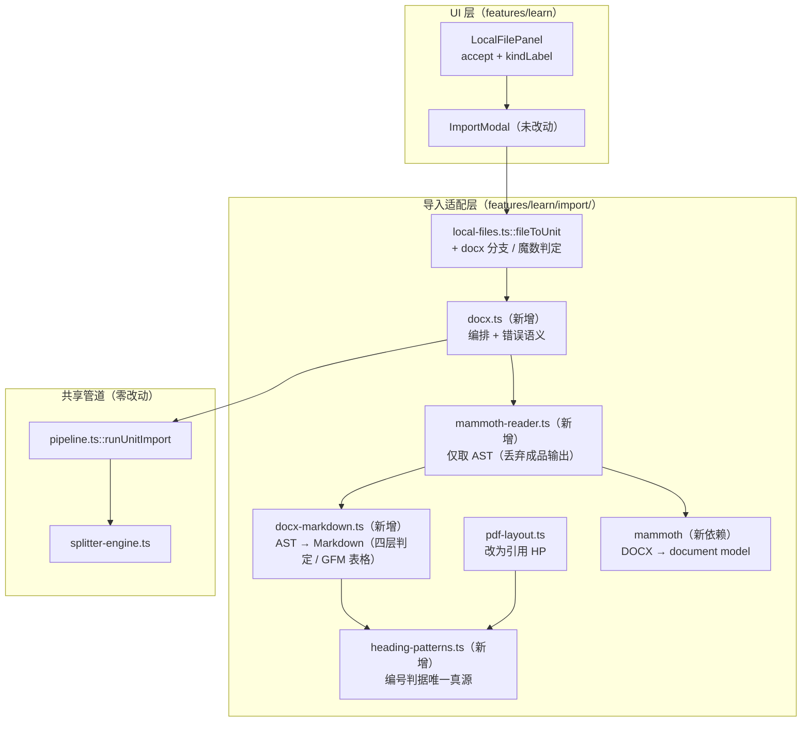
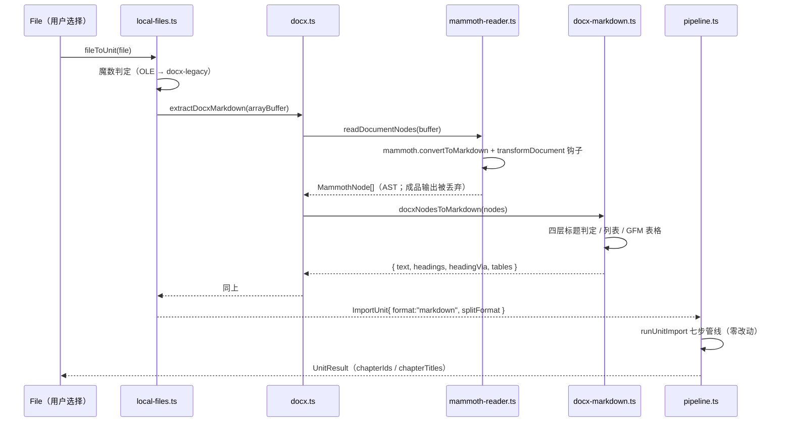

# 本地 DOCX 导入（F8 范围 3）技术方案

| 字段 | 内容 |
|------|------|
| 作者 | Agent |
| 日期 | 2026-09-23 |
| 状态 | **✅ 已实施（2026-09-23）** —— D1 / D3 由用户确认、D6 由用户确认「接受 D6，直接实施」；实施记录与实测输出见 `docs/library-import-docx-task-runbook-2026-09.md` |
| 关联需求 | `docs/roadmap-next-features-plan-2026-09.md` §F8 范围 3；README `[ ] Import coverage (DOCX / EPUB / URL / OCR)` |

## 1. 背景

### 1.1 业务痛点

本地文件导入目前只认 `.md` / `.markdown` / `.mdown` / `.txt` / `.pdf`（`import/types.ts::classifyLocalFile`）。而**用户手上最重要的两类资料恰恰是 DOCX**：

- 职场 / 行业资料：装修行业调研报告、需求文档、竞品分析 —— 绝大多数由 Word 写成；
- 合规 / 质量体系资料：GMP 的 SMP / SOP / 记录模板 —— 医药企业文档体系的事实标准就是 DOCX。

现状下用户面对 DOCX 只有两条路：**手工转 PDF**（再撞上「扫描件抽不出文字」的坑），或**手工粘贴正文**（丢掉全部标题结构，切章质量归零）。这是「第一分钟摩擦」里最贵的一段。

### 1.2 触发原因

路线图 §F8 把「导入覆盖面」列为 `P2 · 增量`，范围 3 = **DOCX 解析**。范围 1（0 字符检测 + 明确提示）已于 2026-09-21 交付，本方案承接范围 3。

四路候选中，DOCX 是**唯一不需要新基建**的一项：OCR 需动 `src-tauri/**`；URL 抓取需网络层 + 正文提取；EPUB 需 OPF / spine 解析（其容器层可复用本方案的读取路径）。

### 1.3 与现有模块的关系

```
fileToUnit(File)  ──►  ImportUnit  ──►  runUnitImport()  ──►  Document + Chapter[]
   ↑ 本方案在此处新增一个分支（docx）        ↑ 零改动（pipeline.ts 一行不改）
```

`ImportUnit`（`types.ts:46-79`）字段全部够用：`format` 取 `"markdown"`（DOCX 产出标准 ATX 后与 md 来源同路），`splitFormat` 按是否识别到标题取 `"markdown"` / `"txt"`——与 PDF 侧 `promotePdfHeadings` 的降级策略同构。**本方案不改动共享管道的任何契约，不新增存储实体，不碰 `src-tauri/**`。**

### 1.4 不做的影响

- 装修行业调研的章节树只能靠 PDF 猜标题（`promotePdfHeadings` 对「1 目的」这类**无点分**编号标题无能为力，§3.3d）；
- GMP 文档体系（质量手册 / SMP / SOP / 记录）无法成体系导入，学习闭环的「知识 → 章节」源头断裂。

## 2. 方案目标

| 类型 | 描述 |
|------|------|
| **主要目标** | 本地文件 Tab 支持 `.docx`，导入后走同一条 `runUnitImport` 七步管线；标题层级由 DOCX 的**样式 / 字号证据**还原（而非 PDF 式的模式猜测） |
| **非目标** | ① `.doc`（OLE 二进制）—— 只做拒绝 + 引导另存；② 加密 DOCX；③ 行内样式（斜体 / 下划线 / 超链接 / 脚注引用）；④ 图片（跳过，**不内联 base64**）；⑤ 文本框内内容；⑥ EPUB / URL / OCR；⑦ **不使用 mammoth 的成品输出**（`convertToMarkdown` 不产表格 —— 见 §3.3c） |
| **成功标准** | ① 导入「靠字号分层」的 DOCX 能得到 `# 文档标题` + `## 1 目的` 的层级（实测口径 §3.3a）；② 全文同字号的 DOCX 退化为段落聚类，**不报错、不丢内容**；③ 表格产出 GFM 语法且文本不重复；④ 既有 5 类来源零回归；⑤ `npm run typecheck` 不新增 error；⑥ 新增测试可 node 直跑 |

## 3. 项目现状

### 3.1 相关代码与模块（全部实测）

| 位置 | 现状 |
|---|---|
| `import/types.ts:17-36` | `LIMITS` 共 7 条：`localMdBytes`(1MB) / `localPdfBytes`(30MB) / `pdfMaxPages`(500) / `githubFileCount`(60) / `githubFileBytes`(1MB) / `githubTotalChars`(1.5M) / `pasteMaxChars`(1.5M) |
| `import/types.ts:111` | `LocalFileKind = "md" \| "txt" \| "pdf"` |
| `import/types.ts:124-137` | `classifyLocalFile(file)`：扩展名白名单 + 大小护栏 → `{kind, overLimit}` / `{error:"unsupported"}` |
| `import/local-files.ts:18-23` | `LocalFileErrorKind` 5 个：`unsupported` / `too-large` / `pdf-no-text` / `pdf-too-large` / `read-failed` |
| `import/local-files.ts:37-78` | `fileToUnit(file)`：md/txt 走 `decodeBytes`；pdf 走 `extractPdfText` + `promotePdfHeadings` |
| `import/pdf-layout.ts:276-280` | `HEADING_PATTERNS`（**私有常量**，3 条正则，见 §3.3d） |
| `import/error-text.ts:16` | `LocalErrorLabels = Record<LocalFileErrorKind, string>` —— **新增 kind 会强制 zh/en 同时补齐文案**（typecheck 兜底） |
| `import/LocalFilePanel.tsx:102` | `accept=".md,.markdown,.mdown,.txt,.pdf"` |
| `import/LocalFilePanel.tsx:183-190` | `kindLabel`：`pdf` / `txt` / 其余即 md 的三分支 |
| `i18n/messages/zh.ts:1507-1526` | `learn.import.local`：`kindMd/kindTxt/kindPdf` + `errors` 5 键；`unsupported: "不支持的类型（仅 .md / .txt / .pdf）"` **需同步** |
| `engine/splitter-engine.ts:94` | `mdHeadingMaxLevel` 默认 **2** → **只有 `#` 与 `##` 切章** |
| `engine/splitter-engine.ts:101` | 标题行正则 `/^(#{1,6})\s+(.+?)\s*#*\s*$/` |
| `engine/splitter-engine.ts:118-128` | 「唯一顶层 `#` 且其后无正文」→ **文档主标题**，不单独成章 |
| `engine/splitter-engine.ts:183-186` | 短章合并兜底（`minChapterBodyChars` 默认 200） |
| `render/markdown-core.tsx:47,115` | 渲染层**支持 GFM 表格** |
| `import/pipeline.ts:55,102` | `DEFAULT_SPLIT` 未覆写 `mdHeadingMaxLevel`；`splitFormat==="markdown"` 时先 `stripMarkdownNoise` 清洗 |

### 3.2 相关文档与约定

| 文档 / 规则 | 对本方案的约束 |
|---|---|
| `docs/knowledge-import-design-2026-09.md` §3.3 / §8 | 导入适配层**只产 `kind`、不产用户可见文案**（G2） |
| `docs/roadmap-next-features-plan-2026-09.md` §F8 | Done 标准：走同一套七步管线；编码嗅探 / 清洗 / 查重等既有护栏同样生效 |
| `rules/layer-import-boundaries.mdc` | 全在 `src/features/learn/import/` 内，不新增存储契约、不碰 `invoke` |
| `rules/no-headless-browser-validation.mdc` | 校验靠 typecheck + node 单测 + 代码自审 |
| `import/decode.ts:5-7` | 既有先例：优先用运行时自带能力，慎加依赖 |
| `tests/import-extract.test.ts:8-9` | 测试纪律：「**不加载 pdfjs**，纯逻辑直跑」 |

### 3.3 关键实测（推翻了多处先验假设）

#### (a) 真实 DOCX 的标题**几乎不用 `Heading` 样式** —— 靠**字号 + 粗体**

对 4 份文件实测（受控样本 1 份 + 本机真实文件 3 份）：

| 文件 | `pStyle` 分布 | `outlineLvl` | 标题实际靠什么 |
|---|---|---|---|
| `_real_sample.docx`（HTML→textutil） | **空** | **0** | `w:sz=48`(24pt) 文档标题 / `36`(18pt) 一级 / `28`(14pt) 二级 / `24`(12pt) 正文 |
| 嘻水樱桃沟活动报名系统需求.docx | **空** | **0** | `w:sz=44`(22pt)+方正小标宋简体 居中；正文 `32`(16pt) 仿宋_GB2312 |
| 橙子.docx（简历） | **空** | **0** | `50`(25pt) 姓名 / `26`(13pt) 小节 / `18`(9pt) 正文 |
| 邢行行.docx（简历） | **空** | **0** | 无字号分层（逐字 run，PDF 转换产物） |

**结论**：只按 `pStyle` / `outlineLvl` 判定，真实文档的标题识别数将是 **0**。标题判定必须包含**字号层**。

#### (b) 各解析路径在真实文件上的标题识别数（决定性对比）

| 文件 | 只认样式的方案（含 mammoth 直用） | 含字号层的方案 |
|---|---|---|
| `_real_sample.docx` | **0** | 4（`#`/`##`/`##`/`###`） |
| 报名系统需求 | **0** | 1 |
| 橙子.docx | **0** | 6（`# 陈宇恒` + `## 教育经历` / `## 工作经历` / `## 核心优势`） |

> mammoth 实测输出：把标题段落渲染成 `__1 目的__`（粗体强调），`<h1>–<h6>` 数为 0。

#### (c) mammoth 实测（26 包 / 8.6MB，`mammoth@1.12.3`）

| 维度 | 实测结果 |
|---|---|
| Node 可用性 | ✅ 自带 `@xmldom/xmldom` + `jszip`，无 DOM 环境亦可运行（**但入参形态与浏览器不兼容，见 (h)**） |
| `convertToMarkdown` | ✅ 运行时存在（**推翻我此前「需配 turndown」的判断，收回**）⚠️ **但类型声明里没有它**（见 (h)） |
| **表格** | ❌ **`convertToMarkdown` 不产 GFM 表格**，表格降级为逐行段落；`convertToHtml` 才输出 `<table>`。源码佐证：`lib/writers/markdown-writer.js` 中 `table` 出现 **0 次**（writers 下只有 `html-writer.js` / `markdown-writer.js`） |
| 有序列表 | ✅ 自身解析 `numbering.xml`，输出 `1. 2.`（README 场景下优于自写方案的 `- `） |
| 标题 | ❌ 只按**命名样式**映射；`pStyle` 为空的真实文档 → **0 个标题** |
| 图片 | ⚠️ markdown 输出**内联 base64 data URI**（橙子.docx 首屏即数百 KB） |
| 噪音 | ⚠️ 书签输出为 `<a id="OLE_LINK1"></a>` |

**关键推论**：HTML→Markdown 在 Node 侧需要 DOM（turndown 类库），与「纯逻辑 node 直跑」纪律冲突；因此 **mammoth 的成品输出无法同时满足「GFM 表格」与「可测」**。

#### (d) `transformDocument` 可拿到**整棵文档树**，且带字号与粗体

```js
transformDocument: (doc) => { root = doc; return doc; }
// root.type === "document"，keys = ["type","children","notes","comments"]
```

实测 AST 形状（本项目可依赖的契约）：

```
document
  paragraph
    run sz=24 bold          ← fontSize 单位 = 磅（= w:sz / 2）
      text "物料取样管理规程"
  paragraph
    run sz=18 bold
      text "1 目的"
  table
    tableRow
      tableCell …
  paragraph num={"isOrdered":true,"level":"0"}
    run sz=12
      text "取样工具应清洁"
```

| 字段 | 实测值 | 用途 |
|---|---|---|
| `paragraph.styleId` / `styleName` | `null`（真实文档） | 标题判定 L1 |
| `run.fontSize` | `number`（**磅**；`w:sz 48` → `24`） | 标题判定 L3（**主力**） |
| `run.isBold` | `boolean` | 标题判定 L3 辅助 |
| `paragraph.numbering.isOrdered` | `true` / `false` | 有序 / 无序列表 |
| `paragraph.numbering.level` | `"0"`（字符串） | 嵌套缩进 |
| `table` / `tableRow` / `tableCell` | 结构完整 | GFM 表格 |
| `*/text.value` | `string` | 正文 |

⚠️ **这是实测契约、不是文档承诺**：mammoth 未正式文档化 AST 字段名。**必须用守卫测试锁住形状**（§11.1 TC-DOCX-17），mammoth 升级破坏契约时立刻变红。

#### (e) 编号兜底判据的严格度（实测过一轮误判）

第一版探针用了放宽的正则，把表格降级后的「10 件」误判为标题。改用 `pdf-layout.ts:276-280` 的**真实**判据后误判消失：

```ts
/^第\s*[一二三四五六七八九十百千零两0-9]{1,6}\s*[章节篇部讲]\s*\S/
/^chapter\s+\d{1,3}\b/i
/^\d{1,2}(\.\d{1,2}){1,3}\s+\S/     // ← 要求点分小节号：「10 件」「1 目的」都不命中
```

该判据足够严格，可作 DOCX 的第 4 层兜底；但它是 `pdf-layout.ts` 私有常量，直接复制会产生第二份副本 ⇒ 提到共享模块（§4.2）。

#### (f) 页眉页脚 / 脚注 / 修订痕迹由 mammoth 天然排除

mammoth 只读主文档流，页眉页脚 / 脚注尾注 / 批注在独立 part；修订的删除文本用 `<w:delText>`——实测不进 `children`。

> DOCX 相对 PDF 的**结构性红利**：PDF 需 `stripRunningHeads` 靠跨页重复猜页眉，DOCX 不需要猜。

#### (g) 切章层级口径

`mdHeadingMaxLevel` 默认 2 且 `pipeline.ts` 未覆写 ⇒ **只 `#` 与 `##` 切章**。层级**保持 1:1** 映射即可：

- 「H1 = 文档标题，H2 = 章」→ `#` 被切分器识别为 `documentHeading` 不单独成章，`##` 成章 ✅
- 「H1 = 章，H2 = 节」→ 章与节都成章（**切分器全局既有口径**，md 来源同样如此）；过碎小节由 `mergeShortChapters`（200 字）吸收 ✅

⚠️ **反例（已排除）**：不做「整体下移一级」归一化。对「唯一 H1 + 多个 H2」的文档，下移会把 H2 变成 `###` 而**失去全部切章能力**（退化成单章）——比现状更差。

#### (h) mammoth 的三条硬约束（决定实现写法，均已实测）

**① 类型声明落后于实现**（`lib/index.d.ts`）：

```ts
interface Mammoth {
  convertToHtml: (input: Input, options?: Options) => Promise<Result>;  // ✅ 接受 Options
  extractRawText: (input: Input) => Promise<Result>;                     // ❌ 不接受 Options，挂不上钩子
  embedStyleMap: …; images: Images;
}
// ⚠️ 声明里没有 convertToMarkdown（运行时却有）→ 调它会报 TS2339
// ⚠️ package.json 也没有 types 字段，靠 main: ./lib/index.js 旁路解析到 lib/index.d.ts
```

⇒ **必须用 `convertToHtml`**（我们有意识地丢弃它的返回值，用哪个输出格式都不影响 AST）—— 这反而让类型保持干净，**不需要 `as any` 绕过**（符合仓库 `strict` 纪律）。

**② Node 与浏览器的入参毫无交集**（决定性）：

| 环境 | 实际加载 | 接受的入参 |
|---|---|---|
| Node（`lib/unzip.js`） | `if (options.path) … else if (options.buffer) … else if (options.file) …` | `path` / `buffer` / `file` —— **不认 `arrayBuffer`** |
| 浏览器（`browser/unzip.js`，由 `package.json` 的 `browser` 字段重定向） | `if (options.arrayBuffer) …` | **只认 `arrayBuffer`** |

实测：Node 下传 `{ arrayBuffer }` → `Error: Could not find file in options`；传 `{ buffer: Uint8Array }` → ✅ 正常，AST 正确。
⚠️ 而 `index.d.ts` 只声明了 `arrayBuffer`（`BrowserInput`）——**类型与运行时不一致**，这是最危险的一类「文档说谎」。

⇒ 生产（Tauri WebView / Vite 打包走 browser 字段）用 `{ arrayBuffer }`；node 单测用 `{ buffer }`。**必须在唯一一处集中探测**，不能把分支散到调用方。

**③ 环境探测只能用 `window`**：项目 `tsconfig` 的 `types: ["vite/client"]` 不含 `@types/node`，实测 `process` 报 `TS2591: Cannot find name 'process'`。⇒ 用 `typeof window === "undefined"`（`lib` 含 `DOM`，类型安全；node 单测为纯 node，无 DOM shim）。

**④ `Input` 的 `Buffer` 类型不可依赖**：`BufferInput { buffer: Buffer }` 里的 `Buffer` 在 `skipLibCheck` 下不报错，但为避免依赖它，探测函数的返回类型显式写为字面量联合（而非 `Input`）：
`{ buffer: Uint8Array } | { arrayBuffer: ArrayBuffer }`。

**⑤ 该写法的类型检查已实测通过**（用项目自己的 `tsc` + 同等编译选项，无 error）。

### 3.4 决策点（D1–D6）

| ID | 决策点 | 结论 | 理由 |
|----|--------|------|------|
| **D1** | 解析依赖 | **已确认（2026-09-23）：引入 `mammoth`** | 用户拍板。实测 `mammoth@1.12.3` 在 Node 可用（自带 `@xmldom/xmldom` + `jszip`），省掉自写 ZIP 容器与 OOXML 扫描器 |
| **D2** | 标题判定层数 | 四层（style → styleId 数字 → 字号 → 编号兜底） | 仅样式层在 4/4 份真实文件上识别数为 **0**（§3.3a/b） |
| **D3** | 表格处置 | **已确认（2026-09-23）：GFM 表格** | 渲染层已支持；GMP / 行业报告表格承载关键参数。单行表降级为段落（不造假日表头） |
| **D6** | **mammoth 的使用形态** | **C 路线：只用 `transformDocument` 取 AST，自写 Markdown 输出层** | ⚠️ **这是 D1+D3 的必然推论**：`convertToMarkdown` **不产表格**（§3.3c），故不能直接用其成品输出；`convertToHtml` 有表格但 HTML→MD 在 Node 需 DOM，破坏可测性。⇒ 把 `transformDocument` 当**读取钩子**（`convertToMarkdown` 的返回值直接丢弃），自己遍历 AST 产出 Markdown。这样 D1（mammoth）与 D3（GFM 表格）**同时成立** |
| **D4** | `.doc` / 加密文档 | 拒绝 + OLE 魔数识别 + 引导另存 | 魔数 `D0 CF 11 E0` 是强证据，可给出**可行动**提示 |
| **D5** | 行内样式 | v1 不做 | 对切分与要点提取无增益；`stripMarkdownNoise` 本就会压掉链接 URL。登记为非目标 |

## 4. 技术架构

### 4.1 总体架构



**分层与可测性**：

| 模块 | 可 node 直跑 | 说明 |
|---|---|---|
| `types.ts` / `heading-patterns.ts` | ✅ 纯 | 零运行时依赖 |
| `docx-markdown.ts` | ✅ 纯 | 只遍历**普通对象**（AST），零 DOM / 零 mammoth 依赖 —— **可脱离 mammoth 单测**（夹具直接构造 AST 字面量） |
| `mammoth-reader.ts` | ✅ | 调 mammoth，但 mammoth 自带 `@xmldom/xmldom`，Node 下无需 DOM（已实测） |
| `docx.ts` | ✅（只吃 `ArrayBuffer`） | 不触 `File` / `Blob` |
| `local-files.ts` | ❌ 触 `File` | 与现状一致 |

> ⚠️ 刻意把「标题判定 + Markdown 输出」（`docx-markdown.ts`）与「mammoth 读取」（`mammoth-reader.ts`）**分成两个文件**：前者不 import mammoth ⇒ 单测可**直接喂 AST 字面量**，不必构造真 DOCX 字节，测试既快又稳（也顺带隔离了 mammoth 的 AST 契约风险 —— 契约破了只有 `mammoth-reader` 的守卫会红）。

### 4.2 模块职责

| 模块 | 职责 | 选型 |
|---|---|---|
| `mammoth-reader.ts` | 调 `mammoth.convertToMarkdown` + `transformDocument` 钩子捕获 AST；**丢弃其返回值**；做 OLE 魔数判定与 mammoth 异常归一化 | `mammoth` |
| `docx-markdown.ts` | 遍历 AST → Markdown：四层标题判定、列表（`numbering.isOrdered`）、GFM 表格、图片跳过、文本拼接 | 纯函数 |
| `docx.ts` | 编排：`ArrayBuffer` → AST → Markdown；抛语义化错误（class + `name`，对齐 `pdf.ts`） | — |
| `heading-patterns.ts` | `HEADING_PATTERNS` / `isNumberedHeading` / `isHeadingShape` —— **编号标题判据唯一真源** | 从 `pdf-layout.ts:276-280` 迁出 |
| `LocalFilePanel.tsx` | `accept` 加 `.docx`；`kindLabel` 改为映射式 | — |

### 4.3 数据模型与 API

**不新增持久化实体、不改 `ImportUnit` / `StorageAdapter`。** 新增的只有适配层内部类型：

```ts
// docx-markdown.ts —— 刻意不 import mammoth：AST 用结构类型描述（可脱离 mammoth 单测）
// ⚠️ 实施期收紧：下面是**已实现形态**（单一「宽 type + 全可选字段」结构），不是初稿的 6 个精确接口
//    —— 理由见「实施期偏离」表第 5 行（宽 type 成员会让判别式收窄失效，精确类型是假安全）。
export interface MammothNode {
  type: string;                                  // 块级 paragraph / table；行内 run / hyperlink / text / image / tab / break…
  children?: readonly MammothNode[];
  value?: string;                                // 仅 text 节点
  styleId?: string | null; styleName?: string | null;
  isBold?: boolean; fontSize?: number | null;    // ⚠️ fontSize 单位＝磅（= w:sz/2）
  numbering?: { isOrdered?: boolean; level?: string } | null;
}

export interface DocxMarkdownResult {
  text: string;
  headings: number;
  /** 标题证据来源计数（style / styleNum / size / pattern）—— 排障与结果卡可观测性。 */
  headingVia: Record<string, number>;
  tables: number;
  skippedImages: number;
}

// ⚠️ 实施期删除 `options?: { maxChars }`：方案自身注明「此处只回报 length」⇒ 该参数无消费方，
//    留着会触发本仓 error 级的 `noUnusedParameters`（见「实施期偏离」表第 6 行）。
export function docxNodesToMarkdown(nodes: readonly MammothNode[]): DocxMarkdownResult;

// docx.ts
export class DocxLegacyError extends Error { name = "DocxLegacyError"; }        // OLE：老 .doc / 加密
export class DocxBadArchiveError extends Error { name = "DocxBadArchiveError"; }
export class DocxNoTextError extends Error { name = "DocxNoTextError"; }
export class DocxTooLargeError extends Error { name = "DocxTooLargeError"; }

export async function extractDocxMarkdown(buffer: ArrayBuffer): Promise<DocxMarkdownResult>;
```

**数据读写（必填）**：**不涉及持久化路径变更。**

- UI → `ImportModal` → `fileToUnit` → `ImportUnit` → `runUnitImport(unit, { storage })` → `storage.saveDocument` / `saveChapters`（既有链路，**零改动**）；
- 不调用任何 Tauri 命令（无 `vault_*` / `llm_*` / `db_*`），无 `isTauri` 守卫需求；
- **不新增存储契约**：不碰 `storage/types.ts` 与三个适配器，`src-tauri/**` 零改动。

### 4.4 状态与副作用

| 状态 | 位置 | 说明 |
|---|---|---|
| 选中的文件列表 | `ImportModal`（受控）+ `LocalFilePanel` 展示行 | 既有，不改 |
| 行状态 | `LocalFilePanel` 本地 `state` | 既有；`.docx` 自动纳入「可导入」 |
| **无新增副作用** | — | 解析是纯内存操作，不落盘（与 PDF 一致） |

⚠️ DOCX 不加「预校验不可知」项：OLE / 非 ZIP / 无文本只能在导入期判定 ⇒ 沿用 PDF 的既有处理（预校验放过，导入期计入批量失败项）。`.doc` 因扩展名不同，**可在预校验期拦下**。

## 5. 交互流程

### 5.1 主流程

1. 用户在本地文件 Tab 拖入 / 点选 `.docx`；
2. `classifyLocalFile` → `{ kind:"docx", overLimit }` → 行显示 ✓ + 徽标「DOCX」+ 大小；
3. 主按钮计数 +1（`保存并切分 N 份资料`）；
4. 点击导入 → `fileToUnit(file)`：
   1. `file.arrayBuffer()` → 首 4 字节魔数（`D0CF11E0` → `docx-legacy`）；
   2. `extractDocxMarkdown`：mammoth 读 AST → 遍历产 Markdown；
   3. 正文为空 / 超 `docxMaxChars` → `docx-no-text` / `too-large`；
   4. 返回 `ImportUnit{ format:"markdown", splitFormat: headings>0 ? "markdown" : "txt", extract:{ headings, tables } }`；
5. `runUnitImport` 走既有五阶段 → 结果卡显示章节数 / 要点数。

### 5.2 分支与异常流程

| 场景 | 触发条件 | 系统行为 | UI 反馈 |
|---|---|---|---|
| 旧版 `.doc` / 加密 DOCX | 魔数 `D0 CF 11 E0` | `DocxLegacyError` → `docx-legacy` | **「这是旧版 .doc 或加密文档，请用 Word 另存为 .docx 后重试」** |
| 伪装的 OLE（后缀 `.docx`） | 同上 | 同上 | 同上 |
| 文件损坏 / 非 OOXML 包 | mammoth 抛异常（无 `word/document.xml` 等） | `DocxBadArchiveError` → `docx-bad-zip` | 「文档已损坏或不是有效的 .docx」 |
| 正文为空（纯图片文档） | Markdown 文本为空 | `DocxNoTextError` → `docx-no-text` | 「未抽取到文本（文档可能只含图片）」 |
| 正文超字符护栏 | `text.length > docxMaxChars` | 返回 kind `too-large` | 复用「超出大小限制」 |
| 文件字节超限 | `size > localDocxBytes` | **预校验期**即拦 | 行标 ⚠ + `too-large` |
| 全文同字号、无标题证据 | 判定 0 标题 | `splitFormat:"txt"` → 段落聚类 | 结果卡正常显示「第 N 节」，**不报错** |
| 表格 | AST `table` 节点 | GFM 表格；单行表降级为段落 | 渲染为表格 |
| 图片 | AST 含图片 | **跳过**（关键词：mammoth 的 markdown writer 会内联 base64，我们不走它） | 正文无 base64 噪音 |
| 页眉页脚 / 脚注 / 修订痕迹 | 不在主 children 流 | 天然排除 | — |

### 5.3 时序图



## 6. 用户用例（User Cases）

### UC-01：导入结构清晰的 DOCX（GMP SOP 类）

| 项 | 内容 |
|----|------|
| 角色 | 质量管理人员 |
| 前置条件 | 本地有个 Word 写的 SOP，标题靠**字号**区分（无 Heading 样式） |
| 主流程步骤 | 1. 本地文件 Tab 拖入 `.docx` → 2. 行显示 ✓ / DOCX / 大小 → 3. 点「保存并切分 1 份资料」 → 4. 看结果卡 |
| 期望结果 | 资料入库；章节数 ≥ 2；章标题为文档内真实小节名（如「1 目的」「2 适用范围」）；正文完整 |
| 异常/边界 | 小节正文 <200 字且相邻 → 被 `mergeShortChapters` 合并（既有兜底，非缺陷） |

### UC-02：导入无结构 DOCX（全文同字号）

| 项 | 内容 |
|----|------|
| 角色 | 任意用户 |
| 前置条件 | DOCX 全文同一字号、无列表 |
| 主流程步骤 | 同上 |
| 期望结果 | 走段落聚类 → 章标题「第 N 节」；**不报错**；正文零丢失 |
| 异常/边界 | 与 `.txt` 导入行为一致（可作对照验证） |

### UC-03：导入含表格的 DOCX

| 项 | 内容 |
|----|------|
| 角色 | 任意用户 |
| 前置条件 | DOCX 含一个 ≥2 行的表格 |
| 主流程步骤 | 同上 |
| 期望结果 | 表格渲染为 GFM 表格（表头为原首行）；单元格文本**不重复出现**在正文中 |
| 异常/边界 | 单行表 → 降级为一行段落，不产生 `\| --- \|`；单元格含 `\|` → 转义 |

### UC-04：误选 `.doc` / 加密文档

| 项 | 内容 |
|----|------|
| 角色 | 任意用户 |
| 前置条件 | `.doc`（被 `accept` 拦下）或 `.docx` 实为 OLE 容器 |
| 主流程步骤 | 拖入 → 看行内状态 |
| 期望结果 | `.doc`：行标 ✕ + 「不支持的类型（仅 .md / .txt / .pdf / .docx）」；伪装 OLE：导入期失败并提示**另存为 .docx** |
| 异常/边界 | 提示必须**可行动**，不是「读取失败」 |

### UC-05：批量混入 DOCX

| 项 | 内容 |
|----|------|
| 角色 | 任意用户 |
| 前置条件 | 同时选 md + pdf + docx 各一份 |
| 主流程步骤 | 批量导入 |
| 期望结果 | 三份各走原路径；DOCX 失败不影响其余两份（`runBatchImport` 逐段串行，既有语义） |

## 7. 线框 UI（Wireframe）

### 7.1 本地文件 Tab — 含 DOCX 的选中列表

```
┌──────────────────────────────────────────────────┐
│  ┌────────────────────────────────────────────┐  │
│  │  拖拽 .md / .txt / .pdf / .docx 到此处，     │  │  ← dropTitle（文案加 .docx）
│  │  或点击选择文件                             │  │
│  │  支持批量选择；扫描版 PDF 暂不支持           │  │  ← dropHint（不变）
│  └────────────────────────────────────────────┘  │
│  ┌────────────────────────────────────────────┐  │
│  │ 已选 3 个文件 · 其中 2 份可导入     全部移除 │  │
│  ├────────────────────────────────────────────┤  │
│  │ ✓ 取样管理规程.docx   [DOCX] 42 KB      ✕  │  │  ← kindDocx
│  │ ✓ 调研报告.pdf        [PDF]   2.1 MB    ✕  │  │
│  │ ✕ 旧模板.doc          [—]     88 KB 不支持 ✕│  │  ← 扩展名拦截
│  └────────────────────────────────────────────┘  │
│         [ 保存并切分 2 份资料 ]                   │
└──────────────────────────────────────────────────┘
```

- **组件映射**：全部复用 `LocalFilePanel`，仅 `accept` / `dropTitle` / `kindLabel` 三处变化；
- **设计 token**：徽标沿用 `border-line` / `text-ink-3`，错误态沿用 `text-state-weak` —— **不引入新 token、不引入新 hex**。

### 7.2 其他状态

| 状态 | 表现 |
|---|---|
| 默认（未选文件） | 现状不变 |
| 加载中 | 现状：底部按钮 running 文案；**不新增行级进度**（批量已有文件级进度） |
| 空数据 | N/A |
| 错误 | 预校验失败（超限 / 不支持 / `.doc`）→ 行内标红 + 文案；导入期失败（OLE / 损坏 / 无文本）→ 批量汇总卡失败项 |
| 禁用 | 导入中 `disabled` → dropzone 半透明（现状） |

### 7.3 交互说明

- 无新增 hover / focus 行为；
- `accept` 与 `classifyLocalFile` 双向收紧后，**前缀白名单与展示逻辑同源**（均由 `classifyLocalFile` 裁决），不会出现「选择器放进来却被判不支持」的错配。

## 8. 涉及文件及改动伪代码

### 8.1 `src/features/learn/import/heading-patterns.ts`（新增）

**改动说明**：把 `pdf-layout.ts:276-280` 的编号标题判据提升为**唯一真源**（DOCX 与 PDF 共用）。**零行为变更**。

```ts
// 常量与正则逐字搬迁，不改一个字符（改了就是行为变更）
export const HEADING_PATTERNS: readonly RegExp[] = [
  /^第\s*[一二三四五六七八九十百千零两0-9]{1,6}\s*[章节篇部讲]\s*\S/,
  /^chapter\s+\d{1,3}\b/i,
  /^\d{1,2}(\.\d{1,2}){1,3}\s+\S/,
];
export function isNumberedHeading(line: string): boolean;
/** 通用外围护栏：非空、≤40 字符、不以句末标点结尾、未已带 `#`（从 promotePdfHeadings 内联判断迁出）。 */
export function isHeadingShape(line: string): boolean;
```

### 8.2 `src/features/learn/import/pdf-layout.ts`（修改）

**改动说明**：删私有 `HEADING_PATTERNS`，改引共享模块。**行为零变更**。

```ts
- const HEADING_PATTERNS: RegExp[] = [ ... ];
+ import { isHeadingShape, isNumberedHeading } from "./heading-patterns";

  export function promotePdfHeadings(text) {
    const out = text.split("\n").map((raw) => {
      const line = raw.trim();
-     if (!line || line.length > 40 || line.startsWith("#")) return raw;
-     if (/[。！？；，]$/.test(line)) return raw;
-     if (!HEADING_PATTERNS.some((re) => re.test(line))) return raw;
+     if (!isHeadingShape(line)) return raw;
+     if (!isNumberedHeading(line)) return raw;
      promoted += 1;
      return `## ${line}`;
    });
    return { text: out.join("\n"), promoted };
  }
```

### 8.3 `src/features/learn/import/docx-markdown.ts`（新增 · **核心**）

**改动说明**：AST → Markdown。**不 import mammoth**（AST 用结构类型），可脱离 mammoth 单测。

```ts
// 伪代码
const HEADING_STYLE_RE = /^(?:heading|标题)\s*([1-6])$/i;
/** 字号显著性倍数（相对正文基准）。实测 1.15 足以区分 12pt↔14pt，又不误吞 11pt↔12pt。 */
const SIZE_HEADING_RATIO = 1.15;
// ⚠️ 实施期删除了初稿的 `const MAX_HEADING_CHARS = 40`：长度/标点护栏**只有一把尺子**
//    （heading-patterns.isHeadingShape）。在 docx-markdown 里再定义一次就是第二把尺子，
//    且会因无消费方触发 `noUnusedLocals`（见「实施期偏离」表第 7 行）。

/** 段落主字号：按**字符长度加权**（正文段落长、标题段落短，故不能按 run 数或段落数）。 */
function paragraphFontSize(para: MammothParagraph): number;

/** 正文基准字号：全文字符加权最多的字号。 */
function baseFontSize(paras: readonly MammothParagraph[]): number;

/** 四层标题判定（返回 undefined = 正文）。 */
function headingLevelOf(
  para: MammothParagraph, size: number, base: number, sizeTiers: readonly number[],
  text: string,
): { level: number; via: "style" | "styleNum" | "size" | "pattern" } | undefined {
  // L1 命名样式（Word 标准做法；实测真实文档命中率为 0，但仍是最高证据级）
  const m = HEADING_STYLE_RE.exec(para.styleId ?? para.styleName ?? "");
  if (m) return { level: +m[1], via: "style" };
  // L1' 中文版 Word 的 styleId 为纯数字 "1".."6"
  if (/^[1-6]$/.test(para.styleId ?? "")) return { level: +para.styleId!, via: "styleNum" };
  if (!isHeadingShape(text)) return undefined;              // 长行 / 句末标点 → 非标题
  // L3 字号显著大于基准 → 档位排名即层级（实测主力）
  if (size > base * SIZE_HEADING_RATIO) {
    return { level: Math.min(6, sizeTiers.indexOf(size) + 1), via: "size" };
  }
  // L4 编号兜底（复用共享判据）→ 一律 ##（与 promotePdfHeadings 同档）
  if (isNumberedHeading(text)) return { level: 2, via: "pattern" };
  return undefined;
}

/** 单元格文本：内部段落用 `<br>` 连接；`|` 转义为 `\|`；换行压平。 */
function cellText(cell: MammothTableCell): string;

function tableToGfm(table: MammothTable): { text: string; rows: number } | undefined {
  // 0 行 → undefined（调用方按段落处理）
  // 1 行 → 无表头，降级为一行段落（**不制造假表头**）
  // ≥2 行 → 首行 + `| --- |` 分隔行 + 余行
}

export function docxNodesToMarkdown(nodes, options = {}): DocxMarkdownResult {
  const paras = collectParagraphs(nodes);          // 只取顶层 paragraph（表格内的不重复计入）
  const base = baseFontSize(paras);
  const tiers = [...new Set(paras.filter(p => paragraphFontSize(p) > base * SIZE_HEADING_RATIO)
                                  .map(paragraphFontSize))].sort((a, b) => b - a);
  const lines: string[] = [];
  for (const node of nodes) {
    if (node.type === "table")     { /* GFM 表 → lines */ continue; }
    if (node.type !== "paragraph") { /* 图片等其它块级：跳过并 skippedImages++ */ continue; }
    const text = paragraphText(node);              // 只取 run/text，**忽略图片节点**（不产生 base64）
    const lvl = headingLevelOf(node, /* … */);
    if (lvl && text.trim()) lines.push("#".repeat(lvl.level) + " " + text.trim());
    else if (node.numbering && text.trim()) lines.push(`${node.numbering.isOrdered ? "1." : "-"} ${text.trim()}`);
    else if (text.trim()) lines.push(text);
    else lines.push("");                            // 空段 → 段落分隔
  }
  const text = lines.join("\n").replace(/\n{3,}/g, "\n\n").trim();   // ⚠️ 收尾只压空行，不 trim 行内
  // options.maxChars 超限由 docx.ts 判定（此处只回报 length）
  return { text, headings, headingVia, tables, skippedImages };
}
```

> ⚠️ **图片必须显式跳过**：mammoth 的 markdown writer 会把图片内联为 `data:image/png;base64,…`（实测橙子.docx 首屏即数百 KB）。我们走自己的 writer，`run.children` 中的非 `text` 节点一律忽略 ⇒ **正文零 base64**。

### 8.4 `src/features/learn/import/mammoth-reader.ts`（新增）

**改动说明**：**唯一的 mammoth 接触面**。把「取 AST」与「产 Markdown」隔离在此。三条硬约束（§3.3h）全部收口在这个文件里。

```ts
// 伪代码
import mammoth from "mammoth";

/**
 * mammoth 入参在 Node 与浏览器**无交集**（实测）：
 *   Node      → lib/unzip.js      认 { path | buffer | file }，**不认 arrayBuffer**
 *   浏览器     → browser/unzip.js   只认 { arrayBuffer }
 * 而 `index.d.ts` 只声明了 arrayBuffer（BrowserInput）——**类型与运行时不一致**。
 *
 * ⚠️ 集中在此探测一次：生产（Tauri WebView，Vite 走 browser 字段）→ arrayBuffer；
 *    node 单测（lib 路径）→ buffer。别把这个分支散到调用方。
 * ⚠️ 用 `window` 而非 `process` 探测：本项目 tsconfig 的 types 不含 @types/node，
 *    实测 `process` 报 TS2591。
 * ⚠️ 返回型别写显式字面量联合，不引用 mammoth 的 `Input`（其 BufferInput 依赖 Buffer 类型）。
 */
function mammothInput(bytes: Uint8Array): { buffer: Uint8Array } | { arrayBuffer: ArrayBuffer } {
  if (typeof window === "undefined") return { buffer: bytes };
  return {
    arrayBuffer: bytes.buffer.slice(bytes.byteOffset, bytes.byteOffset + bytes.byteLength) as ArrayBuffer,
  };
}

/**
 * 取 DOCX 的 document model（AST）。
 *
 * ⚠️ 用 `convertToHtml` 而不是 `convertToMarkdown`：
 *   ① 后者**不在 `index.d.ts` 里**（类型落后于实现，调用会 TS2339）；
 *   ② 两者的成品输出我们**完全丢弃**（markdown writer 不产表格，见 §3.3c），
 *      故用哪个输出格式结果相同 —— 选有类型的那个，换取零 `as any`。
 * ⚠️ 依赖 `transformDocument` 的 AST 形状（`run.fontSize` 单位＝磅、`numbering.isOrdered`…）：
 *    这是**实测契约、非文档承诺** ⇒ 守卫测试锁形状（TC-DOCX-17），mammoth 升级破坏时立刻变红。
 */
export async function readDocumentNodes(buffer: ArrayBuffer): Promise<readonly MammothNode[]> {
  let root: { type: string; children: MammothNode[] } | undefined;
  const out = await mammoth.convertToHtml(
    mammothInput(new Uint8Array(buffer)),
    { transformDocument: (doc: unknown) => { root = doc as never; return doc; } },
  );
  void out;                                    // 显式丢弃：成品输出不在我们的契约内
  if (!root) throw new DocxBadArchiveError();
  return root.children;
}
```

> ⚠️ `transformDocument` 的形参在声明里是 `(element: any) => any`。为守住 `strict`（禁隐式 any），显式写成 `(doc: unknown)` 并在内部 `as never` 断言 —— 这是**唯一一处**允许的断言，且紧邻契约注释。

### 8.5 `src/features/learn/import/docx.ts`（新增）

**改动说明**：编排 + 语义化错误。错误用 **class + `name`**（对齐 `pdf.ts` 的 `PdfNoTextError` 模式）。

```ts
// 伪代码
/**
 * ⚠️ 实施期修正（原本是错的）：初稿写 `const OLE_MAGIC = 0xd0cf11e0; // 前 4 字节小端` ——
 *    那是把字节序列按**大端**读出的数字，而小端读出的值是 `0xe011cfd0`，两者永不相等，
 *    魔数判定会**静默失效**（单测 TC-DOCX-11 / A3 抓住）。改为**字节序列比对**，
 *    与「前 4 字节 D0 CF 11 E0」这句话本身一致，不再有大小端歧义。
 */
const OLE_MAGIC_BYTES = [0xd0, 0xcf, 0x11, 0xe0];
function hasOleMagic(bytes: Uint8Array): boolean {
  return bytes.length >= 4 && OLE_MAGIC_BYTES.every((byte, i) => bytes[i] === byte);
}

export async function extractDocxMarkdown(buffer: ArrayBuffer): Promise<DocxMarkdownResult> {
  const bytes = new Uint8Array(buffer);
  // ① 魔数：OLE（老 .doc / 加密）比「不是 zip」更具体，先判 → 提示可行动
  if (hasOleMagic(bytes)) throw new DocxLegacyError();
  // ② 读 AST（mammoth 的异常在此归一化）
  let nodes: readonly MammothNode[];
  try { nodes = await readDocumentNodes(buffer); }
  catch { throw new DocxBadArchiveError(); }
  // ③ AST → Markdown
  const result = docxNodesToMarkdown(nodes);
  if (!result.text.trim()) throw new DocxNoTextError();
  // ④ 字符护栏（实施期从 local-files 移到此处：护栏跟着抽取器走，任何调用方都拿不到超限正文）
  if (result.text.length > LIMITS.docxMaxChars) throw new DocxTooLargeError(result.text.length);
  return result;
}
```

### 8.6 `src/features/learn/import/types.ts`（修改 · 4 处）

```ts
  export const LIMITS = {
    localMdBytes: 1 * 1024 * 1024,
    localPdfBytes: 30 * 1024 * 1024,
+   /** 单个 .docx ≤ 20MB（含大量图片的文档也在此内；解压后进内存，故比 PDF 保守）。 */
+   localDocxBytes: 20 * 1024 * 1024,
+   /**
+    * 入库正文总字符上限。⚠️ 与 pasteMaxChars / githubTotalChars **同一把尺子**
+    * （「入库正文体量」这条线），不是文件字节线。
+    */
+   docxMaxChars: 1_500_000,
    ...
  };

- export type LocalFileKind = "md" | "txt" | "pdf";
+ export type LocalFileKind = "md" | "txt" | "pdf" | "docx";

  export function classifyLocalFile(file) {
    ...
    if (lower.endsWith(".pdf")) return { kind: "pdf", overLimit: file.size > LIMITS.localPdfBytes };
+   if (lower.endsWith(".docx")) return { kind: "docx", overLimit: file.size > LIMITS.localDocxBytes };
+   // ⚠️ .doc / .docm / .dotx 明确不支持（OLE 二进制 / 宏 / 模板），由本函数拦下；
+   //    「伪装成 .docx 的 OLE」只能在导入期按魔数判定（§5.2）。
    return { error: "unsupported" };
  }

- export function stripExtension(name: string): string {
-   return name.replace(/\.(md|markdown|mdown|txt|pdf)$/i, "");
- }
+ export function stripExtension(name: string): string {
+   return name.replace(/\.(md|markdown|mdown|txt|pdf|docx)$/i, "");
+ }

  export interface ImportUnit { … extract?: { pages?; nonEmptyPages?; encoding?;
+   headings?: number; tables?: number; }; }
```

> ⚠️ **不再需要 `docxXmlBytes` 护栏**：解压由 mammoth 内部的 jszip 完成，我们拿不到解压前的声明大小。zip bomb 风险改由 `localDocxBytes`（20MB 文件字节线）+ `docxMaxChars`（正文 1.5M 字符线）**两端夹住**，并在 §11.3 用变体确认超限会被拦。若将来要更严，需换回自写 ZIP 层（登记为遗留）。

### 8.7 `src/features/learn/import/local-files.ts`（修改）

```ts
  export type LocalFileErrorKind =
    | "unsupported" | "too-large" | "pdf-no-text" | "pdf-too-large" | "read-failed"
+   | "docx-legacy" | "docx-bad-zip" | "docx-no-text";

+ // ⚠️ 实施期新增（偏离第 9 行）：文件字节线改成映射表，替掉原来的 `pdf ? … : md` 三元
+ //    —— 否则「.docx 超限」的 detail 会报成 md 的 1MB 尺子。
+ const FILE_BYTE_LIMITS: Record<LocalFileKind, number> = {
+   md: LIMITS.localMdBytes, txt: LIMITS.localMdBytes,
+   pdf: LIMITS.localPdfBytes, docx: LIMITS.localDocxBytes,
+ };

  export async function fileToUnit(file: File): Promise<ImportUnit | LocalFileError> {
    ...
+   if (cls.kind === "docx") {
+     // 不套内层 try/catch：docx 的语义化错误并入**既有单一 catch**（偏离第 9 行）
+     const out = await extractDocxMarkdown(await file.arrayBuffer());
+     return {
+       title, format: "markdown",
+       // 有标题证据 → md 标题切分；否则段落聚类（与 PDF 的 promote 策略同构）
+       splitFormat: out.headings > 0 ? "markdown" : "txt",
+       text: out.text, source,
+       extract: { headings: out.headings, tables: out.tables },
+     };
+   }
    const out = await extractPdfText(...);
  } catch (e) {
    if (e instanceof PdfNoTextError) return err("pdf-no-text", e.message);
    if (e instanceof PdfTooLargeError) return err("pdf-too-large", e.message);
+   if (e instanceof DocxLegacyError) return err("docx-legacy", file.name);
+   if (e instanceof DocxBadArchiveError) return err("docx-bad-zip", file.name);
+   if (e instanceof DocxNoTextError) return err("docx-no-text", file.name);
+   if (e instanceof DocxTooLargeError) return err("too-large", `${file.name} chars>${LIMITS.docxMaxChars}`);
    return err("read-failed", ...);
  }
```

### 8.8 `src/features/learn/import/LocalFilePanel.tsx`（修改 · 2 处）

```tsx
- accept=".md,.markdown,.mdown,.txt,.pdf"
+ accept=".md,.markdown,.mdown,.txt,.pdf,.docx"

- function kindLabel(state, labels: { md: string; txt: string; pdf: string }) {
-   if (state === "unsupported") return "—";
-   if (state.kind === "pdf") return labels.pdf;
-   return state.kind === "txt" ? labels.txt : labels.md;
- }
+ /** ⚠️ 映射式：显式覆盖每个 kind —— 新增 `docx` 时 typecheck 强制补齐，不再落进 else 被当成 md。 */
+ function kindLabel(state, labels: Record<LocalFileKind, string>): string {
+   return state === "unsupported" ? "—" : labels[state.kind];
+ }
```

### 8.9 `src/i18n/messages/zh.ts` / `en.ts`（修改 · 成对）

```ts
  local: {
-   dropTitle: "拖拽 .md / .txt / .pdf 到此处，或点击选择文件",
+   dropTitle: "拖拽 .md / .txt / .pdf / .docx 到此处，或点击选择文件",
    kindMd: "Markdown", kindTxt: "纯文本", kindPdf: "PDF",
+   kindDocx: "DOCX",
    errors: {
-     unsupported: "不支持的类型（仅 .md / .txt / .pdf）",
+     unsupported: "不支持的类型（仅 .md / .txt / .pdf / .docx）",
+     // ⚠️ 必须**可行动**：给出「另存为 .docx」这个具体操作
+     "docx-legacy": "这是旧版 .doc 或加密文档，请用 Word 另存为 .docx 后重试",
+     "docx-bad-zip": "文档已损坏或不是有效的 .docx",
+     "docx-no-text": "未抽取到文本（文档可能只含图片）",
      ...（其余不变）
    },
  }
```

`en.ts` 同步：`dropTitle` 加 `.docx`、`kindDocx: "DOCX"`、`unsupported` 加 `.docx`，以及

```ts
+ "docx-legacy": "This is a legacy .doc or encrypted file — save it as .docx in Word and retry",
+ "docx-bad-zip": "The file is corrupted or not a valid .docx",
+ "docx-no-text": "No text extracted (the document may contain only images)",
```

> `LocalErrorLabels = Record<LocalFileErrorKind, string>`（`error-text.ts:16`）会**强制**两语言补齐 —— G2 修复留下的结构性保障。

### 8.10 `package.json`（修改）

```json
+ "test:docx": "node --experimental-strip-types --no-warnings --import ./tests/register-loader.mjs tests/import-docx.test.ts",
  "test:library": "... && npm run test:docs && npm run test:docx && npm run test:pack && ..."
```

```json
  "dependencies": {
+   "mammoth": "^1.12.3",
  }
```

### 8.11 `tests/import-docx.test.ts`（新增）

**改动说明**：**两层测试**。

1. `docx-markdown.ts` 的用例：**直接喂 AST 字面量**（不构造 DOCX 字节、不 import mammoth）—— 覆盖四层判定 / 表格 / 列表 / 图片跳过；
2. `mammoth-reader.ts` 的用例：**程序化构造真 DOCX 字节**（测试内 ZIP 写入器，`store` 方式，含 `crc32`），覆盖 AST 抓取与契约形状。

## 9. 任务清单（Tasks）

| ID | 任务 | 依赖 | 复杂度 |
|----|------|------|--------|
| T1 | `heading-patterns.ts` 抽出 + `pdf-layout.ts` 改引用（**纯重构，零行为变更**） | — | S |
| T2 | 加 `mammoth` 依赖（`package.json`） | — | S |
| T3 | `docx-markdown.ts`：四层判定 + 列表 + GFM 表格 + 图片跳过 + 文本拼接 | T1 | L |
| T4 | `mammoth-reader.ts`：AST 抓取 + 入参双形态探测 + 异常归一化 | T2 | M |
| T5 | `docx.ts`：编排 + 3 个语义化错误 | T3 T4 | S |
| T6 | `types.ts`：kind / LIMITS 两条 / `classifyLocalFile` / `stripExtension` / `extract` 两字段 | — | S |
| T7 | `local-files.ts`：docx 分支 + 3 个错误 kind 映射 | T5 T6 | S |
| T8 | `LocalFilePanel.tsx`：accept + kindLabel 映射化 | T6 | S |
| T9 | i18n zh/en 成对（kindDocx + 3 错误 + 2 处文案更新） | T7 T8 | S |
| T10 | `tests/import-docx.test.ts` + `test:docx` 串链 | T1–T9 | M |
| T11 | 负向验证（变体实跑）→ 门禁 → docs 收口 → 提交 | T10 | M |

## 10. 实施步骤

1. **步骤 1 — 判据单一真源（T1）**
   - 验证：`npm run test:extract` **必须全绿且断言一字不改**（「零行为变更」的证据）。
2. **步骤 2 — 依赖与隔离层（T2 T4）**
   - **先做**：装上 `mammoth` 后写一个最小 `readDocumentNodes`，在 node 下对夹具跑通（必须走 `{ buffer }`，见 §3.3h②）—— **这是本方案唯一的平台耦合点，最先证伪**；
   - 验证：`npm run typecheck` 不新增 error（尤其确认默认导入与 `convertToHtml` 类型可用）；`readDocumentNodes` 返回非空 AST，且块级 `type` 含 `paragraph` / `table`。
3. **步骤 3 — 判定与输出（T3）** ← 核心
   - 验证：AST 字面量夹具逐条断言（四层判定 + 表格 + 列表 + 图片跳过）；
   - **真机抽查**（非 CI）：对本机 4 份真实 DOCX 跑一次，核对标题数与层级（§3.3b 基线：4 / 1 / 6）。
4. **步骤 4 — 适配与文案（T5–T9）**：逐文件落地，每步后 `npm run typecheck`。
5. **步骤 5 — 守卫 + 负向验证（T10 T11）**：见 §11.3。
6. **步骤 6 — 门禁与收口**：`npm run typecheck`（仅允许既存 3 条 `AIModelsSection` 基线）+ `npm run test:library` 全链 exit=0；README 勾选 F8 剩余项；`docs/` 回扫。

**回滚策略**：单个 `feat` 提交可整体 revert（含 `package.json` 的依赖）；`classifyLocalFile` 不再返回 `docx` 即退回现状 —— **无数据迁移、无 schema 变更**。

## 11. 测试方案

### 11.1 测试范围与策略

| 层级 | 工具/方式 | 覆盖重点 | 不负责 |
|---|---|---|---|
| 单元 | `tests/import-docx.test.ts`（`npm run test:docx`，node 直跑） | 四层判定、表格、列表、图片跳过、护栏、错误映射、AST 契约形状 | React 渲染、真实文件 IO |
| 单元 | `tests/import-extract.test.ts`（既有） | T1 重构后 `promotePdfHeadings` 零回归；**实施期增强**：G2 中文文案静态断言的扫描名单加入 DOCX 三件套（`docx.ts` / `docx-markdown.ts` / `mammoth-reader.ts`），`localLabels` 夹具补 3 个新 kind | — |
| 单元 | `tests/import-core.test.ts`（既有） | `classifyLocalFile` / `stripExtension` 回归 | — |
| 单元 | `tests/i18n-alignment.test.ts`（既有） | zh/en 结构对齐 | — |
| 集成 | `tests/import-docx.test.ts` 内的 `runUnitImport` 用例 | DOCX unit → 切章结果（内存 storage） | — |
| E2E | **不做**（受 `no-headless-browser-validation` 约束） | — | 浏览器级校验 |
| 手工 | 用户自测 | 拖拽真实 DOCX 的观感、结果卡文案 | — |

### 11.2 测试环境与数据

- **AST 字面量夹具**：`docx-markdown.ts` 的用例用普通对象构造（`{type:"paragraph", children:[{type:"run", fontSize:18, isBold:true, children:[{type:"text", value:"1 目的"}]}]}`）—— 与真实 AST 形状一致（§3.3d 实测），**不依赖 mammoth**；
- **真 DOCX 字节夹具**：`mammoth-reader.ts` 的用例用测试内 ZIP 写入器（`store` 方式 + `crc32`）构造，覆盖：正常文档、OLE 魔数头、随机字节（非 ZIP）、缺 `word/document.xml`；
- 覆盖的形态（来自 §3.3 实测，不是想象）：`fontSize` 分层、`isBold`、`numbering.isOrdered` true/false、`table` ≥2 行 / 1 行、图片 run、`styleId="Heading1"` / `"标题2"` / `"2"`；
- 运行：`npm run test:docx`；串入 `npm run test:library`。

### 11.3 通过标准

- `npm run test:docx` 全绿；`npm run test:library` 全链 exit=0；`npm run test:i18n` 全绿（新增 4 个文案键成对）；
  ⚠️ **实施期实测更正**：`test:library` 链（27 组）**不含** `test:import` / `test:extract` / `test:i18n` ——
  它们一直靠手工单独跑。本次把 `test:docx` **加入**链内（使新测试进入例行门禁），
  同时 `test:import` / `test:extract` / `test:i18n` 作为**单独一组门禁**逐条跑（见 runbook 验证录像）。
  把「import 三件套不在 `test:library` 链内」登记为遗留，不在本次顺手扩大范围。
- `npm run typecheck` **仅剩既存 3 条** `AIModelsSection` 基线；
- **负向验证**（守卫非假绿，逐组实跑并确认变红）：

| 变体 | 期望变红 |
|---|---|
| 去掉字号层（只剩 style / outline） | 字号相关 TC（真实形态用例） |
| 正文基准改为「段落数加权」 | 基准用例（长正文 + 短标题文档） |
| 表格文本同时计入正文（未跳过表格内段落） | 表格「不重复出现」用例 |
| 单行表也产出 `\| --- \|` | 单行表用例 |
| 图片节点被当文本拼接（产出 base64） | 图片跳过用例 |
| `.doc` 魔数判定改为「直接交给 mammoth」 | `docx-legacy` 用例 |
| `splitFormat` 恒取 `"markdown"` | 无标题文档的降级用例 |
| `headingLevelOf` 的 `sizeTiers` 改为升序 | 字号层级用例 |
| `mammothInput` 恒返回 `{ arrayBuffer }`（node 单测路径） | `mammoth-reader` 用例（`Could not find file in options`） |

## 12. 测试用例

| ID | 关联 UC | 输入/操作 | 期望结果 | 类型 |
|----|---------|-----------|----------|------|
| TC-DOCX-01 | UC-01 | 段落 `fontSize` = 24 / 18 / 12，前三段短行 | 24 → `#`；18 → `##`；12 不成标题 | 单元 |
| TC-DOCX-02 | UC-01 | `styleId="Heading1"` / `"标题2"` / `"2"` | `#` / `##` / `##`（`via="style"`/`"styleNum"`） | 单元 |
| TC-DOCX-03 | UC-01 | 无字号分层、行为 `2.1 例外情形` | → `##`（`via="pattern"`） | 单元 |
| TC-DOCX-04 | UC-01 | 长行（>40 字）或句末标点的字号大段 | **不**判为标题 | 单元 |
| TC-DOCX-05 | UC-02 | 全部段落同字号、无编号 | `headings=0`；`splitFormat="txt"`；正文零丢失 | 集成 |
| TC-DOCX-06 | UC-03 | 3 行 × 2 列 `table` | 含 `\| --- \|`；首行为表头；单元格文本在正文中**只出现一次** | 单元 |
| TC-DOCX-07 | UC-03 | 1 行 `table` | 降级为一行段落，**无** `\| --- \|` | 单元 |
| TC-DOCX-08 | UC-03 | 单元格文本含 `\|` | 输出为 `\\\|`（转义） | 单元 |
| TC-DOCX-09 | UC-01 | `numbering.isOrdered=true` / `false` | `1. ` / `- ` | 单元 |
| TC-DOCX-10 | UC-01 | run 内含图片节点 | 图片被跳过；`skippedImages=1`；输出**不含** `base64` | 单元 |
| TC-DOCX-11 | UC-04 | 前 4 字节 `D0CF11E0` | `docx-legacy` | 单元 |
| TC-DOCX-12 | UC-04 | 随机字节（非 ZIP） | `docx-bad-zip` | 单元 |
| TC-DOCX-13 | UC-04 | 合法 ZIP 但无 `word/document.xml` | `docx-bad-zip` | 单元 |
| TC-DOCX-14 | UC-05 | md + pdf + docx 批量 | 三份各自成功；失败一份不影响其余 | 集成 |
| TC-DOCX-15 | UC-01 | 多 run 拼一句话 | 拼接**不插入**额外空格 | 单元 |
| TC-DOCX-16 | UC-01 | 空段落 / 连续空段 | 归并为一个段落分隔；`\n{3,}` → `\n\n` | 单元 |
| **TC-DOCX-17** | — | **AST 契约形状**：对真 DOCX 字节断言 `run.fontSize` 为 `number`、`numbering.isOrdered` 为 `boolean`、`text.value` 为 `string` | 全部成立（mammoth 升级破坏契约时立刻变红） | 单元 |
| TC-DOCX-A1 | UC-01 | 行内 `tab` / `break` 节点 | 各渲染为一个空格（相邻文本不粘连） | 单元 |
| TC-DOCX-A2 | UC-03 | 全表格文档（表格内有 4 行） | `headings=0`（表格内段落不参与正文基准）、`tables=1` | 单元 |
| TC-DOCX-A3 | UC-04 | `fileToUnit` 端到端：真 DOCX / OLE 改名 / 随机字节 | 成功（`headings=3`）· `docx-legacy` · `docx-bad-zip` | 集成 |
| **TC-DOCX-A4** | UC-01 | **正文基准加权口径**：5 个短段（14pt）+ 1 个长段（12pt） | 识别 5 个标题（字符加权）；若改为**段落数加权**则基准误判为 14pt → 0 个标题（供负向验证第 2 条变红） | 单元 |

### 12.1 边界与回归

| ID | 场景 | 期望 |
|----|------|------|
| TC-EDGE-01 | `classifyLocalFile` 对 `.docx` / `.DOCX` / `.doc` / `.docm` | docx（大小写不敏感）/ docx / `unsupported` / `unsupported` |
| TC-EDGE-02 | `stripExtension("a.docx")` | `"a"` |
| TC-EDGE-03 | 空文档（无文本节点） | `docx-no-text` |
| TC-EDGE-04 | 正文超 `docxMaxChars` | kind `too-large` |
| TC-EDGE-05 | `promotePdfHeadings` 既有 3 条断言 | **一字不改**仍通过（T1 零行为变更的证据） |
| TC-EDGE-06 | `.md` / `.txt` / `.pdf` / GitHub 四路 | 行为零回归（`test:import` + `test:extract` 全绿） |
| TC-EDGE-07 | `LocalErrorLabels` 覆盖全部 kind | typecheck 通过（zh/en 都补齐） |
| TC-EDGE-08 | 逐字 run 的源文件（PDF→DOCX 转换产物） | 不崩、不丢字（文本可能含多余空格——**源文件特征，登记为已知限制**） |
| TC-EDGE-09 | `mammothInput` 在 node 环境（`window` 未定义） | 返回 `{ buffer }`（传 `{ arrayBuffer }` 会抛 `Could not find file in options`） |
| TC-EDGE-10 | `import mammoth from "mammoth"` 的类型解析 | `npm run typecheck` 通过（`moduleResolution: bundler` 下默认导入 CJS 合法） |

---

## 实施期偏离（记录，不静默）

> 口径见 `skills/docs-task-runbook`「Departures from the written design」：
> 实现与已批准方案不一致时必须留痕，否则「代码与方案一致」会悄悄变成假话。

| # | 位置 | 设计原文 | 实现 | 理由 |
|---|---|---|---|---|
| 1 | `mammoth-reader.ts` 错误 | `if (!root) throw new DocxBadArchiveError();`（import `docx.ts` 的错误类） | 不 import `docx.ts`，抛普通 `Error`；由 `docx.ts` 的 `catch` 统一归一化 | 直接 import 会形成循环依赖（`docx.ts` → `mammoth-reader.ts` → `docx.ts`）；对外语义不变（仍是 `DocxBadArchiveError`） |
| 2 | `mammothInput` 入参 | `mammothInput(bytes: Uint8Array)` + `bytes.buffer.slice(...) as ArrayBuffer` | `mammothInput(buffer: ArrayBuffer)`：node 包一层 `new Uint8Array(buffer)`，浏览器直传 | `file.arrayBuffer()` 本就是精确长度的 `ArrayBuffer` ⇒ 省一次整篇拷贝（20MB 文档的峰值内存），并**免掉初稿里唯一那处断言** |
| 3 | AST 取值 | `transformDocument: (doc) => { root = doc as never; ... }` | `isRecord(root)` + `Array.isArray(children)` 收窄 | 同样零 `as any`，但 `as never` 会把真正的形状错误一起吞掉 |
| 4 | AST 类型策略 | （未规定） | 单一「宽 `type` + 全可选字段」结构，不用判别式联合 | 联合里只要有宽 `type: string` 成员，判别式收窄就失效 ⇒ 精确类型是**假安全** |
| 5 | §4.3 AST 接口 | 6 个精确接口（`MammothText` / `MammothRun` / `MammothParagraph` / `MammothTableCell` / `MammothTableRow` / `MammothTable`） | 合并为 1 个 `MammothNode` | 同第 4 行 |
| 6 | `docxNodesToMarkdown` 签名 | `(nodes, options?: { maxChars? })` | `(nodes)` | 方案自身注明「此处只回报 length」⇒ 参数无消费方，留着会触发 error 级 `noUnusedParameters` |
| 7 | `docx-markdown.ts` 常量 | `const MAX_HEADING_CHARS = 40` | 删除，长度/标点护栏只走 `isHeadingShape` | 同一阈值两处定义＝**两把尺子**；且无消费方（`noUnusedLocals`） |
| 8 | 字符护栏位置 | 在 `local-files.ts` 判 `out.text.length > LIMITS.docxMaxChars` | 在 `docx.ts` 末尾抛 `DocxTooLargeError`；`local-files` 只做 kind 映射 | 护栏跟着抽取器走 ⇒ 任何调用方都拿不到超限正文；也让方案已声明的 `DocxTooLargeError` 有消费方（否则是死类） |
| 9 | `local-files.ts` | docx 分支内再套一层 `try/catch`；尺寸线用 `pdf ? … : md` 三元 | 错误并入**既有单一 catch**；新增 `FILE_BYTE_LIMITS: Record<LocalFileKind, number>` | 单一错误漏斗更好维护；三元会让「.docx 超限」的 detail 报成 md 的 1MB 尺子；映射表自带「新增 kind 必须补齐」的类型约束 |
| 10 | 行内节点 | 未规定 `tab` / `break` | 各渲染为一个空格；列表 `level` 按 2 空格缩进、夹到 6 级 | 直接丢弃会让相邻文本粘连（`<w:br/>` 在转换产物里极常见）；`level` 是 §3.3d 注明「用于嵌套缩进」的字段 |

### 实施期发现的**方案自身缺陷**（已就地修正）

| # | 位置 | 方案原文 | 问题 | 修正 |
|---|---|---|---|---|
| D1 | §8.5 | `const OLE_MAGIC = 0xd0cf11e0; // 前 4 字节小端` | 该值是把字节序列按**大端**读出的数字，而小端读出为 `0xe011cfd0` —— 判等**永不成立**，魔数判定静默失效（`.doc` 会被当成「坏压缩包」，用户拿不到那句可行动提示） | 改为字节序列比对 `[0xd0, 0xcf, 0x11, 0xe0]`（§8.5 已就地更正）；TC-DOCX-11 / A3 锁住 |
| D2 | §8.10 / §11.3 | 假定 `test:library` 链里已有 `test:extract` | 实测链内**没有** `test:import` / `test:extract` / `test:i18n`（它们一直靠手工单独跑） | 见 §11.3 更正；`test:docx` 加入链内，三件套单独成组跑，并把「不在链内」登记为遗留 |
| D3 | §12 | 未列「正文基准加权口径」的守卫用例 | 负向验证第 2 条（基准改为「段落数加权」）在初稿用例上**不会变红** ⇒ 该条等于没测 | 新增 **TC-DOCX-A4**（5 个短大字段 + 1 个长正字段），使该变体真变红 |

---

## 变更记录

| 日期 | 变更 | 作者 |
|------|------|------|
| 2026-09-23 | 初稿：自写 ZIP + OOXML 方案；登记 D1–D5 | Agent |
| 2026-09-23 | **架构重建**：D1 确认引入 `mammoth`、D3 确认 GFM 表格 ⇒ 实测发现 `convertToMarkdown` 不产表格、HTML→MD 在 Node 需 DOM，故新增 **D6：只用 `transformDocument` 取 AST，自写 Markdown 输出层**（两个已确认决策的唯一同时成立形态）。同时：AST 实测确认含 `fontSize`（磅）/`isBold`/`numbering.isOrdered`；移除自写 ZIP 与 OOXML 扫描器；`docxXmlBytes` 护栏因拿不到解压前声明大小而删除，改由文件字节 + 正文字符两端夹住；新增 TC-DOCX-17 锁 AST 契约 | Agent |
| 2026-09-23 | **补 §3.3h 三条硬约束**（入口选型定稿）：① 类型声明落后于实现（无 `convertToMarkdown`）⇒ 改用 `convertToHtml` 并丢弃返回值，零 `as any`；② Node 与浏览器入参**无交集**（`lib/unzip.js` 认 `buffer` / `browser/unzip.js` 只认 `arrayBuffer`），且 d.ts 只声明后者 ⇒ 集中一处用 `window` 探测（`process` 在本 tsconfig 报 TS2591）；③ 该写法已用项目 `tsc` 实测通过。补 TC-EDGE-09/10、负向验证 1 行、步骤 2 前移为「最先证伪」 | Agent |
| 2026-09-23 | **实施完成（T1–T11）**：状态置「已实施」；**就地修正方案自身缺陷 D1–D3**（§8.5 的 OLE 魔数按大端写成 u32 ⇒ 判等永不成立、§8.10/§11.3 对 `test:library` 链构成的错误假定、§12 缺「基准加权口径」守卫用例）；新增「**实施期偏离**」10 行 + 「方案自身缺陷」3 行；§4.3 AST 接口与 `docxNodesToMarkdown` 签名、§8.3 的 `MAX_HEADING_CHARS`、§8.7 的 docx 分支与错误漏斗均按**已实现形态**改写；§11.1/§12 补 TC-DOCX-A1–A4。实测：`test:docx` 22/22 · `test:extract` 13/13 · `test:import` 30/30 · `test:i18n` 8/8 · `test:library` exit 0 · `typecheck` 仅 3 条基线；**真机 4 份真实 DOCX 标题数 4 / 1 / 6 / 0 与 §3.3b 基线一致**；负向验证 9/9 变红 | Agent |
