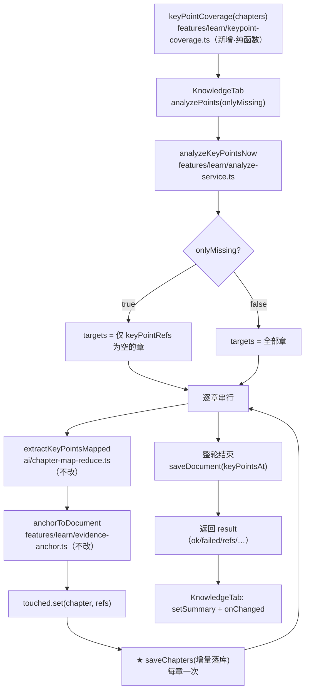
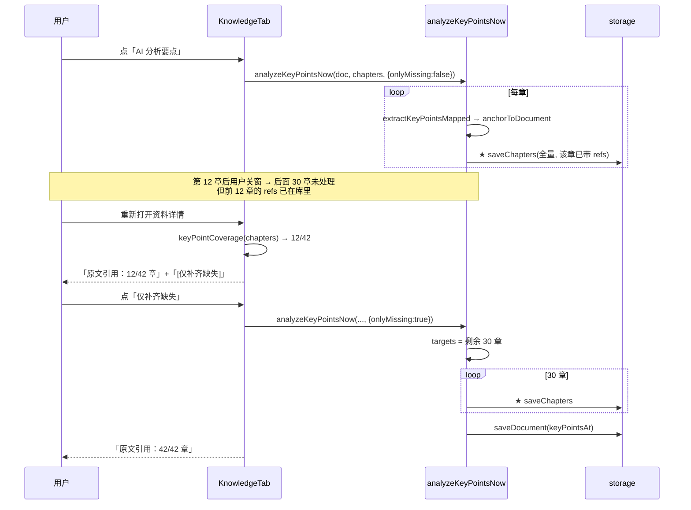

# 要点分析「落库中断 + 不可续跑」修复技术方案

| 项 | 内容 |
|---|---|
| 日期 | 2026-09-20 |
| 状态 | ✅ **已实施**（2026-09-20；T1–T6 全部落地，**21 例**新用例绿、17 条测试链全绿、`typecheck` 零新增。实施期偏差见 §13；同日另案收口汇总文案错配，见 §12.4） |
| 性质 | **缺陷修复**（非新特性）→ README / roadmap 复选框不变 |
| 触发 | `docs/library-keypoint-empty-fix-2026-09.md` §八 遗留 1：「这份 PDF 全部 44 章 `keyPointRefs` 为 0 —— AI 结果从未落库（属另一条根因，D4 决定单独排查）」 |
| 上游文档 | `docs/ai-chapter-mapreduce-design-2026-09.md`（本管道即由该方案建立） |
| 取证源 | 应用日志（`~/Library/Application Support/com.jackxuyi.personal-learning-os/logs/`）+ 本机 Tauri localStorage 真实快照 |

---

## 1. 背景

### 1.1 业务背景与用户痛点

「AI 分析要点」是资料库把**章节要点 ↔ 原文区间**绑定的唯一入口。产出的 `Chapter.keyPointRefs[]` 让用户能从要点跳回原文（`KnowledgeTab` 的引用展开、`ChapterReaderPage` 的高亮）。

用户实测现象：点「AI 分析要点」跑很久，最后界面**什么也没变**——「关键知识点」里仍只有代码兜底摘要，一条都点不到原文。

上游文档把它记为「AI 要点抽取未返回任何带原文出处的要点」（一条 `章要点分析失败` 日志），并判断「属另一条根因，下一轮单独排查」。本次排查结论：**那条日志不是根因**。

### 1.2 触发原因

本机真实数据（`plos.chapters`，2026-09-20 复测）：

| doc | 章数 | `keyPointRefs` 非空的章 | refs 总条数 | `keyPoints` 总条数 |
|---|---|---|---|---|
| `doc-3a3025f2`（东帝汶 PDF） | **42** | **0** | **0** | 140 |
| `doc-b577e2b8` | 2 | **0** | **0** | 7 |
| **合计** | **44** | **0** | **0** | **147** |

要点文本在库里（代码兜底产出），**原文引用一条都没有**。

⚠️ 更准确的形态：`keyPointRefs` 不是「空数组」，而是**44/44 章连字段都不存在**（实测 `noField=44`）。
字段从未被写过一次 ⇒ 要点分析的 AI 结果**从未成功落库过任何一章**。旁证：`doc-3a3025f2.analysis`
只有 `chaptersAt`、**没有 `keyPointsAt`**（该资料跑过章节分析，但从没跑完一轮要点分析）。

> 上游文档 `docs/library-keypoint-empty-fix-2026-09.md` §2.1 的「44 章」是**两份资料合计**（口径没错），
> 但那句「要点共 135 条」是 2026-09-16 的数；本次复测为 147 条（期间重新切分过，计数会漂）。
> 该文档已按本节结论更正归因。

### 1.3 根因取证（四路证据互相咬合）

#### 证据 A：写库是「全有全无」

`src/features/learn/analyze-service.ts::analyzeKeyPointsNow` 的 42 章循环里**没有任何写库**；唯一的 `saveChapters` 在**循环结束之后**（`:353`），`failed[]` 明细也只活在内存里。⇒ **任何中断都等于零收获**，且用户界面看不出「跑到一半废了」。

#### 证据 B：这份文档从未出现过「要点分析完成」

全历史日志（实测 **5** 个日志文件）里 `[ai:analyze]` 事件共 **12** 条，其中 `要点分析完成` **只有 1 条**（`章要点分析失败` 也只有 1 条）：

```
plos-2026-09-13.log:81  要点分析完成 doc=doc-418a4116 ok=2 failed=0 refs=2 unanchored=7 skippedBlocks=6
plos-2026-09-15.log:103 章要点分析失败 doc=doc-3a3025f2 chapter=1.5.1 民族 reason=AI 要点抽取未返回任何带原文出处的要点。
```

`doc-3a3025f2` 在 5 个日志里**没有任何 `要点分析完成`**；`doc-b577e2b8` 连一条要点分析相关日志都没有（只有 `导入后整理完成`）。⇒ **0 refs 的成因是「没跑完」与「没跑过」，不是「跑了但锚不上」。**

#### 证据 C：中断的现场（`plos-2026-09-15.log:103-108`）

```
07:43:23  章要点分析失败 doc=doc-3a3025f2 chapter=1.5.1 民族   ← AI 只回了 14 字符（outChars=14，即 {"points":[]}）
07:43:23  [ai:builtin] 生成请求 … inChars=2429                  ← 循环继续，进入下一章
07:43:23  [llm] generate prompt_chars=2528
07:45:31  [llm] generate prompt_chars=2528                      ← 同一提示词再次发起（隔 128s）
07:56:20  [llm] generate done ms=777329 out_chars=1039          ← 单次生成 777 秒（13.0 分钟）
08:00:22  [llm] generate done ms=891238 out_chars=959           ← 单次生成 891 秒（14.9 分钟）
（此后无任何要点分析调用；同日 09:22:57 起是另一条管道）
```

⇒ 跑到**第 2 章**就耗掉约 17 分钟，随即停止。09-16 该文档只跑了章节分析 + 概览（`05:04:03` / `05:08:05`），**没再跑要点分析**。

#### 证据 D：单次调用耗时波动 100 倍

同一模型 `qwen3.5:4b` 实测单次生成：`9036ms` ~ `891238ms`。而要点分析是**逐章**调用 —— 42 章至少 42 次（长章还要 ×块数）。⇒ 一轮总耗时 **6 分钟 ~ 10 小时**，完全不可预测。

### 1.4 为什么必须修

| 不修的后果 | 说明 |
|---|---|
| **数据永远进不来** | 逐章调用 + 全有全无写库 ⇒ 章数一多就必然中断 ⇒ `keyPointRefs` 恒为 0。「可溯源」这条产品承诺在长资料上完全失效。 |
| **失败不可见** | 中断既无日志完成行、也无 UI 痕迹；用户以为「AI 抽不出要点」，实际是「一轮没跑完」。 |
| **无法收敛** | 要点分析没有 `onlyMissing`（概念分析有，`analyze-service.ts:87`）⇒ 每次重跑全量，越跑越不可能跑完。 |

---

## 2. 方案目标

| 类型 | 描述 |
|---|---|
| **主要目标** | ① **中断不丢**：每章锚定成功即落库，中断只损失当前章；② **可分次收敛**：新增「仅补齐缺失」，跳过已有引用的章；③ **进度可见**：UI 如实显示「M/N 章已有原文引用」并给出可执行的下一步 |
| **非目标** | ① 不改要点抽取算法 / 提示词 / 分块策略（`ai/chapter-mapreduce` 的既有决策 D1–D6 全部不动）；② 不改概念分析管道（无实证受害，见 §3.3）；③ 不改 `storage` / `domain` 模型（**零 domain 改动**）；④ 不做并发（本地模型单实例）；⑤ 不做取消按钮（无 abort 基建，另案） |
| **成功标准** | (a) 42 章规模下中断后重开，已完成章的 `keyPointRefs` 仍在库里；(b) 「仅补齐缺失」能跳过已有引用的章，N 次会话后收敛到 N/N；(c) `keyPointsAt` 语义不变 —— 只在**整轮结束**时更新；(d) 全量回归零新增失败 |

### 2.1 决策点（D1–D4，已与用户逐条确认，全取推荐档）

| ID | 决策 | 定案 | 备选 | 理由 |
|----|------|------|------|------|
| **D1** | 写库粒度 | **每章成功即增量写** | 每 N 章一次 / 保持整轮一次 | 42 次全量 `persist` 的成本相对秒级~分钟级 AI 调用可忽略；「每 N 章」会引入第二把尺子（N 取几？）。语义上「已落库的章」与进度条一一对应，不再有「跑完才存在」的中间态。 |
| **D2** | 续跑能力 | **补 `onlyMissing` + UI 加「仅补齐缺失」入口** | 只补服务层 / 不做 | 只补服务层则用户无入口、收益归零。与 `analyzeConceptsNow.onlyMissing`（`:87`）及 `VectorIndexCard` 的「仅补齐缺失」口径统一。 |
| **D3** | 中断可见性 | **从数据派生，零字段新增** | 新增 `analysis` 字段 / 不做 | `domain/document.ts:60-64` 已立硬约定：「时间戳**只**放一处 —— 同一事实不在两处记录」。派生计数不产生第二个真源。 |
| **D4** | 本次范围 | **只修要点管道** | 要点 + 概念一起修 | 概念分析结构同构（逐章 + 整轮一次写），但日志显示它每次都跑完了（`章节分析完成 batches=4 failedBatches=0`），无实证受害；且它还要额外处理增量 `saveGraph`（整图替换语义），回归面大得多。 |

**D3 的措辞修正（实施前登记）**：D3 选项文案写的是「显示『上次未跑完』」。核对代码后确认**无法可靠区分**「跑完了但有章失败」与「跑到一半断了」——两者都表现为 `M < N`（`keyPointsAt` 只在跑完时更新，但陈旧值与缺失值不可分辨）。因此 UI **不下结论性措辞**，只给出事实「M/N 章已有原文引用」+ 可执行动作「仅补齐缺失」。这比断言「上次未跑完」诚实，且两种情形下的建议动作相同。

---

## 3. 项目现状

### 3.1 相关代码与模块

| 位置 | 行数 | 现状 |
|---|---|---|
| `src/features/learn/analyze-service.ts` | 448 | 四条分析的编排。`analyzeKeyPointsNow`（`:287`）：逐章串行 → `extractKeyPointsMapped` → `anchorToDocument` → **循环外一次性写库**（`:353-357`） |
| `src/ai/chapter-map-reduce.ts` | 474 | 要点族管道本体（分块 map → 引用式归并）。**本方案不改** |
| `src/features/learn/detail/KnowledgeTab.tsx` | 396 | 概念 / 要点分析入口（`analyzePoints` `:111`、`extractAll` `:156`），含 `pointsTask` 任务记录与 `setSummary` 汇总 |
| `src/features/learn/evidence-anchor.ts` | 259 | `anchorToDocument` / `locateQuote`（两档匹配）。**本方案不改** |
| `src/storage/types.ts` | — | `saveChapters(documentId, chapters): Promise<void>`（`:60`）—— **整批**语义，无单章写接口 |

**逐章增量写的实现形态**：`saveChapters` 契约就是「写这份文档的整章列表」，故每章成功后调 `saveChapters(doc.id, chapters.map(c => touched.get(c.id) ?? c))` 即可 —— 已处理的章带新 `keyPointRefs`，未处理的章原样回写（幂等）。

### 3.2 相关文档与约定

| 文档 | 关系 |
|---|---|
| `docs/ai-chapter-mapreduce-design-2026-09.md` | 本管道上游方案。其 §11.3 成功标准含「锚定失败率不高于改造前」—— 该指标**已达标**，本次问题不在锚定率 |
| `docs/library-keypoint-empty-fix-2026-09.md` | §八 遗留 1 即本次修的对象；其 §2.1 的「44 章 / 135 条」与本方案 §1.2 实测不符，需一并更正 |
| `rules/layer-import-boundaries.mdc` | UI → stores/storage；本方案不碰 IPC / Tauri |
| `domain/document.ts` §`analysis` | 「同一事实不在两处记录」（D3 的依据） |

⚠️ `analyze-service.ts` 头注释写「③ 要点分析额外写 `Chapter.keyPointRefs`」—— 本方案需在该注释补「**增量写**」口径，否则下一次改动会照旧按「整轮一次」理解。

### 3.3 约束与依赖

- **零 `src-tauri/**` 改动**：~~`TauriStorage extends LocalStorageAdapter`，章节数据（RAG 五类之外）全由父类 localStorage 承载，`saveChapters` 走的正是父类~~
  ⚠️ **理由已过时（2026-09-21）**：`Chapter` 已随 F10 前置下沉 SQLite（schema v5），`saveChapters` 现由 `storage/tauri.ts` 覆写。
  **结论仍成立**：本方案**只改 `features/` 与 i18n** —— 增量写落在 `Chapter.keyPointRefs`、走**既有** `saveChapters` 入口，无需新增命令或改表。
- **零 `domain/` 改动**（D3 定案）。
- `ai/` 不得 import `features/`：本方案的增量写发生在 `features/learn/analyze-service.ts`（已有分层），不新增跨界。
- 单测不得 import `.tsx`：派生计数必须落在 `.ts`（见 §8.2）。

---

## 4. 技术架构

### 4.1 总体架构



★ 标记处即本次新增的落库点；其余节点均为既有链路，零改动。

### 4.2 模块职责

| 模块 | 职责 | 本次变化 |
|---|---|---|
| `analyze-service.ts` | 编排：选目标 → 逐章调管道 → 锚定 → 落库 | 新增 `onlyMissing` 选目标；把落库从「循环外一次」改为「循环内每章一次」 |
| `keypoint-coverage.ts`（新增） | **纯派生**：从 `Chapter[]` 数出「已有引用的章数 / 总章数 / 缺失章数」 | 新增 |
| `KnowledgeTab.tsx` | 入口 + 进度 + 汇总 + 覆盖度展示 | 新增「仅补齐缺失」按钮与覆盖度行 |
| `chapter-map-reduce.ts` / `evidence-anchor.ts` / `storage/*` | 抽取、锚定、持久化 | **不改** |

### 4.3 数据模型与 API

**`AnalyzeKeyPointsOptions`（改）**：

```ts
export interface AnalyzeKeyPointsOptions {
  storage: StorageAdapter;
  provider: AIProvider;
  model?: string;
  /**
   * true = 只补「还没有原文引用」的章；false（默认）= 全部重新分析。
   * 与 `AnalyzeConceptsOptions.onlyMissing` 同口径（`:87`），
   * 默认值也一致（false）—— 不改变既有调用行为。
   */
  onlyMissing?: boolean;
  onProgress?: (i, total, chapter, block?) => void;
  now?: number;
}
```

**`AnalyzeKeyPointsResult`（不变）**：`ok / failed / refs / unanchored / skippedBlocks / mergeFallbacks / analyzedAt`。

> ⚠️ **刻意不加**「已完成章数」字段：该事实可从调用方手里的 `chapters` 派生（D3），加进结果就是第二个真源。

**`keypoint-coverage.ts`（新增纯函数模块，最终形态三个导出）**：

```ts
/** 章是否已有 ≥1 条原文引用 —— 覆盖度与选目标共用的唯一判据。 */
export function hasKeyPointRefs(chapter: Chapter): boolean;

export interface KeyPointCoverage {
  /** 已有 ≥1 条原文引用的章数。 */
  withRefs: number;
  /** 章总数。 */
  total: number;
  /** 尚无引用的章数（= total - withRefs）。 */
  missing: number;
  /** true = 还有章待补（total > 0 且 missing > 0）。 */
  incomplete: boolean;
}
export function keyPointCoverage(chapters: readonly Chapter[]): KeyPointCoverage;

/** 选目标：onlyMissing=true → 只挑无引用的章；false → 全部（顺序不变）。 */
export function keyPointsTargets(chapters: readonly Chapter[], onlyMissing: boolean): Chapter[];
```

> ⚠️ §4.3 初稿只写了 `keyPointCoverage`，**未写 `keyPointsTargets` / `hasKeyPointRefs`**。
> 实施时把「选目标」也从服务层内联 `filter` 抽了出来 —— 理由见 §13 偏差 ②。

**存储读/写路径**（`rules/layer-import-boundaries.mdc`）：`KnowledgeTab`（UI）→ `analyzeKeyPointsNow`（features/service）→ `storage.saveChapters`（storage）。**不经 stores**（分析入口是 imperative 调用，非响应式状态）。无 invoke / 无 Tauri。

### 4.4 状态与副作用

| 副作用 | 时机 | 说明 |
|---|---|---|
| `storage.saveChapters(doc.id, 全量 chapters)` | **每章锚定成功后** | 新增。幂等；未处理章原样回写 |
| `storage.saveChapters(doc.id, 全量 chapters)` | 整轮结束时**再写一次** | 保留作「收尾 flush」（防御性，成本 1 次） |
| `storage.saveDocument({...doc, analysis.keyPointsAt})` | **仅整轮正常结束** | **语义不变**：它表示「最近一次跑完的时间」。中断时不写（写了就是谎报） |
| `onProgress(i, total, chapter, block?)` | 每章 / 每块 | 不变 |
| `aiLog("warn", "analyze", "章要点分析失败")` | 每章失败 | 不变（明细仍在内存 + 日志，不持久化） |

---

## 5. 交互流程

### 5.1 主流程（首跑 42 章，中途关窗）



### 5.2 分支与异常流程

| 情形 | 行为 |
|---|---|
| 单章 AI 失败（如返回 `{"points":[]}`） | 不写该章（`touched` 无更新）；进 `failed[]`；**已处理章不受影响**；循环继续 |
| 单章锚定全失败（`refs` 为空但未抛错） | 保留该章原 `keyPoints`（既有口径）；`keyPointRefs` 置空数组并**落库**（与「无引用」这一事实一致）；计入 `unanchored` |
| 整轮全部章失败 | 无 `touched` 更新 → 每次增量写都是空操作 → 库里零变化；`failed` 全量返回给 UI 汇总 |
| 整轮被中断（关窗 / 崩溃） | 已完成章的 refs 已在库；**无 `keyPointsAt` 更新**；重开时覆盖度如实反映 |
| `onlyMissing=true` 且全部章已有引用 | `targets` 为空 → 直接返回 `ok=0`，不发起任何 AI 调用（**零成本**）。UI 侧按钮同时置灰 |
| `onlyMissing=false` | 与改造前同：全部章重跑并覆盖 |

### 5.3 时序图

见 §5.1（复杂交互仅此一条，已用时序图表达）。

---

## 6. 用户用例（User Cases）

### UC-01：42 章长资料首跑中断后分次补齐

- **前置**：资料已切分，42 章均无 `keyPointRefs`；AI 已配置
- **步骤**：① 点「AI 分析要点」；② 跑到第 12 章关窗；③ 重开资料详情；④ 点「仅补齐缺失」
- **期望**：③ 覆盖度显示「12/42 章」；④ 只对剩余 30 章发起调用，跑完显示「42/42」，`keyPointsAt` 更新
- **异常分支**：④ 中途再断 → 覆盖度变为中间值，可再次续跑（幂等，不重复处理已有章）

### UC-02：短资料（2 章）回归

- **前置**：2 章，均无引用
- **步骤**：点「AI 分析要点」
- **期望**：与改造前**行为一致**（`refs` 条数、`unanchored`、`summary` 文案均不变），仅落库次数由 1 次变为 3 次（2 章 + 1 次 flush）
- **异常分支**：无

### UC-03：全量重跑覆盖已有引用

- **前置**：覆盖度 42/42
- **步骤**：点「AI 分析要点」（非「仅补齐缺失」）
- **期望**：42 章全部重跑，`keyPointRefs` 被覆盖为本次结果；`keyPointsAt` 更新
- **异常分支**：某章本次失败 → 该章的**旧 refs 被清空**（`touched` 已 set 为空数组）。⚠️ 这是既有语义（「单一真源」），本方案**不改变**，但在 §7 线框里给出「全量重跑会覆盖」的说明文案

### UC-04：AI 未配置 / 无章节

- **前置**：AI 未配置，或资料未切分
- **步骤**：入口按钮不可用（既有 `aiReady` / `chapters.length` 守卫）
- **期望**：既有 `AnalyzeServiceError("not-configured" | "no-chapters")` 行为不变
- **异常分支**：无

---

## 7. 线框 UI（Wireframe）

### 7.1 KnowledgeTab 要点区头部 — 默认状态（覆盖度不完整）

```text
┌─ 关键知识点 ─────────────────────────────────────────────────────────┐
│  原文引用：12/42 章                        [仅补齐缺失]  [AI 分析要点] │
│  · 章 3.1 东帝汶投资合作概况                                          │
│    • 东帝汶被列为最贫困国家之一                       [引用 ▾]        │
│    • 石油与天然气收入占财政收入的 90%                 [引用 ▾]        │
└──────────────────────────────────────────────────────────────────────┘
```

### 7.2 其他状态

| 状态 | 呈现 |
|---|---|
| **加载中** | 既有 `pointsTask` 状态行（`busyBlock` / `extracting` 文案）+ 微进度条。**不变** —— 进度条本身已按 `i/n` 推进，与增量落库天然对齐（每条进度都对应一条已落库的章） |
| **空**（42/42 之外的反面：0/42 且从未跑过） | 覆盖度行显示「原文引用：0/42 章」；按钮文案不变 |
| **完成** | 「原文引用：42/42 章」；`incomplete=false` → **覆盖度行仍显示**（它是稳定事实），但「仅补齐缺失」置灰 |
| **错误** | 既有 `setSummary({ok:0, failed:[…], extra: <err.message>})` 汇总区。**不变** |

### 7.3 交互说明

- 「仅补齐缺失」：`disabled = !aiReady || anyTaskRunning || coverage.incomplete === false`
- 「AI 分析要点」：`disabled = !aiReady || anyTaskRunning || chapters.length === 0`（既有条件，**不加** `incomplete` 判断）
- 二者共用 `pointsTask`（同一时刻只允许一个），既有 `pointsTask.running || conceptsTask.running` 互斥逻辑不变
- 覆盖度文字用 `text-ink-2`（既有次级文字 token）；无新 hex、无新组件
- ⚠️ **待抽声明**：「仅补齐缺失」按钮是仓库里**第 2 处** onlyMissing 入口（第 1 处 `features/settings/VectorIndexCard.tsx:183`）。未达「≥10 行 × ≥3 处」的强制抽取线，故本次**不抽取**，但按 `AGENTS.md` 约定**在此声明「待抽」**——出现第 3 处时必须抽成公共组件。

---

## 8. 涉及文件及改动伪代码

### 8.1 `src/features/learn/analyze-service.ts`（修改）

```ts
// ① Options 加 onlyMissing（默认 false，与 AnalyzeConceptsOptions 同口径）
export interface AnalyzeKeyPointsOptions {
  storage: StorageAdapter;
  provider: AIProvider;
  model?: string;
  /** true = 只补还没有原文引用的章；false（默认）= 全部重跑（覆盖旧引用）。 */
  onlyMissing?: boolean;
  onProgress?: (i: number, total: number, chapter: Chapter, block?: { block: number; blocks: number }) => void;
  now?: number;
}

export async function analyzeKeyPointsNow(doc, chapters, opts): Promise<AnalyzeKeyPointsResult> {
  const { storage, provider, model, onlyMissing = false, onProgress, now = Date.now() } = opts;
  // …既有校验不变…

  // ② 选目标（新增）：只有「尚无原文引用」的章才补齐
  const targets = onlyMissing
    ? chapters.filter((c) => (c.keyPointRefs?.length ?? 0) === 0)
    : chapters;

  const failed = []; const touched = new Map<string, Chapter>();
  let refs = 0, unanchored = 0, skippedBlocks = 0, mergeFallbacks = 0;

  for (let i = 0; i < targets.length; i++) {
    const c = targets[i];
    onProgress?.(i + 1, targets.length, c);
    try {
      const body = text.slice(c.contentRef.start, c.contentRef.end);
      const out = await extractKeyPointsMapped(provider, {
        chapterTitle: c.title, text: body,
        anchor: (quote) => anchorToDocument(body, quote, c.contentRef.start),
        onBlock: (k, K) => onProgress?.(i + 1, targets.length, c, K > 1 ? { block: k, blocks: K } : undefined),
      });
      touched.set(c.id, {
        ...c,
        keyPointRefs: out.refs,
        ...(out.refs.length > 0 ? { keyPoints: out.refs.map((r) => r.point) } : {}),
      });
      refs += out.refs.length; unanchored += out.unanchored;
      skippedBlocks += out.skippedBlocks;
      if (out.mergeFallback) mergeFallbacks++;

      // ★ 新增：每章成功即增量落库 —— 中断只损失当前章。
      // 契约是「整批」，故回写全量列表（未处理章原样带回），天然幂等。
      await storage.saveChapters(doc.id, chapters.map((x) => touched.get(x.id) ?? x));
    } catch (err) {
      // 既有：逐章失败日志 + 进 failed[]，不写库（该章无变化）
      aiLog("warn", "analyze", "章要点分析失败", { doc: doc.id, chapter: c.title, reason: aiErrPreview(err) });
      failed.push({ chapterId: c.id, title: c.title, reason: err instanceof Error ? err.message : String(err) });
    }
  }

  // ③ 收尾 flush（防御性，保留 1 次）+ keyPointsAt 只在整轮结束写（语义不变）
  await storage.saveChapters(doc.id, chapters.map((c) => touched.get(c.id) ?? c));
  await storage.saveDocument({ ...doc, analysis: { ...doc.analysis, ...(model ? { model } : {}), keyPointsAt: now } });
  aiLog("info", "analyze", "要点分析完成", { doc: doc.id, ok: targets.length - failed.length, failed: failed.length, refs, unanchored, skippedBlocks, mergeFallbacks, ms: Date.now() - startedAt });

  return { ok: targets.length - failed.length, failed, refs, unanchored, skippedBlocks, mergeFallbacks, analyzedAt: now };
}
```

> ⚠️ `ok` / `failed` 的分母由 `chapters.length` 变为 `targets.length`。这是**必要**的：`onlyMissing` 下 `ok` 应反映「本次实际处理了几章」，否则 UI 会显示「42 章里 30 章失败」这种假象。既有 `onlyMissing=false` 调用下 `targets === chapters`，**行为不变**。

### 8.2 `src/features/learn/keypoint-coverage.ts`（新增·纯函数）—— **实施后形态**

初稿只含 `keyPointCoverage`（见下）。实施时补了 `hasKeyPointRefs` 与 `keyPointsTargets`
（理由见 §13 偏差 ②），最终三个导出：

```ts
export function hasKeyPointRefs(chapter: Chapter): boolean {
  return (chapter.keyPointRefs?.length ?? 0) > 0;
}

export interface KeyPointCoverage {
  withRefs: number;
  total: number;
  missing: number;
  incomplete: boolean;
}

export function keyPointCoverage(chapters: readonly Chapter[]): KeyPointCoverage {
  const total = chapters.length;
  let withRefs = 0;
  for (const c of chapters) if (hasKeyPointRefs(c)) withRefs += 1;
  const missing = total - withRefs;
  return { withRefs, total, missing, incomplete: total > 0 && missing > 0 };
}

export function keyPointsTargets(chapters: readonly Chapter[], onlyMissing: boolean): Chapter[] {
  return onlyMissing ? chapters.filter((c) => !hasKeyPointRefs(c)) : [...chapters];
}
```

老数据兼容口径：`keyPointRefs` **缺失（`undefined`）与空数组同义**，都算「缺失」——
这正是库里 44 章的真实形态（字段从未存在过）。

### 8.3 `src/features/learn/detail/KnowledgeTab.tsx`（修改）—— **实施后形态**

```tsx
// ① 覆盖度改为派生自共享纯函数（**替换**原有的内联 filter，见 §13 偏差 ①）
const coverage = useMemo(() => keyPointCoverage(chapters), [chapters]);

// ② analyzePoints 接收 onlyMissing（调用方必须显式传参，见下方 ⚠️）
const analyzePoints = (onlyMissing: boolean) => {
  if (chapters.length === 0 || !aiReady || pointsTask.running || conceptsTask.running) return;
  if (onlyMissing && !coverage.incomplete) return;   // 双保险：无缺失时零成本返回
  const provider = buildActiveProvider();
  setSummary(undefined);
  void pointsTask.run(async (report, done) => {
    const result = await analyzeKeyPointsNow(doc, chapters, {
      storage, provider, onlyMissing,
      onProgress: (i, n, ch, blk) => report(progressText(i, n, ch, blk), n > 0 ? i / n : undefined),
    });
    // …既有 extra / setSummary / done / notifyDocsChanged / onChanged 不变…
  }).catch(/* 既有不变 */);
};

// ③ 要点区 actions 里插入「仅补齐缺失」（覆盖度行**不改动位置与文案**，见 §13 偏差 ①）
<Button
  size="sm" variant="outline"
  onClick={() => analyzePoints(true)}
  disabled={!aiReady || pointsTask.running || conceptsTask.running || !coverage.incomplete}
  data-testid="keypoints-backfill"
>
  {t.learn.detail.knowledge.onlyMissingPoints}
</Button>
<Button
  size="sm" variant="outline"
  onClick={() => analyzePoints(false)}
  loading={pointsTask.running}
  disabled={conceptsTask.running || !aiReady || chapters.length === 0}
  data-testid="keypoints-analyze"
>
  {coverage.withRefs > 0 ? t.learn.detail.knowledge.reExtractPoints
                         : t.learn.detail.knowledge.extractPoints}
</Button>
```

> ⚠️ **`onClick={analyzePoints}` 是个陷阱**：加了参数之后，直接把函数挂到 `onClick` 会把
> `MouseEvent` 当 `onlyMissing`（恒真）传进去，等于悄悄把「AI 分析要点」换成「仅补齐」。
> 故两处都写成箭头函数显式传参，且有源码级断言钉住（`TC-KP-WIRE-06`）。
>
> ⚠️ 覆盖度行**沿用既有位置与文案**：`<p className="mt-2 text-xs text-ink-3">` 渲染
> `pointsDone(coverage.withRefs, coverage.total)`（=「已带原文引用 M/N 章」）。
> §7 初稿线框把它画进了头部 actions —— 那是**画法**，不是改动要求，见 §13 偏差 ①。

### 8.4 `src/i18n/messages/zh.ts` + `en.ts`（修改，成对）—— **实施后只新增 1 个键**

| key | zh | en |
|---|---|---|
| `learn.detail.knowledge.onlyMissingPoints` | `仅补齐缺失` | `Fill missing only` |

- **覆盖度文案复用既有键**：`learn.detail.knowledge.pointsDone(done, total)` =
  「已带原文引用 `${done}/${total}` 章」/「`${done}/${total}` chapters have source quotes」——
  与初稿拟新增的 `pointsCoverage` 是**同一个事实、同一句话**。再加一个键就是「两把尺子」，
  故**撤销**该键（§13 偏差 ①）。
- 文案与设置页 `VectorIndexCard.onlyMissing`（「仅补齐缺失」/「Fill missing only」）逐字一致；
  两处命名空间不同是该仓库既有惯例（各 area 自带键）。
- 既有 `extractPoints` / `reExtractPoints` / `pointsDone` / `pointsUnanchored` 等键**不动**。

> ✅ **同日另案收口（2026-09-20）**：要点路径的汇总文案原先复用
> `learn.detail.knowledge.extractDone`，而该键的中文是「**概念**分析完成：成功 N 章 · 失败 M 章」——
> 跑完要点分析后 UI 显示「概念分析完成」。已按管道**拆成两键**：
>
> | key | zh | en |
> |---|---|---|
> | `conceptsAnalysisDone(ok, failed)`（原 `extractDone` 更名） | `概念分析完成：…` | `Concept analysis done: …` |
> | `pointsAnalysisDone(ok, failed)`（**新增**） | `要点分析完成：…` | `Key-points analysis done: …` |
>
> 键名自带主语，防止再被另一条路径复用。`KnowledgeTab` 的汇总状态同步补上**必需**字段
> `kind: 'points' \| 'concepts'`（两条管道共用同一块汇总 UI，不记来源就只能互相借用文案）；
> 回归锁 `TC-KP-WIRE-07/08` + `TC-KP-REG-06`（见 §12.4）。

### 8.5 `tests/keypoint-persist.test.ts`（新增）—— **实施后形态（18 例；同日增至 21 例）**

见 §12（用例编号已按实施调整）。形态：**纯函数直跑 + 源码级接线断言**；不 import `.tsx`、
不 import `features/learn/analyze-service.ts`（它依赖 storage/provider 实例）。

> **为什么不构造「假 provider 跑真实管道」的行为测试**（初稿曾设想，实施时否决）：
> `extractKeyPointsMapped` 对单块失败是**计入 `skippedBlocks` 而非抛错**，用假 provider 反推
> `failed[]` 会与管道的真实错误语义耦合 —— 管道一调整错误分类，测试就以「假失败」报警，
> 把注意力从真实回归上引开。
>
> 改法：把**选目标**也抽成纯函数（§13 偏差 ②），于是「哪些章会被处理」可直跑验证；
> 「循环内写库 / 循环外写时间戳 / UI 不许内联数第二遍 / 两个按钮必须显式传参」这类**接线事实**
> 用源码级断言锁死 —— 与 `tests/session-rating.test.ts` 的既有手法一致
> （见 `skills/package-docs-driven-change` §5.1）。

### 8.6 `package.json`（修改）

新增 `test:keypersist`，并串入 `test:library` 链（置于 `test:portability` **之前**，末位仍是 `test:portability`）。

### 8.7 `docs/library-keypoint-empty-fix-2026-09.md`（修改）—— 实际改动

- §2.1：「44 章」这个**口径没错**（= `doc-3a3025f2` 42 + `doc-b577e2b8` 2 合计），补注说明其构成
- §5 D4 行 + §八 遗留 1：整条更正归因，标注 ✅ 已修，并给出三路实测证据
  （44/44 章**无 `keyPointRefs` 字段** / `analysis` 无 `keyPointsAt` / 全史仅 1 条「要点分析完成」）
- §6.1：补一行 2026-09-20 复测（要点 135 → **147**，随重新切分漂移；「丢弃 3 条」的结论不受影响）

### 8.8 `docs/ai-chapter-mapreduce-design-2026-09.md`（修改）—— 实际改动

§2「决策点」表追加 **D7**（落库粒度 = 逐章增量）/ **D8**（`onlyMissing` 对齐），
§5.1 第 10 步由「全章处理完 → 一次性写库」改为「每章处理完 → 立即写库」，
§变更记录追加一行。

---

## 9. 任务清单（Tasks）

| ID | 任务 | 依赖 | 验收 | 结果（2026-09-20） |
|---|---|---|---|---|
| T1 | `keypoint-coverage.ts` 纯函数 + 单测 | — | `test:keypersist` 中 TC-KP-COV-* 全绿 | ✅ 三个导出落地（含实施期新增的 `hasKeyPointRefs` / `keyPointsTargets`，§13 偏差 ②） |
| T2 | `analyze-service.ts`：`onlyMissing` + 逐章增量写；同步头注释 | T1 | `typecheck` 零新增；源码级断言过 | ✅ 循环内写 chapter、循环外写 `keyPointsAt`；头注释已写明增量口径；`ok/failed` 分母改 `targets.length` |
| T3 | i18n 双语新键 | — | `test:i18n` 绿；键在两个字典中都存在 | ✅ 只加 `onlyMissingPoints`（`pointsCoverage` 撤销，§13 偏差 ①） |
| T4 | `KnowledgeTab.tsx`：覆盖度行 + 「仅补齐缺失」按钮 | T2、T3 | `typecheck` 零新增 | ✅ 覆盖度行沿用既有 `pointsDone` + `keyPointCoverage`（替换内联 filter）；新增按钮 + 2 个 `data-testid` |
| T5 | 测试套件补齐 + `package.json` 串链 | T1–T4 | `test:keypersist` 全绿；`test:library` 全绿 | ✅ **18 例**全绿（同日另案增至 **21 例**，见 §12.4）；`test:keypersist` 串入 `test:library`（末位仍 `test:portability`） |
| T6 | 文档同步（§8.7 + §8.8） | T1–T5 | 两文档与实测一致 | ✅ 另更正了 §8.7 的「更正方向」（§13 偏差 ③） |

## 10. 实施步骤

1. 先落 T1（纯函数 + 测试）—— 最小可验证单元。
2. T3（i18n）**必须先于** T4（消费它的 UI）。
3. T2 → T4 → T5。
4. T6 收尾；实测复核文档里引用的所有行数 / 章节数 / 条数（**不凭记忆**）。
5. 分层提交：`feat(learn)` 纯函数 → `feat(i18n)` → `fix(learn)` service → `feat(ui)` 入口 → `test` → `docs`；逐提交可编译抽查。

## 11. 测试方案

### 11.1 测试范围与策略

| 层 | 覆盖 |
|---|---|
| **纯逻辑单测**（`node --experimental-strip-types`） | `hasKeyPointRefs` / `keyPointCoverage` / `keyPointsTargets` 的行为（空数组 / 全有 / 全无 / 部分 / `keyPointRefs: undefined` / 覆盖度与选目标咬合）；`analyze-service.ts` 与 `KnowledgeTab.tsx` 的**源码级接线断言** |
| **手工 QA** | UC-01 的中断-续跑（需真实 AI 与长资料，用户执行） |
| **回归** | `npm run typecheck` + `test:library` 全链 |

**不做的**：浏览器级校验（`rules/no-headless-browser-validation.mdc`）；真实 AI 调用（单测零真实 AI）。

### 11.2 测试环境与数据

- 运行器：`node --experimental-strip-types --no-warnings --import ./tests/register-loader.mjs`
- 被测纯逻辑文件必须是 `.ts`（`strip-types` 不支持 JSX / TS 参数属性）
- 源码级断言读取的文件：`src/features/learn/analyze-service.ts`、`src/features/learn/detail/KnowledgeTab.tsx`
- 注释须先剥离再断言（`codeOf()`）—— 注释里的**反面引用**（把错误写法原样写进注释）会被正则误命中

### 11.3 通过标准（全部实测通过）

- [x] `npm run test:keypersist` 全绿 —— **21/21**（实施时 18/18，同日另案 +3）
- [x] `npm run test:library` 全链全绿（末位仍 `test:portability`）
- [x] `npm run typecheck` 零**新增**错误（仅 3 条既存 `AIModelsSection` 债）
- [x] 逐提交可编译抽查与基线持平（worktree + `tsc --noEmit` 数 error）
- [x] `analyze-service.ts` 头注释已写明「增量落库」口径

---

## 12. 测试用例

### 12.1 覆盖度与选目标行为（TC-KP-COV-01~05 / TC-KP-TGT-01~05，直跑纯函数）

| ID | 输入 | 期望 |
|---|---|---|
| TC-KP-COV-01 | `[]` | `{withRefs:0, total:0, missing:0, incomplete:false}` |
| TC-KP-COV-02 | 2 章，均 0 refs | `{0,2,2,true}` |
| TC-KP-COV-03 | 2 章，均 ≥1 ref | `{2,2,0,false}` |
| TC-KP-COV-04 | 3 章，refs 数 = 1 / 0 / 2 | `{2,3,1,true}` |
| TC-KP-COV-05 | 1 章，`keyPointRefs` 为 `undefined` | `{0,1,1,true}`；`hasKeyPointRefs` 对 `undefined` / `0` / `≥1` 分别是 `false` / `false` / `true` |
| TC-KP-TGT-01 | `onlyMissing=false` | 顺序原样返回全部章（与改造前等价） |
| TC-KP-TGT-02 | `onlyMissing=true`，3 章 refs = 0 / 2 / 0 | `["c1","c3"]` |
| TC-KP-TGT-03 | `onlyMissing=true` 且全部已有引用 | `[]`（零 AI 调用） |
| TC-KP-TGT-04 | 章列表为空 | 两种模式都返回 `[]`，不抛错 |
| TC-KP-TGT-05 | **一把尺子** | `coverage.missing === keyPointsTargets(set, true).length`（4 组输入） |

### 12.2 接线（TC-KP-WIRE-01~06，源码级断言；断言前统一 `codeOf()` 剥注释）

| ID | 断言 | 防的是什么 |
|---|---|---|
| TC-KP-WIRE-01 | `for (…targets.length…)` 循环**体内**存在 `storage.saveChapters(`；整个函数恰 2 处（逐章 1 + 收尾 flush 1） | 防止回归成「循环外一次」的全有全无 |
| TC-KP-WIRE-02 | 服务层调用 `keyPointsTargets(chapters, onlyMissing)`，且**不含** `keyPointRefs?.length`；`hasKeyPointRefs` 体内必须读 `keyPointRefs` | 判据只允许存在一份，且必须真的在读该字段 |
| TC-KP-WIRE-03 | 循环体内**无** `keyPointsAt` / `saveDocument(`；函数体内**有** `keyPointsAt` | `keyPointsAt` =「跑完」语义，跑一半不能写 |
| TC-KP-WIRE-04 | 解构处存在 `onlyMissing = false` | 默认行为不得被悄悄改成「只补齐」 |
| TC-KP-WIRE-05 | `KnowledgeTab.tsx` 调用 `keyPointCoverage(`、不含 `keyPointRefs?.length`、且仍渲染 `pointsDone(` | UI 不得再内联数第二遍；覆盖度行不得消失 |
| TC-KP-WIRE-06 | 存在 `analyzePoints(true)` 与 `analyzePoints(false)`，**不存在** `onClick={analyzePoints}`，且含 `!coverage.incomplete` | 防 `MouseEvent` 被当 `onlyMissing`；防按钮不置灰 |

### 12.3 边界与回归（TC-KP-REG-04~05）

| ID | 场景 | 结果 |
|---|---|---|
| TC-KP-REG-01 | `onlyMissing=true` 且全部章已有引用 | 由 **TC-KP-TGT-03** 覆盖（`targets` 为空 ⇒ 循环体不执行 ⇒ 零 AI 调用）；「整轮仍写 `keyPointsAt`」由 TC-KP-WIRE-03 锁位置 |
| TC-KP-REG-02 | `onlyMissing=false` | 由 **TC-KP-TGT-01** 覆盖（`targets === chapters`，顺序不变） |
| TC-KP-REG-03 | 单章失败后其余章继续 | 循环体内 `try/catch` + 逐章落库的结构由 WIRE-01 锁定；**刻意不用假 provider 反推 `failed[]`**（理由见 §8.5） |
| TC-KP-REG-04 | 端点 700 行 | `analyze-service.ts`、`KnowledgeTab.tsx` 均 ≤700 行 ✅ |
| TC-KP-REG-05 | i18n 双语成对 | `onlyMissingPoints` 在 `zh.ts` / `en.ts` 同时存在、均非空、且**互不相同**（防漏翻） |

> 初稿的 `TC-KP-REG-01~03` 原打算用假 provider 跑真实管道，实施时否决并**归并进 TGT/WIRE 两组**
> —— 覆盖同一批不变量，但不与管道的错误语义耦合（§8.5）。

### 12.4 汇总文案归属（同日另案，TC-KP-WIRE-07~08 + TC-KP-REG-06）

要点与概念**共用同一块完成汇总 UI**，故「这块 UI 的文案归谁」必须能被断言锁住。

| ID | 断言 | 防的是什么 |
|---|---|---|
| TC-KP-WIRE-07 | `analyzePoints` 块内必须出现 `pointsAnalysisDone(` 且**不得**出现 `conceptsAnalysisDone(`；`extractAll` 块内反向 | 要点跑完报「概念分析完成」的文案错配复发 |
| TC-KP-WIRE-08 | `summary` 状态类型含**必需**字段 `kind: 'points' \| 'concepts'`；`summaryHeadline` 分派器读 `.kind ===` 且两个文案键都在其中；两路径 `setSummary` 都带 `kind` | 状态不记来源（可选字段 = 下次又会忘了带）；也防覆盖度行 `pointsDone` 被误并进完成汇总 |
| TC-KP-REG-06 | 两条完成文案中英都存在、**互不相同**、主语真的是各自的管道名（`要点`/`概念`、`point`/`concept`），且 `ok`/`failed` 两个数都如实上报 | 拆了键却复制同一句话（等于又变成一个键）；只报成功数、把失败吞掉 |

> 手法同 §12.2：`codeOf()` 先剥注释再断言；分派器用 `bracedBlockOf` 取块，**只锁「按 kind 选主语」这个不变量，不锁局部变量名**。
> 实测提醒：初版断言写成 `summary.kind ===`（锁了形参名），分派器形参叫 `s` 就红了 —— 断言越界会把测试变成代码的复印件（`skills/package-docs-driven-change` §5.2）。

---

## 13. 实施期偏差与结果（2026-09-20）

三处偏离初稿，均为「实施中发现更正确的做法」而非降级，逐条登记：

| # | 初稿 | 实施 | 理由 |
|---|---|---|---|
| ① | 新增 i18n 键 `learn.detail.knowledge.pointsCoverage`，并在要点区头部**新增**一行覆盖度 | **撤销该键**；覆盖度改用既有 `pointsDone(withRefs, total)`，**位置与文案都不动** | 核对代码发现 `KnowledgeTab.tsx` 早已渲染 `pointsDone(withRefs, chapters.length)` =「已带原文引用 M/N 章」—— 与拟新增的键**是同一个事实、同一句话**。再加一个键 + 再画一行，就是仓库明令避免的「两把尺子」。§7 线框只是**画法**，不是改动要求 |
| ② | 选目标 `chapters.filter((c) => (c.keyPointRefs?.length ?? 0) === 0)` **内联在服务层** | 抽成 `keypoint-coverage.ts::keyPointsTargets`，与覆盖度共用 `hasKeyPointRefs` | UI 覆盖度与服务层选目标在数**同一个条件** —— 属「同一规则散在多处＝根因」。抽出后：a) 判据唯一；b) 选目标变成可直跑单测的纯函数，补上了 §8.5 里「服务层行为测不了」的缺口 |
| ③ | §8.7 拟把上游文档的「44 章」更正为「42 章」、「135 条」更正为「140 条」 | 更正为：**44 章口径没错**（= 42 + 2 两份合计，补注构成）；**135 → 147**（2026-09-20 复测） | 复测发现 `plos.chapters` 是 `Record<docId, Chapter[]>`：`doc-3a3025f2` 42 章 + `doc-b577e2b8` 2 章 = **44**。初稿把「该 PDF 42 章」与「两份合计 44 章」混为一谈。「**不凭记忆改数**」的纪律在这里救了一次 —— 否则会把上游文档里一个**正确**的数字改错 |

### 13.1 实施后新增的事实（供后续引用）

- `keyPointRefs` 在库里**连字段都不存在**（44/44 章 `noField`）—— 比「空数组」更强的证据：字段**从未被写过一次**。
- `doc-3a3025f2.analysis = { chaptersAt: 1789455723200 }` —— **有 `chaptersAt`、无 `keyPointsAt`**：跑过章节分析，但从没跑完一轮要点分析。`doc-b577e2b8.analysis = {}`。
- 全史唯一一条「要点分析完成」来自 `doc-418a4116`（现已不在库）：`ok=2 refs=2 unanchored=7 skippedBlocks=6 ms=1163530` —— **2 章跑了 19.4 分钟**，直接印证「42 章一轮不可行」。

### 13.2 刻意未做（登记备查，勿顺手统一）

- **单章「全块失败但未抛错」时旧 `keyPointRefs` 会被清空**：既有「单一真源」语义（初稿 §5.2 / UC-03 已登记），本次不改。
- **不做取消按钮 / 不做并发**：无 abort 基建、本地模型单实例（初稿非目标）。
- **概念分析管道同构缺陷不动**：无实证受害（D4），且要额外处理 `saveGraph` 的整图替换语义。
- **要点路径汇总文案错配** —— ✅ **已修（2026-09-20 同日）**：`extractDone` 中文为「概念分析完成…」，要点跑完也用它（§8.4 备注）。已按管道拆成 `conceptsAnalysisDone` / `pointsAnalysisDone`，并给汇总状态补上必需字段 `kind`；回归锁 TC-KP-WIRE-07/08 + TC-KP-REG-06（§12.4）。

## 变更记录

| 日期 | 内容 | 作者 |
|---|---|---|
| 2026-09-20 | 初稿：四路取证（真实快照 / 日志完成行缺失 / 中断现场 / 耗时波动）、D1–D4 定案（全取推荐档）、D3 措辞修正登记；文件级伪代码、6 项任务、5+4+5 用例 | Agent |
| 2026-09-20 | 实施完毕（T1–T6）：新增 `keypoint-coverage.ts`（3 导出）、`analyze-service` 逐章增量落库 + `onlyMissing`、i18n 1 键、`KnowledgeTab` 续跑入口、`tests/keypoint-persist.test.ts`（**18 例全绿**）、`test:keypersist` 串链；同步 `library-keypoint-empty-fix`（归因更正）与 `ai-chapter-mapreduce-design`（D7/D8）。回填实施期三处偏差（§13）与实施后新事实（§13.1） | Agent |
| 2026-09-20 | **同日另案收口：汇总文案错配**。`extractDone`（中文「概念分析完成」）被要点路径复用 → 拆成 `conceptsAnalysisDone`（更名）+ `pointsAnalysisDone`（新增）；`KnowledgeTab` 汇总状态补**必需**字段 `kind`，`summaryHeadline` 分派主语。锁 = TC-KP-WIRE-07/08 + TC-KP-REG-06（§12.4，套件 18 → **21 例**）。同步回扫三份提到旧键名的文档（本文 §8.4/§13.2、`ai-analysis-summary-fix-design` §8.9、`library-module-design` §i18n 示意） | Agent |
