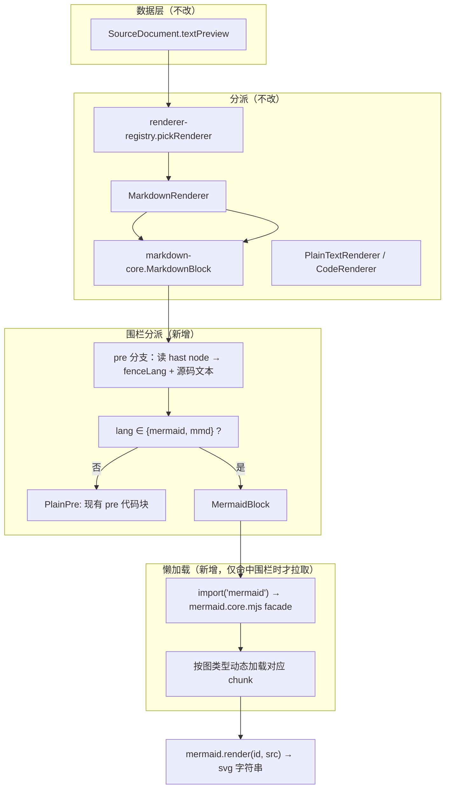
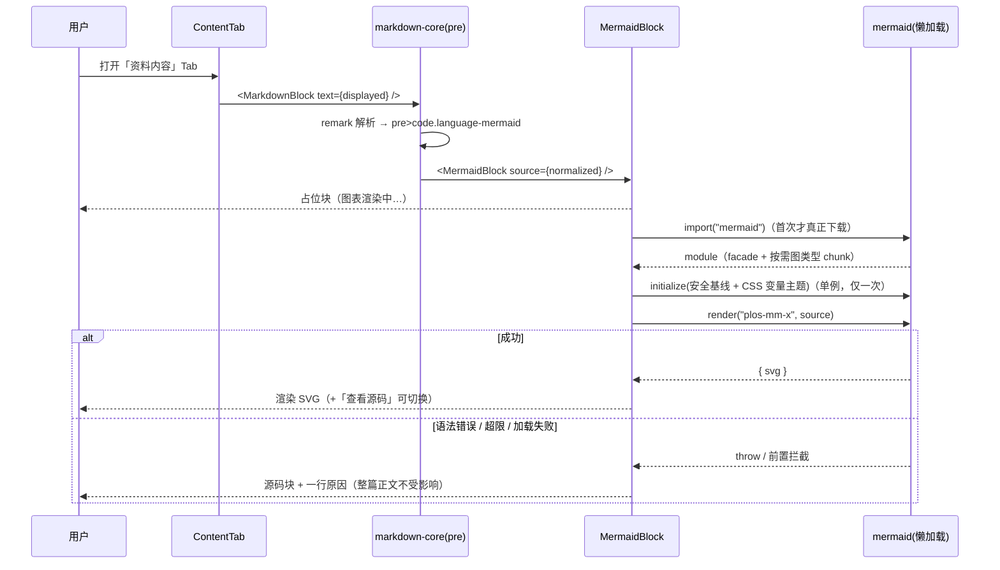

# 资料内容预览支持 Mermaid 渲染 技术方案

| 字段 | 内容 |
|------|------|
| 作者 | WorkBuddy |
| 日期 | 2026-09-11 |
| 状态 | **已实施**（2026-09-11，D1–D4 全部取推荐项 A；见 §13 与 §14 验收实测） |
| 关联需求 | 用户诉求：「资料内容的预览需要支持 mermaid 的渲染」 |
| 关联文档 | `docs/library-detail-page-v2-design-2026-09.md` §4.2 / §8.4（渲染层契约）、`rules/react.mdc`（token/UI 政策）、`rules/no-headless-browser-validation.mdc`（验证边界） |

---

## 1. 背景

### 1.1 现状：围栏被当普通代码块

资料正文渲染已收敛为「格式 → 渲染器」分派（`render/renderer-registry.ts`），markdown 走 `render/markdown-core.tsx` 的 GFM 映射表。该表的 `pre` 分支**无差别**地把所有围栏渲染成 `<pre>` 代码块——` ```mermaid ` 与 ` ```ts ` 没有任何区别。

结果：**图表的源码被显示出来，图本身看不到。**

### 1.2 为什么现在必须做（本仓库自己的痛点）

Mermaid 是本仓库文档体系的**既有事实标准**，不是新增需求：

| 位置 | 数量 |
|------|------|
| `docs/*.md`（9 个设计文档） | **18 处** ` ```mermaid ` 围栏 |
| `skills/pre-task-technical-design/TECHNICAL_PLAN_TEMPLATE.md` | 2 处 |

`docs/` 里的架构图、时序图、状态机图目前只能以源码形式阅读。把这些 `.md` 导入资料库（现有能力：本地文件 / GitHub 仓库 / 粘贴）后，**核心信息载体（图）完全不可见**——这正是「资料库 → 学习循环」链路上唯一一处「内容进来了但读不了」的硬伤。

### 1.3 不做会怎样

- 架构类、流程类技术文档导入后可用性大幅下降（读者要自己在脑内把 DOT/flow 语法编译成图）；
- 用户被迫去外部工具（mermaid.live 等）看图，与「本地优先、隐私优先」的产品定位冲突（**正文已导入本地，却要把图贴到在线服务才能看**）；
- 与本仓库自己的文档写作习惯（大量使用 Mermaid）互相拆台。

---

## 2. 方案目标

| 类型 | 描述 |
|------|------|
| **主要目标** | markdown 正文中的 ` ```mermaid `（及别名 ` ```mmd `）围栏，在**所有块级正文渲染位置**渲染为 SVG 图：① 资料详情页「资料内容」Tab、② 章行展开预览、③ 章节阅读页、④ 概览 Tab 的 AI 摘要、⑤ 图谱聚焦侧栏摘要 |
| **主要目标** | 渲染失败**永不白屏、不降级整篇正文**：单块失败只影响该块，自动回退为源码块并给出原因 |
| **主要目标** | 点击后才加载：正文没有 Mermaid 时，**不得**产生任何额外的运行时下载（动态 import + 按图类型分块） |
| **主要目标** | 不削弱现有安全约束：不开 `rehype-raw`、不放开 URL 白名单、不接受任何来自文档内容的配置注入 |
| **非目标** | 图表交互（节点点击跳转、缩放平移、全屏）；导出 SVG/PNG；复制为图片 |
| **非目标** | 非 markdown 资料（pdf / txt / code）中的 ` ```mermaid ` 识别——它们目前走 `PlainTextRenderer` / `CodeRenderer`，语义上不是 markdown 围栏，**保持现状** |
| **非目标** | 用 Mermaid 替换现有知识图谱（`features/knowledge/GraphView.tsx` 的力导向图）；替换任何现有数据可视化 |
| **非目标** | 正文数学公式（KaTeX）渲染；Mermaid 图**内部**的 KaTeX 属其自带能力，不额外配置 |
| **非目标** | 暗色主题适配（全站尚无 `.dark`，`main.css` 仅注释预留） |
| **非目标** | 视口懒渲染（IntersectionObserver）——见 §13 D3 |
| **成功标准** | 1. 导入任意含 ` ```mermaid ` 的 `.md` → 打开「资料内容」Tab 看到图，而非源码<br>2. 语法错误的围栏 → 该块显示源码 + 一行原因，同页其它正文与图正常<br>3. 不含 Mermaid 的资料 → `npm run build` 产物中 mermaid 分块**不被预加载**（仅存在于独立 chunk）<br>4. `npm run typecheck` 0 error；`test:render` 全绿；既有 `test:library` / `test:i18n` / `test:extract` 等全绿<br>5. 全站无新 hex 色值（`rules/react.mdc`） |

---

## 3. 项目现状

### 3.1 相关代码与模块

| 路径 | 现状 |
|------|------|
| `src/features/learn/render/renderer-registry.ts` | `pickRenderer(format)` 纯函数分派：`markdown` → `MarkdownRenderer`；`code` → `CodeRenderer`；`image` → `ImageNoticeRenderer`；其余 → `PlainTextRenderer` |
| `src/features/learn/render/MarkdownRenderer.tsx` | `markdown-core.MarkdownBlock` 的**薄包装**，仅为保住 `pickRenderer` 对外契约 |
| `src/features/learn/render/markdown-core.tsx` | **本仓库唯一的 markdown → React 映射表**，177 行。导出 `safeUrl`、`remarkPlugins`、`markdownComponents`（块级）、`inlineMarkdownComponents`（行内：`...markdownComponents` 后覆写 `p/ul/ol/li/h1..h6/blockquote/hr`，**`pre` 被继承**）、`MarkdownBlock`、`MarkdownInline` |
| `src/features/learn/render/RenderErrorBoundary.tsx` | 类组件，子树抛错 → 降级为 `<PlainTextRenderer>`（**整篇**降级） |
| `src/features/learn/detail/ContentTab.tsx` | 「资料内容」Tab。`PREVIEW_CHARS = 200000` 截断；`?at=<offset>` 锚点高亮（`highlightRange`）；渲染包在 `RenderErrorBoundary` 内 |
| `src/features/learn/detail/ChapterRow.tsx` | 章节行展开预览，走 `pickRenderer`；正文来自 `chapterPreviewOf`（默认上限 **1200** 字符，优先在空行断开以免切坏围栏） |
| `src/features/learn/ChapterReaderPage.tsx` | 章节阅读页，`doc.textPreview.slice(contentRef.start, end)` + `pickRenderer` |
| `src/features/learn/detail/OverviewTab.tsx` | AI 概览：`MarkdownBlock`（gist）+ `MarkdownInline`（要点/细节） |
| `src/features/knowledge/GraphView.tsx` | 图谱聚焦侧栏摘要用 `MarkdownBlock` |
| `src/features/learn/highlight.ts` | `highlightRange(root, start, end)`：`TreeWalker(SHOW_TEXT)` 累加文本节点长度 → 把 `textPreview` 绝对偏移映射到 DOM 区间（**依赖 DOM 文本节点总长度**，见 §5.2 分支） |
| `src/i18n/messages/{zh,en}.ts` | 单一 messages 对象（1116 叶子），`test:i18n` 强制 zh/en 递归结构一致 + 叶子非空 |
| `tests/register-loader.mjs` + `resolve-ts.mjs` | node `--experimental-strip-types` 直跑。**只能 import `.ts`**（Node 的类型剥离不支持 JSX） |

### 3.2 相关文档与约定

- `docs/library-detail-page-v2-design-2026-09.md` §4.2「模块职责」、§8.4 `markdown-core` 伪代码：markdown → React 的**唯一映射处**；§3.3 明确「新增依赖：无」（本方案将**首次打破**，须在文档中回写）。
- `rules/no-headless-browser-validation.mdc`：禁止主动启动浏览器做样式/布局/功能校验。**因此本方案不写 E2E，全部自动化验证为纯逻辑单测 + 源码静态断言**（静态断言在 `tests/rag-wiring.test.ts:263` 已有先例）。
- `rules/react.mdc`：颜色只允许出现在 `src/styles/main.css`；状态色只能用于 dot/徽标；不引入 antd/Radix/MUI/Emotion；受控交互组件走 `components/ui`。
- `rules/code-structure-and-dependencies.mdc`：文件 ≤700 行；同逻辑 ≥10 行 × ≥3 处必须抽取。
- `rules/engineering-code-style.mdc`：相对导入、中文注释、i18n 双语、`import type`。
- `skills/tiered-change-workflow` 路径 C → 本方案；用户确认后接 `skills/docs-task-runbook`。

### 3.3 约束与依赖

| 项 | 值 / 说明 |
|----|-----------|
| 新增运行时依赖 | **`mermaid@^12.0.0`（首个新增运行时依赖）**——见 §4.2 体积论证 |
| mermaid 引擎要求 | `engines.node >= 22.12.0`；本仓库要求 Node ≥22，托管运行时 22.22.2 ✅ |
| 打包器 | Vite 8 + `moduleResolution: "bundler"` → 能正确解析 mermaid `exports` 映射与**内部动态 import** |
| TS 配置 | `verbatimModuleSyntax: true` → 类型只能 `import type`；`skipLibCheck: true` → mermaid 的 `.d.ts` 内部错误不影响我们 |
| 安全上下文 | `tauri.conf.json` 的 `security.csp = null` → 内联 SVG/`<style>` 不受 CSP 限制（**无需改配置**） |
| 网络 | 本地优先：mermaid 随应用打包（Tauri `frontendDist: ../dist`），**运行期零网络请求**；图内文本不做任何字体外链 |
| 视窗 | Tauri `minWidth: 960`；图容器需处理窄屏横向溢出 |

#### 3.3.1 mermaid v12 产物体积（实测数据，非估计）

| 文件 | 体积 | 说明 |
|------|------|------|
| `dist/mermaid.core.mjs`（`exports["."]` 指向它） | **52 KB** | **门面**：不含图形引擎，用 ~30 条 `import("./chunks/mermaid.core/<图类型>.mjs")` 动态按需加载 |
| `dist/chunks/mermaid.core/*` | 67 个文件 / **3.05 MB** | 各图类型 + 布局引擎 + d3/cytoscape/katex 等；**只加载用到的** |
| `dist/mermaid.min.js` | **5.44 MB** | 全量 UMD。**绝不能 import 这个**（§8.1 用静态断言禁止） |

结论：`import("mermaid")` + Vite 会自动**代码分割**——`mermaid.core.mjs` 进一个 chunk，其余图类型各自成为独立 chunk 且仅在实际渲染时拉取。当前主包 `dist/assets/index-*.js` 已 1.3 MB，**必须走动态 import，否则主包体积直接翻倍**。

#### 3.3.2 mermaid v12 安全相关默认值（读 `schemas/config.schema.yaml` 原文核对）

| 配置项 | 默认值 | 对本方案的含义 |
|--------|--------|----------------|
| `securityLevel` | `'strict'` | HTML 标签被编码、**click 功能禁用**。正好是我们要的基线，仍显式声明 |
| `secure` | `['secure','securityLevel','startOnLoad','maxTextSize','suppressErrorRendering','maxEdges']` | **图内 YAML frontmatter / `%%{init}%%` 指令无法覆盖这些键** → 文档内容**无法**降低 `securityLevel`、**无法**恢复错误图渲染。这是关键防线 |
| `maxTextSize` | `50000` | 单图源码硬上限（我们的应用层上限设更低的 30000，提前给出可读提示而非让 mermaid 抛错） |
| `maxEdges` | `500` | 边数上限，防超大连线图 |
| `suppressErrorRendering` | **`false`** | 为 `false` 时语法错误会**往 `document.body` 插入一张 "Syntax error" 图**——必须显式置 `true`，否则污染 DOM |
| `startOnLoad` | **`true`** | 必须显式置 `false`，禁止 mermaid 自行扫描 DOM |
| `htmlLabels` | 未设（各图类型自定，flowchart 默认产生 `<foreignObject>` HTML） | **v12 起该键已上提到根级，图级 `flowchart.htmlLabels` 已废弃**。本方案显式根级 `false`，让标签退化为纯 SVG `<text>`，消除 HTML 注入面 |
| `deterministicIds` | `false` | SVG 内节点 id 随渲染变化；对本方案无影响（每块用自有 id 前缀） |
| `fontFamily` | `"trebuchet ms", verdana, arial, sans-serif` | 与全站字体不一致，需覆盖为 `--font-sans` |

**结论**：`secure` 白名单保护了安全键，但**不包含** `theme` / `themeVariables` / `htmlLabels` / `fontFamily`——即文档内容理论上可以打开 `htmlLabels` 或换主题。故本方案额外做**图内指令剥离**（见 §4.2 / D2）。

---

## 4. 技术架构

### 4.1 总体架构

Mermaid 渲染是**块级 markdown 渲染的一个分支**，因此只有**一个**接入点：`markdown-core` 的 `pre`。



**依赖方向**（遵守 `rules/layer-import-boundaries`）：`features/learn/render/*` 只依赖 `i18n` + `components/ui` + 自身纯逻辑模块；不碰 `stores` / `storage` / `domain` 之外的东西；不引入任何持久化。

### 4.2 模块职责

| 模块 | 职责 | 技术选型 |
|------|------|----------|
| `render/mermaid-source.ts`（新增，纯 TS） | 围栏识别、hast 取文、id 净化、图内指令剥离、源码规范化、超限判定——**零 React、零 DOM**，node 直跑可单测 | 纯 TS |
| `render/mermaid-theme.ts`（新增，纯 TS） | 从 CSS 变量读出 `themeVariables`（依赖注入式 reader，便于单测）+ 固定的安全配置基线常量 | 纯 TS |
| `render/MermaidBlock.tsx`（新增，React） | 状态机 `loading → done \| error`；动态 import + 单例 initialize；渲染 SVG；源码区（常驻 DOM）；失败降级 | React 19 + `import()` |
| `render/markdown-core.tsx`（修改） | `pre` 分支接管围栏分派；**行内表显式覆写 `pre`** 禁止行内出图 | 无新依赖 |
| `i18n/messages/{zh,en}.ts`（修改） | 新增 `common.mermaid.*`（7 键 × 2 语言） | 成对新增 |
| `package.json`（修改） | 依赖 `mermaid@^12.0.0`；脚本 `test:render` | — |

**为什么图内指令要剥离（不是可选洁癖）**：`secure` 白名单不含 `htmlLabels`/`theme`/`themeVariables`/`fontFamily`，而这两项直接决定**注入面**与**视觉一致性**。剥离后「图表配置完全由应用拥有」，代价仅是图内 YAML frontmatter 的 `title:` 不再生效（可在图上方写 markdown 标题替代）——见 D2。

### 4.3 数据模型与 API

**持久化：N/A。** 本方案不新增/修改任何 domain 类型、storage 表或 IPC 命令。

- UI 渲染态（`phase` / `svg` / `showSource`）全部是组件本地 state，**不落库、不进 store**；
- 不新增 `invoke` 命令，不触碰 Keychain / 本地模型；
- 纯浏览器预览（非 Tauri）与桌面端行为一致（无 `isTauri` 分支需要）。

新增的对外契约（模块内公开）：

```ts
// render/mermaid-source.ts —— 全部纯函数
export const MERMAID_LANGS: ReadonlySet<string>;        // { "mermaid", "mmd" }
export const MAX_MERMAID_SOURCE_CHARS: number;           // 30_000

/** 最小 hast 节点结构（不引 @types/hast，避免依赖传递类型）。 */
export interface HastNode {
  type?: string; tagName?: string; value?: string;
  properties?: { className?: unknown };
  children?: readonly HastNode[];
}

export function fenceLang(node: HastNode | undefined): string | undefined;
export function hastText(node: HastNode | undefined): string;
export function readCodeFence(node: HastNode | undefined): { lang: string; value: string } | undefined;
export function sanitizeSvgId(seed: string): string;      // → "plos-mm-<safe>"
export function stripMermaidDirectives(source: string): string;
export function normalizeMermaidSource(source: string): string;
export function mermaidSourceTooLarge(source: string): boolean;

// render/mermaid-theme.ts —— 依赖注入，便于单测
export interface StyleVarReader { (name: string): string }
export function readThemeVariables(read: StyleVarReader): Record<string, string>;
export const MERMAID_BASE_CONFIG: Readonly<Record<string, unknown>>;
```

`sanitizeSvgId` 的必要性：React `useId()` 返回形如 `«r3»` / `:r3:` 的字符串（含 `:` 与 `«»`），而 mermaid 会把 id 用作 CSS 选择器与 `<style>` 前缀 → 直接传入必然报错。统一走 `plos-mm-` 前缀 + 非 `[A-Za-z0-9_-]` 一律替换为 `-`。

### 4.4 状态与副作用

| 状态 | 位置 | 说明 |
|------|------|------|
| `phase: "loading" \| "done" \| "error"` | `MermaidBlock` 本地 `useState` | 初值由 `mermaidSourceTooLarge(source)` 决定（超限直接 `error`，不进 effect） |
| `svg: string` / `msg: string` | 同上 | `msg` 仅错误态使用，取 mermaid 异常首行 + 截断 200 字符 |
| `showSource: boolean` | 同上 | **源码容器常驻 DOM，仅切 `hidden` 类**（保锚点，见 §5.2） |
| mermaid 运行时 | **模块级单例**（`let promise: Promise<...> \| null`） | `initialize()` 全进程只需一次；副作用不属 React 生命周期 |

**副作用触发时机**：仅 `MermaidBlock` 挂载时触发一次动态 import（deps: `[source, tooLarge]`）。不使用轮询、不使用全局事件、不在 `MarkdownBlock` 层预加载。

**并发与卸载**：`useEffect` 内用 `cancelled` 标志守卫 setState（Tab 切换/正文变化时组件会卸载或重渲染）；mermaid 官方保证 `render()` 多次调用**内部串行排队**，无需我们自建队列。

---

## 5. 交互流程

### 5.1 主流程

1. 用户导入含 ` ```mermaid ` 的 `.md`（本地文件 / GitHub / 粘贴）→ `format: "markdown"`；
2. 打开资料详情页 →「资料内容」Tab → `ContentTab` 取 `doc.textPreview`（>200k 则截断）→ `pickRenderer("markdown")` → `MarkdownBlock`；
3. `react-markdown` + `remark-gfm` 解析 → 命中 `pre > code.language-mermaid` → `pre` 分支改派 `MermaidBlock`；
4. `MermaidBlock` 首帧渲染**占位块**（头部「图表渲染中…」+ 虚线骨架），同时 effect 内 `await import("mermaid")`；
5. mermaid 加载完成 → 单例 `initialize`（安全基线 + CSS 变量主题）→ `mermaid.render(id, normalizedSource)` → 拿到 `svg` 字符串 → `setState({ phase: "done", svg })`；
6. 渲染结果：边框容器内嵌 SVG（横向可滚动、限最大宽度自适应）；头部右侧「查看源码」按钮可切换源码 `<pre>`；
7. 用户切到「章节」Tab / 进入章节阅读页 / 展开章行 → 同一组件、同一流程（无差异分支）。

### 5.2 分支与异常流程

| 场景 | 触发条件 | 系统行为 | UI 反馈 |
|------|----------|----------|---------|
| 排版图语法错误 | `mermaid.render` 抛错 | `phase = error`，**不 re-throw**（避免 `RenderErrorBoundary` 把整篇正文降级成纯文本） | 该块显示源码 + 一行「图表语法有误，已按源码显示」 |
| 源码超限 | `source.length > 30_000` | 初值即 `error`，**不调用 mermaid** | 显示源码 + 「源码超过 N 字符」 |
| 动态 chunk 加载失败 | `import("mermaid")` reject（离线 dev / 产物缺失） | 同 error 分支 | 显示源码 + 「图表渲染组件加载失败」 |
| 首次渲染延迟 | 52 KB facade + 图类型 chunk + 布局引擎 | 占位块；**不阻塞正文其它部分**（正文已先渲染） | 虚线骨架 + 「图表渲染中…」 |
| 围栏被截断 | 「资料内容」200k 硬截断 / 章行 1200 字符上限切在围栏内 | 解析得残缺源码 → mermaid 报错 → 走 error 分支 | 源码块（内容即原文片段），无「图」 |
| 锚点高亮落在图后 | `?at=<offset>` 且该 offset 之前存在 mermaid 块 | 源码容器**常驻 DOM**（仅 `hidden`），`TreeWalker` 仍能统计其文本长度 → 偏移基本守恒 | 高亮命中；不保证逐字符精确（见风险 R5） |
| 行内代码写 `mermaid` | 段落里 `` `mermaid` `` | **不产生图**：行内组件表显式覆写 `pre` | 行内代码样式 |
| 非 markdown 资料 | `format ∈ {pdf, txt, code, …}` | 不经过 `MarkdownBlock` → 不识别围栏 | 与现状一致 |
| 英文界面 | `lang = en` | 全部文案来自 `common.mermaid.*` | 英文提示 |
| 同页多个图 | 一篇文档 ≥2 个围栏 | 每块各自 `useId` 派生前缀 id；mermaid 内部串行渲染 | 依次出现，互不影响 |

### 5.3 时序图



---

## 6. 用户用例（User Cases）

### UC-01：阅读含 Mermaid 的 markdown 资料正文

| 项 | 内容 |
|----|------|
| 角色 | 学习者（已导入技术文档） |
| 前置条件 | 已导入含 ` ```mermaid ` 的 `.md`；资料 `format = markdown` |
| 主流程步骤 | 1. 进入资料详情页 →「资料内容」Tab 2. 等待图表出现 |
| 期望结果 | 围栏位置显示 SVG 图；不再显示 `flowchart TD` 之类源码；正文其余部分排版不变 |
| 异常/边界 | 200k 截断若切断围栏 → 该块降级源码 |

### UC-02：章节阅读页 / 章行展开预览中的图

| 项 | 内容 |
|----|------|
| 角色 | 学习者 |
| 前置条件 | 切分出的某章正文内含 mermaid 围栏 |
| 主流程步骤 | 1. 目录页展开该章行（≤1200 字符预览）2. 或点击进入章节阅读页 |
| 期望结果 | 两处均渲染图；行为与 UC-01 一致；章行预览内图宽度不撑破行布局 |
| 异常/边界 | 章行预览的 1200 字符上限常把围栏切一半 → 走 error 分支显示源码（可接受，因为阅读页有完整版） |

### UC-03：图表语法错误时的降级

| 项 | 内容 |
|----|------|
| 角色 | 学习者 |
| 前置条件 | 文档中某围栏语法非法（如 `flowchart TD` 后接乱码） |
| 主流程步骤 | 1. 打开正文 |
| 期望结果 | **只有该块**降级为源码块 + 一行「图表语法有误，已按源码显示」；同页其它图正常渲染；不出现整篇被降级成纯文本 |
| 异常/边界 | mermaid 异常信息可能含换行/超长 → 截断为首行 + 200 字符 |

### UC-04：查看 / 复制图表源码

| 项 | 内容 |
|----|------|
| 角色 | 学习者 |
| 前置条件 | 某图已渲染成功（或失败降级） |
| 主流程步骤 | 1. 点该块头部「查看源码」2. 再点「收起源码」 |
| 期望结果 | 源码 `<pre>` 展开/收起；文本可选中复制；展开状态不影响其它块 |
| 异常/边界 | 源码容器始终在 DOM 中（仅 `hidden`），以保证 §5.2 的锚点偏移守恒 |

### UC-05：不含 Mermaid 的资料（回归）

| 项 | 内容 |
|----|------|
| 角色 | 学习者 |
| 前置条件 | 资料为 pdf / txt / 纯 markdown 无围栏 |
| 主流程步骤 | 1. 浏览正文 2. 在 `src/` 中检索 `import("mermaid")` 的触发条件 |
| 期望结果 | 无任何 mermaid 代码被执行/加载；`npm run build` 产物中 mermaid 相关 chunk 独立存在且**不被 entry 预加载**；现有渲染完全不变 |
| 异常/边界 | txt 中手写的 ` ```mermaid ` **不**渲染（非 markdown 语义） |

### UC-06：英文界面文案

| 项 | 内容 |
|----|------|
| 角色 | 英文用户 |
| 前置条件 | `lang = en` |
| 主流程步骤 | 1. 触发渲染中 / 失败 / 超限三种态 |
| 期望结果 | 提示均为英文；无中文残留 |

---

## 7. 线框 UI（Wireframe）

### 7.1 MermaidBlock — 渲染成功（默认态）

```
┌────────────────────────────────────────────────────────┐
│ 图 图表                                    [ 查看源码 ] │  ← 头部：text-xs text-ink-3 + Button ghost/sm
├────────────────────────────────────────────────────────┤
│                                                        │
│        ┌───────────┐        ┌───────────┐              │
│        │  数据层   │───────▶│  分派层   │              │  ← SVG：mx-auto、max-w-full
│        └───────────┘        └───────────┘              │     容器 overflow-x-auto
│                                  │                     │
│                                  ▼                     │
│                            ┌───────────┐               │
│                            │ Mermaid   │               │
│                            └───────────┘               │
│                                                        │
├────────────────────────────────────────────────────────┤  ← 点「查看源码」后展开（默认隐藏）
│ ```mermaid                                             │
│ flowchart TD                                           │  ← 等宽 pre（与现有 pre 同款类名）
│   A --> B                                              │
│ ```                                                    │
└────────────────────────────────────────────────────────┘
```

- 容器：`rounded-lg border border-line bg-surface`，与 `PlainTextRenderer` 所在的正文卡（`bg-surface p-6`）内嵌协调；内边距 `p-3`。
- 头部：左侧 `图 图表`（`text-xs text-ink-3`）；右侧「查看源码/收起源码」用 `components/ui/button` 的 `variant="ghost" size="sm"`。
- SVG 区：`overflow-x-auto`（窄屏可横向滚动）+ SVG 自身 `max-width: 100%`（mermaid 默认 `useMaxWidth: true` → 自适应容器宽）。
- 设计 token：`border-line` `bg-surface` `bg-subtle` `text-ink-1/2/3`；**无新增 hex**。

### 7.2 其他状态

**加载中**
```
┌────────────────────────────────────────────────────────┐
│ 图 图表渲染中…                                          │
├────────────────────────────────────────────────────────┤
│  ┌──────────────────────────────────────────────────┐  │
│  │            （虚线框 + bg-subtle，h-32）           │  │
│  └──────────────────────────────────────────────────┘  │
└────────────────────────────────────────────────────────┘
```

**错误（语法错 / 超限 / 加载失败）** — 源码直接可见，无需点击
```
┌────────────────────────────────────────────────────────┐
│ ! 图表语法有误，已按源码显示                             │  ← text-state-weak（仅此一处用状态色，
├────────────────────────────────────────────────────────┤     且是文字+图标而非大面积底色）
│ ```mermaid                                             │
│ flowchart TD                                           │
│   A - -> B                                             │
│ ```                                                    │
└────────────────────────────────────────────────────────┘
```

**空源码**（` ```mermaid ` 后立刻闭合）
```
┌────────────────────────────────────────────────────────┐
│ ! 图表语法有误，已按源码显示                             │
│  （空 pre：h-6，提示无内容）                             │
└────────────────────────────────────────────────────────┘
```

### 7.3 交互说明

- **键盘可达**：「查看源码/收起源码」是 `Button`，`Tab` 可达、`Enter/Space` 触发；无需自定义键盘导航。
- **Hover/Focus**：沿用 `ui/button` 的 ghost 样式；SVG 本身不可交互（`securityLevel: strict` 已禁用 click 功能）。
- **弹层/抽屉/Toast**：无。错误信息**内联**在块内，不弹 toast（避免一篇文档多处错误时刷屏）。
- **不引入**原生 `<details>`（受控交互优先 `components/ui`），也**不**在错误态使用 `window.confirm` 之类。

---

## 8. 涉及文件及改动伪代码

### 8.1 `src/features/learn/render/mermaid-source.ts`（新增，纯 TS）

**改动说明**：把一切「不需要 DOM 与 React」的判断收敛到此处，使 `test:render` 能覆盖核心逻辑（Node 类型剥离不支持 JSX，`.tsx` 无法在单测中 import——这是把纯逻辑抽出来的**强制**理由，不是风格偏好）。

```ts
// 伪代码 — 仅表达意图
/** 围栏别名：mermaid 为规范写法，mmd 为 VitePress/Typora 常见别名。 */
export const MERMAID_LANGS: ReadonlySet<string> = new Set(["mermaid", "mmd"]);
/** 应用层源码上限（低于 mermaid 自身 maxTextSize 50000，便于提前给出可读提示）。 */
export const MAX_MERMAID_SOURCE_CHARS = 30_000;

export interface HastNode { /* …见 §4.3… */ }

/** 从 code 节点的 className 里取 `language-xxx` 的语言名（小写）。 */
export function fenceLang(node: HastNode | undefined): string | undefined {
  const raw = node?.properties?.className;
  const list = Array.isArray(raw) ? raw : typeof raw === "string" ? raw.split(/\s+/) : [];
  for (const c of list) {
    const m = /^language-(.+)$/i.exec(String(c));
    if (m) return m[1].toLowerCase();
  }
  return undefined;
}

/** 递归拼接 hast 子树里的所有文本（code 内容可能被拆成多个 text 节点）。 */
export function hastText(node: HastNode | undefined): string { /* … */ }

/** pre → 第一个 code 子节点；取不到返回 undefined（此时按普通 pre 渲染）。 */
export function readCodeFence(node: HastNode | undefined): { lang: string; value: string } | undefined {
  const code = node?.children?.find((c) => c.tagName === "code");
  if (!code) return undefined;
  const lang = fenceLang(code) ?? "";
  return { lang, value: hastText(code) };
}

/**
 * 净化 id：mermaid 拿它当 SVG id + <style> 选择器前缀 + 节点 id 命名空间。
 * React 19.2.8 的 useId() 现为 `_r_0_`（合法），但 React 18 曾为 `:r0:`（选择器会抛错）
 * → 不依赖 React 实现细节，统一加前缀并把非 [A-Za-z0-9_-] 换成 `-`。
 */
export function sanitizeSvgId(seed: string): string {
  const safe = seed.replace(/[^A-Za-z0-9_-]/g, "-");
  return `plos-mm-${safe}`;   // 前缀保证首字符合法且跨块唯一
}

/**
 * 剥离图内配置：YAML frontmatter（含 config/title）与 `%%{init:…}%%` 指令。
 * 原因：mermaid 的 `secure` 白名单不保护 htmlLabels/theme/themeVariables/fontFamily，
 * 配置权必须完全归应用（§3.3.2）。
 */
export function stripMermaidDirectives(source: string): string {
  // 1) 仅当首行是 `---` 且能找到闭合 `---` 时才当 frontmatter，避免误删正文分隔线
  // 2) 逐行丢弃形如 `%%{ … }%%` 的指令行；普通 `%%` 注释保留
}

/** 规范化：剥指令 → 去行尾空白 → 去首尾空行。 */
export function normalizeMermaidSource(source: string): string { /* … */ }

export function mermaidSourceTooLarge(source: string): boolean {
  return source.length > MAX_MERMAID_SOURCE_CHARS;
}
```

### 8.2 `src/features/learn/render/mermaid-theme.ts`（新增，纯 TS）

**改动说明**：主题色**只能**从 `main.css` 的语义变量读（`rules/react.mdc`：颜色值只允许出现在 `main.css`）——因此这里**不出现任何 hex**，读不到就不写该键、交给 mermaid 自己的中性默认值。依赖注入 `read` 使单测无需 DOM。

```ts
// 伪代码
import type { MermaidConfig } from "mermaid";   // 仅类型，不产生运行时导入

export interface StyleVarReader { (name: string): string }

/** 读取浏览器实际计算值；缺变量返回空串，调用方会跳过该键。 */
export function readThemeVariables(read: StyleVarReader): Record<string, string> {
  const get = (cssVar: string) => read(cssVar).trim();
  const pairs: Array<[string, string]> = [
    ["background", get("--plos-surface")],
    ["mainBkg", get("--plos-surface")],
    ["primaryColor", get("--plos-subtle")],
    ["secondaryColor", get("--plos-subtle")],
    ["tertiaryColor", get("--plos-surface")],
    ["primaryBorderColor", get("--plos-line")],
    ["nodeBorder", get("--plos-line")],
    ["clusterBkg", get("--plos-subtle")],
    ["clusterBorder", get("--plos-line")],
    ["lineColor", get("--plos-ink-3")],
    ["textColor", get("--plos-ink-1")],
    ["nodeTextColor", get("--plos-ink-1")],
    ["primaryTextColor", get("--plos-ink-1")],
    ["titleColor", get("--plos-ink-1")],
    ["edgeLabelBackground", get("--plos-surface")],
    ["fontFamily", get("--font-sans")],
  ];
  const out: Record<string, string> = {};
  for (const [key, value] of pairs) if (value) out[key] = value;   // 空值不写 → 不产出 undefined
  return out;
}

/** 安全基线：全部显式声明，不依赖 mermaid 默认值（默认值随版本变动）。 */
export const MERMAID_BASE_CONFIG = {
  securityLevel: "strict",        // HTML 编码 + click 禁用
  startOnLoad: false,             // 禁止自行扫描 DOM
  suppressErrorRendering: true,   // 禁止向 body 插入 "Syntax error" 图
  htmlLabels: false,              // v12 根级键；纯 SVG <text>，消除 foreignObject 注入面
  maxTextSize: 50_000,
  maxEdges: 500,
  logLevel: "fatal",              // local-first：不往控制台刷 mermaid 内部日志
  fontSize: 14,
  theme: "base",                  // 配合 themeVariables 做 token 映射
} as const satisfies Partial<MermaidConfig>;
```

> `--plos-*` 是 `main.css` 的**原始值**，而 `@theme inline` 生成的 `--color-*` 是 Tailwind 侧的桥接。此处直接读 `--plos-*` 更贴近单一事实源。
>
> **已实测**（非推断）：`npm run build` 产物 `dist/assets/index-*.css` 中 `--plos-surface`、`--color-surface`、`--font-sans` **均实际输出**，故 `getComputedStyle(document.documentElement).getPropertyValue("--font-sans")` 可取值（`@theme inline` 不会吃掉变量定义）。

### 8.3 `src/features/learn/render/MermaidBlock.tsx`（新增，React）

**改动说明**：唯一有副作用的地方。三条硬约束写在文件头注释里并配静态断言：① 动态 import；② 内部自捕获异常（不得让 `RenderErrorBoundary` 整篇降级）；③ 源码容器常驻 DOM。

```tsx
// 伪代码
import { useEffect, useId, useState } from "react";
import { useI18n } from "../../../i18n";
import { Button } from "../../../components/ui/button";
import {
  MAX_MERMAID_SOURCE_CHARS, normalizeMermaidSource, sanitizeSvgId,
} from "./mermaid-source";
import { MERMAID_BASE_CONFIG, readThemeVariables } from "./mermaid-theme";

/** 模块级单例：initialize 全进程一次；promise 复用避免并发重复下载。 */
let mermaidPromise: Promise<MermaidModule> | null = null;
function loadMermaid(): Promise<MermaidModule> {
  mermaidPromise ??= import("mermaid").then((mod) => {
    const mermaid = mod.default;
    const read = (name: string) =>
      getComputedStyle(document.documentElement).getPropertyValue(name);
    mermaid.initialize({
      ...MERMAID_BASE_CONFIG,
      themeVariables: readThemeVariables(read),
      fontFamily: read("--font-sans").trim() || undefined,
    });
    return mermaid;
  });
  return mermaidPromise;
}

type Phase = "loading" | "done" | "error";

export default function MermaidBlock({ source }: { source: string }) {
  const { m } = useI18n();
  const t = m.common.mermaid;
  const rawId = useId();
  const tooLarge = source.length > MAX_MERMAID_SOURCE_CHARS;

  // 超限 → 初值即错误态（不进 effect、不加载 mermaid）
  const [state, setState] = useState<{ phase: Phase; svg?: string; msg?: string }>(() =>
    tooLarge
      ? { phase: "error", msg: t.tooLarge(MAX_MERMAID_SOURCE_CHARS) }
      : { phase: "loading" },
  );
  const [showSource, setShowSource] = useState(false);

  useEffect(() => {
    if (tooLarge) return;
    let cancelled = false;
    const id = sanitizeSvgId(rawId);
    void (async () => {
      try {
        const mermaid = await loadMermaid();
        const { svg } = await mermaid.render(id, source);
        if (!cancelled) setState({ phase: "done", svg });
      } catch (err) {
        // 关键：**不外抛**。抛了会被 RenderErrorBoundary 捕获 → 整篇正文降级纯文本。
        if (!cancelled) setState({ phase: "error", msg: firstLine(err) });
      }
    })();
    return () => { cancelled = true; };
  }, [source, tooLarge, rawId]);

  const failed = state.phase === "error";
  return (
    <div className="my-3 rounded-lg border border-line bg-surface p-3" data-testid="mermaid-block">
      <div className="mb-2 flex items-center justify-between gap-2">
        <span className="text-xs text-ink-3">
          {failed ? t.errorTitle : state.phase === "loading" ? t.rendering : t.label}
        </span>
        {state.phase === "done" && (
          <Button variant="ghost" size="sm" onClick={() => setShowSource((v) => !v)}>
            {showSource ? t.hideSource : t.viewSource}
          </Button>
        )}
      </div>

      {state.phase === "loading" && <div className="h-32 rounded border border-dashed border-line bg-subtle" />}
      {state.phase === "done" && (
        // 唯一注入点：内容只来自 mermaid.render 的返回值（strict + DOMPurify 内部净化，
        // 且已剥离图内指令）。见 mermaid-source.stripMermaidDirectives。
        <div className="overflow-x-auto" dangerouslySetInnerHTML={{ __html: state.svg ?? "" }} />
      )}

      {/* 源码容器：**常驻 DOM**（仅切 hidden），保证 highlightRange 的文本长度守恒 */}
      <pre
        className={`mt-2 overflow-x-auto rounded bg-subtle p-2 font-mono text-[12px] leading-5 text-ink-2 ${
          failed || showSource ? "" : "hidden"
        }`}
        data-mermaid-source=""
      >
        {source}
      </pre>
      {failed && state.msg && <p className="mt-1 text-xs text-state-weak">{state.msg}</p>}
    </div>
  );
}
```

### 8.4 `src/features/learn/render/markdown-core.tsx`（修改）

**改动说明**：这是本方案**唯一**接触既有渲染契约的文件。`markdownComponents.pre` 从「无条件 `pre`」改为「读 hast node → 判定围栏语言 → 分派」；`inlineMarkdownComponents` 因 `...markdownComponents` 继承了新 `pre`，必须**显式覆写**回纯代码块（否则 12px 的行内要点里可能蹦出一张图）。

```tsx
// 伪代码 — 仅列改动部分
import { MERMAID_LANGS, normalizeMermaidSource, readCodeFence } from "./mermaid-source";
import MermaidBlock from "./MermaidBlock";

/** 普通代码块（原样保留原有类名，视觉零变化）。 */
function PlainPre({ children }: { children?: ReactNode }) {
  return (
    <pre className="my-3 overflow-x-auto rounded-lg border border-line bg-subtle p-3 font-mono text-[13px] leading-6 text-ink-1">
      {children}
    </pre>
  );
}

export const markdownComponents: Components = {
  /* …h1..td、img、strong/em 全部不变… */
  // pre 分支：围栏语言命中 mermaid → 交 MermaidBlock；否则维持原样
  pre: ({ children, node }) => {
    const fence = readCodeFence(node as HastNode | undefined);
    if (fence && MERMAID_LANGS.has(fence.lang)) {
      const source = normalizeMermaidSource(fence.value);
      if (source.length > 0) return <MermaidBlock source={source} />;
    }
    return <PlainPre>{children}</PlainPre>;
  },
};

export const inlineMarkdownComponents: Components = {
  ...markdownComponents,
  p: ({ children }) => <>{children}</>,
  /* …既有覆写不变… */
  // 新增覆写：行内场景永不出图（否则 12px 要点里塞进一张 SVG）
  pre: PlainPre,
};
```

> 注：`code` 分支保持原样（行内代码样式），因为 `pre > code` 由 `pre` 先行接管；只有**未命中 mermaid** 时 `children` 才会走到 `code`。

### 8.5 `src/i18n/messages/zh.ts` + `en.ts`（修改，成对）

**改动说明**：新增顶层 `common` 下的 `mermaid` 子树（`common` 已有 `delta` 嵌套先例）。共 7 键 × 2 语言，`test:i18n` 强制结构一致、叶子非空。

```ts
// zh.ts（伪代码）
common: {
  /* …既有键不变… */
  mermaid: {
    label: "图表",
    rendering: "图表渲染中…",
    viewSource: "查看源码",
    hideSource: "收起源码",
    errorTitle: "图表语法有误，已按源码显示",
    tooLarge: (n: number) => `图表源码超过 ${n} 字符，已按源码显示`,
    loadFailed: "图表渲染组件加载失败，已按源码显示",
  },
},
```

### 8.6 `package.json`（修改）

```jsonc
{
  "dependencies": {
    "mermaid": "^12.0.0"          // 新增（首个新增运行时依赖）
  },
  "scripts": {
    "test:render": "node --experimental-strip-types --no-warnings --import ./tests/register-loader.mjs tests/render-mermaid.test.ts"
  }
}
```

### 8.7 `tests/render-mermaid.test.ts`（新增）

**改动说明**：纯逻辑单测 + 源码静态断言。**不 import 任何 `.tsx`**（Node 类型剥离不支持 JSX），`MermaidBlock` 的行为约束改用读文件文本断言（先例：`tests/rag-wiring.test.ts:263`）。

### 8.8 `docs/library-detail-page-v2-design-2026-09.md`（修改）

**改动说明**：回写两处（保持方案与实现同步，`rules/docs-task-runbook` 收尾要求）：
- §3.3 约束与依赖：「新增依赖」由 `无` → `mermaid@^12`（附本方案链接）；
- §4.2 模块职责：`render/mermaid-core` 一行补充说明 `pre` 分支的围栏分派职责。

### 8.9 文档自身（新增）

- 本文件 `docs/library-mermaid-render-design-2026-09.md`；
- 确认后新增 `docs/library-mermaid-render-task-runbook.md`（`docs-task-runbook` 流程）。

---

## 9. 任务清单（Tasks）

| ID | 任务 | 依赖 | 预估复杂度 |
|----|------|------|------------|
| T1 | `mermaid-source.ts` 纯逻辑模块 + `tests/render-mermaid.test.ts` 骨架 + `package.json` 加 `test:render` | — | M |
| T2 | `mermaid-theme.ts`（含依赖注入 reader）+ 主题映射单测 | T1 | S |
| T3 | `MermaidBlock.tsx`（状态机 + 动态 import 单例 + 源码常驻 + 降级） | T1 T2 | M |
| T4 | `markdown-core.tsx` 接线：`pre` 分派 + `inline` 覆写 `pre` | T3 | S |
| T5 | i18n `common.mermaid.*` 双语（zh + en） | — | S |
| T6 | `mermaid@^12` 依赖安装 + 静态断言补全（禁静态 import / 必含安全键 / 无 hex） | T1 | S |
| T7 | 文档同步（v2 设计 §3.3 / §4.2、runbook 落盘） | T3 T4 | S |
| T8 | 全量验证：`typecheck` + 全量 `test:*` + `vite build` 观察 chunk 切分 | T1–T6 | M |

---

## 10. 实施步骤

1. **T1 纯逻辑先行**（对应 T1）
   - 落地 `mermaid-source.ts`：围栏语言、hast 取文、id 净化、指令剥离、规范化、超限。
   - 写 `tests/render-mermaid.test.ts`（先写断言再调实现），`package.json` 加 `test:render`。
   - 验证：`npm run test:render` 全绿。
2. **T2 主题映射**（T2）
   - `readThemeVariables(read)` 用假 reader 单测：命中 / 缺失 / 空白三种输入。
   - 验证：断言「缺变量时不产出 undefined 键」「不含 hex 字面量」。
3. **T3 组件**（T3，依赖 T1/T2）
   - 先装依赖（T6 的一部分）：`npm i mermaid@^12`；确认 `tsc` 能解析 `import type { MermaidConfig } from "mermaid"`。
   - 实现 `MermaidBlock.tsx`。
   - 验证：`npm run typecheck` 0 error。
4. **T4 接线**（T4，依赖 T3）
   - 改 `markdown-core.tsx` 的 `pre` 与 `inlineMarkdownComponents.pre`。
   - 验证：`npm run typecheck`；确认 `pickRenderer` 契约与 `MarkdownRenderer` **零改动**。
5. **T5 文案**（T5）→ `npm run test:i18n` 8/8。
6. **T6 静态断言与安全锁**（T6）
   - 断言：`MermaidBlock.tsx` 含 `import("mermaid")`、**不含** `from "mermaid"`（值导入）；含 4 个安全键；两文件无 `#rrggbb` 字面量。
7. **T7 文档同步**（T7）
8. **T8 收尾验证**（T8）
   - `npm run typecheck` → 0 error；
   - `npm run test:render && npm run test:library && npm run test:i18n && npm run test:extract && npm run test:chunk && npm run test:retrieval && npm run test:rag && npm run test:import && npm run test:storage && npm run test:goal && npm run test:scope && npm run test:eta`；
   - `npm run build` 成功，检查 `dist/assets/` 出现独立的 mermaid chunk（证明分割生效、主包未被撑大）。
   - **不做**浏览器/E2E/截图校验（`rules/no-headless-browser-validation`）。

**回滚策略**：单点接入（`markdown-core` 的 `pre`）→ 回滚只需还原该文件的两处改动；`MermaidBlock.tsx` / `mermaid-source.ts` / `mermaid-theme.ts` 为新增文件，删除即净。依赖卸载 `npm rm mermaid`。无数据迁移、无持久化格式变更 → **回滚零风险**。

---

## 11. 测试方案

### 11.1 测试范围与策略

| 层级 | 工具/方式 | 覆盖重点 | 不负责 |
|------|-----------|----------|--------|
| 单元（纯逻辑） | `tests/render-mermaid.test.ts`（`npm run test:render`） | 围栏识别与别名、hast 取文、id 净化、指令剥离、规范化、超限判定、主题变量映射与缺值兜底 | DOM / SVG 实际渲染结果 |
| 静态断言 | 同文件内读源码文本 | 必须动态 import；必须含 4 个安全键；`pre` 已接线；行内表已覆写 `pre`；无 hex 字面量 | 运行时行为 |
| 契约回归 | `test:library` / `test:i18n` / `test:extract` / `test:chunk` / `test:retrieval` / `test:rag` / `test:import` / `test:storage` 等 | 既有渲染与导入链路零回归 | — |
| 构建 | `npm run build` | 代码分割生效（mermaid 独立 chunk） | 视觉正确性 |
| E2E | **不做** | — | 受 `rules/no-headless-browser-validation` 约束 |
| 手工 | 用户自验（可选） | 真实中文技术文档（含 `docs/*.md` 自身）导入后的观感、窄屏横向滚动、图宽度自适应 | — |

### 11.2 测试环境与数据

- 运行方式：Node 22 托管运行时 + `--experimental-strip-types` + `tests/register-loader.mjs`；
- 无网络、无 fixture 文件、无 mock 框架：断言对象全部是**构造出来的 hast 结构与字符串**；
- 主题测试通过 `readThemeVariables((name) => FAKE[name] ?? "")` 注入假 reader，**不需要 jsdom**；
- CI/本地统一命令：`npm run test:render`；完整门禁见 §10 步骤 8。

### 11.3 通过标准

- `npm run typecheck` 0 error；
- `npm run test:render` 全绿，且**无 skip**；
- 既有全部 `test:*` 全绿（无新增失败项）；
- `npm run build` 成功，产物含独立 mermaid chunk，主包体积**与改动前持平**（±2%）；
- 人工确认（用户）：导入一份含 Mermaid 的真实文档，图可见、失败能降级、观感与全站一致。

---

## 12. 测试用例

| ID | 关联 UC | 步骤 | 输入/操作 | 期望结果 | 类型 |
|----|---------|------|-----------|----------|------|
| TC-UC01-01 | UC-01 | 1 | `fenceLang({properties:{className:["language-mermaid"]}})` | `"mermaid"` | 单元 |
| TC-UC01-02 | UC-01 | 1 | `readCodeFence(pre 节点含 code.language-mermaid)` | `{ lang:"mermaid", value:"flowchart TD\n A-->B" }` | 单元 |
| TC-UC01-03 | UC-01 | 1 | 同一 code 内容被拆成 3 个 text 节点 | `hastText` 拼接结果与原文一致 | 单元 |
| TC-UC01-04 | UC-01 | 1 | `normalizeMermaidSource("  \n%%{init:{}}%%\nflowchart TD\nA-->B\n\n")` | `"flowchart TD\nA-->B"` | 单元 |
| TC-UC02-01 | UC-02 | 1 | 源码含首行 `---` + `config:` + `---` | frontmatter 被剥离，余下正文不变 | 单元 |
| TC-UC02-02 | UC-02 | 1 | 源码正文中部含 `---`（非首行） | **不剥离**（不得误当 frontmatter） | 单元 |
| TC-UC03-01 | UC-03 | 1 | `mermaidSourceTooLarge("x".repeat(30001))` | `true` | 单元 |
| TC-UC03-02 | UC-03 | 1 | `mermaidSourceTooLarge("x".repeat(30000))` | `false`（边界含等号） | 单元 |
| TC-UC04-01 | UC-04 | 1 | `sanitizeSvgId(":r3:")` | 结果为 `plos-mm-` 前缀且仅含 `[A-Za-z0-9_-]` | 单元 |
| TC-UC04-02 | UC-04 | 2 | `sanitizeSvgId("«r0»")` 与 `sanitizeSvgId(":r0:")` | 两者**均可**用于 CSS 选择器（无 `:` `«` `»`） | 单元 |
| TC-UC06-01 | UC-06 | 1 | `readThemeVariables` 假 reader 返回 6 个变量、其余空 | 只产出这 6 个键，**无 undefined / 无空串** | 单元 |
| TC-UC06-02 | UC-06 | 1 | 假 reader 全部返回 `""` | 返回 `{}`（交给 mermaid 中性默认，不硬编码颜色） | 单元 |

### 12.1 边界与回归

| ID | 场景 | 期望 |
|----|------|------|
| TC-EDGE-01 | `language-Mermaid`（大写） | 识别为 mermaid（`fenceLang` 转小写） |
| TC-EDGE-02 | `language-ts` / `language-json` | `readCodeFence` 返回该 lang，但**不在** `MERMAID_LANGS` → 走普通 `pre` |
| TC-EDGE-03 | `mmd` 别名 | 与 `mermaid` 等价渲染 |
| TC-EDGE-04 | 空围栏（` ```mermaid ` 后立即闭合） | `normalizeMermaidSource` → `""`，`pre` 分支**不**创建 `MermaidBlock`，退化为空代码块 |
| TC-EDGE-05 | `%% 普通注释`（非 `%%{` 指令） | **保留**（不得误删注释） |
| TC-EDGE-06 | 未闭合围栏（截断产物） | `readCodeFence` 仍返回内容 → 进 `MermaidBlock` → 渲染失败 → 降级源码（不抛错、不白屏） |
| TC-EDGE-07 | 行内代码 `` `mermaid` `` | `inlineMarkdownComponents.pre` 为纯代码块 → **不产生图** |
| TC-EDGE-08 | 静态 import 检查 | `MermaidBlock.tsx` 中不存在 `from "mermaid"` 值导入（只允许 `import("mermaid")` 与 `import type`） |
| TC-EDGE-09 | 安全键检查 | `MermaidBlock.tsx` 或 `mermaid-theme.ts` 含 `securityLevel: "strict"`、`startOnLoad: false`、`suppressErrorRendering: true`、`htmlLabels: false` |
| TC-EDGE-10 | token 合规 | `MermaidBlock.tsx` / `mermaid-theme.ts` / `mermaid-source.ts` 中不出现 `#` + 6 位十六进制色值 |
| TC-EDGE-11 | 接线检查 | `markdown-core.tsx` 的 `pre` 分支引用 `MermaidBlock`；`inlineMarkdownComponents` 中存在 `pre` 覆写 |
| TC-EDGE-12 | 契约不变 | `renderer-registry.ts` 与 `MarkdownRenderer.tsx` 未被修改（`pickRenderer("markdown")` 仍返回 `MarkdownRenderer`） |
| TC-EDGE-13 | 既有回归 | `PlainTextRenderer` / `CodeRenderer` / `ImageNoticeRenderer` 行为不变（无代码改动） |

---

## 13. 待确认决策点

| 编号 | 决策 | 选项 | 推荐 | 理由 |
|------|------|------|------|------|
| **D1** | **主题策略** | **A** `theme:"base"` + 运行时读 `--plos-*` 映射 `themeVariables`<br>**B** 直接用 mermaid 内置 `theme:"neutral"` | **A** | 与正文 token 同源，视觉一体；且满足 `rules/react.mdc`「颜色只在 `main.css`」——**零 hex 字面量**。代价：多一个约 40 行的纯函数（可单测） |
| **D2** | **图内 YAML frontmatter / `%%{init}%%` 指令** | **A** 渲染前剥离（配置权归应用）<br>**B** 保留，只依赖 mermaid `secure` 白名单 | **A** | `secure` 白名单**不保护** `htmlLabels`/`theme`/`themeVariables`/`fontFamily`（§3.3.2 原文核对）→ 不剥离则文档内容可打开 `foreignObject` HTML、可换主题；剥离后同一文档内所有图表外观一致。代价：图内 `title:` frontmatter 失效 |
| **D3** | **渲染触发时机** | **A** 挂载即渲染 + 单块源码长度上限 30000<br>**B** 追加视口内渲染（IntersectionObserver）<br>**C** 追加每篇数量上限（超出折叠为源码） | **A** | A 是**确定性**的，可用单测/静态断言锁住；B 属浏览器行为，受 `rules/no-headless-browser-validation` 约束**无法自动验证**（若 IO 因容器尺寸问题不触发 → 图永久不出现，属不可测故障）；C 需要跨组件预算协调（且正文改写会破坏 `highlightRange` 的字符偏移）。mermaid 的 `render()` 内部本就串行排队，常规资料 1–5 个图无压力 |
| **D4** | **源码区交互** | **A** Button 切换 + 源码容器**常驻 DOM**（仅切 `hidden`）<br>**B** 条件渲染（`{showSource && <pre/>}`） | **A** | A 让 `highlightRange` 的 `TreeWalker` 仍能统计该块文本长度 → 「知识点 → 原文」锚点偏移不因图表替换而整体漂移（B 会使图后的所有锚点失准） |

**已定默认（如无异议按此实现，不再单独确认）**：

- 图容器宽度**贴满正文宽 + 横向滚动**（不做居中限宽、不做缩放控件）；
- 非 markdown 资料（pdf / txt / code / image）中的 ` ```mermaid ` **不识别**，保持现状；
- 不做导出（SVG/PNG）、不做点击跳转、不做全屏、不做复制为图片；
- 围栏别名只支持 `mermaid` 与 `mmd`；
- 错误信息内联展示，**不**弹 toast、**不**走 `RenderErrorBoundary` 整篇降级。

### 13.1 实施结论（2026-09-11）

用户确认「按方案实施」，**D1–D4 全部采用推荐项 A**，无偏离：

| 决策 | 落地形态 |
|------|----------|
| D1 主题策略 | `theme: "base"` + `readThemeVariables` 运行时读 `--plos-*`；`mermaid-theme.ts` **零 hex**（静态断言 TC-EDGE-10 锁死） |
| D2 图内指令 | `stripMermaidDirectives` 渲染前剥离 YAML frontmatter 与 `%%{…}%%`（含跨行）；普通 `%%` 注释保留 |
| D3 渲染时机 | 挂载即渲染 + 30 000 字符上限；**未**引入 IntersectionObserver |
| D4 源码区 | `Button` 切换 + 源码容器**常驻 DOM** 仅切 `hidden` |

实施中唯一对方案文字的修正（已回写 §4.3）：`sanitizeSvgId` **不保证单射**，唯一性来自 `useId()` 在渲染树内的唯一性 —— 初稿的验收断言写成「不同种子不得碰撞」是过强的假设，已按真实保证改写（TC-UC04-01/02）。

---

## 14. 验收实测（2026-09-11）

| 指标 | 目标 | 实测 |
|------|------|------|
| `npm run typecheck` | 0 error（本方案文件） | `src/features/learn/render/*` 与 i18n **0 error**。⚠️ 另有 3 条 `TS6133` 落在 `src/features/settings/AIModelsSection.tsx`，与 `HEAD` 逐字节一致（`git diff` 为空）→ **既有报错，非本次引入**，按仓库纪律未顺手改他人文件 |
| `npm run test:render` | 全绿、无 skip | **20/20 passed** |
| 既有回归 | 全绿 | `test:i18n` 8/8 · `test:import` 20/20 · `test:extract` 13/13 · `test:chunk` 12/12 · `test:retrieval` 21/21 · `test:rag` 10/10 · `test:storage` 28/28 · `test:library` 24/24 · `test:goal` 7/7 · `test:scope` 3/3 · `test:eta` ALL PASS · `test:ai` 6/6 |
| `vite build` 成功 | 是 | 3.84 s |
| 主包体积 | 与改动前持平（±2%） | **1,382.75 → 1,387.57 kB（+4.82 kB / +0.35%）** —— 基线用 `git worktree` 在 `HEAD` 独立构建取得 |
| mermaid 独立分块 | 是 | `mermaid.core-*.js` 84.17 kB 独立 + 各图类型约 37 个独立 chunk（`sequenceDiagram` 117 kB / `cytoscape` 435 kB / `elk` 1.46 MB / `katex` 259 kB …） |
| 不被 entry 预加载 | 是 | `dist/index.html` 仅 `modulepreload` rolldown-runtime；入口 chunk 内 `Syntax error in text` / `flowchart-v2` / `mermaidAPI` 命中数均为 **0**（只有一条懒引用 `mermaid.core-CRTNnvIE`） |
| 零新增 hex | 是 | TC-EDGE-10 通过 |
| 浏览器 / E2E 校验 | 不做 | 遵守 `rules/no-headless-browser-validation`；真实中文文档观感留作人工待验 |

---

## 变更记录

| 日期 | 变更 | 作者 |
|------|------|------|
| 2026-09-11 | 初稿：现状（围栏被当代码块）+ mermaid v12 体积/默认配置实测 + 单点接入 `markdown-core(pre)` + D1–D4 决策点 | WorkBuddy |
| 2026-09-11 | 实施：新增 `mermaid-source.ts` / `mermaid-theme.ts` / `MermaidBlock.tsx`、接线 `markdown-core(pre)`、i18n `common.mermaid.*` 双语、`mermaid@^12.0.0` 依赖与 `test:render`；补 §13.1 实施结论与 §14 验收实测 | WorkBuddy |
