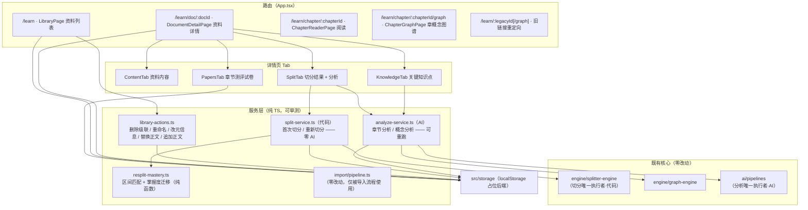
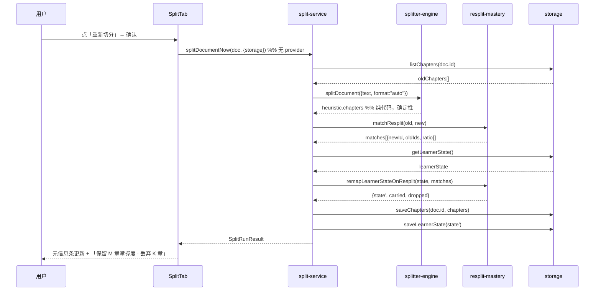
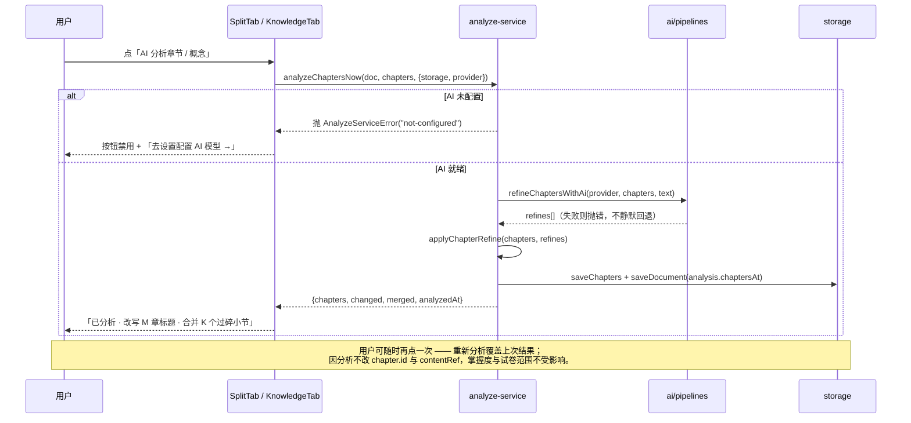

# 资料库模块（列表 + 详情 Tab + 资料 CRUD + 手动 AI 切分）技术方案

| 字段 | 内容 |
|------|------|
| 作者 | Agent（WorkBuddy） |
| 日期 | 2026-09-10 |
| 状态 | 待确认（v2） |
| 关联需求 | 用户需求（5 条）：① 支持导入资料 ② 支持资料的删除/重命名/更新 ③ 支持手动触发切分与 AI 分析 ④ 首页为列表页（卡片展示名称/导入时间/原始类型/来源）⑤ 点卡片进详情，用 Tab 查看资料内容 / 切分结果 / 关键知识点 / 章节测评试卷 |
| 决策依据 | 用户已确认：**路由重构为 `/learn/chapter/:chapterId`**；**「更新」= 替换正文 + 编辑元信息 + 追加内容**；**关键知识点 = 章要点汇总 + 概念图谱（两者都要）**；**删除级联清理 + 重新切分保留同源掌握度**；**切分由代码执行（确定性，无需重试）；分析必须由 AI 执行（可重新分析）** |
| 前置文档 | `docs/knowledge-import-design-2026-09.md`（导入管道，已落地）、`docs/ui-workbench-plan-2026-09.md` §11/U5、`docs/settings-top-tab-layout-design-2026-09.md`（顶部 Tab 视觉先例） |

---

## 1. 背景

### 1.1 业务痛点

「资料库」是 PLOS 的知识入口，也是 V2 学习闭环（学一章 → 考一卷 → AI 判卷 → 生成计划）的起点。当前 `/learn` 是一个**职责混合页**：

- 页面主体是「文档卡」，但卡片**内嵌展开全部章行**（`ChapterCatalogPage.tsx` L256–352），资料一多就变成一条冗长的折叠列表，既不像资料库、也不像章节目录；
- 卡片只展示「格式徽标 + 标题 + N 章 · M 要点 · 最后学习」，**缺导入时间、缺来源（source）**——用户无法判断「这份资料什么时候进来的、从哪来的」；
- 资料级操作**几乎为零**：没有重命名、没有删除入口、没有更新正文；`storage` 契约里 `deleteDocument` 早已存在却从未被 UI 调用；
- 「切分」与「分析」**未分离**：现状把「切分（代码）」与「AI 精修（标题/要点）」混在导入管道的同一阶段里，导致有章节的资料既无法单独**重新切分**（改结构），也无法单独**重新分析**（重跑 AI 提标题与要点），更没有「分析」这一可重复触发的独立动作；
- 资料的内容、切分结果、知识点、试卷四类信息**没有任何聚合视图**，用户想核对「这份资料切得对不对」只能逐个点进章节阅读页。

### 1.2 触发原因

用户明确提出资料库模块的功能补齐需求（见上表「关联需求」5 条）。核心诉求是**把「资料」升格为一等管理对象**：列表页管资料，详情页看资料的全部派生资产。

### 1.3 与现有模块的关系

| 模块 | 关系 |
|------|------|
| `src/features/learn/ChapterCatalogPage.tsx` | **被替换**：拆为 `LibraryPage`（列表）+ `DocumentDetailPage`（详情）；删除原文件 |
| `src/features/learn/import/pipeline.ts` | **零改动**：本方案不改导入管道（`save → split → refine → saveChapters` 原样）；「替换正文」不走管道，改为直接 `saveDocument + splitDocumentNow`（见 §2.2 / §8.6） |
| `src/engine/splitter-engine.ts` | 复用不变：`splitDocument`（**切分唯一执行者，纯代码**）/ `applyChapterRefine` / `mergeChapters` 等纯函数 |
| `src/ai/pipelines.ts` | 复用不变：`refineChaptersWithAi`（章节分析）、`extractChapterConceptsWithAi`（概念分析）——**AI 分析的两个能力，切分不再调用它们** |
| `src/engine/graph-engine.ts` | 复用不变：`subgraphOf` / `replaceChapterConcepts` |
| `src/domain/document.ts` | **小幅扩展**：`SourceDocument` 增加**可选** `analysis` 字段（记录章节/概念分析时间与模型），用于详情页展示「是否已分析 / 上次分析于何时」；其余字段（`source / importedAt / format / status`）本就齐备 |
| `src/storage/*` | **小幅扩展**：新增 `getDocument` / `deletePaper`（级联清草稿与结果） |
| `src/components/primitives.tsx` | **小幅扩展**：新增 `SegmentedTabs` 原语（资料列表页过滤用） |
| `src/components/ui/*` | **补齐两件**：`tabs.tsx`、`dropdown-menu.tsx`（Base UI 底层，shadcn 同构手写） |
| `src/i18n/*` | 新增 `learn.library.*` / `learn.detail.*` 双语文案（zh/en 成对） |

> 架构约束（`rules/layer-import-boundaries.mdc`）：页面/服务只经 `src/storage` 持久化；本次**不新增任何 Tauri 命令**（Rust 侧零改动）；`src/engine` 保持纯 TS；`src/features/learn/*` 为 UI 适配层。

### 1.4 不做的影响

资料库停留在「导入即完事」：资料不可管（改名/删除/更新都做不到）、结构不可校（切错了无法重切）、资产不可见（知识点与试卷散落各处）。用户积累的资料越多，资料库越不可用——这是 local-first 学习系统最致命的体验断点。

---

## 2. 方案目标

| 类型 | 描述 |
|------|------|
| **主要目标** | ① `/learn` 改为**资料列表页**，卡片展示「名称 / 导入时间 / 原始类型 / 来源 / 统计」；② 新增**资料详情页**（`/learn/doc/:docId`），顶部 Tab 切换**资料内容 / 切分结果 / 关键知识点 / 章节测评试卷**；③ 资料级 CRUD：**重命名、删除（级联清理）、替换正文、追加内容、编辑元信息**；④ **切分与分析分离**：**切分恒由代码执行**（确定性、无重试），**分析恒由 AI 执行**（可重复触发、可重跑），重新切分时**按内容区间同源保留掌握度**；⑤ 路由重构为 `/learn`（列表）· `/learn/doc/:docId`（详情）· `/learn/chapter/:chapterId`（阅读）三级结构，旧链接自动重定向。 |
| **非目标（本次不做）** | ① 章节级**人工**编辑（改标题/合并/排序/删除单章）——`splitter-engine` 已有纯函数，但列入 P1；② 资料**批量**删除与多选；③ 资料分组 / 标签 / 文件夹；④ 资料全文检索（仅按标题/来源/章标题匹配）；⑤ 删除的**软删与回收站**；⑥ 重新切分的**新旧结构 diff 预览**（本次为轻量二次确认）；⑦ 追加内容时的**增量切分**（追加后整篇重切）；⑧ docx / epub / 扫描件 PDF 支持（沿用导入模块的既有护栏）；⑨ 试卷的重命名与删除（仅查看与跳转）；⑩ SQLite / 文件系统后端落地（仍是 localStorage 占位）；⑪ **导入管道既有 `refine` 阶段的行为不变**（见 §2.2 说明）。 |
| **成功标准** | ① `/learn` 为卡片网格，每卡可见名称/导入时间/类型/来源/统计，点击进详情；② 详情页 4 个 Tab 各自可用，Tab 状态在 URL 中（`?tab=`）刷新/分享不丢；③ 重命名、编辑元信息、替换正文、追加内容、删除五类操作全部可用且落库；④ 删除资料后其章节/概念/试卷一并清理，无孤儿数据；⑤ 重新切分后，区间重叠 ≥60% 的新章继承原掌握度，`carried` 数量在结果中可见；⑥ **切分全程零 AI 调用**（AI 未配置也能切分成功），**分析在 AI 未配置时给出明确提示且不可执行**（不做静默降级）；⑦ 全仓 `npm run typecheck` 0 error，`test:i18n` / `test:import` / 新增 `test:library` 全绿；⑧ 旧链接 `/learn/<chapterId>` 与 `/learn/<chapterId>/graph` 自动重定向到新路径。 |

### 2.1 切分 / 分析的职责边界（本次核心契约）

这是本方案最关键的一条设计原则：**把「切分」和「分析」当作两个不同性质的操作，从执行者到失败策略彻底分开**。

| 维度 | 切分（Split） | 分析（Analyze） |
|------|---------------|-----------------|
| **执行者** | **代码**（`engine/splitter-engine.splitDocument`，纯函数） | **AI**（`ai/pipelines.refineChaptersWithAi` / `extractChapterConceptsWithAi`） |
| **产出** | 章节边界（`contentRef`）、章标题、基础要点（正文首句兜底）、切分策略 | ① 章节分析：更准确的标题 + 提炼要点 + 过碎小节合并；② 概念分析：知识概念单元 + 关系 |
| **确定性** | **确定性**——同一正文 + 同一参数，结果恒等 | **非确定性**——同一输入，多次结果可能不同 |
| **是否依赖 AI** | **完全不依赖**（AI 未配置也能切分） | **强依赖**（未配置 → 不可执行，明确提示而非降级） |
| **失败策略** | 抛类型化错误（`no-body` / `no-chapters`）；**不重试**（确定性重试无意义），不覆盖旧章 | 抛类型化错误（`not-configured` / `failed`）；UI 展示原因并允许**重新分析** |
| **重复触发语义** | 「重新切分」= 用当前正文重跑代码（仅当正文变更/参数变更时结果才可能不同） | 「重新分析」= 重跑 AI，**覆盖**上一次分析结果（幂等入口，可无限次） |
| **掌握度处理** | 重新切分触发 `resplit-mastery` 区间同源迁移 | 分析不改章 id / 区间 → **掌握度天然不受影响**（这是「分析可重跑」安全的前提） |

> **一句话**：切分负责「把资料切对位置」，是代码的确定性工作；分析负责「把内容读懂讲清」，是 AI 的语义工作。分析建立在切分结果之上，但两者可独立触发、互不耦合。

### 2.2 与导入管道的关系（范围声明）

导入管道（`import/pipeline.ts`）当前的阶段为 `save → split → refine → saveChapters`，其中 `refine` 是 AI 精修，属**导入时自动执行的一次分析**。本次：

- **不改动导入管道的行为与签名**（`refine` 阶段保留，`ImportModal` 五阶段进度不变）——它是已落地的 U5 导入 UX，改动会牵动 `ImportModal` 与 `test:import` 门禁，属范围外；
- 但在语义上明确：导入管道内的 `split` 步 = **切分（代码）**，`refine` 步 = **分析（AI）**——与本模块契约一致，只是导入把它俩串成了一次性流程；
- 资料库模块内的「切分 / 分析」是**细粒度、可独立重跑**的入口。若用户希望导入也改为「只切分、不分析」（改为导入后手动触发分析），改动极小（`ImportModal` 不传 `provider` + 调整阶段文案），已在 §12 列为可选后续项。

---

## 3. 项目现状

### 3.1 相关代码与模块

| 位置 | 现状 | 影响 |
|------|------|------|
| `src/features/learn/ChapterCatalogPage.tsx`（415 行） | 文档卡（可折叠）+ 内嵌章行 + 页头搜索/过滤；`visibleDocs` 按 `importedAt` **升序**（L82）；`splitNow(docId)` 仅处理 `textPreview` 存在且 0 章的资料（L153–169） | 拆为列表页与详情页；排序改倒序；`splitNow` 职责被「切分服务（代码）+ 分析服务（AI）」取代 |
| `src/App.tsx`（61 行） | `/learn` → Catalog；`/learn/:chapterId` → Reader；`/learn/:chapterId/graph` → Graph | 新增 `/learn/doc/:docId`；阅读/图谱路径加 `/chapter` 前缀 + 旧路径重定向 |
| `src/storage/types.ts`（68 行） | 有 `listDocuments / saveDocument / deleteDocument`；**无** `getDocument`；**无** `deletePaper`（只有 `deletePaperResult`） | 补两个方法；`saveDocument` 已是 upsert，重命名/改元信息可直接复用 |
| `src/storage/memory.ts` | `deleteDocument` 已级联删章节（L40–44）；`papers` / `graph` / `learnerState` 均受保护可读写 | 删除资料的**试卷 + 概念**级联需在上层编排（适配器不感知 domain 语义） |
| `src/features/learn/import/pipeline.ts`（136 行） | `runUnitImport(unit, opts)` 恒定 `newId("doc")` 新建资料（L63–71）；`refine` 阶段调 `refineSplitResult`（AI，失败静默回退） | **不改动**（见 §2.2）；资料库的切分/分析是独立于导入的细粒度入口 |
| `src/engine/splitter-engine.ts`（433 行） | `splitDocument` 纯函数：markdown 按标题 / 其余按段落聚类切章，`keyPoints` 用正文首句兜底（代码）；`applyChapterRefine` 负责把 AI 建议应用到章节 | **切分的唯一执行者**；`splitDocumentNow` 只调它，绝不调 AI |
| `src/ai/pipelines.ts`（625 行） | `refineSplitResult`（**静默回退**版，供导入用）、`refineChaptersWithAi`（**抛错**版）、`extractChapterConceptsWithAi` | 分析服务直接消费**抛错版** `refineChaptersWithAi`（「分析必须由 AI」→ 失败要暴露，不能静默降级） |
| `src/features/learn/ChapterReaderPage.tsx`（397 行） | `ArticleBody` 为文件内私有组件（L365–396）：极简 Markdown 行渲染 | 抽为共享组件，详情页「资料内容」Tab 复用 |
| `src/features/knowledge/ChapterGraphPage.tsx`（209 行） | 概念抽取按章触发：`extractChapterConceptsWithAi` → `replaceChapterConcepts` → 写 `Chapter.unitIds` + 全局 graph | 详情页「关键知识点」Tab 做**批量概念分析**编排（逐章串行，收敛进 `analyze-service`） |
| `src/components/ui/` | 已有 button / dialog / alert-dialog / confirm-dialog / input / label / select / textarea / separator / badge / checkbox；**无 tabs、无 dropdown-menu** | 补齐两件 UI Kit 组件（`@base-ui/react/tabs`、`@base-ui/react/menu` 已在依赖中） |
| `src/components/primitives.tsx`（314 行） | `Card / SectionTitle / Section / Bar / Stat / BandBadge / KnowledgeRow / EvidenceRow / ActionCard` | 新增 `SegmentedTabs`（列表页过滤与详情页 Tab 复用） |
| `src/i18n/messages/{zh,en}.ts` | `learn.catalog.*`（28 键）、`learn.format.*`、`learn.import.*` 齐备 | 新增 `learn.library.*` / `learn.detail.*`；`learn.catalog.*` 迁移后清理 |

### 3.2 相关文档与约定

- `docs/knowledge-import-design-2026-09.md`：导入管道契约（三来源归一化为 `ImportUnit` → `runUnitImport`）；本方案复用其护栏常量 `LIMITS`。
- `docs/learning-system-v2-design-2026-09.md`：`Chapter.contentRef` 为 `doc.textPreview` 的**字符区间引用**（不复制原文）——这是「重新切分保留同源掌握度」可按区间匹配的前提。
- `docs/settings-top-tab-layout-design-2026-09.md`：顶部横向 Tab 的容器/按钮样式与 `role=tablist` / `data-testid` 约定。
- `docs/ui-workbench-plan-2026-09.md` §11/U5：文档卡形态与 `learn.catalog` 文案口径来源。
- `rules/react.mdc`（Tailwind 4 + 语义 token + UI Kit 优先）、`rules/engineering-code-style.mdc`（相对导入、中文注释、i18n 双语、`import type`）、`rules/code-structure-and-dependencies.mdc`（≤700 行、依赖单向）、`rules/no-headless-browser-validation.mdc`（**禁止**起浏览器截图自检）。
- 语义 token 单源：`src/styles/main.css`。本次仅用既有 token（`surface / subtle / line / ink-1..3 / primary / state-* / app-bg`），**不新增 hex**。

### 3.3 约束与依赖

| 约束 | 说明 | 对策 |
|------|------|------|
| **localStorage 容量** | 单域约 5–10MB，`textPreview` 存全文；替换/追加正文会放大占用 | 沿用导入护栏（单 md ≤1MB / PDF ≤30MB / 合并 ≤1.5M 字符）；追加后总量超 1.5M 字符**拒绝并提示** |
| **掌握度键为 chapterId** | 重新切分会生成新 chapter id → `learnerState.byUnit` 键失配，掌握度归零 | 新增纯函数 `resplit-mastery.ts`：按 `contentRef` 区间重叠匹配并迁移键 |
| **试卷引用 chapterId** | 重新切分后旧试卷的 `scope.chapterIds` 指向已不存在的章 | 保留试卷（历史证据不篡改）；`QuizCenterPage.contextLabel` 已有 `removedDoc` 降级文案，天然兼容；详情页试卷 Tab 对失效范围显示「范围已随重新切分失效」 |
| **概念图谱为全局单图** | `storage.getGraph()` 单例；概念由 `Chapter.unitIds` 关联 | 删除资料时按 `chapters[].unitIds` 反查并清理 `units` + 相关 `relations`（避免孤儿节点） |
| **切分不得依赖 AI** | 需求明确「切分由代码进行」；若切分里混入 AI 调用，AI 未配置就会连切分都不可用 | `splitDocumentNow` 签名里**没有** `provider`；实现体只调 `splitDocument`。类型层面杜绝误加 AI |
| **分析必须由 AI** | 需求明确「分析必须由 AI 进行」；若沿用 `refineSplitResult`（静默回退代码结果），会伪装成「已分析」 | 分析服务直接调**抛错版** `refineChaptersWithAi`；AI 未配置 → 按钮禁用 + 提示，绝不降级 |
| **分析可重跑的前提** | 重跑分析必须不影响学习数据，否则用户不敢重跑 | 分析**只改** `Chapter.title` / `keyPoints` / `unitIds` 与 `doc.analysis`，**不改** `chapter.id` 与 `contentRef` → 掌握度键与区间稳定 |
| **路由段冲突** | `/learn/doc/:docId` 与 `/learn/:legacyId/graph` 均为两段 | 仅在 `docId === "graph"` 且 `legacyId === "doc"` 时理论冲突；资料 id 恒为 `newId("doc")` → `doc_*`，不可能等于 `graph`。旧路径解析器再做一次「先查资料、再当章节」兜底 |
| **无 ESLint / 无浏览器校验** | 仓库无 lint 配置；`no-headless-browser-validation` 禁止截图自检 | 验收走 `typecheck` + node 单测 + 代码级对抗性自审；需要人眼确认时把 `npm run dev`(1420) 交给用户 |
| **单文件 ≤700 行** | `code-structure-and-dependencies` 硬约束 | 详情页拆为 4 个 Tab 子组件 + 页头；列表页拆出卡片与菜单 |

---

## 4. 技术架构

### 4.1 总体架构

核心思路：**「资料」升格为一等管理对象**。页面层分化为「列表（管理）」与「详情（消费）」两页；资料级写操作收敛到三个无 React 依赖的服务模块（`library-actions` / `split-service` / `resplit-mastery`），页面只做编排与渲染。所有持久化仍只经 `src/storage`。



> 图中刻意画成**两条互不相交的边**：`SS → SE`（切分只到代码引擎）与 `AN → AP`（分析只到 AI 管道）。切分服务**没有**指向 `AP` 的边，分析服务**没有**指向 `SE` 的边——这是 §2.1 契约在架构图上的体现。

- **分层合规**：`library-actions` / `split-service` / `analyze-service` / `resplit-mastery` 位于 `src/features/learn/`（UI 适配层），只读 `domain/engine/ai/storage` 的类型与纯函数，不 import React、不触碰 `src-tauri`。
- **切分零 AI、分析零代码**：`split-service` 只 import `engine/splitter-engine`；`analyze-service` 只 import `ai/pipelines` + `engine/graph-engine`。两个服务之间无依赖（页面各自调用）。
- **零 Rust 改动**：本方案不新增 Tauri 命令；无 capability 变更。
- **依赖单向**：`domain → engine/ai/storage → services → pages/components`，与 `code-structure-and-dependencies` 一致。

### 4.2 模块职责

| 模块/文件 | 职责 | 技术选型 |
|-----------|------|----------|
| `features/learn/LibraryPage.tsx`（新） | 资料列表页：页头统计 + 搜索 + 过滤 + 排序 + 卡片网格 + 空态 | React + PageContainer |
| `features/learn/library/DocumentCard.tsx`（新） | 单张资料卡：类型徽标 / 标题 / 来源 / 导入时间 / 统计 / 掌握度 Bar / 操作菜单入口 | React |
| `features/learn/library/DocActionsMenu.tsx`（新） | 卡片右上 `⋯` 菜单：重命名 / 编辑信息 / 替换正文 / 追加内容 / 切分 / 删除 | Base UI Menu |
| `features/learn/library/RenameDocDialog.tsx`（新） | 重命名（单输入） | Base UI Dialog |
| `features/learn/library/DocumentMetaDialog.tsx`（新） | 编辑元信息：标题 / 来源 / 原始类型 | Base UI Dialog + Select |
| `features/learn/library/UpdateDocModal.tsx`（新） | 替换正文：三来源（粘贴 / 本地文件 / GitHub）→ `replaceDocumentBody` | 复用 `LocalFilePanel` / `GithubPanel` |
| `features/learn/library/AppendDocModal.tsx`（新） | 追加内容：粘贴正文 → 尾部拼接 → 整篇重切 | Base UI Dialog |
| `features/learn/library/DeleteDocDialog.tsx`（新） | 删除确认：列明将连带删除的章/试卷/概念数量 | `ConfirmDialog` |
| `features/learn/DocumentDetailPage.tsx`（新） | 详情页骨架：数据加载 + 页头 + Tab 切换（URL `?tab=`）+ 页头操作 | React Router |
| `features/learn/detail/ContentTab.tsx`（新） | Tab1：全文渲染 + 元信息条 + 超长截断开关 | 复用 `ArticleBody` |
| `features/learn/detail/SplitTab.tsx`（新） | Tab2：切分元信息（策略/章数/要点/时间）+ 分析状态条 + 章行列表 + 「重新切分」「重新分析」两个操作 | 复用 `split-service` + `analyze-service` |
| `features/learn/detail/KnowledgeTab.tsx`（新） | Tab3：章要点汇总（按章分组）+ 概念图谱（聚合子图 + 「AI 分析概念」批量入口） | 复用 `GraphView` + `analyze-service` |
| `features/learn/detail/PapersTab.tsx`（新） | Tab4：该资料试卷列表 + 出卷入口 + 状态跳转 | 复用 `quiz/meta` |
| `features/learn/ArticleBody.tsx`（新，抽取） | 极简 Markdown 行渲染（从 `ChapterReaderPage` 抽出） | 纯 React |
| `features/learn/split-service.ts`（新） | **切分编排（纯代码）**：`splitDocumentNow`；含掌握度迁移与落库。**无 provider 参数、无 AI、无重试** | 纯 TS + storage 注入 |
| `features/learn/analyze-service.ts`（新） | **分析编排（纯 AI）**：`analyzeChaptersNow`（标题/要点/合并）+ `analyzeConceptsNow`（逐章概念）；**可重复调用、失败抛错** | 纯 TS + storage 注入 |
| `features/learn/resplit-mastery.ts`（新） | 重新切分同源匹配与 `LearnerState` 键迁移（纯函数） | 纯 TS，可单测 |
| `features/learn/library-actions.ts`（新） | 资料级写操作编排：删除级联 / 重命名 / 改元信息 / 替换正文 / 追加正文 | 纯 TS + storage 注入 |
| `features/learn/import/pipeline.ts`（**不改**） | 导入管道原样保留；资料库不依赖它（替换正文自行 `saveDocument + splitDocumentNow`） | 纯 TS |
| `components/ui/tabs.tsx`（新） | UI Kit Tab（Base UI 底层，shadcn 同构） | `@base-ui/react/tabs` |
| `components/ui/dropdown-menu.tsx`（新） | UI Kit 下拉菜单（Base UI 底层） | `@base-ui/react/menu` |
| `components/primitives.tsx`（改） | 新增 `SegmentedTabs`（胶囊分段控件，列表页过滤用） | React |
| `storage/{types,memory,local}.ts`（改） | 新增 `getDocument` / `deletePaper`（级联清草稿与结果） | 纯 TS |

### 4.3 数据模型与 API

#### 4.3.1 存储契约扩展（`src/storage/types.ts`）

```ts
export interface StorageAdapter {
  // …既有方法不变…

  /** 单份资料（详情页按 id 取；不存在返回 undefined）。 */
  getDocument(id: string): Promise<SourceDocument | undefined>;

  /**
   * 删除试卷本体（资料级联清理用）。
   * 级联语义：同时移除该 paperId 的答题草稿（getPaperDraft）与判卷结果（PaperResult）。
   */
  deletePaper(id: string): Promise<void>;
}
```

> **`SourceDocument` 仅做一处可选扩展**（新增 `analysis`，见 §4.3.1b）：`title`（重命名）、`source`（来源）、`format`（原始类型）、`importedAt`（导入时间）、`status`、`textPreview`（正文）已完整覆盖需求 4 的展示字段与需求 2 的更新字段。除 `analysis` 外**零 domain 改动**。

#### 4.3.1b `SourceDocument.analysis`（新增可选字段，记录 AI 分析状态）

切分由代码完成、**不记录**（可由 `chapters.length` 与 `chapter.createdAt` 推断）；需要持久化的是「AI 是否分析过、上次分析于何时、用的什么模型」，否则详情页无法区分「代码切出的朴素标题」与「AI 分析后的标题」。

```ts
// src/domain/document.ts
export interface SourceDocument {
  // …既有字段不变…
  /**
   * AI 分析状态（切分由代码完成，不计入本字段）。
   * 全部可选：老数据无此字段 → 视为「未分析」，天然兼容。
   */
  analysis?: {
    /** 章节分析（标题 / 要点 / 过碎合并）最近一次完成时间。 */
    chaptersAt?: number;
    /** 概念分析（知识概念抽取）最近一次完成时间。 */
    conceptsAt?: number;
    /** 分析所用模型标识（展示用，可缺省）。 */
    model?: string;
  };
}
```

- 写入时机：`analyzeChaptersNow` 成功后置 `chaptersAt`；`analyzeConceptsNow` 成功后置 `conceptsAt`；均通过 `storage.saveDocument` 落库（`saveDocument` 已是 upsert，无需新方法）。
- 读取时机：`SplitTab` 依据 `doc.analysis?.chaptersAt` 显示「已分析 / 未分析 + 时间」；`KnowledgeTab` 依据 `conceptsAt` 显示概念分析状态。
- 兼容性：字段可选，旧 localStorage 数据无需迁移；`JSON.parse` 后为 `undefined`，UI 走「未分析」分支。

#### 4.3.2 重新切分的掌握度同源迁移（`resplit-mastery.ts`，纯函数）

```ts
/** 新章 ← 旧章的匹配结果（一个旧章最多归属一个新章）。 */
export interface ChapterMatch {
  newId: string;
  oldIds: string[];
  /** 该新章与归属旧章的最大区间重叠比（0..1）。 */
  ratio: number;
}

/** 匹配阈值：区间重叠比 ≥ 该值才算同源（防误继承）。 */
export const RESPLIT_MATCH_THRESHOLD = 0.6;

/**
 * 重叠比 = |交集| / min(|旧区间|, |新区间|)。
 * 用 min 而非并集：合并（2 旧 → 1 新）与包含关系都记 1.0，
 * 拆分（1 旧 → 2 新）时各得 <1 的部分，符合「章被切开」的直觉。
 */
export function overlapRatio(a: ChapterRange, b: ChapterRange): number;

/** 贪心匹配：每个旧章选重叠比最高且 ≥ 阈值的新章；低于阈值则丢弃（掌握度不迁移）。 */
export function matchResplit(oldChapters: Chapter[], newChapters: Chapter[]): ChapterMatch[];

/**
 * 把旧键的掌握度迁移到新键。
 * 合并规则（同一新章由多个旧章贡献时）：
 *  - mastery / confidence / applicationAbility / interviewAbility → 取最大值（保留最强证据）
 *  - attempts / correctCount → 求和（历史作答不丢）
 *  - lastReviewedAt / lastAssessmentAt / nextReviewAt → 取最大值（最近一次为准）
 *  - cognitiveLevel → 取最高层级；misconceptions → 并集去重（上限 8 条）
 * 未被任何新章继承的旧键 → 删除（避免脏键堆积）。
 */
export function remapLearnerStateOnResplit(
  state: LearnerState,
  matches: ChapterMatch[],
): { state: LearnerState; carried: number; dropped: number };
```

#### 4.3.3 切分服务（`split-service.ts`，**纯代码**）

```ts
export type SplitMode = "initial" | "resplit";

export class SplitServiceError extends Error {
  constructor(readonly kind: "no-body" | "no-chapters", message: string) { super(message); }
}

export interface SplitRunOptions {
  storage: StorageAdapter;
  /** 切分参数（沿用导入默认 1600 字符 / 3 段）。 */
  split?: { targetCharsPerChapter?: number; minParagraphsPerChapter?: number };
  now?: number;
}
// 注意：SplitRunOptions 里没有 provider、没有 refine——切分与 AI 无关，类型即约束。

export interface SplitRunResult {
  mode: SplitMode;
  chapters: Chapter[];
  /** headings（标题切分）/ paragraphs（段落聚类）。 */
  strategy: SplitStrategy;
  /** 切分前章数（首次为 0）。 */
  previousChapters: number;
  /** 重新切分时同源继承掌握度的章数。 */
  carriedMastery: number;
  /** 旧章中未能同源、掌握度被丢弃的章数。 */
  droppedMastery: number;
}

/** 首次切分 / 重新切分（同一实现，按旧章数自动判定 mode）。确定性、无 AI、无重试。 */
export async function splitDocumentNow(
  doc: SourceDocument,
  opts: SplitRunOptions,
): Promise<SplitRunResult>;
```

`splitDocumentNow` 的执行序（关键：**先算后写**，任一步失败不落脏数据）：

1. `old = await storage.listChapters(doc.id)`
2. 取正文 `text = doc.textPreview ?? ""`；空 → 抛 `SplitServiceError("no-body")`
3. `heuristic = splitDocument({ documentId: doc.id, text, format: "auto" }, splitOpts)`（0 章 → 抛 `SplitServiceError("no-chapters")`，**不覆盖**旧章）
4. `matches = matchResplit(old, heuristic.chapters)` → `remapLearnerStateOnResplit(learnerState, matches)`
5. 写库（顺序固定）：`saveChapters(doc.id, heuristic.chapters)` → 若有迁移则 `saveLearnerState(next)`
6. 返回 `SplitRunResult`

**「无重试」的落地方式**：

- 不写任何 `for (attempt...)` 重试循环；`splitDocument` 是纯函数，重试必然得到同一结果；
- 失败（`no-body` / `no-chapters`）时 UI 展示原因，**不出现「重试」按钮**，而是引导用户去「替换正文」补内容；
- 但**保留「重新切分」入口**：它语义是「用当前正文重跑代码」，在正文被替换/追加、或切分参数变化时结果会不同，与「重试」不是一回事。

#### 4.3.3b 分析服务（`analyze-service.ts`，**纯 AI**）

```ts
export type AnalyzeErrorKind = "not-configured" | "no-body" | "no-chapters" | "failed";

export class AnalyzeServiceError extends Error {
  constructor(readonly kind: AnalyzeErrorKind, message: string) { super(message); }
}

/** ① 章节分析：重写标题、提炼要点、合并过碎小节（不改章 id 与区间）。 */
export interface AnalyzeChaptersResult {
  chapters: Chapter[];
  /** 标题或要点发生变化的章数。 */
  changed: number;
  /** AI 判定并合并的过碎小节数。 */
  merged: number;
  analyzedAt: number;
}

export async function analyzeChaptersNow(
  doc: SourceDocument,
  chapters: readonly Chapter[],
  opts: { storage: StorageAdapter; provider: AIProvider; now?: number },
): Promise<AnalyzeChaptersResult>;

/** ② 概念分析：逐章抽取知识概念与关系，写入全局图谱。 */
export interface AnalyzeConceptsResult {
  ok: number;
  failed: { chapterId: string; title: string; reason: string }[];
  units: number;
  relations: number;
  analyzedAt: number;
}

export async function analyzeConceptsNow(
  doc: SourceDocument,
  chapters: readonly Chapter[],
  opts: {
    storage: StorageAdapter;
    provider: AIProvider;
    /** true = 只补未提炼的章；false（默认）= 全部重新分析（覆盖旧概念）。 */
    onlyMissing?: boolean;
    onProgress?: (i: number, total: number, chapter: Chapter) => void;
    now?: number;
  },
): Promise<AnalyzeConceptsResult>;
```

`analyzeChaptersNow` 的执行序（**可重跑、失败暴露**）：

1. `provider.isConfigured()` 为假 → 抛 `AnalyzeServiceError("not-configured")`（**不降级**）
2. 无章 → 抛 `no-chapters`；正文空 → 抛 `no-body`
3. `refines = await refineChaptersWithAi(provider, chapters, text)` —— 直接消费**抛错版**管道（不是导入用的 `refineSplitResult` 静默回退版）；尺寸超限时该管道返回 `[]`（视作「无建议」），不视为失败
4. `next = applyChapterRefine([...chapters], refines)`（纯函数，边界不变、order 重写）
5. 写库：`saveChapters(doc.id, next)` + `saveDocument({ ...doc, analysis: { ...doc.analysis, chaptersAt: now, model } })`
6. 返回 `{ chapters: next, changed, merged, analyzedAt: now }`

`analyzeConceptsNow` 的执行序（**逐章串行、单章失败不阻断**）：

1. `provider.isConfigured()` 为假 → 抛 `not-configured`
2. 待分析章 = `onlyMissing ? chapters.filter(c => c.unitIds.length === 0) : chapters`
3. 逐章：`extractChapterConceptsWithAi(provider, { chapterTitle, text: 章正文切片 })`
   → `replaceChapterConcepts(graph, chapter, units, relations)` → 累积到内存（先算后写）
   → 成功章记录 `unitIds`；失败章记入 `failed` 并继续
4. 全部完成后**一次性写库**：`saveGraph(graph)` + `saveChapters(doc.id, 更新 unitIds 的章)` + `saveDocument({ ...doc, analysis: { ...doc.analysis, conceptsAt: now, model } })`
5. 返回 `{ ok, failed, units, relations, analyzedAt }`

**为什么分析可安全重跑**：分析只写 `title` / `keyPoints` / `unitIds` 与 `doc.analysis`，**从不改** `chapter.id` 与 `chapter.contentRef`。因此 `learnerState.byUnit`（以 chapterId 为键）与试卷 `scope.chapterIds` 在分析前后完全稳定——用户可放心「重新分析」。这也是切分（会改 id，需迁移掌握度）与分析（不改 id，无副作用）的本质区别。

#### 4.3.4 资料级写操作（`library-actions.ts`）

```ts
export interface DeleteReport { chapters: number; papers: number; concepts: number }

/**
 * 删除资料并级联清理（顺序固定，避免半清理）：
 *  1) chapters = listChapters(docId)
 *  2) 试卷：papers.filter(p => p.scope.chapterIds ∩ chapterIds ≠ ∅) → deletePaper(id)
 *     （说明：PLOS 出卷恒为「单资料范围」，故用「任一命中即删」；跨资料卷不存在）
 *  3) 概念：graph.units 中 id ∈ union(chapters[].unitIds) 的单元及其 relations 一并移除 → saveGraph
 *  4) deleteDocument(docId)（适配器内部再级联删章节）
 */
export async function deleteDocumentCascade(docId: string, store?: StorageAdapter): Promise<DeleteReport>;

/** 删除前预检：返回将被连带清理的数量（供确认弹窗展示）。 */
export async function previewDeleteCascade(docId: string, store?: StorageAdapter): Promise<DeleteReport>;

/** 重命名（title 去空白，空则拒绝）。 */
export async function renameDocument(doc: SourceDocument, title: string, store?: StorageAdapter): Promise<SourceDocument>;

/** 编辑元信息（title / source / format 局部更新；undefined 字段保持原值）。 */
export async function updateDocumentMeta(
  doc: SourceDocument,
  patch: { title?: string; source?: string; format?: DocumentFormat },
  store?: StorageAdapter,
): Promise<SourceDocument>;

/**
 * 替换正文：覆盖 textPreview（保留 id / importedAt）→ 调 splitDocumentNow 重新切分（代码）。
 * 不走导入管道的 refine 阶段——本模块的切分恒为代码，分析另行触发。
 */
export async function replaceDocumentBody(
  doc: SourceDocument,
  unit: ImportUnit,
  opts: { storage: StorageAdapter; onPhase?: (k: ReplacePhaseKey, s: "active" | "done") => void },
): Promise<SplitRunResult>;

/**
 * 追加正文：newText 去空白后以 "\n\n" 拼到 textPreview 尾部 →
 * 总量超 LIMITS.githubTotalChars（1.5M 字符）则抛错 → 整篇重新切分（代码，掌握度同源保留）。
 */
export async function appendDocumentBody(
  doc: SourceDocument,
  newText: string,
  opts: { storage: StorageAdapter },
): Promise<SplitRunResult & { appendedChars: number }>;
```

> **`ReplacePhaseKey`**：`"save" | "split" | "migrate"`（保存正文 → 重新切分 → 迁移掌握度）——由 `replaceDocumentBody` 自己发事件，不依赖导入管道的五阶段。注意**没有 `"analyze"` 阶段**：替换只做切分，分析由用户在详情页按需触发。

#### 4.3.5 数据读写路径（`layer-import-boundaries` 合规声明）

| 项 | 路径 |
|----|------|
| 读资料列表 / 详情 | `LibraryPage` / `DocumentDetailPage` → `storage.listDocuments / getDocument / listChapters / listPapers / listPaperResults / getGraph / getLearnerState` |
| 写资料（改名/改元信息） | 页面 → `library-actions` → `storage.saveDocument` |
| 写资料（替换/追加正文） | 页面 → `library-actions` → `storage.saveDocument` → `split-service.splitDocumentNow` → `storage.saveChapters` |
| 写切分结果 | 页面 → `split-service`（**代码**）→ `storage.saveChapters`（+ `saveLearnerState` 迁移） |
| 写分析结果（章节） | 页面 → `analyze-service.analyzeChaptersNow`（**AI**）→ `ai/pipelines.refineChaptersWithAi` → `engine/splitter-engine.applyChapterRefine` → `storage.saveChapters / saveDocument` |
| 写分析结果（概念） | 页面 → `analyze-service.analyzeConceptsNow`（**AI**）→ `ai/pipelines.extractChapterConceptsWithAi` → `engine/graph-engine.replaceChapterConcepts` → `storage.saveGraph / saveChapters / saveDocument` |
| 删除资料 | 页面 → `library-actions` → `storage.deletePaper / saveGraph / deleteDocument` |
| 桌面能力（vault / llm） | **本次不涉及**；无新增 `invoke` 命令，无 `isTauri` 守卫需求 |
| 存储格式与迁移 | 沿用现有 key（`plos.documents` / `plos.chapters` / `plos.graph` / `plos.learner` / `plos.papers`）；`deletePaper` 需在 `local.ts` 的 `persist()` 中同步落盘 `papers` / `paper-drafts` / `paper-results` |

### 4.4 状态与副作用

| 状态 | 归属 | 说明 |
|------|------|------|
| 资料列表 / 搜索 / 过滤 / 排序 | `LibraryPage` 本地 `useState` | 与现状同构（`query` / `filter`），新增 `sort` |
| 当前 Tab | `DocumentDetailPage` ← `useSearchParams().get("tab")` | **URL 化**：`?tab=content\|split\|knowledge\|papers`，默认 `content`；刷新/前进后退保持 |
| 详情页数据（doc / chapters / learner / graph / papers） | `DocumentDetailPage` 本地 state，向下传 props | 单一数据源在页面，Tab 组件纯展示（避免 4 个 Tab 各自请求） |
| 弹窗开关（重命名/元信息/替换/追加/删除） | `LibraryPage` 本地 state（`dialog: {kind, doc} \| undefined`） | 一次只开一个，关闭即清 |
| 切分 busy（代码） | `SplitTab` / 卡片本地 `useState` | 按钮禁用；代码切分近乎瞬时，失败即抛错展示 |
| 分析 busy（AI） | `SplitTab` / `KnowledgeTab` 本地 `useState` | 按钮禁用 + 「分析中…」；失败展示原因并允许**再次点击重跑**；单章概念失败不阻断 |
| 跨页刷新 | `DOCS_CHANGED_EVENT`（既有） | 资料写操作成功后 `notifyDocsChanged()`，列表页与详情页监听重载 |
| 副作用触发 | 仅用户操作（点击/提交） | **无轮询**；无定时器；无 `useEffect` 自动写库 |

---

## 5. 交互流程

### 5.1 主流程

**A · 资料列表 → 详情**

1. 用户点侧栏「资料库」进入 `/learn` → 页头显示「资料库 + N 份资料 · M 章 · 已掌握 K 章（达标 80%）」与「＋ 导入资料」。
2. 页面渲染**卡片网格**（`sm:grid-cols-2`），卡片内容：类型徽标（PDF / Markdown / 纯文本 / 网页 / 笔记…）+ 标题 + 来源行（`source` 缺失显示「—」）+ 「导入于 3 天前」+ 统计「N 章 · M 要点 · 掌握 x/N」+ 掌握度 Bar + 右上 `⋯`。
3. 点击卡片主体 → 进入 `/learn/doc/:docId?tab=content`。
4. 详情页页头：返回「← 资料库」、标题、类型徽标、来源、导入时间、统计；右侧操作按钮组（重命名 / 更新 / 切分 / 删除，与卡片菜单同源）。
5. 下方 Tab 栏（4 项）：**资料内容 / AI 切分结果 / 关键知识点 / 章节测评试卷**；点击切换并写 URL。
6. Tab1 显示全文；Tab2 显示切分元信息 + 章行（点章行进阅读页）；Tab3 显示章要点分组 + 概念图谱；Tab4 显示试卷列表。

**B · 重命名 / 编辑元信息**

1. 卡片 `⋯` → 「重命名」→ `RenameDocDialog` 预填当前标题 → 输入新标题 → 确认。
2. `renameDocument` 落库 → `notifyDocsChanged()` → 列表刷新，卡片标题即时更新。
3. 「编辑信息」→ `DocumentMetaDialog`（标题 / 来源 / 原始类型下拉）→ 确认 → `updateDocumentMeta` → 刷新。

**C · 替换正文（重新导入）**

1. 卡片 `⋯` → 「替换正文」→ `UpdateDocModal`（三来源 Tab，复用 `LocalFilePanel` / `GithubPanel`）。
2. 用户选定来源 → 主按钮「替换并重新切分」→ 生成 `ImportUnit`。
3. `replaceDocumentBody`：覆盖 `textPreview`（保留 id / importedAt）→ `splitDocumentNow`（**代码切分**，掌握度同源迁移）。
4. 进度区显示三阶段（保存正文 → 重新切分 → 迁移掌握度）；完成后展示结果条：「已替换 · N 章（保留 M 章掌握度，丢弃 K 章）」。
5. **提示后续动作**：结果条附一句「章节已按新正文切分；标题与要点可到详情页点「重新分析」用 AI 提炼」（因为替换只做代码切分，不自动跑 AI）。
6. 关闭弹窗 → 列表/详情刷新。

**D · 追加内容**

1. 卡片 `⋯` → 「追加内容」→ `AppendDocModal`（textarea）。
2. 提交 → `appendDocumentBody`：尾部拼接 → 总量护栏校验 → 整篇重新切分（代码，掌握度同源保留）。
3. 结果条同 C（含「可重新分析」提示）；若超护栏 → 行内错误「追加后正文超 1.5M 字符，请拆分资料」，**不写库**。

**E · 切分（代码）与分析（AI）—— 两类操作，四个入口**

切分与分析是**两个独立动作**，各自可单独触发：

| 操作 | 执行者 | 入口 | 前置 | 行为与反馈 |
|------|--------|------|------|-----------|
| **首次切分** | 代码 | 列表卡片（0 章时的「立即切分」）/ `⋯` 菜单 / 详情页 Tab2 | 有 `textPreview` | `splitDocumentNow` → 写章；结果条「已切分 · N 章（按标题切分）」 |
| **重新切分** | 代码 | `⋯` 菜单「重新切分」/ 详情页 Tab2 按钮 | 已有章节 | 轻量二次确认（提示「将覆盖现有 N 章结构，掌握度按内容区间同源保留」）→ 重跑代码；结果条含 `carriedMastery` |
| **章节分析** | **AI** | 详情页 Tab2「AI 分析章节 / 重新分析」 | 已有章节 **且 AI 就绪** | `analyzeChaptersNow`：重写标题、提炼要点、合并过碎小节；**不改章数以外的结构 id 与区间**；结果条「已分析 · 改写 M 章标题 · 合并 K 个过碎小节」 |
| **概念分析** | **AI** | 详情页 Tab3「AI 分析概念 / 重新分析概念」 | 已有章节 **且 AI 就绪** | `analyzeConceptsNow`：逐章提炼概念与关系，写入全局图谱；进度「正在分析 i/n · 章标题」；汇总「成功 x · 失败 y」 |

- **切分**：全程零 AI。失败（无正文 / 切不出章）时**只提示原因，不提供「重试」**（代码确定性，重试无意义），引导去「替换正文」补内容。
- **分析**：必须 AI。AI 未配置时两个分析按钮**禁用**并给出「去设置配置 AI 模型 →」链接；失败时展示原因，用户可**直接再点一次**（= 重新分析）。
- 结果反馈：Tab2 顶部元信息条分两行——「切分：策略 · 章数 · 要点 · 切分于 X」与「分析：已分析/未分析 · 改写章数 · 分析于 Y」；两个操作各自刷新自己那一行。

**F · 删除资料**

1. 卡片 `⋯` → 「删除」→ 先 `previewDeleteCascade` 取数量 → `DeleteDocDialog` 展示：
   > 将删除《RAG 系统设计》，并连带清理 **12 个章节**、**3 份试卷**、**24 个知识概念**。此操作不可撤销。
2. 确认 → `deleteDocumentCascade` → 列表移除该卡；若在详情页删除 → `navigate("/learn")`。

**G · 关键知识点 Tab**

1. 上半「章要点」：按章分组（章序号 + 标题 + 要点列表）；点击章标题 → 跳阅读页。0 要点 → 空态引导去切分。
2. 下半「概念图谱」：统计条「已提炼 4/12 章 · 32 个概念 · 41 条关系」；聚合该资料所有章的 `unitIds` → `subgraphOf` → `GraphView`（容器 `h-[520px]`）。
3. 按钮「批量抽取概念」：对未提炼章逐章串行 `extractChapterConceptsWithAi` → `replaceChapterConcepts`，显示「正在抽取 i/n · 章标题」；单章失败记录并继续，结束时汇总「成功 x · 失败 y」。
4. AI 未就绪 → 图谱区空态 + 「去设置」；已有概念则正常渲染（不受 AI 状态影响）。

**H · 章节测评试卷 Tab**

1. 顶部统计「N 份试卷 · 已完成 M 份」+「为本章出卷 →」（跳 `/quiz/new?doc=<docId>`）。
2. 列表行：模式徽标（单元测/阶段测/综合测/补考）+ 标题 + 范围（第 x–y 章）+ 题量 + 状态（作答中/判卷中/已完成）+ 得分 + 相对时间。
3. 行点击按状态跳转：`open` → `/quiz/:paperId`；`grading` → `/quiz/:paperId/grading`；`done` → `/report/:paperId`。
4. 范围随重新切分失效的试卷 → 行尾标注「范围已失效」弱文案（不阻断跳转）。
5. 空态：「还没有试卷 —— 为任一章节出一卷，检验掌握程度。」

### 5.2 分支与异常流程

| 场景 | 触发条件 | 系统行为 | UI 反馈 |
|------|----------|----------|---------|
| 资料不存在 | `/learn/doc/:docId` 的 id 无效/已删 | 渲染缺失态，不请求后续数据 | 「资料不存在或已被删除」+「← 返回资料库」 |
| 正文为空 | 仅保存了元信息（无 `textPreview`） | 切分拒绝（代码） | 「这份资料没有正文，请先用「替换正文」导入内容」（**无「重试」按钮**） |
| 切不出章节 | 正文过短 / 无结构 | 抛 `no-chapters`，**不覆盖**旧章 | 「没有切出章节——内容可能缺少标题或分段」（**无「重试」按钮**） |
| 切分失败 | 任意原因 | **不做重试**（确定性，重试结果相同） | 展示原因 + 引导「替换正文」 |
| 分析时 AI 未配置 | 点「AI 分析章节 / 概念」 | 不执行 | 按钮禁用 + 「去设置配置 AI 模型 →」 |
| 分析失败 | 网络 / 解析失败 | 抛错，**不降级**（分析必须由 AI） | 结果条红色错误 + 按钮恢复可点（= 可重跑） |
| 分析尺寸超限 | 章数 >24 或正文 >60k 字符（章节分析）；单章 >40k 字符（概念分析） | 章节分析：视作「无建议」返回原样；概念分析：该章记失败并继续 | 「本章正文过长，无法整章分析」 |
| 重新切分后 0 章 | 极端情况（正文被清空） | 中止，旧章保留 | 行内错误 |
| 替换正文体积超限 | 单 md >1MB / PDF >30MB / 合并 >1.5M 字符 | 管道抛错，**不写任何 storage** | 行内错误（复用导入模块文案） |
| 追加后总量超限 | 追加后 >1.5M 字符 | 中止，不写库 | 「追加后正文超上限，请拆分资料」 |
| 掌握度全部失配 | 内容被整体替换 | 迁移 `carried = 0`，旧键删除 | 结果条「未保留历史掌握度（内容结构变化过大）」 |
| 删除时存在进行中试卷 | 该资料下有 `open` 试卷 | 一并删除 | 确认弹窗已列明试卷数 |
| 概念分析部分失败 | 单章超长 / AI 报错 | 记录失败章并继续（已成功的章照常写入） | 汇总条「成功 x · 失败 y」+ 失败章清单 |
| 旧链接访问 | `/learn/<chapterId>` 或 `/learn/<chapterId>/graph` | 解析器先查资料、再当章节 → 重定向 | 无闪烁（`<Navigate replace>`） |
| 长正文渲染卡顿 | `textPreview` > 200k 字符 | 默认只渲染前 200k 字符 | 底部提示条 + 「显示全文」按钮 |
| localStorage 配额写失败 | 大正文 + 满额 | 写操作抛错，UI 捕获 | 行内错误「本地存储空间不足」；不产生半成品 |

### 5.3 时序图

#### 5.3.1 重新切分（代码，无 AI，掌握度同源迁移）



> 图中**没有任何 AI 参与者**——这是「切分由代码进行」的直观体现。

#### 5.3.2 分析（AI，可重复触发）



---

## 6. 用户用例（User Cases）

### UC-01：浏览资料列表（卡片）

| 项 | 内容 |
|----|------|
| 角色 | 任意用户 |
| 前置条件 | 已有 ≥1 份资料 |
| 主流程步骤 | 1. 进入 `/learn` 2. 观察卡片网格 3. 输入搜索词 4. 切换过滤 5. 切换排序 |
| 期望结果 | 每卡展示名称 / 类型徽标 / 来源 / 导入时间 / 章数与要点数 / 掌握度；搜索（标题或来源）与过滤（全部 / 未切分 / 进行中）即时生效；排序默认「最新导入」 |
| 异常/边界 | 无资料 → 空态引导导入；搜索无结果 → 「没有匹配「q」的资料」 |

### UC-02：查看资料详情（4 Tab）

| 项 | 内容 |
|----|------|
| 角色 | 任意用户 |
| 前置条件 | 存在资料 |
| 主流程步骤 | 1. 点卡片进详情 2. 依次点 4 个 Tab 3. 刷新页面 |
| 期望结果 | 各 Tab 内容正确；URL 带 `?tab=`；刷新后停留在同一 Tab；Tab1 显示全文、Tab2 显示章列表、Tab3 显示要点+图谱、Tab4 显示试卷 |
| 异常/边界 | 资料不存在 → 缺失态；Tab3 无 AI 且无概念 → 空态引导 |

### UC-03：重命名与编辑元信息

| 项 | 内容 |
|----|------|
| 角色 | 资料管理者 |
| 前置条件 | 卡片可见 |
| 主流程步骤 | 1. `⋯` → 重命名 2. 输入新标题 3. 确认 4. `⋯` → 编辑信息 5. 改来源与类型 6. 确认 |
| 期望结果 | 卡片标题/来源/类型即时更新；刷新后保持；详情页同步 |
| 异常/边界 | 空标题 → 确认按钮禁用；取消 → 无写入 |

### UC-04：替换正文（重新导入）

| 项 | 内容 |
|----|------|
| 角色 | 资料管理者 |
| 前置条件 | 资料已存在 |
| 主流程步骤 | 1. `⋯` → 替换正文 2. 选「本地文件」3. 选一个 .md 4. 点「替换并重新切分」5. 观察阶段进度与结果条 |
| 期望结果 | `textPreview` 被覆盖；章节按新正文**代码切分**；区间重叠 ≥60% 的章保留掌握度；资料 id 与导入时间不变；结果条提示「可到详情页重新分析」 |
| 异常/边界 | 超限文件 → 预校验标红；扫描件 PDF → 失败原因；0 章 → 旧章保留 + 提示（**无「重试」**） |

### UC-05：追加内容

| 项 | 内容 |
|----|------|
| 角色 | 资料管理者 |
| 前置条件 | 资料有正文 |
| 主流程步骤 | 1. `⋯` → 追加内容 2. 粘贴新章节 Markdown 3. 确认 |
| 期望结果 | 正文尾部追加；整篇重切；已有章节掌握度按区间保留；新增章节为 `not-started` |
| 异常/边界 | 追加后超 1.5M 字符 → 拒绝且不写库；追加内容为空 → 确认禁用 |

### UC-06：手动切分（代码）—— 首次 / 重新

| 项 | 内容 |
|----|------|
| 角色 | 任意用户（**无需 AI**） |
| 前置条件 | 资料有正文 |
| 主流程步骤 | 1. 对 0 章资料点「立即切分」2. 详情页 Tab2 点「重新切分」并确认 |
| 期望结果 | 两次都由 `splitDocument` 代码切分产出章节；重新切分结果含「保留 M 章掌握度」；**全程无 AI 调用**，AI 未配置也能成功 |
| 异常/边界 | 正文空 → 明确错误（无重试）；切不出章 → 不覆盖旧章 + 引导替换正文；**不出现「重试」入口** |

### UC-06b：AI 分析 —— 章节分析 / 概念分析（可重跑）

| 项 | 内容 |
|----|------|
| 角色 | 任意用户 |
| 前置条件 | 资料已有章节，**且 AI 已配置** |
| 主流程步骤 | 1. Tab2 点「AI 分析章节」2. 观察结果条 3. 再次点击（重新分析）4. Tab3 点「AI 分析概念」5. 观察逐章进度与图谱 |
| 期望结果 | 章节分析改写标题/提炼要点/合并过碎小节，**章 id 与区间不变**；重复点击可覆盖上次结果；概念分析逐章写入全局图并更新 `Chapter.unitIds`；两次操作分别刷新 `doc.analysis.chaptersAt / conceptsAt` |
| 异常/边界 | AI 未配置 → 按钮禁用 + 去设置链接（不静默降级）；分析失败 → 展示原因且按钮可再点（重跑）；单章概念失败 → 继续并汇总；分析前后掌握度与试卷范围完全不变 |

### UC-07：删除资料（级联清理）

| 项 | 内容 |
|----|------|
| 角色 | 资料管理者 |
| 前置条件 | 资料含章节、概念与试卷 |
| 主流程步骤 | 1. `⋯` → 删除 2. 阅读确认弹窗的连带清理清单 3. 确认 |
| 期望结果 | 资料、章节、概念单元与关系、该资料试卷（含草稿与结果）全部清除；列表不再出现；`getGraph()` 无孤儿单元 |
| 异常/边界 | 取消 → 无写入；在详情页删除 → 自动回列表 |

### UC-08：关键知识点 Tab

| 项 | 内容 |
|----|------|
| 角色 | 学习者 |
| 前置条件 | 资料已切分 |
| 主流程步骤 | 1. 进详情 → 关键知识点 2. 浏览章要点分组 3. 点章标题进阅读 4. 点「AI 分析概念」5. 观察进度与图谱 |
| 期望结果 | 要点按章分组正确；概念分析逐章推进，成功写入全局图并更新 `Chapter.unitIds`；图谱聚合渲染 |
| 异常/边界 | 无 AI → 图谱空态 + 去设置；单章失败 → 继续并汇总；全部已有概念 → 按钮变「重新分析概念」 |

### UC-09：章节测评试卷 Tab

| 项 | 内容 |
|----|------|
| 角色 | 学习者 |
| 前置条件 | 资料已切分 |
| 主流程步骤 | 1. 进详情 → 章节测评试卷 2. 点「为本章出卷」3. 返回查看列表 4. 点某行按状态跳转 |
| 期望结果 | 列表仅含该资料章节的试卷；状态与得分正确；跳转目标正确 |
| 异常/边界 | 无试卷 → 空态引导；试卷范围随重切失效 → 行尾「范围已失效」标注 |

---

## 7. 线框 UI（Wireframe）

> 全部沿用现有 token（`bg-surface` / `bg-subtle` / `border-line` / `ink-1..3` / `text-primary` / `state-*`）与 `rounded-xl` 卡片风格；不引入新样式体系。

### 7.1 `/learn` 资料列表页 — 默认状态

```
┌──────────────────────────────────────────────────────────────────┐
│ 资料库                                        [＋ 导入资料]        │
│ 6 份资料 · 48 章 · 已掌握 21 章（达标 80%）                        │
├──────────────────────────────────────────────────────────────────┤
│ [全部][未切分][进行中]              🔍 搜索资料 / 来源…   [排序 ▾] │
├──────────────────────────────────────────────────────────────────┤
│ ┌───────────────────────────┐  ┌───────────────────────────┐    │
│ │ MARKDOWN             ⋯   │  │ PDF                  ⋯   │    │
│ │ RAG 系统设计              │  │ 深度学习论文选读           │    │
│ │ 来源：github.com/o/repo   │  │ 来源：本地文件 · dl.pdf    │    │
│ │ 导入于 3 天前              │  │ 导入于 1 周前              │    │
│ │ 12 章 · 38 要点 · 掌握 7/12│  │ 24 章 · 61 要点 · 掌握 2/24│    │
│ │ ▓▓▓▓▓▓░░░░░░  达标线       │  │ ▓░░░░░░░░░░░  达标线       │    │
│ └───────────────────────────┘  └───────────────────────────┘    │
│ ┌───────────────────────────┐  ┌───────────────────────────┐    │
│ │ 笔记（未切分）        ⋯   │  │ TXT                  ⋯   │    │
│ │ 随手记 · 复习方法          │  │ 产品方法论笔记             │    │
│ │ ⚠ 未切分  [立即切分]      │  │ …                         │    │
│ └───────────────────────────┘  └───────────────────────────┘    │
└──────────────────────────────────────────────────────────────────┘
```

- 卡片网格：`grid gap-4 sm:grid-cols-2`（容器 `PageContainer` = `max-w-5xl`，2 列各约 480px）。
- 卡片：`group relative rounded-xl border border-line bg-surface p-4 transition hover:border-ink-3/40 hover:shadow-sm`，整卡可点（`Link`），`⋯` 为绝对定位按钮（`onClick` 阻止冒泡）。
- `⋯` 菜单（Base UI Menu）：重命名 / 编辑信息 / ——— / 替换正文 / 追加内容 / ——— / 立即切分（或重新切分） / 删除（destructive）。
- `data-testid`：`library-grid`、`doc-card-<id>`、`doc-card-menu-<id>`、`library-search`、`library-filter-<key>`、`library-sort`。

### 7.2 `/learn/doc/:docId` 详情页 — Tab1 资料内容

```
┌──────────────────────────────────────────────────────────────────┐
│ ← 资料库                                                          │
│ RAG 系统设计  [MARKDOWN]                                          │
│ 来源：github.com/owner/repo · 导入于 2026-09-07 · 42,318 字        │
│ [重命名] [编辑信息] [替换正文] [重新切分] [删除]                    │
├──────────────────────────────────────────────────────────────────┤
│ [资料内容*] [切分结果] [关键知识点] [章节测评试卷]                   │
├──────────────────────────────────────────────────────────────────┤
│ ┌──────────────────────────────────────────────────────────────┐ │
│ │ # 第一章 向量化                                              │ │
│ │                                                              │ │
│ │ 向量化是把文本映射到稠密向量空间的过程……                       │ │
│ │                                                              │ │
│ │ ## 1.1 嵌入模型                                              │ │
│ │ ……                                                           │ │
│ └──────────────────────────────────────────────────────────────┘ │
│ （> 200k 字符时：底部「已显示前 200,000 字符  [显示全文]」）        │
└──────────────────────────────────────────────────────────────────┘
```

### 7.3 详情页 — Tab2 切分结果（+ 分析状态）

```
│ [资料内容] [切分结果*] [关键知识点] [章节测评试卷]                   │
├──────────────────────────────────────────────────────────────────┤
│ 切分  按标题切分 · 12 章 · 38 要点 · 切分于 09-09 18:20            │
│ 分析  AI 已分析 · 改写 3 章标题 · 合并 2 个过碎小节 · 09-09 18:25  │
│                              [重新切分]  [AI 分析章节 / 重新分析]  │
├──────────────────────────────────────────────────────────────────┤
│ ● 1  第一章 向量化            1,842 字  3 要点   未学      0%  ›  │
│ ● 2  第二章 嵌入模型          1,610 字  4 要点   学习中   42%  ›  │
│ ● 3  第三章 检索              2,104 字  5 要点   待测验   61%  ›  │
│ …                                                                │
│ （空态：还没有章节——点「立即切分」按标题 / 分段切分成章）           │
│ （未分析：分析行显示「尚未分析 · 代码切分标题较朴素」）             │
│ （AI 未配置：分析按钮禁用 + 「去设置配置 AI 模型 →」）              │
```

- 「切分」行与「分析」行**分别独立**：切分行由代码切分后刷新，分析行由 AI 分析后刷新；两行互不影响。
- 两个按钮语义互斥：**重新切分 = 代码**（会改章结构，需二次确认）；**AI 分析章节 = AI**（不改结构 id/区间，无需确认，可反复点）。

### 7.4 详情页 — Tab3 关键知识点

```
│ 章要点                                     已提炼 4/12 章 · 32 概念 │
├──────────────────────────────────────────────────────────────────┤
│ 第 1 章 向量化                              [去阅读 →]             │
│   · 向量化把文本映射到稠密向量空间                                 │
│   · 嵌入维度决定表达容量与计算成本                                 │
│ 第 2 章 嵌入模型                            [去阅读 →]             │
│   · ……                                                           │
├──────────────────────────────────────────────────────────────────┤
│ 概念图谱                        [AI 分析概念 / 重新分析概念]        │
│ ┌──────────────────────────────────────────────────────────────┐ │
│ │           （GraphView：聚合本资料全部章的概念子图）             │ │
│ │                                                              │ │
│ └──────────────────────────────────────────────────────────────┘ │
│ （无 AI：图谱区空态「配置 AI 后可逐章提炼概念」+ 去设置）           │
```

### 7.5 详情页 — Tab4 章节测评试卷

```
│ 3 份试卷 · 已完成 2 份                        [为本章出卷 →]        │
├──────────────────────────────────────────────────────────────────┤
│ ● [单元测] 第一章 向量化   第 1 章   8 题   已完成   85%   2 天前 › │
│ ● [阶段测] 第 1–3 章       第 1–3 章 15 题  作答中    —    1 天前 › │
│ ● [补考卷] 第二章 嵌入模型 第 2 章   5 题   已完成   72%   今天   › │
│ （范围失效：行尾弱文案「范围已失效」）                              │
```

### 7.6 弹窗状态

| 弹窗 | 关键内容 |
|------|----------|
| `RenameDocDialog` | 单输入（预填当前标题）；空值禁用确认 |
| `DocumentMetaDialog` | 标题 / 来源 / 原始类型（Select，复用 `learn.format.*` 标签） |
| `UpdateDocModal` | 三来源 Tab（粘贴 / 本地文件 / GitHub）；底部「替换并重新切分」；阶段进度（保存正文 → 重新切分 → 迁移掌握度）；结果条（附「可到详情页重新分析」提示） |
| `AppendDocModal` | textarea + 字数计数 + 当前总量提示；超限行内红字 |
| `DeleteDocDialog` | 标题 + 连带清理清单（章节/试卷/概念）+ destructive 确认按钮 |

### 7.7 交互说明

- Hover / Focus：卡片 `hover:border-ink-3/40`；`⋯` 与菜单项 `focus-visible:ring-2 ring-ring/50`。
- 键盘可达：Tab 栏 `role="tablist"` + `role="tab"` + `aria-selected`，左右方向键切换；菜单支持上下键与 Esc。
- 无障碍：`⋯` 按钮 `aria-label`（含资料名）；删除弹窗用 `AlertDialog`（无 Esc 误关）。
- 空/加载/错误三态在 Tab 内独立呈现，不整页白屏。

---

## 8. 涉及文件及改动伪代码

### 8.1 `src/storage/types.ts`（修改）

**改动说明**：补 `getDocument` 与 `deletePaper`（级联清草稿与结果），其余契约不变。

```ts
export interface StorageAdapter {
  // …既有…
  getDocument(id: string): Promise<SourceDocument | undefined>;
  deletePaper(id: string): Promise<void>; // 级联：papers + paperDrafts + paperResults
}
```

### 8.2 `src/storage/memory.ts` / `src/storage/local.ts`（修改）

```ts
// memory.ts
async getDocument(id: string) { return this.documents.get(id); }
async deletePaper(id: string) {
  this.papers.delete(id);
  this.paperDrafts.delete(id);
  this.paperResults.delete(id);
}
```

```ts
// local.ts —— 两个 override 后各调用一次 this.persist()
override async deletePaper(id: string) { await super.deletePaper(id); this.persist(); }
// getDocument 为只读，无需 override（继承内存实现即可）
```

### 8.3 `src/features/learn/resplit-mastery.ts`（新增，纯函数）

```ts
import type { Chapter, ChapterRange, LearnerState, UnitMastery } from "../../domain";

export const RESPLIT_MATCH_THRESHOLD = 0.6;
export interface ChapterMatch { newId: string; oldIds: string[]; ratio: number }

/** 重叠比 = |交集| / min(|a|, |b|)；任一区间为空 → 0。 */
export function overlapRatio(a: ChapterRange, b: ChapterRange): number {
  const lenA = a.end - a.start, lenB = b.end - b.start;
  if (lenA <= 0 || lenB <= 0) return 0;
  const inter = Math.min(a.end, b.end) - Math.max(a.start, b.start);
  if (inter <= 0) return 0;
  return inter / Math.min(lenA, lenB);
}

/** 贪心：每个旧章归属重叠比最高且 ≥ 阈值的新章。 */
export function matchResplit(oldChapters: Chapter[], newChapters: Chapter[]): ChapterMatch[] {
  const buckets = new Map<string, { oldIds: string[]; ratio: number }>();
  for (const old of oldChapters) {
    let best: { id: string; ratio: number } | undefined;
    for (const next of newChapters) {
      const r = overlapRatio(old.contentRef, next.contentRef);
      if (r >= RESPLIT_MATCH_THRESHOLD && (!best || r > best.ratio)) best = { id: next.id, ratio: r };
    }
    if (!best) continue;                       // 未达阈值 → 掌握度丢弃
    const b = buckets.get(best.id) ?? { oldIds: [], ratio: 0 };
    b.oldIds.push(old.id);
    b.ratio = Math.max(b.ratio, best.ratio);
    buckets.set(best.id, b);
  }
  return [...buckets].map(([newId, b]) => ({ newId, oldIds: b.oldIds, ratio: b.ratio }));
}

/** 合并多旧章 → 一新章；返回新 LearnerState 与统计。 */
export function remapLearnerStateOnResplit(state: LearnerState, matches: ChapterMatch[]) {
  const byUnit: Record<string, UnitMastery> = {};
  const claimed = new Set<string>();
  let carried = 0;
  for (const m of matches) {
    const olds = m.oldIds.map((id) => state.byUnit[id]).filter(Boolean);
    if (olds.length === 0) continue;
    byUnit[m.newId] = mergeUnits(olds);        // max 分数 / 求和计数 / max 时间 / 并集误解
    m.oldIds.forEach((id) => claimed.add(id));
    carried += 1;
  }
  const dropped = Object.keys(state.byUnit).filter((id) => !claimed.has(id)).length;
  return { state: { byUnit }, carried, dropped };
}

function mergeUnits(units: UnitMastery[]): UnitMastery { /* max / sum / union，见 §4.3.2 规则表 */ }
```

### 8.4 `src/features/learn/split-service.ts`（新增，**纯代码**）

```ts
/** 切分服务：只调 engine.splitDocument，绝不 import ai/*。 */
export class SplitServiceError extends Error {
  constructor(readonly kind: "no-body" | "no-chapters", message: string) { super(message); }
}

export async function splitDocumentNow(doc: SourceDocument, opts: SplitRunOptions): Promise<SplitRunResult> {
  const { storage, now = Date.now() } = opts;
  const text = doc.textPreview ?? "";
  if (text.trim().length === 0) throw new SplitServiceError("no-body", "这份资料没有正文。");

  const old = await storage.listChapters(doc.id);
  const heuristic = splitDocument(
    { documentId: doc.id, text, format: "auto", now },
    { ...DEFAULT_SPLIT, ...opts.split },
  );
  if (heuristic.chapters.length === 0) throw new SplitServiceError("no-chapters", "没有切出章节。");
  // 到这里切分已完成，且全程零 AI、零重试 —— 纯函数确定性产出。

  // 先算迁移，再一次性写库（任一写失败不会留下半成品：先章节后掌握度）
  const matches = matchResplit(old, heuristic.chapters);
  const ls = await storage.getLearnerState();
  const remapped = matches.length > 0 ? remapLearnerStateOnResplit(ls, matches) : { state: ls, carried: 0, dropped: 0 };

  await storage.saveChapters(doc.id, heuristic.chapters);
  if (remapped.carried > 0) await storage.saveLearnerState(remapped.state);

  return {
    mode: old.length > 0 ? "resplit" : "initial",
    chapters: heuristic.chapters,
    strategy: heuristic.strategy,
    previousChapters: old.length,
    carriedMastery: remapped.carried,
    droppedMastery: remapped.dropped,
  };
}
```

### 8.4b `src/features/learn/analyze-service.ts`（新增，**纯 AI**）

```ts
/** 分析服务：只调 ai/pipelines + engine/graph-engine，绝不 import splitter-engine。 */
export class AnalyzeServiceError extends Error {
  constructor(readonly kind: AnalyzeErrorKind, message: string) { super(message); }
}

/** ① 章节分析：重写标题 / 提炼要点 / 合并过碎小节。不改 chapter.id 与 contentRef。 */
export async function analyzeChaptersNow(
  doc: SourceDocument,
  chapters: readonly Chapter[],
  opts: { storage: StorageAdapter; provider: AIProvider; now?: number },
): Promise<AnalyzeChaptersResult> {
  const { storage, provider, now = Date.now() } = opts;
  if (!provider.isConfigured()) throw new AnalyzeServiceError("not-configured", "AI 未配置。");
  if (chapters.length === 0) throw new AnalyzeServiceError("no-chapters", "还没有章节，先切分。");
  const text = doc.textPreview ?? "";
  if (text.trim().length === 0) throw new AnalyzeServiceError("no-body", "这份资料没有正文。");

  // 直接消费「抛错版」管道：失败向上抛，绝不静默回退成代码结果（诚实降级）。
  const refines = await refineChaptersWithAi(provider, chapters, text);
  const next = applyChapterRefine([...chapters], refines);

  const merged = Math.max(0, chapters.length - next.length);
  const changed = next.filter((c, i) => {
    const prev = chapters[i];
    return !prev || c.title !== prev.title || c.keyPoints.join("\u0001") !== prev.keyPoints.join("\u0001");
  }).length;

  await storage.saveChapters(doc.id, next);
  await storage.saveDocument({ ...doc, analysis: { ...doc.analysis, chaptersAt: now } });
  return { chapters: next, changed, merged, analyzedAt: now };
}

/** ② 概念分析：逐章抽取概念与关系，单章失败不阻断；全部完成后一次性写库。 */
export async function analyzeConceptsNow(
  doc: SourceDocument,
  chapters: readonly Chapter[],
  opts: { storage: StorageAdapter; provider: AIProvider; onlyMissing?: boolean;
          onProgress?: (i: number, total: number, chapter: Chapter) => void; now?: number },
): Promise<AnalyzeConceptsResult> {
  const { storage, provider, onlyMissing = false, onProgress, now = Date.now() } = opts;
  if (!provider.isConfigured()) throw new AnalyzeServiceError("not-configured", "AI 未配置。");

  const targets = onlyMissing ? chapters.filter((c) => c.unitIds.length === 0) : chapters;
  const text = doc.textPreview ?? "";
  let graph = await storage.getGraph();
  const failed: AnalyzeConceptsResult["failed"] = [];
  const touched = new Map<string, Chapter>();   // chapterId → 更新 unitIds 后的章
  let units = 0, relations = 0;

  for (let i = 0; i < targets.length; i++) {
    const c = targets[i];
    onProgress?.(i + 1, targets.length, c);
    try {
      const body = text.slice(c.contentRef.start, c.contentRef.end);
      const out = await extractChapterConceptsWithAi(provider, { chapterTitle: c.title, text: body });
      graph = replaceChapterConcepts(graph, c, out.units, out.relations);
      touched.set(c.id, { ...c, unitIds: out.units.map((u) => u.id) });
      units += out.units.length; relations += out.relations.length;
    } catch (err) {
      failed.push({ chapterId: c.id, title: c.title, reason: err instanceof Error ? err.message : String(err) });
    }
  }

  // 一次性写库：图 + 章（unitIds）+ 资料分析时间。
  await storage.saveGraph(graph);
  await storage.saveChapters(doc.id, chapters.map((c) => touched.get(c.id) ?? c));
  await storage.saveDocument({ ...doc, analysis: { ...doc.analysis, conceptsAt: now } });
  return { ok: targets.length - failed.length, failed, units, relations, analyzedAt: now };
}
```

### 8.5 `src/features/learn/library-actions.ts`（新增）

```ts
export async function previewDeleteCascade(docId, store = storage): Promise<DeleteReport> { /* 只读统计 */ }

export async function deleteDocumentCascade(docId, store = storage): Promise<DeleteReport> {
  const chapters = await store.listChapters(docId);
  const chapterIds = new Set(chapters.map((c) => c.id));

  // 1) 试卷（该资料章范围命中的全部删除；含草稿与结果）
  const papers = (await store.listPapers()).filter((p) => p.scope.chapterIds.some((id) => chapterIds.has(id)));
  for (const p of papers) await store.deletePaper(p.id);

  // 2) 概念：按章 unitIds 反查全局图，清单元与相关关系（无孤儿节点）
  const unitIds = new Set(chapters.flatMap((c) => c.unitIds));
  let concepts = 0;
  if (unitIds.size > 0) {
    const g = await store.getGraph();
    const units = g.units.filter((u) => !unitIds.has(u.id));
    concepts = g.units.length - units.length;
    const keep = new Set(units.map((u) => u.id));
    await store.saveGraph({ units, relations: g.relations.filter((r) => keep.has(r.fromId) && keep.has(r.toId)) });
  }

  // 3) 资料本体（适配器内部再级联删章节）
  await store.deleteDocument(docId);
  return { chapters: chapters.length, papers: papers.length, concepts };
}

export async function renameDocument(doc, title, store = storage) {
  const t = title.trim();
  if (!t) throw new Error("标题不能为空");
  const next = { ...doc, title: t };
  await store.saveDocument(next);
  return next;
}

export async function updateDocumentMeta(doc, patch, store = storage) {
  const next = { ...doc,
    ...(patch.title !== undefined ? { title: patch.title.trim() || doc.title } : {}),
    ...(patch.source !== undefined ? { source: patch.source.trim() } : {}),
    ...(patch.format !== undefined ? { format: patch.format } : {}) };
  await store.saveDocument(next);
  return next;
}

/** 替换正文：覆盖 textPreview（保留 id / importedAt）→ 代码切分（掌握度同源）。不走导入管道的 refine。 */
export async function replaceDocumentBody(doc, unit, opts) {
  const onPhase = opts.onPhase ?? (() => {});
  onPhase("save", "active");
  const next: SourceDocument = {
    ...doc,
    title: unit.title.trim() || doc.title,
    format: unit.format,
    ...(unit.source ? { source: unit.source } : {}),
    textPreview: unit.text,
    analysis: undefined,                 // 正文换了 → 旧分析失效，清空分析标记
  };
  await opts.storage.saveDocument(next);
  onPhase("save", "done");

  onPhase("split", "active");
  const res = await splitDocumentNow(next, { storage: opts.storage });   // 无 provider
  onPhase("split", "done");

  onPhase("migrate", "active");
  onPhase("migrate", "done");            // 迁移在 splitDocumentNow 内完成，此处仅对齐阶段观感
  return res;
}

/** 追加正文：尾部拼接 + 总量护栏 → 整篇代码切分（掌握度同源）。 */
export async function appendDocumentBody(doc, newText, opts) {
  const add = newText.trim();
  if (!add) throw new Error("追加内容不能为空");
  const merged = `${doc.textPreview ?? ""}\n\n${add}`;
  if (merged.length > LIMITS.githubTotalChars) throw new Error("追加后正文超出大小上限");
  const next = { ...doc, textPreview: merged, analysis: undefined };
  await opts.storage.saveDocument(next);
  const res = await splitDocumentNow(next, { storage: opts.storage });   // 无 provider
  return { ...res, appendedChars: add.length };
}
```

> 两处都置 `analysis: undefined`：正文变更后原分析结论（标题/要点/概念）已不对应新内容，清空标记让详情页回到「未分析」，用户按需重新分析。**不自动跑 AI**——尊重「切分由代码、分析由用户显式触发」的边界。

### 8.6 `src/features/learn/import/pipeline.ts`（**不改动**）

**结论**：本方案**不修改导入管道**。原先设想的 `targetDocId` 扩展已移除——因为「替换正文」若走管道，会在管道内执行 `refine`（AI）阶段，与「切分由代码进行」冲突；且管道已 `saveChapters`，随后再跑 `splitDocumentNow` 会重复切分。

「替换正文」改为在 `library-actions.replaceDocumentBody` 内直接 `saveDocument + splitDocumentNow`（见 §8.5），复用关系是**源侧**的（`LocalFilePanel` / `GithubPanel` / 粘贴表单产出 `ImportUnit`，护栏在 `local-files.ts` / `github.ts` 内），而非管道侧。导入管道保持 `save → split → refine → saveChapters` 原样（§2.2）。

### 8.7 `src/features/learn/ArticleBody.tsx`（新增，从阅读页抽取）

```tsx
/** 极简 Markdown 行渲染：标题加粗放大、空行留白、其余原文 pre-wrap。 */
export default function ArticleBody({ text }: { text: string }) { /* 原 ChapterReaderPage L365–396 原样迁移 */ }
```

### 8.8 `src/components/ui/tabs.tsx`（新增，UI Kit）

```tsx
import { Tabs as BaseTabs } from "@base-ui/react/tabs";
/** shadcn 同构封装：Tabs / TabsList / TabsTab / TabsPanel（data-slot + cn + 语义 token） */
export function TabsList({ className, ...props }) {
  return <BaseTabs.List className={cn("flex gap-1 overflow-x-auto rounded-lg border border-line bg-subtle p-1", className)} {...props} />;
}
export function TabsTab({ className, ...props }) {
  return <BaseTabs.Tab className={cn(
    "flex-1 whitespace-nowrap rounded-md px-3 py-1.5 text-sm font-medium text-ink-2 transition-colors",
    "hover:text-ink-1 data-selected:bg-surface data-selected:text-primary data-selected:shadow-sm", className)} {...props} />;
}
```

### 8.9 `src/components/ui/dropdown-menu.tsx`（新增，UI Kit）

```tsx
import { Menu as BaseMenu } from "@base-ui/react/menu";
/** Menu / MenuTrigger / MenuContent（Portal + Positioner + Popup）/ MenuItem / MenuSeparator */
// 样式：Content = rounded-md border border-line bg-surface p-1 shadow-lg；Item = rounded-sm px-2 py-1.5 text-sm
//       destructive Item = text-destructive；MenuItem 支持 data-testid 透传
```

### 8.10 `src/components/primitives.tsx`（修改）

```tsx
/** 胶囊分段控件（列表页过滤；与设置页 Segment 视觉同源）。 */
export function SegmentedTabs<T extends string>({ value, onChange, items, className = "" }: {
  value: T; onChange: (v: T) => void; items: { value: T; label: string }[]; className?: string;
}) { /* flex rounded-lg border border-line bg-surface p-0.5 + 选中 bg-primary text-white */ }
```

### 8.11 `src/features/learn/LibraryPage.tsx`（新增）

```tsx
export default function LibraryPage() {
  const [docs, setDocs] = useState<SourceDocument[]>([]);
  const [chaptersByDoc, setChaptersByDoc] = useState<Record<string, Chapter[]>>({});
  const [learner, setLearner] = useState<LearnerState>();
  const [query, setQuery] = useState("");
  const [filter, setFilter] = useState<"all" | "unsplit" | "active">("all");
  const [sort, setSort] = useState<"newest" | "oldest" | "title">("newest");
  const [dialog, setDialog] = useState<{ kind: DialogKind; doc: SourceDocument }>();

  const load = async () => { /* listDocuments + getLearnerState(applyForgetting) + 每份 listChapters */ };
  useEffect(() => { void load(); const h = () => void load();
    window.addEventListener(DOCS_CHANGED_EVENT, h); return () => window.removeEventListener(DOCS_CHANGED_EVENT, h); }, []);

  const visible = useMemo(() => filterDocs(docs, chaptersByDoc, learner, query, filter, sort), [...]);
  const stats = useMemo(() => aggregateStats(docs, chaptersByDoc, learner), [...]);

  return (
    <PageContainer>
      <SectionTitle title={lib.title} subtitle={lib.subtitleStats(...)} action={<Button onClick={openImportModal}>＋ {m.common.import}</Button>} />
      <Toolbar query={query} onQuery={setQuery} filter={filter} onFilter={setFilter} sort={sort} onSort={setSort} />
      {docs.length === 0 ? <EmptyState onImport={openImportModal} />
        : visible.length === 0 ? <NoMatch query={query} />
        : <div data-testid="library-grid" className="mt-3 grid gap-4 sm:grid-cols-2">
            {visible.map((d) => <DocumentCard key={d.id} doc={d} chapters={chaptersByDoc[d.id] ?? []}
              learner={learner} onAction={(kind) => setDialog({ kind, doc: d })} />)}
          </div>}
      {/* 弹窗按 dialog.kind 渲染：rename / meta / replace / append / delete */}
    </PageContainer>
  );
}
```

### 8.12 `src/features/learn/library/DocumentCard.tsx`（新增）

```tsx
export type DocActionKind = "rename" | "meta" | "replace" | "append" | "split" | "resplit" | "delete";

export default function DocumentCard({ doc, chapters, learner, onAction }) {
  const mastered = chapters.filter((c) => (learner?.byUnit[c.id]?.mastery ?? 0) >= MASTERY_THRESHOLD).length;
  const points = chapters.reduce((n, c) => n + c.keyPoints.length, 0);
  const unsplit = chapters.length === 0;
  return (
    <div className="group relative rounded-xl border border-line bg-surface p-4 transition hover:border-ink-3/40 hover:shadow-sm">
      <Link to={`/learn/doc/${doc.id}`} data-testid={`doc-card-${doc.id}`} className="block">
        <div className="flex items-start justify-between gap-2">
          <span className="rounded border border-line bg-subtle px-1.5 py-0.5 text-[10px] font-medium uppercase tracking-wide text-ink-3">
            {formatLabel(doc.format, m)}
          </span>
          {/* 占位：给右上菜单留出空间，避免标题压到菜单下 */}
          <span className="h-6 w-6 shrink-0" aria-hidden />
        </div>
        <p className="mt-2 truncate text-[15px] font-semibold text-ink-1">{doc.title}</p>
        <p className="mt-0.5 truncate text-xs text-ink-3">{doc.source ?? lib.noSource}</p>
        <p className="mt-0.5 text-xs text-ink-3">{lib.importedAt(relativeDay(doc.importedAt, m))}</p>
        <p className="mt-2 text-xs text-ink-2">{lib.cardMeta(chapters.length, points, mastered)}</p>
        <Bar value={chapters.length ? mastered / chapters.length : 0} target={MASTERY_THRESHOLD} targetLabel={lib.targetLine} className="mt-2" />
      </Link>
      {unsplit ? (
        <button onClick={() => onAction("split")} disabled={!doc.textPreview} data-testid={`doc-card-split-${doc.id}`}
          className="mt-2 rounded-md border border-line px-2 py-0.5 text-xs text-primary hover:bg-subtle disabled:opacity-40">
          {unsplit ? lib.splitNow : lib.resplit}
        </button>
      ) : null}
      <DocActionsMenu doc={doc} unsplit={unsplit} onAction={onAction} />
    </div>
  );
}
```

### 8.13 `src/features/learn/DocumentDetailPage.tsx`（新增）

```tsx
const TABS = ["content", "split", "knowledge", "papers"] as const;
type TabKey = (typeof TABS)[number];

export default function DocumentDetailPage() {
  const { docId = "" } = useParams();
  const [searchParams, setSearchParams] = useSearchParams();
  const tab = (TABS as readonly string[]).includes(searchParams.get("tab") ?? "") ? (searchParams.get("tab") as TabKey) : "content";

  const [data, setData] = useState<DetailData>();      // { doc, chapters, learner, graph, papers, results }
  const [missing, setMissing] = useState(false);
  const [dialog, setDialog] = useState<{ kind: DocActionKind }>();

  const load = async () => { /* 并行拉取 6 类数据；doc 不存在 → setMissing(true) */ };
  useEffect(() => { void load(); const h = () => void load();
    window.addEventListener(DOCS_CHANGED_EVENT, h); return () => window.removeEventListener(DOCS_CHANGED_EVENT, h); }, [docId]);

  if (missing) return <MissingState />;
  if (!data) return <LoadingState />;

  return (
    <PageContainer>
      <DetailHeader doc={data.doc} chapters={data.chapters} learner={data.learner} onAction={setDialog} />
      <Tabs value={tab} onValueChange={(v) => setSearchParams({ tab: v }, { replace: true })}>
        <TabsList className="mt-4">{[...TABS].map((k) => <TabsTab key={k} value={k} data-testid={`detail-tab-${k}`}>{t.tabs[k]}</TabsTab>)}</TabsList>
        <div className="mt-6 min-w-0">
          {tab === "content" && <ContentTab doc={data.doc} />}
          {tab === "split" && <SplitTab doc={data.doc} chapters={data.chapters} learner={data.learner} onChanged={load} />}
          {tab === "knowledge" && <KnowledgeTab doc={data.doc} chapters={data.chapters} graph={data.graph} learner={data.learner} onChanged={load} />}
          {tab === "papers" && <PapersTab doc={data.doc} chapters={data.chapters} papers={data.papers} results={data.results} />}
        </div>
      </Tabs>
      {/* 弹窗组：与列表页共用 library/* 组件 */}
    </PageContainer>
  );
}
```

### 8.14 `src/features/learn/detail/{ContentTab,SplitTab,KnowledgeTab,PapersTab}.tsx`（新增）

```tsx
// ContentTab：全文渲染 + 元信息条 + 超长截断
export default function ContentTab({ doc }: { doc: SourceDocument }) {
  const [showAll, setShowAll] = useState(false);
  const text = doc.textPreview ?? "";
  const TRUNCATE = 200_000;
  if (text.length === 0) return <EmptyCard title={t.content.emptyTitle} desc={t.content.emptyDesc} />;
  const shown = showAll || text.length <= TRUNCATE ? text : text.slice(0, TRUNCATE);
  return (
    <Card className="px-8 py-7">
      <MetaRow items={[t.content.metaType(formatLabel(doc.format, m)), t.content.metaChars(text.length),
        t.content.metaImported(shortDate(doc.importedAt, lang)), t.content.metaSource(doc.source ?? "—")]} />
      <div className="mt-4 border-t border-line pt-5"><ArticleBody text={shown} /></div>
      {text.length > TRUNCATE && !showAll ? (
        <button onClick={() => setShowAll(true)} className="mt-4 text-xs text-primary hover:underline">
          {t.content.showAll(TRUNCATE)}
        </button>
      ) : null}
    </Card>
  );
}

// SplitTab：切分元信息 + 分析状态 + 章行 + 两个独立操作（切分=代码 / 分析=AI）
export default function SplitTab({ doc, chapters, learner, onChanged }) {
  const [busy, setBusy] = useState<"split" | "analyze">();
  const [notice, setNotice] = useState<string>();
  const [confirmOpen, setConfirmOpen] = useState(false);
  const aiReady = buildActiveProvider().isConfigured();
  const analyzedAt = doc.analysis?.chaptersAt;

  // 切分：代码，无 provider
  const runSplit = async () => { setBusy("split");
    try { const r = await splitDocumentNow(doc, { storage });
      setNotice(t.split.result(r.chapters.length, r.carriedMastery, r.droppedMastery));
      notifyDocsChanged(); await onChanged();
    } catch (e) { setNotice(splitErrorText(e, t)); } finally { setBusy(undefined); } };

  // 分析：AI，可反复点（失败也可再点）
  const runAnalyze = async () => { setBusy("analyze");
    try { const r = await analyzeChaptersNow(doc, chapters, { storage, provider: buildActiveProvider() });
      setNotice(t.analyze.result(r.changed, r.merged));
      notifyDocsChanged(); await onChanged();
    } catch (e) { setNotice(analyzeErrorText(e, t)); } finally { setBusy(undefined); } };

  return (<>
    <MetaBar
      splitLine={{ strategy: chapters.length ? t.split.strategyHeadings : undefined, count: chapters.length, points: ..., at: chapters[0]?.createdAt }}
      analyzeLine={{ analyzedAt, model: doc.analysis?.model }}
      actions={<>
        <Button size="sm" variant="outline" onClick={() => chapters.length ? setConfirmOpen(true) : void runSplit()} disabled={!!busy}>
          {chapters.length ? t.split.resplit : t.split.split}
        </Button>
        <Button size="sm" variant="outline" onClick={runAnalyze} disabled={!!busy || !aiReady || chapters.length === 0}>
          {analyzedAt ? t.analyze.reAnalyze : t.analyze.analyze}
        </Button>
        {!aiReady ? <Link to="/settings" className="text-xs text-primary">{t.split.goConfigure}</Link> : null}
      </>} />
    {notice ? <NoticeBar text={notice} /> : null}
    {chapters.length === 0 ? <EmptyCard .../> : chapters.map((c) => <ChapterRow key={c.id} chapter={c} mastery={learner?.byUnit[c.id]?.mastery ?? 0} />)}
    <ConfirmDialog open={confirmOpen} onOpenChange={setConfirmOpen} title={t.split.confirmTitle}
      description={t.split.confirmDesc(chapters.length)} confirmLabel={t.split.confirmOk} cancelLabel={m.common.cancel} onConfirm={runSplit} />
  </>);
}

// KnowledgeTab：章要点分组 + 概念子图 + AI 概念分析（可重跑）
export default function KnowledgeTab({ doc, chapters, graph, learner, onChanged }) {
  const [busyTick, setBusyTick] = useState<{ i: number; n: number; title: string }>();
  const [summary, setSummary] = useState<AnalyzeConceptsResult>();
  const allUnitIds = useMemo(() => chapters.flatMap((c) => c.unitIds), [chapters]);
  const sub = useMemo(() => subgraphOf(graph, allUnitIds), [graph, allUnitIds]);
  const analyzed = chapters.filter((c) => c.unitIds.length > 0).length;
  const aiReady = buildActiveProvider().isConfigured();

  // 概念分析：全量重跑（覆盖旧概念）；单章失败由服务内部记录并继续
  const analyzeConcepts = async () => {
    try {
      const r = await analyzeConceptsNow(doc, chapters, {
        storage, provider: buildActiveProvider(), onlyMissing: false,
        onProgress: (i, n, c) => setBusyTick({ i, n, title: c.title }),
      });
      setSummary(r); notifyDocsChanged(); await onChanged();
    } catch (e) { setNotice(conceptErrorText(e, t)); }
    finally { setBusyTick(undefined); }
  };

  return (<>
    <Section title={t.knowledge.pointsHead} />
    {chapters.map((c) => <ChapterPointsRow key={c.id} chapter={c} />)}
    <Section title={t.knowledge.graphHead} className="mt-6"
      action={<Button size="sm" variant="outline" onClick={analyzeConcepts} disabled={!!busyTick || !aiReady || chapters.length === 0}>
        {analyzed > 0 ? t.knowledge.reExtract : t.knowledge.extractAll}
      </Button>} />
    <p className="mt-1 text-xs text-ink-3">{t.knowledge.graphStats(analyzed, chapters.length, sub.units.length, sub.relations.length)}</p>
    {sub.units.length > 0
      ? <div className="mt-3 rounded-xl border border-line bg-surface p-2"><GraphView graph={sub} masteryByUnit={masteryMap(learner)} requiredUnitIds={allUnitIds} /></div>
      : <EmptyCard title={t.knowledge.graphEmptyTitle} desc={aiReady ? t.knowledge.graphEmptyDesc : t.knowledge.graphNoAi} />}
    {busyTick ? <NoticeBar text={t.knowledge.extracting(busyTick.i, busyTick.n, busyTick.title)} /> : null}
    {summary ? <NoticeBar text={t.knowledge.extractDone(summary.ok, summary.failed.length)} /> : null}
  </>);
}

// PapersTab：本资料试卷列表 + 出卷入口
export default function PapersTab({ doc, chapters, papers, results }) {
  const chapterIds = useMemo(() => new Set(chapters.map((c) => c.id)), [chapters]);
  const rows = papers.filter((p) => p.scope.chapterIds.some((id) => chapterIds.has(id)));
  const done = rows.filter((p) => p.status === "done").length;
  return (<>
    <Section title={t.papers.head(rows.length, done)}
      action={<Button size="sm" onClick={() => navigate(`/quiz/new?doc=${doc.id}`)}>{t.papers.newPaper}</Button>} />
    {rows.length === 0 ? <EmptyCard .../> : rows.map((p) => <PaperRow key={p.id} paper={p} result={results.get(p.id)} chapters={chapters} />)}
  </>);
}
```

### 8.15 `src/App.tsx`（修改）

```tsx
<Route path="learn" element={<LibraryPage />} />
<Route path="learn/doc/:docId" element={<DocumentDetailPage />} />
<Route path="learn/chapter/:chapterId" element={<ChapterReaderPage />} />
<Route path="learn/chapter/:chapterId/graph" element={<ChapterGraphPage />} />
{/* 旧链接兼容：先查资料（/learn/doc/<id>），再当章节（/learn/chapter/<id>） */}
<Route path="learn/:legacyId" element={<LegacyLibraryRedirect />} />
<Route path="learn/:legacyId/graph" element={<LegacyChapterGraphRedirect />} />
```

```tsx
/** 旧 /learn/<id>：若 id 是资料则跳详情，否则当章节跳阅读。 */
function LegacyLibraryRedirect() {
  const { legacyId = "" } = useParams();
  const [to, setTo] = useState<string>();
  useEffect(() => { void (async () => {
    const doc = await storage.getDocument(legacyId);
    setTo(doc ? `/learn/doc/${legacyId}` : `/learn/chapter/${legacyId}`);
  })(); }, [legacyId]);
  if (!to) return <div className="px-8 py-16 text-center text-sm text-ink-3">…</div>;
  return <Navigate to={to} replace />;
}
```

### 8.16 章节链接调用点（修改，共 9 个文件）

**改动说明**：`/learn/<chapterId>` → `/learn/chapter/<chapterId>`；`/learn/<chapterId>/graph` → `/learn/chapter/<chapterId>/graph`。

| 文件 | 行 | 改动 |
|------|----|------|
| `components/layout/AppShell.tsx` | 98 | `` navigate(chapterIds[0] ? `/learn/chapter/${chapterIds[0]}` : "/learn") `` |
| `components/CommandPalette.tsx` | 197 | `` navigate(`/learn/chapter/${c.id}`) `` |
| `features/plan/chapter-action.ts` | 52 | `` return `/learn/chapter/${action.unitId}` `` |
| `features/knowledge/ChapterGraphPage.tsx` | 150 / 185 | `/learn/chapter/${chapter.id}` |
| `features/study/ReviewSession.tsx` | 73 | `` `/learn/chapter/${chapterParam}/graph` `` |
| `features/goals/GoalDetailPage.tsx` | 284 / 312 / 328 / 335 / 342 | `/learn/chapter/${c.id}` |
| `features/learner/LearnerPage.tsx` | 247 | `` return `/learn/chapter/${id}` `` |
| `features/quiz/QuizReportPage.tsx` | 277 | `` navigate(`/learn/chapter/${action.unitId}`) `` |
| `features/learn/ChapterReaderPage.tsx` | 140 / 163 / 227 | 返回目录改 `/learn`（列表页）；图谱链接加 `/chapter` 前缀 |

### 8.17 `src/features/learn/ChapterCatalogPage.tsx`（删除）

**改动说明**：职责被 `LibraryPage` + `DocumentDetailPage` + `detail/*` 完全接管；删除前先 `git rm` 记录，确认无残留 import（`App.tsx` 与 `CommandPalette` 的文案映射同步调整）。

### 8.18 `src/i18n/messages/zh.ts` / `en.ts`（修改）

```ts
learn: {
  // …既有 learn.chapterBadge / learn.format / learn.import / learn.reader 不变…
  catalog: { /* 删除：title/subtitle*/ }  // → 迁移进 library
  library: {
    title: "资料库",
    subtitleEmpty: "导入一份资料，系统会把它切分成章节，逐章学习。",
    subtitleStats: (docs, chapters, mastered, p) => `${docs} 份资料 · ${chapters} 章 · 已掌握 ${mastered} 章（达标 ${p}%）`,
    searchPlaceholder: "搜索资料 / 来源…",
    searchEmpty: (q) => `没有匹配「${q}」的资料`,
    filterAll: "全部", filterUnsplit: "未切分", filterActive: "进行中",
    sortNewest: "最新导入", sortOldest: "最早导入", sortTitle: "按名称",
    noSource: "来源未知",
    importedAt: (when) => `导入于 ${when}`,
    cardMeta: (chapters, points, mastered) => `${chapters} 章 · ${points} 要点 · 掌握 ${mastered}/${chapters}`,
    targetLine: "达标线",
    unsplitBadge: "未切分", splitNow: "立即切分", resplit: "重新切分",
    emptyTitle: "还没有资料", emptyDesc: "导入第一份资料（Markdown / 笔记 / PDF），系统会按标题自动切分成章节。",
    emptyImport: "导入第一份资料",
    actions: { rename: "重命名", meta: "编辑信息", replace: "替换正文", append: "追加内容",
               split: "立即切分", resplit: "重新切分", delete: "删除" },
    rename: { title: "重命名资料", label: "资料名称", empty: "名称不能为空" },
    meta: { title: "编辑资料信息", name: "资料名称", source: "来源", sourcePlaceholder: "如 github.com/owner/repo 或 本地文件 · x.md", format: "原始类型" },
    replace: { title: "替换正文", desc: "选择新的正文来源，替换后系统会重新切分章节。", submit: "替换并重新切分",
               phase: { save: "保存正文", split: "重新切分", migrate: "迁移掌握度" },
               done: (chapters, carried, dropped) => dropped > 0 ? `已替换 · ${chapters} 章（保留 ${carried} 章掌握度，丢弃 ${dropped} 章）` : `已替换 · ${chapters} 章（保留 ${carried} 章掌握度）` },
    append: { title: "追加内容", desc: "在正文末尾追加新内容，系统会重新切分整份资料。", label: "追加内容",
              placeholder: "把新增的笔记 / 章节粘贴到这里…", count: (n, total) => `本次 ${n} 字 · 追加后约 ${total} 字`,
              submit: "追加并重新切分", tooLarge: "追加后正文超出大小上限，请拆分资料后再试。" },
    del: { title: (t) => `删除《${t}》？`, desc: (c, p, k) => `将连带清理 ${c} 个章节、${p} 份试卷、${k} 个知识概念。此操作不可撤销。`, confirm: "删除" },
  },
  detail: {
    back: "← 资料库", missingTitle: "资料不存在", missingDesc: "它可能已被删除。",
    tabs: { content: "资料内容", split: "切分结果", knowledge: "关键知识点", papers: "章节测评试卷" },
    metaLine: (source, imported, chars) => `${source} · 导入于 ${imported} · ${chars} 字`,
    content: { emptyTitle: "这份资料没有正文", emptyDesc: "它只保存了元信息——用「替换正文」导入内容后即可查看。",
               showAll: (n) => `已显示前 ${n} 字符，显示全文`, metaType: (t) => `类型 ${t}`, metaChars: (n) => `${n} 字`,
               metaImported: (d) => `导入于 ${d}`, metaSource: (s) => `来源 ${s}` },
    // 切分（代码）：确定性、无重试
    split: { strategyHeadings: "按标题切分", strategyParagraphs: "按段落聚类",
             stats: (c, p) => `${c} 章 · ${p} 要点`, at: (d) => `切分于 ${d}`, split: "立即切分", resplit: "重新切分",
             goConfigure: "去配置 AI 模型 →", emptyTitle: "还没有章节",
             emptyDesc: "点「立即切分」按标题 / 分段自动切分成章。",
             confirmTitle: "重新切分？", confirmDesc: (n) => `将覆盖现有 ${n} 章的切分结构；掌握度按内容区间同源保留，结构变化过大的章节会丢失掌握度。`,
             confirmOk: "重新切分",
             result: (c, carried, dropped) => `已切分 · ${c} 章 · 保留 ${carried} 章掌握度${dropped ? `，丢弃 ${dropped} 章` : ""}`,
             noBody: "这份资料没有正文，请先用「替换正文」导入内容。", noChapters: "没有切出章节——内容可能缺少标题或分段。" },
    // 分析（AI）：可重复触发、可重跑
    analyze: { analyze: "AI 分析章节", reAnalyze: "重新分析", analyzing: "分析中…",
               notAnalyzed: "尚未分析 · 标题与要点为代码切分的朴素结果",
               at: (d) => `分析于 ${d}`,
               result: (changed, merged) => `已分析 · 改写 ${changed} 章标题${merged ? ` · 合并 ${merged} 个过碎小节` : ""}`,
               aiOff: "AI 未配置，分析不可用。", goConfigure: "去配置 AI 模型 →",
               failed: (reason) => `分析失败：${reason}（可再次点击重试）`,
               tooManyChapters: "章节过多（>24 章），暂不支持整篇分析。" },
    knowledge: { pointsHead: "章要点", graphHead: "概念图谱",
                 pointsEmpty: "还没有要点——先完成切分。", goRead: "去阅读 →",
                 extractAll: "AI 分析概念", reExtract: "重新分析概念", extracting: (i, n, t) => `正在分析 ${i}/${n} · ${t}`,
                 extractDone: (ok, failed) => failed > 0 ? `概念分析完成：成功 ${ok} 章 · 失败 ${failed} 章` : `概念分析完成：${ok} 章`,
                 graphStats: (done, total, units, rels) => `已分析 ${done}/${total} 章 · ${units} 个概念 · ${rels} 条关系`,
                 graphEmptyTitle: "还没有概念", graphEmptyDesc: "点「AI 分析概念」，AI 会逐章把正文提炼成可复习的知识概念。",
                 graphNoAi: "配置 AI 模型后可逐章分析概念。" },
    papers: { head: (n, done) => `${n} 份试卷 · 已完成 ${done} 份`, newPaper: "为本章出卷 →",
              emptyTitle: "还没有试卷", emptyDesc: "为任一章节出一卷，检验掌握程度。", staleScope: "范围已失效" },
  },
}
```

> `en.ts` 同步英文；`tests/i18n-alignment.test.ts` 校验 zh/en key 对齐（`npm run test:i18n`）。

### 8.19 `package.json`（修改）

```json
"scripts": {
  "test:library": "node --experimental-strip-types --no-warnings --import ./tests/register-loader.mjs tests/library-resplit.test.ts && node --experimental-strip-types --no-warnings --import ./tests/register-loader.mjs tests/library-split.test.ts && node --experimental-strip-types --no-warnings --import ./tests/register-loader.mjs tests/library-analyze.test.ts && node --experimental-strip-types --no-warnings --import ./tests/register-loader.mjs tests/library-cascade.test.ts"
}
```

---

## 9. 任务清单（Tasks）

| ID | 任务 | 依赖 | 预估复杂度 |
|----|------|------|------------|
| T1 | Domain + Storage 契约扩展：`SourceDocument.analysis`（可选字段）+ `getDocument` / `deletePaper`（memory + local 实现，`persist` 同步） | — | S |
| T2 | `resplit-mastery.ts`：区间重叠匹配 + `LearnerState` 键迁移（纯函数） | — | M |
| T3 | `split-service.ts`：`splitDocumentNow`（**纯代码**，含迁移落库与类型化错误；签名无 provider） | T1 T2 | M |
| T3b | `analyze-service.ts`：`analyzeChaptersNow` + `analyzeConceptsNow`（**纯 AI**，抛错版管道，写 `doc.analysis`） | T1 | M |
| T5 | `library-actions.ts`：删除级联 / 重命名 / 改元信息 / 替换正文（代码切分）/ 追加正文（代码切分） | T1 T3 | M |
| T6 | UI Kit：`tabs.tsx` + `dropdown-menu.tsx`（Base UI 底层） | — | S |
| T7 | `primitives.tsx`：新增 `SegmentedTabs` | — | S |
| T8 | `ArticleBody.tsx` 抽取；`ChapterReaderPage` 改用共享组件 | — | S |
| T9 | `DocumentCard.tsx` + `DocActionsMenu.tsx` | T6 T7 | M |
| T10 | 弹窗组：`RenameDocDialog` / `DocumentMetaDialog` / `UpdateDocModal` / `AppendDocModal` / `DeleteDocDialog` | T5 T9 | L |
| T11 | `LibraryPage.tsx`：列表页（统计 + 搜索/过滤/排序 + 卡片网格 + 空态 + 弹窗编排） | T9 T10 | L |
| T12 | `DocumentDetailPage.tsx`：骨架（加载 + 页头 + Tab + URL 状态 + 弹窗编排） | T6 T8 | M |
| T13 | 4 个 Tab：`ContentTab` / `SplitTab`（切分+分析双行）/ `KnowledgeTab`（AI 概念分析）/ `PapersTab` | T3 T3b T12 | L |
| T14 | 路由重构：`App.tsx` 新路由 + 旧链接重定向 + 9 个调用点链接更新 + 删除 `ChapterCatalogPage` | T11 T13 | M |
| T15 | i18n：`learn.library.*` / `learn.detail.*` 新增，`learn.catalog.*` 清理（zh/en 同构） | T11 T13 | M |
| T16 | 单测（`test:library`）+ `typecheck` + `test:i18n` + `test:import` 回归 | T2 T3b T5 T15 | M |

**执行顺序**：T1 → T2 → T3 / T3b（数据层，切分与分析并行可写）→ T5 → T6/T7/T8（UI 基座）→ T9/T10/T11（列表页）→ T12/T13（详情页）→ T14（路由切换）→ T15 → T16。**Rust 侧零改动；导入管道零改动。**

---

## 10. 实施步骤

1. **T1 + T2**：先扩存储契约，再写纯函数匹配层（无 UI 依赖，可立即单测）。
   - 验证：`npm run typecheck`；`npm run test:library`（此时仅 resplit 用例）。
2. **T3 + T3b + T5**：切分服务（代码）、分析服务（AI）、资料写操作编排。替换/追加只做代码切分，不碰 AI。
   - 验证：单测用 `InMemoryStorage` 注入跑通「首次切分 → 重新切分保留掌握度 → 追加 → 删除级联」；分析服务用**假 provider**（`isConfigured() → true` + 固定 JSON 响应）验证「写入标题/要点且不改 id/区间」「未配置时抛 `not-configured`」。
3. **T6 + T7 + T8**：UI 基座（Tabs / Menu / SegmentedTabs / ArticleBody 抽取），此时阅读页行为应完全不变。
   - 验证：typecheck + 手工点开一个章阅读页（用户侧确认，不由 AI 起浏览器）。
4. **T9 + T10 + T11**：列表页 + 卡片 + 五个弹窗。
   - 验证：typecheck；`data-testid` 就位；搜索/过滤/排序逻辑自审。
5. **T12 + T13**：详情页骨架与 4 个 Tab（Tab2 切分/分析双行，Tab3 概念分析）。
   - 验证：typecheck；Tab URL 状态自审（刷新保持）；切分按钮在 AI 未配置时仍可用、分析按钮禁用。
6. **T14**：路由切换 + 9 处链接更新 + 删除旧目录页。**此步完成后应用才可运行**，故一次提交完成。
   - 验证：全仓 grep `/learn/` 确认无残留旧形态；typecheck。
7. **T15 + T16**：双语文案 + 单测；跑 `typecheck && test:i18n && test:import && test:library`。
8. **收尾**：最小化更新 `docs/ui-workbench-plan-2026-09.md` §11/U5 段落（标注被本方案取代）+ 本方案状态改为「实施中 → 已完成」；按 `rules/commit-conventions` 提交（scope: `ui` / `docs`，多条 commit 按 T 分组）。

**回滚策略**：改动集中在 `src/features/learn/`、`src/components/{ui,primitives}`、`src/storage`、`src/App.tsx` 与 i18n。数据层契约**只增不改**（`getDocument` / `deletePaper` 为新增方法），旧 localStorage 数据天然兼容；若 UI 回归异常，可仅回退 T14 的路由提交（旧 `ChapterCatalogPage` 在同 commit 删除，`git revert` 即恢复）。

---

## 11. 测试方案

### 11.1 测试范围与策略

| 层级 | 工具/方式 | 覆盖重点 | 不负责 |
|------|-----------|----------|--------|
| 单元 | `tests/library-resplit.test.ts`（node `--experimental-strip-types` 直跑） | `overlapRatio` 边界（相邻/包含/拆分/空区间）；`matchResplit` 贪心与阈值；`remapLearnerStateOnResplit` 的 max/sum/union 合并与 `carried/dropped` | React 渲染 |
| 单元 | `tests/library-split.test.ts`（`InMemoryStorage` 注入） | `splitDocumentNow`：**零 AI 断言**（不传 provider 也能成功）；空正文 → `no-body`；无结构正文 → `no-chapters` 且**旧章保留**；重新切分 `carried/dropped` 正确；`mode` 判定 | AI 行为 |
| 单元 | `tests/library-analyze.test.ts`（**假 provider** 注入） | `analyzeChaptersNow`：未配置 → 抛 `not-configured`；已配置 → 写回新标题/要点、**`chapter.id` 与 `contentRef` 不变**、`doc.analysis.chaptersAt` 被写入；**可重复调用**（第二次覆盖第一次）；管道抛错 → 向上抛不静默回退 | 真实模型输出质量 |
| 单元 | `tests/library-cascade.test.ts`（`InMemoryStorage` 注入） | `deleteDocumentCascade` 的章节/试卷/概念清理数量与无孤儿；`previewDeleteCascade` 只读；`renameDocument` 空标题拒绝；`updateDocumentMeta` 局部更新；替换/追加后 `analysis` 被清空 | localStorage 配额 |
| 单元 | `tests/import-core.test.ts`（既有，**回归门禁**） | 导入管道**未被本方案改动**：`runUnitImport` 新建路径与改造前完全一致 | — |
| 单元 | `tests/i18n-alignment.test.ts`（既有） | `learn.library.*` / `learn.detail.*`（含 `analyze.*`）zh/en key 对齐；`learn.catalog.*` 删除后无残留引用 | — |
| 集成 | 手工 dev server（用户侧） | 10 条 UC 主流程；弹窗；Tab 切换与刷新；旧链接重定向；**AI 未配置下切分可用、分析禁用** | — |
| 手工 | Tauri 桌面窗口 | 长正文（>200k 字符）渲染；大资料重新切分耗时 | — |
| E2E | Playwright（**仅用户显式要求时**） | `library-grid` / `doc-card-*` / `detail-tab-*` 主流程 | 受 `no-headless-browser-validation` 约束，默认禁用 |

### 11.2 测试环境与数据

- fixture：`InMemoryStorage` 预置 1 份资料 + 12 章（连续区间）+ 3 份试卷 + 1 个图（含 6 单元 / 5 关系）+ 若干 `learnerState.byUnit`。
- **切分用例不传 provider**（代码确定性，纯可复现）。
- **分析用例注入假 provider**：`{ isConfigured: () => true, chat: async () => ({ content: "<固定 JSON>" }) }`——既避免真调模型，又能断言「写入内容 + 不改 id/区间 + 未配置时抛错」。
- 命令：`npm run typecheck`、`npm run test:i18n`、`npm run test:import`、`npm run test:library`。

### 11.3 通过标准

- `typecheck` 0 error；`test:i18n` / `test:import` / `test:library` 全绿；
- **契约断言**：① `split-service.ts` 内不出现任何 `ai/` 导入（grep 自审）；② `analyze-service.ts` 内不出现 `splitter-engine` 导入；③ AI 未配置时切分测试仍通过；
- 代码级自审：无新 hex 进组件、无硬编码文案（全部 i18n）、无组件直碰 localStorage（只经 storage）、新增文件均 ≤700 行；
- 手工回归（用户侧）：10 条 UC 主流程可用；旧链接可跳转；阅读页行为与改造前一致；导入流程行为与改造前一致。

---

## 12. 测试用例

| ID | 关联 UC | 步骤 | 输入/操作 | 期望结果 | 类型 |
|----|---------|------|-----------|----------|------|
| TC-UC01-01 | UC-01 | 打开列表 | 6 份资料 | 卡片网格 2 列；每卡含名称/类型/来源/导入时间/统计 | 集成 |
| TC-UC01-02 | UC-01 | 搜索 | 输入「RAG」 | 仅标题或来源命中的卡片保留 | 单元 |
| TC-UC01-03 | UC-01 | 过滤 | 选「未切分」 | 仅 0 章资料；卡上出现「立即切分」 | 单元 |
| TC-UC01-04 | UC-01 | 排序 | 切「最早导入」 | 顺序反转且与 `importedAt` 一致 | 单元 |
| TC-UC02-01 | UC-02 | 进详情 | 点卡片 | 跳 `/learn/doc/:id?tab=content`；4 Tab 渲染 | 集成 |
| TC-UC02-02 | UC-02 | Tab 刷新 | 切到 `?tab=knowledge` 后 F5 | 仍停留在「关键知识点」 | 集成 |
| TC-UC02-03 | UC-02 | 资料不存在 | 手改 URL 为无效 id | 缺失态 + 返回列表链接 | 集成 |
| TC-UC03-01 | UC-03 | 重命名 | 「RAG 系统设计」→「RAG 设计」 | 卡片标题即时更新；刷新保持 | 集成 |
| TC-UC03-02 | UC-03 | 空标题 | 清空输入 | 确认按钮禁用 | 单元 |
| TC-UC03-03 | UC-03 | 改元信息 | 来源 + 类型改为「网页」 | 卡片来源与徽标更新；详情页同步 | 集成 |
| TC-UC04-01 | UC-04 | 替换正文（md） | 选新 .md | 正文覆盖；章节重切；`carried > 0` 提示 | 集成 |
| TC-UC04-02 | UC-04 | 替换为 0 章内容 | 粘贴「abc」 | 报「没有切出章节」；**旧章保留** | 单元 |
| TC-UC04-03 | UC-04 | 替换超限文件 | 2MB .md | 预校验标红；不写库 | 单元 |
| TC-UC05-01 | UC-05 | 追加内容 | 追加含 `## 新章` 的 Markdown | 尾部拼接；重切；新章 `not-started`；旧章掌握度保留 | 集成 |
| TC-UC05-02 | UC-05 | 追加超限 | 使总量 >1.5M 字符 | 拒绝并提示；正文不变 | 单元 |
| TC-UC06-01 | UC-06 | 首次切分 | 0 章资料点「立即切分」 | 出章；`mode=initial`；`carried=0`；**未调用 AI** | 单元 |
| TC-UC06-02 | UC-06 | 重新切分 | 有章资料确认重切 | 章结构更新；区间重叠章保留掌握度 | 单元 |
| TC-UC06-03 | UC-06 | 切分无 AI | 未配置 AI 时点「立即切分」 | 正常出章（切分不依赖 AI） | 集成 |
| TC-UC06-04 | UC-06 | 切分失败 | 正文为空 | 「这份资料没有正文」；**无「重试」按钮** | 单元 |
| TC-UC06-05 | UC-06 | 重新切分后 0 章 | 正文无结构 | 报 `no-chapters`；**旧章保留** | 单元 |
| TC-UC06b-01 | UC-06b | 章节分析（未配置） | 点「AI 分析章节」 | 按钮禁用 + 去设置链接；**不降级为代码结果** | 集成 |
| TC-UC06b-02 | UC-06b | 章节分析（已配置） | 点按钮（假 provider） | 标题/要点更新；`chapter.id` 与 `contentRef` **不变**；`analysis.chaptersAt` 写入 | 单元 |
| TC-UC06b-03 | UC-06b | 重复分析 | 连点两次 | 第二次覆盖第一次结果；无报错 | 单元 |
| TC-UC06b-04 | UC-06b | 分析失败 | 假 provider 抛错 | 展示原因；按钮恢复可点（可重跑） | 单元 |
| TC-UC06b-05 | UC-06b | 概念分析 | 点「AI 分析概念」 | 逐章进度；`Chapter.unitIds` 与图更新；`analysis.conceptsAt` 写入 | 手工 |
| TC-UC07-01 | UC-07 | 删除确认 | 打开删除弹窗 | 展示章节/试卷/概念数量 | 集成 |
| TC-UC07-02 | UC-07 | 删除执行 | 确认 | 资料/章节/试卷/概念清除；`getGraph()` 无孤儿；列表移除 | 单元 |
| TC-UC07-03 | UC-07 | 取消删除 | 点取消 | 无写入 | 单元 |
| TC-UC08-01 | UC-08 | 要点分组 | 进 Tab3 | 按章分组；点章标题进阅读 | 集成 |
| TC-UC08-02 | UC-08 | AI 分析概念 | 点按钮（AI 就绪） | 逐章进度；`Chapter.unitIds` 与图更新；统计刷新；`analysis.conceptsAt` 写入 | 手工 |
| TC-UC08-03 | UC-08 | 无 AI | 未配置 AI 进 Tab3 | 图谱空态 + 去设置 | 集成 |
| TC-UC09-01 | UC-09 | 试卷列表 | 进 Tab4 | 仅本资料章节的试卷；状态/得分正确 | 集成 |
| TC-UC09-02 | UC-09 | 出卷入口 | 点「为本章出卷」 | 跳 `/quiz/new?doc=:id` | 集成 |
| TC-UC09-03 | UC-09 | 失效范围 | 重切后查看旧试卷 | 行尾「范围已失效」，跳转不报错 | 集成 |

### 12.1 边界与回归

| ID | 场景 | 期望 |
|----|------|------|
| TC-EDGE-01 | 旧链接 `/learn/<chapterId>` | 重定向 `/learn/chapter/<chapterId>` |
| TC-EDGE-02 | 旧链接 `/learn/<chapterId>/graph` | 重定向 `/learn/chapter/<chapterId>/graph` |
| TC-EDGE-03 | 旧链接 `/learn/<docId>`（资料 id） | 重定向 `/learn/doc/<docId>` |
| TC-EDGE-04 | 正文 200k+ 字符 | 默认截断 + 「显示全文」 |
| TC-EDGE-05 | 重新切分后掌握度全失配 | `carried=0`，旧键删除，提示「未保留历史掌握度」 |
| TC-EDGE-06 | 概念抽取单章超长（>40k 字符） | 该章失败，队列继续，汇总可见 |
| TC-EDGE-07 | localStorage 配额写失败 | 行内错误；无半成品数据 |
| TC-EDGE-08 | 导入路径回归（粘贴 / 本地 / GitHub） | `runUnitImport` 新建路径行为与改造前一致（`test:import` 门禁） |
| TC-EDGE-09 | 阅读页行为回归 | 状态机（not-started→learning→ready）、复习、去测验均不变 |
| TC-EDGE-10 | 计划 / 目标 / 报告页章节链接 | 全部指向 `/learn/chapter/<id>`，跳转正确 |
| TC-EDGE-11 | 分析前后学习数据 | 掌握度（`learnerState.byUnit`）与试卷范围完全不变——因分析不改 `chapter.id` 与 `contentRef` |
| TC-EDGE-12 | 职责边界静态检查 | `split-service.ts` 无任何 `ai/` 导入；`analyze-service.ts` 不 import 切分函数 `splitDocument`（仅允许 `applyChapterRefine` 写回纯函数） |
| TC-EDGE-13 | 替换/追加后分析标记 | `doc.analysis` 被清空，详情页回到「未分析」态 |
| TC-EDGE-14 | 旧数据兼容 | 无 `analysis` 字段的老资料正常加载，详情页显示「未分析」 |

---

## 变更记录

| 日期 | 变更 | 作者 |
|------|------|------|
| 2026-09-10 | 初稿（待用户确认后同步 runbook 实施） | WorkBuddy |
| 2026-09-10 | **v2：切分与分析职责解耦** —— ① 切分改为**纯代码**（`split-service` 签名移除 `provider`/`refine`，失败**不重试**）；② 新增 `analyze-service`（**纯 AI**：`analyzeChaptersNow` / `analyzeConceptsNow`，**可重复触发、可重跑**，直接消费抛错版管道、不静默降级）；③ 「三档切分」改为「切分 2 入口 + 分析 2 入口」；④ Tab2 由「AI 切分结果」改为「切分结果」（切分/分析双行状态）；⑤ `SourceDocument` 增加可选 `analysis` 字段记录分析时间；⑥ **移除导入管道 `targetDocId` 扩展**（导入零改动），替换/追加正文改为直接 `saveDocument + splitDocumentNow` 并清空 `analysis`；⑦ 任务表 T4 删除、新增 T3b，测试新增 `library-split` / `library-analyze` | WorkBuddy |
