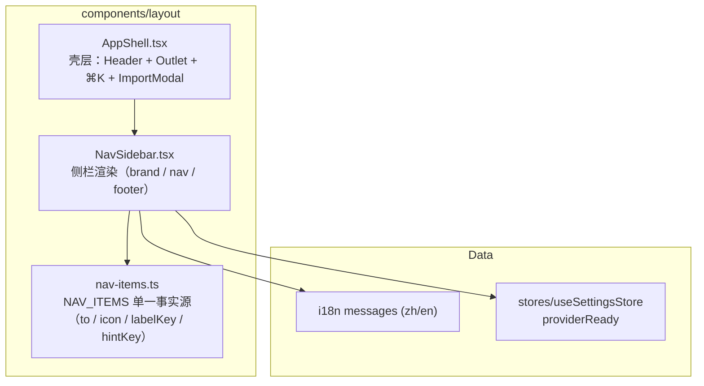

# 侧边导航重构技术方案（图标化 · 单行 · 平铺）

| 字段 | 内容 |
|------|------|
| 作者 | Agent |
| 日期 | 2026-09-11 |
| 状态 | **已实施**（2026-09-11 落盘，门禁全绿；未提交 commit） |
| 关联需求 | 用户口述：①每个菜单分配图标 ②每菜单只留一个 name，desc 换方式展示 ③移除分组、菜单平铺 |
| 关联文档 | `docs/ui-workbench-plan-2026-09.md` §4.1（原五组导航定义，本次被取代）、`docs/ui-component-system-shadcn-design-2026-09.md` §5（token）、`docs/i18n-design-2026-09.md` |

---

## 1. 背景

现有侧栏来自 UI Workbench U0 的「五分组」信息架构（`docs/ui-workbench-plan-2026-09.md` §4.1）：TODAY / LEARN / KNOWLEDGE / GOALS / SYSTEM 五个组，组内每项 **双行**渲染（`label` 主行 + `hint` 副行）。落地后出现三个问题：

1. **分组名占用视觉噪声**：8 个可见条目配 5 个分组标题，`text-[10px] uppercase tracking-wider` 的小标题在 240px 宽的栏里反复出现，其中 3 个组只有 1 个条目（Today / Goals / Knowledge 有效项），分组没有起到「归纳」作用，只剩分隔作用。
2. **每行两行文本，行高膨胀**：hint 常驻显示使单项高度约 44px，8 项 + 5 个组标题让首屏导航纵向约占 480px，挤压主内容；且 hint 属于「低频解释性信息」，常驻是浪费。
3. **纯文字导航缺少锚点**：肉眼扫读时全部条目形态一致，无法靠形状快速定位。

本次改动目标是把侧栏从「分组 + 双行文字列表」收敛为「单行图标列表」，让导航成为可被肌肉记忆的常驻控件。

---

## 2. 方案目标

| 类型 | 描述 |
|------|------|
| **主要目标** | 侧栏改为**平铺单列**：每个可点条目一行，形态为 `图标 + 名称`，无分组标题；原有 `hint`（desc）不再常驻，改为 hover 浮层承载；每个条目有稳定唯一图标。 |
| **非目标** | ① 不改任何路由与页面（`App.tsx` 零改动）；② 不做侧栏折叠 / 响应式抽屉 / 移动端形态；③ 不改 Header（⌘K 搜索框 + 导入 + AI 状态点）与 ⌘K 命令面板布局；④ 不改暗色主题（本仓库 `--plos-*` 目前只有亮色）；⑤ 不引入 Tooltip 组件库。 |
| **成功标准** | 见 §2.1 验收清单，全部勾完且 `npm run typecheck` / `npm run test:i18n` 通过。 |

### 2.1 验收清单

| # | 验收项 |
|---|--------|
| A1 | 侧栏 7 个可点条目平铺，无分组标题；每项只显示一个名称文本 |
| A2 | 每项左侧有图标，语义与路由匹配，视觉风格统一（同尺寸 / 同线宽 / 同色规则） |
| A3 | 悬停任意项浮出该项 hint（desc）；鼠标移开即消失；不影响点击跳转 |
| A4 | 当前路由项高亮（`aria-current="page"` + `bg-subtle` + `text-ink-1`） |
| A5 | 「设置」项保留 AI 就绪状态点（行为不变） |
| A6 | Graph 占位项按 §3 决策保留/移除后，视觉与其余项不冲突 |
| A7 | zh / en 双语一致，`npm run test:i18n` 通过；无硬编码中文文案残留 |
| A8 | `AppShell.tsx` 瘦身后 ≤ 180 行；新增文件符合 ≤700 行与依赖方向约束 |
| A9 | 侧栏不出现横向溢出裁切（tooltip 可见）、不出现纵向滚动条（8 项固定） |

---

## 3. 决策点（需用户确认）

| ID | 决策点 | 选项 A（**推荐**） | 选项 B | 选项 C | **裁决** |
|----|--------|-------------------|--------|--------|----------|
| **D1** | hint（desc）如何展示 | **hover 浮层气泡**：hover / focus 时在该项右侧浮出 `hint` 气泡（纯 CSS `group-hover`），并挂 `title` 兜底 | **底部提示条**：hover 时侧栏底部固定位置显示该项 hint（无溢出风险，但距鼠标远） | **完全下沉到页面**：侧栏不再出现 hint，各页面标题区自行显示副标题（改动面扩大到 feature 层） | **选 A**（2026-09-11 确认） |
| **D2** | 图标是否着色 | **中性优先**：未选中图标 `text-ink-3`，选中项图标 `text-primary` + 标签 `text-ink-1`（唯一强调色，符合 token 约束） | 全部中性灰，仅靠背景块区分选中态 | 每项分配语义色（违反「状态色仅 dot/徽标」约束，**不推荐**） | **选 A**（2026-09-11 确认） |
| **D3** | Graph（N5 占位）处理 | **保留占位**：继续灰显不可点，条目带「即将上线」徽标，位置移至列表末尾 | **移除**：N5 上线时再补；字典 `nav.graph` 保留不使用 | 变为可点并跳 `/learn`（语义不符，**不推荐**） | **选 A**（2026-09-11 确认） |
| **D4** | 侧栏宽度 | **保持 `w-60`**（240px，主区布局零回归） | 收窄到 `w-56`（224px），主区多 16px | 保持宽度但加折叠按钮（列为非目标，见 §2） | **默认 A**（未单独立项） |

> D1–D3 已于 2026-09-11 由用户确认取 A；D4 按推荐值 `w-60` 落地。实施前若需变更，修改本表裁决列并同步 §6/§8。

---

## 4. 项目现状

### 4.1 相关代码与模块

| 文件 | 现状 | 本次处置 |
|------|------|----------|
| `src/components/layout/AppShell.tsx`（265 行） | 唯一侧栏实现：`NavItem` / `NavGroup` 接口 + `buildNavGroups()` 组装五组 + `<nav>` 双层 map 渲染 + `ShellNavContent` 双行子组件；同时承载 Header、Outlet、⌘K、ImportModal | **重构**：拆出 `NavSidebar.tsx` 与 `nav-items.ts`，AppShell 退化为壳 |
| `src/i18n/messages/{zh,en}.ts` | `nav` 命名空间：`brand/brandSub`、5 个 `groupXxx`、7 项 `{label,hint}`、`graph{label,hint}`、`footerHint/footerBadge/readyTooltip/aiReady/aiOffline` | **改**：删 5 个 `groupXxx`（两语言同步）；`hint` 全部保留（CommandPalette 仍在用） |
| `src/components/CommandPalette.tsx` | `NAV_ENTRIES` 7 项 + `navOf()/hintOf()` 读取 `m.nav.*.hint` 作为⌘K 副标题 | **不动**（hint 字典键保留即可） |
| `src/features/settings/SettingsPage.tsx:74` | `SectionTitle subtitle={m.nav.settings.hint}` | **不动** |
| `src/App.tsx` | 路由表；`/spaces` 有路由但无导航入口，`/knowledge` → `/learn`，`/career` → `/goals` | **不动** |
| `src/components/layout/` | 仅 `AppShell.tsx` | 新增 2 个文件 |
| `docs/ui-workbench-plan-2026-09.md` §4.1 / §6-U0-3 | 定义五分组导航 | **追加变更说明**，标注已被本文取代 |

### 4.2 约束与依赖

- **图标库**：`lucide-react@1.43.0` 已是 dependencies（当前仅 `dialog/checkbox/select/DocActionsMenu` 用到 4 个图标），无需新增依赖。已核对所有候选图标在该版本 `.d.ts` 中导出（见 §6.1）。
- **图标 props**：v1 的 `LucideProps = RefAttributes<SVGSVGElement> & SVGAttributes`，因此 `className` / `strokeWidth` / `aria-hidden` 均可用（`size` 也可用，但本方案统一用 Tailwind 控制尺寸）。
- **token 约束**（`src/styles/main.css`）：颜色只用 `bg-surface` / `bg-subtle` / `border-line` / `text-ink-1..3` / `text-primary`；新色值禁止散落组件。
- **i18n 约束**：`en.ts` 以 `Messages = typeof zh` 编译期约束，删/增键必须双语同步；叶子不允许空串（`tests/i18n-alignment.test.ts`）。
- **依赖方向**（`rules/layer-import-boundaries`）：`components/layout` 可引用 `stores` / `i18n`，不得反向。
- **校验纪律**：禁止主动起浏览器做视觉校验（`rules/no-headless-browser-validation`），本轮只跑 typecheck + i18n 单测 + 代码自审。

---

## 5. 技术架构

### 5.1 总体结构



要点：**导航结构从「运行时函数 `buildNavGroups(nav)`」下沉为模块常量 `NAV_ITEMS`**——图标组件引用不适合放在运行时按字典拼装的函数里（图标与文案生命周期不同：图标是代码资产、文案是运行时资产），拆开后 `LabelKey` 只承担文案取值。

### 5.2 模块职责

| 模块 | 职责 | 备注 |
|------|------|------|
| `nav-items.ts` | 声明式导航清单：顺序、目标路由、图标组件、字典键、是否为占位 | 纯数据 + 类型，不含 JSX |
| `NavSidebar.tsx` | 取字典渲染 brand / 条目列表 / AI 状态点 / footer；hover 浮层；占位项徽标 | 唯一消费 `NAV_ITEMS` 的组件 |
| `AppShell.tsx` | 布局壳 + Header + Modal 编排 + 事件常量导出 | 删除全部导航代码 |

### 5.3 数据读写

**N/A**。本次无持久化读写：不动路由、不动 localStorage、不新增 store。唯一外部状态是既有的 `useSettingsStore(s => s.providerReady)`（只读，用于设置项 AI 状态点）。

### 5.4 状态与副作用

- hover 浮层：纯 CSS（`group` / `group-hover` / `group-focus-visible`），**零 React state**、零副作用。
- 选中态：由 `NavLink` 的 `isActive` 渲染参数提供（react-router 持有 URL 状态，无需额外 state）。
- `overflow` 处理：`nav` 容器去掉 `overflow-y-auto`（8 项固定，高度约 8×40 + brand + footer ≈ 420px，桌面视口不会溢出），使右侧浮层不被裁切（CSS 规范中 `overflow-y:auto` 会把 `overflow-x:visible` 计算成 `auto`，必然裁切浮层）。侧栏整体不做滚动容器；极端矮窗口由外层窗口自身滚动兜底。

---

## 6. 视觉与交互规格

### 6.1 图标映射（推荐）

| 顺序 | 路由 | 名称（zh / en） | 图标（推荐） | 备选 | 语义依据 |
|------|------|------------------|--------------|------|----------|
| 1 | `/` | 首页 / Home | `House` | `LayoutDashboard` | 今日起点 |
| 2 | `/plan` | 计划 / Plan | `CalendarDays` | `ListChecks` | 下一步队列（时间序） |
| 3 | `/learn` | 资料库 / Library | `Library` | `BookOpen` | 文档与导入 |
| 4 | `/quiz` | 测评 / Assess | `ClipboardCheck` | `NotebookPen` | 试卷 · 出卷 · 判卷 |
| 5 | `/goals` | 目标 / Goals | `Target` | `Flag` | 目标与就绪度 |
| 6 | `/learner` | 我的画像 / My Learner | `UserRound` | `Sparkles` | 系统如何理解我 |
| 7 | `/settings` | 设置 / Settings | `Settings` | `SlidersHorizontal` | 本地优先与 AI |
| — | 占位（不可点） | 图谱 / Graph | `Network` | `Waypoints` | 概念关系（N5） |

> 顺序原则：**按学习闭环而非按模块归类**——今日 → 学什么 → 看资料 → 检验 → 为何而学 → 我是谁 → 系统配置。全部 8 个图标名已在 `node_modules/lucide-react/dist/lucide-react.d.ts` 中核对导出。

### 6.2 行样式规格

| 项 | 值 | 说明 |
|----|----|------|
| 容器宽度 | `w-60`（240px） | 不变，D4 确认后可调 |
| 条目高度 | `py-2`（约 36px 内容行） | 由原双行 ~44px 降为单行 ~36px |
| 布局 | `flex items-center gap-2.5 rounded-md px-3` | 图标 + 文本基线对齐 |
| 图标 | `className="h-4 w-4 shrink-0" strokeWidth={1.75} aria-hidden` | 16px，线宽略收（Lucide 默认 2，视觉偏重） |
| 文本 | `text-sm truncate` | 单行，过长截断 |
| 未选中 | `text-ink-2`，图标 `text-ink-3`，hover `bg-subtle text-ink-1` |  |
| 选中 | `bg-subtle text-ink-1`，图标 `text-primary` | 见 D2 |
| 占位项 | `text-ink-3` + 右侧 `N5` 徽标，`cursor-not-allowed` | 不可点用 `<div>` 而非 `<a>` |
| 列表间距 | `space-y-0.5` | 保持原密度 |

### 6.3 hint 浮层规格（D1-A）

```
   ┌──────────────────────────────┐
   │ ▢ 计划                       │──┐
   │                              │  │ ┌──────────────────────┐
   │ ▣ 资料库            ● ai     │  └▶│ 文档 · 导入与探索      │
   └──────────────────────────────┘    └──────────────────────┘
```

- 结构：`NavLink` 加 `group relative`，浮层为 `role="tooltip"` 的 `<span>`，`absolute left-full top-1/2 ml-2 -translate-y-1/2 z-30`。
- 显现：`opacity-0 → group-hover:opacity-100`，`group-focus-visible:opacity-100`，`transition-opacity duration-150`。
- 样式：`whitespace-nowrap rounded-md border border-line bg-surface px-2 py-1 text-xs text-ink-2 shadow-sm`。
- 防误触：`pointer-events-none`。
- 兜底：`NavLink` 上同时挂 `title={hint}`（触屏 / 无 hover 场景由浏览器原生提示），并对图标加 `aria-hidden`、对浮层加 `id` 与 `aria-describedby` 关联（可选，见 §10 T5）。
- **溢出前提**：见 §5.4，`nav` 不得是滚动容器。

---

## 7. 线框 UI

### 7.1 默认态（D1-A + D2-A + D3-A + D4-A）

```
┌────────────────────────────────┐
│ 个人学习 OS                     │  ← brand / brandSub
│ 本地优先 · 学习闭环             │
├────────────────────────────────┤
│ ⌂  首页                         │  ← House
│ ▦  计划                         │  ← CalendarDays
│ ▤  资料库                       │  ← Library
│ ✓  测评                         │  ← ClipboardCheck
│ ◎  目标                         │  ← Target
│ ☺  我的画像                     │  ← UserRound
│ ⚙  设置                  ●      │  ← Settings + AI 状态点
│ ✧  图谱                   N5    │  ← 占位，灰显不可点
│                                │
├────────────────────────────────┤
│ ⌘K 快速操作          Pre-MVP    │  ← footer
└────────────────────────────────┘
```

### 7.2 hover 态

- 触发：鼠标进入条目矩形。
- 表现：背景变 `bg-subtle`；右侧浮出 hint 气泡；仅一份气泡同时可见（CSS 天然互斥）。
- 选中项 hover：背景不变，仅浮层出现。

### 7.3 键盘态

- `Tab` 依次聚焦 7 个可点条目；`:focus-visible` 显示 `ring-2 ring-ring/60`（沿用既有 focus token）。
- 聚焦条目时由 `group-focus-visible` 触发同一 hint 浮层，键盘用户不丢信息。
- 占位项不进入 Tab 序列（`<div>` + `aria-disabled`）。

---

## 8. 涉及文件及改动伪代码

### 8.1 `src/components/layout/nav-items.ts`（**新增**）

**改动说明**：导航单一事实源，抽离出 AppShell；导出顺序化清单与占位项。

```ts
// 伪代码 — 仅表达意图
import { House, CalendarDays, Library, ClipboardCheck, Target, UserRound, Settings, Network } from "lucide-react";
import type { LucideIcon } from "lucide-react";

/** 可点导航项；key 为字典路径，避免运行时拼字符串。 */
export interface NavItemSpec {
  to: string;
  icon: LucideIcon;
  /** Messages["nav"] 下的条目键（同时含 label / hint）。 */
  navKey: "home" | "plan" | "library" | "quiz" | "goals" | "learner" | "settings";
  /** 路由是否需精确匹配（仅根路径）。 */
  end?: boolean;
  /** 右侧展示 AI 就绪状态点。 */
  readyDot?: boolean;
}

export const NAV_ITEMS: NavItemSpec[] = [
  { to: "/", navKey: "home", icon: House, end: true },
  { to: "/plan", navKey: "plan", icon: CalendarDays },
  { to: "/learn", navKey: "library", icon: Library },
  { to: "/quiz", navKey: "quiz", icon: ClipboardCheck },
  { to: "/goals", navKey: "goals", icon: Target },
  { to: "/learner", navKey: "learner", icon: UserRound },
  { to: "/settings", navKey: "settings", icon: Settings, readyDot: true },
];

/** 占位项（N5 前不可点）；D3 选 B 时整体删除本对象与渲染分支。 */
export const NAV_COMING_SPEC = { navKey: "graph", icon: Network, badge: "N5" } as const;
```

### 8.2 `src/components/layout/NavSidebar.tsx`（**新增**）

**改动说明**：承接 AppShell 的全部侧栏渲染；`hint` 改由 hover 浮层承载。

```tsx
// 伪代码 — 仅表达意图
import { NavLink } from "react-router-dom";
import { useI18n } from "../../i18n";
import { useSettingsStore } from "../../stores/useSettingsStore";
import { NAV_ITEMS, NAV_COMING_SPEC } from "./nav-items";

export default function NavSidebar() {
  const { m } = useI18n();
  const providerReady = useSettingsStore((s) => s.providerReady);

  return (
    <aside className="flex w-60 shrink-0 flex-col border-r border-line bg-surface">
      <div className="border-b border-line px-5 py-3.5">
        <p className="text-sm font-semibold tracking-tight text-ink-1">{m.nav.brand}</p>
        <p className="mt-0.5 text-xs text-ink-3">{m.nav.brandSub}</p>
      </div>

      {/* 注意：不设 overflow-y-auto —— 否则右侧 hint 浮层被裁切（§5.4） */}
      <nav className="flex-1 space-y-0.5 p-3">
        {NAV_ITEMS.map((item) => {
          const Icon = item.icon;
          const entry = m.nav[item.navKey];
          const dot = item.readyDot && providerReady;
          return (
            <NavLink
              key={item.to}
              to={item.to}
              end={item.end}
              title={entry.hint}                       // 原生兜底
              data-testid={`nav-${item.navKey}`}
              className={({ isActive }) =>
                `group relative flex items-center gap-2.5 rounded-md px-3 py-2 transition-colors ${
                  isActive ? "bg-subtle text-ink-1" : "text-ink-2 hover:bg-subtle hover:text-ink-1"
                }`
              }
            >
              {/* 函数式 children（T5 实作）：由 isActive 决定图标着色 */}
              {({ isActive }) => (
                <>
                  <Icon
                    className={`h-4 w-4 shrink-0 ${isActive ? "text-primary" : "text-ink-3 group-hover:text-ink-2"}`}
                    strokeWidth={1.75}
                    aria-hidden
                  />
                  <span className="truncate text-sm">{entry.label}</span>
                  {dot ? (
                    <span className="ml-auto h-1.5 w-1.5 rounded-full bg-state-mastered" title={m.nav.readyTooltip} />
                  ) : null}
                  <span role="tooltip" className="pointer-events-none absolute left-full top-1/2 z-30 ml-2 -translate-y-1/2 whitespace-nowrap rounded-md border border-line bg-surface px-2 py-1 text-xs text-ink-2 opacity-0 shadow-sm transition-opacity duration-150 group-hover:opacity-100 group-focus-visible:opacity-100">
                    {entry.hint}
                  </span>
                </>
              )}
            </NavLink>
          );
        })}

        {/* 占位项：非链接，不进 Tab 序列 */}
        <div
          aria-disabled
          data-testid="nav-graph-placeholder"
          className="flex cursor-not-allowed items-center gap-2.5 rounded-md px-3 py-2 text-ink-3"
        >
          <Network className="h-4 w-4 shrink-0" strokeWidth={1.75} aria-hidden />
          <span className="truncate text-sm">{m.nav.graph.label}</span>
          <span className="ml-auto rounded border border-line bg-subtle px-1.5 py-0.5 font-mono text-[10px]">
            {NAV_COMING_SPEC.badge}
          </span>
        </div>
      </nav>

      <div className="flex items-center justify-between border-t border-line px-4 py-2.5 text-xs text-ink-3">
        <span>{m.nav.footerHint}</span>
        <span className="rounded border border-line bg-subtle px-1.5 py-0.5 font-mono text-[10px] text-ink-2">
          {m.nav.footerBadge}
        </span>
      </div>
    </aside>
  );
}
```

> **不可漏**：`NavLink` 必须走**函数式 children** 才能得到 `isActive` 给图标着色（`className` 回调拿不到 children 内部）；同时 `title={entry.hint}` 需挂在 `NavLink` 而非浮层上，否则触屏/无 hover 场景丢失信息。浮层 `role="tooltip"` 且必须 `pointer-events-none`，避免遮挡右侧主内容点击。

### 8.3 `src/components/layout/AppShell.tsx`（**修改**）

**改动说明**：删除 `NavItem` / `NavGroup` / `buildNavGroups()` / `ShellNavContent()` 与 `<aside>` 整段；引入 `<NavSidebar />`。`CMD_OPEN_EVENT` / `IMPORT_OPEN_EVENT` / `DOCS_CHANGED_EVENT` 与 `open*` / `notifyDocsChanged` 导出保持原样（被 CommandPalette、各页面依赖）。

```tsx
// 伪代码 — 改动后骨架
import NavSidebar from "./NavSidebar";

export default function AppShell() {
  // ...既有 importOpen / handleImported / handleInspect 逻辑不变
  return (
    <div className="flex h-full min-h-0 bg-app-bg text-ink-1">
      <NavSidebar />
      <div className="flex min-w-0 flex-1 flex-col">
        {/* Header：完全不动 */}
        <main className="min-w-0 flex-1 overflow-y-auto"><Outlet /></main>
      </div>
      <CommandPalette />
      {importOpen ? <ImportModal ... /> : null}
    </div>
  );
}
```

预计 **265 → 约 150 行**。

### 8.4 `src/i18n/messages/zh.ts`（**修改**）

**改动说明**：`nav` 段删除 5 个分组键，其余键**全部保留**（CommandPalette / SettingsPage 仍在消费 hint）。

```ts
nav: {
  brand: "个人学习 OS",
  brandSub: "本地优先 · 学习闭环",
  // 删除：groupToday / groupLearn / groupKnowledge / groupGoals / groupSystem
  // （分组已取消，改为平铺 + 图标；见 docs/nav-sidebar-redesign-design-2026-09.md）
  home: { label: "首页", hint: "今天最值得做什么" },   // hint 现由 hover 浮层展示
  plan: { label: "计划", hint: "下一步怎么学" },
  learn: { label: "学习", hint: "章节目录与阅读" },
  quiz: { label: "测评", hint: "试卷 · 出卷 · 判卷" },
  career: { label: "目标", hint: "就绪度与缺口" },
  settings: { label: "设置", hint: "本地优先与 AI" },
  library: { label: "资料库", hint: "文档 · 导入与探索" },
  graph: { label: "图谱", hint: "概念关系 · 即将上线" },
  learner: { label: "我的画像", hint: "系统如何理解我" },
  goals: { label: "目标", hint: "目标管理与就绪度" },
  footerHint: "⌘K 快速操作",
  footerBadge: "Pre-MVP",
  readyTooltip: "AI Provider 已就绪",
  aiReady: "AI 就绪",
  aiOffline: "未配置 AI",
},
```

> 可选清理（需用户点头）：`nav.learn` 与 `nav.career` 已无任何引用（`/career` 重定向到 `/goals`、`/learn` 使用 `library` 文案），可一并删除。**本方案默认保留**，避免超出需求范围。

### 8.5 `src/i18n/messages/en.ts`（**修改**）

与 8.4 完全对称：删除 5 个 `groupXxx`，其余不变。`Messages = typeof zh` 会在编译期强制一致。

### 8.6 `docs/ui-workbench-plan-2026-09.md`（**修改**）

在 §4.1 末尾追加变更说明：五分组已被 2026-09 侧栏重构方案取代（平铺 + 图标 + hint 浮层），指向本文件。不改该文档原有决策表内容。

---

## 9. 交互流程

### 9.1 主流程

1. 用户启动应用 → 侧栏渲染 7 项平铺 + 1 项占位，每项 `图标 + 单行名称`。
2. 鼠标 hover「测评」→ 该项背景变 `bg-subtle`，右侧浮出「试卷 · 出卷 · 判卷」气泡。
3. 点击「测评」→ 路由跳 `/quiz`，该项转为 active（图标 `text-primary`、文字 `text-ink-1`、`bg-subtle`）；其余项回落。
4. Tab 键聚焦 → `:focus-visible` 描边 + 同一浮层出现 → Enter 跳转。
5. AI Provider 就绪时，`providerReady === true` → 「设置」项右侧出现绿点（`bg-state-mastered`）。

### 9.2 分支与异常

| 场景 | 触发条件 | 系统行为 | UI 反馈 |
|------|----------|----------|---------|
| 根路由精确匹配 | 当前 URL = `/` | `NavLink end` 生效，仅「首页」高亮 | 避免 `/quiz` 时首页同时高亮（既有行为，保持不变） |
| 占位项点击 | 点击「图谱」 | 无跳转 | 灰显 + `cursor-not-allowed` + N5 徽标 |
| 极窄/矮窗口 | 视口高度不足 | 条目自然压缩到容器外，由窗口滚动兜底 | 侧栏不再内部滚动（接受此取舍，§11.3 R1） |
| 触屏（无 hover） | 触摸设备 | hover 浮层不触发 | `title` 原生兜底（延迟提示） |
| i18n 缺失 hint | 某 entry 无 hint | 浮层渲染空内容 | 通过 `Record` 类型 + i18n 单测非空校验，编译期/测试期拦截 |

---

## 10. 任务清单

| ID | 任务 | 依赖 | 复杂度 |
|----|------|------|--------|
| T1 | 新增 `src/components/layout/nav-items.ts`（清单 + 类型 + 占位项） | — | S |
| T2 | 新增 `src/components/layout/NavSidebar.tsx`（渲染 + hover 浮层 + AI 点 + 占位项） | T1 | M |
| T3 | 改造 `AppShell.tsx`：删导航代码与 `<aside>`，引入 `NavSidebar` | T2 | S |
| T4 | i18n 双语：删除 5 个 `groupXxx`（zh + en 同步） | — | S |
| T5 | 图标 active 着色细化（`NavLink` 函数式 children，`isActive` 驱动 icon/文本色） | T2 | S |
| T6 | 文档同步：`docs/ui-workbench-plan-2026-09.md` §4.1 追加取代说明 | T3 | S |
| T7 | 校验：`npm run typecheck`、`npm run test:i18n`、自审溢出/ Focus/ 双语 | T3–T6 | S |

### 实施顺序

T1 → T2 → T5 → T3 → T4 → T6 → T7（T4 可与 T1 并行；T5 在 T2 之后微调样式）。

**回滚策略**：改动集中在 2 个新增文件 + 1 个瘦身文件 + 2 个字典，无数据迁移、无路由变更。回滚 = `git revert` 该 commit，零副作用。

---

## 11. 测试方案

### 11.1 范围与策略

| 层级 | 方式 | 覆盖重点 |
|------|------|----------|
| 编译 | `npm run typecheck` | `NAV_ITEMS.navKey` 与字典键的联合类型、删除 group 键后 `CommandPalette` / 组件无悬空引用 |
| 单元 | `npm run test:i18n` | zh/en 结构对齐 + 叶子非空（验证 T4） |
| 代码自审 | diff 审阅 | 无残留 `groupXxx` 引用、无硬编码文案、无 hex 色值、依赖方向正确 |
| 浏览器视觉 | **本轮不做** | 受 `rules/no-headless-browser-validation` 约束；仅在用户显式要求时放行 |

### 11.2 环境与数据

无需 fixture / mock；`npm run dev`（1420）仅在用户明确要求时启动。

### 11.3 风险与通过标准

| ID | 风险 | 缓解 |
|----|------|------|
| R1 | 去掉 `nav` 的 `overflow-y-auto` 后，极小窗口可能溢出 | 侧栏固定 8 项约 420px；Tauri 桌面窗口默认远高。若后续项数增长，改为「浮层内嵌到底部提示条」（D1-B）或引入 popover 定位库 |
| R2 | 删除 `groupXxx` 字典键后其他文档/注释仍提分组 | T6 同步文档；同时更新 AppShell 顶部 U5/U6 注释 |
| R3 | 图标语义争议 | 表 §6.1 已给备选，确认阶段可单项替换，成本极低 |
| R4 | `type NavKey` 联合类型与字典键漂移 | 用 `Messages["nav"]` 派生类型：`` type NavKey = { [K in keyof Messages["nav"]]: Messages["nav"][K] extends { label: string; hint: string } ? K : never }[keyof Messages["nav"]] ``，新增字典项若含 label+hint 自动进入候选，缺 key 编译报错 |

**通过标准**：T1–T7 全部完成；typecheck 0 error；`test:i18n` 全绿；§2.1 的 A1–A9 由代码自审逐项勾验。

---

## 12. 测试用例

| ID | 关联 | 步骤/输入 | 期望结果 | 类型 |
|----|------|-----------|----------|------|
| TC-01 | A1 | 读取渲染树 | 侧栏无 `groupToday` 等分组标题文本，`<nav>` 直接子元素为条目 | 自审 |
| TC-02 | A1 | 检查任一条目 DOM | 仅 1 个文本节点（label），hint 文本不在常驻 DOM 可见区（仅 tooltip span / title） | 自审 |
| TC-03 | A2 | 遍历 `NAV_ITEMS` | 7 项均含 `icon`，且与 §6.1 一致 | 自审 |
| TC-04 | A3 | hover 条目 | tooltip span 存在且含 `group-hover:opacity-100`，父级含 `group` | 自审 |
| TC-05 | A4 | 断言 `NavLink` 用法 | 根路径项 `end` 为 true；className 分支含 `bg-subtle` | 自审 |
| TC-06 | A5 | 检查设置项 | `readyDot` true 且渲染条件为 `providerReady` | 自审 |
| TC-07 | A7 | `npm run test:i18n` | zh/en 结构一致、叶子非空，退出码 0 | 单元 |
| TC-08 | A8 | 行数检查 | `AppShell.tsx` ≤ 180 行，新增文件 ≤ 700 行 | 自审 |
| TC-09 | A9 | 检查 `<nav>` class | 不含 `overflow-y-auto` / `overflow-hidden` | 自审 |
| TC-EDGE-01 | 边界 | 删除 `nav.groupToday` 后 | 全仓 `grep groupToday` 仅命中 docs 历史记录，无 src 引用 | 自审 |
| TC-EDGE-02 | 边界 | 占位项 | 使用 `<div aria-disabled>`，无 `to` 属性，不产出 `<a>` | 自审 |
| TC-EDGE-03 | 回归 | `CommandPalette` NAV_ENTRIES | 7 项 label/hint 仍可用，行为不变 | 编译 + 自审 |

---

## 变更记录

| 日期 | 变更 | 作者 |
|------|------|------|
| 2026-09-11 | 初稿（含 D1–D4 决策点） | Agent |
| 2026-09-11 | D1/D2/D3 用户确认取 A，状态转「已确认」 | 许一 |
| 2026-09-11 | 按方案实施（T1–T7）：新增 `nav-items.ts` / `NavSidebar.tsx`，AppShell 265→142 行，i18n 删 5 个分组键，文档同步；typecheck 0 error、build 通过、`test:i18n` 8/8、`test:library` 全绿 | Agent |
