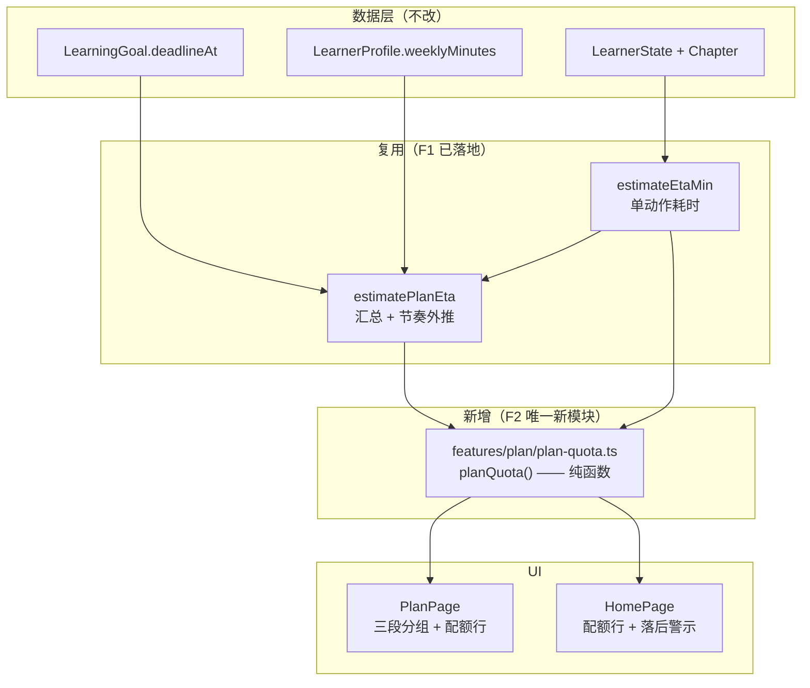
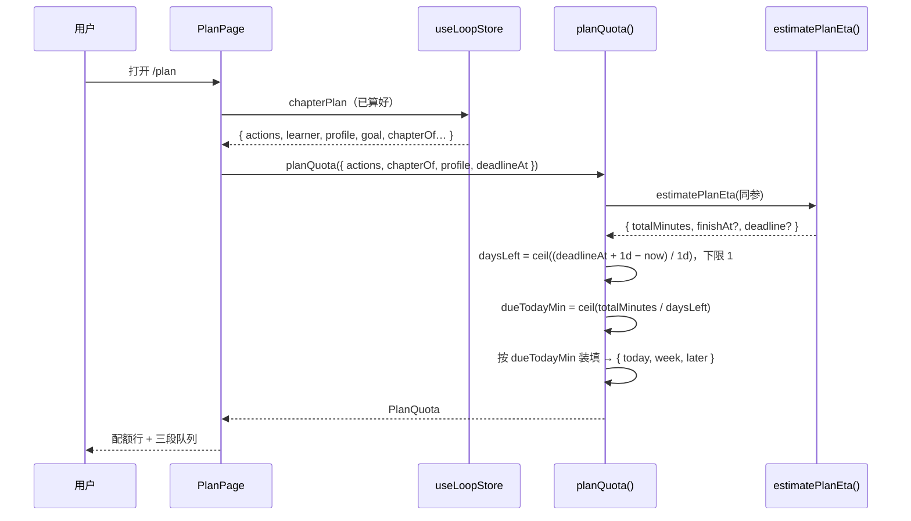

# 计划的时间维度（F2 · Time-aware Planning）技术方案

| 字段 | 内容 |
|------|------|
| 作者 | Agent / 许一 |
| 日期 | 2026-09-15 |
| 状态 | **已实施**（D1–D4 定案 · T1–T6 全部 done · 2026-09-15；见 §14 实施结果） |
| 关联需求 | `docs/roadmap-next-features-plan-2026-09.md` §F2（P1 · 中）；`README.zh-CN.md`「计划的时间维度 —— 每日配额、落后/超前预警 `P1`」；依赖 F1（已实施 2026-09-14） |

---

## 0. 决策点（已确认）

### 0.1 本轮定案

| 编号 | 问题 | 结论 | 影响 |
|------|------|------|------|
| **D1** | 每日配额按什么口径摊到「天」 | **自然日 7 天摊**（`weeklyMinutes ÷ 7`） | 零新增画像字段；不改 `LearnerProfile` / storage / 画像 UI |
| **D2** | 只设 deadline、未填每周预算时 | **仍给「今日应做 N 分钟」** | deadline 摊派（剩余分钟÷剩余天数）本就独立于预算；只是不做节奏判定 |
| **D3** | 无 deadline 时计划页分组 | **退回现状 `NEXT / UP NEXT` 两段** | 时间维度**只在有 deadline 时启用** → 无 deadline 路径零回归 |
| **D4** | 首页呈现 | **配额行常显 + 落后时加警示条** | 首页新增 2 处渲染；落后口径**沿用现有**「预计晚 N 天」，不引入第二套数字 |

### 0.2 D3 的直接推论（重要）

D3 让整个特性的启用条件收敛为**单一开关：`goal.deadlineAt !== undefined`**。

```
有 deadline  → 配额行 + 三分组（今天必做 / 本周完成 / 之后）+ 落后/超前判定（后者需预算）
无 deadline  → 逐字节退回现状（NEXT 前 3 + UP NEXT 其余），不出现任何时间维度 UI
```

这条推论同时决定了测试策略：**无 deadline 分支是回归测试的主战场**（TC-REG-01/02）。

---

## 1. 背景

### 1.1 用户痛点

当前系统能回答「下一步做什么」（六级优先级决策队列），但回答不了**「我今天要做多少」**。

- 计划页把队列切成 `NEXT（前 3 条）+ UP NEXT（其余）`—— 这个「3」是**写死的条数**（`PlanPage.tsx:43` `NEXT_LIMIT = 3`），与用户今天有多少时间**毫无关系**。一个 3 分钟的复习项和一张 40 分钟的精读章，在 UI 上占同样的位置。
- 首页「今日清单」实际是 `plan.actions.slice(1, 4)`（`HomePage.tsx:117`）—— 名字叫「今日」，语义却是「NBA 之外的前 3 项」。
- F1 已让「来不来得及」可见（`estimatePlanEta`：预计完成日 + 比截止日晚/早 N 天），但那是**节奏外推的结论**，不是**今天该做多少的行动指令**。

结果：用户知道「按这个节奏会晚 4 天」，却不知道「那我今天该做几项才能追上」。

### 1.2 触发原因

roadmap §F2（`docs/roadmap-next-features-plan-2026-09.md:173`）明确列为 `P1 · 中`，且判定「依赖 F1」—— F1 已于 2026-09-14 落地，前置条件满足。

### 1.3 与现有模块的关系

**不是从零开始**，而是补三块（现状取证见 §3.1）：

| 已有（F1 落地） | F2 增量 |
|---|---|
| `deadlineAt` 可在目标表单设置 | — |
| `estimateEtaMin` 单动作耗时启发式（有单测） | — |
| `estimatePlanEta` 汇总 + 节奏外推 | **新增**：剩余天数摊派 → 「今日应做」 |
| `/plan` 两段分组（按条数） | **替换**：三段分组（按时间） |
| 首页就绪度 + 证据流 | **新增**：配额行 + 落后警示条 |

### 1.4 不做会怎样

「目标 + 截止日」这个组合目前只产出一个模糊的「预计晚 N 天」——**有结论、无处方**。用户要么自己心算，要么放弃 deadline。F2 之前，deadline 更接近一个装饰性字段。

---

## 2. 方案目标

| 类型 | 描述 |
|------|------|
| **主要目标** | 设了截止日期的目标，用户打开计划页/首页即可看到「今天建议 N 分钟 · M 项」，并按**时间维度**（今天 / 本周 / 之后）分组执行队列 |
| | 落后时给出显式提示（沿用现有「预计晚 N 天」），超前时不制造焦虑 |
| | 无 deadline 的目标行为**逐字节不变**（零回归） |
| **非目标** | ① 不做「可学习日」（每周哪几天）—— D1 定案后本字段不存在，留待后续若真实需要再加<br>② 不做「今日已完成 N/M」的进度追踪 —— 与项目既有哲学「计划 = 决策队列，不是 todo list」（`PlanPage.tsx:3`）冲突，且需新增持久化<br>③ 不做日历视图 / 甘特图<br>④ 不引入任何新 storage key、不改 `src-tauri/**`<br>⑤ 不改 `buildChapterPlan` 的六级优先级**语义**（时间维度是**分组**，不是重排） |
| **成功标准** | 见 §11.3；要点：① 有 deadline 时出现配额行与三分组 ② 无 deadline 时计划页渲染与改动前一致 ③ 单测覆盖配额公式 / 边界 / 回归 ④ `npm run typecheck` 零新增错误 |

---

## 3. 项目现状

### 3.1 相关代码与模块

| 位置 | 现状 | 与 F2 的关系 |
|------|------|--------------|
| `src/domain/goal.ts:33` | `deadlineAt?: number` | **输入**；存的是本地当天 `00:00`（`GoalFormPage.tsx:38` `new Date(\`${v}T00:00:00\`)`） |
| `src/features/goals/GoalFormPage.tsx:270` | 已有 deadline 日期输入框（`id="goal-deadline"`） | **无需改动**（入口已存在） |
| `src/features/plan/chapter-action.ts:102` | `estimateEtaMin(action, chapter, pace)` —— 单动作耗时启发式 | **复用**（唯一真源，勿重写公式） |
| `src/features/plan/chapter-action.ts:148` | `estimatePlanEta({actions, chapterOf, profile, deadlineAt, now})` → `{totalMinutes, finishAt?, deadline?{at,behind,days}}` | **复用**：配额模块内部调用它拿 `totalMinutes` 与节奏判定，避免公式重复 |
| `src/features/plan/chapter-action.ts:133` | `weeklyOf(profile?)` —— 每周预算校验（私有，未导出） | **需导出**（改名 `weeklyMinutesOf`）供配额模块复用 |
| `src/features/plan/PlanPage.tsx:43,77-78` | `NEXT_LIMIT = 3` → `next = slice(0,3)` / `upNext = slice(3)` | **改造对象**：有 deadline 时换成三段 |
| `src/features/home/HomePage.tsx:117,156` | 今日清单 = `actions.slice(1,4)`，标题 `m.home.todayTitle(items.length)` | **改造对象**：加配额，标题补时长 |
| `src/features/profile/LearnerProfileCard.tsx:53` | `weeklyMinutes` 以「小时/周」输入 | **不改**（D1 定案） |
| `src/domain/learner.ts:78` | `PROFILE_LIMITS.weeklyMinutesMin/Max` | **复用**（校验口径一致） |
| `tests/plan-eta.test.ts` | 8 条 `estimateEtaMin` 断言 | **扩展**（本方案新增 `test:quota`，并保留既有） |

### 3.2 相关文档与约定

- `docs/roadmap-next-features-plan-2026-09.md` §F2 —— 本次需求来源，其中「范围」4 条与 §2 目标逐条对应。
- `docs/ui-workbench-plan-2026-09.md` §7.4 —— 「耗时预估属启发式，不进 domain/engine」的既有约定 → **决定新模块落位**（见 §4.2）。
- `rules/layer-import-boundaries.mdc` —— UI → stores/storage；engine 不得 import features。
- `rules/code-structure-and-dependencies.mdc` —— 文件 ≤700 行。实测：`PlanPage.tsx` 263 行、`HomePage.tsx` 558 行（本次 +约 20 行 → 578，**仍有余量**）、`chapter-action.ts` 179 行。
- `rules/engineering-code-style.mdc` —— 相对导入、中文注释、i18n 双语成对。

### 3.3 约束与依赖

| 约束 | 说明 |
|------|------|
| 零新存储 | 不改 `src/storage/**`、不改 `src-tauri/**`、不新增 localStorage key（配额是**纯派生**值） |
| 零回归 | 无 deadline 路径必须逐字节等价于改动前（D3） |
| 不做浏览器校验 | 受 `rules/no-headless-browser-validation.mdc` 约束 → 校验靠 `typecheck` + node 单测 + 代码自审 |
| 单测不得 import `.tsx` | `tests/*.test.ts` 走 `node --experimental-strip-types`；新模块必须是 `.ts` |
| 上游依赖 | F1（已实施）；无其他前置 |

### 3.4 一处**已知口径差异**（记录，本次不改）

`deadlineAt` 存的是**截止日当天 00:00**。现有 `estimatePlanEta` 判定 `behind = finishAt > deadlineAt`，相当于要求「在截止日 00:00 前完成」，**偏严**。

- F2 新增的「剩余天数」采用更贴合直觉的口径：**把截止日按「当天结束」计**（`deadlineAt + 86400000`）。
- **本次不修改 `estimatePlanEta` 的既有判定**（守零回归）。两个数字口径略有差异（约 1 天以内），但一个是「节奏外推结论」、一个是「剩余天数」，语义本就不同，不构成矛盾。
- 若日后要统一，属独立的小口径修正，不在 F2 范围。

---

## 4. 技术架构

### 4.1 总体架构



**一句话**：新增**一个纯函数模块**，UI 两处消费；数据层零改动。

### 4.2 模块职责

| 模块/层级 | 职责 | 落位理由 |
|-----------|------|----------|
| `features/plan/plan-quota.ts`（新） | 剩余天数摊派 → 今日应做分钟；按时间预算装填 → 三分组 | ① 纯函数、无 React/IO；② 复用 `estimateEtaMin`（同在 `features/plan`）；③ 依 `ui-workbench-plan §7.4`「启发式不进 domain/engine」，与 `estimatePlanEta` 保持同层 |
| `features/plan/chapter-action.ts`（改） | 导出 `weeklyMinutesOf`（原私有 `weeklyOf` 改名导出） | 让「每周预算是否有效」只有一个判据实现 |
| `features/plan/PlanPage.tsx`（改） | 有 deadline → 三段渲染；无 deadline → 现状两段 | UI 分支 |
| `features/home/HomePage.tsx`（改） | 配额行（常显）+ 落后警示条（条件） | UI 分支 |

> **为什么不放 `src/engine/`**：`plan-quota` 需要复用 `estimateEtaMin`（在 `features/plan/`）。engine 不得 import features（`rules/layer-import-boundaries.mdc`），若放 engine 就必须把 `estimateEtaMin` 一并下沉；而 §7.4 已明确「耗时启发式不进 engine」。因此**同层新增**是唯一不违规且不改既有约定的选择。

### 4.3 数据模型与 API

**无新增持久化实体。** 新增的全部是派生值：

```ts
/** 今日配额的输入（全部来自已有快照，无需新读取）。 */
export interface PlanQuotaInput {
  actions: readonly NextAction[];
  chapterOf: (id: string) => Chapter | undefined;
  profile?: LearnerProfile;
  deadlineAt?: number;
  now?: number;
}

/** 今日配额与时间分组（F2）。全部为派生值，不落库。 */
export interface PlanQuota {
  /** 队列总时长（分钟）—— 与 estimatePlanEta.totalMinutes 同源。 */
  totalMinutes: number;
  /** deadline 摊派的「今日应做」分钟；无 deadline → undefined。 */
  dueTodayMin?: number;
  /** 预算摊派的「今日额度」分钟（weeklyMinutes ÷ 7，D1）；无预算 → undefined。 */
  capacityMin?: number;
  /** 距截止天数（含今天与截止日当天，下限 1）；无 deadline → undefined。 */
  daysLeft?: number;
  /** 截止日已过（deadlineAt < now）。 */
  overdue: boolean;
  /** 节奏判定（沿用 estimatePlanEta.deadline；需声明预算才有）。 */
  pace?: PlanEta["deadline"];
  /** 时间分组；无 deadline 或队列为空 → undefined（UI 退回现状两段）。 */
  groups?: { today: NextAction[]; week: NextAction[]; later: NextAction[] };
  /** 今日组实际总时长（分钟）。 */
  todayMinutes?: number;
}
```

**数据读写（按 `rules/layer-import-boundaries.mdc`）**

| 项 | 结论 |
|----|------|
| 读 | 无新增读取。`actions` / `chapterOf` / `profile` / `deadlineAt` 全部由 `useLoopStore.chapterPlan`（`ChapterLoopSnapshot`）在 UI 层提供——与现有 `estimatePlanEta` 调用方式**完全一致**（`PlanPage.tsx:60-67`） |
| 写 | **无写入**。配额是纯派生值，不落 store、不落 storage |
| store | **不改** `useLoopStore`（不新增 state / action） |
| storage | **不改** |
| 桌面能力 | 不涉及（无 `invoke`） |

> 这条是本方案最关键的架构约束：**F2 是一个纯计算 + 纯展示的特性，不触碰任何持久化层**。

### 4.4 状态与副作用

| 状态 | 分工 |
|------|------|
| `planQuota(...)` | **每次渲染纯计算**（与现有 `estimatePlanEta` 一样，无 `useMemo`——项目约定「默认不加 useCallback/memo」，且队列规模为数十项，开销可忽略） |
| `now` | 缺省 `Date.now()`；单测注入固定时间戳保证确定性 |
| 刷新时机 | 复用 `useEffect(() => void refresh(m), [refresh])`（不改） |

---

## 5. 交互流程

### 5.1 主流程（有 deadline 的目标）

1. 用户进入 `/plan`；`useLoopStore` 已算好 `chapterPlan`（含 `goal.deadlineAt`、`profile`、`actions`）。
2. 页面调用 `planQuota({ actions, chapterOf, profile, deadlineAt })`。
3. **配额行**出现在就绪度卡内（「今天建议 45 分钟 · 3 项 · 距截止还有 6 天」）。
4. 队列按时间切成三段：
   - **今天必做**（ActionCard 详版，带 CTA）—— 按 `dueTodayMin` 装填，至少 1 项；
   - **本周完成**（KnowledgeRow 压缩行）；
   - **之后**（KnowledgeRow 压缩行）。
5. 用户点击「今天必做」任一项的 CTA → 走既有 `runAction`（**零改动**）。
6. 动作完成后 `refresh()` 重算 → 队列变短 → 配额自动下降（**无需任何「今日已完成」状态**）。

### 5.2 分支与异常流程

| 场景 | 触发条件 | 系统行为 | UI 反馈 |
|------|----------|----------|---------|
| 无 deadline | `goal.deadlineAt === undefined` | 不计算配额，不分组（D3） | 渲染现状 `NEXT + UP NEXT`，**无任何新增元素** |
| 无预算 | `weeklyMinutes` 未声明/越界 | `dueTodayMin` 照常给出（D2）；`capacityMin` / `pace` 为 undefined | 配额行显示「今天建议 45 分钟 · 3 项 · 距截止还有 6 天」，**不显示**「预计晚/早 N 天」 |
| 截止日已过 | `deadlineAt < now` | `overdue = true`；`daysLeft` 取下限 1 | 配额行改为「已超截止 3 天」+ 今日应做仍按 1 天摊派（**不阻断**） |
| 队列为空 | `actions.length === 0` | `groups` 为 undefined | 走既有「🎉 全部章节已达标」空态，**不渲染配额行** |
| 队列总时长为 0 | `totalMinutes === 0` | `dueTodayMin = 0` | 同「队列为空」（理论上不可达，兜底） |
| 单动作超配额 | 首项耗时 > `dueTodayMin` | 仍进「今天必做」（**至少 1 项**） | 今日组时长大于建议值，不加警告（避免噪音） |
| 落后 | `pace.behind === true` | 沿用现有 `etaBehind(days)` 文案 | `/plan`：既有行内提示；**首页**：额外一条警示条（D4） |
| 超前 | `pace.behind === false` | 沿用 `etaAhead(days)` | `/plan`：既有行；**首页不显示**（不制造「你很闲」的暗示） |

### 5.3 时序图（配额计算）



---

## 6. 用户用例（User Cases）

### UC-01：设定 deadline 后看到今日配额并分段执行

| 项 | 内容 |
|----|------|
| 角色 | 有明确截止日期的学习者（如「考试」类目标） |
| 前置条件 | ① 目标已勾选章节 ② 目标已设 `deadlineAt` ③ 画像已填每周时间预算 ④ 已导入资料并完成切分 |
| 主流程步骤 | 1. 打开 `/plan` 2. 读就绪度卡内的配额行 3. 按「今天必做」逐项点 CTA 执行 4. 执行后队列自动缩短 |
| 期望结果 | 配额行显示「今天建议 N 分钟 · M 项 · 距截止还有 D 天」；「今天必做」动作总时长 ≈ N（至少 1 项）；落后时同卡内显示「比截止日晚 X 天」 |
| 异常/边界 | 见 §5.2 表 |

### UC-02：只设了截止日期、没填预算

| 项 | 内容 |
|----|------|
| 角色 | 不想被问「每周几小时」但知道 deadline 的用户 |
| 前置条件 | 目标设了 `deadlineAt`；画像 `weeklyMinutes` 未填或越界 |
| 主流程步骤 | 1. 打开 `/plan` 2. 读配额行 |
| 期望结果 | **仍显示**「今天建议 N 分钟 · M 项 · 距截止还有 D 天」；**不显示**「预计学完日 / 比截止日晚 X 天」（那需要预算） |
| 异常/边界 | 无预算 → `capacityMin`/`pace` 为 undefined；三分组仍成立（本周额度退化为 `dueTodayMin × 7`） |

### UC-03：无 deadline 的目标（零回归）

| 项 | 内容 |
|----|------|
| 角色 | 「职业 / 个人」类无期限目标的用户 |
| 前置条件 | 目标未设 `deadlineAt` |
| 主流程步骤 | 1. 打开 `/plan` 2. 观察页面 |
| 期望结果 | 与改动前**逐字节一致**：`NEXT · 今天做`（前 3 条 ActionCard）+ `UP NEXT · 排队做`（其余 KnowledgeRow）；无配额行、无时间分组、无警示条 |
| 异常/边界 | 这是回归测试主战场（TC-REG-01/02） |

### UC-04：落后时在首页收到提示

| 项 | 内容 |
|----|------|
| 角色 | 打开首页看「今天干什么」的用户 |
| 前置条件 | 有 deadline；有预算；`pace.behind === true` |
| 主流程步骤 | 1. 打开首页 2. 看就绪度区 → 看今日清单标题 |
| 期望结果 | 就绪度下方出现警示条「按当前节奏，预计晚 X 天达标」；今日清单标题变为「今日 4 项 · 建议 45 分钟」 |
| 异常/边界 | 超前 / 无预算 → 只显示配额标题，**无警示条**；无 deadline → 首页与改动前一致 |

---

## 7. 线框 UI（Wireframe）

### 7.1 `/plan` 计划页 — 有 deadline（默认态）

```
┌───────────────────────────────────────────────────────────┐
│  学习计划                        [＋ 新建试卷]             │
│  考试冲刺 · 章就绪 3/10 · 待办 7 项                        │
├───────────────────────────────────────────────────────────┤
│  章就绪度                          ▓▓▓░░░░░░░  30%         │
│  3 / 10 章达标                             达标线 80%      │
│  还有 7 项待办（已按推荐序排好）                            │
│  按你声明的每周时间预算，预计 10-05 学完 · 比截止日晚 4 天  │
│  今天建议 45 分钟 · 3 项 · 距截止还有 6 天   ← 【新增】     │
├───────────────────────────────────────────────────────────┤
│  今天必做                                    ← 【新增分组】 │
│  ┌─────────────────────────────────────────────────────┐  │
│  │ 01 · 重学弱章      《资料A · 第 3 章》  掌握度 22%   │  │
│  │ 低分重读（22% < 60%）…                               │  │
│  │ 约 12 分钟                       [ 去学本章 → ]      │  │
│  └─────────────────────────────────────────────────────┘  │
│  ┌─────────────────────────────────────────────────────┐  │
│  │ 02 · 补考          《资料A · 第 5 章》  掌握度 68%   │  │
│  │ …                                    [ 补考本章 → ] │  │
│  └─────────────────────────────────────────────────────┘  │
├───────────────────────────────────────────────────────────┤
│  本周完成                                    ← 【新增分组】 │
│  ● 复习要点 · 资料B · 第 1 章        约 6 分钟   复习要点  │
│  ● 测已学章 · 资料A · 第 7 章        约 8 分钟   去测验    │
├───────────────────────────────────────────────────────────┤
│  之后                                        ← 【新增分组】 │
│  ● 推进新章 · 资料B · 第 4 章        约 18 分钟  去学本章  │
└───────────────────────────────────────────────────────────┘
```

- **组件映射**：配额行 → 纯文本（`text-sm text-ink-2`，与既有 ETA 行同款，`data-testid="plan-quota"`）；「今天必做」→ 既有 `ActionCard`；「本周完成」/「之后」→ 既有 `KnowledgeRow`；分组标题 → 既有 `Section`。
- **设计 token**：全部沿用现有（`text-ink-1/2/3`、`border-line`、`bg-surface`）——**不新增任何颜色/尺寸 token**。
- **间距**：三段之间 `space-y-6`，与现状 `NEXT / UP NEXT` 一致。

### 7.2 `/plan` — 无 deadline（D3：逐字节退回现状）

```
┌───────────────────────────────────────────────────────────┐
│  章就绪度                          ▓▓▓░░░░░░░  30%         │
│  3 / 10 章达标                                              │
│  还有 7 项待办（已按推荐序排好）                            │
│  （无 ETA 行、无配额行 —— 未声明预算/未设截止）             │
├───────────────────────────────────────────────────────────┤
│  NEXT · 今天做                                              │
│  …（前 3 条 ActionCard）                                    │
├───────────────────────────────────────────────────────────┤
│  UP NEXT · 排队做                                           │
│  …（其余 KnowledgeRow）                                     │
└───────────────────────────────────────────────────────────┘
```

### 7.3 `/plan` — 截止日已过

```
│  今天建议 30 分钟 · 2 项 · 已超截止 3 天      ← 口径切换     │
```

- `已超截止 N 天` 用**琥珀色**（`text-amber-700`）而非红色 —— 与「缺口」红色区分，**不阻断**任何操作。

### 7.4 首页 — 有 deadline 且落后（D4）

```
┌───────────────────────────────────────────────────────────┐
│  [目标选择器 ▾]                            管理目标        │
│  3 / 10 章达标 · 7 处待办                    30% 达标线 80%│
│  ▓▓▓░░░░░░░░░░░░░░░░░░░░░░░░░░░░░░░░░░░░░░░░░░░░░░░       │
│  ⚠ 按当前节奏，预计晚 4 天达标                ← 【新增】   │
├───────────────────────────────────────────────────────────┤
│  NEXT BEST ACTION                                          │
│  ┌─────────────────────────────────────────────────────┐  │
│  │ 《资料A · 第 3 章》              [ 去学本章 → ]      │  │
│  └─────────────────────────────────────────────────────┘  │
├───────────────────────────────────────────────────────────┤
│  今日 4 项 · 建议 45 分钟        查看计划 →   ← 【标题变】  │
│  ● …                                                        │
└───────────────────────────────────────────────────────────┘
```

- 警示条：`text-sm` + 琥珀色点/边框，位于就绪度 `Bar` 之下，`data-testid="home-behind-warning"`。
- **超前或无预算时不渲染**（无占位、无灰态）。

---

## 8. 涉及文件及改动伪代码

### 8.1 `src/features/plan/plan-quota.ts`（**新增**，约 130 行）

**改动说明**：F2 的唯一新模块。纯函数，无 IO、无 React、无 i18n（文案由 UI 映射）。

```ts
/**
 * 计划的时间维度（F2）—— 每日配额与时间分组。
 *
 * 输入全部来自 ChapterLoopSnapshot（无需新读取），输出全部为派生值（不落库）。
 * 设计决策见 docs/plan-time-dimension-design-2026-09.md：
 *  - D1 每日额度 = weeklyMinutes ÷ 7（自然日摊派）
 *  - D2 无预算仍给「今日应做」（deadline 摊派独立于预算）
 *  - D3 无 deadline → groups 为 undefined（UI 逐字节退回现状）
 */
import type { Chapter, LearnerProfile, NextAction } from "../../domain";
import { estimateEtaMin, estimatePlanEta, weeklyMinutesOf, type PlanEta } from "./chapter-action";

const DAY_MS = 86_400_000;

export interface PlanQuotaInput { /* 见 §4.3 */ }
export interface PlanQuota { /* 见 §4.3 */ }

export function planQuota(input: PlanQuotaInput): PlanQuota {
  const { actions, chapterOf, profile, deadlineAt, now = Date.now() } = input;

  // 复用 F1 的汇总与节奏判定（唯一真源，勿重写公式）。
  const eta = estimatePlanEta({
    actions,
    chapterOf,
    ...(profile ? { profile } : {}),
    ...(deadlineAt !== undefined ? { deadlineAt } : {}),
    now,
  });

  // 每日额度（D1）：预算有效才有值；越界/缺省 = 未声明 → undefined。
  const daily = weeklyMinutesOf(profile);
  const capacityMin = daily === undefined ? undefined : Math.round(daily / 7);

  // 无 deadline（D3）：只回可空字段，UI 据此退回现状两段。
  if (deadlineAt === undefined) {
    return {
      totalMinutes: eta.totalMinutes,
      overdue: false,
      ...(capacityMin !== undefined ? { capacityMin } : {}),
    };
  }

  // 剩余天数：把截止日按「当天结束」计（§3.4），下限 1。
  const daysLeft = Math.max(1, Math.ceil((deadlineAt + DAY_MS - now) / DAY_MS));
  const overdue = deadlineAt < now;
  // 今日应做（D2）：deadline 摊派，不需要预算。
  const dueTodayMin = Math.ceil(eta.totalMinutes / daysLeft);
  // 本周额度：有预算用预算（一周），无预算退化为「按今日节奏再做 7 天」。
  const weekBudget = capacityMin !== undefined ? capacityMin * 7 : dueTodayMin * 7;

  const groups = packByTime({ actions, chapterOf, todayBudget: dueTodayMin, weekBudget });

  return {
    totalMinutes: eta.totalMinutes,
    dueTodayMin,
    ...(capacityMin !== undefined ? { capacityMin } : {}),
    daysLeft,
    overdue,
    ...(eta.deadline !== undefined ? { pace: eta.deadline } : {}),
    groups,
    todayMinutes: sumMin(groups.today, chapterOf),
  };
}

/**
 * 按时间装填（贪心，不超装）。
 * 规则：today 为空时**必然放 1 项**（否则「今天必做」会空）；
 * 其余按 `acc + t <= todayBudget` 装进 today，再按 weekBudget 装进 week，余下 later。
 */
function packByTime(args: {
  actions: readonly NextAction[];
  chapterOf: (id: string) => Chapter | undefined;
  todayBudget: number;
  weekBudget: number;
}): { today: NextAction[]; week: NextAction[]; later: NextAction[] } {
  const { actions, chapterOf, todayBudget, weekBudget } = args;
  const today: NextAction[] = [];
  const week: NextAction[] = [];
  const later: NextAction[] = [];
  let acc = 0;
  for (const a of actions) {
    const t = estimateEtaMin(a, chapterOf(a.unitId));
    if (today.length === 0 || acc + t <= todayBudget) {
      today.push(a);
    } else if (acc < todayBudget + weekBudget) {
      week.push(a);
    } else {
      later.push(a);
    }
    acc += t;
  }
  return { today, week, later };
}

function sumMin(actions: readonly NextAction[], chapterOf: (id: string) => Chapter | undefined): number {
  return actions.reduce((n, a) => n + estimateEtaMin(a, chapterOf(a.unitId)), 0);
}
```

### 8.2 `src/features/plan/chapter-action.ts`（修改，+2/-2 行）

**改动说明**：把私有 `weeklyOf` 改名导出，让「每周预算是否有效」只有一份判据（供 §8.1 复用）。

```ts
// 原：function weeklyOf(profile?: LearnerProfile): number | undefined
/** 每周预算是否有效（越界 / 缺省 = 未声明）。F2：导出供 plan-quota 复用。 */
export function weeklyMinutesOf(profile?: LearnerProfile): number | undefined { /* 实现不变 */ }

// estimatePlanEta 内部调用点同步改名（唯一一处）
const weekly = weeklyMinutesOf(profile);
```

### 8.3 `src/features/plan/PlanPage.tsx`（修改，约 +60/-25 行）

**改动说明**：有 deadline → 三段；无 deadline → 现状两段。配额行插在 ETA 行之后。

```tsx
const quota = plan
  ? planQuota({
      actions: plan.actions,
      chapterOf: (id) => chapterById.get(id),
      ...(plan.profile ? { profile: plan.profile } : {}),
      ...(plan.goal?.deadlineAt !== undefined ? { deadlineAt: plan.goal.deadlineAt } : {}),
    })
  : undefined;

// 分组：有 groups 用时间三段；否则退回现状两段（D3 零回归）。
const hasQuota = quota?.groups !== undefined && actions.length > 0;
const next = hasQuota ? quota!.groups!.today : actions.slice(0, NEXT_LIMIT);
const second = hasQuota ? quota!.groups!.week : actions.slice(NEXT_LIMIT);
const third = hasQuota ? quota!.groups!.later : [];

// 配额行（仅 deadline 时渲染）
{quota?.dueTodayMin !== undefined && actions.length > 0 ? (
  <p className="mt-0.5 text-sm text-ink-2" data-testid="plan-quota">
    {m.plan.quotaToday(quota.dueTodayMin, next.length)}
    {" · "}
    <span className={quota.overdue ? "text-amber-700" : undefined}>
      {quota.overdue && quota.daysLeft !== undefined
        ? m.plan.quotaOverdue(daysPast(quota, plan.goal?.deadlineAt!, Date.now()))
        : m.plan.quotaDaysLeft(quota.daysLeft!)}
    </span>
  </p>
) : null}
```

渲染三段时复用现有两段代码：第一段 `ActionCard`（带 CTA），第二/三段 `KnowledgeRow`，仅**分组标题**不同：

```tsx
// 标题：hasQuota ? m.plan.groupToday : m.plan.next
//       hasQuota ? m.plan.groupWeek  : m.plan.upNext
//       m.plan.groupLater（仅 hasQuota 时渲染第三段）
```

> **注意**：三段渲染与两段渲染共用同一映射逻辑，实现时抽一个局部 `renderRow(action, variant)` 避免复制三份（`rules` 要求「同模式跨 ≥3 处必抽取」）。

### 8.4 `src/features/home/HomePage.tsx`（修改，约 +20 行）

**改动说明**：`TodayView` 内新增配额标题与落后警示。

```tsx
const quota = plan
  ? planQuota({
      actions: plan.actions,
      // 首页已有 chaptersByDoc → 用本地 chapterIndexOf（勿引 useChapterIndex 造成额外依赖）
      chapterOf: (id) => chapterIndexOf(plan, id),
      ...(plan.profile ? { profile: plan.profile } : {}),
      ...(plan.goal?.deadlineAt !== undefined ? { deadlineAt: plan.goal.deadlineAt } : {}),
    })
  : undefined;

// 落后警示（D4）：仅在「有预算 + 有 deadline + 落后」时渲染；超前不显示。
{quota?.pace?.behind ? (
  <p className="mt-2 text-sm text-amber-700" data-testid="home-behind-warning">
    ⚠ {m.home.behindWarning(quota.pace.days)}
  </p>
) : null}

// 今日清单标题：有配额时补时长
<Section
  title={quota?.dueTodayMin !== undefined
    ? m.home.quotaTitle(items.length, quota.todayMinutes ?? 0)
    : m.home.todayTitle(items.length)}
  …
/>
```

### 8.5 `src/i18n/messages/zh.ts` + `en.ts`（修改，各 +9 键，严格成对）

```ts
// plan 段新增
quotaToday: (min: number, n: number) => `今天建议 ${min} 分钟 · ${n} 项`,
quotaDaysLeft: (d: number) => `距截止还有 ${d} 天`,
quotaOverdue: (d: number) => `已超截止 ${d} 天`,
groupToday: "今天必做",
groupWeek: "本周完成",
groupLater: "之后",

// home 段新增
quotaTitle: (n: number, min: number) => `今日 ${n} 项 · 建议 ${min} 分钟`,
behindWarning: (days: number) => `按当前节奏，预计晚 ${days} 天达标`,
```

> 现有 `plan.next` / `plan.upNext` / `home.todayTitle` **保留**（无 deadline 路径仍用）。文案里**不出现**「落后」以外的价值判断词（守 README 产品原则 #5「数字诚实」）。

### 8.6 `tests/plan-quota.test.ts`（**新增**，约 200 行）

见 §11 / §12。

### 8.7 `package.json`（修改，+1 行）

```json
"test:quota": "node --experimental-strip-types --import ./tests/register-loader.mjs tests/plan-quota.test.ts"
```

并挂进 `test:library` 串联链（与 `test:eta` 相邻）。

---

## 9. 任务清单（Tasks）

| ID | 任务 | 依赖 | 复杂度 |
|----|------|------|--------|
| T1 | `plan-quota.ts` 新模块 + `weeklyMinutesOf` 导出 | — | M |
| T2 | `PlanPage` 三段分组 + 配额行（含行渲染抽取） | T1 | M |
| T3 | `HomePage` 配额标题 + 落后警示 | T1 | S |
| T4 | i18n 双语成对新增（zh/en 各 9 键） | — | S |
| T5 | `tests/plan-quota.test.ts` + `test:quota` 脚本 | T1 | M |
| T6 | 文档同步：本方案实施结果 + README + roadmap | T1–T5 | S |

**排序说明**：T4 可与 T1 并行（i18n 是独立文件）；T2/T3 依赖 T1 的类型；T6 最后。

---

## 10. 实施步骤

1. **T1 · 建立配额纯函数**（先写类型与实现，不接 UI）
   - 输入：`PlanQuotaInput`；输出：`PlanQuota`
   - 同步在 `chapter-action.ts` 导出 `weeklyMinutesOf`
   - 验证：`npm run typecheck`；随后 T5 的单测可独立跑通
2. **T5 · 先写单测**（与 T1 同批，验证公式与边界；此时 UI 未动 → 回归风险前置暴露）
3. **T4 · i18n 双语键**（`test:i18n` 必须绿）
4. **T2 · 计划页三段**（含 `renderRow` 抽取，避免三份重复）
5. **T3 · 首页配额与警示**
6. **T6 · 文档同步**（方案 §14 实施结果 + README 复选框 + roadmap §F2 标 ✅）
7. **收尾**：`npm run typecheck` + `npm run test:quota` + `npm run test:eta` + `npm run test:i18n` + `npm run test:library`；确认 `git status` 无 `src-tauri/**` / `src/storage/**` 改动

**回滚策略**：本特性无持久化副作用 → 回滚 = revert 提交即可，**无需数据迁移**。UI 层可通过「不传 `deadlineAt`」立即退回现状（即 D3 路径），因此灰度成本为零。

---

## 11. 测试方案

### 11.1 测试范围与策略

| 层级 | 工具/方式 | 覆盖重点 | 不负责 |
|------|-----------|----------|--------|
| 单元 | `tests/plan-quota.test.ts`（`node --experimental-strip-types` 直跑，`npm run test:quota`） | 配额公式、分组装填、`daysLeft` 边界、无 deadline/无预算/已过期分支、`overdue` | — |
| 单元（既有） | `tests/plan-eta.test.ts`（`npm run test:eta`） | **回归**：`estimateEtaMin` 与 `estimatePlanEta` 行为不变 | — |
| 单元（既有） | `npm run test:i18n` | zh/en 键**递归结构**一致性（新增 9 键成对） | 文案措辞 |
| 集成 | `npm run test:library`（串联链） | 不回归其他套件 | — |
| E2E | **不适用** —— 受 `rules/no-headless-browser-validation.mdc` 约束，不启动浏览器 | — | 视觉/布局 |
| 手工 | 用户人工过一遍 `/plan` 与首页（本方案不改视觉 token，风险低） | 视觉层级、文案可读性 | — |

### 11.2 测试环境与数据

- **假数据构造**（不依赖 storage）：`action(kind)` + `chapterOf(chars)` 两个工厂（照搬 `tests/plan-eta.test.ts:35-58` 的既有写法，保证风格一致）。
- **注入 `now`**：所有断言显式传 `now`，杜绝 `Date.now()` 造成的不确定性。
- **`profile` 构造**：`{ level: "basic", weeklyMinutes: 350, preferences: { depth: "depth", style: "reading" }, updatedAt: 1 }`。
- CI 纳入：挂进 `test:library` 即随现有链执行。

### 11.3 通过标准

- `npm run test:quota` 全绿；`npm run test:eta` / `test:i18n` / `test:library` 全绿；
- `npm run typecheck` **零新增错误**（仅允许既存的 3 条 `AIModelsSection.tsx:56-58`）；
- **TC-REG-01/02 通过**：无 deadline 时 `planQuota` 不返回 `groups`，`PlanPage` 走两段分支；
- 全仓 `git status` 无 `src-tauri/**`、`src/storage/**` 改动。

---

## 12. 测试用例

| ID | 关联 UC | 输入/操作 | 期望结果 | 类型 |
|----|---------|-----------|----------|------|
| TC-UC01-01 | UC-01 | 队列总时长 300 分钟，`daysLeft=6` | `dueTodayMin === 50`（`ceil(300/6)`） | 单元 |
| TC-UC01-02 | UC-01 | 同上 + `weeklyMinutes = 350` | `capacityMin === 50`（`round(350/7)`） | 单元 |
| TC-UC01-03 | UC-01 | 队列 `[12, 8, 40, 20]`，`dueTodayMin = 30` | `today` = 前 2 项（12+8=20 ≤ 30，+40 会 60 > 30 装不下）；`week` 含其余 | 单元 |
| TC-UC01-04 | UC-01 | 同上 | `todayMinutes === 20` | 单元 |
| TC-UC01-05 | UC-01 | `{today, week, later}` 三段并集 | 等于原队列顺序（**不丢项、不乱序**） | 单元 |
| TC-UC01-06 | UC-01 | `deadlineAt` = 6 天后 00:00，`now` = 今天 14:00 | `daysLeft === 7`（含今天与截止日当天，§3.4） | 单元 |
| TC-UC02-01 | UC-02 | `profile` 无 `weeklyMinutes`，有 deadline | `dueTodayMin` 有值、`capacityMin === undefined`、`pace === undefined` | 单元 |
| TC-UC02-02 | UC-02 | `weeklyMinutes = 20`（< 下限 30） | 视为未声明 → `capacityMin === undefined` | 单元 |
| TC-UC02-03 | UC-02 | 同上 | `groups` **仍存在**（三段不回退两段） | 单元 |
| TC-UC03-01 | UC-03 | 无 `deadlineAt` | `groups === undefined`、`dueTodayMin === undefined`、`overdue === false`、`totalMinutes` 正确 | 单元 |
| TC-UC03-02 | UC-03 | 无 `deadlineAt` + 有预算 | `capacityMin` 有值（可空字段仍给出），**但不产生分组** | 单元 |
| TC-UC04-01 | UC-04 | `finishAt > deadlineAt` 且已声明预算 | `pace.behind === true`，`pace.days` > 0 | 单元 |
| TC-UC04-02 | UC-04 | `finishAt <= deadlineAt` | `pace.behind === false`（首页据此不渲染警示） | 单元 |

### 12.1 边界与回归

| ID | 场景 | 期望 |
|----|------|------|
| TC-EDGE-01 | `deadlineAt < now`（已过期） | `overdue === true`；`daysLeft === 1`；`dueTodayMin === totalMinutes`（1 天摊完，**不阻断**） |
| TC-EDGE-02 | `deadlineAt === now`（临界） | `daysLeft === 1`，`overdue === false`（`<` 严格判定） |
| TC-EDGE-03 | 队列为空 `[]` | `totalMinutes === 0`；`dueTodayMin === 0`；三段皆空（UI 走空态，不渲染配额行） |
| TC-EDGE-04 | 单动作 `learn-chapter` 40 分钟 > `dueTodayMin`（如 30） | `today` **仍含该 1 项**（至少 1 项规则）；`todayMinutes === 40` |
| TC-EDGE-05 | `dueTodayMin` 极小（1 分钟）且队列有多项 | `today` 长度 1（不因超额而空） |
| TC-EDGE-06 | `now` 传入使 `daysLeft` 正好整除（如 diff = 整 6 天） | `daysLeft` 取整除值，不出现 off-by-one |
| TC-EDGE-07 | `profile === undefined` | 全流程不抛错；`capacityMin === undefined`；有 deadline 时其余字段照常 |
| TC-EDGE-08 | 队列全是 `retake-quiz`（5 分钟/项） | 分组按 5 分钟/项的常量累加，不读章信息 |
| TC-REG-01 | **无 deadline** → `PlanPage` 分支判定 | `hasQuota === false` → 走 `slice(0, NEXT_LIMIT)` / `slice(NEXT_LIMIT)`，渲染输出与改动前一致 |
| TC-REG-02 | **无 deadline** → 页面上不出现 `plan-quota` / 分组标题 / 警示条 | `data-testid="plan-quota"` 不存在；文案里不含 `groupToday/Week/Later` |
| TC-REG-03 | `estimatePlanEta` 既有行为 | `npm run test:eta` 8 条断言全绿（`weeklyMinutesOf` 改名不改行为） |
| TC-REG-04 | 首页无 deadline | 标题仍为 `m.home.todayTitle(n)`；无 `home-behind-warning` |
| TC-REG-05 | i18n 结构对齐 | `npm run test:i18n` 全绿（zh/en 各 9 新键成对） |

---

## 13. 风险与未决项

| 风险 | 影响 | 缓解 |
|------|------|------|
| `PlanPage` 三段渲染易复制三份映射逻辑 | 违反「同模式跨 ≥3 处必抽取」 | 实现时抽局部 `renderRow(action, variant)`（§8.3 已注明） |
| 「今日」在跨零点时不刷新 | 用户开着页面到次日，配额仍是昨天的 | **接受**（现状 ETA 同样如此，且 `refresh()` 在进入页面时触发）。若日后要处理，属独立议题 |
| 无预算时「本周」用 `dueTodayMin × 7` 推算 | 语义偏弱（不是用户声明的容量） | 已在 §5.2 与 TC-UC02-03 明确；文案只提「本周完成」，**不出现数字**，避免误导 |
| 与 `estimatePlanEta` 的 deadline 口径差（§3.4） | 两处数字可能差 1 天以内 | 记录偏差；两数字语义不同（结论 vs 剩余天数），不构成矛盾；统一留给独立修正 |
| `HomePage.tsx` 改动后行数 | 触及 700 行上限风险 | **已实测无风险**：558 行 + 约 20 行 = 578 行，距上限充裕；若后续 `TodayView` 继续膨胀再抽独立文件 |

---

## 14. 实施结果（2026-09-15）

**交付**：新增 2 文件 / 修改 6 文件；`src-tauri/**` 与 `src/storage/**` **零改动**。执行记录见 `docs/plan-time-dimension-task-runbook-2026-09.md`（T1–T6 全部 done）。

| 文件 | 类型 | 行数 | 说明 |
|------|------|------|------|
| `src/features/plan/plan-quota.ts` | **新增** | 160 | `PlanQuotaInput` / `PlanQuota` / `planQuota()` + 私有 `packByTime` / `sumMin` |
| `src/features/plan/chapter-action.ts` | 改 | 179 → 182 | 私有 `weeklyOf` → 导出 `weeklyMinutesOf`（+2/-2，`estimatePlanEta` 内唯一调用点同步） |
| `src/features/plan/PlanPage.tsx` | 改 | 263 → 299 | 三段分组 + 配额行；抽 `renderCard` / `renderRow` 供两段/三段共用 |
| `src/features/home/HomePage.tsx` | 改 | 558 → 582 | 配额标题 + 落后警示条（距 700 行上限宽裕） |
| `src/i18n/messages/zh.ts` / `en.ts` | 改 | 各 +9 键 | 严格成对；旧键 `next` / `upNext` / `todayTitle` 全部保留 |
| `tests/plan-quota.test.ts` | **新增** | 367 | 25 条断言 |
| `package.json` | 改 | +1 脚本 | `test:quota`，挂进 `test:library` 链尾 |

**验收证据**

- `npm run typecheck`：仅剩 3 条**既存** `AIModelsSection.tsx:56-58`（非本任务引入，未顺手改）
- `npm run test:quota`：**25/25 ALL PASS**；**全量 35 套测试全绿**
- `npm run test:eta` 8/8（`weeklyMinutesOf` 改名的回归证据）、`test:i18n` 8/8（双语严格成对）
- `git status --short -- src-tauri src/storage` 为空 → **零持久化约束达成**（未新增 key、未改 store）
- README 双语 `done=31 todo=14` 一致（含**手工同步**的顶部统计行）、`###` 小节数 29 = 29
- 待人工：`/plan` 与首页视觉核对（受 `rules/no-headless-browser-validation.mdc` 约束未起浏览器）

**实现期发现的 3 处真实缺陷**（均已在实现内修掉，逐条见 runbook「实施偏差汇总」）

1. **两把尺子**（§8.1 与 §4.3 口径不一致）：`packByTime` / `sumMin` 调 `estimateEtaMin` 用**默认 pace**（`DEFAULT_PACE = 350`），而 `totalMinutes` 来自 `estimatePlanEta`（内部用 `paceOf(profile)` → 300/350/400/450）→ 同一份输出里「今天建议 N 分钟」与「今天组实际时长」会对不上（`advanced` 用户偏差 1.28 倍）。修正：模块内统一 `paceOf(profile)` 并透传给装填与求和；新增 `TC-EDGE-09` 锁死。
2. **同屏矛盾**（§8.4 伪代码）：把 `quota.todayMinutes`（**配额组**口径、含主行动）与 `items.length`（**清单**口径、不含主行动）拼在同一标题 → 配额组只有 1 项时打印「今日 3 项 · 建议 12 分钟」，而那 12 分钟其实是**首项**的时长。修正：标题分钟数改取**清单口径**（`itemsMinutes`）。
3. **第二个 `Date.now()`**（§8.3）：让 UI 重算逾期天数，与模块内的 `now` 是两个时刻（跨零点会互相矛盾）。修正：`PlanQuota` 直接输出 `overdueDays`。

**与原方案的其它偏差**

- 队列为空时 `groups` / `todayMinutes` 取 **`undefined`**（非三个空数组）—— 对齐 §4.3 接口注释，UI 的 `hasQuota` 因此兼任空态判据。
- `HomePage` 的 `chapterOf` 直接复用 `TodayView` 已有的 `useChapterIndex()`；§8.4 顾虑的「引额外依赖」并不存在，未另写 `chapterIndexOf`。
- 测试用例 `TC-UC01-03` 的「队列 `[12, 8, 40, 20]` 且 `dueTodayMin = 30`」**不自洽**（80 分钟 ÷ 3 天 = 27）：改用 `[12, 8, 40, 30]`（90 ÷ 3 = **30**），**保留原期望结论**（`today` 只装前 2 项、`todayMinutes = 20`）。
- 渲染函数改为消费**带类型标注的局部常量**（`learner.byUnit` / `docTitleOf`），避免对 `plan` 做非空断言。

**未做（守 §2 非目标）**：不做「可学习日」、不做「今日已完成 N/M」、不做日历/甘特图；不新增 storage key；不改 `buildChapterPlan` 的六级优先级语义（时间维度是**分组**，不是重排）。

---

## 变更记录

| 日期 | 变更 | 作者 |
|------|------|------|
| 2026-09-15 | 初稿：D1–D4 四项决策定案（全取推荐），12 章完成 | Agent |
| 2026-09-15 | 回扫：状态行改「已实施」+ 新增 §14 实施结果（交付清单 / 3 处实现期真实缺陷 / 其它偏差 / 验收证据） | Agent |
