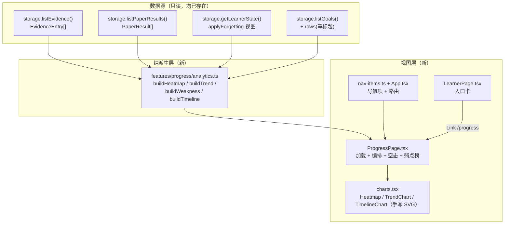
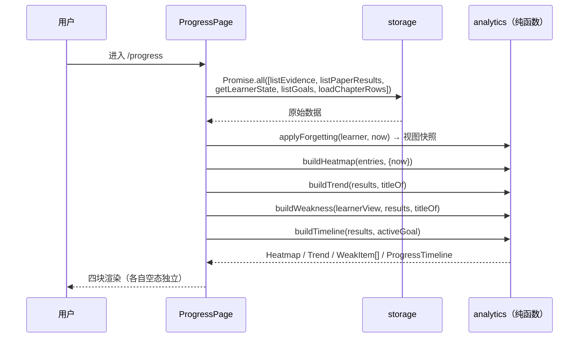

# 复盘与趋势（Progress Analytics）技术方案

| 字段 | 内容 |
|------|------|
| 作者 | Agent |
| 日期 | 2026-09-15 |
| 状态 | ✅ **已实施（2026-09-16）** —— D1–D4 全部落地（§0.1）；实施结果见 **§13** |
| 关联需求 | `docs/roadmap-next-features-plan-2026-09.md` §F3（P1 · 中）；`docs/ui-workbench-plan-2026-09.md` §24/§149/§402（预留的独立分析页）；`README.zh-CN.md` 功能清单「学习复盘与趋势 —— 活动热力图、掌握度趋势、弱点排行 `P1`」 |

---

## 0.1 决策记录（本次会话定案）

| ID | 决策点 | 结论 |
|----|--------|------|
| **D1** | 页面落点 | **新建独立路由 `/progress`**；`/learner` 保持「系统怎么理解我」的定位不动，仅在页内加一个入口卡指向 `/progress` |
| **D2** | evidence 500 条上限 | **提高到 5000**，并在热力图上**显式标注实际覆盖区间**；达到上限时额外提示「更早记录已被裁剪」 |
| **D3** | 弱点排行口径 | **三因子综合分**排序（掌握度缺口 + 卷面错误信号 + 误解标签数），并可跳转去补 |
| **D4** | 目标进度时间线 | **本轮做**，并明确标注为「基于试卷记录近似重建」 |

> **一条被本方案否决的 roadmap 措辞**：F3 §范围第 5 条写「`StorageAdapter` 补聚合查询（当前只有 list all / by subject，前端全量拉取会随数据量恶化）」。经核实该前提**不成立**（见 §3.1 的 G2/G3），本方案**不新增任何 storage 方法**，聚合全部走纯前端派生。理由与证据见 §3.1。

---

## 1. 背景

### 1.1 业务背景与用户痛点

Personal Learning OS 已经把「学习证据」这件事做实了：判卷、复习、费曼复述、自测卡、能力评测 —— 五条链路都会往 `EvidenceEntry` 写一行，`PaperResult` 也逐次落库并记录了每次判卷前后的掌握度。

但这些数据**只被用来罗列**：

- 首页「最近证据」显示了最近 6 条（`HomePage.tsx:451` 的 `log.slice(0, 6)`）；
- 目标详情页按主体列出证据；
- `/learner` 页展示了「此刻的切片」—— 计数、强弱两列、误解标签。

用户看不到的是**时间维度**：

- 我最近到底有没有在学？（没有活动热力图）
- 我的掌握度是在涨还是在退？（没有趋势曲线 —— 只有"现在 62%"）
- 哪个章最该补？（`/learner` 的 GAPS 只按掌握度升序，不看"错得多不多"）
- 离截止日还有两周，进度在收敛吗？（没有进度时间线）

**一句话**：数据是「已建未用」—— 有矿，没有冶炼厂。

### 1.2 触发原因

- roadmap §F3（P1 · 中）明确列为待做；
- F6 能力评测落地后，「证据可溯」这条产品原则已经贯穿到目标级，但**时间维度仍完全空白**；
- F2（时间维度计划）已让「今天该做多少」可回答，下一步自然是「过去做得怎么样」。

### 1.3 与现有模块的关系

| 模块 | 关系 |
|------|------|
| `domain/evidence.ts` | **数据源（只读）** —— 不改类型、不新增 kind |
| `domain/quiz.ts::PaperResult` | **数据源（只读）** —— `createdAt` + `perChapter` 是趋势与时间线的唯一权威来源 |
| `features/learner/aggregate.ts` | **同层姊妹模块** —— 沿用其「纯函数 + `titleOf` 解析器由页面传入」的模式 |
| `features/learner/LearnerPage.tsx` | 加**一个入口卡**指向 `/progress`（D1） |
| `storage/memory.ts` | 只改**一个常量**（evidence 上限 500 → 5000，D2） |
| `lib/` SVG 图表 | 全仓首个手写 SVG 图表（无图表库，见 §3.3） |

### 1.4 不做会有什么影响

- 「掌握度」永远只有一个瞬时值，用户无法判断自己的方向（在涨还是在退）；
- `/learner` 的 GAPS 会把「掌握度低但只错过一次」的章与「掌握度低且反复错」的章同等对待，指向不准；
- F6 能力报告的「趋势」维度缺数据支撑（roadmap §F3「被依赖：F6」）；
- 证据流的写入侧持续投入，读取侧永远是「罗列 6 条」，投入产出比失衡。

---

## 2. 方案目标

| 类型 | 描述 |
|------|------|
| **主要目标** | 新增 `/progress` 页，呈现四块：**学习活动热力图**（按天聚合证据条数）、**掌握度趋势曲线**（判卷时点序列）、**弱点排行**（三因子综合分 + 跳转）、**目标进度时间线**（readiness 近似重建 + 截止日参照）。全部为**纯只读派生**，不写任何状态。 |
| **非目标** | ① 不改 `EvidenceEntry` 类型、不新增 `EvidenceKind`；② **不新增任何 storage 方法**、不改 `local.ts` / `tauri.ts` / `src-tauri/**`；③ 不做数据导出（F4 范围）；④ 不引入图表库；⑤ 不做「自动生成复盘报告」类 AI 功能；⑥ 不实现 streak（连续天数）—— 它是热力图的衍生指标，留待后续单项评估；⑦ 不改 `applyForgetting` 或任何掌握度写入口径。 |
| **成功标准** | ① 有数据时四块都渲染且数字可指到 domain 字段；② 空数据 / 单条数据有明确空态，**不出现分不清的空白图表**；③ 新增纯函数有单测（含边界与回归）；④ `npm run typecheck` 仅余 3 条既存 `AIModelsSection` 错误；⑤ `src-tauri/**`、`src/storage/tauri.ts`、`src/storage/local.ts` 零改动（仅 `memory.ts` 改一个常量）；⑥ 全部测试套件全绿。 |

---

## 3. 项目现状

### 3.1 相关代码与模块（全部实测取证）

| # | 事实 | 出处（实测） |
|---|------|--------------|
| G1 | 证据流类型已落地，5 种 kind，含 `at/kind/subjectId/subjectKind?/verdict?/delta/sourceId?` | `domain/evidence.ts:24,41-66` |
| G2 | 读取侧只有**简单罗列**：首页取 `log.slice(0, 6)` | `HomePage.tsx:446,451` |
| G3 | ⚠️ **`evidenceLog` 有 500 条硬上限**，超出 `slice(-500)` 丢最旧 | `memory.ts:440-442` |
| G4 | `/learner` 已有 5 块：画像卡 / KNOWLEDGE 计数 / STRENGTHS+GAPS / MISCONCEPTIONS / LEARNING PATTERNS | `LearnerPage.tsx:107-250`（**实测 292 行**） |
| G5 | **弱点排行已有雏形**：`gapsOf`（mastery < `MASTERY_FLOOR`=0.6 升序）+ 误解去重聚合 | `aggregate.ts:82-84,108-113` |
| G6 | 全仓 `heatmap` / `trend` / 活动时间线 **零命中**（唯一的 `streakUp` 是答题连对提示，无关） | Grep 全 `src/` |
| G7 | 趋势权威源：`PaperResult.createdAt` + `perChapter[chapterId].{previousMastery,mastery,score}` | `domain/quiz.ts:98-130` |
| G8 | ⚠️ `TauriStorage extends LocalStorageAdapter`，**Evidence / Paper / Goal / LearnerState 全由父类承载**，只有 RAG 五类实体走 SQLite | `storage/tauri.ts:229`、`:4-8` 头注 |
| G9 | `listEvidence()` / `listPaperResults()` / `getLearnerState()` / `listGoals()` **均已存在** | `storage/types.ts:123,150,159,184` |
| G10 | 无图表库：依赖里只有 `mermaid`（文档渲染）与 `@xyflow/react`（知识图谱） | `package.json` |
| G11 | 阈值：`MASTERY_THRESHOLD`=0.8、`MASTERY_FLOOR`=0.6 | `domain/plan.ts:49-50` |
| G12 | ⚠️ 遗忘衰减是**读时计算**（`applyForgetting`），不落库 → 曲线画的是「判卷当时」的快照 | `LearnerPage.tsx:71` |
| G13 | 导航是 `NAV_ITEMS` 数组 + `NavKey` 编译期约束（`Messages["nav"]` 里含 `label`/`hint` 的键） | `components/layout/nav-items.ts:38-52` |
| G14 | 实测行数：`App.tsx` 73 · `LearnerPage.tsx` 292 · `aggregate.ts` 150 · `GoalDetailPage.tsx` 542 · `memory.ts` 444 · `local.ts` 366 · `types.ts` 215 · `primitives.tsx` 359 | `wc -l` |
| G15 | `PaperQuestion` 带 `chapterId`（可把错题反查回章） | `domain/quiz.ts:28-43` |

**由 G3 + G8 + G9 推出的三个结论**（本方案 §4 的架构依据）：

1. **不需要新增 storage 方法。** roadmap 担心「前端全量拉取会随数据量恶化」，但：① 本地后端的 evidence 就是**内存数组**（`memory.ts:55`），`listEvidence()` 的 `[...this.evidenceLog].sort()` 是**浅拷贝 + 排序**，没有 IO；② 它被 500 条上限封顶（D2 后为 5000）；③ `PaperResult` 量级 = 判卷次数（数十到数百）。**O(n log n) 的内存派生完全可接受**，加一层 storage 聚合只会把同样 O(n) 的计算换个位置放。
2. **是「上限」而不是「容量」在限制热力图。** 500 条按每天 3 条只够约 5 个月，热力图会显示「以前没学习」的**假空窗**。
3. **改上限不会波及桌面后端。** 上限常量在 `memory.ts`（基类），`local.ts` 持久化与 `tauri.ts` 都只是它的下游 —— G8 已证实 Evidence 不由 SQLite 承载。

### 3.2 相关文档与约定

| 文档 | 需遵守的点 |
|------|-----------|
| `rules/code-structure-and-dependencies.mdc` | 文件 ≤700 行 |
| `rules/layer-import-boundaries.mdc` | UI → stores/storage；本次为**纯读**，无写路径 |
| `rules/i18n-bilingual-pairing.mdc` | 双语严格成对；服务/派生层**不产生中文文案**，文案由 UI 用 `useI18n` 映射 |
| `rules/no-headless-browser-validation.mdc` | ✅ 不启动浏览器校验（实施时人工核对） |
| `docs/ui-workbench-plan-2026-09.md` §149/§402 | 早已预留「独立分析页」；本方案兑现该预留 |
| `docs/plan-time-dimension-design-2026-09.md` §14 | F2 的架构先例：纯派生模块放 `features/`，不放 `engine/`（engine 不得 import features） |
| `skills/pre-task-technical-design/SKILL.md` 自检清单 | 量纲口径一致 / 时间基准唯一 / 用例输入期望自洽 / 不凭记忆引用行数 |

### 3.3 约束与依赖

| 约束 | 内容 |
|------|------|
| 零改动区 | **`src-tauri/**`**（Rust）与 **`src/storage/tauri.ts`** —— 本方案不碰。`local.ts` 也不碰（上限常量在上游 `memory.ts`）。 |
| 唯一存储改动 | `memory.ts` 的 500 → 5000（**一个常量**） |
| 无新增依赖 | 图表手写 SVG。理由：热力图 = 网格、趋势 = 一条折线、时间线 = 一条折线 + 竖线 —— 这个规模引 recharts（+d3 系传递依赖）不划算，且项目至今零可视化依赖 |
| 时区 | 热力图的「天」按**本地时区**切分（与用户日历一致），周首 = **周一** |
| 性能 | 上限 5000 条 evidence 的派生 = 一次 O(n) 分桶 + 一次 O(n) 排序；趋势 = O(R·C)，R=判卷次数、C=涉及章数 |
| 兼容性 | `subjectKind` 缺省 `"chapter"`（旧数据零回归）；本方案**不改** `EvidenceEntry` |

---

## 4. 技术架构

### 4.1 总体架构



### 4.2 模块职责

| 模块/层级 | 职责 | 技术选型 |
|-----------|------|----------|
| `features/progress/analytics.ts`（新） | **纯函数**：热力图分桶 / 趋势累积快照 / 弱点三因子 / 时间线重建。零 IO、零 React、零 i18n | TypeScript 纯函数（同 `learner/aggregate.ts` 模式） |
| `features/progress/charts.tsx`（新） | 三个**展示型** SVG 组件，只吃已算好的数据 | React + 原生 SVG + Tailwind class |
| `features/progress/ProgressPage.tsx`（新） | 数据加载（`Promise.all`）、编排四块、空态、弱点榜跳转 | React 页面（同 `LearnerPage.tsx` 模式） |
| `features/learner/LearnerPage.tsx`（改） | 仅加一个入口卡 | — |
| `components/layout/nav-items.ts`（改） | 加 `/progress` 导航项 | — |
| `src/App.tsx`（改） | 加路由 | — |
| `storage/memory.ts`（改） | evidence 上限常量 500 → 5000 + 导出常量 | — |
| `i18n/messages/{zh,en}.ts`（改） | `nav.progress` + `progress` 整段（严格成对） | — |

### 4.3 数据模型与 API

**不新增 storage 方法，不新增持久化 key，不改任何 domain 类型。** 仅新增**派生层内存类型**（全部定义在 `analytics.ts`）：

```ts
/** 热力图一格：本地时区的一个自然日。 */
export interface ActivityDay {
  /** `YYYY-MM-DD`（本地时区）。 */
  dateKey: string;
  /** 该日 evidence 条数。 */
  count: number;
}

/** 热力图（固定 26 周 × 7 天网格；列 = 周（周一首），行 = 周一..周日）。 */
export interface Heatmap {
  /** 26 列；每列 7 格，`undefined` = 未来日期（今天之后）。 */
  weeks: (ActivityDay | undefined)[][];
  /** 单日最大条数（色阶归一化用；无数据 = 0）。 */
  maxCount: number;
  /** 窗口内总条数。 */
  totalCount: number;
  /** 实际记录覆盖区间（min/max at；无数据 = undefined）。 */
  coveredFrom?: number;
  coveredTo?: number;
  /** 证据条数已达存储上限 → 更早的记录可能已被裁剪（D2 诚实性标注）。 */
  truncated: boolean;
}

/** 趋势上的一个判卷时点。 */
export interface TrendPoint {
  at: number;
  /** **累积快照**口径：当时「已被考过的章」的掌握度均值（0..1）。 */
  avgMastery: number;
  /** 该时点已考过的章数（曲线的样本量）。 */
  chapterCount: number;
}

export interface TrendChapterSeries {
  id: string;
  /** 章标题；**解析不到时为 `undefined`**（章已随资料删除）—— 兜底文案由 UI 决定。 */
  title?: string;
  /** 该章的掌握度快照序列（≥2 点才可画线）。 */
  points: { at: number; mastery: number }[];
}

export interface Trend {
  /** 整体平均曲线（按 `createdAt` 升序）。 */
  points: TrendPoint[];
  /** 逐章序列（供下钻；只保留 ≥1 点的章）。 */
  chapters: TrendChapterSeries[];
  /** 参与的判卷份数。 */
  paperCount: number;
}

/** 弱点榜一行（三因子）。 */
export interface WeakItem {
  id: string;
  title: string;
  /** 当前掌握度（0..1）。 */
  mastery: number;
  /** 三因子综合分（0..1，降序用）。 */
  score: number;
  /** 三因子的原始分量（供 UI 展示与解释）。 */
  factors: {
    /** 掌握度缺口（0..1）。 */
    gap: number;
    /** 卷面错误信号（0..1；无试卷 = 0）。 */
    error: number;
    /** 误解标签数（原值，非归一）。 */
    misconceptions: number;
  };
  /** 该章卷面客观分均值（0..1；无试卷 = undefined）。 */
  avgPaperScore?: number;
  /** 误解标签原文（最多展示 3 条由 UI 决定）。 */
  misconceptionTags: string[];
}

/** 目标进度时间线。 */
export interface TimelinePoint {
  at: number;
  /** 当时「已考过的范围内章节」中 ≥ MASTERY_THRESHOLD 的占比（0..1）。 */
  readiness: number;
  /** 当时已考过的范围内章节数。 */
  covered: number;
  /** 范围章节总数（分母的另一半，用于诚实标注）。 */
  required: number;
}

export interface ProgressTimeline {
  goalId: string;
  goalTitle: string;
  points: TimelinePoint[];
  /** 截止日（epoch ms；未设置 = undefined）。 */
  deadlineAt?: number;
}
```

**函数签名**（全部纯函数，`titleOf` 由页面注入 —— 与 `aggregateLearner` 同模式）：

```ts
export function buildHeatmap(
  entries: readonly EvidenceEntry[],
  opts: { now: number; weeks?: number },
): Heatmap;

export function buildTrend(
  results: readonly PaperResult[],
  titleOf: (chapterId: string) => string | undefined,
): Trend;

export function buildWeakness(
  learner: LearnerState,
  results: readonly PaperResult[],
  titleOf: (chapterId: string) => string | undefined,
  limit?: number,
): WeakItem[];

export function buildTimeline(
  results: readonly PaperResult[],
  goal: { id: string; title: string; chapterIds: string[]; deadlineAt?: number } | undefined,
): ProgressTimeline | undefined;
```

**数据读写（必填）**：

- **读**：`storage.listEvidence()` / `storage.listPaperResults()` / `storage.getLearnerState()` / `storage.listGoals()` + `loadChapterRows(storage)`（章标题）。全部为**已存在**的接口（G9）。UI 直连 `storage`（与 `LearnerPage.tsx:64-68` 完全一致的既有模式，不经 store）。
- **写**：**N/A —— 本方案零写入**。不写 `LearnerState`、不写 `EvidenceEntry`、不写任何新 key。`/progress` 是**纯只读页**。
- **桌面能力**：不使用 `invoke`；`vault_*` / `llm_*` 均不涉及。
- **持久化格式与迁移**：**无迁移**。唯一存储改动是 `memory.ts` 的上限常量（5000 是**上限收紧与否**的问题，不涉及数据格式；已存的 500 条原样保留）。
- **`local.ts` 的影响（需记录）**：上限提高后，`persist()` 单次 `JSON.stringify(evidenceLog)` 的体积上限从约 75 KB 升到约 750 KB（5000 × ~150 B）。localStorage 配额通常 5 MB，**仍在安全范围**，但这是本方案唯一的容量风险点，已登记 §11 待观测。
- **降级**：`localStorage.setItem` 抛 `QuotaExceededError` 时既有 `local.ts` 行为不变（非本方案引入），本次仅在方案中登记该风险。

### 4.4 状态与副作用

- **本地 state**（`ProgressPage`）：`entries` / `results` / `learner` / `rows` / `goals` + `loading`。用 `useState` + 一次 `useEffect`（`Promise.all`），**与 `LearnerPage.tsx:62-74` 同构**。
- **全局 store**：**零改动**。`activeGoal` 用于时间线的默认目标，直接读 `useLoopStore((s) => s.activeGoal)`（**只读订阅**，不调 `refresh`）。
- **URL 参数**：**无**（趋势下钻的「选中章」用本地 state，不进 URL —— 保持 `/progress` 单一路由，避免与既有 `chapterId` 参数语义冲突的历史教训）。
- **副作用时机**：仅 mount 时加载一次。`now` **在 mount 时取一次**并透传给 `buildHeatmap`（守「时间基准唯一」自检项），不与 `applyForgetting` 的 `Date.now()` 混用（后者的衰减视图本身就不参与热力图）。

---

## 5. 交互流程

### 5.1 主流程

1. 用户在侧栏点「复盘」（`/progress`）或从 `/learner` 的入口卡进入。
2. `ProgressPage` mount → `Promise.all` 并行读 evidence / paperResults / learnerState / goals / chapterRows。
3. **加载中**：显示 `progress.loading` 一行（与 `/learner` 同款）。
4. 加载完成 → 计算：`learn.byUnit` 先过 `applyForgetting`（与 `/learner`、Today、Plan 同口径）→ 得到衰减后视图。
5. **判断总空态**：`entries.length === 0 && results.length === 0` → 渲染空态卡（标题 + 说明 + 「去计划页」按钮），**不渲染四块空图表**。
6. 否则渲染四块（各自可能为空的块显示块级空态文案）：
   - **[1] 目标进度时间线**（仅有 `activeGoal` 且其范围内有 ≥1 次判卷时渲染；否则显示块级引导）
   - **[2] 学习活动热力图**（`entries.length === 0` → 块级空态）
   - **[3] 掌握度趋势**（`results.length === 0` → 块级空态；有数据但只有 1 个判卷点 → 画单点 + 标注「再测评一次即可看到趋势」）
   - **[4] 最该补的**（三因子榜；空 → 「暂无弱点」）
7. 用户点弱点榜某行 → 跳 `/learn/:chapterId`。
8. 用户点热力图某格 → **无跳转**（纯信息展示；`<title>` 原生 tooltip 显示「日期 · N 条」）。
9. 用户在趋势块切换「整体平均 / 某章」→ 曲线切换为该章的序列。

### 5.2 分支与异常流程

| 场景 | 触发条件 | 系统行为 | UI 反馈 |
|------|----------|----------|---------|
| 全空（新用户） | `entries` 与 `results` 均为空 | 只渲染空态卡 | 标题「还没有可复盘的数据」+ 说明 + 「去计划页」按钮 |
| 有证据但无试卷 | `entries.length > 0 && results.length === 0` | 热力图有名有实；趋势块空态；弱点榜按「无卷面分」口径算（error 恒 0）；时间线块引导 | 趋势块：「还没有试卷记录……」（而非空白坐标系） |
| 有试卷但证据被裁 | `truncated === true` | 热力图正常渲染 + 顶部提示条 | 「记录已达存储上限，更早的活动已被裁剪」 |
| 只有 1 个判卷点 | `results.length === 1` | 趋势画**单点**（不画折线） | 点下方标注「再测评一次即可看到趋势」 |
| 单章只有 1 个点 | 下钻到该章 | 该章画单点 | 同上文案 |
| 无 `activeGoal` | `goals.length === 0` | 时间线块不渲染 | 块级引导「还没有目标——创建一个目标后可以看到进度时间线」 |
| 有目标但范围内无判卷 | 范围内 `perChapter` 从未命中 | 时间线块显示引导 | 「该目标范围内还没有试卷记录」 |
| 范围内章全部被删 | `goal.chapterIds` 与现存章无交集 | 时间线不渲染（`required === 0` 视为无效） | 块级引导（复用「范围内没有试卷记录」） |
| 危险字符 / 超长章标题 | 标题含 `<`、引号或极长 | SVG 中标题走 React 文本节点（自动转义）；`titleOf` 结果为纯字符串 | 超长标题截断显示（`truncate`） |
| 章 id 解析不出标题 | 章已删但 `byUnit` 残留 | **弱点榜**：与 `/learner` 一致 —— 不可解析的主体不入榜；**趋势**：历史序列保留（`id` + `points` 都在，仍可下钻），但 `title` 留空、由 UI 显示兜底文案 | 弱点榜不出现该章；趋势下拉显示「章节已不存在」而非裸 id（2026-09-21 口径修正） |

### 5.3 时序图



---

## 6. 用户用例（User Cases）

### UC-01：看「我最近有没有在学」

| 项 | 内容 |
|----|------|
| 角色 | 有学习记录的用户 |
| 前置条件 | `listEvidence()` 返回 ≥1 条 |
| 主流程步骤 | 1. 打开 `/progress` 2. 看热力图 3. 读 caption 的「近 26 周 · 共 N 次学习记录」4. 悬停某格读 tooltip |
| 期望结果 | 网格按周一为首列、本地时区分桶；色阶 5 档（0/1/2-3/4-5/≥6）；无记录的日期为最浅档而不是空白；caption 显示实际覆盖区间 |
| 异常/边界 | 全部记录集中在一天 → 该格最深，其余最浅；跨年（12 月→1 月）分桶正确；未来日期格不渲染 |

### UC-02：看「我的掌握度在涨还是在退」

| 项 | 内容 |
|----|------|
| 角色 | 做过 ≥1 次测评的用户 |
| 前置条件 | `listPaperResults()` 非空 |
| 主流程步骤 | 1. 打开 `/progress` 2. 看趋势曲线 3. 切换下钻到某个章 4. 读 caption「基于 N 次判卷 · M 个章节」 |
| 期望结果 | 默认曲线 = 累积快照口径的整体平均；y 轴 0..1，带 0.6（`MASTERY_FLOOR`）与 0.8（`MASTERY_THRESHOLD`）两条参考线；下钻切换后画该章序列；图下常驻「不含遗忘衰减」的说明 |
| 异常/边界 | 只有 1 个判卷点 → 单点 + 引导语；输入乱序 → 输出按 `createdAt` 升序；同一天两次判卷 → 两个点都在 |

### UC-03：找「最该补的章」

| 项 | 内容 |
|----|------|
| 角色 | 有学习记录的用户 |
| 前置条件 | `byUnit` 中存在「有信号」的章（`mastery > 0 \|\| attempts > 0`） |
| 主流程步骤 | 1. 打开 `/progress` 2. 看「最该补的」列表 3. 点某行的「去补」 |
| 期望结果 | 按三因子综合分降序，最多 5 行；每行显示标题、掌握度、卷面分（若有）、误解数；点击跳 `/learn/:chapterId` |
| 异常/边界 | **未学过的章（mastery=0 且 attempts=0）不入榜** —— 它是「未开始」不是「弱点」；全部无信号 → 「暂无弱点」；有误解但掌握度达标 → 仍可能入榜（misconception 因子非 0） |

### UC-04：看「离截止日还有两周，进度在收敛吗」

| 项 | 内容 |
|----|------|
| 角色 | 设了 deadline 且选了章范围的目标的用户 |
| 前置条件 | `activeGoal` 存在、`chapterIds` 非空、范围内 ≥1 次判卷 |
| 主流程步骤 | 1. 打开 `/progress` 2. 看时间线 3. 读每点的「已考 c/r 章」4. 对照右侧的截止标记 |
| 期望结果 | 折线 = 已考章节的 readiness 随判卷时点变化；截止日以竖线/标记呈现；块下常驻「基于试卷记录近似重建，仅统计已考章节」 |
| 异常/边界 | deadline 超出图表 x 范围 → 裁剪到右端并注明；无 deadline → 不画截止标记但仍画曲线；范围内无判卷 → 块级引导 |

---

## 7. 线框 UI（Wireframe）

### 7.1 `/progress` — 默认状态（有数据）

```
┌──────────────────────────────────────────────────────────────────┐
│  复盘与趋势                                                       │
│  把学习记录变成看得见的轨迹                                        │
├──────────────────────────────────────────────────────────────────┤
│  TARGET PROGRESS                                    [已考 4/10 章] │
│  ┌────────────────────────────────────────────────────────────┐  │
│  │ 100% ┤                                          ▏截止       │  │
│  │  80% ┤                          ●────●                     │  │
│  │  60% ┤            ●────●────●                              │  │
│  │  40% ┤  ●────●                                            │  │
│  │   0% └──┬─────┬─────┬─────┬─────┬─────┬─────┬──────────    │  │
│  │        8/18  8/25  9/01  9/08  9/15                        │  │
│  └────────────────────────────────────────────────────────────┘  │
│  ⓘ 基于试卷记录近似重建，仅统计已考章节。                           │
├──────────────────────────────────────────────────────────────────┤
│  LEARNING ACTIVITY             近 26 周 · 共 128 次学习记录        │
│  ┌────────────────────────────────────────────────────────────┐  │
│  │ 9月 10月  11月  12月   1月   2月   3月                      │  │
│  │ ░░▒▒▓█▒░░▒▓▒░░░▒▒▓▒░░▒▒░░▒▓▒░▒░▒░▒▒▒▓▒░░▒▒▒░▒▒            │  │
│  │ ░▒░▒░░▓▒░▒▒░▒▓░░▒░▒▒░▒▒▓▒░░░▒▒▓▒░▒▒░▒░░▒▓▒▒▒░▒▒            │  │
│  │ ▒░▒▒░▒▒░▒░░▒░▒░▒░▒▒░▒▒▒░▒░▒▒░▒░▒░▒░▒▒░▒▒░▒░▒▒░▒            │  │
│  │ ░░▒░░▒▒▒░▒░░░▒▒░▒▒░▒░▒░▒░▒▒▒░▒░▒▒░▒░░░▒▒░▒▒░▒▒░            │  │
│  │ ▒▒░▒░▒▒░░▒▒░▒░▒░▒░▒▒░▒░░▒░▒▒░▒▒▒░▒▒░▒░▒▒▒░▒█▒░             │  │
│  │ ░░▒▒░░▓▒░▒▒░░▒░▒▓▒▒░▒░▒▒░▒░▒▒░▒▒░▒░▒▒░▒▒░▒▒▒░              │  │
│  │ ▒░▒▒░▒▒░▒░▒▒░▒▒░▒░▒▒░▒▒░▒▒▒░▒▒░▒▒░▒▒░▒▒▒░▒▒░▒              │  │
│  └────────────────────────────────────────────────────────────┘  │
│  少 ░ ▒ ▓ █ 多        记录区间 2026-03-18 — 2026-09-15            │
├──────────────────────────────────────────────────────────────────┤
│  MASTERY TREND              基于 12 次判卷 · 18 个章节   [章节 ▾]  │
│  ┌────────────────────────────────────────────────────────────┐  │
│  │ 100% ┤                                                     │  │
│  │  80% ┤- - - - - - - - - - - - - - - - - - - - - - - - - -   │  │
│  │  60% ┤· · · · · · · · · · · · · · · · · · · · · · · · · ·   │  │
│  │  40% ┤        ●───●────●────●───●                          │  │
│  │   0% └──┬─────┬─────┬─────┬─────┬─────┬─────┬──────────    │  │
│  └────────────────────────────────────────────────────────────┘  │
│  ⓘ 曲线取判卷当时的掌握度快照，不含后续遗忘衰减。                   │
├──────────────────────────────────────────────────────────────────┤
│  WEAKEST FIRST                                                    │
│  Reranking 原理              掌握度 22%  卷面 31%  2 个误解  去补→ │
│  BM25 与向量融合             掌握度 34%  卷面 40%  1 个误解  去补→ │
│  分块策略                    掌握度 41%         —  1 个误解  去补→ │
└──────────────────────────────────────────────────────────────────┘
```

**布局与组件映射**：

| 区块 | 对应组件 | 说明 |
|------|----------|------|
| 页头 | `<header>`（同 `LearnerPage.tsx:109-112`） | `text-xl font-semibold text-ink-1` + `text-sm text-ink-2` |
| 块标题 | `<Section title=... className="mt-8" action=...>`（`primitives.tsx:133`） | 右槽放 caption / 图例 / 下钻控件 |
| 图表容器 | `<Card>`（`primitives.tsx:48`） | `p-4`、圆角、`border-line` |
| 说明行 | `<p className="text-xs text-ink-3">` | 以 `ⓘ` 起头（沿用 `LearnerPage.tsx:119-121` 的既有形态） |
| 弱点行 | `<Bar>`（`primitives.tsx:78`）+ `<Link>` | 掌握度条复用 `Bar`，`target={MASTERY_THRESHOLD}` |
| 热力图 | 原生 `<svg>` | `data-testid="progress-heatmap"` |
| 趋势图 | 原生 `<svg>` | `data-testid="progress-trend"` |
| 时间线 | 原生 `<svg>` | `data-testid="progress-timeline"` |

**设计 token 用法**（不新增 token）：

| 用途 | token |
|------|-------|
| 页面底色 / 卡片 | `bg-app-bg` / `bg-surface`（`Card` 自带） |
| 主文字 / 次文字 / 三级 | `text-ink-1` / `text-ink-2` / `text-ink-3` |
| 边框 | `border-line` |
| 热力图色阶 | `fill="currentColor"` + `className="text-primary"` + `fillOpacity` 0.15 / 0.35 / 0.6 / 1.0（**跟随主题色，不需要新 token**） |
| 热力图空格（0 条） | `fill="currentColor"` + `className="text-line"` + `fillOpacity` 0.5 |
| 趋势主线 | `stroke="currentColor"` + `text-primary` |
| 参考线 0.6 / 0.8 | `text-ink-3`（虚线）/ `text-state-mastered`（虚线） |
| 时间线截止标记 | `text-state-failed`（警示色） |
| 达标点 | `text-state-mastered` |

### 7.2 其他状态

**7.2.1 全空（新用户）**

```
┌──────────────────────────────────────────────────────────────────┐
│  复盘与趋势                                                       │
│  把学习记录变成看得见的轨迹                                        │
├──────────────────────────────────────────────────────────────────┤
│  ┌ ─ ─ ─ ─ ─ ─ ─ ─ ─ ─ ─ ─ ─ ─ ─ ─ ─ ─ ─ ─ ─ ─ ─ ─ ─ ─ ─ ─ ─ ┐  │
│  │  还没有可复盘的数据                                          │  │
│  │  完成一次测评或复习后，这里会出现你的活动热力图、掌握度趋势      │  │
│  │  与弱点排行。                                               │  │
│  │  [ 去计划页 ]                                               │  │
│  └ ─ ─ ─ ─ ─ ─ ─ ─ ─ ─ ─ ─ ─ ─ ─ ─ ─ ─ ─ ─ ─ ─ ─ ─ ─ ─ ─ ─ ─ ┘  │
└──────────────────────────────────────────────────────────────────┘
```

- 容器：`<Card className="mt-6 border-dashed">`（与 `LearnerPage.tsx:125` 完全同款）
- **关键约定**：全空时**不渲染四块空坐标系** —— 空白图表是最糟的空态（用户分不清「没数据」与「加载失败」）

**7.2.2 块级空态（部分有数据）**

```
│  MASTERY TREND                                                    │
│  ┌────────────────────────────────────────────────────────────┐  │
│  │   还没有试卷记录——完成一次测评后，这里会出现掌握度曲线。        │  │
│  └────────────────────────────────────────────────────────────┘  │
```

- 块级空态用**一句话**（`text-sm text-ink-3`），不画坐标轴

**7.2.3 单点趋势**

```
│  40% ┤                    ●   ← 单点（不画折线）                    │
│      └────────────────────┬───────────────────────────            │
│                       9/15                                        │
│      再测评一次即可看到趋势。                                       │
```

**7.2.4 加载中**

```
┌──────────────────────────────────────────────────────────────────┐
│  复盘与趋势                                                       │
│  ┌────────────────────────────────────────────────────────────┐  │
│  │  正在加载……                                                 │  │
│  └────────────────────────────────────────────────────────────┘  │
└──────────────────────────────────────────────────────────────────┘
```

**7.2.5 裁剪提示条（`truncated === true`）**

```
│  LEARNING ACTIVITY             近 26 周 · 共 5000 次学习记录       │
│  ⚠ 记录已达存储上限（5000 条），更早的活动已被裁剪。                 │
```

- `text-xs` + `text-state-failed`（与既有告警行同色）

### 7.3 交互说明

- **键盘可达性**：弱点榜每行是真 `<Link>`（Tab 可达）；趋势下钻用原生 `<select>`（Tab + 方向键）；热力图格子**不可聚焦**（纯信息，避免 182 个 Tab 停靠点 —— 这是刻意的可访问性取舍，用 `<title>` 提供鼠标可读信息）。
- **Hover**：热力图格 `<title>` 原生 tooltip；弱点行 hover 变 `text-primary`（同 `LearnerPage.tsx:280` 的 `group-hover:text-primary`）。
- **图表的最小尺寸**：趋势/时间线 SVG 用 `viewBox` + `w-full h-auto`，跟随容器宽度缩放（不写死 px 宽）。
- **弹层 / 抽屉**：无。
- **无跳转的元素**：热力图格子、趋势图数据点（纯展示）。

---

## 8. 涉及文件及改动伪代码

> 每个文件给签名与核心分支。伪代码只表达意图，不是最终提交代码。

### 8.1 `src/features/progress/analytics.ts`（新增，约 265 行）

**改动说明**：本方案的**唯一核心模块**。纯函数、零 IO、零 React、零 i18n。全部口径常量在此模块顶部集中定义并注释来源。

```ts
/**
 * 复盘与趋势的派生层（纯函数；docs/progress-analytics-design-2026-09.md §4）。
 *
 * 输入 = domain 原始对象 + 页面注入的标题解析器（同 learner/aggregate.ts 模式）；
 * 输出 = 页面可直接渲染的四块结构。零 IO / 零 React / 零 i18n（文案由 UI 映射）。
 *
 * ⚠️ 三条必须守住的口径（§4.3 / §8.5）：
 * 1. 掌握度趋势用「累积快照」口径 —— 每次判卷把 perChapter.mastery 并入累积表，
 *    再算全表均值；**不是**逐卷平均（逐卷平均会因每卷覆盖的章不同而剧烈跳动）。
 * 2. 弱点榜只收「有信号」的章（mastery > 0 || attempts > 0）—— 没学过 ≠ 弱点。
 * 3. 时间线的 readiness 分母是**已考章节数**（不是范围内总章数），并把 covered/
 *    required 一并输出供 UI 诚实标注；与 GoalDetailPage 的 readiness 口径**不同**，
 *    命名上刻意区分（readinessCovered）。
 */
import type { EvidenceEntry, LearnerState, PaperResult } from "../../domain";
import { MASTERY_FLOOR, MASTERY_THRESHOLD } from "../../domain";
// ⚠️ 上限**只管导入、不在这里重写** —— 否则改上限时两处漂移（F2「两把尺子」的同类陷阱）。
import { EVIDENCE_LOG_MAX } from "../../storage/memory";

const DAY = 86_400_000;

/** 热力图窗口（周）。26 周 ≈ 半年，与 5000 条 evidence 上限配合（§4.3）。 */
export const HEATMAP_WEEKS = 26;
/** 误解因子的封顶条数（≥3 条即满分，避免长尾误解压过掌握度缺口）。 */
export const MISCONCEPTION_CAP = 3;
/** 三因子权重（和为 1）。 */
export const WEAKNESS_WEIGHTS = { gap: 0.5, error: 0.3, misconception: 0.2 } as const;

// ---------- 时间工具（本地时区；周首 = 周一） ----------

/** epoch ms → 本地时区 `YYYY-MM-DD`。 */
function dateKeyOf(at: number): string { /* getFullYear/getMonth/getDate 拼装，补零 */ }

/** 本地时区某日 00:00 的 epoch ms。 */
function startOfDay(at: number): number { /* setHours(0,0,0,0) */ }

/** 周一=0 … 周日=6（JS `getDay()` 的周日=0 需重映射）。 */
function mondayIndex(at: number): number { return (new Date(at).getDay() + 6) % 7; }

function clamp01(x: number): number { return x < 0 ? 0 : x > 1 ? 1 : x; }

// ---------- [1] 学习活动热力图 ----------

/** 色阶 5 档：0 条 → 0；1 → 1；2-3 → 2；4-5 → 3；≥6 → 4（6 = 最深档阈值）。 */
export function heatLevel(count: number): 0 | 1 | 2 | 3 | 4 {
  if (count <= 0) return 0;
  if (count === 1) return 1;
  if (count <= 3) return 2;
  if (count <= 5) return 3;
  return 4;
}

export function buildHeatmap(
  entries: readonly EvidenceEntry[],
  opts: { now: number; weeks?: number },
): Heatmap {
  const weeks = opts.weeks ?? HEATMAP_WEEKS;
  // 1) 分桶：一次 O(n) 遍历，用本地时区 dateKey。
  const byDay = new Map<string, number>();
  for (const e of entries) {
    const k = dateKeyOf(e.at);
    byDay.set(k, (byDay.get(k) ?? 0) + 1);
  }
  // 2) 网格：末列 = 今天所在周；从该周的周一往前推 (weeks-1) 周。
  const todayStart = startOfDay(opts.now);
  const lastMonday = todayStart - mondayIndex(opts.now) * DAY;
  const grid: (ActivityDay | undefined)[][] = [];
  for (let w = weeks - 1; w >= 0; w -= 1) {
    const colMonday = lastMonday - w * 7 * DAY;
    const col: (ActivityDay | undefined)[] = [];
    for (let d = 0; d < 7; d += 1) {
      const t = colMonday + d * DAY;
      // 未来日期（今天之后）留空 —— 不渲染成「0 条」的浅格（那会被误读为「学了但没记录」）。
      if (t > todayStart) { col.push(undefined); continue; }
      const key = dateKeyOf(t);
      col.push({ dateKey: key, count: byDay.get(key) ?? 0 });
    }
    grid.push(col);
  }
  // 3) 统计与覆盖区间（与网格共用同一个 now，守「时间基准唯一」）。
  const counts = grid.flat().filter(Boolean).map((c) => c!.count);
  const maxCount = counts.length === 0 ? 0 : Math.max(...counts);
  const totalCount = counts.reduce((n, c) => n + c, 0);
  const ats = entries.map((e) => e.at);
  return {
    weeks: grid,
    maxCount,
    totalCount,
    coveredFrom: ats.length ? Math.min(...ats) : undefined,
    coveredTo: ats.length ? Math.max(...ats) : undefined,
    // 条数达到上限 → 更早的可能已被裁剪（D2 诚实性标注，不假装数据完整）。
    truncated: entries.length >= EVIDENCE_LOG_MAX,
  };
}

// ---------- [2] 掌握度趋势 ----------

export function buildTrend(
  results: readonly PaperResult[],
  titleOf: (chapterId: string) => string | undefined,
): Trend {
  // 1) 按 createdAt 升序（输入可能是任意顺序 —— listPaperResults 已降序）。
  const ordered = [...results].sort((a, b) => a.createdAt - b.createdAt);

  // 2) 累积快照：chapterId → 最新 mastery。
  const snapshot = new Map<string, number>();
  const points: TrendPoint[] = [];
  const series = new Map<string, { at: number; mastery: number }[]>();

  for (const r of ordered) {
    for (const [chapterId, per] of Object.entries(r.perChapter)) {
      snapshot.set(chapterId, per.mastery);           // 覆盖为本轮最新值
      const s = series.get(chapterId) ?? [];
      s.push({ at: r.createdAt, mastery: per.mastery });
      series.set(chapterId, s);
    }
    const values = [...snapshot.values()];
    points.push({
      at: r.createdAt,
      avgMastery: values.length === 0 ? 0 : values.reduce((n, v) => n + v, 0) / values.length,
      chapterCount: values.length,
    });
  }

  return {
    points,
    chapters: [...series.entries()]
      .map(([id, pts]) => ({ id, title: titleOf(id), points: pts }))   // 解析不到 → 留 undefined，**不回落 id**
      .filter((c) => c.points.length > 0),
    paperCount: ordered.length,
  };
}

// ---------- [3] 弱点排行（三因子） ----------

export function buildWeakness(
  learner: LearnerState,
  results: readonly PaperResult[],
  titleOf: (chapterId: string) => string | undefined,
  limit = 5,
): WeakItem[] {
  // 1) 卷面分聚合：chapterId → { sum, n }（每份试卷里该章出现一次）。
  const paperAgg = new Map<string, { sum: number; n: number }>();
  for (const r of results) {
    for (const [chapterId, per] of Object.entries(r.perChapter)) {
      const cur = paperAgg.get(chapterId) ?? { sum: 0, n: 0 };
      cur.sum += per.score; cur.n += 1;
      paperAgg.set(chapterId, cur);
    }
  }

  const items: WeakItem[] = [];
  for (const [id, unit] of Object.entries(learner.byUnit)) {
    // 2) ⚠️ 只收「有信号」的章 —— 没学过（mastery=0 且 attempts=0）不是弱点。
    //    判据与 F1 的 profile-band.ts 一致（mastery > 0 || attempts > 0）。
    if (unit.mastery <= 0 && unit.attempts <= 0) continue;
    const title = titleOf(id);
    if (!title) continue;                       // 脏 key 不入视图（同 /learner 口径）

    const gap = clamp01((MASTERY_FLOOR - unit.mastery) / MASTERY_FLOOR);
    const agg = paperAgg.get(id);
    const avgPaperScore = agg ? agg.sum / agg.n : undefined;
    const error = avgPaperScore === undefined ? 0 : clamp01(1 - avgPaperScore);
    const tags = unit.misconceptions ?? [];
    const miscon = clamp01(tags.length / MISCONCEPTION_CAP);

    const score =
      WEAKNESS_WEIGHTS.gap * gap +
      WEAKNESS_WEIGHTS.error * error +
      WEAKNESS_WEIGHTS.misconception * miscon;

    if (score <= 0) continue;                   // 满分掌握且无误解 → 不入榜
    items.push({ id, title, mastery: unit.mastery, score, factors: { gap, error, misconceptions: tags.length }, avgPaperScore, misconceptionTags: tags });
  }

  return items.sort((a, b) => b.score - a.score).slice(0, limit);
}

// ---------- [4] 目标进度时间线（近似重建） ----------

export function buildTimeline(
  results: readonly PaperResult[],
  goal: { id: string; title: string; chapterIds: string[]; deadlineAt?: number } | undefined,
): ProgressTimeline | undefined {
  if (!goal || goal.chapterIds.length === 0) return undefined;
  const scope = new Set(goal.chapterIds);
  const ordered = [...results].sort((a, b) => a.createdAt - b.createdAt);

  const snapshot = new Map<string, number>();
  const points: TimelinePoint[] = [];
  for (const r of ordered) {
    let touched = false;
    for (const [chapterId, per] of Object.entries(r.perChapter)) {
      if (!scope.has(chapterId)) continue;      // 范围外章节不参与
      snapshot.set(chapterId, per.mastery);
      touched = true;
    }
    if (!touched) continue;                     // 这份卷没覆盖该目标的章 → 不产生点
    const values = [...snapshot.values()];
    const mastered = values.filter((m) => m >= MASTERY_THRESHOLD).length;
    points.push({
      at: r.createdAt,
      // ⚠️ 分母 = 已考章节数（不是 required）—— 早期点不会被「还没考」拉成 0。
      readiness: values.length === 0 ? 0 : mastered / values.length,
      covered: values.length,
      required: scope.size,
    });
  }
  if (points.length === 0) return undefined;
  return { goalId: goal.id, goalTitle: goal.title, points, deadlineAt: goal.deadlineAt };
}
```

**⚠️ 依赖说明（实施时必读）**：`memory.ts` 需 `export const EVIDENCE_LOG_MAX = 5000`，analytics **从这里导入、不得在 UI/派生层重写 5000** —— 否则上限一改就两处漂移（这正是 F2「两把尺子」的同类陷阱）。

### 8.2 `src/storage/memory.ts`（修改，444 → 约 448 行）

**改动说明**：只改一个上限 + 导出常量。**没有别的改动**。

```ts
/**
 * 证据日志上限（超出丢最旧）。
 *
 * ⚠️ 口径唯一来源：`features/progress/analytics.ts` 的裁剪提示判定从这里导入，
 * 不得在 UI 侧重写 5000（否则改上限时两处漂移）。
 * 500 → 5000（F3 D2）：500 条按每天 3 条只够约 5 个月，热力图会显示假空窗。
 * 容量核算：5000 × ~150B ≈ 750KB << localStorage 5MB 配额（§4.3）。
 */
export const EVIDENCE_LOG_MAX = 5000;

// ... 类内 ----
async appendEvidence(entry: EvidenceEntry): Promise<void> {
  this.evidenceLog.push(entry);
  if (this.evidenceLog.length > EVIDENCE_LOG_MAX) {
    this.evidenceLog = this.evidenceLog.slice(-EVIDENCE_LOG_MAX);
  }
}
```

### 8.3 `src/features/progress/charts.tsx`（新增，约 330 行）

**改动说明**：三个**纯展示** SVG 组件。不取数、不算数、不取 `Date.now()`（时间一律由 props 传入）。

```tsx
/**
 * 复盘与趋势的图表组件（手写 SVG；§3.3 不引图表库）。
 *
 * 约定：组件只吃 analytics 已算好的结构 + 已格式化的文案，**不做任何计算**；
 * 时间格式化（dateKey → 展示串）由页面传入，避免组件内再取一次 Date.now()。
 */
import type { Heatmap, ProgressTimeline, Trend } from "./analytics";
import { heatLevel } from "./analytics";

const CELL = 11, GAP = 2;

/** 热力图：26 周 × 7 天网格。色阶用 currentColor + fillOpacity（跟随主题色）。 */
export function DiscoveryHeatmap({ heatmap, labelOf, legend }: {
  heatmap: Heatmap;
  /** `YYYY-MM-DD` → 展示串 + tooltip 文案（页面注入，组件不碰 i18n）。 */
  labelOf: (dateKey: string, count: number) => string;
  legend: { less: string; more: string };
}) {
  const cols = heatmap.weeks.length;
  const width = cols * (CELL + GAP);
  const height = 7 * (CELL + GAP);
  return (
    <div data-testid="progress-heatmap">
      <svg viewBox={`0 0 ${width} ${height}`} className="h-auto w-full">
        {heatmap.weeks.map((col, x) =>
          col.map((day, y) => {
            if (!day) return null;                       // 未来日期不渲染
            const level = heatLevel(day.count);
            const cls = level === 0 ? "text-line" : "text-primary";
            const opacity = level === 0 ? 0.5 : [0, 0.15, 0.35, 0.6, 1][level];
            return (
              <rect
                key={`${x}-${y}`}
                x={x * (CELL + GAP)} y={y * (CELL + GAP)}
                width={CELL} height={CELL} rx={2}
                fill="currentColor" fillOpacity={opacity}
                className={cls}
              >
                <title>{labelOf(day.dateKey, day.count)}</title>
              </rect>
            );
          }),
        )}
      </svg>
      <div className="mt-2 flex items-center justify-between text-xs text-ink-3">
        <span className="flex items-center gap-1">
          {legend.less}
          {[0, 1, 2, 3, 4].map((lv) => (
            <span key={lv} className="inline-block h-2.5 w-2.5 rounded-sm"
              style={{ backgroundColor: "currentColor", opacity: /* 同上的档位映射 */ }} />
          ))}
          {legend.more}
        </span>
      </div>
    </div>
  );
}

/** 趋势折线：y 轴固定 0..1，含 0.6 / 0.8 两条参考线。 */
export function TrendChart({ points, lines }: {
  points: { at: number; value: number }[];
  lines: { value: number; dashed?: boolean; tone: string }[];
}) {
  const W = 600, H = 160, PAD = { t: 8, r: 8, b: 20, l: 34 };
  const xs = points.map((p) => p.at);
  const minX = Math.min(...xs), maxX = Math.max(...xs);
  // ⚠️ 单点退化：时间跨度 0 → 除零。横坐标居中。
  const sx = (at: number) => maxX === minX
    ? PAD.l + (W - PAD.l - PAD.r) / 2
    : PAD.l + ((at - minX) / (maxX - minX)) * (W - PAD.l - PAD.r);
  const sy = (v: number) => PAD.t + (1 - v) * (H - PAD.t - PAD.b);

  return (
    <svg data-testid="progress-trend" viewBox={`0 0 ${W} ${H}`} className="h-auto w-full">
      {lines.map((l) => (
        <line key={l.value} x1={PAD.l} x2={W - PAD.r} y1={sy(l.value)} y2={sy(l.value)}
          stroke="currentColor" strokeWidth={1} strokeDasharray="3 3" className={l.tone} />
      ))}
      {/* 折线：≥2 点才画（单点只画圆点） */}
      {points.length >= 2 && (
        <polyline fill="none" stroke="currentColor" strokeWidth={2} className="text-primary"
          points={points.map((p) => `${sx(p.at)},${sy(p.value)}`).join(" ")} />
      )}
      {points.map((p, i) => (
        <circle key={i} cx={sx(p.at)} cy={sy(p.value)} r={3} fill="currentColor" className="text-primary" />
      ))}
    </svg>
  );
}

/** 目标进度时间线：readiness 折线 + 截止日标记（超出范围时裁剪到右端）。 */
export function TimelineChart({ timeline, deadlineLabel }: {
  timeline: ProgressTimeline;
  deadlineLabel: string;
}) {
  // 复用 TrendChart 的坐标映射；x 轴范围 = [首个判卷, max(最后判卷, now)]
  // deadline 若落在范围内画实竖线，否则裁剪到右端并附文字说明。
}
```

### 8.4 `src/features/progress/ProgressPage.tsx`（新增，约 235 行）

**改动说明**：加载 + 编排 + 空态 + 弱点榜。**不写任何状态**。

```tsx
// 依赖来源（与 LearnerPage.tsx 完全同构，便于对照）：
//   import { useEffect, useState } from "react";
//   import { ButtonVariants… } / { Card, Section, Stat, Bar } from "../../components/primitives";
//   import { PageContainer } from "../../components/layout/AppShell";
//   import { storage, useLoopStore } from "../../stores/useLoopStore";
//   import { applyForgetting } from "../../engine";
//   import { loadChapterRows } from "../goals/goal-util";
//   import type { ChapterRow } from "../goals/goal-util";
//   import { buildHeatmap, buildTrend, buildWeakness, buildTimeline } from "./analytics";
//   import { DiscoveryHeatmap, TrendChart, TimelineChart } from "./charts";

export default function ProgressPage() {
  const { m, lang } = useI18n();
  const pg = m.progress;
  const activeGoal = useLoopStore((s) => s.activeGoal);
  const [data, setData] = useState<Loaded | undefined>();
  /** ⚠️ 时间基准唯一：mount 时取一次，向下透传给所有 build*（§4.4）。 */
  const [now] = useState(() => Date.now());

  useEffect(() => {
    void (async () => {
      const [entries, results, ls, rows, goals] = await Promise.all([
        storage.listEvidence(),
        storage.listPaperResults(),
        storage.getLearnerState(),
        loadChapterRows(storage),
        storage.listGoals(),
      ]);
      setData({ entries, results, learner: applyForgetting(ls, now), rows, goals });
    })();
  }, [now]);

  if (!data) return <SectionLoading text={pg.loading} />;   // 加载态

  const chapterIndex = new Map(data.rows.map((r) => [r.chapter.id, r]));
  const titleOf = (id: string) => {
    const ch = chapterIndex.get(id);
    if (ch) return `${ch.docTitle} · ${ch.chapter.title?.trim() || m.chapter.ordinal(ch.chapter.order)}`;
    return undefined;                                       // 概念 id 不参与本页（都是章级证据为主）
  };

  // ⚠️ 全空：不渲染四块空坐标系（§7.2.1）。
  if (data.entries.length === 0 && data.results.length === 0) return <EmptyCard />;

  const heatmap = buildHeatmap(data.entries, { now });
  const trend = buildTrend(data.results, titleOf);
  const weakness = buildWeakness(data.learner, data.results, titleOf, 5);
  const timeline = buildTimeline(data.results, activeGoal);

  return (
    <PageContainer>
      <header>…</header>
      {timeline ? <Section title={pg.timelineTitle} …/> : <SectionEmpty text={pg.timelineNoGoal} />}
      <Section title={pg.heatmapTitle} action={caption + 裁剪提示} />
      <Section title={pg.trendTitle} action={章节下钻 <select>} />
      <WeaknessList items={weakness} labelOf={…} />
    </PageContainer>
  );
}
```

### 8.5 口径冲突登记（实施时**不得**顺手「统一」的两处）

| 项 | 本页口径 | 对比对象 | 为何不统一 |
|----|----------|----------|-----------|
| 时间线的 readiness | 分母 = **已考章节数**（`readinessCovered`） | `GoalDetailPage` 的 readiness：分母 = **范围内总章数** | 时间线若用总章数作分母，早期所有点都会被「还没考」压到接近 0，曲线失去信息量。本页把 `covered/required` 一并展示，让不同口径显式可见。 |
| 趋势曲线末点 | 判卷当时的 mastery 快照 | `/learner` 的当前掌握度（含 `applyForgetting` 衰减） | 衰减是**读时计算**、不落库，无法回溯到每个历史时点。曲线画快照 + 常驻说明「不含遗忘衰减」，比混两种口径诚实。 |

### 8.6 `src/features/learner/LearnerPage.tsx`（修改，292 → 约 305 行）

**改动说明**：只加一个入口卡（D1），**不动任何既有块**。

```tsx
// 在 LEARN /**/ 之后、ResumeImportDialog 之前插入
<Link to="/progress" className="… card 形态 …" data-testid="learner-progress-entry">
  <span>{lr.progressEntryTitle}</span>        {/* 「复盘与趋势」 */}
  <span className="text-xs text-ink-3">{lr.progressEntryDesc}</span>  {/* 「热力图 · 掌握度趋势 · 最该补的」 */}
</Link>
```

### 8.7 `src/components/layout/nav-items.ts`（修改）

```ts
// import 处加 TrendingUp
import { …, TrendingUp } from "lucide-react";

export const NAV_ITEMS: NavItemSpec[] = [
  { to: "/", navKey: "home", icon: House, end: true },
  { to: "/plan", navKey: "plan", icon: CalendarDays },
  { to: "/learn", navKey: "library", icon: Library },
  { to: "/quiz", navKey: "quiz", icon: ClipboardCheck },
  { to: "/goals", navKey: "goals", icon: Target },
  { to: "/learner", navKey: "learner", icon: UserRound },
  { to: "/progress", navKey: "progress", icon: TrendingUp },   // ← 新增（复盘：把记录变成轨迹）
  { to: "/settings", navKey: "settings", icon: Settings, readyDot: true },
];
```

> ⚠️ `navKey` 受 `NavKey` 类型约束（`Messages["nav"]` 中同时含 `label`/`hint` 的键）—— 若 i18n 漏加 `nav.progress`，**typecheck 立即报错**，不会静默。

### 8.8 `src/App.tsx`（修改，73 → 75 行）

```tsx
import ProgressPage from "./features/progress/ProgressPage";
// …
<Route path="progress" element={<ProgressPage />} />   {/* 插在 learner 之后、settings 之前 */}
```

### 8.9 `src/i18n/messages/zh.ts` / `en.ts`（修改，各 +约 26 键）

```ts
nav: {
  // …
  progress: { label: "复盘", hint: "看得见成长" },     // en: { label: "Progress", hint: "See your growth" }
},

progress: {                                            // 新增整段（双语严格成对）
  title: "复盘与趋势",
  subtitle: "把学习记录变成看得见的轨迹",
  loading: "正在加载……",
  // 全空态
  emptyTitle: "还没有可复盘的数据",
  emptyDesc: "完成一次测评或复习后，这里会出现你的活动热力图、掌握度趋势与弱点排行。",
  emptyAction: "去计划页",
  // 热力图
  heatmapTitle: "学习活动",
  heatmapCaption: (days: number, total: number) => `近 ${days} 天 · 共 ${total} 次学习记录`,
  heatmapRange: (from: string, to: string) => `记录区间 ${from} — ${to}`,
  heatmapTruncated: "记录已达存储上限，更早的活动已被裁剪。",
  heatmapLegendLess: "少", heatmapLegendMore: "多",
  heatmapCell: (date: string, n: number) => `${date} · ${n} 条`,
  heatmapEmpty: "还没有学习记录。",
  // 趋势
  trendTitle: "掌握度趋势",
  trendCaption: (papers: number, chapters: number) => `基于 ${papers} 次判卷 · ${chapters} 个章节`,
  trendChapterLabel: "章节",
  trendAllChapters: "整体平均",
  trendEmpty: "还没有试卷记录——完成一次测评后，这里会出现掌握度曲线。",
  trendSinglePoint: "再测评一次即可看到趋势。",
  trendNotice: "曲线取判卷当时的掌握度快照，不含后续遗忘衰减。",
  // 弱点
  weaknessTitle: "最该补的",
  weaknessEmpty: "暂无弱点——继续保持。",
  weaknessMastery: (p: number) => `掌握度 ${p}%`,
  weaknessPaper: (p: number) => `卷面 ${p}%`,
  weaknessNoPaper: "尚无卷面分",
  weaknessMisconceptions: (n: number) => `${n} 个误解`,
  weaknessGo: "去补",
  // 时间线
  timelineTitle: "目标进度",
  timelineCovered: (c: number, r: number) => `已考 ${c}/${r} 章`,
  timelineDeadline: "截止",
  timelineNotice: "基于试卷记录近似重建，仅统计已考章节。",
  timelineNoGoal: "还没有目标——创建一个目标后可以看到进度时间线。",
  timelineNoPapers: "该目标范围内还没有试卷记录。",
  // /learner 入口卡
  // （learner 段加 2 键）progressEntryTitle / progressEntryDesc
}
```

### 8.10 `tests/progress-analytics.test.ts`（新增，约 330 行）

**改动说明**：纯函数单测，**零 storage、零 mock provider**（本模块无 IO）。用固定的 `NOW` 常量与手工构造的 `EvidenceEntry` / `PaperResult` / `LearnerState` 夹具。断言用 `node:assert/strict`，跑法同 `tests/plan-quota.test.ts`。

```ts
// 见 §12 用例表；断言风格：
//   await check("TC-EDGE-01 …", () => { … assert.equal(…); });
```

### 8.11 `package.json`（修改）

```jsonc
"test:progress": "node --experimental-strip-types --no-warnings --import ./tests/register-loader.mjs tests/progress-analytics.test.ts",
// 并挂进 test:library 串联链尾部（与 test:capability 相邻）
```

---

## 9. 任务清单（Tasks）

| ID | 任务 | 依赖 | 预估复杂度 |
|----|------|------|------------|
| T1 | `memory.ts`：`EVIDENCE_LOG_MAX = 5000` + 导出常量 + appendEvidence 改用常量 | — | S |
| T2 | `features/progress/analytics.ts`：四个 build* 纯函数 + 常量 + 时间工具 | T1（导入上限常量） | L |
| T3 | `tests/progress-analytics.test.ts` + `test:progress` 脚本 | T2 | M |
| T4 | `features/progress/charts.tsx`：三个 SVG 组件 | T2 | M |
| T5 | `features/progress/ProgressPage.tsx`：加载 + 编排 + 空态 + 弱点榜 | T2 T4 | M |
| T6 | `App.tsx` 路由 + `nav-items.ts` 导航项 | T5 | S |
| T7 | `LearnerPage.tsx` 入口卡 | T5 | S |
| T8 | i18n 双语（`nav.progress` + `progress` 整段 + `learner` 2 键） | T5 T6 T7 | S |
| T9 | 文档同步：README 双语复选框（→ 32/13）+ 方案 §13 + roadmap §F3 标 ✅ + runbook | T3–T8 | S |

> **顺序依据**：T8（i18n）必须在 T6/T7 之后做 `test:i18n` 校验 —— 但 `nav.progress` 缺失会让 T6 的 `nav-items.ts` **编译不过**（`NavKey` 约束），所以实施时 T8 的 `nav.progress` 两键应与 T6 同批；提交时按「逐提交可编译」把 i18n 与 UI 放同一组。

---

## 10. 实施步骤

1. **步骤 1（T1）**：改 `memory.ts` 上限常量并导出。
   - 输出：`EVIDENCE_LOG_MAX` 导出；`appendEvidence` 引用它。
   - 验证：`npm run test:storage`（28/28 保持全绿）；`npm run typecheck` 无新增错误。
2. **步骤 2（T2）**：写 `analytics.ts`。
   - 输入/输出：见 §8.1。
   - 验证：typecheck 通过（**此时尚无消费方，但模块自身必须编译干净**）。
3. **步骤 3（T3）**：写单测并挂脚本。
   - 验证：`npm run test:progress` 全绿。
4. **步骤 4（T4 T5）**：图表组件 + 页面。
   - 验证：typecheck；`test:i18n`（此时若 i18n 未加会报 `NavKey` 错 —— 故步骤 5 紧跟）。
5. **步骤 5（T6 T7 T8）**：路由 + 导航 + 入口卡 + i18n（**同一批**，保证可编译）。
   - 验证：`npm run typecheck`（应仅剩 3 条既存 `AIModelsSection`）+ `npm run test:i18n` 8/8。
6. **步骤 6（T9）**：文档同步。
   - 验证：README 双语 `grep -c '^- \[x\] '` / `'^- \[ \] '` 两版一致 + **手工同步顶部统计行**；`###` 小节数两版相同。
7. **回归**：`npm run test:library` 全链 + 其余套件；`git status --short -- src-tauri src/storage/tauri.ts src/storage/local.ts` 应为空。

**回滚策略**：**零数据迁移**，`git revert` 提交即可。唯一需注意的是 `memory.ts` 上限从 5000 退回 500 —— 退回后 `evidenceLog` 会在下次 append 时被裁到 500（**会丢数据**）。因此若要回滚 T1，应先确认可接受该裁剪，或保留上限改动只回滚 UI。

---

## 11. 测试方案

### 11.1 测试范围与策略

| 层级 | 工具/方式 | 覆盖重点 | 不负责 |
|------|-----------|----------|--------|
| 单元 | `tests/progress-analytics.test.ts`（`npm run test:progress`） | 四个 build* 的全部分支与边界；`heatLevel` 档位；本地时区分桶；累积快照口径；三因子排序与过滤；时间线范围过滤与除零 | SVG 渲染、i18n 文案 |
| 单元（存储） | `npm run test:storage` | 既有 28 项保持全绿（上限改动不破坏 append/list 语义） | 5000 条的真实性能压测（见下） |
| 集成 | 无（本模块无 IO 编排，页面层是一次 `Promise.all`） | — | — |
| E2E | **不做**（`rules/no-headless-browser-validation.mdc`） | — | — |
| 手工 | 人工开浏览器核对四块视觉与空态 | 布局、色阶可读性、截断提示、单点趋势 | — |

### 11.2 测试环境与数据

- **固定时间基准**：测试内 `const NOW = new Date("2026-09-15T12:00:00").getTime()`（**本地时区**），所有 `at` 由 `NOW - n * DAY` 派生 —— 避免依赖真实时钟（守「时间基准唯一」）。
- **夹具**：手工构造 `EvidenceEntry` / `PaperResult` / `LearnerState` 最小对象，不用 storage。
- **⚠️ 时区敏感性**：分桶断言必须用**相对断言**（如「NOW 当天那条落在网格最后一列的星期几行」），**不要写死某列的绝对索引** —— 否则在非 UTC+8 的机器上会假红。
- CI：挂进 `test:library` 链，随既有流程执行。

### 11.3 通过标准

- `npm run test:progress` 全绿（目标 ≥ 24 条断言）；
- `npm run typecheck` 除 3 条既存错误外零 error；
- 全量测试套件全绿；
- `git status --short -- src-tauri src/storage/tauri.ts src/storage/local.ts` 为空；
- README 双语计数一致且统计行手工同步；
- 人工核对：四块在有数据/无数据/单条数据下都不出现「分不清的空白图表」。

---

## 12. 测试用例

| ID | 关联 UC | 步骤 | 输入/操作 | 期望结果 | 类型 |
|----|---------|------|-----------|----------|------|
| TC-UC01-01 | UC-01 | 1 | 3 条 evidence 落在同一天 | 该日 `count === 3`，其余为 0 | 单元 |
| TC-UC01-02 | UC-01 | 1 | `heatLevel` 输入 0/1/2/3/5/6 | 返回 0/1/2/2/3/4 | 单元 |
| TC-UC01-03 | UC-01 | 1 | 窗口 26 周 | `weeks.length === 26`，每列 7 格 | 单元 |
| TC-UC01-04 | UC-01 | 1 | 今天所在列 | 今天之后的格为 `undefined`（不渲染） | 单元 |
| TC-UC01-05 | UC-01 | 1 | 空 entries | `maxCount=0`、`totalCount=0`、`coveredFrom=undefined` | 单元 |
| TC-UC02-01 | UC-02 | 1 | 2 份卷，第 2 份只含 1 章 | `points[1].chapterCount === 2`（**累积**，不是 1） | 单元 |
| TC-UC02-02 | UC-02 | 1 | 输入降序的 results | 输出 `points` 按 `at` 升序 | 单元 |
| TC-UC02-03 | UC-02 | 1 | 同一章在两份卷里 mastery 0.3 → 0.5 | 该章 series 有 2 点；`snapshot` 取后者 | 单元 |
| TC-UC02-04 | UC-02 | 1 | 1 份卷 | `points.length === 1`（页面据此画单点） | 单元 |
| TC-UC02-05 | UC-02 | 1 | 试卷里的章已删（`titleOf` 返回 `undefined`） | **序列与历史点都保留**（`chapters.length === 1`、`points.length === 1`），但 `title === undefined` —— **不得回落成 `id`** | 单元 |
| TC-UC03-01 | UC-03 | 1 | 章 A：mastery 0.2 / 卷面 0.3 / 0 误解；章 B：mastery 0.2 / 无卷 / 3 误解 | 手算：A = .5×0.667+.3×0.7+.2×0 = .5435；B = .5×0.667+0+0.2 = .5335 → **A 排在 B 前** | 单元 |
| TC-UC03-02 | UC-03 | 1 | `limit = 5`，有 8 个候选 | 返回 5 条，且 `score` 非升序 | 单元 |
| TC-UC03-03 | UC-03 | 1 | 某章 `titleOf` 返回 `undefined` | 不入榜 | 单元 |
| TC-UC04-01 | UC-04 | 1 | goal 范围 3 章，2 章被考且 1 章达标 | `readiness === 0.5`、`covered === 2`、`required === 3` | 单元 |
| TC-UC04-02 | UC-04 | 1 | 卷里含范围外的章 | 该章不参与 `readiness`（`covered` 不变） | 单元 |
| TC-UC04-03 | UC-04 | 1 | goal 的 `chapterIds` 为空 | 返回 `undefined` | 单元 |
| TC-UC04-04 | UC-04 | 1 | 无 deadline | 仍然产点，`deadlineAt === undefined` | 单元 |
| TC-REG-01 | 全部 | 1 | 任意输入 | 四个 build* **不修改入参**（深比较原对象） | 单元 |
| TC-REG-02 | 全部 | 1 | `LearnerState.byUnit` 含不可解析的脏 key | 与其他页一致：不入任何输出 | 单元 |

### 12.1 边界与回归

| ID | 场景 | 期望 |
|----|------|------|
| TC-EDGE-01 | 全部 evidence 落在同一天 | `maxCount === totalCount`；其余格 0 |
| TC-EDGE-02 | evidence 跨年（12/31 与 1/1） | 两天分到不同 `dateKey`，网格不重叠 |
| TC-EDGE-03 | `entries.length === EVIDENCE_LOG_MAX` | `truncated === true` |
| TC-EDGE-04 | `entries.length === EVIDENCE_LOG_MAX - 1` | `truncated === false` |
| TC-EDGE-05 | `results` 为空 | `Trend.points = []`、`paperCount = 0` |
| TC-EDGE-06 | `PaperResult.perChapter` 为空对象 | 产生一个点但 `chapterCount = 0`；不抛异常、不 NaN |
| TC-EDGE-07 | 章 `mastery === 0` 且 `attempts === 0` | **不入弱点榜**（「未开始」≠「弱点」） |
| TC-EDGE-08 | 章 `mastery === 1` 且无误解且卷面 1.0 | `score === 0` → 不入榜 |
| TC-EDGE-09 | 某章有 10 条误解 | `miscon = 1`（封顶） → 该因子不因长尾无限放大 |
| TC-EDGE-10 | 章 `mastery === MASTERY_FLOOR`（0.6） | `gap === 0`（**刚好及格 = 无缺口**，不是负值） |
| TC-EDGE-11 | `buildTimeline` 收到 `goal === undefined` | 返回 `undefined`，不抛 |
| TC-EDGE-12 | 所有卷都不含该 goal 范围内的章 | 返回 `undefined`（页面据此显示引导） |
| TC-EDGE-13 | 时间线只有 1 个点 | 返回 1 点（**不是** `undefined` —— 单点也有信息量） |
| TC-EDGE-14 | 趋势出现同 `at` 的两份卷 | 两点横坐标相同，不丢点、不除零 |
| TC-EDGE-15 | `mondayIndex` 对周日 | 返回 6（周一=0 的映射正确） |
| TC-EDGE-16 | `memory.ts` append 超过 `EVIDENCE_LOG_MAX` | 长度恰好为 `EVIDENCE_LOG_MAX`，且**保留最新**（首条被丢） |

---

## 13. 实施结果（2026-09-16）

> 执行记录见 `docs/progress-analytics-task-runbook-2026-09.md`（T1–T9 全部 done）。
> 本节只记**交付物、验收结论、实测数字**与**对本文伪代码的偏离**；过程细节在 runbook。

### 13.1 交付物

| 类型 | 文件 | 行数 |
|------|------|------|
| 新增 | `src/features/progress/analytics.ts` | 428 |
| 新增 | `src/features/progress/charts.tsx` | 313 |
| 新增 | `src/features/progress/ProgressPage.tsx` | 280 |
| 新增 | `tests/progress-analytics.test.ts` | 451 |
| 新增 | `docs/progress-analytics-task-runbook-2026-09.md` | — |
| 修改 | `src/storage/memory.ts`（`EVIDENCE_LOG_MAX = 5000` + 导出 + `appendEvidence` 改用常量） | +11 |
| 修改 | `src/components/layout/nav-items.ts`（`/progress` 导航项 + 头注顺序说明） | +3 |
| 修改 | `src/App.tsx`（`progress` 路由） | +3 |
| 修改 | `src/features/learner/LearnerPage.tsx`（入口卡） | +18 |
| 修改 | `src/i18n/messages/{zh,en}.ts`（**37 键**，严格成对） | 各 +~60 |
| 修改 | `package.json`（`test:progress` + 挂进 `test:library`） | +2 |

### 13.2 验收（对照 §2 成功标准）

| # | 标准 | 结果 |
|---|------|------|
| ① | 有数据时四块都渲染且数字可指到 domain 字段 | ✅ |
| ② | 空数据 / 单条数据有明确空态，不出现分不清的空白图表 | ✅ 全空只渲一张空态卡；单点趋势画点 + 引导语 |
| ③ | 新增纯函数有单测 | ✅ `npm run test:progress` → **35/35 ALL PASS**（目标 ≥24） |
| ④ | `npm run typecheck` 仅余 3 条既存 `AIModelsSection` 错误 | ✅ 实测仅这 3 条，无新增 |
| ⑤ | `src-tauri/**`、`storage/tauri.ts`、`storage/local.ts` 零改动 | ✅ `git status` 实测为空（`domain/` 与 `stores/` 亦未触碰） |
| ⑥ | 全部测试套件全绿 | ✅ `test:library` 全链 ALL PASS（含 `test:progress`）；`test:storage` 28/28；`test:i18n` 8/8 |

### 13.3 对本文伪代码的偏离（4 处，均为实施期有意收敛）

| # | 位置 | 伪代码 | 实现 | 理由 |
|---|------|--------|------|------|
| 1 | §8.1 `buildTimeline` 入参 | `goal.chapterIds` | `goal.requiredChapterIds`（新增窄接口 `TimelineGoal`） | 沿用 domain 真实字段名，调用点可直接传 `activeGoal`，无需字段映射（减少一处出错面） |
| 2 | §8.1 时间工具 | `dateKeyOf` 私有 | **导出** `dateKeyOf` | 页面要格式化「记录覆盖区间」，必须复用同一套时区口径；页面临时另写一份分桶规则就会与热力图错位（同类陷阱见 §8.5） |
| 3 | §8.3 `TimelineChart` 的 x 轴 | 右端 = `max(最后判卷, now)`，deadline 超出则裁到右端 | 右端 = `max(最后判卷, now, deadline)` | 按伪代码，**未来截止日会被一律裁到右端**，截止标记退化为装饰；而「曲线离截止还有多远」正是 UC-04 的核心信息。纳入范围后标记始终可见（与 §7.1 线框一致） |
| 4 | §8.9 `heatmapCaption` | `(days, total) => 近 ${days} 天` | `(weeks, total) => 近 ${weeks} 周`，传 `HEATMAP_WEEKS` | 按天会渲染「近 182 天」，可读性差；§7.1 线框本来就写「近 26 周」 |

另：§8.1 伪代码写 `unit.misconceptions ?? []`，实现直接取 `unit.misconceptions` —— 该字段在 `UnitMastery` 中是**必填** `string[]`，`??` 无实际作用。

### 13.4 未能按方案执行的部分

**无。** §12 的 35 条用例全部实现并通过；§2 的六项成功标准全部达成。

唯一被修正的是**测试自身**：`TC-REG-02` 原断言「趋势的 `chapters` 不含脏 key」，但趋势读的是**试卷历史**（章删了历史仍在 → 用 `id` 兜底），脏 key 过滤只属弱点榜（读 `byUnit`）。已改为只断言弱点榜，并新增 `TC-UC02-05` 显式锁定两种口径的差别（见 runbook T3 记录）。

**2026-09-21 口径修正（真实库取证）**：上句「用 `id` 兜底」只对「**数据保留**」成立，对「**显示**」是错的 —— `titleOf(id) ?? id` 让 `/progress` 趋势下拉**真的渲染出** `chp-1e79433b`（本机实测：该章随资料 `doc-418a4116` 删除后，仍留在 2 份卷的 `perChapter` 里）。现改为：趋势序列照旧保留（`id` + `points`，仍可下钻），`TrendChapterSeries.title` 变为**可选**，解析不到就留空，由 `ProgressPage` 显示 `units.subjectGone`。同批把命令面板与能力评测的 3 处同族兜底（`|| chunk.id`、`?? s.itemId`、`?? itemId`）一并收口，并加 `tests/no-rawid-label.test.ts`（7 例）锁死。详见 `docs/raw-id-label-fix-2026-09.md`。

### 13.5 待人工核对（受 `rules/no-headless-browser-validation.mdc` 约束未起浏览器）

- `/progress` 四块在真实数据下的视觉与色阶可读性；
- 全空态 / 单点趋势 / 裁剪提示条三种边缘形态；
- 侧栏「复盘」项的图标与顺序观感；
- `/learner` 入口卡的位置与形态。

---

## 变更记录

| 日期 | 变更 | 作者 |
|------|------|------|
| 2026-09-15 | 初稿：D1–D4 四项决策定案（全取推荐），12 章完成 | Agent |
| 2026-09-16 | roadmap §F3 状态同步：正文与总表标 ◐「方案已出，待确认」；标注两处被方案否决的前提（范围第 5 条 / Done 标准第 3 条）；补 D1 路由改档与「1 万条」前提不成立说明。**README 双语暂不改**（T9 排在实施后 → 32/13） | Agent |
| 2026-09-16 | **实施完成**（T1–T9 全部 done）：新增 `/progress` 四块视图（热力图 / 掌握度趋势 / 弱点排行 / 目标进度时间线）；`EVIDENCE_LOG_MAX` 500 → 5000。补 **§13 实施结果**（交付物 / 六项验收 / **4 处伪代码偏离登记** / 待人工核对项）；表头状态改 ✅；§9 T9 的「方案 §14」更正为 §13 | Agent |
| 2026-09-21 | **口径修正**：`TrendChapterSeries.title` 由必填改**可选**，`buildTrend` 不再 `?? id` 兜底（章已删时历史序列保留、标题留空，由 UI 显示 `units.subjectGone`）；同步 §6.2 类型定义 / §7 伪代码 / §5.2 异常表 / §12 补 TC-UC02-05 行 / §13.4 补修正说明。真实库取证见 `docs/raw-id-label-fix-2026-09.md` | Agent |
