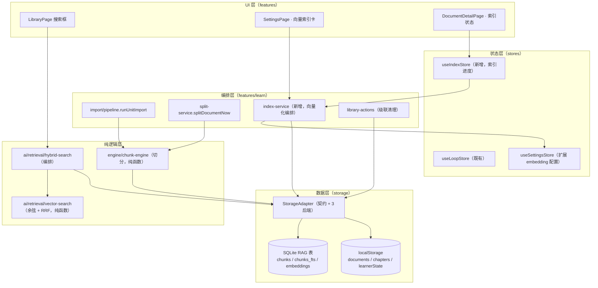
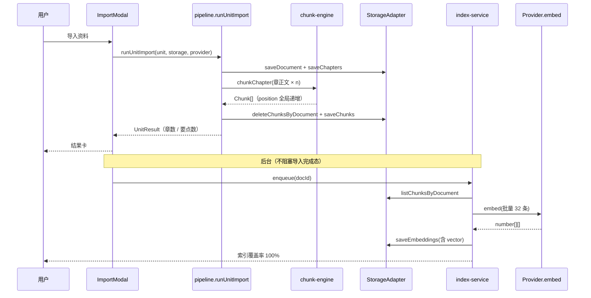

# RAG 全链路接线（切分 → Chunk → 向量 → 检索）技术方案

| 字段 | 内容 |
|------|------|
| 作者 | WorkBuddy |
| 日期 | 2026-09-10 |
| 状态 | 已确认（D1–D4 全部按推荐采纳）→ 已实施（T1–T20，见 `docs/rag-wiring-task-runbook.md`） |
| 关联需求 | 2026-09-10 链路核查结论（RAG 写入端零业务调用者）+ 本轮 4 项决策答复 |
| 前置文档 | `docs/storage-architecture-rag-2026-09.md`（存储底座方案）、`docs/storage-architecture-rag-task-runbook.md`（T1–T10 已落地）、`docs/storage-architecture-rag-fts-fix-design-2026-09.md`（F1 trigram 修复） |

---

## 0. 待确认决策点（D1–D4）

本轮已确认的 4 项（写入时机 / 层级 / chunk 策略 / 范围）不再重复；以下是**方案内部衍生**的 4 个决策点，请一并拍板：

| ID | 决策 | 推荐选项 | 备选与代价 |
|----|------|----------|-----------|
| **D1** | 向量本体存哪里 | **A. 只存 SQLite BLOB（float32 LE），浏览器预览降级为「仅 FTS」** | B. 向量也写 localStorage → 1000 chunk × 768 维 ≈ 15MB JSON，**必然击穿 5–10MB 配额**；C. 引 `sqlite-vec` 扩展 → 部署复杂度上升，且需改 Rust 依赖链 |
| **D2** | embedding 生成时机 | **A. 切分后自动入队，后台串行执行；设置页提供「重建索引」** | B. 纯手动按钮 → 用户容易忘记，检索长期空转（正是本次要修的病灶）；C. 导入时同步阻塞 → 导入 1 份 50 章的 PDF 要等几十次 API 往返 |
| **D3** | embedding 模型来源 | **A. 复用「当前使用模型」的 baseUrl / apiKey，模型名单独配置**（可指向 Ollama / Qwen / OpenAI） | B. 完全独立的第二套 provider 配置 → 配置面翻倍，收益有限 |
| **D4** | 检索消费点 | **A. 资料库搜索框（`/learn`）升级为「元信息匹配 + 内容检索」双段，融合算法用 RRF** | B. 仅接 FTS 不接向量 → 与「全链路含向量」的诉求不符；C. 新增独立检索页 → 增加一个入口，与「搜索服务于列表」的产品红线冲突 |

> 若 D1 选 A，需接受一条明确的能力边界：**纯浏览器预览下无向量检索**（改走 FTS + 内存子串匹配）。这与现状（桌面端才有 SQLite）一致，不算退化。

---

## 1. 背景

### 1.1 触发原因

2026-09-10 的链路核查（`导入 → 切分 → RAG → 进度 → 方案`）得出两个事实：

1. **RAG 存储底座已完整落地**：7 张表 / 26 个 `db_*` 命令 / 三档后端适配器 / 惰性迁移 / trigram FTS（含中文修复 F1）全部就绪，`npm run test:storage` 28/28 通过。
2. **但没有任何业务代码调用它**：全仓 `grep saveChunks|saveSections|saveEmbedding|saveKnowledgeUnits|saveRelations|fullTextSearch` 只命中 `src/storage/{memory,local,tauri,types}.ts`——即「定义 + 实现」，零消费方。

净效果：RAG 层是**建好但空转的底座**。已投入的存储工程量（含 F4 那次 IPC 契约抢修）尚未产生任何用户可感知价值。

### 1.2 现状数据流（实际生效的那条）

```
导入 → splitDocument → Chapter（localStorage）
                          ↓
             LearnerState（localStorage）→ buildChapterPlan → 章级学习计划
```

RAG 不在这条链上。`pipeline.ts:99` 的 `"link"` 阶段是空实现 `async () => {}` —— 这正是挂载点。

### 1.3 与现有模块的关系

- **不改变**现有章级闭环（掌握度 / 计划 / 测评）—— 它们是 chapters + learnerState 的函数，本方案不碰其算法；
- **新增**一条并行的 chunk 级索引链路，为检索服务；
- 遵循既有分工原则：**切分与索引构建由代码完成（确定性），向量化由 AI 完成（可重跑）**——与 `split-service`（纯代码）/ `analyze-service`（纯 AI）的解耦一致。

### 1.4 不做的影响

- RAG 层持续空转，成为纯技术债；
- F1 那次中文 FTS 修复（trigram + LIKE 兜底）永远得不到验证；
- 「检索增强」类功能（N2 图扩展 / N3 Context Builder）无地基。

---

## 2. 方案目标

| 类型 | 描述 |
|------|------|
| **主要目标** | ① 导入 / 重切分后，Chunk 自动落库（memory / local / tauri 三后端契约一致）；② 向量可生成、可重建、可增量更新（桌面端）；③ 提供 chunk 级**混合检索**（FTS + 向量，RRF 融合）；④ `/learn` 搜索框消费检索结果，形成闭环；⑤ 删除 / 替换正文时级联清理 chunk 与向量 |
| **非目标** | ① Section 三层结构（Chapter→Section→Chunk）——按本轮决策保持两层，`sections` 表本期仍留空；② KnowledgeUnit / KnowledgeRelation 抽取（属概念层 N5）；③ RAG Context Builder 与图扩展 / 重排序（N2 / N3）；④ 引入向量库依赖（sqlite-vec / LanceDB）；⑤ documents / chapters 迁入 SQLite（F3 遗留，另开任务） |
| **成功标准** | ① `npm run typecheck` 0 error；② 新增 3 个测试脚本全绿（chunk 切分 / 检索纯函数 / 端到端接线）；③ 桌面端导入一份资料后，`chunks` 表行数 > 0 且 `chunks_fts` 同步；④ `/learn` 搜索能命中正文内容（此前只能命中标题与要点）；⑤ 重切分两次后 `chunks` 行数不翻倍（幂等） |

---

## 3. 项目现状

### 3.1 相关代码与模块

| 环节 | 现状 | 证据（文件:行） |
|------|------|----------------|
| 导入 | ✅ 可用 | `features/learn/import/pipeline.ts:50` `runUnitImport` |
| 切分 | ✅ 可用，**仅产出 Chapter** | `engine/splitter-engine.ts:52` `splitDocument` |
| 手动切分 / 重切分 | ✅ 可用 | `features/learn/split-service.ts:56` `splitDocumentNow` |
| Chunk 生产 | ❌ **引擎不存在** | 契约文档称「由 semanticChunk 引擎产生」，全仓无此模块 |
| RAG 写入 | ❌ **零调用者** | `pipeline.ts:97` 只 `saveChapters`；`pipeline.ts:99` link 阶段空实现 |
| 全文检索 | ⚠️ 实现就绪、**零消费方** | `storage/tauri.ts:606` `fullTextSearch` → `db_fts_search` |
| 向量能力（AI 侧） | ❌ **契约无此能力** | `ai/types.ts:78-91` `AIProvider` 只有 `chat` + 3 个 not-implemented 方法 |
| 向量能力（桌面侧） | ❌ **不存在** | `grep -i embed` 在 `src-tauri/src` 只命中 `db` 模块，`llm` 模块无 embedding |
| 向量存储 | ❌ **无位置** | `domain/embedding.ts:15-26` 只有元数据；`schema.sql:86-88` 注释明写「不含向量本体」 |
| 级联清理 | ⚠️ 部分 | `library-actions.ts` 已级联 documents/chapters/papers，未含 chunks |

### 3.2 相关文档与约定

| 文档 / 规则 | 本方案需遵守的要点 |
|------------|-------------------|
| `docs/storage-architecture-rag-2026-09.md` | §11 把「Chunk 级检索 + Embedding 补齐」列为 P1(N1)；本方案即执行 N1，需回写该章 |
| `rules/layer-import-boundaries.mdc` | UI → stores/storage；纯逻辑不依赖 React；src ↔ src-tauri 只走 IPC |
| `rules/engineering-code-style.mdc` | 相对导入、中文注释、i18n 双语成对、`import type` |
| `rules/code-structure-and-dependencies.mdc` | 文件 ≤700 行；依赖单向 `domain → engine/ai/storage → stores → features` |
| `skills/tauri-ipc/SKILL.md` | 新命令三步齐全：属主模块实现 → `lib.rs` 注册 → 前端封装；契约单测守卫（F4 教训） |
| `docs/library-module-design-2026-09.md` | 「切分由代码，分析由 AI」的解耦原则——向量化归入 AI 侧 |

### 3.3 约束与依赖

| 约束 | 内容 | 影响 |
|------|------|------|
| localStorage 配额 | 单域约 5–10MB | 向量**不可**落 localStorage（D1 的根因） |
| FTS5 trigram | 查询词 ≥3 字符；<3 字符走 `LIKE` 兜底 | 检索层需保留现有兜底逻辑，不做改动 |
| IPC 契约 | `#[tauri::command]` 只转换顶层参数名 | 所有 `*Input` / `*Row` / `*Out` 必须 `#[serde(rename_all = "camelCase")]` |
| schema 版本 | 当前 `_schema_version` = **2**（F1 的 trigram 迁移写入） | 本方案升 **v3**（`embeddings` 加向量列） |
| AI provider | 唯一构造入口 `useSettingsStore.buildActiveProvider()` | embedding 能力亦须经此出口，不得另造入口（B2 教训） |
| 浏览器预览 | 无 SQLite、无 Keychain | 向量与 embedding 需显式守卫降级 |

---

## 4. 技术架构

### 4.1 总体架构



**关键边界**：新增的 `index-service` 是 AI 侧编排（可重跑），`chunk-engine` 是纯代码（确定性）——二者绝不互相 import，沿用 `split-service` / `analyze-service` 的既有约束。

### 4.2 模块职责

| 模块 / 层级 | 职责 | 技术选型 |
|------------|------|----------|
| `src/engine/chunk-engine.ts`（新增） | 章正文 → Chunk[]（段落聚合、硬切、position 编号） | 纯 TS 纯函数，零依赖 React / storage / AI |
| `src/ai/retrieval/vector-search.ts`（新增） | 余弦相似度 top-k | 纯函数，可 node 直跑单测 |
| `src/ai/retrieval/rrf.ts`（新增） | Reciprocal Rank Fusion 融合多路排名 | 纯函数 |
| `src/ai/retrieval/hybrid-search.ts`（新增） | 编排：FTS + 向量 → 融合 → 结果 | 依赖 `StorageAdapter`，不依赖 React |
| `src/features/learn/index-service.ts`（新增） | 向量化编排：批量、进度、幂等、可重跑 | 纯 AI 编排（**不 import chunk-engine**） |
| `src/stores/useIndexStore.ts`（新增） | 索引任务进度 / 状态（idle / running / error） | Zustand |
| `src/storage/*` | 契约扩展 + 三后端实现 | 既有适配器 |
| `src-tauri/src/db/*` | schema v3 + 2 个新命令 | sqlx + rusqlite-free（沿用 sqlx） |

### 4.3 数据模型与 API

#### 4.3.1 域类型变更

```ts
// src/domain/embedding.ts（修改）

export interface Embedding {
  id: string;
  targetType: EmbeddingTargetType;
  targetId: string;
  model: string;
  vectorDim: number;
  createdAt: number;
  /**
   * 向量本体（可选）。
   * - 老数据 / 未生成向量的记录：undefined，UI 与检索据此跳过；
   * - 仅桌面端（SQLite BLOB）与内存后端持有；localStorage 后端不持久化（配额所限）。
   */
  vector?: number[];
}

/** 检索用轻量视图（不带 id / createdAt，减少 IPC 与内存开销）。 */
export interface EmbeddingVector {
  targetId: string;
  model: string;
  dim: number;
  vector: number[];
}
```

#### 4.3.2 StorageAdapter 契约扩展（`src/storage/types.ts`）

```ts
// 新增 2 个方法（其余契约不动）

// ===== Chunk 层 =====
/** 删除整份文档的全部 chunk（含 FTS 索引与 chunk_knowledge 关联）。重切分与删除资料时调用。 */
deleteChunksByDocument(documentId: string): Promise<void>;

// ===== Embedding 层 =====
/**
 * 取回向量本体（检索用）。targetIds 传值时按目标过滤（减少传输量）。
 * 未持有向量的后端返回空数组（调用方据此降级到 FTS-only）。
 */
listEmbeddingVectors(
  targetType: EmbeddingTargetType,
  targetIds?: readonly string[],
): Promise<EmbeddingVector[]>;
```

> **为什么不是 `listEmbeddings` 直接带向量**：`listEmbeddings` 的语义是「元数据清单」（供「哪些被向量化过」的判重），带向量会让每次判重都传输 MB 级数据。两者职责分离。

#### 4.3.3 SQLite schema v3

```sql
-- src-tauri/src/db/schema.sql（修改）

-- ===== 向量化元数据 + 向量本体 =====
-- v3 起：vector 列以 float32 little-endian 的 BLOB 承载向量本体。
-- 之所以不再「只记元数据」：本方案将向量检索落在应用内（无外部向量库），
-- 且向量规模受个人学习资料体量约束（千级 chunk × 768 维 ≈ 3MB），
-- 全量载入 + 内存余弦即可满足，无需引入 sqlite-vec 等扩展。
-- 约束：vector 为 NULL 表示「元数据在、向量未生成」（老数据或生成失败）。
ALTER TABLE embeddings ADD COLUMN vector BLOB;
-- v3 的版本号由 db/mod.rs::migrate 写入（ADD COLUMN 无法写进 CREATE IF NOT EXISTS）
```

迁移（`db/mod.rs::migrate` 扩展 v2→v3）：

```rust
// 幂等：先探测列是否已存在（PRAGMA table_info），再决定 ALTER
async fn migrate_v3(conn) -> Result<()> {
    let has_vector = sqlx::query("PRAGMA table_info(embeddings)")
        .fetch_all(&mut *conn).await?
        .iter().any(|row| row.get::<String, _>("name") == "vector");
    if !has_vector {
        sqlx::query("ALTER TABLE embeddings ADD COLUMN vector BLOB").execute(&mut *conn).await?;
    }
    sqlx::query("INSERT INTO _schema_version (version, applied_at) VALUES (3, ?)")
        .bind(now_ms()).execute(&mut *conn).await?;
    Ok(())
}
```

#### 4.3.4 Rust 新增命令（2 个）

| 命令 | 入参 | 返回 | 说明 |
|------|------|------|------|
| `db_delete_chunks_by_document` | `documentId: String` | `()` | 事务内：`chunk_knowledge` → `chunks_fts` → `chunks` 按 document_id 清理 |
| `db_list_embedding_vectors` | `targetType: String, targetIds: Option<Vec<String>>` | `Vec<EmbeddingVectorOut>` | 读 BLOB 转 `Vec<f32>` 返回；按 target_ids 过滤时走 `IN` 子查询 |

`db_save_embeddings` 扩展：`EmbeddingInput` 增加 `vector: Option<Vec<f32>>`，写入时 `f32 → BLOB`（LE 字节序）。

**IPC 传输量评估**：单向量 768 维以 JSON number[] 传输约 10KB；批量写按 32 条 / 批 → 单次约 320KB。可接受。若后续规模上升到万级 chunk，再改 base64 紧凑编码（记为可选优化）。

#### 4.3.5 数据读写路径（`rules/layer-import-boundaries.mdc` 合规声明）

| 链路 | 路径 | 说明 |
|------|------|------|
| 切分落库 | `pipeline` / `split-service` → `chunk-engine`（纯函数）→ `StorageAdapter.saveChunks` | UI 不直接碰 storage 写入以外的层；引擎不 import storage |
| 向量生成 | `useIndexStore` → `index-service` → `buildActiveProvider().embed()` → `StorageAdapter.saveEmbeddings` | AI 能力只经 `useSettingsStore.buildActiveProvider()` 获取（B2 教训，不得另造入口） |
| 检索读取 | `LibraryPage` → `hybrid-search` → `StorageAdapter.fullTextSearch` + `listEmbeddingVectors` | 检索结果在纯逻辑层融合，UI 只渲染 |
| 桌面能力 | `storage/tauri.ts` 内部 `invoke("db_*")` | 沿用既有 `trySqlite()` 包装，失败静默回退父类（localStorage） |
| 非 Tauri 守卫 | `isTauri()` 已在 `storage/index.ts::detectBestBackend` 分流 | 浏览器预览 = local/memory 后端 = 无向量能力，UI 据此降级 |

### 4.4 状态与副作用

| 状态 | 归属 | 生命周期 |
|------|------|---------|
| 索引任务进度（`idle`/`running`/`done`/`error` + 已完成 / 总数） | `useIndexStore`（新增） | 会话级；不持久化（重启后据 `listEmbeddings` 派生真实状态） |
| embedding 模型配置 | `useSettingsStore.embedding`（扩展，persist） | 长期；API Key 与 `active` 同策略走 Keychain |
| 检索查询与结果 | `LibraryPage` 本地 state | 页面级；不持久化 |
| 副作用触发 | ① 切分成功 → `rebuildChunks`（同步，纯代码，快）；② 切分成功 → `enqueueEmbedding`（后台串行，AI，慢）；③ 进入设置页 → 派生索引覆盖率；④ 删除 / 替换正文 → 级联清理 | — |

**并发保护**：索引任务同一时刻只允许一个（`useIndexStore.running` 门闩），与 `LibraryPage.splitLock` 同思路（state 异步，需 ref/singleton 兜底）。

---

## 5. 交互流程

### 5.1 主流程

**A. 导入资料（含 chunk 落库）**

1. 用户在 `/learn` 点「＋ 导入」，选粘贴 / 本地文件 / GitHub；
2. `runUnitImport` 执行：`saveDocument` → `splitDocument` → （可选 AI 精修）→ `saveChapters`；
3. **新增**：`link` 阶段不再空转 —— 调用 `rebuildChunks(doc, chapters, storage)`：
   1. `deleteChunksByDocument(doc.id)`（清旧，保证幂等）
   2. 逐章 `chunkChapter(...)` 生成，position 跨章全局递增
   3. `saveChunks(all)`
4. 导入结果卡展示完成后，**后台**触发向量化入队（D2-A）：`useIndexStore.enqueue(docId)`；
5. 向量化按 32 条 / 批调用 `provider.embed()`，写回 `saveEmbeddings`；UI 在资料卡 / 详情页显示索引状态。

**B. 重新切分（幂等重建）**

1. 用户在列表页或详情页触发重切分（已有确认弹窗，掌握度迁移逻辑不动）；
2. `splitDocumentNow` 写回 chapters + 迁移掌握度后，**新增**调用 `rebuildChunks`；
3. 旧 chunk 与旧向量按 document 级联删除（向量随 chunk 一并失效，避免「新 chunk 配旧向量」）；
4. 后台重新向量化。

**C. 检索（`/learn` 搜索框）**

1. 用户输入查询词（≥2 字符，防抖 300ms）；
2. 并行两路：
   - **FTS 路**：`storage.fullTextSearch(query, scope, 20)`
   - **向量路**：`provider.embed([query])` → `listEmbeddingVectors("chunk")` → 余弦 top-20（向量不可用时此路跳过）
3. `fuseRankings([ftsIds, vecIds])` 做 RRF 融合，取前 N（默认 8）；
4. 结果按所属文档分组展示：文档标题 + 命中片段（FTS 用 snippet / 向量路用 chunk 前 120 字）；
5. 点击命中项 → 跳 `/learn/chapter/:chapterId?at=<chunk 起止>` 复用既有高亮机制。

**D. 未切分 / 无 chunk 的降级**

- `docs` 元信息匹配（标题 / 来源 / 章标题 / 要点）**始终保留**，作为第一段结果，不依赖 RAG；
- 内容检索段在「无 chunk 命中」→ 显示「未找到正文匹配」；
- 向量路不可用 → 静默只用 FTS（并在结果区标注「仅全文检索」）。

### 5.2 分支与异常流程

| 场景 | 触发条件 | 系统行为 | UI 反馈 |
|------|----------|----------|---------|
| 无正文 | `textPreview` 为空 | 切分抛 `no-body`（既有）；不产生 chunk | 既有文案 |
| 0 章 | 切不出章节 | 仅保存资料，不写 chunk（既有行为） | 既有「仅保存」 |
| chunk 写入失败 | 配额 / IPC 错误 | **向上抛**，不写半成品（与 `runUnitImport` 契约一致）；chapters 已写则保留 | 导入结果卡该项标失败并给原因 |
| 向量化失败 | provider 未配置 / 网络错误 | 捕获并记录该批失败；chunk 保持 `vector = NULL`；下次「重建索引」可补 | 索引卡显示「部分失败，可重试」 |
| provider 无 embed 能力 | builtin 本地模型 | `index-service` 前置检查 `typeof provider.embed !== "function"` → 直接拒绝并解释 | 提示「当前模型不支持向量化，请配置 API 模型或 Ollama」 |
| 向量维度变化 | 换 embedding 模型（768 → 1536） | 按 `(targetType,targetId,model)` 唯一索引并存；检索时**只取当前配置模型的向量** | 索引卡提示「模型已变更，需重建」 |
| 检索 provider 未就绪 | 未配置任何模型 | 向量路跳过 | 结果区标注「仅全文检索」 |
| 删除资料 | 用户在卡片菜单删除 | `deleteDocumentCascade` 增加 `deleteChunksByDocument` | 既有确认弹窗 |
| 替换 / 追加正文 | 详情页操作 | 正文变更 → chapters 重切 → chunk 重建 → 向量失效重算 | 既有流程 + 索引状态刷新 |

### 5.3 时序图



---

## 6. 用户用例

### UC-01：导入资料后正文可被检索

| 项 | 内容 |
|----|------|
| 角色 | 学习者 |
| 前置条件 | 桌面端已选好「当前使用模型」（支持 embeddings 的 API 或 Ollama） |
| 主流程步骤 | 1. `/learn` 点「＋ 导入」→ 粘贴一段 Markdown（含小标题与正文）<br>2. 确认导入 |
| 期望结果 | ① 资料出现在列表；② 章正常切出；③ 等索引完成后，搜索正文中的词能命中该资料并显示片段 |
| 异常/边界 | 未配模型 → 仍可导入，搜索仅走 FTS（结果区标注「仅全文检索」） |

### UC-02：重新切分不产生重复索引

| 项 | 内容 |
|----|------|
| 角色 | 学习者 |
| 前置条件 | 一份已切分且有 chunk、已向量化的资料 |
| 主流程步骤 | 1. 卡片菜单 →「重新切分」→ 确认<br>2. 等待完成<br>3. 再执行一次同样操作 |
| 期望结果 | `chunks` 行数在两次重切后保持稳定（不翻倍、不累积孤儿）；`chunks_fts` 行数与 `chunks` 一致 |
| 异常/边界 | 重切后章节 id 变化 → 掌握度按既有 `resplit-mastery` 迁移；旧向量按文档整体失效并重算 |

### UC-03：手动重建向量索引

| 项 | 内容 |
|----|------|
| 角色 | 学习者 |
| 前置条件 | 有 chunk 存在，但向量缺失 / 模型刚更换 |
| 主流程步骤 | 1. 设置页「AI 模型中心」→ 向量索引卡 → 点「重建索引」<br>2. 观察进度 |
| 期望结果 | 进度按「已完成 / 总数」推进；完成后覆盖率显示 100%；失败条目可单独重试 |
| 异常/边界 | 中途换页 / 刷新 → 任务中断，已完成的批次保留（幂等 upsert），再次点击从缺失处续算 |

### UC-04：搜索同时利用全文与语义

| 项 | 内容 |
|----|------|
| 角色 | 学习者 |
| 前置条件 | 已索引的资料若干 |
| 主流程步骤 | 1. `/learn` 搜索框输入一个**同义但非原文**的词（如原文「神经网络」，查询「深度学习模型」） |
| 期望结果 | 结果中仍能命中相关章节（向量路贡献），且排名靠前于无关资料 |
| 异常/边界 | 查询 <3 字符 → FTS 走 `LIKE` 兜底（既有）；向量路照常参与 |

### UC-05：删除资料级联清理索引

| 项 | 内容 |
|----|------|
| 角色 | 学习者 |
| 前置条件 | 一份已索引的资料 |
| 主流程步骤 | 1. 卡片菜单 →「删除」→ 确认 |
| 期望结果 | `chunks` / `chunks_fts` / `chunk_knowledge` 中该文档的行全部消失；`embeddings` 中对应 chunk 的向量亦被清理 |
| 异常/边界 | SQLite 不可用（降级 localStorage）→ 删除父类数据即可，chunk 本就不存在 |

---

## 7. 线框 UI

### 7.1 `/learn` 搜索结果区（D4-A）

```
┌──────────────────────────────────────────────────────────────┐
│  资料库                        [全部][未切分][进行中]   [＋ 导入]│
├──────────────────────────────────────────────────────────────┤
│  [最新][最早][标题]                            [🔍 搜索正文…] │
├──────────────────────────────────────────────────────────────┤
│  正文命中 3 处                                 仅全文检索 ⓘ   │  ← 检索模式标注
│  ┌────────────────────────────────────────────────────────┐  │
│  │ 深度学习导论 · 第 3 章  强化学习基础                     │  │  ← 文档 · 章
│  │ …通过奖励信号优化策略，与监督学习的目标函数不同…         │  │  ← 命中片段（≤120 字）
│  └────────────────────────────────────────────────────────┘  │
│  ┌────────────────────────────────────────────────────────┐  │
│  │ 深度学习导论 · 第 5 章  注意力机制                       │  │
│  │ …查询与键的相似度决定注意力的分配…                       │  │
│  └────────────────────────────────────────────────────────┘  │
├──────────────────────────────────────────────────────────────┤
│  资料（2）                                                     │  ← 既有元信息匹配段，保留
│  ┌──────────────────┐  ┌──────────────────┐                  │
│  │ 深度学习导论      │  │ 强化学习笔记      │                  │
│  └──────────────────┘  └──────────────────┘                  │
└──────────────────────────────────────────────────────────────┘
```

- **布局**：沿用 `PageContainer`（`max-w-5xl px-8`）；检索段在筛选条之下、既有卡片网格之上；
- **组件映射**：分组标题用 `SectionTitle` 的简化变体 / 直接 `<p class="text-xs text-ink-3">`；命中项用既有 `Card` + `text-sm text-ink-2`；结果区 `data-testid="learn-content-hits"`；
- **设计 token**：`border-line` `bg-surface` `text-ink-1/2/3` `border-primary`（focus 态），零新增 hex。

**状态变体**

| 状态 | 呈现 |
|------|------|
| 加载中 | 检索段显示 3 行骨架（`animate-pulse` + `bg-surface` 实心块，遵循禁渐变约束） |
| 命中为空 | 检索段隐藏，仅保留既有「搜索无结果」卡 |
| 向量不可用 | 右上角 `仅全文检索 ⓘ` 徽标（title 说明原因） |
| 索引未完成 | 徽标显示 `索引中 42/120`，检索仍可用（FTS 路 + 已有向量路） |

### 7.2 设置页 · 向量索引卡（D3-A）

```
┌──────────────────────────────────────────────────────────┐
│  向量索引                                                 │
├──────────────────────────────────────────────────────────┤
│  Embedding 模型    [ text-embedding-v3        ▾ ] [测试] │
│  端点              继承当前模型（dashscope.aliyuncs.com） │
│  索引覆盖率        86%  （1032 / 1200 块）                │
│  上次构建          2026-09-10 18:20                       │
│                                                          │
│  [重建索引]  [仅补齐缺失]              ⓘ 需桌面端         │
└──────────────────────────────────────────────────────────┘
```

- 复用既有设置页卡样式（`Card` + 分组标题），与「API 模型」Tab 并列；
- 模型名用既有 `select` UI Kit 组件；`data-testid="embedding-model-select"` / `index-rebuild`；
- **不新增页面**，作为「AI 模型中心」下的一个卡片区块。

### 7.3 资料卡 / 详情页 · 索引状态（轻量）

```
┌────────────────────────────┐
│ 深度学习导论         [⋯]   │
│ 142 章 · 1200 块 · 索引 100%│   ← 既有统计行追加「块数 · 索引覆盖率」
│ 掌握 37%                    │
└────────────────────────────┘
```

### 7.4 交互说明

- 搜索框：`debounce 300ms`；`Enter` 立即触发；`Esc` 清空；
- 命中项：整行可点（`<button>` 或 `<Link>`，**不得**在 `<a>` 内嵌 `<button>`——见 v2 方案的同类坑）；
- 键盘可达：命中项可 Tab 聚焦，focus 态 `border-primary`；
- 索引卡按钮在非 Tauri 环境 **禁用** 并给 title 说明（`isTauri()` 守卫）。

---

## 8. 涉及文件及改动伪代码

> 共 21 个文件（新增 10 / 修改 11）。

### 8.1 `src/engine/chunk-engine.ts`（新增）· 核心

```ts
// 纯函数：章正文 → Chunk[]。零依赖 React / storage / AI。
// 依赖方向：使用 domain/chunk 的 estimateTokenCount（纯函数），不反向依赖。

export interface ChunkChapterInput {
  documentId: string;
  chapterId: string;
  /** 章标题（写入 chunk.metadata.heading，供检索结果展示上下文）。 */
  chapterTitle: string;
  /** 章正文（调用方用 doc.textPreview.slice(contentRef.start, contentRef.end) 取出）。 */
  text: string;
  /** 位置起始值（跨章全局递增，由调用方维护）。 */
  startPosition: number;
}

export interface ChunkOptions {
  /** 段落聚合目标 token 数（默认 400）。 */
  targetTokens?: number;
  /** 单块硬上限 token（默认 512）。 */
  hardMaxTokens?: number;
}

/** 切一章为若干 Chunk（确定性纯函数；同输入恒同输出）。 */
export function chunkChapter(input: ChunkChapterInput, options?: ChunkOptions): Chunk[] {
  // 1. 按空行切段落（复用与 splitter 一致的「连续 ≥2 换行」语义）
  // 2. 逐段累计 tokenCount；达到 targetTokens 即 flush
  // 3. 单段 > hardMaxTokens → 在句末标点（。！？.!?\n）处二次切分；
  //    找不到标点则按 hardMax 硬截断（不丢字符）
  // 4. 每块生成：id = newId("chk")、position = startPosition++、
  //    tokenCount = estimateTokenCount(content)、knowledgeIds = []、
  //    metadata = { heading: chapterTitle }
  // 5. 空段落 / 纯空白块直接跳过（不产出空 chunk）
  // 6. createdAt 由 options.now 注入（默认 Date.now()），便于测试断言
}

/** 一份文档的全部章 → 全量 Chunk[]（position 全局连续）。 */
export function chunkDocument(
  doc: Pick<SourceDocument, "id" | "textPreview">,
  chapters: readonly Chapter[],
  options?: ChunkOptions,
): Chunk[];

/** 从文档正文中截出某章正文（越界夹取，与 chapter-preview 同策略）。 */
export function chapterBodyOf(
  doc: Pick<SourceDocument, "textPreview">,
  chapter: Pick<Chapter, "contentRef">,
): string;
```

### 8.2 `src/features/learn/index-chunks.ts`（新增）· 接线服务

```ts
// 切分产物 → RAG 写入（纯代码，零 AI）。pipeline 与 split-service 共用。

/** 重建一份文档的全部 chunk（先删后写，幂等）。 */
export async function rebuildChunks(
  doc: SourceDocument,
  chapters: readonly Chapter[],
  storage: StorageAdapter,
): Promise<{ chunks: number }> {
  await storage.deleteChunksByDocument(doc.id);
  const chunks = chunkDocument(doc, chapters);
  if (chunks.length > 0) await storage.saveChunks(chunks);
  // 向量随旧 chunk 一起失效：按文档清理，避免「新 chunk 配旧向量」
  const stale = await storage.listChunksByDocument(doc.id); // 已重建，故此处仅清 embeddings
  for (const c of stale) await storage.deleteEmbeddingsByTarget(c.id);
  return { chunks: chunks.length };
}
```

> 注：`deleteEmbeddingsByTarget` 现按 `target_id` 删除（不区分 target_type），已在契约中，无需新增。

### 8.3 `src/features/learn/import/pipeline.ts`（修改）

```ts
// link 阶段：由空实现改为 chunk 落库
await phase("link", async () => {
  await rebuildChunks(doc, chapters, storage);
});
```

### 8.4 `src/features/learn/split-service.ts`（修改）

```ts
// saveChapters 之后追加重建（掌握度迁移逻辑完全不动）
await storage.saveChapters(doc.id, heuristic.chapters);
if (remapped.carried > 0) await storage.saveLearnerState(remapped.state);
await rebuildChunks({ ...doc, textPreview: text }, heuristic.chapters, storage);
```

### 8.5 `src/features/learn/library-actions.ts`（修改）

```ts
// deleteDocumentCascade 增加 chunk 清理（顺序：chunk → 章 → 文档）
await storage.deleteChunksByDocument(docId);
// previewDeleteCascade 的计数增加 chunks 项，供确认弹窗展示
```

### 8.6 `src/ai/types.ts`（修改）

```ts
export interface AIProvider {
  readonly kind: ProviderKind;
  isConfigured(): boolean;
  chat(input: ChatInput): Promise<ChatOutput>;
  /**
   * 文本向量化（可选能力）。
   * - 支持 embeddings 的 HTTP provider 实现之；
   * - builtin 本地模型与 NoActiveProvider 不实现（undefined）；
   * - 调用方（index-service / hybrid-search）必须先做
   *   `typeof provider.embed === "function"` 检查再调用。
   */
  embed?(texts: readonly string[]): Promise<number[][]>;
  // …其余既有方法不变
}
```

### 8.7 `src/ai/openai-compatible.ts`（修改）

```ts
// POST {baseUrl}/embeddings
async embed(texts: readonly string[]): Promise<number[][]> {
  if (!this.isConfigured()) throw new AiProviderError("not-configured", /* … */);
  const res = await fetch(`${this.baseUrl}/embeddings`, {
    method: "POST",
    headers, // 复用 chat 的 headers 构造
    body: JSON.stringify({ model: this.embeddingModel, input: texts }),
  });
  // 校验：data.data[] 按 index 升序还原；长度 !== texts.length → 视为失败
  // 任一向量维度不一致 → 抛 AiProviderError("request-failed")
}
```

`ProviderConfig` 增加可选 `embeddingModel?: string`；`defaultModelOf` 不负责 embedding 默认值（由设置层给）。

### 8.8 `src/ai/builtin.ts`（修改）

```ts
// 显式不实现 embed：Rust 侧 llm 模块当前只有 llm_generate（无 embedding 能力）。
// 不抛错、不占位——保持 undefined，让调用方的能力检查自然降级。
// （若未来 llama-helper 支持 embedding，再补 llm_embed 命令 + 此方法。）
```

### 8.9 `src/ai/retrieval/vector-search.ts`（新增）· 纯函数

```ts
/** 余弦相似度（零向量返回 0，避免 NaN 污染排序）。 */
export function cosineSimilarity(a: readonly number[], b: readonly number[]): number;

export interface VectorHit { targetId: string; score: number; }

/** 按余弦相似度取 top-k（dim 不一致的候选直接跳过并计数）。 */
export function cosineTopK(
  query: readonly number[],
  candidates: readonly EmbeddingVector[],
  k: number,
): { hits: VectorHit[]; skipped: number };
```

### 8.10 `src/ai/retrieval/rrf.ts`（新增）· 纯函数

```ts
/** Reciprocal Rank Fusion：score = Σ 1/(k + rank)，k 默认 60。 */
export function fuseRankings(
  rankings: readonly (readonly string[])[],
  options?: { k?: number; limit?: number },
): string[];
```

### 8.11 `src/ai/retrieval/hybrid-search.ts`（新增）

```ts
export interface SearchHit {
  chunk: Chunk;
  docTitle: string;
  chapterTitle: string;
  /** 该 chunk 是否来自向量路（UI 可标注「语义命中」）。 */
  semantic: boolean;
}

export interface HybridSearchOptions {
  storage: StorageAdapter;
  provider?: AIProvider;      // 无 / 不支持 embed → 仅 FTS
  scope?: RetrievalScope;
  limit?: number;             // 默认 8
}

/** FTS + 向量双路检索 → RRF 融合 → 补全展示信息。 */
export async function hybridSearch(
  query: string,
  opts: HybridSearchOptions,
): Promise<{ hits: SearchHit[]; mode: "hybrid" | "fulltext" }>;
```

### 8.12 `src/features/learn/index-service.ts`（新增）· 纯 AI 编排

```ts
// 与 split-service 的约束对称：本模块绝不 import chunk-engine（切分归代码）。
export interface IndexProgress {
  total: number;
  done: number;
  failed: number;
}

export interface IndexRunOptions {
  storage: StorageAdapter;
  provider: AIProvider;
  /** 批量大小（默认 32，受 provider 单次上限约束）。 */
  batchSize?: number;
  /** 仅补齐缺失向量的 chunk（默认 false = 全量重建）。 */
  onlyMissing?: boolean;
  onProgress?: (p: IndexProgress) => void;
  signal?: AbortSignal;
}

/** 为全部（或缺失的）chunk 生成向量并写回。幂等：同一 (target,model) upsert。 */
export async function buildIndex(opts: IndexRunOptions): Promise<IndexProgress>;
```

### 8.13 `src/stores/useIndexStore.ts`（新增）

```ts
interface IndexState {
  running: boolean;
  progress: IndexProgress;
  error: string | undefined;
  /** 派生：当前模型的向量覆盖率（供设置页 / 资料卡展示）。 */
  coverage: { total: number; indexed: number };
  refreshCoverage: () => Promise<void>;
  rebuild: (opts?: { onlyMissing?: boolean }) => Promise<void>;
}
```

### 8.14 `src/stores/useSettingsStore.ts`（修改）

```ts
export interface SavedSettings {
  active: SavedActive;
  /** 向量化模型配置（D3-A：端点/Key 继承 active，模型名单独配置）。 */
  embedding?: { model: string } | null;
  // …既有字段不变
}
// partialize / merge 同步扩展；新增 setEmbeddingModel(model: string): void
```

### 8.15–8.21 其余文件

| 文件 | 改动类型 | 说明 |
|------|----------|------|
| `src/storage/types.ts` | 修改 | +`deleteChunksByDocument` +`listEmbeddingVectors`（§4.3.2） |
| `src/storage/memory.ts` | 修改 | 两方法实现；内存持有完整向量（测试可覆盖向量检索） |
| `src/storage/local.ts` | 修改 | 两方法实现；**向量不持久化**（仅内存态，配额所限），`listEmbeddingVectors` 返回内存中已有向量 |
| `src/storage/tauri.ts` | 修改 | 两方法走新命令 + `trySqlite` 降级；嵌入 DTO 的 `vector` 编解码 |
| `src-tauri/src/db/schema.sql` | 修改 | `embeddings` 加 `vector BLOB`（v3） |
| `src-tauri/src/db/mod.rs` | 修改 | `migrate` 增加 v2→v3（PRAGMA 探测 + ALTER） |
| `src-tauri/src/db/models.rs` | 修改 | `EmbeddingInput` +`vector`；新增 `EmbeddingVectorOut` + 契约单测 |
| `src-tauri/src/db/commands.rs` | 修改 | `db_delete_chunks_by_document`、`db_list_embedding_vectors`、`db_save_embeddings` 扩展 |
| `src-tauri/src/lib.rs` | 修改 | 注册 2 个新命令 |
| `src/features/learn/LibraryPage.tsx` | 修改 | 检索段（debounce + 命中渲染 + 降级徽标） |
| `src/features/settings/AIModelsSection.tsx` | 修改 | 向量索引卡（模型选择 / 覆盖率 / 重建按钮） |
| `src/i18n/messages/{zh,en}.ts` | 修改 | 新增 `learn.search.*` / `settings.embedding.*` 双语 key（成对） |
| `docs/storage-architecture-rag-2026-09.md` | 修改 | §11 标注 N1 已实施 |

**新增 UI 文案 key（成对）**

```
learn.search.contentHits(n)      正文命中 n 处
learn.search.fulltextOnly        仅全文检索
learn.search.indexing(done,total)索引中 done/total
learn.search.semanticTag         语义命中
learn.search.noContentHit        未找到正文匹配
settings.embedding.title         向量索引
settings.embedding.model         Embedding 模型
settings.embedding.coverage      索引覆盖率
settings.embedding.rebuild       重建索引
settings.embedding.onlyMissing   仅补齐缺失
settings.embedding.desktopOnly   需桌面端可用
settings.embedding.notSupported  当前模型不支持向量化
```

---

## 9. 任务清单

| ID | 任务 | 依赖 | 复杂度 |
|----|------|------|--------|
| T1 | schema.sql v3：`embeddings` 加 `vector BLOB` | — | S |
| T2 | `db/mod.rs` migrate v2→v3（PRAGMA 探测 + ALTER，幂等） | T1 | S |
| T3 | Rust：`EmbeddingInput.vector` + `EmbeddingVectorOut` + 契约单测 | T1 | M |
| T4 | Rust：`db_delete_chunks_by_document`（事务清理 3 表） | — | M |
| T5 | Rust：`db_list_embedding_vectors`（BLOB→Vec&lt;f32&gt;，按 targetIds 过滤） | T3 | M |
| T6 | `db_save_embeddings` 扩展写入 vector；`lib.rs` 注册 2 命令 | T3 T4 T5 | M |
| T7 | 域类型：`Embedding.vector?` + `EmbeddingVector` | — | S |
| T8 | 契约扩展：`deleteChunksByDocument` + `listEmbeddingVectors` | T7 | S |
| T9 | memory 后端实现（含向量持有） | T8 | S |
| T10 | local 后端实现（向量内存态，不持久化 + 注释说明） | T8 | S |
| T11 | tauri 后端实现（DTO 编解码 + 降级） | T6 T8 | M |
| T12 | `chunk-engine.ts`（段落聚合 / 硬切 / 全局 position） | T7 | L |
| T13 | `index-chunks.ts` + pipeline link 阶段 + split-service 接线 | T9 T12 | M |
| T14 | `library-actions` 级联清理 + 预览计数 | T8 | S |
| T15 | `AIProvider.embed?` + openai-compatible `/embeddings` + builtin 不实现 | — | M |
| T16 | `useSettingsStore.embedding` + 设置页向量索引卡 | T15 | M |
| T17 | `ai/retrieval/{vector-search,rrf,hybrid-search}.ts` | T8 T15 | L |
| T18 | `index-service.ts` + `useIndexStore`（批量 / 进度 / 幂等 / 可续算） | T15 T8 | L |
| T19 | `LibraryPage` 检索段 + i18n 双语 + 降级徽标 | T17 | L |
| T20 | 单测 3 件套 + `typecheck` + 文档回写（含 §11 校准） | 全部 | M |

---

## 10. 实施步骤

按 5 批推进，每批结束跑一次门禁（`typecheck` + 相关 `test:*`）。

1. **批次一 · 存储层打通（T1–T8）**
   - 输入：现有 schema v2 / 契约
   - 产出：schema v3 + 2 个新命令 + 域类型 + 契约扩展
   - 验证：`cargo test db::models`（含新契约单测）、`npm run typecheck`
2. **批次二 · 三后端实现（T9–T11）**
   - 验证：`npm run test:storage`（扩展后应含新方法断言）
   - 风险点：tauri 后端的 `vector` 编解码需与 Rust `Vec<f32>` ↔ `Vec<number>` 双向对齐
3. **批次三 · chunk 生产与接线（T12–T14）**
   - 验证：`npm run test:chunk`（新）+ 端到端 `test:rag`
   - **这是「跑通」的关键批次**：完成后 `chunks` 表首次有数据
4. **批次四 · 向量能力（T15–T18）**
   - 验证：`npm run test:retrieval`（余弦 / RRF 纯函数）+ 手工：配好 API 模型后跑「重建索引」
   - 风险点：provider 无 embed、模型名未配 —— 均需显式降级路径
5. **批次五 · 检索消费与收尾（T19–T20）**
   - 验证：手工走查 UC-01/02/04；`typecheck` 0 error；文档回写

**回滚策略**：每批独立可回滚——
- 批次一：schema 变更幂等（`ALTER` 前 PRAGMA 探测），回滚只需删列或留空列（不影响旧功能）；
- 批次三：`rebuildChunks` 若出问题，把 `link` 阶段还原为空实现即可（RAG 数据成为无用数据，不影响章级闭环）；
- 批次四 / 五：向量不可用时检索自动降级 FTS，UI 无破坏性变更。

---

## 11. 测试方案

### 11.1 测试范围与策略

| 层级 | 工具 / 方式 | 覆盖重点 | 不负责 |
|------|------------|----------|--------|
| 单元 | `tests/*.test.ts`（node 直跑 `--experimental-strip-types`） | chunk 切分纯函数、余弦 / RRF 纯函数、storage 新方法、Rust DTO 契约 | 真实 API 调用 |
| 集成 | `tests/rag-wiring.test.ts`（memory 后端注入） | 导入 → chunk 落库 → FTS 检索命中；重切幂等 | 真实 SQLite |
| E2E | **不做**（`rules/no-headless-browser-validation`） | — | — |
| 手工 | 桌面端 `npm run tauri dev` | 真机 SQLite 落库、向量生成、搜索体验 | — |

### 11.2 测试环境与数据

- 纯逻辑测试用 `tests/register-loader.mjs` 既有加载器，零新依赖；
- 向量测试用**手工构造的确定性向量**（如 `[1,0,0]` / `[0.6,0.8,0]`），不 mock 网络；
- provider mock：`{ kind: "custom", isConfigured: () => true, chat: …, embed: async (t) => t.map(fakeVector) }`；
- 命令示例：`npm run test:chunk`、`npm run test:retrieval`、`npm run test:rag`（新增 3 个脚本）。

### 11.3 通过标准

- `npm run typecheck` 0 error；
- `test:storage` / `test:chunk` / `test:retrieval` / `test:rag` 全绿；
- `cargo test db::models` 全绿（含新契约守卫）；
- 桌面端手工走查 UC-01/02/04 通过。

---

## 12. 测试用例

| ID | 关联 UC | 步骤 | 输入/操作 | 期望结果 | 类型 |
|----|---------|------|-----------|----------|------|
| TC-UC01-01 | UC-01 | 1. `runUnitImport` 走 memory 后端 | 含 3 章的 Markdown | `listChunksByDocument` 返回 >0 且 position 全局连续 | 集成 |
| TC-UC01-02 | UC-01 | 1. 同上 2. `fullTextSearch("正文关键词")` | — | 命中对应 chunk | 集成 |
| TC-UC02-01 | UC-02 | 1. `rebuildChunks` 两次 | 同一 doc | 第二次后 `chunks` 数量与第一次相同 | 单元 |
| TC-UC02-02 | UC-02 | 1. 重切后检查旧向量 | — | 旧 chunk 的 embeddings 已被清理 | 集成 |
| TC-UC03-01 | UC-03 | 1. `buildIndex({onlyMissing:true})` | 已有 3/5 向量 | 仅补齐 2 条，已完成不重算 | 单元 |
| TC-UC03-02 | UC-03 | 1. embed 对第 2 批抛错 | mock provider | 结果为 `{failed: n}`，其余批仍写入 | 单元 |
| TC-UC04-01 | UC-04 | 1. `cosineTopK` 定序 | 已知向量集 | 排序符合手算余弦 | 单元 |
| TC-UC04-02 | UC-04 | 1. `fuseRankings([[a,b],[b,a]])` | — | b 升至首位（两路都靠前） | 单元 |
| TC-UC04-03 | UC-04 | 1. provider 无 `embed` | — | `mode === "fulltext"`，不抛错 | 集成 |
| TC-UC05-01 | UC-05 | 1. `deleteDocumentCascade` | 已索引资料 | chunks / fts / embeddings 三处均无残留 | 集成 |

### 12.1 边界与回归

| ID | 场景 | 期望 |
|----|------|------|
| TC-EDGE-01 | 章正文为空串 | 不产出 chunk，不抛错 |
| TC-EDGE-02 | 单段 > hardMaxTokens 且无标点 | 硬截断，字符不丢失（拼接后 == 原文） |
| TC-EDGE-03 | `contentRef` 越界（正文被替换后变短） | 夹取（与 `chapter-preview` 同策略），不抛错 |
| TC-EDGE-04 | 查询 <3 字符 | 走既有 `LIKE` 兜底，不走 trigram MATCH |
| TC-EDGE-05 | 向量维度与配置不一致 | 该候选跳过并计数，排序不崩 |
| TC-EDGE-06 | 零向量 / 全零向量 | 相似度 0，不产生 NaN |
| TC-EDGE-07 | local 后端（浏览器预览） | `listEmbeddingVectors` 返回内存向量；检索降级 FTS，UI 标注 |
| TC-EDGE-08 | schema v2 存量库启动 | migrate 到 v3，`embeddings` 行数与向量均为空，无报错 |
| TC-EDGE-09 | `rebuildChunks` 中途失败 | 向上抛，不写半成品（与 `runUnitImport` 契约一致） |
| TC-EDGE-10 | 静态边界：`index-service` 不 import `chunk-engine`；`chunk-engine` 不 import storage / ai | grep 断言 |
| TC-EDGE-11 | 索引任务重入 | 第二次调用被门闩拒绝，不并发写 |

---

## 变更记录

| 日期 | 变更 | 作者 |
|------|------|------|
| 2026-09-10 | 初稿：基于链路核查结论 + 4 项决策答复，输出 12 章方案（含 D1–D4 待确认决策点） | WorkBuddy |
| 2026-09-10 | 用户确认「直接采纳推荐」；实施完成并记录 4 处偏差（schema 迁移位置、rebuildChunks 清理顺序、索引编排归属层、Embedding 模型名控件），详见 runbook | WorkBuddy |
