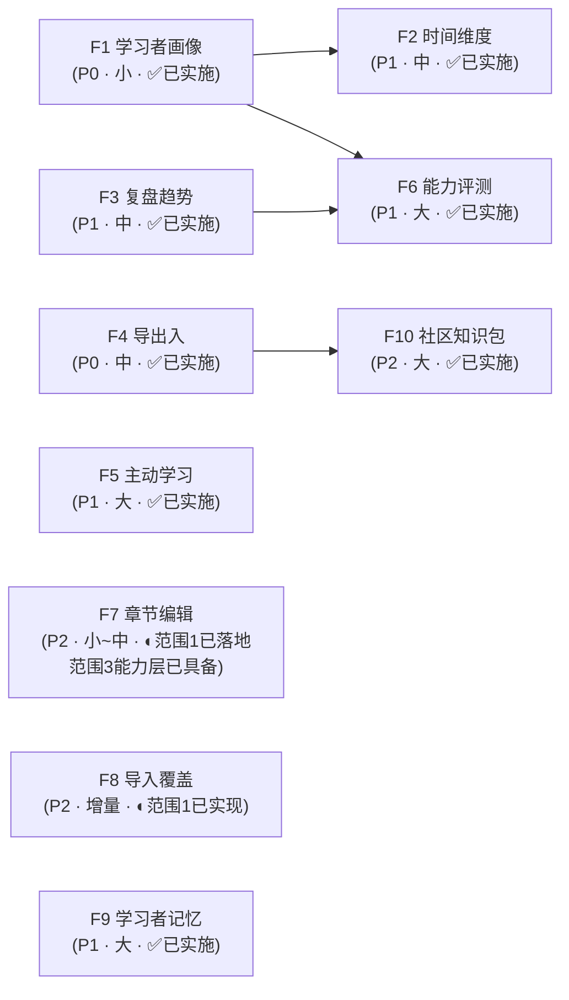

# Personal Learning OS · 下一步大 Feature 规划

> 版本：v1.0 · 2026-09-14（**聚合视图 2026-09-21 按实测回扫**，见 §变更记录） · 基准：`main@2a568dc`
> 依据：`docs/business-flow-end-to-end-2026-09.md`（端到端流程梳理）+ 本轮代码复核
> 口径：**只列产品级重大能力**，不含零散 task；每条给出「现状证据 → 范围 → 依赖 → Done 标准 → 规模」

---

## 零、结论先行

### 三条判断

**1. 主链路已经没有大洞了。** S1–S7（导入 → 切分 → 章节学 → 章节测 → 整本测 → 判卷报告 → 复习调度）全部闭环且数据真实回写。`Provider 装配` 与 `证据流 EvidenceEntry` 这两项在旧评审文档里标为缺口的能力，**实际已落地**（见 §1）。所以接下来的工作不是"补洞"，而是**加深与兑现**。

**2. 评测侧扎实，学习侧很薄。** 产品叫「自我学习**评测**」，但两半的成熟度严重不对称：

| | 现状 | 成熟度 |
|---|---|---|
| **评测** | 4 种卷型出卷 → 客观本地判 + 主观 AI 批改 → 逐章掌握度 → 遗忘衰减 → 间隔重复 → 报告 | ⭐⭐⭐⭐ 可对外演示 |
| **学习** | ~~只有：读原文 + 看 AI 要点卡 + 概念图谱~~ → 读原文 + AI 要点卡 + 概念图谱 + **章内提问 / 划线笔记 / 费曼复述 / 自测卡** | ~~⭐⭐ 被动接收为主~~ → **⭐⭐⭐ 主动工具齐备** |

~~用户在整个"学习"环节**没有任何主动加工动作** —— 不能划线、不能记笔记、不能提问、不能复述。这是当前最大的产品空白，而不是评测。~~

> ⚠️ **上句已过时（2026-09-21 实测）**：五项主动加工在 2026-09-14～09-16 陆续落地并在章级阅读页接线
> （右栏第 3/4/6 区 + 左栏第 7 区「我的划线」，`ChapterReaderPage.tsx:383/512`），
> 「不能划线、不能记笔记、不能提问、不能复述」**四项逐条不成立**
> （`SelectionToolbar.tsx` · `ChapterAnnotationsPanel.tsx` · `chapter-qa-service.ts` · `restatement-service.ts` · `flashcard-service.ts`）。
> 保留原文是为了留下「为什么当时把 F5 排在 F1 之后、F6 之前」的判断依据。
> 学习侧现在的真实短板不是「不能动手」，而是**缺可复用的跨章组织方式**。
>
> ⚠️ **2026-09-22 实测精确化**：原句作「缺跨章的组织方式（F7 范围 2–4 的跨文档组合 / 学习路径）」，
> 易被读成「完全不能跨文档组织」—— **实测不成立**：`requiredChapterIds` 自 V2 起就是
> 「**跨文档章节集合**」（`learning-system-v2-design-2026-09.md:191`），圈选按资料分组渲染
> （`GoalFormPage`）、载入侧读全库（`loadChapterRows` 注释自称「跨文档章行」）、`scopeOf` 按范围裁剪
> —— **弱义的组织方式早已具备**（README `[x] 六类学习目标 + 章节圈定` 记的就是这一层）。
> 真正缺的是**独立于目标的「学习单元 / 学习路径」实体**（可命名、可复用于多目标），
> 即 `chapter-edit-design-2026-09.md §2.2` 归为 **F7-c「涉及新的领域对象」** 的那一项。

**3. 扩展流程「两头实、中间虚」—— 两个洞都已收口，过度承诺也已兑现。** E1 目标、E3 计划、E5 就绪度已接线；曾经的「**E2-b 画像输入**」洞已由 F1 补上（2026-09-14），「**E4 AI 评测**」洞已由 F6 补上（**2026-09-15**，见 `docs/goal-capability-assessment-design-2026-09.md`）。README 产品原则 #1 承诺的「随时导出离开」原本**在代码里并不存在** —— 该过度承诺已由 F4 兑现（**2026-09-17**，见 `docs/data-portability-export-import-design-2026-09.md`）。

### 八个候选，分三档

| 档 | Feature | 一句话 | 规模 |
|---|---|---|---|
| **P0** ✅ | F1 学习者画像 | 让系统知道"你是谁、有多少时间"，而不只是"你掌握度多少"（**已实施 2026-09-14**） | 小 |
| **P0** ✅ | F4 学习资产可携带 | 兑现"数据属于你"的承诺（导出 / 恢复）（**已实施 2026-09-17**，见 `docs/data-portability-export-import-design-2026-09.md`） | 中 |
| **P1** ✅ | F3 学习复盘与趋势 | 把已经记下来的证据流变成可看的成长轨迹（**已实施 2026-09-16**，见 `docs/progress-analytics-design-2026-09.md`） | 中 |
| **P1** ✅ | F2 计划的时间维度 | 把"学习队列"变成"学习计划"，能回答"今天要做多少"（**已实施 2026-09-15**，见 `docs/plan-time-dimension-design-2026-09.md`） | 中 |
| **P1** ✅ | F5 主动学习工具 | 补上"学习"这一半：提问、笔记、复述、自测卡（~~仅笔记未做~~ → **四项全落地 2026-09-14～09-16**；D1-C/D5-C 两处可见性仍为后续候选） | 大 |
| **P1** ✅ | F6 目标级能力评测 | 回答"我够格了吗"，而不只是"这章学会了吗"（**已实施 2026-09-15**，见 `docs/goal-capability-assessment-design-2026-09.md`） | 大 |
| **P2** ◐ | F7 资料结构可编辑 | 把切分控制权交给用户 + 跨文档组学习路径（**范围 1 已落地 2026-09-14**；拆分 / 前置人工调整 / **独立学习单元实体（F7-c）** 待做 —— 跨文档**圈选**自 V2 起已具备，见 §F7 范围 3 实测注） | 小~中 |
| **P2** ◐ | F8 导入覆盖面 | OCR / DOCX / EPUB / URL，降低第一分钟摩擦（**0 字符检测已实现 2026-09-21**；其余四项待做） | 增量 |

> **后补登记（不在最初的八个候选里）**：**F9 学习者记忆**（2026-09-18）· **F10 社区知识包**（2026-09-21）
> —— 二者都是后续实践暴露出来的：F9 来自「画像只在导入时填一次、越用越不准」；F10 来自 README 里一条
> **从未进入规划**的 `P2` 待办（该能力写在 README 却在本文与 F4 方案里都被排除）。见 §二 对应小节。

### 建议推进顺序

```text
F1 画像 ✅  →  F7 章节编辑 ◐ 范围 1 已落地（2026-09-14）  →  F4 导出 ✅（2026-09-17）  →  F3 复盘 ✅
                                                          ↓
                              F2 时间维度 ✅（2026-09-15）  →  F5 主动学习 ✅（2026-09-14~16）  →  F6 能力评测 ✅（2026-09-15）
                                                          ↓
                                                     F8 导入 ◐ 范围 1 已实现（可随时插入）
```

理由：F1 最小且是 F2/F6 的前置；~~F7 引擎原语已写好，是性价比最高的"快赢"~~（2026-09-21 实测：**F7 范围 1 已于 2026-09-14 落地**）；F4 是承诺兑现，晚做一天就多欠一天（**已兑现 2026-09-17**）；F3 数据已经在库里，只缺展示层（**已实施 2026-09-16**）。

---

## 一、先排除：这些**不用再做**

避免重复建设。以下能力经代码复核**已完成且真实接线**，旧文档若仍标为缺口，以本节为准：

| 能力 | 证据 | 旧文档误判 |
|---|---|---|
| **AI Provider 装配** | `stores/useSettingsStore.ts::buildActiveProvider()`，真实消费点 ~~6 处~~ → **17 个文件**（2026-09-21 实测）：`ChapterGraphPage` · `QuizGradingPage` · `paper-flow.ts` · `QuizReportPage` · `NewQuizPage` · `ImportModal` · `SplitTab` · `OverviewTab` · `KnowledgeTab` · `auto-enrich.ts` · `capability-service.ts` · `CapabilityPage` · `chapter-qa-service.ts` · `restatement-service.ts` · `ResumeImportDialog` · `MemoryAiDialog` · `MemoryPage` | 曾标为"零调用方" |
| **证据流（append-only）** | `domain/evidence.ts::EvidenceEntry` + `StorageAdapter.appendEvidence/appendEvidenceUnless/listEvidence/listEvidenceBySubject`；写入 ~~3 处~~ → **7 处**（`QuizReportPage`（assessment，走原子方法）· `ChapterReaderPage` · `ReviewSession` · `restatement-service` · `flashcard-service` · `capability-service` · `import-service`）；读取 ~~2 处~~ → **5 处**（`GoalDetailPage` · `HomePage` · `ProgressPage` · `memory-signals.ts` · `SettingsPage`） | 曾建议"补事件流" |
| **混合检索** | `ai/retrieval/hybrid-search.ts::hybridSearch`（FTS5 + 向量 + RRF），消费点 ~~2 处~~ → **3 处**：`LibraryPage:131` · `CommandPalette:123` · `chapter-context.ts:71,89`（章内上下文，供章内提问用） | — |
| **掌握度 + 遗忘 + 间隔重复** | `learner-model.ts`：平滑 `0.65/0.35`、衰减半衰期 30 天、`nextReviewAt` 到期入队 | 曾标为"断链" |
| **概念层落 SQLite** | `storage/tauri.ts::saveChunks/saveEmbeddings` + `KnowledgeUnit`/`KnowledgeRelation` 表 | — |
| **4 种卷型 + 难度自适应** | `quiz-engine.ts:175 createPaper`，band 三档 | — |

---

## 二、Feature 清单

### F1 · 学习者画像（Learner Profile）　`P0 · 小`　✅ **已实施（2026-09-14）**

> **状态**：✅ 已完成。落地记录见 `docs/learner-profile-design-2026-09.md`（§14 实施结果）+ `docs/learner-profile-task-runbook-2026-09.md`。
> 实际交付含**简历导入**（PDF / 粘贴 → `background` + 水平建议，发送前 `maskPii` 本机脱敏、原文不落库），超出本节原「手填表单」范围。
> 三处消费点全部接线：出卷难度先验 · 计划/目标「预计完成日」（并消费 `deadlineAt`，消解其零消费点债）· AI 出题与章内提问上下文块。

**一句话**：让系统知道"你是谁、每周有多少时间、偏好怎么学"，而不只知道"你掌握度多少"。

**现状证据**

- `domain/learner.ts:18-46` —— `LearnerState` 只有 `byUnit[unitId]` 掌握度，**无任何画像字段**
- `features/learner/LearnerPage.tsx:32-63` —— 纯只读视图，页头注释自述"纯视图画像"
- `engine/quiz-engine.ts:36 bandOfMastery` —— 出卷难度**只看 mastery**，新用户无历史时无从判断
- `features/plan/chapter-action.ts:102-116 estimateEtaMin` —— 硬编码 `clamp(字符/350, 5, 40)`，不知道用户每周能投多少时间

**范围**

1. `domain/learner.ts` 新增 `LearnerProfile`：
   ```ts
   interface LearnerProfile {
     level: "beginner" | "basic" | "intermediate" | "advanced"
     weeklyMinutes: number              // 每周可投入
     preferences: {
       depth: "breadth" | "depth"       // 广撒网 vs 死磕
       style: "reading" | "practice" | "quiz"
     }
     background?: string                // 自由文本，供 AI 出题时作上下文
     updatedAt: number
   }
   ```
2. `StorageAdapter` 增加 `getProfile/saveProfile`（三后端同步实现）
3. `LearnerPage` 由只读升级为「只读摘要 + 编辑表单」
4. **三个消费点**（缺一不可，否则又是一个"填了没用"的字段）：
   - **出卷难度**：`bandOfMastery` 增加 profile 兜底 —— 无 mastery 历史时按 `level` 定 band
   - **计划 ETA**：`estimateEtaMin` 引入 `weeklyMinutes`，产出"预计完成日期"而非只有分钟数
   - **排序权重**：`preferences.depth` 调整同类内排序（breadth 优先推进新章，depth 优先补弱章）

**依赖**：无（可独立开工）　**被依赖**：F2、F6

**Done 标准**

- 填写画像后，**出卷难度、计划 ETA、目标预计完成日**三处行为都随画像变化
- `npm run typecheck` 0 error；新增单测覆盖 `level → band` 映射与 ETA 公式
- 画像持久化在三个后端均生效（桌面重启后仍在）

---

### F4 · 学习资产可携带（Export / Import / Backup）　`P0 · 中`　✅ **已实施（2026-09-17）**

> **状态**：✅ 已实施。方案见 `docs/data-portability-export-import-design-2026-09.md`（D1–D6 已拍板），
> 执行记录见 `docs/data-portability-export-import-runbook-2026-09.md`（T1–T13 全部 done）。
> **实际落地范围**（D6-A）：全量导出 `.plosbak.json` + 导入恢复（merge / replace）+ 单章 Markdown 导出；
> 「范围可选」（单目标 / 单文档导出）按决策**不在 v1**，导出服务已参数化，后续按需扩展。
> **与原文的差异**：① 文件带的是**导出格式版本**（`exportVersion`，独立演进），不是 `schemaVersion`；
> ② Tauri 侧**未引原生文件对话框**（capabilities 只有 `core:default`），改为自建 `backup.rs`
> 把备份集中在 `<app_data>/backups`（决策 D1-A），代价是「不能任选保存路径」，换来「最近备份」列表与
> 自动预备份；③ 导入的冲突策略实现为 **merge（同 id 以备份为准 + 掌握度按较新时间戳）/ replace**
> 两档，未做「跳过」档。
> **零改动区**：`src/storage/{local,memory}.ts` 仅加 `clearAll()`（其余写入语义未触碰）；
> `src-tauri/**` 仅新增 `backup.rs` + `db_clear_rag` + 注册（无删改既有命令）。

**一句话**：兑现"数据属于你，随时可以离开"的承诺。

**现状证据**

- `README.md` 产品原则 #1：`You own the data — export and walk away whenever you want.`
- `storage/types.ts` 全量接口（60+ 方法）**没有任何导出方法**；全仓无 JSON 序列化导出入口
- → **当前是文档过度承诺，用户实际上无路可走**

**范围**

1. **全量导出**：`Documents · Chapters · Sections · Chunks · KnowledgeUnits · Relations · Embeddings · Papers · PaperDrafts · PaperResults · LearnerState · Goals · Evidence` → 单文件 JSON（带 `schemaVersion`）
2. **导入恢复**：同 schema 版本校验 + 冲突策略（覆盖 / 合并 / 跳过）
3. **范围可选**：整库 / 单目标（含其圈定章节）/ 单文档
4. **Markdown 导出**：把一章导出为 `.md`（正文 + 要点卡），供外部使用
5. Tauri 侧走原生文件对话框（`vault` 已有 IPC 模式可循）；浏览器预览用 Blob 下载兜底

**依赖**：无

**Done 标准**

- **round-trip 单测**：导出 → 清空存储 → 导入 → 所有领域对象逐字段一致
- 跨 schema 版本导入给出明确拒绝或迁移提示，不静默丢数据
- README 的产品原则与实际能力一致（不再过度承诺）

---

### F3 · 学习复盘与趋势（Progress Analytics）　`P1 · 中`　✅ **已实施（2026-09-16）**

> **状态**：✅ 已实施，D1–D4 全部落地。方案见 `docs/progress-analytics-design-2026-09.md`，
> 执行记录见 `docs/progress-analytics-task-runbook-2026-09.md`（T1–T9 全部 done）。
> **四块全部为纯只读派生** —— 不写 `LearnerState`、不写证据流、不新增持久化 key、不改 store。
> **零改动区**：`src-tauri/**`、`src/storage/tauri.ts`、`src/storage/local.ts` 未触碰；
> 唯一存储改动是 `memory.ts` 的 `EVIDENCE_LOG_MAX`：500 → **5000**（D2）。
> 方案阶段否决的两处前提（范围第 5 条 / Done 标准第 3 条）保留在下方，供后续回溯。

**一句话**：把已经记下来的证据流，变成用户能看到的成长轨迹。

**现状证据（当时的判断，保留作依据）**

- ~~`EvidenceEntry` 已真实写入三处（判卷 / 复习 / 标记学完），但读取只在 `GoalDetailPage` 与 `HomePage` 做**简单罗列**~~ —— 已由 `/progress` 的四块聚合视图取代
- ~~`src/` 下 grep 学习趋势类标识（`heatmap` / 活动 `streak` / `trend`）→ **无任何聚合或趋势代码**~~ —— 现由 `features/progress/analytics.ts` 承接（唯一遗留的 `streak` 命中仍是答题**连对** `correctStreak`，与本特性语义无关）
- → 数据是"已建未用"：有矿，没有冶炼厂 —— **本轮建了冶炼厂**

**范围（已交付）**

1. ✅ **学习活动热力图**：按天聚合 evidence 条数（本地时区、周一首、26 周网格）+ 记录覆盖区间 + 裁剪提示（`buildHeatmap`）
2. ✅ **掌握度趋势曲线**：按 `PaperResult.createdAt` 的**累积快照**序列，支持下钻到单章（`buildTrend`）
3. ✅ **目标进度时间线**：readiness 随时间变化 + 截止日竖线（`buildTimeline`；D4，标注「近似重建」）
4. ✅ **弱点排行榜**：三因子综合分（`0.5 × 掌握度缺口 + 0.3 × 卷面错误 + 0.2 × 误解占比`）降序 Top 5，可跳转去补（`buildWeakness`；D3）
5. ~~`StorageAdapter` 补聚合查询~~ —— ❌ **已被方案否决**（前提不成立：`listEvidence()` 在 memory 后端就是内存数组的浅拷贝 + 排序，无 IO；且被上限封顶）→ 聚合改为**纯前端派生**，**未新增任何 storage 方法**

**依赖**：无（数据已在）　**被依赖**：F6 —— ⚠️ F6 已于 2026-09-15 实施，但其能力报告的「趋势」维度仍缺数据支撑；**F3 未改动 F6**（让能力报告消费趋势数据属后续增量）

**Done 标准 → 验收**

- ✅ 三块全部落地，且按 **D1 改档**落在**独立路由 `/progress`**（`/learner` 已 5 块、语义是「系统怎么理解我」，只挂一张入口卡）；本轮实交付 **4 块**（含 D4 的目标进度时间线）
- ✅ 空数据 / 单条数据有明确空态：全空**只渲一张空态卡**（不画四块空坐标系）；单点趋势画点并提示「再测评一次即可看到趋势」
- ✅ 新增纯函数有单测：`tests/progress-analytics.test.ts` **35 条断言**（`npm run test:progress`），已挂进 `test:library` 链
- ⚠️ ~~1 万条 evidence 下页面响应可接受~~ —— **前提不成立**（当时 `evidenceLog` 有 500 条硬上限，1 万条不可能达到）
  → 已按 D2 改为：上限提至 **5000**（容量核算 5000 × ~150 B ≈ 750 KB ≪ localStorage 5 MB），热力图**显式标注实际覆盖区间**，达上限时提示「更早的活动已被裁剪」

---

### F2 · 计划的时间维度（Time-aware Planning）　`P1 · 中`　✅ **已实施（2026-09-15）**

> **状态**：✅ 已完成 D1–D4 全部决策并落地。方案见 `docs/plan-time-dimension-design-2026-09.md`，
> 执行记录见 `docs/plan-time-dimension-task-runbook-2026-09.md`（T1–T6 全部 done）。
> **D3 是本次的定盘星**：时间维度**只在「设了截止日期」时启用** —— 无 deadline 的目标逐字节退回现状两段，
> 整个特性的回归面因此收敛为单一开关 `goal.deadlineAt !== undefined`。
> **零持久化**：配额是纯派生值 —— 不改 `src/storage/**`、不改 `src-tauri/**`、不新增 key、不改 store。

**一句话**：把"学习队列"变成"学习计划" —— 能回答"我今天要做多少才能按时达标"。

**现状证据（当时的判断，保留作依据）**

- ~~`domain/goal.ts` 已定义 `deadlineAt`，但**全仓零消费点**~~ —— F1（2026-09-14）已让它参与 ETA 外推，F2 进一步让它摊派出「今日应做」
- ~~`features/plan/chapter-action.ts:102-116` 只算单个动作耗时，不做剩余时间摊派~~ —— F2 新增 `features/plan/plan-quota.ts::planQuota()` 完成摊派（复用 `estimateEtaMin`，**不重写公式**）
- ~~`PlanPage.tsx` 有 `NEXT_LIMIT = 3` 的"前 3 条 + UP NEXT"，但**不区分今天 / 本周 / 之后**~~ —— 有 deadline 时已改为按时间三段

**范围（已交付）**

1. ✅ **每日配额**：`剩余所需分钟 ÷ 距 deadline 天数` → 「今天建议 N 分钟 · M 项」（`features/plan/plan-quota.ts::planQuota`；每日额度 = `weeklyMinutes ÷ 7`）
2. ✅ **进度预警**：落后时首页与计划页显式提示（"按当前节奏，预计晚 4 天达标"）—— **沿用 F1 的 `pace` 口径，不引入第二套数字**；超前时首页不显示
3. ✅ **计划页分组**：今天必做 / 本周完成 / 之后，取代**有期限目标**下扁平的"前 3 + 其余"
4. ✅ **无 deadline 时的行为明确**（D3）：不强制配额，逐字节退回原两段（`NEXT` / `UP NEXT`），六级优先级顺序不变

**依赖**：F1（`weeklyMinutes` 是配额输入 —— 已接线；**无画像时仍给「今日应做」**，只是不做节奏判定，D2）

**Done 标准 → 验收**

- ✅ 设置 deadline 的目标，计划页出现"今日 N 项 / 今天建议 N 分钟"与落后/超前判定
- ✅ 单测覆盖配额公式、落后判定、无 deadline 分支（`tests/plan-quota.test.ts` 25 条 + 既有 `test:eta` 回归）
- ✅ 不改变规划器六级优先级的语义（时间维度是**分组**，不是重排优先级；`TC-UC01-05` 断言三段并集 = 原队列顺序）

---

### F5 · 主动学习工具（Active Learning）　`P1 · 大`　✅ **已实施（2026-09-14～09-16，四项全落地）**

> **状态**：✅ 四条范围全部落地（章内提问 / 高亮与笔记 / 费曼复述 / 自测卡），方案与实施记录见各条内联指针。
> **仍开放**（不属本次范围、登记为后续候选）：**D1-C** 章级队列 / provider 派生纳入「该章有到期卡」；**D5-C** 首页「今日」区卡片入口。

**一句话**：补上"学习"这一半 —— 现在用户只能被动接收。

**现状证据**

- `ChapterReaderPage` 全部能力 = 读正文 + 看 AI 要点卡 + 标记学完 + 进入图谱
- 全仓无笔记 / 高亮 / 提问 / 复述 / 自测卡的任何实现
- → 产品名是「自我学习评测」，但**学习环节的主动加工能力为零**

> ⚠️ 以上三条是 **2026-09-14 的现状快照**（写方案时的取证），**已全部过时**：四项能力在 09-14～09-16 间陆续落地（章内提问 / 高亮与笔记 / 费曼复述 / 自测卡），逐项状态见下方各条。保留原文是为了留下「为什么做这一组」的判断依据。

**范围**（建议分次迭代，不要一次全做）

1. **章内提问框**（推荐先做）：基于当前章走 `hybridSearch` 检索 + `provider.chat` 回答，**答案一律锚回原文**（复用 `ai/evidence-anchor`，不许模型自造引文）
   - ✅ **2026-09-14 已落地**：`ChapterReaderPage` 右栏第 4 区「问这一章」；方案 `docs/learn-chapter-qa-design-2026-09.md`、实施 `docs/learn-chapter-qa-task-runbook-2026-09.md`、单测 `npm run test:qa`（27 项）。本章命中不足时扩到同资料其他章并逐条标注来源章；零伪造引用（锚不上即丢弃，全锚不上则 `unanchored` + 显式警示）。
2. **高亮与笔记**：划线 → 存为该章关联批注 → 复习时回看
   - ✅ **2026-09-16 已落地**：`ChapterReaderPage` 左栏「选中原文 → 浮动工具条 → 划线 / 写笔记」+ 右栏**第 7 区「我的划线（N）」**（点击滚回原文并闪烁定位）；方案 `docs/learn-highlight-note-design-2026-09.md`（**v0.3**，决策 D1–D10）、实施 `docs/learn-highlight-note-task-runbook-2026-09.md`、单测 `npm run test:annotation`（**45 项**）。
   - 三条定案：① **零 AI / 零网络** —— 与自测卡同类，未配置模型时 100% 可用（服务层由单测源码级断言锁死「不 import `src/ai/*`」）；② **`Annotation` 单一实体**（`quote` + 可选 `note`，空串 = 纯高亮），`id` 由区间派生（`doc.id`+`start`+`end` 的 djb2）→ 同区间重复划线天然幂等、**不覆盖已有笔记**；③ **不写证据流、不动掌握度**（`mastery` 唯一写方仍是卷面），`LearnerState`/`Chapter[]` 逐字节不变的回归断言锁死。
   - 宿主**仅章级阅读页**（决策 D1）：资料「内容」Tab 只渲染前 20 万字符，越界选区无法定位，故不做。存储 key `plos.annotations`（新 key 零迁移；`TauriStorage`/`src-tauri/**` 零改动），`deleteDocument` 级联清理；**重切分 / 章合并入口自动重定位**（`relinkAnnotations`，按 `quote` 反查新区间，命不中即删孤儿，结果条数回显在切分提示里）。
   - ⚠️ **同批修正既有缺陷（D10 → 独立任务 T12）**：`?at=` 跳转的「源串偏移当 DOM 文本偏移用」口径**已删除**（实测 44/44 章系统性偏前，中位 −2.0%），改为 `highlightSourceRange`（源区间 → 取 quote → 与划线**同一套** DOM 折叠匹配 + **左侧上下文消歧**）。真实库验收：旧口径 1885/4449 取样点必然错位 → 新口径命中 99.6%、plain 路径逐字对齐 **99.7%**、**34/44 章全点对齐**。⚠️ markdown 章离线不可验证（GFM 改写 + mermaid 渲染成 SVG 文本），如实登记于方案 §12.2。
3. **费曼输出**：用自己的话复述 → AI 对照原文给出差距反馈 → 可一键转为一道主观题进入掌握度闭环
   - ✅ **2026-09-14 已落地**：`ChapterReaderPage` 右栏第 6 区「讲给我听」；方案 `docs/learn-feynman-restatement-design-2026-09.md`、实施 `docs/learn-feynman-restatement-task-runbook-2026-09.md`、单测 `npm run test:restatement`（34 项）。三组可锚引文（讲到了 / 漏掉了 / 讲岔了），锚不上即丢弃（零伪造引用）；对照基准取**整章正文 + 章要点全量**（不走检索 —— 检索会按查询词偏置，漏掉的部分永远检索不到）。
   - ⚠️ **原文「进入掌握度闭环」已按实现现实修正**（决策 D3-A）：`quiz-engine.ts:621` 的 `if (ch.score === undefined) continue;` 决定「纯主观题不回写 mastery」，这是 V2 双证据原则的**有意设计**（不让模型波动污染掌握度）。因此复述的"闭环"落在 **证据流**（`EvidenceKind="restatement"`，delta=0）+ **显式「按这次复述安排复习」**（`applyKeyPointRating`）两环，**mastery 唯一写方仍是卷面**。原文表述与现状冲突的完整分析见方案 §3.4 G1 与决策 D3。
   - **无 AI 直接阻断**（决策 D6-B）：未配置模型时输入与提交整体禁用 + 引导去「设置 → AI 模型中心」（对齐第 4 区章内提问与概念提炼的既有约定），服务层亦在落库之前早退（零写入、零模型调用）。
4. **自测卡**：从 `keyPoints` 一键生成 flashcard，接入既有间隔重复调度
   - ✅ **2026-09-15 已落地**：`ChapterReaderPage` 右栏第 3 区 action「自测本章 · N 张」+ `KnowledgeTab` 头部「开始自测（全资料 N 张 · 到期 M）」，跳 `/study/session?mode=cards&documentId=…[&chapterId=…]`；方案 `docs/learn-flashcard-design-2026-09.md`、实施 `docs/learn-flashcard-task-runbook-2026-09.md`、单测 `npm run test:flashcard`（31 项）。三条定案要点：① **零 AI 依赖** —— 卡面 100% 由 `keyPoints` / `keyPointRefs` 派生（正面 = 原文摘录，背面 = 要点 + 点回原文），F5 四条里唯一在未配置模型时完全可用；② **卡级调度**（决策 D1-A）—— 只落 `CardState`（`plos.flashcards`），每张卡独立 1/2/4/7 天，章级 `nextReviewAt` 不被卡片改写；③ **不成卡就如实说**（决策 D2-b-A）—— 无原文出处的要点不成卡，入口显式提示去跑「AI 分析要点」，绝不生成「正面 = 背面」的空卡。
   - ⚠️ **尚未纳入的两处可见性**（均为后续候选，不属本次范围）：D1-C 让章级队列/provider 派生纳入「该章有到期卡」（需改 `learning-planner.ts`，含既有注释矛盾债 ②）；D5-C 在首页「今日」区增加卡片入口。资料库卡面「下次复习」与 planner 队列**当前看不到卡到期**，这是 D5-A 的已知取舍。

**依赖**：无（`provider.chat` 已可用，`ai/connection.ts` 已有调用先例）　**被依赖**：无

**Done 标准**

- ~~至少落地「章内提问 + 费曼输出」两项~~ → ✅ **实际 4 项全落地**（章内提问 / 高亮与笔记 / 费曼复述 / 自测卡），且提问答案 100% 带原文锚点
- 无 AI 时给出诚实的降级提示，不伪造回答
- 不破坏既有 `Chapter` 正文切片契约（批注独立存储，不改原文）

---

### F6 · 目标级能力评测（Capability Assessment）　`P1 · 大`　✅ **已实施（2026-09-15）**

> **状态**：✅ 已完成 D1–D9 全部决策并落地。方案见 `docs/goal-capability-assessment-design-2026-09.md`（§13 决策点），
> 执行记录见 `docs/goal-capability-assessment-task-runbook-2026-09.md`（T1–T14 全部 done）。
> **决策 D5-A 硬不变式**：能力评测是**独立证据层**，绝不写 `LearnerState`（mastery 唯一写方仍是卷面）；
> 结果只落 `CapabilityReport` + 证据流（`kind="capability"`、`subjectKind="goal"`、`delta:0`）。
> **决策 D9-A**：客观摸底卷分数只作「知识底座参考分」**独立成块**展示，不加权、不合成、缺考不阻断判定。

**一句话**：回答"我够格了吗"，而不只是"我这章学会了吗"。

**现状证据（当时的判断，保留作依据）**

- ~~`generateAssessment` / `evaluateAnswer` 在两个 provider 全抛 `not-implemented`（`openai-compatible.ts:163-175`、`builtin.ts:215-227`、`registry.ts:39-44`）~~ —— **已于 T13 从接口上整体删除**（实测 **4 处**实现：上述 3 处 + `ai/active.ts:65-70` 的 `NoActiveProvider`；方案漏记了第 4 处）
- **但实际链路已经绕过这两个方法** —— 真实能力走专用管线：`generateQuizQuestionsWithAi`（改题面）、`gradeSubjectiveWithAi`（主观批改）、`extractChapterConceptsWithAi`（概念抽取）
- → 缺的**不是"接口实现"**，而是**"能力评测"这个产品概念本身没定义**

**产品问题（已澄清 2026-09-15）**

| 问题 | 结论 |
|---|---|
| 评测对象是什么？ | 目标的**综合能力** —— 拆成 3–6 个能力项；非单项技能、非产出物评审 |
| 评测形态是什么？ | **场景任务（判定唯一依据）+ 客观摸底卷（仅参考分）** |
| 通过标准由谁定义？ | **AI 按 rubric 逐项判分**；能力项自带 `weight` / `threshold`，可人工调 |

**范围（已交付）**

1. ✅ 定义 `CapabilityItem` / `CapabilityTask` / `CapabilityRun` / `CapabilityReport` 领域对象（`domain/capability.ts`），与章级 `Paper` 明确分层
2. ◐ **实现偏差**：目标模板预置能力项清单 → 改为 **AI 依据目标类型 + 范围章节正文提炼**（`ai/capability.ts::extractCapabilityItems`），比预置模板更贴合实际范围；人工可内联编辑
3. ✅ 产出**能力报告**：能力项 × 达标状态 × 证据引用 —— 引文**反查锚回用户作答原文**，锚不上即丢弃；全锚不上标 `unanchored`（保留分数与理由，不伪造引用）
4. ✅ 顺带决策已落地：`generateAssessment` / `evaluateAnswer` **从接口上删除**（T13）

**依赖**：F1（画像影响评测难度 —— 已接线）、F3（报告需要趋势数据 —— 报告本身已 append-only 落库；F3 已于 2026-09-16 实施 `/progress` 四块视图，但**能力报告尚未消费趋势数据**，属后续增量）

**Done 标准 → 验收**

- ✅ 先产出产品定义文档并经用户确认（D1–D9 全确认后才开工）
- ✅ 能力报告的每一项都能追溯到具体证据（引文锚回作答原文），符合"证据可溯"原则
- ✅ `tests/capability.test.ts` 43 条断言全绿，含 `TC-REG-01`「跑完整评测后 `LearnerState` 逐字节不变」

---

### F7 · 资料结构可编辑（Chapter Editing & Composition）　`P2 · 小~中`

> **实施进度（2026-09-14）**：范围 1（接线既有原语 —— 重命名 / 合并 / 拖拽排序）**已落地**，
> 见 `docs/chapter-edit-design-2026-09.md`。三个原语已迁至 `engine/chapter-edit-engine.ts`
> 并补齐了三处合并语义缺陷（中间章要点丢失 / `unitIds` 未并集 / `keyPointRefs` 脱同步），
> AI 精修的同源缺口一并修复；范围 2（章节拆分）与范围 4（前置人工调整）仍待做；
> ⚠️ **范围 3（跨文档组合）2026-09-22 实测更正** —— 其**能力层早已具备**（见下方范围 3 实测注），
> 未做的只是「独立领域对象」这一层（F7-c）。

**一句话**：把切分结果的控制权交给用户，并支持跨文档组学习路径。

**现状证据**（开工前）

- `engine/splitter-engine.ts` 的 `renameChapter:462` / `mergeChapters:470` / `reorderChapters:491` **已实现但零 UI 调用点**（全仓 grep 仅命中定义处）
- 用户当前对切分结果只能"重新切分"或"AI 精修"，**无法改名、无法合并、无法调序**

**范围**

1. ✅ **接线既有原语**：SplitTab 增加改名 / 合并 / 拖拽排序（2026-09-14 已落地）
2. **章节拆分**：把一章手动切两半（原语缺失，需新增）
3. **跨文档组合**：把多个文档的章节组成一个自定义学习单元 / 学习路径
   > ⚠️ **2026-09-22 实测更正 —— 本条含两层，勿混读**：
   > - **能力层（早已交付）**：在目标里跨文档勾章即可组成跨文档学习范围，下游全部按它裁剪。
   >   证据链：`requiredChapterIds` 自 V2 起即「跨文档章节集合」（`learning-system-v2-design-2026-09.md:191`）；
   >   `loadChapterRows` 遍历 `listDocuments()` 读**全库**章、注释自称「跨文档章行」（`features/goals/goal-util.ts:14,33`）；
   >   `GoalFormPage` 按 `docTitle` 分组渲染、每份资料独立「全选」、`selected` 是**全局 Set**（`:91,140,308-320`）；
   >   `scopeOf` 按范围过滤（`:45-49`），计划 / 就绪度 / 复盘 / 能力评测均消费。
   >   README 的 `[x] 六类学习目标 + 章节圈定（requiredChapterIds）` 记的就是这一层。
   > - **实体层（未交付 ＝ F7-c）**：独立于目标的、**可命名可复用**的「学习单元 / 学习路径」对象
   >   （可在资料库侧创建、被多个目标引用）。`chapter-edit-design-2026-09.md §2.2` 将其列为非目标，
   >   理由是「涉及新的领域对象」。
4. **前置关系人工调整**：当前 `chapterPrerequisiteIds` 由概念 prerequisite 边自动抬升，不允许人工修正

**依赖**：无

**Done 标准**

- 编辑后 `Chapter.order` / `title` / `keyPoints` 正确落库
- 下游（计划排序、出卷范围、报告逐章）读取的是新结构，无脏读
- 不影响正文切片契约（`contentRef` 必须保持 `body.slice(start,end) === quote`）

---

### F8 · 导入覆盖面（Import Coverage）　`P2 · 增量`

**一句话**：降低"第一分钟"的摩擦。

**现状证据**（2026-09-21 实测更正）

- ~~`features/learn/import/pdf.ts` 仅 pdfjs 提取文本，**无 OCR** → 扫描件 / 纯图片 PDF 返回 0 字符，走进"仅保存文档不写章节"分支（`pipeline.ts:124`），用户看到"导入成功但没有章节"~~
  ⚠️ **本条已过时（2026-09-21 实测）**：`extractPdfText` 在文本为空时抛 `PdfNoTextError`（`import/pdf.ts:83`），
  经 `local-files.ts:74` 映射为 `pdf-no-text`，UI 取 `t.err.pdfNoText` 提示「这份 PDF 抽不出文字（可能是扫描件），
  请改用「粘贴文本」」——**0 字符 PDF 不会再静默落成"没有章节的文档"**（范围 1 已实现）。
  仍成立的部分只有「**无 OCR**」本身：抽不出文字依旧无兜底，区别是现在会明确告诉用户。
- `import/` 下无 DOCX / EPUB 解析器 ✅ **实测为真**（目录仅 md / txt / pdf / github 四路；`package.json` 无 mammoth / epub / readability 类依赖）
- 无 URL 抓取入口 ✅ **实测为真**

**范围**（每条独立，可增量交付）

1. ~~**0 字符检测 + 明确提示**~~ ✅ **已实现（2026-09-21 实测）** —— 空文本即抛 `PdfNoTextError` → `pdf-no-text` → UI 提示；
   `profile` 侧的简历导入走同一 kind（`resume-import.ts:76` 按 `err.name` 判定，不 `instanceof`）。**无需再做**。
2. **OCR 兜底**：Tauri 侧接本地 OCR（如系统 Vision / tesseract）
3. **DOCX 解析** → 复用既有 md 标题提升逻辑
4. **EPUB 解析**
5. **URL 抓取**（readability 类正文提取）

**依赖**：无

**Done 标准**

- 每种新格式导入后走同一套七步管线（`runUnitImport`），产出 `Document` + `Chapter[]`
- 编码嗅探、清洗、查重等既有护栏对新格式同样生效

---

### F9 · 学习者记忆（Learner Memory）　`P1 · 大`　✅ **已实施（2026-09-18）**

> ⚠️ 本节为**后补登记**：F9 不在本文最初的八个候选里（它由 F1 落地后暴露的
> 「画像只在导入时填一次、越用越不准」演化而来）。方案真源：
> `docs/learner-memory-design-2026-09.md`（v2 —— 已推翻初稿的「逐条采纳/否决状态机」）。

**一句话**：让系统对**你这个人**的理解随使用增长，而且这份理解**始终在你手里**。

**为什么它不是「再来一份画像」**：F1 的 `LearnerProfile` 是**你声明**的（自评、周投入、
偏好），只在导入或手填时更新一次；而真正影响 AI 举例与讲解深浅的，是那些
**从行为里长出来的**东西（你几点学、复习拖不拖、复述能覆盖多少要点）。F9 补的就是这一半，
且按 **D7-A 声明 > 推测** 的口径处理冲突。

**承重墙（唯一技术依据）**：记忆是一份 **markdown 文档**（写进即生效，没有待确认队列），
靠**行级三态合并**保证用户主权 —— 系统**只改「它自己写过、且用户没动过」的行**：

| 文档里的状态 | 判定 | 动作 |
|---|---|---|
| 有键，文本 === `lastWritten[key]` | 系统所有（未动） | 原地更新 |
| 有键，文本 ≠ `lastWritten[key]` | **用户改过** | **永久冻结**（5 轮不变） |
| 无键，且 `key ∈ lastWritten` | **用户删掉了** | 进 `dismissed`，**永不写回** |
| 无法识别（手写 / 标记被删） | 用户内容 | **原样保留，一概不碰** |

**双通道**：A = 确定性派生（零 AI、零外发，产出活跃时段 / 复习遵守度 / 学习方式 / 输出习惯，
每个规则独立判门槛，不达门槛**不产出**而非标灰）；B = AI 归纳（**手动触发**，三步：
隐私告知 → 只读预览**将要发送的掩码原文** → 结果预览，**不点「写进文档」就零写入**）。

**注入面**：出题 / 章内提问 / 费曼复述三处生成类管道；**判分管道（能力评测 rubric）刻意不注入**
—— 让评分器知道"这位是资深从业者"会把 0.3 的作答抬到及格。

**依赖**：无（F1 提供冲突裁决的对照面，F3 提供"已有分析页"的先例）

**Done 标准**

- 打开 `/memory` 即自动整理（零外发），并**如实报告本轮动作**（更新 N / 新增 N / 保留改写 N）
- 两条最关键硬断言：**用户改过的行 5 轮不变**、**用户删掉的行 5 轮不复活**
- 零回归：三条管道**不传记忆**时提示词逐字节不变；`EVIDENCE_LOG_MAX` 等尺寸护栏只有一把尺子
- 无 AI 时通道 A **完全可用**（不是"降级到空"）

---

### F10 · 社区知识包（Community Knowledge Packs）　`P2 · 大`　✅ **已实施（2026-09-21）**

> ⚠️ 本节为**后补登记**：F10 不在本文最初的八个候选里。它在 README 功能清单里是一条 `P2` 待办
> （`- [ ] Community knowledge packs`），却**从未被规划** —— F4 方案还把它**显式列进非目标④**
> （"不做加密包、不做云同步、**不做「社区知识包」**"）。方案真源：
> `docs/community-knowledge-pack-design-2026-09.md`（v0.3 —— 含 v0.3 新纳入的 `Document`/`Chapter` 下沉范围）。

**一句话**：把「一份资料 + 它的章节结构 + 要点 + 概念图谱」打成**一个可离线传递的单文件**，
让**别人整理好的知识资产**能原样进入你的库 —— 而**一个人的学习痕迹不会跟着跑**。

**为什么它不是「再来一种导出」**：F4 的导出是**整库搬家**（把「你的一切」搬到另一台机器，语义是备份与换机，
所以白名单 20 项**必须包含** `learnerState`/`evidence`/`annotations`/`papers`/`goals`/`capability*`）。
F10 的交换单位是**一份资料**（A 整理好给 B 学），白名单**方向完全相反**。两者共用范式、**不共用格式**。

**承重墙（唯一技术依据）**

| 边界 | 口径 | 为什么不能动 |
|---|---|---|
| 包内**只放知识资产** | `Document`（**含 `textPreview` 正文**）+ `Chapter` + 小节 / 块 + 概念 `KnowledgeUnit` + 关系 `KnowledgeRelation` | 正文随包带入 ⇒ `contentRef` / `KeyPointRef` / 概念证据的 start-end **偏移全套仍然成立**，不需要任何重算（这就是「必须带上正文」而非「只带结构」的原因） |
| 包内**绝不**放个人数据 | 掌握度 / 证据流 / 划线 / 复述 / 自测卡 / 试卷 / 目标 / 画像 / 记忆 —— `FORBIDDEN_KEYS` **显式列出**并在导出前拒绝，单测再断言包 JSON 字符串里不出现这些键名与本机绝对路径 | 这是「痕迹不跟着跑」的全部意义；也是与 F4 白名单方向相反的根本原因 |
| 导入 = **新建**资料，不是「更新」 | id **全量重映射**（两遍法：先建映射表再统一重写外键）+ `Chapter.status` **统一重置 `not-started`** | 别人的进度不是你的进度；但**必须如实告知**（`foreignProgressDropped`）而不是静默丢弃（D5） |
| 导入**零 AI**、**零外发**、**零后端** | 不自动分析要点、不自动建向量索引、不调任何模型；向量是可重算的派生数据 → **不随包**（D1） | 与 README「no account, no cloud, no required backend」及 local-first 一致；也让全链路可命令行单测 |
| 体积**四层判定、只有一把尺子** | ① 文件 / 网络硬拒 `PACK_HARD_MAX_BYTES` = **100 MiB** ② `PACK_WORKER_MIN_BYTES` = **8 MiB** 以上走 Worker 解析（同步 `JSON.parse` 会冻结主线程 1–3 s）③ 容量 `storage.storeCapacityBytes` ④ `quota` 兜底 | 判定只认 domain 的三个 `PACK_*_BYTES` 常量与 `storeCapacityBytes`；源码守卫（`TC-VOL-04`）保证**任何服务文件里不出现体积字面量**。⚠️ 桌面端 `storeCapacityBytes === undefined` = 「这条线不存在」（D16，**禁用 `Infinity`**） |

**依赖**：**F4**（直接复用其导出 / 导入范式与落盘通道）· **存储层下沉**（v0.3 纳入：`Document`/`Chapter`
从 localStorage 下沉 SQLite）—— 后者**不是可选优化**，而是「100 MiB 真正可导入」的**前提**：
`local.ts` 的 `persist()` 是全量重写，文档正文留在 localStorage 就必然击穿配额。

**Done 标准**

- **round-trip**：造样本 → 导出 → 空库 → 导入 → 资料 / 章节 / 小节 / 块 / 概念 / 关系**逐字段一致**（除 `id` 与 `Chapter.status`）
- **零泄漏**：包 JSON 字符串中不出现任一被禁键名，也不含本机绝对路径
- **零污染**：导入后 `getLearnerState()` 逐字节不变、`listEvidence()` 长度不变、`listGoals()` 不变
- **桌面端 100 MiB 可达性闭合**：容量层跳过 → 导入完成后**重启应用**资料与章节仍在、能打开正文、能划线、能出卷
- **零回归**：`npm run test:pack`（**40 例**）挂进 `test:library` **末尾**且全链零失败；`typecheck` 0 新 error；三条既有 AI 管道提示词逐字节不变

---

## 三、依赖关系



**无前置、可立即开工**：~~F5~~（已实施）· ~~F7~~（范围 1 已落地；范围 2 / 4 与 F7-c 独立实体可续做）· ~~F8~~（范围 1 已实现，范围 2–5 可续做）
**有前置**：F2（← F1）· F6（← F1 + F3 + 产品定义澄清）· F10（← F4；另需「`Document`/`Chapter` 下沉 SQLite」这一非 features 编号的存储前提）
**已实施**：~~F1~~（2026-09-14）· ~~F2~~（2026-09-15）· ~~F6~~（2026-09-15）· ~~F3~~（2026-09-16）· ~~F4~~（2026-09-17）· ~~F9~~（**2026-09-18**）· ~~F10~~（**2026-09-21**）
**部分交付**：**F5**（四项全落地 2026-09-14～09-16，D1-C/D5-C 可见性待做）· **F7**（范围 1 于 2026-09-14；范围 3 的**能力层**自 V2 起已具备，**实体层**即 F7-c 未做）· **F8**（范围 1，2026-09-21）

---

## 四、必须顺手修的一致性债

不属于 feature，但改到相关代码时会撞上，建议随最近一次相关改动一起清：

| # | 问题 | 位置 | 影响 |
|---|---|---|---|
| 1 | ~~`submitAnswer` 调 `applyRating`（会改 mastery），应调 `applyKeyPointRating`~~ ✅ **已修（2026-09-20）** | `stores/useLoopStore.ts:216`（原引 `:123` 已漂移） | **同一复习动作两个入口产生两种掌握度后果**，破坏"章 mastery 唯一写方 = 卷面"的双证据原则；正确参照 `ChapterReaderPage.tsx:243 markReviewed`。已改调 `applyKeyPointRating`（章内概念复习 + 全局快照**两种会话模式统一**）＋ 证据 `delta: 0`；`DeltaBadge` 增**中性态**（增量为 0 不再渲染绿色「+0%」）；死代码 `applyRating` / `ratingStep` 保留但注释标明**零消费方**；回归锁 `tests/session-rating.test.ts`（9 项）。⚠️ 副作用：`/learner` 的 `avgDelta` 分母含 review 记录，会被稀释 —— **刻意不改口径**，见 §四 末 |
| 2 | ~~planner 两处注释互相矛盾~~ ✅ **已修（2026-09-20）** | `engine/learning-planner.ts:161` | ⚠️ 实测与本文原判断**相反**：写反的是 **`:161`**（旧文把「到期复习」排在「测已学章」之前），**`:9-10` 才是对的**；本文原先归责 `:9-11` 且引行号 `:154`（已漂移）。已改正 `:161`，并补记实测档位（`0` 重学弱章 / `1` 补考 / `2` 复习要点 / **`3` 测已学章 / `4` 到期复习** / `5` 推进未学章） |
| 3 | ~~`generateAssessment` / `evaluateAnswer` 废弃契约未清理~~ ✅ **已清理（2026-09-15，F6 T13）** | 原位置：`openai-compatible.ts` · `builtin.ts` · `registry.ts` · **`active.ts`（方案曾漏记）** | 实测 **4 处** provider 实现全部只抛 `not-implemented` 且零调用方。已从 `AIProvider` 接口整体删除（含 `AssessmentContext`），9 个测试假 provider 同步清理；`engine/assessment-engine.ts` 止损为纯本地确定性引擎（`provider` 形参一并移除） |
| 4 | ~~README 过度承诺~~ ✅ **已兑现（2026-09-17，F4）** | `README.md` 产品原则 #1 | 保留原表述，由 F4 提供实际能力：全量导出 / 导入 / 单章 Markdown 已落地（`docs/data-portability-export-import-design-2026-09.md`），README 功能清单两条 `P0` 已勾选 |

> 第 1 条已于 **2026-09-20 修**（它污染掌握度数据，修复面确实极小：一处函数调用 + 一处单测 + `DeltaBadge` 中性态）。第 2 条同批修（纯注释）。⚠️ 两条的**归责描述本文原先都写错了**（第 1 条行号漂移、第 2 条把责任方写反），已按实测更正。

---

## 五、一句话总结

> **评测这条腿已闭环，学习这条腿长出一半；计划开始带上时间，投入也能带走了，系统对"你是谁"的理解开始会自己长了。**
> 已收口：让系统知道你**是谁**（F1 ✅）、让计划带上**时间**（F2 ✅ 2026-09-15）、让你在学习时**能动手**（F5 ✅ —— 提问 / 划线笔记 / 费曼复述 / 自测卡**四项全落地**，2026-09-14～09-16）、回答"**我够格了吗**"（F6 ✅ 2026-09-15）、让积累的证据**看得见**（F3 ✅ 2026-09-16）、把章节结构的控制权交给你（F7 ◐ —— 重命名 / 合并 / 拖拽排序已做）、让投入**带得走**（F4 ✅ 2026-09-17 —— README 产品原则 #1 不再是空头承诺）、让系统对你的理解**随用随长且始终可改**（F9 ✅ 2026-09-18 —— 行级三态合并，改过的不覆盖、删掉的不复活）、让整理好的知识资产**可以按份给出去**（F10 ✅ 2026-09-21 —— 一份 `.ploskp.json` 单文件，只带知识资产、绝不带学习痕迹，导入零 AI 零外发）。
> 仍未做：**F8 导入覆盖面**（0 字符检测已于 2026-09-21 交付，仍开放的是 OCR / DOCX / EPUB / URL 四项）· **F7 范围 2 / 4**（章节拆分 / 前置关系人工调整）+ **F7-c 独立学习单元实体**（跨文档**圈选**自 V2 起已具备，2026-09-22 实测更正）· **F5 两处可见性**（D1-C 章级队列纳入到期卡 / D5-C 首页卡片入口）。

---

## 附：本轮复核的关键事实

- 基准 commit：`2a568dc`（含 README 重写与流程文档）
- 复核到的"已完成"项（**计数已于 2026-09-21 重测**）：`buildActiveProvider` ~~6 处~~ → **17 个文件**消费点、`EvidenceEntry` ~~3 写 2 读~~ → **7 写 5 读**（且新增原子方法 `appendEvidenceUnless`）、`hybridSearch` ~~2 处~~ → **3 处**消费
- 复核到的"未实现"项：~~`LearnerProfile` 不存在~~（**F1 已交付 2026-09-14**）、~~`StorageAdapter` 无导出方法~~（**F4 已交付 2026-09-17**）、`deadlineAt` 零消费点（**F1 后已过期，F2 起参与配额摊派**）、章节编辑原语零 UI 调用点（**F7-a 后已过期**）、~~全仓无 trend/heatmap/streak~~（**F3 已交付 2026-09-16** —— `buildTrend` / `buildHeatmap` 均已落地；「streak」仍无**学习连续天数**口径，`AssessmentSession` 的 `streakUp` 是「连续答对升难度」，与前者无关）
- **2026-09-22 补测**：~~「跨文档组合学习单元 / 学习路径」完全未做~~ → **能力层早已交付**（`requiredChapterIds` 自 V2 起即「跨文档章节集合」/ `loadChapterRows` 读全库 / `GoalFormPage` 按资料分组跨文档勾选 / `scopeOf` 按范围裁剪）；真正未做的是**独立领域对象**（F7-c）。⚠️ **README 双语的两条复选框并不重叠**（`[x] 章节圈定` ＝目标范围字段 ／ `[ ] Cross-document study unit / learning path` ＝独立实体），故 **README 不改、计数 37 / 9 不变**。
- 本文件为**规划文档**，未修改任何生产代码；每个 feature 实施前需按 `skills/pre-task-technical-design` 单独出技术方案

---

## 变更记录

| 日期 | 变更 | 关联 |
|---|---|---|
| 2026-09-15 | **F6 目标级能力评测落地并回写本文**：§零.3「E4 AI 评测洞」标记已收口；§三 候选表 F6 标 ✅；§F6 节补「已实施」状态块 + 产品问题结论 + 范围交付情况；§三 mermaid 与「有前置」同步；§四.3 技术债第 3 条（`generateAssessment` / `evaluateAnswer` 废弃契约）标**已清理**（实测 4 处 provider，方案曾漏记 `ai/active.ts`）；§五 总结改写为「两条腿现状」 | `docs/goal-capability-assessment-design-2026-09.md` · `docs/goal-capability-assessment-task-runbook-2026-09.md`（T1–T14 done） |
| 2026-09-15 | **F2 计划的时间维度落地并回写本文**：§三 候选表 F2 标 ✅；§F2 节补「已实施」状态块（D1–D4 定案 + D3 定盘星 + 零持久化）+ 范围交付情况 + Done 验收；原「现状证据」三条划线标注已被 F1/F2 取代；§三 mermaid（节点 + 有前置）与 §五 总结同步；§附「已实现/未实现」清单中已过期的两条加注 | `docs/plan-time-dimension-design-2026-09.md` · `docs/plan-time-dimension-task-runbook-2026-09.md`（T1–T6 done） |
| 2026-09-18 | **F9 学习者记忆落地并登记进本文**：§F9 节**后补**（原八候选无此项 —— 它由 F1「画像只在导入时填一次、越用越不准」演化而来）；§三 mermaid 加 F9 节点并把 F9 列入「已实施」；§五 总结追加 F9 一句；README 双语清单同步（`[x]` 36 · `[ ]` 10，顶部统计行手工同步）。⚠️ 本节自身即为「F9 未登记」的修复 —— 该遗漏在实施收口时才发现 | `docs/learner-memory-design-2026-09.md`（v2）· `docs/learner-memory-task-runbook-2026-09.md`（T0–T19 done） |
| 2026-09-21 | **F10 社区知识包落地并登记进本文**：§F10 节**后补**（原八候选无此项 —— 它来自 README 里一条**从未进入规划**的 `P2` 待办，且被 F4 方案**显式划进非目标④**）；§零 表下补「**后补登记**」注（把 F9 + F10 一并点出，修正「八个候选」的读法）；§三 mermaid 加 `F10` 节点与 `F4 --> F10` 边，并把 F10 列入「**有前置**」（← F4，另需「`Document`/`Chapter` 下沉 SQLite」这一非 features 编号的存储前提）与「已实施」；§五 总结追加 F10 一句；README 双语清单同步（`[x]` 37 · `[ ]` 9，顶部统计行手工同步，实测复核）。⚠️ 本特性含一处**超出原规划文档范围**的实战：`Document`/`Chapter` 下沉 SQLite（即 `tauri.ts:12-13` 注释里的「T9 迁移工具」）—— 它是「100 MiB 真正可导入」的前提 | `docs/community-knowledge-pack-design-2026-09.md`（v0.3 → v0.4 收口 · T1–T17 done） |
| 2026-09-21 | **§F8 现状证据按实测更正**（补登 —— 该更正当日实施时未入本表）：原称「扫描件 PDF 解析 0 字符 → 走进『仅保存文档不写章节』分支，用户看到导入成功但没章节」，实测**早已抛错并提示**（`import/pdf.ts:83` 抛 `PdfNoTextError` → `local-files.ts:74` 映射 `pdf-no-text` → UI 取 `err.pdfNoText`；简历侧 `resume-import.ts:76` 按 `err.name` 判定，不 `instanceof`）。范围 1 标 ✅ 已实现；仍成立的只有「无 OCR」本身 | `docs/doc-truth-rescan-2026-09.md` §3 |
| 2026-09-21 | **回扫本文的「聚合视图」**（§零 三条判断 / 候选表 / 推进顺序 · §一 先排除表 · §三 mermaid · §五 总结 · §附 关键事实）：明细节 F1–F10 早前已逐项更正，但**汇总节没跟着走** —— §零.2 仍称「学习环节无任何主动加工动作，这是当前最大的产品空白」（F5 四项已于 2026-09-14～09-16 落地）、候选表 F5 行仍写「仅笔记未做」、§一 仍称 `buildActiveProvider` 6 处 / 证据流 3 写 2 读（实测 **17 个文件 / 7 写 5 读**）、`hybridSearch` 2 处（实测 **3 处**）、§附 仍称「全仓无 trend/heatmap/streak」（F3 已于 2026-09-16 交付）。逐条证据与改动表见记录文档 §9 | `docs/doc-truth-rescan-2026-09.md` |
| 2026-09-22 | **回扫 §F7 范围 3「跨文档组合」的读法**（实测更正「完全未做」）：能力层**早已具备** —— `requiredChapterIds` 自 V2 起即「跨文档章节集合」（`learning-system-v2-design:191`）、`loadChapterRows` 读全库且注释自称「跨文档章行」、`GoalFormPage` 按资料分组跨文档勾选、`scopeOf` 按范围裁剪；未做的只是**独立领域对象**（`chapter-edit-design §2.2` 归为 F7-c）。改点：§零.2 判断（**换理由** —— 保留原句 + 加实测注）、§零 候选表 F7 行、§F7 状态块 + 范围 3（加**两层**实测注）、§三 mermaid F7 节点 + 「无前置」/「部分交付」两行、§五 总结、§附 补测、本表。⚠️ **README 双语不改、计数 37 / 9 不变** —— 两条复选框描述的是**不同层**（目标范围字段 vs 独立实体），并非重复条目 | `docs/chapter-edit-design-2026-09.md` · `docs/doc-truth-rescan-2026-09.md` |
