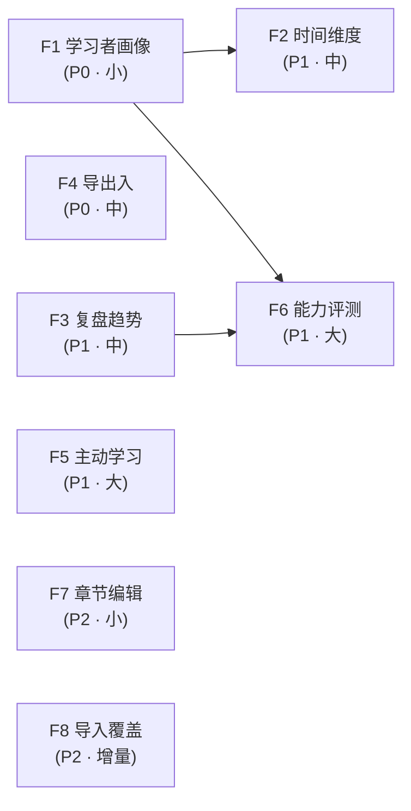

# Personal Learning OS · 下一步大 Feature 规划

> 版本：v1.0 · 2026-09-14 · 基准：`main@2a568dc`
> 依据：`docs/business-flow-end-to-end-2026-09.md`（端到端流程梳理）+ 本轮代码复核
> 口径：**只列产品级重大能力**，不含零散 task；每条给出「现状证据 → 范围 → 依赖 → Done 标准 → 规模」

---

## 零、结论先行

### 三条判断

**1. 主链路已经没有大洞了。** S1–S7（导入 → 切分 → 章节学 → 章节测 → 整本测 → 判卷报告 → 复习调度）全部闭环且数据真实回写。`Provider 装配` 与 `证据流 EvidenceEntry` 这两项在旧评审文档里标为缺口的能力，**实际已落地**（见 §1）。所以接下来的工作不是"补洞"，而是**加深与兑现**。

**2. 评测侧扎实，学习侧很薄。** 产品叫「自我学习**评测**」，但两半的成熟度严重不对称：

| | 现状 | 成熟度 |
|---|---|---|
| **评测** | 4 种卷型出卷 → 客观本地判 + 主观 AI 批改 → 逐章掌握度 → 遗忘衰减 → 间隔重复 → 报告 | ⭐⭐⭐⭐ 可对外演示 |
| **学习** | 只有：读原文 + 看 AI 要点卡 + 概念图谱 | ⭐⭐ 被动接收为主 |

用户在整个"学习"环节**没有任何主动加工动作** —— 不能划线、不能记笔记、不能提问、不能复述。这是当前最大的产品空白，而不是评测。

**3. 扩展流程「两头实、中间虚」。** E1 目标、E3 计划、E5 就绪度已接线；**E2-b 画像输入**与 **E4 AI 评测**是两个洞。另外 README 产品原则 #1 承诺的「随时导出离开」**在代码里并不存在** —— 属于必须收口的过度承诺。

### 八个候选，分三档

| 档 | Feature | 一句话 | 规模 |
|---|---|---|---|
| **P0** ✅ | F1 学习者画像 | 让系统知道"你是谁、有多少时间"，而不只是"你掌握度多少"（**已实施 2026-09-14**） | 小 |
| **P0** | F4 学习资产可携带 | 兑现"数据属于你"的承诺（导出 / 恢复） | 中 |
| **P1** | F3 学习复盘与趋势 | 把已经记下来的证据流变成可看的成长轨迹 | 中 |
| **P1** | F2 计划的时间维度 | 把"学习队列"变成"学习计划"，能回答"今天要做多少" | 中 |
| **P1** ◐ | F5 主动学习工具 | 补上"学习"这一半：提问、笔记、复述（**提问 + 费曼复述已实施 2026-09-14**；笔记 / 自测卡未做） | 大 |
| **P1** | F6 目标级能力评测 | 回答"我够格了吗"，而不只是"这章学会了吗" | 大（需先澄清定义） |
| **P2** | F7 资料结构可编辑 | 把切分控制权交给用户 + 跨文档组学习路径 | 小~中 |
| **P2** | F8 导入覆盖面 | OCR / DOCX / EPUB / URL，降低第一分钟摩擦 | 增量 |

### 建议推进顺序

```text
F1 画像  →  F7 章节编辑（快赢，1~2 天）  →  F4 导出  →  F3 复盘
                                                          ↓
                              F2 时间维度  →  F5 主动学习  →  F6 能力评测（需先出定义）
                                                          ↓
                                                     F8 导入（可随时插入）
```

理由：F1 最小且是 F2/F6 的前置；F7 引擎原语已写好，是性价比最高的"快赢"；F4 是承诺兑现，晚做一天就多欠一天；F3 数据已经在库里，只缺展示层。

---

## 一、先排除：这些**不用再做**

避免重复建设。以下能力经代码复核**已完成且真实接线**，旧文档若仍标为缺口，以本节为准：

| 能力 | 证据 | 旧文档误判 |
|---|---|---|
| **AI Provider 装配** | `stores/useSettingsStore.ts::buildActiveProvider()`，真实消费点：`ChapterGraphPage` · `QuizGradingPage` · `paper-flow.ts` · `QuizReportPage` · `NewQuizPage` · `ImportModal` | 曾标为"零调用方" |
| **证据流（append-only）** | `domain/evidence.ts::EvidenceEntry` + `StorageAdapter.appendEvidence/listEvidence/listEvidenceBySubject`；写入：`QuizReportPage` · `ReviewSession` · `ChapterReaderPage`；读取：`GoalDetailPage` · `HomePage` | 曾建议"补事件流" |
| **混合检索** | `ai/retrieval/hybrid-search.ts:63`（FTS5 + 向量 + RRF），消费点 `LibraryPage:131` · `CommandPalette:123` | — |
| **掌握度 + 遗忘 + 间隔重复** | `learner-model.ts`：平滑 `0.65/0.35`、衰减半衰期 30 天、`nextReviewAt` 到期入队 | 曾标为"断链" |
| **概念层落 SQLite** | `storage/tauri.ts::saveChunks/saveEmbeddings` + `KnowledgeUnit`/`KnowledgeRelation` 表 | — |
| **4 种卷型 + 难度自适应** | `quiz-engine.ts:175 createPaper`，band 三档 | — |

---

## 二、Feature 清单

### F1 · 学习者画像（Learner Profile）　`P0 · 小`　✅ **已实施（2026-09-14）**

> **状态**：✅ 已完成。落地记录见 `docs/learner-profile-design-2026-09.md`（§14 实施结果）+ `docs/learner-profile-task-runbook-2026-09.md`。
> 实际交付含**简历导入**（PDF / 粘贴 → `background` + 水平建议，发送前 `maskPii` 本机脱敏、原文不落库），超出本节原「手填表单」范围。
> 三处消费点全部接线：出卷难度先验 · 计划/目标「预计完成日」（并消费 `deadlineAt`，消解其零消费点债）· AI 出题与章内提问上下文块。

**一句话**：让系统知道"你是谁、每周有多少时间、偏好怎么学"，而不只知道"你掌握度多少"。

**现状证据**

- `domain/learner.ts:18-46` —— `LearnerState` 只有 `byUnit[unitId]` 掌握度，**无任何画像字段**
- `features/learner/LearnerPage.tsx:32-63` —— 纯只读视图，页头注释自述"纯视图画像"
- `engine/quiz-engine.ts:36 bandOfMastery` —— 出卷难度**只看 mastery**，新用户无历史时无从判断
- `features/plan/chapter-action.ts:102-116 estimateEtaMin` —— 硬编码 `clamp(字符/350, 5, 40)`，不知道用户每周能投多少时间

**范围**

1. `domain/learner.ts` 新增 `LearnerProfile`：
   ```ts
   interface LearnerProfile {
     level: "beginner" | "basic" | "intermediate" | "advanced"
     weeklyMinutes: number              // 每周可投入
     preferences: {
       depth: "breadth" | "depth"       // 广撒网 vs 死磕
       style: "reading" | "practice" | "quiz"
     }
     background?: string                // 自由文本，供 AI 出题时作上下文
     updatedAt: number
   }
   ```
2. `StorageAdapter` 增加 `getProfile/saveProfile`（三后端同步实现）
3. `LearnerPage` 由只读升级为「只读摘要 + 编辑表单」
4. **三个消费点**（缺一不可，否则又是一个"填了没用"的字段）：
   - **出卷难度**：`bandOfMastery` 增加 profile 兜底 —— 无 mastery 历史时按 `level` 定 band
   - **计划 ETA**：`estimateEtaMin` 引入 `weeklyMinutes`，产出"预计完成日期"而非只有分钟数
   - **排序权重**：`preferences.depth` 调整同类内排序（breadth 优先推进新章，depth 优先补弱章）

**依赖**：无（可独立开工）　**被依赖**：F2、F6

**Done 标准**

- 填写画像后，**出卷难度、计划 ETA、目标预计完成日**三处行为都随画像变化
- `npm run typecheck` 0 error；新增单测覆盖 `level → band` 映射与 ETA 公式
- 画像持久化在三个后端均生效（桌面重启后仍在）

---

### F4 · 学习资产可携带（Export / Import / Backup）　`P0 · 中`

**一句话**：兑现"数据属于你，随时可以离开"的承诺。

**现状证据**

- `README.md` 产品原则 #1：`You own the data — export and walk away whenever you want.`
- `storage/types.ts` 全量接口（60+ 方法）**没有任何导出方法**；全仓无 JSON 序列化导出入口
- → **当前是文档过度承诺，用户实际上无路可走**

**范围**

1. **全量导出**：`Documents · Chapters · Sections · Chunks · KnowledgeUnits · Relations · Embeddings · Papers · PaperDrafts · PaperResults · LearnerState · Goals · Evidence` → 单文件 JSON（带 `schemaVersion`）
2. **导入恢复**：同 schema 版本校验 + 冲突策略（覆盖 / 合并 / 跳过）
3. **范围可选**：整库 / 单目标（含其圈定章节）/ 单文档
4. **Markdown 导出**：把一章导出为 `.md`（正文 + 要点卡），供外部使用
5. Tauri 侧走原生文件对话框（`vault` 已有 IPC 模式可循）；浏览器预览用 Blob 下载兜底

**依赖**：无

**Done 标准**

- **round-trip 单测**：导出 → 清空存储 → 导入 → 所有领域对象逐字段一致
- 跨 schema 版本导入给出明确拒绝或迁移提示，不静默丢数据
- README 的产品原则与实际能力一致（不再过度承诺）

---

### F3 · 学习复盘与趋势（Progress Analytics）　`P1 · 中`

**一句话**：把已经记下来的证据流，变成用户能看到的成长轨迹。

**现状证据**

- `EvidenceEntry` 已真实写入三处（判卷 / 复习 / 标记学完），但读取只在 `GoalDetailPage` 与 `HomePage` 做**简单罗列**
- 全仓 grep `trend` / `heatmap` / `streak` / `统计` / `复盘` → **零命中**
- → 数据是"已建未用"：有矿，没有冶炼厂

**范围**

1. **学习活动热力图**：按天聚合 evidence 条数（类似 GitHub contributions）
2. **掌握度趋势曲线**：按 `PaperResult.createdAt` 时间序列画逐章掌握度
3. **目标进度时间线**：readiness 随时间变化，对照 deadline 看是否收敛
4. **弱点排行榜**：按 `misconceptions` 与低分章聚合，直接跳转去补
5. `StorageAdapter` 补聚合查询（当前只有 list all / by subject，前端全量拉取会随数据量恶化）

**依赖**：无（数据已在）　**被依赖**：F6（能力报告需要趋势数据）

**Done 标准**

- learner 页出现热力图 + 趋势曲线 + 弱点榜三块
- 空数据 / 单条数据有合理空态，不出现分不清的空白图表
- 新增聚合查询有单测；1 万条 evidence 下页面响应可接受

---

### F2 · 计划的时间维度（Time-aware Planning）　`P1 · 中`

**一句话**：把"学习队列"变成"学习计划" —— 能回答"我今天要做多少才能按时达标"。

**现状证据**

- `domain/goal.ts` 已定义 `deadlineAt`，但**全仓零消费点** —— 它不参与任何排程计算
- `features/plan/chapter-action.ts:102-116` 只算单个动作耗时，不做剩余时间摊派
- `PlanPage.tsx` 有 `NEXT_LIMIT = 41` 的"前 3 条 + UP NEXT"，但**不区分今天 / 本周 / 之后**

**范围**

1. **每日配额**：`剩余所需分钟 / 距 deadline 天数` → 今日应完成动作数（可随 `weeklyMinutes` 摊到可学习日）
2. **进度预警**：实际进度 vs 应达进度，落后时在首页与计划页显式提示（"按当前节奏，预计晚 4 天达标"）
3. **计划页分组**：今日必做 / 本周完成 / 之后，取代当前扁平的"前 3 + 其余"
4. **无 deadline 时的行为明确**：不强制配额，退回原六级优先级排序

**依赖**：F1（`weeklyMinutes` 是配额输入；无画像时用默认值）

**Done 标准**

- 设置 deadline 的目标，计划页出现"今日 N 项"与落后/超前判定
- 单测覆盖配额公式、落后判定、无 deadline 分支
- 不改变 `cls` 六级优先级的语义（时间维度是**分组**，不是重排优先级）

---

### F5 · 主动学习工具（Active Learning）　`P1 · 大`

**一句话**：补上"学习"这一半 —— 现在用户只能被动接收。

**现状证据**

- `ChapterReaderPage` 全部能力 = 读正文 + 看 AI 要点卡 + 标记学完 + 进入图谱
- 全仓无笔记 / 高亮 / 提问 / 复述 / 自测卡的任何实现
- → 产品名是「自我学习评测」，但**学习环节的主动加工能力为零**

**范围**（建议分次迭代，不要一次全做）

1. **章内提问框**（推荐先做）：基于当前章走 `hybridSearch` 检索 + `provider.chat` 回答，**答案一律锚回原文**（复用 `ai/evidence-anchor`，不许模型自造引文）
   - ✅ **2026-09-14 已落地**：`ChapterReaderPage` 右栏第 4 区「问这一章」；方案 `docs/learn-chapter-qa-design-2026-09.md`、实施 `docs/learn-chapter-qa-task-runbook-2026-09.md`、单测 `npm run test:qa`（27 项）。本章命中不足时扩到同资料其他章并逐条标注来源章；零伪造引用（锚不上即丢弃，全锚不上则 `unanchored` + 显式警示）。
2. **高亮与笔记**：划线 → 存为该章关联批注 → 复习时回看
3. **费曼输出**：用自己的话复述 → AI 对照原文给出差距反馈 → 可一键转为一道主观题进入掌握度闭环
   - ✅ **2026-09-14 已落地**：`ChapterReaderPage` 右栏第 6 区「讲给我听」；方案 `docs/learn-feynman-restatement-design-2026-09.md`、实施 `docs/learn-feynman-restatement-task-runbook-2026-09.md`、单测 `npm run test:restatement`（34 项）。三组可锚引文（讲到了 / 漏掉了 / 讲岔了），锚不上即丢弃（零伪造引用）；对照基准取**整章正文 + 章要点全量**（不走检索 —— 检索会按查询词偏置，漏掉的部分永远检索不到）。
   - ⚠️ **原文「进入掌握度闭环」已按实现现实修正**（决策 D3-A）：`quiz-engine.ts:621` 的 `if (ch.score === undefined) continue;` 决定「纯主观题不回写 mastery」，这是 V2 双证据原则的**有意设计**（不让模型波动污染掌握度）。因此复述的"闭环"落在 **证据流**（`EvidenceKind="restatement"`，delta=0）+ **显式「按这次复述安排复习」**（`applyKeyPointRating`）两环，**mastery 唯一写方仍是卷面**。原文表述与现状冲突的完整分析见方案 §3.4 G1 与决策 D3。
   - **无 AI 直接阻断**（决策 D6-B）：未配置模型时输入与提交整体禁用 + 引导去「设置 → AI 模型中心」（对齐第 4 区章内提问与概念提炼的既有约定），服务层亦在落库之前早退（零写入、零模型调用）。
4. **自测卡**：从 `keyPoints` 一键生成 flashcard，接入既有间隔重复调度

**依赖**：无（`provider.chat` 已可用，`ai/connection.ts` 已有调用先例）　**被依赖**：无

**Done 标准**

- 至少落地「章内提问 + 费曼输出」两项，且提问答案 100% 带原文锚点
- 无 AI 时给出诚实的降级提示，不伪造回答
- 不破坏既有 `Chapter` 正文切片契约（批注独立存储，不改原文）

---

### F6 · 目标级能力评测（Capability Assessment）　`P1 · 大`

**一句话**：回答"我够格了吗"，而不只是"我这章学会了吗"。

**现状证据（性质与旧判断不同）**

- `generateAssessment` / `evaluateAnswer` 在两个 provider 全抛 `not-implemented`（`openai-compatible.ts:163-175`、`builtin.ts:215-227`、`registry.ts:39-44`
- **但实际链路已经绕过这两个方法** —— 真实能力走专用管线：`generateQuizQuestionsWithAi`（改题面）、`gradeSubjectiveWithAi`（主观批改）、`extractChapterConceptsWithAi`（概念抽取）
- → 缺的**不是"接口实现"**，而是**"能力评测"这个产品概念本身没定义**

**⚠️ 需要先澄清的产品问题（未澄清前不开工）**

| 问题 | 选项 |
|---|---|
| 评测对象是什么？ | 目标的综合能力 / 单项技能 / 一个产出物（作品、方案、代码） |
| 评测形态是什么？ | 机考综合卷 / 场景任务 / 作品评审 / 面试模拟 |
| 通过标准由谁定义？ | AI 判定 / 用户自定 / 目标模板预置 |

**范围（澄清后）**

1. 定义 `CapabilityAssessment` 领域对象，与章级 `Paper` 明确区分
2. 目标模板：六类目标各携带能力项清单（如 `career` → 岗位能力矩阵）
3. 产出**能力报告**：能力项 × 达标状态 × 证据引用（引用回具体试卷与章节）
4. 顺带决策：`generateAssessment` / `evaluateAnswer` 是**实现**还是**从接口上删除**（当前是废弃契约，留着误导后来者）

**依赖**：F1（画像影响评测难度）、F3（报告需要趋势数据）

**Done 标准**

- **先产出产品定义文档并经用户确认**，再进入实施
- 能力报告的每一项都能追溯到具体证据（试卷 / 章节 / 时间），符合"证据可溯"原则

---

### F7 · 资料结构可编辑（Chapter Editing & Composition）　`P2 · 小~中`

> **实施进度（2026-09-14）**：范围 1（接线既有原语 —— 重命名 / 合并 / 拖拽排序）**已落地**，
> 见 `docs/chapter-edit-design-2026-09.md`。三个原语已迁至 `engine/chapter-edit-engine.ts`
> 并补齐了三处合并语义缺陷（中间章要点丢失 / `unitIds` 未并集 / `keyPointRefs` 脱同步），
> AI 精修的同源缺口一并修复；范围 2–4（章节拆分 / 跨文档组合 / 前置人工调整）仍待做。

**一句话**：把切分结果的控制权交给用户，并支持跨文档组学习路径。

**现状证据**（开工前）

- `engine/splitter-engine.ts` 的 `renameChapter:462` / `mergeChapters:470` / `reorderChapters:491` **已实现但零 UI 调用点**（全仓 grep 仅命中定义处）
- 用户当前对切分结果只能"重新切分"或"AI 精修"，**无法改名、无法合并、无法调序**

**范围**

1. ✅ **接线既有原语**：SplitTab 增加改名 / 合并 / 拖拽排序（2026-09-14 已落地）
2. **章节拆分**：把一章手动切两半（原语缺失，需新增）
3. **跨文档组合**：把多个文档的章节组成一个自定义学习单元 / 学习路径
4. **前置关系人工调整**：当前 `chapterPrerequisiteIds` 由概念 prerequisite 边自动抬升，不允许人工修正

**依赖**：无

**Done 标准**

- 编辑后 `Chapter.order` / `title` / `keyPoints` 正确落库
- 下游（计划排序、出卷范围、报告逐章）读取的是新结构，无脏读
- 不影响正文切片契约（`contentRef` 必须保持 `body.slice(start,end) === quote`）

---

### F8 · 导入覆盖面（Import Coverage）　`P2 · 增量`

**一句话**：降低"第一分钟"的摩擦。

**现状证据**

- `features/learn/import/pdf.ts` 仅 pdfjs 提取文本，**无 OCR** → 扫描件 / 纯图片 PDF 返回 0 字符，走进"仅保存文档不写章节"分支（`pipeline.ts:124`），用户看到"导入成功但没有章节"
- `import/` 下无 DOCX / EPUB 解析器
- 无 URL 抓取入口

**范围**（每条独立，可增量交付）

1. **0 字符检测 + 明确提示** —— 最小改动，**建议立即做**：解析结果为空时直接告诉用户"疑似扫描件，当前不支持 OCR"
2. **OCR 兜底**：Tauri 侧接本地 OCR（如系统 Vision / tesseract）
3. **DOCX 解析** → 复用既有 md 标题提升逻辑
4. **EPUB 解析**
5. **URL 抓取**（readability 类正文提取）

**依赖**：无

**Done 标准**

- 每种新格式导入后走同一套七步管线（`runUnitImport`），产出 `Document` + `Chapter[]`
- 编码嗅探、清洗、查重等既有护栏对新格式同样生效

---

## 三、依赖关系



**无前置、可立即开工**：F1 · F4 · F5 · F7 · F8
**有前置**：F2（← F1）· F6（← F1 + F3 + 产品定义澄清）

---

## 四、必须顺手修的一致性债

不属于 feature，但改到相关代码时会撞上，建议随最近一次相关改动一起清：

| # | 问题 | 位置 | 影响 |
|---|---|---|---|
| 1 | `submitAnswer` 调 `applyRating`（会改 mastery），应调 `applyKeyPointRating` | `stores/useLoopStore.ts:123` | **同一复习动作两个入口产生两种掌握度后果**，破坏"章 mastery 唯一写方 = 卷面"的双证据原则；正确参照 `ChapterReaderPage.tsx:116 markReviewed` |
| 2 | planner 两处注释互相矛盾 | `engine/learning-planner.ts:9-11` vs `:154` | 代码实为「测已学章(3) 优先于到期复习(4)」，注释写反，会误导后续改动 |
| 3 | `generateAssessment` / `evaluateAnswer` 废弃契约未清理 | `openai-compatible.ts:163-175` · `builtin.ts:215-227` · `registry.ts:39-44` | 三个 provider 都抛 `not-implemented`，但无人调用；留着让后来者以为"AI 评测只差实现" |
| 4 | README 过度承诺 | `README.md` 产品原则 #1 | 已在新版 README 保留原表述，**要么补 F4，要么改文案** |

> 第 1 条建议**立即修**：它污染掌握度数据，且修复面极小（改一个函数调用 + 一处单测）。

---

## 五、一句话总结

> **评测这条腿已经能跑了，学习那条腿还没长出来。**
> 下一步的价值不在于"再加一种题型"，而在于：让系统知道你**是谁**（F1）、让你的投入变得**可携带**（F4）、让积累的证据**看得见**（F3）、让计划带上**时间**（F2）、让你在学习时**能动手**（F5）。
> F6 是最终叙事闭环的收口，但它的定义还没澄清 —— **先把定义写出来，再谈实现**。

---

## 附：本轮复核的关键事实

- 基准 commit：`2a568dc`（含 README 重写与流程文档）
- 复核到的"已完成"项：`buildActiveProvider` 6 处消费点、`EvidenceEntry` 3 写 2 读、`hybridSearch` 2 处消费
- 复核到的"未实现"项：`LearnerProfile` 不存在、`StorageAdapter` 无导出方法、`deadlineAt` 零消费点、章节编辑原语零 UI 调用点、全仓无 trend/heatmap/streak
- 本文件为**规划文档**，未修改任何生产代码；每个 feature 实施前需按 `skills/pre-task-technical-design` 单独出技术方案
