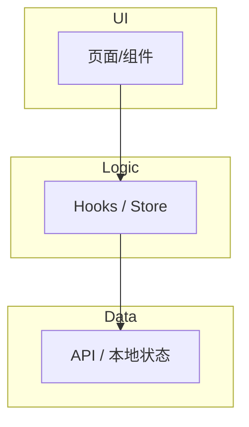
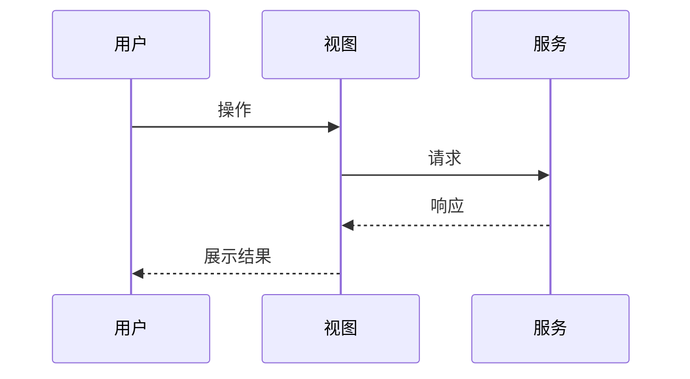

# 技术方案模板

复制以下结构到 `docs/<AREA>-<title>-design-YYYY-MM.md`（或用户指定路径，命名沿用 `docs/*-plan-*.md` 风格），将占位内容替换为本次需求的具体内容。

---

# [功能/需求名称] 技术方案

| 字段 | 内容 |
|------|------|
| 作者 | Agent / 用户名 |
| 日期 | YYYY-MM-DD |
| 状态 | 草案 / 待确认 / 已确认 / 实施中 / 已完成 |
| 关联需求 | Issue / PR / 用户描述链接 |

## 1. 背景

说明**为什么要做**这件事：

- 业务背景与用户痛点
- 触发原因（用户反馈、产品规划、技术债、合规等）
- 与现有产品/模块的关系
- 不做会有什么影响（可选）

## 2. 方案目标

| 类型 | 描述 |
|------|------|
| **主要目标** | 完成后用户/系统应达到的状态（可量化优先） |
| **非目标** | 明确本次**不做**的范围，防止范围蔓延 |
| **成功标准** | 验收条件清单（可测试、可观察） |

## 3. 项目现状

### 3.1 相关代码与模块

- 现有实现位置（路径、关键组件/服务）
- 当前行为简述
- 已知问题或技术债

### 3.2 相关文档与约定

- 已阅读的 `docs/`、设计语言、API 文档链接
- 需遵守的规范（ESLint、设计 token、路由约定等）

### 3.3 约束与依赖

- 框架/库版本、浏览器、权限、性能、兼容性
- 上游/下游系统依赖

## 4. 技术架构

### 4.1 总体架构

用文字 + 可选 Mermaid 图描述分层与模块关系：



### 4.2 模块职责

| 模块/层级 | 职责 | 技术选型 |
|-----------|------|----------|
| | | |

### 4.3 数据模型与 API

- 实体/类型定义（TypeScript 接口要点）
- API 端点、方法、请求体、响应体、错误码
- 缓存、乐观更新、分页等策略（如适用）
- **数据读写（必填，否则写 N/A 并说明）**：遵循 [rules/layer-import-boundaries.mdc](../../rules/layer-import-boundaries.mdc)
  - UI → store（`src/stores/*`）→ `src/storage` 适配层；持久化格式与迁移策略
  - 桌面能力（密钥 vault / 本地模型 llm）是否仅经 `invoke('vault_*' | 'llm_*')`
  - 纯浏览器预览（非 Tauri）下这些命令如何守卫（`isTauri`）

### 4.4 状态与副作用

- 本地 state / 全局 store / URL 参数分工
- 副作用触发时机（mount、用户操作、轮询等）

## 5. 交互流程

### 5.1 主流程

逐步编号描述（用户操作 → 系统响应 → UI 变化）：

1. …
2. …

### 5.2 分支与异常流程

| 场景 | 触发条件 | 系统行为 | UI 反馈 |
|------|----------|----------|---------|
| | | | |

### 5.3 时序图（复杂交互时必填）



## 6. 用户用例（User Cases）

每条用例使用统一编号 `UC-01`、`UC-02`…

### UC-01：[用例名称]

| 项 | 内容 |
|----|------|
| 角色 | |
| 前置条件 | |
| 主流程步骤 | 1. … 2. … |
| 期望结果 | |
| 异常/边界 | |

### UC-02：…

（按需追加）

## 7. 线框 UI（Wireframe）

### 7.1 [页面/组件名称] — 默认状态

```
┌─────────────────────────────────────┐
│  [标题]                    [操作按钮] │
├─────────────────────────────────────┤
│  [主要内容区]                        │
│                                     │
└─────────────────────────────────────┘
```

- 布局说明：栅格、间距、响应式断点
- 组件映射：对应 Ant Design / 内部组件名
- 设计 token：`--color-*`、`text-*` 等（如适用）

### 7.2 其他状态

分别描述：**加载中**、**空数据**、**错误**、**禁用** 等（ASCII 或 Mermaid + 文字说明）。

### 7.3 交互说明

- Hover / Focus / 键盘可达性
- 弹层、抽屉、Toast 触发条件

## 8. 涉及文件及改动伪代码

> 列出**每一个**将新增或修改的文件。伪代码需体现签名、核心逻辑与边界处理。

### 8.1 `path/to/FileA.tsx`（修改）

**改动说明**：…

```tsx
// 伪代码 — 仅表达意图，非最终提交代码
export function FileA({ prop }: Props) {
  // 新增：从 hook 获取数据
  const { data, loading, error } = useXxx();

  if (loading) return <Skeleton />;
  if (error) return <ErrorState onRetry={refetch} />;

  return (
    <div data-testid="file-a-root">
      {/* 核心渲染逻辑 */}
    </div>
  );
}
```

### 8.2 `path/to/fileB.ts`（新增）

**改动说明**：…

```ts
// 伪代码
export async function fetchXxx(params: Params): Promise<Result> {
  // 请求构造、错误映射
}
```

（按文件继续 8.3、8.4…）

## 9. 任务清单（Tasks）

与 runbook 任务 ID 对齐（`T1`、`T2`…）。

| ID | 任务 | 依赖 | 预估复杂度 |
|----|------|------|------------|
| T1 | | | S/M/L |
| T2 | | | |

## 10. 实施步骤

按**推荐执行顺序**编号（可与第 9 节任务合并叙述）：

1. **步骤 1**：…（对应 T1）
   - 输入/输出
   - 验证方式
2. **步骤 2**：…
3. …

**回滚策略**（如适用）：如何安全撤销或 feature flag。

## 11. 测试方案

### 11.1 测试范围与策略

| 层级 | 工具/方式 | 覆盖重点 | 不负责 |
|------|-----------|----------|--------|
| 单元 | `tests/*.test.ts`（node --experimental-strip-types 直跑，`npm run test:*`） | | |
| 集成 | | | |
| E2E | Playwright… | | |
| 手工 | | | |

### 11.2 测试环境与数据

- 所需 mock、fixture、测试账号
- CI 是否纳入、命令示例

### 11.3 通过标准

- 何种结果视为可合并/可交付

## 12. 测试用例

与第 6 节用例编号对应。格式统一 `TC-UC01-01`（用例-子项）。

| ID | 关联 UC | 步骤 | 输入/操作 | 期望结果 | 类型 |
|----|---------|------|-----------|----------|------|
| TC-UC01-01 | UC-01 | 1. … | | | E2E |
| TC-UC01-02 | UC-01 | … | | | 单元 |

### 12.1 边界与回归

| ID | 场景 | 期望 |
|----|------|------|
| TC-EDGE-01 | | |

---

## 变更记录

| 日期 | 变更 | 作者 |
|------|------|------|
| | 初稿 | |
